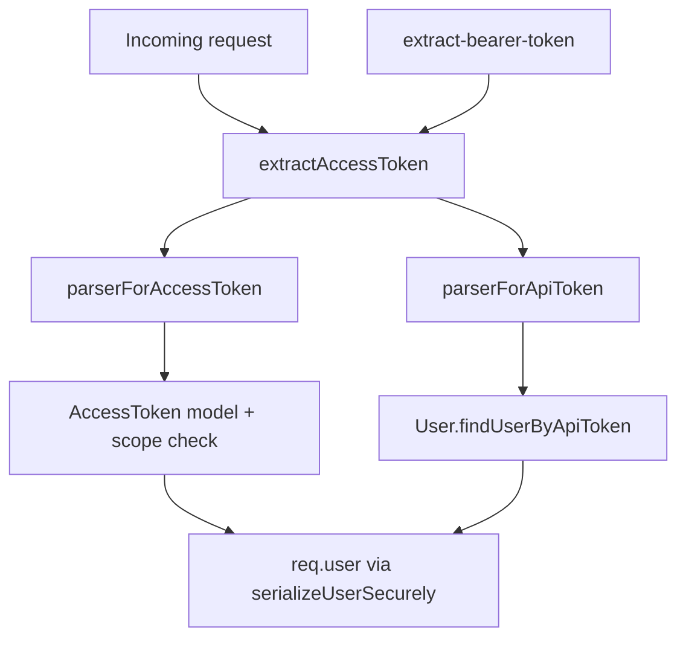

# Design Document

## Overview

**Purpose**: Add `X-GROWI-ACCESS-TOKEN` as a request-header source for API authentication,
so callers whose `Authorization` header is already consumed (e.g. Basic auth on a reverse
proxy) can authenticate without exposing the token in a URL query string.

**Users**: GROWI REST API consumers (apiv1 / apiv3), and API-spec readers who rely on the
generated OpenAPI security schemes.

**Impact**: Extends the existing `access-token-parser` middleware. The header becomes an
additional token source positioned directly after the `Authorization` Bearer token and
before the `access_token` query/body parameters, for both the scope-based access-token
path and the legacy api-token path. Token validation, scope checks, and read-only checks
are unchanged and remain source-agnostic. This spec also establishes the cc-sdd
maintenance baseline for the middleware.

### Goals
- Accept the access token from the `X-GROWI-ACCESS-TOKEN` header on both parser paths.
- Guarantee a single, consistent token-source precedence across both parsers.
- Advertise the new method in the apiv1 and apiv3 OpenAPI definitions.
- Leave all existing token sources and authorization behavior unchanged.

### Non-Goals
- Changing the scope model, the `AccessToken` storage model, or the legacy api-token
  mechanism.
- Removing or deprecating the Bearer, query, or body token sources.
- Client/SDK changes or docs-site updates beyond the in-repo OpenAPI definitions.
- Adding configuration or a feature flag to toggle the header (out of requirements scope).

## Boundary Commitments

### This Spec Owns
- The token-source resolution order used by the access-token-parser middleware, including
  the new `X-GROWI-ACCESS-TOKEN` header position (`Bearer ?? header ?? query ?? body`).
- The canonical header-name constant `X_GROWI_ACCESS_TOKEN_HEADER_NAME`.
- The `accessTokenHeaderAuth` OpenAPI security-scheme declaration and its application to
  every apiv3 route that already advertises `bearer` + `accessTokenInQuery`.

### Out of Boundary
- Token validity, scope sufficiency, and read-only enforcement — owned by the `AccessToken`
  model and `SCOPE` definitions in `@growi/core`; reused unchanged.
- Downstream per-route authorization (rejecting unauthenticated requests).
- Bearer extraction semantics (`extract-bearer-token.ts`) — unchanged.

### Allowed Dependencies
- `@growi/core/dist/interfaces/server` (`AccessTokenParserReq`), `AccessToken` model,
  `serializeUserSecurely`, the existing `extractBearerToken` helper.
- Express request typing for header/query/body access.

### Revalidation Triggers
- A change to the token-source precedence order.
- A rename or value change of `X_GROWI_ACCESS_TOKEN_HEADER_NAME`.
- A change to the `extractAccessToken` return contract (`string | null`).
- Adding/removing an `accessTokenInQuery` route without mirroring `accessTokenHeaderAuth`.

## Architecture

### Existing Architecture Analysis

The middleware (`apps/app/src/server/middlewares/access-token-parser/`) is an Express
adapter with two parser functions orchestrated by `index.ts`:

- `parserForAccessToken(scopes)` — scope-checked lookup via `AccessToken.findUserIdByToken`.
- `parserForApiToken` — legacy `User.apiToken` lookup, run only when `opts.acceptLegacy`.

Both currently duplicate the same token-source chain:
`extractBearerToken(req.headers.authorization) ?? req.query.access_token ?? req.body.access_token`,
followed by an identical `typeof !== 'string'` guard. This duplication is the seam where
the two paths could drift — directly relevant to requirement 3 (consistent precedence).

**Precedent**: `apps/app/src/server/service/g2g-transfer.ts` defines
`export const X_GROWI_TRANSFER_KEY_HEADER_NAME = 'x-growi-transfer-key'` (a TS constant)
while the OpenAPI `.js` definitions hardcode the literal. This design follows the same
split.

### Architecture Pattern & Boundary Map

Pure-function extraction (per coding-style): the duplicated token-source chain is lifted
into a single `extractAccessToken` helper that both parsers call. This makes the precedence
the single source of truth and removes the drift risk.



**Key decisions**:
- `extractAccessToken` owns the precedence `Bearer ?? header ?? query ?? body` and the
  string-type guard; both parsers depend on it (dependency direction:
  `extract-bearer-token` → `extract-access-token` → parsers → `index`).
- Header name lives in a TS constant used by the parser side; OpenAPI `.js` files keep the
  literal `x-growi-access-token`, consistent with the g2g precedent.

### Technology Stack

| Layer | Choice / Version | Role in Feature | Notes |
|-------|------------------|-----------------|-------|
| Backend / Services | Express (existing) | Header/query/body access via `AccessTokenParserReq` | Header keys are lowercased by Express → case-insensitive (1.3) |
| API spec | swagger-jsdoc OpenAPI defs (existing `bin/openapi/*.js`) | Declare + apply `accessTokenHeaderAuth` | Literal header name, no new deps |

No new runtime dependencies.

## File Structure Plan

### Directory Structure
```
apps/app/src/server/middlewares/access-token-parser/
├── extract-access-token.ts        # NEW: X_GROWI_ACCESS_TOKEN_HEADER_NAME + extractAccessToken()
├── extract-access-token.spec.ts   # NEW: unit tests for precedence + guard
├── extract-bearer-token.ts        # unchanged
├── access-token.ts                # MODIFIED: use extractAccessToken()
├── api-token.ts                   # MODIFIED: use extractAccessToken()
├── access-token.integ.ts          # MODIFIED: + header-path test (1.x)
├── api-token.integ.ts             # MODIFIED: + header-path test (2.1)
└── index.ts                       # unchanged
```

### Modified Files
- `apps/app/src/server/middlewares/access-token-parser/access-token.ts` — replace the
  inline token chain with `extractAccessToken(req)`.
- `apps/app/src/server/middlewares/access-token-parser/api-token.ts` — same replacement.
- `apps/app/src/server/middlewares/access-token-parser/access-token.integ.ts` — add a
  header-path success test (salvaged from PR #10443).
- `apps/app/src/server/middlewares/access-token-parser/api-token.integ.ts` — add a
  header-path success test (salvaged from PR #10443).
- `apps/app/bin/openapi/definition-apiv1.js` — add `accessTokenHeaderAuth` to
  `components.securitySchemes` and to the top-level `security` array.
- `apps/app/bin/openapi/definition-apiv3.js` — same as apiv1.
- The 8 apiv3 route files carrying `accessTokenInQuery` — add `- accessTokenHeaderAuth: []`
  after every `- accessTokenInQuery: []` block (25 sites total). Authoritative set:
  `activity.ts` (1), `user-activities.ts` (1), `bookmark-folder.ts` (6), `import.ts` (4),
  `in-app-notification.ts` (4), `page-listing.ts` (4), `g2g-transfer.ts` (2),
  `app-settings/index.ts` (3). **Drift note**: PR #10443 targeted `app-settings.js`
  (now `app-settings/index.ts`) and omitted `user-activities.ts`; do not apply the PR's
  route hunks verbatim — drive edits off the current-master `accessTokenInQuery` sites.

## Components and Interfaces

| Component | Layer | Intent | Req Coverage | Key Dependencies | Contracts |
|-----------|-------|--------|--------------|------------------|-----------|
| `extractAccessToken` | middleware/util | Resolve token from all sources by precedence | 1.1–1.3, 2.1, 3.1–3.4 | `extractBearerToken` (P0) | Service |
| `parserForAccessToken` | middleware | Scoped access-token auth | 1.1, 1.2, 4.1–4.3 | `extractAccessToken` (P0), `AccessToken` (P0) | Service |
| `parserForApiToken` | middleware | Legacy api-token auth | 2.1, 2.2, 4.1 | `extractAccessToken` (P0), `User` (P0) | Service |
| OpenAPI definitions | api-spec | Advertise header auth method | 5.1–5.3 | swagger-jsdoc (P1) | API |

### Middleware

#### extractAccessToken

| Field | Detail |
|-------|--------|
| Intent | Single source of truth for token-source precedence and the string guard |
| Requirements | 1.1, 1.2, 1.3, 2.1, 3.1, 3.2, 3.3, 3.4 |

**Responsibilities & Constraints**
- Resolve the token in order: Bearer → `X-GROWI-ACCESS-TOKEN` header → `access_token`
  query → `access_token` body.
- Return the resolved token only when it is a single string; otherwise return `null`
  (covers array-valued or absent header — 3.4).
- Does not validate the token; resolution only.

**Dependencies**
- Outbound: `extractBearerToken` — Bearer parsing (P0).

**Contracts**: Service [x]

##### Service Interface
```typescript
export const X_GROWI_ACCESS_TOKEN_HEADER_NAME = 'x-growi-access-token';

export const extractAccessToken = (req: AccessTokenParserReq): string | null;
```
- Preconditions: `req` is an Express request (`AccessTokenParserReq`).
- Postconditions: returns a non-empty-or-empty string token, or `null` when no
  string-typed source is present.
- Invariants: precedence order is `Bearer ?? header ?? query ?? body`; Bearer always wins
  when present (3.1).

#### parserForAccessToken / parserForApiToken (modified)

| Field | Detail |
|-------|--------|
| Intent | Reuse `extractAccessToken`; keep validation/authorization unchanged |
| Requirements | 1.1, 1.2, 2.1, 2.2, 4.1, 4.2, 4.3 |

**Responsibilities & Constraints**
- Replace the inline `bearer ?? query ?? body` + `typeof` guard with
  `const accessToken = extractAccessToken(req); if (accessToken == null) return;`.
- All downstream behavior (scope check, read-only rejection, `serializeUserSecurely`,
  legacy `acceptLegacy` gating in `index.ts`) is unchanged → satisfies 4.1–4.3 and 2.2 by
  reuse, and 3.3 (non-regression) because the resolved value for header-absent requests is
  identical to today.

**Contracts**: Service [x] (signatures unchanged: `(req, res) => Promise<void>`)

### API Spec

#### OpenAPI security scheme

**Contracts**: API [x]

| Field | Value |
|-------|-------|
| Scheme name | `accessTokenHeaderAuth` |
| `type` | `apiKey` |
| `in` | `header` |
| `name` | `x-growi-access-token` |

- Declared in `components.securitySchemes` of both `definition-apiv1.js` and
  `definition-apiv3.js`, added to the top-level `security` array (5.1).
- Applied per-route as `- accessTokenHeaderAuth: []` alongside existing `bearer` and
  `accessTokenInQuery` entries; existing schemes retained (5.2, 5.3).

## Requirements Traceability

| Requirement | Summary | Components | Interfaces | Flows |
|-------------|---------|------------|------------|-------|
| 1.1 | Header auth, scoped path, no Bearer | extractAccessToken, parserForAccessToken | `extractAccessToken` | Extract→AT |
| 1.2 | Header token with sufficient scope authenticates | parserForAccessToken | scope check (reused) | AT→Model |
| 1.3 | Header name case-insensitive | extractAccessToken | Express lowercased key | — |
| 2.1 | Header auth, legacy path, no Bearer | extractAccessToken, parserForApiToken | `extractAccessToken` | Extract→APIT |
| 2.2 | Legacy header ignored when acceptLegacy off | index.ts gating (reused) | `accessTokenParser` opts | — |
| 3.1 | Bearer wins over header | extractAccessToken | precedence invariant | — |
| 3.2 | Header wins over query/body | extractAccessToken | precedence invariant | — |
| 3.3 | No header → unchanged resolution | extractAccessToken, both parsers | precedence invariant | — |
| 3.4 | Non-string header ignored | extractAccessToken | string guard | — |
| 4.1 | Invalid header token → unauthenticated | parserForAccessToken, parserForApiToken | validation (reused) | — |
| 4.2 | Insufficient scope → unauthenticated | parserForAccessToken | scope check (reused) | — |
| 4.3 | Read-only user → unauthenticated | parserForAccessToken | readOnly check (reused) | — |
| 5.1 | Declare accessTokenHeaderAuth scheme | OpenAPI definitions | API contract | — |
| 5.2 | Apply scheme to advertising routes | route security blocks | API contract | — |
| 5.3 | Retain existing schemes | OpenAPI definitions | API contract | — |

## Error Handling

The middleware does not throw on authentication failure: when no valid token resolves, it
leaves `req.user` unset and calls `next()`, delegating rejection to downstream route
authorization (existing behavior, preserved for the header source — 4.1). `extractAccessToken`
never throws; non-string sources resolve to `null` (3.4). Token-source values continue to
be logged only as truncated prefixes/suffixes (existing `api-token.ts` behavior) — the raw
header value must not be logged.

## Testing Strategy

### Unit Tests (`extract-access-token.spec.ts`, new)
- Returns Bearer token when both Bearer and `x-growi-access-token` header are present (3.1).
- Returns header token when no Bearer but header + query are present (3.2).
- Returns query/body token (in order) when no Bearer and no header present (3.3).
- Returns `null` when `x-growi-access-token` is an array / non-string (3.4).
- Resolves header regardless of letter casing of the key (1.3).

### Integration Tests (salvaged + extended)
- `access-token.integ.ts`: valid scoped token in `x-growi-access-token` header with a
  satisfying scope authenticates the owner (1.1, 1.2).
- `api-token.integ.ts`: valid legacy api-token in `x-growi-access-token` header
  authenticates the owner (2.1).
- (Reused coverage) existing invalid-token / insufficient-scope / read-only tests confirm
  4.1–4.3 still hold via the shared resolution path.

### OpenAPI Verification
- Regenerate apiv1/apiv3 specs and confirm `accessTokenHeaderAuth` appears in
  `securitySchemes` and on each previously `accessTokenInQuery`-advertising route; added
  `accessTokenHeaderAuth: []` line count equals the `accessTokenInQuery` count (25).

## Security Considerations

- The header source is held to the **same** validation as all other sources (4.1–4.3); it
  introduces no new bypass — the only change is *where* the token string is read from.
- Motivation is to avoid tokens in URLs/query strings (information exposure via query
  strings); the header method does not appear in URLs, logs-by-default, or referrers.
- The raw token from the header must never be logged in full (mirror existing truncation).
