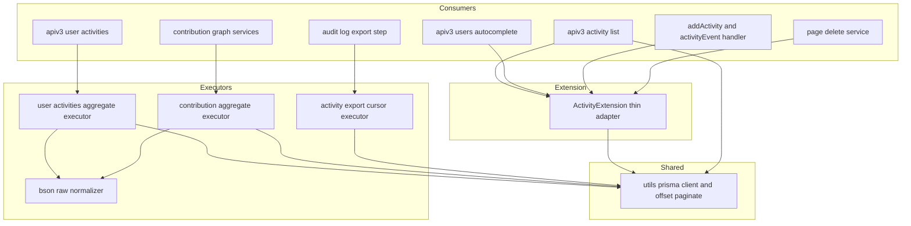
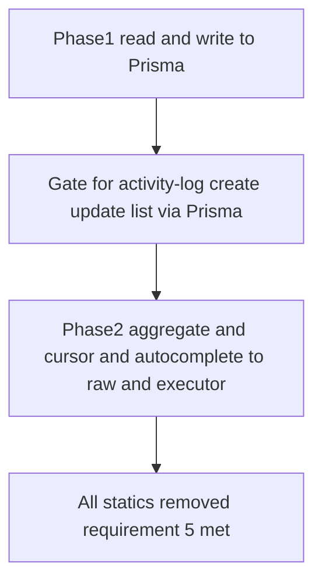
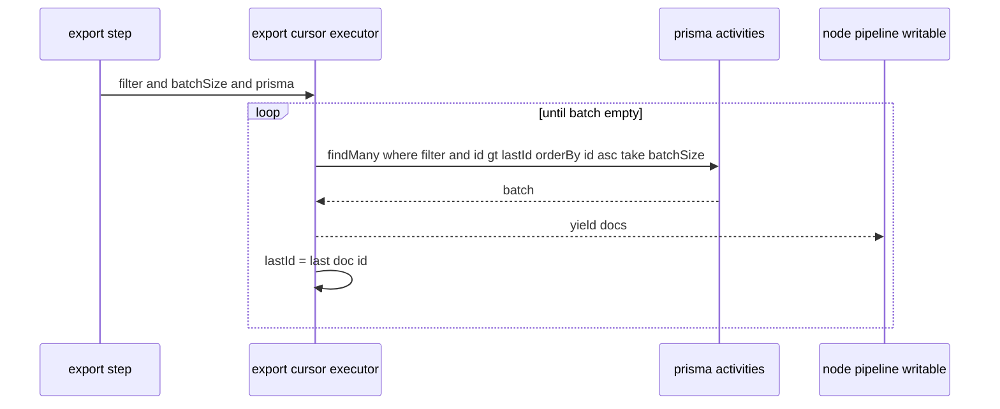

# 技術設計書: activities-prisma-migration（Activity の Mongoose→Prisma 移行）

## Overview

本機能は GROWI の Activity（Mongoose モデル `apps/app/src/server/models/activity.ts`、collection `activities`）を Prisma 拡張へ移行する。GROWI は Mongoose→Prisma を1モデルずつ漸進移行しており（comments / users / external-account 済み）、本スペックはその一環。**挙動を変えない純粋な移行**に徹し、監査ログの記録・参照・集計・エクスポート・保持を移行前後で同一に保つ。

**対象利用者**: activity log を保守する GROWI 開発者と、本移行を前提条件（ハードブロッカー）とする後続スペック `activity-log` の実装者。監査ログを使う管理者には挙動変化を見せない。

**Impact**: Activity だけが Mongoose のまま残り、他の移行済みモデルと書き方が混在している状態を解消する。`models/activity.ts` の Mongoose statics を Prisma 拡張へ置き換え、15+ の消費者を Prisma 経由に切り替える。

### Goals
- Activity の永続アクセス（記録・参照・集計・エクスポート・保持）を Prisma 経由へ移行する（要件 1〜4）。
- 移行前後で観察可能な挙動・API レスポンス shape を後方互換に保つ（要件 5.3・5.4）。
- 後続 `activity-log` の着手ゲート（記録・更新・一覧が Prisma 経由）を最短で満たす（要件 5.1・5.5）。

### Non-Goals
- `activity-log` の機能（snapshot 判別可能ユニオン型・添付削除ログ）。本移行は機能を増やさない。
- Mongoose schema 本体・collection／index 作成の仕組みの撤去（全モデル移行完了まで残す）。
- `prisma db push` の導入。
- フロントエンドの変更。

## Boundary Commitments

### This Spec Owns
- `models/activity.ts` の Mongoose statics（`createByParameters` / `updateByParameters` / `findSnapshotUsernamesByUsernameRegexWithTotalCount`）の Prisma 拡張（`ActivityExtension`）への置換と、`utils/prisma.ts` への `.$extends(ActivityExtension)` 追加。（`getActionUsersFromActivities` は static 実装が無く移植不要。）
- Activity を読む全消費者（一覧 paginate・集計 aggregate×2・CSV cursor・各 find/create/update）の Prisma 経由への移行。
- 難所（集計・cursor バッチング）を **pipeline／work-set を引数で受ける pure executor** として分離（確定2：Option C 構造）。
- **共有 `utils/prisma` の `paginate` 入力を offset に一本化**（確定1）。これに伴う **external-account の1呼び出し箇所（`page→offset`）の変換**を含む。
- schema.prisma の `activities.user` リレーションへの `onDelete: NoAction, onUpdate: NoAction` 明示（mongoose-to-prisma スキル準拠）。

### Out of Boundary
- `activity-log` の機能追加（snapshot 型・添付ログ・`ActivitiesSnapshot` への添付フィールド追加・`SupportedTargetModel` への `Attachment` 追加）。
- Mongoose schema 本体の削除、`createTtlIndex`／`createIndexes` による index・TTL 作成の仕組みの撤去（据え置き。要件 4-3）。
- `prisma db push` 化、複合 unique index `@@unique([userId, target, action, createdAt])` の定義変更。
- `findSnapshotUsernames` の regex エスケープ挙動の変更（現状の生 `q` を維持。改善は別変更）。

### Allowed Dependencies
- `~/utils/prisma` の `prisma` クライアントと `createPrisma()` の拡張チェーン、`paginate` ヘルパ（offset 化後）。
- 既存移行パターン: `models/external-account.ts`（.ts モデルの拡張同居）、`features/comment/server`、`utils/prisma.ts`（`_id`/`__v` computed、全 update での `__v` increment）。
- introspect 済み `schema.prisma` の `model activities` / `type ActivitiesSnapshot`（本スペックではフィールド追加しない）。

### Revalidation Triggers
- `ActivityExtension` の公開メソッドのシグネチャ変更。
- `utils/prisma` の `paginate` 入力／出力 shape の変更（external-account・全 paginate 消費者・後続移行に波及）。
- `updateByParameters` 相当の戻り値 shape 変更（下流 event 消費者 pre-notify / in-app-notification に波及）。
- 後続 `activity-log`：本移行完了後に Prisma 上で snapshot 型・添付ログを載せる（完了ゲート＝記録・更新・一覧が Prisma 経由）。

## Architecture

### Existing Architecture Analysis
- Activity は `models/activity.ts` の Mongoose statics（`createByParameters`/`updateByParameters`/`findSnapshotUsernames...`）＋ `mongoose-paginate-v2`（`paginate`）＋ 集計（`aggregate`）＋ ストリーム（`find().cursor()`）＋ TTL/index（`createTtlIndex`）で構成。
- 記録の主経路は `addActivity` middleware の作成 → `activityEvent.on('update')` ハンドラの `updateByParameters` による確定。`createActivity`（GET 用）も `createByParameters` を呼ぶ。
- 既存移行パターン（external-account）: `.ts` モデルの末尾に `Prisma.defineExtension` を同居させ、`model: { <collection>: { ...methods } }` と `result: { <collection>: { _id, __v } }` を定義。`utils/prisma.ts` で `.$extends` する。Mongoose schema は index/collection 登録のため残す。
- `apiv3/user-activities.ts` は `aggregate`（`$facet`＋`$lookup`＋`$project`）で **offset セマンティクスのページネーションを自前計算**（`page = floor(offset/limit)+1`）。`apiv3/activity.ts` は `mongoose-paginate-v2` の `paginate(query,{offset,limit,sort,populate})`。
- CSV エクスポート（`exportAuditLogsToFsAsync.ts`）は `find().sort({_id:1}).cursor()` を Node `pipeline` で Writable に流し、`_id` ベースで resume（一定メモリ）。

### Architecture Pattern & Boundary Map



**Architecture Integration**:
- 選択パターン: 拡張は**薄いアダプタ**（external-account パターン準拠）、難所は **pure executor に分離**（確定2＝Option C）。集計は `aggregateRaw`（既存 pipeline 流用）、cursor は Prisma `cursor`+`take` バッチングを async generator 化（確定3）。
- 責務分離: 「Mongoose statics 相当の単純 CRUD」＝拡張、「複雑な集計・ストリーム」＝外部 executor。executor は pipeline／フィルタを**引数で受け取り**自前でデータセットを持たない（coding-style の executor 原則）。
- 既存パターン維持: `activityEvent` の emit/on フロー、`shoudUpdateActivity` ゲート、TTL/index 作成（Mongoose）を変えない。
- 採番方針: `_id` は ObjectId 保持（`@db.ObjectId @default(auto())`）。`_id` 昇順 resume・timestamp 抽出・明示 `_id` 指定が移行後も成立。

### Dependency Direction
`utils/prisma（共有クライアント・paginate）` → `ActivityExtension／executor（service・features 配下）` → `consumers（routes・middleware・page service・export step・contribution services）`。consumers は拡張／executor 経由でのみ activities にアクセスし、`models/activity.ts` の Mongoose statics には依存しない（完了時、要件 5.1）。

### Technology Stack

| Layer | Choice / Version | Role | Notes |
|-------|------------------|------|-------|
| Data / ORM | Prisma（`prisma-client`, MongoDB, ESM 出力） | activities の永続アクセス | 拡張 `Prisma.defineExtension`。`_id`/`__v` は computed |
| 集計 | Prisma `aggregateRaw`（既存 pipeline 流用） | `$facet`/`$lookup`/`$dateTrunc` 集計 | `groupBy` 不可のため raw。戻り BSON を正規化 |
| ストリーム | Prisma `cursor`+`take` バッチング | CSV エクスポートの逐次取得 | async generator → Node `pipeline`。一定メモリ・`_id` resume |
| ページネーション | `utils/prisma` `paginate`（**offset 入力**） | 一覧取得 | 入力 offset 一本化、出力は page 系フィールド保持 |

## File Structure Plan

実装は **フェーズ B**（読み書き先行 → 難所）で段階化する（確定2）。各ファイルの所属フェーズを併記する。

### Modified Files
- `apps/app/src/server/models/activity.ts` — 末尾に `ActivityExtension`（`Prisma.defineExtension`）を追加。`model.activities`: `createByParameters` / `updateByParameters` / `findSnapshotUsernamesByUsernameRegexWithTotalCount`（`getActionUsersFromActivities` は static 実装が無く移植不要）。`result.activities`: `_id` / `__v` alias。Mongoose schema 本体・`createByParameters` 等 statics は**フェーズ2完了時に撤去**（それまで併存）。`export default` の撤去も全消費者移行後。【フェーズ1で拡張追加・フェーズ2で statics 撤去】
- `apps/app/src/utils/prisma.ts` — (1) `paginate` の入力を **offset 一本化**（`skip = offset`）。**出力は mongoose-paginate-v2 互換**にする：`offset` フィールドを必ず含め、`page = Math.ceil((offset+1)/limit)`・`pagingCounter = (page-1)*limit + 1`・`hasPrevPage/prevPage` は「`page===1 && offset!==0` のとき `hasPrevPage=true, prevPage=1`」という mongoose-paginate-v2 の分岐を再現する。`utils/prisma.ts` 内の `PaginateResult<T>` interface を `apps/app/src/interfaces/mongoose-utils.ts` の shape（`offset: number` を含む）に揃える。(2) `.$extends(ActivityExtension)` を追加。【フェーズ1】
- `apps/app/src/server/models/external-account.ts` ＋ `apps/app/src/server/routes/apiv3/users.js`(external-accounts ルート) — paginate offset 化に追随し `findAllWithPagination` を `offset` 受けに変更（呼び出し側で `offset=(page-1)*limit`）。挙動・出力不変。【フェーズ1：共有ヘルパ変更の一部】
- `apps/app/src/server/routes/apiv3/activity.ts` — `Activity.paginate(query,{offset,limit,sort,populate})` を `prisma.activities.paginate({where,orderBy,offset,limit,include:{user:true}})` へ。where の `$in`→`{in}`・composite filter 変換、`populate:'user'`→`include`＋`userId→user` remap。【フェーズ1】
- `apps/app/src/server/service/activity.ts` — `createActivity`（`createByParameters`）と `activityEvent.on('update')`（`updateByParameters`）を拡張メソッド経由へ。`createTtlIndex`（`createIndexes`＋raw collection）は据え置き（Mongoose import 継続、要件 4-3）。【フェーズ1】
- `apps/app/src/server/middlewares/add-activity.ts` — `Activity.createByParameters` を拡張経由へ。【フェーズ1】
- `apps/app/src/server/service/page/index.ts` — `Activity.createByParameters`（page delete 時の記録）を拡張経由へ。`user`/`target` のオブジェクト→ID 正規化の所在を確定（Key Decision 4）。【フェーズ1】
- `apps/app/src/server/service/activity/update-activity-logic.ts` — `findOne({...}).sort()` を `findFirst({where,orderBy})`（`$ne`→`{not}`、`$in`→`{in}`）へ。【フェーズ1】
- `apps/app/src/server/routes/apiv3/user-activities.ts` — `Activity.aggregate(pipeline)` を集計 executor 呼び出しへ置換。【フェーズ2】
- `apps/app/src/features/contribution-graph/server/services/activity-aggregation-service.ts` ＋ `contribution-migration-service.ts` — `aggregate` を集計 executor へ、`findById().select()` を `findUnique({select})` へ。【フェーズ2／クリーン分は1】
- `apps/app/src/features/audit-log-bulk-export/server/service/audit-log-bulk-export-job-cron/steps/exportAuditLogsToFsAsync.ts` — `find().cursor()` を cursor executor（async generator）＋ `exists`→`count>0`/`findFirst` へ。【フェーズ2】
- `apps/app/src/server/routes/apiv3/users.js`(autocomplete) — `findSnapshotUsernamesByUsernameRegexWithTotalCount` を拡張メソッド（`aggregateRaw`）経由へ。【フェーズ2】

### New Files（Option C：pure executor を分離）
- `apps/app/src/server/util/prisma-raw-normalize.ts` — `aggregateRaw` 戻り値の BSON 拡張 JSON（`$oid`/`$date`）を `string`/`Date` へ正規化する pure util ＋ co-located spec。【フェーズ2】
- `apps/app/src/server/service/activity/aggregate-user-activities.ts` — user-activities の `$facet`/`$lookup` pipeline を引数で受け、`aggregateRaw`→正規化して `{docs,totalCount}` を返す pure executor ＋ spec。【フェーズ2】
- `apps/app/src/features/contribution-graph/server/services/aggregate-contributions.ts` — `$dateTrunc` 日次集計 pipeline を受ける pure executor ＋ spec（または既存 service 内に分離関数として）。【フェーズ2】
- `apps/app/src/features/audit-log-bulk-export/server/service/audit-log-bulk-export-job-cron/steps/activity-export-cursor.ts` — フィルタ＋batchSize＋prisma を受け、`_id` 昇順で `cursor`+`take` バッチを yield する `AsyncIterable<activities>` ＋ spec。`exportAuditLogsToFsAsync` が `Readable.from(...)` で既存 `pipeline` に接続。【フェーズ2】

> executor はいずれも pipeline／フィルタ／batchSize を**引数で受け取る**。データセット（具体的な action 集合や pipeline 定義）は呼び出し側が渡し、executor は機構だけを担う。

## System Flows

### 移行フェーズ（確定2＝Option B 順序）



- **フェーズ1**: `createByParameters`/`updateByParameters`/`findById`/`findOne`(update-logic)/`paginate`(一覧)＋ paginate offset 化＋拡張チェーン。完了で **`activity-log` のハードブロッカー解除ゲート**（記録・更新・一覧が Prisma 経由、要件 5.1・5.5）を満たす。
- **フェーズ2**: 集計×2・CSV cursor・autocomplete を executor／`aggregateRaw` へ。完了で `models/activity.ts` の全 static を撤去し要件 5 を完成。
- フェーズ間は「一覧は Prisma・集計は Mongoose」の併存を許容（schema は残置のため両立可能）。

### CSV エクスポートの cursor バッチング（確定3）



`_id` 昇順・`id > lastId` resume は ObjectId 保持で現状と同一。一定メモリを維持し既存 `pipeline(writable)` にそのまま接続。`lastExportedId` の resume セマンティクスを保つ。

## Requirements Traceability

| Requirement | Summary | Components | Flows |
|-------------|---------|------------|-------|
| 1.1 | 記録フィールド同一 | ActivityExtension.createByParameters | フェーズ1 |
| 1.2 | 確定時の更新（記録可否判定） | ActivityExtension.updateByParameters + activityEvent handler | フェーズ1 |
| 1.3 | 対象外はスキップ | activityEvent handler（shoudUpdateActivity 不変） | フェーズ1 |
| 1.4 | 全 action 種別を同判定で記録 | ActivityExtension + 既存 action 定数 | フェーズ1 |
| 2.1 | 一覧のページネーション同一 | apiv3/activity.ts + utils/prisma paginate(offset) | フェーズ1 |
| 2.2 | フィルタ結果同一 | apiv3/activity.ts where 変換 | フェーズ1 |
| 2.3 | レスポンス shape 後方互換 | paginate 出力 page 系保持 + user remap | フェーズ1 |
| 3.1 | 貢献度集計同一 | aggregate-contributions executor | フェーズ2 |
| 3.2 | ユーザー別集計同一 | aggregate-user-activities executor | フェーズ2 |
| 3.3 | バルクエクスポート同一 | activity-export-cursor executor | フェーズ2 |
| 3.4 | ユーザー名補完同一 | ActivityExtension.findSnapshotUsernames... | フェーズ2 |
| 4.1 | TTL 自動削除維持 | createTtlIndex 据え置き | 不変 |
| 4.2 | 複合一意制約維持 | schema.prisma @@unique 不変 | 不変 |
| 4.3 | index 作成の仕組み維持 | Mongoose schema 残置 | 不変 |
| 5.1 | 完了時 Prisma 経由・statics 非依存 | 全消費者移行 + statics 撤去 | フェーズ2末 |
| 5.2 | 破壊的データ移行不要 | ObjectId 保持・additive | 不変 |
| 5.3 | 観察可能挙動不変 | 全コンポーネント（回帰検証） | 全 |
| 5.4 | フロント無変更 | レスポンス shape 保持 | 全 |
| 5.5 | 完了ゲート確認可能 | grep 確認手段 | フェーズ1末 |

## Components and Interfaces

| Component | Layer | Intent | Req | Phase |
|-----------|-------|--------|-----|-------|
| ActivityExtension | Data/拡張 | statics 相当を Prisma 拡張で提供（薄いアダプタ） | 1.1,1.2,1.4,3.4,5.1 | 1/2 |
| offset paginate | Shared | 共有 paginate を offset 入力に統一 | 2.1,2.3 | 1 |
| aggregate-user-activities | Service/executor | $facet/$lookup を aggregateRaw で実行・正規化 | 3.2 | 2 |
| aggregate-contributions | Feature/executor | $dateTrunc 日次集計を aggregateRaw で実行 | 3.1 | 2 |
| activity-export-cursor | Feature/executor | _id バッチングの AsyncIterable | 3.3 | 2 |
| prisma-raw-normalize | Util | aggregateRaw 戻りの BSON 正規化 | 3.1,3.2 | 2 |

### Data / 拡張

#### ActivityExtension（`models/activity.ts` 同居）
**Responsibilities & Constraints**
- external-account パターンに準拠した薄いアダプタ。複雑な集計・cursor は持たず executor に委譲。
- `result.activities` に `_id`/`__v` alias（mongoose 後方互換）。`__v` は全 update で increment（`utils/prisma` 既定）— activity の `.__v` を読む箇所は 0 件のため挙動上問題なし（research 確認済み）。

**Contracts**: Service [x]
```typescript
// model.activities に生やすメソッド（既存 statics と同シグネチャを維持）
createByParameters(parameters: IActivityParameters): Promise<IActivity>;
updateByParameters(activityId: string, parameters: Partial<IActivityParameters>): Promise<activities | null>; // 対象なしは null（下記 Postconditions 参照）
findSnapshotUsernamesByUsernameRegexWithTotalCount(
  q: string, option: { sortOpt: 1 | -1; offset: number; limit: number },
): Promise<{ usernames: string[]; totalCount: number }>;
// 注: getActionUsersFromActivities は static 実装が無く移植不要（Open Questions 参照）
```
- Preconditions: `createPrisma()` に `.$extends(ActivityExtension)` 済み。
- Postconditions: 既存 statics と同じ戻り値・例外。**`updateByParameters` は `include: { user: true }` を付け、戻り値に `userId`(string) と `user`(relation) の両方を含める（確定）**。**not-found セマンティクスの保持（確定・C1）**: 現行の `findOneAndUpdate(..., { new: true })` は対象が無い場合 `null` を返す（作成はしない＝`upsert` 無し）。一方 Prisma の `update({ where: { id } })` は対象なしで `P2025` を throw するため、**`P2025` を catch して `null` を返す**ことで現行の null セマンティクスを保つ（`upsert` 化＝「無ければ作成」は挙動変更なので採らない）。`updateMany` 案は戻り値が更新後ドキュメントでなく件数になり `include: { user: true }` と両立しないため不採用。下流の3経路——`pre-notify.ts` の `getIdForRef(activity.user)`、`update-activity-logic.ts` の `getIdStringForRef(lastContentActivity?.user)`、`in-app-notification.ts` の `{ _id, targetModel, target, action }` 分割代入——はこれで互換を保つ（`getIdForRef`/`getIdStringForRef` は Ref も populated も受けるため）。同 `include` は `apiv3/activity.ts`/`user-activities.ts` の `serializeUserSecurely(user)` が要求する populated user も満たす。`target`/`_id`/`targetModel`/`action` はフラットなのでそのまま乗る。
- Invariants: 公開シグネチャを既存 statics と一致させ、消費者の呼び出し形を変えない。

### Service / Feature executors（Option C）

#### aggregate-user-activities / aggregate-contributions
**Contracts**: Service [x]
```typescript
// pipeline は呼び出し側が組み立てて渡す（executor は機構のみ）
aggregateUserActivities(
  prisma: PrismaClient, pipeline: Record<string, unknown>[],
): Promise<{ docs: IActivity[]; totalCount: number }>;
```
- Preconditions: pipeline は現行 Mongoose の `aggregate` に渡していたものと同一。
- Postconditions: `aggregateRaw` 実行後、`prisma-raw-normalize` で `$oid`/`$date` を正規化し、現行 `serializeUserSecurely`／`res.apiv3` が期待する shape で返す（要件 3.1・3.2）。

#### activity-export-cursor
**Contracts**: Batch [x]
```typescript
exportActivityCursor(
  prisma: PrismaClient, where: ActivityWhere, batchSize: number,
): AsyncIterable<activities>; // _id 昇順、id>lastId で resume
```
- Idempotency & recovery: `_id` 昇順＋`id>lastExportedId` で再開可能。一定メモリ。現行 `find().cursor()` と同一順序（要件 3.3）。

### Shared

#### offset paginate（`utils/prisma.ts`）
**Contracts**: Service [x]
```typescript
// 入力を offset 一本化（page 廃止）。出力は page 系フィールドを保持。
paginate(options: { where?; orderBy?; include?; select?; offset?: number; limit?: number })
  : Promise<PaginateResult<T>>; // docs,totalDocs,limit,offset,page,totalPages,hasNextPage,...
```
- Invariants: 出力 shape は mongoose-paginate-v2 互換（`offset` を必ず含み、`page`/`pagingCounter`/`hasPrevPage`/`prevPage` を上記 File Structure Plan の式どおりに導出）。`utils/prisma` の `PaginateResult<T>` を `interfaces/mongoose-utils.ts` の shape（`offset: number` 含む）に一致させる。external-account・activity 一覧・将来の消費者すべてが offset 入力で揃う。external-account の観察可能挙動は不変（呼び出し側で `offset=(page-1)*limit`）。
- 背景: 現行は `mongoose-paginate-v2` が結果に `offset` を必ず詰める（`apiv3/activity.ts` の応答型 `PaginateResult` は `offset` を必須宣言）。現状の `utils/prisma` の `paginate` 戻り型には `offset` が無いため、揃えないと型エラーまたは画面のページ番号・「前へ」ボタン挙動がずれる（要件 2.3・5.4 違反）。

## Data Models
- **schema.prisma の変更は最小**: `model activities` の `user` リレーションへ `onDelete: NoAction, onUpdate: NoAction` を明示（Mongoose に整合性強制が無いため。mongoose-to-prisma スキル準拠）。フィールド追加・index 変更はしない（`ActivitiesSnapshot` への添付フィールド追加は `activity-log` の責務）。
- `_id`/`__v` は `createPrisma()` の computed field（後方互換）。`target`/`targetModel` は緩い `String?`（リレーション強制なし）を維持。

## Error Handling
- **記録の失敗**: 既存同様、`createActivity`/`updateByParameters` の失敗は `logger.error` でログし握りつぶす方針を維持（記録失敗が本処理を止めない）。
- **集計 raw の戻り正規化失敗**: `prisma-raw-normalize` で想定外 BSON を検出したら明示エラー＋文脈ログ（挙動同一性の早期検知）。
- **cursor バッチ中断**: 既存 `pipeline` のエラーハンドラ（`handleError`）と `lastExportedId` resume をそのまま使う。
- **unique 制約違反（P2002）**: 既存の Mongoose 重複エラー処理箇所を Prisma の `P2002` 捕捉へ置換（要件 4.2 の挙動維持）。
- **更新対象なし（P2025・C1）**: `updateByParameters` は Prisma `update` の `P2025`（Record not found）を catch して `null` を返し、現行 `findOneAndUpdate` の「対象なし＝null（例外を投げない・作成しない）」挙動を保つ（要件 1.2・5.3 の純粋移行）。なお settle 経路は `addActivity` middleware が先に作成した activity を `activityEvent('update')` が更新する流れのため、実運用で not-found に至る可能性は低いが、戻り型 `| null` の契約を守るため明示的に握る。

## Testing Strategy

### Unit Tests
- `prisma-raw-normalize`: `$oid`/`$date` を含む aggregateRaw 戻りを正しく `string`/`Date` へ正規化（要件 3.1・3.2）。
- `aggregate-user-activities` / `aggregate-contributions`: 注入した pipeline に対し、現行 Mongoose 集計と同一の docs/totalCount／日次集計を返す（pipeline 注入でテスト容易）。
- `offset paginate`: offset 入力 → 正しい skip と、出力の page 系フィールド（`page`/`totalPages`/`hasNextPage`）が offset/limit と整合（要件 2.1・2.3）。**出力に `offset` フィールドが必ず含まれること**と、**`page===1 && offset!==0` のとき `hasPrevPage=true, prevPage=1` になる**こと（mongoose-paginate-v2 互換）を観察可能契約として検証する。

### Integration Tests（実 DB）
- 記録: middleware→`activityEvent('update')` で activity が移行前と同じフィールドで確定する（要件 1.1・1.2）。記録対象外 action はスキップ（要件 1.3）。
- 一覧: `apiv3/activity.ts` がフィルタ（action/date/user）＋ページネーションで移行前と同一結果・同一レスポンス shape（要件 2.1・2.2・2.3）。
- 集計: user-activities／contribution が移行前と同一集計（要件 3.1・3.2）。
- エクスポート: cursor executor が `_id` 昇順で全件を同順序出力し、`lastExportedId` resume が成立（要件 3.3）。
- 完了ゲート: `models/activity.ts` の Mongoose statics への参照が消費側から消えている（grep ベースの確認、要件 5.1・5.5）。
- **external-account 一覧の回帰（offset 化の巻き添え検証・C3）**: 共有 `paginate` の入力 page→offset 化（確定1）は、唯一の現 Prisma `paginate` 消費者である external-account を巻き込む（他の `.paginate` 消費者は全て未移行の Mongoose モデルであることを確認済み）。これは本スペックの対象外機能のため要件 5.3 の「観察可能挙動不変」が直接は及ばない穴になる。これを塞ぐため、**external-account 一覧（`findAllWithPagination`／`apiv3/users.js` の external-accounts ルート）の件数・並び順・ページ情報が offset 化前後で不変**であることを実 DB の integ テストで明示的にアサートする。paginate ヘルパ単体テスト（下記 Unit Tests）は出力 shape を守るが、at-risk な実消費者の観察可能挙動はこの回帰テストで守る。

> テスト記述時は essential-test-design（観察可能契約）／essential-test-patterns（Vitest・型安全モック）に従う。既存の integ テスト（`update-activity.spec`・`activity-aggregation-service.spec`・`audit-log-...integ`）は `insertMany`→`createMany`／`find`→executor へ追随（明示 `_id` は ObjectId 保持で維持。Research R4）。

## Migration Strategy
- **データ移行なし**: ObjectId 保持・additive のため既存 activity データはそのまま（要件 5.2）。
- **段階移行（フェーズ B）**: フェーズ1（読み書き＋paginate）でゲート達成 → フェーズ2（集計・cursor・autocomplete）で完了。フェーズ間は併存可（Mongoose schema 残置）。
- **Mongoose 据え置き**: schema 登録・`createTtlIndex`・index 作成は全モデル移行完了まで Mongoose が担う（要件 4-1・4-3）。`prisma db push` は使わない。
- 実装時運用: schema.prisma 変更後は `pnpm prisma generate` で型再生成。
- **既存 quirk `offset || 1` は維持する（純粋移行）**: `apiv3/activity.ts` は `const offset = req.query.offset || 1` で、フロントが1ページ目に送る `offset=0` が falsy のため `offset=1` に化け、**現状は1ページ目の先頭1件をスキップしている**。純粋移行の原則（観察可能挙動を変えない・要件 2.1）に従い、**この挙動を移行後もそのまま維持**する（移行後に素直に `skip=0` にすると件数が変わり要件 2.1 違反になるため）。この潜在不具合の修正は R6 の regex と同様**スコープ外**とし、別変更に切り出す。実装時はルートの `offset` 受け取り → 新 paginate への受け渡しで `offset` が現状どおり（`|| 1` 込み）skip に届くことを確認する。

## Open Questions / Risks（Research Needed の引き継ぎ）
- **R1（フェーズ1 着手前の blocking spike・C2 反映）**: composite type（`snapshot.username`）への `where` フィルタ構文（`snapshot: { is: { username: { in: [...] } } }` 等）が introspect 済み型で意図通り効くか。**一覧フィルタ（要件 2.2）はフェーズ1 の成果物**であり、この構文の可否が一覧の実装方針を左右するため、**一覧フィルタのコードを書き始める前に**、10〜20 行の使い捨て検証コードで実 DB に対し動作を確かめる（blocking spike）。スパイク結果で実装方針を分岐させる: (a) native composite filter が効く → そのまま採用、(b) 効かない → `aggregateRaw` による生クエリのフォールバックに切り替える。autocomplete（要件 3.4・フェーズ2）も同じ構文に依存するため、本スパイクの結果を共有する。
- **R2**: `aggregateRaw` の戻り型と `$oid`/`$date` 表現。`$facet`/`$lookup`/`$dateTrunc` 込み既存 pipeline をそのまま渡せるか。
- **R3**: cursor の最適手段（`cursor`+`take` バッチ反復のメモリ/性能）。確定3で方向づけ済み、性能は実測で確認。
- **R4**: `create`/`createMany` で明示 `_id`（ObjectId 文字列）を指定できるか（integ テスト）。**フェーズ2・integ テストの前提なので、フェーズ1 内で先行検証タスクとして潰す**（design レビュー Minor 反映）。R1 は上記のとおり一覧フィルタ（フェーズ1）の前提のため、R4 より早い「フェーズ1 着手前の blocking spike」として独立させた。
- **R5（解決済み方針）**: paginate 出力は `offset` を必ず含み、`page`/`pagingCounter`/`hasPrevPage` を mongoose-paginate-v2 互換式で導出（確定1。Critical 1 反映済み）。
- **R6（スコープ外）**: `findSnapshotUsernames` の regex は現状の生 `q` を維持（エスケープ改善は別変更）。
- **Key Decision 5（確定）**: `updateByParameters` は `include: { user: true }` を付け `userId` と `user` の両方を返す（上記 ActivityExtension Postconditions に確定として記載。Critical 3 反映済み）。
- **Key Decision 4（実装で確定）**: create 時の `user`/`target` のオブジェクト→ID 正規化の所在（拡張内で正規化 vs 呼び出し側で ID 化）。フェーズ1 で決める。
- **`getActionUsersFromActivities` は移行不要**: gap 分析で「static 実装は無く、`in-app-notification.ts` のインライン関数が `populate` 経由で activity を読むだけ」と判明。`ActivityExtension` への移植は不要（モデル interface 上の宣言のみ）。実装者の混乱回避のため明記（design レビュー Minor 反映）。
