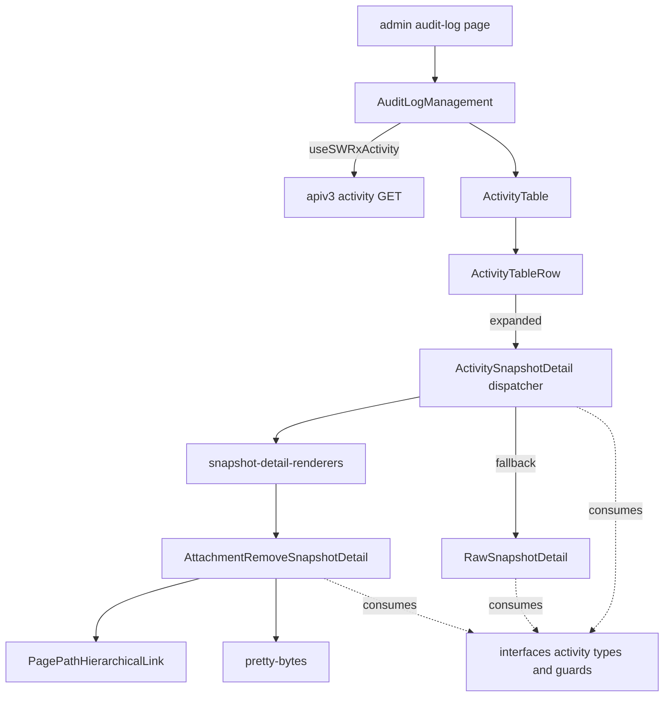
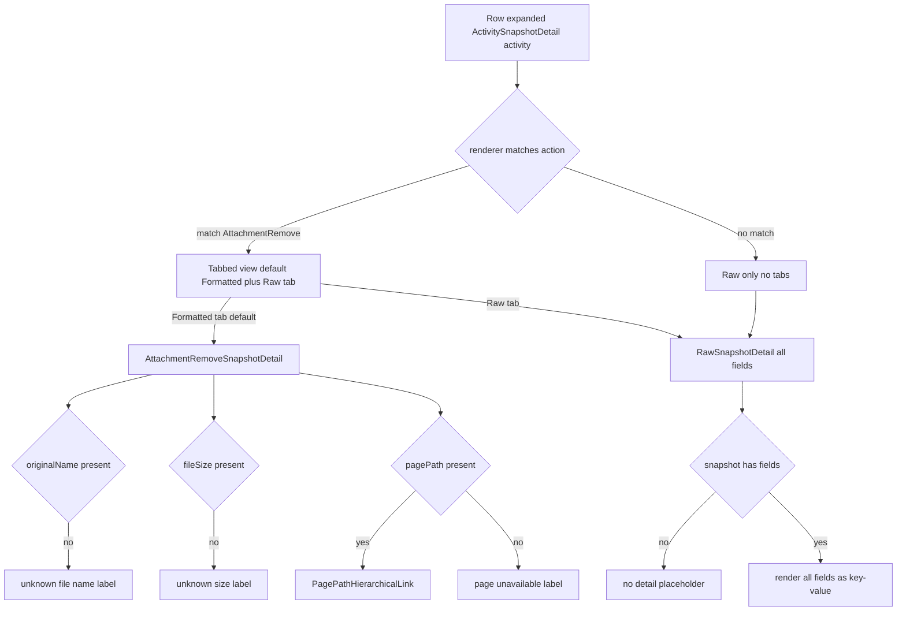

# Technical Design Document

## Overview

**Purpose**: 管理画面の監査ログで、activity に記録済みの snapshot を管理者が閲覧できるようにする **read（表示）側** の機能。PR #11393 で添付削除の snapshot（`originalName` / `pagePath` / `pageId` / `fileSize`）は DB 保存・API 応答まで通っているが、監査ログテーブル `ActivityTable` は `snapshot.username` しか描画しておらず、記録済みデータが UI から見えない。本 spec はこの表示ギャップを埋める。

**Users**: GROWI 管理者。監査ログ画面で「どのページのどの添付ファイルが、どれだけのサイズで削除されたか」等を、raw のキー羅列を読まずに把握できるようになる。

**Impact**: 既存の監査ログテーブルに (1) 全 action 共通の raw snapshot ビューアと、(2) 添付削除 action の整形表示を追加する。型・API・記録側は変更しない純粋な UI 増分であり、既存の列・action 名表示・後方互換をすべて保つ。

### Goals
- 全 action の snapshot を raw（キーと値の対）で閲覧でき、整形未対応 action でも「何が記録されたか」を追える。整形表示がある action でも **raw は常にタブで参照でき、整形が raw を置き換えない**。
- 添付削除（`ACTION_ATTACHMENT_REMOVE`）を整形表示する（ファイル名・人間可読サイズ・所属ページリンク、ダウンロードリンクなし）。整形はあくまで raw に**追加**される既定ビューで、raw を失わせない。
- 全フィールド optional 前提で、欠損時もレンダリングエラーを起こさずフォールバック表示する。
- 追加ラベルを en / ja / ko / zh / fr の全ロケールで提供する。
- 将来の action 整形追加（特に上流の添付追加 ADD 増分）に、consumer を触らず宣言の追記だけで対応できる拡張点を用意する。

### Non-Goals
- snapshot データの capture（記録）自体（`activity-log-snapshot` が担当）。
- 記録可否のゲート（`activity-log` が担当）。
- 添付追加（`ACTION_ATTACHMENT_ADD`）の整形表示。実体が残る ADD では将来サムネイル表示・ダウンロードリンク・ページリンクを持てるが、その snapshot capture が上流（`activity-log-snapshot`）で未実装のため将来増分とする。（REMOVE は実体が消えるためサムネイル／ダウンロードは原理的に不可＝要件 2.4。したがって REMOVE 整形の価値はページリンク・可読サイズ・ラベル・欠損理由の提示に限られ、それで十分とする。）
- 非添付 action の整形表示（raw 表示のみ）。
- `target × targetModel` の全面的な polymorphic「対象」列（将来課題）。
- 型・型ガード・`apiv3/activity` API・記録側ロジックの変更（すべて無加工で消費する）。

## Boundary Commitments

### This Spec Owns
- 監査ログ画面での snapshot 詳細の**表示・整形描画**：
  - 全 action 共通の raw snapshot ビューア（`RawSnapshotDetail`）。
  - action ごとの整形描画を dispatch する宣言的レジストリと dispatcher（`snapshot-detail-renderers` / `ActivitySnapshotDetail`）。
  - 添付削除 action の整形 renderer（`AttachmentRemoveSnapshotDetail`）。
  - `ActivityTable` への詳細表示の組み込み（行の展開 UI と行コンポーネント `ActivityTableRow`）。
- 上記のために追加する i18n ラベル（`admin` namespace、全 5 ロケール）。

### Out of Boundary
- snapshot の capture・永続化（`activity-log-snapshot`）。
- 記録ゲート（`activity-log`）。
- `interfaces/activity.ts` の型・型ガード（`ISnapshot` / `AttachmentRemoveSnapshot` / `isAttachmentRemoveActivity` / `SupportedAction`）の**定義**（上流所有。本 spec は import して消費するのみ、変更しない）。
- `apiv3/activity` API の契約・シリアライズ（read-only で消費）。
- 添付追加 ADD の整形（上流の ADD capture 完了後の将来増分）。
- 一覧のフィルタ／表示可否（記録ゲート spec 側で決まる `build-activity-list-where.ts` 等）。

### Allowed Dependencies
- `~/interfaces/activity` の `IActivityHasId` / `ISnapshot` / `AttachmentRemoveSnapshot` / `isAttachmentRemoveActivity` / `SupportedAction`（型・型ガードの consume）。
- `useSWRxActivity`（`~/stores/activity`）が返す `PaginateResult<IActivityHasId>`（既存のデータ供給、変更しない）。
- i18n `admin` namespace と i18next の欠落時フォールバック。
- `pretty-bytes`（バイト整形、既存依存）。
- `PagePathHierarchicalLink` + `LinkedPagePath`（ページリンク、既存コンポーネント）。
- 既存の UI 部品（`UserPicture`、`CopyToClipboard` 等、`ActivityTable` が既に使用）。

### Revalidation Triggers
以下が起きたら、本 spec の消費側を再検証する必要がある：
- `ISnapshot` ユニオンの形状変更、または `AttachmentRemoveSnapshot` のフィールド増減・型変更。
- snapshot 判別子が `action` 以外へ変わる、または `isAttachmentRemoveActivity` の判定契約が変わる。
- `apiv3/activity` が snapshot を透過しなくなる（フィールド射影・削除）。
- 上流の ADD capture／ADD 型ガードが提供される（→ レジストリに ADD エントリを追記する将来作業のトリガ。既存挙動には非破壊）。

## Architecture

### Existing Architecture Analysis
- 監査ログ画面は Next.js Pages Router 上で `pages/admin/audit-log.page.tsx` → `AuditLogManagement`（`dynamic(ssr:false)`）→ `ActivityTable` の構成。データは SWR フック `useSWRxActivity` が `GET /_api/v3/activity` から `PaginateResult<IActivityHasId>` を取得する。
- `ActivityTable` はフラットな `<table>`（1 activity = 1 `<tr>`）で、列は user / date / action / ip / url の 5 列。action 表示は `t('admin:audit_log_action.${action}')` の i18n lookup のみ。snapshot は `snapshot?.username` のみを描画。
- action ごとの整形描画コンポーネントは存在しない。整形の仕組みを新設する。
- `dynamic(ssr:false)` により追加コンポーネントに SSR 制約はかからない。
- **維持すべき統合点**: 既存 5 列・`data-testid="activity-table"`・action 名の i18n 表示・user セルの `username` 描画。これらは要件 1.4 / 5 で不変を要求される。

### Architecture Pattern & Boundary Map

**Selected pattern**: 宣言的 per-action renderer レジストリ + dispatcher（data-driven control）。判別子は `action`、narrow は既存型ガード経由。未対応 action は raw フォールバック。



**Architecture Integration**:
- **責務分離**: raw 表示 / dispatch / 添付削除整形 / 行展開 UI を別コンポーネントに分ける（単一責務・小ファイル）。
- **依存方向（左→右のみ、上位へ import しない）**: `interfaces/activity`（型・ガード）→ `snapshot-detail-renderers`（レジストリ）→ 各 renderer（`AttachmentRemoveSnapshotDetail` / `RawSnapshotDetail`）→ `ActivitySnapshotDetail`（dispatcher）→ `ActivityTableRow` → `ActivityTable` → `AuditLogManagement`。データ供給（`useSWRxActivity` / `apiv3/activity`）は左端の外部境界として read-only 消費。
- **既存パターン保持**: SWR フック・i18n `admin` namespace・`dynamic(ssr:false)`・既存テーブル構造。
- **拡張点**: action 追加はレジストリへ1エントリ追記で完結（dispatcher・テーブルは不変）。

### Technology Stack

| Layer | Choice / Version | Role in Feature | Notes |
|-------|------------------|-----------------|-------|
| Frontend | React + TypeScript（Next.js Pages Router） | snapshot 詳細の描画・行展開 | 既存 apps/app スタックに追加。新規フレームワーク無し |
| Frontend util | `pretty-bytes`（既存依存） | `fileSize`(bytes) を人間可読へ整形 | `RichAttachment.tsx` に前例 |
| Frontend util | `PagePathHierarchicalLink` + `LinkedPagePath`（既存） | `pagePath` をリンク描画（エンコード・trash 委譲） | 既存コンポーネント |
| i18n | i18next（`admin` namespace） | 追加ラベルの多言語表示・欠落フォールバック | `public/static/locales/*/admin.json` に追記 |
| Data | `useSWRxActivity` / `apiv3/activity`（既存） | `IActivityHasId[]` の供給（read-only） | 変更しない |

新規依存: **なし**（すべて既存資産）。

## File Structure Plan

### Directory Structure
```
apps/app/src/client/components/Admin/AuditLog/
├── ActivityTable.tsx                    # [modified] 詳細列(disclosure)ヘッダ追加、行を ActivityTableRow へ委譲
├── ActivityTableRow.tsx                 # [new] 1 activity 行。展開 state を保持し、既存5セル+disclosureを描画、展開時に詳細サブ行
└── snapshot-detail/                     # [new] snapshot 詳細描画クラスタ（凝集した内部）
    ├── index.ts                         # [new] barrel: ActivitySnapshotDetail のみ公開
    ├── ActivitySnapshotDetail.tsx       # [new] dispatcher: レジストリ先頭一致→整形、無ければ raw fallback
    ├── snapshot-detail-renderers.ts     # [new] 宣言的レジストリ SnapshotDetailRenderer[]（単一ソース、内部）
    ├── AttachmentRemoveSnapshotDetail.tsx # [new] 添付削除の整形 renderer（内部）
    └── RawSnapshotDetail.tsx            # [new] 汎用 key-value renderer + 欠損プレースホルダ（内部）
```

> barrel（`snapshot-detail/index.ts`）は dispatcher `ActivitySnapshotDetail` のみを公開する。レジストリと個別 renderer は内部実装として非公開（module public surface 最小化）。`ActivityTableRow` は `./snapshot-detail` からのみ import する。

### Modified Files
- `apps/app/src/client/components/Admin/AuditLog/ActivityTable.tsx` — 先頭に disclosure 列ヘッダ（i18n `audit_log_management.detail`）を追加し、`activityList.map` の `<tr>` 生成を `<ActivityTableRow activity={...} />` へ置き換える。既存 5 列・`data-testid="activity-table"`・action 名 i18n・user セルの描画は不変。
- `apps/app/public/static/locales/en_US/admin.json` — 追加ラベルキー（英語値）を追記（初回実装の対象）。
- `apps/app/public/static/locales/{ja_JP,ko_KR,zh_CN,fr_FR}/admin.json` — 同キーの各言語訳を追記。**独立した後続タスク**として切り出し（未了の間は i18next フォールバックで英語表示。下記 i18n 契約参照）。

### Co-located Tests（新規）
- `ActivityTableRow.spec.tsx` / `snapshot-detail/ActivitySnapshotDetail.spec.tsx` / `AttachmentRemoveSnapshotDetail.spec.tsx` / `RawSnapshotDetail.spec.tsx`（Vitest + RTL）。

## System Flows

snapshot 詳細の描画ディスパッチ（行展開時）:



**Key decisions**（図の補足）:
- dispatcher は `snapshotDetailRenderers.find(r => r.canRender(activity))` で先頭一致を選ぶ。判別は必ず `action`（型ガード）経由。
- **整形とrawの併存（要件 1.5）**: 一致 renderer があれば詳細をタブで見せる（既定タブ=整形、第2タブ=raw で全フィールド）。整形は raw を**置き換えず**、raw は常にタブで到達できる。一致 renderer が無ければ raw のみ（タブ chrome 無し）。どちらの経路でも raw に到達する。
- 整形 renderer は `defineRenderer` により絞り込み済み型で受け取る（renderer 内の再 narrow は不要）。
- 添付削除は各フィールドを独立にフォールバック判定する（1 フィールド欠損が他の描画を止めない＝要件 3.4）。ダウンロードリンクは条件を問わず出さない（要件 2.4）。`pagePath` 欠損時はリンクを張らずラベル表示（要件 3.2）。

## Requirements Traceability

| Requirement | Summary | Components | Interfaces | Flows |
|-------------|---------|------------|------------|-------|
| 1.1 | 全フィールドを key-value 表示 | RawSnapshotDetail | `ISnapshot` 消費 | dispatch→Raw→KV |
| 1.2 | 未対応 action は raw のみを表示 | ActivitySnapshotDetail, snapshot-detail-renderers | `SnapshotDetailRenderer` | dispatch no-match→RawOnly |
| 1.3 | snapshot 不在/空でも例外なしのプレースホルダ | RawSnapshotDetail | — | Raw→Empty |
| 1.4 | 既存 5 列維持＋詳細を追加表示 | ActivityTable, ActivityTableRow | — | Row expand |
| 1.5 | 整形があっても raw をタブで常時参照（整形は raw を置換しない） | ActivitySnapshotDetail | tab state | dispatch match→Tabs |
| 2.1 | 添付削除の整形（ファイル名/サイズ/ページ） | AttachmentRemoveSnapshotDetail | `AttachmentRemoveSnapshot` 消費 | dispatch→Fmt |
| 2.2 | サイズを人間可読へ整形 | AttachmentRemoveSnapshotDetail | `pretty-bytes` | Fmt F2 |
| 2.3 | pagePath があればページリンク | AttachmentRemoveSnapshotDetail | `PagePathHierarchicalLink`/`LinkedPagePath` | Fmt F3→Link |
| 2.4 | ダウンロードリンクを出さない | AttachmentRemoveSnapshotDetail | — | Fmt（DL 描画なし） |
| 3.1 | originalName 欠損時フォールバック | AttachmentRemoveSnapshotDetail | i18n label | Fmt F1→FbName |
| 3.2 | pagePath 欠損時はリンク無し＋フォールバック | AttachmentRemoveSnapshotDetail | i18n label | Fmt F3→FbPage |
| 3.3 | fileSize 欠損時フォールバック | AttachmentRemoveSnapshotDetail | i18n label | Fmt F2→FbSize |
| 3.4 | いずれ欠損してもレンダリングエラー無し | AttachmentRemoveSnapshotDetail, RawSnapshotDetail | — | 全フォールバック分岐 |
| 4.1 | 全 5 ロケールでラベル提供 | en_US/admin.json（初回）＋ ja/ko/zh/fr/admin.json（後続タスク） | i18n keys | — |
| 4.2 | 現 UI 言語のラベル表示 | 各 renderer | `useTranslation('admin')` | — |
| 4.3 | 欠落時は i18next フォールバック（翻訳未了時は英語表示） | （既存 i18next 設定） | i18next | — |
| 5.1 | username のみ旧 activity は従来通り | ActivityTable(user セル不変), ActivitySnapshotDetail(raw/placeholder) | — | dispatch no-match |
| 5.2 | 未対応 action は既存 action 名表示維持 | ActivityTable(action セル不変) | `audit_log_action.*` | — |
| 5.3 | 旧/新レコードを同一一覧で混在表示 | ActivityTable, ActivityTableRow | — | 行ごとに独立 dispatch |

## Components and Interfaces

| Component | Domain/Layer | Intent | Req Coverage | Key Dependencies (P0/P1) | Contracts |
|-----------|--------------|--------|--------------|--------------------------|-----------|
| ActivitySnapshotDetail | UI (dispatcher) | action に応じ整形+rawをタブ描画（未対応はrawのみ） | 1.2, 1.3, 1.5, 5.1 | snapshot-detail-renderers (P0), RawSnapshotDetail (P0) | State |
| snapshot-detail-renderers | UI (data) | action→renderer の宣言的単一ソース | 1.2 | isAttachmentRemoveActivity (P0) | State |
| AttachmentRemoveSnapshotDetail | UI | 添付削除の整形表示 | 2.1–2.4, 3.1–3.3 | pretty-bytes (P1), PagePathHierarchicalLink (P1), 型ガード (P0) | State |
| RawSnapshotDetail | UI | 全フィールド key-value 表示・欠損プレースホルダ | 1.1, 1.3, 3.4 | ISnapshot 型 (P0) | State |
| ActivityTableRow | UI | 1 行の描画＋展開 state | 1.4, 5.3 | ActivitySnapshotDetail (P0) | State |
| ActivityTable | UI (modified) | 詳細列追加・行を Row へ委譲 | 1.4, 5.2, 5.3 | ActivityTableRow (P0) | — |

> 依存型（`IActivityHasId` / `ISnapshot` / `AttachmentRemoveSnapshot` / `isAttachmentRemoveActivity`）はすべて `~/interfaces/activity` から consume する（External/Inbound=上流所有、本 spec は変更しない）。

### UI / Dispatcher

#### ActivitySnapshotDetail

| Field | Detail |
|-------|--------|
| Intent | activity を受け取り、整形 renderer があれば「整形+raw」をタブで、無ければ raw のみを描画する dispatcher |
| Requirements | 1.2, 1.3, 1.5, 5.1 |

**Responsibilities & Constraints**
- snapshot 表示の唯一の分岐点。判別は必ず `action`（型ガード）経由で、snapshot の中身では分岐しない。
- 整形 renderer が有る action: 詳細をタブで見せる（既定タブ=整形、第2タブ=raw）。整形は raw を**置き換えず**、raw は常にタブで到達できる（要件 1.5）。アクティブタブは本コンポーネントのローカル state。
- 整形 renderer が無い action: `RawSnapshotDetail` のみ（タブ chrome 無し）。
- タブ UI はプロジェクト標準のタブ部品（reactstrap `Nav`/`TabContent`。既存利用例: `CustomNavAndContents` 等）を用いる。raw タブは常に `RawSnapshotDetail`（全フィールド）。

**Dependencies**
- Outbound: `snapshot-detail-renderers`（レジストリ参照, P0）、`RawSnapshotDetail`（raw タブ／未対応時, P0）
- External: `~/interfaces/activity` の `IActivityHasId`（P0）、プロジェクト標準タブ部品（P1）

**Contracts**: State [x]

##### Props / State
```typescript
type ActivitySnapshotDetailProps = {
  activity: IActivityHasId;
};
// State: 整形 renderer がある場合のみ、アクティブタブ（'formatted' | 'raw'、既定 'formatted'）をローカルに保持。

// 実装イメージ（HOW ではなく契約の明示）
// const renderer = snapshotDetailRenderers.find(r => r.canRender(activity));
// if (renderer == null) return <RawSnapshotDetail snapshot={activity.snapshot} />;   // raw のみ
// return (
//   <Tabs default="formatted">
//     <Tab id="formatted"><renderer.Component activity={activity} /></Tab>
//     <Tab id="raw"><RawSnapshotDetail snapshot={activity.snapshot} /></Tab>   // 常に到達可能
//   </Tabs>
// );
```
- Preconditions: `activity.action` は必須（型で保証）。`activity.snapshot` は optional。
- Postconditions: 常に有効な要素を返す（例外を投げない）。raw は常に到達可能（整形が有る場合は raw タブ、無い場合は raw 単独。要件 1.5）。
- Invariants: 分岐子は `action` のみ。レジストリは**先頭一致**（`find`）で選ぶ＝配列順が優先順。`canRender` 群は互いに排他である前提（各 action に高々1つ）なので、通常は順序に依存しない。整形は raw を置き換えない。

#### snapshot-detail-renderers（宣言的レジストリ）

| Field | Detail |
|-------|--------|
| Intent | 「どの action にどの整形 renderer を使うか」を宣言する単一ソース。consumer(dispatcher) が汎用に走査する |
| Requirements | 1.2 |

**Responsibilities & Constraints**
- action 追加は本ファイルへ `defineRenderer(...)` を1行追記して完結（dispatcher・テーブル・他 renderer を触らない）。executor(dispatcher) 側で特別扱いしない（coding-style: data-driven / work-set as input）。
- `canRender` には既存型ガード（`isAttachmentRemoveActivity` 等）を渡す。判定は必ず `action` を判別子とする。
- **選択の不変条件**: `canRender` 群は互いに排他（各 action に高々1つ）。原則「1 action = 1 エントリ」。将来「添付全般」等の広い判定を足す場合に備え、dispatcher は配列**先頭一致**を採用する（配列順＝優先順）。
- **型安全な登録**: `defineRenderer` ファクトリで型ガードの絞り込み型を renderer の props 型に結び付ける。これにより (a) guard と Component の action 取り違えがコンパイルエラーになり、(b) 各 renderer は絞り込み済み型を直接受け取れて**再 narrow が不要**になる。

**Contracts**: State [x]

##### Type
```typescript
import type { FC } from 'react';
import type { IActivityHasId } from '~/interfaces/activity';
import { isAttachmentRemoveActivity } from '~/interfaces/activity';

export type SnapshotDetailRenderer = {
  canRender: (activity: IActivityHasId) => boolean;   // 判別子は action（型ガード）
  Component: FC<{ activity: IActivityHasId }>;
};

// 型ガードの絞り込み型 T を Component の props 型へ結び付けるファクトリ。
// - guard と Component の対応ミスはコンパイルエラー（登録の型安全）。
// - Component は絞り込み済み型を直接受け取る → renderer 内の再 narrow 不要。
// - 唯一必要な widening cast はこのファクトリ内 1 箇所に閉じ込める。dispatcher は
//   canRender 通過後にのみ Component を描画するため、実行時 activity は必ず T で cast は健全。
export const defineRenderer = <T extends IActivityHasId>(
  canRender: (activity: IActivityHasId) => activity is T,
  Component: FC<{ activity: T }>,
): SnapshotDetailRenderer => ({
  canRender,
  Component: Component as FC<{ activity: IActivityHasId }>,
});

export const snapshotDetailRenderers: SnapshotDetailRenderer[] = [
  defineRenderer(isAttachmentRemoveActivity, AttachmentRemoveSnapshotDetail),
  // 将来: ADD の型ガード/renderer 提供後に defineRenderer(isAttachmentAddActivity, ...) を1行追記
];
```
- Invariants: エントリは `action` ベースの判定のみを持つ。snapshot 内容での判定を持ち込まない。

**Implementation Notes**
- Integration: `defineRenderer` 内の `as` は「dispatcher が `canRender` 通過を保証する」という実行時契約に裏打ちされた**局所的で正当な**アサーションであり、`any` は使わない。これ以外に型アサーションを増やさない。
- Validation（typecheck ゲート）: 既存 `isAttachmentRemoveActivity` の引数型は `Pick<IActivity, 'action' | 'snapshot'>`、述語は `snapshot` を `AttachmentRemoveSnapshot` に絞る形（`~/interfaces/activity`）。上記ジェネリック（`T extends IActivityHasId`）がこの型ガードを推論・受理できることを実装時の型検査で確認する。推論が噛み合わない場合は制約を `T extends Pick<IActivity,'action'|'snapshot'>` 側へ調整するか、`defineRenderer<絞り込み型>(...)` と明示型引数を付す（いずれも上流の型ガード定義は変更しない）。
- Risks: 型ガードが将来「非排他」になると先頭一致で silent shadow が起きうる。上の選択の不変条件を守り、レビューで担保する。

#### AttachmentRemoveSnapshotDetail

| Field | Detail |
|-------|--------|
| Intent | 添付削除 activity の snapshot を整形表示（ファイル名・人間可読サイズ・ページリンク） |
| Requirements | 2.1, 2.2, 2.3, 2.4, 3.1, 3.2, 3.3 |

**Responsibilities & Constraints**
- `defineRenderer` 経由で登録されるため、props の `activity` は**既に `snapshot?: AttachmentRemoveSnapshot` へ絞り込まれた型**で受け取る（renderer 内での再 narrow は不要。判別ロジックは `isAttachmentRemoveActivity` の1箇所に閉じる）。
- 各フィールドを独立にフォールバック判定（1 欠損が他を止めない、要件 3.4）。
- `pagePath` 欠損時はリンクを張らずフォールバック文言（要件 3.2）。
- **ダウンロードリンクを出さない**（実体が消えているため、要件 2.4）。

**Dependencies**
- External: `pretty-bytes`（サイズ整形, P1）、`PagePathHierarchicalLink` + `LinkedPagePath`（ページリンク, P1）
- Inbound: `snapshot-detail-renderers`（`defineRenderer` で登録, P0）

**Contracts**: State [x]

##### Props
```typescript
// 型ガード isAttachmentRemoveActivity が絞り込む型。defineRenderer が
// この型を props 型として要求するため、renderer は narrow 済みで受け取る。
type AttachmentRemoveSnapshotDetailProps = {
  activity: IActivityHasId & { snapshot?: AttachmentRemoveSnapshot };
};
```
- Preconditions: dispatcher により `action === ACTION_ATTACHMENT_REMOVE` が担保（型でも絞り込み済み）。
- Postconditions: `originalName` / `fileSize` / `pagePath` それぞれの有無に応じ、値またはフォールバック文言を描画。ダウンロードリンクは描画しない。
- Invariants: 値はテキストとして描画（React 自動エスケープ）。href は `LinkedPagePath` にエンコードを委譲。

#### RawSnapshotDetail

| Field | Detail |
|-------|--------|
| Intent | snapshot の全フィールドを key-value で表示。空/不在はプレースホルダ | 
| Requirements | 1.1, 1.3, 3.4 |

**Responsibilities & Constraints**
- `Object.entries(snapshot)` を列挙して全フィールドを描画（透過される `_id`/`id` 含む＝raw の性質）。値はテキスト化して描画（object/array は `JSON.stringify` で安全整形）。
- `snapshot` が `null`／空なら「詳細なし」プレースホルダを返し、例外を投げない。

**Contracts**: State [x]

##### Props
```typescript
type RawSnapshotDetailProps = {
  snapshot?: ISnapshot;
};
```
- Postconditions: 常に有効要素を返す（例外なし）。

### UI / Table（presentational）

#### ActivityTableRow（new）
- **Summary**: 1 activity を 1 行で描画。行ローカルの展開 state（`useState<boolean>`）を持ち、先頭 disclosure セルの caret で `ActivitySnapshotDetail` の全幅サブ行を開閉する。既存 5 セル（user/date/action/ip/url）は現行 `ActivityTable` と同一描画。
- **Requirements**: 1.4, 5.3
- **Implementation Note**:
  - Integration: `ActivityTable` の `map` 内 `<tr>` を本コンポーネントへ抽出。`data-testid="activity-table"` を維持し、詳細サブ行に別 testid（例 `activity-snapshot-detail`）を付す。展開時のみ詳細を mount（未展開行のコスト無し）。
  - Validation: 展開トグルに `aria-expanded` を付与。
  - Risks: 行抽出で既存描画が変わらないこと（user/action セル）をスナップショット/DOM 断言で担保。

#### ActivityTable（modified）
- **Summary**: `<thead>` に disclosure 列（i18n `audit_log_management.detail`）を追加し、行生成を `ActivityTableRow` へ委譲するだけの薄いコンテナへ。既存列順・`data-testid`・action 名 i18n は不変。
- **Requirements**: 1.4, 5.2, 5.3

## Data Models

本 spec は**新規の永続データを持たない**。表示のために既存型を消費するのみ。

### 消費する型（`~/interfaces/activity`、上流所有・変更しない）
```typescript
type DefaultSnapshot = Partial<Pick<IUser, 'username'>>;          // { username? }
type AttachmentRemoveSnapshot = {
  username?: string; originalName?: string; pagePath?: string;
  pageId?: string; fileSize?: number;                              // fileSize は bytes
};
type ISnapshot = DefaultSnapshot | AttachmentRemoveSnapshot;       // 全フィールド optional
type IActivityHasId = IActivity & HasObjectId;                     // snapshot?: ISnapshot, action 必須
// 型ガード（判別子は action の等値のみ。snapshot を AttachmentRemoveSnapshot へ絞り込む）
const isAttachmentRemoveActivity = (
  activity: Pick<IActivity, 'action' | 'snapshot'>,
): activity is Pick<IActivity, 'action' | 'snapshot'> & { snapshot?: AttachmentRemoveSnapshot }
  => activity.action === SupportedAction.ACTION_ATTACHMENT_REMOVE;
```

### i18n データ契約（追加キー、`admin` namespace）

**ラベルが増えるのは「整形 renderer」だけ**：raw フォールバック表示は snapshot のキー名をそのまま出すため**新規ラベルを必要としない**。したがって i18n の増分は「新しい action への対応」ではなく「その action に整形表示を作るかどうか」に紐づく。本 spec では詳細列見出しと添付削除整形のラベルのみが対象。

契約上必要なラベル集合（キー名は実装時に既存命名と整合を取る）:

| キー（例） | 用途 | 対応要件 |
|-----------|------|---------|
| `audit_log_management.detail` | 詳細列の見出し | 1.4 |
| `audit_log_snapshot.file_name` | ファイル名ラベル | 2.1 |
| `audit_log_snapshot.file_size` | ファイルサイズラベル | 2.1, 2.2 |
| `audit_log_snapshot.page` | 所属ページラベル | 2.1, 2.3 |
| `audit_log_snapshot.no_detail` | snapshot 詳細なし | 1.3 |
| `audit_log_snapshot.unknown_file_name` | ファイル名欠損時 | 3.1 |
| `audit_log_snapshot.page_unavailable` | ページ参照先なし（削除済み等） | 3.2 |
| `audit_log_snapshot.unknown_size` | サイズ欠損時 | 3.3 |

**ロケール展開方針（英語ファースト、翻訳は分離）**:
- 初回実装では **`en_US/admin.json` に英語ラベルを追加**する。ja/ko/zh/fr は **i18next の欠落時フォールバック（要件 4.3）により英語表示**となり、機能は成立する。
- ja/ko/zh/fr への翻訳追記は **独立した後続タスク**として切り出し、実施要否・時期は後から判断する（本 spec のコード実装とは疎結合。翻訳が UI ロジックを一切変えない）。
- 要件 4.1（全 5 ロケール提供）は、この後続タスクの完了をもって満たす。未実施の間は 4.3 のフォールバックが担保する。**恒久的に非英語を提供しない**判断をする場合は requirements.md 4.1 を更新する（本 spec では 4.1 は維持し、翻訳を後続タスク化するに留める）。
- Backward/forward compatibility: 既存キーは変更しない（追加のみ）。

## Error Handling

### Error Strategy
本機能はサーバ API を新設せず、クライアント描画のみ。エラー戦略は「**graceful degradation（部分欠損でも描画継続）**」に集約する。

### Error Categories and Responses
- **欠損フィールド（正常系の一部）**: `originalName`/`pagePath`/`fileSize`/`username` は optional。各々を独立にフォールバック文言へ置換し、他フィールドの描画を止めない（要件 3.1–3.4）。
- **snapshot 不在・空**: `RawSnapshotDetail` が「詳細なし」プレースホルダを返す（要件 1.3）。
- **想定外 action / 未登録 action**: dispatcher が一致 renderer を見つけられず `RawSnapshotDetail` へフォールバック（例外を投げない、要件 1.2 / 5.1 / 5.2）。整形 renderer には `defineRenderer` により絞り込み済み型のみが渡るため、renderer 内での型ガード再判定は不要（判別は `isAttachmentRemoveActivity` の1箇所に集約）。

### Monitoring
- 追加のサーバログ・メトリクスは不要（クライアント描画のみ、新規 API 無し）。既存監査ログ基盤に影響を与えない。

## Testing Strategy

`essential-test-design`（観察可能な契約をテスト）と `essential-test-patterns`（Vitest / RTL / 型安全モック `mock<T>()`）に従う。断言は「描画された内容・リンク有無・フォールバック文言」等の観察可能な出力に対して行い、内部呼び出しの spy に依存しない。

### Unit / Component Tests
- **RawSnapshotDetail**: (a) 複数フィールドを持つ snapshot → 全キー/値が描画される（1.1）。(b) `undefined`／空 snapshot → プレースホルダが出て throw しない（1.3, 3.4）。
- **ActivitySnapshotDetail（dispatcher）**: (a) `action=ATTACHMENT_REMOVE` → 既定で整形（ファイル名等）が現れ、raw タブへ切り替えると全フィールドの key-value が現れる（整形が raw を置き換えない＝1.5）。(b) 未登録 action → タブ無しで raw の key-value のみが現れる（1.2）。(c) `DefaultSnapshot`(username のみ) → 整形もタブも現れず raw のみ（5.1）。
- **AttachmentRemoveSnapshotDetail**: (a) 全フィールド有り → ファイル名・`pretty-bytes` 整形サイズ・ページリンクが現れ、ダウンロードリンクは現れない（2.1–2.4）。(b) `originalName` 欠損 → 不明ラベル（3.1）。(c) `pagePath` 欠損 → リンク要素が無く参照先なしラベル（3.2）。(d) `fileSize` 欠損 → サイズ欠損ラベル（3.3）。

### Integration（component-level）
- **ActivityTable + ActivityTableRow**: (a) disclosure 展開で詳細サブ行が現れ、再度で閉じる（1.4）。(b) 既存 5 列（user/date/action/ip/url）と `data-testid="activity-table"`・action 名 i18n が保たれる（1.4, 5.2）。(c) 旧レコード（snapshot 無し/username のみ）と新レコード（添付フィールド有り）を混在させた `activityList` が同一テーブルに破綻なく描画される（5.3）。

### i18n
- 初回実装では **`en_US/admin.json` に追加キーが存在すること**を静的検証する（英語ファースト）。ja/ko/zh/fr は i18next の欠落時フォールバックで英語表示となり機能が成立することを前提とする（4.2, 4.3）。
- 4 ロケール（ja/ko/zh/fr）翻訳の存在検証は、翻訳を追記する**後続タスク側の受け入れ条件**として持たせる（要件 4.1。本 spec のコード実装のゲートには含めない＝翻訳未了でもコードは完成・検証可能）。

## Security Considerations

- **XSS**: `originalName` / `pagePath` はユーザ制御文字列。React のテキスト自動エスケープに委ね、`dangerouslySetInnerHTML` を使わない。ページ href のエンコードは `LinkedPagePath` に委譲する。
- **アクセス制御**: 監査ログ画面は既に admin 限定ルート（`loginRequiredStrictly` + `adminRequired`、`app:auditLogEnabled`）でガード済み。本 spec は表示の追加のみで、露出範囲を広げない（API で既に返っているデータを描画するだけ）。
- **情報露出**: raw ビューアは API が返す snapshot をそのまま出す。API 応答自体（露出フィールド）は上流所有で本 spec は変更しない。

## Performance & Scalability

- 監査ログは 1 ページ最大 100 行。詳細サブ行は**展開時のみ mount**するため、既定表示のコストは disclosure セル追加分のみ。
- レジストリ走査は `find`（O(エントリ数)=実質 O(1)）。追加のネットワーク往復は無し（`useSWRxActivity` の既存取得データを描画）。
