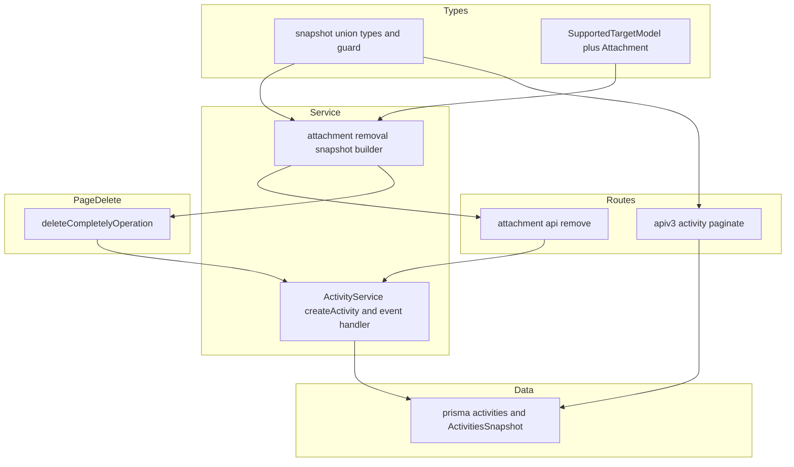
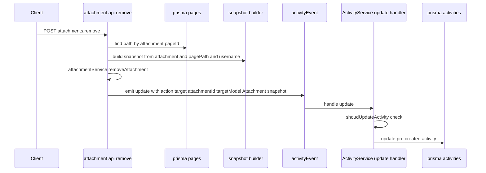
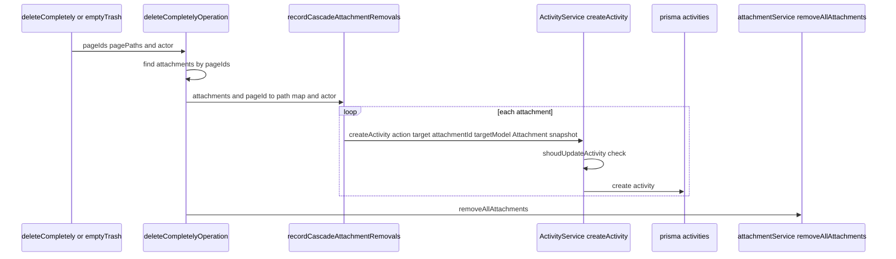

# 技術設計書: activity-log-snapshot（snapshot 型付け＋添付削除ログ）

## Overview

本機能は GROWI の監査ログ（activity log）に対し、(1) activity の `snapshot` を **action 種別を判別子とする判別可能ユニオン**として型付けし、(2) 添付ファイル削除時に削除直前の情報（ファイル名・所属ページ・サイズ）を snapshot に残す。これにより、管理者は監査ログで「誰がどのページのどの添付ファイルをいつ削除したか」を追跡でき、GROWI 開発者は action 単位で snapshot を型安全に扱える。

**対象利用者**: 監査・コンプライアンス対応を行う GROWI 管理者（監査ログ参照）と、activity log を保守・拡張する GROWI 開発者（型の利用）。

**Impact**: 現状 `snapshot` は `{ username }` のみで、添付削除では「誰が消したか」しか残らない。本機能は snapshot を action ごとの判別可能ユニオンにし、添付削除（直接削除・カスケード削除の両方）で対象ファイルの情報を凍結保存する。

> **【前提条件は完了済み】** 本スペックは **`activities` モデルが Mongoose から Prisma へ移行済み**であることを実装着手の絶対前提とする（移行は別スペック `activities-prisma-migration` の責務。`research.md` D-2 方針3 を参照）。**この移行は 2026-07-01 に完了を確認済み**：`add-activity.ts` / `service/activity.ts` / `apiv3/activity.ts` が Mongoose の `Activity.create` / `update` / `paginate` を一切呼ばないことを grep で確認し、実 MongoDB（devcontainer の `mongo:27017`, replicaSet rs0）に対する統合テスト 7 ファイル・42 件がすべて green だった。以降の永続層・API・サービスの記述はすべて移行後の Prisma を前提とする。
>
> **移行後に使える具体的な API**（`models/activity.ts` の `ActivityExtension`、詳細は移行スペックの design.md/tasks.md — git 履歴に残る）:
> - `prisma.activities.createByParameters(params)` — `user`/`target` がオブジェクトで渡ってきた場合の ID への変換は拡張の内部で行う
> - `prisma.activities.updateByParameters(id, parameters)` — `include: { user: true }` 済みで返る。対象が見つからない場合は例外を投げず `null` を返す（Mongoose 版の `findOneAndUpdate(..., {new:true})` と同じ挙動）
> - `prisma.activities.paginate({ where, orderBy, offset, limit, include })` — **offset 指定のみを受け付ける**（`page` 指定は廃止済み。共有ヘルパ `~/utils/prisma` の `paginate` も同様に offset 統一済み）
> - `prisma.activities.findSnapshotUsernamesByUsernameRegexWithTotalCount(...)` — `aggregateRaw` を使う実装に置き換え済み
> - `where: { snapshot: { is: { username: { in: [...] } } } }` という composite type への絞り込みは、実 MongoDB に対して意図通り効くことを確認済み（`aggregateRaw` への生クエリ回避は不要だった）
> - `create` / `createMany` は明示的な `_id`（ObjectId 文字列）を指定しても受け付けることを確認済み
>
> **【「型は通るが保存されない」失敗に注意 — Prisma 移行後も残る】** Mongoose 時代は strict 既定で未宣言フィールドを保存時に黙って捨てることが原因だった。移行完了でこの Mongoose 由来の経路は消えたが、**同じ失敗が Prisma 拡張側に残っている**。`prisma.activities.createByParameters` は渡された `snapshot` を素通しせず `{ id, username }` だけを手で組み立て直すため（`models/activity.ts` 315-320行）、schema.prisma の `ActivitiesSnapshot` にフィールドを足しただけでは、**カスケード削除（`createActivity` → `createByParameters` 経由）で添付フィールドが1バイトも保存されない**。型は通り activity レコードも作られるので「保存したつもり」になりやすい。したがって本スペックは `createByParameters`（カスケード削除の保存口）と `updateByParameters`（直接削除の保存口）の **両方の改修** を所有範囲に含める（下記「This Spec Owns」）。直接削除の経路は `updateByParameters` → `context.update` に届くが、Prisma の composite type は更新時に素の object を渡せず、`snapshot: { set: { … } }`／`{ update: { … } }` の envelope 形と必須の `_id` の保持が要る。しかも失敗しても更新ハンドラ（`service/activity.ts`）が握りつぶすため、素通しのままだと直接削除の添付フィールドが黙って保存されない。create 経路と同じ罠が update 経路にも残っているので、実装では両方を直し、実 DB から読み直すテストで保存を確認する。

### Goals
- `snapshot` 型を `action` を唯一の判別子とする判別可能ユニオンにする（要件 1）。
- 添付ファイルの直接削除・カスケード削除の両方で、対象ファイルの情報を snapshot に記録する（要件 2・3）。
- 監査ログ API の応答に snapshot の添付フィールドを後方互換に含める（要件 4）。
- 既存の activity データ（`username` のみの snapshot）を破壊的移行なしにそのまま扱える。

### Non-Goals
- `activities` モデルの Mongoose → Prisma 移行そのもの（別スペック `activities-prisma-migration` が担当、2026-07-01 完了確認済み）。
- `target × targetModel` 全体の判別可能ユニオン化（型安全化の全面適用）。本スペックでは `SupportedTargetModel` に `Attachment` を1つ足すのみ。
- action グループの設定変更（`ACTION_ATTACHMENT_REMOVE` を Small グループへ格上げする、管理 UI トグルを足す等）。記録可否は既存の `AUDIT_LOG_ACTION_GROUP_SIZE` / `AUDIT_LOG_ADDITIONAL_ACTIONS` に従う。
- 監査ログ画面への「対象」列の UI 実装（本スペックは参照可能なデータを保存するところまで）。
- 保持期間・TTL の変更、大量カスケード削除時のボリューム制御・スロットリング。

## Boundary Commitments

### This Spec Owns
- `snapshot` の判別可能ユニオン型・type guard・型付きビルダー（`interfaces/activity.ts` ＋ サーバ側ビルダー）。
- `schema.prisma` の `ActivitiesSnapshot` composite type への添付フィールド追加。
- **`models/activity.ts` の `createByParameters` の改修（カスケード削除の保存口）** — 渡された `snapshot` の添付フィールド（`originalName`/`pagePath`/`pageId`/`fileSize`）を、保存に使う `snapshotData` に反映する。この関数は元々 `activities-prisma-migration` が作成したもので、現状は `{ id, username }` だけを手組みして添付フィールドを捨てる（315-320行）。カスケード削除は `createActivity` → `createByParameters` を通るため、ここを直さないと添付フィールドが1バイトも保存されない。
- **`models/activity.ts` の `updateByParameters` の改修（直接削除の保存口）** — 直接削除は middleware が作った既存 activity を `activityEvent.emit('update', ...)` で更新する経路で、最終的に `updateByParameters` → `context.update({ data })` に届く。Prisma の composite type は **更新時に素の object を渡せず**、`snapshot: { set: { …全フィールド + `_id` } }` または `{ update: { … } }` の envelope 形が必須なので、`createByParameters`（create は素の object 可）とは別に update 用の組み立てを書く。既存の `snapshot._id`・`username` を壊さないこと。現状の `updateByParameters` は snapshot に触れず `...parameters` で素通しするだけで、(1) 型はイベント経由で通ってしまい、(2) 失敗しても更新ハンドラ（`service/activity.ts` の `catch → logger.error → return`）が握りつぶすため、素通しのままだと直接削除の添付フィールドが黙って保存されない（create 経路と同じ「型は通るが保存されない」罠が update 経路にも残っている）。この経路は移行スペックでも実 DB で検証されていない（既存の `updateByParameters` テストはすべてモックで、`context.update` の呼び出し引数しか見ていない）ため、実 DB から読み直すテストで保存を確認する（Testing Strategy「保存口の直接検証」）。
- **書き込み口のパラメータ型の拡張** — `IActivityParameters.snapshot`（現状 `{ username?: string }`、`models/activity.ts` 190-201行付近）と `updateByParameters` の入力型（`IActivityUpdateParameters`）を、添付フィールドを載せられる `ISnapshot`（union）へ広げる。これを広げないと、上記2関数を直しても呼び出し側で型が通らない／`any` 経由で黙って落ちる。

  **型安全性の担保（明記）**: 拡張後の型は必ず `ISnapshot`（union）で受け、`any` / `as any` / `as unknown as T` で型検査を迂回しない。とくに `updateByParameters` は**素の `ISnapshot` を受け取り**、Prisma composite の envelope 形（`{ set }` / `{ update }`）への変換を**関数内部で型付きに**行う（呼び出し側は Prisma の envelope 形を意識しない）。既存の `emit('update')` 呼び出し元は snapshot を渡していないことを確認済みのため、この入力契約の変更（envelope→素の `ISnapshot`）は後方互換。ただし将来 snapshot を渡す update 呼び出し元が現れると二重ラップの恐れがあるので、この不変条件を Revalidation Triggers に追加して守る。
- `SupportedTargetModel` への `Attachment` 値の追加。
- 添付削除 activity の記録ロジック（直接削除＝既存 activity の更新、カスケード削除＝添付ごとの新規作成）。`target` には削除対象添付の `_id` を、`targetModel` には `Attachment` を設定する。
- 監査ログ API（`apiv3/activity.ts`）の OpenAPI への snapshot 添付フィールド記述と、応答にフィールドが乗ることの保証。

### Out of Boundary
- `activities` の Mongoose → Prisma 移行（別スペック `activities-prisma-migration` が担当、2026-07-01 完了確認済み）。
- `target × targetModel` の全面的型安全化。
- action グループ／記録可否の設定変更。
- 監査ログ画面の「対象」列 UI。
- TTL・保持期間、カスケード削除の件数制御。
- contribution-graph / audit-log-bulk-export / page-bulk-export 等、添付削除と無関係な activities 消費者の挙動変更。

### Allowed Dependencies
- 移行済み `activities` Prisma モデルと拡張（`ActivityExtension` の `createByParameters` / `updateByParameters` / `paginate` / `findSnapshotUsernamesByUsernameRegexWithTotalCount`）。`~/utils/prisma` の `prisma` クライアント。**移行は 2026-07-01 に完了済み**（詳細は Overview の囲み参照）。ただし `createByParameters` は snapshot 添付フィールドを保存するため本スペックで改修する（上記 This Spec Owns 参照。依存ではなく所有に格上げ）。
- `attachments` Prisma モデル（`originalName` / `fileSize` / `pageId`）と `pages` モデル（`path` の引き当て）。
- `attachmentService.removeAttachment` / `removeAllAttachments`（削除実体）。
- `ActivityService.createActivity` / `shoudUpdateActivity` と `activityEvent`、`addActivity` middleware が用意する `res.locals.activity`。

### Revalidation Triggers
- `ISnapshot` ユニオンの shape 変更、`AttachmentRemoveSnapshot` のフィールド増減。
- `SupportedTargetModel` への値追加・変更。
- `ActivitiesSnapshot` composite type のフィールド変更。
- 移行済みの `ActivityExtension`（`activities-prisma-migration`）が `createByParameters` / `updateByParameters` / `paginate` のシグネチャを変えた場合。
- 複合 unique index `{ userId, target, action, createdAt }` の定義変更（本スペックは変更しない前提で設計している）。
- `activityEvent.emit('update', ...)` の呼び出し元が新たに `snapshot` を渡し始めた場合（`updateByParameters` は素の `ISnapshot` を受けて内部で envelope 化する前提のため、envelope 形で渡すと二重ラップになる）。

## Architecture

### Existing Architecture Analysis

- activity 記録には2経路がある。**直接削除**は `addActivity` middleware が `ACTION_UNSETTLED` の activity を1件先に作り `res.locals.activity` に置き、API が `activityEvent.emit('update', activityId, parameters)` でそれを更新する。**カスケード削除**は `deleteCompletelyOperation` が `removeAllAttachments` で複数添付を一括削除するが、添付ごとの activity は作られない（親の `PAGE_DELETE_COMPLETELY` 等に紐付くのみ）。
- 記録可否は `ActivityService.shoudUpdateActivity(action)` が `getAvailableActions()`（`AUDIT_LOG_ACTION_GROUP_SIZE` / `ADDITIONAL_ACTIONS` / `EXCLUDE_ACTIONS` から算出）で判定する。`ACTION_ATTACHMENT_REMOVE` は Medium グループ以上に含まれ、既定 Small では記録されない。本スペックはこの判定をそのまま使う（設定変更はしない）。
- 監査ログ取得 API（`apiv3/activity.ts`）は paginate 結果を `...rest` で展開して応答するため、`snapshot` は素通りで応答に乗る。**移行済みの現在は `prisma.activities.paginate`（`include: { user: true }`）を使う**（移行前は `Activity.paginate`, Mongoose lean + populate だった）。`...rest` で snapshot が乗る性質は移行前後で不変。
- 永続層は Prisma + MongoDB（移行済み）。`activities.snapshot` は composite type `ActivitiesSnapshot`。**Prisma の composite type は union を表現できない**ため、判別はドメイン層（TypeScript）で行い、永続層は全 variant を許す superset とする。

### Architecture Pattern & Boundary Map



**Architecture Integration**:
- 選択パターン: ドメイン層での判別可能ユニオン＋ type guard＋型付きビルダー（言語標準機能で実現。Mongoose/Prisma の discriminator 機構は不採用。理由は `research.md` D-2 方針1）。
- 責務分離: 「型と判別」（Types）／「snapshot 生成と記録」（Service）／「記録の起点」（Routes・PageDelete）／「永続」（Data）を分ける。ビルダーは作業対象（添付・ページ・操作者）を引数で受け取り、データセットを自分で import しない（coding-style の executor 原則）。
- 既存パターン維持: 記録の2経路（更新 / 新規作成）と `shoudUpdateActivity` ゲートを変えない。監査ログ API の `...rest` 応答も流用。
- 新規の理由: 添付ごとの snapshot 生成は複数経路（直接・カスケード）から呼ばれる純粋ロジックなので、フレームワーク非依存のビルダーに切り出す。

### Dependency Direction

`Types（interfaces/activity.ts）` → `Prisma モデル/composite type` → `Service（ビルダー・ActivityService）` → `Routes（attachment api・apiv3/activity）/ PageDelete サービス`。各層は左の層のみに依存し、右へは依存しない。

### Technology Stack

| Layer | Choice / Version | Role in Feature | Notes |
|-------|------------------|-----------------|-------|
| Backend / Services | TypeScript（判別可能ユニオン＋type guard） | snapshot の action 別型付けと安全な生成 | ライブラリ非導入。`any` 不使用 |
| Data / Storage | Prisma（MongoDB, `prisma-client` ESM 出力） | `activities` / `ActivitiesSnapshot` の永続 | composite type は superset。union 不可のためドメイン層で判別 |
| Messaging / Events | `activityEvent`（既存） | 直接削除の `emit('update', ...)` 経路 | 変更なし。parameters に target/targetModel/snapshot を追加 |

## File Structure Plan

### Modified Files
- `apps/app/prisma/schema.prisma` — `ActivitiesSnapshot` composite type に添付フィールド（`originalName` / `pagePath` / `pageId` / `fileSize`、いずれも optional）を追加。`username` を optional 化（user 無し削除経路への安全策。`research.md` D-5）。`activities` モデル本体・index は変更しない。
- `apps/app/src/server/models/activity.ts` — **2つの保存口を改修**。(1) `createByParameters`（カスケード削除の保存口）で `snapshotData` に添付フィールドを反映（現状 315-320行は `{ id, username }` だけを手組み）。(2) `updateByParameters`（直接削除の保存口）で snapshot を composite 更新の envelope 形（`{ set }`／`{ update }` ＋ `_id` 保持）に組み立てる（現状は `...parameters` で素通しのみ）。あわせて書き込み口のパラメータ型 `IActivityParameters.snapshot`（190-201行付近）と `IActivityUpdateParameters` を `ISnapshot`（union）へ拡張。詳細は Boundary Commitments「This Spec Owns」参照。
- `apps/app/src/interfaces/activity.ts` — `SupportedTargetModel` に `MODEL_ATTACHMENT = 'Attachment'` を追加。`ISnapshot` を `DefaultSnapshot | AttachmentRemoveSnapshot` のユニオンに再定義。`isAttachmentRemoveActivity` type guard を追加。`IActivity` は `snapshot?: ISnapshot` のまま（後方互換）。
- `apps/app/src/server/routes/attachment/api.js` — `api.remove`: 削除前に `attachment` から `originalName`・`fileSize`・ページ ID（**Mongoose の `attachment.page`**。ビルダーへは `pageId` として渡す）・`pagePath`（その `page` から `pages` を引いて path を得る）を取り、ビルダーで snapshot を生成。`emit('update', res.locals.activity._id, { action: ACTION_ATTACHMENT_REMOVE, target: attachment._id, targetModel: MODEL_ATTACHMENT, snapshot })` に変更。
- `apps/app/src/server/service/page/index.ts` — `deleteCompletelyOperation` で `removeAllAttachments` の**直前**に、削除対象添付ごとに `ACTION_ATTACHMENT_REMOVE` activity を新規作成（recorder 呼び出し）。操作者情報を届けるため、`deleteCompletelyOperation` に **actor を1つの Parameter Object として追加**する（設計は直下参照）。

  **actor の受け渡し設計（Parameter Object を採用）**

  *なぜ Parameter Object か*: 操作者情報は `user`（必須）＋ `ip`/`endpoint`（任意）の3値。これを個別の位置引数で足すと `deleteCompletelyOperation(pageIds, pagePaths, user, ip, endpoint)` の5引数になり読みにくい。既存コードには既に `activityParameters`（`{ ip, endpoint }` を束ねたオブジェクト）を `deleteCompletely`・`emptyTrashPage` に渡す前例があり（`deleteCompletely` は6位置引数 ＋ `activityParameters`）、これに倣って actor を型付きの1オブジェクトにまとめる。`actor` は **必須引数**にする（省略可だと user 無しで黙って記録される。必須なら呼び出し漏れをコンパイルで検出できる）。

  ```typescript
  type ActivityActor = { user: IUserHasId; ip?: string; endpoint?: string };
  // deleteCompletelyOperation(pageIds, pagePaths, actor: ActivityActor)
  ```

  *貫通は最小で済む — `user` は既に全経路にある*: `deleteCompletelyOperation` を呼ぶ直接呼び出し元は次の3つだけで、いずれも `user` を既にスコープに持つ。よって `deleteCompletelyOperation` に `actor` を足し、各直接呼び出し元が手持ちの情報から `actor` を組み立てて渡すだけでよい（下流の stream 関数群の signature は変えない）：

  | 直接呼び出し元 | 行 | `actor` に詰められる情報 |
  |----------------|----|--------------------------|
  | `deleteCompletely`（単一・非再帰） | 2518行 | **user + ip + endpoint**（`activityParameters` あり） |
  | `deleteCompletelyV4`（v4 非再帰） | 2617行 | user のみ |
  | `deleteMultipleCompletely(pages, user)` | 2425行 | **user のみ**（既存の `user` 引数から `{ user }` を組む） |

  *要件3の主経路と、見落としがちな第4の経路はすべて `deleteMultipleCompletely` に収束する*。`deleteMultipleCompletely` は (a) stream batch（`deleteCompletelyDescendantsWithStream` 内, 2701行。これは `deleteCompletelyRecursivelyMainOperation` 2583行・`deleteCompletelyV4` 2620行・`emptyTrashPage`（ゴミ箱空）2647行 から起動）と、(b) **`handlePrivatePagesForGroupsToDelete`（ユーザーグループ削除に伴う私有ページの完全削除, 3358行）** から呼ばれる。いずれも `deleteMultipleCompletely(pages, user)` の形で `user` を渡している。したがって **`deleteMultipleCompletely` が自身の `user` 引数から `{ user }` を組んで `deleteCompletelyOperation` に渡す**ようにすれば、stream 経由の全経路とグループ削除経路が**呼び出し元を一切変えずに**カバーされる（当初レビューで指摘した「経路の列挙漏れ = `handlePrivatePagesForGroupsToDelete`」は、この seam で吸収されるため個別改修は不要）。

  *ip/endpoint の縮退（許容）*: `deleteMultipleCompletely` は `user` しか持たないため、そこを通る再帰完全削除・ゴミ箱空・グループ削除では `ip`/`endpoint` は snapshot に乗らない（`username` は乗る）。単一・非再帰の直接削除（`deleteCompletely` 経由）だけが ip/endpoint を持つ。要件3は username があれば満たせるため、この縮退は許容する。将来 ip/endpoint も通したい場合は、同じ `ActivityActor` オブジェクトを stream・`deleteMultipleCompletely` の signature に足して貫通させれば拡張できる（本スペックのスコープ外）。
- `apps/app/src/server/routes/apiv3/activity.ts` — OpenAPI の `snapshot` プロパティに添付フィールドを追記。応答整形（`...rest`）は変更不要だが、snapshot 添付フィールドが欠落なく乗ることをテストで担保。

### New Files
- `apps/app/src/server/service/activity/attachment-removal-snapshot.ts` — 純粋関数 `buildAttachmentRemoveSnapshot(...)`（添付・pagePath・username → `AttachmentRemoveSnapshot`）と、カスケード用 recorder `recordCascadeAttachmentRemovals(activityService, attachments, pageIdToPath, actor)`（添付ごとに `createActivity` を呼ぶ）。executor はデータセットを import せず引数で受け取る。
- `apps/app/src/server/service/activity/attachment-removal-snapshot.spec.ts` — 上記の co-located ユニットテスト。

> `interfaces/activity.ts` は client store（`stores/activity.ts`）も import する共有型ハブ。型・guard はここに置き、サーバ専用のビルダー／recorder は server 配下の新規ファイルに置いて server-client 境界を守る。

## System Flows

### 直接削除（要件 2）— 既存 activity の更新



snapshot は **削除前**の `attachment`（`api.remove` のスコープに存在）から生成する。`pagePath` は Mongoose 添付の `attachment.page`（ObjectId）から `pages` を引いて得る（ビルダーへ渡すときは `pageId` に読み替える）。ページが見つからない／添付フィールドが欠ける場合は取れた範囲で記録し警告する（要件 2.3）。

### カスケード削除（要件 3）— 添付ごとの新規作成



`removeAllAttachments`（ストレージ削除）の**前**に snapshot を取り activity を作る（要件 3.4）。完全削除・ゴミ箱を空にする操作はいずれも最終的に `deleteCompletelyOperation` に収束するため、記録ロジック自体はここ1箇所で要件 3.1・3.2 を満たす。`deleteCompletelyOperation` に actor を届けるのは、Parameter Object（`ActivityActor`）を新引数に足し、3つの直接呼び出し元と `deleteMultipleCompletely` の seam で組む最小改修で足りる（上の File Structure Plan「actor の受け渡し設計」）。`pageId → path` は `deleteCompletelyOperation` が受け取る `pageIds` / `pagePaths` の対応から作る（添付は Mongoose の `attachment.page` で `pageId` に読み替え）。再帰・ゴミ箱空の主経路では actor が user のみで `ip`/`endpoint` を欠くため、snapshot の `username` は取れるが ip/endpoint は activity に乗らないことがある（許容）。

**unique index 衝突の回避**: 各 activity の `target` を各添付の `_id` にするため、複合 unique index `{ userId, target, action, createdAt }` は添付ごとに一意となり、同一ページ配下の複数添付・同一ミリ秒でも衝突しない。index は変更しない（`research.md` D-2 方針2）。

## Requirements Traceability

| Requirement | Summary | Components | Interfaces | Flows |
|-------------|---------|------------|------------|-------|
| 1.1 | snapshot を action 判別子のユニオンに | Snapshot Types | `ISnapshot` ユニオン | — |
| 1.2 | 添付削除に固有 variant | Snapshot Types | `AttachmentRemoveSnapshot` | — |
| 1.3 | catch-all（username のみ）を維持 | Snapshot Types | `DefaultSnapshot` | — |
| 1.4 | action を唯一の判別子、別フィールド追加なし | Snapshot Types | `isAttachmentRemoveActivity`（action で判定） | — |
| 2.1 | 直接削除で originalName/pagePath/pageId/fileSize を記録 | Snapshot Builder, Direct Remove | `buildAttachmentRemoveSnapshot` | 直接削除 |
| 2.2 | 操作者 username を含める | Snapshot Builder | `buildAttachmentRemoveSnapshot` | 直接削除 |
| 2.3 | 添付が取れない場合は取れた範囲＋警告 | Snapshot Builder, Direct Remove | ビルダーの optional 処理 | 直接削除 |
| 3.1 | 完全削除のカスケードで添付ごとに記録 | Cascade Recorder, deleteCompletelyOperation | `recordCascadeAttachmentRemovals` | カスケード |
| 3.2 | ゴミ箱を空にする操作でも同様 | Cascade Recorder | 同上（収束点で共通） | カスケード |
| 3.3 | 直接削除と同じフィールドを記録 | Snapshot Builder | `buildAttachmentRemoveSnapshot`（共用） | カスケード |
| 3.4 | ストレージ削除前に snapshot 取得 | deleteCompletelyOperation | recorder を removeAllAttachments の前に呼ぶ | カスケード |
| 4.1 | API 応答に snapshot 添付フィールドを含める | Audit Log API | paginate `...rest` ＋ OpenAPI | — |
| 4.2 | 後方互換・破壊的移行不要 | Snapshot Types, ActivitiesSnapshot | optional フィールド | — |

## Components and Interfaces

| Component | Domain/Layer | Intent | Req Coverage | Key Dependencies (P0/P1) | Contracts |
|-----------|--------------|--------|--------------|--------------------------|-----------|
| Snapshot Types & Guard | Types | action 判別子の snapshot ユニオンと narrowing | 1.1, 1.2, 1.3, 1.4, 4.2 | — | State |
| Snapshot Builder | Service | 添付＋ページ＋操作者から snapshot を生成 | 2.1, 2.2, 2.3, 3.3 | Snapshot Types (P0) | Service |
| Cascade Recorder | Service | 添付ごとに activity を新規作成 | 3.1, 3.2, 3.4 | ActivityService (P0), Builder (P0) | Service |
| Direct Remove Integration | Routes | 直接削除時に snapshot 付きで update を emit | 2.1, 2.2, 2.3 | Builder (P0), activityEvent (P0), pages (P1) | Event |
| Audit Log API | Routes | 応答に snapshot 添付フィールドを surface | 4.1, 4.2 | prisma.activities.paginate (P0) | API |
| ActivitiesSnapshot composite | Data | 添付フィールドの永続（superset） | 1.2, 2.1, 3.3, 4.2 | — | State |

### Types

#### Snapshot Types & Guard

| Field | Detail |
|-------|--------|
| Intent | `action` を判別子とする snapshot 判別可能ユニオンと type guard を定義 |
| Requirements | 1.1, 1.2, 1.3, 1.4, 4.2 |

**Responsibilities & Constraints**
- `ISnapshot` を `DefaultSnapshot | AttachmentRemoveSnapshot` のユニオンとして定義する。判別子は `IActivity.action`（既存の必須フィールド）であり、snapshot 内に判別キーを足さない（要件 1.4）。
- `DefaultSnapshot`（catch-all）は既存の `{ username?: string }` を保つ（要件 1.3・後方互換）。
- 永続層（composite type）は union を表現できないため superset。型の厳密さはドメイン層の guard とビルダーで担保する。

**Contracts**: State [x]

##### State Management
```typescript
import type { IUser } from '@growi/core';

export const MODEL_ATTACHMENT = 'Attachment';
// SupportedTargetModel に MODEL_ATTACHMENT を追加（既存: Page/User/PageBulkExportJob/AuditLogBulkExportJob）

export type DefaultSnapshot = Partial<Pick<IUser, 'username'>>;

export type AttachmentRemoveSnapshot = {
  username?: string;
  originalName?: string;
  pagePath?: string;
  pageId?: string;
  fileSize?: number;
};

export type ISnapshot = DefaultSnapshot | AttachmentRemoveSnapshot;

// action を判別子に narrowing する type guard（要件 1.4）
export const isAttachmentRemoveActivity = (
  activity: Pick<IActivity, 'action' | 'snapshot'>,
): activity is Pick<IActivity, 'action' | 'snapshot'> & {
  snapshot?: AttachmentRemoveSnapshot;
} => activity.action === SupportedAction.ACTION_ATTACHMENT_REMOVE;
```
- Preconditions: `IActivity.action` は常に存在（既存スキーマで必須）。
- Postconditions: guard 成立時、`snapshot` は `AttachmentRemoveSnapshot` として扱える。
- Invariants: snapshot に判別キー専用フィールドを追加しない。`username` は両 variant に存在し、既存読み取り（`snapshot.username`）は変更不要。

### Service

#### Snapshot Builder

| Field | Detail |
|-------|--------|
| Intent | 添付・ページパス・操作者名から `AttachmentRemoveSnapshot` を生成する純粋関数 |
| Requirements | 2.1, 2.2, 2.3, 3.3 |

**Responsibilities & Constraints**
- 直接削除・カスケードの両経路から共用する。フレームワーク非依存の純粋関数。
- 取得できないフィールドは省略する（要件 2.3）。`fileSize` は Prisma 上 `Int @default(0)` のため通常存在。
- **入力の `attachment` は呼び出し側で正規化してから渡す（フィールド名の罠）**: ビルダーは `attachment.pageId` を読むが、**Mongoose の添付ドキュメントはページ参照を `page`（ObjectId）として持ち、`pageId` という別名は Prisma モデル側の `@map("page")` にしか存在しない**。カスケードは `Attachment.find(...)`（Mongoose、`page/index.ts` 2383行）で添付を取り、直接削除の `api.remove` の添付も Mongoose なので、両経路とも **`page → pageId` に読み替えてから** `buildAttachmentRemoveSnapshot` に渡す（`pagePath` を引くための ID もこの `page` から取る）。`AttachmentLike.pageId` は optional なので、変換を忘れても型では捕まらず `pageId` と `pagePath` が黙って `undefined` になり、要件 2.1/3.3 の4フィールドのうち2つが欠落する。

**Dependencies**: Outbound: Snapshot Types (P0)

**Contracts**: Service [x]

##### Service Interface
```typescript
// NOTE: `pageId` is the Prisma alias for the Mongoose attachment's `page` field.
// Callers holding a Mongoose attachment doc must map `page` -> `pageId` first.
type AttachmentLike = {
  _id: string;
  originalName?: string;
  fileSize?: number;
  pageId?: string;
};

export const buildAttachmentRemoveSnapshot = (
  attachment: AttachmentLike,
  pagePath: string | undefined,
  username: string | undefined,
): AttachmentRemoveSnapshot => ({
  username,
  originalName: attachment.originalName,
  pagePath,
  pageId: attachment.pageId,
  fileSize: attachment.fileSize,
});
```
- Preconditions: `attachment` は削除前のレコード（直接削除では API スコープ、カスケードでは `removeAllAttachments` 前の配列）。
- Postconditions: `AttachmentRemoveSnapshot` を返す。欠損フィールドは `undefined`。
- Invariants: 入力を破壊しない（新しいオブジェクトを返す）。

**Implementation Notes**
- Integration: 直接削除は `api.remove`、カスケードは recorder から呼ぶ。
- Validation: `pagePath` が引けない場合は `undefined` を渡し、呼び出し側で警告ログを出す（要件 2.3）。
- Risks: なし（純粋関数）。

#### Cascade Recorder

| Field | Detail |
|-------|--------|
| Intent | カスケード削除される添付ごとに `ACTION_ATTACHMENT_REMOVE` activity を新規作成する |
| Requirements | 3.1, 3.2, 3.4 |

**Responsibilities & Constraints**
- `removeAllAttachments` の前に呼ばれ、各添付について `target = 添付の _id`・`targetModel = 'Attachment'`・snapshot 付きで `createActivity` を呼ぶ。
- 作業対象（添付配列・pageId→path・操作者）は引数で受け取り、自身でデータ取得しない（executor 原則）。
- `createActivity` は内部で `shoudUpdateActivity` ゲートを通すため、`ACTION_ATTACHMENT_REMOVE` が記録対象でない設定では何も作られない（既存挙動と一致）。

**Dependencies**: Outbound: ActivityService.createActivity (P0), Snapshot Builder (P0)

**Contracts**: Service [x]

##### Service Interface
```typescript
// Shared with deleteCompletelyOperation's actor Parameter Object (File Structure Plan).
// user is required; ip/endpoint are optional (absent on the cascade / empty-trash paths).
type ActivityActor = { user: IUserHasId; ip?: string; endpoint?: string };

export const recordCascadeAttachmentRemovals = async (
  activityService: { createActivity(parameters: IActivity): Promise<IActivity | null> },
  attachments: AttachmentLike[],
  pageIdToPath: Map<string, string>,
  actor: ActivityActor,
): Promise<void> => {
  // for each attachment: build snapshot, then createActivity with
  // { action: ACTION_ATTACHMENT_REMOVE, target: attachment._id,
  //   targetModel: MODEL_ATTACHMENT, snapshot, user, ip, endpoint }
};
```
- Preconditions: `attachments` は削除前（ストレージ削除はこの後）。
- Postconditions: 記録対象設定なら添付ごとに1件作成。各 activity の `target` が一意なので unique index に衝突しない。
- Invariants: 1件の作成失敗が削除処理全体を止めないようにする（下記 Error Handling 参照）。

**Implementation Notes**
- Integration: `deleteCompletelyOperation` が `removeAllAttachments` の直前で呼ぶ。actor は `deleteCompletelyOperation` の新しい Parameter Object 引数（`ActivityActor`）として受け取る。貫通は「3つの直接呼び出し元が手持ちから `actor` を組む＋`deleteMultipleCompletely` が既存の `user` から `{ user }` を組む」の最小改修で足りる（File Structure Plan「actor の受け渡し設計」参照）。stream 経由の再帰・ゴミ箱空、および `handlePrivatePagesForGroupsToDelete`（グループ削除）経路は `deleteMultipleCompletely` に収束するため自動的にカバーされ、いずれも user のみ（ip/endpoint なし）。
- Validation: `pageId → path` が引けない添付は `pagePath` を `undefined` で記録（削除済み等）。
- Risks: 大量カスケード時の件数（Open Questions 参照）。

### Routes

#### Direct Remove Integration（attachment api remove）

| Field | Detail |
|-------|--------|
| Intent | 直接削除時に target/targetModel/snapshot 付きで `emit('update')` する |
| Requirements | 2.1, 2.2, 2.3 |

**Contracts**: Event [x]

##### Event Contract
- Published: `activityEvent.emit('update', res.locals.activity._id, { action: ACTION_ATTACHMENT_REMOVE, target: attachment._id, targetModel: MODEL_ATTACHMENT, snapshot })`
- 既存 activity（middleware が作成済み）を更新する経路。1リクエスト1更新で unique index に衝突しない。
- delivery/idempotency: 既存の `emit('update')` 経路をそのまま使う。snapshot は削除前に生成済み。

**Implementation Notes**
- Integration: `attachmentService.removeAttachment(attachment)` の前に snapshot を作る（削除後は doc が消えるため）。`pagePath` は Mongoose 添付の `attachment.page`（ObjectId）から `pages` を引く（ビルダーへは `pageId` として渡す。C3 の `page → pageId` 読み替え）。
- Validation: 添付が見つからない既存分岐は維持。ページが引けない場合は `pagePath` 省略＋警告（要件 2.3）。

#### Audit Log API

| Field | Detail |
|-------|--------|
| Intent | 監査ログ応答に snapshot 添付フィールドを含める |
| Requirements | 4.1, 4.2 |

**Contracts**: API [x]

##### API Contract
| Method | Endpoint | Request | Response | Errors |
|--------|----------|---------|----------|--------|
| GET | (既存の activity 一覧) | 既存フィルタ | `serializedPaginationResult.docs[].snapshot` に添付フィールド | 既存 |

**Implementation Notes**
- Integration: 応答整形は既存の `...rest` で snapshot を素通しするため変更不要。OpenAPI の `snapshot` に `originalName` / `pagePath` / `pageId` / `fileSize` を追記。
- Validation: 既存 activity（`username` のみ）は添付フィールドが欠落していても応答可能（optional）→ 後方互換（要件 4.2）。

### Data

#### ActivitiesSnapshot composite type（schema.prisma）

```prisma
type ActivitiesSnapshot {
  id           String  @map("_id") @db.ObjectId
  username     String?           // optional 化（user 無し削除経路への安全策）
  originalName String?
  pagePath     String?
  pageId       String? @db.ObjectId
  fileSize     Int?
}
```
- 既存ドキュメントは `username` のみ。追加フィールドは optional のため、既存データの破壊的移行は不要（要件 4.2）。
- `activities` モデル本体・index（`@@unique([userId, target, action, createdAt])` 等）は変更しない。
- **composite type にフィールドを足すだけでは保存されない**: 書き込み口は2つあり（カスケード削除の `createByParameters`・直接削除の `updateByParameters`）、どちらも snapshot をそのままは保存しない（`createByParameters` は手組みで添付フィールドを捨て、`updateByParameters` は composite 更新の `set`／`update` envelope 形にしないと保存されない）。この schema 変更と対で **両関数の改修**（This Spec Owns 参照）が必須。片方でも欠けると、その経路は「型は通るが保存されない」状態になる。

## Error Handling

### Error Strategy
- **snapshot データ欠損（要件 2.3）**: 添付レコードや所属ページが取得できない場合、取れたフィールドのみで記録し `logger.warn` を出す。記録自体は止めない。
- **カスケード時の個別失敗**: recorder 内で1件の `createActivity` が失敗しても、残りの添付記録とページ削除本体（`removeAllAttachments` 以降）を止めない。失敗は `logger.error` で文脈付きログを残す（既存 `createActivity` も内部で try/catch し `null` を返す方針に一致）。
- **記録対象外の設定**: `ACTION_ATTACHMENT_REMOVE` が `getAvailableActions()` に含まれない設定では `shoudUpdateActivity` が false を返し、何も作成・更新されない（正常系。設定変更はスコープ外）。
- **カスケードは「削除の試行」を記録する（容認判断）**: 要件 3.4 によりストレージ削除前に snapshot を確保する必要があるため、カスケードの activity 記録は実削除（`removeAllAttachments`）の**前**に行う。したがって、まれに後続の一括削除が失敗した場合、実際には消えていない添付に対して「削除」の activity が残りうる（直接削除は `removeAttachment` 成功後に emit するためこの非対称がある）。これを次の理由で容認する: (1) 要件 3.4 の要請上、データ凍結は実削除の前にしか行えない、(2) `deleteCompletelyOperation` の一括削除は元々 Mongoose の `deleteMany` と Prisma の `$transaction` をまたぐ非原子的操作で、失敗時はページ完全削除そのものがエラーとなり運用で検知される。監査ログは「削除の試行」を記録する意味論とする。

### Monitoring
- 欠損・失敗時の警告／エラーログに添付 `_id`・page 情報を含め、監査ログ欠落の追跡を可能にする。

## Testing Strategy

### Unit Tests
- `buildAttachmentRemoveSnapshot` が `originalName` / `pagePath` / `pageId` / `fileSize` / `username` を正しく詰める（要件 2.1, 2.2, 3.3）。
- `buildAttachmentRemoveSnapshot` が欠損入力（pagePath 無し等）で当該フィールドを省略する（要件 2.3）。
- `isAttachmentRemoveActivity` が `action` で正しく narrowing し、それ以外の action では `DefaultSnapshot` 扱いになる（要件 1.1, 1.3, 1.4）。

> **重要 — 返り値ではなく DB から読み直して検証する**: 下の各テストは activity を作った後、**永続層から当該レコードを取り直して** `snapshot.originalName`/`pagePath`/`pageId`/`fileSize` の4フィールドが実際に保存されていることを assert する。`createByParameters` が snapshot を手組みして添付フィールドを捨てる不具合（This Spec Owns 参照）は、ビルダーやサービスの返り値だけを見るテストでは通ってしまい捕まらない。実 MongoDB（devcontainer の `mongo:27017`, rs0）に対する結合試験で検証する。

- **保存口の直接検証（C1 ガード）**: `createByParameters` に添付フィールド入り snapshot を渡して作成 → DB から読み直し4フィールドが乗ることを確認。`updateByParameters` でも同様に、composite の `set` 後に4フィールドが保存され、既存 `snapshot._id`・`username` が壊れないことを確認する。
- 直接削除（`attachments.remove`）後、対象 activity を**取り直して** `snapshot` に添付フィールド4つと `username` が入り、`target` が添付 `_id`・`targetModel` が `Attachment` になる（要件 2.1, 2.2）。
- 完全削除で1ページ複数添付を消したとき、添付ごとに `ACTION_ATTACHMENT_REMOVE` activity が作成され（**E11000 が発生しない** — target が添付ごとに一意）、各レコードを取り直して4フィールドが保存されていること、`pageId`/`pagePath` が `undefined` に落ちていないこと（C3 の `page → pageId` 読み替えの検証）を確認する（要件 3.1, 3.3, 3.4）。
- ゴミ箱を空にする操作でも同様に添付ごとの activity が作られ、4フィールドが保存される（要件 3.2）。**あわせて `handlePrivatePagesForGroupsToDelete`（グループ削除）経由でも記録されることを1ケース確認**し、actor 貫通が `deleteMultipleCompletely` の seam で効いていることを担保する。
- 監査ログ API の応答に snapshot 添付フィールドが乗る／`username` のみの既存 activity も問題なく返る（要件 4.1, 4.2）。

> テスト記述時は `essential-test-design`（観察可能な契約をテスト）と `essential-test-patterns`（Vitest / 型安全モック）に従う。記録可否ゲートを通すため、結合試験は `ACTION_ATTACHMENT_REMOVE` を記録対象にする設定（Medium 以上または additional actions）を明示的に注入する（`research.md` D-5）。

## Migration Strategy

- **データ移行は不要**: 追加フィールドはすべて optional で後方互換。既存 activity はそのまま動作する（要件 1.3, 4.2）。
- **前提条件は完了済み**: `activities` の Mongoose → Prisma 移行（別スペック `activities-prisma-migration`）は 2026-07-01 に完了を確認済み。ゲート「`apiv3/activity.ts` の paginate・`service/activity.ts` の create/update が Prisma 拡張経由になっており、`models/activity.ts` の Mongoose statics に依存していないこと」は grep で確認済み（3 statics — `createByParameters`/`updateByParameters`/`findSnapshotUsernamesByUsernameRegexWithTotalCount` — への呼び出しはゼロ）、かつ実 MongoDB に対する統合テスト 7 ファイル・42 件がすべて green。本スペックは着手可能な状態にある。今後 `ActivityExtension` が `createByParameters` / `updateByParameters` / `paginate` のシグネチャを変えた場合は Revalidation Triggers に従い本設計を見直す。
- **`ActivitiesSnapshot.username` の必須→optional 化**: 移行時点の introspect は `username String`（必須）で生成されている。本スペックで optional 化すると `prisma generate` 後に `string | null` 型へ変わるため、`snapshot.username` を読む箇所（`apiv3/activity.ts` の検索クエリ、`models/activity.ts` の `findSnapshotUsernamesByUsernameRegexWithTotalCount`、`stores/activity.ts`）の型整合をタスクで確認する。
- `schema.prisma` 変更後は `pnpm prisma generate` で型を再生成する（実装時の運用手順）。

## Open Questions / Risks
- **大量カスケード時の activity 件数**: 再帰的な完全削除で数千の添付があると同数の activity が作られる。要件上ボリューム制御はスコープ外のため本スペックでは制御しない。運用上の注意として記録する（将来スペックでスロットリング／集約を検討）。
- **username 無しの削除経路**: 直接削除・ゴミ箱空・完全削除はいずれも操作者を持つ想定だが、安全のため `ActivitiesSnapshot.username` は optional とする。

## Security Considerations
- snapshot は監査証跡であり、削除済みファイルの `originalName` / `pagePath` を保持する。これらは元々その activity を閲覧できる管理者向け監査ログの範囲内の情報であり、新たな機密の露出は増やさない。
- 監査ログ API は既存の認可（管理者向け）をそのまま使う。本スペックは認可ロジックを追加・変更しない。
