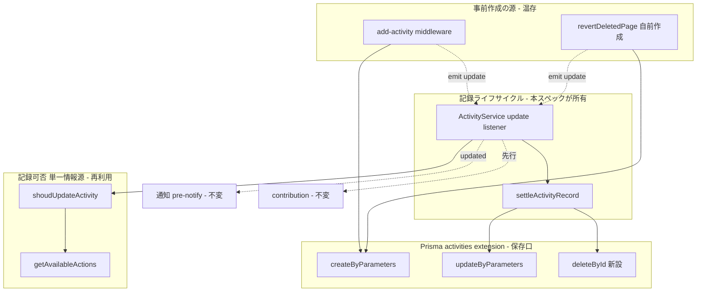
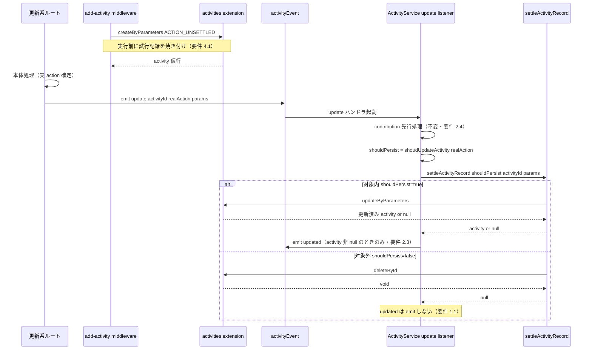
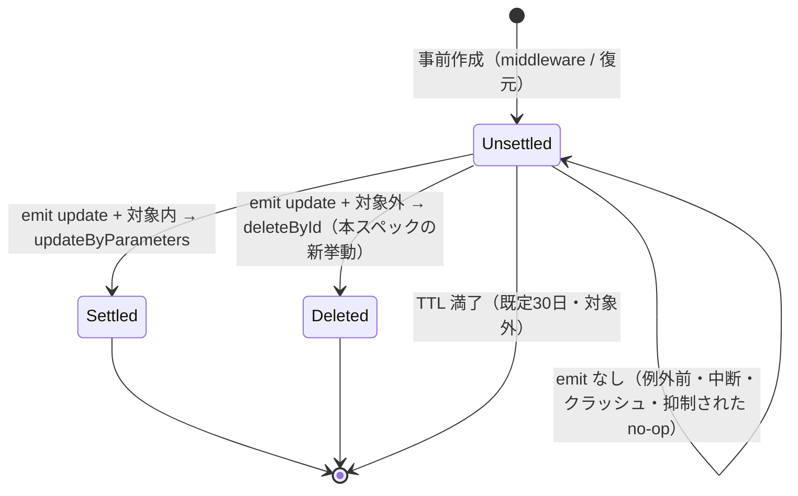

# Design Document

## Overview

**Purpose**: このスペックは activity log（監査ログ）の **記録ゲート**、すなわち「どの操作を activity レコードとして DB に永続化するか」を制御する。更新系（非 GET）経路で「記録対象外と確定した操作」の残骸行を今後残さないようにし、GROWI.cloud のようなマルチテナント運用で監査ログ由来の MongoDB 保管量を減らす。

**Users**: GROWI.cloud のようなマルチテナントの運用者（保管量負荷の軽減）と、監査・コンプライアンス対応を行う GROWI 管理者（失敗・中断した操作の追跡）。実装・保守する GROWI 開発者（記録ゲートの凝集度維持）。

**Impact**: 現行では、非 GET 経路は middleware が無条件に `ACTION_UNSETTLED`（まだ何の操作か確定していない仮の行）を1件作り、各ルートの確定（settle）イベントで実 action へ更新する二段構えになっている。対象外 action の場合は更新されず仮行が残り、TTL（既定30日）まで滞留する。本設計は settle 時に「対象外と確定した行」を削除する（**delete-at-settle**）ことでこの滞留をなくす。事前作成そのものは残すため、例外・中断・クラッシュで確定しなかった操作の「試行された」痕跡（fail-safe）は保持される。

### Goals

- 更新系経路で「記録可否が確定して対象外だった操作（emit 済み）」を今後 DB に永続化しない。
- 記録対象の判定を既存の単一の情報源（`getAvailableActions` / `shoudUpdateActivity`）に一本化したまま再利用し、判定ルールを二重に定義しない。
- 例外・中断で記録可否が確定しなかった操作の試行記録（操作者・時刻・エンドポイント・IP）を、確定して対象外だった操作と区別できる形で保持する。
- 記録ゲートの責務（記録可否の判断・記録ライフサイクルの確定）を、貢献度グラフ・通知・snapshot 内容・ルート固有ペイロードから独立させる。

### Non-Goals

- 既に DB に溜まっている未確定／対象外の残骸行の遡及的な掃除・移行（今後分のみ。既存分は TTL 任せ）。
- 書き込み回数（write-IOPS）の削減（本方式は保管量のみ削減する。§Performance のトレードオフ参照）。
- action グループの構成変更（どの action がどのグループ／essential に属するか）。
- 管理画面での記録対象トグルの追加、TTL・保持期間の値の変更。
- GET 経路の記録挙動の変更（既に対象外を作らない。維持のみ）。
- 記録された行の表示・整形（`activity-log-snapshot-viewer` の責務）、snapshot の型・中身（`activity-log-snapshot` の責務）。

## Boundary Commitments

### This Spec Owns

- **記録ライフサイクルの確定判定**: 更新系の settle 経路で、確定した action が記録対象なら永続化（更新）し、対象外なら削除する、という「行を残すか消すか」の決定。
- **削除の保存口（delete port）**: activity 行を id で削除する冪等な永続化操作（Prisma activities extension に新設する `deleteById`）。
- **記録可否判定の単一情報源の維持**: 既存の `getAvailableActions` / `shoudUpdateActivity` を記録ゲートの唯一の判定として使い続けること（複製・分岐を作らない）。
- **未確定行の意味の確定**: 本変更後、残存する `ACTION_UNSETTLED` 行は次の2種のみを含み、いずれも「記録可否が確定して対象外だった操作（②）」ではない、という不変条件: (a) 記録可否が確定しないまま終わった操作（例外・中断・確定前のプロセス停止＝クラッシュ）、(b) 操作自体は成功したが意図的に記録を抑制した更新（`shouldGenerateUpdate=false` の no-op）。つまり「②を消す」ことは保証するが、「残存 UNSETTLED＝失敗した試行」ではない（成功したが抑制された更新も含む）。

### Out of Boundary

- **事前作成そのものの廃止**（Option A / defer-create）。要件 4（クラッシュ含む試行記録の保持）を満たせないため採らない。事前作成 middleware（`add-activity.ts`）と復元フローの自前作成は温存する。
- **一覧・画面表示のフィルタ**（`build-activity-list-where.ts` を含む）。残存 `ACTION_UNSETTLED` 行をどう見せる／隠すかは表示の責務＝`activity-log-snapshot-viewer` が持つ。本スペックは変更しない。
- **snapshot の型・capture・中身**（`activity-log-snapshot`）。
- **貢献度グラフ・通知の内部**。記録ゲートは「どの行が残るか」を決めるだけで、これらの観察可能な挙動を変えない。
- **既存残骸の掃除・移行、TTL 値、action グループ構成**。

### Allowed Dependencies

- `ActivityService.getAvailableActions()` / `shoudUpdateActivity(action)` — 記録可否の単一情報源（再利用のみ。複製・改名しない）。
- Prisma activities extension（`models/activity.ts`）の保存口 — `createByParameters` / `updateByParameters`（既存）、`deleteById`（新設）。
- `add-activity.ts` middleware の事前作成 — 試行記録の作成源として温存する（fail-safe）。
- 依存してはならない: 貢献度グラフ内部、通知／pre-notify 内部、snapshot の中身、個々のルート固有ペイロード、一覧・表示のクエリ整形（`activity-log-snapshot-viewer` の責務）。

### Revalidation Triggers

以下の変更は、依存スペック・利用者に再検証を促す。

- **`ACTION_UNSETTLED` の意味変更**: 「ノイズ（確定して対象外＝②）＋試行記録の混在」から「②を除いた残り（失敗・中断・クラッシュの試行＋成功したが抑制された更新の no-op）」へ変わる。**残存 `ACTION_UNSETTLED` は失敗の証拠とは限らない**（成功した抑制更新を含む）。残存行を読む／表示する側（特に `activity-log-snapshot-viewer`、一覧 API）は、これらを一律「失敗した試行」と扱わないよう前提を再確認する。
- **書き込み口の拡張**: activities extension に削除口（`deleteById`）が加わる。「activity 行は作成後に削除されない」ことを前提にしていた消費者（行 id をキャッシュする箇所など）は再確認する。
- **新しい記録経路の追加規約**: 新たに `ACTION_UNSETTLED` を事前作成する経路を足す場合、記録可否ゲートを通すには**実 action で `activityEvent.emit('update', ...)` を発火する**必要がある（emit しない経路の仮行は削除されず、試行記録として残る）。記録ゲート側に action 固有の分岐を足す必要はない（単一情報源で決まる）。

## Architecture

### Existing Architecture Analysis

活動記録は2系統ある。

- **GET 経路**: `ActivityService.createActivity`（`service/activity.ts`）が保存前に `shoudUpdateActivity` で判定し、対象外なら行を作らない。**既に要件どおり**（本設計では変更しない）。
- **更新系（非 GET）経路**:
  1. `add-activity.ts` middleware が apiv3 認証チェーン内・ルート本体の**前**で、action 判定なしに `ACTION_UNSETTLED` の仮行を1件作成（`createByParameters`）し `res.locals.activity` に格納する。これは「危険な処理を実行する前に、操作が起きた事実（操作者・時刻・エンドポイント・IP）を焼き付ける」fail-safe として機能している。
  2. 各ルートが処理後半で `activityEvent.emit('update', activityId, parameters, ...)` を発火（実 action を emit する呼び出し元。テスト除きで 37 箇所 / 19 ファイル）。
  3. `ActivityService` の `update` リスナー（`service/activity.ts`）が `shoudUpdateActivity(action)` で判定。**対象内なら** `updateByParameters` で実 action へ更新し `updated` を emit、**対象外なら何もせず** `ACTION_UNSETTLED` のまま残す（← これが滞留の原因）。
  4. 第2の作成源: ページ復元 `revertDeletedPage`（`service/page/index.ts`）は middleware を通らず自前で `ACTION_UNSETTLED` を作り、同じ `update` リスナーへ emit する。

保持すべき既存パターン: 記録可否の単一情報源 `getAvailableActions`／`shoudUpdateActivity`、contribution を settle より先に確定させる順序、対象内かつ更新成功時のみ `updated` を emit する通知条件、Prisma activities extension が保存口を集約している構造。

### Architecture Pattern & Boundary Map

**選定パターン**: **delete-at-settle（Option B）＋記録ライフサイクルの薄い抽出**。事前作成を温存し、`update` リスナーの判定分岐を「対象内→更新／対象外→削除」に拡張する。記録可否の判断（＝単一情報源のゲート）と、その結果に基づく記録ライフサイクル（更新 or 削除）を分離し、貢献度・通知から独立させる（要件 3）。



**Architecture Integration**:

- **Selected pattern**: delete-at-settle。事前作成した仮行を settle 時に「対象外なら削除」する。要件 4（クラッシュ含む試行記録の保持）を満たすため事前作成を残す方式を選んだ（defer-create / lazy fail-safe を退けた理由は `research.md` §10 Decision 1）。
- **Domain/feature boundaries**: 「記録可否の判断（単一情報源）」「記録ライフサイクルの確定（更新 or 削除）」「貢献度」「通知」を別々のステップに保つ。削除の追加でリスナーが肥大化しないよう、記録ライフサイクルを `settleActivityRecord` へ薄く抽出する。
- **Existing patterns preserved**: 単一情報源ゲート、contribution 先行、通知条件（対象内かつ更新成功時のみ）、事前作成の fail-safe、保存口の集約（extension）。
- **New components rationale**: `deleteById`（削除の保存口。extension が保存操作を集約する既存パターンに従う）と `settleActivityRecord`（削除分岐追加による god-listener 化を避け、要件 3 のシームを明示する薄い純関数）。
- **Dependency direction**: `interfaces / config → models(extension: create/update/delete) → service/activity(settle logic) → service/activity.ts(orchestrator: gate + contribution + notify)`。左のレイヤーのみを import する。`settleActivityRecord` は `ActivityService` を import しない（循環回避のため記録可否結果は引数で受け取る）。

### Technology Stack

既存スタックの拡張であり、新規依存はない。影響レイヤーのみ記載する。

| Layer | Choice / Version | Role in Feature | Notes |
|-------|------------------|-----------------|-------|
| Backend / Services | Express（既存の Node v24 native ESM ランタイム） | `update` リスナーの orchestration と記録ライフサイクルの確定 | 新規依存なし |
| Data / Storage | MongoDB（レプリカセット rs0） + Prisma activities extension | `activities` コレクションの create/update/**delete**（保存口） | スキーマ変更なし。`deleteById` を extension に追加 |
| Messaging / Events | `activityEvent`（既存 EventEmitter、`update` / `updated`） | settle の起点と通知の送出 | 契約変更なし（対象外時に更新しない→削除する、という内部挙動のみ変わる） |

## File Structure Plan

### Directory Structure

```
apps/app/src/server/
├── middlewares/
│   └── add-activity.ts               # 変更なし（事前作成＝fail-safe の源。要件 4.1）
├── models/
│   └── activity.ts                   # 変更: Prisma extension に deleteById を新設（削除の保存口）
├── service/
│   ├── activity.ts                   # 変更: update リスナーを settleActivityRecord 経由に組み替え
│   └── activity/
│       ├── index.ts                  # 変更: settle-activity-record を re-export
│       ├── settle-activity-record.ts # 新規: 記録ライフサイクルの確定（更新 or 削除）純関数
│       └── update-activity-logic.ts  # 変更なし（shouldGenerateUpdate は既存のまま）
└── routes/apiv3/
    └── build-activity-list-where.ts  # 変更なし（表示フィルタは viewer spec の責務。§Out of Boundary）
```

### Modified Files

- `apps/app/src/server/models/activity.ts` — Prisma activities extension に `deleteById(activityId)` を追加。id 指定で1行を削除する冪等な保存口（`deleteMany({ where: { id } })` 相当で、対象行が無くても throw しない）。snapshot spec の設計が予約していた「直接削除の保存口」を実体化する。
- `apps/app/src/server/service/activity.ts` — `update` リスナーを組み替える。「contribution 先行（不変）→ `shouldPersist = shoudUpdateActivity(action)` を算出 → `settleActivityRecord({...})` で更新 or 削除 → 戻り値が非 null（＝対象内かつ更新成功）のときのみ従来どおり `updated` を emit」。対象外分岐がこれまでの no-op から削除に変わる。
- `apps/app/src/server/service/activity/settle-activity-record.ts` — **新規**。記録可否の判断結果 `shouldPersist` を引数で受け取り、真なら `updateByParameters`、偽なら `deleteById` を呼ぶ薄い純関数。contribution・通知・snapshot・ルート固有データに依存しない（要件 3.1/3.2）。
- `apps/app/src/server/service/activity/index.ts` — バレルに `export * from './settle-activity-record'` を追加（親 `service/activity.ts` はバレル経由で import する）。

### 変更しないファイル（意図的に対象外）

- `apps/app/src/server/middlewares/add-activity.ts` — 事前作成を温存（要件 4.1 の試行記録の源）。既存契約テストもグリーンのまま。
- `apps/app/src/server/service/page/index.ts`（`revertDeletedPage` 等の第2作成源） — 同じ `update` リスナーへ emit するため、追加改修不要（`research.md` §10 Decision 2）。
- 実 action を emit する `activityEvent.emit('update', ...)` 呼び出し元（テスト除きで 37 箇所 / 19 ファイル）— 無改修。
- `apps/app/src/server/routes/apiv3/build-activity-list-where.ts` — 表示フィルタは対象外。

## System Flows

### 更新系リクエストの記録ライフサイクル（settle シーケンス）



### `ACTION_UNSETTLED` 行のライフサイクル（3分類の帰結）



- **設計上の要点**: 削除は「settle 経路（emit を受け取り、かつゲートで対象外）」でのみ発火する。emit が来ない経路（例外・中断・クラッシュ・`shouldGenerateUpdate=false` による抑制された更新）の仮行には触れない。結果として、残存 `ACTION_UNSETTLED` からは「確定して対象外だった②」だけが除かれ、(a) 失敗・中断・クラッシュした試行と (b) 成功したが抑制された更新（no-op）が残る（要件 4.2/4.3：②との区別が成立する。ただし残存＝失敗の証拠とは限らない点に注意）。既存の滞留分と emit なしの残骸は従来どおり TTL で消える（対象外）。

## Requirements Traceability

| Requirement | Summary | Components | Interfaces / Flows |
|-------------|---------|------------|--------------------|
| 1.1 | 対象外（確定・emit 済み）を永続化しない | `settleActivityRecord`（削除分岐）, `deleteById`, update listener | settle シーケンス（対象外分岐） |
| 1.2 | 対象内は従来どおり永続化 | `settleActivityRecord`（更新分岐）, `updateByParameters`（不変） | settle シーケンス（対象内分岐） |
| 1.3 | GET 経路の挙動を変えない | `createActivity`（不変） | 変更なし（維持のみ） |
| 1.4 | 判定は単一情報源・複製しない | `shoudUpdateActivity` / `getAvailableActions`（再利用） | listener が結果を注入 |
| 2.1 | essential は常に永続化 | `getAvailableActions`（不変。ゲート経路は既定引数 `isIncludeEssentialActions=true` で essential を union するため常に永続化。表示経路は `false` を渡して除外するが本 spec の対象外） | 対象内→更新分岐 |
| 2.2 | `auditLogEnabled=false` は essential のみ | `getAvailableActions`（不変・冒頭分岐） | 対象内→更新分岐 |
| 2.3 | 通知を従来どおり送出 | update listener の通知ブロック（不変・非 null 時のみ） | settle シーケンス（updated） |
| 2.4 | 貢献度集計を変えない | contribution ブロック（不変・settle 前・別コレクション） | contribution 先行 |
| 2.5 | グループ構成を変えない | `interfaces/activity.ts`（不変） | — |
| 3.1 | 記録可否は action のみで判断（ペイロード非依存） | `shoudUpdateActivity`, `settleActivityRecord`（結果を引数で受領） | — |
| 3.2 | ゲート責務を記録可否に限定（貢献度・通知に非依存） | `settleActivityRecord`（分離された薄い純関数） | — |
| 3.3 | 新 action / 新経路は単一情報源で決まる（分岐追加不要） | ゲートのデータ駆動維持 + 復元フローの共通リスナー | settle シーケンス（共通経路） |
| 4.1 | 例外・中断時の試行記録を保持 | `add-activity` middleware 事前作成（温存） | UNSETTLED ライフサイクル（emit なし分岐） |
| 4.2 | 未確定の試行記録を「確定して対象外」と区別 | ②（確定して対象外）を削除するため、残存 UNSETTLED は②以外（失敗・中断の試行＋抑制 no-op）に限られ、②と区別される | UNSETTLED ライフサイクル |
| 4.3 | 未確定であることを区別できる形で保持 | `ACTION_UNSETTLED` を行に保持（不変） | UNSETTLED ライフサイクル |

## Components and Interfaces

| Component | Domain/Layer | Intent | Req Coverage | Key Dependencies (P0/P1) | Contracts |
|-----------|--------------|--------|--------------|--------------------------|-----------|
| ActivityExtension.deleteById | Data / 保存口 | id 指定で activity 行を冪等に削除 | 1.1, 4.2 | Prisma client (P0) | Service |
| settleActivityRecord | Service / 記録ライフサイクル | 記録可否の結果に基づき更新 or 削除 | 1.1, 1.2, 3.1, 3.2 | updateByParameters (P0), deleteById (P0) | Service |
| ActivityService update listener | Service / orchestrator | ゲート判定 → contribution → settle → 通知 | 1.1, 1.2, 1.4, 2.1, 2.3, 2.4, 3.3 | shoudUpdateActivity (P0), settleActivityRecord (P0) | Event |
| add-activity middleware | Middleware / 事前作成 | 実行前に試行記録を焼き付け（温存） | 4.1 | createByParameters (P0) | Service（不変） |
| getAvailableActions / shoudUpdateActivity | Service / 単一情報源 | 記録対象集合の算出と可否判定（再利用） | 1.4, 2.1, 2.2, 3.1, 3.3 | configManager (P0) | Service（不変） |

詳細ブロックは新規／変更で境界が動く3コンポーネントのみ記す。`getAvailableActions` / `createActivity` / middleware は不変のため要約行のみ。

### Data / 保存口

#### ActivityExtension.deleteById

| Field | Detail |
|-------|--------|
| Intent | activity 行を id 指定で冪等に削除する保存口 |
| Requirements | 1.1, 4.2 |

**Responsibilities & Constraints**

- `activities` コレクションから id 一致の1行を削除する。対象行が存在しなくても throw せず no-op（冪等）。二重 settle・既に消えた行・emit なしで作られていない id にも頑健。
- 保存口の集約（extension が create/update/delete を持つ）に従う。snapshot spec の設計が予約していた「直接削除の保存口」を実体化する。
- スキーマ変更なし。削除は物理削除（論理削除フラグは導入しない）。

**Dependencies**

- Outbound: Prisma client `activities`（`deleteMany`）— 削除実行（P0）

**Contracts**: Service [x]

##### Service Interface

```typescript
// apps/app/src/server/models/activity.ts（Prisma activities extension 内に追加）
interface ActivityDeletePort {
  /**
   * Delete an activity row by id. Idempotent: deleting a non-existent id is a
   * no-op (never throws P2025), so double-settle / already-gone rows are safe.
   * Realizes the "直接削除の保存口" reserved by the activity-log-snapshot design.
   */
  deleteById(activityId: string): Promise<void>;
}
```

- Preconditions: `activityId` は文字列の ObjectId。
- Postconditions: 一致行があれば削除、無ければ何もしない。いずれも例外を投げない（想定外の DB エラーのみ伝播）。
- Invariants: contribution（別コレクション `Contribution`）に影響しない。snapshot・通知の状態に触れない。

### Service / 記録ライフサイクル

#### settleActivityRecord

| Field | Detail |
|-------|--------|
| Intent | 記録可否の結果に基づき、対象内なら更新・対象外なら削除する薄い純関数 |
| Requirements | 1.1, 1.2, 3.1, 3.2 |

**Responsibilities & Constraints**

- 記録可否の**判断は行わない**。判断結果 `shouldPersist: boolean`（`= ActivityService.shoudUpdateActivity(action)`）を**引数で受け取る**。これにより単一情報源（`getAvailableActions`）を複製せず（要件 1.4）、この関数は記録可否ロジック・貢献度・通知の内部に一切依存しない（要件 3.1/3.2）。
- `shouldPersist=true` → `updateByParameters(activityId, activityParameters)` を呼び、更新済み activity（見つからなければ null）を返す。`shouldPersist=false` → `deleteById(activityId)` を呼び、`null` を返す。
- 通知の送出・contribution 処理は**呼び出し側（listener）に残す**。この関数の戻り値（activity or null）で「通知すべきか」を呼び出し側が判断できる。

**Dependencies**

- Outbound: `updateByParameters`（対象内・P0）, `deleteById`（対象外・P0）
- 依存してはならない: `ActivityService`（循環回避）, 貢献度グラフ, 通知/pre-notify, snapshot 中身, ルート固有ペイロード

**Contracts**: Service [x]

##### Service Interface

```typescript
// apps/app/src/server/service/activity/settle-activity-record.ts
import type { ActivityWithUser } from '~/server/models/activity';
import type { IActivityUpdateParameters } from '~/server/models/activity';

type SettleActivityRecordInput = {
  activityId: string;
  /** = ActivityService.shoudUpdateActivity(action). Injected, never computed here. */
  shouldPersist: boolean;
  /** Update params with `contributor` already stripped by the caller. */
  activityParameters: IActivityUpdateParameters;
};

/**
 * Settle the pre-created ACTION_UNSETTLED row:
 *  - shouldPersist=true  -> updateByParameters (returns activity | null on not-found)
 *  - shouldPersist=false -> deleteById (returns null)
 * Pure record-lifecycle policy: no gate logic, no contribution, no notification.
 */
export function settleActivityRecord(
  input: SettleActivityRecordInput,
): Promise<ActivityWithUser | null>;
```

- Preconditions: `activityId` は先に作成された `ACTION_UNSETTLED` 行を指す。`activityParameters` から `contributor` は除去済み。
- Postconditions: 戻り値が非 null なら「対象内かつ更新成功」。null なら「対象外で削除した」または「対象内だが更新対象が見つからなかった（P2025）」。どちらの null も通知はしない。
- Invariants: 記録可否の判断を内部で行わない。副系（記録）の失敗はリクエスト本体を止めない（想定外エラーは呼び出し側が捕捉）。

### Service / orchestrator

#### ActivityService update listener（変更）

| Field | Detail |
|-------|--------|
| Intent | `update` イベントを受けて「ゲート判定 → contribution → settle → 通知」を統括 |
| Requirements | 1.1, 1.2, 1.4, 2.1, 2.3, 2.4, 3.3 |

**Responsibilities & Constraints**

- 既存の順序と条件を厳密に保存する: (1) `contributor` を分離、(2) contribution を settle より先に処理（不変・要件 2.4）、(3) `shouldPersist = this.shoudUpdateActivity(action)` を単一情報源で算出（要件 1.4/3.1）、(4) `settleActivityRecord` に委譲、(5) 戻り値が非 null のときのみ従来どおり `updated` を emit（`generatePreNotify` 有無の分岐も保存・要件 2.3）。
- 変更点は「対象外分岐」のみ: これまでの no-op を `settleActivityRecord` 経由の `deleteById` に置き換える（要件 1.1）。
- 記録（settle）の失敗はリクエスト本体を止めない: settle 呼び出しを try/catch で囲み、エラーは `logger.error` して通知せず return（現行の update 失敗時挙動を踏襲）。

**Dependencies**

- Inbound: `activityEvent.emit('update', ...)`（middleware 経路と復元フローの両方。要件 3.3）
- Outbound: `shoudUpdateActivity`（判定・P0）, `settleActivityRecord`（記録ライフサイクル・P0）, `activityEvent.emit('updated', ...)`（通知・不変）

**Contracts**: Event [x]

##### Event Contract

- Subscribed: `activityEvent 'update' (activityId, parameters, target?, generatePreNotify?, getAdditionalTargetUsers?)`（契約不変）
- Published: `activityEvent 'updated' (activity, target?, preNotify?)` — 発火条件不変（対象内かつ更新成功時のみ）。対象外時は発火しない（従来と同じく通知なし。内部挙動が no-op → delete に変わるのみ）。
- Ordering / delivery: contribution → settle → 通知 の順を保存。各 activity への `update` emit は1回（二重 settle なし。冪等な `deleteById` / P2025→null により多重発火にも頑健）。

**Implementation Notes**

- Integration: `settleActivityRecord` はバレル `~/server/service/activity` から import。`shouldPersist` は listener 側で算出して注入（`settleActivityRecord` はゲートを知らない）。
- Validation: contribution 先行・通知条件・`generatePreNotify` 分岐の保存を回帰テストで担保（§Testing）。
- Risks: 通知条件や順序の取りこぼしが要件 2.3/2.4 の回帰になる。settle 抽出時は「非 null のときのみ通知」を厳守する。

## Data Models

**スキーマ変更なし。** `activities` コレクションと `ACTION_UNSETTLED` の扱いは現行のまま。本設計が変えるのは「対象外と確定した行を残すか削除するか」という挙動のみで、フィールドの追加・変更はない。

- **Domain invariant（本変更で確立）**: 更新系経路で確定した action が記録対象外の場合、その activity 行は永続化されない（settle 時に削除される）。残存する `ACTION_UNSETTLED` 行からは「確定して対象外だった②」が除かれ、「記録可否が確定しないまま終わった操作（例外・中断・クラッシュ）」と「成功したが記録を抑制した更新（no-op）」だけが残る。
- **削除の性質**: 物理削除。当該行はそのリクエストの中でだけ触られる（作成直後に同一リクエストの listener が settle する）ため、トランザクションや排他制御は不要。
- **contribution との関係**: contribution は別コレクション `Contribution` に記録され、`resolveContributor` は `contributor._id` があれば activity 行を引かない。かつ contribution action は実効ゲート上常に対象内（essential）で削除対象にならない。したがって行の削除は貢献度集計に影響しない（要件 2.4）。

## Error Handling

### Error Strategy

活動記録は best-effort な副系であり、記録処理の失敗はリクエスト本体（ユーザー操作）を止めない。既存の「recording failure must not stop main flow」方針を踏襲する。

### Error Categories and Responses

- **削除・更新の DB エラー（System 5xx 相当）**: `settleActivityRecord` は想定外エラーを伝播し、listener が try/catch で `logger.error` して通知せず return（現行の update 失敗時挙動と同じ）。リクエスト本体は継続。
- **更新対象が存在しない（P2025）**: `updateByParameters` は既存どおり null を返す（throw しない）。listener は非 null 時のみ通知するため、null なら通知なしで正常終了。
- **削除対象が存在しない**: `deleteById` は冪等（`deleteMany` 相当）で no-op。二重 settle・emit なしで作られていない id にも安全。
- **emit が来ないケース（例外前・中断・クラッシュ・抑制された no-op）**: 事前作成した `ACTION_UNSETTLED` 行はそのまま残る（要件 4 の試行記録）。削除は settle 経路でのみ発火するため、これらには触れない。既存滞留分と同様、TTL で消える。

### Monitoring

- 既存の `growi:service:ActivityService` / `growi:middlewares:add-activity` logger を使用。対象外行の削除時に debug ログを1行残すと運用観測に有用（任意）。新たな監視基盤は追加しない。

## Testing Strategy

受け入れ基準から導出する。結合試験は per-worker 分離・記録対象/対象外の設定を明示注入（`process.env` を直接書き換えない）で行う（steering: tdd / brief の制約）。TDD（red→green）で進める。

### Unit Tests

- `deleteById` の冪等性（`models/activity` extension・integ）: 既存行を削除できる／存在しない id でも throw せず no-op。(1.1, 4.2)
- `settleActivityRecord`（`shouldPersist=false`）: `deleteById` を呼び `null` を返し、`updateByParameters` を呼ばない。(1.1)
- `settleActivityRecord`（`shouldPersist=true`）: `updateByParameters` を渡した params で呼び activity を返す／not-found は null を伝播。(1.2)
- update listener（対象外・非 essential かつ `auditLogEnabled=false`）: `deleteById` が呼ばれ、`updated` を emit しない（既存 `activity.spec.ts` L247-267 の契約を「skips prisma」から「deletes row」へ改訂）。(1.1)
- update listener（essential action）: `updateByParameters` が呼ばれ `updated` を emit（不変）。contribution 先行・通知条件も保存。(1.2, 2.1, 2.3, 2.4)

### Integration Tests

- 非 GET・対象外 action を settle → 当該行が `activities` に残らない（②の除去）。(1.1)
- 非 GET・対象内 action を settle → 実 action の行が永続化され、通知の副作用が従来どおり。(1.2, 2.3)
- 非 GET・emit 前に例外（settle されない）→ `ACTION_UNSETTLED` 行が残る（試行記録の保持）。(4.1, 4.3)
- `auditLogEnabled=false` → essential のみ永続化、非 essential は settle 時に削除。(2.1, 2.2)
- contribution action（例: `ACTION_PAGE_CREATE`）→ 変更前後で貢献度集計が不変。(2.4)

### E2E/UI Tests

- 本スペックはバックエンドの記録挙動のみで UI を持たない。表示は `activity-log-snapshot-viewer` の責務のため E2E は対象外。結合試験でカバーする。

## Performance & Scalability

- **本方式（delete-at-settle）が減らすのは保管量（stored document 数）**であり、対象外行を作らないわけではないため**書き込み回数（write-IOPS）は減らない**（create の後に delete が加わる）。要件 1 の目的のうち「保管量負荷」に効き、「write 負荷」には効かない。これは要件 4（クラッシュ含む試行記録の保持）を優先した結果の受容済みトレードオフ（`research.md` §10 Decision 1）。
- write-IOPS 削減を優先したくなった場合の代替は Option C（lazy fail-safe: 対象外を書かず、失敗時のみ試行記録を作る）だが、プロセス即死時の試行記録を取りこぼすため本スペックでは採らない。将来 write 負荷が主眼になった時点で別途判断する（Revalidation）。
- 大量カスケード削除時のボリューム制御・スロットリングは将来課題（flagship の関心マップ参照）で本スペックの対象外。

## Migration Strategy

データ移行なし。既に DB に溜まっている未確定／対象外の残骸行の遡及掃除は対象外（要件 Out of scope）で、従来どおり TTL（既定30日）で消える。本変更は「今後 settle される行」の挙動のみを変える。ロールバックはコード revert で足りる（スキーマ・データの不可逆変更がない）。
