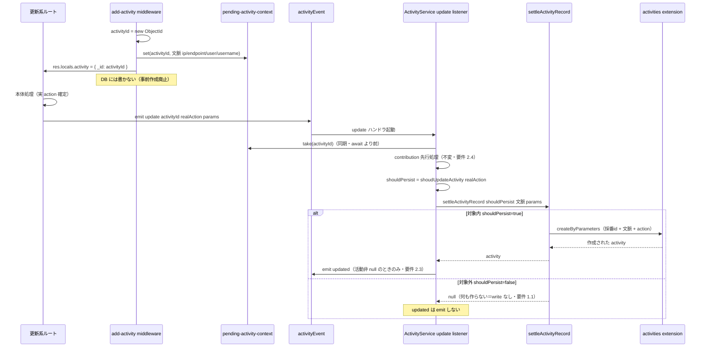
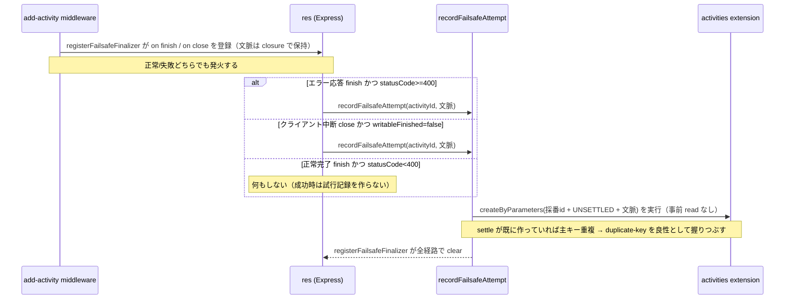
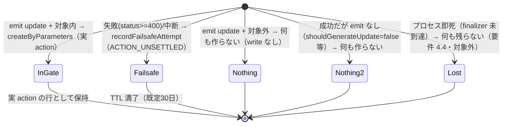

# Design Document

## Overview

**Purpose**: このスペックは activity log（監査ログ）の **記録ゲート**、すなわち「どの操作を activity レコードとして DB に永続化するか」を制御する。更新系（非 GET）経路で「記録対象外と確定した操作」の行を**そもそも書き込まない**ようにし、GROWI.cloud のようなマルチテナント運用で監査ログ由来の更新系書き込み（write 回数・ホットパス遅延）を減らす。

**Users**: GROWI.cloud のようなマルチテナントの運用者（書き込み負荷の軽減）と、監査・コンプライアンス対応を行う GROWI 管理者（失敗・中断した操作の追跡）。実装・保守する GROWI 開発者（記録ゲートの凝集度維持）。

**Impact**: 現行では、非 GET 経路は middleware が無条件に `ACTION_UNSETTLED`（まだ何の操作か確定していない仮の行）を1件**作成**し、各ルートの確定（settle）イベントで実 action へ**更新**する二段構えになっている。対象外 action の場合は更新されず仮行が残り、TTL（既定30日）まで滞留する。本設計は方式を **Option C（lazy fail-safe）** に確定し、事前作成そのものを廃止する。middleware は DB に書かず ObjectId を採番するだけにし、**記録対象内と確定した操作だけを settle 時に作成**、記録対象外は何も作らない。失敗・中断した操作だけ、リクエスト終了時の finalizer が試行記録を残す。

> **方式の変遷**: 2026-07-07 の初回設計では Option B（delete-at-settle）に確定していたが、2026-07-08 の validate-design で「保管量削減は TTL があり重要でない／B は delete が増えて負荷がむしろ上がる／クラッシュ時の試行記録は大事」というユーザー指摘を受け、Option C へ反転した。経緯は `research.md` §10 Decision 1 を参照。

### Goals

- 更新系経路で「記録対象外と確定した操作」を今後 DB に**書き込まない**（②の行を作らない＝その分の write を発生させない）。
- 事前作成をホットパスから外し、更新系の**書き込み回数と遅延**を実際に減らす（記録対象内も create+update の2回から create 1回へ）。
- 記録対象の判定を既存の単一の情報源（`getAvailableActions` / `shoudUpdateActivity`）に一本化したまま再利用し、判定ルールを二重に定義しない。
- 失敗・中断（エラー応答 4xx/5xx・クライアント中断）で記録可否が確定しなかった操作の試行記録（操作者・時刻・エンドポイント・IP）を、記録対象内で正常記録された操作と区別できる形で保持する。
- 記録される行が従来どおり操作文脈（IP・エンドポイント・操作者・操作者名）を保持する（事前作成廃止で記録行のフィールドを欠損させない）。
- 記録行の作成時刻（`createdAt`）を、行を作る settle/finalizer 時点ではなく**リクエスト到着時刻**に保つ（事前作成廃止で監査時刻を後ろ倒しにしない。文脈に到着時刻を含めて `createByParameters` に渡す＝Issue 3）。
- 記録ゲートの責務（記録可否の判断・記録ライフサイクルの確定）を、貢献度グラフ・通知・snapshot 内容・ルート固有ペイロードから独立させる。

### Non-Goals

- 既に DB に溜まっている未確定／対象外の残骸行の遡及的な掃除・移行（今後分のみ。既存分は TTL 任せ）。
- **プロセス即時終了（SIGKILL / OOM など、リクエスト終了時の後始末に到達しない停止）時の試行記録の保持**（要件 4.4 で対象外と合意した受容済みトレードオフ）。
- 保管量（stored document 数）そのものの削減を主眼にすること（残骸は従来どおり TTL で回収される）。
- action グループの構成変更（どの action がどのグループ／essential に属するか）。
- 管理画面での記録対象トグルの追加、TTL・保持期間の値の変更。
- GET 経路の記録挙動の変更（既に対象外を作らない。維持のみ）。
- 記録された行の表示・整形（`activity-log-snapshot-viewer` の責務）、snapshot の型・中身（`activity-log-snapshot` の責務）。
- 「直接削除の保存口」（`deleteById`）の新設（Option B で予定していたが、C は削除しないため不要。snapshot spec の予約は将来課題として残す）。

## Boundary Commitments

### This Spec Owns

- **記録ライフサイクルの確定判定**: 更新系の settle 経路で、確定した action が記録対象なら**作成**し、対象外なら何もしない、という「行を作るか作らないか」の決定。
- **リクエスト文脈の突き合わせ機構**: middleware で分かる文脈（IP・エンドポイント・操作者・操作者名・**到着時刻**）を、後から emit で確定する action と突き合わせて1行にまとめる仕組み（`activityId → 文脈` のプロセスローカルマップ）。事前作成を廃止した結果、この突き合わせ（と、記録行が到着時刻を保つこと＝Issue 3）を自前で持つ必要が生じた（要件 2.6）。マップの掃除はイベント駆動で確定的に行い、live エントリを時間・サイズで消さない。
- **失敗・中断時の fail-safe 試行記録**: リクエストがエラー応答（4xx/5xx）またはクライアント中断で終わった場合に、`ACTION_UNSETTLED` の試行記録を1件だけ作る finalizer。二重作成防止付き。
- **記録可否判定の単一情報源の維持**: 既存の `getAvailableActions` / `shoudUpdateActivity` を記録ゲートの唯一の判定として使い続けること（複製・分岐を作らない）。
- **未確定行の意味の確定（C 版）**: 本変更後、残存する `ACTION_UNSETTLED` 行は finalizer が作るものだけ、すなわち**「失敗・中断した試行」に限定される**という不変条件。記録対象外だった操作（②）はそもそも作られないため、残存 UNSETTLED に混ざらない。

### Out of Boundary

- **一覧・画面表示のフィルタ**（`build-activity-list-where.ts` を含む）。残存 `ACTION_UNSETTLED` 行（＝失敗・中断した試行）をどう見せる／隠すかは表示の責務＝`activity-log-snapshot-viewer` が持つ。本スペックは変更しない。
- **snapshot の型・capture・中身**（`activity-log-snapshot`）。
- **貢献度グラフ・通知の内部**。記録ゲートは「どの行が残るか」を決めるだけで、これらの観察可能な挙動を変えない。
- **既存残骸の掃除・移行、TTL 値、action グループ構成**。
- **プロセス即時終了時の試行記録**（要件 4.4・Non-Goals）。

### Allowed Dependencies

- `ActivityService.getAvailableActions()` / `shoudUpdateActivity(action)` — 記録可否の単一情報源（再利用のみ。複製・改名しない）。
- Prisma activities extension（`models/activity.ts`）の保存口 — `createByParameters`（**採番 id を受け付けるよう `IActivityParameters` に `id?` を追加**）。`updateByParameters` は本経路では使わなくなる（他経路の既存利用は温存）。
- `mongoose` の `Types.ObjectId` — id 採番（既存 `models/activity.ts` と同じ手）。
- Express の `res`（`res.on('finish' | 'close')`, `res.statusCode`, `res.writableFinished`）— finalizer のフック。
- 依存してはならない: 貢献度グラフ内部、通知／pre-notify 内部、snapshot の中身、個々のルート固有ペイロード、一覧・表示のクエリ整形（`activity-log-snapshot-viewer` の責務）。

### Revalidation Triggers

以下の変更は、依存スペック・利用者に再検証を促す。

- **`ACTION_UNSETTLED` の意味変更（C 版）**: 「ノイズ（確定して対象外＝②）＋試行記録の混在」から、**「失敗・中断した試行」だけ**へ変わる。②はそもそも作られなくなる。残存行を読む／表示する側（特に `activity-log-snapshot-viewer`、一覧 API）は、残存 `ACTION_UNSETTLED` を「失敗・中断した試行」として扱ってよい（B 案での「成功した抑制更新も混ざる」という注意は C では不要になった）。ただし過去に溜まった残骸（②を含む旧データ）は TTL 満了まで併存する点に注意。
- **事前作成の廃止**: middleware は非 GET で DB に書かなくなる（id 採番＋文脈 stash＋finalizer 登録のみ）。「middleware が必ず行を1件作る」ことを前提にしていた消費者は再確認する。`res.locals.activity` は DB から読んだ行ではなく `{ _id }` の in-memory オブジェクトになる（`_id` 以外のフィールドを読む消費者がいれば要修正。現状は `_id` のみ読む 37 箇所と `getIdStringForRef` 1 箇所で問題なし）。
- **記録行の生成タイミングの後ろ倒し**: 記録対象内の行は「リクエスト前」ではなく「settle 時」に作られる。行 id を事前に採番して返すので id は不変だが、「middleware 直後に DB を引けば行がある」ことを前提にしていた箇所は再確認する。
- **新しい記録経路の追加規約**: 新たに更新系の記録経路を足す場合、(1) 文脈を stash して id を採番し（middleware 経由なら自動）、(2) 実 action で `activityEvent.emit('update', ...)` を発火すれば、記録可否ゲートは単一情報源で決まる。記録ゲート側に action 固有の分岐を足す必要はない。

## Architecture

### Existing Architecture Analysis

活動記録は2系統ある。

- **GET 経路**: `ActivityService.createActivity`（`service/activity.ts`）が保存前に `shoudUpdateActivity` で判定し、対象外なら行を作らない。**既に要件どおり**（本設計では変更しない）。この「gated-create」は C が更新系に導入するパターンと同型である。
- **更新系（非 GET）経路**（現行 = 二段構え）:
  1. `add-activity.ts` middleware が apiv3 認証チェーン内・ルート本体の**前**で、action 判定なしに `ACTION_UNSETTLED` の仮行を1件作成（`createByParameters`）し `res.locals.activity` に格納する。この行が「実行前に文脈（IP・エンドポイント・操作者・時刻）を焼き付ける」fail-safe と、「後から action を突き合わせる合流点」の**両方**を兼ねている。
  2. 各ルートが処理後半で `activityEvent.emit('update', activityId, parameters, ...)` を発火（実 action を emit する呼び出し元。テスト除きで 37 箇所 / 19 ファイル）。第1引数は実質すべて `res.locals.activity._id`。
  3. `ActivityService` の `update` リスナー（`service/activity.ts:101-179`）が `shoudUpdateActivity(action)` で判定。**対象内なら** `updateByParameters` で実 action へ更新し `updated` を emit、**対象外なら何もせず** `ACTION_UNSETTLED` のまま残す（← これが滞留の原因）。この update は既存行の IP・エンドポイントを保持したまま action だけ上書きしている（`models/activity.ts:307-347`）。
  4. 第2の作成源: ページ復元 `revertDeletedPage`（`service/page/index.ts`）は middleware を通らず自前で `ACTION_UNSETTLED` を作り、同じ `update` リスナーへ emit する。

**保持すべき既存パターン**: 記録可否の単一情報源 `getAvailableActions`／`shoudUpdateActivity`、contribution を settle より先に確定させる順序、対象内かつ記録成功時のみ `updated` を emit する通知条件、Prisma activities extension が保存口を集約している構造、GET 経路の gated-create。

**実コード確認で判明した制約（C の設計の要）**: settle する `update` リスナーは `req`/`res` を持たず `activityId` しか受け取らない（`service/activity.ts:103-110`）。emit パラメータにも IP・エンドポイント・user は載っていない。したがって事前作成を廃止すると、記録行に IP・エンドポイントを載せる手段が失われる。C はこれを補うため、middleware（文脈を知る）とリスナー（action を知る）を `activityId` で突き合わせるプロセスローカルマップを導入する。

### Architecture Pattern & Boundary Map

**選定パターン**: **lazy fail-safe（Option C）＋記録ライフサイクルの薄い抽出**。事前作成を廃止し、`update` リスナーの判定分岐を「対象内→作成／対象外→何もしない」に変える。失敗・中断は finalizer が試行記録を作る。記録可否の判断（＝単一情報源のゲート）と、その結果に基づく記録ライフサイクル（作成 or 何もしない）を分離し、貢献度・通知から独立させる（要件 3）。

```mermaid
graph TB
    subgraph MW[add-activity middleware - 事前作成を廃止]
        MINT[ObjectId 採番]
        STASH[文脈を pending map に set]
        FIN[res finish/close に finalizer 登録]
    end
    subgraph Ctx[pending-activity-context - プロセスローカルマップ 本スペック所有]
        MAP[(activityId to 文脈)]
    end
    subgraph Gate[記録可否 単一情報源 - 再利用]
        GAA[getAvailableActions]
        SUA[shoudUpdateActivity]
    end
    subgraph Lifecycle[記録ライフサイクル - 本スペック所有]
        LIS[ActivityService update listener]
        SET[settleActivityRecord]
        RFA[recordFailsafeAttempt]
    end
    subgraph Ports[Prisma activities extension - 保存口]
        CRE[createByParameters 採番id対応]
    end
    MINT --> STASH
    STASH --> MAP
    MINT -.res.locals.activity._id.-> ROUTE[更新系ルート]
    ROUTE -.emit update.-> LIS
    LIS -->|同期 take| MAP
    LIS --> SUA
    SUA --> GAA
    LIS --> SET
    SET -->|対象内のみ| CRE
    LIS -.updated.-> Notify[通知 pre-notify - 不変]
    LIS -.先行.-> Contrib[contribution - 不変]
    FIN -->|status>=400 / 中断| RFA
    RFA -->|create＋dup-key吸収| CRE
    RFA -.後始末.-> MAP
```

**Architecture Integration**:

- **Selected pattern**: lazy fail-safe。事前作成を廃止し、記録対象内だけを settle 時に作成、失敗・中断だけ finalizer で試行記録を作る（Option A/B を退けた理由は `research.md` §10 Decision 1）。
- **Domain/feature boundaries**: 「記録可否の判断（単一情報源）」「記録ライフサイクルの確定（作成 or 何もしない）」「文脈の突き合わせ（マップ）」「失敗時の試行記録（finalizer）」「貢献度」「通知」を別々のユニットに保つ。
- **Existing patterns preserved**: 単一情報源ゲート、contribution 先行、通知条件（対象内かつ記録成功時のみ）、保存口の集約（extension）、GET 経路の gated-create。
- **New components rationale**: `pending-activity-context`（middleware とリスナーを activityId で突き合わせるプロセスローカルマップ。事前作成廃止で必要になった合流点）、`settleActivityRecord`（対象内なら作成・対象外なら何もしない薄い純関数。要件 3 のシーム）、`recordFailsafeAttempt`（失敗・中断時の試行記録を作る finalizer 本体。二重作成防止付き）。
- **Dependency direction**: `interfaces / config → models(extension: create) → service/activity(pending-context, settle logic, failsafe logic) → middlewares/add-activity（stash + finalizer 登録）／service/activity.ts(orchestrator: gate + contribution + notify)`。`settleActivityRecord` / `recordFailsafeAttempt` は `ActivityService` を import しない（循環回避のため記録可否結果・文脈は引数で受け取る）。

### Technology Stack

既存スタックの拡張であり、新規依存はない。影響レイヤーのみ記載する。

| Layer | Choice / Version | Role in Feature | Notes |
|-------|------------------|-----------------|-------|
| Backend / Middleware | Express（既存の Node v24 native ESM ランタイム） | 事前作成廃止・id 採番・文脈 stash・`res` finalizer 登録 | `mongoose` の `Types.ObjectId` を利用 |
| Backend / Services | Express `activityEvent` リスナー | settle 時の gated-create、contribution・通知の orchestration | 新規依存なし |
| Data / Storage | MongoDB（レプリカセット rs0） + Prisma activities extension | `activities` の create（採番 id 指定）。update/delete は本経路で使わない | スキーマ変更なし。`IActivityParameters` に `id?` 追加 |
| In-process state | プロセスローカル `Map`（新規モジュール） | `activityId → リクエスト文脈` の突き合わせ | 単一プロセス内で完結。掃除はイベント駆動で確定的（middleware=`res` close/finish、復元=emit 経路の error ハンドラ）。時間・サイズによる live エントリの追い出しはしない（数分かかる処理でも誤 sweep しない） |
| Messaging / Events | `activityEvent`（既存 EventEmitter、`update` / `updated`） | settle の起点と通知の送出 | 契約変更なし（対象内で更新→作成に変わる内部挙動のみ） |

## File Structure Plan

### Directory Structure

```
apps/app/src/server/
├── middlewares/
│   └── add-activity.ts               # 変更: DB書き込み廃止。薄いアダプタ（beginActivity + registerFailsafeFinalizer を呼ぶ）
├── models/
│   └── activity.ts                   # 変更: IActivityParameters に id? を追加（createByParameters が採番idで作成可能に）
├── service/
│   ├── activity.ts                   # 変更: update リスナーを settle-create に組み替え（文脈を同期take）
│   └── activity/
│       ├── index.ts                  # 変更: 新規モジュールを re-export
│       ├── pending-activity-context.ts   # 新規: activityId→リクエスト文脈 のマップ（掃除の所有者・イベント駆動）
│       ├── begin-activity.ts         # 新規: id採番＋文脈stash の共有ヘルパ（middleware/復元 共用）
│       ├── register-failsafe-finalizer.ts # 新規: 失敗判定＋res配線＋clear を middleware から分離
│       ├── settle-activity-record.ts # 新規: 対象内なら作成・対象外なら null の薄い純関数
│       ├── record-failsafe-attempt.ts# 新規: UNSETTLED を作る（create＋duplicate-key吸収・事前readなし）
│       └── update-activity-logic.ts  # 変更なし（shouldGenerateUpdate は既存のまま）
└── service/page/
    └── index.ts                      # 変更: revertDeletedPage の自前 pre-create を id採番＋stash＋emit に畳む
```

### Modified Files

- `apps/app/src/server/models/activity.ts` — `IActivityParameters` に `id?: string` を追加し、`createByParameters` が呼び出し側で採番した id で行を作れるようにする（Prisma unchecked create は明示 id を通す。本体の `...rest` 展開で既に流れるため、型に足すのが主変更）。`_id` で渡された場合は `id` にマップする。（**`createdAt?: Date` は既に受け付けるため、Issue 3＝到着時刻の保持に models 変更は不要**。）
- `apps/app/src/server/middlewares/add-activity.ts` — 非 GET で DB に書かない**薄いアダプタ**にする。文脈（IP・エンドポイント・user・snapshot.username・**到着時刻 createdAt**）を1つ組み立て、`beginActivity(context)` で id 採番＋stash（共有ヘルパ）し、`res.locals.activity = { _id: activityId }`（37 箇所の emit を無改修で温存）、`registerFailsafeFinalizer(res, activityId, context)` を呼ぶ。失敗判定（`statusCode >= 400` / `writableFinished === false`）と `res.on` 配線・`clear` は `registerFailsafeFinalizer` の責務で、middleware は判断ロジックを持たない。beginActivity と registerFailsafeFinalizer は隣接する同期呼び出しで間に throw が無いため、掃除役の付かない窓は生じない。
- `apps/app/src/server/service/activity/pending-activity-context.ts` — **新規**。`activityId → { ip, endpoint, userId, username, createdAt }` のプロセスローカル `Map`。`set(id, ctx)` / `take(id)`（get + delete・同期）/ `clear(id)`。**掃除の所有者**だが、掃除は時間・サイズでなく**イベント駆動**で確定的に行う（middleware=`res` close/finish、復元=emit 経路の error ハンドラ）。time-based TTL 掃引や insertion-order eviction のような **live エントリを誤って消す仕組みは持たない**（数分かかる処理でも in-flight のまま安全に保持される・要件 2.6 非回帰。根拠は §Error Handling の実測）。map サイズは in-flight 分で自然に有界。掃除漏れ（＝バグ）の観測手段（例: サイズ高水位で warning ログ）は実装裁量で、追い出しはしない。
- `apps/app/src/server/service/activity/settle-activity-record.ts` — **新規**。`shouldPersist` と、リスナーがマップから取り出した文脈＋emit パラメータを引数で受け取り、真なら `createByParameters`（採番 id 指定・文脈と action をマージ）、偽なら `null`（何もしない）を返す薄い純関数。contribution・通知・snapshot・ルート固有データ・記録可否判断に依存しない（要件 3.1/3.2）。
- `apps/app/src/server/service/activity/record-failsafe-attempt.ts` — **新規**。採番済み id・文脈を受け取り、`ACTION_UNSETTLED` を `createByParameters`（採番 id 指定）で1件作る。**事前 read はしない**: 二重作成防止は「採番 id は主キーなので、settle が既に作っていれば create が duplicate-key で弾かれる。それを良性として握りつぶす」だけで担保する（Issue 1 の確定。失敗経路に read を足さず現行と同等の 1 write に保つ）。best-effort（duplicate-key 以外の例外は logger で握りつぶし、リクエスト本体を止めない）。
- `apps/app/src/server/service/activity.ts` — `update` リスナーを組み替える。「(1) `activityId` の文脈をマップから**同期 take**（await より前）→ (2) `contributor` 分離 → (3) contribution 先行（不変）→ (4) `shouldPersist = shoudUpdateActivity(action)` を算出 → (5) `settleActivityRecord({ activityId, shouldPersist, context, activityParameters })` で作成 or 何もしない → (6) 戻り値が非 null（＝対象内かつ作成成功）のときのみ従来どおり `updated` を emit」。対象外分岐がこれまでの no-op のまま（ただし残す行がないので実害は元からない）。
- `apps/app/src/server/service/activity/index.ts` — バレルに新規3モジュールの re-export を追加（親 `service/activity.ts` と `add-activity.ts` はバレル経由で import する）。
- `apps/app/src/server/service/page/index.ts` — `revertDeletedPage` の自前 pre-create（現行 L2830 付近）を廃止。`beginActivity(context)`（文脈は ip/endpoint/user/username＋**到着時刻 createdAt**）で id 採番＋stash し、その id で `emit('update', ...)`（L2847 / 2912 / 2990）。`revertRecursivelyMainOperation` へは `activity` オブジェクトでなく id 文字列を渡す。**掃除は emit を含む async スコープの error ハンドラでのみ `pendingActivityContext.clear(activityId)`**（emit 前 throw の孤児を確定的に消す。同期 emit 経路と、切り離し実行される再帰経路の catch の両方に置く。middleware と違い `res` finalizer を持たないため）。emit が飛べば listener の同期 `take` が消すので正常時は何もしない。

### 変更しないファイル（意図的に対象外）

- `apps/app/src/server/service/activity/update-activity-logic.ts`（`shouldGenerateUpdate`）— 既存のまま。`currentActivityId` は除外フィルタにのみ使い行の存在を要求しないため、遅延作成でも問題ない。
- 37 箇所の `activityEvent.emit('update', ...)` 呼び出し元 — 無改修（`res.locals.activity._id` を読むだけ）。
- `apps/app/src/server/routes/apiv3/build-activity-list-where.ts` — 表示フィルタは対象外。
- GET 経路 `createActivity`（`service/activity.ts`）— 既に gated-create。維持のみ。

## System Flows

### 更新系リクエストの記録ライフサイクル（正常系 settle シーケンス）



### 失敗・中断時の fail-safe（finalizer シーケンス）



### `ACTION_UNSETTLED` 行のライフサイクル（C 版の帰結）



- **設計上の要点**: 記録対象外（②）はそもそも作られないため、残存 `ACTION_UNSETTLED` は finalizer が作る「失敗・中断した試行」に限定される（要件 4.2/4.3 の区別が構造的に成立し、B 案の「成功した抑制更新も混ざる」曖昧さがない）。成功したが emit されない操作（`shouldGenerateUpdate=false` 等）は行を作らない。プロセス即死は finalizer に到達せず何も残らない（要件 4.4・受容済み）。既存の滞留残骸（旧②を含む）は従来どおり TTL で消える。

## Requirements Traceability

| Requirement | Summary | Components | Interfaces / Flows |
|-------------|---------|------------|--------------------|
| 1.1 | 対象外を永続化しない（そもそも書かない） | `settleActivityRecord`（対象外→null）, update listener | settle シーケンス（対象外分岐・write なし） |
| 1.2 | 対象内は従来どおり永続化 | `settleActivityRecord`（作成分岐）, `createByParameters`（採番id） | settle シーケンス（対象内分岐） |
| 1.3 | GET 経路の挙動を変えない | `createActivity`（不変） | 変更なし（維持のみ） |
| 1.4 | 判定は単一情報源・複製しない | `shoudUpdateActivity` / `getAvailableActions`（再利用） | listener が結果を注入 |
| 2.1 | essential は常に永続化 | `getAvailableActions`（不変。ゲート経路は既定引数で essential を union） | 対象内→作成分岐 |
| 2.2 | `auditLogEnabled=false` は essential のみ | `getAvailableActions`（不変・冒頭分岐） | 対象内→作成分岐 |
| 2.3 | 通知を従来どおり送出 | update listener の通知ブロック（不変・非 null 時のみ） | settle シーケンス（updated） |
| 2.4 | 貢献度集計を変えない | contribution ブロック（不変・settle 前・別コレクション・行の存在に非依存） | contribution 先行 |
| 2.5 | グループ構成を変えない | `interfaces/activity.ts`（不変） | — |
| 2.6 | 記録行が操作文脈を保持 | `pending-activity-context`（文脈の突き合わせ）, `settleActivityRecord`（文脈をマージして作成） | settle シーケンス（take → create） |
| 3.1 | 記録可否は action のみで判断（ペイロード非依存） | `shoudUpdateActivity`, `settleActivityRecord`（結果を引数で受領） | — |
| 3.2 | ゲート責務を記録可否に限定（貢献度・通知に非依存） | `settleActivityRecord`（分離された薄い純関数） | — |
| 3.3 | 新 action / 新経路は単一情報源で決まる（分岐追加不要） | ゲートのデータ駆動維持 + 復元フローの共通リスナー | settle シーケンス（共通経路） |
| 4.1 | 失敗・中断時の試行記録を保持 | `registerFailsafeFinalizer`（失敗判定＋res フック）, `recordFailsafeAttempt`（create＋dup-key吸収） | finalizer シーケンス（status>=400 / 中断） |
| 4.2 | 未確定の試行記録を「確定して対象外」と区別 | ②はそもそも作られないため、残存 UNSETTLED は finalizer 由来の失敗・中断に限られ、②と自然に区別される | UNSETTLED ライフサイクル |
| 4.3 | 未確定であることを区別できる形で保持 | `ACTION_UNSETTLED` を行に保持（finalizer が付与） | UNSETTLED ライフサイクル |
| 4.4 | プロセス即死時の試行記録は対象外 | finalizer は `res` イベント依存のため即死では発火しない（受容済み） | UNSETTLED ライフサイクル（Lost 分岐） |

## Components and Interfaces

| Component | Domain/Layer | Intent | Req Coverage | Key Dependencies (P0/P1) | Contracts |
|-----------|--------------|--------|--------------|--------------------------|-----------|
| pendingActivityContext | Service / in-process state | middleware の文脈とリスナーの action を activityId で突き合わせる | 2.6 | なし（純 Map） | Service |
| add-activity middleware | Middleware / 事前作成廃止 | 薄いアダプタ: beginActivity と registerFailsafeFinalizer を呼ぶだけ（DB に書かない・判断ロジックなし） | 2.6, 4.1 | beginActivity (P0), registerFailsafeFinalizer (P0) | Service |
| beginActivity | Service / 記録開始 | id 採番＋文脈 stash の共有ヘルパ（middleware と復元フローが共用） | 2.6 | pendingActivityContext.set (P0), Types.ObjectId (P0) | Service |
| registerFailsafeFinalizer | Service / fail-safe | 失敗判定（statusCode/writableFinished）と res 配線＋clear を集約（middleware から分離） | 4.1 | recordFailsafeAttempt (P0), pendingActivityContext.clear (P0) | Service |
| recordFailsafeAttempt | Service / fail-safe | 失敗・中断時に UNSETTLED を1件作る（create＋duplicate-key吸収・事前readなし） | 4.1, 4.2, 4.3 | createByParameters (P0) | Service |
| settleActivityRecord | Service / 記録ライフサイクル | 対象内なら作成・対象外なら null | 1.1, 1.2, 2.6, 3.1, 3.2 | createByParameters (P0) | Service |
| ActivityService update listener | Service / orchestrator | 文脈 take → ゲート判定 → contribution → settle → 通知 | 1.1, 1.2, 1.4, 2.1, 2.3, 2.4, 3.3 | pendingActivityContext (P0), shoudUpdateActivity (P0), settleActivityRecord (P0) | Event |
| ActivityExtension.createByParameters | Data / 保存口 | 採番 id 指定で activity 行を作成 | 1.2, 2.6, 4.1 | Prisma client (P0) | Service |
| getAvailableActions / shoudUpdateActivity | Service / 単一情報源 | 記録対象集合の算出と可否判定（再利用） | 1.4, 2.1, 2.2, 3.1, 3.3 | configManager (P0) | Service（不変） |

詳細ブロックは新規／変更で境界が動くコンポーネントのみ記す。`getAvailableActions` / `createActivity` は不変のため要約行のみ。

### Service / in-process state

#### pendingActivityContext

| Field | Detail |
|-------|--------|
| Intent | middleware で分かる文脈と、後から emit で確定する action を `activityId` で突き合わせる |
| Requirements | 2.6 |

**Responsibilities & Constraints**

- `activityId → { ip, endpoint, userId, username, createdAt }` のプロセスローカル `Map`。事前作成を廃止した結果、記録行に IP・エンドポイント・到着時刻を載せるための唯一の合流点になる。
- `take(id)` は get と delete を**同期的に**行う。リスナーは await の前に `take` を呼び、掃除との競合を避ける。
- あるリクエストの middleware とリスナーは同一プロセスで動くため、プロセスローカルで十分（クラスタ構成でも問題ない）。
- **掃除はイベント駆動で確定的**（時間・サイズに依存しない）: middleware 経路は `res` の `'close'`／`'finish'` で `clear` する。復元経路は emit を含む async スコープの **error ハンドラでのみ** `clear`（emit 済みは listener の同期 `take` が消す）。**time-based TTL 掃引や「最古を追い出す」eviction は採用しない**——"遅いが生きているエントリ"（数分かかる処理で emit 前の in-flight）を誤って消し、記録行の文脈欠損（要件 2.6 回帰）を招くため。
- **この方式の根拠（実測で検証済み）**: `res` の終了イベントは応答の**実終了時**に発火するので、処理が何分かかっても途中で消えず、終了時に1回だけ `clear` される（詳細な実測値と GROWI のサーバ設定は §Error Handling を参照）。中断は `writableFinished===false` で判別でき fail-safe が記録する。
- map サイズは in-flight 分で自然に有界。掃除漏れ（＝コードのバグ）を疑うときの観測手段（例: サイズ高水位で warning ログ）は実装裁量。live エントリの追い出しはしない。

**Dependencies**: なし（純データ構造）。

**Contracts**: Service [x]

##### Service Interface

```typescript
// apps/app/src/server/service/activity/pending-activity-context.ts
export type PendingActivityContext = {
  ip?: string;
  endpoint?: string;
  userId?: string;   // req.user?._id
  username?: string; // req.user?.username → snapshot.username
  createdAt: Date;   // request-arrival time; carried to the created row (Issue 3)
};

/** Stash request-time context, keyed by the pre-minted activity id. */
export function set(activityId: string, context: PendingActivityContext): void;

/** Get-and-delete synchronously. Call BEFORE any await in the listener. */
export function take(activityId: string): PendingActivityContext | undefined;

/**
 * Idempotent cleanup. Called by the event-driven cleaners:
 *  - middleware path: res 'finish'/'close' (fires regardless of request duration)
 *  - revert path: the error handler of the emit-owning async scope
 * There is deliberately NO time/size-based eviction of live entries.
 */
export function clear(activityId: string): void;
```

- Preconditions: `activityId` は middleware（または復元フロー）が採番した ObjectId 文字列。
- Postconditions: `take` はエントリを返して削除。無ければ `undefined`（＝文脈なしで作成 or 既に消費済み）。
- Invariants: プロセスローカル。DB・res・通知に触れない。

### Middleware / 事前作成廃止

#### add-activity middleware（変更）

| Field | Detail |
|-------|--------|
| Intent | 非 GET で文脈を組み立て、beginActivity と registerFailsafeFinalizer を呼ぶ薄いアダプタ（DB には書かない） |
| Requirements | 2.6, 4.1 |

**Responsibilities & Constraints**

- 非 GET リクエストで文脈 `{ ip: req.ip, endpoint: req.originalUrl, userId: req.user?._id, username: req.user?.username, createdAt: new Date() }` を1つ組み立てる（`req.user` は Passport で同期的に確定済み。`createdAt` は到着時刻＝Issue 3）。
- `const { activityId } = beginActivity(context)` で id 採番＋stash（共有ヘルパ。復元フローと同じ）。`res.locals.activity = { _id: activityId }`（37 箇所の emit と `getIdStringForRef` を無改修で温存）。
- `registerFailsafeFinalizer(res, activityId, context)` を呼ぶ。失敗判定（`statusCode >= 400`／中断は `writableFinished === false`）と `res.on('finish'|'close')` 配線・`clear` はこのモジュールが持ち、**middleware は判断ロジックを持たない**。beginActivity と registerFailsafeFinalizer は隣接する同期呼び出しで間に throw が無いため、掃除役の付かない窓は生じない。
- **DB には書かない**（事前作成廃止）。ここが現行との最大差分。

**Dependencies**

- Outbound: `beginActivity`（P0）, `registerFailsafeFinalizer`（P0）
- 依存してはならない: 記録可否ゲート（middleware は action を知らないまま id だけ配る）, `pendingActivityContext`／`recordFailsafeAttempt` を直接（beginActivity / registerFailsafeFinalizer 経由にする）

**Contracts**: Service [x]

- Preconditions: 非 GET（GET は現行どおり早期 return）。`req.user` は Passport で確定済み。
- Postconditions: `res.locals.activity._id` に採番 id、マップに文脈、`res` に finalizer。DB 変更なし。
- Invariants: 記録可否の判断をしない。middleware は best-effort で、失敗してもリクエスト本体を止めない。

### Service / 記録開始

#### beginActivity（新規）

| Field | Detail |
|-------|--------|
| Intent | id を採番し、リクエスト文脈を pending map に stash する（採番＋stash の唯一の実装） |
| Requirements | 2.6 |

**Responsibilities & Constraints**

- `new Types.ObjectId().toString()` で `activityId` を採番し、`pendingActivityContext.set(activityId, context)` して `{ activityId }` を返す。
- middleware と復元フロー（`revertDeletedPage`）の**両方がこれを呼ぶ**。採番＋stash をそれぞれで再実装させない（重複の解消・要件 3.3）。将来 middleware を通らない記録経路が増えてもこれを呼ぶだけで済む。
- 記録可否・失敗判定・`res`・通知・貢献度に依存しない。

**Dependencies**: `pendingActivityContext.set`（P0）, `Types.ObjectId`（P0）

**Contracts**: Service [x]

- Preconditions: `context` に到着時刻 `createdAt` を含む（Issue 3）。
- Postconditions: map に文脈が入り、採番 id を返す。
- Invariants: DB・`res` に触れない。

### Service / fail-safe

#### registerFailsafeFinalizer（新規）

| Field | Detail |
|-------|--------|
| Intent | 「何を失敗・中断とみなすか」の判定と `res` 配線・`clear` を1か所に集約する（middleware から分離） |
| Requirements | 4.1 |

**Responsibilities & Constraints**

- `res.on('finish')` で `res.statusCode >= 400` のとき、`res.on('close')` で `res.writableFinished === false`（真の中断）のときだけ `recordFailsafeAttempt(activityId, context)` を呼ぶ。
- どちらのイベントでも最後に `pendingActivityContext.clear(activityId)`（middleware 経路の**確定的な掃除**。`'close'` は処理時間に関わらず必ず1回発火するので、数分かかる処理でも途中で消えない）。`clear` は idempotent。
- 失敗判定ロジックはここが唯一の持ち主で、middleware・複数経路に散らさない。

**Dependencies**: `recordFailsafeAttempt`（P0）, `pendingActivityContext.clear`（P0）

**Contracts**: Service [x]

- Preconditions: `activityId` は採番済み。`context` は middleware が組み立て済み（closure で保持）。
- Postconditions: 失敗・中断時のみ試行記録を1件（recordFailsafeAttempt 経由）。全経路で map エントリを `clear`。
- Invariants: 成功完了時（status<400 かつ writableFinished）は試行記録を作らない。

#### recordFailsafeAttempt

| Field | Detail |
|-------|--------|
| Intent | 失敗・中断時に `ACTION_UNSETTLED` の試行記録を1件だけ作る |
| Requirements | 4.1, 4.2, 4.3 |

**Responsibilities & Constraints**

- 採番済み `activityId` と文脈（到着時刻 `createdAt` を含む）を受け取り、`createByParameters({ id: activityId, action: ACTION_UNSETTLED, createdAt, ...文脈 })` で1件作る。
- 二重作成防止（**事前 read なし**・Issue 1）: 採番 id は主キーなので、settle が対象内で既に作っていれば create が duplicate-key（同一 id）で弾かれる。それを**良性として握りつぶす**だけで守る。`findFirst` 等の先読みはしない（失敗経路に read を足さない）。この稀な競合（emit 済み・settle in-flight・かつ失敗応答）で実 action の代わりに UNSETTLED が残るのは受容（失敗応答時のため実害小）。
- 呼ばれるのは**失敗・中断時のみ**（`registerFailsafeFinalizer` が status>=400 / 中断を判定済み）。成功完了時は呼ばれない。
- best-effort: duplicate-key 以外の例外は logger.error して握りつぶす（リクエストは既に終了処理中で、記録失敗が本体に影響してはならない）。

**Dependencies**

- Outbound: `createByParameters`（採番 id 指定・P0）。**`findFirst` 等の事前存在確認は使わない**（duplicate-key 吸収で代替・Issue 1）。
- 依存してはならない: 記録可否ゲート（失敗時は action 未確定なので UNSETTLED 固定）, 通知, 貢献度

**Contracts**: Service [x]

- Preconditions: `registerFailsafeFinalizer` が失敗・中断を判定済み。`activityId` は採番済み。
- Postconditions: UNSETTLED を高々1件作成（既存 id との競合は duplicate-key として握りつぶす）。例外は投げない。
- Invariants: 作るのは高々1件。action は常に `ACTION_UNSETTLED`。事前 read しない。

### Service / 記録ライフサイクル

#### settleActivityRecord

| Field | Detail |
|-------|--------|
| Intent | 記録可否の結果に基づき、対象内なら作成・対象外なら何もしない薄い純関数 |
| Requirements | 1.1, 1.2, 2.6, 3.1, 3.2 |

**Responsibilities & Constraints**

- 記録可否の**判断は行わない**。判断結果 `shouldPersist: boolean`（`= ActivityService.shoudUpdateActivity(action)`）を**引数で受け取る**（単一情報源を複製しない・要件 1.4/3.1）。
- リスナーがマップから取り出した**文脈**（IP・エンドポイント・user・username・**到着時刻 createdAt**）と emit パラメータ（action・target・snapshot 等）を受け取り、`shouldPersist=true` のとき両者をマージして `createByParameters({ id: activityId, ...文脈, ...activityParameters })` を呼び、作成された activity を返す（`createdAt` は文脈経由で到着時刻が入る＝Issue 3）。`shouldPersist=false` のとき **`null` を返し何もしない**（対象外の write を発生させない・要件 1.1）。
- 通知の送出・contribution 処理・文脈の取得（`take`）は**呼び出し側（listener）に残す**。この関数の戻り値（activity or null）で「通知すべきか」を呼び出し側が判断できる。

**Dependencies**

- Outbound: `createByParameters`（対象内・P0）
- 依存してはならない: `ActivityService`（循環回避）, 記録可否ゲート, 貢献度グラフ, 通知/pre-notify, snapshot 中身, ルート固有ペイロード, `pendingActivityContext`（文脈は引数で受け取る）

**Contracts**: Service [x]

##### Service Interface

```typescript
// apps/app/src/server/service/activity/settle-activity-record.ts
import type { ActivityWithUser } from '~/server/models/activity';
import type { IActivityUpdateParameters } from '~/server/models/activity';
import type { PendingActivityContext } from './pending-activity-context';

type SettleActivityRecordInput = {
  activityId: string;
  /** = ActivityService.shoudUpdateActivity(action). Injected, never computed here. */
  shouldPersist: boolean;
  /** Request-time context taken from pendingActivityContext by the caller. */
  context: PendingActivityContext | undefined;
  /** Settle params from emit (action/target/snapshot...), `contributor` stripped by caller. */
  activityParameters: IActivityUpdateParameters;
};

/**
 * Settle by CREATING the row lazily (Option C):
 *  - shouldPersist=true  -> createByParameters({ id, ...context, ...params }) -> activity
 *  - shouldPersist=false -> return null (create nothing; no write for out-of-gate)
 * Pure record-lifecycle policy: no gate logic, no contribution, no notification, no map access.
 */
export function settleActivityRecord(
  input: SettleActivityRecordInput,
): Promise<ActivityWithUser | null>;
```

- Preconditions: `activityId` は採番済み。`shouldPersist` は単一情報源で算出済み。`context` はリスナーが `take` 済み。`activityParameters` から `contributor` は除去済み。
- Postconditions: 戻り値が非 null なら「対象内かつ作成成功」。null なら「対象外で何も作らなかった」または「作成に失敗した」。どちらの null も通知はしない。
- Invariants: 記録可否の判断を内部で行わない。副系（記録）の失敗はリクエスト本体を止めない（想定外エラーは呼び出し側が捕捉）。

### Service / orchestrator

#### ActivityService update listener（変更）

| Field | Detail |
|-------|--------|
| Intent | `update` イベントを受けて「文脈 take → ゲート判定 → contribution → settle → 通知」を統括 |
| Requirements | 1.1, 1.2, 1.4, 2.1, 2.3, 2.4, 3.3 |

**Responsibilities & Constraints**

- 順序と条件を厳密に保存する: (1) **`activityId` の文脈を `pendingActivityContext.take` で同期取得**（await より前・競合回避）、(2) `contributor` を分離、(3) contribution を settle より先に処理（不変・要件 2.4）、(4) `shouldPersist = this.shoudUpdateActivity(action)` を単一情報源で算出（要件 1.4/3.1）、(5) `settleActivityRecord` に文脈と結果を渡して委譲、(6) 戻り値が非 null のときのみ従来どおり `updated` を emit（`generatePreNotify` 有無の分岐も保存・要件 2.3）。
- 変更点は「対象内分岐で update ではなく create を呼ぶ」点と「先頭で文脈を take する」点。対象外分岐は従来どおり何もしない（残す行がないので実害は元からない）。
- 記録（settle）の失敗はリクエスト本体を止めない: settle 呼び出しを try/catch で囲み、エラーは `logger.error` して通知せず return（現行の update 失敗時挙動を踏襲）。

**Dependencies**

- Inbound: `activityEvent.emit('update', ...)`（middleware 経路と復元フローの両方。要件 3.3）
- Outbound: `pendingActivityContext.take`（P0）, `shoudUpdateActivity`（判定・P0）, `settleActivityRecord`（記録ライフサイクル・P0）, `activityEvent.emit('updated', ...)`（通知・不変）

**Contracts**: Event [x]

##### Event Contract

- Subscribed: `activityEvent 'update' (activityId, parameters, target?, generatePreNotify?, getAdditionalTargetUsers?)`（契約不変）
- Published: `activityEvent 'updated' (activity, target?, preNotify?)` — 発火条件不変（対象内かつ記録成功時のみ）。対象外時は発火しない。
- Ordering / delivery: 文脈 take（同期）→ contribution → settle（create）→ 通知 の順を保存。各 activity への `update` emit は1回。

**Implementation Notes**

- Integration: `settleActivityRecord` / `pendingActivityContext` はバレル `~/server/service/activity` から import。`shouldPersist` は listener 側で算出して注入。文脈は listener が `take` して settle に渡す（`settleActivityRecord` はマップを知らない）。
- Validation: 文脈 take の同期性・contribution 先行・通知条件・`generatePreNotify` 分岐の保存を回帰テストで担保（§Testing）。
- Risks: 文脈 take を await の後に置くと finalizer の掃除と競合し記録行の IP・エンドポイントが欠ける（要件 2.6 回帰）。通知条件や順序の取りこぼしが要件 2.3/2.4 の回帰になる。

### Data / 保存口

#### ActivityExtension.createByParameters（変更）

| Field | Detail |
|-------|--------|
| Intent | 呼び出し側が採番した id で activity 行を作成できるようにする |
| Requirements | 1.2, 2.6, 4.1 |

**Responsibilities & Constraints**

- `IActivityParameters` に `id?: string` を追加（`_id` で渡された場合は `id` にマップ）。Prisma unchecked create は明示 id を通すため、本体の `...rest` 展開で id が persist される。
- スキーマ変更なし（`id` は `String @db.ObjectId`。採番値 `new Types.ObjectId().toString()` は妥当な 24 桁 hex）。
- unique index `@@unique([userId, target, action, createdAt])` は id 事前採番で意味が変わらない。duplicate-key は finalizer 側で良性として握りつぶす。

**Contracts**: Service [x]（既存インターフェースに `id?` を足す非破壊拡張）

## Data Models

**スキーマ変更なし。** `activities` コレクションと `ACTION_UNSETTLED` の扱いは現行のまま。本設計が変えるのは「行をいつ・どの条件で作るか」という挙動のみ。`IActivityParameters` に `id?` を足すのは型の拡張であり、フィールドの DB スキーマは変えない。

- **Domain invariant（本変更で確立）**: 更新系経路で確定した action が記録対象外の場合、その activity 行は作られない（write が発生しない）。記録対象内の場合は settle 時に、middleware が焼き付けていた文脈（IP・エンドポイント・操作者・操作者名）と実 action を合流させた行が1件作られる。残存する `ACTION_UNSETTLED` 行は finalizer 由来の「失敗・中断した試行」に限られる。
- **id 採番の性質**: id は middleware（または復元フロー）で採番され、`res.locals.activity._id` として emit へ流れる。作成は settle 時（またはエラー時 finalizer）に、この採番 id を明示指定して行う。行はそのリクエストの中でだけ触られる（採番→emit→作成が同一リクエスト・同一プロセス）ため、トランザクションや排他制御は不要。
- **contribution との関係**: contribution は別コレクション `Contribution` に記録され、`resolveContributor` は `contributor._id` があれば activity 行を引かない。かつ contribution action は実効ゲート上常に対象内（essential）で常に作成される。行の遅延作成は貢献度集計に影響しない（要件 2.4）。

## Error Handling

### Error Strategy

活動記録は best-effort な副系であり、記録処理の失敗はリクエスト本体（ユーザー操作）を止めない。既存の「recording failure must not stop main flow」方針を踏襲する。

### Error Categories and Responses

- **作成の DB エラー（System 5xx 相当）**: `settleActivityRecord` は想定外エラーを伝播し、listener が try/catch で `logger.error` して通知せず return（現行の update 失敗時挙動と同じ）。リクエスト本体は継続。
- **記録対象外**: `settleActivityRecord` は `null` を返すだけ（作成なし）。listener は非 null 時のみ通知するため、通知なしで正常終了。write は発生しない。
- **finalizer の作成失敗**: `recordFailsafeAttempt` は例外を握りつぶし logger.error する（リクエストは既に終了処理中）。試行記録を1件作れなくても本体に影響しない。
- **二重作成の競合（稀）**: 「emit 済み・対象内 settle が in-flight・かつ status>=400」だと finalizer と settle が競合しうる。`recordFailsafeAttempt` は**事前 read せず**、採番 id（主キー）による create の duplicate-key を良性として握りつぶすことで守る（Issue 1）。この稀な競合で実 action の代わりに UNSETTLED が残ることは受容する（失敗応答時のため実害小）。
- **長時間リクエストの誤 sweep（設計上あってはならない）**: 数分かかる処理は emit も activity 作成も終盤までされないが、その間 map エントリは in-flight として保持される。掃除はイベント駆動（`res` close/finish）でのみ起きるため、処理中に消えることはない（time-based TTL や最古 eviction を採用しない理由・要件 2.6 の非回帰）。**根拠（実測で検証済み）**: (1) GROWI は server timeout を設定せず `http.createServer` の既定に委ねる（`crowi/index.ts:636`）。既定 `requestTimeout`（5分）は"リクエストの受信"の制限であって受信後のサーバ処理時間には効かないため、数分かかる処理でリクエストが途中で切られることはない。(2) Node 24（実測 v24.17.0）では `res` の `finish`/`close` は応答の**実終了時**に発火する（300ms 処理の正常応答で `finish`/`close` とも約 304ms＝処理完了時に発火し、タイマーで早期発火しない・`writableFinished=true`／クライアント中断では `close` のみ `writableFinished=false` で発火し `finish` は出ない）。よって掃除は「リクエストの実際の終了時に1回」だけ走る。結合試験（Task 7.3）で実挙動を再確認する。
- **プロセス即時終了（SIGKILL / OOM）**: finalizer（`res` イベント）に到達しないため試行記録は残らない（要件 4.4・対象外）。
- **文脈欠損**: `take` が `undefined`（emit 前にマップが掃除された等の異常）なら、記録行の一部フィールドが欠けうる。同期 take の規律と、掃除をイベント駆動に限る設計（live エントリを時間・サイズで消さない）でこの窓を無くす。

### Monitoring

- 既存の `growi:service:ActivityService` / `growi:middlewares:add-activity` logger を使用。finalizer の試行記録作成時・settle の対象外スキップ時に debug ログを1行残すと運用観測に有用（任意）。新たな監視基盤は追加しない。

## Testing Strategy

受け入れ基準から導出する。記録ゲートの中核（対象外の行が実際に作られない／試行記録が実際に残る／記録行が IP・エンドポイントを保持する）は、モック単体でなく**実 DB（レプリカセット rs0）を読み直す結合試験**で合否を判定する。結合試験は per-worker 分離・記録対象/対象外の設定を明示注入（`process.env` を直接書き換えない）で行う（steering: tdd / brief の制約）。TDD（red→green）で進める。

### Unit Tests

- `pendingActivityContext`: `set` → `take` で文脈が返り、`take` 後は空になる（get+delete の同期性）。存在しない id の `take` は `undefined`。(2.6)
- `settleActivityRecord`（`shouldPersist=false`）: `createByParameters` を呼ばず `null` を返す。(1.1)
- `settleActivityRecord`（`shouldPersist=true`）: `createByParameters` を「採番 id ＋文脈＋action をマージした引数」で呼び、作成 activity を返す。(1.2, 2.6)
- `recordFailsafeAttempt`: `ACTION_UNSETTLED` を採番 id で1件作る。settle が既に作った id → create が duplicate-key で弾かれ、それを良性として握りつぶす（**事前 read しない**・Issue 1）。作成失敗時は例外を投げず logger.error。(4.1, 4.2)
- update listener（対象外・非 essential かつ `auditLogEnabled=false`）: `createByParameters` を呼ばず、行を作らず、`updated` を emit しない（既存 `activity.spec.ts` L247-267 の契約を「skips update」から「creates nothing」へ改訂）。(1.1)
- update listener（essential action）: 文脈を `take` し、`createByParameters` を呼んで `updated` を emit（不変）。contribution 先行・通知条件も保存。(1.2, 2.1, 2.3, 2.4, 2.6)
- add-activity middleware: DB に書かず、`beginActivity` で id 採番＋文脈 stash（`createdAt` に到着時刻）、`res.locals.activity._id` に格納し、`registerFailsafeFinalizer` を呼ぶ（既存 `add-activity.spec.ts` の「無条件 create」契約を改訂。失敗判定は middleware でなく registerFailsafeFinalizer 側でテスト）。(2.6, 4.1)

### Integration Tests

- 非 GET・対象外 action を settle → 当該 id の行が `activities` に**存在しない**（②が作られない・write が発生しない）。(1.1)
- 非 GET・対象内 action を settle → 実 action の行が永続化され、**IP・エンドポイント・操作者が従来どおり保持**され、通知の副作用が従来どおり。(1.2, 2.3, 2.6)
- 非 GET・ルートがエラー応答（status>=400）で終了 → 当該 id の `ACTION_UNSETTLED` 行が残る（finalizer が試行記録を作成）。成功だった場合は残らない。(4.1, 4.3)
- 非 GET・クライアント中断（`writableFinished=false` の close）→ `ACTION_UNSETTLED` 行が残る。正常完了（finish・status<400）では残らない。(4.1)
- `auditLogEnabled=false` → essential のみ作成、非 essential は作られない。(2.1, 2.2)
- contribution action（例: `ACTION_PAGE_CREATE`）→ 変更前後で貢献度集計が不変。(2.4)
- ページ復元フロー（`revertDeletedPage`）→ 自前 pre-create を畳んでも実 action の行が作られ、通知・貢献度が従来どおり。(1.2, 3.3)

### E2E/UI Tests

- 本スペックはバックエンドの記録挙動のみで UI を持たない。表示は `activity-log-snapshot-viewer` の責務のため E2E は対象外。結合試験でカバーする。

## Performance & Scalability

- **本方式（lazy fail-safe）は更新系の書き込み回数を実際に減らす**。非 GET 1件あたりの MongoDB write は次のように変わる:
  - middleware: 1 insert → **0**（事前作成廃止）。
  - 記録対象内: create + update（2）→ **create 1**（settle 時のみ）。
  - 記録対象外: create（1・TTL 待ち）→ **0**（作らない）。
  - 失敗・中断: finalizer が **1 create**（稀）。
  - 既定 Small では記録対象外が多数を占めるため、削減効果は大きい。加えて事前作成をホットパスから外すことで、全更新系リクエストの**遅延も減る**。
- **保管量**は主眼ではない（残骸は従来どおり TTL で回収）。本方式は保管量も同時に減らすが、それは副次効果。
- **新しいコスト**: プロセスローカルマップ（メモリは in-flight リクエスト分のみ・イベント駆動で確定的に掃除。時間/サイズによる live 追い出しなし＝数分かかる処理でも誤 sweep しない）と、`res` リスナー2本／リクエスト（使い捨て `res` に付くので蓄積しない）。**失敗・中断経路は事前 read を持たない**（Issue 1: create＋duplicate-key 吸収）ので、失敗時も現行と同等の 1 write のまま。いずれも軽量で、正常系の主流には載らない。
- 大量カスケード削除時のボリューム制御・スロットリングは将来課題（flagship の関心マップ参照）で本スペックの対象外。

## Migration Strategy

データ移行なし。既に DB に溜まっている未確定／対象外の残骸行（旧②を含む）の遡及掃除は対象外（要件 Out of scope）で、従来どおり TTL（既定30日）で消える。本変更は「今後 settle される行」の挙動のみを変える。移行期間中は、旧データの残骸 `ACTION_UNSETTLED`（②混在）と、新データの `ACTION_UNSETTLED`（失敗・中断のみ）が TTL 満了まで併存する点に留意（viewer への申し送り）。ロールバックはコード revert で足りる（スキーマ・データの不可逆変更がない）。
