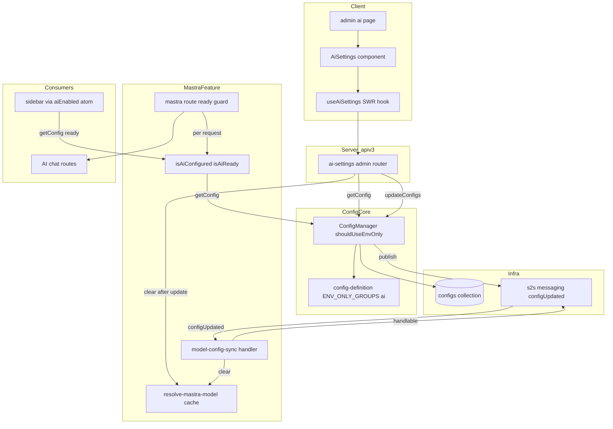
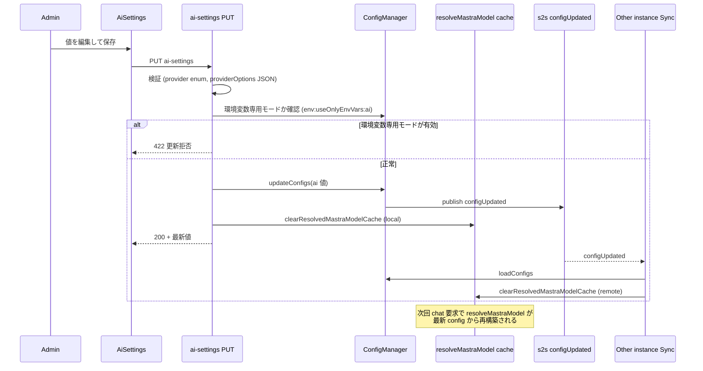
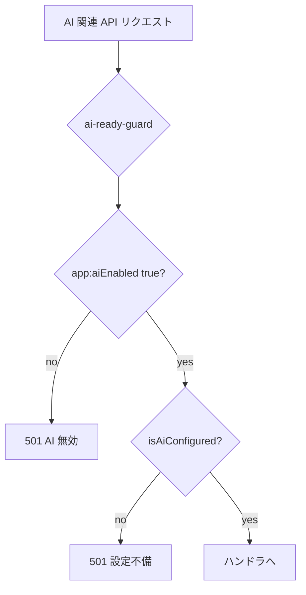

# Technical Design: admin-ai-settings

## Overview

**Purpose**: 本フィーチャーは、GROWI 管理者が `/admin/ai` の管理画面から AI(Mastra LLM プロバイダー)連携の `ai:*` 設定値を参照・更新できるようにする。これまで環境変数でのみ構成可能だった 8 つの設定キーを UI から管理可能にし、Azure OpenAI 固有の接続設定は同画面内の専用セクションで扱う。

**Users**: GROWI 管理者が AI 機能の構成(プロバイダー選択・認証情報・モデル・プロバイダーオプション・Azure 接続設定)を、環境変数を編集せずに変更するために利用する。

**Impact**: 既存の「環境変数専用モード」機構(`ENV_ONLY_GROUPS` + `shouldUseEnvOnly`)を AI 設定グループ(`ai:*` 8 キー + `app:aiEnabled`)に拡張する。制御用環境変数(`env:useOnlyEnvVars:ai`)が有効なとき、AI 設定は環境変数の値で固定され DB 値は無視される。`getConfig` のコアロジックは変更しない。さらに、(1) 設定更新がサーバー再起動なしに反映されるようメモ化された Mastra モデルの無効化機構を追加し、(2) AI 関連 API のゲートを起動時固定から**リクエスト毎の判定**(`有効 かつ 設定済み`)へ変更して、トグルや設定の変更が再起動なしに利用可否へ反映されるようにする。

### Goals
- `ai:*` 8 キーを `/admin/ai` から参照・更新できる(共通設定 + Azure 専用設定)
- AI 機能の有効/無効(`app:aiEnabled`)を管理画面から切り替えられる
- AI 関連 API の利用可否を「有効 かつ 設定済み」に整合させ、設定不備時は API を拒否し・クライアント導線も非表示にする(再起動なしで反映)
- 環境変数専用モードが有効なときは環境変数で固定し、UI 上で編集不可・モード明示、API でも更新を拒否する
- 設定更新後、サーバー再起動なしに次回の AI 実行へ反映する
- API キーを画面・API 応答で露出させない

### Non-Goals
- AI 機能(チャット・エディタ支援)自体の挙動変更
- 新しい LLM プロバイダーの追加
- LLM への接続テスト(疎通確認)機能
- `ai:` 以外の設定キーの管理、保存時暗号化(encryption-at-rest)
- 旧 AI 連携画面(`/admin/ai-integration`)の復元
- E2E(ブラウザ自動化)テスト ― 単体・統合・コンポーネントテストでカバーする

## Boundary Commitments

### This Spec Owns
- `/admin/ai` 管理ページ、AI 設定クライアントコンポーネント群、ナビゲーション項目
- AI 設定専用の apiv3 ルート(GET/PUT)とその入力検証・監査ログ発火
- AI 機能の有効/無効(`app:aiEnabled`)の管理画面からの切り替え
- **AI 利用可否の判定**(`isAiConfigured()` の追加と `有効 かつ 設定済み` の合成)、および mastra ルートゲートをリクエスト毎判定へ変更、クライアント導線(サイドバー)への反映
- `ai:*` 8 キー + `app:aiEnabled` に対する**環境変数専用モード**(既存 `ENV_ONLY_GROUPS` への新グループ + 制御キー `env:useOnlyEnvVars:ai` の宣言)
- 設定更新時の **Mastra モデルメモ無効化**(ローカル + S2S 経由)
- 新スコープ `admin:ai`(read/write)の定義

### Out of Boundary
- `configManager.updateConfigs` / `loadConfigs` / S2S `configUpdated` の発行機構そのもの(既存を利用するのみ)
- Mastra のモデル構築ロジック(`modelResolvers`、各 provider resolver)の内容 ― メモの**破棄点**のみ追加し、構築の中身は変更しない
- `getConfig` / `shouldUseEnvOnly` のコアロジック(変更せず、宣言データ `ENV_ONLY_GROUPS`/`CONFIG_DEFINITIONS` の追加のみ)
- `ai:*` / `app:aiEnabled` 以外のキーの解決順序
- `isAiEnabled()` 自体の実装、および旧 openai 機能の `certify-ai-service` ミドルウェア(変更しない。本フィーチャーは mastra ルートゲートとサイドバー導線の利用可否整合のみを担う)
- AI 機能(チャット等)の実行ロジック

### Allowed Dependencies
- `@growi/core`(`SCOPE`, `ConfigSource`, 型)― scope 追加のためのみ編集
- `~/server/service/config-manager`(`configManager` シングルトン、`ConfigKey`/`ConfigValues`)
- `~/features/mastra/interfaces/ai-provider`(`AI_PROVIDERS`, `isAiProvider`)
- 管理ページ共通基盤(`createAdminPageLayout`, `getServerSideAdminCommonProps`)、apiv3 ミドルウェア(`accessTokenParser`, `adminRequired`, `addActivity`, `apiV3FormValidator`)、`apiv3Get`/`apiv3Put`、`toastSuccess`/`toastError`
- 依存方向: **Core(scope/types) → config-manager → mastra server(resolver / route / sync) → apiv3 登録**。client は interfaces にのみ依存。config-manager は mastra に依存しない(`config-definition.ts` の `AiProvider` は型限定 import で既存・許容)

### Revalidation Triggers
- `ai:*` キーの追加/削除/リネーム → `ENV_ONLY_GROUPS` の `ai` グループ・DTO・UI・検証・`isAiConfigured()` の同期が必要
- `env:useOnlyEnvVars:ai` 制御キー / グループ対象キーの変更 → 固定対象の AI 設定消費者の挙動に波及
- `isAiConfigured()` の判定基準(provider 別必須項目)の変更 → ゲート・サイドバー導線・`resolveMastraModel` の前提と要整合
- `configUpdated` S2S メッセージ契約の変更 → メモ無効化ハンドラの再確認
- `AiProvider` union(サポートプロバイダー)変更 → provider 検証・UI 選択肢・`isAiConfigured()` の同期

## Architecture

### Existing Architecture Analysis
- **設定解決**: `ConfigManager.getConfig`(`config-manager.ts` L65-91)は既定で `dbConfig ?? envConfig`(DB 優先 + env フォールバック)。env 専用化は `ENV_ONLY_GROUPS` の制御キー(`env:useOnlyEnvVars:*`)が env で true の場合のみ作用する opt-in 機構。本フィーチャーは既存 `ENV_ONLY_GROUPS` に `ai` グループ(制御キー `env:useOnlyEnvVars:ai`)を追加して env 専用化を実現する。`getConfig`/`shouldUseEnvOnly` のコアは無変更。
- **設定書込・伝播**: `updateConfigs` → DB upsert → ローカル `loadConfigs` → S2S `configUpdated` publish。他インスタンスは `configManager.handleS2sMessage` で `loadConfigs` 再実行。
- **モデルメモ**: `resolve-mastra-model.ts` のモジュールスコープ `memoizedModel` は無効化されない。agent は `model: () => resolveMastraModel()` と遅延評価のため、メモ破棄だけで次回リクエストに反映される(agent 再生成不要)。`resolveProviderOptions` は非メモ化のため対応不要。
- **AI ゲート(現状の課題)**: mastra ルート(`features/mastra/server/routes/index.ts`)のゲートは **factory 実行時(起動時)に一度だけ** `isAiEnabled()` を評価し、無効なら catch-all を登録する静的な作り。これでは (a) トグルを再起動なしで反映できず、(b) `app:aiEnabled=true` でも `ai:*` 未設定だとルート到達 → `resolveMastraModel()` が throw する。旧 openai 機能の `certify-ai-service` ミドルウェアは既に**リクエスト毎**に `app:aiEnabled` + `openai:serviceType` 妥当性を検査しており、これが踏襲すべき先例。本フィーチャーは mastra ゲートを**リクエスト毎の `有効 かつ 設定済み` 判定**に置き換える。
- **AI 有効フラグの消費者**: `app:aiEnabled` は mastra ゲート / openai `certify-ai-service` / general-page の `aiEnabled` 供給(→ `aiEnabledAtom` → サイドバー AI ボタン表示)で参照される。
- **SSR realm 制約(重要)**: `configManager` はモジュールレベルのシングルトンで、Express ブート時に `loadConfigs()` される。getServerSideProps は Next/Turbopack の **別 realm(SSR chunks)** で実行され、その realm にバンドルされた `configManager` は**未ロードの別インスタンス**。したがって getServerSideProps からサーバー状態を読むときは、サーバー専用シングルトンを直接 import せず **Express realm の loaded な `crowi` インスタンス経由**(`crowi.configManager` / `crowi.isAiReady()` 等)で取得する。直接 import は (1) "Config is not loaded"、(2) クライアント import 可能なバレル経由でクライアントバンドルに mongoose 等が混入、の 2 問題を起こす(research.md §11)。
- **管理ページ**: 最新は vault パターン(`dynamic(ssr:false)` + `createAdminPageLayout` + `getServerSideAdminCommonProps`、unstated コンテナ不使用)。

### Architecture Pattern & Boundary Map



**Architecture Integration**:
- 選択パターン: feature-based(AI 設定一式を `features/mastra` 配下に集約)+ 既存設定基盤の宣言的拡張。
- 境界分離: env 専用化は既存 `ENV_ONLY_GROUPS` 機構を利用し、宣言(制御キー + グループ)は `config-definition` に集約。`config-manager` のコアは無変更。UI/route は mastra feature。core 変更は scope のみ。
- 保持する既存パターン: apiv3 admin ルート(scope + adminRequired + addActivity + apiV3FormValidator)、vault 管理ページ雛形、S2S 再初期化(MailService 型)、シークレット `undefined` 返却。
- Steering 準拠: feature-based、named export、server/client 分離、immutability、type-safe(`any` 不使用)。

### Technology Stack

| Layer | Choice / Version | Role in Feature | Notes |
|-------|------------------|-----------------|-------|
| Frontend | Next.js Pages Router, React 18, SWR, react-hook-form, reactstrap | `/admin/ai` ページとフォーム、設定の取得/保存 | フォームは register ベース RHF(GROWI admin フォーム慣習)。vault 管理ページ雛形を踏襲 |
| Backend | Express apiv3, express-validator | AI 設定 GET/PUT、入力検証、監査ログ | 既存 admin ルートパターン |
| Config | ConfigManager `ENV_ONLY_GROUPS` 機構 | 環境変数専用モードによる固定 | 制御キー + グループ宣言の追加のみ(コア無変更) |
| Gate | per-request Express middleware | AI 利用可否(有効 かつ 設定済み)の判定 | mastra ルートの起動時固定ゲートを置換 |
| Messaging | S2S messaging(`configUpdated`) | モデルメモの multi-instance 無効化 | 既存メッセージを購読 |
| Data | MongoDB `configs` コレクション | `ai:*` 値の永続化(平文、既存方式) | スキーマ変更なし |

## File Structure Plan

### New Files
```
packages/core/src/interfaces/
└── scope.ts                       # [modified] admin:ai を seed と型 union に追加

apps/app/src/features/mastra/
├── interfaces/
│   └── ai-settings.ts             # GET/PUT DTO 型、編集対象キー一覧 (AI_SETTING_KEYS), aiEnabled を含む
├── utils/
│   └── provider-options-validation.ts  # FE/BE 共通の providerOptions JSON 検証述語 isValidProviderOptionsJson(純粋関数)
├── server/
│   ├── routes/
│   │   ├── admin-ai-settings/
│   │   │   ├── index.ts           # ルータ factory: GET/PUT に各ハンドラ factory(RequestHandler[])を mount するのみ
│   │   │   ├── get-ai-settings.ts # getAiSettingsFactory(crowi): [scope+login+admin, getAiSettings ハンドラ]
│   │   │   ├── put-ai-settings.ts # putAiSettingsFactory(crowi): [scope+login+admin+addActivity+validators+formValidator, ハンドラ(検証→env専用拒否→updateConfigs→cache clear→activity)]
│   │   │   (検証チェーン updateAiSettingsValidators は put-ai-settings.ts に inline 定義 — provider enum / providerOptions は共有述語 / boolean)
│   │   └── ai-ready-guard.ts      # per-request middleware: isAiReady() でないと 501
│   └── services/
│       ├── model-config-sync.ts   # S2sMessageHandlable: configUpdated 受信で resolveMastraModel cache を破棄
│       └── is-ai-configured.ts    # isAiConfigured()(provider 別必須項目の非throw検査)+ isAiReady()
└── client/
    └── admin/
        ├── index.ts               # barrel: AiSettings を公開
        ├── AiSettings.tsx         # コンテナ: useForm + FormProvider、取得・保存(handleSubmit)・トースト・セクション統合
        ├── ai-settings-form-values.ts  # RHF フォーム値型 + toFormValues / buildUpdateRequest(純粋関数)
        ├── register-to-input-props.ts  # register() の ref を reactstrap Input の innerRef に remap する純粋ヘルパー
        ├── ProviderCommonSettings.tsx  # register ベース: ai:provider / apiKey / model / providerOptions(useFormContext)
        ├── AzureOpenaiSettings.tsx     # azure 4 キー(watch('provider')==='azure-openai' 時のみ表示)
        ├── AiEnabledToggle.tsx         # app:aiEnabled の有効/無効トグル(register)
        ├── EnvOnlyModeNotice.tsx       # 環境変数専用モード有効時の alert(各入力は flag 連動で disabled=フォーカス不可)
        └── use-ai-settings.ts          # SWR フック(apiv3Get) + 保存関数(apiv3Put)

apps/app/src/pages/admin/
└── ai.page.tsx                    # vault パターン: dynamic(ssr:false) で AiSettings を描画
```

### Modified Files
- `apps/app/src/server/service/config-manager/config-definition.ts` — 制御キー `env:useOnlyEnvVars:ai`(env 変数 `AI_USES_ONLY_ENV_VARS_FOR_SOME_OPTIONS`)を `CONFIG_KEYS` + `CONFIG_DEFINITIONS` に追加し、`ENV_ONLY_GROUPS` に **`ai:*` 8 キー + `app:aiEnabled`** を対象とするグループを追加(`config-manager.ts` のコアは変更不要)
- `apps/app/src/features/mastra/server/routes/index.ts` — 起動時固定ゲート(`if (!isAiEnabled())`)を撤去し、`ai-ready-guard`(per-request)を `router.use` で適用
- `apps/app/src/features/mastra/server/services/ai-sdk-modules/resolve-mastra-model.ts` — `clearResolvedMastraModelCache()` を追加・export
- `apps/app/src/pages/general-page/configuration-props.ts` — サイドバー供給値 `aiEnabled` を **`crowi.isAiReady()`**(有効 かつ 設定済み)由来へ変更。**`isAiReady` を直接 import しない**(SSR realm 問題 + クライアントバンドル混入を回避 — research.md §11)。import は型(`GetServerSideProps`/`CrowiRequest`)と client-safe enum のみに保つ
- `apps/app/src/server/crowi/index.ts` — (1) `setupS2sMessagingService()` で `model-config-sync` ハンドラを `addMessageHandler` 登録、(2) 薄いメソッド `isAiReady(): boolean { return resolveIsAiReady(); }` を追加(`isAiReady` を `resolveIsAiReady` として import)。getServerSideProps は Express realm の loaded な `crowi` インスタンス経由でこれを呼ぶ(`crowi.isPageId()` / `crowi.aclService` と同じ確立済みパターン)
- `apps/app/src/server/routes/apiv3/index.js` — `routerForAdmin.use('/ai-settings', ...)` でマウント
- `apps/app/src/interfaces/activity.ts` — `ACTION_ADMIN_AI_SETTING_UPDATE` を追加し SupportedAction に登録
- `apps/app/src/components/Admin/Common/AdminNavigation.tsx` — `'ai'` メニュー(MenuLabel case + MenuLink + モバイル MenuLabel)
- `apps/app/public/static/locales/{en_US,ja_JP,zh_CN,fr_FR,ko_KR}/admin.json` — `ai_settings.*` キー群、`commons` の activity ラベル

## System Flows

### 設定保存と即時反映(ローカル + マルチインスタンス)



ゲーティング決定: 環境変数専用モード時の拒否は防御的多重化(UI でも入力 disable 済)。`getConfig` が既にこのモードで env 値を返すため DB へ書けても効果はないが、R4.3 として明示的に拒否する。ローカルはメモを直接破棄、リモートは `configUpdated` 購読で破棄(`updateConfigs` は自インスタンスへ配信しないため両経路が必要)。

### AI 利用可否ゲート(リクエスト毎)



決定: ゲートは **factory 実行時固定をやめ、リクエスト毎**に `isAiReady() = isAiEnabled() && isAiConfigured()` を評価する。これによりトグル・設定変更が再起動なしに利用可否へ反映される(R7.5)。`isAiConfigured()` は provider が `AI_PROVIDERS` に含まれ、provider 別の必須項目(非 Azure: apiKey + model / Azure: endpoint + model +(apiKey or useEntraId))が揃っているかを**非 throw**で検査する。`resolveMastraModel` の検証と同一基準だがモデル構築は行わない。旧 openai の `certify-ai-service`(per-request)と同型。

## Requirements Traceability

| Requirement | Summary | Components | Interfaces | Flows |
|-------------|---------|------------|------------|-------|
| 1.1 | 管理者が `/admin/ai` 表示 | ai.page, AiSettings | getServerSideAdminCommonProps | — |
| 1.2 | 非管理者アクセス拒否 | admin-ai-settings router, ai.page | adminRequired, accessTokenParser(admin:ai) | — |
| 1.3 | ナビに AI 項目 | AdminNavigation | MenuLabel/MenuLink 'ai' | — |
| 1.4 | 現在有効値の表示 | get-ai-settings, useAiSettings | GET ai-settings | 保存反映フロー |
| 2.1 | 共通設定の入力欄 | ProviderCommonSettings | AiSettingsDto | — |
| 2.2 | provider 選択肢を限定 | ProviderCommonSettings, validators | AI_PROVIDERS, isAiProvider | — |
| 2.3 | 保存と結果通知 | AiSettings, put-ai-settings | PUT, toastSuccess/Error | 保存反映フロー |
| 2.4 | 再起動なし反映 | resolve-mastra-model, model-config-sync | clearResolvedMastraModelCache | 保存反映フロー |
| 3.1 | Azure 専用設定欄 | AzureOpenaiSettings | AiSettingsDto(azure 群) | — |
| 3.2 | 非 azure 時の非適用提示 | AzureOpenaiSettings | provider 状態 | — |
| 3.3 | EntraId 時の apiKey 不使用提示 | AzureOpenaiSettings | azureOpenaiUseEntraId | — |
| 3.4 | deployment 名の案内 | AzureOpenaiSettings | i18n 注記 | — |
| 4.1 | env 専用モード時は env 値を使用 | config-definition(ai グループ), ConfigManager.shouldUseEnvOnly | ENV_ONLY_GROUPS | — |
| 4.2 | env 専用モード時に編集不可 + モード明示 | EnvOnlyModeNotice, get-ai-settings | useOnlyEnvVars フラグ | — |
| 4.3 | env 専用モード時の更新を拒否 | put-ai-settings | PUT(422) | 保存反映フロー |
| 4.4 | モード無効時は画面値優先・env を既定値 | ConfigManager.getConfig, put-ai-settings | updateConfigs(db ?? env) | — |
| 5.1 | apiKey をマスク入力 | ProviderCommonSettings | password input | — |
| 5.2 | apiKey を平文表示しない | get-ai-settings | isApiKeySet(値非返却) | — |
| 5.3 | エラーに機密を含めない | put/get ハンドラ | ErrorV3 | — |
| 6.1 | provider 不正を拒否 | validators, put-ai-settings | isAiProvider | — |
| 6.2 | providerOptions JSON 検証 | ProviderCommonSettings(client), put-ai-settings(updateAiSettingsValidators) | 共通述語 `isValidProviderOptionsJson`(utils/、FE/BE 共有) | — |
| 6.3 | 保存失敗時に通知 + 入力保持 | AiSettings | toastError, ローカル state | 保存反映フロー |
| 7.1 | 有効/無効トグルの提供 | AiEnabledToggle, put-ai-settings | aiEnabled(DTO) | — |
| 7.2 | 無効/未設定時は API 拒否 | ai-ready-guard, is-ai-configured | isAiReady(), 501 | AI ゲートフロー |
| 7.3 | 有効かつ設定済みで API 利用可 | ai-ready-guard, is-ai-configured | isAiReady() | AI ゲートフロー |
| 7.4 | 未 ready 時はサイドバー非表示 | configuration-props(general-page) | isAiReady() → aiEnabledAtom | — |
| 7.5 | トグル/設定変更を再起動なし反映 | ai-ready-guard(per-request) | isAiReady() | AI ゲートフロー |
| 7.6 | 有効だが未設定の警告表示 | AiSettings, get-ai-settings | isConfigured(GET) | — |

## Components and Interfaces

| Component | Domain/Layer | Intent | Req Coverage | Key Dependencies | Contracts |
|-----------|--------------|--------|--------------|------------------|-----------|
| config-definition (ai env-only グループ) | Config core | `env:useOnlyEnvVars:ai` 制御キー + グループ宣言で env 専用化(`ai:*` + `app:aiEnabled`) | 4.1, 4.4 | ENV_ONLY_GROUPS (P0) | — |
| admin-ai-settings router | Server apiv3 | GET/PUT、検証、env 専用モード拒否、監査、cache clear | 1.2,1.4,2.2,2.3,4.3,5.2,5.3,6.1,6.2,7.1,7.6 | configManager (P0), resolver (P0), is-ai-configured (P1) | API |
| is-ai-configured | Mastra server | `isAiConfigured()` / `isAiReady()` の判定 | 7.2,7.3,7.4 | configManager (P0) | Service |
| ai-ready-guard | Mastra server | mastra ルートの per-request 利用可否ゲート | 7.2,7.3,7.5 | is-ai-configured (P0) | — |
| model-config-sync | Mastra server | `configUpdated` 購読で model cache 破棄 | 2.4 | s2s, resolver (P0) | Event |
| resolve-mastra-model (cache 拡張) | Mastra server | メモ破棄点の提供 | 2.4 | — | Service |
| configuration-props (general-page) | Server SSR | サイドバー供給 `aiEnabled` を `crowi.isAiReady()` 由来へ | 7.4 | crowi.isAiReady (P1) | — |
| AiSettings | Client | 取得/保存/トースト/セクション統合 | 1.1,2.3,6.3 | useAiSettings (P0) | State |
| ProviderCommonSettings / AzureOpenaiSettings / AiEnabledToggle / EnvOnlyModeNotice | Client UI | 各設定欄、有効化トグル、env 専用モード表示、azure 専用 | 2.1,3.x,4.2,5.1,6.2,7.1 | AiSettings (P1) | — |

### Config core

#### config-definition (ai env-only グループ)

| Field | Detail |
|-------|--------|
| Intent | 既存 `ENV_ONLY_GROUPS` 機構に `ai` グループを宣言し、制御キーが有効なとき `ai:*` を env 専用化する |
| Requirements | 4.1, 4.4 |

**Responsibilities & Constraints**
- 宣言のみ。`getConfig` / `shouldUseEnvOnly` のコアロジックは**変更しない**(既存の opt-in 機構をそのまま流用)。
- 制御キー `env:useOnlyEnvVars:ai` が env で `true` のとき、グループ対象キーは `getConfig` が **env 値のみ**を返す(DB 無視)。`false`/未設定なら既存どおり `db ?? env`(R4.4: env は既定値、UI 値が優先)。
- グループ対象キーは provider 共通 4 + Azure 4 + 有効化トグル `app:aiEnabled` の計 9。1 制御キーで一括(gcs/azure グループと同型)。`app:aiEnabled` は `app:` prefix だが AI 設定の一部として同一グループで固定する。
- `ConfigKey` は `CONFIG_KEYS` 由来のため、制御キーを `CONFIG_KEYS` と `CONFIG_DEFINITIONS` の両方に登録する。

**Dependencies**
- Outbound: `ENV_ONLY_GROUPS`(既存)、`shouldUseEnvOnly`(既存、無変更で利用)(P0)
- External: なし

**Contracts**: なし(設定定義データの追加のみ)

##### 宣言内容
```typescript
// config-definition.ts — CONFIG_DEFINITIONS に追加
'env:useOnlyEnvVars:ai': defineConfig<boolean>({
  envVarName: 'AI_USES_ONLY_ENV_VARS_FOR_SOME_OPTIONS',
  defaultValue: false,
}),

// ENV_ONLY_GROUPS に追加
{
  controlKey: 'env:useOnlyEnvVars:ai',
  targetKeys: [
    'app:aiEnabled',
    'ai:provider', 'ai:apiKey', 'ai:model', 'ai:providerOptions',
    'ai:azureOpenaiResourceName', 'ai:azureOpenaiBaseUrl',
    'ai:azureOpenaiApiVersion', 'ai:azureOpenaiUseEntraId',
  ],
},
```
- Precondition: 制御キーが `CONFIG_KEYS`/`CONFIG_DEFINITIONS` に登録済み。
- Postcondition: `getConfig('env:useOnlyEnvVars:ai') === true` のとき、`shouldUseEnvOnly('ai:*')` が true を返し env 値のみ解決。
- Invariant: 制御キーが false のとき、既存挙動(`db ?? env`)から変化しない。

**Implementation Notes**
- Integration: `config-manager.ts` の `initKeyToGroupMap()` が起動時に自動でマッピングを構築するため、追加コードは不要。
- Validation: 制御キー true/false での `getConfig('ai:provider')` 解決を単体テストで固定。
- Risks: 既存 `ai:*` 利用者は現状ほぼ全員 `AI_*` env を設定済み。env 専用モードを有効化しない限り挙動は不変(env は従来どおりフォールバック)であることをテストで担保。

### Server apiv3

#### admin-ai-settings router

| Field | Detail |
|-------|--------|
| Intent | AI 設定の取得/更新 API。検証・env 専用モード拒否・監査・キャッシュ破棄を担う |
| Requirements | 1.2, 1.4, 2.2, 2.3, 4.3, 5.2, 5.3, 6.1, 6.2, 7.1, 7.6 |

**Responsibilities & Constraints**
- **ミドルウェアチェーンは各ハンドラ factory が所有**(GROWI mastra 慣習: `getThreadsFactory`/`postMessageHandlersFactory` と同様、`(crowi) => RequestHandler[]` を返す)。`index.ts` のルータ factory は `router.get('/', getAiSettingsFactory(crowi))` / `router.put('/', putAiSettingsFactory(crowi))` で mount するだけ。
- 全エンドポイントに `accessTokenParser([SCOPE.READ|WRITE.ADMIN.AI])` + `loginRequiredStrictly` + `adminRequired`(各 factory 内で構築)。PUT はさらに `addActivity` + `updateAiSettingsValidators` + `apiV3FormValidator`。
- `routerForAdmin` 配下にマウント(`/_api/v3/ai-settings`)。`isAiEnabled()` ゲートは**付けない**(AI 無効時も設定可能=R1)。
- GET は `ai:apiKey` の値を返さない(`isApiKeySet: boolean` のみ)。`useOnlyEnvVars: boolean`(`env:useOnlyEnvVars:ai` の状態)、`aiEnabled: boolean`(7.1)、`isConfigured: boolean`(`isAiConfigured()` の結果、7.6)を返し、UI の編集可否・トグル状態・警告表示を決定させる。
- PUT は `aiEnabled` を含む AI 設定を更新。環境変数専用モード有効時(`getConfig('env:useOnlyEnvVars:ai') === true`)は 422 で拒否(SiteUrlSetting の拒否パターン)。`apiKey` が空/未指定なら既存値を保持(クリアしない)。
- 例外メッセージに機密値を含めない(`ai:apiKey` を出力しない)。

**Dependencies**
- Outbound: `configManager`(getConfig/updateConfigs)(P0)、`clearResolvedMastraModelCache`(P0)、`isAiConfigured`(GET の `isConfigured` 算出)(P1)、`activityEvent`(P1)
- External: express-validator(P1)

**Contracts**: API [x]

##### API Contract
| Method | Endpoint | Request | Response | Errors |
|--------|----------|---------|----------|--------|
| GET | /_api/v3/ai-settings | — | `AiSettingsResponse` | 401, 403, 500 |
| PUT | /_api/v3/ai-settings | `AiSettingsUpdateRequest` | `AiSettingsResponse` | 400, 403, 422, 500 |

```typescript
// interfaces/ai-settings.ts
export interface AiSettingsResponse {
  aiEnabled: boolean;                  // app:aiEnabled の状態 (7.1)
  provider?: AiProvider;
  model?: string;
  providerOptions?: string;            // raw JSON string
  azureOpenaiResourceName?: string;
  azureOpenaiBaseUrl?: string;
  azureOpenaiApiVersion?: string;
  azureOpenaiUseEntraId: boolean;
  isApiKeySet: boolean;                // ai:apiKey の値は返さない (5.2)
  useOnlyEnvVars: boolean;             // env:useOnlyEnvVars:ai 有効時 全項目編集不可 (4.2)
  isConfigured: boolean;              // isAiConfigured() の結果 (7.6 の警告判定に使用)
}

export interface AiSettingsUpdateRequest {
  aiEnabled?: boolean;                 // app:aiEnabled の切り替え (7.1)
  provider?: AiProvider;
  apiKey?: string;                     // 空/未指定なら既存保持 (5.x)
  model?: string;
  providerOptions?: string;
  azureOpenaiResourceName?: string;
  azureOpenaiBaseUrl?: string;
  azureOpenaiApiVersion?: string;
  azureOpenaiUseEntraId?: boolean;
}
```
- Idempotency: PUT は冪等(同値再送で副作用は cache clear のみ)。
- 更新セマンティクス: クライアントは全項目を送信する。**boolean**(`aiEnabled` / `azureOpenaiUseEntraId`)は常に値を送る。**文字列項目**(provider / model / providerOptions / azure 3 項目)は空文字を `undefined` に正規化し、`updateConfigs(..., { removeIfUndefined: true })` で DB から削除する(= 環境変数フォールバックへ戻る、R4.4)。**例外は `apiKey` のみ**(空/未指定 = 既存保持、クリアしない)。
- Validation(`put-ai-settings.ts` に inline 定義の `updateAiSettingsValidators`): `provider ∈ AI_PROVIDERS`(6.1)、`providerOptions` は **FE/BE 共通述語 `isValidProviderOptionsJson`**(`utils/provider-options-validation.ts`、JSON.parse ベース・空=有効)を `.custom()` で適用(6.2)、`azureOpenaiUseEntraId` は boolean。クライアント(`ProviderCommonSettings` の register validate)も同じ述語を使い、判定が完全一致。
- 成功時副作用: `updateConfigs` → `clearResolvedMastraModelCache()` → `activityEvent.emit('update', _id, { action: ACTION_ADMIN_AI_SETTING_UPDATE })`。

**Implementation Notes**
- Integration: ハンドラを `get-ai-settings.ts` / `put-ai-settings.ts` に分割。検証チェーンは利用元の `put-ai-settings.ts` に inline 定義(`updateAiSettingsValidators`)。
- Validation: env 専用モード拒否、apiKey 非返却、provider/providerOptions 検証、activity 発火を integ テスト。
- Risks: `apiKey` の「未指定=保持/空=保持」境界を明確化(誤クリア防止)。

#### model-config-sync

| Field | Detail |
|-------|--------|
| Intent | 他インスタンスでの設定更新を受けて model cache を破棄 |
| Requirements | 2.4 |

**Contracts**: Event [x]

##### Event Contract
- Subscribed: `configUpdated`(`S2sMessageHandlable`)。`shouldHandleS2sMessage`: `eventName === 'configUpdated'`。`handleS2sMessage`: `clearResolvedMastraModelCache()`。
- Published: なし。
- Delivery: `configManager` ハンドラと並行登録。順序非依存(メモ破棄は config 再ロードに先行しても次回 `getConfig` が最新を読むため安全)。

**Implementation Notes**
- Integration: `crowi/index.ts setupS2sMessagingService()` で `addMessageHandler` 登録。
- Risks: `configUpdated` は全 config 更新で発火 → ai 以外の更新でも破棄(過剰無効化)。設定変更は稀のため許容。Azure+Entra のトークンキャッシュ消失は変更時のみで影響軽微。

#### resolve-mastra-model (cache 拡張)

**Contracts**: Service [x]
```typescript
export const clearResolvedMastraModelCache = (): void => { /* memoizedModel = undefined */ };
```
- メモ撤廃ではなく破棄関数の追加(Azure+Entra のトークンキャッシュ維持のため毎回再構築は不可 — 詳細は research.md §7)。

#### is-ai-configured / ai-ready-guard

| Field | Detail |
|-------|--------|
| Intent | AI が「設定済み」かを非 throw で判定し、mastra ルートを per-request にゲートする |
| Requirements | 7.2, 7.3, 7.5 |

**Responsibilities & Constraints**
- `isAiConfigured()`: **`resolveMastraModel()` を try/catch でラップして判定する**(成功=設定済み true、throw=未設定 false)。これにより provider 別必須項目の検証ロジックを二重実装せず、判定基準が `resolveMastraModel` と**構造的に一致**する(基準ドリフト不能)。`resolveMastraModel` は成功時メモ化・throw 時非メモ化のため、per-request コストはほぼゼロ(設定済みならメモ参照、未設定なら検証のみで構築まで到達しない)。`new DefaultAzureCredential()` 構築はトークン取得を伴わない(副作用なし)。
- `isAiReady()`: `isAiEnabled() && isAiConfigured()`。mastra ゲートとサイドバー供給の両方が参照する単一の判定。
- `ai-ready-guard`: per-request Express middleware。`!isAiReady()` のとき 501(無効と設定不備でメッセージを区別)。
- mastra ルート factory の起動時 `if (!isAiEnabled())` 静的ゲートを撤去し、本 guard を `router.use` で適用(R7.5: 再起動なし反映)。

**Dependencies**
- Outbound: `resolveMastraModel`(try/catch でラップ)(P0)、`isAiEnabled`(既存、openai/server/services)(P0)
- Inbound: mastra ルート(`routes/index.ts`)は free function を直接利用(その realm では config が loaded)。general-page `configuration-props` は **`crowi.isAiReady()` 経由**で利用(getServerSideProps は SSR realm で実行されるため直接 import 不可 — research.md §11)。crowi に薄いメソッド `isAiReady()` を追加 (P1)

**Contracts**: Service [x]
```typescript
export const isAiConfigured = (): boolean => {
  try { resolveMastraModel(); return true; } catch { return false; }
};
export const isAiReady = (): boolean => isAiEnabled() && isAiConfigured();
```
- Postcondition: provider 未設定/必須項目欠落で `isAiConfigured()===false`(`resolveMastraModel` が throw するため)。
- Invariant: 判定基準は `resolveMastraModel` と**同一実装由来**のため恒久的に一致する。

**Implementation Notes**
- Integration: openai の `certify-ai-service`(per-request 検査)を踏襲。openai 側ミドルウェアは変更しない。
- Risks: 低。try/catch ラップにより基準ドリフトは構造的に発生しない。`resolveMastraModel` の例外メッセージはログに出さない(機密名のみで apiKey は含まないが、ゲートでは握りつぶして 501 を返す)。

### Client UI

#### AiSettings(コンテナ)
- `useForm`(`mode: 'onChange'`)+ `FormProvider` でフォームを所有(GROWI admin フォーム慣習の register ベース)。取得値 `data`(`useAiSettings`)を `toFormValues` で `defaultValues` に seed し、`reset` で revalidate 時に再 seed(apiKey は常に空にクリア — R5.2)。
- **フォーム一括保存**: `handleSubmit(onSubmit)` → `buildUpdateRequest`(booleans 常時 / 文字列そのまま / provider '' → undefined / apiKey は非空時のみ)→ `save`(`apiv3Put` + revalidate)→ 成功 `toastSuccess`、失敗 `toastError` かつ RHF は値を保持(6.3)。保存ボタンは `disabled={useOnlyEnvVars || formState.isSubmitting}`。
- `watch('provider') === 'azure-openai'` のときのみ `AzureOpenaiSettings` を表示(3.2)。
- `aiEnabled === true && isConfigured === false`(サーバー `data` 由来、フォーム状態ではない)のとき警告 alert を表示(7.6)。
- **reactstrap + RHF**: `<Input>` は DOM を `innerRef` で配線するため、`registerToInputProps()` で `register()` の `ref` を `innerRef` に remap して全 Input に適用。

#### ProviderCommonSettings / AzureOpenaiSettings / AiEnabledToggle / EnvOnlyModeNotice(Summary-only)
- 各セクションは `useFormContext` で `register` / `watch` / `errors` を取得(prop drilling なし)。非フォーム props は `disabled`(env-only)と `ProviderCommonSettings` の `isApiKeySet` のみ。
- `AiEnabledToggle`: `app:aiEnabled` の有効/無効スイッチ(`register('aiEnabled')`、7.1)。`useOnlyEnvVars` 連動で `disabled`。
- `ProviderCommonSettings`: provider(select、`AI_PROVIDERS` のみ=2.2)/ apiKey(`type=password`=5.1)/ model / providerOptions(`register` の `validate` で JSON 検証 → `FormFeedback`=6.2)。各入力は `useOnlyEnvVars` 連動で **`disabled`**(`readOnly` ではなく — タブ順から除外しフォーカス不可。env 専用時は完全ロック)。
- `AzureOpenaiSettings`: azure 4 キー。`provider !== 'azure-openai'` のときは**非表示**(3.2)。`useEntraId=true` 時は apiKey 不使用を明示(3.3)、model=deployment 名の注記(3.4)。
- `EnvOnlyModeNotice`: `useOnlyEnvVars` が true のとき alert を表示し、全項目が環境変数で固定され編集不可である旨を明示(4.2)。SiteUrlSetting の env 専用モード表示パターンを踏襲。

## Data Models

スキーマ変更なし。`ai:*` は既存の `configs` コレクション(`{ ns, key, value }`、`value` は JSON 文字列)に既存方式で永続化。`ai:apiKey` も平文保存(他シークレット config と同方針)。保存時暗号化は範囲外(research.md §6)。

## Error Handling

### Error Strategy
- **入力検証(400)**: provider が `AI_PROVIDERS` 外(6.1)、`providerOptions` が非空かつ JSON 不正(6.2)、boolean 不正 → `apiV3FormValidator` で 400。クライアントは保存前にも JSON 検証してエラー表示。
- **env 専用モード時の更新(422)**: 環境変数専用モードが有効な状態の PUT は `ErrorV3` で拒否(4.3、SiteUrlSetting 拒否パターン)。
- **保存失敗(5xx)**: `toastError` で通知、入力 state 保持(6.3)。
- **機密保護**: 例外・ログに `ai:apiKey` を出力しない(5.3)。GET は apiKey 値を返さない(5.2)。

### Monitoring
- 設定更新成功は `activityEvent`(`ACTION_ADMIN_AI_SETTING_UPDATE`)で監査ログ化。検証/拒否エラーは `logger.warn`(機密除外)。

## Testing Strategy

### Unit Tests
- `ConfigManager.getConfig`(`ai:provider`): `env:useOnlyEnvVars:ai`=true で env 値のみ、=false で `db ?? env`(DB 優先・env 既定)を返す(4.1, 4.4)。
- `ENV_ONLY_GROUPS`: `ai` グループが 9 キー(`app:aiEnabled` + `ai:*` 8)すべてを対象とし、`initKeyToGroupMap` で制御キーへ正しくマップされる(4.1)。
- `config-definition`: `env:useOnlyEnvVars:ai` が `CONFIG_KEYS`/`CONFIG_DEFINITIONS` に登録され、既存キーの解決に影響しない(回帰)。
- `isAiConfigured` / `isAiReady`: provider 未設定/必須項目欠落で false、provider 別に必須が揃うと true。`aiEnabled=false` で `isAiReady=false`(7.2, 7.3)。
- `isAiConfigured` と `resolveMastraModel`: 同一構成で「configured===解決成功」が一致(乖離回帰)。
- `updateAiSettingsValidators`(put-ai-settings.spec): provider enum、`providerOptions` 妥当性、boolean(6.1, 6.2)。
- `isValidProviderOptionsJson`(utils/provider-options-validation.spec): 空=有効 / オブジェクト・配列・プリミティブ OK / 不正 NG(FE/BE 共通述語の単体テスト)。

### Integration Tests
- PUT 正常: `aiEnabled` + ai 値が `updateConfigs` 反映 + `clearResolvedMastraModelCache` 呼出 + `ACTION_ADMIN_AI_SETTING_UPDATE` 発火(2.3, 2.4, 7.1)。
- PUT env 専用モード: `env:useOnlyEnvVars:ai`=true の状態で要求が 422(4.3)。
- GET: apiKey 値が応答に含まれず `isApiKeySet` / `useOnlyEnvVars` / `aiEnabled` / `isConfigured` が正しい(4.2, 5.2, 7.1, 7.6)。
- PUT apiKey 未指定: 既存 apiKey が保持される(誤クリアしない)。
- `ai-ready-guard`: `aiEnabled=true` かつ未設定で mastra ルートが 501、両者揃うと通過(7.2, 7.3)。設定変更後に再起動なしで判定が変わる(7.5)。
- アクセス制御: 非管理者は GET/PUT で 403(1.2)。

### Component Tests (UI / React Testing Library)
- `AiSettings`: 保存操作で `apiv3Put` 呼出 → 成功時 `toastSuccess`、失敗時 `toastError` + 入力 state 保持(2.3, 6.3)。
- `AiEnabledToggle`: 切り替えが PUT body の `aiEnabled` に反映、`useOnlyEnvVars=true` で disabled(7.1)。
- env 専用モード(`useOnlyEnvVars=true`)で全フィールド(トグル含む)が disabled(フォーカス不可)+ モード明示の alert を表示(4.2)。
- `aiEnabled=true && isConfigured=false` で「有効だが未設定」警告 alert を表示し、両者が揃うと非表示(7.6)。
- provider=azure-openai 選択時のみ Azure セクションを表示、`useEntraId` で apiKey 不使用提示(3.2, 3.3)。

> E2E(ブラウザ自動化)は範囲外(Non-Goals)。上記はコンポーネント単位の RTL テストで検証する。

## Security Considerations
- **アクセス制御**: 新スコープ `admin:ai`(read/write)+ `adminRequired`。PAT の最小権限を担保。
- **機密保護**: `ai:apiKey` は GET 非返却(`isApiKeySet` のみ)、入力は `type=password`、例外/ログに非出力(5.1–5.3)。
- **改変防止**: 環境変数専用モード有効時は API/UI 双方で更新不可(多重防御、4.2/4.3)。
- **利用可否ゲート**: AI 関連 API は `有効 かつ 設定済み` のときのみ到達可能(per-request)。設定不備での到達と「動くように見えて動かない」状態を防ぐ(7.2, 7.3)。
- core scope 追加時は `accesstoken_scopes_desc`(全ロケール)を更新。
