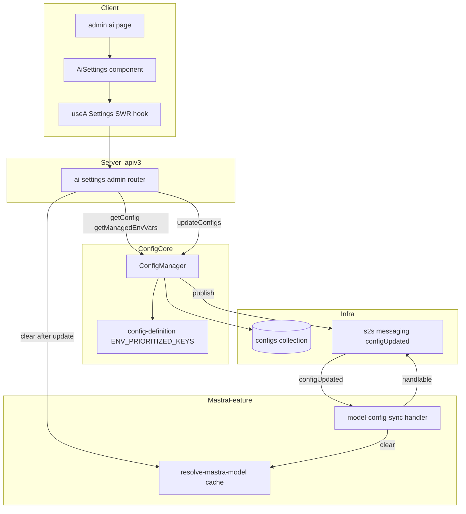
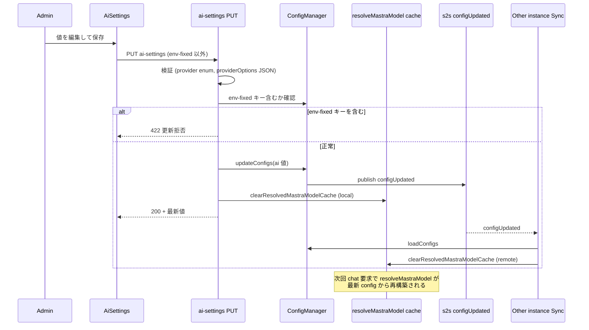

# Technical Design: admin-ai-settings

## Overview

**Purpose**: 本フィーチャーは、GROWI 管理者が `/admin/ai` の管理画面から AI(Mastra LLM プロバイダー)連携の `ai:*` 設定値を参照・更新できるようにする。これまで環境変数でのみ構成可能だった 8 つの設定キーを UI から管理可能にし、Azure OpenAI 固有の接続設定は同画面内の専用セクションで扱う。

**Users**: GROWI 管理者が AI 機能の構成(プロバイダー選択・認証情報・モデル・プロバイダーオプション・Azure 接続設定)を、環境変数を編集せずに変更するために利用する。

**Impact**: 設定解決の優先順位に変更を加える。`ai:*` キーに限り「対応する環境変数が設定されていれば環境変数の値を常に優先し、DB 値による上書きを禁止する」挙動を導入する(既存の DB 優先の既定とは異なる、宣言的な例外)。さらに、設定更新がサーバー再起動なしに反映されるよう、メモ化された Mastra モデルの無効化機構を追加する。

### Goals
- `ai:*` 8 キーを `/admin/ai` から参照・更新できる(共通設定 + Azure 専用設定)
- 対応環境変数が設定されているキーは環境変数を優先し、UI 上で編集不可・由来明示、API でも更新を拒否する
- 設定更新後、サーバー再起動なしに次回の AI 実行へ反映する
- API キーを画面・API 応答で露出させない

### Non-Goals
- AI 機能(チャット・エディタ支援)自体の挙動変更
- 新しい LLM プロバイダーの追加
- `app:aiEnabled`(AI 機能の有効/無効トグル)の管理 ― 本画面では扱わない
- LLM への接続テスト(疎通確認)機能
- `ai:` 以外の設定キーの管理、保存時暗号化(encryption-at-rest)
- 旧 AI 連携画面(`/admin/ai-integration`)の復元

## Boundary Commitments

### This Spec Owns
- `/admin/ai` 管理ページ、AI 設定クライアントコンポーネント群、ナビゲーション項目
- AI 設定専用の apiv3 ルート(GET/PUT)とその入力検証・監査ログ発火
- `ai:*` 8 キーに対する **env 優先・上書き禁止** の設定解決ロジック(`getConfig` 内の宣言的拡張)
- 設定更新時の **Mastra モデルメモ無効化**(ローカル + S2S 経由)
- 新スコープ `admin:ai`(read/write)の定義

### Out of Boundary
- `configManager.updateConfigs` / `loadConfigs` / S2S `configUpdated` の発行機構そのもの(既存を利用するのみ)
- Mastra のモデル構築ロジック(`modelResolvers`、各 provider resolver)の内容 ― メモの**破棄点**のみ追加し、構築の中身は変更しない
- `ai:*` 以外のキーの解決順序(現行の DB 優先を維持)
- `app:aiEnabled` および `isAiEnabled()` ゲートの挙動

### Allowed Dependencies
- `@growi/core`(`SCOPE`, `ConfigSource`, 型)― scope 追加のためのみ編集
- `~/server/service/config-manager`(`configManager` シングルトン、`ConfigKey`/`ConfigValues`)
- `~/features/mastra/interfaces/ai-provider`(`AI_PROVIDERS`, `isAiProvider`)
- 管理ページ共通基盤(`createAdminPageLayout`, `getServerSideAdminCommonProps`)、apiv3 ミドルウェア(`accessTokenParser`, `adminRequired`, `addActivity`, `apiV3FormValidator`)、`apiv3Get`/`apiv3Put`、`toastSuccess`/`toastError`
- 依存方向: **Core(scope/types) → config-manager → mastra server(resolver / route / sync) → apiv3 登録**。client は interfaces にのみ依存。config-manager は mastra に依存しない(`config-definition.ts` の `AiProvider` は型限定 import で既存・許容)

### Revalidation Triggers
- `ai:*` キーの追加/削除/リネーム → `ENV_PRIORITIZED_KEYS`・DTO・UI・検証の同期が必要
- `getConfig` の env 優先ロジック変更 → `resolveMastraModel`/`resolveProviderOptions` を含む全 `ai:*` 消費者の挙動に波及
- `configUpdated` S2S メッセージ契約の変更 → メモ無効化ハンドラの再確認
- `AiProvider` union(サポートプロバイダー)変更 → provider 検証・UI 選択肢の同期

## Architecture

### Existing Architecture Analysis
- **設定解決**: `ConfigManager.getConfig`(`config-manager.ts` L65-91)は既定で `dbConfig ?? envConfig`(DB 優先)。env 専用化は `ENV_ONLY_GROUPS` の制御キー(`env:useOnlyEnvVars:*`)が env で true の場合のみ。本フィーチャーの「キー自身の env が設定されていれば優先」は別トリガーのため新機構を要する。
- **設定書込・伝播**: `updateConfigs` → DB upsert → ローカル `loadConfigs` → S2S `configUpdated` publish。他インスタンスは `configManager.handleS2sMessage` で `loadConfigs` 再実行。
- **モデルメモ**: `resolve-mastra-model.ts` のモジュールスコープ `memoizedModel` は無効化されない。agent は `model: () => resolveMastraModel()` と遅延評価のため、メモ破棄だけで次回リクエストに反映される(agent 再生成不要)。`resolveProviderOptions` は非メモ化のため対応不要。
- **管理ページ**: 最新は vault パターン(`dynamic(ssr:false)` + `createAdminPageLayout` + `getServerSideAdminCommonProps`、unstated コンテナ不使用)。

### Architecture Pattern & Boundary Map



**Architecture Integration**:
- 選択パターン: feature-based(AI 設定一式を `features/mastra` 配下に集約)+ 共有設定基盤の宣言的拡張。
- 境界分離: 設定解決の例外は `config-manager` に閉じ込め、宣言リストは `config-definition`。UI/route は mastra feature。core 変更は scope のみ。
- 保持する既存パターン: apiv3 admin ルート(scope + adminRequired + addActivity + apiV3FormValidator)、vault 管理ページ雛形、S2S 再初期化(MailService 型)、シークレット `undefined` 返却。
- Steering 準拠: feature-based、named export、server/client 分離、immutability、type-safe(`any` 不使用)。

### Technology Stack

| Layer | Choice / Version | Role in Feature | Notes |
|-------|------------------|-----------------|-------|
| Frontend | Next.js Pages Router, React 18, Jotai + SWR, reactstrap | `/admin/ai` ページと設定 UI、設定の取得/保存 | vault 管理ページ雛形を踏襲 |
| Backend | Express apiv3, express-validator | AI 設定 GET/PUT、入力検証、監査ログ | 既存 admin ルートパターン |
| Config | `@growi/core` ConfigManager 基盤 | env 優先解決、env-fixed 検出 | `getConfig` 内部拡張 + 新宣言リスト |
| Messaging | S2S messaging(`configUpdated`) | モデルメモの multi-instance 無効化 | 既存メッセージを購読 |
| Data | MongoDB `configs` コレクション | `ai:*` 値の永続化(平文、既存方式) | スキーマ変更なし |

## File Structure Plan

### New Files
```
packages/core/src/interfaces/
└── scope.ts                       # [modified] admin:ai を seed と型 union に追加

apps/app/src/features/mastra/
├── interfaces/
│   └── ai-settings.ts             # GET/PUT DTO 型、編集対象キー一覧 (AI_SETTING_KEYS), env-fixed 表現
├── server/
│   ├── routes/
│   │   └── admin-ai-settings/
│   │       ├── index.ts           # ルータ factory (GET /, PUT /)
│   │       ├── get-ai-settings.ts # GET ハンドラ: 有効値 + isApiKeySet + envFixedKeys
│   │       ├── put-ai-settings.ts # PUT ハンドラ: 検証→env-fixed 拒否→updateConfigs→cache clear→activity
│   │       └── validators.ts      # express-validator チェーン(provider enum / providerOptions JSON / boolean)
│   └── services/
│       └── model-config-sync.ts   # S2sMessageHandlable: configUpdated 受信で resolveMastraModel cache を破棄
└── client/
    └── admin/
        ├── index.ts               # barrel: AiSettings を公開
        ├── AiSettings.tsx         # コンテナ: 取得・保存・トースト・セクション統合
        ├── ProviderCommonSettings.tsx  # ai:provider / apiKey / model / providerOptions
        ├── AzureOpenaiSettings.tsx     # azure 4 キー(provider=azure-openai 時に有効化)
        ├── EnvFixedField.tsx           # env-fixed 時に readOnly + 由来表示する共通ラッパ
        └── use-ai-settings.ts          # SWR フック(apiv3Get) + 保存関数(apiv3Put)

apps/app/src/pages/admin/
└── ai.page.tsx                    # vault パターン: dynamic(ssr:false) で AiSettings を描画
```

### Modified Files
- `apps/app/src/server/service/config-manager/config-definition.ts` — `ENV_PRIORITIZED_KEYS: readonly ConfigKey[]`(`ai:*` 8 キー)を追加・export
- `apps/app/src/server/service/config-manager/config-manager.ts` — `getConfig` 既定解決に env 優先分岐、private `isEnvVarSet(key)` と env-prioritized キー集合を追加
- `apps/app/src/features/mastra/server/services/ai-sdk-modules/resolve-mastra-model.ts` — `clearResolvedMastraModelCache()` を追加・export
- `apps/app/src/server/crowi/index.ts` — `setupS2sMessagingService()` で `model-config-sync` ハンドラを `addMessageHandler` 登録
- `apps/app/src/server/routes/apiv3/index.js` — `routerForAdmin.use('/ai-settings', ...)` でマウント
- `apps/app/src/interfaces/activity.ts` — `ACTION_ADMIN_AI_SETTING_UPDATE` を追加し SupportedAction に登録
- `apps/app/src/components/Admin/Common/AdminNavigation.tsx` — `'ai'` メニュー(MenuLabel case + MenuLink + モバイル MenuLabel)
- `apps/app/public/static/locales/{en_US,ja_JP,zh_CN,fr_FR,ko_KR}/admin.json` — `ai_settings.*` キー群、`commons` の activity ラベル

## System Flows

### 設定保存と即時反映(ローカル + マルチインスタンス)



ゲーティング決定: env-fixed キーの拒否は防御的多重化(UI でも disable 済)。ローカルはメモを直接破棄、リモートは `configUpdated` 購読で破棄(`updateConfigs` は自インスタンスへ配信しないため両経路が必要)。

## Requirements Traceability

| Requirement | Summary | Components | Interfaces | Flows |
|-------------|---------|------------|------------|-------|
| 1.1 | 管理者が `/admin/ai` 表示 | ai.page, AiSettings | getServerSideAdminCommonProps | — |
| 1.2 | 非管理者アクセス拒否 | admin-ai-settings router, ai.page | adminRequired, accessTokenParser(admin:ai) | — |
| 1.3 | ナビに AI 項目 | AdminNavigation | MenuLabel/MenuLink 'ai' | — |
| 1.4 | 現在有効値の表示 | get-ai-settings, useAiSettings | GET ai-settings | 保存反映フロー |
| 2.1 | 共通設定の入力欄 | ProviderCommonSettings | AiSettingsDto | — |
| 2.2 | provider 選択肢を限定 | ProviderCommonSettings, validators | AI_PROVIDERS, isAiProvider | — |
| 2.3 | 保存と結果通知 | AiSettings, put-ai-settings | PUT, toastSuccess/Error | 保存反映フロー |
| 2.4 | 再起動なし反映 | resolve-mastra-model, model-config-sync | clearResolvedMastraModelCache | 保存反映フロー |
| 3.1 | Azure 専用設定欄 | AzureOpenaiSettings | AiSettingsDto(azure 群) | — |
| 3.2 | 非 azure 時の非適用提示 | AzureOpenaiSettings | provider 状態 | — |
| 3.3 | EntraId 時の apiKey 不使用提示 | AzureOpenaiSettings | azureOpenaiUseEntraId | — |
| 3.4 | deployment 名の案内 | AzureOpenaiSettings | i18n 注記 | — |
| 4.1 | env 設定時は env 優先 | ConfigManager.getConfig | ENV_PRIORITIZED_KEYS, isEnvVarSet | — |
| 4.2 | env-fixed を編集不可 + 由来明示 | EnvFixedField, get-ai-settings | envFixedKeys | — |
| 4.3 | env-fixed への更新を拒否 | put-ai-settings | PUT(422) | 保存反映フロー |
| 4.4 | env 未設定キーは画面値を採用 | ConfigManager.getConfig, put-ai-settings | updateConfigs | — |
| 5.1 | apiKey をマスク入力 | ProviderCommonSettings | password input | — |
| 5.2 | apiKey を平文表示しない | get-ai-settings | isApiKeySet(値非返却) | — |
| 5.3 | エラーに機密を含めない | put/get ハンドラ | ErrorV3 | — |
| 6.1 | provider 不正を拒否 | validators, put-ai-settings | isAiProvider | — |
| 6.2 | providerOptions JSON 検証 | ProviderCommonSettings, validators | JSON.parse チェック | — |
| 6.3 | 保存失敗時に通知 + 入力保持 | AiSettings | toastError, ローカル state | 保存反映フロー |

## Components and Interfaces

| Component | Domain/Layer | Intent | Req Coverage | Key Dependencies | Contracts |
|-----------|--------------|--------|--------------|------------------|-----------|
| ConfigManager (env 優先拡張) | Config core | `ai:*` の env 優先解決と env-fixed 検出 | 4.1, 4.4 | config-definition (P0) | Service |
| admin-ai-settings router | Server apiv3 | GET/PUT、検証、env-fixed 拒否、監査、cache clear | 1.2,1.4,2.2,2.3,4.3,5.2,5.3,6.1,6.2 | configManager (P0), resolver (P0) | API |
| model-config-sync | Mastra server | `configUpdated` 購読で model cache 破棄 | 2.4 | s2s, resolver (P0) | Event |
| resolve-mastra-model (cache 拡張) | Mastra server | メモ破棄点の提供 | 2.4 | — | Service |
| AiSettings | Client | 取得/保存/トースト/セクション統合 | 1.1,2.3,6.3 | useAiSettings (P0) | State |
| ProviderCommonSettings / AzureOpenaiSettings / EnvFixedField | Client UI | 各設定欄、env-fixed 表示、azure 専用 | 2.1,3.x,4.2,5.1,6.2 | AiSettings (P1) | — |

### Config core

#### ConfigManager (env 優先拡張)

| Field | Detail |
|-------|--------|
| Intent | `ai:*` キーで対応 env が設定済みなら env 値を優先し、DB 値で上書きさせない |
| Requirements | 4.1, 4.4 |

**Responsibilities & Constraints**
- `getConfig` 既定経路(`source` 未指定)でのみ作用。`ConfigSource.env`/`db` 明示時は現挙動を維持。
- 作用対象は `ENV_PRIORITIZED_KEYS` に列挙したキーのみ。他キーの解決順序は不変(回帰防止)。
- env 設定有無は `process.env[envVarName] !== undefined` で判定(default 格納の影響を受けない)。
- コア interface(`IConfigManager`)は変更しない。追加は app 側 `ConfigManager` クラスの内部実装のみ。

**Dependencies**
- Outbound: `config-definition.ENV_PRIORITIZED_KEYS` — 対象キー集合 (P0)
- External: なし

**Contracts**: Service [x]

##### Service Interface
```typescript
// config-definition.ts
export const ENV_PRIORITIZED_KEYS: readonly ConfigKey[] = [
  'ai:provider', 'ai:apiKey', 'ai:model', 'ai:providerOptions',
  'ai:azureOpenaiResourceName', 'ai:azureOpenaiBaseUrl',
  'ai:azureOpenaiApiVersion', 'ai:azureOpenaiUseEntraId',
];

// config-manager.ts (private helpers)
private isEnvPrioritized(key: ConfigKey): boolean;   // envPrioritizedKeySet.has(key)
private isEnvVarSet(key: ConfigKey): boolean;        // process.env[definition.envVarName] != null
```
- Precondition: `envConfig`/`dbConfig` ロード済み(未ロードは現行どおり throw)。
- Postcondition: `isEnvPrioritized(key) && isEnvVarSet(key)` のとき `envConfig[key].value` を返す。それ以外は既存の `shouldUseEnvOnly ? env : (db ?? env)`。
- Invariant: `ENV_PRIORITIZED_KEYS` 外のキーの戻り値は変更前と同一。

**Implementation Notes**
- Integration: 既存 `shouldUseEnvOnly` 分岐の**前段**に env 優先分岐を追加。
- Validation: `getConfig('ai:*')` の env-set / db-only / 併存 各ケースを単体テストで固定(回帰の要)。
- Risks: コア解決ロジック変更のため、対象外キー不変であることを明示的にテスト。

### Server apiv3

#### admin-ai-settings router

| Field | Detail |
|-------|--------|
| Intent | AI 設定の取得/更新 API。検証・env-fixed 拒否・監査・キャッシュ破棄を担う |
| Requirements | 1.2, 1.4, 2.2, 2.3, 4.3, 5.2, 5.3, 6.1, 6.2 |

**Responsibilities & Constraints**
- 全エンドポイントに `accessTokenParser([SCOPE.READ|WRITE.ADMIN.AI])` + `loginRequiredStrictly` + `adminRequired`。
- `routerForAdmin` 配下にマウント(`/_api/v3/ai-settings`)。`isAiEnabled()` ゲートは**付けない**(AI 無効時も設定可能=R1)。
- GET は `ai:apiKey` の値を返さない(`isApiKeySet: boolean` のみ)。env-fixed キー一覧を返す。
- PUT は env-fixed キーを含む要求を 422 で拒否(`getManagedEnvVars()` または `isEnvVarSet` 同等判定で検出)。`apiKey` が空/未指定なら既存値を保持(クリアしない)。
- 例外メッセージに機密値を含めない(`ai:apiKey` を出力しない)。

**Dependencies**
- Outbound: `configManager`(getConfig/getManagedEnvVars/updateConfigs)(P0)、`clearResolvedMastraModelCache`(P0)、`activityEvent`(P1)
- External: express-validator(P1)

**Contracts**: API [x]

##### API Contract
| Method | Endpoint | Request | Response | Errors |
|--------|----------|---------|----------|--------|
| GET | /_api/v3/ai-settings | — | `AiSettingsResponse` | 401, 403, 500 |
| PUT | /_api/v3/ai-settings | `AiSettingsUpdateRequest` | `AiSettingsResponse` | 400, 403, 422, 500 |

```typescript
// interfaces/ai-settings.ts
export interface AiSettingsResponse {
  provider?: AiProvider;
  model?: string;
  providerOptions?: string;            // raw JSON string
  azureOpenaiResourceName?: string;
  azureOpenaiBaseUrl?: string;
  azureOpenaiApiVersion?: string;
  azureOpenaiUseEntraId: boolean;
  isApiKeySet: boolean;                // ai:apiKey の値は返さない (5.2)
  envFixedKeys: AiSettingKey[];        // env 由来で編集不可なキー (4.2)
}

export interface AiSettingsUpdateRequest {
  provider?: AiProvider;
  apiKey?: string;                     // 空/未指定なら既存保持 (5.x)
  model?: string;
  providerOptions?: string;
  azureOpenaiResourceName?: string;
  azureOpenaiBaseUrl?: string;
  azureOpenaiApiVersion?: string;
  azureOpenaiUseEntraId?: boolean;
}
```
- Idempotency: PUT は冪等(同値再送で副作用は cache clear のみ)。
- Validation: `provider ∈ AI_PROVIDERS`(6.1)、`providerOptions` は非空時 `JSON.parse` 可能(6.2)、`azureOpenaiUseEntraId` は boolean。
- 成功時副作用: `updateConfigs` → `clearResolvedMastraModelCache()` → `activityEvent.emit('update', _id, { action: ACTION_ADMIN_AI_SETTING_UPDATE })`。

**Implementation Notes**
- Integration: ハンドラを `get-ai-settings.ts` / `put-ai-settings.ts` に分割、検証を `validators.ts` に抽出(pure functions)。
- Validation: env-fixed 拒否、apiKey 非返却、provider/providerOptions 検証、activity 発火を integ テスト。
- Risks: `apiKey` の「未指定=保持/空=保持」境界を明確化(誤クリア防止)。

#### model-config-sync

| Field | Detail |
|-------|--------|
| Intent | 他インスタンスでの設定更新を受けて model cache を破棄 |
| Requirements | 2.4 |

**Contracts**: Event [x]

##### Event Contract
- Subscribed: `configUpdated`(`S2sMessageHandlable`)。`shouldHandleS2sMessage`: `eventName === 'configUpdated'`。`handleS2sMessage`: `clearResolvedMastraModelCache()`。
- Published: なし。
- Delivery: `configManager` ハンドラと並行登録。順序非依存(メモ破棄は config 再ロードに先行しても次回 `getConfig` が最新を読むため安全)。

**Implementation Notes**
- Integration: `crowi/index.ts setupS2sMessagingService()` で `addMessageHandler` 登録。
- Risks: `configUpdated` は全 config 更新で発火 → ai 以外の更新でも破棄(過剰無効化)。設定変更は稀のため許容。Azure+Entra のトークンキャッシュ消失は変更時のみで影響軽微。

#### resolve-mastra-model (cache 拡張)

**Contracts**: Service [x]
```typescript
export const clearResolvedMastraModelCache = (): void => { /* memoizedModel = undefined */ };
```
- メモ撤廃ではなく破棄関数の追加(Azure+Entra のトークンキャッシュ維持のため毎回再構築は不可 — 詳細は research.md §7)。

### Client UI

#### AiSettings(コンテナ)
- 取得: `useAiSettings`(SWR, `apiv3Get('/ai-settings')`)。保存: `apiv3Put('/ai-settings', body)` → 成功 `toastSuccess` + SWR `mutate`、失敗 `toastError` かつ入力 state を保持(6.3)。
- `provider` 状態を子へ渡し、`azure-openai` 選択時のみ `AzureOpenaiSettings` を有効化(3.2)。

#### ProviderCommonSettings / AzureOpenaiSettings / EnvFixedField(Summary-only)
- `ProviderCommonSettings`: provider(select、`AI_PROVIDERS` のみ=2.2)/ apiKey(`type=password`=5.1)/ model / providerOptions(JSON、クライアント側 parse 検証=6.2)。
- `AzureOpenaiSettings`: azure 4 キー。`useEntraId=true` 時は apiKey 不使用を明示(3.3)、model=deployment 名の注記(3.4)、非 azure 時は非適用提示(3.2)。
- `EnvFixedField`: `envFixedKeys` に含まれるキーを `readOnly` 化し、env 由来であることを表示(4.2)。SiteUrlSetting の env 表示パターンを踏襲。

## Data Models

スキーマ変更なし。`ai:*` は既存の `configs` コレクション(`{ ns, key, value }`、`value` は JSON 文字列)に既存方式で永続化。`ai:apiKey` も平文保存(他シークレット config と同方針)。保存時暗号化は範囲外(research.md §6)。

## Error Handling

### Error Strategy
- **入力検証(400)**: provider が `AI_PROVIDERS` 外(6.1)、`providerOptions` が非空かつ JSON 不正(6.2)、boolean 不正 → `apiV3FormValidator` で 400。クライアントは保存前にも JSON 検証してエラー表示。
- **env-fixed への更新(422)**: env 設定済みキーを含む PUT は `ErrorV3` で拒否(4.3、SiteUrlSetting 拒否パターン)。
- **保存失敗(5xx)**: `toastError` で通知、入力 state 保持(6.3)。
- **機密保護**: 例外・ログに `ai:apiKey` を出力しない(5.3)。GET は apiKey 値を返さない(5.2)。

### Monitoring
- 設定更新成功は `activityEvent`(`ACTION_ADMIN_AI_SETTING_UPDATE`)で監査ログ化。検証/拒否エラーは `logger.warn`(機密除外)。

## Testing Strategy

### Unit Tests
- `ConfigManager.getConfig`(`ai:provider`): env-only / db-only / env+db 併存 で **env 優先**を返す(4.1)。
- `ConfigManager.getConfig`: `ENV_PRIORITIZED_KEYS` 外キー(例 `app:title`)が変更前と同値(回帰=4.1 境界)。
- `isEnvVarSet`: `ai:azureOpenaiUseEntraId`(default false)で env 未設定=false、`=false` 明示設定=true(default と env 設定の識別)。
- `validators`: provider enum、`providerOptions` JSON 妥当性、boolean(6.1, 6.2)。

### Integration Tests
- PUT 正常: `updateConfigs` 反映 + `clearResolvedMastraModelCache` 呼出 + `ACTION_ADMIN_AI_SETTING_UPDATE` 発火(2.3, 2.4)。
- PUT env-fixed: env 設定済みキーを含む要求が 422(4.3)。
- GET: apiKey 値が応答に含まれず `isApiKeySet` と `envFixedKeys` が正しい(4.2, 5.2)。
- PUT apiKey 未指定: 既存 apiKey が保持される(誤クリアしない)。
- アクセス制御: 非管理者は GET/PUT で 403(1.2)。

### E2E/UI Tests
- 管理者が `/admin/ai` で provider/model を保存 → 成功トースト + 再読込で反映(1.1, 1.4, 2.3)。
- env 設定済み環境: 該当フィールドが readOnly + 由来表示(4.2)。
- provider=azure-openai 選択時に Azure セクションが有効化、`useEntraId` で apiKey 不使用提示(3.2, 3.3)。

## Security Considerations
- **アクセス制御**: 新スコープ `admin:ai`(read/write)+ `adminRequired`。PAT の最小権限を担保。
- **機密保護**: `ai:apiKey` は GET 非返却(`isApiKeySet` のみ)、入力は `type=password`、例外/ログに非出力(5.1–5.3)。
- **改変防止**: env 設定済みキーは API/UI 双方で更新不可(多重防御、4.2/4.3)。
- core scope 追加時は `accesstoken_scopes_desc`(全ロケール)を更新。
