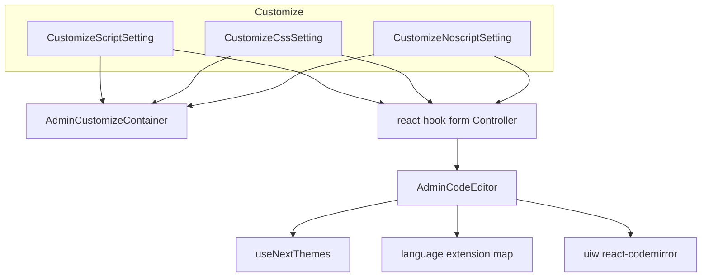
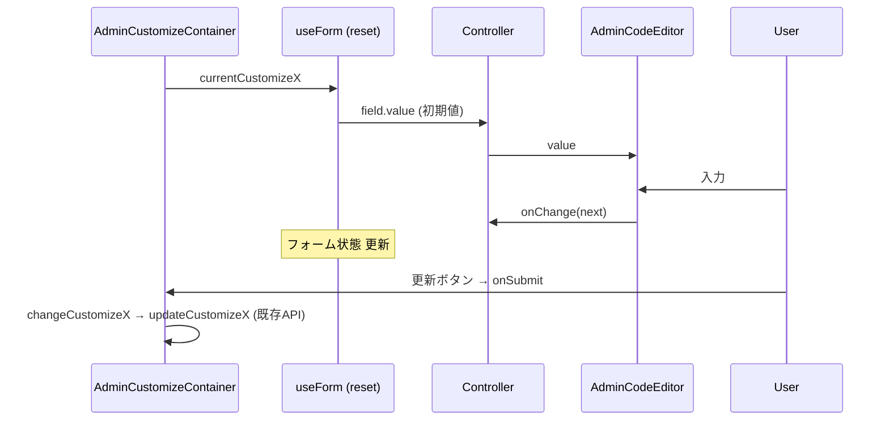

# Technical Design — admin-customize-syntax-highlight

## Overview

**Purpose**: `/admin/customize` のカスタムスクリプト・カスタム CSS・カスタム Noscript の各入力欄に、言語別のシンタックスハイライトと基本的なコード編集支援（行番号・括弧マッチ/自動閉じ）を付与し、GROWI v5 相当の編集体験を復元する。

**Users**: GROWI 管理者。カスタム JavaScript / CSS / HTML(noscript) を編集する際に、色分け・行番号による視認性とデバッグ性の向上を得る。

**Impact**: 3 つの設定コンポーネントの入力実体を、プレーンな `<textarea>` から CodeMirror 6 ベースの再利用可能なコードエディタコンポーネントへ置き換える。保存経路・保存データ形式・周辺 UI は変更しない。react-hook-form の統合方式を `register()`（ネイティブ input 向け）から `Controller`（制御コンポーネント向け）へ変更する。

### Goals
- 3 入力欄に言語別（JavaScript / CSS / HTML）のシンタックスハイライトを表示する（Req 1）
- 行番号・括弧マッチ・括弧自動閉じを提供する（Req 2）
- 管理画面のライト/ダークテーマに追従する（Req 3）
- 既存の値読み込み・保存・トースト・`retrieveError` 挙動を非退行で維持する（Req 4）
- 3 欄で一貫した見た目・操作感を提供し、周辺 UI を維持する（Req 5）

### Non-Goals
- コード補完（Ctrl-Space autocomplete）の提供
- エディタのドラッグリサイズ（v5 の jquery-ui ベース機能）
- 入力コードの構文検証（lint）・エラー表示
- サンプルコード表示（"Example for Google Tag Manager"）の表示技術刷新（現行の `PrismAsyncLight` 表示は維持）
- `/admin/customize` の他セクション（テーマ、レイアウト、タイトル等）への変更
- `@growi/editor` パッケージの公開面拡張（本スペックは apps/app 内で完結する）

## Boundary Commitments

### This Spec Owns
- 新規の再利用可能コードエディタコンポーネント `AdminCodeEditor`（apps/app 内、言語を prop で受け取る）
- `CustomizeScriptSetting` / `CustomizeCssSetting` / `CustomizeNoscriptSetting` の入力欄実装（`<textarea>` → `AdminCodeEditor`）と、それに伴う react-hook-form 統合方式（`register` → `Controller`）
- 言語（javascript/css/html）→ CodeMirror 言語拡張のマッピング定義
- テーマ（ライト/ダーク）のエディタへの反映方法

### Out of Boundary
- 保存 API・保存データ形式（`customizeScript` / `customizeCss` / `customizeNoscript` の文字列）— 既存のまま不変
- `AdminCustomizeContainer` の `changeCustomizeX` / `updateCustomizeX` のシグネチャと責務
- サンプルコード折りたたみ表示、見出し・説明文・`AdminUpdateButtonRow`
- 管理画面全体のテーマ切替機構（`useNextThemes`）— 参照するのみ、変更しない

### Allowed Dependencies
- `@uiw/react-codemirror`（新規に apps/app へ追加）
- `@codemirror/lang-javascript` / `@codemirror/lang-css` / `@codemirror/lang-html`（新規に apps/app へ追加）
- `apps/app/src/stores-universal/use-next-themes`（`resolvedTheme` / `isDarkMode` 参照）
- `react-hook-form`（既存）、`AdminCustomizeContainer`（既存、unstated-next）
- 依存方向: `AdminCodeEditor`（汎用UI・状態を持たない）← 各 `CustomizeXSetting`（フォーム/コンテナ統合）。`AdminCodeEditor` は `AdminCustomizeContainer` に依存しない（純粋な value/onChange 契約のみ）。

### Revalidation Triggers
- `AdminCodeEditor` の props 契約（`value` / `onChange` / `language` 等）の変更
- 対応言語セット（javascript/css/html）の増減
- テーマ反映方式の変更（`resolvedTheme` 依存の変更）
- 保存データ形式に影響する変更（本スペックでは発生しない前提。発生したら Out of Boundary 違反として要再検討）

## Architecture

### Existing Architecture Analysis
- 3 コンポーネントは同一構造：unstated-next の `AdminCustomizeContainer` から `currentCustomizeX` を取得し、`useForm()` + `reset()` で初期同期、`register('customizeX')` を `<textarea>` に適用、`onSubmit` で `changeCustomizeX` → `updateCustomizeX`。
- 同ディレクトリの `CustomizeLayoutSetting` / `CustomizeSidebarSetting` が既に `useNextThemes().resolvedTheme` を使用 → テーマ検出はこの慣習に合わせる。
- `@growi/editor` の CodeMirror 資産は Markdown 特化で言語非依存の汎用 primitive を公開していない → 流用せず、`@uiw/react-codemirror` 上に薄い専用コンポーネントを新設する（build-vs-adopt: ライブラリを adopt、統合層のみ build）。

### Architecture Pattern & Boundary Map



**Architecture Integration**:
- Selected pattern: Presentational wrapper（`AdminCodeEditor`）+ 既存フォーム統合。1 つの汎用エディタを 3 箇所へ言語違いで適用（Generalization）。
- Domain/feature boundaries: `AdminCodeEditor` は状態を持たない純粋な value/onChange コンポーネント。フォーム/保存の責務は各 `CustomizeXSetting` に残す。
- Existing patterns preserved: unstated-next コンテナ経由の保存フロー、`AdminUpdateButtonRow`、`useNextThemes` によるテーマ検出、react-hook-form 利用。
- New components rationale: 3 箇所で重複する CodeMirror 設定を 1 コンポーネントに集約し、一貫性（Req 5.1）と再利用性を担保。
- Dependency direction: `CustomizeXSetting` → `AdminCodeEditor` →（`@uiw/react-codemirror`, lang 拡張, `useNextThemes`）。上位（設定コンポーネント）から下位（汎用エディタ）への一方向。エディタはコンテナを知らない。

### Technology Stack

| Layer | Choice / Version | Role in Feature | Notes |
|-------|------------------|-----------------|-------|
| Frontend (editor) | `@uiw/react-codemirror` ^4.23.8 | CodeMirror 6 の React ラッパ。`value`/`onChange`/`extensions`/`theme`/`basicSetup` を提供 | apps/app へ新規追加（現状 packages/editor の devDep のみ） |
| Frontend (languages) | `@codemirror/lang-javascript` ^6.1.9 / `@codemirror/lang-css` ^6.2.0 / `@codemirror/lang-html` ^6.4.5 | 言語別ハイライト拡張 | apps/app へ新規追加（現状未宣言、推移的にのみ存在） |
| Frontend (theme) | 既存 `useNextThemes`（`resolvedTheme`） | ライト/ダーク判定 → `@uiw/react-codemirror` の `theme` prop へ | 新規テーマ依存は追加しない |
| Frontend (form) | `react-hook-form`（既存） | `Controller` で制御コンポーネント統合 | `register` から移行 |

> 新規依存の Turbopack 分類（`dependencies` か）は実装時に `.next/node_modules/` を確認して確定する（`.claude/rules/package-dependencies.md`）。SSR 実行される admin ページの静的 import 経路になるため `dependencies` が有力。

## File Structure Plan

### New Files
```
apps/app/src/client/components/Admin/Common/
├── AdminCodeEditor.tsx          # 新規: 言語 prop 付きの汎用ハイライト付きコード入力（value/onChange 契約）
└── AdminCodeEditor.spec.tsx     # 新規: 単体テスト（言語別拡張選択・onChange 伝播・theme 追従・補完無効）
```

- `AdminCodeEditor.tsx`: `@uiw/react-codemirror` を包み、`language` prop から言語拡張を選択、`useNextThemes` から `theme` を決定、`basicSetup` で行番号・括弧支援を有効化し補完を無効化。状態は持たない。
- 言語→拡張のマッピングは同ファイル内のモジュールスコープ定数（`Record<CodeEditorLanguage, () => Extension>`）として data-driven に定義（コード内の分岐で言語を特別扱いしない）。

### Modified Files
- `apps/app/src/client/components/Admin/Customize/CustomizeScriptSetting.tsx` — `<textarea {...register}>` を `<Controller>` + `<AdminCodeEditor language="javascript">` に置換。`useForm` から `control` を取得。サンプル表示・更新ボタン・保存フローは維持。
- `apps/app/src/client/components/Admin/Customize/CustomizeCssSetting.tsx` — 同上（`language="css"`）。
- `apps/app/src/client/components/Admin/Customize/CustomizeNoscriptSetting.tsx` — 同上（`language="html"`）。
- `apps/app/package.json` — `@uiw/react-codemirror`, `@codemirror/lang-javascript`, `@codemirror/lang-css`, `@codemirror/lang-html` を追加（分類は実装時に確定）。

> 配置理由: `AdminCodeEditor` は現状 Customize の 3 箇所専用だが、admin 汎用の再利用部品として `Admin/Common/`（既存の `AdminUpdateButtonRow` と同階層）に置く。`Customize/` 直下ではなく Common に置くことで、他 admin 設定からの再利用時に境界が明確になる。

## Components and Interfaces

| Component | Domain/Layer | Intent | Req Coverage | Key Dependencies (P0/P1) | Contracts |
|-----------|--------------|--------|--------------|--------------------------|-----------|
| AdminCodeEditor | UI (admin common) | 言語別ハイライト付きコード入力 | 1, 2, 3, 5.1 | uiw/react-codemirror (P0), lang-* (P0), useNextThemes (P1) | State(props) |
| CustomizeScriptSetting | UI (admin customize) | script 設定の編集/保存 | 1.1, 4, 5 | AdminCodeEditor (P0), AdminCustomizeContainer (P0), RHF Controller (P0) | — |
| CustomizeCssSetting | UI (admin customize) | css 設定の編集/保存 | 1.2, 4, 5 | 同上 | — |
| CustomizeNoscriptSetting | UI (admin customize) | noscript 設定の編集/保存 | 1.3, 4, 5 | 同上 | — |

### UI Layer

#### AdminCodeEditor

| Field | Detail |
|-------|--------|
| Intent | 言語別シンタックスハイライトと基本編集支援を備えた、状態を持たない制御コンポーネント |
| Requirements | 1.1, 1.2, 1.3, 1.4, 1.5, 2.1, 2.2, 2.3, 3.1, 3.2, 3.3, 5.1 |

**Responsibilities & Constraints**
- `language` に応じた CodeMirror 言語拡張を適用し、`value` をハイライト表示する。
- `basicSetup` で行番号・括弧マッチ・括弧自動閉じを有効化し、**autocompletion は無効化**する（Non-Goal）。
- `useNextThemes().resolvedTheme` に基づき `theme`（`'light'` / `'dark'`）を決定・追従する。
- 状態やフォーム・保存ロジックを持たない（value/onChange の純粋契約）。`AdminCustomizeContainer` を import しない。
- 空文字 `value` でもエラーなく空エディタを描画する（1.5）。

**Dependencies**
- Outbound: `@uiw/react-codemirror` — CodeMirror 描画（External, P0）
- Outbound: `@codemirror/lang-javascript` / `lang-css` / `lang-html` — 言語拡張（External, P0）
- Outbound: `useNextThemes` — テーマ検出（Inbound props ではなく hook, P1）

**Contracts**: State ☑

##### Props Interface
```typescript
import type { Extension } from '@codemirror/state';

export type CodeEditorLanguage = 'javascript' | 'css' | 'html';

export interface AdminCodeEditorProps {
  /** 現在のコード文字列（制御値） */
  value: string;
  /** 内容変更時に新しい文字列を通知 */
  onChange: (value: string) => void;
  /** ハイライト対象言語 */
  language: CodeEditorLanguage;
  /** フォーカス喪失時（react-hook-form の blur バリデーション連携用、任意） */
  onBlur?: () => void;
  /** アクセシビリティ用ラベル（任意） */
  'aria-label'?: string;
}
```
- Preconditions: `value` は非 null の文字列（未設定時は呼び出し側で `''` を渡す）。
- Postconditions: ユーザー入力ごとに `onChange(next)` を最新文字列で呼ぶ。`value` の外部更新（`reset` 等）はエディタ内容へ反映される。
- Invariants: `language` から選択する拡張はモジュール定数マップ経由（分岐なし）。補完は常に無効、行番号・括弧支援は常に有効。

**Implementation Notes**
- Integration: 言語マップ `const LANGUAGE_EXTENSIONS: Record<CodeEditorLanguage, () => Extension> = { javascript: () => javascript(), css: () => css(), html: () => html() }`。`extensions={[LANGUAGE_EXTENSIONS[language]()]}`。
- Theme: `const { resolvedTheme } = useNextThemes(); theme={resolvedTheme === 'dark' ? 'dark' : 'light'}`。テーマ切替時は再レンダリングで prop が変わり追従（3.3）。
- basicSetup: `basicSetup={{ autocompletion: false }}`（未指定キーは既定 true のまま＝行番号・bracketMatching・closeBrackets 有効）。
- 見た目: `<textarea rows={8}>` 相当の高さを保つため `minHeight`（例: `200px`）を指定し、`form-control` 相当の枠線・角丸を外側 `div`（クラス）で付与。
- Risks: 制御値でのカーソル維持（@uiw が value 差分を内部処理）。`reset()` による外部更新と入力の競合を単体テストで確認。

#### CustomizeScriptSetting / CustomizeCssSetting / CustomizeNoscriptSetting（Summary-only）

**Implementation Note（3 コンポーネント共通の変更）**
- `useForm()` から `control` を取得（`register` は入力欄では不要になる）。
- 入力欄を以下に置換:
  ```tsx
  <Controller
    name="customizeScript"           // css: 'customizeCss', noscript: 'customizeNoscript'
    control={control}
    render={({ field }) => (
      <AdminCodeEditor
        language="javascript"        // css: 'css', noscript: 'html'
        value={field.value ?? ''}
        onChange={field.onChange}
        onBlur={field.onBlur}
      />
    )}
  />
  ```
- `useEffect` の `reset({ customizeX: currentCustomizeX || '' })` による初期同期は維持（Controller はフォーム値から描画するため互換）。
- `onSubmit` → `changeCustomizeX` → `updateCustomizeX`、成功/失敗トースト、`AdminUpdateButtonRow` の `disabled` は不変（4.2〜4.5）。
- サンプル折りたたみ表示・見出し・説明文は不変（5.2, 5.3）。

## System Flows

値の流れ（初期化・編集・保存）は既存経路を維持し、入力実体のみ差し替わる:



## Requirements Traceability

| Requirement | Summary | Components | Interfaces | Flows |
|-------------|---------|------------|------------|-------|
| 1.1 | script を JS ハイライト | AdminCodeEditor, CustomizeScriptSetting | `language="javascript"` | init flow |
| 1.2 | css を CSS ハイライト | AdminCodeEditor, CustomizeCssSetting | `language="css"` | init flow |
| 1.3 | noscript を HTML ハイライト | AdminCodeEditor, CustomizeNoscriptSetting | `language="html"` | init flow |
| 1.4 | 入力中も継続ハイライト | AdminCodeEditor | `onChange` | edit flow |
| 1.5 | 空でもエラーなし | AdminCodeEditor | `value=''` | init flow |
| 2.1 | 行番号 | AdminCodeEditor | `basicSetup` | — |
| 2.2 | 括弧マッチ | AdminCodeEditor | `basicSetup` | — |
| 2.3 | 括弧自動閉じ | AdminCodeEditor | `basicSetup` | — |
| 3.1 | ライトテーマ配色 | AdminCodeEditor | `theme='light'` | — |
| 3.2 | ダークテーマ配色 | AdminCodeEditor | `theme='dark'` | — |
| 3.3 | テーマ切替追従 | AdminCodeEditor | `useNextThemes` | — |
| 4.1 | 初期値読み込み | CustomizeXSetting | `reset` + Controller | init flow |
| 4.2 | 保存 API 経由保存 | CustomizeXSetting | `updateCustomizeX` | save flow |
| 4.3 | 成功トースト | CustomizeXSetting | `toastSuccess` | save flow |
| 4.4 | エラートースト | CustomizeXSetting | `toastError` | save flow |
| 4.5 | retrieveError で無効化 | CustomizeXSetting | `AdminUpdateButtonRow` | — |
| 4.6 | 保存データ形式不変 | CustomizeXSetting | 文字列 value | save flow |
| 5.1 | 3 欄一貫 | AdminCodeEditor | 共通コンポーネント | — |
| 5.2 | サンプル表示維持 | CustomizeScriptSetting, CustomizeNoscriptSetting | `PrismAsyncLight` | — |
| 5.3 | 周辺 UI 維持 | CustomizeXSetting | 既存 JSX | — |

## Error Handling

- **入力・描画**: 空文字・巨大文字列でも例外を出さない（CodeMirror 標準挙動）。言語拡張の選択はマップの網羅により未定義言語が渡らない（型で保証）。
- **保存**: 既存の `try/catch` + `toastError`/`toastSuccess` を維持（4.3, 4.4）。本スペックは保存経路のエラー戦略を変更しない。
- **依存ロード**: 新規依存が本番で解決できない（`ERR_MODULE_NOT_FOUND`）リスクは、Turbopack 分類確認（`.next/node_modules/` チェック、`server:ci`）で実装時に排除する。

## Testing Strategy

### Unit Tests（`AdminCodeEditor.spec.tsx`, RTL + Vitest）
- `language` ごとに対応する言語拡張が適用され、コードが色分け（ハイライトのマーク付与）される（1.1〜1.3）。
- 入力に応じて `onChange` が最新文字列で呼ばれる（1.4）。
- `value=''` でエラーなく描画される（1.5）。
- 行番号ガターが描画される（2.1）。
- `basicSetup` で補完が無効・括弧支援が有効であること（2.2, 2.3、Non-Goal の補完無効）。
- `useNextThemes` をモックし `resolvedTheme` を切り替えると `theme` クラス（`cm-theme-light` / `cm-theme-dark`）が切り替わる（3.1〜3.3）。

### Integration Tests（各 `CustomizeXSetting`、RTL + Vitest）
- `AdminCustomizeContainer` の初期値が `Controller` 経由でエディタに反映される（4.1）。
- 編集して submit すると `changeCustomizeX`/`updateCustomizeX` が編集後の文字列で呼ばれる（4.2, 4.6）。
- 成功時に成功トースト、失敗時にエラートーストが表示される（4.3, 4.4）。
- `retrieveError` 設定時に更新ボタンが無効化される（4.5）。
- サンプル折りたたみ・見出し等の既存要素が引き続き描画される（5.2, 5.3）。

> テスト実装時は `.claude/skills/essential-test-design`（観測可能な契約を検証）と `essential-test-patterns`（RTL・型安全モック・`vitest-mock-extended`）に従う。CodeMirror 内部実装ではなく、ハイライトの有無・`onChange`・テーマクラス等の観測可能な出力を検証する。

## Open Questions / Risks
- **Turbopack 依存分類**: 追加パッケージが `.next/node_modules/` に外部化される場合は `dependencies` へ。実装タスクで検証・確定する（High 優先で対処）。
- **制御値のカーソル維持**: `Controller` 制御下でのキー入力とカーソル位置。`@uiw/react-codemirror` の value 差分処理に依存。単体テストと手動スモークで確認。
- **`form-control` 相当の見た目**: 枠線・高さ・フォーカスリングを CSS で寄せる必要がある（機能ではなく体裁。実装時に既存 admin 入力と揃える）。
