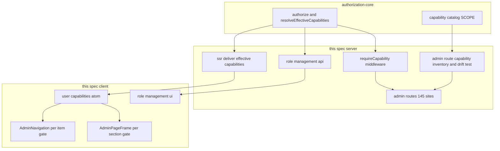
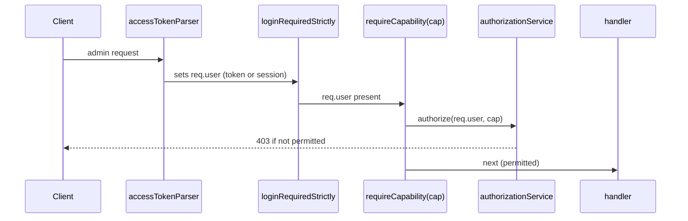
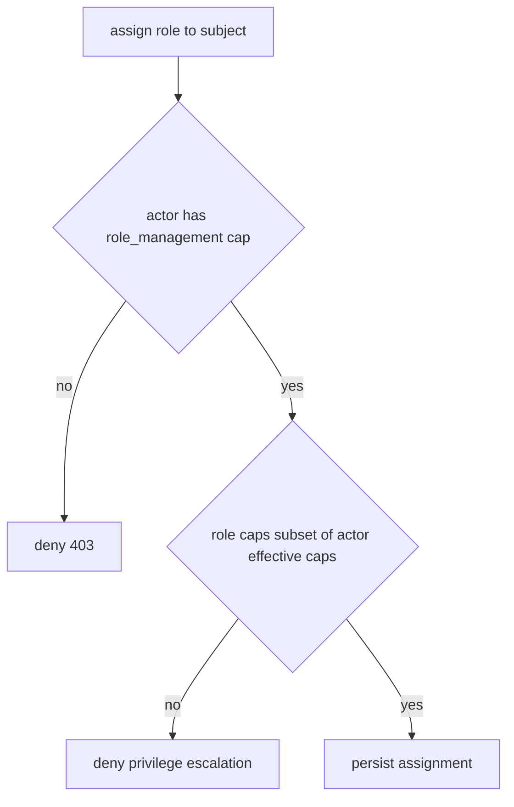

# Design Document: admin-permission-delegation

## Overview

**Purpose**: 管理画面の全か無かゲート（`adminRequired`＝`req.user.admin`）を、**セクション単位の
capability を要求する単一ミドルウェア `requireCapability`** に置き換え、管理者が capability の
部分集合を持つ**委譲管理者ロール**を作成・付与できるようにする。判定は base sub-spec
`authorization-core` の `authorize()` に委譲する。

**Users**: 運用管理者（ロールを定義・付与する側）と、委譲されたユーザー（許可セクションのみ操作可）。

**Impact**: access-control umbrella の中で**初めて観測挙動が変わる** sub-spec。約 145 の管理経路の
ゲートを差し替える。ただし後方互換（`admin ⇒ 全 capability`、ロール未付与＝従来どおり）を保ち、
**段階置換＋回帰**で権限バイパス・ロックアウトを防ぐ。

### Goals
- 管理セクションごとの capability を、**各経路が既に宣言している `SCOPE` 注釈の再利用**で表現する（1, 4）。
- `adminRequired` を `requireCapability` に**全管理経路で網羅置換**し、未適用経路を残さない（4）。
- 委譲ロールの作成・付与 UI/API と、権限昇格の防止を提供する（2, 3, 7）。
- 委譲ユーザーに許可セクションのみを表示する（nav/frame の事前反映、サーバーが最終権威）（5）。
- 導入時に既存管理者・非管理者の観測を変えない（6）。

### Non-Goals
- `authorize()` / Role / RoleAssignment / capability カタログの仕組み（`authorization-core`）。
- アカウント全体ロール（`account-scope-roles`）、ページ権限（`granular-page-permissions`）。
- グローバル `User.readOnly` の挙動変更。新しい管理セクション/機能の追加。
- access-token scope 評価パス（`accessTokenParser`）の変更（位置に接続するのみ）。

## Boundary Commitments

### This Spec Owns
- `requireCapability` ミドルウェアと、全管理経路での `adminRequired` からの置換。
- 管理セクション capability の**割り当て**（各経路→必要 capability。原則 既存 `SCOPE` を再利用）と、
  ロール管理用に**1つの新 capability**（`write:admin:role_management`）の追加。
- 委譲ロールの管理 API/UI（作成・編集・削除・付与・解除）と権限昇格防止。
- 管理 nav/画面の capability 事前反映、および client への実効 capability 配信。
- 「網羅（未適用経路ゼロ）」を保証するドリフト検出テストと、除外経路の明示リスト。

### Out of Boundary
- `authorize()` 判定・Role/RoleAssignment データモデル・実効 capability 合成（`authorization-core`）。
- `accessTokenParser` の内部・token 検証。`PageGrantService`。`readOnly` / ROM。

### Allowed Dependencies
- `authorization-core`: `IAuthorizationService.authorize()` / `can()` /
  `resolveEffectiveCapabilities()`、`Role` / `RoleAssignment`、`Capability(=Scope)` カタログ。
- 既存 `SCOPE`（`@growi/core`）、`accessTokenParser` チェーン位置、`loginRequiredStrictly`。
- 既存 UI 配管: `AdminNavigation` / `AdminPageFrame` / `currentUser` SSR props / `apiv3-client`。
- 依存方向: `authorization-core` → `requireCapability` → routes / role API → client 配信 → UI。上位→下位のみ。

### Revalidation Triggers
- `requireCapability` の契約（引数 capability・403 セマンティクス）変更。
- 管理経路の追加/削除（インベントリとドリフト検出テストの更新が必須）。
- client capability 配信の形（SSR prop 契約）変更。
- ロール管理 API のレスポンス契約変更。

## Architecture

### Existing Architecture Analysis
- 管理ゲートは **per-route の `adminRequired` が約 145 経路 / 28–29 ファイル**に散在（router 一括は無い）。
- 各経路は既に `accessTokenParser([SCOPE.<R/W>.ADMIN.<section>])` を宣言 → **必要 capability が経路に注釈済み**。
- token は `req.user` を埋めるだけ。**token 経由でも `req.user.admin` が真でないと `adminRequired` を通らない**。
- client admin nav は静的リストで per-item ゲート無し、画面ゲートは `AdminPageFrame` が `currentUser.admin` を見るのみ。
- SSR `/admin/*` は `routes/index.js` で `adminRequired`。除外経路: `/healthcheck`・`/installer`・vault user API。

### Architecture Pattern & Boundary Map



**Architecture Integration**:
- Selected pattern: **単一ゲートミドルウェア＋既存スコープ注釈の再利用＋段階置換**。
- Preserved patterns: `accessTokenParser` チェーン位置、`SCOPE` 語彙、UserGroup 管理 UI、`currentUser` SSR 配信。
- New components rationale: `requireCapability`（`adminRequired` の置換先・単一チョークポイント）、
  ロール管理 API/UI（欠落機能）、client capability 配信（nav 事前反映に必須）、ドリフト検出（網羅保証）。
- Steering compliance: 判定は `authorize()` に委譲しミドルウェアは薄い adapter。インベントリは単一ソース
  で宣言しゲート/テストが共有（executor は work-set を import しない）。

### Key Design Decisions（承認時に確認したい pivotal 決定）

- **DD-A（推奨）**: 各経路の必要 capability は、**その経路が既に宣言している `SCOPE`** を再利用する。
  置換は `adminRequired,` → `requireCapability(SCOPE.<...>),` で、上の行の `accessTokenParser` と同じ
  スコープを渡す（新 capability を経路ごとに発明しない）。
- **DD-B（推奨）**: token 経路の意味は**現状維持**。`requireCapability` は `req.user`（token の場合は
  token の user）の実効 capability を見る。admin は従来どおり通過し、capability を持つ委譲ユーザーも
  通る（後方互換な拡張）。token 評価パス自体は変更しない。
- **DD-C（推奨）**: client へ**ユーザーの実効 capability 集合を SSR prop で配信**し、nav を per-item、
  `AdminPageFrame` を per-section でゲート。enforcement はあくまでサーバー（`requireCapability`）。
- **DD-D（推奨）**: ロール管理操作は新 capability `write:admin:role_management` を要求。導入時は
  admin（＝全 capability 保持）のみが持つため、実質フル管理者限定。将来この capability を委譲可能。
- **DD-E（推奨・レビュー Issue 2 対応）**: capability の**enforcement は per-scope**（`read/write:admin:X`）
  のままとしつつ、ロール構成 UI とナビ紐付けは**「セクション束（`AdminSection`）」単位**で行う。
  1セクション = そのセクションの read/write スコープの束。ロール構成では**セクションごとに
  `none / view(read) / manage(read+write)`** を選べる（生スコープ 100+ を並べない・view のみ委譲＝
  監査担当も表現可能・write のみ付与で read 漏れによる 403 を防ぐ＝manage は read を含む）。

### Technology Stack

| Layer | Choice / Version | Role in Feature | Notes |
|-------|------------------|-----------------|-------|
| Shared | `@growi/core` `SCOPE` | capability 語彙。`role_management` を1つ追加 | 追加は changeset 対象 |
| Backend | Express, Mongoose ^6 | `requireCapability`・ロール管理 API・ドリフト検出 | 新規外部依存なし |
| Frontend | React 18 / Next.js, Jotai, SWR | capability atom・nav/frame ゲート・ロール管理 UI | 既存配管を拡張 |

## File Structure Plan

### Created
```
packages/core/src/interfaces/
  scope.ts (modify)                          # ADMIN に role_management を1つ追加
apps/app/src/server/middlewares/
  require-capability.ts                       # 新: authorize を呼ぶ薄いゲート（adminRequired の置換先）
apps/app/src/server/service/authorization/
  admin-capability-inventory.ts               # 新: 管理セクション束(ADMIN_SECTIONS)＋除外リスト＋変種ゲート形の単一宣言
apps/app/src/server/routes/apiv3/
  admin-role.ts                               # 新: ロール CRUD＋付与/解除 API
apps/app/src/client/components/Admin/Role/
  RolePage.tsx / RoleTable.tsx /
  RoleModal.tsx / RoleForm.tsx /
  RoleAssignPanel.tsx                         # 新: ロール管理 UI（UserGroup パターン踏襲）
apps/app/src/stores/
  admin-role.tsx                              # 新: useSWRxRoleList など SWR フック
```

### Modified
- **管理ルート 28–29 ファイル**（`routes/apiv3/*` ＋ feature 系 `external-user-group` / `growi-plugin/admin` /
  `mastra/admin-ai-settings` / `news` / `growi-vault/vault-admin`）— 各 `adminRequired` を
  `requireCapability(<既存スコープ>)` に置換（**段階的**）。
- `apps/app/src/server/routes/index.js` — SSR `/admin/*` ゲートを「admin capability を1つ以上持つ」判定へ
  （管理シェルの読み込み許可。per-section は API＋frame で強制）。
- `apps/app/src/components/Admin/Common/AdminNavigation.tsx` — 各 `MenuLink` に必要 capability を紐づけ、
  capability を持つ項目のみ表示。
- `apps/app/src/pages/admin/_shared/AdminPageFrame.tsx` ＋ `get-server-side-common-props.ts` —
  `!currentUser.admin` 一択から、対象セクションの capability 判定へ。
- `apps/app/src/pages/common-props/commons.ts` — `userAdminCapabilities`（実効 capability の admin 部分集合）を SSR prop に追加。
- `apps/app/src/states/global/global.ts`（または `states/context.ts`）— capability atom を追加。
- `apps/app/src/server/routes/apiv3/index.js` — `admin-role` ルートを `routerForAdmin` に登録。

> `PageGrantService` / `page` / `revision` / Elasticsearch / プラグイン読込機構は**変更しない**。

## System Flows

### 管理操作のゲート（置換後）



- `requireCapability(cap)` の `cap` は、同経路の `accessTokenParser` が宣言するスコープと同一（DD-A）。
- admin は全 capability を持つため常に通過（後方互換, 6.1）。ロール未付与の非 admin は不許可（6.2）。
- 除外経路（healthcheck/installer/vault user）は `requireCapability` を**付けない**（インベントリで明示）。

### ロール付与時の昇格防止（7.3）



## Requirements Traceability

| Requirement | Summary | Components | Interfaces | Flows |
|-------------|---------|------------|------------|-------|
| 1.1, 1.2 | セクション capability の定義・列挙 | admin-capability-inventory, scope.ts | inventory, SCOPE | — |
| 1.3 | 追加はカタログ宣言で完結 | scope.ts, authorization-core catalog | SCOPE | — |
| 2.1, 2.2, 2.3 | ロール作成・編集・削除 | admin-role API, RolePage/Form | role CRUD API | — |
| 2.4 | 未定義 capability を拒否 | admin-role API | validation | — |
| 3.1, 3.2 | ユーザー/グループへ付与・解除 | admin-role API, RoleAssignPanel | assignment API | — |
| 3.3 | 不存在の対象は拒否 | admin-role API | validation | — |
| 4.1, 4.2 | capability 一致で許可/なしで拒否 | requireCapability | `requireCapability` | ゲート |
| 4.3 | 全経路に適用・未適用ゼロ | admin-capability-inventory, drift test, 145 置換 | inventory | — |
| 4.4 | token＋スコープは従来どおり | requireCapability（DD-B） | authorize on req.user | ゲート |
| 5.1 | 許可セクションのみ表示 | AdminNavigation, capability atom, SSR 配信 | `userAdminCapabilities` | — |
| 5.2 | 直接アクセスはサーバー拒否 | requireCapability, AdminPageFrame, /admin SSR gate | `requireCapability` | ゲート |
| 6.1, 6.2, 6.3 | 後方互換・移行不要 | requireCapability（authorize の admin=全） | authorize | ゲート |
| 7.1, 7.2 | ロール管理は権限保持者のみ | admin-role API + requireCapability(role_management) | `requireCapability` | ゲート |
| 7.3 | 自身の持たない capability を付与不可 | admin-role assignment service | 昇格チェック | 昇格防止 |

## Components and Interfaces

| Component | Domain/Layer | Intent | Req Coverage | Key Dependencies (P0/P1) | Contracts |
|-----------|--------------|--------|--------------|--------------------------|-----------|
| requireCapability | Server middleware | 管理経路の単一 capability ゲート | 4,5,6,7 | authorizationService (P0) | Service |
| admin-capability-inventory | Server (data) | 経路→capability の単一宣言＋除外リスト | 1,4 | SCOPE (P0) | State |
| admin-role API | Server route | ロール CRUD＋付与＋昇格防止 | 2,3,7 | authorizationService (P0), requireCapability (P0) | API |
| SSR capability 配信 | Server → props | 実効 capability を client へ | 5 | authorizationService (P0) | State |
| capability atom | Client state | 現ユーザーの capability 保持 | 5 | SSR props (P0) | State |
| AdminNavigation / AdminPageFrame (拡張) | Client UI | nav/画面の per-section 事前反映 | 5 | capability atom (P0) | State |
| Role 管理 UI | Client UI | ロール作成・付与画面 | 2,3 | admin-role API (P0), SWR (P1) | — |

### Server

#### requireCapability（ミドルウェア）

| Field | Detail |
|-------|--------|
| Intent | `adminRequired` の置換先。指定 capability を要求する単一チョークポイント |
| Requirements | 4.1, 4.2, 4.4, 5.2, 6.1, 6.2, 7.1 |

**Responsibilities & Constraints**
- `req.user` と与えられた capability で `authorizationService.authorize(user, capability)` を呼び、
  不許可なら 403（apiv3）を返す。純粋判定は `authorization-core` に委譲（薄い adapter）。
- `excludeReadOnlyUser`（ROM）とは独立。`readOnly` を根拠にしない。
- **除外経路には適用しない**（healthcheck/installer/vault user）。

**Contracts**: Service [x]
```typescript
// crowi 注入。capability を引数に取り RequestHandler を返す
function generateRequireCapability(crowi: Crowi): (capability: Capability) => RequestHandler;
// 使用例（DD-A: 上行の accessTokenParser と同一スコープを渡す）
// router.get('/', accessTokenParser([SCOPE.READ.ADMIN.TOP]), loginRequiredStrictly,
//            requireCapability(SCOPE.READ.ADMIN.TOP), handler)
```
- Postconditions: `authorize` が false なら 403、true なら `next()`。admin は全 capability のため常に true（6.1）。

#### admin-capability-inventory（単一宣言）

| Field | Detail |
|-------|--------|
| Intent | 管理**セクション束**・「ゲート除外経路」・変種ゲート形を単一ソースで宣言し、nav 紐付けとドリフト検出テストが読む |
| Requirements | 1.1, 1.2, 4.3 |

**Contracts**: State [x]
```typescript
// DD-E: セクション束（enforcement は per-scope、構成/表示はセクション単位）
export interface AdminSection {
  key: string;                 // 例 'user_group_management'
  navMenu: string;             // AdminNavigation の MenuLink キー
  readCapability: Capability;  // 例 SCOPE.READ.ADMIN.USER_GROUP_MANAGEMENT
  writeCapability: Capability; // 例 SCOPE.WRITE.ADMIN.USER_GROUP_MANAGEMENT
}
export const ADMIN_SECTIONS: readonly AdminSection[] = [ /* 全管理セクション */ ];

// capability ゲートを付けない経路（誤ゲート＝ロックアウトを防ぐ明示除外）
export const UNGATED_ADMIN_ROUTES: readonly string[] = [
  '/_api/v3/healthcheck', '/_api/v3/installer', /* vault user endpoint */
];
```
- **ドリフト検出テスト（Issue 1 対応・4.3）**: 経路の列挙は GROWI 既存の **route-middleware スナップ
  ショットツール**（`admin-required.ts` の named-fn コメントが前提とする仕組み）と
  `.kiro/specs/esm-migration/route-middleware-baseline.json` を基盤に行い、全 admin apiv3 経路が
  `requireCapability` を持つ（または `UNGATED_ADMIN_ROUTES` に属する）ことを検証する。
- **変種ゲート形を明示列挙（Issue 1 対応）**: 単純 grep に掛からない形——`growi-vault/vault-admin.ts`
  の配列形 `[loginRequiredFactory, adminRequiredFactory]`、`g2g-transfer.ts` の
  `adminRequiredIfInstalled`、`news.ts` の条件付き構築——もインベントリに列挙し、置換/検証対象に含める。

#### admin-role API

| Field | Detail |
|-------|--------|
| Intent | 委譲ロールの CRUD・付与・解除と昇格防止 |
| Requirements | 2.1, 2.2, 2.3, 2.4, 3.1, 3.2, 3.3, 7.1, 7.2, 7.3 |

**Contracts**: API [x]

| Method | Endpoint | Request | Errors |
|--------|----------|---------|--------|
| GET | /_api/v3/admin/roles | — | 403 |
| POST | /_api/v3/admin/roles | `{ name, description?, capabilities: Capability[] }` | 400(未定義cap/名前重複), 403 |
| PUT | /_api/v3/admin/roles/:id | `{ name?, description?, capabilities? }` | 400, 403, 404 |
| DELETE | /_api/v3/admin/roles/:id | — | 403, 404 |
| POST | /_api/v3/admin/roles/:id/assignments | `{ subjectType, subjectId }` | 400(不存在), 403(昇格), 404 |
| DELETE | /_api/v3/admin/roles/:id/assignments/:assignmentId | — | 403, 404 |

- 全経路 `requireCapability(SCOPE.WRITE.ADMIN.ROLE_MANAGEMENT)`（GET は READ 相当）で保護（7.1/7.2）。
- 付与時、**ロールの capability ⊆ 実行者の実効 capability** を検証し、違反は 403（7.3）。
- `capabilities` の各要素はカタログ存在を検証（2.4）。作成/編集/削除は `Role`、付与/解除は `RoleAssignment`
  を操作（モデルは `authorization-core` 所有）。

#### SSR capability 配信

**Contracts**: State [x]
- `common-props/commons.ts` に `userAdminCapabilities: Capability[]`（現ユーザーの実効 capability の
  admin 部分集合）を追加。`authorizationService.resolveEffectiveCapabilities(user)` から算出。
- enforcement には用いない（表示用）。サーバーの `requireCapability` が最終権威（5.2）。

### Client（UI）

#### AdminNavigation / AdminPageFrame（拡張）
- `AdminNavigation`: 各 `MenuLink` を `ADMIN_SECTIONS` の `navMenu` に紐づけ、そのセクションの
  read capability を持たない項目は非表示（DD-E, 5.1）。
- `AdminPageFrame`: `!currentUser.admin` 判定を、対象セクションの read capability 判定へ置換。持たない場合 Forbidden。
- SSR `/admin/*` ゲート（`routes/index.js`）は「admin capability を1つ以上持つ」なら管理シェルを配信（per-section は上記で強制）。

#### Role 管理 UI（新規）
- `RolePage`（一覧＋作成/編集/削除モーダル）・`RoleForm`・`RoleAssignPanel`（ユーザー/グループ付与）。
  UserGroup 管理（`UserGroupPage` / `stores/user-group.tsx`）のパターンを踏襲。SWR は `stores/admin-role.tsx`。
- **`RoleForm` はセクション単位（DD-E）**: `ADMIN_SECTIONS` を一覧し、各セクションで
  `none / view / manage` を選ぶ。保存時 view→read capability、manage→read+write capability に展開して
  `Role.capabilities`（per-scope）へ格納する（生スコープを直接並べない）。

## Data Models
- 新規コレクションは無い。`Role` / `RoleAssignment`（`authorization-core` 所有）を利用。
- 追加スキーマ変更は `scope.ts` への `role_management` capability 追加のみ（コード上の定数）。移行不要。

## Error Handling
- **403（capability 不足）**: `requireCapability` が `authorize` false で返す（4.2, 5.2, 7.2）。
- **403（昇格）**: 付与時に role capability ⊄ 実行者 capability（7.3）。
- **400**: 未定義 capability・名前重複（2.4）、付与対象不存在（3.3）。
- **除外経路の保護**: 誤って `requireCapability` を付けない（installer/healthcheck ロックアウト防止）。ドリフト検出テストは除外リストを尊重。
- fail-closed（判定材料の取得失敗は不許可）。監視は既存 logger/activity 経路。

## Testing Strategy

### Unit Tests
- `requireCapability`: capability を持つ user=next、持たない=403、admin=常に next（4.1, 4.2, 6.1）。
- 昇格防止: role capability ⊄ 実行者 capability の付与を拒否（7.3）。
- inventory: `ADMIN_SECTION_CAPABILITIES` がカタログに存在（1.1）。

### Integration Tests
- 代表管理経路（例 user-group / markdown / security）で、capability を持つ委譲ユーザー=成功、持たない=403、
  フル管理者=成功、非 admin 未付与=403（4.1, 4.2, 6.1, 6.2）。
- token＋対応スコープ＋admin user=従来どおり成功（4.4）。
- ロール CRUD＋付与/解除 API（2, 3）。ロール管理 capability 無し=403（7.2）。
- **ドリフト検出（Issue 1）**: route-middleware スナップショット（`route-middleware-baseline.json` 基盤）で
  全 admin apiv3 経路が `requireCapability` を持つ（or `UNGATED_ADMIN_ROUTES`）＝未適用ゼロ（4.3）。
  変種ゲート形（vault 配列 / g2g `IfInstalled` / news 条件付き）も検証に含める。
- **後方互換回帰（Issue 3・6）**: 既存 `.kiro/specs/esm-migration/authz-matrix-baseline.json`
  （＋`ws-authz-baseline.json`）を基準に、admin/非 admin × 代表経路の許可行列を導入前後で突合し不変を検証。
- 除外経路（healthcheck/installer）が capability ゲート無しで従来どおり応答（誤ロックアウト無し）。

### E2E（critical path）
- 「UserGroup 管理だけ」のロールを作り非 admin に付与 → その画面のみ nav 表示・操作可、他は非表示/403（3, 5）。
- 後方互換: ロール未付与で既存 admin が全管理操作可、非 admin は不可（6.1, 6.2）。

## Security Considerations
- **網羅性が最重要（CWE-862/863）**: 1経路の付け忘れ＝バイパス。単一ソースのインベントリ＋ドリフト検出
  テスト＋段階置換＋回帰で担保（4.3）。
- **除外経路の誤ゲート＝ロックアウト**: healthcheck/installer/vault user を明示除外し、テストで保護。
- **権限昇格防止**: ロール管理は `role_management` capability 保持者のみ（導入時 admin 限定）。付与は
  実行者の capability 部分集合に限定（7.3）。
- **client は enforcement に使わない**: capability 配信は表示用、サーバー `requireCapability` が最終権威（5.2）。
- **token 互換**: token の権限は「token スコープ ∧ user capability」に保たれ、admin は従来どおり（DD-B, 4.4）。
- **ROM 分離**: `readOnly` は capability 判定の根拠にしない。

## Migration Strategy
- **データ移行なし**。ロール未付与では admin=全 capability・非 admin=admin 権限なし＝従来と同一（6.1–6.3）。
- **段階置換**: 影響の小さい独立ファイル（markdown/customize/notification …）から `adminRequired`→
  `requireCapability` を1ファイルずつ置換し、各段で「admin/非 admin の観測不変」回帰を通す。最後に users/
  user-group など影響大を置換。ドリフト検出テストが常に未適用経路ゼロを保証。
- ロールバック: `requireCapability` は admin に対し常に true のため、途中段階でも admin 運用は無害。
