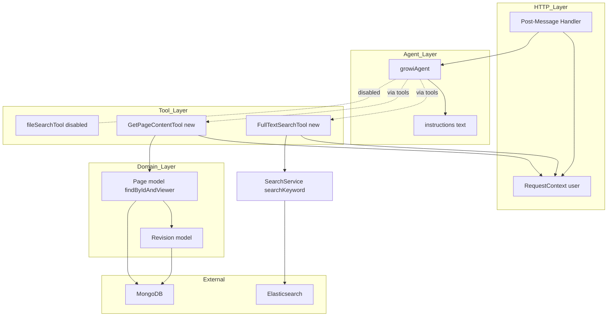
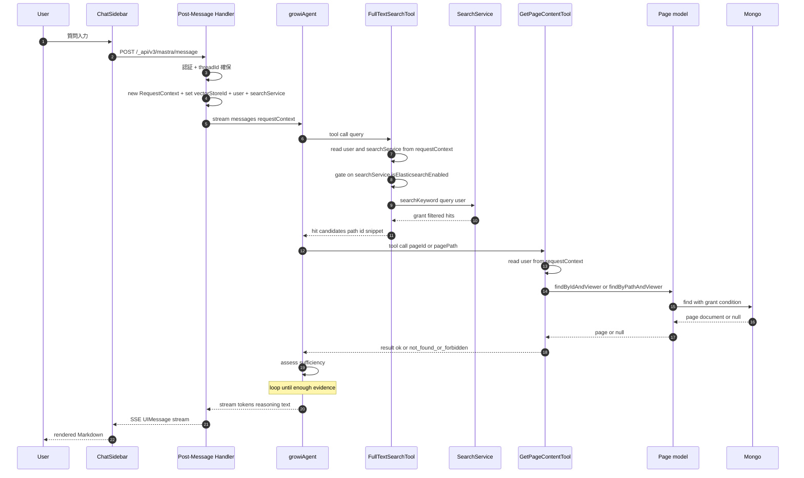
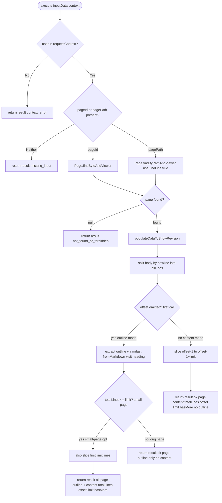
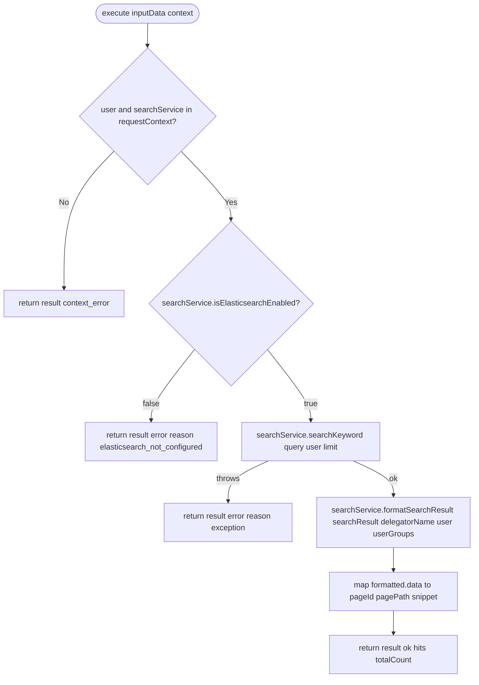

# Design Document: agentic-search

> **更新メモ（vectorStore 廃止後）**: 本設計の確定後、AI のベクトルストア（OpenAI Files / vectorStore）依存が廃止された。現状では `fileSearchTool` とそのソースファイル（`tools/file-search-tool.ts`・`ai-sdk-modules/file-search.ts`）は**削除済み**（本設計が「暫定無効化・ソース残置」「最終削除はフォローアップ」としていた部分は完了）、`MastraRequestContextShape` は `{ user: IUserHasId; searchService: SearchService }`（`vectorStoreId` を**削除**）、`post-message.ts` も `requestContext` に `vectorStoreId` を set しない。以降、本文・図・型定義・タスク中の `vectorStoreId` および `fileSearchTool` に関する記述は策定当時の設計記録として読み替えること。現在の `growiAgent.tools` は `fullTextSearchTool` / `getPageContentTool` の 2 本。

## Overview

**Purpose**: 既存 Mastra `growiAgent` に「ES 全文検索 tool」と「ページ本文取得 tool」の 2 本を新設し、両者を組み合わせた RAG 的反復ループを成立させる。これにより、GROWI ユーザーが自然言語の問い合わせから根拠つき Markdown 回答を得られるようにする。

**Users**: GROWI の認証済みユーザー（既存 ChatSidebar / `useChat` 経由のすべての利用者）。

**Impact**: agent の `tools` 構成を変更（新 tool 2 本追加 + 既存 `fileSearchTool` 暫定無効化）、`RequestContext` 型を拡張し `user: IUserHasId` と `searchService` を伝搬。既存ストリーミング応答層・メモリ・スレッド管理は不変。

### Goals
- `growiAgent` が「全文検索 → 本文取得 → 必要に応じて再検索 → 合成」を自律的に反復する agentic ループを成立させる
- ページ本文取得経路がページ閲覧権限（grant）を完全に既存メソッドへ委譲する
- 新規 tool 2 本（`fullTextSearchTool` + `getPageContentTool`）+ 既存ファイルの軽微修正で実装を完結させる

### Non-Goals
- タグを主軸とした専用 tool（`fullTextSearchTool` とは独立した、タグ一覧・ファセット・関連ページ提示等の新規 tool）の新設（別 spec）
- 関連ページ / 最近更新ページ / クエリ再構成等の新規 tool（別 spec）
- ベクトル検索・埋め込み統合（別 spec）
- ChatSidebar / Chat UI 改修（別 spec）
- アクセスログ・検索品質評価基盤（別 spec）
- `fileSearchTool` の最終削除(フォローアップ別タスク)
- `RequestContext` のモジュールシングルトン構造の根本修正（既存挙動踏襲、別タスクで議論）
- 書き込み系プロンプト・wiki 外知識への明示対応

> **タグによる絞り込み自体は本 spec の対象**: `fullTextSearchTool.query` の演算子として `tag:foo` / `-tag:foo` を agent に開示し、`SearchService.parseQueryString` 経由で利用可能にする（後述「サポートするクエリ構文」）。Non-Goals に含まれるのは「タグ専用の新規 tool」「タグ一覧 / ファセット UX」のみで、タグを使った検索の **能力** そのものは in scope。

> **`sort` / `order` 入力パラメータも本 spec の対象**: `fullTextSearchTool` の zod `inputSchema` に `sort` (`relationScore` / `createdAt` / `updatedAt`) と `order` (`desc` / `asc`) を追加し、agent が「最新ページ」「古いページ」要求に応じて並び替えを指定できるようにする（後述「並び替えの開示」）。Non-Goals に含まれる「最近更新ページ / メタ・時系列クエリ専用 tool」とは別の話で、既存 tool への並び替えオプション追加は in scope。

## Boundary Commitments

### This Spec Owns
- `fullTextSearchTool`（新規 Mastra tool）の入出力契約、execute 実装、テスト
- `getPageContentTool`（新規 Mastra tool）の入出力契約、execute 実装、テスト
- `growiAgent.tools` の構成変更（新 tool 2 つ登録 + `fileSearchTool` のコメントアウト）と `growiAgent.instructions` の文言調整（旧 `fileSearch` 行のコメントアウトを含む）
- `RequestContext` の型シェイプ拡張（`{ vectorStoreId; user; searchService }`）。`user` は `IUserHasId` 全体（`_id` 単独ではなく）を載せ、ES delegator や `findByIdAndViewer` が必要とする可能性のあるフィールドにそのまま委譲できる形にする
- `post-message.ts` における `user`（= 認証ミドルウェア通過後の `req.user: IUserHasId`）および `searchService` の `requestContext` セット
- **`RequestContext` のリクエストスコープ化**: 既存のモジュールスコープ singleton（[post-message.ts:40](apps/app/src/features/mastra/server/routes/post-message.ts#L40)）をハンドラ関数内で `new RequestContext(...)` する構造に変更し、並列リクエスト下での `user` 漏洩を防止する

### Out of Boundary
- `SearchService.searchKeyword()` / `ElasticsearchDelegator` 内部実装の変更（既存メソッドを呼ぶだけで、内部の検索アルゴリズムや grant ロジックは触らない）
- `Page` モデル / `Revision` モデル / `populateDataToShowRevision()` 等の挙動変更
- ページ閲覧権限（grant）判定ロジック自体の修正・新規実装
- ChatSidebar / `useChat` / AI SDK ストリーミング層の修正
- `fileSearchTool` 本体ファイル（`tools/file-search-tool.ts`）の削除や API 変更
- メモリ・スレッド永続化（`getOrCreateThread` / Mastra Memory）の挙動変更
- 既存の vectorStoreId 伝搬経路の意味論変更（リクエストスコープ化により実装は変わるが、`vectorStoreId` の意味と寿命は不変）

### Allowed Dependencies
- `@mastra/core/tools` の `createTool`
- `@mastra/core/agent` の `Agent`（既存 instance を再利用、再構築しない）
- `@mastra/core/request-context` の `RequestContext` 型
- `zod` による入出力 schema 定義
- `SearchService.searchKeyword()`（既存 ES 検索経路、grant 委譲先）
- `Page.findByIdAndViewer` / `Page.findByPathAndViewer`（grant 委譲経路）
- `populateDataToShowRevision()` または `.populate('revision')`（revision 取得）
- `Revision` モデル（`body` 参照のみ）
- `mdast-util-from-markdown`（既存 direct dep、`apps/app/package.json` で `^2.0.1`。`getPageContentTool` の outline 抽出で MDAST を構築）
- `unist-util-visit`（既に `apps/app/package.json` の `dependencies` に `^5.0.0` で direct dep として宣言済み — Task 3.4 実装時の確認で判明。`apps/app/src/services/renderer/remark-plugins/xsv-to-table.ts` がこれを利用しており、`getPageContentTool` も同じ direct dep を再利用する。新規追加は **不要**）
- `mdast-util-to-string`（`apps/app/node_modules` 直下に存在せず resolve 不能。本 PR で **`apps/app/package.json` の `dependencies` に `^4.0.0` を新規追加** する必要あり。`getPageContentTool` の outline 抽出で heading text のプレーン化に使用、ESM）
- `~/utils/logger`（pino 経由のロガー）

依存方向は **HTTP Layer → Agent Layer → Tool Layer → Page / Revision Model → Mongoose**。tool 層から HTTP 層を逆参照しない。

### Revalidation Triggers
- `Page.findByIdAndViewer` または `Page.findByPathAndViewer` のシグネチャ・戻り値仕様変更
- `RequestContext` ジェネリクスを共有する他コンポーネントの追加 / 型変更（key 衝突発生時）
- `@mastra/core` の `createTool` / `Agent.stream()` API の破壊的変更
- `SearchService.searchKeyword()` / `SearchService.formatSearchResult()` のシグネチャ・戻り値スキーマ変更（特に `IFormattedSearchResult.data[i].data._id` / `.data.path` / `.meta.elasticSearchResult.snippet` の整合。tool は生の `_highlight` ではなく `formatSearchResult` の出力を消費する）
- 既存 `growiAgent.instructions` の英語ベース構造を逸脱する変更（多言語応答ルールの再検証要）
- `@mastra/core` の `RequestContext` 実装が AsyncLocalStorage 等のリクエスト隔離機構に変わった場合（本 spec のリクエストスコープ化が冗長になる）

## Architecture

### Existing Architecture Analysis

| 既存要素 | 役割 | 本 spec での扱い |
|---|---|---|
| `post-message.ts` Express route | 認証・スレッド確保・`agent.stream()` の呼び出し・SSE 中継 | 軽微修正（user セット + リクエストスコープ化） |
| `mastra-modules/index.ts` の `Mastra` instance | `growiAgent` 登録 | 不変 |
| `growiAgent` (Agent) | tools / memory / instructions を保持 | 構成差分のみ修正 |
| `fileSearchTool` | OpenAI Files ベクトル検索 | コメントアウトで暫定無効化 |
| `RequestContext<{ vectorStoreId }>` | tool 実行時の文脈伝搬 | 型に `user` (IUserHasId) と `searchService` を追加 |
| `Page.findByIdAndViewer` / `findByPathAndViewer` | grant 込みでページ取得 | 委譲先として利用 |

既存パターンの維持事項:
- tool は `tools/*.ts` 1 ファイル 1 export
- 入出力 schema は `zod`
- agent instructions は英語短文ベース
- Express route は `accessTokenParser` → `loginRequiredStrictly` → `validator` → handler の順を維持

### Architecture Pattern & Boundary Map

採用パターン: **Mastra agent + tools (Adapter pattern)**。tool は既存ドメインメソッド（Page モデル）への薄い adapter として実装。



Key 決定:
- tool 層は agent / HTTP 層を逆参照しない（依存方向は片方向）
- `GetPageContentTool` は `Page.findByIdAndViewer` のみを呼ぶ adapter であり、grant の自前判定をしない
- `RequestContext` 経由で渡る `user: IUserHasId` は HTTP 層の信頼境界を通過済み（認証ミドルウェア後）。tool 側で `User.findById` 等の再解決は不要
- `fileSearchTool` は agent との配線のみコメントアウト、ファイル本体・import 行はコメントとして残置

### Technology Stack

| Layer | Choice / Version | Role in Feature | Notes |
|---|---|---|---|
| Backend / Agent | `@mastra/core` ^1.32.1（既存） | Agent + tool フレームワーク | 既存 fileSearchTool で実証済み API のみ使用、新依存追加なし |
| Validation | `zod` ^3.x（既存） | tool 入出力スキーマ | 既存 tools が `z.object` で定義済み、同一パターン踏襲 |
| Domain | Mongoose ^6.13.6（既存） + 既存 `Page` モデルメソッド | grant 込みページ取得 | `findByIdAndViewer` / `findByPathAndViewer` を委譲先に |
| Logging | `@growi/logger`（pino, 既存） | tool 内のデバッグログ | 既存 `loggerFactory` 経由 |
| Testing | `vitest` ^x（既存） + `*.spec.ts` / `*.integ.ts` 規約 | unit + integration | Mastra 配下に初の test を追加 |

> 拡張詳細・代替検討は [research.md](./research.md) の Section 1〜2 を参照。

## File Structure Plan

### Directory Structure

```
apps/app/src/features/mastra/server/
├── routes/
│   └── post-message.ts                         # Modified: RequestContext 型拡張 + user / searchService set + リクエストスコープ化
└── services/mastra-modules/
    ├── types/
    │   └── request-context.ts                  # New: 共有型 MastraRequestContextShape の単一情報源
    ├── agents/
    │   └── growi-agent.ts                      # Modified: tools 構成変更 + instructions 微調整
    └── tools/
        ├── file-search-tool.ts                 # 不変（コメントアウトは agent 側）
        ├── full-text-search-tool.ts            # New: ES 全文検索 tool 本体
        ├── full-text-search-tool.spec.ts       # New: unit test
        ├── full-text-search-tool.integ.ts      # New: integration test (grant 反映確認)
        ├── get-page-content-tool.ts            # New: 本文取得 tool 本体
        ├── get-page-content-tool.spec.ts       # New: unit test
        └── get-page-content-tool.integ.ts      # New: integration test (grant 反映確認)
```

### Modified Files

| File | 変更内容 |
|---|---|
| `agents/growi-agent.ts` | `fileSearchTool` の import + `tools` 登録をコメントアウト。`fullTextSearchTool` / `getPageContentTool` の import 追加と `tools` への **無条件登録**（ES 判定は tool execute 側）。`instructions` の既存 `Use the fileSearch tool ...` 行をコメントアウトし、「全文検索 → 必要なら本文取得 → 引用パス含有」と「`fullTextSearch` の `query` は `"..."` / `-word` / `prefix:/path` / `tag:foo` 等の演算子を組み合わせ可」を英語短文で追記 |
| `routes/post-message.ts` | **モジュールスコープの `const requestContext = new RequestContext<...>()` を削除し、ハンドラ関数内で `new RequestContext<MastraRequestContextShape>()` を生成する構造に変更**（並列リクエスト干渉防止、`MastraRequestContextShape` は `services/mastra-modules/types/request-context.ts` から import）。`requestContext.set('vectorStoreId', ...)` の直後に `requestContext.set('user', req.user)` と `requestContext.set('searchService', crowi.searchService)` を追加 |

### New Files

| File | 責務 |
|---|---|
| `types/request-context.ts` | **共有型の単一情報源**。`MastraRequestContextShape = { vectorStoreId: string; user: IUserHasId; searchService: SearchService }` を export。post-message.ts / 各 tool / 将来追加される tool が全て import して `RequestContext<MastraRequestContextShape>` および `context.requestContext as RequestContext<MastraRequestContextShape>` の形で参照する |
| `tools/full-text-search-tool.ts` | Mastra tool の定義（`createTool` 呼び出し、zod schema、execute）。`SearchService.searchKeyword()` の薄い adapter |
| `tools/full-text-search-tool.spec.ts` | unit test。zod 入力検証、guard ロジック、SearchService をモックして戻り値変換を確認 |
| `tools/full-text-search-tool.integ.ts` | integration test。実 MongoDB / Elasticsearch 上で GRANT_* 各パターンの検索ヒット可否を確認 |
| `tools/get-page-content-tool.ts` | Mastra tool の定義（`createTool` 呼び出し、zod schema、execute）。`Page.findByIdAndViewer` / `findByPathAndViewer` の薄い adapter |
| `tools/get-page-content-tool.spec.ts` | unit test。zod 入力検証、guard ロジック、Page モデルをモックして戻り値変換を確認 |
| `tools/get-page-content-tool.integ.ts` | integration test。実 MongoDB 上で GRANT_* 各パターンの取得可否を確認 |

各ファイルは単一責務。新規 export は `MastraRequestContextShape`（共有型）、`fullTextSearchTool` / `getPageContentTool`（tool 定数）と内部 helper のみ（barrel 不要）。

## System Flows

### 反復ループ全体（Sequence）



主な決定:
- `Agent` のループ判断はモデル任せ（明示の Workflow を組まない）
- `GetPageContentTool` は `RequestContext` から `user: IUserHasId` を取り出してそのまま `findByIdAndViewer(id, user)` に渡す（`_id` 抽出や `User.findById` 再解決は不要）
- `Mongo` 側で grant 条件が AND されるため、tool 層で追加フィルタを掛けない

### Tool Execute 分岐 — GetPageContentTool (Process)



### Tool Execute 分岐 — FullTextSearchTool (Process)



Key 決定:
- `execute` は **throw しない**（agent の反復継続のため、必ず discriminated union を返す）
- `user` 不在は実運用上発生しないが防御的に判定（R3 #3 由来）
- `not_found` と `forbidden` は既存メソッドが区別不可なので 1 つのケースに統合（R2 #4 と合致）

## Requirements Traceability

| Req | Summary | Components | Interfaces | Flows |
|---|---|---|---|---|
| 1.1 | 全文検索 tool 呼び出し | growiAgent, FullTextSearchTool | `Agent.stream` + tool call | 反復ループ Sequence |
| 1.2 | 必要なら本文取得 tool 呼び出し | growiAgent, GetPageContentTool | tool call + instructions | 反復ループ Sequence |
| 1.3 | 不足時の再検索 / 他ページ取得 | growiAgent | LLM 自律ループ | 反復ループ Sequence |
| 1.4 | 想定 5 類型をループでサポート | growiAgent | instructions | 反復ループ Sequence |
| 1.5 | 完了時に整形回答を返す | growiAgent | `Agent.stream` 出力 | 反復ループ Sequence |
| 1.6 | コードフェンス禁止（ユーザー要求時除く） | growiAgent | instructions | — |
| 2.1 | `pageId` で本文取得 | GetPageContentTool | execute(pageId) | Tool Execute 分岐 |
| 2.2 | `pagePath` で本文取得 | GetPageContentTool | execute(pagePath) | Tool Execute 分岐 |
| 2.3 | 入力エラーで判別可能な戻り値 | GetPageContentTool | zod + discriminated union | Tool Execute 分岐 |
| 2.4 | 存在しない/権限なしで共通戻り値 | GetPageContentTool | discriminated union `not_found_or_forbidden` | Tool Execute 分岐 |
| 2.5 | Markdown 行 slice を改変せず返す | GetPageContentTool | output content (sliced from body) | Tool Execute 分岐 |
| 2.6 | 応答に `path` を含める | GetPageContentTool | output schema | — |
| 2.7 | grant 自前実装禁止 | GetPageContentTool | `findByIdAndViewer` 委譲 | Tool Execute 分岐 |
| 2.8 | offset 指定で content mode（部分取得、outline なし） | GetPageContentTool | input.offset / input.limit, output content/offset/limit/hasMore | Tool Execute 分岐 |
| 2.9 | offset 省略で outline mode（長ページは outline のみ / 小ページは outline + content） | GetPageContentTool | output outline (+ content on small page) | Tool Execute 分岐 |
| 2.10 | totalLines 常時出力 + content 時の hasMore / offset / limit | GetPageContentTool | output schema (content fields optional) | Tool Execute 分岐 |
| 2.11 | content mode で範囲外 offset → result: 'ok' + 空 content | GetPageContentTool | Range out of bounds Implementation Note | Tool Execute 分岐 |
| 3.1 | user 識別情報を requestContext へ付与 | Post-Message Handler | `RequestContext.set('user', req.user)` | 反復ループ Sequence (step 4) |
| 3.2 | tool 内で呼び出しユーザー判別可 | GetPageContentTool | `RequestContext.get('user')` | Tool Execute 分岐 |
| 3.3 | user 取得不可で本文返さない | GetPageContentTool | discriminated union `context_error` | Tool Execute 分岐 |
| 3.4 | 認証通過済みのみ tool 実行 | Post-Message Handler | 既存 `loginRequiredStrictly` | 反復ループ Sequence (step 3) |
| 4.1 | agent から fileSearchTool を保持しない | growiAgent | tools 構成変更 | — |
| 4.2 | fileSearchTool ソースは削除しない | growiAgent | import コメントアウト | — |
| 4.3 | メモリ/スレッド/ストリーミング不変 | growiAgent, Post-Message Handler | 既存挙動踏襲 | — |
| 5.1 | Markdown 形式の回答 | growiAgent | instructions | — |
| 5.2 | 入力言語追従 | growiAgent | instructions (既存維持) | — |
| 5.3 | 引用元 path を含める（推奨） | growiAgent, GetPageContentTool | instructions + output `path` | — |
| 5.4 | ストリーミング応答 | Post-Message Handler | 既存 `toAISdkStream` + `pipeUIMessageStreamToResponse` | — |
| 6.1 | 自然言語クエリで検索ヒット返却 | FullTextSearchTool | execute(query) | 反復ループ Sequence |
| 6.2 | 各ヒットに `pagePath` 必須 | FullTextSearchTool | output schema | — |
| 6.3 | `pageId` 形式 ObjectId 文字列 | FullTextSearchTool | output schema | — |
| 6.4 | `snippet` を含める（推奨） | FullTextSearchTool | output schema | — |
| 6.5 | 本文を返さない | FullTextSearchTool | output schema | — |
| 6.6 | user 取得不可で失敗戻り値 | FullTextSearchTool | discriminated union `context_error` | Tool Execute 分岐 |
| 6.7 | grant 自前実装禁止 | FullTextSearchTool | `SearchService.searchKeyword` 委譲 | 反復ループ Sequence |
| 6.8 | 例外を throw せず戻り値変換 | FullTextSearchTool | discriminated union `error` | — |
| 6.9 | `sort` / `order` 入力を受理し `SearchService.searchKeyword` に forward | FullTextSearchTool | input schema (zod enum) + `searchOpts: { limit, sort, order }` | Tool Execute 分岐 |

## Components and Interfaces

### Shared Types

#### MastraRequestContextShape (新規)

| Field | Detail |
|---|---|
| Intent | post-message handler が `set` し、各 Mastra tool の execute が `get` する全 key の型シェイプを単一情報源として定義 |
| Requirements | 3.1, 3.2, 3.3, 6.6 (型レベルで「key の存在」を担保) |
| File | `services/mastra-modules/types/request-context.ts` |

```typescript
import type { IUserHasId } from '@growi/core';

import type SearchService from '~/server/service/search';

/**
 * post-message handler が set し、Mastra tool の execute が get する
 * RequestContext key 群の型シェイプ。
 * - 追加 / リネーム時はこの 1 ファイルを更新するだけで型不整合が
 *   handler / 全 tool 側に伝播する。
 * - `user` は認証ミドルウェア通過後の `req.user` をそのまま載せる。
 *   tool 側で `_id` のみ取り出す or `User.findById` で再解決する必要はない
 *   (findByIdAndViewer / SearchService.searchKeyword は user オブジェクト
 *   全体を受け取って必要なフィールドを内部で参照する)。
 */
export type MastraRequestContextShape = {
  vectorStoreId: string;
  user: IUserHasId;
  searchService: SearchService;
};
```

**利用パターン**:
- **post-message.ts (writer)**: `new RequestContext<MastraRequestContextShape>()` で生成
- **各 tool の execute (reader)**: `context.requestContext as RequestContext<MastraRequestContextShape>` で型付きキャスト後 `get('searchService')` 等を呼ぶ。Mastra ランタイムが `context` を typed で渡せない場合の保険として、`typeof returnValue` のランタイム型ガードは引き続き残す（既存 `fileSearchTool` パターンと整合）
- **将来 tool 追加時**: 新 key を `MastraRequestContextShape` に追加 → 影響箇所が TypeScript エラーで全列挙される

### Summary

| Component | Layer | Intent | Req Coverage | Key Dependencies | Contracts |
|---|---|---|---|---|---|
| `MastraRequestContextShape` (Shared Type) | Types | post-message handler と全 tool 間で `RequestContext` の key 契約を共有 | 3.1, 3.2, 3.3, 6.6 | `IUserHasId` (type, P0), `SearchService` (type, P0) | — |
| `FullTextSearchTool` | Tool | 自然言語クエリで wiki 検索ヒット（pagePath / pageId / snippet）を grant 委譲取得。ES 未設定環境では execute 内で早期 `result: 'error'` を返す | 6.1–6.8, 3.2 | `MastraRequestContextShape` (P0), `SearchService.searchKeyword` (P0, via requestContext), `SearchService.isElasticsearchEnabled` (P0, via requestContext) | Service |
| `GetPageContentTool` | Tool | `pageId` / `pagePath` で本文を grant 委譲取得 | 2.1–2.7, 3.2, 3.3, 5.3 | `MastraRequestContextShape` (P0), `Page.findByIdAndViewer` (P0), `populateDataToShowRevision` (P0) | Service |
| `growiAgent` (Extension) | Agent | RAG ループの自律実行 + tools 構成 + instructions | 1.1–1.6, 4.1–4.3, 5.1–5.3 | `fullTextSearchTool` (P0), `getPageContentTool` (P0), Memory (P0) | Service |
| Post-Message Handler (Extension) | HTTP | `user` (IUserHasId) / `searchService` の `requestContext` 付与 + リクエストスコープ化 | 3.1, 3.4, 5.4, 6.6 | `MastraRequestContextShape` (P0), `loginRequiredStrictly` (P0), `IUserHasId` (P0) | API |

### Tool Layer

#### FullTextSearchTool

| Field | Detail |
|---|---|
| Intent | 自然言語クエリを受け取り、既存 `SearchService.searchKeyword()` 経由で grant 反映済みヒット候補（path / id / snippet）を返す Mastra tool |
| Requirements | 6.1, 6.2, 6.3, 6.4, 6.5, 6.6, 6.7, 6.8, 3.2 |

**Responsibilities & Constraints**
- 入力検証（`query: string` 非空）
- `requestContext` からの `user: IUserHasId` 取得（不在時は失敗戻り値）
- **`requestContext` から `searchService: SearchService` を取得**（不在時は `result: 'context_error'`）。`crowi` 全体ではなく `searchService` のみを渡すことで、tool 層が触れる surface を最小化する
- **`searchService.isElasticsearchEnabled === false` のとき early return**: `result: 'error', reason: 'elasticsearch_not_configured'` を返し、SearchService を呼ばない（要件 6.8 の例外抑制と同じ戻り値型に統合）
- 取得した `user: IUserHasId` をそのまま `searchService.searchKeyword(query, null, user, null, options)` に渡す（合成 user の組み立ては行わない — ES delegator 内部参照フィールドの確定的な根拠が現時点で limit されており、安全側に倒して `req.user` を全体引き渡し）
- 入力の `sort` / `order` は zod default で必ず値が入った状態で `searchOpts: { limit, sort, order }` に詰めて `searchKeyword` に forward する（tool 層で別名・サニタイズなし、要件 6.9）
- `searchKeyword` の結果を `formatSearchResult(searchResult, delegatorName, user, userGroups)` に通してから、`formatted.data` を `pagePath` / `pageId` / `snippet` の配列にマップ（snippet フィールド名整合 + `canShowSnippet` 可視性ゲートのため）
- ページ本文（`body`）は **返さない**（責務分離）
- 戻り値の discriminated union 整形（`'ok' | 'error' | 'context_error'`）
- **grant 判定の自前実装をしない**（SearchService 経由のみ）
- **execute から例外を throw しない**（agent のループ継続を保証）
- **クエリ構文のサニタイズをしない**: `query` は `SearchService.parseQueryString` ([search.ts:448-520](apps/app/src/server/service/search.ts#L448-L520)) にそのまま渡される。tool 層は `prefix:` / `tag:` / `"phrase"` / `-` 等の演算子を素通しさせ、agent 側で構文を選択させる（後述「サポートするクエリ構文」を参照）

##### サポートするクエリ構文（LLM への開示範囲）

本 spec は **`SearchService.parseQueryString` が現に解釈する全構文を agent に開示する** 方針（Plan A）を採用する。tool 層で構文を制限したりサニタイズしたりせず、`query` 文字列をそのまま既存パーサに委譲する。

| 構文 | 意味 | LLM への開示 |
|---|---|---|
| `word` | 単語 AND マッチ | ✅ 開示（zod description + agent instructions） |
| `-word` | 単語除外 | ✅ 開示 |
| `"exact phrase"` | フレーズ完全一致 | ✅ 開示 |
| `-"exact phrase"` | フレーズ除外 | ✅ 開示 |
| `prefix:/path` | path subtree 絞り込み | ✅ 開示 |
| `-prefix:/path` | path subtree 除外 | ✅ 開示 |
| `tag:foo` | タグ絞り込み | ✅ 開示 |
| `-tag:foo` | タグ除外 | ✅ 開示 |

**根拠と意思決定**:
- (a) RAG ループの効率: `prefix:` による subtree 絞り込みは「手順抽出」「曖昧クエリの段階的洗練」（Req 1.4）でループ短縮効果が大きい。`-` 除外もノイズ削減に有効
- (b) `tag:` を含めるメリット: 「タグ絞り込み前提クエリ」（Req 想定類型）を `fullTextSearchTool` 内で完結させられ、別 tool を新設せずに対応できる。grant フィルタは既存経路（`SearchService.filterPagesByViewer`）が一括で担保するため安全性も既存ページ検索と同等
- (c) 隠蔽コストが高い: 一部だけ開示（例: `prefix:` のみ）にしようとすると tool 層に query パーサ相当のサニタイザを実装する必要があり、`SearchService.parseQueryString` と二重実装になる（Out of Boundary）

**スコープとの関係**:
- 本 spec の **対象**: agent が `tag:foo` / `-tag:foo` を `query` 演算子として使うこと（タグでの絞り込み能力）
- 本 spec の **非対象（別 spec）**: タグ一覧・ファセット UI・関連ページ提示など、タグを主軸にした **専用 tool / UX** の新設
- 検索結果に grant フィルタが二重で効くため、agent が `tag:` を opportunistic に使っても権限漏洩は発生しない（Req 6.7 と一致）

##### 並び替えの開示（`sort` / `order` 入力パラメータ）

上記の inline 演算子とは別に、`fullTextSearchTool` は **`sort` / `order` を独立した入力パラメータ** として agent に開示する。これらは `query` 文字列の構文ではなく `inputSchema` の zod フィールドであり、agent は tool call の引数として明示的に指定する。

| パラメータ | 受理値 | デフォルト | 由来 |
|---|---|---|---|
| `sort` | `relationScore` / `createdAt` / `updatedAt` | `relationScore` | `~/interfaces/search` の `SORT_AXIS` 定数 |
| `order` | `desc` / `asc` | `desc` | `~/interfaces/search` の `SORT_ORDER` 定数 |

**根拠と意思決定**:
- 受理値は既存 `SORT_AXIS` / `SORT_ORDER` 定数からそのまま借用し、tool 層で別名やマッピングを定義しない（`SearchService` → `ElasticsearchDelegator.appendSortOrder` が内部で ES フィールド名（`_score` / `created_at` / `updated_at`）へ変換する）
- agent instructions に「ユーザーが『最新』『古い』を明示的に求めたときのみ `updatedAt` / `createdAt` を指定する」旨を 1 行追記し、デフォルトの relevance 維持を促す（過剰指定によるランキング劣化を抑制）
- 「メタ・時系列クエリ専用 tool」の新設は Non-Goal（別 spec）だが、既存全文検索 tool に並び替えオプションを追加することは tool surface の拡張であり in scope（演算子の `tag:` 開示と同じ判断基準）

**Dependencies**
- Inbound: `growiAgent.tools` — agent から呼び出される（P0）
- Inbound: `requestContext.get('searchService')` — Post-Message Handler が `crowi.searchService` をセット（P0）
- Outbound: `SearchService.searchKeyword()` — grant 委譲経路（P0、`requestContext` 経由で取得した同インスタンス）
- External: `@mastra/core/tools` `createTool` — tool 定義 API（P0）
- External: `zod` — schema 定義（P0）

**Contracts**: Service [x] / API [ ] / Event [ ] / Batch [ ] / State [ ]

##### Service Interface

```typescript
import type { Tool } from '@mastra/core/tools';
import type { RequestContext } from '@mastra/core/request-context';
import { z } from 'zod';

import type { MastraRequestContextShape } from '../types/request-context';

// execute 内で参照する型: 共有型を使った typed view
type TypedRequestContext = RequestContext<MastraRequestContextShape>;

const fullTextSearchInputSchema = z.object({
  query: z
    .string()
    .min(1)
    .describe(
      [
        'Search query for the GROWI wiki full-text index.',
        'Write in the user input language; tokens may be combined with the following operators (all optional):',
        '  - "word"            : phrase match (e.g. "release notes")',
        '  - -word / -"phrase" : exclude term / phrase',
        '  - prefix:/path      : restrict to a page-path subtree (e.g. prefix:/docs/install)',
        '  - -prefix:/path     : exclude a subtree',
        '  - tag:foo           : restrict to pages tagged foo',
        '  - -tag:foo          : exclude pages tagged foo',
        'Operators are AND-combined. Use them only when the user intent clearly maps to a subtree, tag, or exclusion; otherwise prefer plain natural language tokens.',
      ].join('\n'),
    ),
  limit: z
    .number()
    .int()
    .positive()
    .max(20)
    .optional()
    .default(10)
    .describe('Maximum number of hits to return'),
  sort: z
    .enum([
      SORT_AXIS.RELATION_SCORE,
      SORT_AXIS.CREATED_AT,
      SORT_AXIS.UPDATED_AT,
    ])
    .optional()
    .default(SORT_AXIS.RELATION_SCORE)
    .describe(
      'Sort axis for the hits. Default is relevance (relationScore). Use createdAt / updatedAt only when the user explicitly asks for newest or oldest pages.',
    ),
  order: z
    .enum([SORT_ORDER.DESC, SORT_ORDER.ASC])
    .optional()
    .default(SORT_ORDER.DESC)
    .describe(
      'Sort direction. `desc` returns the highest values first (newest / most relevant); `asc` returns the lowest values first (oldest).',
    ),
});

type FullTextSearchHit = {
  pageId: string;
  pagePath: string;
  snippet?: string;
};

type FullTextSearchSuccess = {
  result: 'ok';
  hits: FullTextSearchHit[];
  totalCount: number;
};

type FullTextSearchFailure = {
  result: 'error' | 'context_error';
  reason: string;
};

const fullTextSearchOutputSchema = z.discriminatedUnion('result', [
  z.object({
    result: z.literal('ok'),
    hits: z.array(
      z.object({
        pageId: z.string(),
        pagePath: z.string(),
        snippet: z.string().optional(),
      }),
    ),
    totalCount: z.number().int().nonnegative(),
  }),
  z.object({
    result: z.enum(['error', 'context_error']),
    reason: z.string(),
  }),
]);

export const fullTextSearchTool: Tool<
  typeof fullTextSearchInputSchema,
  typeof fullTextSearchOutputSchema
>;
```

- **Preconditions**: `requestContext` に `user: IUserHasId` と `searchService` の両方がセットされている。`searchService` が `isElasticsearchEnabled === true` の場合のみ検索を実行する
- **Postconditions**: 戻り値は必ず `fullTextSearchOutputSchema` を満たす。例外は throw されない
- **Invariants**: 閲覧権限のないページが `hits` 配列に決して現れない（SearchService の `filterPagesByViewer` に委譲、二重実装なし）。加えて、`snippet` は `SearchService.formatSearchResult` 経由でのみ生成され、その内部 `canShowSnippet` ゲートにより「呼び出しユーザーが閲覧できないページの本文断片」は `snippet` が落ちる（`/_api/search` ルートと同一の可視性判定）

**Implementation Notes**
- **`user` / `searchService` の取得**: execute 内で `const ctx = context.requestContext as RequestContext<MastraRequestContextShape>; const user = ctx.get('user'); const searchService = ctx.get('searchService');` の形で **共有型経由で型付き取得**（`growi-agent.ts` モジュールから `crowi` を import しない方針）。Post-Message Handler 側の `req.user` / `crowi.searchService` 参照を tool まで `RequestContext` 経由で持ち回ることで、`growi-agent.ts` の module-level export を保ったまま条件分岐を tool 層に閉じ込められる。`user` または `searchService` が `undefined` の場合は `result: 'context_error'`（共有型上は必須キーだが、Mastra ランタイムの動的取得である以上、防御的に型ガードを残す）
- Integration: `searchService.searchKeyword(keyword, nqName, user, userGroups, searchOpts)` を呼ぶ。`nqName: null`、`userGroups` は tool 内で `UserGroupRelation.findAllUserGroupIdsRelatedToUser(user)` + `ExternalUserGroupRelation.findAllUserGroupIdsRelatedToUser(user)` を await して解決する（`SearchService` 自身は user から内部解決しない — 既存の `server/routes/search.ts:143-151` と同じパターン）、`searchOpts` には `{ limit, sort, order }` を渡す（`sort` / `order` は `inputSchema` の zod default 経由で常に値が入る）。tool 層で別名やサニタイズは行わず、`SORT_AXIS` / `SORT_ORDER` の値をそのまま forward し、ES フィールド名への変換は `ElasticsearchDelegator.appendSortOrder` に委ねる。**戻り値は `Promise<[ISearchResult<unknown>, string | null]>` のタプル** であり、`const [searchResult, delegatorName] = await searchService.searchKeyword(...)` の形で分解する。`delegatorName` は破棄せず次段の `formatSearchResult` に渡す。
- **`formatSearchResult` を必ず経由する**: `searchKeyword` の生結果を直接マップせず、`/_api/search` ルート（[search.ts:182-193](apps/app/src/server/routes/search.ts#L182-L193)）と同一に `const formatted = await searchService.formatSearchResult(searchResult, delegatorName, user, userGroups)` を通す。理由は 2 点:
  - **snippet のフィールド名整合**: ES の highlight は通常キーワード（`match`）マッチでは `body.ja` / `body.en`（および `comments.*`）に載り、無サフィックスの `body` はフレーズ（`"..."`）マッチ時のみ。`formatSearchResult` は `body || body.en || body.ja || comments || ...` のフォールバック（[search.ts:602-609](apps/app/src/server/service/search.ts#L602-L609)）で全バリアントを拾い、`filterXss` も適用する。tool 側で `_highlight.body` だけを読むと大半のキーワード検索で snippet が欠落する（本 spec 実装当初の不具合）。
  - **snippet 可視性ゲート**: `formatSearchResult` 内の `canShowSnippet`（[search.ts:644-671](apps/app/src/server/service/search.ts#L644-L671)）が、`filterPagesByViewer` を通過したヒットのうち呼び出しユーザーが閲覧できないもの（`GRANT_OWNER` 本人以外 / `GRANT_USER_GROUP` 非メンバー / `GRANT_RESTRICTED`）の snippet を落とす。tool で生結果を読むとこのゲートを迂回して本文断片が漏れる。
- マッピング規則（`formatSearchResult` の戻り値 `IFormattedSearchResult`（`{ data: IPageWithSearchMeta[]; meta }`）を根拠）:

  | tool 出力 | 取り出し元 |
  |---|---|
  | `pageId` | `formatted.data[i].data._id`（解決済みページドキュメントの ID） |
  | `pagePath` | `formatted.data[i].data.path`（解決済みページドキュメントの path。`_source.path` ではない） |
  | `snippet` | `formatted.data[i].meta?.elasticSearchResult?.snippet`（`null` / 空文字のときは省略） |
  | `totalCount` | `formatted.meta.total` |

- **ページドキュメントを spread しないこと**: `formatted.data[i].data` は `IPageHasId`（ページドキュメント一式）。無造作な spread は要件 6.5 と本 spec の役割分離（`getPageContentTool` との責務境界）を破壊するため禁止。`pageId` / `pagePath` のみを明示的に取り出すこと
- Validation: zod 入力で `query.min(1)` を強制し、空クエリで SearchService を呼ばない
- **クエリ構文の素通し**: `query` の中身に対して `prefix:` / `tag:` / `"..."` / `-` 等の演算子検出や除去は行わない。文字列を `SearchService.searchKeyword(query, ...)` にそのまま渡し、`parseQueryString` に解釈させる（[search.ts:448-520](apps/app/src/server/service/search.ts#L448-L520)）。サニタイザを設けると `parseQueryString` の二重実装になり保守コストが増えるため避ける
- Risks: ES がダウンしている場合、SearchService が例外を投げる可能性。tool 内 try/catch で `result: 'error'` に変換し agent ループ継続を保証

#### GetPageContentTool

| Field | Detail |
|---|---|
| Intent | `pageId` / `pagePath` で grant 込みのページ本文を取得する Mastra tool（既存メソッドへの薄い adapter） |
| Requirements | 2.1, 2.2, 2.3, 2.4, 2.5, 2.6, 2.7, 3.2, 3.3, 5.3 |

**Responsibilities & Constraints**
- 入力検証（少なくとも `pageId` または `pagePath`）
- `requestContext` からの `user: IUserHasId` 取得（不在時は失敗戻り値）
- 取得した `user` をそのまま `Page.findByIdAndViewer` / `findByPathAndViewer` の第 2 引数に渡す（`_id` のみ抽出 / `User.findById` 再解決は行わない）
- revision の populate と `body` の抽出
- 戻り値の discriminated union 整形
- **grant 判定の自前実装をしない**（必ず既存メソッド経由）
- **execute から例外を throw しない**（agent のループ継続を保証）
- **モード選択 (outline mode / content mode)**: `offset` の有無で応答内容を切り替える
  - **outline mode (`offset` 省略 = 初回呼出)**: `outline` (heading 一覧 + 行番号 + level) を返す。長いページ (`totalLines > limit`) では `content` を返さず outline のみ (token 節約)。小ページ (`totalLines <= limit`) では小ページ最適化として `outline` に加えて `content` も返す
  - **content mode (`offset` 指定 = ドリルダウン)**: `revision.body` の split('\n') 配列に対して `slice(offset-1, offset-1+limit)` を適用した `content` を返す。`outline` は返さない
- 入力 `offset` / `limit` を sanitize する (`offset: 1-indexed positive integer`、`limit: 1〜500, default 200`)。`offset` 省略時は content mode に入らない (小ページ最適化を除く)
- **`includeOutline` パラメータは設けない**: outline 付与は「`offset` 省略 = 初回読み出し」というモデルの自然な呼び出し方に紐付け、agent が制御フラグを覚える必要をなくす

**Dependencies**
- Inbound: `growiAgent.tools` — agent から呼び出される（P0）
- Outbound: `Page.findByIdAndViewer` / `findByPathAndViewer` — grant 委譲経路（P0）
- Outbound: `populateDataToShowRevision()` — revision 取得（P0）
- External: `@mastra/core/tools` `createTool` — tool 定義 API（P0）
- External: `zod` — schema 定義（P0）

**Contracts**: Service [x] / API [ ] / Event [ ] / Batch [ ] / State [ ]

##### Service Interface

```typescript
import type { Tool } from '@mastra/core/tools';
import type { RequestContext } from '@mastra/core/request-context';
import { z } from 'zod';

import type { MastraRequestContextShape } from '../types/request-context';

// execute 内では `context.requestContext as RequestContext<MastraRequestContextShape>` で
// narrow する (既存 Tasks 3.1-3.3 と同じ pattern を維持)。`isIUserHasId` type guard 化は
// 保留 task で後続対応 — Task 3.4 では既存キャスト pattern を変更しない (Implementation Notes 参照)。

const getPageContentInputSchema = z
  .object({
    pageId: z.string().optional().describe('MongoDB ObjectId of the page'),
    pagePath: z.string().optional().describe('Page path starting with "/"'),
    offset: z
      .number()
      .int()
      .positive()
      .optional()
      .describe(
        "1-indexed start line. Omit on the first call to receive the page outline (a heading list with line numbers). Re-call with offset set to an outline entry's line number to fetch that section's content.",
      ),
    limit: z
      .number()
      .int()
      .positive()
      .max(500)
      .optional()
      .default(200)
      .describe('Maximum lines to return (default 200, max 500).'),
  })
  .refine((i) => i.pageId != null || i.pagePath != null, {
    message: 'Either pageId or pagePath must be provided',
  });

type OutlineEntry = {
  line: number;     // 1-indexed
  level: 1 | 2 | 3 | 4 | 5 | 6;
  heading: string;  // plain text (Markdown decorations stripped)
};

// Content fields (content / offset / limit / hasMore) are present only in
// "content mode" (offset provided) or under the small-page optimization on the
// first call. In "outline mode" (offset omitted on a long page) they are
// omitted and `outline` carries the heading list instead.
type GetPageContentSuccess = {
  result: 'ok';
  page: {
    path: string;
    // Optional: legacy pages predating the timestamps schema may have
    // `updatedAt == null` (PR #11204 review FB). The tool omits the field
    // rather than emitting a synthetic default; mirrors `updatedAt == null`
    // guards used across the codebase.
    updatedAt?: string;
    totalLines: number;
    content?: string;          // the sliced lines, joined by '\n'
    offset?: number;           // sanitized echo
    limit?: number;            // sanitized echo
    hasMore?: boolean;         // (offset - 1) + sliced.length < totalLines
    outline?: OutlineEntry[];  // present only on the first call (offset omitted)
  };
};

type GetPageContentFailure = {
  result: 'not_found_or_forbidden' | 'missing_input' | 'context_error';
  reason: string;
};

const getPageContentOutputSchema = z.discriminatedUnion('result', [
  z.object({
    result: z.literal('ok'),
    page: z.object({
      path: z.string(),
      updatedAt: z.string().optional(),
      totalLines: z.number().int().nonnegative(),
      // Content fields are present only in content mode (offset provided) or
      // under the small-page optimization; omitted in outline mode.
      content: z.string().optional(),
      offset: z.number().int().positive().optional(),
      limit: z.number().int().positive().optional(),
      hasMore: z.boolean().optional(),
      // Outline is present only on the first call (offset omitted).
      outline: z
        .array(
          z.object({
            line: z.number().int().positive(),
            level: z.number().int().min(1).max(6),
            heading: z.string(),
          }),
        )
        .optional(),
    }),
  }),
  z.object({
    result: z.enum(['not_found_or_forbidden', 'missing_input', 'context_error']),
    reason: z.string(),
  }),
]);

export const getPageContentTool: Tool<
  typeof getPageContentInputSchema,
  typeof getPageContentOutputSchema
>;
```

- **Preconditions**: `requestContext` に `user: IUserHasId` がセットされている（`Post-Message Handler` の責務）
- **Postconditions**: 戻り値は必ず `getPageContentOutputSchema` を満たす。例外は throw されない。`content` を返す場合、それは **必ず `revision.body` の元のテキストの連続する 1 行以上の部分文字列を `\n` で結合したもの** (改変・要約・除去なし)。outline mode (長ページ初回) では `content` を返さない
- **Invariants**: 閲覧権限のないページの内容は決して `result: 'ok'` の `page.content` / `page.outline` に現れない。`outline` 抽出はコードブロック内 (` ``` ` / `~~~` で囲まれた範囲) の `#` 始まり行を除外する

**Implementation Notes**
- **Integration**: `Page.findByIdAndViewer(id, user)` には `requestContext.get('user')` で取得した `IUserHasId` をそのまま渡す。**合成 user の組み立てや追加の `User.findById()` クエリは不要**。`req.user` は認証ミドルウェア (`loginRequiredStrictly`) 通過後に Mongoose document として既に解決済み
- **モード選択 (実装)**: `findByIdAndViewer` の戻り値を `populateDataToShowRevision(page, '')` で revision populate した後、`String(page.revision.body)` を **`scanBody(body, safeOffset, safeLimit)` (シングルパス scanner)** に渡し `totalLines` / `slice` / `hasMore` を一度に得る。続いて以下の boolean を立てる:
  - `isFirstCall = offset == null`
  - `fitsInOnePage = totalLines <= limit`
  - `includeOutline = isFirstCall`（初回呼出のときのみ outline を付ける）
  - `includeContent = !isFirstCall || fitsInOnePage`（ドリルダウン、または小ページ最適化のとき content を付ける）
- **Slicing (content mode / 小ページ最適化)**: `scanBody` は `body` を一度だけ走査し、`indexOf('\n')` で行境界を特定したうえで substring 1 回で要求範囲を切り出す。CRLF 改行は (a) 抽出 slice 末尾の `\r` を除去、(b) slice 内部の `\r\n` を `\n` に正規化、することで旧 `split(/\r?\n/).join('\n')` の出力契約と等価に保つ (PR #11204 review FB: 長ページの outline → drill-down 反復で `allLines: string[]` を O(totalLines) 個確保するコストを排除し、必要な `safeLimit` 行分の substring のみアロケートする)。`offset` 省略時 (小ページ最適化) は `safeOffset = 1` で slice を要求する。DB クエリは追加しない
- **Outline 抽出**: `mdast-util-from-markdown` の `fromMarkdown(body)` で `revision.body` 全文を MDAST (Markdown AST) に変換し、`unist-util-visit` で `'heading'` ノードを訪問。各ノードから `node.position.start.line` (1-indexed)、`node.depth` (1-6)、`mdast-util-to-string(node)` でプレーンテキスト化した heading text を取り出して `OutlineEntry` に変換する。本実装は CommonMark 仕様準拠であり、以下を **AST レベルで自動的に正しく扱う**:
  - ATX heading (`# heading`) と **Setext heading** (`heading\n====` / `heading\n----`) を両方とも `'heading'` ノードとして抽出 (Setext は `position.start.line` がテキスト行になるため、agent が `offset: line` で取得すると heading から始まる範囲が返る)
  - Fenced code block (` ``` ` / `~~~`)、indented code block (4 スペースインデント)、HTML block 内の `#` 行を heading として誤認しない
  - heading text 内の Markdown 装飾 (`**bold**`、`*italic*`、`` `code` ``、`[link](url)` 等) を除去してプレーンテキストとして agent に渡す (`mdast-util-to-string` の挙動)。agent が heading 名を回答に引用するときに装飾の二重適用や URL 文字列混入を回避できる
  - 本 PR の outline 抽出はパーサー利用の唯一の箇所だが、将来 section slice / `findInPage` 等の機能追加時に同じ MDAST を再利用できる投資余地として位置づける
  - **Front matter の扱い**: `fromMarkdown` は extension 無しで利用するため、YAML front matter (`--- ... ---`) を解釈せず内部は `thematicBreak` + `paragraph` 扱いになる。front matter 内に偶発的に `#` で始まる行が含まれていた場合は heading として抽出される可能性があるが、GROWI の wiki ページで front matter 内に heading 構文を含むケースは現実的に想定しないため許容する。必要な場合は将来別タスクで `mdast-util-frontmatter` の追加導入を検討
- **Outline 付与条件 (`includeOutline = isFirstCall`)**: outline は「`offset` 省略 = 対象ページへの初回読み出し」のときに **だけ** 付与する。`offset` が指定された 2 回目以降のドリルダウン呼出では outline を返さない (content mode)。`offset: 1` を明示した呼出は **content mode** として扱い outline を返さない (旧設計では `offset: 1` を初回扱いしていたが、新設計では「outline が欲しいなら offset を省略する」という単一の自然な呼び出し規約に統一し、`includeOutline` フラグも廃止した)。これにより agent が制御フラグを覚える必要がなくなり、ドリルダウン時に初回 200 行を無駄に取得する非効率も解消する (PR #11204 token 計測の知見)
- **小ページ最適化 (`includeContent = !isFirstCall || fitsInOnePage`)**: 初回呼出 (`offset` 省略) でも `totalLines <= limit` のとき (ページ全体が 1 ページに収まる) は outline に加えて content も返す。これにより小さなページは 1 往復で回答でき、長いページのみ「outline → 該当セクションへ offset ドリルダウン」の 2 段階フローになる
- **`hasMore` の計算 (content mode のみ)**: 仕様上の定義 `(offset - 1) + 返却行数 < totalLines` は、scanner 内で `sliceTo = sliceFrom + sliceCount - 1` に対して `hasMore = sliceTo < totalLines` として等価に計算する (sliceTo+1 行目が存在するか)。境界例: (a) `offset = totalLines, limit ≥ 1` → `sliceTo = totalLines`, `hasMore = false` (最終行を含み読了)、(b) `offset = totalLines - limit + 1` → ちょうど末尾まで読了して `hasMore = false`、(c) `offset > totalLines` → `slice = ''`, `hasMore = false` (= Range out of bounds と整合)
- **Range out of bounds (content mode のみ)**: `offset > totalLines` の場合 `content: ''`, `hasMore: false` を返す (`result: 'ok'`)。エラーとして扱わないことで、agent が `hasMore` のみで読了判断できる
- **Per-request cache**: 同一 request 内で同じ `pageId` に対して `findByIdAndViewer` が複数回呼ばれる可能性があるが、キャッシュは導入しない (DB クエリ overhead は 5ms 程度で許容範囲、stateless 維持を優先)
- **Type narrowing**: `requestContext.get('user')` の戻り値は現状 `as TypedRequestContext` キャストで narrow する (既存 Tasks 3.1-3.3 と同じ pattern を維持)。`isIUserHasId` type guard 化は別タスク (本 PR の保留 task) で後続対応とし、Task 3.4 では既存キャスト pattern を変更しない
- Validation: zod の `refine` で「id/path どちらか必須」を表現、execute 内で zod の validation 結果を直接戻り値に変換しない（Mastra が `outputSchema` 検証を行うため）
- Risks: 既存 `findByIdAndViewer` が `includeAnyoneWithTheLink: true` を内部固定するため、GRANT_RESTRICTED ページが RAG コンテキストに混入する（research.md R-3）。本 spec では既存挙動を踏襲し integration test で挙動を明文化

### Agent Layer

#### growiAgent (Extension)

| Field | Detail |
|---|---|
| Intent | `tools` 構成と `instructions` を本機能向けに更新（既存 Agent インスタンスの設定差分） |
| Requirements | 1.1, 1.2, 1.3, 1.4, 1.5, 1.6, 4.1, 4.2, 4.3, 5.1, 5.2, 5.3 |

**Responsibilities & Constraints**
- `tools` に `fullTextSearchTool` と `getPageContentTool` を **常に登録**（条件分岐なし）
- **ES 有効/無効の判定は tool execute 側に委譲**: `fullTextSearchTool.execute` が `requestContext.get('searchService').isElasticsearchEnabled` を判定し、無効時は `result: 'error', reason: 'elasticsearch_not_configured'` を返す。これにより `growi-agent.ts` は module-level export を保ったまま `crowi` 依存を持たず、Mastra 標準パターンから外れない
- `fileSearchTool` の import 行と tools 登録行をコメントアウト（コードは残置）
- `instructions` に以下の編集を行う（英語短文、既存トーン維持）:
  - **既存の `- Use the fileSearch tool when the question relates to the user's wiki content.` 行はコメントアウト**（即時削除しない理由: `fileSearchTool` 復活時の rollback コストを下げる、要件 4.2 と同一方針）
  - 新規追記: 「wiki 内コンテンツ関連の質問はまず `fullTextSearch` tool を呼ぶ。候補ページを読むときは `getPageContent` を **まず `offset` なしで** 呼んで outline (heading + 行番号) を得る。短いページは同じ呼び出しで `content` も返る。長いページは outline のみ返るので、回答に関係しそうな heading の `line` を `offset` に指定して再度 `getPageContent` を呼び該当セクションの `content` を取得する。`hasMore` でさらにページングするか判断する。巨大ページ全文を 1 度に取得しないこと。引用パスを回答に含めること」（PR #11204 token 計測 FB を受けた outline → drill-down フロー）
  - 新規追記: 「`fullTextSearch` の `query` には自然言語に加えて以下の演算子を必要に応じて組み合わせて良い: `"phrase"`, `-term`, `prefix:/path`, `tag:foo`, `-prefix:` / `-tag:`（全て AND）。これらは subtree / タグ絞り込み・ノイズ除去のために使う」
- メモリ・スレッド・モデル設定は変更しない（4.3）

**Dependencies**
- Inbound: `mastra-modules/index.ts` の `Mastra` instance — agent registration（P0）
- Inbound: `post-message.ts` の `mastra.getAgent('growiAgent')` 呼び出し（P0）
- Outbound: `fullTextSearchTool`（P0）
- Outbound: `getPageContentTool`（P0）

**Contracts**: Service [x] / API [ ] / Event [ ] / Batch [ ] / State [ ]

##### Service Interface

```typescript
// 既存 Agent インスタンスの形状（変更ポイントのみ抜粋）
export const growiAgent = new Agent({
  id: 'growiAgent',
  name: 'GROWI Agent',
  instructions: `You are an AI assistant that helps users search and understand content in their GROWI wiki.

  # CRITICAL INSTRUCTION
  - ALWAYS RESPOND IN THE SAME LANGUAGE AS THE USER'S INPUT.
  - Respond in Markdown. Do NOT wrap your response in JSON or code fences unless the user is asking for code.
  // - Use the fileSearch tool when the question relates to the user's wiki content.   // disabled: see spec agentic-search
  - When a question relates to the user's wiki content, first call the fullTextSearch tool to gather candidate pages. To read a candidate page, call getPageContent WITHOUT \`offset\` first: this returns the page outline (a heading list with line numbers). For a short page the body is small enough that \`content\` is returned in this same first call; for a long page only the \`outline\` comes back. In that case pick the heading whose section likely answers the question and call getPageContent again with \`offset\` set to that heading's \`line\` to fetch that section's \`content\`. Use \`hasMore\` to decide whether to page further with a larger \`offset\`. Do NOT fetch a whole large page at once — pages may exceed thousands of lines, so navigate via the outline. Include the page path you cited in the answer.
  - The fullTextSearch query supports plain natural-language tokens combined with: "phrase", -term, -"phrase", prefix:/path, -prefix:/path, tag:foo, -tag:foo (all AND-combined). Use these operators only when the user intent maps to a subtree, tag, or exclusion.
  - When the user explicitly asks for newest or oldest pages, set the fullTextSearch sort parameter to updatedAt or createdAt with an appropriate order (desc / asc); otherwise leave sort at the default (relationScore).
  - Keep answers concise and well-structured with headings, lists, and links where helpful.
  `,
  model: getOpenaiProvider()(model),
  tools: {
    // fileSearchTool, // disabled: see spec agentic-search
    fullTextSearchTool,
    getPageContentTool,
  },
  memory,
});
```

**Implementation Notes**
- Integration: `fullTextSearchTool` と `getPageContentTool` の両方を **無条件で** `tools` に登録。両 tool は本 spec で同時に新設するためマージ順序問題なし。ES 無効時の振る舞いは `fullTextSearchTool.execute` 内 (`searchService.isElasticsearchEnabled` 判定) に閉じる
- **`crowi` を import しないこと**: `growi-agent.ts` は module-level export を維持し、`crowi` を直接参照しない。`searchService` は `requestContext` 経由で tool に伝搬される（Post-Message Handler の責務）
- Validation: build + lint で「未使用 import の指摘が出ないこと」を確認（コメントアウトされた `fileSearchTool` の import / instruction 行が lint で警告にならない書き方を選ぶ）
- Risks: instructions の文言が冗長になると LLM のコンテキスト消費が増える。上記 2〜3 行の追記に留め、無関係な装飾は加えない

### HTTP Layer

#### Post-Message Handler (Extension)

| Field | Detail |
|---|---|
| Intent | `RequestContext` 型を拡張し、認証済みユーザー `req.user: IUserHasId` を `user` として tool 実行コンテキストにセットする |
| Requirements | 3.1, 3.4, 5.4 |

**Responsibilities & Constraints**
- `RequestContext<{ vectorStoreId: string }>` を **`RequestContext<MastraRequestContextShape>`** に拡張（`MastraRequestContextShape` は `services/mastra-modules/types/request-context.ts` から import）
- **`RequestContext` インスタンスをハンドラ関数内で `new` する**（モジュールスコープ singleton を廃止）。これにより並列リクエスト下で他リクエストの `user` / `searchService` が tool に渡る可能性を排除
- 既存の `accessTokenParser` → `loginRequiredStrictly` → `validator` ミドルウェアチェーンを変更しない
- 既存の `requestContext.set('vectorStoreId', ...)` の直後に以下 2 つの `set` を追加:
  - `requestContext.set('user', req.user)` ← `req.user` は `loginRequiredStrictly` 通過後 `IUserHasId` として確定済み
  - `requestContext.set('searchService', crowi.searchService)` ← `crowi` は route factory 引数として既に scope に存在する
- ストリーミング応答層（`toAISdkStream` / `pipeUIMessageStreamToResponse`）は変更しない

**Dependencies**
- Inbound: Next.js / Express ルーティング（P0）
- Outbound: `growiAgent.stream(messages, { requestContext, memory, providerOptions })`（P0）
- Outbound: `MastraRequestContextShape` ジェネリクス型 — 共有型として全 tool が参照（P0）

**Contracts**: Service [ ] / API [x] / Event [ ] / Batch [ ] / State [ ]

##### API Contract

| Method | Endpoint | Request | Response | Errors |
|---|---|---|---|---|
| POST | `/_api/v3/mastra/message` | `{ threadId?, aiAssistantId, messages: UIMessage[] }`（既存と同一） | `text/event-stream` UI Message Stream（既存と同一） | 400 validation, 401 unauth, 404 missing AI assistant, 500 internal（既存と同一） |

本 spec で API スキーマ自体は変更しない（内部の `requestContext` 構築が変わるのみ）。

**Implementation Notes**
- Integration: `@mastra/core` の `RequestContext` は単純な `Map` ラッパーであり AsyncLocalStorage 等の自動隔離機構を持たない（[chunk-4RQN7U3L.js:20](node_modules/.pnpm/@mastra+core@1.32.1_*/node_modules/@mastra/core/dist/chunk-4RQN7U3L.js)）。そのため本 spec では `new RequestContext()` をハンドラ関数内に閉じ、リクエストごとに独立した Map インスタンスを使う。`vectorStoreId` の値の意味は不変
- **共有型の参照**: `import type { MastraRequestContextShape } from '~/features/mastra/server/services/mastra-modules/types/request-context'`。`SearchService` 型は当該ファイルが `~/server/service/search` の **default export** ([search.ts:673](apps/app/src/server/service/search.ts#L673)) を `import type SearchService` する形で、`IUserHasId` は `@growi/core` から `import type { IUserHasId }` する形で参照
- Validation: 既存 `validator` チェーンで `req.user` が `IUserHasId` として保証されるため、`requestContext.set('user', req.user)` は型安全
- Risks: なし（リクエストスコープ化により既存の潜在的レースコンディションを解消する）

## Data Models

本機能は新規 DB スキーマを追加しない。Mongoose レベルでの参照は既存のみ。

### Tool I/O Schema（再掲）

両 tool の入出力は前掲の zod schema（各 Service Interface 参照）に従う。`outputSchema` はそれぞれ discriminated union で複数の結果型を持つ:

| Tool | `result` 値 | 補足 |
|---|---|---|
| `FullTextSearchTool` | `'ok'` / `'error'` / `'context_error'` | `'ok'` は `hits` + `totalCount`、その他は `reason: string` |
| `GetPageContentTool` | `'ok'` / `'not_found_or_forbidden'` / `'missing_input'` / `'context_error'` | `'ok'` は `page { path, updatedAt?, totalLines, content?, offset?, limit?, hasMore?, outline? }`（content 系は content mode / 小ページ最適化時のみ、outline は初回呼出時のみ、`updatedAt` は legacy ページで欠落時に省略）、その他は `reason: string` |

### Page / Revision（既存・参照のみ）

- `Page`: `path: string`, `revision: ObjectId(ref Revision)`, `grant: number`, `grantedUsers`, `grantedGroups`, ほか既存スキーマ
- `Revision`: `body: string`（Markdown、`format: 'markdown'` 注記）, `updatedAt: Date`

本 spec で `Page` / `Revision` スキーマ自体は変更しない。`Page.findByIdAndViewer` 等の戻り値型に依存。

## Error Handling

### Strategy

両 tool（`FullTextSearchTool` / `GetPageContentTool`）とも **例外を throw しない方針**。すべての異常系を discriminated union の戻り値で表現する。これにより:
- agent のループが中断されず、agent が次の判断（再検索 / 別ページ取得 / 回答合成断念）に進める
- HTTP 層の `try/catch` で握り潰される懸念がない

### Categories

#### GetPageContentTool

| Category | 戻り値 | 発生条件 | Handler |
|---|---|---|---|
| Input validation | `result: 'missing_input'` | `pageId` も `pagePath` も与えられない | tool 内 zod refine、`reason` に英語短文 |
| Access denial / missing | `result: 'not_found_or_forbidden'` | `Page.findByIdAndViewer` が `null` を返す | `reason` に「存在しないか閲覧権限がない」旨を含める |
| Context missing | `result: 'context_error'` | `requestContext` から `user` を取り出せない | 防御的判定、運用上は到達しない（R3 #4 の認証ミドルウェアで保証） |
| Unexpected Mongoose error | log + 共通失敗戻り値（`not_found_or_forbidden`）にフォールバック | DB 接続喪失等 | `logger.error` で記録、agent には共通失敗で返す |

#### FullTextSearchTool

| Category | 戻り値 | 発生条件 | Handler |
|---|---|---|---|
| Input validation | （zod `min(1)` で空クエリ拒否）| `query` が空文字列 | Mastra ランタイムが zod 検証段階で弾く（tool execute に到達しない） |
| Context missing | `result: 'context_error'` | `requestContext` から `user` または `searchService` を取り出せない | 防御的判定、運用上は到達しない |
| Elasticsearch disabled | `result: 'error', reason: 'elasticsearch_not_configured'` | `searchService.isElasticsearchEnabled === false` | OSS デプロイで ES URI 未設定の場合に発生。agent は LLM 標準挙動で他の応答方針に切り替える |
| Search exception | `result: 'error', reason: <message>` | `searchService.searchKeyword(...)` が reject | `logger.error` で記録、agent には `'error'` で返す（要件 6.8） |

### Monitoring

- `loggerFactory('growi:tools:full-text-search-tool')` と `loggerFactory('growi:tools:get-page-content-tool')` で各 execute 経路をログ
- 失敗戻り値発生時にも warn レベルでログ（grant / ES 設定 / 例外 のどれが起因かの切り分けに必要）
- agent ストリーム経路は既存 `post-message-handler` の `logger.error` を維持

## Testing Strategy

### Unit Tests (`full-text-search-tool.spec.ts`)

1. zod 入力 schema が空クエリを弾く（6.1）
2. `requestContext.get('user')` が `undefined` のとき `result: 'context_error'` を返す（6.6, 3.2）
3. `requestContext.get('searchService')` が `undefined` のとき `result: 'context_error'` を返す（6.6）
4. `searchService.isElasticsearchEnabled === false` のとき `result: 'error', reason: 'elasticsearch_not_configured'` を返し、`searchKeyword` は呼ばれない（要件 6.1 / OSS デプロイ対応）
5. `searchService.searchKeyword` をモックして結果配列を `{ pageId, pagePath, snippet }` 形にマップ（6.2, 6.3, 6.4）
6. SearchService の戻り値に `body` が含まれていても tool 出力には含めないこと（6.5）
7. SearchService が reject された場合に `result: 'error'` を返し execute が throw しないこと（6.8）
8. `requestContext` 経由の `user: IUserHasId` がそのまま `SearchService.searchKeyword` の第 3 引数に渡ること（合成オブジェクトでなく `req.user` の参照同一性が保たれること、6.7）
9. **クエリ構文の素通し**: `query` に `prefix:/docs -draft tag:meeting "release notes"` 等の演算子を含む文字列を渡したとき、tool 層で文字列が改変されず `SearchService.searchKeyword` の第 1 引数にそのまま渡ること（サニタイザ不在の保証、本 spec の Plan A 採用根拠）
10. **`sort` / `order` 入力の素通し**: `sort: 'updatedAt', order: 'asc'` を指定したとき `searchKeyword` の第 5 引数 `searchOpts` に `{ limit, sort: 'updatedAt', order: 'asc' }` がそのまま渡ること（要件 6.9）
11. **`sort` / `order` のデフォルト適用**: 呼び出し側で `sort` / `order` を省略したとき、zod default により `searchOpts.sort === 'relationScore'` / `searchOpts.order === 'desc'` で `searchKeyword` が呼ばれること（要件 6.9）
12. **`sort` の不正値拒否**: `sort` に `SORT_AXIS` に含まれない値を渡したとき、Mastra の zod 入力検証段階で validation error envelope が返り `searchKeyword` が呼ばれないこと（要件 6.9）

### Unit Tests (`get-page-content-tool.spec.ts`)

1. zod 入力 schema が `pageId` も `pagePath` も無いケースを `missing_input` で弾く（2.3）
2. `requestContext.get('user')` が `undefined` のとき `result: 'context_error'` を返す（3.3）
3. `Page.findByIdAndViewer` をモックして `null` 返却時に `result: 'not_found_or_forbidden'` を返す（2.4）
4. モックされた小ページ成功ケース (`totalLines <= limit`) で `result: 'ok'` + 正しい `path` / `content` / `updatedAt` を返し、`content` が改変されない。小ページ最適化で `outline` も併せて返る（2.5, 2.6, 2.9）
5. `pageId` 指定時に `findByIdAndViewer` が呼ばれ、`findByPathAndViewer` は呼ばれない（2.1）
6. `pagePath` 指定時に `findByPathAndViewer` が呼ばれ、`findByIdAndViewer` は呼ばれない（2.2）
7. tool 内で例外を throw しないこと（agent ループ継続保証のため、Mongoose mock を error reject にしても戻り値で返ること）
8. content mode (`offset` 指定) で `limit` 省略時 default `200` が適用され、`offset` が echo される（2.8, 2.10）
9. `hasMore` の境界条件 (3 点、いずれも content mode = `offset` 指定):
    9a. `offset === totalLines` のとき `sliced.length === 1` / `hasMore === false` (最終行を含み読了)
    9b. `offset === totalLines - limit + 1` (ちょうど末尾までを 1 回で取得) のとき `hasMore === false`
    9c. `offset > totalLines` のとき `content: ''` / `hasMore: false` を返す (`result: 'ok'`、Range out of bounds = エラー化しない)
10. **outline mode (長ページ初回 = `offset` 省略 + `totalLines > limit`)**: `outline` に複数 heading entry が含まれ、`content` / `offset` / `limit` / `hasMore` は **undefined** (省略される)
11. **小ページ最適化 (`offset` 省略 + `totalLines <= limit`)**: `outline` と `content` の両方が返る。**content mode (`offset` 指定、`offset: 1` 明示を含む)**: `content` は返るが `outline` は **undefined** (省略される)
12. Outline 抽出: fenced code block (` ``` ` / `~~~`)、indented code block (4 スペース)、HTML block 内の `#` 行は heading に **含まれない** (mdast パーサが AST レベルで自動判定)。**front matter (`---`) は extension 無しのため許容範囲** — テストではコードブロック / HTML block のみを assertion 対象とする (design.md L702 「Front matter の扱い」参照)
13. Outline 抽出: `heading` text は `mdast-util-to-string` でプレーン化される (例: `## **Bold** [Link](url)` → `heading: 'Bold Link'`)。Markdown 装飾は除去
13b. Outline 抽出: **Setext heading** (`title\n====` / `title\n----`) も ATX heading と同様に抽出され、`line` はテキスト行 (下線の前の行) を指す
14. CRLF 改行のページが正しく split され、`totalLines` / `content` が期待通り
15. `limit > 500` は zod boundary で reject (Mastra validation error)、execute に到達しない

### Integration Tests (`full-text-search-tool.integ.ts`)

**実 Elasticsearch には接続しない**。理由:

1. 既存の [`apps/app/src/server/service/search/search-service.integ.ts`](apps/app/src/server/service/search/search-service.integ.ts) が `dummyFullTextSearchDelegator` を `searchService.nqDelegators` に注入する慣例を採っており、本 spec もそれに倣う
2. GitHub Actions の通常 test job (`pnpm run test` を回す workflow) には `services.elasticsearch` が定義されていない (定義されているのは `reusable-app-prod.yml` の production build/launch のみ)。リポジトリ初の real ES integ test を導入する CI 改修コストに見合わない
3. ES query DSL / `filterPagesByViewer` の grant 適用ロジックは `SearchService` / `ElasticsearchDelegator` の責務であり本 spec の対象外

ファイル冒頭のヘッダーコメントにも同じ意思決定を明記する (`full-text-search-tool.integ.ts` L15-40)。

実 MongoDB + dummy `SearchDelegator` (search を `vi.fn()` 化) + 実 SearchService dispatch path で以下を確認:

1. dummy delegator が返す合成 hit 配列を、tool が `{ pageId, pagePath, snippet }` 形に正しく mapping し、`_source.body` 等の余計なフィールドが出力に混入しないこと（要件 6.5）
2. ヒットなしクエリで `result: 'ok'` / `hits: []` / `totalCount: 0` を返すこと（要件 6.1）
3. 実 MongoDB 上の User / UserGroup / UserGroupRelation を経由して、tool が `userGroups` を解決し dummy delegator の `search` 第 3 引数に渡すこと、また第 2 引数 `user` が `requestContext.set` で渡した実 User document と参照同一であること（要件 6.7 / Issue 1 Plan C の回帰防止）
4. dummy delegator の `search` が reject した場合に `result: 'error'` を返し execute が throw しないこと（要件 6.8）
5. **`sort` / `order` の素通し**: 入力で `sort: 'updatedAt'` / `order: 'desc'` を渡したとき、dummy delegator の `search` 第 4 引数 `searchOpts` に `sort` / `order` がそのまま届くこと（要件 6.9。実 ES 上での `updated_at` ソート挙動は `ElasticsearchDelegator` の責務）

**意図的に NOT 対象** (上位 layer の責務):
- GRANT_PUBLIC / GRANT_OWNER / GRANT_USER_GROUP の **実 ES 上での grant 反映**: `ElasticsearchDelegator.filterPagesByViewer` の責務（別途 `ElasticsearchDelegator` 側の integ test で確認すべきだが、これは本 spec の範囲外）
- ES の query DSL 組み立て: 同上
- `sort` / `order` の **実 ES 上での実際の並び順**: 同上（tool 層で素通しされていることまでが本 spec の範囲）

### Integration Tests (`get-page-content-tool.integ.ts`)

実 MongoDB + Page/Revision モデルで以下のシナリオを確認（`page.integ.ts` パターン踏襲）:

1. GRANT_PUBLIC ページを認証済みユーザーで取得 → `result: 'ok'`（2.1, 2.7）
2. GRANT_OWNER の他者ページを別ユーザーで取得 → `result: 'not_found_or_forbidden'`（2.4, 2.7）
3. GRANT_USER_GROUP の所属メンバーで取得 → `result: 'ok'`、非所属メンバーで取得 → `result: 'not_found_or_forbidden'`（2.7）
4. GRANT_RESTRICTED（リンク共有）を path 指定で取得 → `result: 'ok'`（既存挙動明文化、research.md R-3）
5. 存在しない pageId → `result: 'not_found_or_forbidden'`（権限なしと区別しないことの確認、2.4）
6. `pagePath` 指定でも grant が反映されること（2.2, 2.7）
7. 300+ 行の長文 seed page に対して `offset: 200, limit: 100` (content mode) で正しく行 200-299 が `content` に返り、`outline` は undefined
8. 同 長文 page に対して `offset` 省略時 (outline mode、`totalLines > limit`) は `outline` に複数の heading entry が含まれ、`content` / `offset` / `limit` / `hasMore` は undefined

### Agent Integration Tests（オプション、本 spec 必須ではない）

`growiAgent.tools` のキー一覧で `fullTextSearchTool` と `getPageContentTool` の両方の存在、および `fileSearchTool` の非存在を assertion。あわせて `growiAgent.instructions` 文字列に `Use the fileSearch tool` のコメントアウトされていない行が含まれないことを assert（FB Issue 2 の回帰防止）。**instructions の文言・利用順序・演算子キーワード等の substring-presence assertion は設けない** — プロンプト文言は反復改善が前提で、文字列マッチ assertion は反復ごとに更新負荷が累積する割に挙動を保証しない（実際のプロンプト挙動は agent の end-to-end 動作確認で検証する）。mock model で 1〜2 ターン回し agent が両 tool を tool として参照可能であることを確認。

### E2E / UI

本 spec のスコープ外（Chat UI 改修なしのため）。回帰検出は手動動作確認で行う。

## Security Considerations

- **grant 委譲の完全性（R2 #7）**: tool 内で MongoDB クエリを自前構築しない。すべての本文取得は `findByIdAndViewer` / `findByPathAndViewer` 経由に統一。slice / outline 処理は `findByIdAndViewer` の戻り値 (`revision.body`) を tool execute 内のメモリ上でのみ加工する（DB クエリの追加なし）。レビューで既存メソッド以外の Page 読み取り経路を許可しない
- **`requestContext` のリクエスト隔離（本 spec で対処）**: `user` は認証ミドルウェア通過後の `req.user: IUserHasId` をそのまま載せるため改竄の余地なし。`searchService` も route factory 引数 `crowi` から取得するため改竄不可。`@mastra/core` の `RequestContext` は内部的に単純な `Map` ラッパーで自動的なリクエスト隔離機構を持たないため、本 spec ではモジュールスコープ singleton を廃止しハンドラ関数内で `new RequestContext()` する。この変更により、並列リクエスト下で他リクエストの `user` / `searchService` が tool 内 `get(...)` で読み出される可能性を排除する
- **`searchService` を `requestContext` に載せる根拠**: `crowi` 全体を渡すと tool 層から DB / メール / 設定など全機能にアクセス可能になりレイヤリングが崩れる。本 spec では「`fullTextSearchTool` が必要とする最小 surface = `searchService`」のみを `RequestContext` に格納し、tool 層の触れる API を意図的に狭める
- **失敗戻り値の情報漏洩防止**: `not_found_or_forbidden` を共通化することで「存在するが閲覧不可」と「そもそも存在しない」を agent に区別させない。回答経由でユーザーに非公開ページの存在が漏れない
- **GRANT_RESTRICTED の扱い**: 既存 `findByIdAndViewer` の `includeAnyoneWithTheLink: true` 仕様により、リンク共有ページが RAG コンテキストに含まれる可能性がある。本 spec ではこれを既存仕様として許容、integration test 5.5 で挙動を明文化（research.md R-3）

## Migration Strategy

- DB マイグレーション不要（スキーマ変更なし）
- フィーチャーフラグ不要（既存 agent への追加であり、有効化/無効化は `growiAgent.tools` 構成変更で即時切替可能）
- **ES 未設定環境への自動対応**: `fullTextSearchTool` は無条件で agent に登録されるが、execute 内の `searchService.isElasticsearchEnabled` ガードにより未設定環境では `result: 'error'` を返すのみで副作用ゼロ。OSS デプロイ向けの追加設定や別ビルドは不要
- Rollback: revert commit のみで復旧。`fileSearchTool` は import / instruction 行ともコメントアウトのため即座に再有効化可能（コメントを外して `fullTextSearchTool` / `getPageContentTool` を再度コメントアウトすれば元の挙動）

## Open Questions

design 段階で残る未確定事項（実装中に解決）:
- **R-2**: Mastra ランタイムで tool execute が throw した場合の UI ストリーム挙動 — 本 spec は throw しない方針なので影響なし、`full-text-search-tool.spec.ts` 7 番および `get-page-content-tool.spec.ts` 7 番で回帰防止
- **R-4**: `fileSearchTool` のコメントアウト後の lint 挙動 — Biome は未使用 import / コメント行を警告しない想定。実装時に build を回して確認

design レビューで解消した項目（参考）:
- ~~**R-1**: `Page.findByIdAndViewer` の `user` 引数最小要件~~ → `user._id` のみ参照と判明したが、ES delegator (`searchKeyword` → `delegator.search`) 経路で同じ前提が成立する確証が現時点で不足するため、合成 user (`{ _id: ObjectId }`) を組み立てる方針は採らず、認証ミドルウェア通過後の `req.user: IUserHasId` を `RequestContext` 経由で tool まで持ち回り、そのまま既存メソッドに渡す方針に変更（kiro-validate-design Issue 1 / C 案）
- ~~**RequestContext シングルトン問題**~~ → 本 spec で `new RequestContext()` をハンドラ内に閉じる対応を In-Boundary に含めることで解消
- ~~**`crowi.searchService` を `growi-agent.ts` から参照する経路**~~ → `searchService` を `RequestContext` 経由で tool に渡す方針に変更し、`growi-agent.ts` の module-level export を維持しつつ ES 判定を tool execute 内に閉じ込めることで解消（FB Issue 1）
- ~~**`{ _id: ObjectId } ` 合成 user で全 grant 経路が成立するか~~ → ES delegator 経路の確証が不足するため、合成せず `req.user: IUserHasId` を `RequestContext` 経由でそのまま伝搬する方針に切替（kiro-validate-design Issue 1 / C 案、上述）

詳細は [research.md](./research.md) Section 5.3 を参照。
