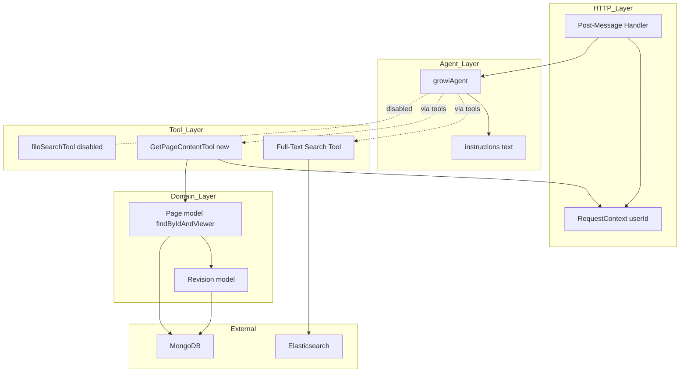
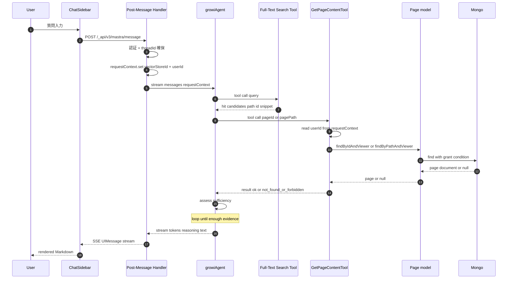
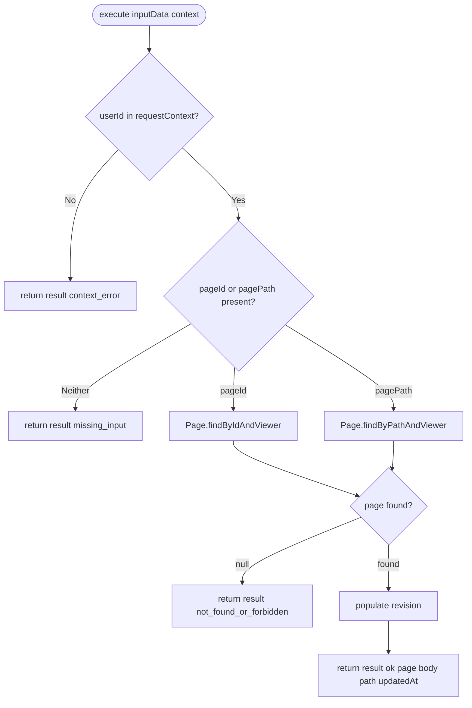

# Design Document: agentic-search

## Overview

**Purpose**: 既存 Mastra `growiAgent` に「ページ本文取得 tool」を追加し、全文検索 tool（既存）と組み合わせた RAG 的反復ループを成立させる。これにより、GROWI ユーザーが自然言語の問い合わせから根拠つき Markdown 回答を得られるようにする。

**Users**: GROWI の認証済みユーザー（既存 ChatSidebar / `useChat` 経由のすべての利用者）。

**Impact**: agent の `tools` 構成を変更（新 tool 追加 + 既存 `fileSearchTool` 暫定無効化）、`RequestContext` 型を拡張し `userId` を伝搬。既存ストリーミング応答層・メモリ・スレッド管理は不変。

### Goals
- `growiAgent` が「全文検索 → 本文取得 → 必要に応じて再検索 → 合成」を自律的に反復する agentic ループを成立させる
- ページ本文取得経路がページ閲覧権限（grant）を完全に既存メソッドへ委譲する
- 新規 tool 1 本 + 既存 2 ファイルの軽微修正で実装を完結させる

### Non-Goals
- タグ検索 / 関連ページ / クエリ再構成等の新規 tool（別 spec）
- ベクトル検索・埋め込み統合（別 spec）
- ChatSidebar / Chat UI 改修（別 spec）
- アクセスログ・検索品質評価基盤（別 spec）
- `fileSearchTool` の最終削除（フォローアップ別タスク）
- `RequestContext` のモジュールシングルトン構造の根本修正（既存挙動踏襲、別タスクで議論）
- 書き込み系プロンプト・wiki 外知識への明示対応

## Boundary Commitments

### This Spec Owns
- `getPageContentTool`（新規 Mastra tool）の入出力契約、execute 実装、テスト
- `growiAgent.tools` の構成変更（新 tool 登録 + `fileSearchTool` のコメントアウト）と `growiAgent.instructions` の文言調整
- `RequestContext` の型シェイプ拡張（`{ vectorStoreId; userId }`）
- `post-message.ts` における `userId` の `requestContext` セット

### Out of Boundary
- 既存 ES 全文検索 tool の実装（ユーザー作業ブランチ前提）
- `Page` モデル / `Revision` モデル / `populateDataToShowRevision()` 等の挙動変更
- ページ閲覧権限（grant）判定ロジック自体の修正・新規実装
- ChatSidebar / `useChat` / AI SDK ストリーミング層の修正
- `fileSearchTool` 本体ファイル（`tools/file-search-tool.ts`）の削除や API 変更
- `RequestContext` シングルトン構造の修正（並列リクエスト時の干渉懸念は別タスクで扱う）
- メモリ・スレッド永続化（`getOrCreateThread` / Mastra Memory）の挙動変更

### Allowed Dependencies
- `@mastra/core/tools` の `createTool`
- `@mastra/core/agent` の `Agent`（既存 instance を再利用、再構築しない）
- `@mastra/core/request-context` の `RequestContext` 型
- `zod` による入出力 schema 定義
- `Page.findByIdAndViewer` / `Page.findByPathAndViewer`（grant 委譲経路）
- `populateDataToShowRevision()` または `.populate('revision')`（revision 取得）
- `Revision` モデル（`body` 参照のみ）
- `~/utils/logger`（pino 経由のロガー）

依存方向は **HTTP Layer → Agent Layer → Tool Layer → Page / Revision Model → Mongoose**。tool 層から HTTP 層を逆参照しない。

### Revalidation Triggers
- `Page.findByIdAndViewer` または `Page.findByPathAndViewer` のシグネチャ・戻り値仕様変更
- `RequestContext` ジェネリクスを共有する他コンポーネントの追加 / 型変更（key 衝突発生時）
- `@mastra/core` の `createTool` / `Agent.stream()` API の破壊的変更
- 既存全文検索 tool の出力スキーマ変更（特に `pageId` / `pagePath` フィールドの整合）
- 既存 `growiAgent.instructions` の英語ベース構造を逸脱する変更（多言語応答ルールの再検証要）

## Architecture

### Existing Architecture Analysis

| 既存要素 | 役割 | 本 spec での扱い |
|---|---|---|
| `post-message.ts` Express route | 認証・スレッド確保・`agent.stream()` の呼び出し・SSE 中継 | 軽微修正（userId セット） |
| `mastra-modules/index.ts` の `Mastra` instance | `growiAgent` 登録 | 不変 |
| `growiAgent` (Agent) | tools / memory / instructions を保持 | 構成差分のみ修正 |
| `fileSearchTool` | OpenAI Files ベクトル検索 | コメントアウトで暫定無効化 |
| `RequestContext<{ vectorStoreId }>` | tool 実行時の文脈伝搬 | 型に `userId` を追加 |
| `Page.findByIdAndViewer` / `findByPathAndViewer` | grant 込みでページ取得 | 委譲先として利用 |

既存パターンの維持事項:
- tool は `tools/*.ts` 1 ファイル 1 export
- 入出力 schema は `zod`
- agent instructions は英語短文ベース
- Express route は `accessTokenParser` → `loginRequiredStrictly` → `validator` → handler の順を維持

### Architecture Pattern & Boundary Map

採用パターン: **Mastra agent + tools (Adapter pattern)**。tool は既存ドメインメソッド（Page モデル）への薄い adapter として実装。



Key 決定:
- tool 層は agent / HTTP 層を逆参照しない（依存方向は片方向）
- `GetPageContentTool` は `Page.findByIdAndViewer` のみを呼ぶ adapter であり、grant の自前判定をしない
- `RequestContext` 経由で渡る `userId` は HTTP 層の信頼境界を通過済み（認証ミドルウェア後）
- `fileSearchTool` は agent との配線のみコメントアウト、ファイル本体・import 行はコメントとして残置

### Technology Stack

| Layer | Choice / Version | Role in Feature | Notes |
|---|---|---|---|
| Backend / Agent | `@mastra/core` ^1.32.1（既存） | Agent + tool フレームワーク | 既存 fileSearchTool で実証済み API のみ使用、新依存追加なし |
| Validation | `zod` ^3.x（既存） | tool 入出力スキーマ | 既存 tools が `z.object` で定義済み、同一パターン踏襲 |
| Domain | Mongoose ^6.13.6（既存） + 既存 `Page` モデルメソッド | grant 込みページ取得 | `findByIdAndViewer` / `findByPathAndViewer` を委譲先に |
| Logging | `@growi/logger`（pino, 既存） | tool 内のデバッグログ | 既存 `loggerFactory` 経由 |
| Testing | `vitest` ^x（既存） + `*.spec.ts` / `*.integ.ts` 規約 | unit + integration | Mastra 配下に初の test を追加 |

> 拡張詳細・代替検討は [research.md](./research.md) の Section 1〜2 を参照。

## File Structure Plan

### Directory Structure

```
apps/app/src/features/mastra/server/
├── routes/
│   └── post-message.ts                         # Modified: RequestContext 型拡張 + userId set
└── services/mastra-modules/
    ├── agents/
    │   └── growi-agent.ts                      # Modified: tools 構成変更 + instructions 微調整
    └── tools/
        ├── file-search-tool.ts                 # 不変（コメントアウトは agent 側）
        ├── get-page-content-tool.ts            # New: 本文取得 tool 本体
        ├── get-page-content-tool.spec.ts       # New: unit test
        └── get-page-content-tool.integ.ts      # New: integration test (grant 反映確認)
```

### Modified Files

| File | 変更内容 |
|---|---|
| `agents/growi-agent.ts` | `fileSearchTool` の import + `tools` 登録をコメントアウト。`getPageContentTool` の import 追加と `tools` 登録。`instructions` に「全文検索結果のうち根拠が必要なものは本文取得 tool を呼んで引用パスを含めよ」の旨を追記 |
| `routes/post-message.ts` | `RequestContext<{ vectorStoreId: string }>` を `RequestContext<{ vectorStoreId: string; userId: string }>` に拡張。`requestContext.set('userId', req.user._id.toString())` を `requestContext.set('vectorStoreId', ...)` の直後に追加 |

### New Files

| File | 責務 |
|---|---|
| `tools/get-page-content-tool.ts` | Mastra tool の定義（`createTool` 呼び出し、zod schema、execute）。`Page.findByIdAndViewer` / `findByPathAndViewer` の薄い adapter |
| `tools/get-page-content-tool.spec.ts` | unit test。zod 入力検証、guard ロジック、Page モデルをモックして戻り値変換を確認 |
| `tools/get-page-content-tool.integ.ts` | integration test。実 MongoDB 上で GRANT_* 各パターンの取得可否を確認 |

各ファイルは単一責務。新規 export は `getPageContentTool`（tool 定数）と内部 helper のみ（barrel 不要）。

## System Flows

### 反復ループ全体（Sequence）



主な決定:
- `Agent` のループ判断はモデル任せ（明示の Workflow を組まない）
- `GetPageContentTool` は `RequestContext` から `userId` を取り出して `findByIdAndViewer` に渡す
- `Mongo` 側で grant 条件が AND されるため、tool 層で追加フィルタを掛けない

### Tool Execute 分岐（Process）



Key 決定:
- `execute` は **throw しない**（agent の反復継続のため、必ず discriminated union を返す）
- `userId` 不在は実運用上発生しないが防御的に判定（R3 #3 由来）
- `not_found` と `forbidden` は既存メソッドが区別不可なので 1 つのケースに統合（R2 #4 と合致）

## Requirements Traceability

| Req | Summary | Components | Interfaces | Flows |
|---|---|---|---|---|
| 1.1 | 全文検索 tool 呼び出し | growiAgent (Agent Layer) | `Agent.stream` + 既存 tools | 反復ループ Sequence |
| 1.2 | 必要なら本文取得 tool 呼び出し | growiAgent, GetPageContentTool | tool call + instructions | 反復ループ Sequence |
| 1.3 | 不足時の再検索 / 他ページ取得 | growiAgent | LLM 自律ループ | 反復ループ Sequence |
| 1.4 | 想定 5 類型をループでサポート | growiAgent | instructions | 反復ループ Sequence |
| 1.5 | 完了時に整形回答を返す | growiAgent | `Agent.stream` 出力 | 反復ループ Sequence |
| 1.6 | コードフェンス禁止（ユーザー要求時除く） | growiAgent | instructions | — |
| 2.1 | `pageId` で本文取得 | GetPageContentTool | execute(pageId) | Tool Execute 分岐 |
| 2.2 | `pagePath` で本文取得 | GetPageContentTool | execute(pagePath) | Tool Execute 分岐 |
| 2.3 | 入力エラーで判別可能な戻り値 | GetPageContentTool | zod + discriminated union | Tool Execute 分岐 |
| 2.4 | 存在しない/権限なしで共通戻り値 | GetPageContentTool | discriminated union `not_found_or_forbidden` | Tool Execute 分岐 |
| 2.5 | Markdown を改変せず返す | GetPageContentTool | output `body` | — |
| 2.6 | 応答に `path` を含める | GetPageContentTool | output schema | — |
| 2.7 | grant 自前実装禁止 | GetPageContentTool | `findByIdAndViewer` 委譲 | Tool Execute 分岐 |
| 3.1 | userId を requestContext へ付与 | Post-Message Handler | `RequestContext.set('userId', ...)` | 反復ループ Sequence (step 4) |
| 3.2 | tool 内で呼び出しユーザー判別可 | GetPageContentTool | `RequestContext.get('userId')` | Tool Execute 分岐 |
| 3.3 | userId 取得不可で本文返さない | GetPageContentTool | discriminated union `context_error` | Tool Execute 分岐 |
| 3.4 | 認証通過済みのみ tool 実行 | Post-Message Handler | 既存 `loginRequiredStrictly` | 反復ループ Sequence (step 3) |
| 4.1 | agent から fileSearchTool を保持しない | growiAgent | tools 構成変更 | — |
| 4.2 | fileSearchTool ソースは削除しない | growiAgent | import コメントアウト | — |
| 4.3 | メモリ/スレッド/ストリーミング不変 | growiAgent, Post-Message Handler | 既存挙動踏襲 | — |
| 5.1 | Markdown 形式の回答 | growiAgent | instructions | — |
| 5.2 | 入力言語追従 | growiAgent | instructions (既存維持) | — |
| 5.3 | 引用元 path を含める（推奨） | growiAgent, GetPageContentTool | instructions + output `path` | — |
| 5.4 | ストリーミング応答 | Post-Message Handler | 既存 `toAISdkStream` + `pipeUIMessageStreamToResponse` | — |

## Components and Interfaces

### Summary

| Component | Layer | Intent | Req Coverage | Key Dependencies | Contracts |
|---|---|---|---|---|---|
| `GetPageContentTool` | Tool | `pageId` / `pagePath` で本文を grant 委譲取得 | 2.1–2.7, 3.2, 3.3, 5.3 | `Page.findByIdAndViewer` (P0), `RequestContext` (P0), `populateDataToShowRevision` (P0) | Service |
| `growiAgent` (Extension) | Agent | RAG ループの自律実行 + tools 構成 + instructions | 1.1–1.6, 4.1–4.3, 5.1–5.3 | `getPageContentTool` (P0), 全文検索 tool (P0, 別 spec 前提), Memory (P0) | Service |
| Post-Message Handler (Extension) | HTTP | `userId` の `requestContext` 付与 | 3.1, 3.4, 5.4 | `RequestContext` (P0), `loginRequiredStrictly` (P0), `IUserHasId` (P0) | API |

### Tool Layer

#### GetPageContentTool

| Field | Detail |
|---|---|
| Intent | `pageId` / `pagePath` で grant 込みのページ本文を取得する Mastra tool（既存メソッドへの薄い adapter） |
| Requirements | 2.1, 2.2, 2.3, 2.4, 2.5, 2.6, 2.7, 3.2, 3.3, 5.3 |

**Responsibilities & Constraints**
- 入力検証（少なくとも `pageId` または `pagePath`）
- `requestContext` からの `userId` 取得（不在時は失敗戻り値）
- `Page.findByIdAndViewer` / `findByPathAndViewer` への委譲
- revision の populate と `body` の抽出
- 戻り値の discriminated union 整形
- **grant 判定の自前実装をしない**（必ず既存メソッド経由）
- **execute から例外を throw しない**（agent のループ継続を保証）

**Dependencies**
- Inbound: `growiAgent.tools` — agent から呼び出される（P0）
- Outbound: `Page.findByIdAndViewer` / `findByPathAndViewer` — grant 委譲経路（P0）
- Outbound: `populateDataToShowRevision()` — revision 取得（P0）
- External: `@mastra/core/tools` `createTool` — tool 定義 API（P0）
- External: `zod` — schema 定義（P0）

**Contracts**: Service [x] / API [ ] / Event [ ] / Batch [ ] / State [ ]

##### Service Interface

```typescript
import type { Tool } from '@mastra/core/tools';
import { z } from 'zod';

const getPageContentInputSchema = z
  .object({
    pageId: z
      .string()
      .optional()
      .describe('MongoDB ObjectId of the page to fetch'),
    pagePath: z
      .string()
      .optional()
      .describe('Page path starting with "/"'),
  })
  .refine(
    (input) => input.pageId != null || input.pagePath != null,
    {
      message: 'Either pageId or pagePath must be provided',
    },
  );

type GetPageContentSuccess = {
  result: 'ok';
  page: {
    path: string;
    body: string;
    updatedAt: string;
  };
};

type GetPageContentFailure = {
  result: 'not_found_or_forbidden' | 'missing_input' | 'context_error';
  reason: string;
};

const getPageContentOutputSchema = z.discriminatedUnion('result', [
  z.object({
    result: z.literal('ok'),
    page: z.object({
      path: z.string(),
      body: z.string(),
      updatedAt: z.string(),
    }),
  }),
  z.object({
    result: z.enum(['not_found_or_forbidden', 'missing_input', 'context_error']),
    reason: z.string(),
  }),
]);

export const getPageContentTool: Tool<
  typeof getPageContentInputSchema,
  typeof getPageContentOutputSchema
>;
```

- **Preconditions**: `requestContext` に `userId` がセットされている（`Post-Message Handler` の責務）
- **Postconditions**: 戻り値は必ず `getPageContentOutputSchema` を満たす。例外は throw されない
- **Invariants**: 閲覧権限のないページの内容は決して `result: 'ok'` の `page.body` に現れない（grant 委譲不変条件）

**Implementation Notes**
- Integration: `Page.findByIdAndViewer(id, user)` の `user` 引数は `IUserHasId` 形状を期待するため、`requestContext` から取り出した `userId` から最小限の user-like オブジェクト（または `User.findById` 経由）を構築する。実装時に既存メソッドの user 引数の最小要件を確認しテストで担保（research.md R-1 参照）
- Validation: zod の `refine` で「id/path どちらか必須」を表現、execute 内で zod の validation 結果を直接戻り値に変換しない（Mastra が `outputSchema` 検証を行うため）
- Risks: 既存 `findByIdAndViewer` が `includeAnyoneWithTheLink: true` を内部固定するため、GRANT_RESTRICTED ページが RAG コンテキストに混入する（research.md R-3）。本 spec では既存挙動を踏襲し integration test で挙動を明文化

### Agent Layer

#### growiAgent (Extension)

| Field | Detail |
|---|---|
| Intent | `tools` 構成と `instructions` を本機能向けに更新（既存 Agent インスタンスの設定差分） |
| Requirements | 1.1, 1.2, 1.3, 1.4, 1.5, 1.6, 4.1, 4.2, 4.3, 5.1, 5.2, 5.3 |

**Responsibilities & Constraints**
- `tools` に `getPageContentTool` を登録
- `fileSearchTool` の import 行と tools 登録行をコメントアウト（コードは残置）
- `instructions` に以下の趣旨を 1〜2 行で追記（英語、既存トーン維持）:
  - 「wiki 内コンテンツ関連の質問はまず全文検索 tool を呼び、必要に応じて本文取得 tool を呼んで引用パスを回答に含めること」
- メモリ・スレッド・モデル設定は変更しない（4.3）

**Dependencies**
- Inbound: `mastra-modules/index.ts` の `Mastra` instance — agent registration（P0）
- Inbound: `post-message.ts` の `mastra.getAgent('growiAgent')` 呼び出し（P0）
- Outbound: `getPageContentTool`（P0）
- Outbound: 全文検索 tool（P0、別 spec 前提）

**Contracts**: Service [x] / API [ ] / Event [ ] / Batch [ ] / State [ ]

##### Service Interface

```typescript
// 既存 Agent インスタンスの形状（変更ポイントのみ抜粋）
export const growiAgent = new Agent({
  id: 'growiAgent',
  name: 'GROWI Agent',
  instructions: /* 既存指示 + 本文取得 tool 利用と引用パス含有の追記 */,
  model: getOpenaiProvider()(model),
  tools: {
    // fileSearchTool, // disabled: see spec agentic-search
    getPageContentTool,
    // fullTextSearchTool, // assumed registered by adjacent spec/branch
  },
  memory,
});
```

**Implementation Notes**
- Integration: 全文検索 tool（別ブランチ作成済み前提）の正確な export 名と integration は実装時に確認。本 spec は `getPageContentTool` の登録と `fileSearchTool` の暫定無効化のみを変更責務とする
- Validation: build + lint で「未使用 import の指摘が出ないこと」を確認（コメントアウトされた import が lint で警告にならない書き方を選ぶ）
- Risks: 全文検索 tool が未マージのまま本 spec が先行マージされた場合、agent は本文取得のみで動作する。要件 1.1 を満たさないため、マージ順序を別 spec / PR で調整する必要あり（design 段階で記録）

### HTTP Layer

#### Post-Message Handler (Extension)

| Field | Detail |
|---|---|
| Intent | `RequestContext` 型を拡張し、認証済みユーザーの `_id` を `userId` として tool 実行コンテキストにセットする |
| Requirements | 3.1, 3.4, 5.4 |

**Responsibilities & Constraints**
- `RequestContext<{ vectorStoreId: string }>` を `RequestContext<{ vectorStoreId: string; userId: string }>` に拡張
- 既存の `accessTokenParser` → `loginRequiredStrictly` → `validator` ミドルウェアチェーンを変更しない
- 既存の vectorStoreId セットの直後に `requestContext.set('userId', req.user._id.toString())` を追加
- ストリーミング応答層（`toAISdkStream` / `pipeUIMessageStreamToResponse`）は変更しない

**Dependencies**
- Inbound: Next.js / Express ルーティング（P0）
- Outbound: `growiAgent.stream(messages, { requestContext, memory, providerOptions })`（P0）
- Outbound: `RequestContext` ジェネリクス型 — 共有型として全 tool が参照（P0）

**Contracts**: Service [ ] / API [x] / Event [ ] / Batch [ ] / State [ ]

##### API Contract

| Method | Endpoint | Request | Response | Errors |
|---|---|---|---|---|
| POST | `/_api/v3/mastra/message` | `{ threadId?, aiAssistantId, messages: UIMessage[] }`（既存と同一） | `text/event-stream` UI Message Stream（既存と同一） | 400 validation, 401 unauth, 404 missing AI assistant, 500 internal（既存と同一） |

本 spec で API スキーマ自体は変更しない（内部の `requestContext` 構築が変わるのみ）。

**Implementation Notes**
- Integration: モジュールスコープのシングルトン `requestContext` を共有する既存実装をそのまま踏襲（research.md R-3, Synthesis 6.3-1）。並列リクエスト時の干渉懸念は本 spec の責務外、フォローアップで議論
- Validation: 既存 `validator` チェーンで `req.user` が `IUserHasId` として保証されるため、`req.user._id.toString()` 直呼び出しは安全
- Risks: 既存 `requestContext` の他箇所利用が増えた場合、ジェネリクス型を共有モジュールに切り出す検討が必要（本 spec では post-message.ts 内 closure に保持）

## Data Models

本機能は新規 DB スキーマを追加しない。Mongoose レベルでの参照は既存のみ。

### Tool I/O Schema（再掲）

GetPageContentTool の入出力は前掲の zod schema（Service Interface 参照）に従う。`outputSchema` は discriminated union で 4 つの結果型を持つ。

### Page / Revision（既存・参照のみ）

- `Page`: `path: string`, `revision: ObjectId(ref Revision)`, `grant: number`, `grantedUsers`, `grantedGroups`, ほか既存スキーマ
- `Revision`: `body: string`（Markdown、`format: 'markdown'` 注記）, `updatedAt: Date`

本 spec で `Page` / `Revision` スキーマ自体は変更しない。`Page.findByIdAndViewer` 等の戻り値型に依存。

## Error Handling

### Strategy

GetPageContentTool は **例外を throw しない方針**。すべての異常系を discriminated union の戻り値で表現する。これにより:
- agent のループが中断されず、agent が次の判断（再検索 / 別ページ取得 / 回答合成断念）に進める
- HTTP 層の `try/catch` で握り潰される懸念がない

### Categories

| Category | 戻り値 | 発生条件 | Handler |
|---|---|---|---|
| Input validation | `result: 'missing_input'` | `pageId` も `pagePath` も与えられない | tool 内 zod refine、`reason` に英語短文 |
| Access denial / missing | `result: 'not_found_or_forbidden'` | `Page.findByIdAndViewer` が `null` を返す | `reason` に「存在しないか閲覧権限がない」旨を含める |
| Context missing | `result: 'context_error'` | `requestContext` から `userId` を取り出せない | 防御的判定、運用上は到達しない（R3 #4 の認証ミドルウェアで保証） |
| Unexpected Mongoose error | log + 共通失敗戻り値（`not_found_or_forbidden`）にフォールバック | DB 接続喪失等 | `logger.error` で記録、agent には共通失敗で返す |

### Monitoring

- `loggerFactory('growi:tools:get-page-content-tool')` で execute 経路をログ
- 失敗戻り値発生時にも warn レベルでログ（grant 起因か否かの切り分けに必要）
- agent ストリーム経路は既存 `post-message-handler` の `logger.error` を維持

## Testing Strategy

### Unit Tests (`get-page-content-tool.spec.ts`)

1. zod 入力 schema が `pageId` も `pagePath` も無いケースを `missing_input` で弾く（2.3）
2. `requestContext.get('userId')` が `undefined` のとき `result: 'context_error'` を返す（3.3）
3. `Page.findByIdAndViewer` をモックして `null` 返却時に `result: 'not_found_or_forbidden'` を返す（2.4）
4. モックされた成功ケースで `result: 'ok'` + 正しい `path` / `body` / `updatedAt` を返し、`body` が改変されない（2.5, 2.6）
5. `pageId` 指定時に `findByIdAndViewer` が呼ばれ、`findByPathAndViewer` は呼ばれない（2.1）
6. `pagePath` 指定時に `findByPathAndViewer` が呼ばれ、`findByIdAndViewer` は呼ばれない（2.2）
7. tool 内で例外を throw しないこと（agent ループ継続保証のため、Mongoose mock を error reject にしても戻り値で返ること）

### Integration Tests (`get-page-content-tool.integ.ts`)

実 MongoDB + Page/Revision モデルで以下のシナリオを確認（`page.integ.ts` パターン踏襲）:

1. GRANT_PUBLIC ページを認証済みユーザーで取得 → `result: 'ok'`（2.1, 2.7）
2. GRANT_OWNER の他者ページを別ユーザーで取得 → `result: 'not_found_or_forbidden'`（2.4, 2.7）
3. GRANT_USER_GROUP の所属メンバーで取得 → `result: 'ok'`、非所属メンバーで取得 → `result: 'not_found_or_forbidden'`（2.7）
4. GRANT_RESTRICTED（リンク共有）を path 指定で取得 → `result: 'ok'`（既存挙動明文化、research.md R-3）
5. 存在しない pageId → `result: 'not_found_or_forbidden'`（権限なしと区別しないことの確認、2.4）
6. `pagePath` 指定でも grant が反映されること（2.2, 2.7）

### Agent Integration Tests（オプション、本 spec 必須ではない）

`growiAgent` を組み立てて mock model で 1〜2 ターンのループを回し、`getPageContentTool` が tools 一覧に存在し fileSearchTool が存在しないことを assertion。実装時に手間が小さいなら追加、`fileSearchTool` 暫定無効化（4.1）の回帰防止に有用。

### E2E / UI

本 spec のスコープ外（Chat UI 改修なしのため）。回帰検出は手動動作確認で行う。

## Security Considerations

- **grant 委譲の完全性（R2 #7）**: tool 内で MongoDB クエリを自前構築しない。すべての本文取得は `findByIdAndViewer` / `findByPathAndViewer` 経由に統一。レビューで既存メソッド以外の Page 読み取り経路を許可しない
- **`requestContext` の信頼境界**: `userId` は認証ミドルウェア通過後の `req.user._id` から派生するため改竄の余地なし。ただし `RequestContext` がモジュールシングルトンであるため、並列リクエスト下で他リクエストの値が読まれる可能性がゼロではない（既存挙動踏襲、本 spec では修正しない。フォローアップで議論）
- **失敗戻り値の情報漏洩防止**: `not_found_or_forbidden` を共通化することで「存在するが閲覧不可」と「そもそも存在しない」を agent に区別させない。回答経由でユーザーに非公開ページの存在が漏れない
- **GRANT_RESTRICTED の扱い**: 既存 `findByIdAndViewer` の `includeAnyoneWithTheLink: true` 仕様により、リンク共有ページが RAG コンテキストに含まれる可能性がある。本 spec ではこれを既存仕様として許容、integration test 5.5 で挙動を明文化（research.md R-3）

## Migration Strategy

- DB マイグレーション不要（スキーマ変更なし）
- フィーチャーフラグ不要（既存 agent への追加であり、有効化/無効化は `growiAgent.tools` 構成変更で即時切替可能）
- Rollback: revert commit のみで復旧。`fileSearchTool` は import コメントアウトのため即座に再有効化可能
- マージ順序: 別ブランチで先行作成された全文検索 tool が merge 済みであることが望ましい（本 spec マージ前に確認、未マージなら agent は本文取得 tool のみで暫定動作）

## Open Questions

design 段階で残る未確定事項（実装中に解決）:
- **R-1**: `Page.findByIdAndViewer` の `user` 引数最小要件（フル `IUserHasId` か、`_id` のみ持つオブジェクトでも動くか）— 実装時にメソッド内部を確認し、必要なら `User.findById(userId)` を 1 回挟む
- **R-2**: Mastra ランタイムで tool execute が throw した場合の UI ストリーム挙動 — 本 spec は throw しない方針なので影響なし、ただし回帰防止のため unit test 7 で担保
- **R-4**: `fileSearchTool` のコメントアウト後の lint 挙動 — Biome は未使用コメントを警告しない想定。実装時に build を回して確認

詳細は [research.md](./research.md) Section 5.3 を参照。
