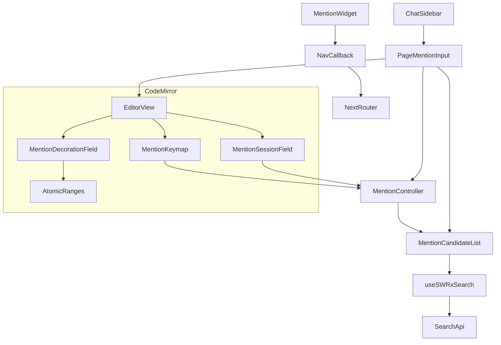
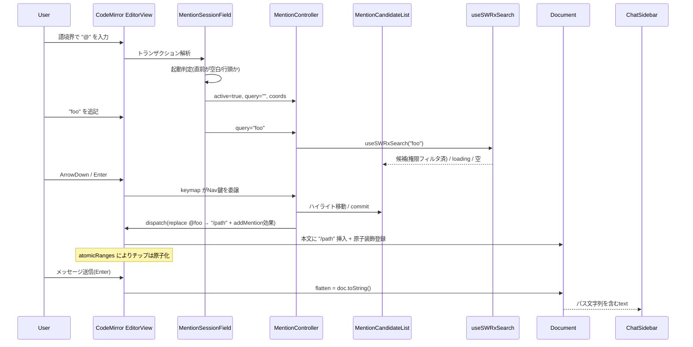

# Technical Design: ai-chat-page-mention

## Overview

**Purpose**: AI チャット利用者が、入力欄で `@` に続けて文字列を入力するとページパスをインクリメンタル検索し、候補から選択したページを「原子的な rich text トークン（メンションチップ）」として挿入できる機能を提供する。チップはクリックで対象ページへ遷移でき、送信時には対象ページの**パス文字列**として AI に渡る。

**Users**: GROWI の AI チャット（mastra ChatSidebar）利用者。会話の中で特定ページを参照先として素早く指定するワークフローで使用する。

**Impact**: 現状プレーン `<textarea>`（フラットな string state）であるチャット入力欄を、CodeMirror 6 ベースの入力に置換する。shadcn の `PromptInput` 合成シェル（フォーム・送信ボタン・添付機能）は温存し、入力リーフのみを差し替える。サーバ（mastra ルート）の変更は行わない。

### Goals
- `@` 起動のインクリメンタル検索と候補リスト表示（キーボード/マウス操作・loading・該当なし表示）
- ページメンションを視覚的に区別された原子トークンとして挿入し、文字単位編集不可・キャレット境界・単位削除を保証する
- メンションのクリックで対象ページへ遷移する
- 送信メッセージにメンションを**パス文字列としてのみ**反映する（本文は付与しない）
- 既存 shadcn `PromptInput` シェルと mastra 送信フローを壊さない

### Non-Goals
- 参照先ページの**本文（コンテンツ）取得・AI コンテキストへの注入**（送信はパス文字列のみ）
- ユーザー/タグ等、ページ以外のメンション
- mastra サーバ側ルート・エージェント推論ロジックの変更
- 新規の検索 API・新規の権限フィルタの実装（既存 `/search` の権限挙動に依拠）
- 新規リッチテキストエディタライブラリ（Lexical / ProseMirror 等）の導入

## Boundary Commitments

### This Spec Owns
- `features/mastra/client/components/PageMentionInput/` 配下の新規入力コンポーネント一式（CodeMirror エディタ adapter、メンション装飾拡張、メンションセッション拡張、ナビゲーションキーマップ、候補リスト UI、メンションチップ表示）
- ChatSidebar 入力リーフの差し替え（`PromptInputTextarea` → `PageMentionInput`）と、それに伴う `onChange` シグネチャ・Enter 送信配線の変更
- ドキュメント文字列 ↔ メンション装飾の相互規約（doc 本文にパス文字列を保持し、装飾で原子チップ表示する方式）
- メンション関連の新規 i18n キー

### Out of Boundary
- 共有 shadcn コンポーネント `~/components/ai-elements/prompt-input.tsx` の内部実装（無改修・温存）
- 検索バックエンド（Elasticsearch delegator）と `/search` エンドポイント、その権限フィルタ
- mastra サーバルート `post-message.ts` と `UIMessage` スキーマ
- ChatSidebar の送信処理 `handleSubmit` / `sendMessage` の本体ロジック（入力値の供給形式のみ整合させる）

### Allowed Dependencies
- 既存検索フック `useSWRxSearch`（`~/stores/search`）と検索結果型 `IPageWithSearchMeta`
- 既存 CodeMirror 6 直接依存（`@codemirror/state` `^6.6`, `@codemirror/view` `^6.42`, `@codemirror/autocomplete` `^6.18`, `@codemirror/commands` `^6.8`）
- ページ遷移ヘルパ `LinkedPagePath`（`~/models/linked-page-path`）+ `next/router`
- shadcn UI プリミティブ（`~/components/ui/*`）と `cn`（`~/utils/shadcn-ui`）、Tailwind（`tw:` 接頭辞）
- `react-i18next` の `useTranslation`

### Revalidation Triggers
- `PromptInput` の合成 API（children 受け渡し・`onSubmit` 契約・`InputGroup` ラップ）が変更された場合
- `useSWRxSearch` の戻り値型・`/search` のレスポンス構造（`data[].data.path` / `._id`）が変更された場合
- `UIMessage` 送信形式（`message.text`）が変更された場合
- ページ URL の組み立て規約（`LinkedPagePath.href`）が変更された場合

## Architecture

### Existing Architecture Analysis
- 入力欄は shadcn コンパウンドコンポーネント `PromptInput`（`<InputGroup>{children}</InputGroup>` を描画、`prompt-input.tsx:776`）の子として `PromptInputTextarea`（素の `<textarea>`）を配置する構成。ChatSidebar は controller context を使わず `value`/`onChange` で制御している（`ChatSidebar.tsx:255-271`）。
- 送信は `PromptInput` の `<form onSubmit>` → `handleSubmit(message)` → `sendMessage({ text })`。入力値はフラット string。
- AI チャット UI は **shadcn + Tailwind 4**（`components.json`, `tw:` 接頭辞）。Bootstrap/reactstrap はレガシ領域用で本機能では不使用。
- 検索は `useSWRxSearch` → `apiGet('/search', { q, limit, ... })`。権限フィルタは Elasticsearch delegator（`elasticsearch.ts:995-1039`）で適用済みで、ログインユーザーが閲覧可能なページのみ返る。

### Architecture Pattern & Boundary Map

CodeMirror が「編集・原子トークン・メンションセッション検出」を担い、React/shadcn が「候補リスト UI・検索（SWR）」を担うハイブリッド構成。両者は **MentionController**（共有コントローラ）を介して疎結合に連携する。



**Architecture Integration**:
- **Selected pattern**: Thin React adapter + pure CodeMirror extensions + shared controller bridge。フレームワーク adapter（React/CM）から純粋ロジックを分離する coding-style 原則に準拠。
- **Boundaries**: 検索＝既存 `useSWRxSearch`／編集・原子化＝CM 拡張／候補表示＝shadcn UI／遷移＝`LinkedPagePath`+router。共有所有なし。
- **Preserved patterns**: shadcn `PromptInput` 合成シェル、`useSWRxSearch`、`LinkedPagePath`、feature-based 配置。
- **New components rationale**: textarea ではメンションの「視覚区別・原子性・clickable」を満たせないため、CM ベースの入力リーフと装飾拡張が必須。候補 UI は loading/該当なし（2.5/2.6）と shadcn スタイル要件を満たすため React 側で持つ。

### Technology Stack

| Layer | Choice / Version | Role in Feature | Notes |
|-------|------------------|-----------------|-------|
| Frontend (editor) | `@codemirror/state` `^6.6`, `@codemirror/view` `^6.42` | エディタ・装飾・原子レンジ | 既存依存。新規追加なし |
| Frontend (mention session) | `@codemirror/autocomplete` `^6.18`（補助）, `@codemirror/commands` | 起動規則の補助・キーマップ基盤 | 候補 UI は自前 React 実装、CM autocomplete のツールチップ描画は不使用 |
| Frontend (UI) | React + shadcn (`~/components/ui/*`) + Tailwind 4 (`tw:`) | 候補リスト・チップ・配置 | Bootstrap 不使用 |
| Data | `useSWRxSearch`（`/search`） | ページパス検索（権限フィルタ済み） | 既存。無改修 |
| Navigation | `LinkedPagePath` + `next/router` | チップクリック遷移 | 既存ヘルパ |
| i18n | `react-i18next` | 新規 UI 文言 | ChatSidebar に新規導入 |

## File Structure Plan

### Directory Structure
```
apps/app/src/features/mastra/client/components/PageMentionInput/
├── index.ts                          # 公開バレル: PageMentionInput と公開型のみ re-export
├── PageMentionInput.tsx              # React adapter: EditorView ライフサイクル / value 同期 / Enter送信 / 候補リスト配置
├── MentionCandidateList.tsx          # shadcn 候補ドロップダウン(loading/該当なし/行レンダリング/ハイライト)
├── use-mention-controller.ts         # セッション状態↔候補リストの橋渡しフック(検索・選択中index・commit/close)
├── types.ts                          # PagePathCandidate / MentionData / MentionSessionState / 公開Props
└── editor-state/
    ├── index.ts                      # サブバレル: 拡張ファクトリ createPageMentionExtensions() を公開
    ├── mention-decoration.ts         # MentionWidget(WidgetType) + 装飾StateField + addMention効果 + atomicRanges
    ├── mention-session.ts            # @トリガ検出・セッションStateField・起動規則(1.4)・終了(1.5)
    ├── mention-keymap.ts             # 高優先度キーマップ: セッション中はNav鍵をcontrollerへ委譲 / Enter送信・Shift+Enter改行
    └── flatten.ts                    # doc → 送信用パス文字列の取得(純関数, 6.1-6.3)
```

### Modified Files
- `apps/app/src/features/mastra/client/components/ChatSidebar/ChatSidebar.tsx` — 入力リーフを `PromptInputTextarea` → `PageMentionInput` に差し替え。`onChange` を `(value: string) => setInput(value)` に変更し、`onSubmit` 用ハンドラを配線。新規文言を i18n 化。`PromptInput`/`PromptInputBody`/`PromptInputFooter`/`PromptInputSubmit`/`handleSubmit` は維持。
- GROWI i18n ロケールリソース — `pageMention.placeholder` / `pageMention.searching` / `pageMention.noResults` 等のキーを追加（既存ロケール配置規約に従う）。

> 依存方向: `types` → `editor-state/*`(純CM) → `use-mention-controller` → `PageMentionInput`/`MentionCandidateList`(React) → `ChatSidebar`。左方向のみ import。`editor-state/*` は React/SWR に依存しない。

## System Flows

### メンション挿入フロー（@入力 → 選択 → チップ化 → 送信）



**主要な決定**:
- メンションは **doc 本文にパス文字列そのものを保持**し、その範囲に `Decoration.replace({ widget })` を重ねてチップ表示する。これにより送信用テキストは `doc.toString()` で得られ、パス文字列のみが自然に反映される（6.1/6.2）。
- セッション中の Nav 鍵（↑↓/Enter/Tab/Esc）は高優先度キーマップが横取りして候補リスト操作へ委譲し、非セッション時の Enter は送信に割り当てる。

## Requirements Traceability

| Requirement | Summary | Components | Interfaces | Flows |
|-------------|---------|------------|------------|-------|
| 1.1, 1.2 | `@`起動・逐次検索 | mention-session, use-mention-controller | MentionSessionState, useSWRxSearch | 挿入フロー |
| 1.3 | 1文字以上で候補表示 | use-mention-controller, MentionCandidateList | — | 挿入フロー |
| 1.4 | 語境界以外では非起動 | mention-session | isMentionTriggerBoundary() | — |
| 1.5 | `@`削除でセッション終了 | mention-session | — | 挿入フロー |
| 2.1 | 候補にパス表示 | MentionCandidateList | PagePathCandidate | — |
| 2.2, 2.3 | ↑↓選択・Enter/クリック確定 | mention-keymap, use-mention-controller | MentionController | 挿入フロー |
| 2.4 | Esc/外クリックで閉じる | mention-keymap, MentionCandidateList | MentionController.close | — |
| 2.5, 2.6 | loading/該当なし表示 | MentionCandidateList | useSWRxSearch(isLoading) | — |
| 2.7 | 過剰検索抑制(debounce) | use-mention-controller | activateOnTypingDelay/debounce | — |
| 3.1 | 検索文字列をチップに置換 | mention-decoration, use-mention-controller | addMention 効果 | 挿入フロー |
| 3.2 | 視覚的区別 | mention-decoration(MentionWidget) | Tailwind チップ | — |
| 3.3 | 原子的単位として保持 | mention-decoration | EditorView.atomicRanges | — |
| 3.4 | 複数メンション | mention-decoration | DecorationSet | — |
| 4.1 | クリックで遷移 | mention-decoration(MentionWidget) | NavCallback Facet + LinkedPagePath | — |
| 4.2 | クリックと編集の区別 | mention-decoration | widget click handler | — |
| 5.1 | 単位削除 | mention-decoration | atomicRanges | — |
| 5.2 | 編集中も独立維持 | mention-decoration | DecorationSet.map | — |
| 5.3 | 文字単位編集不可・境界キャレット | mention-decoration | atomicRanges | — |
| 5.4 | 隣接入力は外側テキスト | mention-decoration | replace 非 inclusive | — |
| 5.5 | 部分編集手段を提供しない | mention-decoration, mention-session | — | — |
| 6.1, 6.3 | パス文字列を該当位置・順序で送信 | flatten | getMentionFlattenedText() | 挿入フロー |
| 6.2 | 本文非付与 | flatten | doc.toString()のみ | — |
| 7.1, 7.2 | 既存検索・権限内ページのみ | use-mention-controller | useSWRxSearch | — |

## Components and Interfaces

| Component | Domain/Layer | Intent | Req Coverage | Key Dependencies | Contracts |
|-----------|--------------|--------|--------------|------------------|-----------|
| PageMentionInput | UI adapter | CM 入力リーフ・value 同期・Enter送信・候補配置 | 1.x–6.x | EditorView (P0), useMentionController (P0) | State |
| MentionCandidateList | UI | 候補表示・loading/該当なし・ハイライト | 2.1,2.4–2.6 | useSWRxSearch (P0) | — |
| useMentionController | Logic hook | セッション↔候補の橋渡し・検索・確定 | 1.2,1.3,2.2,2.3,2.7,7.x | useSWRxSearch (P0), MentionSessionState (P0) | State |
| mention-decoration | CM extension | 原子チップ装飾・atomicRanges・クリック遷移 | 3.x,4.x,5.x | @codemirror/view (P0), LinkedPagePath (P1) | State |
| mention-session | CM extension | `@`起動規則・セッション追跡 | 1.1,1.4,1.5,5.5 | @codemirror/state (P0) | State |
| mention-keymap | CM extension | Nav鍵委譲・Enter送信 | 2.2,2.3,2.4 | @codemirror/view (P0), MentionController (P0) | — |
| flatten | Pure util | doc→送信パス文字列 | 6.1–6.3 | @codemirror/state (P0) | Service |

### UI Layer

#### PageMentionInput

| Field | Detail |
|-------|--------|
| Intent | CodeMirror エディタを React に橋渡しする薄い adapter。エディタが入力の source of truth |
| Requirements | 1.1–6.3（統合点） |

**Responsibilities & Constraints**
- EditorView の生成・破棄、拡張の組み立て（`createPageMentionExtensions`）。
- エディタ変更を購読し、`onChange(getMentionFlattenedText(state))` を発火（フラットなパス文字列を親へ）。
- 親 `value` は **外部リセット（空文字化＝送信後 clear）にのみ追従**し、文字列からメンションを再構築しない（widget の正本はエディタ doc）。
- `value` が空でエディタが空でない場合に doc をリセット。それ以外は一方向（editor→parent）。
- 候補リスト（`MentionCandidateList`）をキャレット座標に配置。
- Enter 送信は keymap 側で `onSubmit` を呼ぶ（セッション非アクティブ時のみ）。

**Dependencies**
- Inbound: ChatSidebar — value/onChange/onSubmit/placeholder/disabled (P0)
- Outbound: useMentionController (P0), createPageMentionExtensions (P0)

**Contracts**: State [x]

```typescript
export interface PageMentionInputProps {
  value: string;                       // フラット済みパス文字列(送信/空判定用)
  onChange: (value: string) => void;   // doc変更ごとにflatten結果を返す
  onSubmit: () => void;                 // Enter送信(セッション非アクティブ時)
  placeholder?: string;
  disabled?: boolean;
}
```
- Preconditions: `~/components/ai-elements/prompt-input` の `PromptInputBody` 子として配置される。
- Postconditions: `value` は常に doc のフラット表現と一致（送信に直接利用可能）。
- Invariants: メンション widget はエディタ doc に対応するパス文字列範囲が正本。`value` 経由で widget を再構築しない。

#### MentionCandidateList

| Field | Detail |
|-------|--------|
| Intent | アクティブセッションの query に対する候補ドロップダウン（shadcn/Tailwind） |
| Requirements | 2.1, 2.4, 2.5, 2.6 |

**Implementation Notes**
- Integration: `useMentionController` から `query`・`isOpen`・`highlightedIndex`・`coords` を受け取り、`useSWRxSearch(query)` の `data`/`isLoading` を表示。各候補は `IPageWithSearchMeta.data.path`/`._id` を `PagePathCandidate` にマップして描画。確定/閉じるは controller のコールバックを呼ぶ。
- Validation: `isLoading` 中は loading 行（2.5）、結果空かつ非ローディングは該当なし行（2.6）を表示。
- Risks: キャレット座標追従（スクロール/折返し時）の再計算が必要。`view.coordsAtPos` を使用。

### CodeMirror Extension Layer

#### mention-session

| Field | Detail |
|-------|--------|
| Intent | `@` トリガの検出とメンションセッション状態の追跡 |
| Requirements | 1.1, 1.4, 1.5, 5.5 |

**Responsibilities & Constraints**
- 各トランザクションで、キャレット直前のテキストを走査し `@` + 後続クエリ範囲を判定。
- **起動規則（1.4）**: `@` の直前が行頭または空白文字のときのみセッション開始。直前が非空白文字（メールアドレス様）では開始しない。
- セッション状態 `{ active, from, to, query }` を `StateField` で保持し、`@`〜クエリの削除で `active=false`（1.5）。
- 確定済みメンション内には新規セッションを張らない（5.5 の一貫性）。

**Contracts**: State [x]

```typescript
export interface MentionSessionState {
  readonly active: boolean;
  readonly from: number;   // "@" の位置
  readonly to: number;     // クエリ末尾(=キャレット)
  readonly query: string;  // "@" 直後の検索文字列
}
export const mentionSessionField: StateField<MentionSessionState>;
export const isMentionTriggerBoundary: (textBefore: string) => boolean; // 1.4 の純判定
```
- Invariants: `active` のとき `from < to`、`query === doc.sliceString(from+1, to)`。

#### mention-decoration

| Field | Detail |
|-------|--------|
| Intent | 確定メンションを原子的・clickable・視覚区別されたチップとして描画 |
| Requirements | 3.1–3.4, 4.1, 4.2, 5.1–5.4 |

**Responsibilities & Constraints**
- `addMention` 効果でパス範囲に `Decoration.replace({ widget: new MentionWidget(data), inclusive: false })` を登録。`inclusive:false` により隣接入力は装飾外＝通常テキスト（5.4）。
- 装飾 `StateField<DecorationSet>` は変更を `map` して位置追従（5.2）。装飾範囲が編集で破壊された場合は装飾を破棄（チップ→消滅）。
- `EditorView.atomicRanges` を装飾範囲から提供し、キャレットは境界のみ・文字単位編集不可・削除は単位（3.3/5.1/5.3）。
- `MentionWidget.toDOM` は `tw:` クラスのチップ DOM を生成し、クリックで NavCallback（Facet 経由）を呼ぶ。`mousedown` の `preventDefault` で編集キャレット移動と区別（4.2）。

**Contracts**: State [x]

```typescript
export interface MentionData {
  readonly path: string;     // 送信・表示・遷移に使用
  readonly pageId?: string;  // 任意(遷移はpathから導出可能)
}
export const addMention: StateEffectType<{ from: number; to: number; data: MentionData }>;
export const mentionDecorationField: StateField<DecorationSet>;
export const mentionNavCallback: Facet<(data: MentionData) => void>;  // クリック遷移(4.1)
```
- Preconditions: `addMention` の `from..to` は挿入直後のパス文字列範囲。
- Invariants: 各装飾範囲は doc 上のパス文字列と一致し、atomicRanges に含まれる。

#### mention-keymap

| Field | Detail |
|-------|--------|
| Intent | セッション中のナビゲーション鍵委譲と Enter 送信制御 |
| Requirements | 2.2, 2.3, 2.4 |

**Implementation Notes**
- Integration: `Prec.highest` で `ArrowUp/ArrowDown/Enter/Tab/Escape` を bind。`mentionSessionField.active` のときは `MentionController` の `moveUp/moveDown/commit/close` を呼んで `true`（消費）を返す。非アクティブ時の `Enter` は `onSubmit` を呼び `true`、`Shift-Enter` は改行（既定）。
- Risks: CM 既定キーマップ・autocomplete との競合。`Prec.highest` と早期 return で回避。

#### flatten

| Field | Detail |
|-------|--------|
| Intent | エディタ doc から送信用テキストを生成 |
| Requirements | 6.1, 6.2, 6.3 |

**Contracts**: Service [x]
```typescript
export const getMentionFlattenedText: (state: EditorState) => string; // = doc.toString()
```
- Postconditions: 出力は doc 中のメンション（パス文字列）を**該当位置・順序どおり**に含み、ページ本文は一切含まない（6.1–6.3）。doc 本文がパス文字列正本のため実装は `state.doc.toString()`。将来チップ表現を変える場合もこの関数を単一の変換点とする。

## Data Models

### Domain Model
- **PagePathCandidate**（検索候補の表示用 VO）: `{ pageId: string; path: string }`。`IPageWithSearchMeta` から `data._id`/`data.path` をマップ。
- **MentionData**（確定メンションの値オブジェクト）: `{ path: string; pageId?: string }`。エディタ装飾と送信テキストの双方の正本はエディタ doc 上のパス文字列。
- **MentionSessionState**（過渡状態）: アクティブな `@` クエリの範囲・文字列。永続化しない。

### Data Contracts & Integration
- **検索（入力）**: `useSWRxSearch(query, ...)` → `IFormattedSearchResult.data: IPageWithSearchMeta[]`。`query` は `@` 直後の文字列。権限フィルタは `/search` 側で適用済み（7.x）。
- **送信（出力）**: ChatSidebar の `input`(string) = `getMentionFlattenedText(state)`。`handleSubmit` → `sendMessage({ text: input })`。新規スキーマなし。

## Error Handling

### Error Strategy
- **検索失敗/タイムアウト**: `useSWRxSearch` の `error` 時は候補リストに「該当なし」相当（または静かに閉じる）でデグレード。入力は継続可能。送信機能には影響させない。
- **遷移失敗（4.1）**: `LinkedPagePath` から無効 href の場合はクリックを無効化（チップ表示は維持）。
- **装飾整合崩れ**: 編集で装飾範囲が破壊された場合はチップを破棄し通常テキスト化（フェイルセーフ、5.2 の境界）。

### Monitoring
- 既存のクライアントロギング規約（`@growi/logger`/console 禁止）に従う。本機能固有の新規メトリクスは追加しない。

## Testing Strategy

### Unit Tests（Vitest, 純 CM ロジック）
- `isMentionTriggerBoundary`: 行頭/空白後の `@` は起動、非空白後（`foo@`, メール様）は非起動（1.4）。
- `mention-session`: `@`+入力で `query` 更新（1.2）、`@` 削除で `active=false`（1.5）、確定メンション内で再起動しない（5.5）。
- `mention-decoration`: `addMention` で replace 装飾と atomicRanges を生成（3.3）、隣接入力が装飾外＝通常テキスト（5.4）、削除で範囲ごと消滅（5.1）、隣接編集で位置 map・独立維持（5.2）。
- `flatten`: 複数メンションを位置・順序どおりパス文字列化し、本文を含まない（6.1–6.3）。

### Component Tests（RTL）
- `MentionCandidateList`: query 1文字以上で候補表示（1.3/2.1）、`isLoading` 中 loading 表示（2.5）、空結果で該当なし表示（2.6）。
- `PageMentionInput`: ↑↓でハイライト移動（2.2）、Enter/クリックで確定しチップ挿入（2.3/3.1/3.2）、Esc/外クリックで非挿入クローズ（2.4）、チップクリックで NavCallback 発火（4.1）、チップ隣接入力が通常テキスト化（5.4）。
- `ChatSidebar` 統合: メンション挿入後の送信で `sendMessage` に**パス文字列を含む text**が渡る（6.1）。

### E2E Tests（Playwright, 任意・クリティカルパス）
- `@`入力 → 候補選択 → チップ表示 → 送信、までの一連フロー（1.1→3.1→6.1）。

> 権限スコープ（7.x）は既存 `/search` の権限フィルタに委譲。本機能では候補取得が当該エンドポイント経由であることを確認するのみで、権限フィルタ自体の再テストは行わない。

## Security Considerations
- 候補に表示されるページは `useSWRxSearch` → `/search` の既存権限フィルタにより**ログインユーザーの閲覧可能ページのみ**（7.x）。本機能で独自の権限判定・フィルタは新設しない。
- メンションのパス文字列は既存検索結果由来であり、ユーザーが本来アクセスできない情報を露出しない。
- チップ DOM はパス文字列を `textContent` として設定し、HTML 挿入は行わない（XSS 回避）。

## Open Questions / Risks
- **候補 UI のキー委譲**: CM キーマップ（`Prec.highest`）と React ドロップダウンの連携が最大のリスク。代替として `@codemirror/autocomplete` 単独実装も可能だが、loading/該当なし表示（2.5/2.6）と shadcn スタイル要件で本設計（自前ドロップダウン）を採用。実装初期に委譲方式のプロトタイプ検証を推奨。
- **遷移時の下書き保全（4.1）**: 同タブ遷移は書きかけを失う。`LinkedPagePath` href を新規タブ（`target=_blank` 相当）で開く案を既定とするか、実装時に UX 確認。要件 4.1 は「遷移する手段の提供」までを要求しており、開き方は実装選択。
- **パスの区切り**: 空白を含むページパスを送信テキストに含めた際の AI 側可読性。要件 6 は「パス文字列」を要求するため本設計では区切り装飾を付けない（将来拡張余地）。
