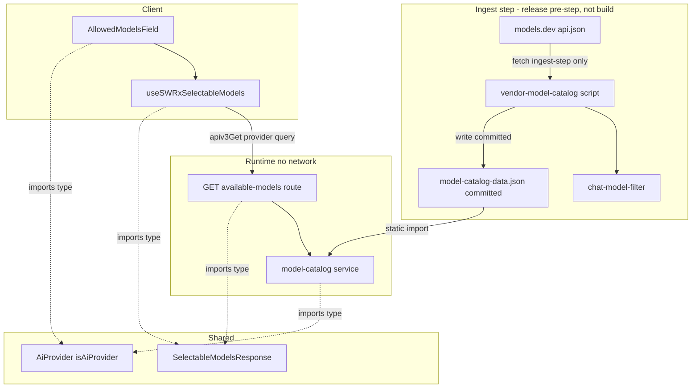

# Technical Design: ai-settings-model-picker

## Overview

**Purpose**: 管理画面「AI Settings」で許可モデル（`ai:allowedModels`）を登録する際の modelId 入力を、静的カタログを持つプロバイダでは **一覧からの選択のみ** に変更し、綴り間違い・存在しないモデルの登録を防ぐ。選択肢は **models.dev から取り込んだ（vendored）コミット済みモデルカタログ**を源とし、実行時は **外部通信ゼロ** で読む。

**Users**: GROWI 管理者（admin AI Settings で LLM を設定する運用者）。

**Impact**: 現行の自由入力（[AllowedModelsField.tsx:234-242](../../../apps/app/src/features/mastra/client/admin/AllowedModelsField.tsx#L234-L242)）を、カタログのあるプロバイダでは `<select>` に置き換える。カタログは models.dev を**取り込みステップ（リリース前段の独立ステップ。ビルド工程では実行しない）**で取り込み、`tool_call` かつ text 出力のモデルだけに **生成時フィルタ**して**コミット済み JSON アセット**にする。実行時はそのアセットを read するだけで、`@mastra/core` への値 import も不要。許可リストの認可・既定モデル・推論の native `@ai-sdk/*`・チャット側 UI は不変。

> **用語（取り込みステップ / ingest step）**: 本設計で「取り込みステップ」とは models.dev の api.json を fetch → フィルタ → コミット成果物を生成する処理を指し、**リリース前段の独立ステップ**（手動 `pnpm vendor:models` も可）で実行する。**毎ビルドでも実行時でも fetch は行わない**——ビルド工程・実行時はコミット済み成果物を read するのみ（requirements「外部通信に関する前提」準拠）。以降、本文の「取り込みステップ」／図表の "ingest step" はすべてこの意味で用い、"build time" とは区別する。

### Goals
- カタログを持つプロバイダ（openai / anthropic / google）で選択のみの登録を提供（1.x）。
- モデル一覧の**実行時取得を外部通信ゼロ**にする（2.x）。取得は**取り込みステップ（リリース前段）でのみ**行い、ビルド工程・実行時には fetch しない。
- カタログを持たないプロバイダ（azure-openai）・一覧が空の場合は自由入力を維持（3.x）。
- **`tool_call` かつ text 出力のモデルだけ**を選択肢にする（生成時フィルタ、6.x）。GROWI エージェントのツール呼び出し要件を担保。
- 既存の許可リスト挙動・認可・推論・チャット UI を不変に保つ（4.x）。
- 記述が矛盾する既存スペックを整合更新（8.x）。

### Non-Goals
- チャット画面側 UI・推論実行方式の変更（4.3）。
- **実行時**の外部通信を伴う一覧取得／モデルルーター採用。
- 同梱カタログ未収録モデルのための外部リクエスト取得（将来オプション、対象外）。
- Azure デプロイ名の自動列挙。
- PUT 側でのカタログ membership 検証（D2）。
- カタログの config-manager への主保管、および `ai:modelsCatalogOverride` 等のオーバーライド（今回は入れない）。

## Boundary Commitments

### This Spec Owns
- **models.dev → コミット済みモデルカタログの vendoring**（取り込みステップ＝リリース前段の取り込みスクリプト、生成時フィルタ、コミット成果物）。
- provider スコープの「選択可能モデル一覧」を返す admin 読み取り経路（サーバ read サービス + エンドポイント + client フック）。
- `AllowedModelsField` の modelId 入力コントロールの出し分け（`<select>` ↔ 自由入力）。
- 新規 wire DTO `SelectableModelsResponse`。
- 既存スペック（`mastra-multi-model-chat` / `multi-llm-provider`）のモデル入力方式に関する記述の整合更新。

### Out of Boundary
- `ai:allowedModels` の保存経路（[put-ai-settings.ts](../../../apps/app/src/features/mastra/server/routes/admin-ai-settings/put-ai-settings.ts)）と検証（単一 isDefault・providerOptions JSON）。**PUT はカタログ照合しない**（D2）。
- 推論のモデル生成（[resolve-mastra-model.ts](../../../apps/app/src/features/mastra/server/services/ai-sdk-modules/resolve-mastra-model.ts) / `llm-providers/*`）と allow-list 検証（`resolveEffectiveModelId`）。
- チャット側モデル一覧（[get-models.ts](../../../apps/app/src/features/mastra/server/routes/get-models.ts)）・`PromptInputModelSelect`・`UserUISettings.aiChatSelectedModelId`。
- `ai:provider` / `ai:apiKey` / `ai:azureOpenaiSettings` の意味。

### Allowed Dependencies
- **models.dev api.json**（`https://models.dev/api.json`, MIT）— **取り込みステップ（リリース前段）でのみ** fetch（ビルド工程・実行時は触れない）。取り込みスクリプト内で Node の `fetch` を使用。
- **コミット済み vendored 成果物**（`model-catalog-data.json`）— 実行時に静的 import して read。
- **zod `^4.1.9`**（既存 dep）— vendoring スクリプトの**境界検証**（api.json の想定形チェック）。mastra feature（tools・feed-parser）で使用実績あり。取り込みステップでのみ利用。
- 既存 admin 認可チェーン（`accessTokenParser([SCOPE.READ.ADMIN.AI])` → `loginRequiredFactory` → `adminRequiredFactory`）。
- 既存 client 資産（`apiv3-client`、`useSWRImmutable`、reactstrap `Input`、react-hook-form `register`）。
- `interfaces/ai-provider` — サーバ（route）は runtime の `isAiProvider` で query を検証し、**client は型のみ `import type { AiProvider }`** を参照する（ビルド時に erase されるため server-only モジュールへの実行時結合は生じない。同モジュール冒頭の「Do NOT add client imports here」は"モジュール内へ client 依存を持ち込むな"の意で、型の被参照は禁じていない）。`interfaces/allowed-model`。
- **制約**: vendored JSON はサーバ側のみで read し、client には `string[]` のみ返す（JSON を client バンドルに入れない）。**実行時のネットワーク I/O は禁止**。

### Revalidation Triggers
- `SelectableModelsResponse` の形状変更 → client フック／UI の再検証。
- vendored 成果物のスキーマ（`provider → string[]`）変更 → model-catalog／取り込みスクリプトの再確認。
- 生成時フィルタ条件（`tool_call && text 出力`）変更 → 提示一覧が変わるため UX/テスト再確認。
- models.dev api.json のスキーマ変更（`tool_call`/`modalities` フィールド） → 取り込みスクリプトの再確認。
- リリースパイプラインへの vendoring ステップ配置変更 → 鮮度運用の再確認。

## Architecture

### Existing Architecture Analysis
- admin AI 設定は feature-local な GET/PUT（[admin-ai-settings/index.ts](../../../apps/app/src/features/mastra/server/routes/admin-ai-settings/index.ts)、`routerForAdmin.use('/ai-settings', ...)` 配下）。各ハンドラファクトリが認可チェーンを内包。
- config は `configManager.getConfig('ai:*')`、薄い accessor が [llm-providers/config.ts](../../../apps/app/src/features/mastra/server/services/ai-sdk-modules/llm-providers/config.ts)。
- provider ドロップダウンは既に reactstrap `<Input type="select">` × `AI_PROVIDERS.map()`（[ProviderCommonSettings.tsx:83-95](../../../apps/app/src/features/mastra/client/admin/ProviderCommonSettings.tsx#L83-L95)）。本設計はこのパターンを modelId 入力へ横展開。
- **vendoring の前例**: marpit（[extract-marpit-css.ts](../../../packages/presentation/scripts/extract-marpit-css.ts) → コミット `*.prebuilt.ts`、「ランタイム依存なしで使うため生成」）と emoji（`@growi/emoji-mart-data` の `build: node bin/extract.ts`）。本設計はこの「抽出→コミット→実行時は依存なし」に倣う。ただし emoji/marpit は**ローカル devDep から決定的に抽出**するため build 時再生成が安全なのに対し、本カタログの源は**ネットワーク（models.dev）**なので、取り込みは**毎ビルドではなくリリース前段の取り込みステップで実行**（生成のみ／コミットは別ステップ）、ビルドはコミット済みを消費する（下記）。

### Architecture Pattern & Boundary Map



- **Selected pattern**: 「取り込みステップ（リリース前段）に models.dev から vendoring → コミット成果物 → 実行時は成果物を read」の二段構え（marpit/emoji の vendoring 定石に準拠）。実行時は一方向 read で通信ゼロ。
- **Dependency direction**: `interfaces`（DTO/AiProvider）← `chat-model-filter` ← `vendor-model-catalog`(script, 取り込みステップ) → コミット `model-catalog-data.json` ← `model-catalog`(runtime) ← `route` / `use-selectable-models`(client) ← `AllowedModelsField`。models.dev は取り込みステップのスクリプトからのみ到達。
- **Steering compliance**: server-client 境界（vendored JSON を client に持ち込まない）、cross-platform（Node の fetch/fs、curl/rm 不使用）、data-driven（provider 選択・フィルタ条件を宣言）、pure function 抽出（chat-model-filter）。

### データ源選定の根拠（Build-vs-Adopt）

モデル一覧の源を **models.dev の vendored 成果物**とし、**Mastra 経由（model router / 同梱 registry read）は採らない**。理由（詳細な比較は research.md）:

- **Mastra の model router（runtime で models.dev を fetch）不採用**: 実行時に外部通信が走り Req 2・自己ホスト/エアギャップに反する。OpenAI 互換層経由の忠実度ドリフト懸念（`multi-llm-provider` D-2/D-3）。→ 推論は native `@ai-sdk/*` のまま。
- **`@mastra/core/llm` `getProviderConfig`（オフライン registry read）不採用**: オフラインで読める点は候補だったが、**同梱データが stripped**（`provider→素id` ＋ `attachment` のみで **`tool_call`・modality を持たない**）。そのため chat＋ツール対応の**権威的フィルタが不可能**で名前 heuristic 頼みになり、選択のみ UI では誤除外の逃げ場が無い（旧 Issue 1）。加えて `@mastra/core` を値 import する必要が生じ Turbopack externalization 懸念（旧 D4）。
- **採用: models.dev api.json を vendoring**: 上流はリッチな `tool_call`/modality を持ち（Mastra はそれを削って同梱しているだけ）、**authoritative な chat＋tool フィルタ**が可能。実行時は成果物を read するのみで通信ゼロ、`@mastra/core` を実行時に触れない。取り込み頻度も GROWI が制御できる。第三者 npm ラッパー（tokenlens 等）は単独メンテ・鮮度不安のためランタイム依存にしない。

### Technology Stack

| Layer | Choice / Version | Role in Feature | Notes |
|-------|------------------|-----------------|-------|
| Frontend | React 18 + reactstrap `Input` + react-hook-form `register` | modelId の `<select>`／自由入力の出し分け | 新規依存なし。`Controller` 不要 |
| Frontend data | SWR (`useSWRImmutable`) | provider キーの一覧取得 | 静的データゆえ immutable |
| Backend (runtime) | Express apiv3 (admin router) + 静的 JSON import | provider スコープの一覧エンドポイント（通信なし） | 既存認可チェーン踏襲 |
| Vendoring (ingest step) | Node script（`fetch` 組込み）+ models.dev api.json (MIT) + zod `^4.1.9`（境界検証） | api.json を fetch → 境界を zod 検証 → 生成時フィルタ → コミット JSON 生成 | **実行時・ビルド工程ではなく取り込みステップ（リリース前段）**。`pnpm vendor:models`。zod は既存 dep（mastra feature で使用実績） |
| Data asset | committed `model-catalog-data.json` | `provider → string[]`（chat＋tool 対応 id） | git 管理・PR レビュー・リリースで一様配布 |

## File Structure Plan

### Created
```
apps/app/
├── bin/
│   ├── vendor-model-catalog.ts                 # ingest step (pre-release, not build): fetch api.json → filter → write committed JSON
│   └── vendor-model-catalog.spec.ts            # fixture api.json → 期待する成果物 shape を検証
└── src/features/mastra/
    ├── interfaces/
    │   └── selectable-models-response.ts       # DTO: SelectableModelsResponse { modelIds: string[] }
    ├── server/services/ai-sdk-modules/
    │   ├── chat-model-filter.ts                # pure: 対象provider定義 + isSelectableModel(tool_call && output⊇text)
    │   ├── chat-model-filter.spec.ts
    │   ├── model-catalog-data.json             # vendored 成果物（コミット）: { _source, _generatedAt, models: { openai:[], anthropic:[], google:[] } }
    │   ├── model-catalog.ts                    # runtime: getSelectableModelIds(provider) = 成果物を read して返す（通信なし）
    │   └── model-catalog.spec.ts
    ├── server/routes/admin-ai-settings/
    │   ├── get-available-models.ts             # getAvailableModelsFactory(crowi): RequestHandler[]
    │   └── get-available-models.spec.ts
    └── client/admin/
        ├── use-selectable-models.ts            # useSWRxSelectableModels(provider)
        └── use-selectable-models.spec.ts
```

### Modified
- `apps/app/package.json` — `"vendor:models": "node bin/vendor-model-catalog.ts"` を追加。
- **本番リリースワークフロー**（`.github/workflows/release.yml`）— リリース commit/tag を切る**前段の独立 step**として `vendor:models` を実行し、成果物を（差分時）リリース commit に同梱する。オンデマンド更新は手動 `pnpm vendor:models` → PR。無人 RC（`release-rc-scheduled.yml`）はコミット済み成果物をそのまま read して build する（RC 側で refresh/commit は行わない）。**リリースビルドはコミット済み成果物を read するのみで、refresh/fetch/commit を build 工程に融合しない**。
- `apps/app/src/features/mastra/server/routes/admin-ai-settings/index.ts` — `router.get('/available-models', getAvailableModelsFactory(crowi))` を追加。
- `apps/app/src/features/mastra/client/admin/AllowedModelsField.tsx` — provider で `useSWRxSelectableModels` を1回呼び、modelId 入力を `<select>`（catalog あり）／`<input type=text>`（catalog なし・provider 未選択・取得失敗）に出し分け。保存済みだが一覧外の値は `<option>` 補完で保持（1.5）。
- `apps/app/src/features/mastra/client/admin/AllowedModelsField.spec.tsx` — 出し分け・保存済み値保持・取得失敗フォールバックのテスト。
- `apps/app/public/static/locales/{en_US,ja_JP,fr_FR,ko_KR,zh_CN}/admin.json` — `ai_settings.model_placeholder`（既存 `provider_placeholder` に倣う。5 ロケール）。
- `.kiro/specs/mastra-multi-model-chat/{requirements.md,design.md,research.md}` / `.kiro/specs/multi-llm-provider/research.md` — 8.x の整合更新（実装タスクとして）。

## System Flows

```mermaid
sequenceDiagram
    participant Rel as リリース前段refresh step
    participant MD as models.dev api.json
    participant Repo as committed JSON
    Rel->>MD: fetch リリース前段stepのみ
    Rel->>Rel: 3provider選択 + isSelectableModel(tool_call && text) で生成時フィルタ
    Rel->>Repo: model-catalog-data.json を書き出しコミット（差分は PR レビュー）
    Note over Repo: 以降ビルドはこの成果物を read（live fetch しない）

    participant Admin
    participant Field as AllowedModelsField
    participant Hook as useSWRxSelectableModels
    participant API as GET available-models
    participant Cat as model-catalog
    Admin->>Field: provider を選択 / 変更
    Field->>Hook: provider (form watch 値)
    alt provider が空
        Hook-->>Field: fetch しない → 自由入力 (5.2)
    else provider あり
        Hook->>API: apiv3Get(?provider=...)
        API->>API: isAiProvider 検証（不正=400）
        API->>Cat: getSelectableModelIds(provider)
        Cat->>Repo: 成果物を static read（通信なし）
        Cat-->>API: string[]（azure 等は []）
        API-->>Hook: { modelIds }
        alt modelIds 非空
            Hook-->>Field: <select> で選択のみ (1.4)
        else 空 or error
            Hook-->>Field: 自由入力にフォールバック (3.1/3.2)
        end
    end
```



- **鮮度運用の不変条件**: リフレッシュ（fetch＋フィルタ＋コミット）は**本番リリースの前段の独立 step**で実行し成果物をリリース commit に同梱する。**リリースビルド（prod・無人 RC とも）はコミット済み成果物を read するのみ**で、build 工程に fetch/commit を融合しない。タイミングは本番リリース時（`release.yml` の pre-release step）＋必要に応じ手動 `pnpm vendor:models` → PR（将来 cron も可）。無人 RC はコミット済みカタログから build する。
- **生成時フィルタ**: 成果物には chat＋tool 対応の id だけが載る（`tool_call:false` や非 text 出力は書き出さない）。実行時フィルタは不要。

## Requirements Traceability

| Requirement | Summary | Components | Interfaces | Flows |
|-------------|---------|------------|------------|-------|
| 1.1–1.4 | カタログありは選択のみ提示 | AllowedModelsField, useSWRxSelectableModels, model-catalog | `SelectableModelsResponse` | provider→fetch→select |
| 1.5 | 保存済みだが一覧外の値を保持 | AllowedModelsField | — | select options 補完 |
| 2.1–2.3 | 実行時は通信ゼロ | model-catalog（成果物 read）、vendor-model-catalog（取得はリリース前段 step のみ）、release wiring | — | リリース前段 fetch / runtime read |
| 3.1–3.3 | カタログ無し/失敗時は自由入力 | AllowedModelsField, useSWRxSelectableModels | — | 空/error フォールバック |
| 4.1–4.4 | 既存挙動不変 | （変更しない：put-ai-settings, resolve-mastra-model, get-models, isAiConfigured） | — | — |
| 5.1–5.2 | provider 切替追従／未設定 | AllowedModelsField, useSWRxSelectableModels | — | SWR キー=provider |
| 6.1–6.2 | chat 用途フィルタ | chat-model-filter, vendor-model-catalog | `isSelectableModel` | 生成時フィルタ |
| 7.1 | 秘匿非漏洩（modelId のみ） | get-available-models, model-catalog | `SelectableModelsResponse` | API 応答 |
| 7.2 | admin 認可 | get-available-models（認可チェーン） | — | API 前段 |
| 7.3 | env-only モード読み取り専用維持 | AllowedModelsField（既存 `disabled`） | — | — |
| 8.1–8.3 | 既存スペック整合更新 | （ドキュメント編集タスク） | — | — |

## Components and Interfaces

| Component | Layer | Intent | Req Coverage | Key Dependencies | Contracts |
|-----------|-------|--------|--------------|------------------|-----------|
| chat-model-filter | Ingest (pure) | 対象provider定義 + chat＋tool モデル判定 | 6.1, 6.2 | interfaces/ai-provider (P1) | Service |
| vendor-model-catalog | Ingest step (script) | models.dev fetch→生成時フィルタ→コミット JSON 生成 | 2.1–2.3, 6.1 | models.dev api.json (P0), chat-model-filter (P0) | Batch |
| model-catalog | Server (runtime) | 成果物 read で provider→id 一覧（通信なし） | 1.1, 2.1–2.3, 7.1 | model-catalog-data.json (P0), ai-provider (P1) | Service |
| get-available-models | Server (route) | admin GET エンドポイント | 1.1, 3.1, 5.1, 7.1, 7.2 | model-catalog (P0), 認可 middleware (P0) | API |
| useSWRxSelectableModels | Client (hook) | provider キーの一覧取得 | 1.1, 3.2, 5.1, 5.2 | apiv3-client (P0), SelectableModelsResponse (P1) | Service, State |
| AllowedModelsField | Client (UI) | select/自由入力の出し分け | 1.1–1.5, 3.1–3.3, 5.x, 7.3 | useSWRxSelectableModels (P0) | — |

### Build / Release

#### chat-model-filter
| Field | Detail |
|-------|--------|
| Intent | 対象プロバイダ定義と「chat＋ツール対応モデル」判定（純関数） |
| Requirements | 6.1, 6.2 |

**Responsibilities & Constraints**
- 対象プロバイダ（`openai`/`anthropic`/`google`）は `AI_PROVIDER_DEFS`（[ai-provider.ts](../../../apps/app/src/features/mastra/interfaces/ai-provider.ts)）の `enumerable: true` フラグから導出する（`CATALOG_PROVIDERS`）。azure-openai は `enumerable: false`＝models.dev 非収録（デプロイ名で列挙不可）で対象外。フラグを単一ソースにすることで、プロバイダ追加時に別リストと二重管理・ドリフトしない。
- `isSelectableModel(entry)` = `entry.tool_call === true && entry.modalities.output.includes('text')`。models.dev の**権威的フィールド**で判定するため、名前 heuristic は不要（旧 Issue 1 解消）。
- 純関数（config/network 非依存）。vendoring スクリプトから呼ばれる（生成時）。

**Contracts**: Service [x]
```typescript
export const CATALOG_PROVIDERS: readonly CatalogProvider[]; // AI_PROVIDER_DEFS の enumerable:true を導出 = openai / anthropic / google
export const isSelectableModel: (entry: ModelsDevModel) => boolean; // tool_call && output⊇text
```

#### vendor-model-catalog（Batch script, 取り込みステップ／リリース前段）
| Field | Detail |
|-------|--------|
| Intent | models.dev から chat＋tool モデルだけを取り込み、コミット成果物を生成 |
| Requirements | 2.1, 2.2, 2.3, 6.1 |

**Responsibilities & Constraints**
- `fetch('https://models.dev/api.json')`（**取り込みステップ＝リリース前段でのみ／ビルド工程では実行しない**）→ `CATALOG_PROVIDERS` を選択 → `isSelectableModel` で生成時フィルタ → **id のみ**を `models.<provider> = string[]` に整形し、`{ _source（MIT 帰属）, _generatedAt, models }` の形（ヘッダとデータを分離）で `model-catalog-data.json` を**決定的（ソート）**に書き出す。
- cross-platform（Node の fetch/fs のみ、curl/rm 不使用）。
- **生成時サニティチェック（Issue 2）**: 取得した api.json を境界で **zod** による最小スキーマ検証（**読む分のみ**＝対象プロバイダの `tool_call`・`modalities.output` の型を検証し、他フィールド/他プロバイダは passthrough で寛容に）し、**各対象プロバイダ（openai/anthropic/google）で `isSelectableModel` 通過が1件以上**であることを assert する。いずれか違反（想定外の形・空結果）なら**非ゼロ終了して既存のコミット成果物を保持**し上書きしない（models.dev のスキーマドリフトで「無言の空カタログ」が出荷されるのを防ぐ）。
- 実行は `pnpm vendor:models`。**スクリプトは生成（fetch＋フィルタ＋ファイル write）のみで git 操作はしない**（純ジェネレータ・副作用なし）。**コミットは別ステップの責務**（手動＝開発者が diff 確認して PR ／ 本番リリース＝`release.yml` の pre-release step が差分時にリリース commit へ同梱）。リリースビルド（prod・無人 RC とも）はコミット済み成果物を read するのみ（build 工程に fetch/commit を融合しない）。

**Contracts**: Batch [x]
- Trigger: 手動 `pnpm vendor:models` ／ リリースビルド前段の独立 step。
- Input: models.dev api.json（取り込みステップで fetch）。
- Output: 生成（write）した `model-catalog-data.json`。git 操作はせず、コミットは別ステップが担う（差分は PR レビュー）。
- Idempotency: 同一上流なら同一出力（決定的）。fetch 失敗・スキーマ検証失敗・いずれかの対象プロバイダが空、のいずれでも非ゼロ終了し既存成果物を保持（後述 Error Handling）。

**Implementation Notes**
- Integration: **本番リリースの前段の独立 step**（`release.yml` の pre-release step）で refresh→リリース commit へ同梱。オンデマンドは手動 `pnpm vendor:models` → PR。無人 RC はコミット済み成果物から build する（RC 側 refresh なし）。build 工程には refresh/fetch/commit を**融合しない**（毎ビルド fetch＝非決定的・オフライン不可を避ける）。build はコミット済み成果物を read。
- Risks: 上流スキーマ変更で抽出が壊れ得るが、生成時サニティチェック（形検証＋各プロバイダ非空 assert）で検知し非ゼロ終了・既存保持するため無言の空カタログ出荷は防げる（Revalidation Trigger）。fixture ベースのテストで transform とサニティチェックを固定。

### Server (runtime)

#### model-catalog
| Field | Detail |
|-------|--------|
| Intent | コミット成果物から provider スコープの選択可能モデル id を返す（通信なし） |
| Requirements | 1.1, 2.1–2.3, 7.1 |

**Contracts**: Service [x]
```typescript
export const getSelectableModelIds: (provider: AiProvider) => string[];
```
- `import catalog from './model-catalog-data.json' with { type: 'json' }`（ネイティブ ESM 必須・`growi-version.ts` 準拠、`resolveJsonModule` で自動型付け＝アサーション不要）で read し、`catalog.models[provider] ?? []` を返す（ヘッダ分離済みの `models` を `Record<string, readonly string[]>` として引く。`provider: AiProvider`、azure 等は `[]`）。**ネットワーク I/O なし**、フィルタは既に生成時に完了しているため実行時ロジックは最小。

#### get-available-models（API）
| Field | Detail |
|-------|--------|
| Intent | admin 向け provider スコープのモデル一覧エンドポイント |
| Requirements | 1.1, 3.1, 5.1, 7.1, 7.2 |

**Responsibilities & Constraints**
- 認可チェーン: `accessTokenParser([SCOPE.READ.ADMIN.AI], { acceptLegacy: true })` → `loginRequiredFactory(crowi)` → `adminRequiredFactory(crowi)` → handler（[get-ai-settings.ts:169-179](../../../apps/app/src/features/mastra/server/routes/admin-ai-settings/get-ai-settings.ts#L169-L179) と同型）。aiReadyGuard は付けない。
- `req.query.provider` を `isAiProvider` で検証（不正→400）。応答は `modelIds` のみ（7.1）。

**Contracts**: API [x]
| Method | Endpoint | Request | Response | Errors |
|--------|----------|---------|----------|--------|
| GET | `/_api/v3/ai-settings/available-models` | query `provider: AiProvider` | `SelectableModelsResponse` | 400 (invalid provider), 401/403 (auth), 500 |

- provider 有効だがカタログ非対応（azure-openai）→ `200 { modelIds: [] }`。

### Client

#### useSWRxSelectableModels（フック）
| Field | Detail |
|-------|--------|
| Intent | provider をキーにモデル一覧を取得（未選択時は取得しない） |
| Requirements | 1.1, 3.2, 5.1, 5.2 |

**Contracts**: Service [x] / State [x]
```typescript
export const useSWRxSelectableModels: (
  provider: AiProvider | '' | undefined,
) => SWRResponse<SelectableModelsResponse, Error>;
```
- Key: `provider == null || provider === '' ? null : ['/ai-settings/available-models', provider]`（null = fetch しない、5.2）。**未選択は `''` だけでなく `undefined` も含める**: 設定データ解決前は `useForm` に defaultValues が無く `watch('provider')` が（型に反して）`undefined` を返すため、`=== ''` だけのガードだと `[ENDPOINT, undefined]` キーで fetch が走り、`provider` クエリ無しのリクエスト → 400 になる。nullish もガードして「provider 無し ⇒ リクエストしない」を初期ロード中も守る。
- Fetcher: `apiv3Get<SelectableModelsResponse>('/ai-settings/available-models', { provider })`。`useSWRImmutable`（静的データ）。provider 変更で自動再取得（5.1）。**注意**: `apiv3Get(path, params)` は第2引数を内部で `{ params }` に包んで axios へ渡す（[apiv3-client.ts](../../../apps/app/src/client/util/apiv3-client.ts)）ため、クエリ値のオブジェクトを**そのまま**第2引数に渡す（`{ provider }`）。`{ params: { provider } }` と書くと二重ラップされ `?params[provider]=...` となり `req.query.provider` が undefined → 400 になるので不可。

#### AllowedModelsField（UI 変更）
| Field | Detail |
|-------|--------|
| Intent | modelId 入力を select/自由入力に出し分け |
| Requirements | 1.1–1.5, 3.1–3.3, 5.1–5.2, 7.3 |

**Responsibilities & Constraints**
- `provider = watch('provider')` で `useSWRxSelectableModels(provider)` を1回呼び、導出:
  - `mode = 'freetext'` if `provider===''` or error（3.2）or（解決済みかつ `modelIds.length===0`）（3.1）。
  - `mode = 'select'` if 解決済みかつ `modelIds.length>0`（1.4）。ロード中は modelId コントロールを disabled。
- 各行の modelId 入力は `register('allowedModels.${index}.modelId')` のまま。`mode==='select'` は reactstrap `<Input type="select">`（options = `modelIds`（＝生成時に絞られた選択可能集合）+ 現在値が一覧外なら補完 option（1.5）+ 空プレースホルダ）。`mode==='freetext'` は現行 `<Input type="text">`。
- 既存の `disabled`（env-only, 7.3）・行ラベル分岐・isDefault ラジオ・providerOptions・削除・追加ボタンは不変（4.2）。

**Implementation Notes**
- Integration: フィールド単位で1回 fetch し、`AllowedModelRow` に `mode` と `selectableModelIds` を渡す。
- Validation: select は生成時に絞られた集合しか選べないため typo が消える。自由入力時の検証は現行踏襲。

## Data Models

### Data Contracts
```typescript
// interfaces/selectable-models-response.ts
// GET /_api/v3/ai-settings/available-models の応答。server/client 共有。
// modelIds は生成時に chat＋tool へ絞られた bare id 配列（azure 等は空）。秘匿情報は含めない（7.1）。
export interface SelectableModelsResponse {
  modelIds: string[];
}
```
```jsonc
// model-catalog-data.json（vendored, committed）— 実行時 read の唯一の源
{
  "_source": "https://models.dev/api.json (MIT)",
  "_generatedAt": "<ISO date>",
  "models": {
    "openai":    ["gpt-4o", "gpt-4.1", "o3", "..."],   // tool_call && text 出力のみ
    "anthropic": ["..."],
    "google":    ["..."]
  }
}
```
```typescript
// vendored 成果物の型。server 限定（client は SelectableModelsResponse のみ）。ヘッダとデータを分離（(a) ネスト）。
export type ModelCatalog = Partial<Record<AiProvider, readonly string[]>>;               // provider → 選択可能 id
export type ModelCatalogFile = { _source: string; _generatedAt: string; models: ModelCatalog };
```
- 消費側 `model-catalog.ts` は `import catalog from './model-catalog-data.json' with { type: 'json' }`（ネイティブ ESM 必須・前例 `growi-version.ts`）で read。`resolveJsonModule: true` により **import 時に自動で型が付く（アサーション不要）**。`getSelectableModelIds(provider)` は、ヘッダを分離した `catalog.models`（provider→`string[]` のみなので `Record<string, readonly string[]>` として健全に扱える）から `catalog.models[provider] ?? []` を返す（`provider: AiProvider`、azure 等は `[]`＝自由入力）。runtime parse は不要（自前生成・生成時 zod 検証済み）／成果物が `ModelCatalogFile` に適合することは1本のテストで担保。
- 既存 `AllowedModel` / `AiSettingsResponse` / `AiSettingsUpdateRequest` は変更しない（4.x）。

## Error Handling

- **取り込みステップ（リリース前段）の fetch 失敗**: `vendor-model-catalog` は非ゼロ終了し、**既存のコミット成果物を保持**（上書きしない）。リリースは前回カタログで継続可能。ログに詳細（HTTP ステータス）を出す。
- **取り込みステップ（リリース前段）のスキーマドリフト／空結果（Issue 2）**: 取得 JSON が想定形でない、またはいずれかの対象プロバイダで選択可能モデルが0件になった場合、`vendor-model-catalog` は**非ゼロ終了して既存成果物を保持**する（「無言の空カタログ」出荷を防止）。何が欠けたか（プロバイダ名・件数）をログに出し、refresh の PR/CI で検知させる。
- **400 invalid provider**: `isAiProvider` 不合格 query → `ErrorV3` で 400。
- **実行時のサーバ 5xx / 取得失敗**: フックの `error` → UI は自由入力にフォールバックし保存をブロックしない（3.2）。`res.apiv3Err(new ErrorV3(...), 500)`、秘匿を載せない。
- **空一覧（azure 等）**: エラーではなく `{ modelIds: [] }`。UI は自由入力（3.1）。
- **成果物欠損/破損**: `model-catalog` は `catalog[provider] ?? []` でフェイルソフト（例外を投げない）。

## Testing Strategy

### Unit Tests
- `chat-model-filter.isSelectableModel`: `tool_call:true & output:['text']` を通し、`tool_call:false` や `output:['image']`（embedding/image/audio 相当）を除外（6.1/6.2）。`CATALOG_PROVIDERS` に azure-openai を含めない。
- `vendor-model-catalog`: fixture の api.json（openai/anthropic/google + 非chat混在）から、**chat＋tool の id のみ**の `provider→string[]` 成果物が決定的に生成される（2.x/6.1）。fetch 失敗時に既存成果物を保持し非ゼロ終了。**サニティチェック（Issue 2）: 想定外スキーマの fixture／いずれかの対象プロバイダが0件になる fixture で、非ゼロ終了かつ既存成果物を上書きしない**ことを検証。
- `model-catalog.getSelectableModelIds`: コミット成果物を read し `openai` 非空・`azure-openai` は `[]`・**ネットワーク呼び出しなし**（1.1/2.x/3.1）。
- `useSWRxSelectableModels`: `provider===''` で fetch しない、provider 変更で再 fetch（5.1/5.2）。

### Integration Tests
- `get-available-models` ルート: 非 admin → 401/403（7.2）、`?provider=openai` → `{ modelIds }` 非空、`?provider=azure-openai` → `{ modelIds: [] }`、不正 provider → 400、応答に apiKey/providerOptions を含まない（7.1）。

### Component (UI) Tests
- `AllowedModelsField`: openai で `<select>`（options=フックの modelIds）、azure で自由入力（3.1）、フック error 時に自由入力へフォールバック（3.2）、保存済みだが一覧外の modelId が選択済み option として保持（1.5）、env-only（`disabled`）で編集不可（7.3）。

### Regression（不変性の担保, 4.x）
- `put-ai-settings` の単一 isDefault 不変条件・providerOptions JSON 検証、`resolveEffectiveModelId` の allow-list 検証、`get-models`（chat 側）応答が不変。

## Security Considerations
- **実行時の外部通信ゼロ**: 一覧提供は committed 成果物の read のみ（2.x）。models.dev への fetch は取り込みステップのスクリプト限定。
- **秘匿非漏洩**: 応答は `modelIds: string[]` のみ（7.1、[get-models.ts](../../../apps/app/src/features/mastra/server/routes/get-models.ts) の modelId-only 前例に準拠）。
- **認可**: `SCOPE.READ.ADMIN.AI` + `adminRequired`（7.2）。
- **入力検証**: query `provider` は `isAiProvider` で allow-list 検証。
- **ライセンス**: models.dev は MIT。成果物ヘッダに帰属（`_source`）を記載。

## Migration Strategy
- ランタイムのデータ移行なし。8.x はドキュメント整合更新（実装タスク）:
  - `mastra-multi-model-chat`: 「モデル一覧 API 新設しない／管理者手入力」→「オフライン vendored カタログの選択方式を採用」に更新（8.1）。
  - `multi-llm-provider`: research D-2/D-3 に「models.dev の **runtime fetch（モデルルーター）は不採用のまま**／**取り込みステップ（リリース前段）で vendoring した静的カタログの read は別物**・推論は native `@ai-sdk/*`」を注記（8.2）。
  - 更新後、関連スペック間に矛盾記述が残らないこと（8.3）。
```
