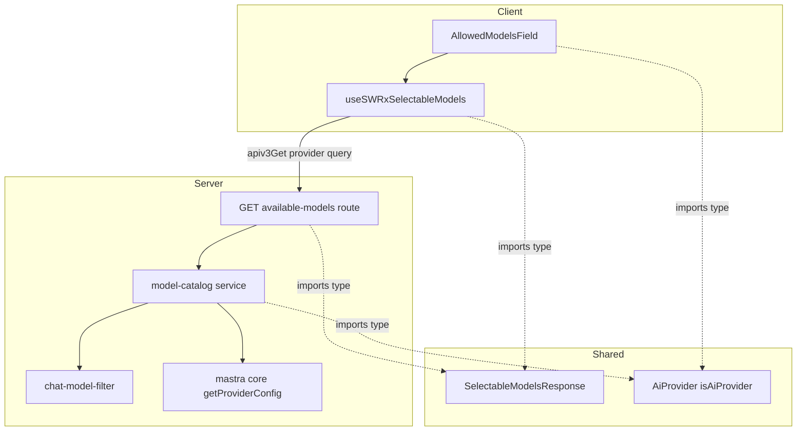

# Technical Design: ai-settings-model-picker

## Overview

**Purpose**: 管理画面「AI Settings」で許可モデル（`ai:allowedModels`）を登録する際の modelId 入力を、静的カタログを持つプロバイダでは **一覧からの選択のみ** に変更し、綴り間違い・存在しないモデルの登録を防ぐ。選択肢は `@mastra/core` 同梱の静的レジストリから **外部通信なし** で取得する。

**Users**: GROWI 管理者（admin AI Settings で LLM を設定する運用者）。

**Impact**: 現行の自由入力（[AllowedModelsField.tsx:234-242](../../../apps/app/src/features/mastra/client/admin/AllowedModelsField.tsx#L234-L242)）を、プロバイダにカタログがある場合は `<select>` に置き換える。サーバに provider スコープのモデル一覧を返す admin エンドポイントを1本追加する。許可リストの認可・既定モデル・推論の native `@ai-sdk/*` 実装・チャット側 UI は変更しない。

### Goals
- カタログを持つプロバイダ（openai / anthropic / google）で選択のみの登録を提供する（1.x）。
- モデル一覧の取得を外部通信ゼロで行う（2.x）。
- カタログを持たないプロバイダ（azure-openai）・取得失敗時は自由入力を維持する（3.x）。
- 既存の許可リスト挙動・認可・推論・チャット UI を不変に保つ（4.x）。
- 記述が矛盾する既存スペックを整合更新する（8.x）。

### Non-Goals
- チャット画面側 UI・推論実行方式の変更（4.3）。
- 外部通信を伴う一覧取得／モデルルーター採用／未収録モデルのための external fetch（将来オプション）。
- Azure デプロイ名の自動列挙。
- PUT 側でのカタログ membership 検証（D2 参照）。

## Boundary Commitments

### This Spec Owns
- provider スコープの「選択可能モデル一覧」を返す admin 読み取り経路（サーバサービス + エンドポイント + client フック）。
- モデル一覧に対する chat 用途フィルタ（除外ルールの宣言データ）。
- `AllowedModelsField` の modelId 入力コントロールの出し分け（`<select>` ↔ 自由入力）。
- 新規 wire DTO `SelectableModelsResponse`。
- 既存スペック（`mastra-multi-model-chat` / `multi-llm-provider`）のうち、モデル入力方式に関する記述の整合更新。

### Out of Boundary
- `ai:allowedModels` の保存経路（[put-ai-settings.ts](../../../apps/app/src/features/mastra/server/routes/admin-ai-settings/put-ai-settings.ts)）とその検証（単一 isDefault 不変条件、providerOptions JSON 検証など）は不変。**PUT はカタログ照合を行わない**（D2）。
- 推論のモデル生成（[resolve-mastra-model.ts](../../../apps/app/src/features/mastra/server/services/ai-sdk-modules/resolve-mastra-model.ts) / `llm-providers/*`）と allow-list 検証（`resolveEffectiveModelId`）。
- チャット側モデル一覧（[get-models.ts](../../../apps/app/src/features/mastra/server/routes/get-models.ts)）・`PromptInputModelSelect`・`UserUISettings.aiChatSelectedModelId`。
- `ai:provider` / `ai:apiKey` / `ai:azureOpenaiSettings` の意味。

### Allowed Dependencies
- `@mastra/core/llm` の `getProviderConfig`（**サーバ限定** の値 import。既に `dependencies`。read は通信ゼロ）。
- 既存 admin 認可チェーン（`accessTokenParser([SCOPE.READ.ADMIN.AI])` → `loginRequiredFactory` → `adminRequiredFactory`）。
- 既存 client 資産（`apiv3-client`、`useSWRImmutable`、reactstrap `Input`、react-hook-form `register`）。
- `interfaces/ai-provider`（`AiProvider` / `isAiProvider`、client-safe な const）、`interfaces/allowed-model`。
- **制約**: `@mastra/core` を client バンドルへ引き込まない（read はサーバのみ、client は `string[]` と `AiProvider` のみ参照）。

### Revalidation Triggers
- `SelectableModelsResponse` の形状変更 → client フック／UI の再検証。
- chat フィルタの除外ルール変更 → 提示一覧が変わるため UX 再確認。
- `getProviderConfig` の provider キー集合／モデル配列形状の変更（`@mastra/core` メジャー更新）→ `model-catalog` とフィルタの再確認。
- `@mastra/core` を値 import 化したことによる Turbopack externalization 変化 → prod ビルド検証（`.next/node_modules`）。

## Architecture

### Existing Architecture Analysis
- admin AI 設定は feature-local な GET/PUT（[admin-ai-settings/index.ts](../../../apps/app/src/features/mastra/server/routes/admin-ai-settings/index.ts)、`routerForAdmin.use('/ai-settings', ...)` 配下）。各ハンドラファクトリが認可チェーンを内包し、router は `RequestHandler[]` を mount するだけ。
- config は `configManager.getConfig('ai:*')`、薄い accessor が [llm-providers/config.ts](../../../apps/app/src/features/mastra/server/services/ai-sdk-modules/llm-providers/config.ts)。
- client は feature-local な `useSWRImmutable` フック（[use-ai-settings.ts](../../../apps/app/src/features/mastra/client/admin/use-ai-settings.ts)）と react-hook-form（[AiSettings.tsx](../../../apps/app/src/features/mastra/client/admin/AiSettings.tsx)）。DTO は `interfaces/` で server/client 共有。
- provider ドロップダウンは既に reactstrap `<Input type="select">` × `AI_PROVIDERS.map()`（[ProviderCommonSettings.tsx:83-95](../../../apps/app/src/features/mastra/client/admin/ProviderCommonSettings.tsx#L83-L95)）。本設計はこの確立パターンを modelId 入力へ横展開する。

### Architecture Pattern & Boundary Map



- **Selected pattern**: 既存 admin feature スタックへの薄い read-only 追加（Extension）。責務は「provider → 選択可能モデル一覧（chat フィルタ済み）」の一方向 read。
- **Dependency direction**: `interfaces`（DTO / AiProvider）← `chat-model-filter` ← `model-catalog`(server) ← `route`(server) / `use-selectable-models`(client) ← `AllowedModelsField`(client)。左方向のみ参照。`@mastra/core` はサーバ層（`model-catalog`）からのみ到達。
- **Steering compliance**: server-client 境界（`@mastra/core` を client に持ち込まない、structure.md）、data-driven（除外ルールを宣言データ化、coding-style）、named exports、pure function 抽出。

### Technology Stack

| Layer | Choice / Version | Role in Feature | Notes |
|-------|------------------|-----------------|-------|
| Frontend | React 18 + reactstrap `Input` + react-hook-form `register` | modelId の `<select>`／自由入力の出し分け | 新規依存なし。`Controller` 不要 |
| Frontend data | SWR (`useSWRImmutable`) | provider キーの一覧取得 | 静的データ ゆえ immutable |
| Backend | Express apiv3 (admin router) | provider スコープの一覧エンドポイント | 既存認可チェーン踏襲 |
| Model catalog | `@mastra/core` `^1.32.1`（導入 1.41.0） | `getProviderConfig(provider).models` を offline read | 既に `dependencies`。**型のみ→値 import** に変更（サーバ限定） |

## File Structure Plan

### Created
```
apps/app/src/features/mastra/
├── interfaces/
│   └── selectable-models-response.ts          # DTO: SelectableModelsResponse { modelIds: string[] }
├── server/services/ai-sdk-modules/
│   ├── chat-model-filter.ts                    # NON_CHAT_MODEL_ID_PATTERNS + isLikelyChatModelId (pure)
│   ├── chat-model-filter.spec.ts
│   ├── model-catalog.ts                        # getSelectableModelIds(provider): getProviderConfig read + filter
│   └── model-catalog.spec.ts
├── server/routes/admin-ai-settings/
│   ├── get-available-models.ts                 # getAvailableModelsFactory(crowi): RequestHandler[]
│   └── get-available-models.spec.ts
└── client/admin/
    ├── use-selectable-models.ts                # useSWRxSelectableModels(provider)
    └── use-selectable-models.spec.ts
```

### Modified
- `apps/app/src/features/mastra/server/routes/admin-ai-settings/index.ts` — `router.get('/available-models', getAvailableModelsFactory(crowi))` を追加。
- `apps/app/src/features/mastra/client/admin/AllowedModelsField.tsx` — provider で `useSWRxSelectableModels` を1回呼び、行の modelId 入力を `<select>`（catalog あり）／`<input type=text>`（catalog なし・取得失敗・provider 未選択）に出し分け。保存済みだが一覧外の値は `<option>` 補完で保持（1.5）。
- `apps/app/src/features/mastra/client/admin/AllowedModelsField.spec.tsx` — 出し分け・保存済み値保持・取得失敗フォールバックのテスト追加。
- `apps/app/public/static/locales/{en_US,ja_JP,fr_FR,ko_KR,zh_CN}/admin.json` — `ai_settings.model_select_placeholder` 等の新規キー（5 ロケール）。
- `.kiro/specs/mastra-multi-model-chat/requirements.md` / `design.md` — 8.1 の整合更新。
- `.kiro/specs/multi-llm-provider/research.md` — 8.2 の注記追加。

## System Flows

```mermaid
sequenceDiagram
    participant Admin
    participant Field as AllowedModelsField
    participant Hook as useSWRxSelectableModels
    participant API as GET available-models
    participant Cat as model-catalog
    Admin->>Field: provider を選択 / 変更
    Field->>Hook: provider (form watch 値)
    alt provider が空
        Hook-->>Field: fetch しない → 自由入力 (5.2)
    else provider あり
        Hook->>API: apiv3Get(?provider=...)
        API->>API: isAiProvider 検証 (不正=400)
        API->>Cat: getSelectableModelIds(provider)
        Cat->>Cat: getProviderConfig(provider)?.models (通信なし)
        Cat->>Cat: chat フィルタ適用 (6.x)
        Cat-->>API: string[]（azure 等は []）
        API-->>Hook: { modelIds }
        alt modelIds 非空
            Hook-->>Field: <select> で選択のみ (1.4)
        else 空 or error
            Hook-->>Field: 自由入力にフォールバック (3.1/3.2)
        end
    end
```



- **Gating**: フックは provider が空のとき fetch しない（SWR キー null）。provider 変更で SWR キーが変わり自動再取得（5.1）。
- **フォールバック**: 取得失敗（error）・空一覧（azure）は自由入力（3.1/3.2）。ロード中は modelId コントロールを一時的に disabled とし、解決後に select/自由入力を確定（保存済み値は register 経由で保持）。

## Requirements Traceability

| Requirement | Summary | Components | Interfaces | Flows |
|-------------|---------|------------|------------|-------|
| 1.1–1.4 | カタログありは選択のみ提示 | AllowedModelsField, useSWRxSelectableModels, model-catalog | `SelectableModelsResponse` | provider→fetch→select |
| 1.5 | 保存済みだが一覧外の値を保持 | AllowedModelsField | — | select options 補完 |
| 2.1–2.3 | 通信ゼロの取得 | model-catalog（`getProviderConfig` offline） | — | Cat の read |
| 3.1–3.3 | カタログ無し/失敗時は自由入力 | AllowedModelsField, useSWRxSelectableModels | — | 空/error フォールバック |
| 4.1–4.4 | 既存挙動不変 | （変更しない：put-ai-settings, resolve-mastra-model, get-models, isAiConfigured） | — | — |
| 5.1–5.2 | provider 切替追従／未設定 | AllowedModelsField, useSWRxSelectableModels | — | SWR キー=provider |
| 6.1–6.2 | chat 用途フィルタ | chat-model-filter, model-catalog | `isLikelyChatModelId` | Cat のフィルタ |
| 7.1 | 秘匿非漏洩（modelId のみ） | get-available-models, model-catalog | `SelectableModelsResponse` | API 応答 |
| 7.2 | admin 認可 | get-available-models（認可チェーン） | — | API 前段 |
| 7.3 | env-only モード読み取り専用維持 | AllowedModelsField（既存 `disabled`） | — | — |
| 8.1–8.3 | 既存スペック整合更新 | （ドキュメント編集タスク） | — | — |

## Components and Interfaces

| Component | Layer | Intent | Req Coverage | Key Dependencies | Contracts |
|-----------|-------|--------|--------------|------------------|-----------|
| chat-model-filter | Server (pure) | 非 chat モデル ID の除外判定 | 6.1, 6.2 | — | Service |
| model-catalog | Server | provider→選択可能モデル一覧（offline read+filter） | 1.1, 2.1–2.3, 6.x, 7.1 | @mastra/core (P0), chat-model-filter (P0), ai-provider (P1) | Service |
| get-available-models | Server (route) | admin GET エンドポイント | 1.1, 3.1, 5.1, 7.1, 7.2 | model-catalog (P0), 認可 middleware (P0) | API |
| useSWRxSelectableModels | Client (hook) | provider キーの一覧取得 | 1.1, 3.2, 5.1, 5.2 | apiv3-client (P0), SelectableModelsResponse (P1) | Service, State |
| AllowedModelsField | Client (UI) | select/自由入力の出し分け | 1.1–1.5, 3.1–3.3, 5.x, 7.3 | useSWRxSelectableModels (P0) | — |

### Server

#### chat-model-filter
| Field | Detail |
|-------|--------|
| Intent | モデル ID が chat 用途に適さないと判別できる場合に除外する（宣言データ + 純関数） |
| Requirements | 6.1, 6.2 |

**Responsibilities & Constraints**
- `NON_CHAT_MODEL_ID_PATTERNS`（`embedding` / `image` / `tts` / `whisper` / `dall-e` / `moderation` / `realtime` / `audio` / `transcribe` などの語を含むパターン）を単一の宣言データとして持つ。
- 判別できないものは **除外しない**（過剰除外で有効な chat モデルを失わない、6.2）。手入力の逃げ道が無いため保守は保守的側に倒す。

**Contracts**: Service [x]
```typescript
export const NON_CHAT_MODEL_ID_PATTERNS: readonly RegExp[];
export const isLikelyChatModelId: (modelId: string) => boolean;
```
- Postconditions: `isLikelyChatModelId` は既知の非 chat パターンに一致しなければ `true`。
- 純関数（config/network 非依存）。単体テスト容易。

#### model-catalog
| Field | Detail |
|-------|--------|
| Intent | 設定中プロバイダの選択可能モデル ID 一覧を offline に返す |
| Requirements | 1.1, 2.1–2.3, 6.1, 7.1 |

**Responsibilities & Constraints**
- `getProviderConfig(provider)?.models ?? []` を read（openai/anthropic/google は provider 名がレジストリキーと一致、azure-openai は `undefined` → `[]`）。
- `isLikelyChatModelId` でフィルタ、重複除去して返す。
- **通信禁止**: `getProviderConfig` のみ使用（`syncGateways`/`fetchProviders` は呼ばない）。実装は同期・副作用なし。
- **サーバ限定**: このモジュールが `@mastra/core` に触れる唯一の新規 client 非到達点。

**Dependencies**
- External: `@mastra/core/llm` `getProviderConfig` — 静的レジストリ read（P0）。
- Outbound: `chat-model-filter`（P0）、`interfaces/ai-provider`（P1）。

**Contracts**: Service [x]
```typescript
export const getSelectableModelIds: (provider: AiProvider) => string[];
```
- Preconditions: `provider` は `AiProvider`。
- Postconditions: chat フィルタ済みの bare modelId 配列。カタログ非対応プロバイダは `[]`。ネットワーク I/O を発生させない。

**Implementation Notes**
- Integration: `@mastra/core` を型のみ→値 import に変更。ビルド後 `ls .next/node_modules | grep @mastra` で externalization を確認（既に `dependencies`。Revalidation Trigger）。
- Risks: レジストリ内容は `@mastra/core` バージョンで drift（shape は安定）。

#### get-available-models（API）
| Field | Detail |
|-------|--------|
| Intent | admin 向け provider スコープのモデル一覧エンドポイント |
| Requirements | 1.1, 3.1, 5.1, 7.1, 7.2 |

**Responsibilities & Constraints**
- 認可チェーン: `accessTokenParser([SCOPE.READ.ADMIN.AI], { acceptLegacy: true })` → `loginRequiredFactory(crowi)` → `adminRequiredFactory(crowi)` → handler（[get-ai-settings.ts:169-179](../../../apps/app/src/features/mastra/server/routes/admin-ai-settings/get-ai-settings.ts#L169-L179) と同型）。aiReadyGuard は付けない（AI 無効/未設定でも admin は構成する）。
- `req.query.provider` を `isAiProvider` で検証。不正→400。応答は `modelIds` のみ（providerOptions/秘匿は返さない、7.1）。

**Dependencies**
- Outbound: `model-catalog`（P0）、`interfaces/selectable-models-response`（P1）、`interfaces/ai-provider`（P1）。

**Contracts**: API [x]
| Method | Endpoint | Request | Response | Errors |
|--------|----------|---------|----------|--------|
| GET | `/_api/v3/ai-settings/available-models` | query `provider: AiProvider` | `SelectableModelsResponse` | 400 (invalid provider), 401/403 (auth), 500 |

- provider が有効だがカタログ非対応（azure-openai）→ `200 { modelIds: [] }`（client は自由入力にフォールバック）。

### Client

#### useSWRxSelectableModels（フック）
| Field | Detail |
|-------|--------|
| Intent | provider をキーにモデル一覧を取得（未選択時は取得しない） |
| Requirements | 1.1, 3.2, 5.1, 5.2 |

**Contracts**: Service [x] / State [x]
```typescript
export const useSWRxSelectableModels: (
  provider: AiProvider | '',
) => SWRResponse<SelectableModelsResponse, Error>;
```
- Key: `provider === '' ? null : ['/ai-settings/available-models', provider]`（null = fetch しない、5.2）。
- Fetcher: `apiv3Get<SelectableModelsResponse>('/ai-settings/available-models', { params: { provider } })`。
- `useSWRImmutable`（データは静的）。provider 変更で自動再取得（5.1）。

#### AllowedModelsField（UI 変更）
| Field | Detail |
|-------|--------|
| Intent | modelId 入力を select/自由入力に出し分け |
| Requirements | 1.1–1.5, 3.1–3.3, 5.1–5.2, 7.3 |

**Responsibilities & Constraints**
- `provider = watch('provider')` で `useSWRxSelectableModels(provider)` を1回呼び、導出:
  - `mode = 'freetext'` if `provider===''` or error（3.2）or（解決済みかつ `modelIds.length===0`）（3.1）。
  - `mode = 'select'` if 解決済みかつ `modelIds.length>0`（1.4）。
  - ロード中は modelId コントロールを disabled（確定まで編集不可）。
- 各行の modelId 入力は `register('allowedModels.${index}.modelId')` のまま。`mode==='select'` は reactstrap `<Input type="select">`、options = `modelIds`（+ 現在値が一覧外なら補完 option、1.5）+ 空プレースホルダ。`mode==='freetext'` は現行 `<Input type="text">`。
- 既存の `disabled`（env-only、7.3）・行ラベル分岐・isDefault ラジオ・providerOptions・削除・追加ボタンは不変（4.2）。

**Implementation Notes**
- Integration: フィールド単位で1回 fetch し、`AllowedModelRow` に `mode` と `selectableModelIds` を渡す（行ごとの重複 fetch を避ける）。
- Validation: select は一覧内の値しか選べないため typo が消える。自由入力時の検証は現行踏襲。
- Risks: azure でロード→空解決の一瞬 select 風表示の可能性。disabled ロード状態で緩和。データ駆動を保つためクライアントに provider 別カタログ有無をハードコードしない。

## Data Models

### Data Contracts
```typescript
// interfaces/selectable-models-response.ts
// GET /_api/v3/ai-settings/available-models の応答。server/client 共有。
// modelIds は chat フィルタ済みの bare model id 配列（azure 等は空）。
// providerOptions/秘匿情報は含めない（7.1）。ChatModelsResponse と同様の最小契約。
export interface SelectableModelsResponse {
  modelIds: string[];
}
```
- 既存 `AllowedModel` / `AiSettingsResponse` / `AiSettingsUpdateRequest` は **変更しない**（4.x）。保存は full-state-replace の既存 PUT のまま。

## Error Handling

- **400 invalid provider**: `isAiProvider` 不合格の query → `ErrorV3` で 400。client は通常発生させない（form の provider から渡すため）。
- **取得失敗（ネットワーク/サーバ 5xx）**: フックの `error` → UI は自由入力にフォールバックし保存をブロックしない（3.2）。`res.apiv3Err(new ErrorV3(...), 500)` を返し、ログに秘匿を載せない（既存踏襲）。
- **空一覧（azure 等）**: エラーではなく `{ modelIds: [] }`。UI は自由入力（3.1）。
- **Fail-soft**: `model-catalog` は例外を投げず `[]` を返す方針（`getProviderConfig` が予期せぬ形状でも `Array.isArray` ガード）。

## Testing Strategy

### Unit Tests
- `chat-model-filter`: `text-embedding-3-small`/`dall-e-3`/`whisper-1`/`tts-1`/`gpt-image-1` を除外、`gpt-4o`/`o3`/`claude-...`/`gemini-2.5-flash` を通す（6.1/6.2）。
- `model-catalog.getSelectableModelIds`: `'openai'` は非空・bare id・非 chat 除外済み、`'azure-openai'` は `[]`（1.1/3.1/6.x）。`getProviderConfig` を stub し **ネットワーク呼び出しが無い**ことを担保（2.x）。
- `useSWRxSelectableModels`: `provider===''` で fetch しない、provider 変更で再 fetch（5.1/5.2）。

### Integration Tests
- `get-available-models` ルート: 非 admin → 401/403（7.2）、`?provider=openai` → `{ modelIds }` 非空、`?provider=azure-openai` → `{ modelIds: [] }`、不正 provider → 400、応答に apiKey/providerOptions を含まない（7.1）。

### Component (UI) Tests
- `AllowedModelsField`: openai で `<select>` 描画（options=フックの modelIds）、azure で自由入力（3.1）、フック error 時に自由入力へフォールバック（3.2）、保存済みだが一覧外の modelId が選択済み option として保持される（1.5）、env-only（`disabled`）で編集不可（7.3）。

### Regression（不変性の担保、4.x）
- `put-ai-settings` の単一 isDefault 不変条件・providerOptions JSON 検証、`resolveEffectiveModelId` の allow-list 検証、`get-models`（chat 側）応答が不変であること。

## Security Considerations
- **秘匿非漏洩**: 応答は `modelIds: string[]` のみ。apiKey/providerOptions/azure 資格情報を返さない（7.1、[get-models.ts](../../../apps/app/src/features/mastra/server/routes/get-models.ts) の modelId-only 前例に準拠）。
- **認可**: `SCOPE.READ.ADMIN.AI` + `adminRequired`（7.2）。
- **入力検証**: query `provider` は `isAiProvider` で allow-list 検証（任意文字列を `getProviderConfig` に渡さない）。
- **外部通信ゼロ**: read 経路は埋め込みレジストリのみ（2.x）。`@mastra/core` は client バンドルに入れない（server-client 境界）。

## Migration Strategy
- ランタイムのデータ移行なし。8.x はドキュメント整合更新（実装タスクで実施）:
  - `mastra-multi-model-chat`: 「モデル一覧 API 新設しない／管理者手入力」→「オフライン静的カタログの選択方式を採用」に更新（8.1）。
  - `multi-llm-provider`: research D-2/D-3 に「静的レジストリ read 経路は model router と別物・推論は native `@ai-sdk/*` のまま」を注記（8.2）。
  - 更新後、関連スペック間に矛盾記述が残らないこと（8.3）。
