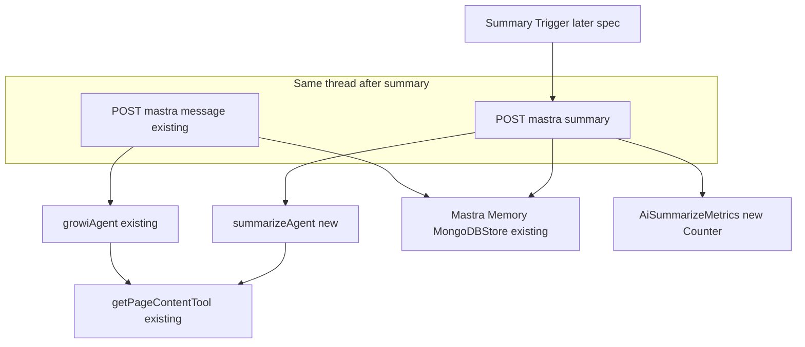
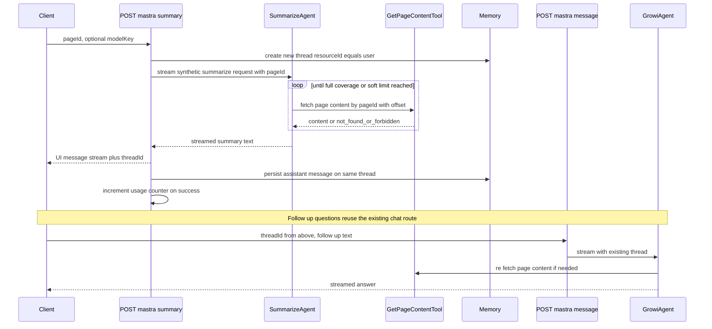
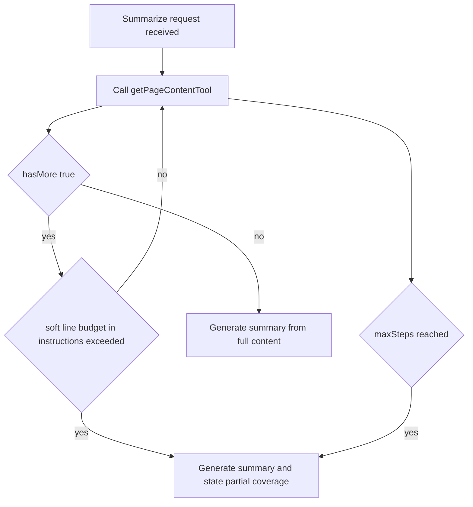

# Technical Design: ai-summarize

## Overview

**Purpose**: 本機能は、GROWIのページ閲覧者が、閲覧中のページの内容を既存のAIチャット基盤（`features/mastra`）を通じてその場で要約できるようにする。

**Users**: ページ閲覧者は、ページを開いた状態から要約を要求し、その場で生成された要約を読み、同じ対話の中で内容について追加の質問を続けられる。運用者は、機能の利用状況をOpenTelemetryメトリクスで把握できる。

**Impact**: `features/mastra` に、検索Q&A用の既存 `growiAgent` とは独立した要約専用の新規Agent（`summarizeAgent`）と、それを一度だけ起動する新規APIルートを追加する。`growiAgent` 本体（instructions・呼び出し経路）、ページ取得ツール（`getPageContentTool`）、既存のチャットスレッド永続化基盤（`memory`）はいずれも変更しない。

### Goals
- 閲覧中のページを、既存のAIチャット基盤上での都度のLLM呼び出しにより要約する（キャッシュ・永続化なし）。
- 長いページについて、既存の検索Q&A用途の読み取り方針を変えずに、要約時のみ全文カバレッジの読み取り方針を適用する。
- 要約対象コンテンツの取得経路を既存の `getPageContentTool` に一本化し、要約生成のたびに閲覧権限が再チェックされる構造を維持する。
- 要約後、同一スレッド内で既存のチャット対話フローに合流し、追加の質問を継続できるようにする。
- 利用状況をOpenTelemetryの既存カスタムメトリクス基盤にCounterとして計測する。

### Non-Goals
- 複数ページを横断した要約・比較、ページ階層／プロジェクト単位の要約。
- 要約専用の新しいLLM呼び出しパイプライン、独自の権限モデル、独自のページ内容取得手段の新設。
- 生成した要約の保存・永続化、他の閲覧者へのデフォルト表示。保存方式（ページへの手動追記、専用フィールド等）は社内検討中で未確定であり、本specでは決定しない。
- 要約トリガーの具体的なUI設置場所、およびトリガー後の画面遷移。社内のUIレビューで検討中であり、本specでは決定しない。本設計は、将来どのUIから呼ばれても成立する形でAPI契約のみを定義する。

## Boundary Commitments

### This Spec Owns
- 要約専用Agent（`summarizeAgent`）とそのinstructions（全文カバレッジ方針・出力形式）。
- 要約を1回だけ起動する新規APIルート（トリガー結果を受けてサーバ側で要約対話を開始する契約）。
- 要約生成イベントに対するOpenTelemetryカウンタメトリクスの追加。
- 要約リクエストにおける、閲覧権限の都度チェック（既存`getPageContentTool`経由）の維持。

### Out of Boundary
- 要約結果の保存・永続化方式の決定（社内検討中、別spec）。
- 要約トリガーのUI要素・設置場所・トリガー後の画面遷移（社内UIレビュー中、別spec）。
- `growiAgent` のinstructions・ツール構成・`post-message.ts` の呼び出しロジック — 本specはこれらを一切変更しない。
- `getPageContentTool` 自体の実装変更 — 本specは既存の入出力契約のまま利用する。
- ページ閲覧権限の判定ロジックそのもの（`Page.findByIdAndViewer` 等）— 既存のまま利用する。

### Allowed Dependencies
- `features/mastra/server/services/mastra-modules/tools/get-page-content-tool.ts`（既存、無変更）— 要約対象ページ本文の唯一の取得手段。
- `features/mastra/server/services/mastra-modules/memory`（既存の `Memory` + `MongoDBStore`）— 要約スレッドの永続化に、`growiAgent` と共有で利用する。新規のデータストアは追加しない。
- `features/mastra/server/routes/ai-ready-guard.ts`（既存）— AI未設定・無効時の利用不可化にそのまま流用する。
- `features/opentelemetry/server/custom-metrics/`（既存ディレクトリ構成）— 新規Counterメトリクスをこのパターンに追加する。
- `~/states/page/hooks.ts` の `useCurrentPageId`（既存のクライアント側フック）— 「閲覧中のページ」の識別に用いる想定の依存。本spec自体はクライアントのトリガーUIを実装しないが、後続のトリガー実装はこのフックを参照する前提でAPI契約を設計する。

### Revalidation Triggers
- `getPageContentTool` の入出力契約（`inputSchema`/`outputSchema`）が変わる場合、`summarizeAgent` 側の呼び出しコードを再検証する。
- `growiAgent` のツール構成や `post-message.ts` のリクエストボディ契約（`threadId`/`modelKey`）が変わる場合、要約後にスレッドを引き継ぐ本設計の前提を再検証する。
- スレッドの永続化方式（`memory` のバックエンド、`getOrCreateThread` の契約）が変わる場合、要約スレッドの生成・引き継ぎ処理を再検証する。
- 要約結果の永続化方式が別specで決定された場合、本specの「非永続化」前提と重複・矛盾しないか再検証する。

## Architecture

### Existing Architecture Analysis

- `features/mastra` は、`Mastra` インスタンス（`mastra-modules/index.ts`）に複数の `Agent` を登録し、リクエストごとに `mastra.getAgent(id)` で選択して使う構成である。検索Q&A用の `growiAgent`（`memory` 接続、`fullTextSearchTool` + `getPageContentTool`）に加え、既に用途特化の第2Agent `suggestPathAgent`（`memory` 非接続・ステートレス、専用instructions、`getPageContentTool` を含む専用ツールセット）が存在し、「用途ごとに独立したAgentを追加する」という拡張パターンが確立している。
- ページ本文の取得は `getPageContentTool` に一本化されており、`execute()` 呼び出しのたびに `Page.findByIdAndViewer` / `findByPathAndViewer` で閲覧権限を再解決する。この保証は、ツールを経由する以外の本文取得手段が存在しないことによって成立している。
- チャットスレッドの永続化（`memory` = `Memory` + `MongoDBStore`）は `growiAgent` の対話にのみ現在使われているが、Mastraの `Memory` はエージェントをまたいだスレッド共有を前提とした汎用機構であり、スレッドのレコード自体はどのAgentが書き込んだかを区別しない。
- `post-message.ts`（`POST /_api/v3/mastra/message`）は明示的に「assistant-independent」と設計されている（コード中コメント参照）: リクエストボディは `threadId` と `modelKey` のみを運び、どのAgentを使うかはサーバ側で固定（`growiAgent`）である。これは過去の `aiAssistantId` ベースの設計から意図的に離脱した経緯を持つ不変条件であり、本specはこれを壊さない。
- クライアント側には、閲覧中ページのIDを返す既存フック `useCurrentPageId`（`~/states/page/hooks.ts`）が既に存在し、ページ未確定時は `undefined` を返す。「現在ページ」をアンビエントに把握する新規の仕組みは不要である。

### Architecture Pattern & Boundary Map

**選定パターン**: 新規の要約専用Agent＋新規の単発起動ルートを追加する「Option B」（`suggestPathAgent` と同型の拡張パターン）。`post-message.ts` を要約用に分岐させる案（Option C）は、`/message` の「assistant-independent」という既存の不変条件と衝突するため採用しない。



**Architecture Integration**:
- ドメイン境界: 「要約を起動する（1ターン）」ことと「対話を継続する（複数ターン）」ことを別ルート・別Agentに分離する。要約後の追質問は既存の `/message` → `growiAgent` にそのまま合流させ、`growiAgent` は要約スレッドの続きだと意識する必要がない（スレッドはAgentを区別しない）。
- 既存パターンの維持: `suggestPathAgent` の「新規Agent＋既存ツール共有」パターン、`getPageContentTool` の権限チェック契約、`memory` によるスレッド永続化、`aiReadyGuard` による利用可否ゲート — いずれも無変更で再利用する。
- 新規コンポーネントの理由: `summarizeAgent` は全文カバレッジという `growiAgent` にはない読み取り方針が要るため独立させる。`/summary` ルートは、`/message` の「assistant-independent」契約を壊さずに要約という異なる開始条件（トリガー起点でユーザーの自由入力を伴わない）を扱うために独立させる。
- Steering準拠: `.claude/rules/coding-style.md` のバレルファイル方針・単一責任の原則、`.claude/rules/security.md` のNoSQLインジェクション対策・入力検証、`AGENTS.md` のFeature-Based Architecture方針に従う。

### Technology Stack

| Layer | Choice / Version | Role in Feature | Notes |
|-------|------------------|------------------|-------|
| Backend / Services | `@mastra/core` `Agent`（既存依存） | 要約専用Agentの実行エンジン | `growiAgent`/`suggestPathAgent`と同じAPI |
| Backend / Services | Express（既存） | 新規APIルート `POST /_api/v3/mastra/summary` | `post-message.ts`と同型のストリーミングレスポンス |
| Data / Storage | `@mastra/memory` + `@mastra/mongodb`（既存） | 要約スレッドの永続化 | 新規ストアなし。`growiAgent`と同一インスタンスを共有 |
| Observability | `@opentelemetry/api`（既存） | 要約生成イベントのCounter計測 | `custom-metrics/`に新規ファイルを1つ追加 |

## File Structure Plan

### Directory Structure
```
apps/app/src/features/mastra/server/
├── services/mastra-modules/
│   ├── agents/
│   │   ├── growi-agent.ts                 # 無変更
│   │   ├── suggest-path/                  # 無変更
│   │   └── summarize/                     # 新規: 要約専用Agent
│   │       ├── index.ts                   # バレル: summarizeAgent をエクスポート
│   │       ├── summarize-agent.ts         # Agent定義（instructions・getPageContentTool・memory接続）
│   │       └── instructions.ts            # 全文カバレッジ方針＋出力形式のプロンプト文字列
│   └── index.ts                           # 変更: summarizeAgent を Mastra インスタンスに登録（1行追加）
├── routes/
│   ├── summarize-message.ts               # 新規: POST /summary のハンドラファクトリ
│   ├── summarize-message-validator.ts     # 新規: リクエストボディのバリデーション（pageId/pagePath/modelKey）
│   ├── post-message.ts                    # 無変更
│   └── index.ts                           # 変更: router.post('/summary', ...) を追加（既存パターンに1行追加）
apps/app/src/features/opentelemetry/server/custom-metrics/
├── ai-summarize-metrics.ts                # 新規: 要約生成Counterの登録・エクスポート
└── index.ts                               # 変更: addAiSummarizeMetrics を setupCustomMetrics に追加（既存パターンに1行追加）
```

### Modified Files
- `features/mastra/server/services/mastra-modules/index.ts` — `summarizeAgent` を `Mastra` の `agents` に追加登録する。
- `features/mastra/server/routes/index.ts` — `router.post('/summary', summarizeMessageHandlersFactory(crowi))` を、既存の `/message` 登録と同じ並びに追加する。
- `features/opentelemetry/server/custom-metrics/index.ts` — `addAiSummarizeMetrics()` の呼び出しを追加する。

いずれも「既存の列挙に1行追加する」形の変更であり、既存ファイルのロジックそのものは書き換えない。

## System Flows

### 要約の開始から追質問への合流まで



**フロー上の意思決定**:
- ページ本文の取得は、`summarizeAgent` のツール呼び出しループの中でのみ発生する。ルート層（`summarize-message.ts`）は本文を事前取得せず、`getPageContentTool` を経由しない読み取り経路を一切持たない。これにより閲覧権限のチェックが要約生成のたびに実行されることが構造的に保証される（4.1）。
- 要約を開始する最初のユーザー発話は、クライアントの自由入力ではなく、`pageId`（または `pagePath`）からルート層が組み立てる固定形式のリクエストとする。これにより出力形式（3.1）と全文カバレッジ方針の適用対象（要約リクエストのみ、2.3）を安定させる。
- 要約完了後の追質問は、新しく発行された `threadId` を使って既存の `/message` にそのまま送られる。`growiAgent` はスレッド履歴に前段の要約が含まれていることを意識する必要がなく、`growi-agent.ts` は無変更のままで成立する（1.4）。

### 全文カバレッジの読み取り制御（二段構え）



- **ソフト上限（instructions側）**: `summarizeAgent` のinstructionsに、読み取り済み行数の目安上限（例: 概ね数千行相当）を明記し、上限に達した時点で「読み取れた範囲からの要約である」ことを明示して打ち切るよう指示する。これは要件2.2の「最大読み取り量の上限」に相当する、意図的で説明可能な打ち切りである。
- **ハード上限（呼び出し側）**: `/summary` ルートが `summarizeAgent.stream()` に渡す `maxSteps` は、`post-message.ts` の `maxSteps: 10`（Q&A用途、既存・無変更）とは独立した値を設定する。ソフト上限に確実に到達できるだけの十分なステップ数を確保しつつ、instructionsが指示に従わなかった場合の安全弁として機能する。両者は別の呼び出し箇所のパラメータであるため、この値の変更が `growiAgent` の呼び出しに影響することはない（2.3）。

## Requirements Traceability

| Requirement | Summary | Components | Interfaces | Flows |
|---|---|---|---|---|
| 1.1 | 対話を通じた要約生成 | SummarizeAgent, SummaryRoute | `POST /summary` | 要約開始フロー |
| 1.2 | 都度生成（再利用しない） | SummaryRoute | `POST /summary`（毎回新規スレッド） | 要約開始フロー |
| 1.3 | 現在ページ非依存時は非提供 | SummaryRoute Validator | `pageId` 必須のリクエストスキーマ | — |
| 1.4 | 同一対話内での追質問継続 | SummaryRoute, Memory, GrowiAgent | `threadId` の引き継ぎ | 要約開始フロー → 追質問合流 |
| 1.5 | 重複生成の抑止 | （クライアント側の既存in-flightガードに委譲） | — | 要約開始フロー注記 |
| 2.1 | 全文カバレッジ | SummarizeAgent instructions | `getPageContentTool` 呼び出しループ | 全文カバレッジ制御 |
| 2.2 | 上限到達時の明示 | SummarizeAgent instructions | ソフト上限＋`maxSteps` | 全文カバレッジ制御 |
| 2.3 | Q&A用途への非影響 | SummarizeAgent（別ファイル）, GrowiAgent（無変更） | 独立した `maxSteps`／instructions | 全文カバレッジ制御 |
| 3.1 | 出力形式統一 | SummarizeAgent instructions | 固定の初期リクエスト文言 | 要約開始フロー |
| 4.1 | 都度の権限確認 | GetPageContentTool（既存・無変更） | `execute()` 内の `findByIdAndViewer` | 要約開始フロー |
| 4.2 | 非開示の失敗応答 | GetPageContentTool（既存） | `not_found_or_forbidden` | 要約開始フロー |
| 5.1 | AI未設定時の利用不可 | AiReadyGuard（既存） | `router.use(aiReadyGuard)` | — |
| 6.1 | 利用実績の記録 | AiSummarizeMetrics | `Counter.add(1, ...)` | 要約開始フロー |
| 6.2 | 既存計測手段での確認 | AiSummarizeMetrics | `custom-metrics/` 登録 | — |

## Components and Interfaces

| Component | Domain/Layer | Intent | Req Coverage | Key Dependencies (P0/P1) | Contracts |
|---|---|---|---|---|---|
| SummarizeAgent | mastra-modules/agents | 全文カバレッジ方針で単一ページを要約するAgent | 1.1, 2.1, 2.2, 2.3, 3.1 | getPageContentTool (P0), memory (P0) | Service |
| SummarizeMessageRoute | mastra/routes | 要約対話を1回起動しストリーム応答するAPI | 1.1〜1.5, 4.1, 4.2, 5.1, 6.1 | SummarizeAgent (P0), Memory (P0), AiSummarizeMetrics (P1), aiReadyGuard (P0) | API |
| AiSummarizeMetrics | opentelemetry/custom-metrics | 要約生成1件ごとのCounter計測 | 6.1, 6.2 | OpenTelemetry Meter (P1) | State |

### mastra-modules/agents

#### SummarizeAgent

| Field | Detail |
|-------|--------|
| Intent | 単一ページの内容を、全文カバレッジ方針に基づいて要約する |
| Requirements | 1.1, 2.1, 2.2, 2.3, 3.1 |

**Responsibilities & Constraints**
- ページ本文の取得は `getPageContentTool` のみを通じて行う。独自の本文取得・キャッシュ経路を持たない。
- instructionsは、(a) `hasMore` が真である限り読み取りを続ける、(b) ソフト上限（読み取り済み行数の目安）に達したら打ち切り、部分的な内容に基づく旨を明示する、(c) リード文1文＋主要ポイント3〜5個の箇条書きで出力する、(d) ユーザーの入力言語で応答する、の4点を規定する。
- `growi-agent.ts` のinstructionsとは完全に独立したファイルとし、共有しない。
- `suggestPathAgent` と同様、`resolveMastraModel` によるモデル解決を用いる。`modelKey` はリクエストから渡された場合のみ考慮し（`post-message.ts` と同じ `resolveEffectiveModelKey` による丸め込みを再利用）、省略時はデフォルトモデルを使う。
- `suggestPathAgent` と異なり `memory` を接続する。要約後の追質問がスレッド履歴を必要とするため（1.4）。

**Dependencies**
- Outbound: `getPageContentTool`（既存、無変更）— ページ本文取得・権限チェック（P0）
- Outbound: `memory`（既存の `Memory`/`MongoDBStore`、`growiAgent` と共有）— スレッド永続化（P0）

**Contracts**: Service [x] / API [ ] / Event [ ] / Batch [ ] / State [ ]

##### Service Interface
```typescript
// mastra-modules/agents/summarize/summarize-agent.ts
export const summarizeAgent: Agent; // registered in mastra-modules/index.ts as 'summarizeAgent'
```
- Preconditions: `RequestContext` に `user`（閲覧者）が設定済みであること（`getPageContentTool` が要求する）。
- Postconditions: 生成された応答は、要件3.1の形式（リード文＋箇条書き）に従う。ページが存在しない／権限がない場合は、その旨を伝える応答を生成し、ページの存在有無を区別しない。
- Invariants: 本文取得は常に `getPageContentTool` 経由。エージェント自身が直接MongoDBやページモデルにアクセスすることはない。

**Implementation Notes**
- Integration: `mastra-modules/index.ts` の `Mastra` インスタンスに `summarizeAgent` として登録する（`suggestPathAgent` と同じ並び）。
- Validation: ソフト上限を超えた場合に「部分的な内容に基づく」旨を明示する文言をinstructionsでテンプレート化し、出力形式の一貫性をテストで検証する。
- Risks: instructionsによる自己申告の上限順守はLLMの指示追従性に依存する。`maxSteps`（呼び出し側のハード上限）を安全弁として必ず併設する。

### mastra/routes

#### SummarizeMessageRoute

| Field | Detail |
|-------|--------|
| Intent | 要約対話を1回だけ起動し、既存のUIメッセージストリーム形式で応答する |
| Requirements | 1.1, 1.2, 1.3, 1.4, 1.5, 4.1, 4.2, 5.1, 6.1 |

**Responsibilities & Constraints**
- `router.use(aiReadyGuard)`（既存、`routes/index.ts` で全 `mastra` ルートに適用済み）により、AI未設定・無効時は自動的に利用不可となる（5.1、追加実装不要）。
- リクエストボディは `{ pageId?: string; pagePath?: string; modelKey?: string }` とし、`pageId`／`pagePath` のいずれか一方を必須とする（`post-message-validator.ts` と対になる `summarize-message-validator.ts` で検証）。`pageId`/`pagePath` を運ぶことで「現在ページを開いていない」状態はリクエスト不成立として扱われる（1.3）。
- ハンドラは、クライアントの自由入力を受け取らず、`pageId`／`pagePath` からサーバ側で固定形式の初期ユーザー発話を組み立てて `summarizeAgent.stream(...)` に渡す。
- 新しい `threadId` を毎回 `uuid()` で採番し、`getOrCreateThread`（既存、無変更で再利用）で新規スレッドを作成する。既存スレッドへの追記は行わない（要約は常に新しい対話として開始する、1.2）。
- ストリーミング応答の構築（`createUIMessageStream` / `toAISdkStream` / `pipeUIMessageStreamToResponse`）は `post-message.ts` と同型のパターンを踏襲し、`CustomUIMessage`（既存の型）と互換のストリームを返す。将来のトリガーUIが、既存のチャット表示コンポーネント（`ChatSidebar` のメッセージレンダリング）をそのまま再利用できるようにするため。
- ストリームが正常終了した時点で `AiSummarizeMetrics` のCounterをインクリメントする（6.1）。エラー終了時はインクリメントしない。
- 重複生成の抑止（1.5）は、サーバ側の新しい排他制御を追加せず、`ChatSidebar` の `handleSubmit` が既に用いている「送信中は再送信しない」という状態ガードと同じ考え方をトリガー側（別spec）に適用する前提とする。要約は状態を書き換えない（キャッシュ・永続化がない）ため、二重送信が発生しても不整合は生じず、無駄なリクエストが増えるだけである。この判断のトレードオフは research.md に記録する。

**Dependencies**
- Outbound: `summarizeAgent`（P0）, `memory`（P0、`summarizeAgent.getMemory()` 経由）, `getOrCreateThread`（P1、既存関数の再利用）
- Outbound: `AiSummarizeMetrics`（P1）
- Inbound: `aiReadyGuard`（P0、`routes/index.ts` で既に全 `mastra` ルートにミドルウェアとして適用済み）

**Contracts**: Service [ ] / API [x] / Event [ ] / Batch [ ] / State [ ]

##### API Contract
| Method | Endpoint | Request | Response | Errors |
|--------|----------|---------|----------|--------|
| POST | `/_api/v3/mastra/summary` | `{ pageId?: string; pagePath?: string; modelKey?: string }` | UI Message Stream（`threadId` を含む）、`post-message.ts` と同形式 | 400（入力不正）, 501（AI未設定/無効、`aiReadyGuard`）, 500（生成失敗） |

**Implementation Notes**
- Integration: `routes/index.ts` に `router.post('/summary', summarizeMessageHandlersFactory(crowi))` を追加し、`loadHandlersRouter` の動的importリストに `./summarize-message` を加える（既存の遅延ロードパターンを維持し、AI未使用インスタンスの起動コストを増やさない）。
- Validation: `pageId`／`pagePath` のいずれか一方が必須。`modelKey` は `post-message-validator.ts` と同じ制約（文字列・長さ上限）を課す。
- Risks: `pageId` がクライアントから渡された時点で既に古くなっている（ページが削除された等）可能性は、`getPageContentTool` の `not_found_or_forbidden` 応答でハンドリング済み（新規リスクではない）。

### opentelemetry/custom-metrics

#### AiSummarizeMetrics

| Field | Detail |
|-------|--------|
| Intent | 要約が1件生成されるたびにCounterをインクリメントする |
| Requirements | 6.1, 6.2 |

**Responsibilities & Constraints**
- 既存の `custom-metrics/` 配下の各ファイルはサーバ起動時に登録される Observable Gauge（ポーリング収集）だが、本コンポーネントは唯一のイベント駆動型 Counter として追加される。
- `meter.createCounter('growi.ai_summarize.generated', { description: ..., unit: '1' })` をモジュール内で一度だけ生成し、インクリメント用の関数をエクスポートする。`setupCustomMetrics()` からの呼び出しでCounterインスタンスを初期化し、`SummarizeMessageRoute` がその関数を呼び出す。
- ラベル（属性）は将来の分析に必要な最小限（例: 成否は成功時のみ呼ばれるため付与しない、モデルプロバイダ種別など機微でない情報に限定）とし、ユーザー識別情報・ページ内容は含めない（`.claude/rules/security.md` のエラー/ログ方針に整合）。

**Contracts**: Service [ ] / API [ ] / Event [ ] / Batch [ ] / State [x]

##### State Management
- State model: OpenTelemetry Meter が保持する単調増加のCounter。GROWI側でのステート保持はない。
- Persistence & consistency: OpenTelemetryのエクスポータ（既存基盤）に委譲。本specは計測点の追加のみを担う。
- Concurrency strategy: Counterの`.add()`はスレッドセーフなAPIであり、追加の排他制御は不要。

**Implementation Notes**
- Integration: `custom-metrics/index.ts` の `setupCustomMetrics()` に `addAiSummarizeMetrics()` の呼び出しを1行追加する。
- Validation: メトリクスが登録されること、および要約成功時に値が1件分増加することをユニットテストで検証する。
- Risks: なし（既存パターンの単純な追加）。

## Data Models

新規の永続データモデルは追加しない。

- 要約スレッド・メッセージは、既存の `Memory`（`MongoDBStore`）が管理するスレッド／メッセージのスキーマをそのまま利用する。要約であることを示す専用フィールドはスレッドメタデータに追加しない（`getOrCreateThread` の既存方針「アシスタント識別子をメタデータに書き込まない」を踏襲する）。
- 要約結果そのものを表す永続データモデル（ページに紐づく要約フィールド等）は本specでは定義しない（Out of Boundary）。

## Error Handling

### Error Strategy
既存の `post-message.ts` と同じ方針を踏襲する: ストリーミング開始前のエラーは `apiv3Err` で返し、ストリーミング開始後のエラーはストリームのエラーチャンクとして安全なメッセージのみを転送する（プロバイダ由来の一行メッセージのみ、スタックトレースやレスポンス本体は転送しない）。

### Error Categories and Responses
- **User Errors (4xx)**: `pageId`／`pagePath` がいずれも欠落 → 400（`summarize-message-validator.ts`）。ページ不存在／閲覧権限なし → ストリーム内でAgentが「要約できなかった」旨を応答し、ページの存在有無は明らかにしない（`getPageContentTool` の既存契約通り）。
- **System Errors (5xx)**: AI未設定・無効 → 501（`aiReadyGuard`、既存）。モデル呼び出し失敗・ストリーム構築失敗 → 500、詳細はサーバログのみに記録。

### Monitoring
成功したストリームの完了時点（`post-message.ts` の `Stream finished` ログ相当の位置）で、`AiSummarizeMetrics` のCounterをインクリメントする。失敗時はインクリメントしない。

## Testing Strategy

### Unit Tests
- `summarize-agent`: instructionsに全文カバレッジ・ソフト上限・出力形式の各方針の文言が含まれることを検証する。
- `summarize-message-validator`: `pageId`/`pagePath` いずれも欠落時に400相当のバリデーションエラーになること、両方指定時・片方のみ指定時に通過すること。
- `ai-summarize-metrics`: `addAiSummarizeMetrics()` 呼び出し後、公開されたインクリメント関数を呼ぶとCounterの値が1増えること（モック `Meter`/`Counter` を用いて検証）。

### Integration Tests
- `summarize-message` ハンドラ: 閲覧権限のあるページに対する要約リクエストが、新規スレッドを作成し、ストリーム応答を返すこと。
- 閲覧権限のないページ／存在しないページに対する要約リクエストが、ページの存在を明らかにしない応答になること（`getPageContentTool` の `not_found_or_forbidden` が正しく伝播すること）。
- 要約後、同じ `threadId` を使って既存の `POST /message` に追質問を送ると、`growiAgent` がスレッド履歴（要約メッセージ）を認識して応答できること（1.4 のE2E相当の検証）。
- AI未設定・無効時に `POST /summary` が501を返すこと（`aiReadyGuard` の既存挙動の回帰確認）。

### Performance
- 長いページ（数千行規模のフィクスチャ）を用いて、ソフト上限に到達するケースで `maxSteps` のハード上限に達する前に打ち切りが発生し、部分要約である旨が応答に含まれることを確認する。

## Security Considerations

- 閲覧権限は要約生成のたびに `getPageContentTool` 経由で再チェックされる。本specはこの経路を唯一の本文取得手段として維持することで、要約機能が閲覧権限を回避する手段にならないことを保証する（4.1, 4.2、`.claude/rules/security.md` の認可検証項目に対応）。
- `summarize-message-validator.ts` は `pageId`/`pagePath`/`modelKey` の型・長さを検証し、不正な入力がそのままAgent呼び出しやログへ渡らないようにする（`post-message-validator.ts` と同じ方針）。
- エラー応答・ログの方針は `post-message.ts` の既存実装（プロバイダ由来の一行メッセージのみクライアントへ転送、詳細はサーバログのみ）を踏襲し、内部情報の漏えいを防ぐ。

## Optional Sections

（Performance & Scalability, Migration Strategy は本featureの規模では該当なしのため省略）
