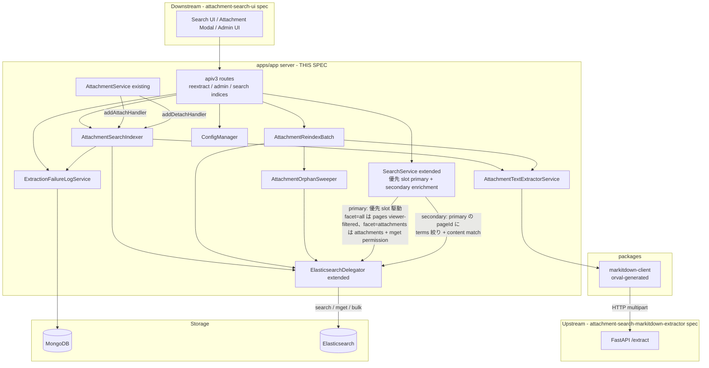
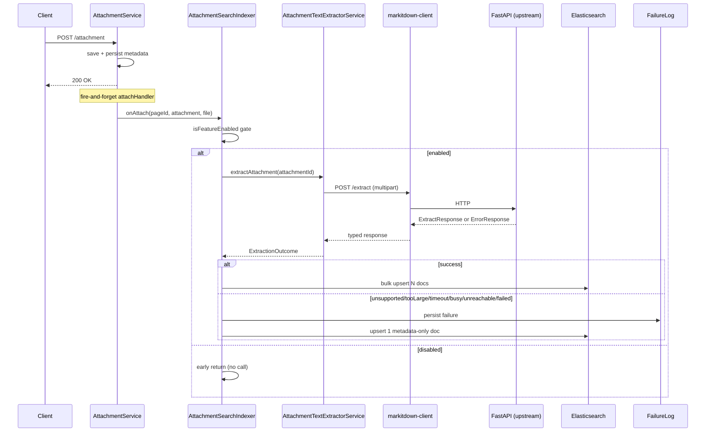
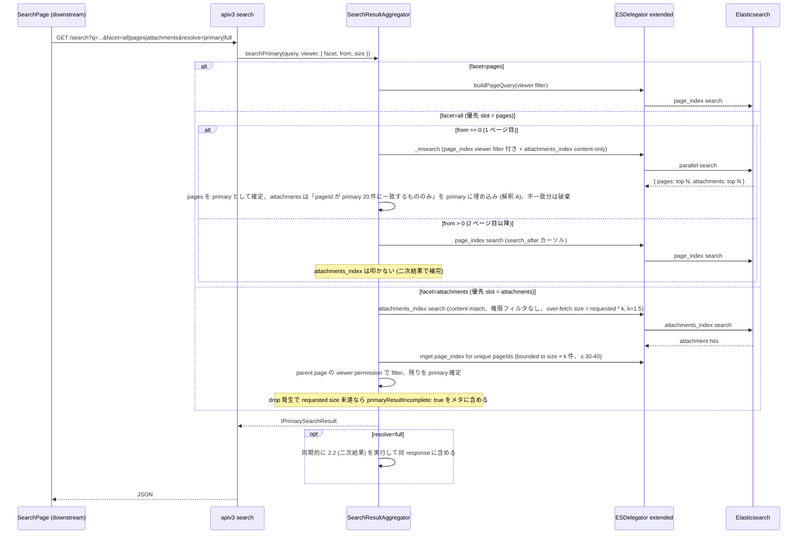
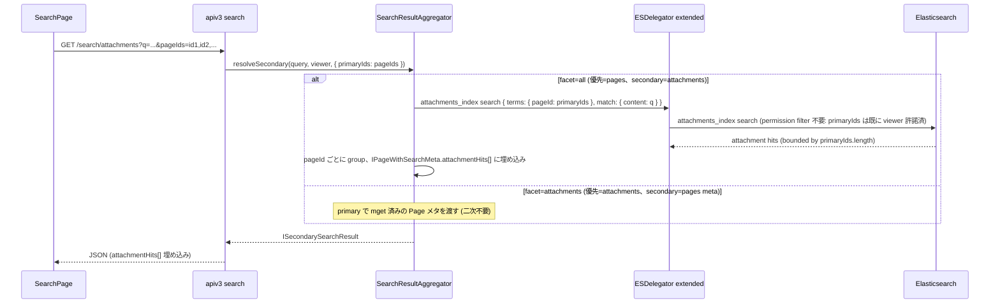
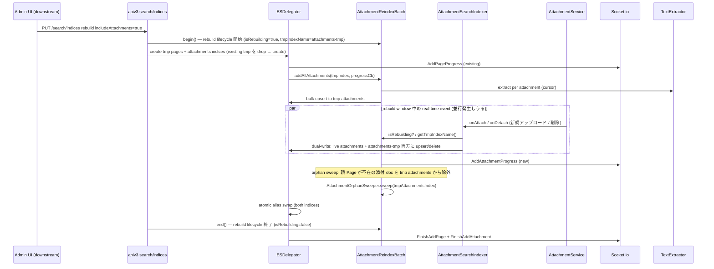
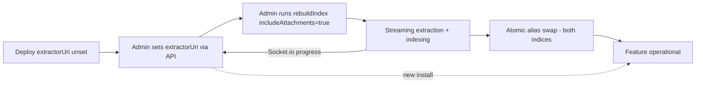

# Technical Design

## Overview

本 spec は GROWI 添付ファイル全文検索機能のうち **apps/app サーバ側の統合層** を定義する。上流 `attachment-search-markitdown-extractor` spec が提供する FastAPI 抽出マイクロサービスを `packages/markitdown-client` (orval 生成) 経由で呼び出し、添付ファイル専用 Elasticsearch インデックス (`attachments`) への書き込みを行う。既存の `AttachmentService` / `ElasticsearchDelegator` / `SearchService` / `ConfigManager` / `pageEvent` の拡張点を用い、独立サブシステムを作らずに feature module として統合する。

**Purpose**: apps/app 内で「抽出結果を ES へ upsert / 権限変更や削除を追従 / 一括再インデックスと個別再抽出を提供 / 検索クエリを multi-index で集約」する責務を完結させる。

**Users**: GROWI 利用者 (検索応答の受け取り)、GROWI 管理者 (admin API 経由の有効化・運用)、GROWI 配布/運用者 (Config 経由の接続先管理)。UI コンポーネント自体は下流 `attachment-search-ui` spec が描画する。

**Impact**: `apps/app/src/features/search-attachments/server/` の新設、新規パッケージ `packages/markitdown-client` の追加、`ElasticsearchDelegator` / `SearchService` / `AttachmentService` / `ConfigManager` / `pageEvent` への extension (最小差分)、応答型 `IPageWithSearchMeta` への optional フィールド追加。

### Goals

- 上流抽出サービス API 契約を `packages/markitdown-client` 経由で型安全に消費
- 添付の attach / detach / reextract / bulk を単一のインデクサで処理
- 親ページ権限変更は添付 ES 文書を更新せず、検索時に page_index から query-time lookup して反映 (Option D)
- multi-index msearch で Page と Attachment を並列クエリし、親ページ単位に集約
- 機能無効時に既存検索 API の挙動を機能導入前と完全一致させる
- 抽出サービス到達不可時も apps/app 本体は継続動作

### Non-Goals

- Python 抽出サービス本体・Dockerfile・k8s manifest (上流 `attachment-search-markitdown-extractor` spec)
- 検索結果 UI / 添付一覧モーダル UI / 管理画面 UI (下流 `attachment-search-ui` spec)
- 既存 Page 検索のクエリ・ランキング・権限モデル本体の改変
- 添付ファイル保管方式の変更
- 永続ジョブキュー化 (fire-and-forget を継続)
- チェックポイント再開型の bulk 再インデックス

## Boundary Commitments

### This Spec Owns

- `packages/markitdown-client` の orval 生成パイプラインと `openapi.json` drift 検知の CI 入口
- 抽出クライアントラッパ (`AttachmentTextExtractorService`) による失敗正規化と到達不可フォールバック
- 添付専用 ES インデックス `attachments` の mapping (ES 7/8/9) とライフサイクル (create / alias swap / bulk)。**添付 ES 文書に権限フィールドは保持しない** (`grant` / `granted_users` / `granted_groups` / `creator` を含まない)
- `AttachmentSearchIndexer` による attach / detach / reextract / bulk の単一パイプライン
- **優先 slot 駆動検索 + secondary enrichment 設計**: primary ページングは優先 slot (`pages` or `attachments`) 単独で発行し、permission 判定を常にページサイズ bounded に保つ。`facet=attachments` primary では親 Page を mget で取得して viewer filter、`facet=all` secondary では primary の pageId 配列に `terms` で絞った attachments_index 検索 (`SearchResultAggregator` が全体を統合)
- `AttachmentReindexBatch` による tmp index streaming 再インデックスと Socket.io 進捗イベント発行 (UI 描画は対象外)、および `AttachmentOrphanSweeper` の統合呼び出し (rebuildIndex 時に親 Page が不在の添付 doc を cleanup)
- `ExtractionFailureLogService` による MongoDB 永続化と集計 API
- `SearchService` extended による multi-index msearch / pageId 集約 / query-time permission lookup
- `IPageWithSearchMeta` への optional `attachmentHits[]` 追加 (サーバ応答契約)
- apiv3 エンドポイント群 (reextract / admin config / admin failures / search indices 拡張)
- Config キー群 (`app:attachmentFullTextSearch:extractorUri` / `:extractorToken` / `:timeoutMs` / `:maxFileSizeBytes` の 4 キー) の定義と永続化。`extractorToken` は encrypted storage (`app:openaiApiKey` と同パターン)、`enabled` は算出値に移行して Config からは削除、`maxConcurrency` は抽出サービス側の env var 専用とし Config からは削除
- Crowi 初期化での `initAttachmentFullTextSearch(crowi)` 配線
- `SearchConfigurationProps.searchConfig` SSR プロパティへの `isAttachmentFullTextSearchEnabled` フィールド追加と関連型 (`apps/app/src/pages/basic-layout-page/types.ts`) の拡張、および `getServerSideSearchConfigurationProps` のサーバ生成ロジック拡張 (非 admin 一般ユーザが SSR 時点で機能有効フラグを参照できる公式経路)

### Out of Boundary

- Python 抽出サービス本体、FastAPI ルータ、Dockerfile、docker-compose / k8s manifest、NetworkPolicy (**`attachment-search-markitdown-extractor` spec**)
- 検索結果 UI コンポーネント (`AttachmentHitCard` / `AttachmentSubEntry` / `SearchResultFacetTabs`)、添付モーダルの「再抽出」ボタン、管理画面 (`AttachmentSearchSettings` / `AttachmentExtractionFailures` / `RebuildWithAttachmentsCheckbox`)、ユーザ向けガイダンス文言 (**`attachment-search-ui` spec**)
- 添付ファイル保管方式 (`FileUploader` 抽象は据え置き)
- 既存 Page 検索 (Page/Comment) のクエリ・ランキング・権限モデル本体の改変
- `apps/pdf-converter` の責務・実装
- **添付 ES 文書への権限フィールド (grant / granted_users / granted_groups / creator) の保存**: 本 spec は権限を snapshot せず query-time に page_index を参照する方式を採るため、権限スナップショットは持たない
- **pageEvent 購読による添付 ES 権限同期リスナ**: Option D 採用により不要 (`AttachmentGrantSync` は本 spec に存在しない)。親 Page 権限変更は page_index の既存同期経路でのみ反映され、添付側への propagation は発生しない

### Allowed Dependencies

- **上流**: `attachment-search-markitdown-extractor` spec が提供する FastAPI OpenAPI spec (`POST /extract`、`ExtractResponse` / `ErrorResponse`)、Docker image、デプロイ manifest
- 既存 `AttachmentService.addAttachHandler` / `addDetachHandler` (ハンドラ登録のみ)
- 既存 `ElasticsearchDelegator` (composition で添付向けメソッド合成、既存 Page 系メソッドは不変)
- 既存 `SearchService.registerUpdateEvent()` (リスナ追加のみ)
- 既存 `FileUploader` (バイト取得のみ)
- 既存 `ConfigManager` / `config-definition.ts` (キー追加のみ)
- 既存 Socket.io progress channel (添付向けイベント名を追加)
- 既存 `pageEvent` の `updateMany` / `syncDescendantsUpdate` / page delete
- 既存 `IPageWithSearchMeta` (optional フィールド追加のみ)
- `pdf-converter-client` パターン (orval 設定の参考)

### Revalidation Triggers

- **上流 API 契約の変更** (`attachment-search-markitdown-extractor` spec): `POST /extract` の request/response schema、エラーコード enum、HTTP ステータス対応の変更 → `packages/markitdown-client` 再生成、`AttachmentTextExtractorService` の正規化ロジック再確認、drift 検知 CI の再評価
- **ES 添付 mapping のフィールド追加/削除**: 既存添付インデックスの再構築必要性判定、ES 7/8/9 mapping 変種の同期。特に権限フィールドを **再導入する変更は Option D の設計前提を覆す** ため、本 spec の本質的再検討が必要
- **`IPageWithSearchMeta.attachmentHits[]` / `IAttachmentHit` の形状変更**: 下流 `attachment-search-ui` spec に破壊的変更を強いるため、spec 再調整が必須
- **apiv3 エンドポイント契約** (reextract / admin config / admin failures / search indices 拡張) の request/response 変更: 下流 spec の SWR hook 再調整が必須
- **`filterPagesByViewer` の権限モデル本体の変更**: 本 spec は既存 Page 検索と同一の viewer フィルタを page_index に適用することで添付権限を解決しているため、page 側の権限モデル変更は添付検索の権限判定にも波及する
- **page_index の viewer フィルタクエリ構造の変更**: `buildAccessiblePageIdLookupQuery` は既存 Page 検索の filter 生成を流用するため、その内部構造変更は lookup クエリにも影響する
- **Config キー名の変更**: 既存環境の設定マイグレーション必要
- **`extractorUri` クリアによる soft-disable 挙動**: `extractorUri` を admin UI で空文字 / null にすると `isAttachmentFullTextSearchEnabled` (算出値) が `false` に遷移する。この「URI による soft-disable」挙動の意味論変更 (例: 空文字扱いの揺れ、trim の有無) は下流 `attachment-search-ui` spec の機能ゲート挙動に影響するため、変更時は下流 spec に通知が必要
- **Socket.io 進捗イベント名** (`AddAttachmentProgress` 等) の変更: 下流 UI spec の購読変更
- **`SearchConfigurationProps.searchConfig` の shape 変更** (フィールド追加/削除/rename): 下流 `attachment-search-ui` spec は SSR hydration 経路 (`basic-layout-page/hydrate.ts` での atom 書き込み、下流が追加する Jotai atom / SWR fallback の初期値配線) を再確認する必要がある

## Architecture

### Existing Architecture Analysis

- apps/app は Next.js Pages Router + Express モノリス。`server/service/*` が既存責務の中心
- ES 連携は `ElasticsearchDelegator` に集約され、ES 7/8/9 の互換レイヤが version-specific mapping で提供されている
- `AttachmentService` はハンドラ登録型拡張点を提供し、OpenAI Vector Store 連携が既に同パターンで同居 (fire-and-forget、例外握りつぶし)
- `registerUpdateEvent()` は `pageEvent` の `updateMany` / `syncDescendantsUpdate` を購読し Page index を同期
- Config は `ConfigManager` + MongoDB `Config` model で永続化、`config-definition.ts` に型定義を並べる
- `rebuildIndex()` は tmp index → alias swap パターン、Socket.io (`AddPageProgress` / `FinishAddPage` / `RebuildingFailed`) で進捗通知

### Architecture Pattern & Boundary Map

採用パターン: **既存システム拡張 + feature module 新設 (composition-based)**。独立 delegator やジョブキュー基盤を作らず、既存パターンに相乗りする。



**Architecture Integration**:
- **選定パターン**: 既存拡張優先 (独立 delegator / ジョブキュー不採用)
- **ドメイン/境界**: 「抽出クライアント」「indexer」「reindex batch」「orphan sweeper」「検索集約 (query-time permission lookup を含む)」を feature module 内で分離し、それぞれ単一責任を維持。添付側の権限同期 (AttachmentGrantSync) は **Option D 採用により設計上不要**
- **依存方向**: apiv3 → service/indexer → (TextExtractor | ESDelegator) → (markitdown-client → 上流 | ES / Mongo)。逆流なし
- **既存パターン維持**: AttachmentService ハンドラ仕様、ESDelegator のライフサイクル、Socket.io progress、apiv3 ルーティング、Config 定義、**`basic-layout-page/get-server-side-props/search-configurations.ts` の `searchConfig` SSR props パターン**
- **Steering 準拠**: feature-based 配置、名前付き export、pino ログ、immutable 更新、pure 関数抽出 (msearch body builder)

**機能有効フラグの参照経路 (primary vs secondary)**:
- **Primary**: 非 admin を含む全ユーザ向けには、既存 `searchConfig` SSR props パターンを拡張した `SearchConfigurationProps.searchConfig.isAttachmentFullTextSearchEnabled` を唯一の公式参照経路とする。basic-layout-page 経由のため全ページで SSR 時点に届く
- **Secondary (間接シグナル)**: 検索応答 `IPageWithSearchMeta.attachmentHits` の optional な存在自体は「機能が有効化されかつ検索パイプラインが通った」ことの**間接シグナル**として利用可能だが、これは Primary にはしない。理由: (a) 機能有効でも facet によっては attachments msearch がスキップされる、(b) 閾値超過時の safety net で削除されうる、(c) 初回レンダ時は検索前で応答が無い。したがって UI の feature gate は必ず SSR `searchConfig.isAttachmentFullTextSearchEnabled` を参照する
- **Admin 向け**: admin 画面では引き続き `GET /_api/v3/admin/attachment-search/config` を真実の源とする (SSR prop は描画ゲート用で、書き込み系は admin API 経由)

### Technology Stack

| Layer | Choice / Version | Role in Feature | Notes |
|-------|------------------|-----------------|-------|
| Server runtime | Node 22 / Express / pino | indexer / 権限 sync / reindex batch / apiv3 | 既存スタック踏襲 |
| HTTP client | axios (orval 生成) | 抽出サービス呼び出し | server 専用依存 |
| Client package | `packages/markitdown-client` (orval 生成) | 上流 OpenAPI → TS クライアント | `pdf-converter-client` 同パターン |
| Data — search | Elasticsearch 7/8/9 (既存) | 添付専用 index `attachments` | 既存 Page index とは別 index |
| Data — log | MongoDB (既存) | `extractionFailureLogs` collection | TTL index 90 日 |
| Messaging | Socket.io (既存) | 一括再インデックス進捗 | 添付向けイベント名を追加 |

## File Structure Plan

### Directory Structure

```
apps/app/src/features/search-attachments/
├── server/
│   ├── index.ts                                   # initAttachmentFullTextSearch(crowi)
│   ├── services/
│   │   ├── attachment-text-extractor.ts           # markitdown-client wrapper
│   │   ├── attachment-search-indexer.ts           # attach/detach/reextract 単一窓口
│   │   ├── attachment-search-delegator-extension.ts  # ESDelegator 拡張 (composition)
│   │   ├── attachment-reindex-batch.ts            # bulk reindex + Socket.io progress + orphan sweeper invocation
│   │   ├── attachment-orphan-sweeper.ts           # rebuildIndex 内から呼ぶ orphan cleanup (real-time cascade は不要)
│   │   ├── attachment-search-result-aggregator.ts # 優先 slot 駆動 primary + secondary enrichment、permission 判定は page サイズ bounded
│   │   └── extraction-failure-log-service.ts      # Mongo CRUD / 集計
│   ├── models/
│   │   └── extraction-failure-log.ts              # Mongoose schema (TTL)
│   ├── mappings/
│   │   ├── attachments-mappings-es7.ts
│   │   ├── attachments-mappings-es8.ts
│   │   └── attachments-mappings-es9.ts
│   ├── queries/
│   │   ├── build-attachment-search-query.ts       # attachments_index content match body builder (primary/secondary 両方で利用)
│   │   ├── build-attachments-by-page-ids-query.ts # secondary 用: terms: { pageId: primaryIds } + content match body builder
│   │   └── build-snippet-segments.ts              # ES highlighter の <em> タグ入り文字列を ISnippetSegment[] にパース (XSS 防御 DTO 変換、pure function)
│   ├── routes/apiv3/
│   │   ├── attachment-reextract.ts                # POST /attachments/:id/reextract
│   │   ├── search-attachments.ts                  # GET /search/attachments (secondary enrichment endpoint)
│   │   └── attachment-search-admin.ts             # GET /failures, GET|PUT /config
│   └── middlewares/
│       └── require-search-attachments-enabled.ts
└── interfaces/
    └── attachment-search.ts                       # IAttachmentHit, IAttachmentEsDoc, ExtractionOutcome DTOs

packages/markitdown-client/
├── orval.config.js
├── openapi.json                                   # 上流 spec が export、commit 必須 (PR レビューで schema 変更を可視化)
├── package.json
└── src/
    ├── index.ts                                   # re-export generated、commit する (pdf-converter-client 同パターン)
    └── generated/                                 # orval 出力、commit する (build 時に再生成されるが diff check で drift を検知)
```

#### OpenAPI / orval drift 検知パイプライン

- **openapi.json**: 上流 `services/markitdown-extractor/scripts/export_openapi.py` が `packages/markitdown-client/openapi.json` を直接上書き生成。**commit 必須**
- **orval 生成物 (`src/`)**: 本 spec の responsibility として commit する。開発者が `openapi.json` 更新時に orval を実行して commit、または CI が regenerate → diff check
- **Python CI (上流 spec)**: `export_openapi.py` 実行 + `git diff --exit-code packages/markitdown-client/openapi.json` で drift 検知
- **Node CI (本 spec)**: orval 実行 + `git diff --exit-code packages/markitdown-client/src/` で drift 検知
- **turbo 依存での build 時再生成は不使用**: `services/` が pnpm workspace / turbo pipeline 外であるため、`pdf-converter-client` のような `dependsOn: ["@growi/pdf-converter#gen:swagger-spec"]` パターンは適用不可。commit artifact + 両 CI diff check が言語境界を跨ぐための最適解

### Modified Files

- [apps/app/src/server/crowi/index.ts](apps/app/src/server/crowi/index.ts) — `initAttachmentFullTextSearch(this)` を searchService / attachmentService 初期化後に追加
- [apps/app/src/server/service/search.ts](apps/app/src/server/service/search.ts) — 優先 slot 駆動 primary + secondary enrichment 経路を `AttachmentSearchResultAggregator` として追加。`registerUpdateEvent()` への権限変更リスナ追加は **不要** (Option D は query-time 方式のため)
- [apps/app/src/server/service/search-delegator/elasticsearch.ts](apps/app/src/server/service/search-delegator/elasticsearch.ts) — `attachment-search-delegator-extension` との合成 (既存 Page 系メソッドは不変)
- [apps/app/src/server/service/config-manager/config-definition.ts](apps/app/src/server/service/config-manager/config-definition.ts) — `app:attachmentFullTextSearch:*` 4 キー追加 (`extractorUri` / **`extractorToken` (encrypted storage、write-only)** / `timeoutMs` / `maxFileSizeBytes`)。各キーの env var 名: `GROWI_MARKITDOWN_EXTRACTOR_URI` / `GROWI_MARKITDOWN_SERVICE_TOKEN` / `GROWI_MARKITDOWN_TIMEOUT_MS` / `GROWI_MARKITDOWN_MAX_FILE_SIZE_BYTES`。`enabled` / `maxConcurrency` は Config キーとしては提供せず、前者は算出値、後者は抽出サービス側の env var 専用。加えて `ENV_ONLY_GROUPS` に `env:useOnlyEnvVars:app:attachmentFullTextSearch` エントリを追加し、control env var `MARKITDOWN_USES_ONLY_ENV_VARS_FOR_SOME_OPTIONS=true` で 4 キー全てを env-only 強制できるようにする (マルチテナント向け詳細は下記「ENV_ONLY_GROUPS エントリ」参照)
- [apps/app/src/interfaces/search.ts](apps/app/src/interfaces/search.ts) — `IPageWithSearchMeta.attachmentHits?: IAttachmentHit[]` (optional) を追加
- [apps/app/src/server/routes/apiv3/search.js](apps/app/src/server/routes/apiv3/search.js) — `PUT /search/indices` に `includeAttachments` フラグを受理
- [apps/app/src/pages/basic-layout-page/get-server-side-props/search-configurations.ts](apps/app/src/pages/basic-layout-page/get-server-side-props/search-configurations.ts) — `getServerSideSearchConfigurationProps` を拡張し、`searchService.isConfigured` と `ConfigManager.getConfig('app:attachmentFullTextSearch:extractorUri')` から算出した `searchConfig.isAttachmentFullTextSearchEnabled` を SSR props に含める (既存フィールドは非破壊)
- [apps/app/src/pages/basic-layout-page/types.ts](apps/app/src/pages/basic-layout-page/types.ts) — `SearchConfigurationProps.searchConfig` 型に `isAttachmentFullTextSearchEnabled: boolean` フィールドを追加 (既存 `isSearchServiceConfigured` / `isSearchServiceReachable` / `isSearchScopeChildrenAsDefault` は据え置き)

> UI コンポーネント・管理画面 tsx / hook 系の改変は下流 `attachment-search-ui` spec に委譲。本 spec では SSR props の**サーバ側生成と型定義の追加**のみを担当し、その hydration 経路と Jotai atom / SWR fallback 配線などのクライアント側消費は下流 spec が扱う。

## System Flows

### 1. 添付アップロード → 抽出 → インデックス



Key decisions:
- `serviceUnreachable` / `timeout` / `serviceBusy` を明示的に分類し UI 側メッセージ分岐を可能にする
- 機能無効時は indexer が早期 return、抽出サービスへの呼び出しは一切行わない (R5 AC 5.4 互換性)

### 2. 検索実行 (優先 slot 駆動 + 二次結果オプション)

**モデル**: 2-slot msearch + app 側スコア統合ではなく、**優先 slot (primary) 駆動のページング + 非優先 slot の二次結果 (secondary) enrichment** による 2 段階モデルを採用。Page/Attachment のスコア尺度を混ぜない、ページング状態を単一 slot に帰属させる、permission lookup の対象を常にページサイズに bounded する、という 3 点の設計単純化が動機。

facet 値との対応 (外部 API の名称は不変、UI spec `activeFacetAtom` と互換):

| facet | 優先 slot | secondary 解決 | ユースケース |
|---|---|---|---|
| `pages` | pages のみ | なし | 従来の Page 検索完全互換 (attachments_index を一切叩かない) |
| `all` (default) | pages (slot A) | あり | デフォルト統合検索。Page ヒットをページング基準とし、その同一ページに紐づく添付ヒットを埋め込む |
| `attachments` | attachments (slot B) | あり | 添付中心検索。添付ヒットをページング基準とし、親 Page メタを埋め込む |

#### 2.1 一次結果 (primary) の取得



**Key decisions**:
- 優先 slot のみがページングカーソル (`search_after` 推奨、`from+size` も過渡期は許容) を保持。非優先 slot はページ 1 のみ補助取得、ページ 2 以降は完全に二次結果に委ねる
- permission lookup は **常にページサイズ bounded** (`facet=attachments` の場合 size × k ≤ 40 件程度の mget のみ)。`missingPageIds` terms クエリ爆発は構造的に発生しない
- `facet=all` の 1 ページ目で取得した非優先 slot の 20 件のうち、優先 slot の 20 件と pageId が一致しない分は破棄 (解釈 A)。漏れた添付ヒットは facet=`attachments` 切替で捕捉する UX を UI spec 側で誘導 (Slot B 優先モード案内)
- `facet=attachments` で permission filter drop により primary 件数が requested size 未達になる場合、レスポンスに `primaryResultIncomplete: true` と `nextCursor` を含め、UI は「検索結果が不足しています。追加読み込み」ボタンで手動で次ページ取得を促す (auto retry は行わない)

#### 2.2 二次結果 (secondary) の enrichment

一次結果が確定した時点で、その 20 件 (ページサイズ) に紐づく非優先 slot 情報を取得して enrichment する:



**Key decisions**:
- `primaryIds` (= primary 結果の pageId 配列、常に ≤ ページサイズ 20 件) を caller から受け取る (client 側で保持、API は stateless)
- secondary の permission 再チェック不要: `primaryIds` は既に viewer filter を通過済みのため
- terms クエリは常に ≤ 20 件 → `max_terms_count` / `max_clause_count` 懸念なし
- facet=`pages` は secondary を呼ばない (attachments_index を一切参照しない従来通りの経路)

#### 2.3 API 呼び出しパターン (アプリ実装)

- **デフォルト UX**: 1 roundtrip で primary 取得 → UI 描画 → 非同期で `/search/attachments` 呼び出し → 添付ヒット enrichment 描画 (progressive enhancement)
- **同期 UX (シェア URL プレビュー、サーバサイド描画等)**: `?resolve=full` で primary + secondary を 1 response で同期返却
- **2 ページ目以降**: primary のみ (優先 slot) → 同様に secondary を非同期 enrichment

**rebuild window 中のページング整合性は非保証** (`Migration Strategy § rebuild window 中のユーザー検索・ページングの整合性` 参照)。alias swap をまたぐ連続リクエストで重複/欠落/順序不整合が発生しうるが、管理者操作であり UI 側の進行通知で UX を degrade する方針。

### 3. 親ページ権限変更 → 検索時に自動反映 (コード不要)

**Option D 採用により、添付 ES 文書への partial update は発生しない**。親 Page の権限変更は既存 page_index の同期経路で反映され、次回検索実行時に Flow 2 の primary (facet=`all` では pages viewer-filter / facet=`attachments` では mget permission 判定) および secondary (primaryIds が既に viewer 許諾済) が最新の page_index を参照することで、添付ヒットの可視性も自動的に更新される。sync drift による snippet 漏洩は構造的に発生しない (権限情報を添付側に snapshot していないため)。

### 4. 個別再抽出 (UI → API → Indexer)

`POST /_api/v3/attachments/:id/reextract` で apiv3 が (admin OR page editor) ガード後、`AttachmentSearchIndexer.reindex(attachmentId)` を**同期呼び出し**し、`ExtractionOutcome` を HTTP レスポンスにマップする。Flow 1 の抽出経路を再利用する。機能無効時は 503 feature_disabled。

**Editor 権限判定の current grant 再チェック**: 「page editor」判定は middleware pipeline ではなく **handler 内でリクエスト時点の page_index (or Page collection) を参照して都度判定** する。session cache や middleware で事前解決した `isPageEditor` フラグは使わない (権限失効後の古い判定が残る可能性があるため)。具体的には:
1. attachment から `pageId` を取得
2. 親 Page の `grant` / `grantedUsers` / `grantedGroups` / `creator` を参照
3. `viewer` が現在の権限モデルで edit 可能かを `filterPagesByViewer` と同等の判定ロジックで評価
4. 不可なら 403 forbidden

これにより、権限 demote された editor が session 残存を利用して不正 reextract するシナリオを防ぐ。

### 5. 一括再インデックス (rebuildIndex with attachments)



Key decisions:
- Page と Attachment の再構築は直列 (Page 完了後に Attachment 開始、性能検証後に並列化を enhancement 判断)
- 個別失敗はスキップして FailureLog に残し batch 継続
- includeAttachments=false の場合は従来どおり Page/Comment のみ処理し既存 `attachments` alias は据え置き
- 中断時は alias swap 未実行のまま旧 index 維持、tmp index は orphan として残存 (次回実行の先頭で drop)。`Batch.end()` を常に finally 節で呼び、例外経路でも `isRebuilding=false` に戻す (rebuild lifecycle の leak 防止)
- **rebuild window 中の dual-write (新規)**: `AttachmentSearchIndexer.onAttach/onDetach` が `AttachmentReindexBatch.isRebuilding()` を参照し、true の間は live alias (`attachments`) と tmp index (`attachments-tmp`) の**両方**に書き込む。これにより alias swap 後に新規アップロードが消失しない。既存 Page 側 [elasticsearch.ts:277,384](apps/app/src/server/service/search-delegator/elasticsearch.ts#L277) と同パターン
- **dual-write の冪等性**: tmp index への書き込みは、bulk upsert が後から同 `_id` で上書きする可能性があるが、doc ID が `${attachmentId}_${pageNumber ?? 0}` で決定的なため順序に依存しない。bulk 側が後勝ちでも real-time 側が後勝ちでも最終状態は同一
- **dual-write 失敗時**: tmp 側 write の失敗は live 側の成功を阻害しない (pino 記録して continue)。alias swap 後は live が単一 source になり自動的に整合
- **orphan sweeper**: real-time cascade (pageEvent 購読による即時削除) は採用しない。rebuildIndex 時に `AttachmentOrphanSweeper` が MongoDB Page collection と照合して親 Page 不在の添付 doc を eventual に cleanup する。query-time permission 判定により、sweeper 実行までの間も snippet 漏洩は発生しない (`facet=attachments` primary の mget で親 Page 不在 → 該当添付ヒットを drop、`facet=all` secondary の terms クエリは primaryIds = viewer 許諾済ページに限定されるため孤児添付は含まれない)
- **sweep タイミング**: sweep は tmp への bulk 完了後、alias swap**前**に実行する (従来どおり)。rebuild window 中の real-time `onAttach` で追加された doc は `AttachmentService` 自身が Attachment モデルを作成する前提なので、MongoDB の Page collection に親 Page が存在する限り orphan にはならない。rebuild window 中の親 Page 削除は real-time cascade しない設計のため、次回 rebuild で eventual cleanup される (query-time permission により漏洩は防止される)

## Requirements Traceability

| Requirement | Summary | Components | Interfaces | Flows |
|-------------|---------|------------|------------|-------|
| 1.1 | 抽出失敗時も添付保存継続 | AttachmentSearchIndexer (catch & fallback) | — | Flow 1 |
| 1.2 | 構造化ログ | AttachmentSearchIndexer + pino | — | — |
| 1.3 | 到達不可時も継続 | AttachmentTextExtractorService catch-all | — | Flow 1 |
| 1.4 | serviceUnreachable 正規化 | AttachmentTextExtractorService | `ExtractionOutcome` | — |
| 2.1 | 自動インデックス化 | AttachmentSearchIndexer.onAttach | `AttachmentService.addAttachHandler` | Flow 1 |
| 2.2 | 1 添付 = N 文書 | ES attachments mapping + bulk upsert | Logical Data Model | Flow 1 |
| 2.3 | URI 未設定時の完全互換 | isFeatureEnabled gate (算出値) | `searchService.isConfigured && extractorUri != null && extractorUri !== '' && extractorToken != null && extractorToken !== ''` | — |
| 2.4 | 失敗時メタデータのみ登録 | AttachmentSearchIndexer fallback | — | Flow 1 |
| 2.5 | 文書フィールド定義 (権限フィールドを**持たない**) | ES attachments mapping (grant/granted_users/granted_groups/creator なし) | Logical Data Model | — |
| 3.1 | 添付削除連動 | AttachmentSearchIndexer.onDetach | `addDetachHandler` | — |
| 3.2 | 親ページ削除連動 (eventual cleanup) | AttachmentOrphanSweeper (rebuildIndex 時) + query-time permission (primary mget / secondary の primaryIds 制限) による即時的ヒット除外 | queries/build-attachments-by-page-ids-query, mgetPagesForPermissionBody | Flow 5 / Flow 2 (優先 slot 駆動) |
| 3.3 | 権限変更連動 (query-time) | query-time permission (primary の viewer filter / mget permission 判定、secondary の primaryIds 制限) — **添付 ES 文書は更新しない** | mgetPagesForPermissionBody | Flow 2 (優先 slot 駆動) / Flow 3 (コード不要) |
| 3.4 | 削除/orphan sweep 失敗ログ | pino + FailureLogService | — | — |
| 4.1 | viewer フィルタ (query-time) | build-attachment-search-query (content-only) + build-attachments-by-page-ids-query (secondary) + mgetPagesForPermissionBody (primary permission 判定) + AttachmentSearchResultAggregator (優先 slot 駆動 + enrichment) | — | Flow 2 |
| 4.2 | 権限変更後反映 (query-time) | query-time permission lookup (page_index 参照) | — | Flow 2 (優先 slot 駆動) |
| 4.3 | Page と同一権限モデル | 既存 `filterPagesByViewer` を page_index への lookup にそのまま適用 | — | Flow 2 (優先 slot 駆動) |
| 4.4 | 孤児添付除外 (query-time) | primary 側 mget permission 判定 (親 Page 不在なら drop) + secondary 側 primaryIds 制限 (viewer 許諾済ページのみ) + orphan sweeper (eventual cleanup) | mgetPagesForPermissionBody, build-attachments-by-page-ids-query | Flow 2 (優先 slot 駆動) / Flow 5 |
| 5.1 | URI 設定による有効化 (算出値) | ConfigManager + config-definition (`extractorUri` 等 3 キー) + SearchConfigurationProps 拡張 (SSR、算出値を公開) | `searchConfig.isAttachmentFullTextSearchEnabled` (算出) | — |
| 5.2 | 設定値永続化 + admin API | apiv3 admin config | `GET/PUT /admin/attachment-search/config` (`extractorUri` / `timeoutMs` / `maxFileSizeBytes`) | — |
| 5.3 | 再インデックス必要性フラグ | admin config response flag | — | — |
| 5.4 | URI 未設定時は検索に含めない | isFeatureEnabled gate (query side 算出値) + SearchConfigurationProps 拡張 (UI ゲート用 SSR 公開) | `searchConfig.isAttachmentFullTextSearchEnabled` | Flow 2 |
| 5.5 | URI 未設定時も添付保存継続 | AttachmentService 本体は無変更 | — | — |
| 6.1 | 添付再インデックス実施 | AttachmentReindexBatch | — | Flow 5 |
| 6.2 | 個別失敗時スキップ | AttachmentReindexBatch try/catch | — | Flow 5 |
| 6.3 | 進捗 Socket.io | Socket.io `AddAttachmentProgress` / `FinishAddAttachment` | — | Flow 5 |
| 6.4 | 中断時 alias 不変 | AttachmentReindexBatch alias swap last | — | Flow 5 |
| 7.1 | 再抽出エンドポイント | AttachmentSearchIndexer.reindex | `POST /attachments/:id/reextract` | Flow 4 |
| 7.2 | 権限ガード | apiv3 middleware (admin OR page editor) | — | — |
| 7.3 | 無効時 503 | require-search-attachments-enabled middleware | — | — |
| 7.4 | Outcome レスポンス | apiv3 response shape | `{ outcome: ExtractionOutcome }` | — |
| 8.1 | 失敗ログ pino | AttachmentSearchIndexer + FailureLogService | — | — |
| 8.2 | 監視メトリクス | OpenTelemetry 既存パイプライン | — | — |
| 8.3 | Mongo 永続化 + TTL | ExtractionFailureLog Mongoose schema | — | — |
| 8.4 | 失敗取得 API | apiv3 admin failures | `GET /admin/attachment-search/failures` | — |
| 9.1 | 無効時完全互換 | isFeatureEnabled gate 全経路 | — | — |
| 9.2 | Page index 非劣化 | 添付は別 index、Page mapping 不変 | — | — |
| 9.3 | API 後方互換 | `IPageWithSearchMeta.attachmentHits` optional | — | — |
| 9.4 | optional フィールド | `interfaces/search.ts` 差分 | — | — |

## Components and Interfaces

### Summary

| Component | Domain/Layer | Intent | Req Coverage | Key Dependencies (P0/P1) | Contracts |
|-----------|--------------|--------|--------------|--------------------------|-----------|
| MarkitdownClient (packages) | Package (TS) | 抽出 API の型安全クライアント (orval 生成) | 2.1, 6.1, 7.1, 1.3 | orval (P0), upstream FastAPI (P0) | Service |
| AttachmentTextExtractorService | Server | クライアント wrapper + 失敗正規化 + 到達不可 fallback | 1.1, 1.2, 1.3, 1.4, 2.1 | MarkitdownClient (P0), FileUploader (P0) | Service |
| AttachmentSearchIndexer | Server | attach/detach/reextract/bulk の単一窓口、rebuild window 中は live + tmp への dual-write | 2.1–2.5, 3.1, 3.4, 7.1 | TextExtractor (P0), ESDelegator extension (P0), AttachmentReindexBatch (P0, lifecycle 参照), FailureLogService (P1) | Service, Event |
| AttachmentOrphanSweeper | Server | rebuildIndex 内で親 Page 不在の添付 doc を eventual cleanup | 3.2, 4.4 | Page model (P0), ESDelegator extension (P0) | Batch |
| AttachmentReindexBatch | Server | 一括再インデックス streaming + progress + orphan sweeper 統合 + rebuild lifecycle (`begin/end/isRebuilding/getTmpIndexName`) 公開 | 6.1, 6.2, 6.3, 6.4 | TextExtractor (P0), ESDelegator extension (P0), AttachmentOrphanSweeper (P0), Socket.io (P1) | Batch |
| ElasticsearchDelegator extension | Server | 添付 index mapping / bulk / msearch 構築 (権限フィールドなし) | 2.2, 2.5, 3.1, 4.1, 6.1, 9.2 | 既存 ESDelegator (P0), ES client (P0) | Service |
| ExtractionFailureLogService | Server | 失敗の Mongo 永続化 + 集計 | 3.4, 8.1, 8.3, 8.4 | ExtractionFailureLog model (P0) | Service |
| AttachmentSearchResultAggregator | Server | 優先 slot 駆動 primary + secondary enrichment、permission 判定は page サイズ bounded | 3.3, 4.1, 4.2, 4.3, 4.4, 9.1, 9.3 | ESDelegator extension (P0), buildAttachmentsByPageIdsQuery (P0) | Service |
| apiv3: attachment-reextract | Server | `POST /attachments/:id/reextract` | 7.1, 7.2, 7.3, 7.4 | AttachmentSearchIndexer (P0) | API |
| apiv3: search-attachments | Server | `GET /search/attachments` (secondary enrichment) | 4.1, 9.1, 9.3 | AttachmentSearchResultAggregator (P0) | API |
| apiv3: attachment-search-admin | Server | failures / config 取得更新 | 5.1, 5.2, 5.3, 8.4 | ConfigManager (P0), FailureLogService (P0) | API |
| apiv3: search indices extended | Server | `includeAttachments` フラグ受理 | 6.1 | AttachmentReindexBatch (P0) | API |
| Response type (`IPageWithSearchMeta`) | Interface | optional `attachmentHits[]` 追加 | 9.3, 9.4 | 既存 interfaces/search.ts (P0) | Contract |
| SearchConfigurationProps 拡張 | SSR props / Interface | 非 admin 一般ユーザ向けに機能有効フラグを SSR 経路で公開 | 5.1, 5.4 | ConfigManager (P0), 既存 basic-layout-page SSR (P0) | Contract, SSR |

### AttachmentTextExtractorService

| Field | Detail |
|-------|--------|
| Intent | MarkitdownClient のラッパ。バイト取得、タイムアウト、エラー正規化、到達不可時 fallback |
| Requirements | 1.1, 1.2, 1.3, 1.4, 2.1 |

**Responsibilities & Constraints**
- FileUploader からバイトを取得し `markitdown-client` に multipart 送信
- **503 `service_busy` retry (burst 耐性)**: 上流が 503 `service_busy` を返した場合、exponential backoff + jitter で**最大 1 回だけ retry** (default 500ms + jitter(0-500ms) 待機)。2 回目も 503 なら `serviceBusy` として正規化し ExtractionFailureLog に記録。retry 回数と base delay は `AttachmentSearchService` の設定可能定数として export (テスト容易性)。複雑な queue / BullMQ は初期実装では導入しない (k8s HPA が pod 増設で対応する前提)
- **Bearer auth**: 呼び出しごとに `configManager.getConfig('app:attachmentFullTextSearch:extractorToken')` を取得し `Authorization: Bearer <token>` ヘッダに付与。token 未設定時は `isFeatureEnabled()` 段階で早期 return するので通常は到達しないが、保険として未設定検出時は `serviceUnreachable` 正規化
- **extractorUri DNS rebinding 対策 (metadata IP のみ)**: 送信前に URI の host を DNS 解決し、結果がクラウドメタデータ endpoint IP literal (`169.254.169.254` / `fd00:ec2::254` / `100.100.100.200` / `192.0.0.192`) のいずれかに解決される場合のみ request を送らず `serviceUnreachable` 正規化。k8s 内部 DNS / loopback / RFC1918 への解決は許可
- **Bearer auth 失敗**: 上流 401 `unauthorized` は `extraction_failed` ではなく**`serviceUnreachable` に正規化** (機能を soft-disable 相当に degrade、admin が token 不整合に気付くよう pino ERROR ログ + ExtractionFailureLog 記録)。token 回転中の一時的な不一致も自動的に failing open せず、新 token が伝搬するまで抽出は停止。**pino ログ出力時は `Authorization` ヘッダ値をログオブジェクトに含めない** (request オブジェクトや headers をそのまま渡さない。token が共有リソースである extractor へのアクセス権そのものであるため、ログ経由の漏洩を防ぐ)
- ネットワーク層エラーと抽出サービスエラーコードを `ExtractionOutcome` に統一正規化
- 到達不可時に catch-all し `serviceUnreachable` を返す (throw しない)

**Contracts**: **Service [x]**

```typescript
export type ExtractionOutcome =
  | { kind: 'success'; pages: ExtractedPage[]; mimeType: string }
  | { kind: 'unsupported'; mimeType: string }
  | { kind: 'tooLarge'; fileSize: number }
  | { kind: 'timeout' }
  | { kind: 'serviceBusy' }
  | { kind: 'serviceUnreachable' }
  | { kind: 'failed'; reasonCode: string; message: string };

export interface ExtractedPage {
  readonly pageNumber: number | null;
  readonly label: string | null;
  readonly content: string;
}

export interface AttachmentTextExtractorService {
  extractAttachment(attachmentId: string): Promise<ExtractionOutcome>;
}
```

- Preconditions: 対象 attachment が存在し FileUploader 経由でバイト取得可能
- Postconditions: ネットワーク障害時も throw せず `serviceUnreachable` を返す
- Invariants: 1 呼び出し = 1 multipart request (ストリーミング不採用)

### AttachmentSearchIndexer

| Field | Detail |
|-------|--------|
| Intent | attach/detach/reextract/bulk の単一パイプライン窓口 |
| Requirements | 2.1, 2.2, 2.3, 2.4, 2.5, 3.1, 3.4, 7.1 |

**Responsibilities & Constraints**
- `isFeatureEnabled()` チェック → ON 時のみ抽出呼び出し、OFF 時は早期 return。判定式は `searchService.isConfigured && extractorUri != null && extractorUri !== '' && extractorToken != null && extractorToken !== ''` (独立した `enabled` Config キーは持たず算出値。token 未設定時も機能無効として扱い、Bearer auth を構造的に強制)
- 成功時: ES `attachments` (live alias) に bulk upsert (1 添付 = N 文書)。**権限フィールドは一切書き込まない** (Option D)
- 失敗時 (unsupported / tooLarge / timeout / busy / unreachable / failed): metadata-only 1 文書 + FailureLog 永続化
- `onDetach(attachmentId)` で `attachmentId` キーの全文書削除
- **rebuild window 中の dual-write**: `reindexBatch.isRebuilding()` が true の間、`onAttach`/`onDetach` は live alias と tmp index (`reindexBatch.getTmpIndexName()` が返す `attachments-tmp`) の**両方**に書き込む。live 側が真の source、tmp 側は alias swap 後の continuity 担保のための補助書き込み。tmp 側 write 失敗は live 側の成功を阻害せず pino 記録のみ
- **親 Page 削除の real-time cascade は行わない** (`onPageDeleted` は本 contract に含めない)。親 Page 不在添付は query-time permission 判定でヒットから除外され、eventual cleanup は `AttachmentOrphanSweeper` が rebuildIndex 時に担う

**Contracts**: **Service [x]** / **Event [x]**

```typescript
export interface AttachmentSearchIndexer {
  onAttach(pageId: string | null, attachment: IAttachmentDocument, file: Express.Multer.File): Promise<void>;
  onDetach(attachmentId: string): Promise<void>;
  reindex(attachmentId: string): Promise<{ ok: boolean; outcome: ExtractionOutcome }>;
  // Note: onPageDeleted is NOT part of this contract under Option D.
  // Parent-page deletion is handled by:
  //   (1) query-time permission judgement (hits for missing pages are filtered out immediately), and
  //   (2) AttachmentOrphanSweeper (eventual cleanup during rebuildIndex).
}
```

- Subscribed: `AttachmentService` attach / detach
- Dependencies: `AttachmentReindexBatch` (rebuild lifecycle 問い合わせ用。`isRebuilding()` / `getTmpIndexName()`)
- Ordering: fire-and-forget (既存 OpenAI vector store 連携と同パターン)
- Idempotency: `${attachmentId}_${pageNumber ?? 0}` を doc ID として upsert 冪等。dual-write で live と tmp 双方に同 ID で書き込まれても、最終的な bulk upsert が後勝ち/先勝ちいずれでも同一結果に収束

**Implementation Notes**: Crowi 初期化で `attachmentService.addAttachHandler(indexer.onAttach)` / `addDetachHandler(indexer.onDetach)` を登録。fire-and-forget 特性下でも FailureLog と pino を確実に呼ぶ設計。dual-write 判定は毎 event 時に `reindexBatch.isRebuilding()` を同期参照 (in-memory boolean、ロック不要)。

### AttachmentOrphanSweeper

| Field | Detail |
|-------|--------|
| Intent | 親 Page が不在の添付 ES 文書を eventual に cleanup する (real-time cascade の代替) |
| Requirements | 3.2, 4.4 |

**Responsibilities & Constraints**
- `AttachmentReindexBatch` から呼び出される。独立トリガは持たない (定期 cron や pageEvent 購読は行わない)
- tmp attachments index 構築後に、存在する pageId の集合を Page collection から取得し、tmp index 上で親 Page 不在のドキュメントを削除
- 失敗しても rebuildIndex 本体の成功を阻害しない (pino ログに記録し continue)
- query-time permission lookup により「sweep までの間の snippet 漏洩」は発生しないため、定期実行は不要 (R4.4 は query-time で、R3.2 は eventual cleanup で満たす二段構え)

**Contracts**: **Batch [x]**

```typescript
export interface AttachmentOrphanSweeper {
  sweep(targetIndex: string): Promise<{ removed: number; failed: number }>;
}
```

### AttachmentReindexBatch

| Field | Detail |
|-------|--------|
| Intent | 一括再インデックスの streaming 処理 + Socket.io progress |
| Requirements | 6.1, 6.2, 6.3, 6.4 |

**Contracts**: **Batch [x]**

```typescript
export interface AttachmentReindexBatch {
  // rebuild の実処理
  addAllAttachments(targetIndex: string, progress: ProgressCallback): Promise<void>;

  // rebuild lifecycle (AttachmentSearchIndexer.onAttach/onDetach の dual-write 判定用)
  begin(tmpIndexName: string): void;            // rebuildIndex 開始時に API route から呼ぶ、in-memory state を true に
  end(): void;                                  // rebuildIndex 完了 / 中断の finally で必ず呼ぶ、state を false に
  isRebuilding(): boolean;                      // in-memory boolean 参照 (同期、ロック不要)
  getTmpIndexName(): string | null;             // isRebuilding=true のとき 'attachments-tmp'、それ以外 null
}
```

- Trigger: `PUT /_api/v3/search/indices { operation: 'rebuild', includeAttachments: true }` から `rebuildIndex()` 内で呼び出し
- Input: MongoDB 上の全 attachment を cursor で走査、バイトは FileUploader から逐次取得
- Output: **固定 tmp index `attachments-tmp`** に bulk upsert、最終 alias swap (Page と同時 atomic)
- Idempotency の実現方法: **既存 Page 側 `rebuildIndex()` と完全に同じ流儀**。開始時に `client.indices.delete({ index: 'attachments-tmp', ignore_unavailable: true })` で既存 tmp をドロップ → `createAttachmentIndex('attachments-tmp')` で再作成 → streaming upsert → alias swap。timestamp/version 付きの命名は使わない (累積なし)
- tmp index 命名規約: `${indexName}-tmp` 形式。本 spec では `indexName = 'attachments'` なので tmp は **`attachments-tmp`** 固定。既存 Page 側の `${pageIndexName}-tmp` と同じパターン ([参考](apps/app/src/server/service/search-delegator/elasticsearch.ts#L277))
- Progress: Socket.io `AddAttachmentProgress` / `FinishAddAttachment` / `RebuildingFailed` (既存と同経路)
- 失敗時: 個別失敗は FailureLog に残しスキップ、batch は継続。中断時は alias swap 未実行のまま旧 index 維持、`attachments-tmp` は残置されるが次回実行の先頭で drop されるため**累積しない**
- **Lifecycle 管理 (新規)**: rebuild API route が `begin()` → `rebuildIndex()` 本体 → `end()` の順に呼ぶ。`end()` は **例外経路でも finally 節で必ず呼ぶ** ことで `isRebuilding=true` の leak を防止 (leak するとすべての attach/detach が無駄に tmp へ書き続ける)。プロセス再起動で in-memory state が失われる場合は `isRebuilding=false` に初期化されるため leak にはならない (rebuild 自体は中断として扱われ、次回手動で再開)
- 並行実行: admin 操作として同時 rebuild は想定しない (既存 Page 側と同じ前提を継承)。`begin()` が既に true のとき再呼び出しは 409 conflict

### ElasticsearchDelegator extension

| Field | Detail |
|-------|--------|
| Intent | 既存 delegator に添付 index 操作を合成 (権限フィールドは扱わない) |
| Requirements | 2.2, 2.5, 3.1, 4.1, 4.4, 6.1, 9.2 |

**Contracts**: **Service [x]** / **Batch [x]**

```typescript
export interface AttachmentIndexOperations {
  createAttachmentIndex(indexName?: string): Promise<void>;                                           // default 'attachments'、rebuild 時は 'attachments-tmp' 指定
  // rebuild window 中 dual-write 対応のため targetIndexes を受け取る
  syncAttachmentIndexed(attachmentId: string, pageId: string, docs: AttachmentEsDoc[], targetIndexes: string[]): Promise<void>;
  syncAttachmentRemoved(attachmentId: string, targetIndexes: string[]): Promise<void>;
  // Note: grant propagation API (syncPageAttachmentsGrantUpdated) is intentionally absent.
  // Under Option D, permission is resolved at query time by looking up page_index.
  searchAttachmentsBody(query: string, options: SearchOptions): Record<string, unknown>;              // content-only, no permission filter (primary/secondary 両方で利用)
  searchAttachmentsByPageIdsBody(query: string, pageIds: string[]): Record<string, unknown>;          // terms: { pageId } + content match (secondary 用、permission 再チェック不要)
  mgetPagesForPermissionBody(pageIds: string[]): Record<string, unknown>;                             // page_index mget, _source_includes: 権限判定に必要な最小フィールドのみ
  addAllAttachments(targetIndex: string, progress: (processed: number, total: number) => void): Promise<void>;
}
```

**dual-write の利用方法**:
- 通常時 (rebuild 非実行): `syncAttachmentIndexed/Removed(…, ['attachments'])` で live alias にのみ書く
- rebuild window 中: `AttachmentSearchIndexer` が `reindexBatch.getTmpIndexName()` から `'attachments-tmp'` を得て `syncAttachmentIndexed/Removed(…, ['attachments', 'attachments-tmp'])` と呼ぶ
- `targetIndexes` は 1 回の bulk で書ききる (individual ES `_bulk` 内の action で複数 index 指定)。2 回別 API コールにはしない

- ES 7/8/9 mapping 変種を version-aware に選択 (**権限フィールドは mapping に含めない**)
- `searchAttachmentsBody` は attachments_index 向け content match body を返す pure builder。primary (facet=attachments / facet=all の 1 ページ目) と secondary の共通基底
- `searchAttachmentsByPageIdsBody` は secondary enrichment 用。`terms: { pageId: primaryIds }` + content match を組み立てる。`pageIds.length ≤ ページサイズ` を caller 側で保証する前提
- `mgetPagesForPermissionBody` は `facet=attachments` の primary で viewer permission 判定のために page_index を batch 取得する pure builder。`_source_includes: ['_id','grant','grantedUsers','grantedGroups','creator','path','title','updatedAt']` で Page body を帯同しない

### ExtractionFailureLogService

| Field | Detail |
|-------|--------|
| Intent | 抽出失敗の Mongo 永続化と admin 向け集計 |
| Requirements | 3.4, 8.1, 8.3, 8.4 |

**Contracts**: **Service [x]**

```typescript
export interface ExtractionFailureLogService {
  record(entry: ExtractionFailureEntry): Promise<void>;
  listRecent(options: { limit: number; since?: Date }): Promise<ExtractionFailureEntry[]>;
  totalRecent(since?: Date): Promise<number>;
}
```

### AttachmentSearchResultAggregator (SearchService extension)

| Field | Detail |
|-------|--------|
| Intent | **優先 slot 駆動の primary 取得 + 非優先 slot の secondary enrichment** の 2 段階モデル。Page/Attachment のスコア尺度を混在させず、ページングを単一 slot に帰属させ、permission lookup を常にページサイズ bounded にする |
| Requirements | 3.3, 4.1, 4.2, 4.3, 4.4, 9.1, 9.3 |

**Contracts**: **Service [x]**

```typescript
export interface AttachmentSearchResultAggregator {
  // 一次結果 (優先 slot 駆動、ページング可能)
  searchPrimary(
    query: string,
    viewer: IUser,
    options: {
      facet: 'all' | 'pages' | 'attachments';
      from: number;
      size: number;
      resolve?: 'primary' | 'full';  // 'full' のとき同一呼び出し内で二次結果も同期解決
    },
  ): Promise<IPrimarySearchResult>;

  // 二次結果 (primary の pageId 配列に紐づく非優先 slot 情報を enrichment)
  resolveSecondary(
    query: string,
    viewer: IUser,
    options: {
      facet: 'all' | 'attachments';  // 'pages' は secondary なし
      primaryIds: string[];          // primary の pageId、常に ≤ ページサイズ
    },
  ): Promise<ISecondarySearchResult>;
}

interface IPrimarySearchResult {
  facet: 'all' | 'pages' | 'attachments';
  primarySlot: 'pages' | 'attachments';
  items: IPageWithSearchMeta[];            // 優先 slot 駆動、ページサイズに従う
  meta: {
    total: number | null;                   // null で track_total_hits=false
    nextCursor?: string;                    // search_after カーソル
    primaryResultIncomplete?: boolean;      // facet=attachments で permission drop により size 未達
  };
  // resolve=full のときのみ含まれる
  secondary?: ISecondarySearchResult;
}

interface ISecondarySearchResult {
  facet: 'all' | 'attachments';
  enrichments: {
    [pageId: string]: {
      attachmentHits?: IAttachmentHit[];  // facet=all のとき
      pageMeta?: IPageMetaForAttachment;  // facet=attachments のとき (primary で取得済なので通常 undefined)
    };
  };
}
```

**優先 slot ごとの挙動**:

| facet | primary の動作 | secondary の動作 |
|---|---|---|
| `pages` | 既存 Page 検索経路のみ (attachments_index を触らない) | 呼ばない |
| `all` | pages を優先、from==0 のみ attachments_index を同時取得し primary 20 件と pageId が一致するものを解釈 A で埋め込み | primary の 20 pageId に `terms` で絞った attachments_index 検索 |
| `attachments` | attachments_index を優先検索、unique pageIds (≤ size × k 件) を `mget` で permission 判定 → filter | primary の parent page メタは mget 済みのため通常 no-op |

**permission lookup のコスト保証**:
- `facet=all` の secondary は `terms: { pageId: primaryIds }` で常に ≤ 20 件 → terms 爆発なし
- `facet=attachments` の primary での viewer filter は unique pageIds ≤ size × k (k=1.5) = 30 件程度の mget のみ
- いずれも `_source_includes: ['_id','grant','grantedUsers','grantedGroups','creator']` で Page body を帯同しない

**safety net (R9 AC 9.1 互換性)**:
- primary の総処理時間が設定閾値 (例: 800ms) を超過したら `facet=all` は facet=pages と同等の結果に degrade、`facet=attachments` は空 items + `primaryResultIncomplete: true` を返す
- secondary の総処理時間が閾値 (例: 500ms) を超過したら enrichment を skip し primary のみ返す (UI 側は enrichment 無しで描画)

**その他**:
- 既存 Page 検索経路を完全維持 (facet `pages` は既存クエリを呼ぶ、attachments_index / secondary いずれも発火しない)
- search_after カーソル推奨 (大トラフィックテナント向け)。初期実装は `from+size` で可、deep pagination 対策として enhancement で search_after 化

### apiv3 エンドポイント群

| Method | Endpoint | Request | Response | Errors |
|--------|----------|---------|----------|--------|
| GET | /_api/v3/search | `?q=&facet=all\|pages\|attachments&from=&size=&resolve=primary\|full` | `IPrimarySearchResult` (既存 search endpoint の拡張) | 400 invalid, 503 feature_disabled |
| GET | /_api/v3/search/attachments | `?q=&pageIds=id1,id2,...` (pageIds は primary 結果の pageId 配列、≤ ページサイズ) | `ISecondarySearchResult` | 400 invalid (pageIds 超過等), 503 feature_disabled |
| POST | /_api/v3/attachments/:id/reextract | — | `{ outcome: ExtractionOutcome }` | 400 invalid, 403 forbidden, 404 not_found, 503 feature_disabled |
| GET | /_api/v3/admin/attachment-search/failures | `?limit=N&since=iso` | `{ items: ExtractionFailure[], total: number }` | 403 forbidden |
| GET | /_api/v3/admin/attachment-search/config | — | `AttachmentSearchConfig` | 403 forbidden |
| PUT | /_api/v3/admin/attachment-search/config | `AttachmentSearchConfigUpdate` | `AttachmentSearchConfig` | 400 validation, 403 forbidden |

**`GET /_api/v3/search/attachments` の制約**:
- `pageIds` は **必須**、要素数の上限はページサイズ (default 20、admin 設定で可変) と一致。超過は 400
- viewer は session から取得。`pageIds` に対し **permission 再チェックしない** (primary 検索経路で既に viewer filter を通過済み前提)。ただし **pageId 単位で当該ページが現在も存在し viewer が参照可能か** を軽量 mget で検証し、消失/権限失効ページは enrichment 対象から除外 (primary 発行から secondary 発行までの時間差対策)
- 添付検索が無効の場合は 503 feature_disabled (UI が secondary を呼ばない運用が正だが、保険)

`AttachmentSearchConfig` / `AttachmentSearchConfigUpdate` DTO shape (ともに `enabled` / `maxConcurrency` は含まない):

```typescript
interface AttachmentSearchConfig {
  extractorUri: string | null;         // admin UI で空文字 / null 化することで機能 soft-disable
  // extractorToken: GET では返さない (write-only)。hasExtractorToken で設定済みかだけ示す
  hasExtractorToken: boolean;          // computed (extractorToken が設定済みかどうか)
  timeoutMs: number;                   // default 60000
  maxFileSizeBytes: number;            // default 52428800 (50MB)
  // server が算出して返す参照情報 (computed、Config collection には persist しない)
  isAttachmentFullTextSearchEnabled: boolean;  // computed (ES 有効 AND extractorUri 設定済み AND extractorToken 設定済み)
  requiresReindex: boolean;            // computed via count comparison (後述)
}

interface AttachmentSearchConfigUpdate {
  extractorUri?: string | null;        // null / 空文字を送ると soft-disable。サーバ側で allowlist 検証
  extractorToken?: string | null;      // write-only、null で削除。GET では返却されない
  timeoutMs?: number;
  maxFileSizeBytes?: number;
}
```

#### `extractorUri` allowlist 検証 (SSRF 防御、最小限)

admin PUT 時に server 側で `extractorUri` の以下の**最小攻撃ベクタのみ**を拒否する (違反時は 400 `invalid_extractor_uri`)。**正当な k8s / docker-compose デプロイを friction なく動かす** ことを優先し、defense in depth は Bearer auth + NetworkPolicy 側に寄せる設計判断:

- **スキーム**: `http` / `https` のみ許可 (`file://`, `ftp://`, `data:` 等は reject) — ローカルファイル読出し / プロトコル濫用を阻止
- **クラウドメタデータエンドポイントの IP literal を拒否**:
  - `169.254.169.254` (AWS / Azure / GCP 共通)
  - `fd00:ec2::254` (AWS IPv6 IMDS)
  - `100.100.100.200` (Alibaba Cloud)
  - `192.0.0.192` (Oracle Cloud)
- **許可するもの** (k8s 内部デプロイで頻出するため):
  - `.cluster.local` / `.svc` 等の k8s 内部 DNS suffix
  - loopback (`127.0.0.0/8`, `::1`, `localhost`) — docker-compose の同 host 内通信
  - RFC1918 (`10.0.0.0/8`, `172.16.0.0/12`, `192.168.0.0/16`) — k8s pod / service IP
  - 一般公開ホスト

**DNS rebinding 対策 (metadata endpoint に限定)**:
- URI validation は文字列 parse で literal の拒否リストのみ判定
- `AttachmentTextExtractorService` 呼び出し時に名前解決結果を再検証し、**metadata IP literal のいずれかに解決された場合のみ** request 送出前に reject (`serviceUnreachable` 正規化)
- 一般 private IP の解決は許可 (上記「許可するもの」と整合)

**撤廃した `GROWI_ATTACHMENT_EXTRACTOR_URI_ALLOW_PRIVATE` env**:
- 以前は private IP を default ブロックして opt-in env で許可する設計だったが、正当な k8s 利用が全員 opt-in 必須になる UX を避けるため**廃止**
- 代わりに「admin 乗っ取り時の attacker.com への添付流出」リスクは Bearer auth ではなく**admin アカウント保護の責務**として切り分け (admin 乗っ取りされた時点で別経路で多くの被害が可能なため、allowlist で部分的に守る価値が低いと判断)
- クラウド IAM メタデータへの SSRF 昇格だけは **admin 権限で通常取れない情報への escalation** なので、metadata IP literal のピンポイント拒否として残す

#### `extractorToken` (Bearer auth 対応)

- 上流 `markitdown-extractor` サービスが Bearer 認証を必須化したため、本 spec も `extractorToken` Config キー (`app:attachmentFullTextSearch:extractorToken`) を追加
- ES / MongoDB への平文 persist を避けるため、**既存 `configManager` の encrypted storage 機構** (`app:openaiApiKey` 等と同パターン) に載せて保存
- API 応答では **値を一切返さない**。存在判定のみ `hasExtractorToken: boolean` として露出
- `AttachmentTextExtractorService` は呼び出しごとに `configManager.getConfig('app:attachmentFullTextSearch:extractorToken')` で取得し、`Authorization: Bearer <token>` ヘッダに付与
- 未設定のまま extractorUri が設定されている状態では `isAttachmentFullTextSearchEnabled = false` (算出式に AND 条件で追加)。admin UI は未設定時に警告表示 (UI spec 側で実装)

#### ENV_ONLY_GROUPS エントリ（マルチテナント対応）

GROWI.cloud のようなマルチテナント環境では、プラットフォーム運用者が全 4 Config キーを環境変数で固定し、テナント管理者による admin UI からの上書きを防ぐ必要がある。既存の `ENV_ONLY_GROUPS` 機構（`env:useOnlyEnvVars:*` control key によるグループ単位の env-only 強制）を用いて対応する。

**`config-definition.ts` への追加内容**:

```typescript
// CONFIG_DEFINITIONS に追加
'env:useOnlyEnvVars:app:attachmentFullTextSearch': defineConfig<boolean>({
  envVarName: 'MARKITDOWN_USES_ONLY_ENV_VARS_FOR_SOME_OPTIONS',
  defaultValue: false,
}),

// ENV_ONLY_GROUPS 配列に追加
{
  controlKey: 'env:useOnlyEnvVars:app:attachmentFullTextSearch',
  targetKeys: [
    'app:attachmentFullTextSearch:extractorUri',
    'app:attachmentFullTextSearch:extractorToken',
    'app:attachmentFullTextSearch:timeoutMs',
    'app:attachmentFullTextSearch:maxFileSizeBytes',
  ],
},
```

**各 Config キーの env var 名まとめ**:

| Config キー | env var 名 | 備考 |
|---|---|---|
| `app:attachmentFullTextSearch:extractorUri` | `GROWI_MARKITDOWN_EXTRACTOR_URI` | |
| `app:attachmentFullTextSearch:extractorToken` | `GROWI_MARKITDOWN_SERVICE_TOKEN` | encrypted storage |
| `app:attachmentFullTextSearch:timeoutMs` | `GROWI_MARKITDOWN_TIMEOUT_MS` | |
| `app:attachmentFullTextSearch:maxFileSizeBytes` | `GROWI_MARKITDOWN_MAX_FILE_SIZE_BYTES` | |

**挙動**:
- `MARKITDOWN_USES_ONLY_ENV_VARS_FOR_SOME_OPTIONS=true` を設定すると、上記 4 キーは DB 値を無視して環境変数の値のみを使用する
- GROWI.cloud プラットフォーム側でこの env var を設定することで、テナント管理者が admin UI から設定を上書きできなくなる（トークン文字列のテナント間衝突リスクを構造的に排除）
- デフォルト (`false`) では通常の DB 優先動作（self-hosted 環境と完全互換）

**admin UI への影響（下流 `attachment-search-ui` spec に委譲）**:
- `env:useOnlyEnvVars:app:attachmentFullTextSearch` が `true` の場合、admin UI の設定フォームは読み取り専用表示にし、env var で管理されている旨を示すメッセージを表示する（既存の他 ENV_ONLY 設定項目と同等のパターン）

#### `requiresReindex` の算出ルール (computed、state persist なし)

`requiresReindex` は **Config collection に persist しない**。admin config GET のたびに server が以下の式で算出して返す:

```typescript
// 擬似コード (AttachmentSearchConfigService 内)
async function computeRequiresReindex(): Promise<boolean> {
  // 1. 機能無効なら常に false (rebuild 不要)
  if (!isAttachmentFullTextSearchEnabled) return false;

  // 2. MongoDB 上の全添付数 (indexed collection 前提、軽量)
  const mongoCount = await Attachment.countDocuments();
  if (mongoCount === 0) return false;

  // 3. ES attachments index 上のユニーク添付数 (1 添付 = N docs のため cardinality agg が必須)
  const esUniqueCount = await esClient.search({
    index: 'attachments',
    size: 0,
    body: {
      aggs: {
        unique_attachments: { cardinality: { field: 'attachmentId' } }
      }
    }
  }).then(r => r.aggregations.unique_attachments.value);

  // 4. MongoDB の全添付 > ES にユニークに入っている添付 → rebuild で取り込む余地あり
  return mongoCount > esUniqueCount;
}
```

**前提となる Interpretation A (現 design 維持)**:
- 本 spec は supported format / unsupported format / 抽出失敗の全ケースで attachment ES doc (content は空 or 抽出テキスト) を作成する (Req 2.4 / 2.5)
- したがって `Attachment.countDocuments()` (全添付) を filter なしで比較してよい
- 全形式で `originalName` はファイル名検索対象としてインデックス化される (mapping が `text + keyword`)

**性能と TTL キャッシュ**:
- `Attachment.countDocuments()`: indexed、数 ms
- ES `cardinality` aggregation: `attachmentId` が keyword field のため高速、典型 <50ms
- admin config GET を連打されないよう、`AttachmentSearchConfigService` 内に **30 秒 TTL の in-memory キャッシュ** を置く (admin 画面の SWR default revalidate と相性が良く、rebuild 完了直後の反映も 30 秒以内に期待できる)
- `save()` (PUT config) 成功時はキャッシュを即 invalidate して次回 GET で再計算

**エッジケースの挙動**:

| 状況 | mongoCount | esUniqueCount | requiresReindex | 備考 |
|---|---|---|---|---|
| 機能未有効 (`extractorUri` 未設定) | — | — | false | 早期 return |
| 添付 0 件 | 0 | 0 | false | mongoCount === 0 で早期 return |
| 機能有効化直後 (既存添付あり、未 rebuild) | N | 0 | true | ✅ 初回 bulk 取り込みを促す |
| bulk rebuild 完了直後 | N | N | false | ✅ |
| real-time アップロード成功 | N+1 | N+1 | false | attach handler が metadata-only doc も含めて必ず upsert するため count 一致 |
| real-time で extract 呼び出し失敗 (R2.4 fallback で metadata-only doc 作成) | N+1 | N+1 | false | count 一致、再抽出は個別「再抽出」ボタン (Req 7) で対応 |
| real-time で ES 書き込み自体が失敗 | N+1 | N | true (transient) | FailureLog 記録、次回 bulk rebuild で解消、一時 false positive は許容 |
| URI クリア後 (soft-disable 中) | — | — | false | 早期 return。既存 ES docs は残存するが UI ガイダンスは不要 |
| rebuild window 中 (alias swap 前) に新規アップロード | N+1 | N+1 | false | dual-write により live + tmp 両方に書かれるため swap 後も count 一致 (Flow 5 `rebuild window 中の dual-write` 参照) |
| PUT | /_api/v3/search/indices | `{ operation: 'rebuild', includeAttachments?: boolean }` | 既存 response + attachment 統計 | 既存 + 503 feature_disabled |

権限:
- `reextract`: `accessTokenParser([SCOPE.WRITE.FEATURES.ATTACHMENT])` + `loginRequiredStrictly` + (admin OR page editor)
- admin 系: 既存 admin middleware

### Response Type Extension

```typescript
interface IPageWithSearchMeta {
  // existing fields preserved (non-breaking)
  attachmentHits?: IAttachmentHit[];  // NEW optional
}

// Array order of IPageWithSearchMeta.attachmentHits[] is not a contract.
// Consumers (downstream attachment-search-ui spec) must sort by `score` desc
// before selecting the expanded top hit — relying on array order for UX
// decisions will silently regress if the server changes ordering.
interface IAttachmentHit {
  attachmentId: string;
  fileName: string;
  fileFormat: string;
  fileSize: number;
  pageNumber: number | null;
  label: string | null;
  snippet: ISnippetSegment[];  // 構造化 segment 配列 (XSS 防御のため string ではない)
  score: number;
}

// XSS 防御契約: サーバ側で pre-tokenize した segment 配列を返す。
// UI は text セグメントと highlighted セグメントを React テキストノードとして描画し、
// 文字列結合や dangerouslySetInnerHTML は使わない (DTO 層で構造的に防止)。
interface ISnippetSegment {
  text: string;           // 平文。attacker 入力が混入していても React が自動 escape
  highlighted: boolean;   // true なら UI 側で <mark> などでハイライト表示
}
```

> `IAttachmentHit` の shape は下流 `attachment-search-ui` spec が消費するため、変更は Revalidation Trigger となる。

**Snippet XSS 防御の設計判断**:
- 添付元文書には任意のユーザー入力が含まれる (悪意ある PDF/DOCX に `<script>` タグ等が埋め込まれる可能性)。ES highlighter の出力を生文字列で渡すと UI 側の誤った render (例: `dangerouslySetInnerHTML` 利用) が XSS 脆弱性を生む
- 対策として **DTO レベルで構造化 segment 配列に固定**。string 型を避けることで UI 側の render 選択肢から `dangerouslySetInnerHTML` を実質的に排除する (配列から HTML 文字列を組み立てる余計な手間を増やす → 自然に安全な実装に倒れる)
- ES highlighter は `<em>` タグを含む文字列を返すため、Aggregator 内でパース → `ISnippetSegment[]` に変換する処理を挟む。`<em>...</em>` 以外のタグは一律平文扱い (attacker が PDF 内に仕込んだ `<script>` 等は text セグメント内の文字列として扱われ、UI の React text node で自動 escape される)
- パース処理は `build-snippet-segments.ts` の pure function として切り出し、ES response からの変換と UI 向け segment 配列生成を分離テスト可能にする

### SearchConfigurationProps 拡張 (SSR)

| Field | Detail |
|-------|--------|
| Intent | 既存 `searchConfig` SSR props パターンに相乗りし、非 admin 一般ユーザを含む全ページで機能有効フラグを SSR 時点で受け取れるようにする |
| Requirements | 5.1, 5.4 |

**Responsibilities & Constraints**
- `getServerSideSearchConfigurationProps` 内で「ES 有効 AND `extractorUri` 設定済み AND `extractorToken` 設定済み」を算出し、既存 `searchConfig` オブジェクトに `isAttachmentFullTextSearchEnabled: boolean` として include する。算出式は以下のとおり:
  ```typescript
  const extractorUri = configManager.getConfig('app:attachmentFullTextSearch:extractorUri');
  const extractorToken = configManager.getConfig('app:attachmentFullTextSearch:extractorToken');
  const isAttachmentFullTextSearchEnabled =
    searchService.isConfigured
    && extractorUri != null
    && extractorUri !== ''
    && extractorToken != null
    && extractorToken !== '';
  ```
- 既存フィールド (`isSearchServiceConfigured` / `isSearchServiceReachable` / `isSearchScopeChildrenAsDefault`) は据え置き、型も非破壊で拡張のみ
- admin 権限に依存しない (basic-layout-page 経由のため非 admin ユーザにも届く)
- 独立した `enabled` Config キーは持たない (削除済み)。緊急停止手段は admin UI で `extractorUri` をクリアすることで達成される (token クリアでも同結果)
- SSR props には token 値そのものを**含めない** (boolean 計算の入力にしか使わない)。存在判定 `hasExtractorToken` も SSR props には露出せず、admin API 応答 (`AttachmentSearchConfig.hasExtractorToken`) 限定で開示

**Contracts**: **Contract [x]** / **SSR [x]**

```typescript
// apps/app/src/pages/basic-layout-page/types.ts (extension — non-breaking)
export interface SearchConfigurationProps {
  searchConfig: {
    isSearchServiceConfigured: boolean;
    isSearchServiceReachable: boolean;
    isSearchScopeChildrenAsDefault: boolean;
    isAttachmentFullTextSearchEnabled?: boolean; // NEW (optional、未提供時は false として扱う)
  };
}
```

- **optional である理由**: 既存の error/maintenance ページや storybook fixtures 等で `searchConfig` オブジェクトを**独自に構築する経路**が存在する。それらが型エラーを起こさずに silent な `undefined` 混入を生むリスクを避けるため、`?` を付けた上で hydrate 層で `?? false` に正規化する。hydrate 側で正規化することで、下流 UI は常に `boolean` として扱える (partial-object hydration の silent 破綻を防ぐ)
- **hydrate 側の正規化**: `apps/app/src/pages/basic-layout-page/hydrate.ts` で `isAttachmentFullTextSearchEnabledAtom` に書き込む際に `searchConfig?.isAttachmentFullTextSearchEnabled ?? false` とする。この正規化は下流 `attachment-search-ui` spec の hydrate 経路で担保 (本 spec は型だけ optional にする)
- **値の源**: `searchService.isConfigured` および `ConfigManager.getConfig('app:attachmentFullTextSearch:extractorUri')` および `extractorToken` からの**算出値** (Requirement 5.1 で定義)。独立した `enabled` Config は持たず、admin config と同一の `extractorUri` / `extractorToken` を読んで真偽を合成する (真偽を別キーとして複製しない)
- **下流 UI への契約**: 本 spec では SSR props の**生成と型定義**までを所有する。クライアント側での Jotai atom 化 / SWR fallback 配線 / UI 分岐は下流 `attachment-search-ui` spec が担う (既存 `basic-layout-page/hydrate.ts` の hydration 経路を踏襲)
- **Non-goals**: 下流が追加する Jotai atom 名、atom 書き込みタイミング、コンポーネント側の feature gate 実装

## Data Models

### Logical Data Model — ES `attachments` index

```
Document ID: `${attachmentId}_${pageNumber ?? 0}`
Primary fields:
  attachmentId: keyword            # ObjectId
  pageId: keyword                  # 親ページ ObjectId (permission は query-time に page_index から lookup)
  pageNumber: integer (nullable)   # 1始まり、位置概念なしは null
  label: keyword (nullable)        # 表示用ラベル
  fileName: keyword
  originalName: text + keyword     # 検索対象
  fileFormat: keyword              # MIME type
  fileSize: long
  content: text (analyzer: kuromoji + ngram、Page index と同構成)
  attachmentType: keyword
  created_at: date
  updated_at: date
# NOTE (Option D): 権限フィールド (grant / granted_users / granted_groups / creator) は
# 意図的にこの index には保持しない。検索時に page_index を viewer filter 付きで lookup し、
# アクセス可能な pageId のみ app 側で filter する方式を採る。これにより sync drift 起因の
# snippet 漏洩は構造的に発生しない。
```

ライフサイクル:
- `attachments` 実インデックス + `attachments` エイリアス (既存 Page 側 `${indexName}` と同じ命名)
- **起動時 alias 衝突チェック**: `initializeSearchIndex` で `attachments` alias の既存を確認。alias が本 spec 所有の実 index 以外 (外部運用で作成された index や deprecated version) を指している場合、起動ログに WARN を出して human intervention を促す (`initialize` は続行しない)。OSS デプロイで既存 `attachments` index / alias 名が別用途で使われていた場合の silent upsert 破壊を防止
- rebuildIndex 時は**固定名 `attachments-tmp`** を使って atomic alias swap (Page 側 `${pageIndexName}-tmp` と同じパターン)。開始時に drop → create で冪等化し、tmp index は累積しない
- ES 7/8/9 それぞれの mapping は `mappings/attachments-mappings-esN.ts` で differ

### Logical Data Model — MongoDB `extractionFailureLogs`

```
_id: ObjectId
attachmentId: ObjectId ref Attachment
pageId: ObjectId ref Page
fileName: string
fileFormat: string
fileSize: number
reasonCode: enum('unsupportedFormat'|'fileTooLarge'|'extractionTimeout'|'serviceBusy'|'serviceUnreachable'|'extractionFailed')
message: string?
occurredAt: Date
retentionGroupHash: string    # 重複抑制 (attachmentId + reasonCode ローリング)
```

TTL index: `occurredAt` に 90 日 TTL。

### Data Contracts

**Search API response (extended)**:

```typescript
interface IPageWithSearchMeta {
  attachmentHits?: IAttachmentHit[];  // NEW optional
}
// Array order of IPageWithSearchMeta.attachmentHits[] is not a contract.
// Consumers (downstream attachment-search-ui spec) must sort by `score` desc
// before selecting the expanded top hit — relying on array order for UX
// decisions will silently regress if the server changes ordering.
interface IAttachmentHit {
  attachmentId: string;
  fileName: string;
  fileFormat: string;
  fileSize: number;
  pageNumber: number | null;
  label: string | null;
  snippet: string;
  score: number;
}
```

**Upstream API consumption (type-only import from `packages/markitdown-client`)**: `ExtractResponse` / `ErrorResponse` / `PageInfo` は orval 生成型をそのまま消費。enum 同期は CI `check-openapi-drift` で担保。

## Error Handling

### Error Strategy

- **User Errors (4xx)**: 再抽出 API の権限不足 (403)、存在しない添付 (404)、機能無効 (503 feature_disabled)、admin config バリデーション (400)
- **System Errors (5xx)**: 抽出サービス到達不可 / ES エラーは apps/app 側で握りつぶし、「検索対象外」として保存を継続 (Req 1)
- **Extraction-specific errors**: 上流が返す `unsupported_format` / `file_too_large` / `extraction_timeout` / `service_busy` / `extraction_failed` を `AttachmentTextExtractorService` で `ExtractionOutcome` に統一正規化
- **到達不可**: ネットワーク層 throw を catch して `serviceUnreachable` に畳み込む
- **Permission 判定失敗**: `facet=attachments` primary の mget または secondary の viewer 再検証 mget が失敗した場合、Aggregator は該当添付ヒットを全て除外する fail-close 経路に合流 (漏洩防止優先)。facet=`all` primary では pages viewer filter が有効なので別経路で degrade
- **Permission 判定の partial failure 処理 (fail-close 徹底)**: mget が部分的に成功 (一部 pageId は 200、他は 404 / errors 配列にエラー) したケースでは、**成功分のみを許可判定に使い、エラー/欠損分は一律除外**する。`found:false` は「存在せず」として除外、`errors` 配列は「権限不明」として同じく除外。**「一部成功で全件許可」や「エラーを無視して成功分のみ通す」のような fail-open ブランチは絶対に実装しない**。この挙動は integ test で以下の 3 ケースを明示的に verify: (a) 全件 200 (b) 一部 404 (c) `errors` 配列に含まれる pageId あり
- **Orphan sweeper 失敗**: `AttachmentOrphanSweeper` の失敗は `rebuildIndex` 全体の成功を阻害しない。pino に構造化ログを記録し、alias swap は続行 (query-time permission 判定によりユーザ可視性は守られるため、cleanup 遅延は許容)
- **rebuild window 中の dual-write 失敗**: tmp index 側の write 失敗は live 側の成功を阻害しない (pino 記録のみ、real-time event は成功扱い)。tmp 側だけに書き漏れが発生した場合、alias swap 後に当該添付が検索で出ないが、次回の rebuild で救済。ユーザーが遭遇する期間は短く、可視性に致命的な影響はないと判断
- **rebuild lifecycle leak**: `AttachmentReindexBatch.end()` 呼び出し漏れによる `isRebuilding=true` の leak を防ぐため、API route で try/finally 必須。万が一 leak してもプロセス再起動で state は reset される (in-memory boolean のため永続化なし)

### Monitoring

- pino 構造化ログで `{ reasonCode, attachmentId, pageId, fileFormat, fileSize, latencyMs }` を記録
- 失敗は `ExtractionFailureLog` にも persist
- OpenTelemetry 既存パイプラインで抽出レイテンシ / 失敗率 / msearch レイテンシを export

## Testing Strategy

### Unit Tests

- `AttachmentTextExtractorService` の失敗正規化: `service_busy` / `timeout` / `unreachable` / upstream 5xx がそれぞれ `ExtractionOutcome` の正しい variant にマップされること。**上流 401 `unauthorized` は `serviceUnreachable` に正規化される**こと
- `AttachmentTextExtractorService` Bearer auth: 呼び出しごとに最新の `extractorToken` を取得し `Authorization: Bearer <token>` ヘッダが付与されること。token 未設定時は `serviceUnreachable` を返すこと
- `AttachmentTextExtractorService` DNS rebinding 対策: `extractorUri` の host が metadata IP literal (`169.254.169.254` 等) に解決される場合のみ、request を送信せず `serviceUnreachable` になること。k8s 内部 DNS / loopback / RFC1918 に解決される場合は許可されること
- extractorUri allowlist (admin PUT): `file://` / `ftp://` / `data:` / `http://169.254.169.254/` / `http://fd00:ec2::254/` / `http://100.100.100.200/` / `http://192.0.0.192/` が 400 `invalid_extractor_uri` で reject されること。`http://127.0.0.1/` / `http://markitdown.default.svc.cluster.local/` / `http://10.0.0.1/` は受理されること
- admin GET `/attachment-search/config` が `extractorToken` の値を返さず、`hasExtractorToken: boolean` だけ返すこと
- admin PUT `/attachment-search/config` が `extractorToken: "secret"` を受理し encrypted storage に保存、以降 `hasExtractorToken: true` を返すこと。`extractorToken: null` で削除できること
- `AttachmentSearchIndexer.onAttach` の有効化ゲート: 無効時に抽出呼び出しが一切発生しないこと (extractorToken 未設定時も無効扱いになる 4 条件の AND を全 path で verify)
- `build-attachment-search-query` の純粋性: 権限フィルタを含まず content マッチのみが組み立つこと
- `build-attachments-by-page-ids-query`: `terms: { pageId: [...] }` + content match が正しく組み立つこと。`pageIds.length > ページサイズ` のとき assert で弾くこと
- `mgetPagesForPermissionBody`: `_source_includes` が権限判定用フィールドに限定されること (Page body 非帯同の保証)
- `AttachmentSearchResultAggregator.searchPrimary`:
  - facet=`pages` で attachments_index / secondary いずれも発火しないこと
  - facet=`all` かつ from==0 で attachments_index を同時取得し、pageId が primary 20 件に一致するヒットのみ埋め込むこと (解釈 A: 不一致ヒットは破棄)
  - facet=`all` かつ from>0 で attachments_index を叩かないこと
  - facet=`attachments` で primary 内 mget permission filter により drop が発生した場合 `primaryResultIncomplete: true` を返すこと
  - primary レイテンシ閾値超過時に facet=`all` は facet=`pages` 相当に degrade、facet=`attachments` は空 items + incomplete フラグを返す safety net
- `AttachmentSearchResultAggregator.resolveSecondary`:
  - `primaryIds.length > ページサイズ` で 400 相当のエラーを返す
  - facet=`all` で `terms: { pageId: primaryIds }` が発火し、permission 再チェックは行わない (primary で viewer filter 通過済の前提)
  - secondary レイテンシ閾値超過時に enrichment を skip し空の `ISecondarySearchResult` を返すこと
- `AttachmentSearchIndexer` dual-write 分岐:
  - `reindexBatch.isRebuilding()` が false のとき `syncAttachmentIndexed/Removed` の `targetIndexes` が `['attachments']` のみ
  - `reindexBatch.isRebuilding()` が true のとき `['attachments', 'attachments-tmp']` 両方が渡ること
  - tmp 側 write 失敗時も live 側は成功扱いで return、pino に warn log が出ること
- `AttachmentReindexBatch` lifecycle:
  - `begin('attachments-tmp')` 後に `isRebuilding() === true` / `getTmpIndexName() === 'attachments-tmp'`
  - `end()` 後に `isRebuilding() === false` / `getTmpIndexName() === null`
  - `begin()` が既に true で再呼び出しされた場合 conflict error を throw
- `build-snippet-segments` (ES highlighter parse):
  - `<em>...</em>` で囲まれた部分が `{text, highlighted: true}`、それ以外が `{text, highlighted: false}` になること
  - `<script>alert(1)</script>` / `` を含む input が全て `{text, highlighted: false}` の単一 segment になり、tag はエスケープされずそのまま text に保持される (UI 層の React text node で escape される前提)
  - 不正な `<em>` 入れ子 (`<em><em>foo</em></em>`) で crash しないこと
- Extractor Service 503 retry:
  - 1 回目 503 → 2 回目 200 で success を返す
  - 1 回目 503 → 2 回目も 503 で `serviceBusy` を返し、FailureLog 記録が 1 件
  - exponential backoff + jitter の base delay が設定値通りであること
- Permission mget partial failure (fail-close 徹底):
  - mget response で一部が `found:false` のとき、該当 pageId が accessible 扱いにならない
  - mget response の `errors` 配列にエラーがある pageId も accessible 扱いにならない
  - 完全成功のみ accessible に追加される
- reextract current grant 再チェック:
  - session は editor 権限、しかし Page current grant では viewer 以下 (demote 済み) の状態で reextract 呼び出し → 403 forbidden
  - session / Page current grant ともに editor → 200 + `ExtractionOutcome` 返却
- attachments alias 名衝突検出:
  - 起動時 `attachments` alias が既存 index 以外を指していたら WARN ログ + initialize 中断 (silent overwrite 防止)

### Integration Tests

- 添付アップロード → attach handler → `attachments` index に bulk upsert された文書数が抽出 pages 数と一致。**ES 文書に grant 系フィールドが含まれないこと**
- 添付削除 → detach handler → 該当添付 ID の文書が全削除される
- 親ページ権限変更 → **添付 ES 文書は更新されない**が、次回検索で viewer が閲覧不可になったページの添付ヒットが結果から除外される (facet=`all` secondary の primaryIds 制限 / facet=`attachments` primary の mget permission filter の E2E 検証)
- 親ページ削除 → **real-time cascade は発生しない**が、次回検索で当該添付ヒットが primary の mget permission filter により除外される。rebuildIndex 実行後に orphan sweeper によりドキュメントが実削除される
- `GET /search/attachments?q=...&pageIds=...` (secondary endpoint) → primaryIds で指定された pageId の添付ヒットのみ返り、viewer 許諾済ページ前提のため permission 再チェックは行わない。pageIds.length 超過で 400。消失/権限失効ページは軽量 mget で検出して除外
- `PUT /search/indices { includeAttachments: true }` → tmp 両 index 生成 → orphan sweeper 実行 → alias swap 成功
- **rebuild window 中の dual-write**: rebuild 実行中に別テスト runner から `AttachmentService.attach()` / `detach()` を発火させ、live alias と `attachments-tmp` の両方に doc が存在することを assert。alias swap 後も live alias から当該添付が検索 hit することを E2E 検証
- **rebuild window 中の dual-write 失敗耐性**: tmp index を中途で delete して bulk がエラーになる状況を stub で作り、live 側の書き込みが成功し続け、real-time event の成功戻り値が返ることを assert
- **rebuild lifecycle leak 耐性**: `Batch.begin()` 後に `rebuildIndex()` が例外 throw しても、API route の finally 節で `Batch.end()` が呼ばれ `isRebuilding=false` に戻ること
- `POST /attachments/:id/reextract` → ES 文書が更新される / 権限なしで 403 / 機能無効で 503
- 機能無効化 → 添付 handler が一切抽出呼び出しを行わない
- `GET /admin/attachment-search/failures` → 記録済みエントリが返る

### Performance / Load

- primary 取得 p95 が機能有効時に既存 Page 検索比 +30% 以内 (facet=`all` の 1 ページ目は msearch で並列、2 ページ目以降は Page 検索単体と同等)
- secondary 取得 p95 が 500ms 以内 (非同期なので初期描画には影響しない)
- 一括再インデックス 10k 添付の総処理時間と Socket.io progress の更新頻度
- primary 閾値超過時の safety net fallback が facet=`pages` 相当に degrade すること / facet=`attachments` で `primaryResultIncomplete: true` を返すこと
- secondary 閾値超過時に enrichment skip で primary のみ返ること

> UI の E2E テスト (検索結果レンダリング、admin 画面、添付モーダル) は下流 `attachment-search-ui` spec の責務。

## Security Considerations

- **権限継承 (Option D の核心メリット)**: **添付 ES 文書に権限情報を一切保持しない**。検索時に page_index を viewer filter 付きで lookup して親 Page のアクセス可否を判定し、アクセス不可なページの添付ヒットを app 側で必ず除外する。**権限は単一の真実の源 (page_index) のみから参照されるため、sync drift による snippet 漏洩は構造的に発生しない**。既存 `filterPagesByViewer` と同じ権限モデルを ES 側 (page_index lookup) で適用するため Page 検索との整合も担保される
- **query-time permission filter の信頼性**: permission lookup が失敗した場合は添付ヒットを全て除外する fail-close 設計 (Error Handling 参照)。閾値超過時 safety net も添付ヒット除外側に倒れるため、レイテンシ悪化が漏洩を生むことはない
- **admin API アクセス制御**: `/_api/v3/admin/attachment-search/*` は既存 admin middleware に準拠。reextract は admin OR page editor
- **extractorUri allowlist (SSRF 防御、最小限)**: admin PUT での URI 受理時に (1) スキーム検証 (`http`/`https` のみ) と (2) クラウドメタデータ endpoint IP literal のピンポイント拒否 (`169.254.169.254` / `fd00:ec2::254` / `100.100.100.200` / `192.0.0.192`) のみを適用。k8s 内部 DNS / loopback / RFC1918 は許可する (正当な k8s / docker-compose デプロイで頻用)。DNS rebinding 対策として実呼び出し時に名前解決結果を再検証し、metadata IP literal に解決された場合のみ reject。admin 乗っ取り時の任意 URL (attacker.com) への添付流出リスクは admin アカウント保護の責務として切り分け、allowlist ではなく Bearer auth + NetworkPolicy で多層防御する設計
- **Bearer auth (extractorToken)**: 上流抽出サービスへの全リクエストに `Authorization: Bearer` を付与。token は encrypted Config storage に保存し、admin GET API では `hasExtractorToken: boolean` のみ返却 (値は露出しない)。SSR props にも token 値は含めない。401 応答は `serviceUnreachable` に正規化して機能を自動 soft-disable、admin が token 不整合に気付くよう pino ERROR + FailureLog に記録
- **fire-and-forget 下の可視性**: ハンドラが例外を握りつぶす特性を前提とし、FailureLog 永続化と pino ログを確実に呼ぶ二重経路で失敗を補足
- **OpenAPI drift 検知**: `packages/markitdown-client/openapi.json` を committed artifact とし、CI で上流 `services/markitdown-extractor/` の `/openapi.json` と差分検知
- **secret 管理**: `extractorToken` のみ encrypted storage に保持、admin GET API では値を露出しない (write-only)。それ以外の機能固有 secret は持たない (markitdown の外部 API キーは上流 spec 側で不使用と定義)

## Performance & Scalability

### apps/app 側

- 抽出呼び出しは fire-and-forget のためアップロード API レイテンシに影響しない
- ES 書き込みは bulk (既存 Page 同パターン)

### ES index サイズ

- 1 添付あたり平均 3〜10 文書、Page index の約 50% 増を想定。機能無効化で常時制御可

### 優先 slot 駆動検索 + secondary enrichment (Req 9 AC 9.2 非劣化)

- **レイテンシ目標**: 機能有効時 primary 取得 p95 が既存 Page 検索 p95 の +30% 以内 (secondary は非同期につき初期描画には影響しない)
- **戦略 1 — ページング負荷を単一 slot に集約**: 優先 slot のみが `search_after` / `from+size` ページングを保持。非優先 slot は 1 ページ目のみ補助取得 or 全く呼ばない。ページ 2 以降の ES 負荷は既存 Page 検索と同じ
- **戦略 2 — permission lookup は常にページサイズ bounded**:
  - `facet=all` の secondary: `terms: { pageId: primaryIds }` は常に ≤ ページサイズ (default 20)
  - `facet=attachments` の primary: unique pageIds ≤ size × k (k=1.5) = 30 件程度の `mget` のみ
  - いずれも `max_terms_count` / `max_clause_count` に抵触する余地なし。terms 爆発リスクが**構造的に消滅**
- **戦略 3 — Page メタ batch 化**: `mget` は `_source_includes: ['_id','grant','grantedUsers','grantedGroups','creator','path','title','updatedAt']` で Page body を帯同しない。N+1 禁止
- **戦略 4 — ファセット別クエリスキップ**: `facet=pages` で attachments_index と secondary はともに発火しない、`facet=attachments` で page_index 本文クエリはスキップ (permission 判定のための mget のみ)
- **戦略 5 — size 上限と early-terminate**: デフォルト size=20、`terminate_after` / `track_total_hits=false` を既存水準で適用
- **戦略 6 — progressive enhancement**: 通常 UX は `resolve=primary` (default) で 1 次描画を最速化し、secondary は別リクエストで非同期に取得・enrichment。初期描画 p95 は Page 検索単体と同等を維持
- **劣化時 fallback (safety net)**:
  - primary 総レイテンシが閾値 (例: 800ms) 超過時: `facet=all` は facet=pages 相当に degrade、`facet=attachments` は `primaryResultIncomplete: true` + 空 items を返す (Req 9 AC 9.1 互換性担保)
  - secondary 総レイテンシが閾値 (例: 500ms) 超過時: enrichment を skip し primary のみ返却。UI は enrichment 無しで描画継続

### fire-and-forget の影響

- AttachmentService は従来どおりハンドラ例外を握りつぶすため、FailureLog + pino + OpenTelemetry の三重観測で可視化を担保

## Migration Strategy



- Phase 1: コード deploy (`extractorUri` 未設定 default)。算出値 `isAttachmentFullTextSearchEnabled` が `false` のため既存挙動と完全互換
- Phase 2: admin API で `extractorUri` を設定 (= 機能有効化)。以降の新規アップロードは自動インデックス
- Phase 3: 既存添付を取り込む admin は rebuildIndex を実行
- ロールバック (soft-disable): admin UI で `extractorUri` を空文字 / null にクリア → 算出値 `isAttachmentFullTextSearchEnabled` が `false` に遷移し検索経路は旧挙動。`attachments` index は残置されるが参照されない

### rebuildIndex 中断時の方針 (既存 Page 側と同規約)

- 実行中に apps/app が再起動・ネットワーク断などで中断した場合、alias swap は未実行のまま旧 index が残る (Req 9 AC 9.1 互換性担保)
- 中断により `attachments-tmp` が残置される場合も、**次回 rebuildIndex 実行の先頭で `client.indices.delete({ index: 'attachments-tmp', ignore_unavailable: true })` により drop → create** で最初からやり直す。**tmp index は累積しない** (既存 Page 側 `${pageIndexName}-tmp` と完全同規約)
- 個別失敗は `ExtractionFailureLog` 記録のうえスキップ、batch は継続
- チェックポイント再開型は初期実装では採用しない (100k 件超テナント向け enhancement)

#### rebuild window 中のユーザー検索・ページングの整合性 (非保証)

**方針**: rebuild 実行中 (alias swap 前後をまたぐ時間帯) に進行中のユーザー検索セッション・ページングの結果整合性は**保証しない**。これは管理者による意図的な運用操作であり、既存 Page 側 rebuildIndex と同じ前提を継承する。

- `search_after` / `from+size` いずれのページング方式でも、alias swap の瞬間にカーソルが旧 index の sort 値・offset を持ったまま新 index に解決されるため、次ページで重複/欠落/順序不整合が起こり得る
- Elasticsearch Point-In-Time (PIT) による一貫性固定は**採用しない**。共有 ES (GROWI.cloud multi-tenant) で長寿命 PIT を持つと segment merge 阻害 → heap 圧迫の副作用があり、rebuild が稀な管理者操作であることに見合わない
- UI 側で rebuild 進行の通知 (既存 Socket.io `AddPageProgress` / `AddAttachmentProgress` と同経路) を表示し、進行中は "結果が不安定になる可能性" を案内することで UX を degrade させる (詳細は `attachment-search-ui` spec に委ねる)
- 単発の検索レスポンスは常にその時点での alias 指す index から整合した結果を返す (msearch 内での atomicity は ES が保証)。非保証は**複数リクエスト間** (ページング / SWR revalidate) のみ

## Open Questions / Risks

1. ~~**OpenAPI drift 検知 CI の具体コマンド**: `pnpm turbo` + orval + 上流 `/openapi.json` エクスポートの pipeline 配線。実装時に確定~~ **[Resolved]** `openapi.json` と orval 生成物の両方を commit、Python CI で export 後の `git diff --exit-code openapi.json`、Node CI で orval 後の `git diff --exit-code src/` の 2 段 drift 検知を採用 (上記 File Structure Plan OpenAPI パイプラインセクション)
2. ~~**権限イベント網羅性**: `updateMany` / `syncDescendantsUpdate` で全権限変更経路を捕捉できているか、`pageEvent` 全リスナの整合性を実装時に確認~~ **[Resolved: Option D 採用により自動解決]** 添付側は権限を保持せず query-time に page_index を参照するため、pageEvent 購読の網羅性は添付検索の正しさには影響しない (page_index 側の同期が既に妥当であれば自動的に添付検索にも反映される)
3. **優先 slot 駆動検索の実測性能**: kuromoji + ngram analyzer を添付 index に適用した際の p95、`facet=attachments` primary の mget permission 判定レイテンシ分布、safety net 閾値 (primary 800ms / secondary 500ms) の妥当な値
4. ~~**permission lookup の scale 監視 (新規 Risk)**: 1 クエリで 10k 件超の missing pageIds が発生するケース (巨大テナント × 添付ヒット多数のファセット検索) の ES 側性能。terms filter サイズの上限設定、page_index `max_terms_count` への抵触、および必要なら size chunking 戦略を実装時に検証~~ **[Resolved: 優先 slot 駆動モデル採用により構造的に消滅]** permission lookup 対象は常にページサイズ (default 20) bounded になり、terms 爆発リスクが構造的に発生しない
8. **secondary resolution の UX 案内**: `facet=all` で添付のみヒットがページ外に漏れる場合、UI で「添付優先モードに切替えて再検索」を誘導する文言と IA を `attachment-search-ui` spec 側で具体化。`facet=attachments` で `primaryResultIncomplete: true` 時の「追加読み込み」ボタン文言も同様に UI spec 側で確定
5. **Socket.io イベント名の衝突回避**: `AddAttachmentProgress` / `FinishAddAttachment` の既存 namespace との衝突を init 時に検証
6. **中断後 tmp index の自動クリーンアップと orphan sweeper の統合運用**: 初期は tmp index を手動削除、orphan sweeper は rebuildIndex 内のみで動作。両者が別時点で発生するため、運用 runbook 上の役割分担と失敗時のリカバリ手順を実装時に明文化する必要あり
7. **`packages/markitdown-client` の公開境界**: server 専用依存として apps/app から import し、UI 側に混入させないレイヤリング制約を lint ルール化するか検討
9. **`requiresReindex` cardinality agg の共有 ES コスト**: 30 秒 TTL in-memory cache を持たせたものの、horizontal scale 時は pod ごとに cache が独立するため admin GET 連打で全 pod が個別に agg を叩きうる。tenant scope の term filter / `precision_threshold` 指定 / Redis shared cache による緩和 / MongoDB 上の counter doc 化 (`syncAttachmentIndexed` で inc / `onDetach` で dec) への置換、いずれかを post-launch で検討 (初期実装は 30 秒 TTL のまま出荷)
10. **PDF fallback の N-page full-parse コスト**: markitdown PR #1263 未マージ時の pdfminer.six fallback は `page_numbers=[i]` で繰り返し呼ぶため、N ページ PDF を N 回 full-parse する。200 ページの PDF で線形に増えるレイテンシ。PR マージ後に fallback を削除する計画だが、それまでは大ページ数 PDF の extraction timeout が顕在化しうる (上流側 `TIMEOUT_S=60` が safety net)。実装時に pdfminer の `extract_pages(doc)` iterator 単回呼び出し + per-page buffering 版に差し替え可能かも併せて検討
