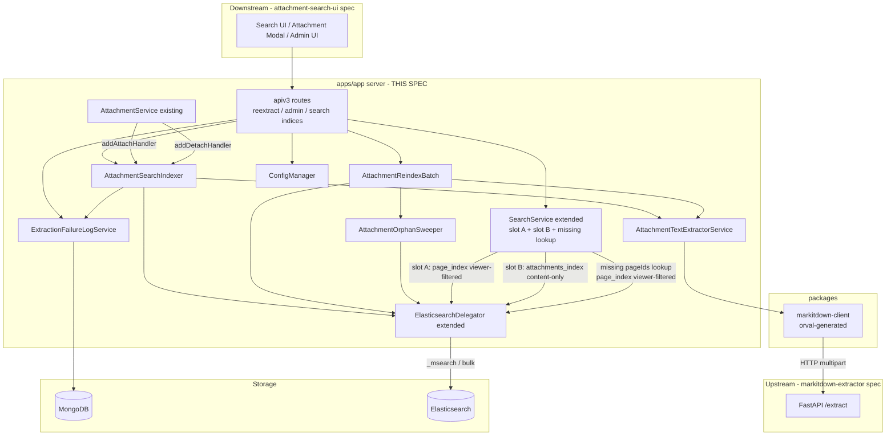
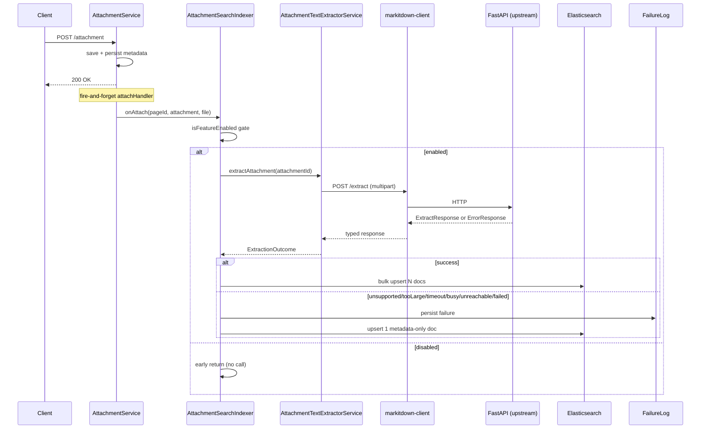
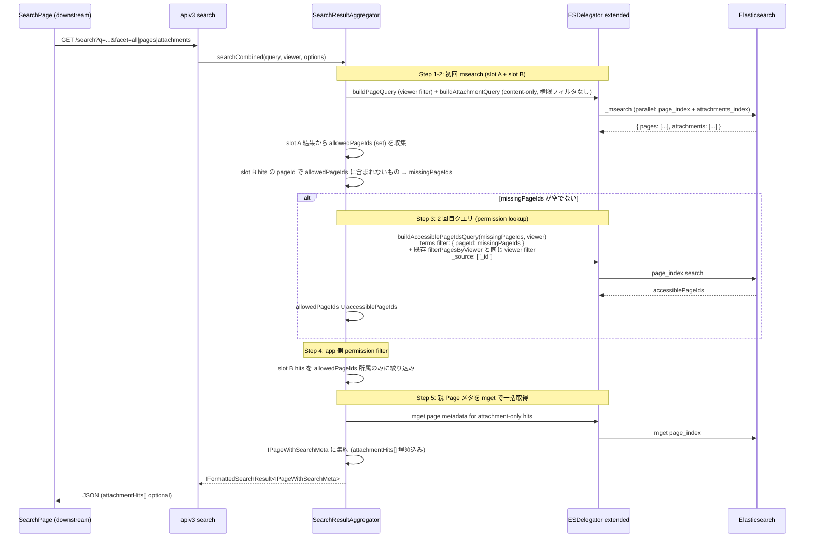
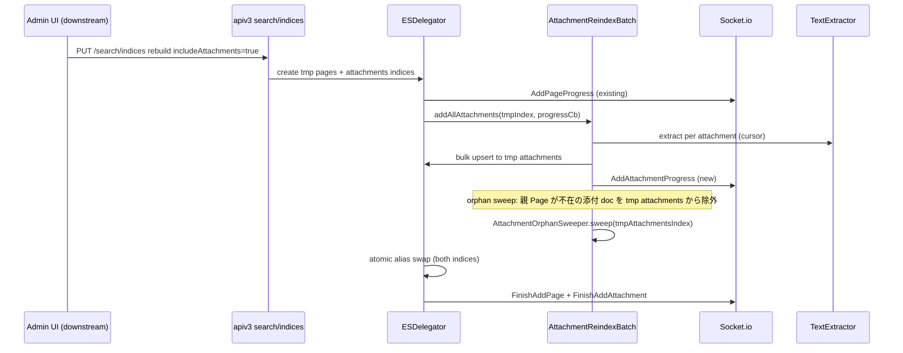
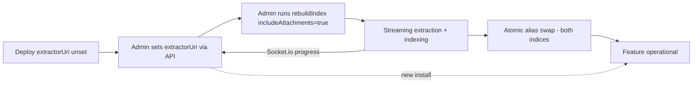

# Technical Design

## Overview

本 spec は GROWI 添付ファイル全文検索機能のうち **apps/app サーバ側の統合層** を定義する。上流 `markitdown-extractor` spec が提供する FastAPI 抽出マイクロサービスを `packages/markitdown-client` (orval 生成) 経由で呼び出し、添付ファイル専用 Elasticsearch インデックス (`attachments`) への書き込みを行う。既存の `AttachmentService` / `ElasticsearchDelegator` / `SearchService` / `ConfigManager` / `pageEvent` の拡張点を用い、独立サブシステムを作らずに feature module として統合する。

**Purpose**: apps/app 内で「抽出結果を ES へ upsert / 権限変更や削除を追従 / 一括再インデックスと個別再抽出を提供 / 検索クエリを multi-index で集約」する責務を完結させる。

**Users**: GROWI 利用者 (検索応答の受け取り)、GROWI 管理者 (admin API 経由の有効化・運用)、GROWI 配布/運用者 (Config 経由の接続先管理)。UI コンポーネント自体は下流 `attachment-search-ui` spec が描画する。

**Impact**: `apps/app/src/features/search-attachments/server/` の新設、新規パッケージ `packages/markitdown-client` の追加、`ElasticsearchDelegator` / `SearchService` / `AttachmentService` / `ConfigManager` / `pageEvent` への extension (最小差分)、応答型 `IPageWithSearchMeta` への optional フィールド追加。

### Goals

- 上流抽出サービス API 契約を `packages/markitdown-client` 経由で型安全に消費
- 添付の attach / detach / reextract / bulk を単一のインデクサで処理
- 親ページ権限変更は添付 ES 文書を更新せず、検索時に page_index から query-time lookup して反映 (Option D)
- multi-index msearch で Page と Attachment を並列クエリし、親ページ単位に集約
- 機能無効時に既存検索 API の挙動を機能導入前と完全一致させる
- 抽出サービス到達不可時も apps/app 本体は継続動作

### Non-Goals

- Python 抽出サービス本体・Dockerfile・k8s manifest (上流 `markitdown-extractor` spec)
- 検索結果 UI / 添付一覧モーダル UI / 管理画面 UI (下流 `attachment-search-ui` spec)
- 既存 Page 検索のクエリ・ランキング・権限モデル本体の改変
- 添付ファイル保管方式の変更
- 永続ジョブキュー化 (fire-and-forget を継続)
- チェックポイント再開型の bulk 再インデックス

## Boundary Commitments

### This Spec Owns

- `packages/markitdown-client` の orval 生成パイプラインと `openapi.json` drift 検知の CI 入口
- 抽出クライアントラッパ (`AttachmentTextExtractorService`) による失敗正規化と到達不可フォールバック
- 添付専用 ES インデックス `attachments` の mapping (ES 7/8/9) とライフサイクル (create / alias swap / bulk)。**添付 ES 文書に権限フィールドは保持しない** (`grant` / `granted_users` / `granted_groups` / `creator` を含まない)
- `AttachmentSearchIndexer` による attach / detach / reextract / bulk の単一パイプライン
- **Query-time permission filter 設計**: 検索時に page_index から親 Page の権限を lookup して添付ヒットを app 側で filter する方式 (`buildAttachmentSearchQuery` は権限フィルタなし content クエリ、`buildAccessiblePageIdLookupQuery` が page_index に対する viewer フィルタ付き terms query を組み立て、`SearchResultAggregator` が slot A + slot B + missing lookup を統合)
- `AttachmentReindexBatch` による tmp index streaming 再インデックスと Socket.io 進捗イベント発行 (UI 描画は対象外)、および `AttachmentOrphanSweeper` の統合呼び出し (rebuildIndex 時に親 Page が不在の添付 doc を cleanup)
- `ExtractionFailureLogService` による MongoDB 永続化と集計 API
- `SearchService` extended による multi-index msearch / pageId 集約 / query-time permission lookup
- `IPageWithSearchMeta` への optional `attachmentHits[]` 追加 (サーバ応答契約)
- apiv3 エンドポイント群 (reextract / admin config / admin failures / search indices 拡張)
- Config キー群 (`app:attachmentFullTextSearch:extractorUri` / `:timeoutMs` / `:maxFileSizeBytes` の 3 キー) の定義と永続化。`enabled` は算出値に移行して Config からは削除、`maxConcurrency` は抽出サービス側の env var 専用とし Config からは削除
- Crowi 初期化での `initAttachmentFullTextSearch(crowi)` 配線
- `SearchConfigurationProps.searchConfig` SSR プロパティへの `isAttachmentFullTextSearchEnabled` フィールド追加と関連型 (`apps/app/src/pages/basic-layout-page/types.ts`) の拡張、および `getServerSideSearchConfigurationProps` のサーバ生成ロジック拡張 (非 admin 一般ユーザが SSR 時点で機能有効フラグを参照できる公式経路)

### Out of Boundary

- Python 抽出サービス本体、FastAPI ルータ、Dockerfile、docker-compose / k8s manifest、NetworkPolicy (**`markitdown-extractor` spec**)
- 検索結果 UI コンポーネント (`AttachmentHitCard` / `AttachmentSubEntry` / `SearchResultFacetTabs`)、添付モーダルの「再抽出」ボタン、管理画面 (`AttachmentSearchSettings` / `AttachmentExtractionFailures` / `RebuildWithAttachmentsCheckbox`)、ユーザ向けガイダンス文言 (**`attachment-search-ui` spec**)
- 添付ファイル保管方式 (`FileUploader` 抽象は据え置き)
- 既存 Page 検索 (Page/Comment) のクエリ・ランキング・権限モデル本体の改変
- `apps/pdf-converter` の責務・実装
- **添付 ES 文書への権限フィールド (grant / granted_users / granted_groups / creator) の保存**: 本 spec は権限を snapshot せず query-time に page_index を参照する方式を採るため、権限スナップショットは持たない
- **pageEvent 購読による添付 ES 権限同期リスナ**: Option D 採用により不要 (`AttachmentGrantSync` は本 spec に存在しない)。親 Page 権限変更は page_index の既存同期経路でのみ反映され、添付側への propagation は発生しない

### Allowed Dependencies

- **上流**: `markitdown-extractor` spec が提供する FastAPI OpenAPI spec (`POST /extract`、`ExtractResponse` / `ErrorResponse`)、Docker image、デプロイ manifest
- 既存 `AttachmentService.addAttachHandler` / `addDetachHandler` (ハンドラ登録のみ)
- 既存 `ElasticsearchDelegator` (composition で添付向けメソッド合成、既存 Page 系メソッドは不変)
- 既存 `SearchService.registerUpdateEvent()` (リスナ追加のみ)
- 既存 `FileUploader` (バイト取得のみ)
- 既存 `ConfigManager` / `config-definition.ts` (キー追加のみ)
- 既存 Socket.io progress channel (添付向けイベント名を追加)
- 既存 `pageEvent` の `updateMany` / `syncDescendantsUpdate` / page delete
- 既存 `IPageWithSearchMeta` (optional フィールド追加のみ)
- `pdf-converter-client` パターン (orval 設定の参考)

### Revalidation Triggers

- **上流 API 契約の変更** (`markitdown-extractor` spec): `POST /extract` の request/response schema、エラーコード enum、HTTP ステータス対応の変更 → `packages/markitdown-client` 再生成、`AttachmentTextExtractorService` の正規化ロジック再確認、drift 検知 CI の再評価
- **ES 添付 mapping のフィールド追加/削除**: 既存添付インデックスの再構築必要性判定、ES 7/8/9 mapping 変種の同期。特に権限フィールドを **再導入する変更は Option D の設計前提を覆す** ため、本 spec の本質的再検討が必要
- **`IPageWithSearchMeta.attachmentHits[]` / `IAttachmentHit` の形状変更**: 下流 `attachment-search-ui` spec に破壊的変更を強いるため、spec 再調整が必須
- **apiv3 エンドポイント契約** (reextract / admin config / admin failures / search indices 拡張) の request/response 変更: 下流 spec の SWR hook 再調整が必須
- **`filterPagesByViewer` の権限モデル本体の変更**: 本 spec は既存 Page 検索と同一の viewer フィルタを page_index に適用することで添付権限を解決しているため、page 側の権限モデル変更は添付検索の権限判定にも波及する
- **page_index の viewer フィルタクエリ構造の変更**: `buildAccessiblePageIdLookupQuery` は既存 Page 検索の filter 生成を流用するため、その内部構造変更は lookup クエリにも影響する
- **Config キー名の変更**: 既存環境の設定マイグレーション必要
- **`extractorUri` クリアによる soft-disable 挙動**: `extractorUri` を admin UI で空文字 / null にすると `isAttachmentFullTextSearchEnabled` (算出値) が `false` に遷移する。この「URI による soft-disable」挙動の意味論変更 (例: 空文字扱いの揺れ、trim の有無) は下流 `attachment-search-ui` spec の機能ゲート挙動に影響するため、変更時は下流 spec に通知が必要
- **Socket.io 進捗イベント名** (`AddAttachmentProgress` 等) の変更: 下流 UI spec の購読変更
- **`SearchConfigurationProps.searchConfig` の shape 変更** (フィールド追加/削除/rename): 下流 `attachment-search-ui` spec は SSR hydration 経路 (`basic-layout-page/hydrate.ts` での atom 書き込み、下流が追加する Jotai atom / SWR fallback の初期値配線) を再確認する必要がある

## Architecture

### Existing Architecture Analysis

- apps/app は Next.js Pages Router + Express モノリス。`server/service/*` が既存責務の中心
- ES 連携は `ElasticsearchDelegator` に集約され、ES 7/8/9 の互換レイヤが version-specific mapping で提供されている
- `AttachmentService` はハンドラ登録型拡張点を提供し、OpenAI Vector Store 連携が既に同パターンで同居 (fire-and-forget、例外握りつぶし)
- `registerUpdateEvent()` は `pageEvent` の `updateMany` / `syncDescendantsUpdate` を購読し Page index を同期
- Config は `ConfigManager` + MongoDB `Config` model で永続化、`config-definition.ts` に型定義を並べる
- `rebuildIndex()` は tmp index → alias swap パターン、Socket.io (`AddPageProgress` / `FinishAddPage` / `RebuildingFailed`) で進捗通知

### Architecture Pattern & Boundary Map

採用パターン: **既存システム拡張 + feature module 新設 (composition-based)**。独立 delegator やジョブキュー基盤を作らず、既存パターンに相乗りする。



**Architecture Integration**:
- **選定パターン**: 既存拡張優先 (独立 delegator / ジョブキュー不採用)
- **ドメイン/境界**: 「抽出クライアント」「indexer」「reindex batch」「orphan sweeper」「検索集約 (query-time permission lookup を含む)」を feature module 内で分離し、それぞれ単一責任を維持。添付側の権限同期 (AttachmentGrantSync) は **Option D 採用により設計上不要**
- **依存方向**: apiv3 → service/indexer → (TextExtractor | ESDelegator) → (markitdown-client → 上流 | ES / Mongo)。逆流なし
- **既存パターン維持**: AttachmentService ハンドラ仕様、ESDelegator のライフサイクル、Socket.io progress、apiv3 ルーティング、Config 定義、**`basic-layout-page/get-server-side-props/search-configurations.ts` の `searchConfig` SSR props パターン**
- **Steering 準拠**: feature-based 配置、名前付き export、pino ログ、immutable 更新、pure 関数抽出 (msearch body builder)

**機能有効フラグの参照経路 (primary vs secondary)**:
- **Primary**: 非 admin を含む全ユーザ向けには、既存 `searchConfig` SSR props パターンを拡張した `SearchConfigurationProps.searchConfig.isAttachmentFullTextSearchEnabled` を唯一の公式参照経路とする。basic-layout-page 経由のため全ページで SSR 時点に届く
- **Secondary (間接シグナル)**: 検索応答 `IPageWithSearchMeta.attachmentHits` の optional な存在自体は「機能が有効化されかつ検索パイプラインが通った」ことの**間接シグナル**として利用可能だが、これは Primary にはしない。理由: (a) 機能有効でも facet によっては attachments msearch がスキップされる、(b) 閾値超過時の safety net で削除されうる、(c) 初回レンダ時は検索前で応答が無い。したがって UI の feature gate は必ず SSR `searchConfig.isAttachmentFullTextSearchEnabled` を参照する
- **Admin 向け**: admin 画面では引き続き `GET /_api/v3/admin/attachment-search/config` を真実の源とする (SSR prop は描画ゲート用で、書き込み系は admin API 経由)

### Technology Stack

| Layer | Choice / Version | Role in Feature | Notes |
|-------|------------------|-----------------|-------|
| Server runtime | Node 22 / Express / pino | indexer / 権限 sync / reindex batch / apiv3 | 既存スタック踏襲 |
| HTTP client | axios (orval 生成) | 抽出サービス呼び出し | server 専用依存 |
| Client package | `packages/markitdown-client` (orval 生成) | 上流 OpenAPI → TS クライアント | `pdf-converter-client` 同パターン |
| Data — search | Elasticsearch 7/8/9 (既存) | 添付専用 index `attachments` | 既存 Page index とは別 index |
| Data — log | MongoDB (既存) | `extractionFailureLogs` collection | TTL index 90 日 |
| Messaging | Socket.io (既存) | 一括再インデックス進捗 | 添付向けイベント名を追加 |

## File Structure Plan

### Directory Structure

```
apps/app/src/features/search-attachments/
├── server/
│   ├── index.ts                                   # initAttachmentFullTextSearch(crowi)
│   ├── services/
│   │   ├── attachment-text-extractor.ts           # markitdown-client wrapper
│   │   ├── attachment-search-indexer.ts           # attach/detach/reextract 単一窓口
│   │   ├── attachment-search-delegator-extension.ts  # ESDelegator 拡張 (composition)
│   │   ├── attachment-reindex-batch.ts            # bulk reindex + Socket.io progress + orphan sweeper invocation
│   │   ├── attachment-orphan-sweeper.ts           # rebuildIndex 内から呼ぶ orphan cleanup (real-time cascade は不要)
│   │   ├── attachment-search-result-aggregator.ts # slot A + slot B + missing lookup + app-side permission filter
│   │   └── extraction-failure-log-service.ts      # Mongo CRUD / 集計
│   ├── models/
│   │   └── extraction-failure-log.ts              # Mongoose schema (TTL)
│   ├── mappings/
│   │   ├── attachments-mappings-es7.ts
│   │   ├── attachments-mappings-es8.ts
│   │   └── attachments-mappings-es9.ts
│   ├── queries/
│   │   ├── build-attachment-search-query.ts       # msearch body builder (pure、権限フィルタなし content クエリ)
│   │   └── build-accessible-page-ids-query.ts     # page_index への viewer フィルタ付き terms query (permission lookup 用)
│   ├── routes/apiv3/
│   │   ├── attachment-reextract.ts                # POST /attachments/:id/reextract
│   │   └── attachment-search-admin.ts             # GET /failures, GET|PUT /config
│   └── middlewares/
│       └── require-search-attachments-enabled.ts
└── interfaces/
    └── attachment-search.ts                       # IAttachmentHit, IAttachmentEsDoc, ExtractionOutcome DTOs

packages/markitdown-client/
├── orval.config.js
├── openapi.json                                   # 上流 spec が export、commit 必須 (PR レビューで schema 変更を可視化)
├── package.json
└── src/
    ├── index.ts                                   # re-export generated、commit する (pdf-converter-client 同パターン)
    └── generated/                                 # orval 出力、commit する (build 時に再生成されるが diff check で drift を検知)
```

#### OpenAPI / orval drift 検知パイプライン

- **openapi.json**: 上流 `services/markitdown-extractor/scripts/export_openapi.py` が `packages/markitdown-client/openapi.json` を直接上書き生成。**commit 必須**
- **orval 生成物 (`src/`)**: 本 spec の responsibility として commit する。開発者が `openapi.json` 更新時に orval を実行して commit、または CI が regenerate → diff check
- **Python CI (上流 spec)**: `export_openapi.py` 実行 + `git diff --exit-code packages/markitdown-client/openapi.json` で drift 検知
- **Node CI (本 spec)**: orval 実行 + `git diff --exit-code packages/markitdown-client/src/` で drift 検知
- **turbo 依存での build 時再生成は不使用**: `services/` が pnpm workspace / turbo pipeline 外であるため、`pdf-converter-client` のような `dependsOn: ["@growi/pdf-converter#gen:swagger-spec"]` パターンは適用不可。commit artifact + 両 CI diff check が言語境界を跨ぐための最適解

### Modified Files

- [apps/app/src/server/crowi/index.ts](apps/app/src/server/crowi/index.ts) — `initAttachmentFullTextSearch(this)` を searchService / attachmentService 初期化後に追加
- [apps/app/src/server/service/search.ts](apps/app/src/server/service/search.ts) — multi-index 検索集約経路 (slot A + slot B + permission lookup) を `AttachmentSearchResultAggregator` として追加。`registerUpdateEvent()` への権限変更リスナ追加は **不要** (Option D は query-time 方式のため)
- [apps/app/src/server/service/search-delegator/elasticsearch.ts](apps/app/src/server/service/search-delegator/elasticsearch.ts) — `attachment-search-delegator-extension` との合成 (既存 Page 系メソッドは不変)
- [apps/app/src/server/service/config-manager/config-definition.ts](apps/app/src/server/service/config-manager/config-definition.ts) — `app:attachmentFullTextSearch:*` 3 キー追加 (`extractorUri` / `timeoutMs` / `maxFileSizeBytes`)。`extractorUri` は admin Config として扱い、環境変数 `GROWI_MARKITDOWN_EXTRACTOR_URI` を初期値として採り得る (既存 `app:elasticsearchUri` と同等のパターン)。`enabled` / `maxConcurrency` は Config キーとしては提供せず、前者は算出値、後者は抽出サービス側の env var 専用
- [apps/app/src/interfaces/search.ts](apps/app/src/interfaces/search.ts) — `IPageWithSearchMeta.attachmentHits?: IAttachmentHit[]` (optional) を追加
- [apps/app/src/server/routes/apiv3/search.js](apps/app/src/server/routes/apiv3/search.js) — `PUT /search/indices` に `includeAttachments` フラグを受理
- [apps/app/src/pages/basic-layout-page/get-server-side-props/search-configurations.ts](apps/app/src/pages/basic-layout-page/get-server-side-props/search-configurations.ts) — `getServerSideSearchConfigurationProps` を拡張し、`searchService.isConfigured` と `ConfigManager.getConfig('app:attachmentFullTextSearch:extractorUri')` から算出した `searchConfig.isAttachmentFullTextSearchEnabled` を SSR props に含める (既存フィールドは非破壊)
- [apps/app/src/pages/basic-layout-page/types.ts](apps/app/src/pages/basic-layout-page/types.ts) — `SearchConfigurationProps.searchConfig` 型に `isAttachmentFullTextSearchEnabled: boolean` フィールドを追加 (既存 `isSearchServiceConfigured` / `isSearchServiceReachable` / `isSearchScopeChildrenAsDefault` は据え置き)

> UI コンポーネント・管理画面 tsx / hook 系の改変は下流 `attachment-search-ui` spec に委譲。本 spec では SSR props の**サーバ側生成と型定義の追加**のみを担当し、その hydration 経路と Jotai atom / SWR fallback 配線などのクライアント側消費は下流 spec が扱う。

## System Flows

### 1. 添付アップロード → 抽出 → インデックス



Key decisions:
- `serviceUnreachable` / `timeout` / `serviceBusy` を明示的に分類し UI 側メッセージ分岐を可能にする
- 機能無効時は indexer が早期 return、抽出サービスへの呼び出しは一切行わない (R5 AC 5.4 互換性)

### 2. 検索実行 (app サーバ側 multi-index 集約 + query-time permission lookup)



Key decisions:
- facet=`pages` のときは attachments_index を叩かず既存 Page 検索と同一経路
- facet=`attachments` / `all` のときは slot B を投げ、添付のみヒットのページは query-time に page_index を参照して権限判定 (Option D の核)
- 添付 ES 文書には権限フィールドがないため、attachments_index 単独では権限判定できず permission lookup が必須
- missingPageIds が空なら 2 回目クエリをスキップ (コスト 0)
- attachments msearch + permission lookup の合計が設定閾値 (例: 800ms) を超過したら attachment ヒットを除き Page 結果のみ返す safety net (R9 AC 9.1 互換性)

### 3. 親ページ権限変更 → 検索時に自動反映 (コード不要)

**Option D 採用により、添付 ES 文書への partial update は発生しない**。親 Page の権限変更は既存 page_index の同期経路で反映され、次回検索実行時に Flow 2 の slot A および permission lookup が最新の page_index を参照することで、添付ヒットの可視性も自動的に更新される。sync drift による snippet 漏洩は構造的に発生しない (権限情報を添付側に snapshot していないため)。

### 4. 個別再抽出 (UI → API → Indexer)

`POST /_api/v3/attachments/:id/reextract` で apiv3 が (admin OR page editor) ガード後、`AttachmentSearchIndexer.reindex(attachmentId)` を**同期呼び出し**し、`ExtractionOutcome` を HTTP レスポンスにマップする。Flow 1 の抽出経路を再利用する。機能無効時は 503 feature_disabled。

### 5. 一括再インデックス (rebuildIndex with attachments)



Key decisions:
- Page と Attachment の再構築は直列 (Page 完了後に Attachment 開始、性能検証後に並列化を enhancement 判断)
- 個別失敗はスキップして FailureLog に残し batch 継続
- includeAttachments=false の場合は従来どおり Page/Comment のみ処理し既存 `attachments` alias は据え置き
- 中断時は alias swap 未実行のまま旧 index 維持、tmp index は orphan として残存 (手動削除)
- **orphan sweeper**: real-time cascade (pageEvent 購読による即時削除) は採用しない。rebuildIndex 時に `AttachmentOrphanSweeper` が MongoDB Page collection と照合して親 Page 不在の添付 doc を eventual に cleanup する。query-time permission lookup により、sweeper 実行までの間も snippet 漏洩は発生しない (Flow 2 の Step 3 で親 Page 不在 → accessiblePageIds に含まれない → 結果から除外)

## Requirements Traceability

| Requirement | Summary | Components | Interfaces | Flows |
|-------------|---------|------------|------------|-------|
| 1.1 | 抽出失敗時も添付保存継続 | AttachmentSearchIndexer (catch & fallback) | — | Flow 1 |
| 1.2 | 構造化ログ | AttachmentSearchIndexer + pino | — | — |
| 1.3 | 到達不可時も継続 | AttachmentTextExtractorService catch-all | — | Flow 1 |
| 1.4 | serviceUnreachable 正規化 | AttachmentTextExtractorService | `ExtractionOutcome` | — |
| 2.1 | 自動インデックス化 | AttachmentSearchIndexer.onAttach | `AttachmentService.addAttachHandler` | Flow 1 |
| 2.2 | 1 添付 = N 文書 | ES attachments mapping + bulk upsert | Logical Data Model | Flow 1 |
| 2.3 | URI 未設定時の完全互換 | isFeatureEnabled gate (算出値) | `searchService.isConfigured && extractorUri != null && extractorUri !== ''` | — |
| 2.4 | 失敗時メタデータのみ登録 | AttachmentSearchIndexer fallback | — | Flow 1 |
| 2.5 | 文書フィールド定義 (権限フィールドを**持たない**) | ES attachments mapping (grant/granted_users/granted_groups/creator なし) | Logical Data Model | — |
| 3.1 | 添付削除連動 | AttachmentSearchIndexer.onDetach | `addDetachHandler` | — |
| 3.2 | 親ページ削除連動 (eventual cleanup) | AttachmentOrphanSweeper (rebuildIndex 時) + query-time permission lookup による即時的ヒット除外 | queries/build-accessible-page-ids-query | Flow 5 / Flow 2 Step 3 |
| 3.3 | 権限変更連動 (query-time) | query-time permission lookup (buildAccessiblePageIdsQuery) — **添付 ES 文書は更新しない** | queries/build-accessible-page-ids-query | Flow 2 Step 3 / Flow 3 (コード不要) |
| 3.4 | 削除/orphan sweep 失敗ログ | pino + FailureLogService | — | — |
| 4.1 | viewer フィルタ (query-time) | build-attachment-search-query (content-only) + build-accessible-page-ids-query (permission lookup) + AttachmentSearchResultAggregator (app 側 filter) | — | Flow 2 |
| 4.2 | 権限変更後反映 (query-time) | query-time permission lookup (page_index 参照) | — | Flow 2 Step 3 |
| 4.3 | Page と同一権限モデル | 既存 `filterPagesByViewer` を page_index への lookup にそのまま適用 | — | Flow 2 Step 3 |
| 4.4 | 孤児添付除外 (query-time) | query-time permission lookup (親 Page 不在なら accessiblePageIds に含まれない) + orphan sweeper (eventual cleanup) | queries/build-accessible-page-ids-query | Flow 2 Step 3 / Flow 5 |
| 5.1 | URI 設定による有効化 (算出値) | ConfigManager + config-definition (`extractorUri` 等 3 キー) + SearchConfigurationProps 拡張 (SSR、算出値を公開) | `searchConfig.isAttachmentFullTextSearchEnabled` (算出) | — |
| 5.2 | 設定値永続化 + admin API | apiv3 admin config | `GET/PUT /admin/attachment-search/config` (`extractorUri` / `timeoutMs` / `maxFileSizeBytes`) | — |
| 5.3 | 再インデックス必要性フラグ | admin config response flag | — | — |
| 5.4 | URI 未設定時は検索に含めない | isFeatureEnabled gate (query side 算出値) + SearchConfigurationProps 拡張 (UI ゲート用 SSR 公開) | `searchConfig.isAttachmentFullTextSearchEnabled` | Flow 2 |
| 5.5 | URI 未設定時も添付保存継続 | AttachmentService 本体は無変更 | — | — |
| 6.1 | 添付再インデックス実施 | AttachmentReindexBatch | — | Flow 5 |
| 6.2 | 個別失敗時スキップ | AttachmentReindexBatch try/catch | — | Flow 5 |
| 6.3 | 進捗 Socket.io | Socket.io `AddAttachmentProgress` / `FinishAddAttachment` | — | Flow 5 |
| 6.4 | 中断時 alias 不変 | AttachmentReindexBatch alias swap last | — | Flow 5 |
| 7.1 | 再抽出エンドポイント | AttachmentSearchIndexer.reindex | `POST /attachments/:id/reextract` | Flow 4 |
| 7.2 | 権限ガード | apiv3 middleware (admin OR page editor) | — | — |
| 7.3 | 無効時 503 | require-search-attachments-enabled middleware | — | — |
| 7.4 | Outcome レスポンス | apiv3 response shape | `{ outcome: ExtractionOutcome }` | — |
| 8.1 | 失敗ログ pino | AttachmentSearchIndexer + FailureLogService | — | — |
| 8.2 | 監視メトリクス | OpenTelemetry 既存パイプライン | — | — |
| 8.3 | Mongo 永続化 + TTL | ExtractionFailureLog Mongoose schema | — | — |
| 8.4 | 失敗取得 API | apiv3 admin failures | `GET /admin/attachment-search/failures` | — |
| 9.1 | 無効時完全互換 | isFeatureEnabled gate 全経路 | — | — |
| 9.2 | Page index 非劣化 | 添付は別 index、Page mapping 不変 | — | — |
| 9.3 | API 後方互換 | `IPageWithSearchMeta.attachmentHits` optional | — | — |
| 9.4 | optional フィールド | `interfaces/search.ts` 差分 | — | — |

## Components and Interfaces

### Summary

| Component | Domain/Layer | Intent | Req Coverage | Key Dependencies (P0/P1) | Contracts |
|-----------|--------------|--------|--------------|--------------------------|-----------|
| MarkitdownClient (packages) | Package (TS) | 抽出 API の型安全クライアント (orval 生成) | 2.1, 6.1, 7.1, 1.3 | orval (P0), upstream FastAPI (P0) | Service |
| AttachmentTextExtractorService | Server | クライアント wrapper + 失敗正規化 + 到達不可 fallback | 1.1, 1.2, 1.3, 1.4, 2.1 | MarkitdownClient (P0), FileUploader (P0) | Service |
| AttachmentSearchIndexer | Server | attach/detach/reextract/bulk の単一窓口 | 2.1–2.5, 3.1, 3.4, 7.1 | TextExtractor (P0), ESDelegator extension (P0), FailureLogService (P1) | Service, Event |
| AttachmentOrphanSweeper | Server | rebuildIndex 内で親 Page 不在の添付 doc を eventual cleanup | 3.2, 4.4 | Page model (P0), ESDelegator extension (P0) | Batch |
| AttachmentReindexBatch | Server | 一括再インデックス streaming + progress + orphan sweeper 統合 | 6.1, 6.2, 6.3, 6.4 | TextExtractor (P0), ESDelegator extension (P0), AttachmentOrphanSweeper (P0), Socket.io (P1) | Batch |
| ElasticsearchDelegator extension | Server | 添付 index mapping / bulk / msearch 構築 (権限フィールドなし) | 2.2, 2.5, 3.1, 4.1, 6.1, 9.2 | 既存 ESDelegator (P0), ES client (P0) | Service |
| ExtractionFailureLogService | Server | 失敗の Mongo 永続化 + 集計 | 3.4, 8.1, 8.3, 8.4 | ExtractionFailureLog model (P0) | Service |
| AttachmentSearchResultAggregator | Server | slot A + slot B + missing pageIds lookup + app 側 permission filter + pageId 集約 | 3.3, 4.1, 4.2, 4.3, 4.4, 9.1, 9.3 | ESDelegator extension (P0), buildAccessiblePageIdsQuery (P0) | Service |
| apiv3: attachment-reextract | Server | `POST /attachments/:id/reextract` | 7.1, 7.2, 7.3, 7.4 | AttachmentSearchIndexer (P0) | API |
| apiv3: attachment-search-admin | Server | failures / config 取得更新 | 5.1, 5.2, 5.3, 8.4 | ConfigManager (P0), FailureLogService (P0) | API |
| apiv3: search indices extended | Server | `includeAttachments` フラグ受理 | 6.1 | AttachmentReindexBatch (P0) | API |
| Response type (`IPageWithSearchMeta`) | Interface | optional `attachmentHits[]` 追加 | 9.3, 9.4 | 既存 interfaces/search.ts (P0) | Contract |
| SearchConfigurationProps 拡張 | SSR props / Interface | 非 admin 一般ユーザ向けに機能有効フラグを SSR 経路で公開 | 5.1, 5.4 | ConfigManager (P0), 既存 basic-layout-page SSR (P0) | Contract, SSR |

### AttachmentTextExtractorService

| Field | Detail |
|-------|--------|
| Intent | MarkitdownClient のラッパ。バイト取得、タイムアウト、エラー正規化、到達不可時 fallback |
| Requirements | 1.1, 1.2, 1.3, 1.4, 2.1 |

**Responsibilities & Constraints**
- FileUploader からバイトを取得し `markitdown-client` に multipart 送信
- ネットワーク層エラーと抽出サービスエラーコードを `ExtractionOutcome` に統一正規化
- 到達不可時に catch-all し `serviceUnreachable` を返す (throw しない)

**Contracts**: **Service [x]**

```typescript
export type ExtractionOutcome =
  | { kind: 'success'; pages: ExtractedPage[]; mimeType: string }
  | { kind: 'unsupported'; mimeType: string }
  | { kind: 'tooLarge'; fileSize: number }
  | { kind: 'timeout' }
  | { kind: 'serviceBusy' }
  | { kind: 'serviceUnreachable' }
  | { kind: 'failed'; reasonCode: string; message: string };

export interface ExtractedPage {
  readonly pageNumber: number | null;
  readonly label: string | null;
  readonly content: string;
}

export interface AttachmentTextExtractorService {
  extractAttachment(attachmentId: string): Promise<ExtractionOutcome>;
}
```

- Preconditions: 対象 attachment が存在し FileUploader 経由でバイト取得可能
- Postconditions: ネットワーク障害時も throw せず `serviceUnreachable` を返す
- Invariants: 1 呼び出し = 1 multipart request (ストリーミング不採用)

### AttachmentSearchIndexer

| Field | Detail |
|-------|--------|
| Intent | attach/detach/reextract/bulk の単一パイプライン窓口 |
| Requirements | 2.1, 2.2, 2.3, 2.4, 2.5, 3.1, 3.4, 7.1 |

**Responsibilities & Constraints**
- `isFeatureEnabled()` チェック → ON 時のみ抽出呼び出し、OFF 時は早期 return。判定式は `searchService.isConfigured && extractorUri != null && extractorUri !== ''` (独立した `enabled` Config キーは持たず算出値)
- 成功時: ES `attachments` に bulk upsert (1 添付 = N 文書)。**権限フィールドは一切書き込まない** (Option D)
- 失敗時 (unsupported / tooLarge / timeout / busy / unreachable / failed): metadata-only 1 文書 + FailureLog 永続化
- `onDetach(attachmentId)` で `attachmentId` キーの全文書削除
- **親 Page 削除の real-time cascade は行わない** (`onPageDeleted` は本 contract に含めない)。親 Page 不在添付は query-time permission lookup でヒットから除外され、eventual cleanup は `AttachmentOrphanSweeper` が rebuildIndex 時に担う

**Contracts**: **Service [x]** / **Event [x]**

```typescript
export interface AttachmentSearchIndexer {
  onAttach(pageId: string | null, attachment: IAttachmentDocument, file: Express.Multer.File): Promise<void>;
  onDetach(attachmentId: string): Promise<void>;
  reindex(attachmentId: string): Promise<{ ok: boolean; outcome: ExtractionOutcome }>;
  // Note: onPageDeleted is NOT part of this contract under Option D.
  // Parent-page deletion is handled by:
  //   (1) query-time permission lookup (hits for missing pages are filtered out immediately), and
  //   (2) AttachmentOrphanSweeper (eventual cleanup during rebuildIndex).
}
```

- Subscribed: `AttachmentService` attach / detach
- Ordering: fire-and-forget (既存 OpenAI vector store 連携と同パターン)
- Idempotency: `${attachmentId}_${pageNumber ?? 0}` を doc ID として upsert 冪等

**Implementation Notes**: Crowi 初期化で `attachmentService.addAttachHandler(indexer.onAttach)` / `addDetachHandler(indexer.onDetach)` を登録。fire-and-forget 特性下でも FailureLog と pino を確実に呼ぶ設計。

### AttachmentOrphanSweeper

| Field | Detail |
|-------|--------|
| Intent | 親 Page が不在の添付 ES 文書を eventual に cleanup する (real-time cascade の代替) |
| Requirements | 3.2, 4.4 |

**Responsibilities & Constraints**
- `AttachmentReindexBatch` から呼び出される。独立トリガは持たない (定期 cron や pageEvent 購読は行わない)
- tmp attachments index 構築後に、存在する pageId の集合を Page collection から取得し、tmp index 上で親 Page 不在のドキュメントを削除
- 失敗しても rebuildIndex 本体の成功を阻害しない (pino ログに記録し continue)
- query-time permission lookup により「sweep までの間の snippet 漏洩」は発生しないため、定期実行は不要 (R4.4 は query-time で、R3.2 は eventual cleanup で満たす二段構え)

**Contracts**: **Batch [x]**

```typescript
export interface AttachmentOrphanSweeper {
  sweep(targetIndex: string): Promise<{ removed: number; failed: number }>;
}
```

### AttachmentReindexBatch

| Field | Detail |
|-------|--------|
| Intent | 一括再インデックスの streaming 処理 + Socket.io progress |
| Requirements | 6.1, 6.2, 6.3, 6.4 |

**Contracts**: **Batch [x]**

- Trigger: `PUT /_api/v3/search/indices { operation: 'rebuild', includeAttachments: true }` から `rebuildIndex()` 内で呼び出し
- Input: MongoDB 上の全 attachment を cursor で走査、バイトは FileUploader から逐次取得
- Output: **固定 tmp index `attachments-tmp`** に bulk upsert、最終 alias swap (Page と同時 atomic)
- Idempotency の実現方法: **既存 Page 側 `rebuildIndex()` と完全に同じ流儀**。開始時に `client.indices.delete({ index: 'attachments-tmp', ignore_unavailable: true })` で既存 tmp をドロップ → `createAttachmentIndex('attachments-tmp')` で再作成 → streaming upsert → alias swap。timestamp/version 付きの命名は使わない (累積なし)
- tmp index 命名規約: `${indexName}-tmp` 形式。本 spec では `indexName = 'attachments'` なので tmp は **`attachments-tmp`** 固定。既存 Page 側の `${pageIndexName}-tmp` と同じパターン ([参考](apps/app/src/server/service/search-delegator/elasticsearch.ts#L277))
- Progress: Socket.io `AddAttachmentProgress` / `FinishAddAttachment` / `RebuildingFailed` (既存と同経路)
- 失敗時: 個別失敗は FailureLog に残しスキップ、batch は継続。中断時は alias swap 未実行のまま旧 index 維持、`attachments-tmp` は残置されるが次回実行の先頭で drop されるため**累積しない**
- 並行実行: admin 操作として同時 rebuild は想定しない (既存 Page 側と同じ前提を継承)

### ElasticsearchDelegator extension

| Field | Detail |
|-------|--------|
| Intent | 既存 delegator に添付 index 操作を合成 (権限フィールドは扱わない) |
| Requirements | 2.2, 2.5, 3.1, 4.1, 4.4, 6.1, 9.2 |

**Contracts**: **Service [x]** / **Batch [x]**

```typescript
export interface AttachmentIndexOperations {
  createAttachmentIndex(): Promise<void>;
  syncAttachmentIndexed(attachmentId: string, pageId: string, docs: AttachmentEsDoc[]): Promise<void>;
  syncAttachmentRemoved(attachmentId: string): Promise<void>;
  // Note: grant propagation API (syncPageAttachmentsGrantUpdated) is intentionally absent.
  // Under Option D, permission is resolved at query time by looking up page_index.
  searchAttachmentsBody(query: string, options: SearchOptions): Record<string, unknown>;              // content-only, no permission filter
  searchAccessiblePageIdsBody(pageIds: string[], viewer: IUser): Record<string, unknown>;             // page_index with viewer filter, _source: ["_id"]
  addAllAttachments(targetIndex: string, progress: (processed: number, total: number) => void): Promise<void>;
}
```

- ES 7/8/9 mapping 変種を version-aware に選択 (**権限フィールドは mapping に含めない**)
- `searchAttachmentsBody` は msearch の slot B (attachments) 向け body を返す pure builder。viewer filter は適用しない (query-time lookup 方式のため)
- `searchAccessiblePageIdsBody` は slot A と同じ `filterPagesByViewer` を再利用しつつ、terms filter (`pageId IN missingPageIds`) を追加した page_index lookup 専用 body。`_source: ["_id"]` で不要フィールド転送を抑止

### ExtractionFailureLogService

| Field | Detail |
|-------|--------|
| Intent | 抽出失敗の Mongo 永続化と admin 向け集計 |
| Requirements | 3.4, 8.1, 8.3, 8.4 |

**Contracts**: **Service [x]**

```typescript
export interface ExtractionFailureLogService {
  record(entry: ExtractionFailureEntry): Promise<void>;
  listRecent(options: { limit: number; since?: Date }): Promise<ExtractionFailureEntry[]>;
  totalRecent(since?: Date): Promise<number>;
}
```

### AttachmentSearchResultAggregator (SearchService extension)

| Field | Detail |
|-------|--------|
| Intent | multi-index msearch、**query-time permission lookup**、および pageId 集約。添付 ES 文書が権限情報を持たないという Option D の前提を担保する中核コンポーネント |
| Requirements | 3.3, 4.1, 4.2, 4.3, 4.4, 9.1, 9.3 |

**Contracts**: **Service [x]**

```typescript
export interface AttachmentSearchResultAggregator {
  searchCombined(
    query: string,
    viewer: IUser,
    options: { facet: 'all' | 'pages' | 'attachments'; from: number; size: number }
  ): Promise<IFormattedSearchResult<IPageWithSearchMeta>>;
}
```

**4-step query-time permission filter** (Flow 2 と対応):
1. **初回 msearch (slot A + slot B)**: page_index (viewer filter 付き) と attachments_index (content-only、権限フィルタなし) を `_msearch` 1 リクエストで並列
2. **allowed / missing 分類**: slot A から `allowedPageIds` を収集。slot B hits の pageId のうち `allowedPageIds` に含まれないものを `missingPageIds` として抽出
3. **permission lookup (2 回目クエリ)**: `missingPageIds` が空でなければ page_index に対し `{ terms: { pageId: missingPageIds } }` + `filterPagesByViewer(viewer)` の body で検索。`_source: ["_id"]` のみ。`accessiblePageIds` を得て `allowedPageIds ∪ accessiblePageIds` で結合
4. **app 側 filter と集約**: slot B hits を結合後 `allowedPageIds` 所属のみに絞り込み → 親 Page メタを `mget` で一括取得 → `IPageWithSearchMeta.attachmentHits[]` に集約

その他:
- 既存 Page 検索経路を完全維持 (facet `pages` は既存クエリを呼ぶ、slot B / permission lookup ともに発火しない)
- 機能有効 & facet ∈ `all|attachments` のみ attachments msearch を追加
- missingPageIds が空なら 2 回目クエリをスキップ (コスト 0)
- 閾値超過時 (初回 msearch + permission lookup の合計が 800ms 超) は attachments ヒットを捨てて Page 結果のみ返す safety net

### apiv3 エンドポイント群

| Method | Endpoint | Request | Response | Errors |
|--------|----------|---------|----------|--------|
| POST | /_api/v3/attachments/:id/reextract | — | `{ outcome: ExtractionOutcome }` | 400 invalid, 403 forbidden, 404 not_found, 503 feature_disabled |
| GET | /_api/v3/admin/attachment-search/failures | `?limit=N&since=iso` | `{ items: ExtractionFailure[], total: number }` | 403 forbidden |
| GET | /_api/v3/admin/attachment-search/config | — | `AttachmentSearchConfig` | 403 forbidden |
| PUT | /_api/v3/admin/attachment-search/config | `AttachmentSearchConfigUpdate` | `AttachmentSearchConfig` | 400 validation, 403 forbidden |

`AttachmentSearchConfig` / `AttachmentSearchConfigUpdate` DTO shape (ともに `enabled` / `maxConcurrency` は含まない):

```typescript
interface AttachmentSearchConfig {
  extractorUri: string | null;         // admin UI で空文字 / null 化することで機能 soft-disable
  timeoutMs: number;                   // default 60000
  maxFileSizeBytes: number;            // default 52428800 (50MB)
  // server が算出して返す参照情報 (computed、Config collection には persist しない)
  isAttachmentFullTextSearchEnabled: boolean;  // computed (ES 有効 AND extractorUri 設定済み)
  requiresReindex: boolean;            // computed via count comparison (後述)
}

interface AttachmentSearchConfigUpdate {
  extractorUri?: string | null;        // null / 空文字を送ると soft-disable
  timeoutMs?: number;
  maxFileSizeBytes?: number;
}
```

#### `requiresReindex` の算出ルール (computed、state persist なし)

`requiresReindex` は **Config collection に persist しない**。admin config GET のたびに server が以下の式で算出して返す:

```typescript
// 擬似コード (AttachmentSearchConfigService 内)
async function computeRequiresReindex(): Promise<boolean> {
  // 1. 機能無効なら常に false (rebuild 不要)
  if (!isAttachmentFullTextSearchEnabled) return false;

  // 2. MongoDB 上の全添付数 (indexed collection 前提、軽量)
  const mongoCount = await Attachment.countDocuments();
  if (mongoCount === 0) return false;

  // 3. ES attachments index 上のユニーク添付数 (1 添付 = N docs のため cardinality agg が必須)
  const esUniqueCount = await esClient.search({
    index: 'attachments',
    size: 0,
    body: {
      aggs: {
        unique_attachments: { cardinality: { field: 'attachmentId' } }
      }
    }
  }).then(r => r.aggregations.unique_attachments.value);

  // 4. MongoDB の全添付 > ES にユニークに入っている添付 → rebuild で取り込む余地あり
  return mongoCount > esUniqueCount;
}
```

**前提となる Interpretation A (現 design 維持)**:
- 本 spec は supported format / unsupported format / 抽出失敗の全ケースで attachment ES doc (content は空 or 抽出テキスト) を作成する (Req 2.4 / 2.5)
- したがって `Attachment.countDocuments()` (全添付) を filter なしで比較してよい
- 全形式で `originalName` はファイル名検索対象としてインデックス化される (mapping が `text + keyword`)

**性能と TTL キャッシュ**:
- `Attachment.countDocuments()`: indexed、数 ms
- ES `cardinality` aggregation: `attachmentId` が keyword field のため高速、典型 <50ms
- admin config GET を連打されないよう、`AttachmentSearchConfigService` 内に **30 秒 TTL の in-memory キャッシュ** を置く (admin 画面の SWR default revalidate と相性が良く、rebuild 完了直後の反映も 30 秒以内に期待できる)
- `save()` (PUT config) 成功時はキャッシュを即 invalidate して次回 GET で再計算

**エッジケースの挙動**:

| 状況 | mongoCount | esUniqueCount | requiresReindex | 備考 |
|---|---|---|---|---|
| 機能未有効 (`extractorUri` 未設定) | — | — | false | 早期 return |
| 添付 0 件 | 0 | 0 | false | mongoCount === 0 で早期 return |
| 機能有効化直後 (既存添付あり、未 rebuild) | N | 0 | true | ✅ 初回 bulk 取り込みを促す |
| bulk rebuild 完了直後 | N | N | false | ✅ |
| real-time アップロード成功 | N+1 | N+1 | false | attach handler が metadata-only doc も含めて必ず upsert するため count 一致 |
| real-time で extract 呼び出し失敗 (R2.4 fallback で metadata-only doc 作成) | N+1 | N+1 | false | count 一致、再抽出は個別「再抽出」ボタン (Req 7) で対応 |
| real-time で ES 書き込み自体が失敗 | N+1 | N | true (transient) | FailureLog 記録、次回 bulk rebuild で解消、一時 false positive は許容 |
| URI クリア後 (soft-disable 中) | — | — | false | 早期 return。既存 ES docs は残存するが UI ガイダンスは不要 |
| rebuild window 中 (alias swap 前) に新規アップロード | N+1 | 状態による | 実装依存 | alias-swap 方式の一般的限界。swap 後は新アップロード分の metadata-only doc が new index に残る限り一致 |
| PUT | /_api/v3/search/indices | `{ operation: 'rebuild', includeAttachments?: boolean }` | 既存 response + attachment 統計 | 既存 + 503 feature_disabled |

権限:
- `reextract`: `accessTokenParser([SCOPE.WRITE.FEATURES.ATTACHMENT])` + `loginRequiredStrictly` + (admin OR page editor)
- admin 系: 既存 admin middleware

### Response Type Extension

```typescript
interface IPageWithSearchMeta {
  // existing fields preserved (non-breaking)
  attachmentHits?: IAttachmentHit[];  // NEW optional
}

interface IAttachmentHit {
  attachmentId: string;
  fileName: string;
  fileFormat: string;
  fileSize: number;
  pageNumber: number | null;
  label: string | null;
  snippet: string;
  score: number;
}
```

> `IAttachmentHit` の shape は下流 `attachment-search-ui` spec が消費するため、変更は Revalidation Trigger となる。

### SearchConfigurationProps 拡張 (SSR)

| Field | Detail |
|-------|--------|
| Intent | 既存 `searchConfig` SSR props パターンに相乗りし、非 admin 一般ユーザを含む全ページで機能有効フラグを SSR 時点で受け取れるようにする |
| Requirements | 5.1, 5.4 |

**Responsibilities & Constraints**
- `getServerSideSearchConfigurationProps` 内で「ES 有効 AND `extractorUri` 設定済み」を算出し、既存 `searchConfig` オブジェクトに `isAttachmentFullTextSearchEnabled: boolean` として include する。算出式は以下のとおり:
  ```typescript
  const extractorUri = configManager.getConfig('app:attachmentFullTextSearch:extractorUri');
  const isAttachmentFullTextSearchEnabled =
    searchService.isConfigured
    && extractorUri != null
    && extractorUri !== '';
  ```
- 既存フィールド (`isSearchServiceConfigured` / `isSearchServiceReachable` / `isSearchScopeChildrenAsDefault`) は据え置き、型も非破壊で拡張のみ
- admin 権限に依存しない (basic-layout-page 経由のため非 admin ユーザにも届く)
- 独立した `enabled` Config キーは持たない (削除済み)。緊急停止手段は admin UI で `extractorUri` をクリアすることで達成される

**Contracts**: **Contract [x]** / **SSR [x]**

```typescript
// apps/app/src/pages/basic-layout-page/types.ts (extension — non-breaking)
export interface SearchConfigurationProps {
  searchConfig: {
    isSearchServiceConfigured: boolean;
    isSearchServiceReachable: boolean;
    isSearchScopeChildrenAsDefault: boolean;
    isAttachmentFullTextSearchEnabled: boolean; // NEW
  };
}
```

- **値の源**: `searchService.isConfigured` および `ConfigManager.getConfig('app:attachmentFullTextSearch:extractorUri')` からの**算出値** (Requirement 5.1 で定義)。独立した `enabled` Config は持たず、admin config と同一の `extractorUri` を読んで真偽を合成する (真偽を別キーとして複製しない)
- **下流 UI への契約**: 本 spec では SSR props の**生成と型定義**までを所有する。クライアント側での Jotai atom 化 / SWR fallback 配線 / UI 分岐は下流 `attachment-search-ui` spec が担う (既存 `basic-layout-page/hydrate.ts` の hydration 経路を踏襲)
- **Non-goals**: 下流が追加する Jotai atom 名、atom 書き込みタイミング、コンポーネント側の feature gate 実装

## Data Models

### Logical Data Model — ES `attachments` index

```
Document ID: `${attachmentId}_${pageNumber ?? 0}`
Primary fields:
  attachmentId: keyword            # ObjectId
  pageId: keyword                  # 親ページ ObjectId (permission は query-time に page_index から lookup)
  pageNumber: integer (nullable)   # 1始まり、位置概念なしは null
  label: keyword (nullable)        # 表示用ラベル
  fileName: keyword
  originalName: text + keyword     # 検索対象
  fileFormat: keyword              # MIME type
  fileSize: long
  content: text (analyzer: kuromoji + ngram、Page index と同構成)
  attachmentType: keyword
  created_at: date
  updated_at: date
# NOTE (Option D): 権限フィールド (grant / granted_users / granted_groups / creator) は
# 意図的にこの index には保持しない。検索時に page_index を viewer filter 付きで lookup し、
# アクセス可能な pageId のみ app 側で filter する方式を採る。これにより sync drift 起因の
# snippet 漏洩は構造的に発生しない。
```

ライフサイクル:
- `attachments` 実インデックス + `attachments` エイリアス (既存 Page 側 `${indexName}` と同じ命名)
- rebuildIndex 時は**固定名 `attachments-tmp`** を使って atomic alias swap (Page 側 `${pageIndexName}-tmp` と同じパターン)。開始時に drop → create で冪等化し、tmp index は累積しない
- ES 7/8/9 それぞれの mapping は `mappings/attachments-mappings-esN.ts` で differ

### Logical Data Model — MongoDB `extractionFailureLogs`

```
_id: ObjectId
attachmentId: ObjectId ref Attachment
pageId: ObjectId ref Page
fileName: string
fileFormat: string
fileSize: number
reasonCode: enum('unsupportedFormat'|'fileTooLarge'|'extractionTimeout'|'serviceBusy'|'serviceUnreachable'|'extractionFailed')
message: string?
occurredAt: Date
retentionGroupHash: string    # 重複抑制 (attachmentId + reasonCode ローリング)
```

TTL index: `occurredAt` に 90 日 TTL。

### Data Contracts

**Search API response (extended)**:

```typescript
interface IPageWithSearchMeta {
  attachmentHits?: IAttachmentHit[];  // NEW optional
}
interface IAttachmentHit {
  attachmentId: string;
  fileName: string;
  fileFormat: string;
  fileSize: number;
  pageNumber: number | null;
  label: string | null;
  snippet: string;
  score: number;
}
```

**Upstream API consumption (type-only import from `packages/markitdown-client`)**: `ExtractResponse` / `ErrorResponse` / `PageInfo` は orval 生成型をそのまま消費。enum 同期は CI `check-openapi-drift` で担保。

## Error Handling

### Error Strategy

- **User Errors (4xx)**: 再抽出 API の権限不足 (403)、存在しない添付 (404)、機能無効 (503 feature_disabled)、admin config バリデーション (400)
- **System Errors (5xx)**: 抽出サービス到達不可 / ES エラーは apps/app 側で握りつぶし、「検索対象外」として保存を継続 (Req 1)
- **Extraction-specific errors**: 上流が返す `unsupported_format` / `file_too_large` / `extraction_timeout` / `service_busy` / `extraction_failed` を `AttachmentTextExtractorService` で `ExtractionOutcome` に統一正規化
- **到達不可**: ネットワーク層 throw を catch して `serviceUnreachable` に畳み込む
- **Permission lookup 失敗**: page_index への 2 回目クエリが失敗した場合、Aggregator は添付ヒットを全て除外し slot A (Page 結果) のみ返す safety net に合流する (漏洩防止優先)
- **Orphan sweeper 失敗**: `AttachmentOrphanSweeper` の失敗は `rebuildIndex` 全体の成功を阻害しない。pino に構造化ログを記録し、alias swap は続行 (query-time permission lookup によりユーザ可視性は守られるため、cleanup 遅延は許容)

### Monitoring

- pino 構造化ログで `{ reasonCode, attachmentId, pageId, fileFormat, fileSize, latencyMs }` を記録
- 失敗は `ExtractionFailureLog` にも persist
- OpenTelemetry 既存パイプラインで抽出レイテンシ / 失敗率 / msearch レイテンシを export

## Testing Strategy

### Unit Tests

- `AttachmentTextExtractorService` の失敗正規化: `service_busy` / `timeout` / `unreachable` / upstream 5xx がそれぞれ `ExtractionOutcome` の正しい variant にマップされること
- `AttachmentSearchIndexer.onAttach` の有効化ゲート: 無効時に抽出呼び出しが一切発生しないこと
- `build-attachment-search-query` の純粋性: 権限フィルタを含まず content マッチのみが組み立つこと
- `build-accessible-page-ids-query`: 既存 `filterPagesByViewer` と同じ viewer 条件 + `terms: { pageId: [...] }` が正しく組み立つこと、`_source` が `["_id"]` のみに限定されること
- `AttachmentSearchResultAggregator.searchCombined`: facet 別にクエリスキップが発生すること、missingPageIds が空なら lookup をスキップすること、閾値超過時と permission lookup 失敗時いずれも添付ヒットを除外して slot A のみ返すこと

### Integration Tests

- 添付アップロード → attach handler → `attachments` index に bulk upsert された文書数が抽出 pages 数と一致。**ES 文書に grant 系フィールドが含まれないこと**
- 添付削除 → detach handler → 該当添付 ID の文書が全削除される
- 親ページ権限変更 → **添付 ES 文書は更新されない**が、次回検索で viewer が閲覧不可になったページの添付ヒットが結果から除外される (query-time permission filter の E2E 検証)
- 親ページ削除 → **real-time cascade は発生しない**が、次回検索で当該添付ヒットが permission lookup により除外される。rebuildIndex 実行後に orphan sweeper によりドキュメントが実削除される
- `PUT /search/indices { includeAttachments: true }` → tmp 両 index 生成 → orphan sweeper 実行 → alias swap 成功
- `POST /attachments/:id/reextract` → ES 文書が更新される / 権限なしで 403 / 機能無効で 503
- 機能無効化 → 添付 handler が一切抽出呼び出しを行わない
- `GET /admin/attachment-search/failures` → 記録済みエントリが返る

### Performance / Load

- multi-index msearch の p95 が機能有効時に既存 Page 検索比 +30% 以内
- 一括再インデックス 10k 添付の総処理時間と Socket.io progress の更新頻度
- attachments msearch 閾値超過時の safety net fallback が Page 結果のみ返すこと

> UI の E2E テスト (検索結果レンダリング、admin 画面、添付モーダル) は下流 `attachment-search-ui` spec の責務。

## Security Considerations

- **権限継承 (Option D の核心メリット)**: **添付 ES 文書に権限情報を一切保持しない**。検索時に page_index を viewer filter 付きで lookup して親 Page のアクセス可否を判定し、アクセス不可なページの添付ヒットを app 側で必ず除外する。**権限は単一の真実の源 (page_index) のみから参照されるため、sync drift による snippet 漏洩は構造的に発生しない**。既存 `filterPagesByViewer` と同じ権限モデルを ES 側 (page_index lookup) で適用するため Page 検索との整合も担保される
- **query-time permission filter の信頼性**: permission lookup が失敗した場合は添付ヒットを全て除外する fail-close 設計 (Error Handling 参照)。閾値超過時 safety net も添付ヒット除外側に倒れるため、レイテンシ悪化が漏洩を生むことはない
- **admin API アクセス制御**: `/_api/v3/admin/attachment-search/*` は既存 admin middleware に準拠。reextract は admin OR page editor
- **fire-and-forget 下の可視性**: ハンドラが例外を握りつぶす特性を前提とし、FailureLog 永続化と pino ログを確実に呼ぶ二重経路で失敗を補足
- **OpenAPI drift 検知**: `packages/markitdown-client/openapi.json` を committed artifact とし、CI で上流 `services/markitdown-extractor/` の `/openapi.json` と差分検知
- **secret 管理**: 上流抽出サービスの接続先 URL 以外に機能固有 secret は保持しない (markitdown の外部 API キーは上流 spec 側で不使用と定義)

## Performance & Scalability

### apps/app 側

- 抽出呼び出しは fire-and-forget のためアップロード API レイテンシに影響しない
- ES 書き込みは bulk (既存 Page 同パターン)

### ES index サイズ

- 1 添付あたり平均 3〜10 文書、Page index の約 50% 増を想定。機能無効化で常時制御可

### multi-index 検索 + query-time permission lookup (Req 9 AC 9.2 非劣化)

- **レイテンシ目標**: 機能有効時 combined 検索 p95 が既存 Page 検索 p95 の +30% 以内
- **戦略 1 — msearch で並列**: page_index (slot A) と attachments_index (slot B) を `_msearch` 1 リクエストで並列クエリ。app 側 RTT は初回 1 回に固定
- **戦略 2 — permission lookup 追加 RTT**: 添付のみヒットのページがある場合のみ、page_index への 2 回目クエリを 1 回追加。**検索 1 回あたり最大 1 回の missing pageIds lookup、典型 10-30ms を目標** (size=50 のとき missing pageIds は最大 50 件、terms filter は軽量)
- **戦略 3 — Page メタ batch 化**: 添付のみヒット親 Page メタは `size` 上限まで pageId を集めて `mget` で 1 回取得 (permission lookup とは別)。N+1 禁止
- **戦略 4 — ファセット別クエリスキップ**: `facet=pages` で slot B も permission lookup も発火しない、`facet=attachments` で page_index 本文クエリをスキップ
- **戦略 5 — size 上限と early-terminate**: デフォルト size=50、`terminate_after` / `track_total_hits=false` を既存水準で適用
- **劣化時 fallback (safety net)**: **初回 msearch + permission lookup の合計レイテンシが閾値 (例: 800ms) を超過した場合、attachment ヒットを除き Page 結果 (slot A) のみ返す既存 fallback に合流** (Req 9 AC 9.1 互換性担保)。mget レイテンシ超過も同経路に合流

### fire-and-forget の影響

- AttachmentService は従来どおりハンドラ例外を握りつぶすため、FailureLog + pino + OpenTelemetry の三重観測で可視化を担保

## Migration Strategy



- Phase 1: コード deploy (`extractorUri` 未設定 default)。算出値 `isAttachmentFullTextSearchEnabled` が `false` のため既存挙動と完全互換
- Phase 2: admin API で `extractorUri` を設定 (= 機能有効化)。以降の新規アップロードは自動インデックス
- Phase 3: 既存添付を取り込む admin は rebuildIndex を実行
- ロールバック (soft-disable): admin UI で `extractorUri` を空文字 / null にクリア → 算出値 `isAttachmentFullTextSearchEnabled` が `false` に遷移し検索経路は旧挙動。`attachments` index は残置されるが参照されない

### rebuildIndex 中断時の方針 (既存 Page 側と同規約)

- 実行中に apps/app が再起動・ネットワーク断などで中断した場合、alias swap は未実行のまま旧 index が残る (Req 9 AC 9.1 互換性担保)
- 中断により `attachments-tmp` が残置される場合も、**次回 rebuildIndex 実行の先頭で `client.indices.delete({ index: 'attachments-tmp', ignore_unavailable: true })` により drop → create** で最初からやり直す。**tmp index は累積しない** (既存 Page 側 `${pageIndexName}-tmp` と完全同規約)
- 個別失敗は `ExtractionFailureLog` 記録のうえスキップ、batch は継続
- チェックポイント再開型は初期実装では採用しない (100k 件超テナント向け enhancement)

## Open Questions / Risks

1. ~~**OpenAPI drift 検知 CI の具体コマンド**: `pnpm turbo` + orval + 上流 `/openapi.json` エクスポートの pipeline 配線。実装時に確定~~ **[Resolved]** `openapi.json` と orval 生成物の両方を commit、Python CI で export 後の `git diff --exit-code openapi.json`、Node CI で orval 後の `git diff --exit-code src/` の 2 段 drift 検知を採用 (上記 File Structure Plan OpenAPI パイプラインセクション)
2. ~~**権限イベント網羅性**: `updateMany` / `syncDescendantsUpdate` で全権限変更経路を捕捉できているか、`pageEvent` 全リスナの整合性を実装時に確認~~ **[Resolved: Option D 採用により自動解決]** 添付側は権限を保持せず query-time に page_index を参照するため、pageEvent 購読の網羅性は添付検索の正しさには影響しない (page_index 側の同期が既に妥当であれば自動的に添付検索にも反映される)
3. **multi-index 検索 + permission lookup の実測性能**: kuromoji + ngram analyzer を添付 index に適用した際の p95、permission lookup のレイテンシ分布、safety net 閾値の妥当な値
4. **permission lookup の scale 監視 (新規 Risk)**: 1 クエリで 10k 件超の missing pageIds が発生するケース (巨大テナント × 添付ヒット多数のファセット検索) の ES 側性能。terms filter サイズの上限設定、page_index `max_terms_count` への抵触、および必要なら size chunking 戦略を実装時に検証
5. **Socket.io イベント名の衝突回避**: `AddAttachmentProgress` / `FinishAddAttachment` の既存 namespace との衝突を init 時に検証
6. **中断後 tmp index の自動クリーンアップと orphan sweeper の統合運用**: 初期は tmp index を手動削除、orphan sweeper は rebuildIndex 内のみで動作。両者が別時点で発生するため、運用 runbook 上の役割分担と失敗時のリカバリ手順を実装時に明文化する必要あり
7. **`packages/markitdown-client` の公開境界**: server 専用依存として apps/app から import し、UI 側に混入させないレイヤリング制約を lint ルール化するか検討
