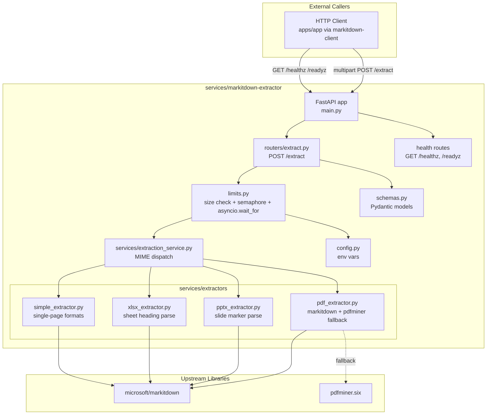
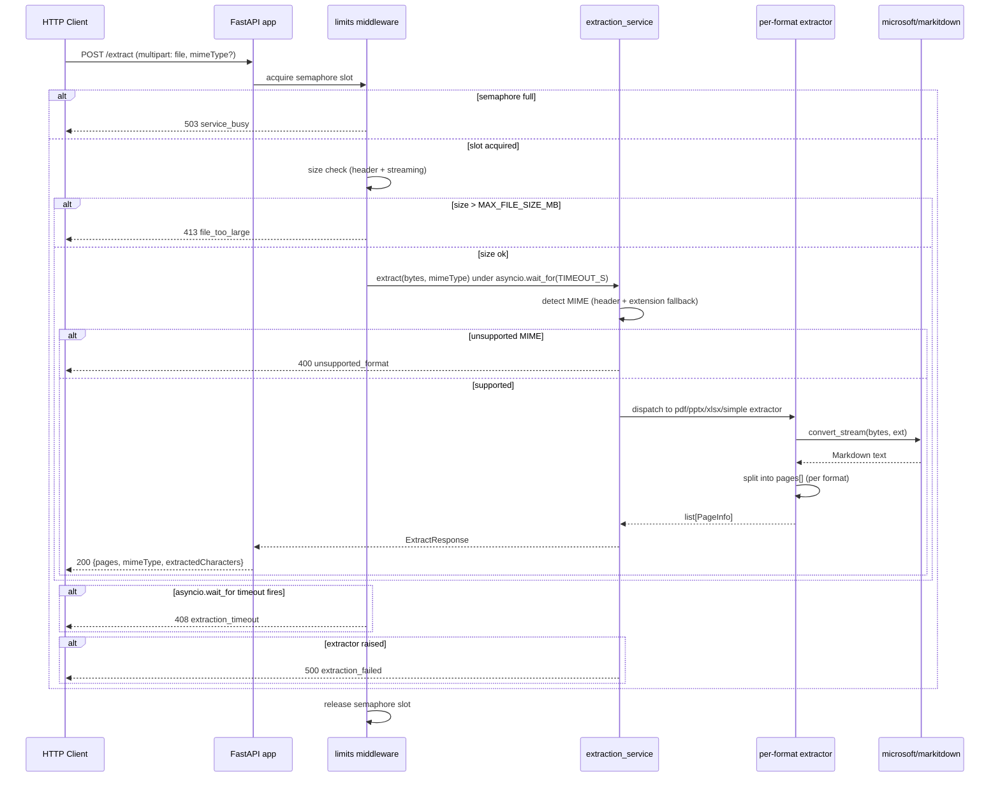

# Technical Design

## Overview

本 spec は、GROWI monorepo に新しく導入する Python マイクロサービス `services/markitdown-extractor` の設計を定める。このサービスは HTTP multipart で受け取った添付ファイルのバイト列を、microsoft/markitdown を用いてページ / スライド / シート単位に分割した Markdown テキストに変換し、JSON で返却する純粋な抽出 API である。

**Purpose**: 「バイト列 → `pages[]` 構造の Markdown テキスト」への変換を純粋に担う独立サービスを提供する。GROWI 本体は抽出ロジックを持たず、HTTP 越しに本サービスを呼び出すことで言語境界 (Python vs Node) とクラッシュドメインを分離する。

**Users**: 直接の利用者は下流 spec (`attachment-search-indexing`) 経由の apps/app server。運用者は GROWI 配布者 (OSS docker-compose) と GROWI.cloud SRE (k8s Deployment + HPA)。

**Impact**: GROWI monorepo に Python ランタイムが初めて導入される。新規トップレベルディレクトリ `services/` を作成するが、**pnpm workspace / turbo pipeline の対象外**とし、既存の Node 系ビルドパイプラインには一切影響させない (`pnpm-workspace.yaml` / `turbo.json` は変更しない)。CI には Python 専用の独立 job を追加する。

### Goals

- PDF / DOCX / XLSX / PPTX / HTML / CSV / TSV / JSON / XML / YAML / プレーンテキスト / RTF / EPub / Jupyter Notebook / Outlook MSG の全 15 形式で添付テキストを抽出する
- PDF / PPTX / XLSX は位置情報 (ページ / スライド / シート) 付きで `pages[]` を返却する
- 外部バイナリ・ネットワーク egress を要求せず pure Python のみで完結する
- 最大ファイルサイズ / タイムアウト / 同時実行上限による DoS 耐性
- Docker image サイズ 250〜400MB、非 root / read-only rootfs / capabilities drop 前提で動作
- OpenAPI spec を `packages/markitdown-client` (下流 spec) 向けに export 可能

### Non-Goals

- 画像 OCR / 音声動画文字起こし / YouTube 等外部 URL 取り込み / Azure Document Intelligence 連携
- ZIP アーカイブ再帰展開 (将来 enhancement)
- Docling 等による高精度構造 / 表抽出
- 永続ストレージ / セッション / ジョブキュー (ステートレス運用)
- GROWI 本体 (apps/app) との統合実装、Elasticsearch 連携、UI、管理画面 (下流 spec の責務)
- `packages/markitdown-client` の orval 設定と生成成果物の消費 (本 spec は OpenAPI spec の export のみ行う)

## Boundary Commitments

### This Spec Owns

- `services/markitdown-extractor/` 配下の全実装 (FastAPI app / 形式別 extractor / Pydantic schemas / limits middleware / config / scripts / tests)
- Dockerfile (Python 3.12-slim + uv multi-stage、非 root、セキュリティハードニング)
- docker-compose エントリ (OSS 配布向け) と k8s manifest 例 (Deployment + Service + HPA + NetworkPolicy + securityContext)
- OpenAPI spec の export スクリプト (`scripts/export_openapi.py` で `/openapi.json` を JSON ファイルに書き出す)
- 抽出 API 契約 (`POST /extract` / `GET /healthz` / `GET /readyz` / `GET /openapi.json`) と `ExtractResponse` / `PageInfo` / `ErrorResponse` / `ErrorCode` の形状
- `services/markitdown-extractor/` 専用 CI job (ruff lint / pytest / image build)
- `services/markitdown-extractor/AGENTS.md` と `README.md`

### Out of Boundary

- apps/app 側の統合 (`AttachmentService.addAttachHandler` 登録、`AttachmentSearchIndexer`、`AttachmentTextExtractorService` ラッパ、pageEvent 権限追従、ES 連携、抽出失敗ログの Mongo 永続化、admin API、admin UI、検索結果 UI、添付ファイル一覧モーダル再抽出ボタン) — すべて下流 spec の責務
- `packages/markitdown-client/` パッケージの実装 (orval 設定、生成ディレクトリ、package.json、TS クライアントコード) — 下流 spec が本 spec の OpenAPI spec を入力として生成
- Elasticsearch の添付用 index mapping、MongoDB の `extractionFailureLog` model、Config キー
- 画像 OCR / 音声 / YouTube / Azure DI / ZIP 再帰 / Docling 等の高精度抽出

### Allowed Dependencies

- microsoft/markitdown `>=0.1.5` (MIT) — 抽出エンジン
- pdfminer.six (MIT) — PDF ページ分割フォールバック用
- FastAPI / Uvicorn / Pydantic v2 (MIT) — HTTP レイヤ
- Python 3.12 / uv (Astral, Apache-2.0) — ランタイムとビルドツール
- Docker build runtime / Kubernetes API の標準機能 (seccomp / capabilities / NetworkPolicy)
- 参考パターンのみ (コード依存なし): 既存 `apps/pdf-converter` の Dockerfile 構造と health check 流儀

### Revalidation Triggers

- `ExtractResponse` / `PageInfo` / `ErrorResponse` / `ErrorCode` の形状変更 → 下流 spec の `packages/markitdown-client` を再生成、apps/app 側呼び出しの型整合を再確認
- `POST /extract` の multipart パラメータ名 / ヘッダ / ステータスコード体系の変更 → 下流 spec クライアントの再検証
- markitdown PR #1263 の状況変化 (マージ済み stable リリース or 仕様変更) → PDF ページ分割のフォールバック実装の削除可否判定
- サポート形式の追加 / 削除 → MIME whitelist の変更、下流 spec のテスト網羅性見直し
- Docker image ベース / 起動コマンド / 非 root uid の変更 → k8s securityContext と NetworkPolicy の再検証
- 環境変数キー名 (`MAX_FILE_SIZE_MB` / `TIMEOUT_S` / `MAX_CONCURRENCY`) の変更 → 下流 spec の admin 設定キーマッピングに影響

## Architecture

### Existing Architecture Analysis

- GROWI monorepo は pnpm workspace + turbo で Node 系を一括管理する構造。Python は未導入
- 既存マイクロサービス `apps/pdf-converter` は Ts.ED + Express で `apps/` 配下に置かれ pnpm workspace の住人だが、本サービスは Python かつ pnpm workspace 外
- 既存 CI は Node 系 matrix のみ。本サービス用には独立 Python job を追加する
- **本サービスは apps/app と直接依存関係を持たず**、HTTP 経由で下流 spec が消費する。本 spec の成果物は「Docker image」と「OpenAPI spec ファイル」の 2 つのみ

### Architecture Pattern & Boundary Map

採用パターン: **単一プロセスの FastAPI マイクロサービス**。マルチプロセス化は Uvicorn worker (`--workers N`) で行い、同時実行制御は Python asyncio semaphore で担う。



**Architecture Integration**:

- **選定パターン**: 単一 FastAPI プロセス + asyncio semaphore。ジョブキュー / Celery 等の非同期基盤は採用しない (抽出は短命リクエストで完結するため)
- **ドメイン境界**: 「HTTP レイヤ」「リソース保護」「形式 dispatch」「形式別 extractor」の 4 層に分離。各層は単方向依存
- **依存方向**: `main.py → routers → limits → orchestrator → per-format extractors → upstream libs`。逆流なし
- **既存パターン維持**: GROWI の既存マイクロサービスパターン (Dockerfile による配布、OpenAPI 経由の型契約) を踏襲しつつ、言語は Python、デプロイ形態は共有 Deployment + HPA とする
- **`services/` ディレクトリ方針**: 本 spec で**新設**のトップレベルディレクトリ。pnpm workspace / turbo pipeline の対象外で、Python 独自ツールチェーン (uv / ruff / pytest) で自己完結する

### Technology Stack

| Layer | Choice / Version | Role in Feature | Notes |
|-------|------------------|-----------------|-------|
| Runtime | Python 3.12 | サービス実行環境 | `python:3.12-slim-bookworm` ベース image |
| HTTP Framework | FastAPI (latest stable) + Uvicorn | HTTP ルーティング / OpenAPI 自動生成 / multipart | `uvicorn --workers N` でプロセス多重化 |
| Validation | Pydantic v2 | リクエスト / レスポンス / エラーの型契約 | OpenAPI schema の source of truth |
| Extraction | microsoft/markitdown `>=0.1.5`, extras `[pdf,docx,xlsx,pptx,outlook]` | 各形式を Markdown に変換 | `[all]` は絶対不使用 (OCR / 音声 / YouTube / Azure DI を引き込むため)。`MarkItDown(enable_plugins=False)` + `llm_client=None` で LLM / OCR 無効化 |
| PDF Fallback | pdfminer.six (latest stable) | markitdown PR #1263 未マージ時のページ分割 | 推定 30〜50 行の薄いラッパ |
| Build Tool | uv (Astral) | 依存解決 / venv / lockfile | `uv sync --locked --no-dev` で reproducible build |
| Container | Docker + multi-stage | image 250〜400MB、非 root uid 10001 | Builder stage で `.venv` 生成、runtime stage にコピーのみ |
| Orchestration | Kubernetes (Deployment + HPA + NetworkPolicy) / docker-compose | 本番 (GROWI.cloud) / OSS 配布 | read-only rootfs / capabilities drop / tmpfs `/tmp` |
| Test | pytest + httpx TestClient | 単体 / 統合 | FastAPI 標準パターン |
| Lint / Format | ruff | Python 静的解析 | CI 必須 |

> 採用背景 (なぜ Python か、なぜ markitdown か、なぜ FastAPI + uv か等) は [research.md](./research.md) と [umbrella research-docker-image.md](../attachment-search/research-docker-image.md) を参照。

## File Structure Plan

### Directory Structure

```
services/                                          # NEW top-level dir (pnpm workspace 外)
└── markitdown-extractor/                          # NEW Python microservice
    ├── Dockerfile                                 # uv + multi-stage, python:3.12-slim-bookworm, non-root
    ├── pyproject.toml                             # markitdown[pdf,docx,xlsx,pptx,outlook]>=0.1.5, fastapi, uvicorn, pdfminer.six
    ├── uv.lock                                    # reproducible build lockfile
    ├── .python-version                            # 3.12
    ├── src/app/
    │   ├── __init__.py
    │   ├── main.py                                # FastAPI app factory + router include + middleware wire-up
    │   ├── routers/
    │   │   ├── __init__.py
    │   │   ├── extract.py                         # POST /extract (multipart)
    │   │   └── health.py                          # GET /healthz, GET /readyz
    │   ├── services/
    │   │   ├── __init__.py
    │   │   ├── extraction_service.py              # MIME判定 → per-format extractor dispatch
    │   │   └── extractors/
    │   │       ├── __init__.py                    # registry: MIME → extractor callable
    │   │       ├── pdf_extractor.py               # markitdown 経由 + pdfminer fallback
    │   │       ├── pptx_extractor.py              # markitdown 出力の <!-- Slide number: N --> パース
    │   │       ├── xlsx_extractor.py              # markdown 見出しをシートとしてパース
    │   │       └── simple_extractor.py            # DOCX/HTML/CSV/TSV/JSON/XML/YAML/TXT/RTF/EPub/Jupyter/MSG
    │   ├── schemas.py                             # Pydantic: PageInfo, ExtractResponse, ErrorResponse, ErrorCode
    │   ├── config.py                              # pydantic-settings: MAX_FILE_SIZE_MB, TIMEOUT_S, MAX_CONCURRENCY, LOG_LEVEL
    │   └── limits.py                              # size check + global semaphore + asyncio.wait_for middleware
    ├── scripts/
    │   └── export_openapi.py                      # /openapi.json を JSON ファイルに書き出し
    ├── tests/
    │   ├── __init__.py
    │   ├── conftest.py                            # FastAPI TestClient fixture
    │   ├── test_extract_pdf.py                    # PDF page 分割
    │   ├── test_extract_pptx.py                   # PPTX スライド分割
    │   ├── test_extract_xlsx.py                   # XLSX シート分割
    │   ├── test_extract_simple.py                 # 単一要素形式
    │   ├── test_limits.py                         # size / timeout / semaphore
    │   ├── test_errors.py                         # unsupported / file_too_large / timeout / busy / failed
    │   ├── test_health.py                         # /healthz, /readyz
    │   └── fixtures/                              # サンプル入力ファイル
    ├── AGENTS.md                                  # Python 開発ガイド (uv / pytest / ruff コマンド)
    └── README.md                                  # サービス概要、起動方法、API 例

docker/                                            # 既存 docker 設定への追記
└── docker-compose.yml                             # + markitdown-extractor service 追加

k8s/                                               # manifest (OSS 配布の必須成果物)
└── markitdown-extractor/
    ├── deployment.yaml                            # Deployment + securityContext + MARKITDOWN_SERVICE_TOKEN を k8s Secret から env 注入
    ├── service.yaml                               # ClusterIP
    ├── hpa.yaml                                   # HPA (CPU 60%, min 2, max 20)
    ├── network-policy.yaml                        # **必須**: egress を cluster DNS + apps/app からの ingress のみに制限 (deployment.yaml と同梱、opt-in ではない)
    └── secret.example.yaml                        # MARKITDOWN_SERVICE_TOKEN 注入の雛形 (値は空欄、ユーザーが作成)

.github/workflows/                                 # CI 追加
└── markitdown-extractor.yml                       # Python 用独立 workflow (詳細は下記)
```

### Repository Layout Notes

- `services/` は本 spec で**新設**されるトップレベルディレクトリ。**pnpm workspace (`apps/*` / `packages/*`) の対象外**で、`pnpm-workspace.yaml` と `turbo.json` は変更しない
- `services/markitdown-extractor/` は Python 独自のツールチェーン (`uv` + pytest + ruff) で自己完結する
- CI は Node 系 workflow (`.github/workflows/ci.yml` 等) とは独立した Python 専用 workflow `.github/workflows/markitdown-extractor.yml` を新設する
- `packages/markitdown-client/` (下流 spec 責務) は引き続き pnpm workspace の住人であり、本 spec は OpenAPI spec ファイルを export するのみで `packages/` 配下には一切触れない

### CI Workflow (`.github/workflows/markitdown-extractor.yml`) の必須 Jobs とゲート条件

本 spec は pnpm/turbo 外であるため、GitHub Actions workflow が**唯一の品質ゲート**。以下 jobs を **failure gate として必須化** (いずれかが fail すれば PR merge 不可):

| Job | コマンド | ゲート条件 |
|---|---|---|
| **Trigger** | `paths: ['services/markitdown-extractor/**', 'packages/markitdown-client/openapi.json']` | PR/push 時に発火 |
| **lockfile 整合性** | `uv sync --locked --no-dev` | lockfile 齟齬で fail |
| **Lint** | `uv run ruff check .` | lint エラーで fail |
| **Format** | `uv run ruff format --check .` | format 崩れで fail |
| **型チェック** (任意、mypy 採用時) | `uv run mypy src/` | 型エラーで fail |
| **Unit tests** | `uv run pytest` | テスト失敗で fail |
| **Docker build** | `docker build -t markitdown-extractor:ci .` | build 失敗で fail |
| **Image size check** | `docker image inspect ... --format='{{.Size}}'` が **450MB 超**で fail | Requirement 3.3 の 250-400MB 目標 + 余裕 50MB |
| **脆弱性スキャン** | `trivy image --severity CRITICAL,HIGH --exit-code 1 markitdown-extractor:ci` | CRITICAL / HIGH 脆弱性検出で fail |
| **OpenAPI drift 検知** | `uv run python scripts/export_openapi.py --output ../../packages/markitdown-client/openapi.json && git diff --exit-code packages/markitdown-client/openapi.json` | schema 変更の commit 忘れで fail (Issue 7 で合意) |
| **リリース (main 限定)** | `docker push ghcr.io/growilabs/markitdown-extractor:<tag>` | main branch push 時のみ実行、tag は version or commit SHA |

**設計上の固定事項** (tasks フェーズで具体 YAML 化する際の制約):
- 上記 jobs 全てが **required status check** として configure される
- Requirement 3.3 (セキュリティハードニング) は image build + trivy scan の 2 段で担保
- Requirement 3.5 (ステートレス) は Dockerfile / k8s manifest のコードレビューで担保 (CI では検証困難)
- image size 上限 **450MB** は NFR として design で固定 (250-400MB 目標 + 50MB 余裕)。超過は trivy scan 前に早期 fail させる
- 並列実行: lint / test / image build は matrix で parallel 可

### Modified Files

- `docker-compose.yml` (OSS 配布) — `markitdown-extractor` service エントリ追加
- `.github/workflows/` — Python 用独立 workflow 新設 (既存 Node workflow は無変更)

> GROWI 本体 (apps/app) 側の変更 (`crowi/index.ts` / `search-delegator/*` / `feature/*` 等) は**本 spec のスコープ外**であり、下流 spec (`attachment-search-indexing`) で扱う。

## System Flows

### 抽出リクエスト処理フロー



**Key decisions**:

- **semaphore → size check → timeout wrapper** の順で早期 reject、無駄な計算を避ける
- **timeout は asyncio.wait_for で enforce** (Uvicorn レベルの worker timeout ではなく FastAPI 側で強制)。pdfminer.six がハングする事例に対応
- **MIME 判定は header (`content-type`) を最優先、拡張子でフォールバック**。whitelist は extractors registry で中央管理
- **PDF は markitdown を第一に呼び、markitdown がページ情報を返さない (PR #1263 未マージ版) 場合は pdfminer.six で分割**する 2-layer 構造
- **エラーは Pydantic `ErrorResponse` で統一**。HTTP ステータスは `400 / 408 / 413 / 500 / 503` の 5 種に固定

## Requirements Traceability

| Requirement | Summary | Components | Interfaces | Flows |
|-------------|---------|------------|------------|-------|
| 1.1 | `pages[]` 構造返却 | extraction_service, extractors/* | `POST /extract` → `ExtractResponse` | 抽出フロー |
| 1.2 | PPTX スライド単位 | pptx_extractor | `ExtractResponse` | 抽出フロー |
| 1.3 | XLSX シート単位 | xlsx_extractor | `ExtractResponse` | 抽出フロー |
| 1.4 | PDF ページ単位 | pdf_extractor (+ pdfminer fallback) | `ExtractResponse` | 抽出フロー |
| 1.5 | 単一ページ形式 | simple_extractor | `ExtractResponse` | 抽出フロー |
| 1.6 | 非対応形式エラー | extraction_service | `ErrorCode.unsupported_format` | 抽出フロー |
| 1.7 | 外部バイナリ/egress 不要 | pyproject.toml extras 選定 + runtime assert | — | — |
| 2.1 | サイズ上限 | limits.py | `ErrorCode.file_too_large` (413) | 抽出フロー |
| 2.2 | タイムアウト | limits.py (asyncio.wait_for) | `ErrorCode.extraction_timeout` (408) | 抽出フロー |
| 2.3 | 同時実行上限 | limits.py (semaphore) | `ErrorCode.service_busy` (503) | 抽出フロー |
| 2.4 | egress 遮断動作 | Dockerfile / k8s NetworkPolicy / compose network config | — | — |
| 3.1 | docker-compose 同梱 | docker-compose.yml service エントリ | — | — |
| 3.2 | k8s Deployment + HPA | k8s/markitdown-extractor/*.yaml | — | — |
| 3.3 | セキュリティハードニング | k8s securityContext + NetworkPolicy (必須同梱) + Dockerfile 非 root + Bearer auth middleware (`MARKITDOWN_SERVICE_TOKEN` 必須) | `Authorization: Bearer` / 401 `unauthorized` | — |
| 3.4 | ステートレス | FastAPI app (セッションレス) + uvicorn `--workers N` | — | — |
| 4.1 | ES ingest ノード非使用 | アーキテクチャ原則: 本サービスは ES に接続しない | — | — |
| 4.2 | テナント間同時実行上限 | limits.py global semaphore (テナント共通) | `ErrorCode.service_busy` | 抽出フロー |

## Components and Interfaces

### Summary

| Component | Domain/Layer | Intent | Req Coverage | Key Dependencies (P0/P1) | Contracts |
|-----------|--------------|--------|--------------|--------------------------|-----------|
| FastAPI app (`main.py`) | HTTP | アプリファクトリ / ルータ配線 / middleware 配線 / `/openapi.json` 提供 / 起動時 `MARKITDOWN_SERVICE_TOKEN` 必須 assert (未設定で fail fast) | 1.1, 3.3, 3.4 | FastAPI (P0) | API |
| BearerAuthMiddleware (`middleware/bearer_auth.py`) | HTTP | `POST /extract` の Bearer token 検証 (全処理の最前段、`hmac.compare_digest` で timing attack 耐性)。`/healthz` / `/readyz` / `/openapi.json` は bypass | 3.3 | FastAPI middleware (P0), config (P0) | Service |
| ExtractRouter (`routers/extract.py`) | HTTP | `POST /extract` のエンドポイントハンドラ | 1.1–1.6, 2.1–2.3 | ExtractionService (P0), limits (P0), BearerAuthMiddleware (P0) | API |
| HealthRouter (`routers/health.py`) | HTTP | `/healthz` (liveness) / `/readyz` (readiness) | 3.2, 3.4 | limits (P1) | API |
| Limits (`limits.py`) | Cross-cutting | サイズ check / semaphore / asyncio.wait_for | 2.1, 2.2, 2.3, 4.2 | config (P0) | Service |
| ExtractionService (`services/extraction_service.py`) | Orchestration | MIME 判定 + extractor dispatch + 形式判別エラー | 1.1, 1.6 | extractors registry (P0) | Service |
| PDF Extractor (`services/extractors/pdf_extractor.py`) | Domain | PDF → ページ単位 `pages[]` (markitdown + pdfminer fallback) | 1.4, 1.7 | markitdown (P0), pdfminer.six (P1) | Service |
| PPTX Extractor (`services/extractors/pptx_extractor.py`) | Domain | PPTX → スライド単位 `pages[]` (slide marker parse) | 1.2, 1.7 | markitdown (P0) | Service |
| XLSX Extractor (`services/extractors/xlsx_extractor.py`) | Domain | XLSX → シート単位 `pages[]` (markdown 見出しパース) | 1.3, 1.7 | markitdown (P0) | Service |
| Simple Extractor (`services/extractors/simple_extractor.py`) | Domain | DOCX/HTML/CSV/TSV/JSON/XML/YAML/TXT/RTF/EPub/Jupyter/MSG → 単一要素 `pages[]` | 1.5, 1.7 | markitdown (P0) | Service |
| Schemas (`schemas.py`) | Contract | Pydantic モデルによる OpenAPI source of truth | 1.1, 1.6, 2.1, 2.2, 2.3 | Pydantic v2 (P0) | API |
| Config (`config.py`) | Cross-cutting | 環境変数ロード (`MAX_FILE_SIZE_MB` / `TIMEOUT_S` / `MAX_CONCURRENCY` / `LOG_LEVEL` / **`MARKITDOWN_SERVICE_TOKEN`** [必須、未設定で fail fast]) | 2.1, 2.2, 2.3, 3.3 | pydantic-settings (P0) | State |
| OpenAPI Export (`scripts/export_openapi.py`) | Build | `app.openapi()` を JSON ファイルに書き出し | — (下流 spec 向け成果物) | FastAPI (P0) | — |
| Dockerfile | Infra | multi-stage build、非 root、最小 runtime | 3.1, 3.3, 3.4 | python:3.12-slim-bookworm, uv | — |
| k8s manifests | Infra | Deployment + Service + HPA + NetworkPolicy + securityContext | 3.2, 3.3, 3.4, 4.1, 4.2 | Kubernetes | — |

### MarkitdownExtractorService (Python microservice)

> 本 spec 全体を通じて、対外的には 1 つのサービスである。内部構造 (FastAPI app / ルータ / limits / orchestrator / extractors) は実装詳細として上記コンポーネント表に分解してある。

| Field | Detail |
|-------|--------|
| Intent | 純粋な抽出 API。`bytes → pages[]` 変換とリソース保護 |
| Requirements | 1.1, 1.2, 1.3, 1.4, 1.5, 1.6, 1.7, 2.1, 2.2, 2.3, 2.4, 3.1, 3.2, 3.3, 3.4, 4.1, 4.2 |

**Responsibilities & Constraints**

- 形式判定 (MIME ヘッダ優先 + 拡張子フォールバック) と whitelist 検証
- markitdown 呼び出し + 形式別後処理 (PPTX スライド分割 / XLSX シート分割 / PDF ページ分割)
- リソース制限 (サイズ / タイムアウト / semaphore) の強制
- ステートレス動作 (Pod 再起動で失う状態を持たない)
- 外部 egress を一切行わない (markitdown の YouTube / 外部 URL 機能は無効化)

**Dependencies**

- Inbound: HTTP clients (下流 spec の apps/app が `packages/markitdown-client` 経由で呼び出し)
- External: microsoft/markitdown 0.1.x (P0), pdfminer.six (P1 フォールバック), FastAPI/Uvicorn (P0), Pydantic v2 (P0)

**Contracts**: Service [ ] / **API [x]** / Event [ ] / Batch [ ] / State [ ]

#### API Contract

| Method | Endpoint | Auth | Request | Response | Errors |
|--------|----------|------|---------|----------|--------|
| POST | /extract | **Bearer 必須** | `Authorization: Bearer <token>` + multipart: `file` (必須), `mimeType` (任意 hint) | `ExtractResponse` (200) | 400 `unsupported_format`, 401 `unauthorized`, 408 `extraction_timeout`, 413 `file_too_large`, 500 `extraction_failed`, 503 `service_busy` |
| GET | /healthz | 不要 | — | `{ "status": "ok" }` (200) | — |
| GET | /readyz | 不要 | — | `{ "status": "ready", "dependencies": {...} }` (200) or 503 `not_ready` | 503 |
| GET | /openapi.json | 不要 | — | OpenAPI 3.x schema (FastAPI 自動生成) | — |

**運用**: `/healthz` は liveness probe (プロセスが生きていれば OK)、`/readyz` は readiness probe (semaphore 余裕あり + 依存 import 成功)。k8s の livenessProbe / readinessProbe に直結。

**認証 (本 spec の必須要件)**:
- `POST /extract` は FastAPI middleware で `Authorization: Bearer <token>` を検証、一致しない場合は size check / semaphore 取得の**前**に 401 `unauthorized` を返す (DoS 前置き防御)
- 期待する token は環境変数 `MARKITDOWN_SERVICE_TOKEN` (起動時に必須、未設定ならサービス起動失敗)。テスト用途の `ALLOW_UNAUTHENTICATED=true` は提供しない (設計レベルで無効化手段を持たないことで誤運用を防止)
- 比較は `hmac.compare_digest` を使用し timing attack を防止
- token rotation: 環境変数更新 → Pod 再起動で切替。零停止 rotation は本 spec スコープ外 (GROWI 本体側で接続 token を更新し再起動することで整合)
- `/healthz` / `/readyz` / `/openapi.json` は auth 対象外 (k8s probe / CI drift 検知 / 運用ツールから non-auth で参照できる必要があるため)

### Data Contract — Pydantic Models

```python
# schemas.py (抜粋、実装はこのシグネチャに従う)
class PageInfo(BaseModel):
    pageNumber: int | None    # 1 始まり。位置概念なしは None
    label: str | None         # 表示ラベル (スライド番号文字列 / シート名 / ページ番号文字列)。位置概念なしは None
    content: str              # Markdown テキスト

class ExtractResponse(BaseModel):
    pages: list[PageInfo]
    mimeType: str             # サーバで確定した MIME
    extractedCharacters: int  # 全 pages の content 合計長 (監査 / metrics 用)

class ErrorCode(str, Enum):
    unsupported_format = "unsupported_format"
    file_too_large = "file_too_large"
    extraction_timeout = "extraction_timeout"
    service_busy = "service_busy"
    extraction_failed = "extraction_failed"

class ErrorResponse(BaseModel):
    code: ErrorCode
    message: str
```

**Implementation Notes**

- **OpenAPI の source of truth は Pydantic schema**。`scripts/export_openapi.py` は `app.openapi()` を取得して指定ファイルに出力する
- **OpenAPI drift 検知パイプライン (本 spec 確定方針)**:
  - `scripts/export_openapi.py --output ../../packages/markitdown-client/openapi.json` で下流の commit 済みファイルを直接上書き
  - **`packages/markitdown-client/openapi.json` は commit 必須** (下流 spec 側でも明記)。これにより schema 変更が PR レビューで可視化される
  - **Python CI (services/markitdown-extractor)**: lint/test job の一部として `python scripts/export_openapi.py --output ../../packages/markitdown-client/openapi.json && git diff --exit-code packages/markitdown-client/openapi.json` を実行。commit し忘れで CI fail
  - **Node CI (下流 spec)**: commit 済み `openapi.json` を入力に orval を走らせ `git diff --exit-code packages/markitdown-client/src/` で orval 出力の drift も検知 (下流 spec の責務、本 spec は Python 側の drift 検知のみ担保)
  - **pdf-converter との差異**: `apps/pdf-converter` は Node 内 turbo 依存で build 時に swagger を regenerate するが、本 spec は Python/Node 境界を跨ぐため turbo 依存を設けず、**commit 済み artifact + 両 CI の git diff --exit-code** で drift を検知する。`services/` が pnpm workspace 外である制約の自然な結果
- **`ErrorCode` の enum 文字列は下流 spec と同期**が必要。本 spec 内では破壊的変更しない規約を維持する (Revalidation Triggers 参照)
- **markitdown 初期化は `MarkItDown(enable_plugins=False)` + `llm_client=None`** を標準とする。画像 OCR と LLM 連携を default で無効化 (安全側)
- **PDF ページ分割**: markitdown の `convert_stream()` が PR #1263 (`extract_pages=True`) を提供していればそれを使用、提供していなければ `pdfminer.six` の `high_level.extract_text_to_fp()` を page_numbers=[i] で繰り返し呼ぶフォールバック (推定 30〜50 行)
- **PPTX スライド分割**: markitdown 出力の `<!-- Slide number: N -->` HTML コメント (現行 stable に含まれる) を regex でパース
- **XLSX シート分割**: markitdown 出力の markdown 見出し (`## SheetName` 形式) を parse

### Limits (Cross-cutting)

| Field | Detail |
|-------|--------|
| Intent | サイズ / タイムアウト / 同時実行の三点セット強制 |
| Requirements | 2.1, 2.2, 2.3, 4.2 |

**Responsibilities & Constraints**

- **サイズチェック**: リクエスト受信時点で `Content-Length` ヘッダと設定上限 (`MAX_FILE_SIZE_MB`、default 50MB) を比較、超過なら 413 即返却。ストリーミング読み込み中も累積バイト数を再確認 (ヘッダ詐称対策)
- **同時実行制御**: `asyncio.Semaphore(MAX_CONCURRENCY)` をグローバル 1 つで運用。取得できなければ即 503 `service_busy` (block せず try_acquire ベース)
- **タイムアウト**: extractor 呼び出しを `asyncio.wait_for(extract_coro, timeout=TIMEOUT_S)` で包む。default 60s
- **既定値**: `MAX_FILE_SIZE_MB=50`, `TIMEOUT_S=60`, `MAX_CONCURRENCY=max(2, workers*2)`。すべて環境変数で override 可

**Contracts**: **Service [x]** / API [ ] / Event [ ] / Batch [ ] / State [ ]

#### Service Interface (Python type sketch)

```python
class Limits:
    async def acquire_slot(self) -> AsyncContextManager[None]:
        """try_acquire semaphore. Raise ServiceBusy if full."""
    async def enforce_size(self, stream: AsyncIterable[bytes]) -> bytes:
        """Accumulate bytes, raise FileTooLarge if exceeded."""
    async def with_timeout(self, coro: Awaitable[T]) -> T:
        """Wrap via asyncio.wait_for, raise ExtractionTimeout."""
```

- **Preconditions**: `config.MAX_FILE_SIZE_MB / TIMEOUT_S / MAX_CONCURRENCY` が有効値
- **Postconditions**: 異常時は HTTP レイヤで対応 ErrorCode / ステータスに変換される
- **Invariants**: semaphore は必ず release される (`AsyncContextManager` で保証)

### Extraction Service (Orchestrator)

| Field | Detail |
|-------|--------|
| Intent | MIME 判定 → extractors registry dispatch |
| Requirements | 1.1, 1.6 |

**Responsibilities & Constraints**

- MIME ヘッダを第一優先、ファイル名拡張子で fallback、registry (`extractors/__init__.py`) で whitelist 管理
- whitelist にない MIME は `unsupported_format` を raise
- 対応 extractor の非同期関数に `(bytes, filename)` を渡し `list[PageInfo]` を受け取る

### Per-format Extractors

各 extractor は **純粋関数** (副作用なし、`bytes → list[PageInfo]`) として実装する。framework (FastAPI) への依存は持たない。これによりユニットテストと将来の非 HTTP 利用 (CLI / バッチ) が容易になる。

- **pdf_extractor**: markitdown の `extract_pages` 対応 (PR #1263) を第一、未対応ならば `pdfminer.six.high_level` で 1 ページずつ `extract_text_to_fp` を呼び、ページ番号で `PageInfo(pageNumber=i, label=f"Page {i}", content=markdown_text)` を構築
  - **Feature detection 戦略 (本 spec 確定方針)**:
    - **起動時 1 回の capability probe**: app factory 内で `inspect.signature(markitdown.MarkItDown().convert_stream).parameters` を検査し、`extract_pages` parameter の存在を確認。結果を `PDF_EXTRACTION_STRATEGY: Literal['markitdown', 'pdfminer_fallback']` として module global にキャッシュ
    - **/readyz で strategy を expose**: 応答 JSON に `{"pdf_extraction_strategy": "markitdown" | "pdfminer_fallback"}` を含める。運用者が現在の経路を即座に把握可能
    - **起動時ログ出力**: 採用 strategy を INFO level で 1 行ログ (例: `PDF extraction strategy: pdfminer_fallback (markitdown 0.1.5 does not expose extract_pages)`)
    - **ランタイムでの try/except 不採用**: リクエスト毎の introspection は非効率、起動時 probe で一意に決定
    - **Version pin**: `pyproject.toml` で `markitdown>=0.1.5` を最小要件として固定。将来 PR #1263 が stable release された version (例: `>=0.2.0`) が判明したら pin を上げて pdfminer.six フォールバック削除を検討。このバージョン判定変更は **Revalidation Triggers に列挙済み** (「markitdown PR #1263 の状況変化」)
    - **テスト**: probe のユニットテストでは `MarkItDown` を mock し `extract_pages` あり/なし両方のシグネチャで strategy が正しく判定されることを verify
- **pptx_extractor**: markitdown 出力を `<!-- Slide number: N -->` regex で分割、`PageInfo(pageNumber=N, label=f"Slide {N}", content=slide_md)` を構築
- **xlsx_extractor**: markitdown 出力の `## SheetName` 見出しで分割、`PageInfo(pageNumber=i, label=sheet_name, content=sheet_md)` を構築
- **simple_extractor**: DOCX / HTML / CSV / TSV / JSON / XML / YAML / TXT / RTF / EPub / Jupyter / MSG 共通。markitdown 出力を単一 `PageInfo(pageNumber=None, label=None, content=md)` として返却

## Data Models

### API Data Transfer

本サービスはステートレスであり、永続ストレージを持たない。データ契約は **HTTP multipart リクエスト** と **JSON レスポンス** のみである。

**Request**:
- `POST /extract` (multipart/form-data)
  - `file`: 添付ファイルのバイト列 (必須、最大 `MAX_FILE_SIZE_MB` MB)
  - `mimeType`: MIME hint (任意、サーバ側で header / 拡張子より優先)

**Response (200)**:
```json
{
  "pages": [
    { "pageNumber": 1, "label": "Page 1", "content": "# 見出し\n本文..." },
    { "pageNumber": 2, "label": "Page 2", "content": "..." }
  ],
  "mimeType": "application/pdf",
  "extractedCharacters": 12345
}
```

**Response (error, 4xx/5xx)**:
```json
{ "code": "file_too_large", "message": "File size 73 MB exceeds limit 50 MB" }
```

> ES 添付 index mapping、MongoDB `extractionFailureLog` schema、apps/app 側の `IAttachmentHit` DTO、`IPageWithSearchMeta.attachmentHits[]` 等は **Out of Boundary**。下流 spec で定義する。

## Error Handling

### Error Strategy

HTTP クライアントには `ErrorResponse { code, message }` を一貫して返す。クライアント側は `code` (enum) を分類キーに、`message` は人間可読なヒント (ログ / トースト用) と位置付ける。

### Error Categories and Responses

| ErrorCode | HTTP Status | 契機 | 対応 |
|-----------|-------------|------|------|
| `unauthorized` | 401 | Bearer token 欠落 / 不一致 | FastAPI middleware の最前段で即返却、size check / semaphore 取得より前 |
| `unsupported_format` | 400 | MIME whitelist 外 | 抽出を行わず即返却 |
| `file_too_large` | 413 | 受信バイト > `MAX_FILE_SIZE_MB` | サイズ超過時点で停止 |
| `extraction_timeout` | 408 | `asyncio.wait_for` タイムアウト発火 | 進行中の extractor をキャンセル |
| `service_busy` | 503 | semaphore 満杯 | 抽出を開始せず即返却 |
| `extraction_failed` | 500 | markitdown / pdfminer / 未分類例外 | ログ記録 + 500 返却 |

### Monitoring

- **構造化ログ (JSON)**: FastAPI middleware で `{ requestId, method, path, statusCode, latencyMs, fileSize, mimeType, errorCode? }` を pino 互換フォーマットで stdout に出力 (k8s の log collector が拾う)
- **メトリクス**: `http_requests_total{code,endpoint}` / `extraction_duration_seconds{mime}` / `concurrent_extractions` を Prometheus 形式または OTEL exporter で提供 (初期実装は標準 FastAPI middleware)

## Testing Strategy

### Unit Tests (形式別 extractor、limits)

- **PDF**: 3 ページの PDF を投入し `pages[].pageNumber` が `[1, 2, 3]`、各 content が非空
- **PPTX**: 5 スライド PPTX を投入、`pages[].label` が `["Slide 1"..."Slide 5"]`
- **XLSX**: 2 シート XLSX を投入、`pages[].label` がシート名
- **Simple**: DOCX / TXT / JSON 各 1 件、`pageNumber == None`, `label == None`、`len(pages) == 1`
- **Limits**: サイズ超過 → `FileTooLarge`、タイムアウト → `ExtractionTimeout`、semaphore 満杯 → `ServiceBusy`
- **Unsupported**: 不明 MIME → `UnsupportedFormat`

### Integration Tests (FastAPI TestClient)

- `POST /extract` Bearer 認証: 正しい token で 200 / 欠落で 401 / 不一致で 401 / 大容量ファイルでも認証失敗なら 401 が優先されること (size check より前に認証を評価)
- `POST /extract` multipart でサンプル PDF を送信し 200 + 正しい `ExtractResponse`
- サポート外形式 (`application/x-custom`) → 400 `unsupported_format`
- 大容量ファイル (> MAX_FILE_SIZE_MB) → 413 `file_too_large`
- 無限ループ fixture (ハングする PDF 模擬) → 408 `extraction_timeout` (TIMEOUT_S=1 に設定)
- 並列 10 リクエスト + MAX_CONCURRENCY=2 → 8 リクエストが 503 `service_busy`
- `GET /healthz` / `GET /readyz` / `GET /openapi.json` が認証なしで 200
- 起動時 `MARKITDOWN_SERVICE_TOKEN` 未設定の状態で app factory を呼ぶと fail fast (例外 throw) すること

### Docker Image Smoke Test

- `docker build` → image サイズを測定 (目標 250〜400MB)
- コンテナ起動 + `/healthz` が 200
- `readOnlyRootFilesystem: true` でも起動可能
- egress を iptables で全遮断した状態で `POST /extract` (PDF) が成功

## Security Considerations

- **認証 (Bearer token 必須)**: `POST /extract` は起動時環境変数 `MARKITDOWN_SERVICE_TOKEN` を基に `Authorization: Bearer <token>` を検証する。token 未設定での起動は fail fast (プロセス終了)。検証は FastAPI middleware として全処理の最前段に配置し、size check / semaphore 取得前に 401 を返す (不正リクエストで DoS を誘発させない)。比較は `hmac.compare_digest` で timing attack 耐性を持たせる。`ALLOW_UNAUTHENTICATED` 等の opt-out env は**提供しない** (設計レベルで無効化手段を持たないことで誤運用を防止)
- **コンテナ分離**: k8s Pod に `readOnlyRootFilesystem: true`, `runAsNonRoot: true` (uid 10001), `capabilities: { drop: ["ALL"] }`, `allowPrivilegeEscalation: false`, seccomp `RuntimeDefault`、`/tmp` を size-limited tmpfs (emptyDir sizeLimit=512Mi)
- **Network egress 遮断 (OSS 配布物で必須提供)**: k8s manifest (`infra/k8s/network-policy.yaml`) / docker-compose (`infra/docker/compose.yaml` の `networks:` で user-defined bridge + `internal: true` オプション) を**必須成果物として同梱**し、ユーザーが opt-in しなくても egress が遮断された状態で動作するよう default 構成を提供。apps/app からの ingress のみ許可、外向き通信は cluster DNS 以外遮断。markitdown の YouTube / 外部 URL 機能が誤って呼ばれても失敗する
- **DoS 対策**: `MAX_FILE_SIZE_MB` (default 50), `TIMEOUT_S` (default 60), `MAX_CONCURRENCY` (default `max(2, workers*2)`)。すべて環境変数で override 可
- **悪意ある PDF 対策**: pdfminer.six のハング事例があるため、timeout を必ず enforce (Uvicorn worker timeout ではなく FastAPI 側 `asyncio.wait_for` で打ち切り、cancellable な coroutine 設計)
- **secret 管理**: markitdown 関連の外部 API キー (Azure DI / OpenAI 等) は**一切使わない**。`llm_client=None` と extras `[pdf,docx,xlsx,pptx,outlook]` のみで、OCR / 音声 / YouTube / Azure DI は import すらしない。`MARKITDOWN_SERVICE_TOKEN` は k8s Secret / docker-compose env file で管理、image に焼き込まない
- **ベース image hardening**: `python:3.12-slim-bookworm` を採用、apt パッケージ追加は最小限 (ffmpeg 等は不要)。脆弱性スキャンは CI で Trivy 等を回す

## Performance & Scalability

### 抽出サービスのスループット目標

- **レイテンシ**: 5MB PDF で p50 < 2s, p95 < 10s
- **メモリ**: 1 worker idle ~120MB, 処理中 ~500MB peak (k8s requests 256Mi / limits 1Gi 推奨)
- **Image size**: 250〜400MB (`[all]` 回避 + multi-stage build で達成)

### スケーリング

- **Pod 内並列**: `uvicorn --workers N` (CPU コア数に応じて N=2〜4 推奨)
- **Pod 間スケール**: k8s HPA を CPU 60% target で、`minReplicas=2, maxReplicas=20` を推奨 default
- **semaphore tuning**: `MAX_CONCURRENCY = workers * 2` を目安、メモリ limits との兼ね合いで admin が調整

### マルチテナント公平性 (R4.2)

- `MAX_CONCURRENCY` はテナント共通のグローバル上限。特定テナントが大量リクエストを送っても、semaphore により他テナントの要求を完全停止させない (503 で素早く reject させることで、HPA がスケールアウトするまでの間も他テナントにスロットが回る)

## Open Questions / Risks

1. ~~**markitdown PR #1263** が本 spec 出荷時点で stable released されるか → released なら pdfminer.six フォールバックを削除、未 released なら初期実装に同梱~~ **[Resolved]** **起動時 capability probe による二経路対応**を design で固定 (Per-format Extractors § pdf_extractor)。markitdown が `extract_pages` を提供すれば採用、なければ pdfminer.six で自動フォールバック。`/readyz` で現在の strategy を expose し運用可視性を確保。PR マージ状況に関わらず安全に出荷可能 ([research.md](./research.md) 参照)
2. ~~**`services/` ディレクトリに対する CI 配線** → Python 用 GitHub Actions workflow を新設する必要あり (既存 Node workflow への影響なし)。具体コマンド (`uv sync` / `uv run pytest` / `uv run ruff check` / `docker build`) の統合は実装時に確定~~ **[Resolved]** `.github/workflows/markitdown-extractor.yml` の必須 jobs とゲート条件を上記 Repository Layout Notes §CI Workflow で確定 (lockfile / ruff / pytest / docker build / image size 450MB 上限 / trivy CRITICAL+HIGH / OpenAPI drift 検知)。tasks フェーズで YAML 実装
3. ~~**OpenAPI spec drift 検知**: `scripts/export_openapi.py` の実行タイミング (毎回 regenerate vs コミット済み artifact を diff で検知) は、下流 spec との協調で決定。本 spec の責務は export スクリプト提供まで~~ **[Resolved]** commit 済み `packages/markitdown-client/openapi.json` 方式 + Python CI での `git diff --exit-code` 検知を採用 (上記 API Contract セクションに詳細)。Python / Node の境界を跨ぐため pdf-converter のような turbo 依存では解決できず、commit artifact + 両 CI の drift 検知が最適解
4. ~~**Image 脆弱性スキャン**: Trivy 等の CI 統合は CI 配線タスクで決定~~ **[Resolved]** Trivy を CRITICAL / HIGH で `--exit-code 1` 必須 gate (上記 CI Workflow テーブル)
5. **uv lockfile の monorepo 整合性**: pnpm workspace 外のため、Dependabot 等の自動更新パイプラインは独立運用。既存 Renovate 設定への影響なし
6. **HPA チューニング**: 実ワークロードでの CPU target % は出荷後に調整 (初期値は 60%)
