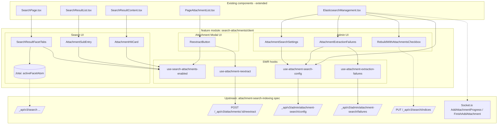
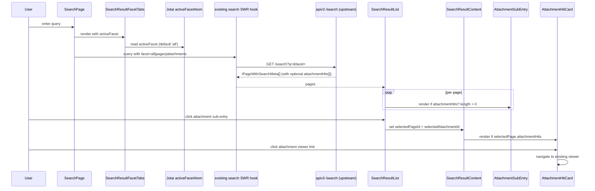
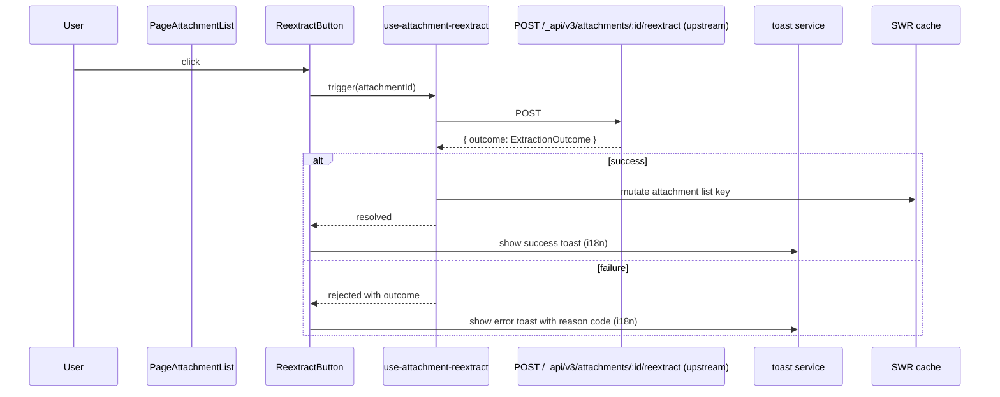
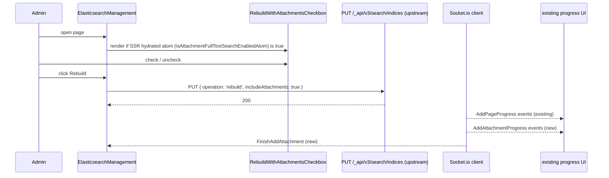

# Technical Design

## Overview

本 spec は GROWI 添付ファイル全文検索機能のクライアント側 UI 統合を担う。上流 `attachment-search-indexing` spec が提供する検索 API 応答 (`IPageWithSearchMeta.attachmentHits[]`)、apiv3 エンドポイント (reextract / admin config / admin failures / search indices rebuild 拡張)、Config キー、Socket.io 進捗イベントを**消費するだけ**で、サーバ側実装は一切持たない。

**Purpose**: 上流 spec が整えたデータ/API を、エンドユーザの検索体験と管理者の運用体験に変換する。既存 SearchPage / PageAttachmentList / ElasticsearchManagement を最小差分で拡張し、新規コンポーネントと SWR hooks は feature module `apps/app/src/features/search-attachments/client/` に集約する。

**Users**: GROWI 利用者 (検索結果画面で添付ヒットを発見・遷移)、GROWI 管理者 (機能有効化、一括再インデックス操作、抽出失敗追跡)。

**Impact**: apps/app の 5 つの既存コンポーネント (`SearchPage.tsx` / `SearchResultList.tsx` / `SearchResultContent.tsx` / `PageAttachmentList.tsx` / `ElasticsearchManagement.tsx`) に optional prop / conditional render を追加。新規 feature module 配下に 7 つのコンポーネントと 4 つの SWR hooks を追加。サーバ側実装はゼロ。

### Goals

- 上流 spec の `IPageWithSearchMeta.attachmentHits[]` を左ペイン Page カード内のサブエントリと右ペインプレビュー上部の添付ヒットカードに表示する
- 「全体 / ページ / 添付ファイル」の 3 択ファセットタブを新規提供し、検索 API のクエリパラメータ (上流契約) に反映する
- 添付ファイル一覧モーダルに「再抽出」行アクションを追加し、apiv3 の結果を toast でフィードバックする
- `ElasticsearchManagement` に設定セクション、rebuildIndex の「添付も対象にする」チェックボックス、抽出失敗可視化パネルを追加する
- 機能が無効化されている状態では追加 UI がすべて非表示になり、既存画面の表示が導入前と完全に一致する

### Non-Goals

- apiv3 エンドポイント実装 / ES 連携 / Config 永続化 / 応答型定義 (上流 `attachment-search-indexing` 責務)
- 抽出サービス本体 (`markitdown-extractor` 責務)
- 添付ビューア本体の機能追加、PDF インラインプレビュー、抽出テキスト全文プレビュー
- 形式別詳細ファセット (PDF だけ / xlsx だけ等)、選択的再インデックス UI
- 添付専用検索画面の新設 (既存 SearchPage を拡張する方針)

## Boundary Commitments

### This Spec Owns

- `apps/app/src/features/search-attachments/client/components/` 配下の新規 UI コンポーネント群 (検索 / 添付モーダル / admin)
- `apps/app/src/features/search-attachments/client/services/` 配下の SWR hooks (reextract mutation / admin config / failures / 機能ゲート)
- UI 側で消費する DTO 型 (`IAttachmentHit` は上流で定義される前提、本 spec は props shape として再表現する)
- 既存コンポーネント (`SearchPage.tsx` / `SearchResultList.tsx` / `SearchResultContent.tsx` / `PageAttachmentList.tsx` / `ElasticsearchManagement.tsx`) への optional prop と conditional render の追加
- ファセット state 管理 (Jotai atom) と検索 API クエリパラメータへの反映
- UI 側の i18n 文言キー追加 (ja/en)
- 機能無効時の UI 非表示ゲート実装

### Out of Boundary

- apiv3 エンドポイントの実装 (`POST /_api/v3/attachments/:id/reextract` / admin 系 / `PUT /_api/v3/search/indices` の `includeAttachments` 受理) は上流 spec
- Config キーの定義・永続化 (`app:attachmentFullTextSearch:*`) は上流 spec
- ES 連携 / ES インデックス mapping / AttachmentService ハンドラ登録 / pageEvent 権限追従 / 検索クエリの multi-index 集約サーバ実装は上流 spec
- Socket.io 送信側実装 (`AddAttachmentProgress` / `FinishAddAttachment`) は上流 spec (受信側リスナのみ本 spec)
- 抽出サービス本体、Docker 配布、k8s manifest
- 添付ビューア本体、既存検索レイアウト全体の変更

### Allowed Dependencies

- 上流 `attachment-search-indexing` spec が提供する:
  - `IPageWithSearchMeta.attachmentHits?: IAttachmentHit[]` 応答型 (optional フィールド)
  - apiv3 エンドポイント: `POST /_api/v3/attachments/:id/reextract` / `GET /_api/v3/admin/attachment-search/failures` / `GET|PUT /_api/v3/admin/attachment-search/config` / `PUT /_api/v3/search/indices` (includeAttachments 受理)
  - Config キー: `app:attachmentFullTextSearch:extractorUri` / `timeoutMs` / `maxFileSizeBytes` の 3 キーのみ (読み書き API 経由)。旧 `enabled` / `maxConcurrency` キーは上流で削除済み
  - Socket.io イベント: `AddAttachmentProgress` / `FinishAddAttachment`
  - SSR prop `searchConfig.isAttachmentFullTextSearchEnabled: boolean` (基本レイアウトの `SearchConfigurationProps.searchConfig` 経由で全ページに hydrate 済み、admin 権限なしでも参照可能な機能有効フラグ)。値は上流で「ES 有効 AND `extractorUri` 設定済み」の**算出値**として導出される (shape 自体は `boolean` のまま不変)
- 既存 `SearchPage` / `SearchResultList` / `SearchResultContent` / `PageAttachmentList` / `ElasticsearchManagement`
- 既存 Jotai + SWR パターン、`useSWRxAttachments()`、`@growi/ui` の `Attachment` 行アクション props
- 既存 i18n フレームワーク (next-i18next)、既存 toast サービス、既存 admin 権限チェック
- Next.js 16 Pages Router + React 18 + Turbopack

### Revalidation Triggers

上流 spec 側の以下の変更が発生した場合、本 spec のコンポーネントと SWR hook の回帰テストが必要:

- `IPageWithSearchMeta.attachmentHits[]` のフィールド形状変更 (例: `label` の型、`snippet` の構造、`pageNumber` の nullable 扱い)
- apiv3 エンドポイントの request/response shape またはパス変更
- Config キー集合の追加・削除・rename (例: `enabled` / `maxConcurrency` の削除は既に発生済み。今後さらに `extractorUri` / `timeoutMs` / `maxFileSizeBytes` の rename や新キー追加が発生した場合、本 spec の `AttachmentSearchConfigForm` 型と `AttachmentSearchSettings` フォームの追従が必要)
- Socket.io イベント名 / payload 変更
- 検索 API のクエリパラメータ名 (ファセット指定) 変更
- 機能有効/無効の算出ロジック変更 (上流 SSR prop の算出式が「ES 有効 AND `extractorUri` 設定済み」以外に変わる場合、判定の意味論が変わるため本 spec のコメント・ドキュメントと admin UI のガイダンス文言 (URI 未設定時の UI 状態説明など) を再確認)
- 上流 spec の `SearchConfigurationProps.searchConfig` shape 変更 (特に `isAttachmentFullTextSearchEnabled` フィールドの有無・型変更) → 本 spec の機能ゲート hook (`use-search-attachments-enabled`) と Jotai atom (`isAttachmentFullTextSearchEnabledAtom`) の型変更および hydrate ロジックの調整
- **上流 `IAttachmentHit.score` の意味論または配列順序意味論の変更** (例: relevance order ではなくなる、`score` の scale/方向が変わる、`score` が optional 化される等) → 本 spec の `AttachmentSubEntry` / `AttachmentHitCard` の sort ロジックと展開対象決定の再検証が必要

## Architecture

### Existing Architecture Analysis

GROWI apps/app は Next.js 16 Pages Router + Express モノリス。クライアント側は以下の既存構造を持つ:

- **検索 UI**: `apps/app/src/features/search/client/components/SearchPage/` 配下に `SearchPage.tsx` (ルート) / `SearchResultList.tsx` (左ペイン) / `SearchResultContent.tsx` (右ペイン) が分かれている。検索応答は `IPageWithSearchMeta` 配列で、各 Page に `elasticSearchResult.snippet` などの highlight 情報が載る
- **添付モーダル**: `PageAccessoriesModal/PageAttachment.tsx` が Jotai + SWR で開閉と一覧取得を制御。`PageAttachment/PageAttachmentList.tsx` が `@growi/ui` の `Attachment` コンポーネントに行 prop (`onAttachmentDeleteClicked` など) を渡すパターン。削除は `DeleteAttachmentModal` の Jotai atom で制御
- **Admin 画面**: `Admin/ElasticsearchManagement/ElasticsearchManagement.tsx` に Reconnect / Normalize / Rebuild ボタンと Socket.io 進捗表示 (`AddPageProgress` / `FinishAddPage` / `RebuildingFailed`)
- **状態管理**: 検索 UI は SWR + Jotai、admin は SWR で Config 同期、モーダルは Jotai atom
- **SSR 到達性**: Pages Router + Turbopack 構成。server 専用依存 (DB 接続、pino、`packages/markitdown-client` 等) は client バンドルから到達可能な import チェーンに入れてはならない

本 spec は**すべての既存拡張ポイントの内側**で動く。optional prop / conditional render を足すだけで、既存の構造・データフロー・SSR 到達性ルールを壊さない。

### Architecture Pattern & Boundary Map

採用パターン: **Client-side feature module + 既存 UI への optional 拡張**。サーバ API は外部 box として扱い、`fetch` / SWR 経由でのみ触る。



**Architecture Integration**:
- **選定パターン**: Client-side feature module。サーバ側実装を持たないため、責務は純粋に UI 層 (component + SWR + Jotai)
- **ドメイン/境界**: 「検索結果表示」「添付モーダル行アクション」「admin 設定 UI」の 3 サブドメインに分割し、各サブドメインが独自のコンポーネントと hook を持つ
- **依存方向**: UI コンポーネント → SWR hook / Jotai atom → 上流 apiv3 エンドポイント。逆流なし
- **既存パターン維持**: SWR + Jotai + i18n、`@growi/ui` 行アクション props パターン、admin SWR 設定同期、Socket.io 進捗受信
- **Steering 準拠**: 機能ベース配置 (`features/search-attachments/client/`)、名前付きエクスポート、`kebab-case` for utilities、`PascalCase.tsx` for components、英語コメント、co-located tests

### Technology Stack

| Layer | Choice / Version | Role in Feature | Notes |
|-------|------------------|-----------------|-------|
| Frontend Framework | React 18 / Next.js 16 Pages Router | UI 基盤 | 既存構成踏襲 |
| State (UI) | Jotai | ファセット state、モーダル状態 | 既存 atom パターン踏襲 |
| State (server data) | SWR | apiv3 同期、再抽出 mutation、失敗一覧、機能ゲート、Config | 既存 `useSWRxAttachments()` と同水準 |
| Styling | Bootstrap 5 / SCSS modules (既存準拠) | コンポーネント見た目 | 既存 `ElasticsearchManagement` と同じ流儀 |
| i18n | next-i18next | UI 文言 (ja / en) | 新規キーは `attachment_full_text_search.*` namespace 配下 |
| Real-time | Socket.io client (既存) | rebuildIndex 進捗受信 | 既存 `AddPageProgress` listener と同経路 |
| Bundler | Turbopack | SSR / client bundle 分離 | server 専用依存を client 経路から隔離 |

> 上流 spec が `packages/markitdown-client` を定義するが、これは**server 専用依存**であり本 spec の UI から直接 import してはならない (apiv3 経由でのみ触る)。

## File Structure Plan

### New Files (feature module client)

```
apps/app/src/features/search-attachments/client/
├── components/
│   ├── SearchPage/
│   │   ├── AttachmentHitCard.tsx           # 右ペインプレビュー最上部カード
│   │   ├── AttachmentSubEntry.tsx          # 左ペイン Page カード内サブエントリ
│   │   └── SearchResultFacetTabs.tsx       # 全体 / ページ / 添付 タブ
│   ├── PageAttachment/
│   │   └── ReextractButton.tsx             # 添付一覧モーダル行アクション
│   └── Admin/
│       ├── AttachmentSearchSettings.tsx    # URI + 上限 + タイムアウトの編集フォーム (toggle なし; soft-disable は URI クリアで行う) + URI 設定時の一括再インデックス案内ガイダンス
│       ├── AttachmentExtractionFailures.tsx# 失敗ログテーブル
│       └── RebuildWithAttachmentsCheckbox.tsx  # rebuild チェックボックス
├── services/
│   ├── use-search-attachments-enabled.ts  # 機能ゲート SWR hook
│   ├── use-attachment-reextract.ts                 # SWR mutation hook
│   ├── use-attachment-search-config.ts             # admin config SWR + setter
│   └── use-attachment-extraction-failures.ts       # admin failures SWR
├── stores/
│   └── facet-atom.ts                               # Jotai atom: activeFacet (feature-local UI state)
└── interfaces/
    └── attachment-hit-view.ts                      # AttachmentHitViewProps base 型
```

> `interfaces/attachment-hit-view.ts` は UI props shape を宣言する型のみを持つ。上流 spec が `IAttachmentHit` DTO を `apps/app/src/interfaces/search.ts` に追加する前提で、本 spec はその型を import して UI 専用 props に射影する。

### Modified Files (minimal diff)

- `apps/app/src/features/search/client/components/SearchPage/SearchPage.tsx` — `SearchResultFacetTabs` を検索結果ヘッダ近傍に設置し、`activeFacet` を検索 API クエリパラメータに反映。feature 無効時は差分ゼロ
- `apps/app/src/features/search/client/components/SearchPage/SearchResultList.tsx` — Page カードレンダリング関数内で `page.attachmentHits?.length > 0` のとき `AttachmentSubEntry` をレンダリング
- `apps/app/src/features/search/client/components/SearchPage/SearchResultContent.tsx` — 選択ページに `attachmentHits` がある場合、プレビュー最上部に `AttachmentHitCard` をレンダリング
- `apps/app/src/client/components/PageAttachment/PageAttachmentList.tsx` — `Attachment` コンポーネントに `ReextractButton` を行アクションとして追加 (既存 `onAttachmentDeleteClicked` と同パターン)
- `apps/app/src/client/components/Admin/ElasticsearchManagement/ElasticsearchManagement.tsx` — `RebuildWithAttachmentsCheckbox` を rebuild ボタン近傍に配置し、PUT payload に `includeAttachments` フラグを注入。`AttachmentSearchSettings` と `AttachmentExtractionFailures` セクションを追加。`AddAttachmentProgress` / `FinishAddAttachment` の Socket.io listener を追加
- `apps/app/src/states/server-configurations/` — 既存 server configurations atom 群 (`isSearchServiceConfiguredAtom` 等と同ディレクトリ) に `is-attachment-full-text-search-enabled-atom.ts` を新規追加。本 spec は feature module の `stores/` 配下には機能ゲート atom を置かず、server configurations の既存規約に揃える (hydrate 層との依存方向を states/ 一方向に保つため)
- `apps/app/src/pages/basic-layout-page/hydrate.ts` — 既存 `searchConfig` hydrate 処理に `isAttachmentFullTextSearchEnabled` の hydrate を追加 (既存 server configuration atom 群と同じ経路)

### SSR Reachability Note

- `packages/markitdown-client` / pino logger / mongoose / ES client など server 専用依存は UI から直接 import しない
- apiv3 呼び出しは `fetch` (または既存 `apiv3Get/Put/Post` ユーティリティ) 経由に限定
- 重量級依存を使う場合 (特に admin failures の表テーブルライブラリ等) は `dynamic({ ssr: false })` で分離

## System Flows

### 1. 検索クエリ → 結果表示 (UI 視点)



Key decisions:
- ファセット state は `Jotai` atom で `SearchPage` / `FacetTabs` の両方から参照可能にする
- `activeFacet` 変更時は既存 SWR の query key にパラメータが含まれ、自動 revalidate
- 機能ゲートは **SSR hydrated な Jotai atom `isAttachmentFullTextSearchEnabledAtom`** を `use-search-attachments-enabled` hook から読む (admin Config API 呼び出しは行わない)。atom が false のとき `FacetTabs` は null を返し、`SubEntry` / `HitCard` も render しない (応答に `attachmentHits` が含まれていても防御的に非表示)

### 2. 再抽出ボタン → API → フィードバック



Key decisions:
- 再抽出結果は toast で通知し、UI リストは SWR mutate で最新化
- `ExtractionOutcome` は上流 spec で確定する型。本 spec は `outcome.kind` の分岐を i18n キーにマッピングするだけ
- 機能無効時は `ReextractButton` 自体が render されない

### 3. 管理画面 rebuild with attachments



## Requirements Traceability

| Requirement | Summary | Components | Interfaces | Flows |
|-------------|---------|------------|------------|-------|
| 1.1 | Page 単位集約表示 | SearchResultList | `IPageWithSearchMeta[]` | Flow 1 |
| 1.2 | 添付サブエントリ表示 | AttachmentSubEntry | `AttachmentHitViewProps` | Flow 1 |
| 1.3 | サブエントリクリック→プレビュー切替 | SearchResultList + SearchResultContent state | — | Flow 1 |
| 1.4 | 複数ヒットの折りたたみ | AttachmentSubEntry | — | — |
| 1.5 | 添付のみヒットページの表示 | SearchResultList (optional field 処理) | — | Flow 1 |
| 2.1 | プレビュー最上部カード | AttachmentHitCard | `AttachmentHitViewProps` | Flow 1 |
| 2.2 | カード内情報 | AttachmentHitCard | `AttachmentHitViewProps` | — |
| 2.3 | 添付本体リンク遷移 | AttachmentHitCard (既存ビューア遷移) | — | Flow 1 |
| 2.4 | 複数ヒットの折りたたみ | AttachmentHitCard | — | — |
| 2.5 | ヒットなし時の非表示 | SearchResultContent conditional render | — | Flow 1 |
| 3.1 | ファセットタブ | SearchResultFacetTabs | — | Flow 1 |
| 3.2 | デフォルト「全体」 | facet-atom.ts (Jotai) | — | — |
| 3.3 | 「ページ」フィルタ | SearchPage → query parameter | — | Flow 1 |
| 3.4 | 「添付」フィルタ | SearchPage → query parameter | — | Flow 1 |
| 3.5 | 機能無効時タブ隠蔽 | SearchResultFacetTabs + use-search-attachments-enabled + isAttachmentFullTextSearchEnabledAtom | — | — |
| 4.1 | 再抽出ボタン表示 | ReextractButton | — | Flow 2 |
| 4.2 | 成功/失敗フィードバック | use-attachment-reextract + toast | — | Flow 2 |
| 4.3 | エラー概要表示 | ReextractButton + toast (reason code 分岐) | — | Flow 2 |
| 4.4 | 機能無効時ボタン隠蔽 | ReextractButton + use-search-attachments-enabled + isAttachmentFullTextSearchEnabledAtom | — | — |
| 5.1 | 設定セクション表示 | AttachmentSearchSettings | `use-attachment-search-config` (`{ extractorUri, timeoutMs, maxFileSizeBytes }` のみの shape) | — |
| 5.2 | URI 設定時ガイダンス | AttachmentSearchSettings (URI が空から非空に変化した保存時) | — | — |
| 5.3 | バリデーションエラー | AttachmentSearchSettings (form validation) | — | — |
| 5.4 | 権限制御 | 既存 admin middleware (apiv3 側) | — | — |
| 6.1 | チェックボックス追加 | RebuildWithAttachmentsCheckbox | — | Flow 3 |
| 6.2 | 進捗表示 | ElasticsearchManagement Socket.io listener | — | Flow 3 |
| 6.3 | 機能無効時隠蔽 | RebuildWithAttachmentsCheckbox + ElasticsearchManagement による `use-attachment-search-config` 経由の gate (admin 画面内の判定は config SWR を真実の源とする) | — | — |
| 7.1 | 失敗ログ表示 | AttachmentExtractionFailures | `use-attachment-extraction-failures` | — |
| 7.2 | 機能無効時非表示 | AttachmentExtractionFailures + `use-attachment-search-config` (`config.extractorUri` 非空判定; admin 画面内の判定は config SWR を真実の源とする) | — | — |
| 7.3 | 取得失敗時のエラー表示 | AttachmentExtractionFailures error state | — | — |

## Components and Interfaces

### Summary

| Component | Domain/Layer | Intent | Req Coverage | Key Dependencies (P0/P1) | Contracts |
|-----------|--------------|--------|--------------|--------------------------|-----------|
| SearchResultFacetTabs | UI (Search) | ファセット切替 (全体/ページ/添付) | 3.1, 3.2, 3.5 | facet-atom (P0), use-search-attachments-enabled (P0) | State |
| AttachmentSubEntry | UI (Search / Left pane) | Page カード内添付ヒット表示 | 1.2, 1.3, 1.4, 1.5 | `IAttachmentHit` (P0 upstream) | — |
| AttachmentHitCard | UI (Search / Right pane) | プレビュー最上部添付ヒットカード | 2.1, 2.2, 2.3, 2.4 | `IAttachmentHit` (P0 upstream) | — |
| ReextractButton | UI (Attachment modal) | 行アクション + 結果フィードバック | 4.1, 4.2, 4.3, 4.4 | use-attachment-reextract (P0), use-search-attachments-enabled (P0), toast service (P1) | — |
| AttachmentSearchSettings | UI (Admin) | 設定フォーム + ガイダンス | 5.1, 5.2, 5.3 | use-attachment-search-config (P0) | — |
| AttachmentExtractionFailures | UI (Admin) | 失敗ログテーブル | 7.1, 7.2, 7.3 | use-attachment-extraction-failures (P0), use-attachment-search-config (P0, admin 画面内の有効判定ソース) | — |
| RebuildWithAttachmentsCheckbox | UI (Admin) | rebuildIndex オプション | 6.1, 6.3 | use-attachment-search-config (P0, admin 画面内の有効判定ソース) | — |
| use-search-attachments-enabled | Hook (Jotai) | 機能ゲート (SSR hydrated atom を読むだけ; admin 権限不要) | 3.5, 4.4, 6.3, 7.2 | `isAttachmentFullTextSearchEnabledAtom` (P0), 上流 SSR prop `searchConfig.isAttachmentFullTextSearchEnabled` (P0 upstream) | Service |
| use-attachment-reextract | Hook (SWR mutation) | 再抽出 API 呼び出し + 正規化 | 4.2, 4.3 | POST reextract API (P0 upstream), SWR cache (P0) | Service |
| use-attachment-search-config | Hook (SWR) | 設定取得・保存 | 5.1, 5.3 | admin config API (P0 upstream) | Service |
| use-attachment-extraction-failures | Hook (SWR) | 失敗ログ取得 | 7.1, 7.3 | admin failures API (P0 upstream) | Service |

### Shared Props Base

すべての添付ヒット系 UI コンポーネントは同じ base props を受け取る。`IAttachmentHit` (上流定義) からの射影として宣言する。

```typescript
// interfaces/attachment-hit-view.ts
export interface AttachmentHitViewProps {
  readonly attachmentId: string;
  readonly fileName: string;
  readonly fileFormat: string;      // MIME type
  readonly fileSize: number;
  readonly pageNumber: number | null;
  readonly label: string | null;    // 表示用ラベル (Slide N / Sheet name / Page N)
  readonly snippet: string;
  readonly score: number;           // 関連度スコア (上流 IAttachmentHit.score から射影)
  readonly viewerHref: string;      // 既存添付ビューアへの遷移先
}
```

**`score` を props に含める理由**: 「最上位 1 件を展開、残りは折りたたみ」(Req 1.4 / 2.4) を**配列順序に依存しない明示契約**にするため。UI 層で `score desc` で sort してから先頭を展開する。上流 `IAttachmentHit` の配列順序意味論が変わっても silent regression しない (テストで sort を verify 可能)。

### UI Component Contracts

#### SearchResultFacetTabs

| Field | Detail |
|-------|--------|
| Intent | 「全体 / ページ / 添付ファイル」タブ。Jotai atom を介して活性ファセットを共有 |
| Requirements | 3.1, 3.2, 3.5 |

```typescript
interface SearchResultFacetTabsProps {
  readonly className?: string;
}

type ActiveFacet = 'all' | 'pages' | 'attachments';
// stores/facet-atom.ts
// atom default: 'all'
```

**Responsibilities & Constraints**
- 機能無効時 (`use-search-attachments-enabled` が false) は `null` を返す
- タブ選択は即時に `activeFacetAtom` を更新し、`SearchPage` 側の既存 SWR query key に反映される
- アクセシビリティ: `role="tablist"` / `aria-selected` / キーボード操作対応

#### AttachmentSubEntry

| Field | Detail |
|-------|--------|
| Intent | Page カード内に「この添付にもマッチ」を表示。複数ヒット時は最上位展開 + 折りたたみ |
| Requirements | 1.2, 1.3, 1.4, 1.5 |

```typescript
interface AttachmentSubEntryProps {
  readonly pageId: string;
  readonly hits: ReadonlyArray<AttachmentHitViewProps>;
  readonly onHitClick: (attachmentId: string) => void;
}
```

**Responsibilities & Constraints**
- `hits.length === 0` のときは `null` を返す (防御的)
- **展開対象の決定**: コンポーネント内で `[...hits].sort((a, b) => b.score - a.score)` を行い、sort 後の先頭要素を展開、残りをアコーディオン折りたたみ。**配列順には依存しない**
- ファイル形式アイコンは MIME から決定 (既存 icon util 流用。無ければ generic file icon)

#### AttachmentHitCard

| Field | Detail |
|-------|--------|
| Intent | 右ペインプレビュー最上部に添付ヒットカードを表示 |
| Requirements | 2.1, 2.2, 2.3, 2.4 |

```typescript
interface AttachmentHitCardProps {
  readonly pageId: string;
  readonly hits: ReadonlyArray<AttachmentHitViewProps>;
}
```

**Responsibilities & Constraints**
- `hits.length === 0` のときは `null` を返す (親側でも制御するが二重防御)
- **展開対象の決定**: `AttachmentSubEntry` と同様に `score desc` で sort してから先頭を展開、残りは折りたたみ (配列順非依存)
- 複数ヒット時は最上位カード + 折りたたみ切替ボタン
- `viewerHref` クリックで既存ビューアへ (新規タブ判定は既存リンクコンポーネントに委譲)

#### ReextractButton

| Field | Detail |
|-------|--------|
| Intent | 添付一覧モーダルの行アクション。クリックで再抽出を呼び出し結果を toast 表示 |
| Requirements | 4.1, 4.2, 4.3, 4.4 |

```typescript
interface ReextractButtonProps {
  readonly attachmentId: string;
  readonly disabled?: boolean;
}
```

**Responsibilities & Constraints**
- 機能無効時は `null` を返す
- 連打防止: 処理中は button disabled + spinner
- 成功/失敗は `ExtractionOutcome.kind` に応じた i18n キーで toast 表示 (`serviceUnreachable` / `timeout` / `serviceBusy` / `unsupported` / `tooLarge` / `failed` の 6 分岐 + success)

#### AttachmentSearchSettings

| Field | Detail |
|-------|--------|
| Intent | 抽出サービス URI と limits の編集フォーム (toggle なし) + URI 設定時の一括再インデックス案内ガイダンス |
| Requirements | 5.1, 5.2, 5.3 |

```typescript
interface AttachmentSearchSettingsProps {
  // data from use-attachment-search-config internally
}

// Config shape is minimal: enabled/maxConcurrency have been removed upstream.
// "Feature enabled" is a derived value (ES enabled AND extractorUri non-empty)
// surfaced via SSR prop; this form does NOT expose a toggle.
// Clearing extractorUri is the admin path for soft-disable (emergency stop).
interface AttachmentSearchConfigForm {
  readonly extractorUri: string;
  readonly timeoutMs: number;
  readonly maxFileSizeBytes: number;
}
```

**Responsibilities & Constraints**
- 独立した「有効/無効」トグルは**提供しない**。機能の有効化は「`extractorUri` を非空で保存する」行為によって実現され、soft-disable は「`extractorUri` を空文字にクリアして保存する」ことで行う (緊急停止導線)
- 保存時に `extractorUri` が空文字列から非空文字列に変化した場合のみ、「既存添付を検索対象に取り込むには別途一括再インデックスの実行が必要」のガイダンスを保存成功後に表示する (空→空 / 非空→非空 / 非空→空 のときは出さない)
- form validation: `extractorUri` は空または有効な URI 形式、数値項目 (`timeoutMs` / `maxFileSizeBytes`) は `>= 1`。エラー時は保存ボタン disabled
- 保存成功後、`use-attachment-search-config` 内部で `mutate()` を呼び SWR キャッシュを更新する。同画面内の他 admin UI (`RebuildWithAttachmentsCheckbox` / `AttachmentExtractionFailures`) は同じ SWR キーを subscribe しているため、SSR hydrate を待たずに即座に再レンダリングされる (既存 `useSWRxAppSettings` + `mutate()` パターンと同型)

#### AttachmentExtractionFailures

| Field | Detail |
|-------|--------|
| Intent | 失敗ログ一覧テーブル |
| Requirements | 7.1, 7.2, 7.3 |

```typescript
interface AttachmentExtractionFailuresProps {
  readonly limit?: number; // default 20
}

interface ExtractionFailureView {
  readonly attachmentId: string;
  readonly pageId: string | null;
  readonly fileName: string;
  readonly fileFormat: string;
  readonly fileSize: number;
  readonly reasonCode: string;
  readonly occurredAt: string; // ISO
}
```

**Responsibilities & Constraints**
- 機能無効判定は `use-attachment-search-config` の `config.extractorUri` が空のときに `null` を返す (admin 画面内では SSR atom ではなく admin config SWR を真実の源とする; 後述「Admin 画面内の機能ゲート (in-page reactivity)」節参照)
- API エラー時はセクション内にエラーメッセージを表示 (画面全体は閉塞させない)
- 重量テーブルコンポーネントを採用する場合は `dynamic({ ssr: false })`

#### RebuildWithAttachmentsCheckbox

| Field | Detail |
|-------|--------|
| Intent | rebuildIndex に `includeAttachments` フラグを注入するチェックボックス |
| Requirements | 6.1, 6.3 |

```typescript
interface RebuildWithAttachmentsCheckboxProps {
  readonly checked: boolean;
  readonly onChange: (checked: boolean) => void;
  readonly disabled?: boolean;
}
```

**Responsibilities & Constraints**
- 機能有効時はデフォルト `checked = true` (親側で初期化)
- 親 (`ElasticsearchManagement`) 側で `use-attachment-search-config` の `config.extractorUri` が空のとき本コンポーネントを render しない (admin 画面内では SSR atom ではなく admin config SWR を真実の源とする; 後述「Admin 画面内の機能ゲート (in-page reactivity)」節参照)

### Admin 画面内の機能ゲート (in-page reactivity)

**問題**: admin 画面 (`FullTextSearchManagement` → `ElasticsearchManagement`) で `AttachmentSearchSettings` が URI (Config) を保存した直後、同画面内の feature-gated 兄弟 UI (`RebuildWithAttachmentsCheckbox` / `AttachmentExtractionFailures`) が SSR hydrate 由来の `isAttachmentFullTextSearchEnabledAtom` を参照していると、atom が次回フルナビゲーションまで更新されないため即時反映されない。一方 `AttachmentSearchSettings` 自身は `use-attachment-search-config` (SWR) を参照するため、2 つの判定ソースが混在する。

**既存 GROWI の採用パターン**: `apps/app/src/client/components/Admin/App/` 配下 (`PageBulkExportSettings.tsx` / `FileUploadSetting.tsx` / `MaintenanceMode.tsx` / `AppSettingsPageContents.tsx` 等) は、admin config を**単一の共有 SWR キャッシュキー** (`useSWRxAppSettings` = `/app-settings/`) に集約し、保存側コンポーネントが PUT 成功後に `mutate()` を呼ぶことで、同画面内の兄弟コンポーネントが同一 SWR を subscribe しているため自動的に再レンダリングされる (`PageBulkExportSettings.tsx` L32-L52 の `onSubmitHandler` → `mutate()`、`AppSettingsPageContents.tsx` L32 の `useSWRxAppSettings()` を兄弟がそれぞれ subscribe するパターン)。SSR hydrated Jotai atom は admin 画面の in-page 判定ソースとしては使用していない (admin 画面で SSR 由来の状態を更新する必要があるときは `ElasticsearchManagement.reconnect` のように `window.location.reload()` を使う数少ないケースに限定される)。Jotai atom の client-side 直接 mutation は既存規約に存在しない。

**採用する解法**: **admin 画面内では `use-attachment-search-config` SWR を単一の真実の源とし、feature gate を `config.extractorUri` の空/非空で判定する**。これは既存 `useSWRxAppSettings` + `mutate()` パターンと同型の解 (上記 (a)/(b)/(c) 分類では (a) 系 = 画面ローカルの hook に判定を寄せる案の GROWI 流バリアント)。

- `AttachmentSearchSettings.save()` は PUT 成功後、内部で SWR `mutate()` を呼び `['search-attachments', 'admin', 'config']` キャッシュを更新する (既存 `PageBulkExportSettings.tsx` の `onSubmitHandler` と同じ流儀)
- admin 画面内の feature-gated 兄弟 UI (`RebuildWithAttachmentsCheckbox` / `AttachmentExtractionFailures`) は `use-search-attachments-enabled` (SSR atom) **ではなく** `use-attachment-search-config` の `config.extractorUri` が非空かどうかでゲートする。`save()` が `mutate()` した時点で同一 SWR キーを subscribe している兄弟が SWR 経由で自動再レンダリングされ、追加 UI が即時表示/非表示に切り替わる
- 親 `ElasticsearchManagement` は admin 専用画面なので、admin config SWR を呼ぶことで 403 問題は発生しない
- `RebuildWithAttachmentsCheckbox` は自身では SWR を呼ばず、親 `ElasticsearchManagement` が `use-attachment-search-config` で判定して conditional render する (props 経由)。`AttachmentExtractionFailures` は自身で `use-attachment-search-config` を subscribe してゲートする (同 SWR キーなので多重 fetch は SWR の dedup で 1 回に集約される)
- 一方、**admin 画面外** (検索 UI / 添付モーダル) は admin config API を呼べないため、引き続き SSR hydrated atom (`isAttachmentFullTextSearchEnabledAtom`) + `use-search-attachments-enabled` をゲート源として使う。admin 画面での設定変更が非 admin ユーザの既存タブに反映されるのは、次回フルロード時の SSR hydrate 経由で OK (要件 3.5 / 4.4 / 6.3 / 7.2 は admin 設定画面外での in-page 即時反映を要求していない)

**判定ソースの分担まとめ**:

| Scope | 判定ソース | 即時反映 |
|-------|-----------|---------|
| admin 画面内 (`AttachmentSearchSettings` / `RebuildWithAttachmentsCheckbox` / `AttachmentExtractionFailures`) | `use-attachment-search-config` の `config.extractorUri` が非空 | `save()` → SWR `mutate()` で即時 |
| 検索 UI / 添付モーダル (非 admin 含む) | `isAttachmentFullTextSearchEnabledAtom` (SSR hydrated) + `use-search-attachments-enabled` | 次回フルロード |

この二本立ては既存 GROWI の admin 判定と非 admin 判定の分離 (admin 専用設定 API vs. 汎用 SSR prop) にそのまま沿う。

### SWR Hook Contracts

#### use-search-attachments-enabled

```typescript
// services/use-search-attachments-enabled.ts
// Behavior is unchanged: returns boolean from SSR-hydrated Jotai atom.
// The upstream spec computes this value from "ES enabled AND extractorUri configured";
// this hook does not reproduce that logic — it only consumes the already-derived SSR prop.
export function useAttachmentFullTextSearchEnabled(): boolean {
  return useAtomValue(isAttachmentFullTextSearchEnabledAtom);
}
```

- データソース: Jotai atom `isAttachmentFullTextSearchEnabledAtom` (default: `false`)。初期値は上流 spec が提供する SSR prop `searchConfig.isAttachmentFullTextSearchEnabled` を基本レイアウトの hydrate 層 (`apps/app/src/pages/basic-layout-page/hydrate.ts` 相当) で atom に注入する
- **上流での算出ロジック**: 上流 spec 側で「ES 有効 AND `extractorUri` 設定済み」という算出値として導出される (専用 Config キー `enabled` は存在しない)。本 spec は算出結果だけを consume するので、算出ロジックの変更は Revalidation Trigger で追従する
- **admin config API への依存なし**: 非 admin ユーザでも常に参照可能。403 問題は発生しない
- 同期的に `boolean` を返すため loading 状態は持たない (SSR hydrate 済み前提)。atom は hydrate 前に default false を返すので、CSR ナビゲーション時も安全側 (機能 OFF) にフォールバック
- 設定画面 (`AttachmentSearchSettings`) で `extractorUri` を新規設定/クリアして保存しても、当該 SSR prop が次回ページ到達時に更新されるまでは atom の値は変わらない。admin 画面のその場プレビューが必要な場合は `use-attachment-search-config` の戻り値 (`extractorUri` が非空かどうか) を使う (Open Question 参照)

#### use-attachment-reextract

```typescript
interface ReextractResult {
  readonly ok: boolean;
  readonly outcome: ExtractionOutcome; // 型は上流定義を import
}
interface UseAttachmentReextractResult {
  readonly trigger: (attachmentId: string) => Promise<ReextractResult>;
  readonly isMutating: boolean;
}
export function useAttachmentReextract(): UseAttachmentReextractResult;
```

- SWR mutation (`useSWRMutation`) パターン
- 成功時は関連する attachment list SWR key (`/_api/v3/attachment/list?pageId=...`) を mutate

#### use-attachment-search-config

```typescript
interface UseAttachmentSearchConfigResult {
  readonly config: AttachmentSearchConfigForm | undefined;
  readonly isLoading: boolean;
  readonly save: (next: AttachmentSearchConfigForm) => Promise<void>;
  readonly error: unknown;
}
export function useAttachmentSearchConfig(): UseAttachmentSearchConfigResult;
```

- キャッシュキー: `['search-attachments', 'admin', 'config']`
- `config` shape は `{ extractorUri, timeoutMs, maxFileSizeBytes }` のみ (`enabled` / `maxConcurrency` は上流 spec で削除済み)
- `save` 成功後に内部で SWR `mutate()` を呼び同 SWR キーを更新する (既存 `useSWRxAppSettings` + `mutate()` パターンに同型)
- **admin 画面の feature gate は本 hook を唯一の真実の源とする**。`AttachmentSearchSettings` / `RebuildWithAttachmentsCheckbox` / `AttachmentExtractionFailures` は `config.extractorUri` の空/非空で判定する。SSR hydrated `isAttachmentFullTextSearchEnabledAtom` は admin 画面内では参照しない (次回フルロードまで更新されず in-page reactivity が壊れるため)。詳細は前節「Admin 画面内の機能ゲート (in-page reactivity)」参照

#### use-attachment-extraction-failures

```typescript
interface UseAttachmentExtractionFailuresResult {
  readonly items: ReadonlyArray<ExtractionFailureView>;
  readonly total: number;
  readonly isLoading: boolean;
  readonly error: unknown;
}
export function useAttachmentExtractionFailures(limit?: number): UseAttachmentExtractionFailuresResult;
```

- キャッシュキー: `['search-attachments', 'admin', 'failures', limit]`

## Data Models

本 spec はクライアント側のみのため、永続データは持たない。UI が消費する DTO 型を以下に記す。

### Upstream-defined DTOs (consumed only)

上流 `attachment-search-indexing` spec が `apps/app/src/interfaces/search.ts` および `apps/app/src/features/search-attachments/interfaces/attachment-search.ts` に定義予定:

```typescript
// defined by upstream spec, consumed by this spec
interface IAttachmentHit {
  attachmentId: string;
  fileName: string;
  fileFormat: string;
  fileSize: number;
  pageNumber: number | null;
  label: string | null;
  snippet: string;
  score: number;
}

interface IPageWithSearchMeta {
  // existing fields preserved
  attachmentHits?: IAttachmentHit[];  // optional, added by upstream
}

type ExtractionOutcome =
  | { kind: 'success'; pages: { pageNumber: number | null; label: string | null; content: string }[]; mimeType: string }
  | { kind: 'unsupported'; mimeType: string }
  | { kind: 'tooLarge'; fileSize: number }
  | { kind: 'timeout' }
  | { kind: 'serviceBusy' }
  | { kind: 'serviceUnreachable' }
  | { kind: 'failed'; reasonCode: string; message: string };
```

### UI-owned view types

```typescript
// interfaces/attachment-hit-view.ts (this spec owns)
interface AttachmentHitViewProps {
  readonly attachmentId: string;
  readonly fileName: string;
  readonly fileFormat: string;
  readonly fileSize: number;
  readonly pageNumber: number | null;
  readonly label: string | null;
  readonly snippet: string;
  readonly viewerHref: string; // composed at UI layer from attachmentId + existing viewer routing
}
```

`IAttachmentHit` → `AttachmentHitViewProps` の射影は SearchResultList / SearchResultContent 内で一度行い、子コンポーネントには `AttachmentHitViewProps` のみを渡す。

### Jotai Atoms

本 spec が消費する機能ゲート atom は **`~/states/server-configurations/` に配置する** (既存 `isSearchServiceConfiguredAtom` 等と同じ場所)。feature module `features/search-attachments/client/stores/` 配下には**置かない**。理由:

- 既存規約: `apps/app/src/pages/basic-layout-page/hydrate.ts` は `~/states/*` 配下の atom のみを hydrate 対象とする。feature module の atom を hydrate すると basic-layout → feature module の**逆依存**が発生し、module 境界を汚す
- 既存パターン: `isSearchServiceConfiguredAtom`, `isSearchServiceReachableAtom` 等の SSR server configuration 系 atom は `~/states/server-configurations/` に集約されており、`isAttachmentFullTextSearchEnabledAtom` も同列扱いが自然

```typescript
// ~/states/server-configurations/is-attachment-full-text-search-enabled-atom.ts  (NEW file)
export const isAttachmentFullTextSearchEnabledAtom = atom<boolean>(false);
```

- **Owned by**: 本 spec (新規ファイル追加)。ただし物理配置は feature module 外 (`~/states/server-configurations/`)
- **デフォルト値**: `false` (機能 OFF 側にフォールバックし、hydrate 前や SSR prop 欠落時の誤表示を防ぐ)
- **hydrate タイミング**: 基本レイアウトの hydrate 層 (`apps/app/src/pages/basic-layout-page/hydrate.ts`) で、SSR prop `searchConfig.isAttachmentFullTextSearchEnabled` を既存 `isSearchServiceConfiguredAtom` 等と同じ経路で atom に注入する
- **参照パス**: feature module 側の `use-search-attachments-enabled` hook が `useAtomValue(isAttachmentFullTextSearchEnabledAtom)` で同期的に読み出す。全ての feature ゲート付き UI コンポーネントはこの hook 経由で判定する
- **feature-local atom との区別**: `activeFacetAtom` は検索 UI 内の純粋 UI state なので、引き続き `features/search-attachments/client/stores/facet-atom.ts` に配置
- **検索応答の `attachmentHits` との関係**: `IPageWithSearchMeta.attachmentHits` の存在は機能有効の**間接シグナル**であり、UI の表示制御には使わない。primary な判定ソースは SSR 由来の atom。例えば `attachmentHits` が空 (`[]` / `undefined`) でも atom が `true` ならファセットタブや「添付ヒットなし」プレビュー領域、admin 連動 UI は表示する。逆に atom が `false` のときは仮に応答に `attachmentHits` が含まれていても追加 UI は全て非表示 (防御的機能ゲート)

### SWR Cache Key Design

| Key | Data | Invalidation |
|-----|------|--------------|
| `['search-attachments', 'admin', 'config']` | 設定値フォーム (admin 画面内) | `save` 時に mutate |
| `['search-attachments', 'admin', 'failures', limit]` | 失敗ログ一覧 | 定期 revalidate (SWR default) |
| 既存 `/_api/v3/attachment/list?pageId=...` | 添付一覧 | 再抽出成功時に mutate |
| 既存検索 SWR key (上流) | 検索結果 | 上流側の責務 |

> 機能有効フラグは SWR ではなく SSR hydrated Jotai atom で扱うため、キャッシュキーには含めない。

## Error Handling

### Error Strategy

- **ネットワーク障害**: SWR が自動リトライ + エラー状態を expose。UI は fallback メッセージ + 既存機能の動作継続を担保
- **再抽出の分類別エラー**: `ExtractionOutcome.kind` に応じた i18n キーで toast 表示
  - `serviceUnreachable` → "抽出サービスに到達できません。管理者に連絡してください"
  - `timeout` → "抽出処理がタイムアウトしました"
  - `serviceBusy` → "抽出サービスが混雑しています。しばらくしてから再試行してください"
  - `unsupported` → "このファイル形式は抽出に対応していません"
  - `tooLarge` → "ファイルサイズが上限を超えています"
  - `failed` → 上流が返す `message` を表示
- **設定 validation エラー**: フォームフィールド近傍にインライン表示。保存ボタン disable
- **機能無効時**: すべての追加 UI は `null` を返し、既存画面の表示は導入前と完全一致
- **admin API 取得失敗**: 画面全体は閉塞させず、セクション内にエラー表示。他の admin 機能に影響させない

### Error Categories

| Category | 例 | UI Response |
|----------|-----|------------|
| User Error | URL 形式不正 | フィールドレベルバリデーション |
| System Error | admin API 5xx | セクションエラー表示 + SWR retry |
| Business Logic | 再抽出 unsupported | toast with reason-specific i18n |
| Feature Gate | 機能無効 | コンポーネント自体を render しない |

## Testing Strategy

### Unit Tests (component)

- `SearchResultFacetTabs`: 機能無効時に null、タブクリックで atom が更新される
- `AttachmentSubEntry`: 単独ヒット / 複数ヒット (折りたたみ) / ヒットなし の各ケース
- `AttachmentHitCard`: 選択ページにヒットなし時に null、viewerHref クリックで遷移
- `ReextractButton`: 機能無効時に null、クリックで hook trigger 呼び出し、outcome 分岐ごとの toast
- `AttachmentSearchSettings`: form validation エラー時に保存 disable、ガイダンス表示タイミング
- `AttachmentExtractionFailures`: loading / success / error / 機能無効 の各表示
- `RebuildWithAttachmentsCheckbox`: 機能無効時に null、onChange 呼び出し

### Hook Tests

- `use-attachment-reextract`: 成功時に SWR key が mutate される、失敗時に outcome が propagate
- `use-attachment-search-config`: save 後に config キャッシュキーが mutate される (`extractorUri` / `timeoutMs` / `maxFileSizeBytes` フィールドが最新化される)

### Integration / E2E

- 検索クエリ → 添付ヒット持ちページの左ペイン表示 + サブエントリクリック → 右ペイン添付ヒットカード表示
- ファセット「添付ファイル」選択 → 本文ヒットのみのページが消え、添付ヒットのみが残る
- 添付モーダルで再抽出ボタン → 成功 toast 表示 → 一覧が最新化
- 管理画面で `extractorUri` を空から非空に設定して保存 → ガイダンス表示 → **同画面内で即座に** rebuild チェックボックス / 失敗ログパネルが表示される (`use-attachment-search-config` の `mutate()` による SWR reactivity)。`extractorUri` を空文字にクリアして保存すると soft-disable となり、同画面内で即座に追加 UI が非表示になる。非 admin ユーザの既存タブへの反映は次回フルロード時 (SSR hydrate 経由)

### Accessibility

- ファセットタブ: keyboard navigation (`ArrowLeft` / `ArrowRight`)、`aria-selected`、`role="tablist"`
- 添付サブエントリの折りたたみ: `aria-expanded` / `aria-controls`
- 再抽出ボタン: loading 中の `aria-busy`
- toast: `role="status"` または `aria-live="polite"`

## Performance & Scalability

### SWR キャッシュ戦略

- 機能ゲート (`enabled`) は全 UI が参照するため、1 回取得で全 UI にキャッシュヒットさせる (単一キャッシュキー)
- 失敗ログは `dedupingInterval` を 30s 程度に設定し、同一画面再表示で多重リクエストを抑制
- 設定保存後は関連 key を即時 mutate し楽観更新

### 重量 UI の dynamic import

- 失敗ログテーブル、設定フォームで使用するライブラリが 50KB+ になる場合 `dynamic({ ssr: false })` でコード分割
- 検索 UI 側は既存 SearchPage の bundle に相乗りし、新規 feature module でも lazy load を検討

### Turbopack / SSR 到達性

- `packages/markitdown-client` は**UI から import 禁止** (server 専用)
- apiv3 呼び出しは `fetch` / 既存 `apiv3*` ユーティリティ経由
- `dynamic` 使用時は `ssr: false` を明示し、SSR 経路の breakage を避ける

## Open Questions / Risks

1. **[Resolved] 機能ゲート判定の情報源**: 上流 `attachment-search-indexing` spec が `SearchConfigurationProps.searchConfig` に `isAttachmentFullTextSearchEnabled: boolean` を追加し、基本レイアウト経由で SSR prop として全ページに供給することで resolve。本 spec は hydrate 済み Jotai atom (`isAttachmentFullTextSearchEnabledAtom`) を `useAtomValue` で読むだけで済み、admin Config API への依存も 403 問題もなくなる
2. **SSR hydrate のタイミングと CSR navigation 時の stale 対策**: `isAttachmentFullTextSearchEnabledAtom` の初期値注入は基本レイアウトの hydrate パス (`apps/app/src/pages/basic-layout-page/hydrate.ts`) に載せる想定だが、CSR 間のページ遷移で `searchConfig` が再配信されない経路がある場合、atom が初回ページ値のまま固定化されるリスクがある。`useHydrateAtoms` 使用パターン + ページ切替時の再 hydrate 手順を実装時に検証 (admin が有効化 → 一般ユーザの既存タブへの反映は次回フルロードで OK とするか、即時反映が必要かは要件確認)
3. **Turbopack SSR 到達性**: 新規コンポーネントが `@growi/ui` / `next-i18next` / SWR を経由する import チェーンにサーバ専用モジュールを間接的に混入させないか、`turbo run build --filter @growi/app` で都度確認
4. **[Resolved] Jotai atom の scope**: `isAttachmentFullTextSearchEnabledAtom` は `~/states/server-configurations/` に配置して既存 server configuration atom 群と同列扱い (basic-layout-page/hydrate.ts からの hydrate 依存方向を states/ 一方向に保つ)。`activeFacetAtom` は feature-local UI state として `features/search-attachments/client/stores/facet-atom.ts` のまま
5. **i18n 新規キー**: `attachment_full_text_search.*` namespace の ja/en 文言 (カードタイトル / タブラベル / toast メッセージ / ガイダンス / 失敗理由コード) を一括で追加。既存翻訳ワークフローに従う
6. **ファイル形式アイコン**: 既存 icon util が MIME を網羅していない場合、拡張辞書を追加する必要性を実装時に判断
7. **Socket.io `AddAttachmentProgress` payload 形状**: 上流 spec で確定する payload を本 spec の listener が消費する。契約確定前は既存 `AddPageProgress` と同形と仮定
8. **添付ビューアの `viewerHref` 組み立て**: 既存ビューアルーティング (`/attachment/:id` 等) の URL 規約を確認し、本 spec 内で組み立てロジックをヘルパ関数化する
9. **URI クリアによる soft-disable の UI 側 watch の要否**: admin が `extractorUri` を空文字にクリアして保存した後、(a) 既存の検索結果応答に残る `attachmentHits[]` が stale として UI に表示されないか、(b) ReextractButton / rebuild チェックボックス等の追加 UI が次回ページロードまで残留しないか、という観点で UI 側の追加 watch が必要かを確認する。上流 spec が search 側で「URI 未設定時は `attachmentHits[]` を応答に含めない」または「検索 API 層でフィルタする」ことを既に保証している場合、本 spec 側の追加対応は不要で、機能ゲート atom の SSR hydrate 更新 (次回ナビゲーション時) のみで十分。上流 spec 確定後に Resolved/Open を確定する
10. **[Resolved] admin 画面の in-page reactivity (2 つの判定ソース混在問題)**: `AttachmentSearchSettings` の保存が `use-attachment-search-config` SWR を更新する一方で、兄弟 UI が SSR hydrated atom (`isAttachmentFullTextSearchEnabledAtom`) を参照すると次回ナビゲーションまで反映されない混在問題について、既存 `apps/app/src/client/components/Admin/App/PageBulkExportSettings.tsx` + `useSWRxAppSettings` + `mutate()` パターン (admin 画面内で同じ config SWR を兄弟が subscribe) に揃えることで resolve。admin 画面内のすべての feature gate は `use-attachment-search-config.config.extractorUri` で判定し、保存側が `mutate()` を呼ぶことで SWR 経由で即時反映される。詳細は "Admin 画面内の機能ゲート (in-page reactivity)" 節参照
