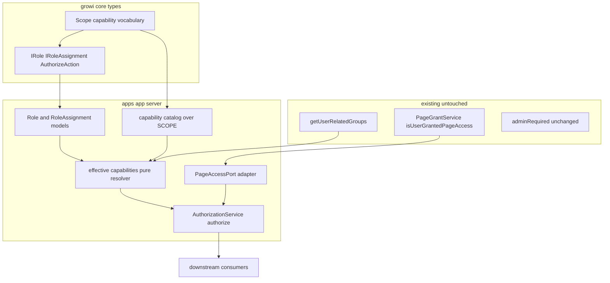
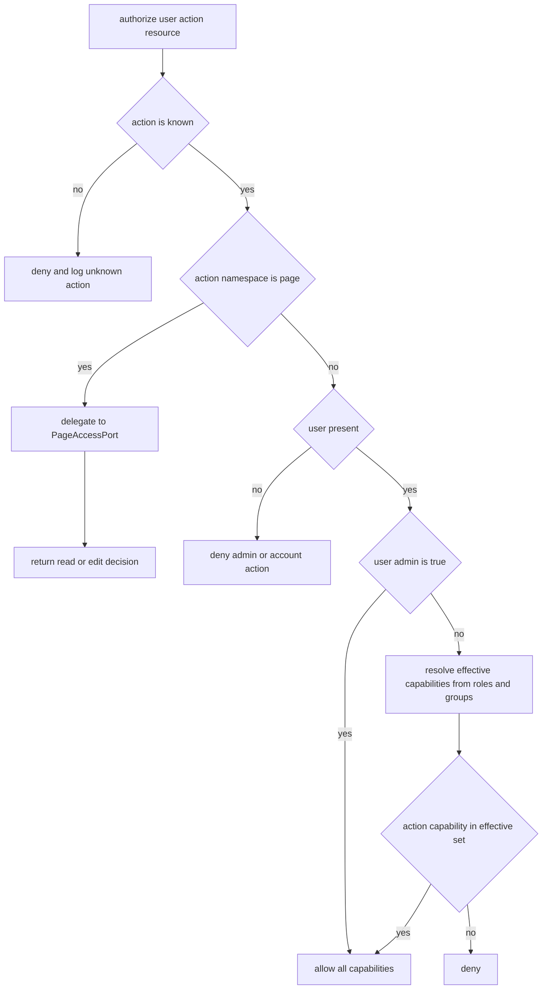

# Design Document: authorization-core

## Overview

**Purpose**: 分散した権限判定を**単一の認可判定** `authorize(user, action, resource?)` に集約し、その上に
**ロール × 権限（capability）** モデルを載せる基盤を提供する。`admin:* / account:*` 系 action は
ロール由来の実効 capability で判定し、`page:*` 系 action は既存のページアクセス判定へ委譲する。

**Users**: 直接のエンドユーザー機能ではなく、下流スペック（`admin-permission-delegation` /
`account-scope-roles`）と将来の認可消費者が利用する基盤。運用者はロールを定義・付与する側。

**Impact**: 現状の権限判定は3系統（`adminRequired` の `user.admin` 二値、`PageGrantService` の
真偽、`readOnly` ROM）に分散している。本機能は判定の**単一入口**と**ロール/capability モデル**を
新設するが、**導入時点の観測権限は一切変えない**（`user.admin === true` ⇒ 全 capability、ロール
未設定 ⇒ 既存挙動）。実ゲートの差し替えは下流スペックが行う。

### Goals
- ユーザー・action・任意リソースを受け、決定論的に許可/不許可を返す単一判定を提供する（1）。
- capability（＝既存 `SCOPE` 語彙）とロールのモデル、ロールのユーザー／グループ付与、実効 capability
  の合成（直接付与 ∪ グループ経由）を提供する（2, 3）。
- 導入時に観測権限を変えない後方互換（`admin` ⇒ 全 capability、移行不要）（4）。
- `page:*` を既存ページ判定へ委譲し、ページ権限を二重定義しない（5）。

### Non-Goals
- admin ルートの実ゲート置換・委譲管理者ロールの UI（`admin-permission-delegation`）。
- アカウント全体ロールの定義・強制（`account-scope-roles`）。
- ページの read/edit 判定ロジックそのもの（`granular-page-permissions` / `PageGrantService`）。
- グローバル ROM（`readOnly` / `excludeReadOnlyUser`）の挙動変更。
- access-token scope 評価（`accessTokenParser`）と role capability 評価の**評価パスの統合**
  （語彙は共有するが、両評価パスの一本化は将来課題。Revalidation Triggers 参照）。
- 外部 IdP からのロールマッピング。

## Boundary Commitments

### This Spec Owns
- 単一認可判定 `IAuthorizationService.authorize()` と補助 `can()` / `resolveEffectiveCapabilities()`。
- **Role / RoleAssignment** データモデル（capability 集合の定義と、ユーザー／グループへの付与）。
- 実効 capability の合成規則（admin ⇒ 全 capability、非 admin ⇒ 直接付与 ∪ グループ経由の和集合）。
- `page:*` を既存ページ判定へ委譲する **PageAccessPort** アダプタ。
- capability カタログ（＝既存 `SCOPE` の採用）に基づく未知 action の拒否。
- 「導入時に観測権限を変えない」ことの回帰保証。

### Out of Boundary
- `adminRequired` / 各 admin ルート / コメント経路の実ゲート差し替え（下流）。
- `PageGrantService` のページ判定ロジック（委譲のみ。改変しない）。
- `readOnly` / `excludeReadOnlyUser` の挙動。
- access-token scope 評価パスそのもの（`accessTokenParser`）。

### Allowed Dependencies
- `@growi/core` の `Scope`（capability 語彙）、`IUser` / `IUserGroup` / `Ref` 型。
- 既存 `PageGrantService.isUserGrantedPageAccess()`（`page:read` 委譲先）と
  `getUserRelatedGroups()`（グループ解決）。
- Crowi サービス登録パターン（`new AuthorizationService(crowi)`）、Mongoose モデル生成
  （`getOrCreateModel`）。
- 依存方向: `@growi/core 型` → `Role/RoleAssignment モデル` → `実効 capability 合成（純関数）` →
  `PageAccessPort（PageGrantService を包む）` → `AuthorizationService` → 消費者。上位から下位のみ。

### Revalidation Triggers
- `IRole` / `IRoleAssignment` / `AuthorizeAction` / `Capability` 型の形が変わる（下流が参照）。
- `authorize()` / `can()` のシグネチャ・戻り値の意味が変わる。
- `PageAccessPort` の契約が変わる（`granular-page-permissions` が `canEdit` の実体を提供する時）。
- capability カタログ（`SCOPE`）の構造が変わる。
- token scope 評価と role capability 評価を将来一本化する場合（Non-Goal の解除）。

## Architecture

### Existing Architecture Analysis
- **admin ゲート**: `adminRequired`（`middlewares/admin-required.ts`）が `req.user.admin` を直読み。
  chain は `accessTokenParser([SCOPE...]) → loginRequiredStrictly → adminRequired → handler`。
- **capability 語彙は既存**: `packages/core/src/interfaces/scope.ts` の `SCOPE`
  （`{action}:{category}:{sub}`、例 `write:admin:user_group_management`）が admin セクションを網羅し、
  `accessTokenParser` とクライアント `parseScopes({scopes, isAdmin})` に配線済み。
- **ページ判定**: `PageGrantService.isUserGrantedPageAccess()`（真偽）。`resolveEffectiveRole` /
  `editScope` は**未実装**（`granular-page-permissions` が新設予定）。
- **グループ解決**: `PageGrantService.getUserRelatedGroups(user)` が内部・外部グループを合成。
- **サービス登録**: Crowi に `this.xxxService = new XxxService(this)`（順序依存）。

### Architecture Pattern & Boundary Map



**Architecture Integration**:
- Selected pattern: **単一 PDP（AuthorizationService）＋ action 名前空間ディスパッチ ＋ ページは委譲**。
- Boundaries: 型は `@growi/core`、モデルは server、合成は純関数、委譲は Port、判定は Service に集約。
- Preserved patterns: `SCOPE` 語彙・`isUserGrantedPageAccess`・`getUserRelatedGroups`・
  Crowi サービス登録・Mongoose モデル生成。`adminRequired` は本 spec では不変。
- New components rationale: `AuthorizationService`（欠落していた単一判定）、`Role`/`RoleAssignment`
  （ロール付与の永続化）、`PageAccessPort`（ページ委譲の薄い接合と将来 `canEdit` の吸収）。
- Steering compliance: 純関数（capability 合成）をサービスから分離、Port は薄い adapter、
  barrel で公開面を最小化（coding-style）。

### Key Design Decisions（承認時に確認したい pivotal 決定）

- **DD1: capability 語彙は既存 `SCOPE` を採用する（要確認）**。capability = `Scope` 文字列。
  ロールは `Scope[]` を保持。`authorize` は admin/account action を capability として実効集合に
  含まれるか判定する。→ token scope と語彙を共有でき「1つの基盤」に整合。*評価パスの一本化は
  本 spec では行わない*（Non-Goal）。代替案（独自 capability を新設し SCOPE へマッピング）は
  二重語彙の同期コストのため不採用。
- **DD2: Role/RoleAssignment の永続化は Mongoose とする（要確認）**。User / UserGroup が Mongoose
  主のため、cross-ORM 参照を避け同居させる。Prisma 移行時に User/UserGroup と共に `roles` /
  `roleassignments` を `schema.prisma` へ移す（`mongoose-to-prisma` skill に従う）。
- **DD3: `page:edit` は当面 `page:read` と同一判定（後方互換）**。現状「閲覧可＝編集可（書き込みは
  ROM のみが抑止）」を保つ。`granular-page-permissions` が `canEdit`（`resolveEffectiveRole`）を
  提供したら `PageAccessPort` の実装差し替えのみで移行（R5.3 の Where 条件）。

### Technology Stack

| Layer | Choice / Version | Role in Feature | Notes |
|-------|------------------|-----------------|-------|
| Shared | `@growi/core`（workspace） | `Capability=Scope` / `IRole` / `IRoleAssignment` / `AuthorizeAction` 型 | 型追加は changeset 対象 |
| Backend | Express, Mongoose ^6 | AuthorizationService・Role/RoleAssignment・PageAccessPort | 新規外部依存なし |
| Data | MongoDB | `roles` / `roleassignments` コレクション（新規、任意利用） | 移行不要（未付与＝空） |

新規外部依存なし。

## File Structure Plan

### Directory Structure
```
packages/core/src/interfaces/
  authorization.ts            # 新規: Capability(=Scope), PageAction, AuthorizeAction,
                              #        AuthorizeResource, IRole, IRoleAssignment, RoleSubjectType
apps/app/src/server/
  models/
    role.ts                   # 新規: Role モデル（name, description?, capabilities: Scope[]）
    role-assignment.ts        # 新規: RoleAssignment（role, subjectType, subject refPath）
  service/authorization/
    index.ts                  # 新規(barrel): AuthorizationService と型のみ公開
    authorization-service.ts  # 新規: authorize()/can()/resolveEffectiveCapabilities()
    effective-capabilities.ts # 新規(純関数): admin⇒全, 非admin⇒直接∪グループ の合成
    capability-catalog.ts     # 新規: SCOPE を包む isKnownCapability()/allCapabilities()
    page-access-port.ts       # 新規: canRead→isUserGrantedPageAccess, canEdit(=canRead 暫定)
```
テストは各ファイルに co-locate（`effective-capabilities.spec.ts`・`capability-catalog.spec.ts`・
`authorization-service.integ.ts`）。

### Modified Files
- `apps/app/src/server/crowi/index.ts` — `authorizationService!: AuthorizationService` フィールド追加、
  `configManager` / `pageGrantService` 設定後に `new AuthorizationService(this)` を登録。
- `apps/app/src/server/crowi/setup-models.ts` — `Role` / `RoleAssignment` をモデルマップに登録。
- `packages/core/src/interfaces/index.ts` — `authorization.ts` の re-export（barrel）。
- `packages/core/src/interfaces/scope.ts` —（必要時のみ）全 scope 文字列を平坦列挙する
  `allScopeStrings()` を追加（`allCapabilities()` が利用）。既存構造は不変。

> `adminRequired` / admin ルート / `page-grant.ts` は**変更しない**（Out of Boundary）。

## System Flows

### 実効 capability に基づく認可判定



- 判定は読み取りのみで副作用なし（R1.4）。role/group 解決の失敗時は **fail-closed（不許可）**。
  ただし `user.admin` は user ドキュメント上の値のため、role ストア障害時も admin は判定可能。
- `page:*` は `PageAccessPort` へ委譲し、`isUserGrantedPageAccess` と一致（R5.1）。`page:edit` は
  現状 `canRead` と同義（DD3, R5.3）。

## Requirements Traceability

| Requirement | Summary | Components | Interfaces | Flows |
|-------------|---------|------------|------------|-------|
| 1.1, 1.2, 1.4 | 単一・決定論・副作用なしの判定 | AuthorizationService | `authorize` | 認可判定 |
| 1.3 | 未知 action は不許可＋記録 | capability-catalog, AuthorizationService | `isKnownCapability` | 認可判定 |
| 2.1, 2.4 | capability=SCOPE、列挙可能カタログ | capability-catalog, authorization types | `Capability`, `allCapabilities` | — |
| 2.2, 2.3 | ロール=capability 集合、定義反映 | Role model | `IRole` | — |
| 3.1, 3.2 | ロールをユーザー／グループへ付与 | RoleAssignment model | `IRoleAssignment` | — |
| 3.3, 3.4 | 実効 capability=直接∪グループ（冪等） | effective-capabilities | `composeCapabilities` | 認可判定 |
| 3.5 | capability 一致時のみ許可 | AuthorizationService | `authorize` | 認可判定 |
| 3.6 | 未認証の admin/account は不許可 | AuthorizationService | `authorize` | 認可判定 |
| 4.1, 4.2, 4.3, 4.4 | admin⇒全 capability、未設定=既存挙動、移行不要 | effective-capabilities, AuthorizationService | `composeCapabilities` | 認可判定 |
| 5.1, 5.2 | page:* を既存判定へ委譲・二重定義なし | PageAccessPort | `canRead` | 認可判定 |
| 5.3 | edit 判定が提供されたら委譲 | PageAccessPort | `canEdit` | 認可判定 |
| 6.1, 6.2 | capability 判定は readOnly を根拠にせず、ROM 不変 | AuthorizationService | `authorize` | 認可判定 |
| 7.1, 7.2, 7.3 | 消費者へ capability 判定を提供、追加はカタログ宣言で完結 | AuthorizationService | `can` | 認可判定 |

## Components and Interfaces

| Component | Domain/Layer | Intent | Req Coverage | Key Dependencies (P0/P1) | Contracts |
|-----------|--------------|--------|--------------|--------------------------|-----------|
| authorization types | Types (@growi/core) | capability/role/action の共有型 | 1,2,3,5 | Scope, IUser, IUserGroup | State |
| Role / RoleAssignment | Server model | ロール定義とユーザー／グループ付与 | 2,3 | mongoose (P0) | State |
| effective-capabilities | Server (pure) | 実効 capability 合成（admin⇒全, 非admin⇒直接∪グループ） | 3,4 | catalog (P0) | Service |
| capability-catalog | Server | SCOPE を capability カタログとして提供・未知拒否 | 1,2 | Scope (P0) | Service |
| PageAccessPort | Server adapter | page:* を既存判定へ委譲 | 5 | PageGrantService (P0) | Service |
| AuthorizationService | Server service | 単一認可判定入口 | 1,3,4,6,7 | 上記全て (P0), getUserRelatedGroups (P0) | Service |

### Types (@growi/core)

**Contracts**: State [x]

```typescript
// packages/core/src/interfaces/authorization.ts
import type { Scope } from './scope';
import type { Ref } from './common';
import type { IUser } from './user';
import type { IUserGroup } from './user-group';

// DD1: admin/account 権限の語彙は既存 SCOPE を再利用する
export type Capability = Scope;

// ページ系 action は per-instance 判定が必要なため capability とは別に列挙
export const PageAction = { READ: 'page:read', EDIT: 'page:edit' } as const;
export type PageAction = (typeof PageAction)[keyof typeof PageAction];

export type AuthorizeAction = Capability | PageAction;

export interface AuthorizeResource {
  readonly type: 'page';
  readonly id: string; // pageId
}

export const RoleSubjectType = {
  USER: 'User',
  USER_GROUP: 'UserGroup',
  EXTERNAL_USER_GROUP: 'ExternalUserGroup',
} as const;
export type RoleSubjectType =
  (typeof RoleSubjectType)[keyof typeof RoleSubjectType];

export interface IRole {
  name: string;                 // 一意
  description?: string;
  capabilities: Capability[];   // 付与する権限（SCOPE 文字列）
}

export interface IRoleAssignment {
  role: Ref<IRole>;
  subjectType: RoleSubjectType;
  subject: Ref<IUser> | Ref<IUserGroup>; // refPath は subjectType で決定
}
```
- Invariants: `IRole.capabilities` の各要素は capability カタログ（SCOPE）に存在する。
  `RoleAssignment.subject` の実体型は `subjectType` と整合する。

### Server

#### AuthorizationService

| Field | Detail |
|-------|--------|
| Intent | 全消費者に対する単一の認可判定入口 |
| Requirements | 1.1, 1.2, 1.4, 3.5, 3.6, 4.1, 6.1, 7.1, 7.2 |

**Responsibilities & Constraints**
- action 名前空間でディスパッチ：`page:*` は `PageAccessPort` へ委譲、それ以外は capability 判定。
- 未認証（user=null）かつ admin/account action は不許可（3.6）。`page:*` は委譲（public 許容は委譲先が判断）。
- 判定は読み取りのみ（1.4）。role/group 解決失敗は fail-closed。
- capability 判定に `readOnly` を用いない（6.1）。ROM ゲートは併存し変更しない（6.2）。

**Dependencies**: Outbound: effective-capabilities (P0), capability-catalog (P0), PageAccessPort (P0),
`getUserRelatedGroups` (P0)。Inbound: 下流 middleware/routes/UI（本 spec 外）。

**Contracts**: Service [x]

```typescript
interface IAuthorizationService {
  // 単一判定（R1）。action 名前空間でディスパッチ。
  authorize(
    user: IUserHasId | null,
    action: AuthorizeAction,
    resource?: AuthorizeResource,
  ): Promise<boolean>;

  // 消費者向け capability 判定（R7.2）。
  can(user: IUserHasId, capability: Capability): Promise<boolean>;

  // 実効 capability の合成結果（R3.3）。
  resolveEffectiveCapabilities(user: IUserHasId): Promise<ReadonlySet<Capability>>;
}
```
- Preconditions: `page:*` の判定には `resource`（page）が必須。無い場合は不許可。
- Postconditions: `user.admin === true` は全 capability を持つ（4.1）。ロール未設定の非 admin は
  admin/account action で不許可（＝既存 `adminRequired` と一致、4.2/4.3）。
- Invariants: 同一入力に同一結果（1.2）。

#### effective-capabilities（純関数）

| Field | Detail |
|-------|--------|
| Intent | admin/ロール/グループから実効 capability 集合を合成 |
| Requirements | 3.3, 3.4, 4.1, 4.2, 4.4 |

**Contracts**: Service [x]
```typescript
// admin なら全 capability、そうでなければ付与ロールの capability の和集合
export function composeCapabilities(
  isAdmin: boolean,
  assignedRoles: readonly IRole[],   // 直接付与 ＋ グループ経由をまとめて渡す
  allCapabilities: () => readonly Capability[],
): Set<Capability>;
```
- 重複 capability は集合により冪等（3.4）。`assignedRoles` が空なら空集合（4.2 の後方互換の要）。
- ロール取得（直接付与＋グループ経由）は Service 側で行い、本関数は純粋に合成のみ（テスト容易）。

#### capability-catalog

| Field | Detail |
|-------|--------|
| Intent | 既存 `SCOPE` を capability カタログとして提供し、未知 action を判定 |
| Requirements | 1.3, 2.1, 2.4, 7.3 |

**Contracts**: Service [x]
- `allCapabilities(): readonly Capability[]` — `SCOPE` を平坦列挙（admin⇒全 capability に使用）。
- `isKnownCapability(action: string): action is Capability` — カタログ存在判定。未知は `authorize`
  が不許可＋ログ（1.3）。新 capability の追加は `SCOPE` への宣言で完結し、消費者の呼び出しは不変（7.3）。

#### PageAccessPort（アダプタ）

| Field | Detail |
|-------|--------|
| Intent | `page:*` を既存ページ判定へ委譲する薄い接合 | 
| Requirements | 5.1, 5.2, 5.3 |

**Contracts**: Service [x]
```typescript
interface PageAccessPort {
  canRead(user: IUserHasId | null, pageId: string): Promise<boolean>; // → isUserGrantedPageAccess
  canEdit(user: IUserHasId | null, pageId: string): Promise<boolean>; // DD3: 暫定で canRead と同義
}
```
- `canRead` は `PageGrantService.isUserGrantedPageAccess`（＋`getUserRelatedGroups`）へ委譲し結果一致（5.1）。
- 独自のページ権限判定を持たない（5.2）。`granular-page-permissions` が edit 判定を提供したら
  `canEdit` を差し替え（5.3, Revalidation Trigger）。

#### Role / RoleAssignment（モデル）

**Contracts**: State [x]
- `Role`: `{ name(unique), description?, capabilities: Scope[] }`。既存 `user-group.ts` の
  `getOrCreateModel` パターンに倣う。
- `RoleAssignment`: `{ role: ObjectId(ref Role), subjectType, subject: ObjectId(refPath) }`。
  既存 `IGrantedGroup { type, item(refPath) }` の refPath パターンに倣い、User/UserGroup/
  ExternalUserGroup を統一的に指す。

## Data Models

### Domain Model
- **Aggregates**: `Role`（capability 集合の定義）、`RoleAssignment`（ロールと主体の束縛）。
- **Invariants**:
  - `Role.capabilities ⊆ capability カタログ（SCOPE）`。
  - `RoleAssignment.subject` の型は `subjectType` と一致。
  - ユーザーの実効 capability = admin ⇒ 全、非 admin ⇒ 直接付与 ∪ 所属グループ経由（和集合）。
  - `readOnly` は実効 capability に影響しない（独立軸、6.1）。

### Physical Data Model (MongoDB / Mongoose)
```
roles:            { _id, name(unique index), description?, capabilities: [String] }
roleassignments:  { _id, role: ObjectId(ref roles),
                    subjectType: 'User'|'UserGroup'|'ExternalUserGroup',
                    subject: ObjectId(refPath subjectType) }
```
- インデックス: `roles.name` 一意、`roleassignments.subject`（主体からの逆引き用）。
- 既存コレクションは不変。未付与＝空のため移行不要（4.4）。

### Data Contracts & Integration
- 型は `@growi/core`（`IRole` / `IRoleAssignment` / `AuthorizeAction`）で共有。ロール管理 API・
  付与 UI は下流 `admin-permission-delegation` が定義する（本 spec は判定とモデルまで）。

## Error Handling

### Error Strategy
- **未知 action（1.3）**: `authorize` は不許可を返し、未知 action を logger に記録（例外は投げない）。
- **role/group 解決の障害**: fail-closed（不許可）。ただし `user.admin` 判定は user ドキュメントのみで
  完結するため障害の影響を受けない。
- **`page:*` で resource 欠落**: 不許可（判定不能を許可にしない）。
- 判定は例外を通常フローに用いず boolean を返す（消費者はゲートで 403 に変換する。403 化は下流）。

### Monitoring
- 未知 action・fail-closed の発生を既存 logger 経路で記録（steering の baseline に従う）。

## Testing Strategy

### Unit Tests
- `composeCapabilities`: `isAdmin=true` ⇒ 全 capability（4.1）。
- `composeCapabilities`: `assignedRoles=[]` ⇒ 空集合（4.2 後方互換の核）。
- `composeCapabilities`: 直接ロール ＋ グループ経由ロールの和集合、重複は冪等（3.3, 3.4）。
- `capability-catalog.isKnownCapability`: 既知 SCOPE=true、未知文字列=false（1.3, 2.4）。

### Integration Tests
- `authorize`（admin/account action）: admin ユーザー=許可、ロール未設定の非 admin=不許可
  （既存 `adminRequired` と一致、4.2/4.3）。
- `authorize`: 当該 capability を持つロールを付与した非 admin=許可、持たない=不許可（3.5, 7.2）。
- `authorize`: グループにロールを付与し、そのグループ所属ユーザーが capability を得る（3.2, 3.3）。
- `authorize`（`page:read`）: `isUserGrantedPageAccess` と同一結果（5.1）。`page:edit` は現状 read と一致（5.3）。
- `authorize`: 未認証の admin/account action=不許可（3.6）。未知 action=不許可（1.3）。
- 分離: `readOnly` ユーザーでも capability 判定結果は readOnly に依存しない（6.1）。

### 後方互換回帰（4.3）
- 代表的な admin/account action 集合について、導入前（`user.admin` ベース）と導入後（`authorize`）の
  admin／非 admin の許可/不許可がすべて一致することをスナップショット比較で検証。

## Security Considerations
- **後方互換で無害導入**: `admin ⇒ 全 capability`、ロール未設定 ⇒ 既存挙動（4）。実ゲート差し替えは
  下流のため、本 spec 単体で権限が緩むことはない。
- **fail-closed**: 判定材料の取得失敗時は不許可。判定不能を許可にしない。
- **admin フラグは最上位の権威**: role ストア障害時も admin は機能（自己ロックアウト防止）。
- **ROM 分離**: capability 判定は `readOnly` を根拠にせず、既存 ROM ゲートを変更しない（6）。
- **語彙統合の副作用抑制**: 本 spec は SCOPE を*語彙として*採用するのみで、token scope の評価パスは
  変更しない（評価一本化は将来課題、Revalidation Trigger）。

## Migration Strategy
- **データ移行なし**。`roles` / `roleassignments` は空で開始し、付与されたユーザー／グループのみ
  新 capability を持つ。導入直後の観測権限は完全に従来どおり（4.1–4.4）。
- ロールバック: `AuthorizationService` の判定を消費する経路が無い段階（本 spec 完了時点）では
  観測挙動に影響しないため、モデル・サービスを残置しても無害。
