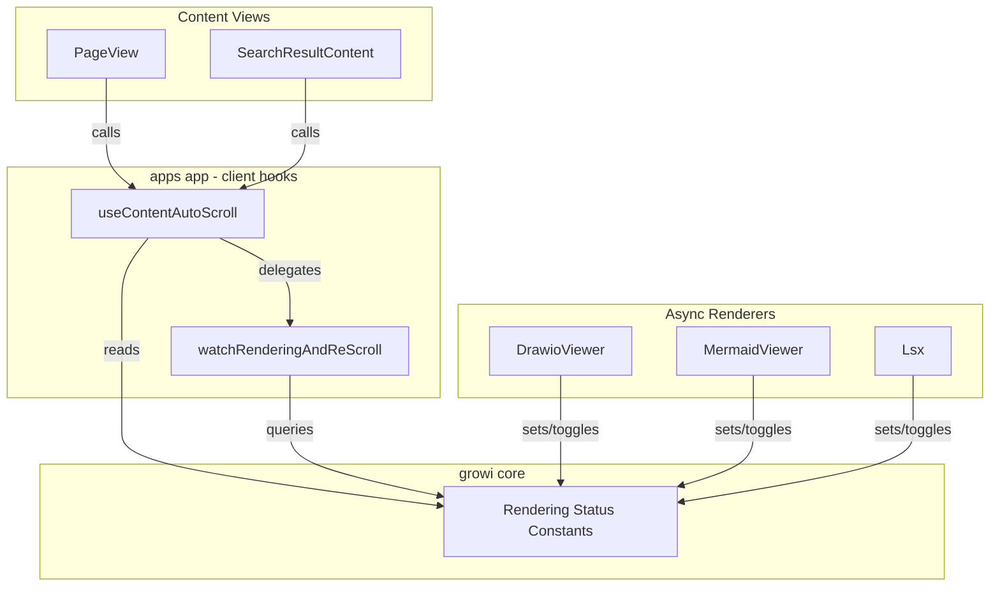
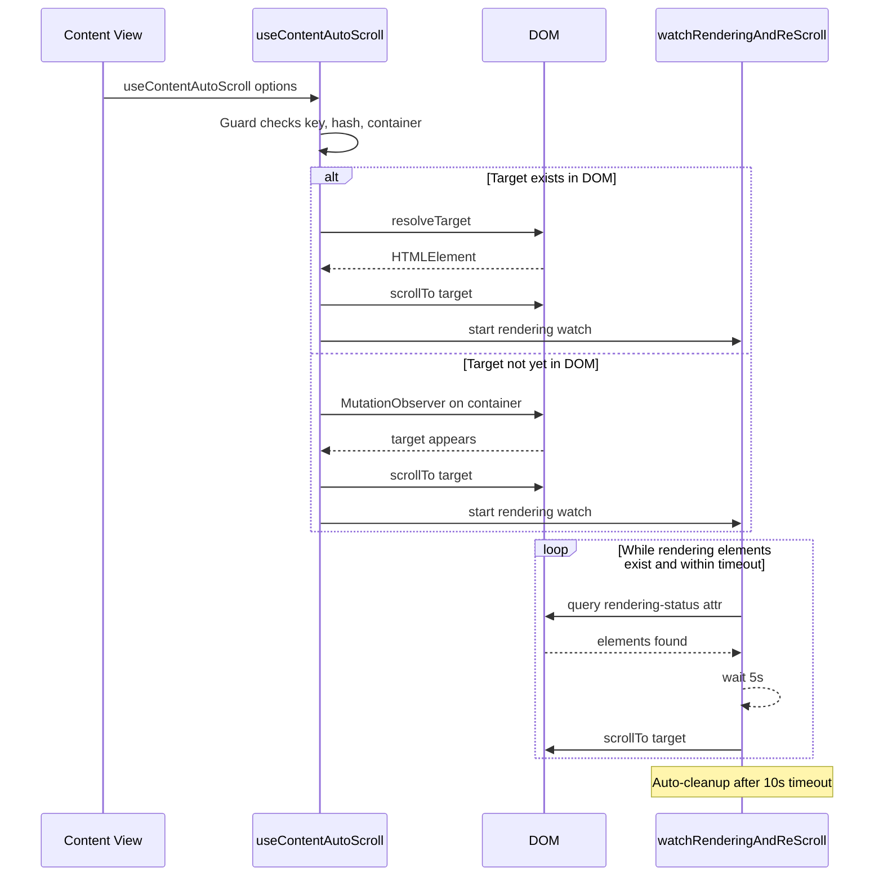

# Design Document: auto-scroll

## Overview

**Purpose**: This feature provides a reusable hash-based auto-scroll mechanism that handles lazy-rendered content across GROWI's Markdown views. It compensates for layout shifts caused by asynchronous component rendering (e.g., Drawio diagrams) by detecting in-progress renders and re-scrolling to the target.

**Users**: End users navigating to hash-linked sections benefit from reliable scroll positioning. Developers integrating the hook into new views (PageView, SearchResultContent, future views) benefit from a standardized, configurable API.

**Impact**: Refactors the existing `useHashAutoScroll` hook from a PageView-specific implementation into a shared, configurable hook. Renames and updates the rendering status attribute protocol for clarity and declarative usage.

### Goals
- Provide a single reusable hook for hash-based auto-scroll across all content views
- Support customizable target resolution and scroll behavior per caller
- Establish a clear, declarative rendering-status attribute protocol for async-rendering components
- Maintain robust resource cleanup with timeout-based safety bounds

### Non-Goals
- Adding `data-growi-is-content-rendering` to PlantUML, attachment-refs (Ref/Refs/RefImg/RefsImg/Gallery), or RichAttachment — these also cause layout shifts but require more complex integration (image onLoad tracking, wrapper components); deferred to follow-up
- Replacing SearchResultContent's keyword-highlight scroll with this hook (requires separate evaluation)
- Supporting non-browser environments (SSR) — this is a client-only hook

## Architecture

### Existing Architecture Analysis

The current implementation lives in `apps/app/src/components/PageView/use-hash-auto-scroll.tsx`, tightly coupled to PageView via:
- Hardcoded `document.getElementById(targetId)` for target resolution
- Hardcoded `element.scrollIntoView()` for scroll execution
- First parameter named `pageId` implying page-specific usage

The rendering attribute `data-growi-rendering` is defined in `@growi/core` and consumed by:
- `remark-drawio` (sets attribute on render start, removes on completion)
- `use-hash-auto-scroll` (observes attribute presence via MutationObserver)

### Architecture Pattern & Boundary Map



**Architecture Integration**:
- Selected pattern: Custom hook with options object — idiomatic React, testable, extensible
- Domain boundaries: Hook logic in `src/hooks/`, constants in `@growi/core`, attribute lifecycle in each renderer package
- Existing patterns preserved: MutationObserver + polling hybrid, timeout-based safety bounds
- New components rationale: `src/hooks/` directory needed for cross-feature hooks not tied to a specific feature module
- Steering compliance: Named exports, immutable patterns, co-located tests

### Technology Stack

| Layer | Choice / Version | Role in Feature | Notes |
|-------|------------------|-----------------|-------|
| Frontend | React 18 hooks (`useEffect`) | Hook lifecycle management | No new dependencies |
| Browser API | MutationObserver, `setTimeout` | DOM observation and polling | Standard Web APIs |
| Shared Constants | `@growi/core` | Rendering attribute definitions | Existing package |

No new external dependencies are introduced.

## System Flows

### Auto-Scroll Lifecycle



Key decisions: The two-phase approach (target observation → rendering watch) runs sequentially. The rendering watch uses a non-resetting timer to prevent starvation from rapid DOM mutations.

## Requirements Traceability

| Requirement | Summary | Components | Interfaces | Flows |
|-------------|---------|------------|------------|-------|
| 1.1, 1.2 | Immediate scroll to hash target | useContentAutoScroll | UseContentAutoScrollOptions.resolveTarget | Auto-Scroll Lifecycle |
| 1.3, 1.4, 1.5 | Guard conditions | useContentAutoScroll | UseContentAutoScrollOptions.key, contentContainerId | — |
| 2.1, 2.2, 2.3 | Deferred scroll for lazy targets | useContentAutoScroll (target observer) | — | Auto-Scroll Lifecycle |
| 3.1–3.6 | Re-scroll after rendering | watchRenderingAndReScroll | scrollTo callback | Auto-Scroll Lifecycle |
| 4.1–4.7 | Rendering attribute protocol | Rendering Status Constants, DrawioViewer, MermaidViewer, Lsx | GROWI_IS_CONTENT_RENDERING_ATTR | — |
| 5.1–5.5 | Page-type agnostic design | useContentAutoScroll | UseContentAutoScrollOptions | — |
| 5.6, 5.7, 6.1–6.3 | Cleanup and safety | useContentAutoScroll, watchRenderingAndReScroll | cleanup functions | — |

## Components and Interfaces

| Component | Domain/Layer | Intent | Req Coverage | Key Dependencies | Contracts |
|-----------|--------------|--------|--------------|------------------|-----------|
| useContentAutoScroll | Client Hooks | Reusable auto-scroll hook with configurable target resolution and scroll behavior | 1, 2, 5, 6 | watchRenderingAndReScroll (P0), Rendering Status Constants (P1) | Service |
| watchRenderingAndReScroll | Client Hooks (internal) | Polls for rendering-status attributes and re-scrolls until complete or timeout | 3, 6 | Rendering Status Constants (P0) | Service |
| Rendering Status Constants | @growi/core | Shared attribute name, value, and selector constants | 4 | None | State |
| DrawioViewer (modification) | remark-drawio | Declarative rendering-status attribute toggle | 4.3, 4.4, 4.7 | Rendering Status Constants (P0) | State |
| MermaidViewer (modification) | features/mermaid | Add rendering-status attribute lifecycle to async SVG render | 4.3, 4.4, 4.7 | Rendering Status Constants (P0) | State |
| Lsx (modification) | remark-lsx | Add rendering-status attribute lifecycle to async page list fetch | 4.3, 4.4, 4.7 | Rendering Status Constants (P0) | State |

### Client Hooks

#### useContentAutoScroll

| Field | Detail |
|-------|--------|
| Intent | Reusable hook that scrolls to a target element identified by URL hash, with support for lazy-rendered content and customizable scroll behavior |
| Requirements | 1.1–1.5, 2.1–2.3, 5.1–5.7, 6.1–6.3 |

**Responsibilities & Constraints**
- Orchestrates the full auto-scroll lifecycle: guard → resolve target → scroll → watch rendering
- Before delegating to `watchRenderingAndReScroll`, checks whether any rendering-status elements exist in the container; skips the rendering watch entirely if none are present (avoids unnecessary MutationObserver + timeout on every hash navigation)
- Delegates rendering-aware re-scrolling to `watchRenderingAndReScroll`
- Must not import page-specific or feature-specific modules

**Dependencies**
- Outbound: `watchRenderingAndReScroll` — rendering watch delegation (P0)
- External: `@growi/core` rendering status constants — attribute queries (P1)

**Contracts**: Service [x]

##### Service Interface

```typescript
/** Configuration for the auto-scroll hook */
interface UseContentAutoScrollOptions {
  /**
   * Unique key that triggers re-execution when changed.
   * Typically a page ID, search query ID, or other view identifier.
   * When null/undefined, all scroll processing is skipped.
   */
  key: string | undefined | null;

  /** DOM id of the content container element to observe */
  contentContainerId: string;

  /**
   * Optional function to resolve the scroll target element.
   * Receives the decoded hash string (without '#').
   * Defaults to: (hash) => document.getElementById(hash)
   */
  resolveTarget?: (decodedHash: string) => HTMLElement | null;

  /**
   * Optional function to scroll to the target element.
   * Defaults to: (el) => el.scrollIntoView()
   */
  scrollTo?: (target: HTMLElement) => void;
}

/** Hook signature */
function useContentAutoScroll(options: UseContentAutoScrollOptions): void;
```

- Preconditions: Called within a React component; browser environment with `window.location.hash` available
- Postconditions: On unmount or key change, all observers and timers are cleaned up
- Invariants: At most one target observer and one rendering watch active per hook instance

**Implementation Notes**
- File location: `apps/app/src/hooks/use-content-auto-scroll.ts` (no JSX — `.ts` extension)
- Test file: `apps/app/src/hooks/use-content-auto-scroll.spec.ts`
- The `resolveTarget` and `scrollTo` callbacks should be wrapped in `useRef` or called from a ref to avoid re-triggering the effect when callback identity changes
- Export both `useContentAutoScroll` and `watchRenderingAndReScroll` as named exports for independent testability

---

#### watchRenderingAndReScroll

| Field | Detail |
|-------|--------|
| Intent | Pure function (not a hook) that monitors rendering-status attributes and periodically re-scrolls until rendering completes or timeout |
| Requirements | 3.1–3.6, 6.1–6.3 |

**Responsibilities & Constraints**
- Sets up MutationObserver to detect rendering-status attribute changes
- Manages a non-resetting poll timer (5s interval)
- Enforces a hard timeout (10s) to prevent unbounded observation
- Returns a cleanup function

**Dependencies**
- External: `@growi/core` rendering status constants — attribute selector (P0)

**Contracts**: Service [x]

##### Service Interface

```typescript
/**
 * Watches for elements with in-progress rendering status in the container.
 * Periodically calls scrollToTarget while rendering elements remain.
 * Returns a cleanup function that stops observation and clears timers.
 */
function watchRenderingAndReScroll(
  contentContainer: HTMLElement,
  scrollToTarget: () => boolean,
): () => void;
```

- Preconditions: `contentContainer` is a mounted DOM element
- Postconditions: Cleanup function disconnects observer, clears all timers
- Invariants: At most one poll timer active at any time; stopped flag prevents post-cleanup execution

**Implementation Notes**
- Add a `stopped` boolean flag checked inside timer callbacks to prevent race conditions between cleanup and queued timer execution (addresses PR review finding)
- When `checkAndSchedule` detects that no rendering elements remain and a timer is currently active, cancel the active timer immediately — avoids a redundant re-scroll after rendering has already completed
- The MutationObserver watches `childList`, `subtree`, and `attributes` (filtered to the rendering-status attribute)

---

### @growi/core Constants

#### Rendering Status Constants

| Field | Detail |
|-------|--------|
| Intent | Centralized constants for the rendering-status attribute name, values, and CSS selector |
| Requirements | 4.1, 4.2, 4.6 |

**Contracts**: State [x]

##### State Management

```typescript
/** Attribute name applied to elements during async content rendering */
const GROWI_IS_CONTENT_RENDERING_ATTR = 'data-growi-is-content-rendering' as const;

/**
 * CSS selector matching elements currently rendering.
 * Matches only the "true" state, not completed ("false").
 */
const GROWI_IS_CONTENT_RENDERING_SELECTOR =
  `[${GROWI_IS_CONTENT_RENDERING_ATTR}="true"]` as const;
```

- File location: `packages/core/src/consts/renderer.ts` (replaces existing constants)
- Old constants (`GROWI_RENDERING_ATTR`, `GROWI_RENDERING_ATTR_SELECTOR`) are removed and replaced — no backward compatibility shim needed since all consumers are updated in the same change

---

### remark-drawio Modifications

#### DrawioViewer (modification)

| Field | Detail |
|-------|--------|
| Intent | Adopt declarative attribute value toggling instead of imperative add/remove |
| Requirements | 4.3, 4.4 |

**Implementation Notes**
- Replace `removeAttribute(GROWI_RENDERING_ATTR)` calls with `setAttribute(GROWI_IS_CONTENT_RENDERING_ATTR, 'false')`
- Initial JSX: `{[GROWI_IS_CONTENT_RENDERING_ATTR]: 'true'}` (unchanged pattern, new constant name)
- Update `SUPPORTED_ATTRIBUTES` in `remark-drawio.ts` to use new constant name
- Update sanitize option to allow the new attribute name

### MermaidViewer Modification

#### MermaidViewer (modification)

| Field | Detail |
|-------|--------|
| Intent | Add rendering-status attribute lifecycle to async `mermaid.render()` SVG rendering |
| Requirements | 4.3, 4.4, 4.7 |

**Implementation Notes**
- Set `data-growi-is-content-rendering="true"` on the container element at initial render (before `mermaid.render()` is called)
- Set attribute to `"false"` after `mermaid.render()` completes and SVG is injected into the DOM
- Set attribute to `"false"` in the error/catch path as well
- File: `apps/app/src/features/mermaid/components/MermaidViewer.tsx`
- The mermaid remark plugin sanitize options must be updated to include the new attribute name

---

### remark-lsx Modification

#### Lsx (modification)

| Field | Detail |
|-------|--------|
| Intent | Add rendering-status attribute lifecycle to async SWR page list fetching |
| Requirements | 4.3, 4.4, 4.7 |

**Implementation Notes**
- Set `data-growi-is-content-rendering="true"` on the outermost container element while `isLoading === true` (SWR fetch in progress)
- Set attribute to `"false"` when data arrives — whether success, error, or empty result
- Use declarative attribute binding via the existing `isLoading` state (no imperative DOM manipulation needed)
- File: `packages/remark-lsx/src/client/components/Lsx.tsx`
- The lsx remark plugin sanitize options must be updated to include the new attribute name
- `@growi/core` must be added as a dependency of `remark-lsx` (same pattern as `remark-drawio`)

---

## Error Handling

### Error Strategy

This feature operates entirely in the browser DOM layer with no server interaction. Errors are limited to DOM state mismatches.

### Error Categories and Responses

**Target Not Found** (2.3): If the hash target never appears within 10s, the observer disconnects silently. No error is surfaced to the user — this matches browser-native behavior for invalid hash links.

**Container Not Found** (1.5): If the container element ID does not resolve, the hook returns immediately with no side effects.

**Rendering Watch Timeout** (3.6): After 10s, all observers and timers are cleaned up regardless of remaining rendering elements. This prevents resource leaks from components that fail to signal completion.

## Testing Strategy

### Unit Tests (co-located in `src/hooks/`)

1. **Guard conditions**: Verify no-op when key is null, hash is empty, or container not found (1.3–1.5)
2. **Immediate scroll**: Target exists in DOM → `scrollTo` called once (1.1)
3. **Encoded hash**: URI-encoded hash decoded and resolved correctly (1.2)
4. **Custom resolveTarget**: Provided closure is called instead of default `getElementById` (5.2)
5. **Custom scrollTo**: Provided scroll function is called instead of default `scrollIntoView` (5.3)

### Integration Tests (watchRenderingAndReScroll)

1. **Rendering elements present**: Poll timer fires at 5s, re-scroll executes (3.1)
2. **No rendering elements**: No timer scheduled (3.3)
3. **Timer non-reset on DOM mutation**: Mid-timer mutation does not restart the 5s interval (3.5)
4. **Late-appearing rendering elements**: Observer detects and schedules timer (3.4)
5. **Multiple rendering elements**: Only one re-scroll per cycle (6.3)
6. **Watch timeout**: All resources cleaned up after 10s (3.6, 6.2)
7. **Cleanup prevents post-cleanup execution**: Stopped flag prevents race (6.1)

### Hook Lifecycle Tests

1. **Key change**: Cleanup runs, new scroll cycle starts (5.6)
2. **Unmount**: All observers and timers cleaned up (5.7, 6.1)
3. **Re-render with same key**: Effect does not re-trigger (stability)
