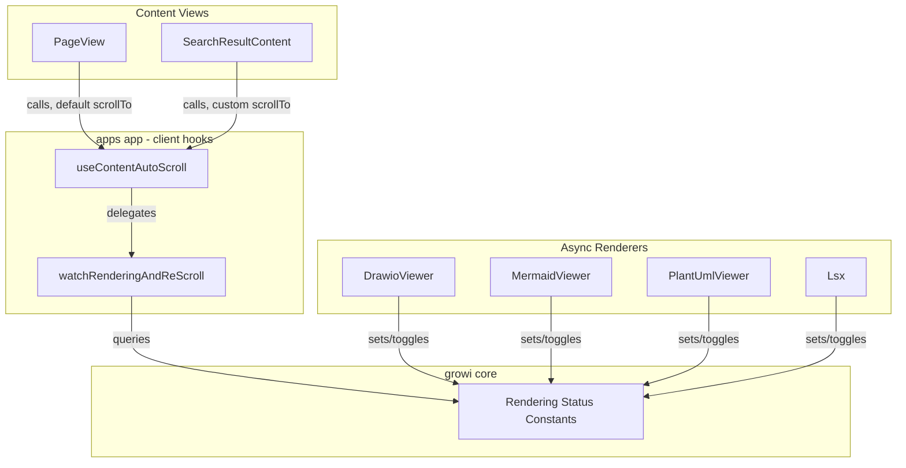
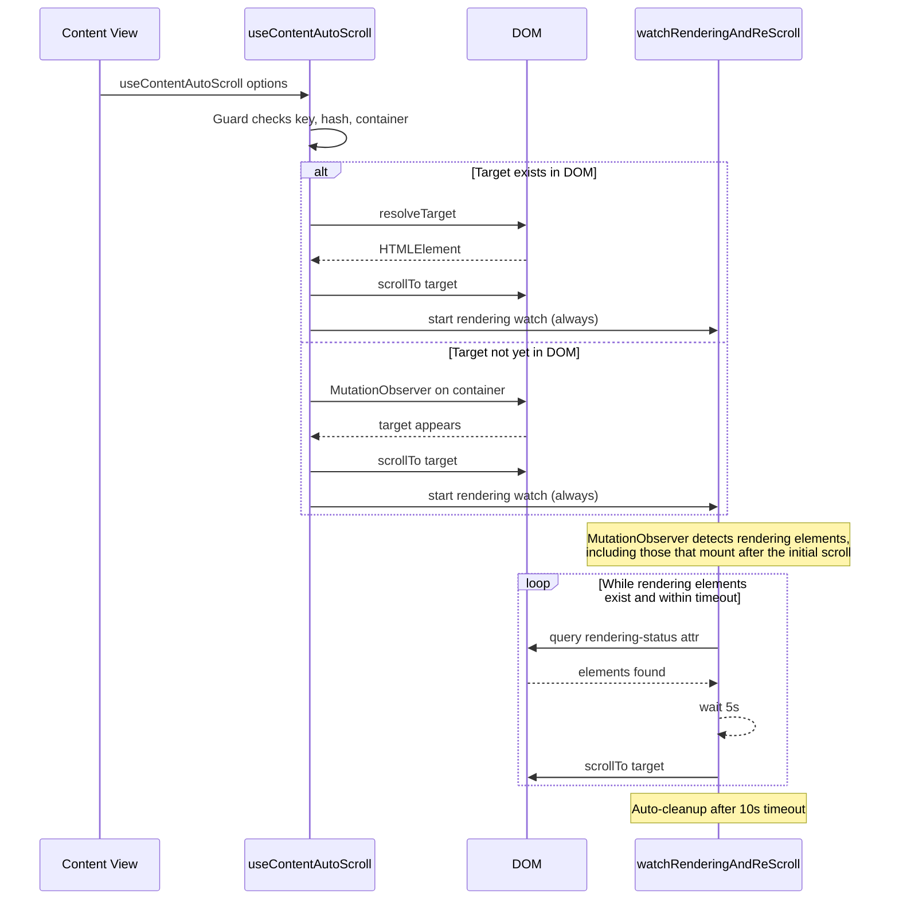
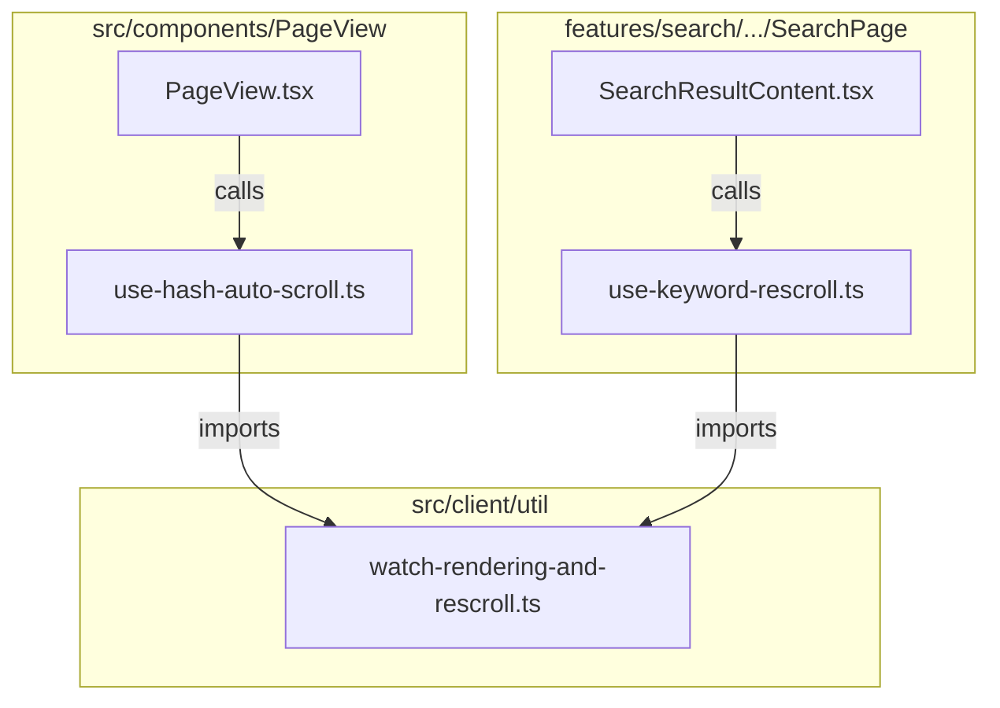

# Design Document: auto-scroll

## Overview

**Purpose**: This feature provides a reusable hash-based auto-scroll mechanism that handles lazy-rendered content across GROWI's Markdown views. It compensates for layout shifts caused by asynchronous component rendering (e.g., Drawio diagrams, Mermaid charts, PlantUML images) by detecting in-progress renders and re-scrolling to the target.

**Users**: End users navigating to hash-linked sections benefit from reliable scroll positioning. Developers integrating the hook into new views (PageView, SearchResultContent, future views) benefit from a standardized, configurable API.

**Impact**: Refactors the existing `useHashAutoScroll` hook from a PageView-specific implementation into a shared, configurable hook. Renames and updates the rendering status attribute protocol for clarity and declarative usage. Also integrates hash-based auto-scroll into `SearchResultContent`, where the content pane has an independent scroll container.

### Goals
- Provide a single reusable hook for hash-based auto-scroll across all content views
- Support customizable target resolution and scroll behavior per caller
- Establish a clear, declarative rendering-status attribute protocol for async-rendering components
- Maintain robust resource cleanup with timeout-based safety bounds
- Integrate `SearchResultContent` as a second consumer with container-relative scroll strategy

### Non-Goals
- Adding `data-growi-is-content-rendering` to attachment-refs (Ref/Refs/RefImg/RefsImg/Gallery), or RichAttachment — these also cause layout shifts but require more complex integration; deferred to follow-up
- Supporting non-browser environments (SSR) — this is a client-only hook

## Architecture

### Existing Architecture Analysis

The current implementation lives in `apps/app/src/components/PageView/use-hash-auto-scroll.tsx`, tightly coupled to PageView via:
- Hardcoded `document.getElementById(targetId)` for target resolution
- Hardcoded `element.scrollIntoView()` for scroll execution
- First parameter named `pageId` implying page-specific usage

The rendering attribute `data-growi-rendering` is defined in `@growi/core` and consumed by:
- `remark-drawio` (sets attribute on render start, removes on completion)
- `use-hash-auto-scroll` (observes attribute presence via MutationObserver)

### Architecture Pattern & Boundary Map



**Architecture Integration**:
- Selected pattern: Custom hook with options object — idiomatic React, testable, extensible
- Domain boundaries: Hook logic in `src/hooks/`, constants in `@growi/core`, attribute lifecycle in each renderer package
- Existing patterns preserved: MutationObserver + polling hybrid, timeout-based safety bounds
- New components rationale: `src/hooks/` directory needed for cross-feature hooks not tied to a specific feature module
- Steering compliance: Named exports, immutable patterns, co-located tests

### Technology Stack

| Layer | Choice / Version | Role in Feature | Notes |
|-------|------------------|-----------------|-------|
| Frontend | React 18 hooks (`useEffect`) | Hook lifecycle management | No new dependencies |
| Browser API | MutationObserver, `setTimeout`, `requestAnimationFrame` | DOM observation, polling, and layout timing | Standard Web APIs |
| Shared Constants | `@growi/core` | Rendering attribute definitions | Existing package |

No new external dependencies are introduced.

## System Flows

### Auto-Scroll Lifecycle



Key decisions:
- The two-phase approach (target observation → rendering watch) runs sequentially.
- The rendering watch uses a non-resetting timer to prevent starvation from rapid DOM mutations.
- **The rendering watch always starts after the initial scroll**, regardless of whether rendering elements exist at that moment. This is necessary because async renderers (Mermaid loaded via `dynamic()`, PlantUML images) may mount into the DOM *after* the hook's effect runs. The MutationObserver inside `watchRenderingAndReScroll` (`childList: true, subtree: true`) detects these late-mounting elements.

## Requirements Traceability

| Requirement | Summary | Components | Interfaces | Flows |
|-------------|---------|------------|------------|-------|
| 1.1, 1.2 | Immediate scroll to hash target | useContentAutoScroll | UseContentAutoScrollOptions.resolveTarget | Auto-Scroll Lifecycle |
| 1.3, 1.4, 1.5 | Guard conditions | useContentAutoScroll | UseContentAutoScrollOptions.key, contentContainerId | — |
| 2.1, 2.2, 2.3 | Deferred scroll for lazy targets | useContentAutoScroll (target observer) | — | Auto-Scroll Lifecycle |
| 3.1–3.6 | Re-scroll after rendering | watchRenderingAndReScroll | scrollTo callback | Auto-Scroll Lifecycle |
| 4.1–4.7 | Rendering attribute protocol | Rendering Status Constants, DrawioViewer, MermaidViewer, PlantUmlViewer, Lsx | GROWI_IS_CONTENT_RENDERING_ATTR | — |
| 4.8 | ResizeObserver re-render cycle | DrawioViewer | GROWI_IS_CONTENT_RENDERING_ATTR | — |
| 5.1–5.5 | Page-type agnostic design | useContentAutoScroll, SearchResultContent | UseContentAutoScrollOptions | — |
| 5.6, 5.7, 6.1–6.3 | Cleanup and safety | useContentAutoScroll, watchRenderingAndReScroll | cleanup functions | — |

## Components and Interfaces

| Component | Domain/Layer | Intent | Req Coverage | Key Dependencies | Contracts |
|-----------|--------------|--------|--------------|------------------|-----------|
| useContentAutoScroll | Client Hooks | Reusable auto-scroll hook with configurable target resolution and scroll behavior | 1, 2, 5, 6 | watchRenderingAndReScroll (P0), Rendering Status Constants (P1) | Service |
| watchRenderingAndReScroll | Client Hooks (internal) | Polls for rendering-status attributes and re-scrolls until complete or timeout | 3, 6 | Rendering Status Constants (P0) | Service |
| Rendering Status Constants | @growi/core | Shared attribute name, value, and selector constants | 4 | None | State |
| DrawioViewer (modification) | remark-drawio | Declarative rendering-status attribute toggle | 4.3, 4.4, 4.8 | Rendering Status Constants (P0) | State |
| MermaidViewer (modification) | features/mermaid | Add rendering-status attribute lifecycle to async SVG render | 4.3, 4.4, 4.7 | Rendering Status Constants (P0) | State |
| PlantUmlViewer (new) | features/plantuml | Wrap PlantUML `` to provide rendering-status attribute lifecycle | 4.3, 4.4, 4.7 | Rendering Status Constants (P0) | State |
| Lsx (modification) | remark-lsx | Add rendering-status attribute lifecycle to async page list fetch | 4.3, 4.4, 4.7 | Rendering Status Constants (P0) | State |
| SearchResultContent (modification) | features/search | Integrate useContentAutoScroll with container-relative scrollTo; suppress keyword scroll when hash is present | 5.1, 5.2, 5.3, 5.5 | useContentAutoScroll (P0), scrollWithinContainer (P0) | State |

### Client Hooks

#### useContentAutoScroll

| Field | Detail |
|-------|--------|
| Intent | Reusable hook that scrolls to a target element identified by URL hash, with support for lazy-rendered content and customizable scroll behavior |
| Requirements | 1.1–1.5, 2.1–2.3, 5.1–5.7, 6.1–6.3 |

**Responsibilities & Constraints**
- Orchestrates the full auto-scroll lifecycle: guard → resolve target → scroll → watch rendering
- Always delegates to `watchRenderingAndReScroll` after the initial scroll — does **not** skip the watch even when no rendering elements are present at scroll time, because async renderers may mount later
- Must not import page-specific or feature-specific modules

**Dependencies**
- Outbound: `watchRenderingAndReScroll` — rendering watch delegation (P0)

**Contracts**: Service [x]

##### Service Interface

```typescript
/** Configuration for the auto-scroll hook */
interface UseContentAutoScrollOptions {
  /**
   * Unique key that triggers re-execution when changed.
   * Typically a page ID, search query ID, or other view identifier.
   * When null/undefined, all scroll processing is skipped.
   */
  key: string | undefined | null;

  /** DOM id of the content container element to observe */
  contentContainerId: string;

  /**
   * Optional function to resolve the scroll target element.
   * Receives the decoded hash string (without '#').
   * Defaults to: (hash) => document.getElementById(hash)
   */
  resolveTarget?: (decodedHash: string) => HTMLElement | null;

  /**
   * Optional function to scroll to the target element.
   * Defaults to: (el) => el.scrollIntoView()
   */
  scrollTo?: (target: HTMLElement) => void;
}

/** Hook signature */
function useContentAutoScroll(options: UseContentAutoScrollOptions): void;
```

- Preconditions: Called within a React component; browser environment with `window.location.hash` available
- Postconditions: On unmount or key change, all observers and timers are cleaned up
- Invariants: At most one target observer and one rendering watch active per hook instance

**Implementation Notes**
- File location: `apps/app/src/client/hooks/use-content-auto-scroll/use-content-auto-scroll.ts`
- Test file: `apps/app/src/client/hooks/use-content-auto-scroll/use-content-auto-scroll.spec.tsx`
- The `resolveTarget` and `scrollTo` callbacks should be wrapped in `useRef` to avoid re-triggering the effect when callback identity changes
- Export both `useContentAutoScroll` and `watchRenderingAndReScroll` as named exports for independent testability

---

#### watchRenderingAndReScroll

| Field | Detail |
|-------|--------|
| Intent | Pure function (not a hook) that monitors rendering-status attributes and periodically re-scrolls until rendering completes or timeout |
| Requirements | 3.1–3.6, 6.1–6.3 |

**Responsibilities & Constraints**
- Sets up MutationObserver to detect rendering-status attribute changes **and** new rendering elements added to the DOM (childList + subtree)
- Manages a non-resetting poll timer (5s interval)
- Enforces a hard timeout (10s) to prevent unbounded observation
- Returns a cleanup function

**Dependencies**
- External: `@growi/core` rendering status constants — attribute selector (P0)

**Contracts**: Service [x]

##### Service Interface

```typescript
/**
 * Watches for elements with in-progress rendering status in the container.
 * Periodically calls scrollToTarget while rendering elements remain.
 * Returns a cleanup function that stops observation and clears timers.
 */
function watchRenderingAndReScroll(
  contentContainer: HTMLElement,
  scrollToTarget: () => boolean,
): () => void;
```

- Preconditions: `contentContainer` is a mounted DOM element
- Postconditions: Cleanup function disconnects observer, clears all timers
- Invariants: At most one poll timer active at any time; stopped flag prevents post-cleanup execution

**Implementation Notes**
- Add a `stopped` boolean flag checked inside timer callbacks to prevent race conditions between cleanup and queued timer execution
- When `checkAndSchedule` detects that no rendering elements remain and a timer is currently active, cancel the active timer immediately — avoids a redundant re-scroll after rendering has already completed
- The MutationObserver watches `childList`, `subtree`, and `attributes` (filtered to the rendering-status attribute) — the `childList` + `subtree` combination is what detects late-mounting async renderers
- **Performance trade-off**: The function is always started regardless of whether rendering elements exist at call time. This means one MutationObserver + one 10s cleanup timeout run for every hash navigation, even on pages with no async renderers. The initial `checkAndSchedule()` call returns early if no rendering elements are present, so no poll timer is ever scheduled in that case — the only cost is the MO observation and the 10s cleanup timeout itself, which is acceptable.
- **`querySelector` frequency**: The `checkAndSchedule` callback fires on every `childList` mutation (in addition to attribute changes). Each invocation runs `querySelector(GROWI_IS_CONTENT_RENDERING_SELECTOR)` on the container. This call is O(n) on the subtree but stops at the first match and is bounded by the 10s timeout, making it acceptable even for content-heavy pages.

---

### @growi/core Constants

#### Rendering Status Constants

| Field | Detail |
|-------|--------|
| Intent | Centralized constants for the rendering-status attribute name, values, and CSS selector |
| Requirements | 4.1, 4.2, 4.6 |

**Contracts**: State [x]

##### State Management

```typescript
/** Attribute name applied to elements during async content rendering */
const GROWI_IS_CONTENT_RENDERING_ATTR = 'data-growi-is-content-rendering' as const;

/**
 * CSS selector matching elements currently rendering.
 * Matches only the "true" state, not completed ("false").
 */
const GROWI_IS_CONTENT_RENDERING_SELECTOR =
  `[${GROWI_IS_CONTENT_RENDERING_ATTR}="true"]` as const;
```

- File location: `packages/core/src/consts/renderer.ts` (replaces existing constants)
- Old constants (`GROWI_RENDERING_ATTR`, `GROWI_RENDERING_ATTR_SELECTOR`) are removed and replaced — no backward compatibility shim needed since all consumers are updated in the same change

---

### remark-drawio Modifications

#### DrawioViewer (modification)

| Field | Detail |
|-------|--------|
| Intent | Adopt declarative attribute value toggling instead of imperative add/remove |
| Requirements | 4.3, 4.4, 4.8 |

**Implementation Notes**
- Replace `removeAttribute(GROWI_RENDERING_ATTR)` calls with `setAttribute(GROWI_IS_CONTENT_RENDERING_ATTR, 'false')`
- Initial JSX: `{[GROWI_IS_CONTENT_RENDERING_ATTR]: 'true'}` (unchanged pattern, new constant name)
- Update `SUPPORTED_ATTRIBUTES` in `remark-drawio.ts` to use new constant name
- Update sanitize option to allow the new attribute name
- **ResizeObserver re-render cycle** (req 4.8): In the ResizeObserver handler, call `drawioContainerRef.current?.setAttribute(GROWI_IS_CONTENT_RENDERING_ATTR, 'true')` before `renderDrawioWithDebounce()`. The existing inner MutationObserver (childList) completion path already sets the attribute back to `"false"` after each render.

---

### MermaidViewer Modification

#### MermaidViewer (modification)

| Field | Detail |
|-------|--------|
| Intent | Add rendering-status attribute lifecycle to async `mermaid.render()` SVG rendering |
| Requirements | 4.3, 4.4, 4.7 |

**Implementation Notes**
- Set `data-growi-is-content-rendering="true"` on the container element at initial render (via JSX spread before `mermaid.render()` is called)
- After `mermaid.render()` completes and SVG is injected via `innerHTML`, delay the `"false"` signal using **`requestAnimationFrame`** so that the browser can compute the SVG layout before the auto-scroll system re-scrolls. Setting `"false"` synchronously after `innerHTML` assignment would signal completion before the browser has determined the element's final dimensions.
- Set attribute to `"false"` immediately (without rAF) in the error/catch path, since no layout shift is expected on error
- Cancel the pending rAF on effect cleanup to prevent state updates on unmounted components
- File: `apps/app/src/features/mermaid/components/MermaidViewer.tsx`
- The mermaid remark plugin sanitize options must be updated to include the new attribute name

---

### PlantUmlViewer (new component)

#### PlantUmlViewer

| Field | Detail |
|-------|--------|
| Intent | Wrap PlantUML image rendering in a component that signals rendering status, enabling the auto-scroll system to compensate for the layout shift when the external image loads |
| Requirements | 4.3, 4.4, 4.7 |

**Background**: PlantUML diagrams are rendered as `` tags pointing to an external PlantUML server. The image load is asynchronous and causes a layout shift. The previous implementation had no `data-growi-is-content-rendering` support, so layout shifts from PlantUML images were never compensated.

**Implementation Notes**
- New component at `apps/app/src/features/plantuml/components/PlantUmlViewer.tsx`
- Wraps `` in a `<div>` container with `data-growi-is-content-rendering="true"` initially
- Sets attribute to `"false"` via `onLoad` and `onError` handlers on the `` element
- The plantuml remark plugin (`plantuml.ts`) is updated to output a custom `<plantuml src="...">` HAST element instead of a plain ``. This allows the renderer to map the `plantuml` element to the `PlantUmlViewer` React component.
- `sanitizeOption` is exported from the plantuml service and merged in `renderer.tsx` (same pattern as drawio and mermaid)
- `PlantUmlViewer` is registered as `components.plantuml` in all view option generators (`generateViewOptions`, `generateSimpleViewOptions`, `generatePreviewOptions`)

---

### remark-lsx Modification

#### Lsx (modification)

| Field | Detail |
|-------|--------|
| Intent | Add rendering-status attribute lifecycle to async SWR page list fetching |
| Requirements | 4.3, 4.4, 4.7 |

**Implementation Notes**
- Set `data-growi-is-content-rendering="true"` on the outermost container element while `isLoading === true` (SWR fetch in progress)
- Set attribute to `"false"` when data arrives — whether success, error, or empty result
- Use declarative attribute binding via the existing `isLoading` state (no imperative DOM manipulation needed)
- File: `packages/remark-lsx/src/client/components/Lsx.tsx`
- The lsx remark plugin sanitize options must be updated to include the new attribute name
- `@growi/core` must be added as a dependency of `remark-lsx` (same pattern as `remark-drawio`)
- **SWR cache hit behavior**: When SWR returns a cached result immediately (`isLoading=false` on first render), the attribute starts at `"false"` and no re-scroll is triggered. This is correct: a cached result means the list renders without a layout shift, so no compensation is needed. The re-scroll mechanism only activates when `isLoading` starts as `"true"` (no cache) and transitions to `"false"` after the fetch completes.

---

### SearchResultContent Integration

#### SearchResultContent (modification)

| Field | Detail |
|-------|--------|
| Intent | Integrate `useContentAutoScroll` for hash-based navigation within the search result content pane; coordinate with the existing keyword-highlight scroll to prevent position conflicts |
| Requirements | 5.1, 5.2, 5.3, 5.5 |

**Background**: `SearchResultContent` renders page content inside a div with `overflow-y-scroll` (`#search-result-content-body-container`). It already has a separate keyword-highlight scroll mechanism — a `useEffect` with no dependency array that uses `MutationObserver` to scroll to the first `.highlighted-keyword` element using `scrollWithinContainer`. These two scroll mechanisms must coexist without overriding each other.

**Container-Relative Scroll Problem**

`element.scrollIntoView()` (the hook's default `scrollTo`) scrolls the viewport, not the scrolling container. Since `#search-result-content-body-container` is the scrolling unit, a custom `scrollTo` is required:

```
scrollTo(target):
  distance = target.getBoundingClientRect().top
            - container.getBoundingClientRect().top
            - SCROLL_OFFSET_TOP
  scrollWithinContainer(container, distance)
```

The `container` reference is obtained via `scrollElementRef.current` (the existing React ref already present in the component). The `SCROLL_OFFSET_TOP = 30` constant is reused from the keyword scroll for visual consistency.

**Scroll Conflict Resolution**

When a URL hash is present, both mechanisms would fire:
1. `useContentAutoScroll` → scroll to the hash target element
2. Keyword MutationObserver → scroll to the first `.highlighted-keyword` element (500ms debounced)

This creates a race condition where the keyword scroll overrides the hash scroll. Resolution strategy:

> **When `window.location.hash` is non-empty, the keyword-highlight `useEffect` returns early.** Hash-based scroll takes priority.

Concretely, the existing keyword-scroll `useEffect` gains a guard at the top:

```
if (window.location.hash.length > 0) return;
```

When no hash is present, keyword scroll proceeds exactly as before — no behavior change for the common case.

**Hook Call Site**

```typescript
const scrollTo = useCallback((target: HTMLElement) => {
  const container = scrollElementRef.current;
  if (container == null) return;
  const distance =
    target.getBoundingClientRect().top -
    container.getBoundingClientRect().top -
    SCROLL_OFFSET_TOP;
  scrollWithinContainer(container, distance);
}, []);

useContentAutoScroll({
  key: page._id,
  contentContainerId: 'search-result-content-body-container',
  scrollTo,
});
```

- `resolveTarget` defaults to `document.getElementById` — heading elements have `id` attributes set by the remark processing pipeline, so the default resolver works without customization.
- `scrollTo` uses the existing `scrollElementRef` directly to avoid redundant `getElementById` lookup.
- `useCallback` with empty deps array ensures callback identity is stable across renders (the hook wraps it in a ref internally, but stable identity avoids any risk of spurious re-renders).

**File**: `apps/app/src/features/search/client/components/SearchPage/SearchResultContent.tsx`

---

## Task 8 Design: Module Reorganization

### Background

After tasks 1–7, the auto-scroll modules are functional but organizationally misaligned:

- `useContentAutoScroll` lives in a shared hooks directory (`src/client/hooks/use-content-auto-scroll/`) but is effectively PageView-specific — it depends on `window.location.hash` and only PageView uses it
- `watchRenderingAndReScroll` lives alongside that hook as if it were hook-internal, but it is a plain function and the actual shared primitive used by both PageView and SearchResultContent
- SearchResultContent's keyword-scroll + rendering-watch logic is inlined in the component, not extracted into a testable hook

### Goals

- Place each module where its consumer lives (co-location)
- Move the only truly shared primitive (`watchRenderingAndReScroll`) to the shared utility directory
- Remove the `src/client/hooks/use-content-auto-scroll/` directory — it no longer represents a shared hook

### Non-Goals

- Changing any scroll behavior or logic — this is a pure reorganization
- Simplifying `useContentAutoScroll`'s generic options (`resolveTarget`, `scrollTo`) — retained for future extensibility

### Architecture After Reorganization



### File Moves

| Before | After | Change |
|--------|-------|--------|
| `src/client/hooks/use-content-auto-scroll/watch-rendering-and-rescroll.ts` | `src/client/util/watch-rendering-and-rescroll.ts` | Move to shared util (not a hook) |
| `src/client/hooks/use-content-auto-scroll/watch-rendering-and-rescroll.spec.tsx` | `src/client/util/watch-rendering-and-rescroll.spec.tsx` | Co-locate test with source |
| `src/client/hooks/use-content-auto-scroll/use-content-auto-scroll.ts` | `src/components/PageView/use-hash-auto-scroll.ts` | Rename + move next to consumer |
| `src/client/hooks/use-content-auto-scroll/use-content-auto-scroll.spec.tsx` | `src/components/PageView/use-hash-auto-scroll.spec.tsx` | Co-locate test with source |
| SearchResultContent.tsx (inline keyword-scroll effect) | `features/search/.../SearchPage/use-keyword-rescroll.ts` | Extract into co-located hook |
| (new) | `features/search/.../SearchPage/use-keyword-rescroll.spec.tsx` | New test file for extracted hook |
| `src/client/hooks/use-content-auto-scroll/` | (deleted) | Directory removed after all files moved |

### Component Details

#### watch-rendering-and-rescroll (move only)

No code changes. Moved from `src/client/hooks/use-content-auto-scroll/` to `src/client/util/` because it is a plain function, not a React hook. Co-located with `smooth-scroll.ts` — both are DOM scroll utilities.

#### use-hash-auto-scroll (rename + move)

Renamed from `useContentAutoScroll` to `useHashAutoScroll`. The name reflects that this hook is hash-navigation–driven (`window.location.hash`). Logic is unchanged — the two-phase flow (target resolution → rendering watch) and generic options (`resolveTarget`, `scrollTo`) are preserved.

- **Export**: `useHashAutoScroll` (named export), `UseHashAutoScrollOptions` (type export)
- **Import update**: `watchRenderingAndReScroll` imported from `~/client/util/watch-rendering-and-rescroll`
- **Consumer**: `PageView.tsx` updates its import path and function name

#### use-keyword-rescroll (new — extracted from SearchResultContent)

Extracts the keyword-scroll `useEffect` from `SearchResultContent.tsx` (lines 133–161) into a standalone hook.

```typescript
interface UseKeywordRescrollOptions {
  /** Ref to the scrollable container element */
  scrollElementRef: RefObject<HTMLElement | null>;
  /** Unique key that triggers re-execution (typically page._id) */
  key: string;
}

function useKeywordRescroll(options: UseKeywordRescrollOptions): void;
```

**Responsibilities:**
- MutationObserver on container for keyword highlight detection (debounced 500ms)
- `watchRenderingAndReScroll` integration for async renderer compensation
- Cleanup of both MO and rendering watch on key change or unmount

**Import**: `watchRenderingAndReScroll` from `~/client/util/watch-rendering-and-rescroll`

`scrollToTargetWithinContainer` and `scrollToFirstHighlightedKeyword` helper functions move into the hook file (or stay in SearchResultContent if other code in the component also uses them).

### Import Update Summary

| File | Old Import | New Import |
|------|-----------|------------|
| `PageView.tsx` | `~/client/hooks/use-content-auto-scroll/use-content-auto-scroll` | `./use-hash-auto-scroll` |
| `use-hash-auto-scroll.ts` | `./watch-rendering-and-rescroll` | `~/client/util/watch-rendering-and-rescroll` |
| `use-keyword-rescroll.ts` | (inline code) | `~/client/util/watch-rendering-and-rescroll` |
| `SearchResultContent.tsx` | `~/client/hooks/use-content-auto-scroll/watch-rendering-and-rescroll` | `./use-keyword-rescroll` |

### Testing Strategy

- **`watch-rendering-and-rescroll.spec.tsx`**: Move as-is; no test changes (same logic, new path)
- **`use-hash-auto-scroll.spec.tsx`**: Move + rename imports; no test logic changes
- **`use-keyword-rescroll.spec.tsx`**: Migrate relevant tests from `SearchResultContent.spec.tsx` (rendering watch assertions) and add hook-level tests for keyword scroll behavior
- **`SearchResultContent.spec.tsx`**: Simplify — component tests verify that `useKeywordRescroll` is called with correct props; detailed scroll behavior tested in the hook's own spec

---

## Error Handling

### Error Strategy

This feature operates entirely in the browser DOM layer with no server interaction. Errors are limited to DOM state mismatches.

### Error Categories and Responses

**Target Not Found** (2.3): If the hash target never appears within 10s, the observer disconnects silently. No error is surfaced to the user — this matches browser-native behavior for invalid hash links.

**Container Not Found** (1.5): If the container element ID does not resolve, the hook returns immediately with no side effects.

**Rendering Watch Timeout** (3.6): After 10s, all observers and timers are cleaned up regardless of remaining rendering elements. This prevents resource leaks from components that fail to signal completion.

## Testing Strategy

### Unit Tests (co-located in `src/client/hooks/use-content-auto-scroll/`)

1. **Guard conditions**: Verify no-op when key is null, hash is empty, or container not found (1.3–1.5)
2. **Immediate scroll**: Target exists in DOM → `scrollTo` called once (1.1)
3. **Encoded hash**: URI-encoded hash decoded and resolved correctly (1.2)
4. **Custom resolveTarget**: Provided closure is called instead of default `getElementById` (5.2)
5. **Custom scrollTo**: Provided scroll function is called instead of default `scrollIntoView` (5.3)
6. **Late-mounting renderers**: Rendering elements that appear after the initial scroll are detected and trigger a re-scroll (key scenario for Mermaid/PlantUML)
7. **No spurious re-scroll when no renderers**: When no rendering elements ever appear, the watch times out without calling `scrollTo` again (validates always-start trade-off)

### Integration Tests (watchRenderingAndReScroll)

1. **Rendering elements present**: Poll timer fires at 5s, re-scroll executes (3.1)
2. **No rendering elements**: No timer scheduled (3.3)
3. **Timer non-reset on DOM mutation**: Mid-timer mutation does not restart the 5s interval (3.5)
4. **Late-appearing rendering elements**: Observer detects and schedules timer (3.4)
5. **Multiple rendering elements**: Only one re-scroll per cycle (6.3)
6. **Watch timeout**: All resources cleaned up after 10s (3.6, 6.2)
7. **Cleanup prevents post-cleanup execution**: Stopped flag prevents race (6.1)
8. **Rendering completes before first timer**: Immediate re-scroll fires via wasRendering path, no extra scroll after that

### MermaidViewer Tests

1. **rAF cleanup on unmount**: When component unmounts during the async render, the pending `requestAnimationFrame` is cancelled — no `setAttribute` call after unmount
2. **isDarkMode change re-renders correctly**: Attribute resets to `"true"` on re-render and transitions to `"false"` via rAF after the new render completes

### Hook Lifecycle Tests

1. **Key change**: Cleanup runs, new scroll cycle starts (5.6)
2. **Unmount**: All observers and timers cleaned up (5.7, 6.1)
3. **Re-render with same key**: Effect does not re-trigger (stability)
