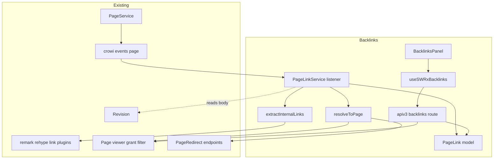
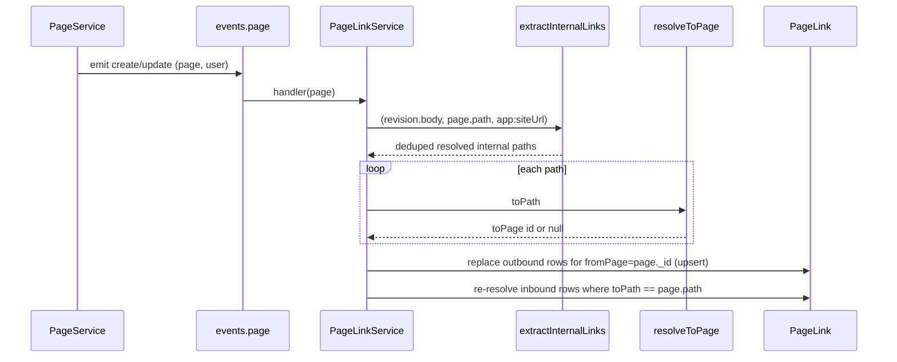
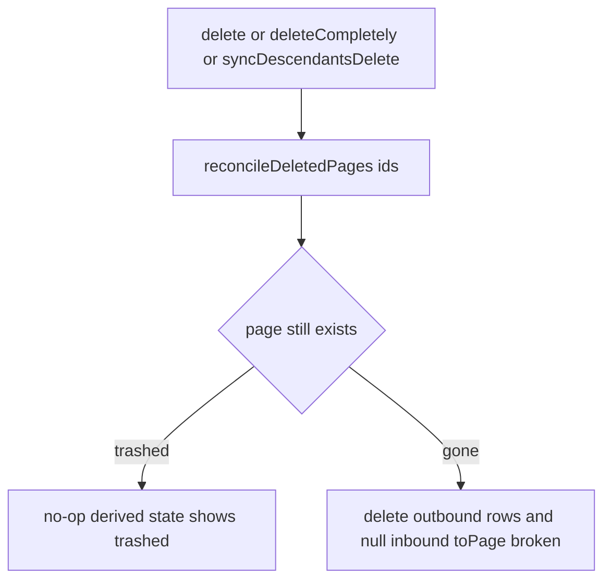
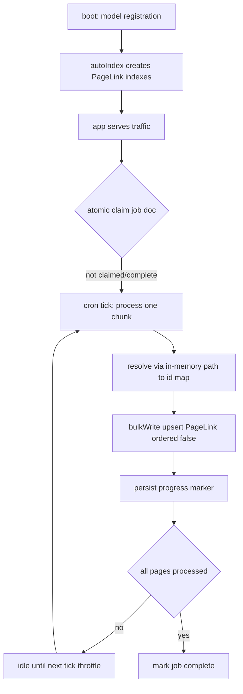

# Design Document

## Overview

**Purpose**: Backlinks gives every GROWI page a trustworthy "what links here" view and surfaces
broken/trashed outgoing links, so readers discover related content and editors stop silently
breaking references on rename or delete.

**Users**: Readers (discover related pages, judge importance), editors (see incoming references
before changing/renaming/deleting a page; spot their own broken outgoing links), administrators
(complete coverage of pre-existing content via a one-time backfill).

**Impact**: GROWI has no link index today — link handling is render-only and client-side. This
feature introduces a new server-side directed **link graph** (`PageLink`), kept current through
the existing page-lifecycle event bus and queried under the existing page-grant model. It adds
storage, one service, one read endpoint, one panel, and a background backfill job; it changes no
existing lifecycle, permission, or Markdown/wiki-link behavior. The `PageLink` indexes are created
by Mongoose `autoIndex` at model registration (new collection — no migration needed).

### Goals

- Persist a directed link graph (`fromPage → toPath/toPage`) extracted from page bodies.
- Show permission-filtered backlinks per page in interactive time at ≥100,000 pages.
- Keep the graph accurate across create / update / delete / permanent-delete / subtree-delete,
  and across rename/move and trash/restore with no per-rename writes.
- Backfill all pre-existing pages idempotently.
- Indicate when a link's target is trashed (recoverable) or broken (permanently gone).

### Non-Goals

- Wiki-wide link health/analytics dashboard, visual link graph, outbound automation/webhooks.
- Any change to GROWI's permission model, page lifecycle, redirect behavior, or link syntax.
- A dedicated job queue or `worker_threads`/separate worker process — none exist in GROWI today.
  v1 uses the event-listener seam for live updates and an in-process `CronService` job for
  backfill. Moving Markdown parsing off the main thread (the only way to fully remove CPU
  contention during backfill) is explicitly deferred.
  - **Not excluded**: the lightweight *in-process* coalescing queue the live listener uses (a
    `Set<pageId>` drained on a paced tick — see PageLinkService / Performance & Scalability). It is
    plain in-memory state on the same thread, not a durable queue, worker, or separate process, so
    it is consistent with this non-goal.
- A **blocking boot-time** backfill (a migrate-mongo data migration). Ruled out: it would take
  the wiki offline for the full backfill duration, which scales with page count and is
  unacceptable for large instances. Index creation is not boot-blocking either — `autoIndex`
  builds the indexes on a new, empty collection at model registration.
- Indexing attachments or `/share/*` targets (only creatable GROWI pages are indexed).

## Boundary Commitments

### This Spec Owns

- The `PageLink` collection and its schema, indexes, and uniqueness invariant.
- Server-side extraction of internal page links from a revision body + the page's path,
  including links written as page permalinks (`/{pageId}`) and absolute URLs whose origin is
  this wiki (`app:siteUrl`).
- Resolution of a stored `toPath` to a target page `_id` (`toPage` cache), including redirect
  following and direct `_id` resolution when `toPath` is a permalink.
- Synchronization of `PageLink` rows in response to page-lifecycle events.
- The one-time backfill: a background `CronService` job that populates rows for pre-existing pages
  without taking the wiki offline. (The `PageLink` indexes themselves are created by `autoIndex`
  at model registration, not by a migration.)
- The read API + SWR hook + UI panel that present backlinks and forward-link health.

### Out of Boundary

- Emitting page-lifecycle events, and the page create/update/delete/rename logic itself
  (consumed read-only via `crowi.events.page`).
- The grant/permission model and its condition generator (consumed via the shared viewer/grant
  filter — `PageQueryBuilder.addViewerCondition` / `generateGrantCondition`, as `findByIdsAndViewer`
  also does).
- Markdown/wiki-link parsing and link resolution rules (consumed via existing remark/rehype
  plugins; no syntax owned here).
- `PageRedirect` creation/cleanup (consumed read-only via `retrievePageRedirectEndpoints`).

### Allowed Dependencies

- `@growi/core` utilities (`@growi/core/dist/utils`): `normalizePath`, `isCreatablePage`,
  `isPermalink`, `removeHeadingSlash`.
- Configuration: `crowi.configManager.getConfig('app:siteUrl')` — read-only, used solely to
  recognize absolute URLs that point back to this wiki (may be `undefined`).
- Renderer plugins: `pukiwiki-like-linker`, `relative-links`,
  `relative-links-by-pukiwiki-like-linker`, and `generateCommonOptions`'s plugin set.
- Mongoose models: `Page` (`findByPath`, `PageQueryBuilder.addViewerCondition` /
  `addConditionToExcludeTrashed`), `Revision`, `PageRedirect`.
- `crowi.events.page` (subscribe only), apiv3 middleware (`accessTokenParser`, `loginRequired`),
  `getModelSafely` + `createBatchStream`, `CronService` (node-cron base) and the
  admin Socket.IO channel for backfill scheduling/progress (mirroring the page-bulk-export job).
- **Constraint**: dependency direction is one-way — backlinks depends on page/render/grant
  subsystems; none of them may import backlinks.

### Revalidation Triggers

Re-check this feature if any of the following change:

- `crowi.events.page` event names or payload shapes (esp. `delete`, `deleteCompletely`,
  `syncDescendantsDelete`).
- `PageQueryBuilder.addViewerCondition` / `addConditionToExcludeTrashed` / `generateGrantCondition`
  (and `Page.findByIdsAndViewer`) signatures or semantics.
- The remark/rehype link-resolution plugins' resolution rules or `pagePath` injection.
- `PageRedirect.retrievePageRedirectEndpoints` contract.
- `normalizePath` / `isCreatablePage` behavior.
- The `PageLink` schema, its `toPath` faithfulness rule, or the derived target-state contract
  (would force consumers of the read API to revalidate).
- The page-bulk-export job pattern / `CronService` base, or the backfill job's claim/progress
  contract (affects backfill resumability and multi-instance safety).
- `isPermalink` / `removeHeadingSlash` semantics, or GROWI's permalink convention (`/{pageId}`).
- The `app:siteUrl` config key, or `NextLink`'s own-host rule (`isExternalLink`: compares
  `baseUrl.host !== hrefUrl.host`) that link extraction mirrors for absolute URLs.

## Architecture

### Existing Architecture Analysis

- **No prior links infrastructure** — this is greenfield storage grafted onto existing seams.
- **Render pipeline is the single source of "what is a link"** — reusing it server-side keeps
  the index faithful to what the renderer shows and avoids a divergent parser.
- **Event bus is the integration seam** — `search.ts` already subscribes to `crowi.events.page`;
  backlinks follows that precedent, so `PageService` is not modified.
- **Grant filtering is centralized** — the shared viewer/grant filter (`addViewerCondition` /
  `generateGrantCondition`, as also applied by `findByIdsAndViewer`) is the only correct place to
  enforce visibility; the read path must route through it.

### Architecture Pattern & Boundary Map



**Architecture Integration**:
- **Selected pattern**: event-driven projection — `PageLink` is a read-optimized projection of
  page bodies, updated by listeners, queried directly for reads.
- **Domain boundaries**: extraction (body → paths), resolution (path → page id), persistence
  (`PageLink`), read (query + grant filter), presentation (panel) are separate single-purpose
  modules.
- **Existing patterns preserved**: event subscription (`search.ts`), model definition
  (`PageTagRelation`), apiv3 factory routes, SWR hooks, `PageAccessoriesModal` tabs.
- **New components rationale**: each new file owns exactly one of the boundaries above.
- **Dependency direction**: `interfaces → model → {extract, resolve} → service → route → hook → UI`.
  Each layer imports only leftward.

### Technology Stack

| Layer | Choice / Version | Role in Feature | Notes |
|-------|------------------|-----------------|-------|
| Frontend | React + SWR (existing) | Backlinks panel + data hook | New tab in `PageAccessoriesModal`; reuse `PageListItemS`/`PagePathLabel` |
| Backend / Services | Express apiv3 + a new `PageLinkService` | Read endpoint + event listeners | Listener wired in `crowi` setup like `search.ts` |
| Rendering | Existing unified remark/rehype plugins | Server-side link extraction | Node-compatible; trimmed processor (link plugins only) |
| Data / Storage | MongoDB + Mongoose (existing) | `PageLink` collection + indexes | New model via `getOrCreateModel`; indexes built by `autoIndex` at model registration (new collection — no migration) |
| Messaging / Events | `crowi.events.page` (Node EventEmitter) | Sync triggers | Subscribe only |
| Background job | `CronService` / node-cron (existing) | One-time backfill of pre-existing pages | Chunked + resumable + throttled; mirrors page-bulk-export job; admin Socket.IO progress |

## File Structure Plan

### Directory Structure
```
apps/app/src/features/backlinks/
├── interfaces/
│   └── page-link.ts              # IPageLink, IBacklink & ILinkTarget DTOs, LinkTargetState union
├── server/
│   ├── models/
│   │   ├── page-link.ts          # Mongoose model (getOrCreateModel) + statics
│   │   └── page-link-backfill-job.ts   # Mongoose model: backfill progress marker + atomic claim (multi-instance)
│   ├── service/
│   │   ├── extract-internal-links.ts   # pure: (markdown, pagePath, siteUrl?) => string[] (resolved, deduped)
│   │   ├── resolve-to-page.ts          # toPath -> toPage id (permalink by id | findByPath + redirect) — live path only
│   │   ├── page-link-sync.ts           # pure-ish ops: upsert outbound, reconcile-delete, re-resolve inbound
│   │   ├── page-link-service.ts        # subscribes to crowi.events.page; orchestrates sync; read query
│   │   └── page-link-backfill-cron.ts  # CronService: chunked, resumable, throttled backfill (in-memory path->id map)
│   └── routes/
│       └── get-page-backlinks.ts       # apiv3 route factory (GET)
└── client/
    ├── stores/
    │   └── use-swrx-backlinks.ts       # SWR hook
    └── components/
        ├── BacklinksPanel.tsx          # incoming list + empty state + forward-health section
        └── BacklinkListItem.tsx        # one row (title + path + target-state badge)

# No migration file: PageLink indexes are created by Mongoose autoIndex at model
# registration (new collection); the backfill is the cron job above.
```

### Modified Files
- `apps/app/src/server/crowi/index.ts` — instantiate and initialize `PageLinkService`
  (subscribe to events) in the page-service setup phase, mirroring `search.ts`; also register the
  backfill `CronService` (mirroring the page-bulk-export job-cron registration).
- `apps/app/src/server/routes/apiv3/index.js` — register the backlinks route.
- `apps/app/src/client/components/PageAccessoriesModal/PageAccessoriesModal.tsx` (+ its Jotai
  modal-contents enum) — add the **Backlinks** tab mapping to `BacklinksPanel`.

> Each file owns one responsibility. `extract-internal-links.ts` and `resolve-to-page.ts` are
> pure/stateless and unit-testable in isolation; `page-link-service.ts` is the only framework
> adapter (event wiring) and receives the page/body as input rather than owning lifecycle logic.

## System Flows

### Save → extract → index (create / update)


### Read backlinks (permission-filtered)
```mermaid
sequenceDiagram
    participant UI as BacklinksPanel
    participant API as backlinks route
    participant DB as PageLink
    participant Grant as viewer grant filter

    UI->>API: GET backlinks pageId
    API->>DB: find toPage == pageId -> fromPage ids
    API->>Grant: ids + user + groups (exclude trashed sources)
    Grant-->>API: readable active source pages
    API-->>UI: backlinks [path, title]; empty state if none
```

### Delete-family reconcile (uniform, state-based)


Key decisions: rename/move emit no usable event and need none — `_id`-stable `toPage` plus
redirect-following resolution keep inbound links valid (requirement 5); permalink links
(`toPath = /{id}`) are immune by construction and need no redirect-following at all (5.4). Restore
needs no write — derived state reads the restored page's status.

## Requirements Traceability

| Requirement | Summary | Components | Interfaces / Flows |
|-------------|---------|------------|--------------------|
| 1.1 | Show list of linking pages | BacklinksPanel, route, PageLinkService.findBacklinks | Read flow |
| 1.2 | Recognize MD / wiki / raw-HTML anchors | extractInternalLinks (+ render plugins) | — |
| 1.3 | Exclude external (diff-host) URLs / in-page fragments | extractInternalLinks classifier | — |
| 1.4 | Ignore links inside code | extractInternalLinks (HAST has no `<a>` in code) | — |
| 1.5 | One source listed once | unique `{fromPage,toPath}` + dedupe in extraction | Save flow |
| 1.6 | Exclude self-link (path or own permalink) | extractInternalLinks (drop `toPath == page.path`) + sync (drop `toPage == fromPage`) | Save flow |
| 1.7 | Empty state | BacklinksPanel | Read flow |
| 1.8 | Show title + path | IBacklink DTO, BacklinkListItem | Read flow |
| 1.9 | Permalink (`/{id}`) link targets page by id | extractInternalLinks (verbatim) + resolveToPage permalink branch | Save flow |
| 1.10 | Same-host absolute URL → internal | extractInternalLinks classifier (`app:siteUrl` host match) | — |
| 1.11 | Unset `app:siteUrl` → absolute URLs not internal | extractInternalLinks classifier (no base origin) | — |
| 2.1 | Only readable linking pages | findBacklinks → addViewerCondition (shared grant filter) | Read flow |
| 2.2 | Unreadable omitted from list and count | addViewerCondition + addConditionToExcludeTrashed (filter ids in-query) | Read flow |
| 2.3 | No leak of title/path/existence | DTO built only from filtered pages | Read flow |
| 2.4 | Grant change reflected | per-request filtering (no cached list) | Read flow |
| 3.1 | Create → backlinks appear | PageLinkService create handler | Save flow |
| 3.2 | Update add/remove → reflected | create/update replace outbound rows | Save flow |
| 3.3 | Deleted page not an active source | reconcile (permanent: remove rows; trashed: filtered at read) | Delete flow |
| 3.4 | <~1s at ≥100k pages | indexes `{toPage}`,`{fromPage}`,`{toPath}` | — |
| 3.5 | Bound extraction impact under save bursts | PageLinkService coalescing queue (`Set<pageId>` + paced drain) | Save flow |
| 4.1 | One-time backfill | PageLinkBackfillCron (indexes via `autoIndex` at model registration) | Backfill flow |
| 4.2 | Backfilled == post-enablement | backfill reuses `extractInternalLinks`; emits same rows as the live path | Backfill flow |
| 4.3 | Re-run / restart produces no duplicates | unique `{fromPage,toPath}` + upsert; resumable progress marker | Backfill flow |
| 5.1 | Links survive rename/move | resolveToPage redirect-following + `_id`-stable cache | Reconcile notes |
| 5.2 | Descendants re-associated | same (each descendant keeps `_id`) | Reconcile notes |
| 5.3 | Unresolvable move → broken | resolveToPage → null → broken state | Read flow |
| 5.4 | Permalink links rename-immune (no re-association) | resolveToPage permalink branch + `_id`-stable `toPath`/`toPage` | Reconcile notes |
| 6.1 | Soft-delete target → trashed | derived state from target status | Delete flow |
| 6.2 | Permanent-delete target → broken | reconcile nulls inbound `toPage` | Delete flow |
| 6.3 | Restore → normal | derived state (no write) | Delete flow |
| 6.4 | Indicate trashed/deleted target on viewed page | forward-health read (fromPage=X) + badge | Read flow |

## Components and Interfaces

| Component | Layer | Intent | Req | Key Dependencies (P0/P1) | Contracts |
|-----------|-------|--------|-----|--------------------------|-----------|
| PageLink model | Data | Persist directed link edges | 1.5,3.x,4.3 | Mongoose, getOrCreateModel (P0) | State |
| extractInternalLinks | Server logic | Body+path+siteUrl → resolved internal paths | 1.2–1.6, 1.10, 1.11 | render plugins, isCreatablePage, normalizePath, isPermalink, app:siteUrl (P0) | Service |
| resolveToPage | Server logic | toPath → toPage id (incl. permalink by id) | 1.9, 5.x | Page.findById/findByPath, PageRedirect, isPermalink (P0) | Service |
| PageLinkService | Server service | Subscribe to events, sync index, query backlinks | 1.1,2.x,3.x,5,6 | events.page (P0), PageQueryBuilder.addViewerCondition (P0) | Service, Event |
| get-page-backlinks route | API | Read endpoint | 1.1,1.7,2.x,6.4 | apiv3 middleware (P0), PageLinkService (P0) | API |
| useSWRxBacklinks | Client store | Fetch backlinks | 1.1 | apiv3Get (P0) | Service |
| BacklinksPanel / BacklinkListItem | UI | Render list, empty state, target-state badge | 1.1,1.7,1.8,6.4 | useSWRxBacklinks, PageListItemS (P1) | — |
| PageLinkBackfillCron | Batch | Populate pre-existing pages (chunked, resumable, throttled, online) | 4.1,4.2,4.3 | CronService (P0), extractInternalLinks (P0), Revision, in-memory path→id map (P0) | Batch, State |

### Data / Server logic

#### PageLink model

| Field | Detail |
|-------|--------|
| Intent | Authoritative directed link edge: `fromPage` links to `toPath` (faithful to body), cached to `toPage` |
| Requirements | 1.5, 3.1–3.3, 4.3 |

**Responsibilities & Constraints**
- `toPath` is the **source of truth** (exactly what the body resolves to); `toPage` is a derived
  `_id` cache, always computed from `toPath`, never the reverse.
- Invariant: at most one row per `(fromPage, toPath)` (unique index) → requirement 1.5.
- `toPage` is `null` **only** when no live page and no redirect chain resolves `toPath`.
- For a **permalink** row, `toPath` is the resolved `/{pageId}` and `toPage` is the page with that
  `_id` (or `null` if no such page exists); this row is rename-immune by construction (5.4).

**Contracts**: State [x]

##### State Management
- Schema (mirrors `PageTagRelation` conventions, `getOrCreateModel`):
```typescript
interface IPageLink {
  fromPage: ObjectId;        // ref Page, required
  toPath: string;            // canonical resolved path, required
  toPage: ObjectId | null;   // ref Page cache, default null
}
```
- Indexes: `{ fromPage: 1 }`, `{ toPath: 1 }`, `{ toPage: 1 }`, and unique `{ fromPage: 1, toPath: 1 }`.
- Statics: `replaceOutboundLinks(fromPageId, resolvedRows)`, `findBacklinkSources(toPageId)`,
  `reconcileDeletedPages(pageIds)`, `reResolveByToPath(path)`.

#### extractInternalLinks

| Field | Detail |
|-------|--------|
| Intent | Pure function: `(markdown, pagePath, siteUrl?) => string[]` of deduped, resolved, internal page paths |
| Requirements | 1.2, 1.3, 1.4, 1.5, 1.6, 1.10, 1.11 |

**Contracts**: Service [x]

##### Service Interface
```typescript
function extractInternalLinks(markdown: string, pagePath: string, siteUrl?: string): string[];
```
- **Mechanism**: run a trimmed unified processor reusing `pukiwikiLikeLinker` (remark),
  `remark-rehype` (`allowDangerousHtml`), `rehype-raw`, `relativeLinksByPukiwikiLikeLinker({ pagePath })`,
  `relativeLinks({ pagePath })`, then a terminal collector over `selectAll('a[href]')`.
  Note `relativeLinks` resolves **relative** hrefs to `/`-paths but **leaves absolute `http(s)://`
  URLs untouched**, so the collector must classify each `href` itself.
- **Per-href classification** (in the collector):
  - in-page fragment (`#…`) → drop (1.3).
  - absolute URL — **defined as having an explicit scheme** (`/^https?:\/\//`), **not** a
    root-absolute `/path` nor a relative href: mirror `NextLink.isExternalLink` — parse with a base
    (`const u = new URL(href, siteUrl)`, wrapped in try/catch; on parse error treat as non-internal
    and drop). Keep `u.pathname` as the target **iff** `siteUrl` is set **and**
    `u.host === new URL(siteUrl).host` (1.10); otherwise drop as external (1.3). When `siteUrl` is
    `undefined`, no scheme-bearing URL is internal → all dropped (1.11). Host comparison (not
    origin) matches `NextLink`.
  - otherwise (a root-absolute or relative-resolved `/`-path, including a permalink `/{id}`) → use it.
- **Postconditions** (each returned path): `new URL(href, base).pathname` strips `?query`/`#anchor`;
  `normalizePath` applied; passes `isCreatablePage` (a bare-ObjectId permalink path `/{id}` passes
  this gate, so permalink targets are returned verbatim and resolved by id downstream — 1.9); not
  equal to `normalizePath(pagePath)` (path self-link excluded, 1.6 — a **permalink** self-link is
  dropped at sync, see PageLinkService); list deduped (1.5).
- **Excluded**: different-host absolute URLs (1.3, 1.11) and in-page `#` anchors (1.3). Exclusion
  is purely by host/fragment, **independent of authoring form** — a same-host absolute URL is
  internal (1.10) whether written as `[x](url)` or as a bare autolink (both are `<a href>` in the
  HAST and indistinguishable); links in code spans/blocks never appear as `<a>` (1.4).
- **Purity**: `siteUrl` is an injected parameter; the function does not read `configManager` itself.
- Skip `sanitize`/`katex`/`math` plugins — only link resolution is needed.

#### resolveToPage

| Field | Detail |
|-------|--------|
| Intent | Resolve a stored `toPath` to a target page `_id` — by id for permalinks, else by path/redirect | 
| Requirements | 1.9, 5.1, 5.2, 5.3, 5.4 |

**Contracts**: Service [x]

##### Service Interface
```typescript
function resolveToPage(toPath: string): Promise<ObjectId | null>;
```
- Order: **(0)** if `isPermalink(toPath)` → `Page.findById(removeHeadingSlash(toPath))?._id ?? null`
  (the id *is* the target; no path lookup, no redirect-following). **(1)** else `Page.findByPath(toPath)`
  → **(2)** else `PageRedirect.retrievePageRedirectEndpoints(toPath)` then
  `Page.findByPath(endpoints.end.toPath)` → **(3)** else `null`.
- Always read `.end.toPath` (handles A→B→C via `$graphLookup`; cycle-safe).
- **Permalink targets are the strongest case (1.9, 5.4)**: `toPath` already encodes the immutable
  `_id`, so `toPage` is permanent and immune to rename/move/redirect — it never needs
  redirect-following or re-resolution. (`isPermalink` has already validated a 24-hex ObjectId, so
  `findById` is safe.)
- **Live path only.** This per-call resolver runs on create/update and on the read path, where
  the per-link cost is negligible. The **backfill must NOT call it per link** — at millions of
  links that is millions of DB round-trips. Backfill resolves against an in-memory `{path → _id}`
  map built once (see PageLinkBackfillCron) and skips redirect-following (stragglers self-heal on
  the next edit/read).

#### PageLinkService (event listener + read)

| Field | Detail |
|-------|--------|
| Intent | Subscribe to page events, keep `PageLink` in sync, serve backlinks & forward-health reads |
| Requirements | 1.1, 2.x, 3.x, 5, 6 |

**Dependencies**
- Inbound: `crowi.events.page` events (P0).
- Outbound: `extractInternalLinks`, `resolveToPage`, `PageLink` model,
  `PageQueryBuilder.addViewerCondition` + `addConditionToExcludeTrashed` (P0); `Revision` to read
  body when payload lacks it (P1).

**Contracts**: Service [x] / Event [x]

##### Event Contract
- Subscribed events (wired in `crowi` setup like `search.ts`):
  - `create (page, user)` → extract `page.revision.body` → `syncOutboundLinks` →
    `reResolveByToPath(page.path)` (correct stale caches from a prior occupant — match on
    `toPath`, not `toPage:null`).
  - `update (page, user)` → re-extract → `syncOutboundLinks`.
  - Note: handlers call the `syncOutboundLinks` **service** (drops self-links, then
    persists), never the raw `PageLink.replaceOutboundLinks` model static directly.
  - `delete (targetPage, deletedPage, user)`, `deleteCompletely (page, user)`,
    `syncDescendantsDelete (pages[], user)` → `reconcileDeletedPages(ids)`.
- Ordering/delivery: listeners run asynchronously after the lifecycle op (fire-and-forget, like
  search indexing); the index trails the HTTP response by that window. No cross-event ordering
  assumptions; handlers are idempotent.
- Write-side coalescing (requirement 3.5): _Implementation status — as of B1 the upsert runs inline in
  the event callback; the coalescing queue described here is the B2.2 target and is not yet implemented._
  `create`/`update` do **not** extract inline in the event
  callback. They mark the page dirty (`Set<pageId>`) and a paced tick drains it, running the upsert
  handler once per page with the **latest** body (re-read at drain time). This is safe because the
  upsert is idempotent last-writer-wins, so intermediate saves carry no information. Properties:
  - **Same page saved repeatedly** → the `Set` collapses it to one extraction run.
  - **Many distinct pages saved at once** → the tick processes a bounded number per cycle, so a
    burst of full-body parses is spread over time instead of blocking the single JS thread back-to-back.
  - **Delete supersedes a pending upsert**: a `delete`-family event for a page removes it from the
    dirty set and routes to `reconcileDeletedPages(ids)` instead, so a stale upsert never re-creates
    rows for a gone page.
  - **Best-effort, per-instance**: the set is in-memory. A restart drops pending work (that page
    self-heals on its next edit or via backfill); in multi-instance deployments the set is
    per-instance, which is safe (idempotent) but only coalesces per instance.

##### Service Interface
```typescript
interface IBacklinkResult { backlinks: IBacklink[]; }
findBacklinks(toPageId: ObjectId, user: IUser | null): Promise<IBacklink[]>;
findForwardLinkHealth(fromPageId: ObjectId, user: IUser | null): Promise<ILinkTarget[]>;
```
- `findBacklinks`: `findBacklinkSources(toPageId)` → ids → route them through the shared
  viewer/grant filter (`PageQueryBuilder.addViewerCondition` — the same grant logic
  `findByIdsAndViewer` runs internally, unioning the viewer's normal and external user groups) with
  `addConditionToExcludeTrashed` to **exclude trashed source pages in-query**, then `.select('_id path').lean()`
  and map to `IBacklink` (2.1–2.3). Empty array when none (1.7). The builder is used directly rather
  than the `findByIdsAndViewer` static so trashed exclusion happens in the DB (see risk note below)
  and so only the two fields the DTO needs are hydrated — this keeps the read to the two indexed
  queries described under Performance & Scalability.
- `findForwardLinkHealth`: rows where `fromPage == X`; derive each target's
  `LinkTargetState` (`toPage == null` → `broken`; target trashed → `trashed`; else `normal`);
  return the `trashed`/`broken` rows as `ILinkTarget` for the editor's attention (6.4).

**Implementation Notes**
- Integration: register in `crowi` page-service setup; never edit `PageService`.
- Validation: handlers tolerate missing/empty bodies and already-deleted pages (idempotent).
- Extraction input: the service reads `configManager.getConfig('app:siteUrl')` and passes it into
  `extractInternalLinks` (so absolute self-URLs resolve — 1.10/1.11); `extractInternalLinks` stays
  config-free/pure.
- Self-link exclusion (1.6): extraction drops a **path** self-link (`toPath == normalizePath(page.path)`);
  a **permalink** self-link (`/{own _id}`) is dropped at sync by skipping any resolved row whose
  `toPage` equals `fromPage` — this also covers any alias that resolves back to the source.
- Resolved risk: `findByIdsAndViewer` / `addViewerCondition` apply only the grant condition and do
  **not** exclude trashed pages, so `findBacklinks` adds `addConditionToExcludeTrashed` explicitly
  (`status` published/null, excluding `deleted`) rather than relying on the viewer filter.

### API

#### get-page-backlinks route

**Contracts**: API [x]

##### API Contract
| Method | Endpoint | Request | Response | Errors |
|--------|----------|---------|----------|--------|
| GET | `/_api/v3/page/backlinks` | query: `pageId` (MongoId) | `{ backlinks: IBacklink[] }` | 400, 403, 500 |

- Middleware: `accessTokenParser([SCOPE.READ.FEATURES.PAGE])`, `loginRequired` (guest per ACL),
  `apiV3FormValidator`; `req.user` is the viewer. Delegates to `PageLinkService.findBacklinks`.
- Response carries only filtered pages (no count derived from unfiltered set) → 2.2.

### Client

#### useSWRxBacklinks (summary)
```typescript
useSWRxBacklinks(pageId: string | null): SWRResponse<IBacklink[]>;
```
- Key `['/page/backlinks', pageId, isGuestUser]`; fetch via `apiv3Get(...).then(r => r.data.backlinks)`.
  `useSWRImmutable`; key `null` when `pageId == null`.

#### BacklinksPanel / BacklinkListItem (summary)
- New tab in `PageAccessoriesModal`. `BacklinksPanel` renders the incoming list (empty state per
  1.7) and a secondary "outgoing links needing attention" section from forward-health (6.4).
- `BacklinkListItem` renders title + path (reuse `PagePathLabel`/`PageListItemS`) + a target-state
  badge (`trashed`/`broken`) for the forward-health rows.

### Batch

> **Why the backfill is an online job, not a boot-time migration.** GROWI runs migrate-mongo
> migrations *synchronously at boot, before the app serves traffic* (`docker-entrypoint.ts:247`).
> A data migration that parses every page body would therefore make the wiki **offline for the
> full backfill duration** — minutes on small wikis, but tens of minutes to hours on large-plan
> instances. So the heavy data part runs **online** as a throttled background job after boot.
> Nothing schema-related blocks boot either: `PageLink` is a new collection, so its indexes
> (`{fromPage}`, `{toPath}`, `{toPage}`, unique `{fromPage,toPath}`) are created by Mongoose
> `autoIndex` at model registration — no migration is involved. Backlinks are simply incomplete
> for pre-existing pages until the job finishes (acceptable per 4.2, which only requires
> completeness *after* the process completes); newly edited pages index immediately via the event
> listener.

#### PageLinkBackfillCron

| Field | Detail |
|-------|--------|
| Intent | Online, one-time backfill of `PageLink` rows for pre-existing pages | 
| Requirements | 4.1, 4.2, 4.3 |

**Responsibilities & Constraints**
- Extends `CronService` (node-cron) and follows the **page-bulk-export job** precedent: each tick
  processes a bounded **chunk** of pages, persists progress, then idles until the next tick.
- **Throttle = cron cadence × chunk size** (the duty cycle). Because the job shares the single JS
  thread, the cadence is the only lever bounding CPU contention with live traffic; default
  conservative (≈10–25% duty), operator-tunable.
- **Resumable**: a `PageLinkBackfillJob` document stores a progress marker (e.g. last processed
  `_id`/path) so a restart continues rather than restarting (4.3).
- **Run-once + multi-instance safe**: the job document carries an **atomic claim**
  (`findOneAndUpdate`) so only one instance in a multi-container deployment runs it, and it stops
  permanently once complete. (GROWI has no distributed lock; this Mongo claim is the minimal
  hardening over the bulk-export pattern, which has a known race window.)
- **In-memory resolution**: loads `{path → _id}` for all pages once (one lightweight projection
  query) and resolves extracted links by hash lookup — **never** per-link `resolveToPage`.
  Redirect-following is skipped during backfill. For a **permalink** `toPath` (`isPermalink`),
  resolution is an **existence check** against the set of known page ids (the map's values):
  present → that id; absent → `null` (broken). The id is the target, so the path map is not
  consulted for permalinks.

**Contracts**: Batch [x] / State [x]

##### Batch / Job Contract
- Trigger: **auto-started from `crowi` setup after boot** (throttled). Skips immediately if the job
  document is marked complete. (Admin-triggered start deferred — see Delivery decision below.)
- Input per chunk: a cursor page-batch (`Page.find(...).cursor({ batch_size })` +
  `createBatchStream`); body via `Revision.findById(page.revision).body`.
- Per page: `extractInternalLinks(body, page.path, siteUrl)` → resolve each path via the in-memory
  map (or, for a permalink path, via the id-existence set) → `bulkWrite` upserts (`ordered:false`).
- Idempotency: unique `{fromPage,toPath}` + upsert; safe to re-run and to resume mid-chunk (4.3).
- Progress/observability: emit count/total over the existing admin Socket.IO channel (as the
  Elasticsearch reindex does).

**Delivery decision (resolved): auto-start, throttled.**
- The backfill **auto-starts** from `crowi` setup after boot, bounded by a conservative default duty
  cycle (operator-tunable), and guarantees completion with no admin action. An admin-triggered start
  (operator picks an off-peak window / raises the duty cycle) was considered but **deferred**; the
  job is built so adding that trigger later is a one-line wiring change — it reuses the identical job.

## Data Models

### Logical Data Model
- `PageLink (fromPage → Page._id)` and `(toPage → Page._id | null)`; `toPath: string`.
- Cardinality: one page has many outbound rows; a target has many inbound rows.
- Referential integrity: `fromPage` always references a live page (rows removed when source is
  permanently deleted); `toPage` is a best-effort cache reconciled on lifecycle events and read
  resolution. `toPath` has no FK and is never rewritten on rename (stays faithful to the body).
  For permalink rows, `toPath` is `/{pageId}` and the `toPage` cache is permanent (the id is stable
  across rename/move/restore), so they satisfy 5.4 with no reconciliation.

### Derived target state (not stored)
```typescript
type LinkTargetState = 'normal' | 'trashed' | 'broken';
// broken  := toPage == null
// trashed := toPage resolves to a page whose status is "in trash"
// normal  := toPage resolves to an active page
```

### DTOs
```typescript
// Incoming backlinks (findBacklinks): always live, readable source pages — no health to report.
interface IBacklink {
  pageId: string;
  path: string;
}
// Outgoing link health (findForwardLinkHealth): a page the subject links out to, plus its state.
interface ILinkTarget {
  pageId: string;
  path: string;
  targetState: LinkTargetState; // required — a health row is meaningless without it
}
```

## Error Handling

### Error Strategy
- Extraction/sync failures are logged with `{ pageId, path }` context and never propagate to
  break the originating save (listener is decoupled from the save transaction).
- Read endpoint returns `403` if the viewer cannot read the **subject** page, and otherwise
  returns only permission-filtered results (never partial-leak on error).

### Error Categories and Responses
- **User errors (4xx)**: invalid/missing `pageId` → 400 via validator; no access to subject page → 403.
- **System errors (5xx)**: DB/resolution failure → 500 with generic message; details logged only.
- **Business-logic**: an unresolved `toPath` is **not** an error — it is the `broken` state.

### Monitoring
- Log sync handler outcomes (rows written/removed, unresolved count) at debug; log handler
  exceptions at error with page context, mirroring the search-indexer logging style.

## Testing Strategy

### Unit Tests
- `extractInternalLinks`: Markdown `[x](/a)`, wiki `[[l>/a]]` / `[[./child]]`, raw `<a href>`
  all yield resolved internal paths (1.2); external/`#`-anchor/code-fence links excluded
  (1.3, 1.4); duplicates collapsed and the **path** self-link dropped (1.5, 1.6 — permalink
  self-links are dropped at sync, covered in integration); relative resolution uses the correct
  per-type base. A same-host absolute URL (`https://<siteUrl-host>/a/b`) yields
  `/a/b` while a different-host URL is excluded (1.10); with `siteUrl` undefined, absolute URLs are
  excluded (1.11); a permalink `/{id}` is returned verbatim (1.9).
- `resolveToPage`: live page wins; single and double redirect chains resolve to `.end.toPath`;
  no page + no redirect → `null` (5.1–5.3). A permalink `toPath` resolves directly by id
  (`findById`, no path/redirect lookup) and yields `null` when no page has that id (1.9, 5.4).
- `reconcileDeletedPages`: trashed page → no-op; permanently-gone page → outbound removed and
  inbound `toPage` nulled (3.3, 6.2).

### Integration Tests
- create/update events drive `PageLink` rows so a page's links appear as backlinks on targets,
  and edits add/remove them (3.1, 3.2). A page that links to its own permalink (`/{own id}`) is
  excluded from its own backlinks (1.6); a permalink-based backlink keeps resolving after the
  target is renamed/moved with no index writes (5.4).
- Backlinks read excludes pages the viewer cannot read, including from any derived count
  (2.1–2.3); grant change flips visibility on the next read (2.4).
- Rename/move: inbound links continue resolving to the page at its new path without index
  writes; descendant move behaves identically (5.1, 5.2).
- Trash → derived `trashed`; permanent delete → `broken`; restore → `normal` (6.1–6.3).
- Backfill: rows produced for pre-existing pages match the live create/update path (4.2); running
  the job twice, or resuming after an interrupted chunk, produces no duplicate rows (4.3); the
  atomic claim prevents two instances/ticks from double-processing.

### E2E / UI Tests
- Backlinks tab on a page lists linking pages with title + path; empty state when none
  (1.1, 1.7, 1.8).
- Editor viewing a page that links to a trashed/permanently-deleted page sees the
  trashed/broken indicator (6.4).

### Performance / Load
- Backlinks read for a heavily-linked page returns in interactive time (<~1s) on a ≥100k-page
  dataset, exercising the `{toPage}` index and the viewer filter (3.4).

## Security Considerations

- The only data-exposure surface is `findBacklinks`; it **must** route the source ids through the
  shared viewer/grant filter (`PageQueryBuilder.addViewerCondition`, the same filter
  `findByIdsAndViewer` applies) and **never return raw `PageLink` paths**. `toPath` strings are page
  paths and could reveal restricted pages' existence if returned unfiltered — so the DTO is built
  solely from permission-filtered page documents (only their `_id`/`path` are read).
- `pageId` is validated as a MongoId; no regex is built from user input for MongoDB.

## Performance & Scalability

- Reads are two indexed queries (`{toPage}` lookup, then `_id`-`$in` viewer filter); no
  per-request body parsing. Target: <~1s at ≥100k pages (3.4).
- Writes happen off the response path via the event listener; extraction uses a trimmed
  processor (link plugins only) to bound per-save cost (~120–140 ms for a 60 KB body).
- **Write-side burst control** (requirement 3.5). Extraction is CPU-bound and runs on the single JS
  thread, so N saves landing together would otherwise block the event loop for N × per-parse cost
  back-to-back. Two scenarios, one mechanism:
  - *Same page, rapid saves* (e.g. a shared collaborative doc saved several times in a window) — a
    `Set<pageId>` coalesces them to one run. Naturally low-pressure: a Yjs document is shared, so
    N co-editors produce **one** `update` event per explicit save, not N, and there is no autosave —
    the event fires only on an explicit save (`updatePage`).
  - *Many distinct pages saved at once* — the coalescing queue is drained a **bounded number per
    tick**, so parses are paced (with the event loop yielding between them) rather than run in one
    blocking spree. The tick cadence / batch size is the duty-cycle lever, mirroring the backfill job.
  - The pacing is about spreading work over time (yielding between parses), not parallelism —
    concurrency buys nothing for CPU-bound work on one thread.
  - Trade-off: the index trails the save by up to (tick interval × queue depth) — acceptable, since
    the listener is already fire-and-forget and eventually consistent.
- **Backfill** is the only bulk-CPU operation. It runs online but on the single JS thread, so its
  cron cadence/chunk size (duty cycle) bounds latency impact on live traffic; the in-memory
  `{path→_id}` map keeps it CPU-bound (parsing), not round-trip-bound. Measured ~5 ms/page;
  full-speed ~10 min/100k pages, ~50 min/500k, scaled by duty cycle and page size.

## Migration Strategy

No migration: `PageLink` indexes are created by Mongoose `autoIndex` at model registration (new,
empty collection). The only bulk step is the online throttled backfill job after boot.



- **No boot downtime**: `autoIndex` on the empty `PageLink` collection is effectively instant. The
  wiki is online throughout the backfill; pre-existing backlinks fill in progressively.
- **Estimated backfill wall-clock** (≈5 ms/page CPU; in-memory resolution): ~10 min/100k pages at
  full speed, scaled up by the inverse duty cycle (e.g. ~40 min/100k at 25% duty) and by average
  page size. See `research.md` for the benchmark and the scale/duty-cycle table.
- Rollback: stop the cron and drop the `PageLink` collection (indexes go with it). Recovery from a
  crash = resume from the progress marker; idempotent upserts make partial progress safe.
