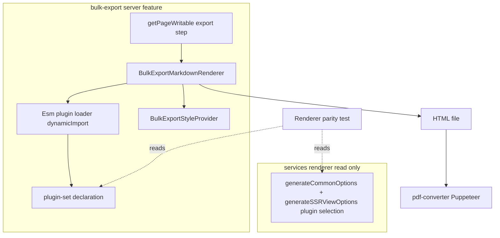

# Design Document: bulk-export-pdf-rendering

## Overview

**Purpose**: 一括エクスポート（bulk export）の PDF 出力（中間 HTML を介する）における **サーバ側
Markdown レンダリング** を、GROWI Web 表示に寄せてリッチ化する。
**Users**: コンプライアンス/共有目的でページ群を PDF エクスポートする利用者・管理者。
**Impact**: 現状の独自最小パイプライン（`remark-parse → remark-gfm → remark-html` ＋ Bootstrap 全量
注入）を、GROWI 実レンダラと同種の **npm 製 ESM プラグイン集合（`dynamicImport`）＋ デザインシステム
由来 CSS（`.wiki` ラップ）** に置換する。

**設計の中核方針**: 出力 HTML を `<div class="wiki">` でラップし、GROWI 本文スタイル（`.wiki` 由来 +
`@growi/core-styles`）をプリコンパイルした CSS を注入する。GROWI の本文スタイルは [_wiki.scss](../../../apps/app/src/styles/organisms/_wiki.scss#L4) で
`.wiki { table {…} blockquote {…} h1..h6 {…} }` のように **素の要素**に当たるよう書かれているため、
個別クラスを付与する変換ロジックは不要。**インライン変換・ローカルプラグインの再実装は一切行わない**
（research.md I-table）。これにより「同一機能が 2 箇所に分散」を回避する。

本設計は現行 CJS サーバランタイム前提で閉じる（Web レンダラ本体・ローカル .ts プラグインは
`ERR_REQUIRE_ESM` で import 不可、research.md I2）。

### Goals
- in-scope の Markdown 機能（GFM 表 / 数式 / 見出し ID / frontmatter / 引用・コード等の標準要素）を
  構造化 HTML として出力する。
- 素の HTML 要素に `.wiki` 由来のデザインシステム CSS を当てて装飾する（個別クラス付与なし）。
- 機能ごとの追従ではなく npm プラグイン集合を一括採用し、ローカル再実装を持たない。
- Web レンダラのプラグイン集合との乖離をテストで検知する。

### Non-Goals
- リポジトリ全体の ESM 化（`support/esm`）。
- **GitHub アラート / GROWI ディレクティブの装飾コールアウト描画**。色付きコールアウトは React
  コンポーネント（`CalloutViewer`）駆動で HTML 文字列としての再利用元が存在せず、忠実再現には
  React SSR が要る。本 spec では行わず、将来フェーズ renderer-convergence に委ねる。アラートは
  blockquote、ディレクティブ記法は可読テキストへ劣化させる。
- GROWI ローカル .ts プラグイン（emoji / xsv-to-table / add-class / echo-directive 等）の再利用。
- React コンポーネント依存機能（シンタックスハイライト配色、drawio/lsx/mermaid/plantuml/
  attachment-refs）。
- GROWI テーマ・レイアウト・画面 chrome の再現。
- 再生成 dedup キャッシュの無効化（`revisionListHash` のレンダラ版反映）。
- pdf-converter 側でのレンダリング。

## Boundary Commitments

### This Spec Owns
- bulk-export feature 内の **サーバ側 Markdown→HTML 変換パイプライン**（組み立て・実行）。
- 出力 HTML への **CSS 注入と `.wiki` ラップ**。
- Web レンダラとのプラグイン集合 **ドリフト検知テスト**。

### Out of Boundary
- Web/クライアントレンダラ（`services/renderer`, `client/services/renderer`）の挙動変更。ただし
  ドリフトテストが `generateCommonOptions` **および `generateSSRViewOptions`（view レベルの選定。
  math/katex/slug/sanitize はここで追加される）** を **読み取り参照** することは許可。
- インライン変換やローカルプラグインの再実装、コールアウト描画、ローカル .ts プラグイン本体、
  ESM 化、dedup キャッシュ、pdf-converter 内部、md 形式の出力内容。

### Allowed Dependencies
- `@cspell/dynamic-import` の `dynamicImport`（既存方式）。
- npm 製 ESM プラグイン群（下記 Technology Stack）。
- `@growi/core-styles` ＋ `_wiki.scss`（CSS のプリコンパイル元）。
- 既存 bulk-export cron パイプラインの **インターフェースは不変**のまま、`export-pages-to-fs-async`
  の変換部のみ差し替え。

### Revalidation Triggers
- pdf-converter が読み取る **HTML ファイル契約**（パス規約・形式）の変更。
- Web `generateCommonOptions` / `generateSSRViewOptions` の **プラグイン集合・順序**の変更
  （ドリフトテストが検知）。
- `.wiki` ラップ規約・注入 CSS の構成変更。
- リポジトリ全体の **ESM 化完了**（Phase 2「renderer-convergence」着手の合図）。

## Architecture

### Existing Architecture Analysis
- 変換は [export-pages-to-fs-async.ts](../../../apps/app/src/features/page-bulk-export/server/service/page-bulk-export-job-cron/steps/export-pages-to-fs-async.ts) の
  `getPageWritable` 内で page ごとに実行され、HTML を `html/{jobId}/...` に書き出す。pdf-converter は
  その HTML を読み Puppeteer で PDF 化（契約は不変）。
- ESM は `dynamicImport` で読む（CJS 制約の既存回避策）。本設計はこの方式を踏襲・拡張。
- 維持すべき統合点: ページ走査・ストリーミング・resume（`lastExportedPagePath`）、md 形式分岐、
  エラー時のジョブ状態更新。

### Architecture Pattern & Boundary Map



**Architecture Integration**
- Selected pattern: 単一の unified パイプラインを bulk-export feature 内のサーバ専用モジュールに
  カプセル化（バレル `index.ts` で `BulkExportMarkdownRenderer` のみ公開）。**ツリー変換コンポーネントは
  持たない**（素要素 + `.wiki` CSS で完結）。
- Preserved patterns: dynamicImport 方式、bulk-export cron の段階契約、本文を `.wiki` で包む Web 慣習。
- Dependency direction: `plugin-set → loader → renderer → styles → export step`。左向きのみ import 可。

### Technology Stack

| Layer | Choice (既存 dep) | Role | Notes |
|-------|-------------------|------|-------|
| Backend / Services | unified | パイプライン基盤 | `dynamicImport` 経由 |
| Backend / Services | remark-parse, remark-gfm, remark-frontmatter, remark-math | remark 層（表・打消・タスク・frontmatter・数式入力） | すべて npm ESM |
| Backend / Services | remark-rehype（allowDangerousHtml）, rehype-raw | mdast→hast、生 HTML 取り込み | raw は必ず後段で sanitize |
| Backend / Services | rehype-slug, rehype-sanitize, rehype-katex, rehype-stringify | 見出し ID・安全性・数式描画・HTML 文字列化 | sanitize 必須 |
| Data / Storage | 静的 HTML ファイル（`/tmp/page-bulk-export/html/...`） | pdf-converter への受け渡し | 契約不変 |
| Infrastructure / Runtime | ts-node/CJS Express（bulk-export cron） | 実行環境 | ESM 静的 import 不可 |
| Styling | `@growi/core-styles` + `_wiki.scss`（ビルド時プリコンパイル CSS）+ KaTeX CSS | 出力スタイル | **サーバ実行時に `fs` で読める CSS を生成する新規ビルドステップ**。既存 vendor-styles はブラウザ `document.head` 注入用（出力は `*.prebuilt.ts`）で出力形態が異なるため、思想のみ参考 |

> 採用しないプラグイン（意図的除外）: emoji, pukiwiki-like-linker, growi-directive, remark-directive,
> echo-directive, codeblock, xsv-to-table, github-admonitions, callout, add-class, add-inline-code,
> relative-links。理由は research.md（ローカル .ts / React 依存 / コールアウト非ゴール）。

## File Structure Plan

### Directory Structure
```
apps/app/src/features/page-bulk-export/server/service/page-bulk-export-job-cron/markdown/
├── index.ts                          # バレル: createBulkExportMarkdownRenderer のみ公開
├── bulk-export-markdown-renderer.ts  # pipeline 組み立て(dynamicImport)＋renderToHtml＋モジュールキャッシュ
├── plugin-set.ts                     # 採用プラグインの宣言(名前/順序/オプション) ＝ drift テスト基準
├── styles/
│   ├── index.ts                      # BulkExportStyleProvider: getCss() / wrap()
│   └── bulk-export-styles.ts         # プリコンパイル CSS の読み込み＋本文 .wiki ラップ
├── bulk-export-markdown-renderer.spec.ts   # 変換の振る舞いテスト(契約)
└── renderer-parity.spec.ts           # generateCommonOptions との集合ドリフト検知
```
プリコンパイル CSS 生成物（例 `styles/bulk-export.generated.css`）はビルド成果物。生成機構
（`@growi/core-styles` ＋ `_wiki.scss` ＋ KaTeX CSS の SCSS/CSS→単一 CSS）はタスクで定義。

### Modified Files
- `…/steps/export-pages-to-fs-async.ts` — `convertMdToHtml` / `wrapHtmlWithBulkExportStyles` /
  `getBootstrapCssForBulkExport` / `bulkExportAdditionalCss` と `getPageWritable` 内の独自 unified
  構築を削除し、`markdown/` の `BulkExportMarkdownRenderer` を呼ぶ薄いアダプタに置換。md 形式分岐・
  resume・エラー処理は維持。

## System Flows

```mermaid
graph LR
  MD[Markdown body] --> P[remark parse]
  P --> R[remark plugins gfm frontmatter math]
  R --> RH[remark rehype allowDangerousHtml]
  RH --> RAW[rehype raw]
  RAW --> SLUG[rehype slug]
  SLUG --> SAN[rehype sanitize with in scope allowlist]
  SAN --> KATEX[rehype katex]
  KATEX --> STR[rehype stringify]
  STR --> WRAP[wrap with wiki div and injected css]
  WRAP --> FILE[HTML file for pdf converter]
```



主要決定:
- ツリー変換は無し。**素の HTML 要素**を出力し、`.wiki` CSS で装飾する。
- raw HTML（ページ内 `<...>`）は rehype-raw でツリー化し **必ず sanitize を通す**（4.2）。
- sanitize は allowlist（Web `getCommonSanitizeOption` 相当 ＋ 数式コンテナ等 in-scope）で実行。
  katex は web 同様 sanitize 後（信頼済み出力）。
- ディレクティブ/未対応記法は専用処理せず、可読テキスト/blockquote へ自然劣化（3.1）。

## Requirements Traceability

| Requirement | Summary | Components | Flows |
|-------------|---------|------------|-------|
| 1.1 | GFM 表を構造化描画 | Renderer(gfm) + StyleProvider(.wiki table) | pipeline |
| 1.2 | GitHub アラートを blockquote 描画 | Renderer(標準 blockquote) + StyleProvider(.wiki blockquote) | pipeline |
| 1.3 | 数式描画 | Renderer(remark-math + rehype-katex) + StyleProvider(KaTeX CSS) | pipeline |
| 1.4 | 見出しに id 付与 | Renderer(rehype-slug) | pipeline |
| 1.5 | frontmatter を本文に出さない | Renderer(remark-frontmatter) | pipeline |
| 1.6 | Web と構造整合 | plugin-set + RendererParityGuard | — |
| 2.1 | 要素に視認可能なスタイル | BulkExportStyleProvider(.wiki ラップ) | wrap |
| 2.2 | デザインシステム由来スタイル | BulkExportStyleProvider(core-styles + .wiki) | wrap |
| 2.3 | テーマ/chrome 非再現 | BulkExportStyleProvider(本文 CSS のみ) | wrap |
| 3.1 | 未対応記法のグレースフル劣化 | Renderer(専用処理なし) + sanitize | pipeline |
| 3.2 | 変換エラー時のジョブ状態更新 | export-pages-to-fs-async(統合) | — |
| 4.1 | サニタイズ | Renderer(rehype-sanitize) | pipeline |
| 4.2 | エスケープ無効化禁止 | Renderer(sanitize 必須・raw 後段) | pipeline |
| 4.3 | 危険な埋め込み除去 | Renderer(sanitize allowlist) | pipeline |
| 5.1 | 静的 HTML ファイル出力 | export-pages-to-fs-async(統合) | — |
| 5.2 | md 形式は不変 | export-pages-to-fs-async(分岐) | — |
| 5.3 | 走査/stream/resume 維持 | export-pages-to-fs-async(統合) | — |
| 5.4 | ESM 化非前提で動作 | EsmPluginLoader(dynamicImport) | — |
| 6.1 | プラグイン集合を Web と整合 | plugin-set | — |
| 6.2 | 乖離をテストで検知 | RendererParityGuard | — |

## Components and Interfaces

| Component | Layer | Intent | Req | Key Deps | Contracts |
|-----------|-------|--------|-----|----------|-----------|
| BulkExportMarkdownRenderer | service | Markdown→安全なスタイル付き HTML へ変換 | 1.1–1.6, 3.1, 4.x | Loader(P0), Styles(P0) | Service |
| EsmPluginLoader | service | npm ESM を dynamicImport しキャッシュ | 5.4 | @cspell/dynamic-import(P0) | Service |
| BulkExportStyleProvider | service | 注入 CSS と .wiki ラップ | 2.1–2.3 | core-styles/_wiki(P1) | Service |
| RendererParityGuard | test | Web プラグイン集合との乖離検知 | 1.6,6.1,6.2 | generateCommonOptions+generateSSRViewOptions(read,P1) | — |
| export-pages-to-fs-async (mod) | step | 変換呼び出しと既存契約維持 | 3.2,5.1–5.3 | Renderer(P0) | Batch |

### service / BulkExportMarkdownRenderer

| Field | Detail |
|-------|--------|
| Intent | 1 ページ分の Markdown 本文を、サニタイズ済み・`.wiki` ラップ済み HTML 文書へ変換 |
| Requirements | 1.1, 1.2, 1.3, 1.4, 1.5, 1.6, 3.1, 4.1, 4.2, 4.3 |

**Responsibilities & Constraints**
- unified パイプラインを**一度だけ**組み立て（モジュールは初回 `dynamicImport` でキャッシュ。既存
  openai 変換の module-cache 方式に倣う）、以降ページごとに再利用。
- 出力は `BulkExportStyleProvider.wrap()` で CSS 注入＋`.wiki` ラップした完全な HTML 文字列。
- ツリー変換・React/SCSS/ローカルプラグインを import しない。
- rehype-sanitize に渡す許可リストは `services/renderer/recommended-whitelist.ts`（`dynamicImport`）
  由来を**単一出所**とし、in-scope の数式コンテナ等のみ上乗せする（独自に書き起こさない。Security
  Considerations 参照）。

**Dependencies**
- Outbound: EsmPluginLoader — プラグイン取得 (P0)
- Outbound: BulkExportStyleProvider — CSS/ラップ (P0)

**Contracts**: Service [x]

##### Service Interface
```typescript
export interface BulkExportMarkdownRenderer {
  /** Convert one page's markdown body into a sanitized, styled, self-contained HTML string. */
  renderToHtml(markdownBody: string): Promise<string>;
}

/** Factory. Modules are dynamically imported and cached on first use. */
export function createBulkExportMarkdownRenderer(
  baseDir: string,
): BulkExportMarkdownRenderer;
```
- Preconditions: `baseDir` は `dynamicImport` の解決基点（呼び出し元の `__dirname`）。
- Postconditions: 返却 HTML は sanitize 済み・CSS 注入済み・`.wiki` でラップ済み。
- Invariants: sanitize は常に実行され、raw HTML が未サニタイズで出力されない（4.2）。

### service / EsmPluginLoader

**Contracts**: Service [x]

##### Service Interface
```typescript
export interface LoadedPlugins {
  readonly unified: typeof import('unified').unified;
  readonly remarkParse: import('unified').Plugin;
  readonly remarkGfm: import('unified').Plugin;
  readonly remarkFrontmatter: import('unified').Plugin;
  readonly remarkMath: import('unified').Plugin;
  readonly remarkRehype: import('unified').Plugin;
  readonly rehypeRaw: import('unified').Plugin;
  readonly rehypeSlug: import('unified').Plugin;
  readonly rehypeSanitize: import('unified').Plugin;
  readonly rehypeKatex: import('unified').Plugin;
  readonly rehypeStringify: import('unified').Plugin;
}

export function loadPlugins(baseDir: string): Promise<LoadedPlugins>;
```
- Invariants: すべて `dynamicImport`（CJS から ESM を読む唯一の方法 / 5.4）。`any` 不使用。

### service / BulkExportStyleProvider

**Contracts**: Service [x]

##### Service Interface
```typescript
export interface BulkExportStyleProvider {
  /** Returns the CSS to inject (.wiki body styles + design-system base + KaTeX). */
  getCss(): string;
  /** Wrap a rendered HTML fragment with the injected <style> and a .wiki container. */
  wrap(htmlFragment: string): string;
}
```
- Constraints: CSS は `_wiki.scss`（`.wiki` スコープ）＋ `@growi/core-styles` ＋ KaTeX CSS を
  ビルド時にプリコンパイルした静的文字列。テーマ/レイアウト/chrome は含めない（2.3）。`wrap()` は
  `<style>…</style>\n<div class="wiki">{fragment}</div>` を返す。
- 自己完結エントリ SCSS は、見た目を成立させるために以下を必ず出力に含める: (a) `_wiki.scss` が参照する
  `--bs-*` カスタムプロパティ群（通常 bootstrap が `:root` に吐くもの。欠落すると枠線色等が出ない）、
  (b) `@extend .link-offset-2` 等で継承される bootstrap ユーティリティ class 定義、(c) KaTeX の
  `@font-face`。KaTeX フォントは **`src` を base64 data URI で生成 CSS に同梱**し、外部 `url(fonts/...)`
  参照を残さない（pdf-converter（Puppeteer）が単体 HTML（`/tmp/.../html/...`）を読む文脈でパス解決が
  不要になり、自己完結する）。
- Risk: SCSS→CSS プリコンパイル機構・フォント解決・`dependencies` 分類（tech.md、Turbopack 外部化）は
  タスクで確定。観測は「ルールの文字列存在」ではなく「実際に描画して見た目が出る」ことで担保する（7.2）。

### test / RendererParityGuard
- `plugin-set.ts` の採用集合と、Web 側の remark/rehype 選定を突き合わせ、Web 側の各プラグインが
  bulk-export 側で **included / intentionally-excluded** のいずれかに分類済みであることを検査。
  参照元は `generateCommonOptions` **だけでなく `generateSSRViewOptions`** も含める（bulk-export が
  採用する math/katex/slug/sanitize は後者で追加されるため、前者だけでは監視の死角になる）。さらに
  bulk-export が採用する全プラグインが Web 側のいずれかの選定段に対応づくことも検査する。未分類の
  新規プラグイン出現で失敗（6.1, 6.2）。意図的除外一覧は Technology Stack 脚注と整合させる。

## Error Handling

### Error Strategy
- **グレースフル劣化（3.1）**: ディレクティブ等の未対応記法は専用処理せず、可読テキスト/blockquote
  として残す。`renderToHtml` は in-scope 機能の失敗で throw しない。
- **変換失敗（3.2）**: `renderToHtml` が reject した場合、`getPageWritable` の既存 `callback(err)`
  経路でジョブをエラー状態にし、無効出力を completed にしない。
- **安全性（4.x）**: sanitize 必須。raw HTML は rehype-raw→sanitize を通す。allowlist は in-scope
  要素・属性・数式コンテナを許可、スクリプト等は除去。

### Monitoring
- bulk-export 既存ロガー（`growi:features:page-bulk-export:*`）でレンダリング失敗・CSS 未取得時の
  warning を記録（PR #11288 の warn ログ方針を踏襲）。

## Testing Strategy

### Unit Tests
- `renderToHtml`: GFM 表 → `<table>` / `> [!NOTE]` → `<blockquote>` / `$x$` → KaTeX マークアップ /
  見出し → `id` 付与 / frontmatter → 本文非露出（1.1–1.5）。
- sanitize: `<script>` 等の危険入力が除去される（4.1, 4.3）。raw HTML が必ず sanitize を通る（4.2）。
- グレースフル劣化: `:::note` 等のディレクティブや drawio フェンスが throw せず可読出力になる（3.1）。

### Integration Tests
- `export-pages-to-fs-async`: pdf 形式で `.wiki` ラップ＋`<style>` 入りの静的 HTML を所定パスへ出力
  （5.1, 2.1）。md 形式では HTML レンダリングを適用しない（5.2）。変換 reject 時にジョブがエラー化
  （3.2）。
- resume: `lastExportedPagePath` 以降のみ再エクスポートする既存挙動を維持（5.3）。

### E2E / 検証
- 実 bulk export（PDF）→ 生成 PDF を描画し、表・見出し・引用・コード・数式が `.wiki` スタイルで
  描画されることを確認（dedup キャッシュは対象外のため、検証時はページ編集等でハッシュを変える）。

### Parity / Drift
- `renderer-parity.spec.ts`: `generateCommonOptions` のプラグイン集合変更が未分類のまま入ると失敗
  （6.1, 6.2）。

## Security Considerations
- **XSS / 危険コンテンツ**: rehype-sanitize を必須実行。
- **サニタイズ許可リストの単一出所（4.x, 6.1）**: 許可リストは
  **`services/renderer/recommended-whitelist.ts` の `tagNames` / `attributes` を `dynamicImport` で再利用**
  し、in-scope の数式コンテナ等だけを上乗せする。`renderer.tsx` 本体（`getCommonSanitizeOption`）は
  `@growi/remark-growi-directive` 等の ESM を静的 import しており CJS から require できない（research I2）
  ため再利用元にしない。`recommended-whitelist.ts` も `hast-util-sanitize`（ESM）に依存するため、これ自体も
  `dynamicImport` 経由で読む。**許可リストを bulk-export 側で独自に書き起こさない**（Web と二重管理になり、
  安全側の変更が片方に追従しない事故を防ぐ）。
- **エスケープ無効化禁止（4.2）**: pdf-converter が `--no-sandbox` で動作するため、raw HTML を
  未サニタイズで通さない。`allowDangerousHtml` は remark-rehype/raw の中間段でのみ用い、出力前に
  必ず sanitize する。

## Open Questions / Risks
- **R-css**: 注入 CSS の SCSS→CSS プリコンパイル機構・`dependencies` 分類・deploy 検証（tech.md）。
  `_wiki.scss` は `@growi/core-styles` の bootstrap utilities/variables に依存し、`--bs-*`
  カスタムプロパティと `@extend` 先のユーティリティ class が無いと見た目が崩れるため、それらを出力に
  含める自己完結エントリ SCSS を用意してコンパイルする必要がある。**既存 vendor-styles はブラウザ
  `document.head` 注入用（出力は `*.prebuilt.ts`）で、サーバ `fs` 読み込み用 CSS はそのままでは得られない**
  ため、出力形態の異なる新規ビルドステップになる。観測は「ルール存在」ではなく実描画で担保する（7.2）。
- **R-katex（確定）**: 数式は Phase 1 に含める（ユーザー決定）。KaTeX CSS をプリコンパイル CSS に同梱し、
  **フォントは `@font-face` の `src` を base64 data URI でインライン化**する（外部 `url()` 参照を残さず
  自己完結。タスク 1.1, 1.2）。同梱が無いと数式が別フォントで崩れる点に留意。
- **将来 (Phase 2)**: 色付きコールアウト等の忠実再現は React SSR ベースの renderer-convergence へ。
