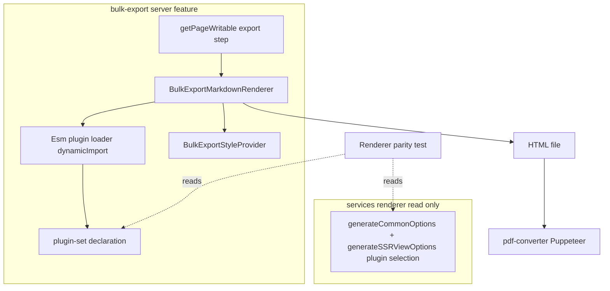
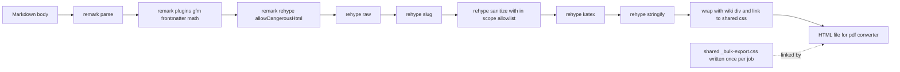

# Design Document: bulk-export-pdf-rendering

## Overview

**Purpose**: 一括エクスポート（bulk export）の PDF 出力（中間 HTML を介する）における **サーバ側
Markdown レンダリング** を、GROWI Web 表示に寄せてリッチ化する。
**Users**: コンプライアンス/共有目的でページ群を PDF エクスポートする利用者・管理者。
**Impact**: 現状の独自最小パイプライン（`remark-parse → remark-gfm → remark-html` ＋ Bootstrap 全量
注入）を、GROWI 実レンダラと同種の **npm 製 ESM プラグイン集合（`dynamicImport`）＋ デザインシステム
由来 CSS（`.wiki` ラップ）** に置換する。

**設計の中核方針**: 出力 HTML を `<div class="wiki">` でラップし、GROWI 本文スタイル（`.wiki` 由来 +
`@growi/core-styles`）をプリコンパイルした CSS を注入する。GROWI の本文スタイルは [_wiki.scss](../../../apps/app/src/styles/organisms/_wiki.scss#L4) で
`.wiki { blockquote {…} h1..h6 {…} }` のように **素の要素**に当たるよう書かれているため、引用・見出し等は
クラス付与なしで装飾される。例外として **表は `.wiki table` だけでは枠線が出ない**（`font-size` のみ）ため、
Web の `add-class` プラグインを再利用して `<table>` に `table table-bordered`（Bootstrap クラス）を付与し、
生成済み Bootstrap 表 CSS を当てる。インラインコードの枠線も Web の `atoms/_code.scss` を再利用して当てる。
ローカル再実装・手書き表 CSS・位置の特殊分岐は持たない。

本設計は現行 CJS サーバランタイム前提で閉じる。Web レンダラ本体（`renderer.tsx`）は ESM/React/SCSS を静的
import するため CJS サーバから import できない（research.md I2）。一方、React/DOM 非依存のローカル .ts
プラグイン（add-class, emoji, xsv-to-table, echo-directive）は相対パス `dynamicImport` で個別に再利用する。

### Goals
- in-scope の Markdown 機能（GFM 表 / 数式 / 見出し ID / frontmatter / 引用・コード等の標準要素）を
  構造化 HTML として出力する。
- 素の HTML 要素に `.wiki` 由来のデザインシステム CSS を当てて装飾する（個別クラス付与なし）。
- 機能ごとの追従ではなく npm プラグイン集合を一括採用し、ローカル再実装を持たない。
- Web レンダラのプラグイン集合との乖離をテストで検知する。

### Non-Goals
- リポジトリ全体の ESM 化（`support/esm`）。
- **装飾（色付き）コールアウト描画**。色付きコールアウトは React コンポーネント（`CalloutViewer`）駆動で
  HTML 文字列としての再利用元が存在せず、忠実再現には React SSR が要る。本 spec では行わず、将来フェーズ
  renderer-convergence に委ねる。GitHub アラートは blockquote のまま、コンテナディレクティブ（`:::note` 等）は
  内部テキストを保持したブロックへ劣化させる。
- **`remark-github-admonitions-to-directives` の採用**。callout 不在では `> [!NOTE]` を匿名
  `<div>` に変換してアラート種別ラベルを失い、blockquote のままより劣化が悪化するため不採用（research.md I7）。
- React コンポーネント / ブラウザ DOM 依存機能（シンタックスハイライト配色、drawio/lsx/mermaid/plantuml/
  attachment-refs のライブ描画、color callout）。
- ローカル .ts プラグインの再実装（コピー）や独自インライン変換。**再利用は可**（emoji /
  xsv-to-table / echo-directive / add-class は相対パス `dynamicImport` で Web と同一実装を再利用する。
  再実装ではなく単一の実装を共有する）。
- GROWI テーマ・レイアウト・画面 chrome の再現。
- 再生成 dedup キャッシュの無効化（`revisionListHash` のレンダラ版反映）。
- pdf-converter 側でのレンダリング。

## Boundary Commitments

### This Spec Owns
- bulk-export feature 内の **サーバ側 Markdown→HTML 変換パイプライン**（組み立て・実行）。
- 出力 HTML への **CSS 供給と `.wiki` ラップ**：job ごとの共有スタイルシート書き出し（`_bulk-export.css`）と
  各ページからの相対 `<link>` 参照。
- **pdf-converter の HTML 読み込み機構**：上記の相対 `<link>` を解決するため、`setContent` ではなく
  `page.goto(file://…)` でページを読む。**これは元設計で Out of Boundary としていた
  「pdf-converter 内部」への意図的な越境**であり、ユーザー承認のうえ owns に含める。`*.html` のみを
  変換対象として走査する readdir フィルタも本 spec が owns（共有 CSS が完了判定に混入しないため）。
- Web レンダラとのプラグイン集合 **ドリフト検知テスト**（AST ベース）。

### Out of Boundary
- Web/クライアントレンダラ（`services/renderer`, `client/services/renderer`）の挙動変更。ただし
  ドリフトテストが `generateCommonOptions` **および `generateSSRViewOptions`（view レベルの選定。
  math/katex/slug/sanitize はここで追加される）** を **読み取り参照**（AST 解析）することは許可。
- インライン変換やローカルプラグインの再実装、コールアウト描画、ローカル .ts プラグイン本体、
  ESM 化、dedup キャッシュ、md 形式の出力内容。
- pdf-converter 内部のうち **HTML 読み込み機構（`goto`／readdir フィルタ）以外**（Puppeteer 起動・
  フォント・PDF オプション・PDF 出力レイアウト等）は引き続き対象外。

### Allowed Dependencies
- `@cspell/dynamic-import` の `dynamicImport`（既存方式）。
- npm 製 ESM プラグイン群（下記 Technology Stack）。
- `@growi/core-styles` ＋ `_wiki.scss`（CSS のプリコンパイル元）。
- ドリフトテストの AST 解析に `typescript`（既存 devDependency）。
- 既存 bulk-export cron パイプラインの **インターフェースは不変**のまま、`export-pages-to-fs-async`
  の変換部のみ差し替え（共有 CSS 書き出しを追加）。

### Revalidation Triggers
- pdf-converter が読み取る **HTML ファイル契約**（パス規約・形式・`goto(file://)` の前提）の変更。
- Web `generateCommonOptions` / `generateSSRViewOptions` の **プラグイン集合・順序**の変更
  （ドリフトテストが検知）。
- `.wiki` ラップ規約・共有 CSS 構成（woff2-only 等）・`_bulk-export.css` ファイル名規約の変更。
- リポジトリ全体の **ESM 化完了**（Phase 2「renderer-convergence」着手の合図）。

## Architecture

### Existing Architecture Analysis
- 変換は [export-pages-to-fs-async.ts](../../../apps/app/src/features/page-bulk-export/server/service/page-bulk-export-job-cron/steps/export-pages-to-fs-async.ts) の
  `getPageWritable` 内で page ごとに実行され、HTML を `html/{jobId}/...` に書き出す。pdf-converter は
  その HTML を読み Puppeteer で PDF 化（契約は不変）。
- ESM は `dynamicImport` で読む（CJS 制約の既存回避策）。本設計はこの方式を踏襲・拡張。
- 維持すべき統合点: ページ走査・ストリーミング・resume（`lastExportedPagePath`）、md 形式分岐、
  エラー時のジョブ状態更新。

### Architecture Pattern & Boundary Map



**Architecture Integration**
- Selected pattern: 単一の unified パイプラインを bulk-export feature 内のサーバ専用モジュールに
  カプセル化（バレル `index.ts` で `BulkExportMarkdownRenderer` のみ公開）。**ツリー変換コンポーネントは
  持たない**（素要素 + `.wiki` CSS で完結）。
- Preserved patterns: dynamicImport 方式、bulk-export cron の段階契約、本文を `.wiki` で包む Web 慣習。
- Dependency direction: `plugin-set → loader → renderer → styles → export step`。左向きのみ import 可。

### Technology Stack

| Layer | Choice (既存 dep) | Role | Notes |
|-------|-------------------|------|-------|
| Backend / Services | unified | パイプライン基盤 | `dynamicImport` 経由 |
| Backend / Services | remark-parse, remark-gfm, remark-frontmatter, remark-math | remark 層（表・打消・タスク・frontmatter・数式入力） | すべて npm ESM |
| Backend / Services | emoji（ローカル）, xsv-to-table（ローカル） | 絵文字グリフ化 / CSV・TSV→表 | 相対パス `dynamicImport`・React/DOM 非依存。Web `generateCommonOptions`/SSR と同一実装を再利用 |
| Backend / Services | remark-directive（npm）, echo-directive（ローカル） | ディレクティブ解析＋text/leaf を可読テキストへ劣化 | echo は container を扱わない（callout の領分）。container は内部テキスト保持の素ブロックに劣化 |
| Backend / Services | remark-rehype（allowDangerousHtml）, rehype-raw | mdast→hast、生 HTML 取り込み | raw は必ず後段で sanitize |
| Backend / Services | rehype-slug, rehype-sanitize, rehype-katex, rehype-stringify | 見出し ID・安全性・数式描画・HTML 文字列化 | sanitize 必須 |
| Data / Storage | 静的 HTML ファイル（`/tmp/page-bulk-export/html/...`） | pdf-converter への受け渡し | 契約不変 |
| Infrastructure / Runtime | ts-node/CJS Express（bulk-export cron） | 実行環境 | ESM 静的 import 不可 |
| Styling | `@growi/core-styles` + `_wiki.scss`（ビルド時プリコンパイル CSS）+ KaTeX CSS | 出力スタイル | **サーバ実行時に `fs` で読める CSS を生成する新規ビルドステップ**。既存 vendor-styles はブラウザ `document.head` 注入用（出力は `*.prebuilt.ts`）で出力形態が異なるため、思想のみ参考 |

> **採用（ADOPTED_PLUGINS, パイプライン順）**: remark-gfm, emoji, remark-directive, echo-directive,
> remark-frontmatter, remark-math, xsv-to-table, remark-rehype, rehype-raw, rehype-slug,
> rehype-sanitize, rehype-katex, add-class, rehype-stringify。
>
> **意図的除外（理由は 2 区分。research.md I2/I7 参照）**:
> - *callout 不在では劣化が悪化*: `github-admonitions`（`> [!NOTE]` → 匿名 div、ラベル喪失）。
> - *React/DOM 駆動で AST 変換では再現不可（Phase 2）*: `callout`（色付き表示）, drawio/lsx/mermaid/
>   plantuml/attachment-refs, シンタックスハイライト配色。
> - *本 spec で必要としない / 別途検討*: `pukiwiki-like-linker`, `growi-directive`（parser 単独では無意味）,
>   `codeblock` / `add-inline-code`（視覚効果小）, `relative-links`（per-page の pagePath 注入が必要）,
>   `remark-breaks`（per-instance 設定 `isEnabledLinebreaks` 依存）。
>
> ※ いずれも「読み込めないから除外」ではない。純粋な AST 変換プラグインは add-class と同じ
> 相対パス `dynamicImport` でロード可能。除外理由は上記のとおり「劣化が悪化」「React/DOM 必須」「本 spec で不要」。

## File Structure Plan

### Directory Structure
```
apps/app/src/features/page-bulk-export/server/service/page-bulk-export-job-cron/markdown/
├── index.ts                          # バレル: createBulkExportMarkdownRenderer のみ公開
├── bulk-export-markdown-renderer.ts  # pipeline 組み立て(dynamicImport)＋renderToHtml＋モジュールキャッシュ
├── plugin-set.ts                     # 採用プラグインの宣言(名前/順序/オプション) ＝ drift テスト基準
├── styles/
│   ├── index.ts                      # BulkExportStyleProvider: getCss() / wrap()
│   └── bulk-export-styles.ts         # プリコンパイル CSS の読み込み＋本文 .wiki ラップ
├── bulk-export-markdown-renderer.spec.ts   # 変換の振る舞いテスト(契約)
└── renderer-parity.spec.ts           # generateCommonOptions との集合ドリフト検知
```
プリコンパイル CSS 生成物（例 `styles/bulk-export.generated.css`）はビルド成果物。生成機構
（`@growi/core-styles` ＋ `_wiki.scss` ＋ KaTeX CSS の SCSS/CSS→単一 CSS）はタスクで定義。

### Modified Files
- `…/steps/export-pages-to-fs-async.ts` — `convertMdToHtml` / `wrapHtmlWithBulkExportStyles` /
  `getBootstrapCssForBulkExport` / `bulkExportAdditionalCss` と `getPageWritable` 内の独自 unified
  構築を削除し、`markdown/` の `BulkExportMarkdownRenderer` を呼ぶ薄いアダプタに置換。md 形式分岐・
  resume・エラー処理は維持。`getPageWritable` を async 化し、pdf 形式では job 開始時に共有
  `_bulk-export.css` を 1 回書き出す。各ページは相対 `cssHref`（`toCssHref`）を算出して `renderToHtml` に渡す。
- `apps/pdf-converter/src/service/pdf-convert.ts`（越境）— cluster task を `setContent` から
  `page.goto(pathToFileURL(htmlFilePath), { waitUntil: 'load' })` に変更（相対 `<link>` を解決）。
  job dir の readdir を `*.html` のみに絞る（共有 CSS を変換対象・完了判定から除外）。`PageInfo` から
  未使用の `htmlString` 読み取りを削除。

## System Flows



> 共有 CSS（`_bulk-export.css`）は job ごとに 1 回だけ書き出し、各ページ HTML は相対 `<link>` で
> 参照する。pdf-converter は `page.goto(file://…)`（旧 `setContent`）でページを読むため相対参照が解決し、
> CSS がページ間で重複しない。`*.html` のみ変換対象として走査する。

主要決定:
- ツリー変換は最小限。原則 **素の HTML 要素**を出力し `.wiki` CSS で装飾するが、**例外として `<table>` には
  `table table-bordered` を付与**する（素の表には Bootstrap の枠線が当たらないため。Web の `add-class`
  プラグインを `plugin-set.ts` の ADOPTED エントリとして宣言・再利用し、sanitize 後・stringify 前に配置。
  ローカル再実装はしない）。
- raw HTML（ページ内 `<...>`）は rehype-raw でツリー化し **必ず sanitize を通す**（4.2）。
- sanitize は allowlist（Web `getCommonSanitizeOption` 相当 ＋ 数式コンテナ等 in-scope）で実行。
  katex は web 同様 sanitize 後（信頼済み出力）。
- text/leaf ディレクティブは remark-directive で解析し echo-directive で記法を可読テキスト化（属性
  `{...}` を生のまま露出させない、3.1a）。container ディレクティブ（`:::note` 等）は callout を持たないため
  内部テキストを保持した素ブロックへ劣化（3.1）。GitHub アラートは blockquote のまま（admonitions 不採用）。
- 絵文字ショートコードは emoji で remark-rehype 前にグリフ化（remark-directive より前に置き `:smile:` を
  ディレクティブと誤認させない、1.7）。CSV/TSV コードブロックは xsv-to-table で表化し、add-class が
  `table table-bordered` を付与する（1.8）。

## Requirements Traceability

| Requirement | Summary | Components | Flows |
|-------------|---------|------------|-------|
| 1.1 | GFM 表を構造化描画 | Renderer(gfm) + StyleProvider(.wiki table) | pipeline |
| 1.2 | GitHub アラートを blockquote 描画 | Renderer(標準 blockquote) + StyleProvider(.wiki blockquote) | pipeline |
| 1.3 | 数式描画 | Renderer(remark-math + rehype-katex) + StyleProvider(KaTeX CSS) | pipeline |
| 1.4 | 見出しに id 付与 | Renderer(rehype-slug) | pipeline |
| 1.5 | frontmatter を本文に出さない | Renderer(remark-frontmatter) | pipeline |
| 1.6 | Web と構造整合 | plugin-set + RendererParityGuard | — |
| 1.7 | 絵文字ショートコード→グリフ | Renderer(emoji) | pipeline |
| 1.8 | CSV/TSV→表 | Renderer(xsv-to-table) + add-class(table-bordered) | pipeline |
| 2.1 | 要素に視認可能なスタイル | BulkExportStyleProvider(.wiki ラップ) | wrap |
| 2.2 | デザインシステム由来スタイル | BulkExportStyleProvider(core-styles + .wiki) | wrap |
| 2.3 | テーマ/chrome 非再現 | BulkExportStyleProvider(本文 CSS のみ) | wrap |
| 3.1 | 未対応記法のグレースフル劣化（container/フェンスは内部テキスト保持） | Renderer(専用処理なし) + sanitize | pipeline |
| 3.1a | text/leaf ディレクティブを可読テキスト化（`{...}` 非露出） | Renderer(remark-directive + echo-directive) + sanitize | pipeline |
| 3.2 | 変換エラー時のジョブ状態更新 | export-pages-to-fs-async(統合) | — |
| 4.1 | サニタイズ | Renderer(rehype-sanitize) | pipeline |
| 4.2 | エスケープ無効化禁止 | Renderer(sanitize 必須・raw 後段) | pipeline |
| 4.3 | 危険な埋め込み除去 | Renderer(sanitize allowlist) | pipeline |
| 5.1 | 静的 HTML ファイル出力 | export-pages-to-fs-async(統合) | — |
| 5.2 | md 形式は不変 | export-pages-to-fs-async(分岐) | — |
| 5.3 | 走査/stream/resume 維持 | export-pages-to-fs-async(統合) | — |
| 5.4 | ESM 化非前提で動作 | EsmPluginLoader(dynamicImport) | — |
| 6.1 | プラグイン集合を Web と整合 | plugin-set | — |
| 6.2 | 乖離をテストで検知 | RendererParityGuard | — |

## Components and Interfaces

| Component | Layer | Intent | Req | Key Deps | Contracts |
|-----------|-------|--------|-----|----------|-----------|
| BulkExportMarkdownRenderer | service | Markdown→安全なスタイル付き HTML へ変換 | 1.1–1.6, 3.1, 4.x | Loader(P0), Styles(P0) | Service |
| EsmPluginLoader | service | npm ESM を dynamicImport しキャッシュ | 5.4 | @cspell/dynamic-import(P0) | Service |
| BulkExportStyleProvider | service | 注入 CSS と .wiki ラップ | 2.1–2.3 | core-styles/_wiki(P1) | Service |
| RendererParityGuard | test | Web プラグイン集合との乖離検知 | 1.6,6.1,6.2 | generateCommonOptions+generateSSRViewOptions(read,P1) | — |
| export-pages-to-fs-async (mod) | step | 変換呼び出しと既存契約維持 | 3.2,5.1–5.3 | Renderer(P0) | Batch |

### service / BulkExportMarkdownRenderer

| Field | Detail |
|-------|--------|
| Intent | 1 ページ分の Markdown 本文を、サニタイズ済み・`.wiki` ラップ済み HTML 文書へ変換 |
| Requirements | 1.1, 1.2, 1.3, 1.4, 1.5, 1.6, 3.1, 4.1, 4.2, 4.3 |

**Responsibilities & Constraints**
- unified パイプラインを**一度だけ**組み立て（モジュールは初回 `dynamicImport` でキャッシュ。既存
  openai 変換の module-cache 方式に倣う）、以降ページごとに再利用。
- 出力は `BulkExportStyleProvider.wrap()` で CSS 注入＋`.wiki` ラップした完全な HTML 文字列。
- ツリー変換・React/SCSS/ローカルプラグインを import しない。
- rehype-sanitize に渡す許可リストは `services/renderer/recommended-whitelist.ts`（`dynamicImport`）
  由来を**単一出所**とし、in-scope の数式コンテナ等のみ上乗せする（独自に書き起こさない。Security
  Considerations 参照）。

**Dependencies**
- Outbound: EsmPluginLoader — プラグイン取得 (P0)
- Outbound: BulkExportStyleProvider — CSS/ラップ (P0)

**Contracts**: Service [x]

##### Service Interface
```typescript
export interface BulkExportMarkdownRenderer {
  /** Shared CSS to write once per job; pages link to it. */
  getCss(): string;
  /**
   * Convert one page's markdown body into a sanitized HTML document that links
   * the shared stylesheet at `cssHref` and wraps the content in a `.wiki` container.
   */
  renderToHtml(markdownBody: string, cssHref: string): Promise<string>;
}

/** Factory. Modules are dynamically imported and cached on first use. */
export function createBulkExportMarkdownRenderer(
  baseDir: string,
): BulkExportMarkdownRenderer;
```
- Preconditions: `baseDir` は `dynamicImport` の解決基点（呼び出し元の `__dirname`）。`cssHref` は
  当該ページの HTML ファイルから共有スタイルシートへの相対パス（呼び出し元が算出）。
- Postconditions: 返却 HTML は sanitize 済み・共有 CSS への `<link>` 付き・`.wiki` でラップ済み。
  CSS 本体はページに**インラインされない**（job ごとに 1 ファイルのみ）。
- Invariants: sanitize は常に実行され、raw HTML が未サニタイズで出力されない（4.2）。
- パイプライン組み立ては `plugin-set.ts`（`ADOPTED_PLUGINS`）を読み込み順に `.use()` する。
  ハードコードされた `.use()` 連鎖は持たない。

### service / EsmPluginLoader

**Contracts**: Service [x]

##### Service Interface
```typescript
export interface LoadedPlugin {
  readonly name: string;                       // canonical name from the declaration
  readonly plugin: import('unified').Plugin;   // resolved export, ready for processor.use()
  readonly options?: Record<string, unknown>;  // static options declared in plugin-set.ts
}

export interface LoadedPipeline {
  readonly unified: typeof import('unified').unified;
  readonly plugins: readonly LoadedPlugin[];   // ordered exactly as the given declarations
}

// declarations are injected by the caller (renderer passes ADOPTED_PLUGINS) —
// the loader's only responsibility is loading, not knowing the app's plugin set.
export function loadPlugins(
  baseDir: string,
  declarations: readonly PluginDeclaration[],
): Promise<LoadedPipeline>;
```
- ハードコードの名前付きフィールドを廃止し、**呼び出し元が渡した宣言**を走査して `dynamicImport` した
  **順序付きリスト**を返す（loader は plugin-set を import しない＝「何をロードするか」を持たない）。各宣言は
  `specifier ?? name`（相対パスは baseDir 基準で解決、それ以外は bare npm 指定子）と `exportName ?? 'default'`
  で解決する。プラグイン追加は plugin-set.ts のみで完結。旧来の逆方向アサーションは不要になり削除。**モジュール
  キャッシュも撤廃**（build-once は renderer 側の `cachedProcessor` が担保＝loader は副作用なしの純関数）。
- Invariants: すべて `dynamicImport`（CJS から ESM を読む唯一の方法 / 5.4）。`any` 不使用。宣言された
  export が無い場合は明示エラーを投げる。

### service / BulkExportStyleProvider

**Contracts**: Service [x]

##### Service Interface
```typescript
export interface BulkExportStyleProvider {
  /** Returns the CSS to write to the shared stylesheet (.wiki body + design-system base + KaTeX). */
  getCss(): string;
  /** Wrap a fragment in a .wiki container that links the shared stylesheet at cssHref. */
  wrap(htmlFragment: string, cssHref: string): string;
}
```
- Constraints: CSS は `_wiki.scss`（`.wiki` スコープ）＋ `@growi/core-styles` ＋ KaTeX CSS を
  ビルド時にプリコンパイルした静的文字列。テーマ/レイアウト/chrome は含めない（2.3）。`wrap()` は
  `<link rel="stylesheet" href="{cssHref}">\n<div class="wiki">{fragment}</div>` を返す（CSS は**インライン
  しない**）。共有スタイルシート `_bulk-export.css` は `export-pages-to-fs-async` が job ごとに 1 回書き出し、
  各ページは自身の深さに応じた相対 `cssHref` で参照する。pdf-converter は `page.goto(file://…)` で読むため
  相対参照が解決する。
- 自己完結エントリ SCSS は、見た目を成立させるために以下を必ず出力に含める: (a) `_wiki.scss` が参照する
  `--bs-*` カスタムプロパティ群（通常 bootstrap が `:root` に吐くもの。欠落すると枠線色等が出ない）、
  (b) `@extend .link-offset-2` 等で継承される bootstrap ユーティリティ class 定義、(c) KaTeX の
  `@font-face`。KaTeX フォントは **`src` を base64 data URI で生成 CSS に同梱**する（外部 `url(fonts/...)`
  参照を残さない）。Chromium は woff2 を解せるため **woff2 のみ**インライン化し、woff/ttf の代替は
  ビルド時に破棄する（フォント payload の約 2/3 削減、生成 CSS ~1.8MB→~757KB）。共有ファイル化と併せ、
  1 ページあたりの CSS 重複が解消される。(d) インラインコードの枠線・余白・角丸: Web の
  `src/styles/atoms/_code.scss`（`code:not([class^='language-'])` ルール。主アプリも `style-app.scss` から
  取り込む単一出所）をエントリ SCSS から `@use 'styles/atoms/code'` で**再利用**する。これが無いと Bootstrap の
  code 色（赤）だけ当たり、Web のような枠線付きピル表示にならない。`@use 'styles/...'` 解決のためビルドの
  loadPaths に `src/` を追加する。
- Risk: SCSS→CSS プリコンパイル機構・フォント解決・`dependencies` 分類（tech.md、Turbopack 外部化）は
  タスクで確定。観測は「ルールの文字列存在」ではなく「実際に描画して見た目が出る」ことで担保する（7.2）。

### test / RendererParityGuard
- `plugin-set.ts` の採用集合と、Web 側 `renderer.tsx`（`generateCommonOptions` と `generateSSRViewOptions`
  を両方含む）の **import 宣言**を突き合わせ、Web 側がインポートする各プラグインが bulk-export 側で
  **included / intentionally-excluded** のいずれかに分類済みであることを検査。さらに bulk-export が採用する
  全プラグイン（unified パイプライン基盤を除く）が Web 側 import に対応づくことも検査する。未分類の新規
  プラグイン出現で失敗（6.1, 6.2）。
- 抽出は **TypeScript コンパイラ API による AST 解析**で行う（`renderer.tsx` を `createSourceFile`
  して import 宣言を列挙）。旧来の正規表現スクレイピングと手書きブロックリスト（`NON_PLUGIN_IDENTIFIERS`
  等）を撤廃。書式・コメント・複数行 import に強く、ファイル不在や空集合では loud に失敗する。プラグインが
  使われるには import が必要なので、import 集合が監視対象の権威的な母集合になる。

## Error Handling

### Error Strategy
- **グレースフル劣化（3.1）**: ディレクティブ等の未対応記法は専用処理せず、可読テキスト/blockquote
  として残す。`renderToHtml` は in-scope 機能の失敗で throw しない。
- **変換失敗（3.2）**: `renderToHtml` が reject した場合、`getPageWritable` の既存 `callback(err)`
  経路でジョブをエラー状態にし、無効出力を completed にしない。
- **安全性（4.x）**: sanitize 必須。raw HTML は rehype-raw→sanitize を通す。allowlist は in-scope
  要素・属性・数式コンテナを許可、スクリプト等は除去。

### Monitoring
- bulk-export 既存ロガー（`growi:features:page-bulk-export:*`）でレンダリング失敗・CSS 未取得時の
  warning を記録（PR #11288 の warn ログ方針を踏襲）。

## Testing Strategy

### Unit Tests
- `renderToHtml`: GFM 表 → `<table>` / `> [!NOTE]` → `<blockquote>` / `$x$` → KaTeX マークアップ /
  見出し → `id` 付与 / frontmatter → 本文非露出（1.1–1.5）。
- sanitize: `<script>` 等の危険入力が除去される（4.1, 4.3）。raw HTML が必ず sanitize を通る（4.2）。
- グレースフル劣化: `:::note` 等のディレクティブや drawio フェンスが throw せず可読出力になる（3.1）。

### Integration Tests
- `export-pages-to-fs-async`: pdf 形式で `.wiki` ラップ＋`<style>` 入りの静的 HTML を所定パスへ出力
  （5.1, 2.1）。md 形式では HTML レンダリングを適用しない（5.2）。変換 reject 時にジョブがエラー化
  （3.2）。
- resume: `lastExportedPagePath` 以降のみ再エクスポートする既存挙動を維持（5.3）。

### E2E / 検証
- 実 bulk export（PDF）→ 生成 PDF を描画し、表・見出し・引用・コード・数式が `.wiki` スタイルで
  描画されることを確認（dedup キャッシュは対象外のため、検証時はページ編集等でハッシュを変える）。

### Parity / Drift
- `renderer-parity.spec.ts`: `generateCommonOptions` のプラグイン集合変更が未分類のまま入ると失敗
  （6.1, 6.2）。

## Security Considerations
- **XSS / 危険コンテンツ**: rehype-sanitize を必須実行。
- **サニタイズ許可リストの単一出所（4.x, 6.1）**: 許可リストは
  **`services/renderer/recommended-whitelist.ts` の `tagNames` / `attributes` を `dynamicImport` で再利用**
  し、in-scope の数式コンテナ等だけを上乗せする。`renderer.tsx` 本体（`getCommonSanitizeOption`）は
  `@growi/remark-growi-directive` 等の ESM を静的 import しており CJS から require できない（research I2）
  ため再利用元にしない。`recommended-whitelist.ts` も `hast-util-sanitize`（ESM）に依存するため、これ自体も
  `dynamicImport` 経由で読む。**許可リストを bulk-export 側で独自に書き起こさない**（Web と二重管理になり、
  安全側の変更が片方に追従しない事故を防ぐ）。
- **エスケープ無効化禁止（4.2）**: pdf-converter が `--no-sandbox` で動作するため、raw HTML を
  未サニタイズで通さない。`allowDangerousHtml` は remark-rehype/raw の中間段でのみ用い、出力前に
  必ず sanitize する。
- **ディレクティブ属性の無害化（4.3）**: echo-directive は text/leaf ディレクティブの属性
  （`:foo{...}`）を `hProperties` として `<span>`/`<div>` に転写する。ユーザーが `:foo{onclick="..."}` の
  ような危険属性を書いても、後段の rehype-sanitize（単一出所 allowlist）が許可外属性を除去する。echo-directive
  は Web レンダラと同一実装の再利用であり、サニタイズ境界も Web と同一に保たれる。

## Open Questions / Risks
- **R-css**: 注入 CSS の SCSS→CSS プリコンパイル機構・`dependencies` 分類・deploy 検証（tech.md）。
  `_wiki.scss` は `@growi/core-styles` の bootstrap utilities/variables に依存し、`--bs-*`
  カスタムプロパティと `@extend` 先のユーティリティ class が無いと見た目が崩れるため、それらを出力に
  含める自己完結エントリ SCSS を用意してコンパイルする必要がある。**既存 vendor-styles はブラウザ
  `document.head` 注入用（出力は `*.prebuilt.ts`）で、サーバ `fs` 読み込み用 CSS はそのままでは得られない**
  ため、出力形態の異なる新規ビルドステップになる。観測は「ルール存在」ではなく実描画で担保する（7.2）。
- **R-katex（確定）**: 数式は Phase 1 に含める（ユーザー決定）。KaTeX CSS をプリコンパイル CSS に同梱し、
  **フォントは `@font-face` の `src` を base64 data URI でインライン化**する（外部 `url()` 参照を残さず
  自己完結。タスク 1.1, 1.2）。Chromium が解せる **woff2 のみ**を同梱し、woff/ttf 代替は破棄する
  （payload の約 2/3 削減）。共有スタイルシート化により、フォント payload は job あたり 1 回のみ存在する。
- **R-dedup-css（確定）**: CSS をページにインラインすると N ページぶん重複する。これを避けるため
  job ごとに `_bulk-export.css` を 1 ファイル書き出し、各ページは相対 `<link>` で参照する。前提として
  pdf-converter は `setContent`（document URL を持たず相対参照不可）ではなく `page.goto(file://…)` で
  ページを読む。共有 CSS が変換ループ・完了判定（`readdir` 件数）に混入しないよう、`*.html` のみを走査する。
  sanitize は維持するため、ローカル file:// 読み込みでも未サニタイズ HTML を通さない（4.2）。
- **将来 (Phase 2)**: 色付きコールアウト等の忠実再現は React SSR ベースの renderer-convergence へ。
