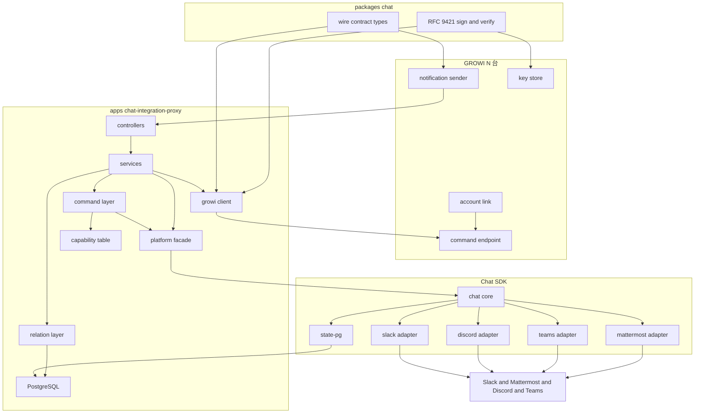
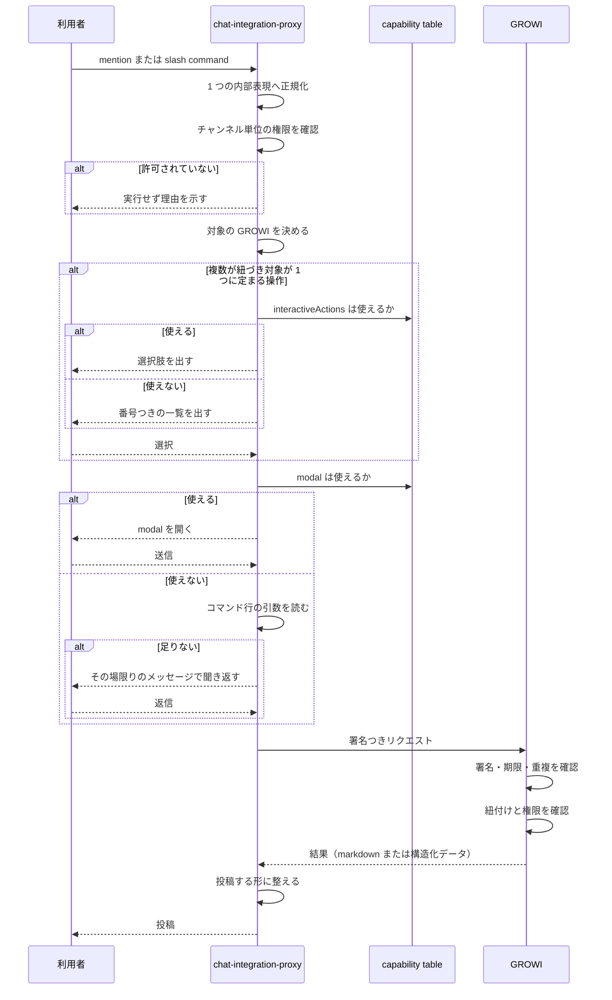
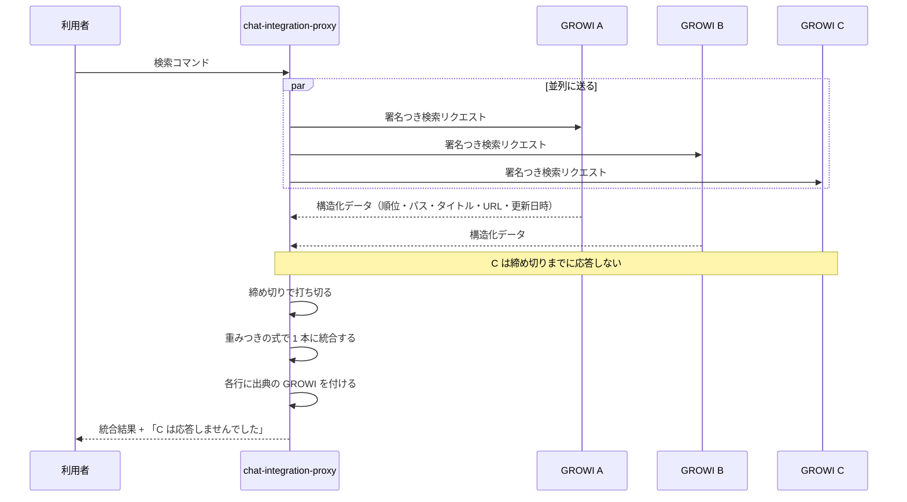
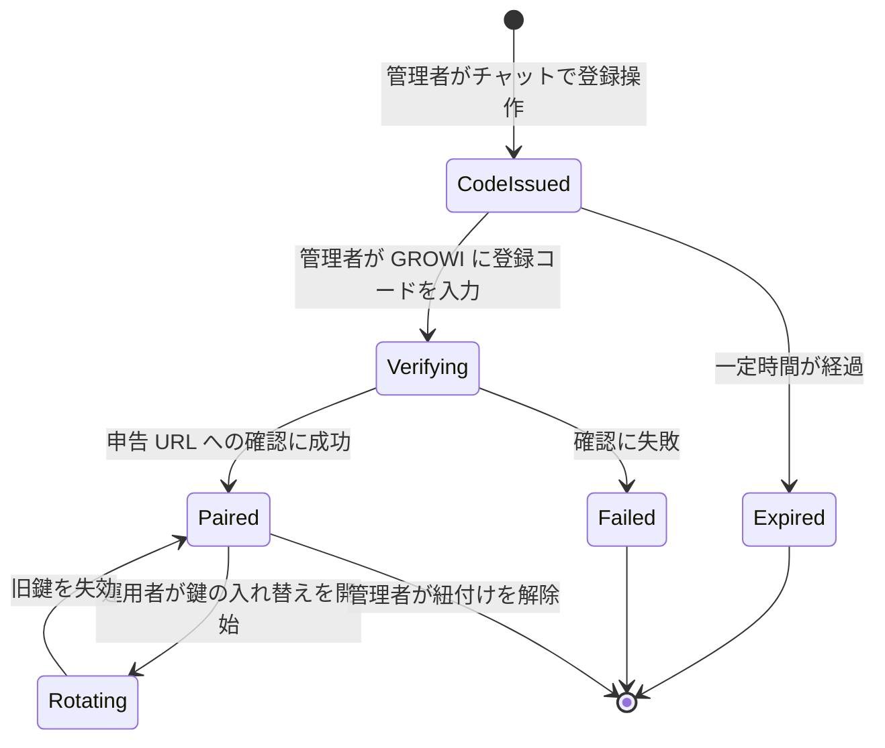

# Technical Design — chat-integration

## Overview

**Purpose**: Slack 専用の中継サーバ（Gen 1、`apps/slackbot-proxy`）を、Slack・Mattermost・Discord・Microsoft Teams の 4 サービスに対応した中継サーバへ作り直す。GROWI を self-host する運用者が、GROWI に合わせてチャットサービスを選び直さずに済むようにする。

**Users**: GROWI をチャットから使うチームメンバー（通知の受信、検索、ページ作成、会話の取り込み）と、GROWI を運用する管理者（連携の設定、チャンネル単位の権限、閉域での構成）。

**Impact**: 新しいアプリ `apps/chat-integration-proxy` と新しいパッケージ `packages/chat`（`@growi/chat`）を作り、GROWI 本体に Gen 2 連携の機能を足す。**Gen 1（`apps/slackbot-proxy` と `packages/slack`）には一切手を入れない。** 両者は GROWI 本体で同時に有効にできる。

### Goals

- 4 サービスすべてで、通知・検索・ページ作成・会話の取り込み・URL の展開・ヘルプを提供する
- チャットサービスごとの機能差を、**利用者に見える形で明示するか、代わりの手段で埋める**
- proxy と GROWI がリクエストごとに相手を確認し、鍵を止めずに入れ替えられるようにする
- GROWI をインターネットに公開せずに運用できる構成を、手順書つきで提供する

### Non-Goals

- Chatwork・Google Chat への対応（要件の Out of scope）
- 各チャットサービスの公式アプリ審査（ブリーフ 決定 5、別トラック）
- LLM を使った自由な文章からのページ作成（ブリーフ 決定 4）
- 検索結果の LLM による並べ替え・要約（ブリーフ 決定 3）
- Gen 1 の実装の変更・移行ツールの提供
- **Cloudflare Workers 向けの 2 つ目のビルド** — 技術検証で成立する見込みは立ったが採らない。成果物は Docker image 1 つ（決定 10）

---

## Boundary Commitments

### This Spec Owns

- **`apps/chat-integration-proxy`（新規）** — 4 サービスとのやり取り、GROWI 関係管理（1 workspace 対 N GROWI）、コマンドの解釈と引数収集、検索結果の統合と整形、チャンネル単位の権限判定、ペアリング
- **`packages/chat`（`@growi/chat`、新規）** — GROWI ⇄ proxy の**通信契約の型**と、**RFC 9421 署名の生成・検証**。両側が同じ実装を使う
- **GROWI 本体の Gen 2 連携** — 通知の送出、コマンドの受け口、チャット利用者と GROWI ユーザーの紐付け、管理画面の設定、鍵の保持
- **proxy の PostgreSQL スキーマ** — 関係・鍵・登録コード・nonce
- **閉域向け推奨構成のドキュメント**

### Out of Boundary

- **Gen 1（`apps/slackbot-proxy`、`packages/slack`）** — 読むだけ。1 行も変更しない
- **GROWI の検索の仕組み** — 各 GROWI の既存の検索をそのまま呼ぶ。索引・クエリ・スコアリングには触れない
- **GROWI の権限判定** — ページの閲覧・作成の可否は GROWI 本体が判定する。proxy は独自の権限判定を持たない（チャンネル単位のコマンド権限は別物で、これは proxy が持つ）
- **GROWI の監査ログ** — チャット経由の操作も既存の記録の仕組みに乗る。記録の仕組み自体は作らない
- **Chat SDK のアダプタ実装** — fork しない（研究ログ 3・決定 4 の結果、必要が無くなった）
- **チャットサービス側の制約の解消** — bot が居ないチャンネルへ投稿できないことは変えられない。何が必要かを示すところまで

### Allowed Dependencies

| 依存先 | 使ってよい層 | 制約 |
|---|---|---|
| `chat@=4.38.1`、`@chat-adapter/{slack,discord,teams}@=4.38.1`、`chat-adapter-mattermost@=1.1.3` | **`apps/chat-integration-proxy/src/platform/**` のみ** | 完全固定。他の層からの `import` は lint で禁止する |
| `@chat-adapter/state-pg@=4.38.1` | 同上 | 同上 |
| `@prisma/client` 6.19.2 | proxy の `db/` と各 repository | apps/app と同じ版に揃える |
| `structured-headers@^2.0.3` | `packages/chat` の署名モジュールの中のラッパ 1 ファイルのみ | 型定義が無いので、そこだけが未型付き API に触れる |
| `node:crypto` | `packages/chat` の署名モジュール | 暗号は自前で書かない。`crypto.subtle` は使わない（Ed25519 の検証が壊れている） |
| **`process.env` の読み取り** | **`apps/chat-integration-proxy/src/runtime/config.ts` のみ** | 他の層は組み立て済みの設定オブジェクトを引数で受け取る。決定 9。lint で強制する |
| `hono@^4.13.5` | proxy 全体 | 依存ゼロ。実行環境を選ばない |
| GROWI 本体の既存 API（検索・ページ作成・権限判定・監査ログ） | GROWI 本体の Gen 2 連携 | 呼ぶだけ。実装を変えない |

**依存の向き**（左のものだけを import してよい）:

```
types → capabilities → db → platform → command → relation → growi → inbound → routes
```

（`runtime/` は最も外側。上のどこからも import しない）

`@growi/chat`（契約型と署名）はすべての層から使ってよい。逆向きの import は禁止。

さらに **`runtime/` は最も外側**にあり、他のどの層からも import してはならない（決定 9）。`runtime/` が組み立てた設定とストレージを引数で渡す。**アダプタと Chat SDK の state は platform 層が自分で組み立てる**（決定 2 を lint で守れる形にするため）。

### Revalidation Triggers

以下が変わったら、下流（GROWI 本体の連携・導入ドキュメント・タスク）を必ず再確認する。

- **`@growi/chat` の通信契約の形が変わったとき** — GROWI 本体と proxy の両方に同時に効く
- **署名の対象に含めるものが変わったとき** — 片側だけ変えると全リクエストが通らなくなる
- **対応するチャットサービスが増減したとき** — 能力表と、要件 1.2 / 5.6 / 6.5 の「使えないことを示す」対象が変わる
- **Chat SDK を更新したとき** — アダプタの能力表（後述）を必ず突き合わせる。docs が `protected` 拡張面を「まだ安定と見なしていない」と明記しているため
- **閉域構成で外部から通す必要のあるサービスが変わったとき** — 現在は Teams のみ。導入ドキュメントとファイアウォール手順が変わる
- **能力表の「要確認」の行を実物で確かめたとき** — `linkPreview` と `plainReply` は SDK と各サービスのドキュメントで確認してから確定させる。
  結果は要件 1.3 / 6.5 の「このサービスでは使えません」という運用者向けの表示になる
- **GROWI 本体の検索・権限判定の呼び出し契約が変わったとき** — 要件 3.6 / 3.7 の権限適用が影響を受ける

---

## Architecture

### Existing Architecture Analysis

Gen 1 から引き継ぐ**考え方**と、引き継がない**実装**を分ける。

| Gen 1 の要素 | Gen 2 での扱い |
|---|---|
| `Relation` の `[installation, growiUri]` 複合ユニーク（1 workspace 対 N GROWI） | **考え方を引き継ぐ。** Chat SDK では代替できないハブの中核 |
| `Order`（10 分で失効する登録コード）と `urlVerificationRequestToGrowi()` | **考え方を引き継ぐ。** 短命の登録コードとエンドポイント所有証明は正しいプリミティブ |
| `permissionsFor{Broadcast,SingleUse}Commands` | **考え方を引き継ぐ。** 要件 11 |
| `tokenGtoP` / `tokenPtoG`（固定文字列） | **捨てる。** 要件 9.6 / 10.6 が非対称鍵を要求する |
| `growi-uri-injector/*` の Delegator ツリー | **捨てる。** Slack の payload に GROWI URI を差し込むための仕組みで、決定 3 により不要になる |
| `packages/slack` の Block Kit 組み立て | **捨てる。** Chat SDK が中立表現を持つ |
| MySQL + TypeORM 0.2.45、Ts.ED 6.43 | **捨てる。** PostgreSQL + Prisma、Hono（決定 8） |
| `POST /g2s/:method`（Slack Web API の汎用パススルー） | **捨てる。** 用途ごとの限定された契約に置き換える（後述の Security Considerations） |

### Architecture Pattern & Boundary Map



**Architecture Integration**:

- **選んだ形**: 層状（依存の向きを一方向に固定）+ 外部 SDK を 1 つの facade 層に隔離。SDK のリリース頻度が高いという実測されたリスク（研究ログ 1）に対する構造的な答え。
- **責務の分かれ目**: 「チャットサービスとの配線」は Chat SDK と platform 層、「どの GROWI へ流すか」は relation 層、「何を集めて何をするか」は command 層。**Chat SDK が置き換えるのは配線だけで、関係管理とルーティングは Gen 2 でも GROWI 側が持ち続ける**（ブリーフ §3.2）。
- **引き継ぐ考え方**: 1 workspace 対 N GROWI、短命の登録コード、エンドポイント所有証明、チャンネル単位の権限。
- **新しい部品の理由**: `capabilities`（プラットフォーム差をデータとして 1 か所に置く）と `packages/chat`（両側が同じ署名実装を使う）。どちらも「同じ知識が 2 か所に分かれて食い違う」ことを防ぐために存在する。

### Technology Stack

| Layer | Choice / Version | Role in Feature | Notes |
|-------|------------------|-----------------|-------|
| Backend / Services | **Hono `^4.13.5`**（MIT・依存ゼロ） | proxy の HTTP 層 | Chat SDK の webhook ハンドラ（Web 標準の `Request` / `Response`）をそのまま扱えるので橋渡しが要らない。DI コンテナは使わない（決定 8） |
| Backend / Services | `chat@=4.38.1` + 公式アダプタ 3 + `chat-adapter-mattermost@=1.1.3` | 各サービスの OAuth・webhook 検証・ネイティブ形式への変換 | platform 層のみが import（決定 1・2） |
| Data / Storage | PostgreSQL 16 + Prisma `6.19.2` | 関係・鍵・登録コード・nonce | apps/app と同じ Prisma 版 |
| Data / Storage | `@chat-adapter/state-pg@=4.38.1` | Chat SDK が要求する購読・分散ロック・重複排除 | 同じ PostgreSQL、スキーマを分ける（決定 6） |
| Messaging / Events | Slack Socket Mode / Discord Gateway / Mattermost WebSocket / Teams Bot Framework | 各サービスからの受信 | **Teams だけが外部からの接続を必要とする**（研究ログ 4） |
| Infrastructure / Runtime | Node.js 24（native ESM）/ **Docker image 1 つ** | proxy の実行 | official proxy も custom proxy も同じ image を動かす。置き場所だけが違う（決定 10） |
| Cross-cutting | **`node:crypto`** + `structured-headers@^2.0.3` | Ed25519 署名と RFC 8941 正準化 | `crypto.subtle` は Ed25519 の検証が壊れているので使わない。`@noble/ed25519` / `jose` / `http-message-signatures` も採らない（決定 7） |

### プラットフォーム能力表（設計の中核データ）

研究ログ 3 の実測結果を、**コード上の 1 つの宣言**として持つ。各所で `if (platform === 'mattermost')` と書かない（`.claude/rules/coding-style.md`「モード名で分岐しない」）。

| 能力 | Slack | Discord | Teams | Mattermost | これが無いときの代わり |
|---|:--:|:--:|:--:|:--:|---|
| `slashCommand` | ○ | ○ | × | × | mention で起動する（決定 4） |
| `mention` | ○ | ○ | ○ | ○ | — （全サービス対応） |
| `plainReply`（呼びかけ無しの返信を bot が受け取れるか） | 要確認 | 要確認 | 要確認 | 要確認 | **呼びかけ付きの返信にする**（下記） |
| `modal` | ○ | × | ○ | × | コマンド行の引数 + その場限りのメッセージで聞き返す（決定 5） |
| `interactiveActions` | ○ | ○ | ○ | × | 番号つきの一覧を出して返信で選ばせる |
| `card` | ○ | ○ | ○ | △ | markdown で投稿する |
| `linkPreview` | ○ | × | × | × | 要件 6.5 に従い「使えない」と運用者に示す |
| `fetchMessages` | ○ | ○ | ○ | ○ | — （全サービス対応） |
| `requiresInboundReachability` | × | × | **○** | × | 要件 13.3 の接続元制限の対象 |

> **`plainReply` に依存しない設計にする。** 番号つき一覧への返信は、`modal` も `interactiveActions` も使えない Mattermost にとって
> 唯一の経路だが、「bot が呼びかけ無しの通常メッセージを受け取れるか」はサービスごとに追加の権限や設定が要る場合があり、
> **実物で確かめるまで表の値を確定できない**。そこで **「`@growi 1` と返信してください」と呼びかけ付きで促す**形を採る。
> 必要な能力が全サービス ○ の `mention` だけになり、この不確かさが消える。利用者の手間は 1 語増える。
> `plainReply` が使えると確認できたサービスでは、呼びかけ無しの返信も受け付けてよい。

> この表は**デプロイ先に依存しない**。proxy は常駐プロセスなので、Slack は Socket Mode、Discord は Gateway、Mattermost は WebSocket で受けられ、mention はどのサービスでも届く（決定 10）。

> `linkPreview`（投稿されたリンクを bot に通知する仕組み）は Slack の `link_shared` に相当するものが他の 3 サービスに無い。要件 6.5 はこの場合に「使えないことを運用者に示す」ことを求めており、代わりの手段は用意しない。

---

## File Structure Plan

### Directory Structure

```
apps/chat-integration-proxy/
├── prisma/
│   ├── schema.prisma              # 関係・鍵・登録コード・nonce
│   └── migrations/
├── src/
│   ├── types/                     # 層をまたぐ型（依存の最左）
│   │   ├── index.ts
│   │   └── platform-event.ts      # PlatformEvent / PlatformAppConfig / InstallationCredentials（SDK 型を含まないことを lint で検査）
│   ├── capabilities/              # プラットフォーム能力表（データ宣言）
│   │   ├── index.ts               # 能力の問い合わせ関数
│   │   └── platform-capabilities.ts   # 上の表そのもの。唯一の宣言箇所
│   ├── db/
│   │   ├── index.ts
│   │   ├── prisma-client.ts
│   │   └── repositories/
│   │       ├── relation-repository.ts
│   │       ├── peer-key-repository.ts
│   │       ├── pairing-order-repository.ts
│   │       ├── pending-collection-repository.ts
│   │       ├── processed-request-repository.ts
│   │       └── request-nonce-repository.ts
│   ├── platform/                  # Chat SDK を import してよい唯一の層
│   │   ├── index.ts               # 公開面。他層はここだけを使う
│   │   ├── bot-factory.ts         # Chat インスタンスの組み立て
│   │   ├── adapter-set.ts         # 4 アダプタと state の組み立て（接続情報を引数で受け取る）
│   │   ├── installation-provider.ts   # 自前の関係ストアを SDK へ差し込む
│   │   ├── outbound.ts            # 中立表現 → thread.post()
│   │   ├── prompt.ts              # modal の開閉と送信の受け取り
│   │   ├── history.ts             # fetchMessages の薄い包み
│   │   └── event-mapping.ts       # SDK のイベント → PlatformEvent（SDK 型はここで止まる）
│   ├── command/
│   │   ├── index.ts
│   │   ├── invocation.ts          # mention / slash を 1 つの内部表現へ正規化
│   │   ├── argument-collector.ts  # modal / 引数 / 聞き返し の切り替え（決定 5）
│   │   ├── command-set.ts         # search / note / keep / help の宣言
│   │   └── admin-command-set.ts   # register / unregister / weight / rotate-key（workspace 管理者のみ）
│   │   ├── pending-collection.ts  # 聞き返しの途中経過の保存と再開
│   │   └── channel-permission.ts  # チャンネル単位のコマンド権限（要件 11）
│   ├── relation/
│   │   ├── index.ts
│   │   ├── pairing-service.ts     # 要件 9
│   │   ├── growi-selection.ts     # 要件 8
│   │   └── unpair-service.ts
│   ├── growi/                     # proxy → GROWI
│   │   ├── index.ts
│   │   ├── growi-client.ts        # 署名つき送信
│   │   ├── search-fusion.ts       # 要件 3.2 / 3.8 の統合
│   │   └── search-collector.ts    # 要件 3.4 / 3.5 の待ち合わせ
│   ├── inbound/                   # GROWI → proxy
│   │   ├── index.ts
│   │   ├── notification-controller.ts  # 要件 2
│   │   ├── settings-controller.ts # 運用の口（設定・鍵・能力の一覧）
│   │   └── signature-guard.ts     # 要件 10.7
│   ├── routes/                    # Hono のルート定義（Web 標準 Request/Response）
│   │   ├── index.ts
│   │   ├── webhook-routes.ts      # 各サービスからの受信
│   │   ├── pairing-routes.ts
│   │   └── health-routes.ts
│   ├── composition-root.ts        # 明示的な組み立て（DI コンテナは使わない）
│   └── runtime/                   # 組み立ての場所（決定 9）
│       ├── server.ts                  プロセス起動、シグナル処理
│       ├── config.ts                  process.env を読んでよい唯一のファイル
│       └── pg-storage.ts              Prisma（proxy 自身のテーブル用。Chat SDK の state は platform 層が持つ）
├── docs/
│   └── closed-network-deployment.md   # 要件 13.4 / 13.5
├── turbo.json                     # ビルド順の宣言（@growi/chat#build、prisma:generate）
└── package.json

packages/chat/                     # @growi/chat
├── src/
│   ├── index.ts                   # 契約型のみを出す（client からも安全に import できる）
│   ├── server.ts                  # 署名（node:crypto を使う）。server からのみ import 可
│   ├── contract/                  # GROWI ⇄ proxy の通信契約（決定 3）
│   │   ├── index.ts
│   │   ├── notification.ts        # 要件 2
│   │   ├── command.ts             # 要件 3 / 4 / 5 / 14
│   │   ├── search.ts              # 要件 3.9 の構造化データ
│   │   └── account-link.ts        # 要件 7
│   ├── permission/                # チャンネル権限の判定（純粋関数。両側が同じコードを使う）
│   │   └── channel-permission.ts
│   └── signature/                 # 両側が同じ実装を使う（決定 7）。`server.ts` からのみ公開
│       ├── index.ts
│       ├── signature-base.ts      # RFC 9421 の署名対象文字列（自前）
│       ├── covered-components.ts  # 署名対象の宣言。1 か所だけ
│       ├── sign.ts / verify.ts    # node:crypto
│       ├── content-digest.ts      # RFC 9530
│       └── structured-fields.ts   # structured-headers の型付きラッパ
├── turbo.json
└── package.json
```

### Modified Files（GROWI 本体）

新しい機能は `apps/app/src/features/chat-integration/` にまとめる（AGENTS.md の feature-based architecture）。既存ファイルの変更は最小限に留める。

| ファイル | 変更内容 |
|---|---|
| `apps/app/src/features/chat-integration/server/notification/`（新規） | Gen 2 の宛先へ通知を送る（`NotificationSender`、要件 2） |
| `apps/app/src/features/chat-integration/server/command/`（新規） | proxy からのコマンドを受けて処理する（要件 3.6/3.7、4、5、6、14.2） |
| `apps/app/src/features/chat-integration/server/account-link/`（新規） | チャットアカウントと GROWI ユーザーの紐付け（`ChatAccountLink`、要件 7） |
| `apps/app/src/features/chat-integration/server/keys/`（新規） | 自分の鍵と相手の公開鍵の保持、入れ替え（要件 9.5、10.5） |
| `apps/app/src/features/chat-integration/server/signature-guard.ts`（新規） | proxy から届くリクエストの検証（要件 10.1–10.4） |
| `apps/app/src/features/chat-integration/client/`（新規） | 管理画面の設定 UI（要件 1.3、11、12.4、12.5）と個人設定の紐付け一覧（要件 7.7） |
| `apps/app/src/server/service/global-notification/index.ts` | **宛先の集合を受け取って配る形へ寄せる**（種類ごとの分岐を書き足さない。`NotificationSender` 節を参照）。Gen 1 の宛先の振る舞いは変えない（要件 12.2・12.3） |
| `apps/app/src/server/service/user-notification/index.ts` | 同上 |
| `apps/app/src/server/models/user/index.js` | 紐付けは `User` に項目を足さず**別コレクション**にする（要件 7.1 が 1 対 N を要求するため）。既存の `slackMemberId` は Gen 1 のものとして残す |
| `apps/app/src/server/routes/apiv3/**`（新規 1 ファイル） | Gen 2 のコマンド受け口。既存の `slack-integration.js` は変更しない |
| `apps/app/package.json` | `@growi/chat` を `workspace:^` で追加 |
| `packages/chat/turbo.json`（新規） | ビルド順の宣言（`.claude/rules/project-structure.md`） |

---

## System Flows

### コマンドの起動から応答まで（決定 4・5）



**複数の GROWI が紐づくチャンネルでの権限の扱い**: 権限設定は GROWI ごとに別なので、答えが複数あり得る。
**1 つでも許可している GROWI があればそのコマンドを受け付け、選択肢には許可している GROWI だけを並べる。**
全 GROWI を対象とするコマンド（検索・ヘルプ）は、許可している GROWI にだけ配る。
どの GROWI も許可していなければ実行せず、その旨を示す（要件 11.3 / 8.2）。

**この流れで決めていること**: 権限の確認と GROWI の決定を、引数を集める**前**に行う。集めさせてから断るのは利用者にとって最も損なため。紐付けの確認だけは GROWI 側でしかできないので後になる（要件 7.6 は GROWI が手順を返すと定めている）。

### 複数 GROWI をまたぐ検索（要件 3）



**統合の式**: 各 GROWI の結果について `weight / (60 + 順位)` で得点を付け、降順に並べる。GROWI ごとに文書集合が互いに素なので、重みが等しければ結果は「各 GROWI の 1 位 → 各 2 位 → …」の交互配置と一致する（ブリーフ 決定 3）。**単なる交互配置として実装しない** — 重み `weight` を掛ける形で持つことで、アルゴリズムを変えずに要件 3.8 の調整ができる。

### ペアリングと鍵の入れ替え（要件 9・10）



**やり取りされるもの**: 登録コードと**公開鍵だけ**。秘密鍵は通信路に出ない（要件 9.6）。`Rotating` の間は新旧どちらの `keyid` でも検証が通る（要件 10.5）。

---

## Requirements Traceability

| Requirement | Summary | Components | Interfaces | Flows |
|---|---|---|---|---|
| 1.1 | 4 サービスへの提供 | `platform/adapter-set`, `platform/installation-provider` | `PlatformAppConfig`, `InstallationCredentials` | 能力表 |
| 1.2 | 能力が無い場合の代わりの手段 | `capabilities`, `command/argument-collector` | `PlatformCapabilities` | コマンド起動 |
| 1.3 | 使える機能を運用者に示す | `capabilities`, GROWI 本体の管理画面 | `GET {proxyUri}/growi/capabilities` → `CapabilityReport` | — |
| 1.4 | 1 サービスの失敗を他へ波及させない | `platform/bot-factory` | — | — |
| 1.5 | サービスごとの事前準備を示す | `docs/closed-network-deployment.md` ほか導入ドキュメント | — | — |
| 2.1 | 管理者設定の通知 | GROWI 本体の通知送出, `inbound/notification-controller` | `NotificationRequest` | — |
| 2.2 | 編集者指定の通知 | 同上 | 同上 | — |
| 2.3 | 非公開ページの本文を含めない | GROWI 本体の通知送出 | `NotificationRequest` | — |
| 2.4 | bot 不在で投稿できないときの記録 | `inbound/notification-controller`, `platform/outbound`, `NotificationSender` | `PostOutcome` → `NotificationResult` | — |
| 2.5 | 通知失敗でもページ操作は完了 | GROWI 本体の通知送出 | — | — |
| 2.6 | 複数の宛先すべてへ投稿 | GROWI 本体の通知送出 | — | — |
| 3.1 | 全 GROWI へ配信 | `growi/search-collector` | `collect` | 検索 |
| 3.2 | 交互に並べた 1 本のリスト | `growi/search-fusion` | `fuseResults` | 検索 |
| 3.3 | 各行に出典を示す | `growi/search-fusion`, `platform/outbound` | `FusedResultRow` | 検索 |
| 3.4 | 締め切りと応答なしの明示 | `growi/search-collector` | `SearchCollectOutcome` | 検索 |
| 3.5 | 全 GROWI 応答なしの扱い | 同上 | 同上 | 検索 |
| 3.6 | 紐付いた利用者の権限を適用 | `CommandEndpoint` | `CommandRequest.search` → `resolveActor` | 検索 |
| 3.7 | 未紐付けは公開ページのみ | 同上 | 同上 | 検索 |
| 3.8 | GROWI ごとの重み | `growi/search-fusion`, `relation-repository` | `fuseResults`（重みは proxy 側の設定） | 検索 |
| 3.9 | 構造化データで返す | `packages/chat/contract/search` | `SearchResultItem` | 検索 |
| 4.1 | パスと本文の入力手段 | `command/argument-collector` | `ArgumentCollector` | コマンド起動 |
| 4.2 | ページ作成とリンク返却 | `CommandEndpoint` | `CommandRequest.create-page` → `CommandResponse.created` | コマンド起動 |
| 4.3 | 作成者は紐付いたユーザー | `CommandEndpoint` | 同上 | — |
| 4.4 | 未紐付けは作成せず手順を返す | `CommandEndpoint` | `CommandResponse.account-link-required` | コマンド起動 |
| 4.5 | 作成権限が無い場合 | `CommandEndpoint` | `CommandResponse.error`（`forbidden`） | — |
| 4.6 | 既存ページを上書きしない | `CommandEndpoint` | 同上 | — |
| 5.1 | 履歴取得に対応するサービスで提供 | `capabilities`, `platform/history` | `PlatformCapabilities` | — |
| 5.2 | 範囲の発言を順に並べたページ | `command/command-set`, `CommandEndpoint` | `CommandRequest.keep`（`KeepMessage[]`） | — |
| 5.3 | 発言者名の表示 | `CommandEndpoint` | `KeepMessage` | — |
| 5.4 | 履歴を取得できないときの案内 | `platform/history` | `HistoryOutcome` | — |
| 5.5 | 範囲に発言が無い場合 | `command/command-set` | — | — |
| 5.6 | 非対応サービスでの明示 | `capabilities` | — | — |
| 6.1 | URL の展開 | `PlatformFacade.attachPreview`（`link-posted` イベント） | `CommandRequest.link-preview` | — |
| 6.2 | 公開ページの要約内容 | `CommandEndpoint` | `CommandResponse.link-preview` | — |
| 6.3 | 非公開ページはパスのみ | 同上 | 同上 | — |
| 6.4 | 紐づかない URL は何もしない | `relation/growi-selection` | — | — |
| 6.5 | 非対応サービスでの明示 | `capabilities` | — | — |
| 7.1 | 1 ユーザーに複数アカウント | GROWI 本体の紐付け | `ChatAccountLink` | — |
| 7.2 | 紐付けは GROWI ごと | 同上 | 同上 | — |
| 7.3 | 本人確認を経て成立 | `ChatAccountLink` | 一度きり・短時間で失効するリンクを GROWI が発行し、ログイン済みの利用者が承認する | — |
| 7.4 | 同一 GROWI 内で一意 | 同上 | `ChatAccountLink` | — |
| 7.5 | 解除後は書き込みを実行しない | 同上 | — | — |
| 7.6 | 未紐付けは手順を返す | `CommandEndpoint` | `CommandResponse.account-link-required` | コマンド起動 |
| 7.7 | 一覧の確認と個別解除 | GROWI 本体の個人設定 | — | — |
| 7.8 | proxy は対応表を持たない | `packages/chat/contract` | — | — |
| 8.1 | 1 workspace 対 N GROWI | `relation-repository` | `Relation` | — |
| 8.2 | 対象を選ばせる | `relation/growi-selection` | `GrowiSelector` | コマンド起動 |
| 8.3 | 1 つなら選択を求めない | 同上 | 同上 | コマンド起動 |
| 8.4 | 全 GROWI 対象なら選択を求めない | 同上 | 同上 | 検索 |
| 8.5 | 二重の紐付けを拒む | `relation-repository` | 複合ユニーク | — |
| 8.6 | どの GROWI も紐づかない場合 | `relation/growi-selection` | — | — |
| 9.1 | 失効する登録コード | `relation/pairing-service` | `PairingOrder` | ペアリング |
| 9.2 | 申告 URL の所有確認 | 同上 | `verifyOwnership` | ペアリング |
| 9.3 | 確認失敗時 | 同上 | — | ペアリング |
| 9.4 | コード失効時 | 同上 | — | ペアリング |
| 9.5 | 確認に必要な情報の相互登録 | `PairingService`, `KeyStore` | `PairingSubmission`（GROWI の鍵）/ `PairingResult`（proxy の鍵） | ペアリング |
| 9.6 | 秘密を通信路に流さない | `packages/chat/signature` | — | ペアリング |
| 9.7 | 解除後はリクエストを処理しない | `relation/unpair-service` | — | ペアリング |
| 10.1 | 宛先・種類・本文の改ざん検知 | `packages/chat/signature/covered-components` | `verify` | — |
| 10.2 | 検証失敗の記録 | `inbound/signature-guard`, GROWI 本体 | — | — |
| 10.3 | 有効期限切れ | `packages/chat/signature/verify` | — | — |
| 10.4 | 二重処理の防止 | `request-nonce-repository` | `RequestNonce` | — |
| 10.5 | 鍵の入れ替え中は新旧とも通す | `KeyStore`, `peer-key-repository` | `beginRotation` / `completeRotation`, `POST`・`DELETE .../keys` | ペアリング |
| 10.6 | 保持情報が漏れてもなりすませない | `packages/chat/signature` | — | — |
| 10.7 | proxy 側でも同じ確認 | `inbound/signature-guard` | `verify` | — |
| 11.1 | コマンドごとのチャンネル設定 | GROWI 本体の管理画面, `ChannelPermissionGuard` | `RelationSettings`, `PUT {proxyUri}/growi/settings` | — |
| 11.2 | 全 GROWI 対象と単一対象を別々に | `ChannelPermissionGuard` | `filterBroadcastTargets` | コマンド起動 |
| 11.3 | 許可されないチャンネルでの拒否 | `ChannelPermissionGuard`, `growi/search-collector`, `CommandEndpoint` | `judge`, `SearchCollectOutcome.excluded` | コマンド起動 |
| 11.4 | 変更は次の実行から反映 | `ChannelPermissionGuard`, `inbound/settings-controller` | `PUT`（既定）＋ `GET {growiUri}/.../settings`（保険） | — |
| 11.5 | 部品の操作にも同じ権限 | 同上 | 同上 | — |
| 12.1 | Gen 1 と Gen 2 の同時有効化 | GROWI 本体の設定 | — | — |
| 12.2 | Gen 2 設定が Gen 1 を変えない | 同上 | — | — |
| 12.3 | それぞれ独立に通知 | GROWI 本体の通知送出 | — | — |
| 12.4 | 宛先が重なる場合の注意喚起 | GROWI 本体の管理画面 | — | — |
| 12.5 | 設定画面での区別 | 同上 | — | — |
| 13.1 | GROWI 非公開での動作 | proxy 全体 | — | — |
| 13.2 | 穴を開けずに動く場合 | `capabilities` | `requiresInboundReachability` | — |
| 13.3 | 接続元を絞る情報 | `docs/closed-network-deployment.md` | — | — |
| 13.4 | 構成図・通信・役割分担 | 同上 | — | — |
| 13.5 | proxy 侵害時の影響と抑え方 | 同上 | — | — |
| 14.1 | ヘルプの表示 | `command/command-set` | `CommandRequest.help` | コマンド起動 |
| 14.2 | GROWI が自分の内容を返す | `CommandEndpoint` | `CommandResponse.help` | — |
| 14.3 | 複数 GROWI での区別 | `command/command-set` | — | — |
| 14.4 | 許可されないコマンドの扱い | `command/channel-permission` | — | — |
| 14.5 | 応答しない GROWI の扱い | `growi/search-collector`（ヘルプにも同じ待ち合わせを使う） | `SearchCollectOutcome` | — |

---

## Components and Interfaces

| Component | File | Domain/Layer | Intent | Req Coverage | Key Dependencies (P0/P1) | Contracts |
|---|---|---|---|---|---|---|
| `PlatformCapabilities` | `proxy: capabilities/platform-capabilities.ts` | capabilities | プラットフォーム差を 1 か所のデータとして持つ | 1.2, 5.1, 5.6, 6.5, 13.2 | なし | Service |
| `PlatformFacade` | `proxy: platform/index.ts` ほか同ディレクトリ | platform | Chat SDK に触れる唯一の層 | 1.1, 1.4, 2.4, 5.4, 6.1 | Chat SDK (P0) | Service |
| `CommandInvocation` | `proxy: command/invocation.ts` | command | mention と slash を 1 つの内部表現へ | 1.2, 3.1, 4.1, 14.1 | PlatformFacade (P0) | Service |
| `ArgumentCollector` | `proxy: command/argument-collector.ts` | command | 必要な値を集め、途中経過を保存して再開する | 1.2, 4.1, 5.2, 8.2, 11.5 | PlatformCapabilities (P0) | Service |
| `ChannelPermissionGuard` | `packages/chat/src/permission/` + `proxy: command/channel-permission.ts` | 共有 | チャンネル単位のコマンド権限（両側で同じ判定） | 11.1–11.5, 14.4 | なし（純粋関数） | Service |
| `GrowiSelector` | `proxy: relation/growi-selection.ts` | relation | どの GROWI に対して実行するか | 6.4, 8.1–8.6 | RelationRepository (P0) | Service |
| `PendingCollectionStore` | `proxy: command/pending-collection.ts` | command | 聞き返しの途中経過の保存と再開 | 1.2, 4.1, 5.2, 8.2 | pending-collection-repository (P0) | Service, State |
| `SettingsController` | `proxy: inbound/settings-controller.ts` | inbound | 設定・鍵・能力一覧の受け口 | 1.3, 9.5, 10.5, 11.1, 11.4 | KeyStore (P0) | API |
| `PairingService` | `proxy: relation/pairing-service.ts` | relation | 最初の紐付け | 9.1–9.7 | GrowiClient (P0), PeerKeyRepository (P0) | Service, API |
| `SearchCollector` | `proxy: growi/search-collector.ts` | growi | 全 GROWI への配信と待ち合わせ | 3.1, 3.4, 3.5 | GrowiClient (P0) | Service |
| `SearchFusion` | `proxy: growi/search-fusion.ts` | growi | 重みつきの式で 1 本に統合 | 3.2, 3.3, 3.8 | なし | Service |
| `GrowiClient` | `proxy: growi/growi-client.ts` | growi | 署名つきで GROWI を呼ぶ | 3.1, 4.2, 5.2, 9.2, 14.2 | `@growi/chat` signature (P0) | Service |
| `SignatureGuard` | `proxy: inbound/signature-guard.ts` | inbound | GROWI から届くリクエストの検証 | 10.7, 2.4 | `@growi/chat` signature (P0), RequestNonceRepository (P0) | Service |
| `MessageSignature` | `packages/chat/src/signature/`（`server.ts` から公開） | `@growi/chat` | 署名の生成と検証（両側共通） | 9.6, 10.1–10.7 | `node:crypto` (P0), `structured-headers` (P1) | Service |
| `WireContract` | `packages/chat/src/contract/`（`index.ts` から公開） | `@growi/chat` | GROWI ⇄ proxy の型 | 2.1, 3.9, 4.2, 5.2, 7.8, 14.2 | なし | API |
| `CommandEndpoint` | `app: features/chat-integration/server/command/` | GROWI 本体 | proxy から届くコマンドを処理する | 3.6, 3.7, 4.2–4.6, 5.2, 5.3, 6.2, 6.3, 14.2 | ChatAccountLink (P0), 既存の検索・ページ作成 (P0) | Service, API |
| `KeyStore` | `app: features/chat-integration/server/keys/` ＋ `proxy: db/repositories/peer-key-repository.ts` | GROWI 本体 | 自分の鍵と相手の公開鍵の保持・入れ替え | 9.5, 10.5, 10.6 | なし | Service, State |
| `ChatAccountLink` | `app: features/chat-integration/server/account-link/` | GROWI 本体 | チャット利用者と GROWI ユーザーの紐付け | 7.1–7.7, 3.6, 3.7, 4.3, 4.4 | なし | Service, State |
| `NotificationSender` | `app: features/chat-integration/server/notification/` | GROWI 本体 | Gen 2 の宛先への通知 | 2.1–2.3, 2.5, 2.6, 12.3 | WireContract (P0) | Service |

---

### capabilities 層

#### PlatformCapabilities

| Field | Detail |
|---|---|
| Intent | プラットフォームごとの能力差を、コード上の唯一の宣言として持つ |
| Requirements | 1.2, 5.1, 5.6, 6.5, 13.2 |

**Responsibilities & Constraints**
- 上の「プラットフォーム能力表」をデータとして保持する。**ここが唯一の宣言箇所**
- 他の層は `if (platform === 'mattermost')` と書かず、必ず能力名で問い合わせる
- Chat SDK の更新時にここだけを突き合わせれば済む状態を保つ（Revalidation Trigger）

**Dependencies**: なし（依存の最左）

**Contracts**: Service [x] / API [ ] / Event [ ] / Batch [ ] / State [ ]

##### Service Interface

```typescript
export type PlatformName = 'slack' | 'discord' | 'teams' | 'mattermost';

export type CapabilityName =
  | 'slashCommand'
  | 'mention'
  | 'modal'
  | 'interactiveActions'
  | 'card'
  | 'linkPreview'
  | 'fetchMessages'
  | 'requiresInboundReachability';

export type CapabilityLevel = 'full' | 'degraded' | 'none';

export interface PlatformCapabilityTable {
  readonly platform: PlatformName;
  readonly capabilities: Readonly<Record<CapabilityName, CapabilityLevel>>;
}

export const supports: (
  platform: PlatformName,
  capability: CapabilityName,
) => boolean;

export const levelOf: (
  platform: PlatformName,
  capability: CapabilityName,
) => CapabilityLevel;

/** 要件 1.3: 運用者に示す一覧 */
export const describeCapabilities: (
  platform: PlatformName,
) => ReadonlyArray<{ capability: CapabilityName; level: CapabilityLevel; substitute: string | null }>;
```

- Preconditions: なし
- Postconditions: `supports` は `full` のときだけ `true`。`degraded` は `false` を返し、呼び出し側に代わりの手段を選ばせる
- Invariants: 表は起動時に凍結され、実行中に変わらない

**Implementation Notes**
- Integration: `command/argument-collector` と `platform/outbound` が主な利用者
- Validation: 表のすべての組み合わせが埋まっていることを型で強制する（`Record<CapabilityName, CapabilityLevel>` は省略を許さない）
- Risks: SDK の更新で実際の能力が変わっても表は自動追従しない。Revalidation Trigger として明記済み

---

### platform 層

#### PlatformFacade

| Field | Detail |
|---|---|
| Intent | Chat SDK に触れる唯一の層。SDK の変更の影響をここで止める |
| Requirements | 1.1, 1.4, 2.4, 5.4, 6.1 |

**Responsibilities & Constraints**
- `chat` と `@chat-adapter/*` の `import` を独占する。他層からの import は lint で禁止
- 中立表現（markdown 文字列 / 構造化データ）を `thread.post()` の入力へ変換する
- アダプタ 1 つの失敗が他へ波及しないように隔離する（要件 1.4）
- **接続情報だけを引数で受け取り、アダプタと Chat SDK の state はこの層の中で組み立てる。** こうしないと `runtime/` が SDK を import することになり、決定 2 の lint に例外が要る

**Dependencies**
- External: `chat@=4.38.1` — 中核 (P0)
- External: `@chat-adapter/{slack,discord,teams}@=4.38.1`、`chat-adapter-mattermost@=1.1.3` — 各サービス (P0)
- External: `@chat-adapter/state-pg@=4.38.1` — 購読・分散ロック・重複排除 (P0)
- Inbound: `capabilities` — 投稿形式の選択 (P0)

**Contracts**: Service [x] / API [ ] / Event [ ] / Batch [ ] / State [ ]

##### Service Interface

```typescript
/**
 * proxy が投稿したいものを表す。GROWI はこのうち markdown しか作らない（決定 3）。
 * list と choice は proxy が組み立て、facade が Card か markdown へ落とす。
 */
export type OutboundMessage =
  /** 通知・ヘルプ・案内・エラー。GROWI から届くのは常にこれ */
  | { readonly kind: 'markdown'; readonly markdown: string }
  /** 検索結果。出典つきの行が並ぶ（要件 3.2 / 3.3 / 3.4） */
  | {
      readonly kind: 'list';
      readonly title: string;
      readonly rows: ReadonlyArray<{ readonly markdown: string; readonly sourceLabel: string }>;
      readonly footer?: string;   // 応答しなかった GROWI と、権限で外した GROWI の明示に使う
    }
  /** 選択肢の提示（要件 8.2）。interactiveActions が無ければ番号つきの一覧に落ちる */
  | {
      readonly kind: 'choice';
      readonly prompt: string;
      readonly options: ReadonlyArray<{ readonly id: string; readonly label: string }>;
    };

export type PostOutcome =
  | { readonly ok: true; readonly messageId: string }
  | { readonly ok: false; readonly reason: 'bot-not-in-channel'; readonly remedy: string }
  | { readonly ok: false; readonly reason: 'platform-error'; readonly detail: string };

/**
 * platform 層が外へ渡すイベント。**Chat SDK の型は含めない** —
 * SDK のイベントからこの型への変換は platform 層の中で完結する（決定 2）。
 */
export type PlatformEvent =
  | { readonly kind: 'mention';        readonly platform: PlatformName; readonly channel: ChannelRef; readonly actor: ChatAccountRef; readonly text: string; readonly interaction: InteractionRef | null }
  | { readonly kind: 'slash-command';  readonly platform: PlatformName; readonly channel: ChannelRef; readonly actor: ChatAccountRef; readonly command: string; readonly text: string; readonly interaction: InteractionRef }
  | { readonly kind: 'modal-submit';   readonly platform: PlatformName; readonly channel: ChannelRef; readonly actor: ChatAccountRef; readonly correlationId: string; readonly values: Readonly<Record<string, string>> }
  | { readonly kind: 'action';         readonly platform: PlatformName; readonly channel: ChannelRef; readonly actor: ChatAccountRef; readonly correlationId: string; readonly actionId: string; readonly value: string | null }
  | { readonly kind: 'reply';          readonly platform: PlatformName; readonly channel: ChannelRef; readonly actor: ChatAccountRef; readonly text: string }
  | { readonly kind: 'link-posted';    readonly platform: PlatformName; readonly channel: ChannelRef; readonly actor: ChatAccountRef; readonly messageRef: MessageRef; readonly urls: ReadonlyArray<string> };

/** イベントの届け先。`composition-root.ts` が組み立てて platform 層へ渡す（決定 2 を守るための注入口） */
export interface PlatformEventSink {
  handle(event: PlatformEvent): Promise<void>;
}

export interface PlatformFacade {
  post(target: ChannelRef, message: OutboundMessage): Promise<PostOutcome>;
  postEphemeral(target: ChannelRef, user: ChatAccountRef, message: OutboundMessage): Promise<PostOutcome>;
  /** modal を開くだけ。送信は後から `modal-submit` イベントとして届く（戻り値で待たない） */
  openModal(trigger: InteractionRef, form: ModalForm, correlationId: string): Promise<void>;
  /** 要件 6.1: 投稿されたメッセージに要約を添える */
  attachPreview(target: ChannelRef, message: MessageRef, preview: OutboundMessage): Promise<PostOutcome>;
  fetchHistory(target: ChannelRef, range: TimeRange): Promise<HistoryOutcome>;
  webhookHandler(platform: PlatformName): (request: Request) => Promise<Response>;
}

/** platform 層の組み立て。接続情報と届け先を引数で受け取る */
/**
 * 接続情報だけを `runtime/config.ts` から受け取り、**アダプタと state の組み立ても platform 層の中で行う**。
 * こうすることで `chat` / `@chat-adapter/*` の import が本当に `platform/**` だけに収まり、
 * 「SDK に触れてよいのは platform 層だけ」を lint で宣言どおり検査できる（決定 2）。
 */
/** アプリ単位の設定。全 workspace で共通で、`runtime/config.ts` が環境変数から読む */
export interface PlatformAppConfig {
  readonly slack?: { readonly signingSecret: string; readonly clientId: string; readonly clientSecret: string };
  readonly discord?: { readonly applicationId: string; readonly publicKey: string };
  readonly teams?: { readonly clientId: string; readonly clientSecret: string };
  readonly stateConnectionString: string;
}

/**
 * **installation 単位の資格情報は `installation.credentials` から解決する。**
 * 1 台の proxy が複数の workspace をさばくハブであること（要件 8.1・Project Description の核心）が
 * この分離で成り立つ。ここを 1 組に固定すると `installation` テーブルが誰も読まない列になる。
 */
export interface InstallationCredentials {
  readonly slack?: { readonly botToken: string; readonly appToken?: string };
  readonly discord?: { readonly botToken: string };
  readonly teams?: { readonly tenantId: string };
  /** Mattermost は接続先そのものが installation ごとに違う */
  readonly mattermost?: { readonly baseUrl: string; readonly botToken: string };
}

export interface InstallationProvider {
  /** webhook から特定した workspace の資格情報を返す。復号はここで行う */
  resolve(platform: PlatformName, workspaceId: string): Promise<InstallationCredentials | null>;
  list(platform: PlatformName): Promise<ReadonlyArray<{ workspaceId: string }>>;
}

export const createPlatformFacade: (
  appConfig: PlatformAppConfig,
  installations: InstallationProvider,
  sink: PlatformEventSink,
) => Promise<PlatformFacade>;

/** `fetchMessages` が返す 1 発言。要件 5.2 / 5.3 で `KeepMessage` へ変換する
 *  （`author` はそのまま、`text` は markdown へ整形して `markdown` になる） */
export interface HistoryMessage {
  readonly postedAt: string;        // ISO 8601
  readonly author: ChatAccountRef;
  readonly text: string;
}

export type HistoryOutcome =
  | { readonly ok: true; readonly messages: ReadonlyArray<HistoryMessage> }
  | { readonly ok: false; readonly reason: 'not-in-channel' | 'not-permitted'; readonly remedy: string };
```

- Preconditions: `openModal` は `supports(platform, 'modal')` が真のときだけ呼べる。`attachPreview` は `supports(platform, 'linkPreview')` が真のときだけ
- Postconditions: `post` は例外を投げず、必ず `PostOutcome` を返す（要件 1.4 / 2.4）
- Invariants: `Request` / `Response` は Web 標準のもの。Hono がそのまま扱うので橋渡しのコードは要らない
- Invariants: **`PlatformAppConfig` / `InstallationCredentials` / `PlatformEvent` に Chat SDK の型を一切含めない。**
  この 2 つが platform 層の出入口のすべてであり、どちらも proxy 自身の型だけで書けることが、
  lint ルール（`chat` / `@chat-adapter/*` の import を `platform/**` 以外で禁止）を**例外なしに**書ける条件になっている
- Invariants: **`PlatformEvent` に Chat SDK の型を一切含めない。** これが決定 2（SDK に触れてよいのは platform 層だけ）を成り立たせている唯一の仕掛けで、
  ここに SDK の型が 1 つでも漏れると command 層が SDK を import することになる。lint で `chat` / `@chat-adapter/*` の import を
  `platform/**` 以外で禁止することに加え、`types/platform-event.ts` が SDK を import しないことも検査する

**Implementation Notes**
- Integration: `installation-provider.ts` が自前の関係ストアを Chat SDK の webhook 経路へ差し込む（ブリーフ §3.2 が挙げた正規の口）
- Validation: 4 アダプタすべてについて、`post` が失敗しても他のアダプタが動き続けることをテストで示す
- Risks: SDK の `protected` 拡張面は安定と見なされていない。subclass は現時点で使わず、必要になった時点で最小の hook だけを override する

---

### command 層

#### CommandInvocation

| Field | Detail |
|---|---|
| Intent | mention と slash command を 1 つの内部表現へ正規化する（決定 4） |
| Requirements | 1.2, 3.1, 4.1, 14.1 |

**Responsibilities & Constraints**
- Teams と Mattermost は slash command を受けられないため、**mention が 4 サービス共通の唯一の入口**
- Slack と Discord では slash command も登録し、同じ内部表現へ落とす
- コマンド名と引数の解析のみを行い、実行はしない

**Contracts**: Service [x]

##### Service Interface

```typescript
export interface Invocation {
  readonly platform: PlatformName;
  readonly source: 'mention' | 'slash-command';
  readonly channel: ChannelRef;
  readonly actor: ChatAccountRef;       // 誰が打ったか。GROWI ユーザーには解決しない
  readonly command: string;             // 'search' | 'note' | 'keep' | 'help'
  readonly args: ReadonlyArray<string>;
  readonly interaction: InteractionRef | null;  // modal を開くのに必要
}

export const normalize: (event: PlatformEvent) => Invocation | null;
```

- Postconditions: コマンド名として解釈できないものは `null`。bot への呼びかけでない発言は通常のメッセージとして扱う
- Invariants: `actor` は**チャット上の識別子のまま**。proxy は GROWI ユーザーへの解決を行わない（要件 7.8）

#### ArgumentCollector

| Field | Detail |
|---|---|
| Intent | 必要な値を集める手段を能力に応じて切り替え、**途中経過を保存して次のイベントで再開する**（決定 5） |
| Requirements | 1.2, 4.1, 5.2, 8.2, 11.5 |

**Responsibilities & Constraints**
- 要件 4.1（パスと本文）、5.2（取り込む範囲）、8.2（GROWI の選択）は「利用者から必要な値を集める」という同じ問題。**1 つの仕組みで扱う**
- `modal` が使えるなら modal、使えないならコマンド行の引数を読み、足りない分をその場限りのメッセージで聞き返す
- `interactiveActions` が使えないなら、選択肢は番号つきの一覧にして返信で選ばせる
- **値が揃うまで待つ関数として作らない。** modal の送信も、番号つき一覧への返信も、
  **最初のリクエストとは別のイベントとして後から届く**（`PlatformEvent` の `modal-submit` / `action` / `mention` / `reply`）。
  待っている関数はそれを受け取れず、proxy を複数台にすると別の台に届く。だから
  **途中経過を `pending_collection` に保存し、次のイベントで再開する**形にする
- **チャットサービス側の入れ物に頼らない。** Slack / Teams / Discord は相関キーを `private_metadata` 等に預けられるが、
  **Mattermost の「番号つき一覧への返信」には預ける場所が無い**（決定 5 の代わりの手段）。
  したがって相関キーの持ち回りは proxy 側の表を正とし、預けられるサービスでは併用して照合に使う
- **番号つき一覧への答えは `kind: 'mention'` として届く。** 能力表の注記どおり「`@growi 1`」と呼びかけ付きで返信させるため、
  `plainReply` に依存しない代わりに **`mention` の振り分けが必要**になる。順序は次のとおり:

  1. `mention` イベントは、まず `CommandInvocation.normalize` を試す
  2. コマンド名として解釈できなければ（`null`）、`ArgumentCollector.resume` に渡す
  3. `resume` が `not-mine` を返したら、通常のメッセージとして扱う（何もしない）

  **新しいコマンドが優先される。** 途中経過がある状態でコマンド名を打てば、古い途中経過は破棄されて新しいコマンドが始まる
  （`pending_collection` の「1 チャンネル 1 利用者につき 1 件」と同じ決めごと）。
  `kind: 'reply'` は `plainReply` が使えると確認できたサービスのために残す

**Contracts**: Service [x]

##### Service Interface

```typescript
export interface FieldSpec {
  readonly name: string;
  readonly label: string;
  readonly type: 'text' | 'multiline' | 'datetime' | 'choice';
  readonly choices?: ReadonlyArray<{ value: string; label: string }>;
  readonly required: boolean;
}

/** 集め始める。値が揃っていなければ利用者に問いかけ、`pending` を返してその場は終わる */
export type StartOutcome =
  | { readonly status: 'collected'; readonly values: Readonly<Record<string, string>> }
  | { readonly status: 'pending';   readonly correlationId: string }
  | { readonly status: 'unavailable'; readonly reason: string };   // 要件 1.2 / 5.6: そのサービスでは使えない

/** 後続イベントで再開する。まだ足りなければ再び `pending` を返す */
export type ResumeOutcome =
  | { readonly status: 'collected'; readonly values: Readonly<Record<string, string>>; readonly invocation: Invocation }
  | { readonly status: 'pending' }
  | { readonly status: 'cancelled' }
  | { readonly status: 'expired' }
  | { readonly status: 'not-mine' };   // この相関キーに覚えが無い（他の用途のイベント）

export interface ArgumentCollector {
  start(invocation: Invocation, fields: ReadonlyArray<FieldSpec>): Promise<StartOutcome>;
  resume(event: PlatformEvent): Promise<ResumeOutcome>;
  /** 期限切れの途中経過を捨てる。`runtime/` の定期処理から呼ぶ */
  sweepExpired(now: Date): Promise<number>;
}
```

- Preconditions: `fields` は空でない
- Postconditions: `collected` のとき、`required` のフィールドはすべて埋まっている。
  `resume` が `collected` を返すときは、**保存しておいた元の `Invocation` も一緒に返す** —
  これにより要件 11.5（後から部品が操作されたときも元のコマンドと同じ権限設定を適用する）を満たせる
- Invariants: 手段の選択は `PlatformCapabilities` への問い合わせだけで決まり、プラットフォーム名で分岐しない
- Invariants: 途中経過は**チャット上の識別子しか持たない**。GROWI ユーザーへの解決は行わない（要件 7.8）

**Implementation Notes**
- Integration: `command-set.ts` の各コマンドが必要な `FieldSpec` を宣言し、収集の手段は知らない。
  `resume` は `PlatformEventSink` から呼ばれ、`not-mine` のときは他の処理へ回す
- Validation: 4 サービスすべてについて、同じ `FieldSpec` から値が集まることをテストで示す。Discord / Mattermost では聞き返しの経路を通る。
  **`start` と `resume` を別プロセスで実行しても成立すること**をテストで示す（途中経過が DB にあることの確認）
- Risks: 聞き返しは往復が増え、途中で放置される。`expired` を明示的に扱い、`sweepExpired` で捨てる
- Risks: 要件 11.4（設定変更は次の実行から反映）との兼ね合いで、`start` と `resume` の間に権限設定が変わることがある。
  **`resume` の時点でもう一度チャンネル権限を確認する**（変更後の設定が効く）

---

### growi 層

#### AdminCommandSet

| Field | Detail |
|---|---|
| Intent | 運用者が proxy 側の設定を触るための、チャットからの管理コマンド |
| Requirements | 3.8, 9.1, 9.7, 10.5, 13.4 |

**Responsibilities & Constraints**
- **proxy 側にしか置けない操作の入り口をここ 1 か所にまとめる。** proxy に管理画面は作らない
- 実行できるのは **workspace の管理者**に限る

| コマンド | 要件 | 内容 |
|---|---|---|
| `register` | 9.1 | 一定時間で失効する登録コードを発行する |
| `unregister` | 9.7 | 紐付けを解除する |
| `weight <growi> <値>` | 3.8 | その workspace における GROWI ごとの検索の重みを決める |
| `rotate-key` | 10.5 | proxy 側の鍵の入れ替えを始める（`KeyStore.beginRotation`）。配布の結果と未達の相手を返す |

**Implementation Notes**
- Integration: ペアリングの登録操作がもともとチャット側から始まる設計なので、置き場所として一貫する
- Validation: **重みを変えると検索結果の並びが変わることを、この入り口を通して確かめる**（要件 3.8）
- Risks: 管理者の判定はサービスごとに仕組みが違う。アダプタが返す役割情報を platform 層で正規化して渡す

#### ChannelPermissionGuard

| Field | Detail |
|---|---|
| Intent | そのチャンネルでそのコマンドを実行してよいかを判定する |
| Requirements | 11.1–11.5, 14.4 |

**Responsibilities & Constraints**
- **判定は proxy と GROWI の両方で行う。** proxy 側は無駄なリクエストを送らないための早い段階のふるい分けで、
  **防御の本体は GROWI 側の判定**（Security Considerations 参照）。**同じ判定処理を `@growi/chat` に置き、両側が同じコードを使う**
- 設定の正本は GROWI 側。proxy は `PUT /growi/settings` で受け取ったものを持つ

**Contracts**: Service [x] / API [ ] / Event [ ] / Batch [ ] / State [ ]

##### Service Interface

```typescript
/**
 * `RelationSettings.channelPermissions[].allowedChannels` の意味
 *   'all'  … どのチャンネルでも許可
 *   'none' … どのチャンネルでも不許可
 *   一覧   … 挙げたチャンネルでのみ許可
 */
export type PermissionVerdict =
  | { readonly allowed: true }
  | { readonly allowed: false; readonly reason: 'not-permitted-in-channel' | 'no-settings' };

export interface ChannelPermissionGuard {
  /** 1 つの GROWI に対する判定 */
  judge(settings: RelationSettings, commandName: string, channel: ChannelRef): PermissionVerdict;
  /** 全 GROWI を対象とするコマンドで、配ってよい GROWI を絞る（要件 11.2） */
  filterBroadcastTargets(
    settingsByGrowi: ReadonlyArray<{ growiId: string; settings: RelationSettings }>,
    commandName: string,
    channel: ChannelRef,
  ): ReadonlyArray<string>;   // 許可している growiId だけ
}
```

**複数の GROWI が紐づくチャンネルでの合成**（要件 11.2）

**全体で許す・許さないを決めない。GROWI ごとに絞る。**

- **全 GROWI 対象のコマンド（`search` / `help`）**: 許可している GROWI にだけ配る。1 つも無ければ実行せず理由を示す
- **対象が 1 つに定まるコマンド（`note` / `keep`）**: 許可している GROWI だけを選択肢に並べる（要件 8.2）。1 つも無ければ実行しない

この形にする理由 — 「全台が許可でなければ通さない」だと 1 台の設定漏れで全体が止まり、
「1 台でも許可なら全台へ通す」だと許可していない GROWI へ配ってしまう。**GROWI ごとに絞るのが要件 11.1 の意図に一致する。**

**既定値**（`RelationSettings` をまだ一度も受け取っていない関係）

- 書き込みを伴うコマンド（`note` / `keep`）: **不許可**（`no-settings`）
- 読み取り（`search` / URL の展開 / `help`）: **許可**

- Invariants: 判定は純粋な関数。設定と引数だけで決まり、DB を読まない（両側で同じコードを使えるようにするため）

**Implementation Notes**
- Integration: proxy 側は `Invocation` の直後と `ArgumentCollector.resume` の時点で呼ぶ（要件 11.4 / 11.5）
- Integration: GROWI 側は `CommandEndpoint.handle` の冒頭で `CommandEnvelope.channel` を使って呼ぶ
- Validation: 要件 11.3 / 11.4 / 11.5 のテストを置く

#### PairingService

| Field | Detail |
|---|---|
| Intent | proxy と GROWI が初めて相手を登録するときの手順を持つ |
| Requirements | 9.1–9.7 |

**Responsibilities & Constraints**
- **信頼のすべてがここから始まる。** 以降のリクエスト検証はここで登録した公開鍵に寄りかかる
- **この 2 本だけは署名を検証できない**（まだ相手の公開鍵を持っていないため）。代わりに 2 つで守る —
  一定時間で失効する登録コードと、申告された URL の持ち主だけが答えられる確認
- 紐付けが成立した後は、この 2 本と同じ経路を再び開かない

**Contracts**: Service [x] / API [x] / Event [ ] / Batch [ ] / State [x]

##### Service Interface

```typescript
export interface PairingService {
  /** 要件 9.1: チャットでの登録操作。一定時間で失効する登録コードを発行する */
  issueCode(installationId: string, issuedBy: ChatAccountRef): Promise<{ code: string; expiresAt: Date }>;
  /** 要件 9.2–9.5: GROWI からの申請を受け、所有を確認して双方の鍵を登録する */
  submit(submission: PairingSubmission): Promise<PairingResult>;
  /** 要件 9.7 */
  unpair(relationId: string): Promise<void>;
}
```

- **やり取りの順序**: ① proxy が登録コードを発行 → ② 管理者が GROWI に貼る → ③ GROWI が `PairingSubmission`
  （**自分の公開鍵を含む**）を proxy へ送る → ④ proxy が `OwnershipChallenge` を**申告された URL へ**送る →
  ⑤ GROWI が同じ値を返す → ⑥ proxy が一致を確認し、双方の鍵を登録して `PairingResult`（**proxy の公開鍵を含む**）を返す
- Preconditions: 登録コードは未使用かつ未失効
- Postconditions: `paired` を返したとき、proxy 側に GROWI の公開鍵が、GROWI 側に proxy の公開鍵が登録されている（要件 9.5）
- **GROWI 側は「保留中の登録コード」を状態として持つ。** 管理者が入力した時点で保留にし、一定時間で失効させる。
  ④ の確認に答えてよいかはこの保留と突き合わせて決める（上記）
- Invariants: **秘密鍵はどちらの向きにも流れない**（要件 9.6）。流れるのは公開鍵と登録コードと使い捨ての確認値だけ
- Invariants: 確認値は 1 回きり・短時間で失効。④ と ⑤ の間だけ有効

**Implementation Notes**
- Validation: 登録コードは `pairing_order.code_hash` に**ハッシュで**保存する。平文で持たない
- Risks: ④ の送り先は申告された URL なので、存在しない URL や無関係な URL を申告される。
  応答の待ち時間に上限を設け、失敗を `ownership-unverified` として返す

#### KeyStore

| Field | Detail |
|---|---|
| Intent | 自分の鍵と相手の公開鍵を持ち、止めずに入れ替えられるようにする |
| 置き場所 | **同じ interface を両側が実装する。** proxy は PostgreSQL（`own_key` / `peer_key`）、GROWI は MongoDB |
| Requirements | 9.5, 10.5, 10.6 |

**Responsibilities & Constraints**
- 1 つの関係につき、有効な鍵は**自分側・相手側それぞれ最大 2 つ**（入れ替え中の新旧）
- **入れ替えは鍵の持ち主が始める。** 全ての相手へ新しい鍵が届いてから旧鍵を失効させる

**Contracts**: Service [x] / API [ ] / Event [ ] / Batch [ ] / State [x]

##### Service Interface

```typescript
export interface KeyStore {
  /** 検証時に `keyid` から相手の公開鍵を引く。失効済みなら null */
  resolvePeerKey(relationId: string, keyId: string): Promise<KeyObject | null>;
  /** 署名時に使う自分の鍵。入れ替え中は新しい方を使う */
  currentOwnKey(relationId: string): Promise<{ keyId: string; privateKey: KeyObject }>;
  /** 入れ替えを始める。新しい鍵を作り、相手全員への配布結果を返す */
  beginRotation(relationIds: ReadonlyArray<string>): Promise<RotationOutcome>;
  /** 全員に届いていれば旧鍵を失効させる。届いていない相手があれば失効させず、その一覧を返す */
  completeRotation(oldKeyId: string): Promise<{ revoked: boolean; undelivered: ReadonlyArray<string> }>;
  registerPeerKey(relationId: string, registration: PublicKeyRegistration): Promise<void>;
  revokePeerKey(relationId: string, keyId: string): Promise<void>;
}

export interface RotationOutcome {
  readonly newKeyId: string;
  readonly delivered: ReadonlyArray<string>;     // relationId
  readonly undelivered: ReadonlyArray<{ relationId: string; reason: string }>;
}
```

- Invariants: **有効な鍵が 0 本になる操作を受け付けない。** 最後の 1 本の失効はペアリングのやり直しでしか行えない
- Invariants: 秘密鍵は `own_key` にのみ置き、暗号化して保存する。`resolvePeerKey` が返すのは公開鍵だけ

**Implementation Notes**
- Integration: `verify` の `resolvePublicKey` にそのまま渡せる形にする
- Validation: 入れ替えの途中（新旧が両方有効）で、どちらの鍵で署名しても検証が通ることをテストで示す（要件 10.5）
- Risks: **鍵を握った攻撃者は、その鍵で署名して自分の新しい鍵を登録し旧鍵を消せる。**
  署名だけでは防げないので、鍵の登録と失効は**必ず記録し、運用者が確認できるようにする**。
  取り戻す手段は管理者による紐付けの解除（要件 9.7）である

#### SearchFusion

| Field | Detail |
|---|---|
| Intent | 複数 GROWI の結果を重みつきの式で 1 本に統合する |
| Requirements | 3.2, 3.3, 3.8 |

**Responsibilities & Constraints**
- **単なる交互配置として実装しない。** `weight / (k + 順位)`（`k = 60`）の式のまま持つ
- GROWI ごとに文書集合が互いに素なので、重みが等しければ結果は交互配置と一致する。これは既定の挙動として妥当だが、**関連度順ではない**（ブリーフ 決定 3）
- 各行に出典の GROWI を必ず付ける（要件 3.3）

**Contracts**: Service [x]

##### Service Interface

```typescript
export interface RankedSource {
  readonly growiId: string;
  readonly growiLabel: string;
  readonly weight: number;                          // 既定 1.0
  readonly items: ReadonlyArray<SearchResultItem>;  // 順位順
}

export interface FusedResultRow {
  readonly item: SearchResultItem;
  readonly growiId: string;
  readonly growiLabel: string;
  readonly score: number;
}

export const fuseResults: (
  sources: ReadonlyArray<RankedSource>,
  options?: { readonly k?: number; readonly limit?: number },
) => ReadonlyArray<FusedResultRow>;
```

- Preconditions: 各 `items` は順位の昇順
- Postconditions: 戻り値は `score` の降順。同点は `growiId` の昇順で安定させる
- Invariants: 入力を変更しない（`.claude/rules/coding-style.md` の不変性）

#### SearchCollector

| Field | Detail |
|---|---|
| Intent | 全 GROWI へ配信し、締め切りまで待ち合わせる |
| Requirements | 3.1, 3.4, 3.5 |

**Contracts**: Service [x]

##### Service Interface

```typescript
export interface CollectOptions {
  readonly deadlineMs: number;   // 既定 10000
}

export interface SearchCollectOutcome {
  readonly responded: ReadonlyArray<RankedSource>;
  readonly notResponded: ReadonlyArray<{ growiId: string; growiLabel: string; reason: 'timeout' | 'error' }>;
  /**
   * **チャンネル権限で配らなかった GROWI（要件 11.3）。**
   * これが無いと、3 台紐づくチャンネルで 1 台が許可されていないとき、
   * 利用者は残り 2 台の結果だけを見て「全部を検索した」と思う — **検索が黙って不完全になる。**
   * 要件 3.4 / 3.5 が貢献しなかった GROWI を名指しで示すよう求めているのは、まさにこのため。
   * ヘルプ（要件 14.3 / 14.4 / 14.5）も同じ待ち合わせを使い、同じように示す。
   */
  readonly excluded: ReadonlyArray<{ growiId: string; growiLabel: string; reason: 'not-permitted-in-channel' }>;
}

export const collect: (
  relations: ReadonlyArray<Relation>,
  request: CommandRequest,
  options?: CollectOptions,
) => Promise<SearchCollectOutcome>;
```

- Postconditions: `responded` が空でも例外を投げない（要件 3.5 は「結果が得られなかったこと」を利用者に示すと定める）
- Invariants: 締め切りを過ぎた応答は捨てる。部分的な結果でも投稿する（要件 3.4）

**Implementation Notes**
- Integration: 待ち合わせは 1 つのリクエスト処理の中で完結する。**インスタンスをまたぐ状態は持たない** — 結果を投稿するのは配信を始めたインスタンスなので、共有ストアが要らない
- **Integration: チャットサービス側の応答期限（Slack はイベントに 3 秒、Discord は一次応答に 3 秒）と、検索の締め切り（10 秒）は別物。**
  webhook には**まず受け付けを返し**（Slack は 200、Discord は deferred）、結果が揃ってから改めて投稿する。
  期限内に応答しないと**チャットサービスが同じイベントを再送する**ので、重複の取り除きは Chat SDK の state（`state-pg`）に任せる。
  `ArgumentCollector` を「待つ関数として作らない」に変えたのと同じ理由がここにも当てはまる — **待ち合わせは webhook の応答の外で行う**
- Risks: 締め切りが短すぎると遅い GROWI が常に落ちる。既定値は Gen 1 の `REQUEST_TIMEOUT_FOR_GTOP`（10 秒）に合わせ、設定可能にする

---

### `@growi/chat`

#### MessageSignature

| Field | Detail |
|---|---|
| Intent | RFC 9421 署名の生成と検証。**GROWI 側と proxy 側が同じ実装を使う** |
| Requirements | 9.6, 10.1–10.7 |

**Responsibilities & Constraints**
- 暗号は `node:crypto` に任せる。**自前で書かない**
- RFC 9421 の署名対象文字列の組み立てのみ自前（決定 7）
- 署名対象の一覧は `covered-components.ts` に**定数として 1 か所だけ**宣言する。取りこぼしを防ぐため

**Dependencies**
- External: `node:crypto` — Ed25519 の署名・検証・JWK、および `Content-Digest` の SHA-512 (P0)。`crypto.subtle` は Ed25519 の検証が壊れているので使わない
- External: `structured-headers@^2.0.3` — RFC 8941 の正準化 (P1、型定義が無いのでラッパ経由)

**Contracts**: Service [x] / API [ ] / Event [ ] / Batch [ ] / State [ ]

> **公開面を分ける。** `packages/chat/src/index.ts` は**契約型だけ**を出し、署名は `server.ts` からのみ出す。
> 管理画面（要件 1.3 / 11 / 12.5）が契約型を import したときに `node:crypto` を引き込まないようにするため
> （steering の `structure.md` が禁じているサーバ専用コードの混入にあたる）。`packages/slack` が
> `index` から `consts` と `interfaces` しか出していないのと同じ形。

##### Service Interface

```typescript
/** 署名対象。ここが唯一の宣言箇所（要件 10.1） */
export const COVERED_COMPONENTS = [
  '@method',
  '@target-uri',
  'content-type',
  'content-digest',
] as const;

/**
 * RFC 9421 では `created` / `expires` / `nonce` / `keyid` / `alg` は
 * `@signature-params` という別枠として署名対象に入る。上の一覧には現れないが、
 * **署名対象から外れているわけではない。**
 * 要件 10.3（期限切れ）と 10.4（再送）はこちらに寄りかかっているので、
 * 改ざん検知のテストは COVERED_COMPONENTS だけでなく、この一覧も 1 つずつ回すこと。
 */
export const SIGNATURE_PARAMS = ['created', 'expires', 'nonce', 'keyid', 'alg'] as const;

export interface SignParams {
  readonly method: string;
  readonly targetUri: string;
  readonly headers: Readonly<Record<string, string>>;
  readonly body: Uint8Array;
  readonly keyId: string;
  readonly privateKey: KeyObject;
  readonly expiresInSec: number;   // 既定 60
  /** 使い捨ての値。省略時は `sign` が生成する */
  readonly nonce?: string;
}

export interface SignedHeaders {
  readonly 'content-digest': string;
  /** `keyid` / `created` / `expires` / `nonce` / `alg` はこの中に入る */
  readonly 'signature-input': string;
  readonly signature: string;
}

/** `sign` が作った使い捨ての値も返す。呼び出し側が記録・照合に使えるようにするため */
export interface SignResult {
  readonly headers: SignedHeaders;
  readonly nonce: string;
  readonly expiresAt: Date;
}

export const sign: (params: SignParams) => SignResult;

export type VerifyFailure =
  | 'signature-mismatch'
  | 'digest-mismatch'
  | 'expired'
  | 'replayed'
  | 'unknown-key'
  | 'malformed';

export type VerifyResult =
  | { readonly ok: true; readonly keyId: string }
  | { readonly ok: false; readonly failure: VerifyFailure };

export interface VerifyParams {
  readonly method: string;
  readonly targetUri: string;
  readonly headers: Readonly<Record<string, string>>;
  readonly body: Uint8Array;
  readonly resolvePublicKey: (keyId: string) => Promise<KeyObject | null>;
  readonly consumeNonce: (keyId: string, nonce: string, expiresAt: Date) => Promise<boolean>;
}

export const verify: (params: VerifyParams) => Promise<VerifyResult>;
```

- Preconditions: `privateKey` / 戻り値の公開鍵は Ed25519（`crv: 'Ed25519'`）
- Postconditions: `verify` は例外を投げず、失敗の種類を返す（要件 10.2 の記録に使う）
- Invariants: **秘密鍵は `sign` の外に出ない。** 署名にも `SignedHeaders` にも含まれない（要件 9.6 / 10.6）

**Implementation Notes**
- Integration: `consumeNonce` は proxy 側では PostgreSQL の `request_nonce`、GROWI 側では MongoDB の同等コレクション。**一度使った nonce は 2 度目に `false` を返す**（要件 10.4）
- Validation: RFC 9421 が公開しているテストベクタで検証する。加えて `COVERED_COMPONENTS` を 1 つずつ削った改ざん検知テストを置き、対象の取りこぼしを検出する
- Risks: 両側の時刻がずれると `expired` が誤発する。`created` の未来方向にも許容幅を設ける

#### WireContract

| Field | Detail |
|---|---|
| Intent | GROWI ⇄ proxy の通信契約の型（決定 3） |
| Requirements | 2.1, 3.9, 4.2, 5.2, 7.8, 14.2 |

**Contracts**: Service [ ] / API [x] / Event [ ] / Batch [ ] / State [ ]

##### API Contract

**機能の口**

| Method | Endpoint | Request | Response | Errors |
|---|---|---|---|---|
| POST | `{growiUri}/_api/v3/chat-integration/command` | `CommandRequest` | `CommandResponse` | 401, 403, 409, 422, 500 |
| POST | `{proxyUri}/growi/notification` | `NotificationRequest` | `NotificationResult` | 401, 403 |

**運用の口**（設定・鍵・能力の一覧。Gen 1 の `PUT /g2s/supported-commands` に相当するものを一般化した）

| Method | Endpoint | Request | Response | 用途 |
|---|---|---|---|---|
**設定**

| Method | Endpoint | Request | Response | 用途 |
|---|---|---|---|---|
| PUT | `{proxyUri}/growi/settings` | `RelationSettings` | `204` | GROWI が自分の設定を proxy へ送る（要件 11.1・11.2・11.4） |

> **検索の重み（要件 3.8）は `RelationSettings` に含めない。** 各 GROWI が自分の重みを自分で決められると、
> 1 台が自分を大きくするだけで、その workspace の横断検索すべてで上位を占められてしまう。重みは他との相対でしか意味を持たないので、
> **proxy 側の設定**（`relation.search_weight`）とし、チャット側の workspace 管理者が決める。
| GET | `{growiUri}/_api/v3/chat-integration/settings` | — | `RelationSettings` | **proxy が GROWI から取り直す。** 送信が失敗したときの保険で、Gen 1 の `expiredAtCommands`（48 時間）と同じ向き・同じ役割 |
| GET | `{proxyUri}/growi/capabilities` | — | `CapabilityReport` | GROWI が proxy から取る。使える機能と使えない機能の一覧（要件 1.3） |

**鍵**（要件 10.5。**双方向であることが要**。GROWI は proxy の鍵で検証し、proxy は GROWI の鍵で検証する）

| Method | Endpoint | Request | Response | 誰の鍵を、どちらへ |
|---|---|---|---|---|
| POST | `{proxyUri}/growi/keys` | `PublicKeyRegistration` | `201` | **GROWI の**新しい公開鍵を proxy へ登録する |
| DELETE | `{proxyUri}/growi/keys/{keyId}` | — | `204` | **GROWI の**旧鍵を proxy 側で失効させる |
| POST | `{growiUri}/_api/v3/chat-integration/keys` | `PublicKeyRegistration` | `201` | **proxy の**新しい公開鍵を GROWI へ登録する |
| DELETE | `{growiUri}/_api/v3/chat-integration/keys/{keyId}` | — | `204` | **proxy の**旧鍵を GROWI 側で失効させる |
| GET | `{growiUri}/_api/v3/chat-integration/keys` | — | `PublicKeySet` | proxy が GROWI の公開鍵を取り直す（取りこぼしの保険） |
| GET | `{proxyUri}/growi/keys` | — | `PublicKeySet` | GROWI が proxy の公開鍵を取り直す（同上） |

**ペアリングの口**（この 2 本だけは署名の対象外。理由は下記）

| Method | Endpoint | Request | Response | Errors |
|---|---|---|---|---|
| POST | `{proxyUri}/growi/pairing/submit` | `PairingSubmission` | `PairingResult` | 400, 410 |
| POST | `{growiUri}/_api/v3/chat-integration/pairing/verify` | `OwnershipChallenge` | `ChallengeResponse` | 401, 410 |

**署名の適用範囲**: 機能の口と運用の口のすべてに `Signature-Input` / `Signature` / `Content-Digest` を付ける。
**ペアリングの 2 本は例外**で、この時点ではまだ相手の公開鍵が登録されていないため署名を検証できない。
代わりに、`pairing/submit` は**一定時間で失効する登録コード**で、`pairing/verify` は**その場で生成した確認用の値を
申告された URL へ送り、同じ値が返ることで所有を確かめる**という形で守る（要件 9.1〜9.3）。
紐付けが成立した後は、この 2 本と同じ経路を再び開かない。

**設定の反映の速さ（要件 11.4）**: 既定は GROWI から `PUT` で送りつける形。管理者が保存した時点で proxy に届くので
「次に実行されるコマンドから反映」を満たせる。取りこぼしの保険は **proxy が GROWI へ取りに行く** `GET` で、
Gen 1 が `expiredAtCommands`（48 時間）で取り直していたのと同じ向き・同じ役割。

**鍵の入れ替えの手順（要件 10.5）**: 入れ替えは**鍵の持ち主が始める**。

1. 新しい鍵を作り、**紐づく相手全員へ** `POST .../keys` で登録する
2. **全員に届いたことを確認してから**、`DELETE .../keys/{oldKeyId}` で旧鍵を失効させる
3. 届かない相手が 1 つでもある間は**旧鍵を失効させない**。未達の相手を運用者が確認できる形で示す

公式に運用する proxy は 1 台に多数の GROWI が紐づくため、proxy 側の入れ替えは一斉配布になる。
**途中で旧鍵を失効させると、届いていない GROWI からのリクエストが全部弾かれる。** これを避けるための手順である。
`GET .../keys` は (a) 定期的に、(b) `unknown-key` で検証に失敗したときに 1 回だけ、の 2 つの契機で呼ぶ。
(b) があることで、配布に失敗した相手も次のリクエストで自力で復帰できる。

**本体の無いリクエストの署名**: `GET` と `DELETE` にも `Content-Digest` を付ける（空の本体に対する SHA-512）。
`COVERED_COMPONENTS` を本体の有無で変えないため。

```typescript
/** GROWI → proxy。通知は markdown 文字列で送る（決定 3） */
export interface NotificationRequest {
  /** 再送しても変わらない。二重投稿を防ぐ（要件 10.4 / 10.7） */
  readonly requestId: string;
  readonly growiId: string;
  readonly targets: ReadonlyArray<{ platform: PlatformName; channel: string }>;
  readonly markdown: string;
  readonly containsRestrictedPage: boolean;   // 要件 2.3 の判断は GROWI が行う
}

/** 宛先ごとの結果を返す。要件 2.4 は「運用者が後から確認できる形」を求めるが、
 *  official proxy の利用者は proxy のログを見られないので、GROWI 側へ返して記録させる */
/** proxy 側にも締め切りを設ける。間に合わなかった宛先は `timeout` として返し、
 *  GROWI 側の 1 リクエストが宛先の数だけ待たされることを防ぐ（要件 2.5） */
export interface NotificationResult {
  readonly outcomes: ReadonlyArray<{
    readonly platform: PlatformName;
    readonly channel: string;
    readonly status: 'posted' | 'bot-not-in-channel' | 'channel-not-in-installation' | 'platform-error' | 'timeout';
    readonly remedy?: string;      // 投稿できるようにするために必要な操作
    readonly detail?: string;
  }>;
}

/** 運用の口で運ぶもの */
export interface RelationSettings {
  readonly growiId: string;
  readonly channelPermissions: ReadonlyArray<{
    readonly commandName: string;
    readonly scope: 'broadcast' | 'single';            // 要件 11.2
    readonly allowedChannels: ReadonlyArray<string> | 'all' | 'none';
  }>;
}

export interface CapabilityReport {
  readonly platforms: ReadonlyArray<{
    readonly platform: PlatformName;
    readonly capabilities: ReadonlyArray<{
      readonly capability: CapabilityName;
      readonly level: CapabilityLevel;
      readonly substitute: string | null;              // 代わりの手段。無ければ null
    }>;
  }>;
}

export interface PublicKeyRegistration {
  /** 鍵の持ち主が付ける。持ち主の中で一意 */
  readonly keyId: string;
  readonly publicKeyJwk: JsonWebKey;                   // crv: 'Ed25519'
  readonly validFrom: string;                          // ISO 8601
}

export interface PublicKeySet {
  readonly keys: ReadonlyArray<{
    readonly keyId: string;
    readonly publicKeyJwk: JsonWebKey;
    readonly validFrom: string;
    readonly revokedAt: string | null;
  }>;
}

/* ---- ペアリング（要件 9）。この 2 本だけは署名の対象外 ---- */

/** GROWI → proxy。管理者が GROWI に登録コードを入力すると送られる */
export interface PairingSubmission {
  /** proxy が発行し、管理者がチャットから受け取って GROWI に貼ったもの */
  readonly registrationCode: string;
  /** この GROWI の URL。proxy はここへ所有の確認を送る */
  readonly growiUri: string;
  readonly growiLabel: string;
  /** **GROWI の公開鍵はここで渡す。** 以降 proxy はこれで GROWI からのリクエストを検証する */
  readonly publicKey: PublicKeyRegistration;
}

/** proxy → GROWI。所有の確認に成功したときだけ返る */
export type PairingResult =
  | {
      readonly status: 'paired';
      readonly relationId: string;
      /** チャット側の workspace。要件 12.4 の重なり判定に使う */
      readonly workspace: { readonly platform: PlatformName; readonly workspaceId: string; readonly workspaceName: string };
      /** **proxy の公開鍵はここで返す。** 以降 GROWI はこれで proxy からのリクエストを検証する */
      readonly publicKey: PublicKeyRegistration;
    }
  | { readonly status: 'code-expired' }
  | { readonly status: 'ownership-unverified'; readonly detail: string }
  | { readonly status: 'already-paired'; readonly detail: string };   // 要件 8.5

/** proxy → GROWI。申告された URL の持ち主だけが答えられる確認（要件 9.2） */
export interface OwnershipChallenge {
  readonly registrationCode: string;
  /** proxy がその場で作る使い捨ての値 */
  readonly challenge: string;
}

export interface ChallengeResponse {
  /** 受け取った `challenge` をそのまま返す。proxy は一致を確かめる */
  readonly challenge: string;
}

/**
 * **GROWI が答えてよい条件（要件 9.2 の核心）**
 *
 * GROWI は、**自分の管理者が実際に入力して保留中になっている登録コード**と
 * `OwnershipChallenge.registrationCode` が一致するときにだけ `ChallengeResponse` を返す。
 * 一致しなければ 401、保留が失効していれば 410。
 *
 * この条件を書かずに「そのまま返す」と実装すると、**Gen 2 の受け口を持つ GROWI ならどれでも答えてしまう**。
 * すると ④ で確かめられるのは「その URL に Gen 2 の GROWI が居る」ことだけになり、
 * 登録コードを盗み見た第三者が `growiUri` に**他人の GROWI**を・公開鍵に**自分の鍵**を書いて ③ を送ると、
 * その GROWI は身に覚えの無いまま ⑤ で答え、**他人の GROWI を名乗る関係が成立してしまう。**
 */

/** proxy → GROWI */
export interface CommandEnvelope {
  /** 再送しても変わらない。二重実行の判定に使う（要件 10.4） */
  readonly requestId: string;
  readonly growiId: string;
  readonly actor: ChatAccountRef;
  /**
   * どのチャンネルから来たコマンドか。**GROWI 側でチャンネル権限を判定し直すために必要**。
   * これが無いと、proxy が侵害されたときにチャンネル権限が防御として働かない（Security Considerations 参照）。
   * 監査ログにチャンネルを残せる副産物もある。
   */
  readonly channel: ChannelRef;
}

export type CommandRequest = CommandEnvelope & (
  | { readonly kind: 'search'; readonly keyword: string; readonly limit: number }
  | { readonly kind: 'create-page'; readonly path: string; readonly body: string }
  | { readonly kind: 'keep'; readonly path: string; readonly messages: ReadonlyArray<KeepMessage> }
  | { readonly kind: 'link-preview'; readonly pageUrl: string }
  | { readonly kind: 'help' }
);

/** 層をまたぐ基本型。`packages/chat/src/contract/` に置き、GROWI と proxy が同じものを使う */
export interface ChatAccountRef {
  readonly platform: PlatformName;
  /** チャットサービス上の利用者 ID。**GROWI ユーザーではない**（要件 7.8） */
  readonly accountId: string;
  /** 表示名。紐付いていない発言者の表示に使う（要件 5.3） */
  readonly displayName: string;
}

export interface ChannelRef {
  readonly platform: PlatformName;
  readonly channelId: string;
  readonly channelName: string;
  readonly isPrivate: boolean;
}

/** プラットフォーム上の 1 通のメッセージ。要件 6.1 の要約を添える先 */
export interface MessageRef {
  readonly channel: ChannelRef;
  readonly messageId: string;
}

```typescript
// proxy: types/index.ts — proxy の中だけで使う型
export interface InteractionRef {
  readonly platform: PlatformName;
  readonly token: string;
  /** modal を開く手がかりは短時間で切れる（Slack の trigger_id など） */
  readonly expiresAt: string;
}

export interface TimeRange {
  readonly from: string;   // ISO 8601
  readonly to: string;
}

export interface ModalForm {
  readonly title: string;
  readonly submitLabel: string;
  readonly fields: ReadonlyArray<FieldSpec>;
}
```

> `InteractionRef` / `TimeRange` / `ModalForm` / `FieldSpec` は **proxy の中だけで使う**ので
> `packages/chat` には置かず、`proxy: types/index.ts` に置く。共有パッケージに入れるのは
> **GROWI と proxy の両方が使うものだけ** — `ChatAccountRef` / `ChannelRef` / `KeepMessage` /
> `SearchResultItem` と、各リクエスト・応答の型である。

/** 要件 5.2 / 5.3: 取り込んだ 1 発言。発言者はチャット上の識別子のまま渡し、
 *  GROWI ユーザーへの解決は GROWI 側が行う（要件 7.8） */
export interface KeepMessage {
  readonly postedAt: string;        // ISO 8601
  readonly author: ChatAccountRef;
  readonly markdown: string;
}

/** 要件 3.9: 整形済みの表示物ではなく構造化データ */
export interface SearchResultItem {
  readonly rank: number;
  readonly path: string;
  readonly title: string;
  readonly url: string;
  readonly updatedAt: string;      // ISO 8601
  readonly commentCount: number;
}

export type CommandResponse =
  | { readonly kind: 'search'; readonly items: ReadonlyArray<SearchResultItem>; readonly appliedAs: 'linked-user' | 'anonymous' }
  | { readonly kind: 'created'; readonly pageUrl: string }
  | { readonly kind: 'link-preview'; readonly path: string; readonly restricted: boolean; readonly excerpt?: string; readonly updatedAt?: string; readonly commentCount?: number }
  | { readonly kind: 'help'; readonly commands: ReadonlyArray<{ name: string; usage: string; description: string }> }
  | { readonly kind: 'account-link-required'; readonly growiLabel: string; readonly linkUrl: string }
  | { readonly kind: 'error'; readonly code: 'forbidden' | 'path-conflict' | 'invalid'; readonly message: string };
```

- **冪等性（要件 10.4）**: `CommandRequest` は再送しても変わらない `requestId` を持ち、GROWI 側はこれで重複を判定する。
  **署名の `nonce` では捕まえられない** — 応答が届かずに proxy が正当に再送するとき、署名は作り直されるので `nonce` は別の値になる。
  `nonce` はリプレイ（第三者が同じリクエストをそのまま再送すること）を、`requestId` は再送による二重実行を、それぞれ別に防ぐ。
  **2 回目には 1 回目の応答をそのまま返す。** 処理済みの記録に `CommandResponse` を保存しておく。
  これをしないと、再送の 2 回目は「既にページがあります」（4.6）になり、利用者は自分が作らせたページのリンク（要件 4.2）を受け取れない
- `actor` は**チャット上の識別子のみ**。proxy は GROWI ユーザーを知らない（要件 7.8）
- `appliedAs` により、利用者に「公開ページだけを検索した」ことを示せる（要件 3.7）

---

### GROWI 本体

#### CommandEndpoint

| Field | Detail |
|---|---|
| Intent | proxy から届くコマンドを、GROWI の既存の機能（検索・ページ作成・権限判定）へつなぐ |
| Requirements | 3.6, 3.7, 4.2–4.6, 5.2, 5.3, 6.2, 6.3, 14.2 |

**Responsibilities & Constraints**
- `CommandRequest` の 5 種（search / create-page / keep / link-preview / help）を処理し、`CommandResponse` を返す
- **利用者の解決はここだけで行う。** `actor`（チャット上の識別子）→ `ChatAccountLink` → GROWI ユーザー →
  そのユーザーが属するグループ、という順で解決し、既存の機能へ渡す
- **既存の検索・ページ作成の実装を変えない。** 呼ぶだけ

**Dependencies**
- Inbound: `signature-guard` — 署名の確認を通ったリクエストだけが届く (P0)
- Outbound: `ChannelPermissionGuard` — `CommandEnvelope.channel` を使ってチャンネル権限を判定し直す (P0)
- Outbound: `ChatAccountLink` — 利用者の解決 (P0)
- Outbound: GROWI 既存の検索サービス・ページ作成 (P0)

**Contracts**: Service [x] / API [x] / Event [ ] / Batch [ ] / State [ ]

##### Service Interface

```typescript
export interface ResolvedActor {
  readonly user: IUser | null;              // 紐付いていなければ null
  readonly userGroups: ReadonlyArray<ObjectIdLike>;   // 紐付いていなければ空
}

export interface CommandEndpoint {
  handle(request: CommandRequest): Promise<CommandResponse>;
  /** actor をこの GROWI のユーザーへ解決する。要件 3.6 / 3.7 / 4.3 / 4.4 の分岐点 */
  resolveActor(actor: ChatAccountRef): Promise<ResolvedActor>;
}
```

- Preconditions: 署名の確認と `requestId` の重複判定を通過している
- Preconditions: `handle` の冒頭で `ChannelPermissionGuard.judge` を通し、不許可なら実行しない（要件 11.3）
- Postconditions: 例外を投げず、必ず `CommandResponse` を返す。失敗は `error` か `account-link-required` として表現する
- Invariants: **`resolveActor` が `user: null` を返したときは、書き込みを伴う操作を実行しない**（要件 4.4 / 7.6）

**Implementation Notes**
- Integration: 検索は既存の `searchService.searchKeyword(keyword, nqName, user, userGroups, searchOpts)` を **5 引数すべて揃えて**呼ぶ。
  Gen 1 の呼び出しは 4 引数で並びがずれており参照にならない（research.md 研究ログ 6）。
  紐付いていない場合は `user: null` / `userGroups: []` で呼び、**誰でも閲覧できるページだけ**が返ることを確かめる（要件 3.7）
- Integration: ページ作成は既存の作成経路を通し、**権限判定を自前で書かない**（要件 4.5）
- Validation: `searchKeyword` の**引数の並びを明示的に検証するテスト**を置く。引数がずれても型が通る形だったのが Gen 1 の欠陥だった
- Risks: `keep` は発言数が多いと本文が大きくなる。上限を設け、超えたら切り詰めたことを利用者に示す

#### NotificationSender

| Field | Detail |
|---|---|
| Intent | GROWI 内のイベントを Gen 2 の宛先へ通知として送る |
| Requirements | 2.1–2.3, 2.5, 2.6, 12.3, 12.4 |

**Responsibilities & Constraints**
- 既存の通知の仕組みに **Gen 2 の宛先という種類を足す**
- **通知の種類ごとの分岐を書き足さない。** 既存の `GlobalNotificationSettingType` は `{ MAIL, SLACK }` の閉じた 2 値で、
  `routes/apiv3/notification-setting.js` の 3 か所がその 2 値で分岐している。ここへ 3 つ目を足す形は
  `.claude/rules/coding-style.md`「モード名で分岐しない」に反する。**宛先の集合を受け取って配る形へ寄せる**
- 通知の投稿結果（`NotificationResult`）を受け取り、投稿できなかった宛先を記録する（要件 2.4）

**Contracts**: Service [x] / API [ ] / Event [ ] / Batch [ ] / State [x]

##### State Management

- 状態モデル: Gen 2 の宛先は `{ platform, channel, pathPattern, triggerEvents[] }`。Gen 1 の設定とは**別に保存する**（要件 12.2）
- 要件 12.4（宛先が重なるときの注意喚起）: Gen 1 と Gen 2 が同じ workspace に繋がっているかは、
  **Gen 2 の関係が持つ workspace 識別子と、Gen 1 の設定が持つ workspace 識別子を突き合わせて**判定する。
  判定できない場合は「重なっている可能性がある」と示す

**Implementation Notes**
- Integration: `global-notification/index.ts` の `Promise.all([mail, slack])` を、宛先の集合を回す形に置き換える。
  **Gen 1 の宛先の振る舞いは変えない**（要件 12.2）
- Integration: `user-notification/index.ts` は Slack が未設定なら例外を投げる作りなので、Gen 2 の宛先だけでも成立するようにする
- Risks: 要件 2.5（通知が失敗してもページ操作は完了させる）を守るため、通知の送出は待たずに行う

#### ChatAccountLink

| Field | Detail |
|---|---|
| Intent | チャットのアカウントと GROWI ユーザーの対応を、その GROWI の中で保持する |
| Requirements | 7.1–7.7, 3.6, 3.7, 4.3, 4.4 |

**Responsibilities & Constraints**
- **`User` に項目を足さない。** 要件 7.1 が 1 ユーザー対 N アカウントを求めるため、別コレクションにする
- 一意性は `(platform, accountId)` の組でその GROWI の中だけ（要件 7.4）。**他の GROWI とは独立**（要件 7.2）
- Gen 1 の `User.slackMemberId` はそのまま残す。Gen 2 は参照しない

**Contracts**: Service [x] / API [ ] / Event [ ] / Batch [ ] / State [x]

##### State Management

- 状態モデル: `{ userId, platform, accountId, linkedAt }`、`(platform, accountId)` に複合ユニーク索引
- 本人確認: 紐付けは**チャット側から始める**。利用者がチャットで紐付けを求めると、GROWI が一度きり・短時間で失効するリンクをその場限りのメッセージで返す。利用者が**GROWI にログインした状態で**そのリンクを開いて承認したときに成立する（要件 7.3）
- 一貫性: 複合ユニーク索引の衝突で要件 7.4 の拒否を実現する。アプリ側の事前確認だけに頼らない
- 解除: 行を削除する。以降の書き込みは要件 7.6 の経路に落ちる

**Implementation Notes**
- Integration: 検索（要件 3.6 / 3.7）とページ作成（要件 4.3 / 4.4）の両方がここを引く
- Validation: 未紐付けの利用者の検索が**公開ページだけ**を返すことをテストで示す。Gen 1 の `searchKeyword` は引数がずれていて参照にならない（研究ログ 6）ので、**呼び出し側の引数の並びを明示的に検証するテストを置く**
- Risks: チャット側の識別子は再利用されうる（退職者のアカウントを別人が引き継ぐなど）。解除の導線（要件 7.7）を管理者からも使えるようにするかは実装時に判断する

---

## Data Models

### Domain Model

- **Relation**（集約の根）— `[installation, growiUri]` で一意。配下に `PeerKey` と `ChannelPermission` を持つ。**1 つの Relation の中で整合が取れていればよい**（GROWI をまたぐ整合は要らない）
- **PairingOrder** — 短命の値オブジェクト。一定時間で失効し、成立すると `Relation` に変わる
- **RequestNonce** — 一度だけ使える値。有効期限を過ぎたら消してよい
- **ChatAccountLink**（GROWI 本体側の集約）— GROWI ユーザーと 1 対 N

**不変条件**
- 同じ `installation` に同じ `growiUri` を 2 つ登録できない（要件 8.5）
- `PeerKey` は 1 つの Relation につき最大 2 つ有効（入れ替え中の新旧、要件 10.5）
- 使用済みの `RequestNonce` を再び受け付けない（要件 10.4）

### Logical Data Model（proxy / PostgreSQL）

| テーブル | 主な列 | 索引・制約 |
|---|---|---|
| `installation` | `id`, `platform`, `workspace_id`, `credentials`（暗号化）, `created_at` | `(platform, workspace_id)` 一意 |
| `relation` | `id`, `installation_id`, `growi_uri`, `growi_label`, `search_weight`, `created_at` | `(installation_id, growi_uri)` 一意 |
| `peer_key` | `id`, `relation_id`, `key_id`, `public_key_jwk`, `valid_from`, `revoked_at` | `(relation_id, key_id)` 一意。`revoked_at IS NULL` の部分索引 |
| `own_key` | `id`, `relation_id`, `key_id`, `private_key_pem`, `valid_from`, `revoked_at` | 同上。**相手ごとに鍵を分ける** — 1 つの関係の鍵が漏れても他の関係に波及しないため。`beginRotation` は関係ごとに新しい鍵を作り、それぞれの相手へ配る |
| `pairing_order` | `id`, `installation_id`, `code_hash`, `expires_at`, `consumed_at` | `code_hash` 一意。`expires_at` に索引 |
| `request_nonce` | `key_id`, `nonce`, `expires_at` | `(key_id, nonce)` 主キー。`expires_at` に索引（期限切れの掃除用） |
| `processed_request` | `request_id`, `relation_id`, `processed_at`, `expires_at` | `request_id` 主キー。**要件 10.7 のため proxy 側にも要る** — GROWI が通知を再送したときに二重投稿しない |

> GROWI 側は `request_nonce` に相当するもの（リプレイ防止）と、`requestId` の処理済み記録（二重実行の防止）を**別々に**持つ。前者は署名の有効期限で消え、後者は再送が起こりうる間だけ残す。
| `channel_permission` | `id`, `relation_id`, `command_name`, `scope`, `channels` | `(relation_id, command_name, scope)` 一意 |
| `pending_collection` | `correlation_id`, `relation_id`（**GROWI を選ばせている最中は空**。要件 8.2 の選択自体をここで行うため）, `platform`, `channel`, `actor_account_id`, `command_name`, `invocation`（JSON）, `collected`（JSON）, `expires_at` | `correlation_id` 主キー。`(platform, channel, actor_account_id)` に索引（返信を引き当てるため）。`expires_at` に索引 |

Chat SDK の state（購読・分散ロック・重複排除）は `@chat-adapter/state-pg` が別スキーマに自分のテーブルを持つ。**こちらは触らない。**

- `credentials` と `private_key_pem` は保存時に暗号化する（Gen 1 は平文 JSON だった）
- `request_nonce` と `pending_collection` は有効期限を過ぎた行を定期的に削除する。放置すると単調に増える
- `pending_collection` が持つのは**チャット上の識別子だけ**で、GROWI ユーザーは持たない（要件 7.8）
- **1 つのチャンネル・1 人の利用者につき、同時に成立する `pending_collection` は 1 件だけ**とする。
  新しいコマンドが始まったら古い途中経過を破棄する。番号つき一覧への返信は「直前の問いかけへの答え」としてしか解釈できないため

### Data Contracts & Integration

上の `WireContract` を参照。シリアライズは JSON。`Content-Digest` は本文のバイト列に対して計算するため、**署名の前後で本文を再シリアライズしない**（キーの順序が変わると digest が変わる）。

---

## Error Handling

### Error Strategy

| 種類 | 例 | 応答 |
|---|---|---|
| 利用者の入力の誤り | パスの形式が不正、範囲の指定が逆 | その場限りのメッセージで、何をどう直すかを示す |
| 権限が足りない | チャンネルで許可されていない（11.3）、ページの作成権限が無い（4.5） | 実行せず、足りないものを名指しで示す |
| 紐付けが無い | 4.4 / 7.6 | 実行せず、**どの GROWI に対する紐付けが必要かを示して**手順を返す |
| プラットフォームの制約 | bot が居ない（2.4 / 5.4）、機能が無い（1.2 / 5.6 / 6.5） | 何が必要か、または使えないことを示す |
| 相手の確認の失敗 | 10.2 | 処理せず、失敗の種類を運用者が確認できる形で記録する。**利用者には詳細を返さない** |
| 一部の GROWI の不達 | 3.4 | 間に合った分を投稿し、応答しなかった GROWI を名指しで示す |
| すべての GROWI の不達 | 3.5 | 結果が無いことと、応答しなかった GROWI を示す |

**方針**: `platform/outbound` の `post` と `@growi/chat` の `verify` は**例外を投げず、失敗の種類を値で返す**。要件 1.4（1 サービスの失敗を他へ波及させない）と要件 10.2（失敗の記録）が、どちらも失敗を握りつぶさずに扱うことを求めるため。

### Monitoring

- 署名の検証失敗は `keyId` と失敗の種類とともに記録する（要件 10.2）。**署名そのものと本文は記録しない**
- 投稿できなかったチャンネルは、対象と必要な操作とともに記録する（要件 2.4）
- 検索の待ち合わせで落ちた GROWI は、`growiId` と締め切りとともに記録する

---

## Testing Strategy

### Unit Tests

1. `fuseResults` — 重みが等しいとき、GROWI ごとの順位が交互に並ぶこと。重みを変えると順位が変わること。同点が `growiId` で安定すること（3.2 / 3.3 / 3.8）
2. `MessageSignature.sign` / `verify` — RFC 9421 のテストベクタと一致すること。**`COVERED_COMPONENTS` と `SIGNATURE_PARAMS` の両方**を 1 つずつ改ざんすると必ず失敗すること（10.1・10.3・10.4）。
   `SIGNATURE_PARAMS` を回さないと、`expires` と `nonce` の改ざんが 1 件もテストされない
3. `verify` の期限とリプレイ — `expires` を過ぎたら `expired`、同じ nonce の 2 度目が `replayed` になること（10.3 / 10.4）
4. 再送による二重実行の防止 — **署名を作り直した**（`nonce` が別の値の）再送でも、同じ `requestId` ならページが 2 枚できず、
   **2 回目に 1 回目と同じ応答（作成されたページのリンク）が返ること**（10.4・4.2）
5. 聞き返しの再開 — `start` と `resume` を**別プロセスで**実行しても値が集まること。期限切れが `sweepExpired` で消えること（1.2・4.1・5.2・8.2）
6. 鍵の入れ替え — 新しい公開鍵を登録してから旧鍵を失効させるまでの間、新旧どちらの署名も通ること（9.5・10.5）
7. `PlatformCapabilities` — 4 サービス × 9 能力の組み合わせがすべて埋まっていること。`degraded` に対して `supports` が `false` を返すこと（1.2）
8. `CommandInvocation.normalize` — mention と slash command が同じ `Invocation` になること（決定 4）

### Integration Tests

1. `ArgumentCollector` — 同じ `FieldSpec` から、Slack（modal）と Discord（聞き返し）の両方で値が集まること（1.2 / 4.1）
2. `SearchCollector` — 3 台のうち 1 台が締め切りを超えたとき、2 台分の結果が投稿され、残り 1 台が名指しで示されること（3.4）
3. 鍵の入れ替え — 新旧 2 つの `keyId` が有効な間、どちらで署名しても通ること。旧鍵を失効させると通らなくなること。
   **届いていない相手がある間は旧鍵を失効させないこと**（10.5）
4. チャンネル権限 — 許可されていないチャンネルからのコマンドが実行されないこと（11.3）。設定を変えた直後の実行に反映されること（11.4）。
   **modal を送信した時点でも同じ設定が効くこと**（11.5）。**proxy 側と GROWI 側の両方で判定されること**
5. 紐付け — 未紐付けの利用者の検索が**公開ページだけ**を返すこと。**`searchKeyword` の引数の並びを明示的に検証する**（3.6 / 3.7、研究ログ 6）
6. Gen 1 との併存 — Gen 2 を設定しても Gen 1 の通知先と設定が変わらないこと（12.2 / 12.3）

### E2E Tests

1. Slack: mention → GROWI 選択 → modal → ページ作成 → リンクが投稿される（4.1–4.3, 8.2）
2. Mattermost: mention → 番号つき一覧で GROWI を選択 → 引数と聞き返しでページ作成（1.2, 8.2 の代わりの手段）
3. Discord: mention による検索が、2 台の GROWI の結果を出典つきで返す（3.1–3.3）
4. ペアリング: 登録コードの発行 → GROWI での入力 → 所有確認 → 成立。失効したコードが拒まれる（9.1–9.4）
5. Teams: mention によるページ作成（modal を使う経路）。**外部からの接続を必要とする唯一のサービス**であり、
   slash command は使えず modal は使えるという他と違う組み合わせを持つため、E2E で確かめる価値が最も高い（1.1・1.2・4.1・13.3）

### Performance / Load

1. 検索の待ち合わせ — 紐づく GROWI が 10 台のとき、締め切り内に投稿されること
2. `request_nonce` の増加 — 期限切れの掃除が動き、行数が単調に増えないこと
3. PostgreSQL の接続数 — Prisma と `state-pg` の合計が上限を超えないこと（決定 6 の Trade-off）

---

## Security Considerations

### 要件 10 の署名が防ぐもの・防がないもの

**署名の確認が止められるのは、鍵を持たない第三者だけである。鍵を持っている本人は止められない。**
この区別を曖昧にすると、閉域に置くという判断が誤った前提の上で下される。

| 出来事 | 要件 10 の署名で防げるか |
|---|---|
| 経路上の第三者がリクエストを書き換える | **防げる**（`@method` / `@target-uri` / `content-digest` を署名対象に含める） |
| 第三者が過去のリクエストをそのまま再送する | **防げる**（`expires` と nonce） |
| **相手側の DB が漏れて、そこから自分になりすまされる** | **防げる**。相手が持つのは公開鍵だけで、秘密鍵は通信路にも相手の DB にも出ない（要件 10.6）。Gen 1 は平文の共有秘密を両側に置いていたのでこれが成立していなかった |
| **chat-integration proxy 自身が侵害される** | **防げない。** 攻撃者は proxy の秘密鍵をそのまま使い、GROWI から見て完全に正しいリクエストを作れる。要件 10.1〜10.4 と 10.6 はすべて素通りする |

### proxy が侵害されたときに実際にできること

閉域構成では proxy が DMZ に立つため、ここを具体的に把握しておく必要がある。

- **紐付いている利用者の名前でページを作れる。** 要件 4.3 により、作成者はその利用者に紐付いた GROWI ユーザーとして記録される
- **紐付いている利用者の閲覧権限で検索できる。** 要件 3.6 により、その人が読めるページのパス・タイトル・URL・更新日時が得られる
- **通知として任意の文面を、紐づく workspace のチャンネルへ投稿できる**

**逆に、できないこと** — GROWI の管理者になること、GROWI の権限判定を回避すること、紐付いていない利用者になりすますこと。
いずれも **GROWI 側が独立に判定する**ため。

### 「どちら側が判定するか」が防御になるかを決める

**proxy 側で判定するものは、proxy が侵害された時点で防御にならない。** 攻撃者は自分が持っている検査を飛ばすだけでよい。
したがって、防御として数えてよいのは **GROWI 側で判定するもの**に限られる。

| 仕組み | 判定する側 | 侵害時に防御になるか |
|---|---|---|
| 署名の検証（要件 10.1–10.4, 10.6） | GROWI | **ならない**（攻撃者が秘密鍵ごと持っているため） |
| **チャンネル単位のコマンド権限（要件 11）** | GROWI と proxy の両方 | **どこでも不許可にしてあるコマンドについてだけ、なる** — 下記 |
| ページの閲覧・作成の権限（要件 3.6 / 4.5） | GROWI | **なる** |
| 契約面の狭さ | — | **なる**（そもそも呼べる操作が限られている） |

**逆向き（1 台の GROWI が侵害された場合）**: 公式に運用する proxy には多数の GROWI が紐づくので、こちらも現実的な筋である。
攻撃者は自分の関係の範囲でしか動けない — 通知の宛先チャンネルがその関係の installation に属することを proxy が確かめ（後述）、
他の GROWI の関係にも、その workspace の他のチャンネルにも触れられない。

**チャンネル権限が侵害時にどこまで効くかを正確に書く。**

`CommandEnvelope.channel` を GROWI 側の判定に使う形にしたが、**その `channel` を書き込んでいるのは proxy 自身である。**
GROWI にはそれを裏付ける手立てが無い。署名が示すのは「本文が経路上で書き換えられていないこと」だけで、
**署名した本人が正しいことを言っているかは示さない。** これは同じ封筒の `actor` とまったく同じ性質で、
`actor` について「紐付いている利用者の名前でページを作れる」と認めているのと揃えなければならない。

したがって、GROWI 側の判定が侵害時に効くのは次の場合だけである。

- **そのコマンドがどのチャンネルでも許可されていないとき（`'none'`）** — 名乗れるチャンネルが 1 つも無いので本当に止まる。
  今回決めた既定値（`note` / `keep` はどこでも不許可）により、**管理者がまだ 1 つも許可していない組織は守られる**
- **1 つでもチャンネルを許可した瞬間、攻撃者はそのチャンネルを名乗るだけで通る。**
  「許可したチャンネルの範囲に被害が収まる」わけではない

**`CommandEnvelope.channel` は残す。** 侵害時の防御としては上記に限られるが、別の価値が 3 つある —
(1) どこでも不許可のコマンドが本当に止まる、(2) proxy 側の判定に不具合があったときの二重の網になる、
(3) **監査ログにチャンネルを残せる**。proxy 側の判定は無駄なリクエストを送らないための早いふるい分けである。

### 実際に影響を抑えている 3 つ（要件 10 ではない）

1. **契約面が狭い。** Gen 1 の `POST /g2s/:method` は Slack Web API の任意のメソッドを呼べたため、`tokenGtoP` 1 本が
   workspace の bot 権限そのものに等しかった。Gen 2 は用途ごとの限定された契約（`CommandRequest` の 5 種と `NotificationRequest`）
   しか持たず、**任意のプラットフォーム API を呼べる経路を作らない**
2. **チャンネル単位のコマンド権限**（要件 11）。ただし**どこでも不許可にしてあるコマンドについてだけ**（上記のとおり、チャンネルを名乗るのは proxy 自身であるため）
3. **GROWI 側の権限判定**（要件 3.6 / 4.5）。ページの閲覧・作成の可否は GROWI が判定し、proxy の言い分を信用しない

### 既定値（要件 11.1 の設定の初期値として決める）

- **書き込みを伴うコマンド（`note` / `keep`）の既定は「どのチャンネルでも不許可」。** 管理者が明示的に許可する
- **読み取り（`search` / URL の展開 / `help`）の既定は許可**

### 初版では作らないもの（将来の選択肢として記録する）

次の 2 つは影響をさらに小さくできるが、**要件に無い新しい機能**なので初版では作らない。
必要になった時点で要件から起こす。

- 関係ごとに、ページを作成してよいパスの範囲を管理者が絞る（GROWI 側で判定する必要がある）
- proxy 経由の書き込みに GROWI 側で回数の上限を置く

### 採らない対策

- **proxy から GROWI への相互 TLS** — ブリーフの決定 6 で検討済み。self-host 運用者の大半がリバースプロキシで TLS を終端しており、
  証明書の受け渡しと更新の運用負荷が現実的でない
- **秘密鍵をハードウェアや外部の鍵管理に置く** — self-host の前提に合わない。ただし `own_key.private_key_pem` は保存時に暗号化する

### その他

- **保存時の暗号化。** `installation.credentials` と `own_key.private_key_pem` は暗号化して保存する（Gen 1 は平文 JSON カラムだった）。
  暗号化に使う鍵は `runtime/config.ts` が環境変数から読み、他の層へは復号済みの値を渡さず、復号する関数を渡す
- **検証失敗の詳細を利用者に返さない。** 失敗の種類は運用者向けの記録にのみ残す。署名そのものと本文は記録しない
- **通知の宛先を検査する。** `NotificationRequest.targets` のチャンネルが、署名から特定した関係の installation に属することを
  proxy が確認する。属さないチャンネルへの投稿は行わない
- **非公開ページの本文を通知に含めない**（要件 2.3）。判断は GROWI が行い、proxy は再判断しない

> **導入ドキュメントへの反映（要件 13.5）**: 上の「防げるか」の表と「侵害されたときに実際にできること」は、
> そのまま閉域構成の手順書に載せる。運用者が閉域に置くかどうかを判断する材料はこれである。

## Performance & Scalability

- **アイドル時のコストはゼロに保つ。** ブリーフの決定 7（接続方向）が常時接続方式を採らなかった理由がこれ。ただし Slack の Socket Mode と Discord の Gateway、Mattermost の WebSocket は**チャットサービス側への接続**であり、登録された GROWI の数には比例しない（installation の数に比例する）。
- **水平に増やせる状態を保つ。** 検索の待ち合わせはインスタンスをまたがない。Chat SDK が要求する分散ロックと重複排除は `state-pg` が担う。
- **検索の締め切り**は既定 10 秒（Gen 1 の `REQUEST_TIMEOUT_FOR_GTOP` に合わせる）。設定で変えられるようにする。

## Migration Strategy

移行はしない。Gen 1 と Gen 2 は GROWI 本体で同時に有効にでき（要件 12.1）、利用者は好きなタイミングで乗り換える。**Gen 1 からのデータ移行ツールは提供しない**（後方互換を取らないという前提の帰結）。運用者は Gen 2 でペアリングをやり直す。
