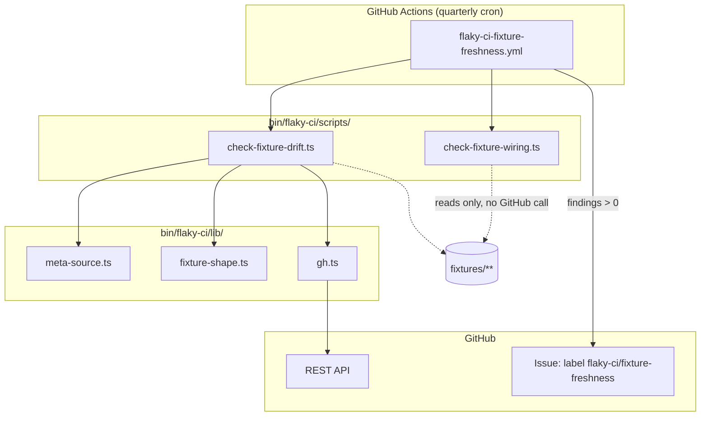
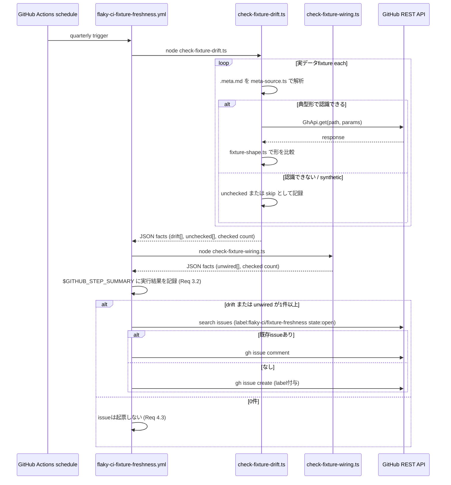

# Technical Design

## Overview

**Purpose**: `bin/flaky-ci/fixtures/` に蓄積された実データfixture（約21,000行、
PR #11921）が、実際の GitHub API 応答の形や `bin/flaky-ci/` のテストからの
参照配線と乖離していないかを、無人・定期的に確認できるようにする。

**Users**: GROWI のメンテナ（`bin/flaky-ci/` の保守担当）。検知結果は GitHub
issue として届く。

**Impact**: 新規の GitHub Actions 定期ワークフローと2本の決定的スクリプトを
追加する。既存の `bin/flaky-ci/` のスクリプト・手順書・無人routine
（`flaky-ci-routine` 等）には一切変更を加えない。

### Goals
- 実データfixtureのうち、典型的な `gh api -X GET` 形式で出典が記録されている
  ものについて、応答の形（キー構成・型）のドリフトを四半期ごとに検知する
- fixtureファイルがテストから実際に参照されているかを機械的に確認する
- 検知結果を GitHub issue として、重複せずに届ける

### Non-Goals
- fixtureの中身の値そのものの正誤判定・自動更新
- `.meta.md` の全書式（`-q` フィルタ付き・派生物・dashboard配下の別書式など）
  を機械的に解釈すること ── 対象外は「未確認」として報告するに留める
- `bin/flaky-ci/` のスクリプト・手順書の機能変更
- 既存の無人routine（`flaky-ci-routine` / `detect-flaky-ci` /
  `investigate-flaky-test`）のロジック変更

## Boundary Commitments

### This Spec Owns
- 実データfixtureの応答形ドリフト検知ロジックと、その定期実行
- fixture-テスト参照配線の健全性チェックロジックと、その定期実行
- 検知結果の GitHub issue 起票・重複防止ロジック

### Out of Boundary
- fixtureの中身の値の正誤判定・自動修正（検知のみ、修正は人が行う）
- `.meta.md` の書式そのものを変更・標準化すること（README への短い注記のみ
  行い、既存fixtureの書き換えは行わない）
- `bin/flaky-ci/` の既存スクリプト・手順書・無人routineの変更

### Allowed Dependencies
- `bin/flaky-ci/lib/gh.ts`（`GhApi.get()` ── 既存の読み取り専用GitHub API
  ラッパーを再利用する。新しいGitHub呼び出し経路は作らない）
- `bin/flaky-ci/fixtures/**/*.meta.md`（読み取り専用。書き換えない）
- `.github/workflows/flaky-repro.yml` の `issues: write` 権限パターン
  （前例として踏襲する）

### Revalidation Triggers
- `bin/flaky-ci/fixtures/README.md` の `.meta.md` 書式規約が変わったとき
  （`lib/meta-source.ts` の抽出パターンを合わせて見直す）
- `lib/gh.ts` の `GhApi` インターフェースが変わったとき
- 新しい実データfixtureが `-q` フィルタ付きや派生物の形で追加され、
  「未確認」の件数が増え続けるとき（Decision 1 の対象パターンを広げる
  検討のきっかけとする）

## Architecture

### Existing Architecture Analysis

`bin/flaky-ci/` は「判断を通らない機械的な処理はスクリプトに出す」という
方針（`ci-flaky-test-detection` 由来）のもと、`lib/`（純粋関数）と
`scripts/`（CLI・GitHub呼び出し）に分かれている。本specはこの構造をそのまま
拡張する。`.github/workflows/ci-bin.yml` は `bin/**` の変更で自動テストを
走らせる（push/PRトリガー）。本spec専用の定期実行は `on: schedule` の
別ワークフローとして追加する（`ci-bin.yml` は push/PR専用のため対象外）。

### Architecture Pattern & Boundary Map



**Architecture Integration**:
- 選択パターン: 決定的スクリプト2本 + 薄いオーケストレーション（ワークフロー
  の `run:` ステップ）。LLM判断は使わない（Decision 2, research.md）
- ドメイン境界: ドリフト検知（GitHub呼び出しあり）と配線チェック
  （ローカル読み取りのみ）は完全に独立。どちらかを止めてももう片方は動く
- 既存パターンの継承: `lib/`（純粋関数）→`scripts/`（CLI）という依存方向、
  `GhApi` の再利用、`gh api -X GET` のみという制約
- 新規コンポーネントの理由: `lib/meta-source.ts`（`.meta.md` 解析）と
  `lib/fixture-shape.ts`（形の比較）は、既存の `lib/` のどれにも属さない
  新しい責務のため独立モジュールとする

### Technology Stack

| Layer | Choice / Version | Role in Feature | Notes |
|-------|------------------|-----------------|-------|
| スクリプト実行 | Node.js 24 / TypeScript（既存 `bin/` ワークスペースと同じ） | ドリフト検知・配線チェックの実装 | 新規依存なし |
| テスト | vitest（既存 `@growi/bin` 設定） | 純粋関数・スクリプトの検証 | `turbo run test --filter=./bin` |
| 定期実行 | GitHub Actions `on: schedule` | 四半期に1回の無人実行 | `release-rc-scheduled.yml` に前例あり |
| GitHub連携 | `gh` CLI 経由の REST API（`lib/gh.ts` 再利用） | 応答形の再取得、issue起票 | `-X GET` のみ（既存制約を継承） |

## File Structure Plan

### Directory Structure
```
bin/flaky-ci/
├── lib/
│   ├── meta-source.ts          # NEW: .meta.md の `# Source` 節を解析
│   ├── meta-source.spec.ts     # NEW
│   ├── fixture-shape.ts        # NEW: JSON値から「形」を計算・比較
│   └── fixture-shape.spec.ts   # NEW
├── scripts/
│   ├── check-fixture-drift.ts       # NEW: 実データfixtureの応答形ドリフト検知
│   ├── check-fixture-drift.spec.ts  # NEW
│   ├── check-fixture-wiring.ts      # NEW: fixture-テスト参照配線チェック
│   └── check-fixture-wiring.spec.ts # NEW
└── fixtures/
    └── README.md                # MODIFIED: 典型形の書式を守らない .meta.md
                                  #   は自動チェック対象外になる旨を追記

.github/workflows/
└── flaky-ci-fixture-freshness.yml  # NEW: 四半期cron。両スクリプトを実行し、
                                      #   findings > 0 で issue を起票/追記
```

### Modified Files
- `bin/flaky-ci/fixtures/README.md` — Decision 1 の帰結（典型形以外は
  自動チェック対象外）を短く追記する

## System Flows



**フロー上の決定**:
- ドリフト検知の失敗（`GhError`、Requirement 5.1/5.3）は `drift` とは別の
  `unchecked` バケットに入り、「乖離なし」として扱われない
- 実行結果の記録（Req 3.2）は issue の起票有無にかかわらず必ず行われる
  （`$GITHUB_STEP_SUMMARY` ── ワークフロー実行履歴として恒久的に残る）

## Requirements Traceability

| Requirement | Summary | Components | Interfaces | Flows |
|-------------|---------|------------|------------|-------|
| 1.1 | 実データfixtureの出典から再取得 | check-fixture-drift.ts, meta-source.ts | `parseMetaSource`, `GhApi.get` | System Flows |
| 1.2 | 形が異なれば乖離候補として報告 | check-fixture-drift.ts, fixture-shape.ts | `computeShape`, `diffShapes` | System Flows |
| 1.3 | 値の変化は乖離としない | fixture-shape.ts | `computeShape`（型のみ保持） | — |
| 1.4 | syntheticは対象外 | meta-source.ts | `parseMetaSource` → `kind: 'synthetic'` | — |
| 2.1 | fixture-テスト参照確認 | check-fixture-wiring.ts | `checkFixtureWiring` | System Flows |
| 2.2 | 未配線候補の報告 | check-fixture-wiring.ts | `checkFixtureWiring` | System Flows |
| 2.3 | `.meta.md` 自体は対象外 | check-fixture-wiring.ts | ファイル列挙時に `.meta.md` を除外 | — |
| 3.1 | 四半期に1回の無人実行 | flaky-ci-fixture-freshness.yml | `on: schedule` cron | — |
| 3.2 | 実行結果の記録 | flaky-ci-fixture-freshness.yml | `$GITHUB_STEP_SUMMARY` | System Flows |
| 4.1 | issue起票（findings > 0） | flaky-ci-fixture-freshness.yml | `gh issue create` | System Flows |
| 4.2 | 重複起票を避ける | flaky-ci-fixture-freshness.yml | `gh api search/issues` + ラベル検索 | System Flows |
| 4.3 | 0件ならissueを起票しない | flaky-ci-fixture-freshness.yml | 条件分岐 | System Flows |
| 5.1 | API取得失敗を乖離なしとしない | check-fixture-drift.ts | `GhError` を `unchecked` に分類 | System Flows |
| 5.2 | 未確認件数・理由の記録 | flaky-ci-fixture-freshness.yml | `$GITHUB_STEP_SUMMARY` | System Flows |
| 5.3 | `.meta.md` 未認識形式も未確認扱い | meta-source.ts | `kind: 'unrecognized'` | System Flows |

## Components and Interfaces

| Component | Domain/Layer | Intent | Req Coverage | Key Dependencies (P0/P1) | Contracts |
|-----------|--------------|--------|--------------|--------------------------|-----------|
| meta-source.ts | lib（純粋関数） | `.meta.md` の `# Source` 節を解析し、real/synthetic/認識不能を判定 | 1.1, 1.4, 5.3 | なし (P0) | Service |
| fixture-shape.ts | lib（純粋関数） | JSON値から「形」を計算し、2つの形を比較 | 1.2, 1.3 | なし (P0) | Service |
| check-fixture-drift.ts | scripts | 実データfixture全件についてドリフトを検知するCLI | 1.1-1.4, 5.1, 5.3 | meta-source.ts (P0), fixture-shape.ts (P0), lib/gh.ts (P0) | Batch |
| check-fixture-wiring.ts | scripts | fixture-テスト参照配線を確認するCLI | 2.1-2.3 | なし (P0、ファイルシステムのみ) | Batch |
| flaky-ci-fixture-freshness.yml | GitHub Actions | 定期実行・issue起票のオーケストレーション | 3.1, 3.2, 4.1-4.3, 5.2 | check-fixture-drift.ts (P0), check-fixture-wiring.ts (P0) | Batch |

### lib

#### meta-source.ts

| Field | Detail |
|-------|--------|
| Intent | `.meta.md` の `# Source` 節冒頭を解析し、再取得すべきAPI呼び出しを判定する |
| Requirements | 1.1, 1.4, 5.3 |

**Responsibilities & Constraints**
- 典型形 `` gh api -X GET repos/growilabs/growi/<path>[?query][ --paginate][ -f k=v ...] ``
  （`-q` を含まないもの）だけを `real-checkable` として抽出する（Decision 1）
- `**Synthetic.**` で始まるものは `synthetic` として分類する（再取得対象外、
  Req 1.4）
- それ以外（`-q` 付き・`Derived, not raw API data.`・`Constructed.`・
  典型形にマッチしない `Real.` など）は `unrecognized` として分類する
  （Req 5.3）
- API呼び出しの成否やGitHubとの通信は行わない（純粋関数）

**Contracts**: Service [x]

##### Service Interface
```typescript
export type MetaSource =
  | { readonly kind: 'real-checkable'; readonly path: string; readonly params: Readonly<Record<string, string | number>>; readonly paginate: boolean }
  | { readonly kind: 'synthetic' }
  | { readonly kind: 'unrecognized'; readonly reason: string };

export const parseMetaSource: (metaMdText: string) => MetaSource;
```
- Preconditions: `metaMdText` は `.meta.md` ファイルの全文
- Postconditions: 3種のいずれか1つを返す。例外は投げない（判定できないものは
  常に `unrecognized`）
- Invariants: `real-checkable` を返すのは、典型形に完全一致したときだけ

#### fixture-shape.ts

| Field | Detail |
|-------|--------|
| Intent | 任意のJSON値から、値を捨てて構造（キー・型）だけを表す「形」を計算し、2つの形を比較する |
| Requirements | 1.2, 1.3 |

**Responsibilities & Constraints**
- オブジェクトはキーごとに再帰的に形を計算する
- 配列は要素0個目の形だけを代表として保持する（要素数の変化は乖離として
  扱わない ── Requirement 1.3 の「値の変化」に含まれる）
- 値（文字列の中身・数値・真偽値そのもの）は保持せず、型名のみ保持する

**Contracts**: Service [x]

##### Service Interface
```typescript
export type Shape =
  | { readonly type: 'string' | 'number' | 'boolean' | 'null' }
  | { readonly type: 'array'; readonly element: Shape | null }
  | { readonly type: 'object'; readonly fields: Readonly<Record<string, Shape>> };

export const computeShape: (value: unknown) => Shape;
/** キーパスの配列で、形が異なる箇所を返す。空配列なら一致。 */
export const diffShapes: (a: Shape, b: Shape) => readonly string[];
```
- Preconditions: なし（`unknown` を受け付ける）
- Postconditions: `diffShapes` は追加されたキー・削除されたキー・型が変わった
  キーのいずれも報告する
- Invariants: `diffShapes(a, a)` は常に空配列

### scripts

#### check-fixture-drift.ts

| Field | Detail |
|-------|--------|
| Intent | 実データfixture全件について、`meta-source.ts` で解析し、対象になるものだけ再取得して `fixture-shape.ts` で比較するCLI |
| Requirements | 1.1, 1.2, 1.3, 1.4, 5.1, 5.3 |

**Responsibilities & Constraints**
- `bin/flaky-ci/fixtures/{api,lockfile,job-logs}/**/*.meta.md` を列挙する
  （README の既存スコープと同じ3ディレクトリ）
- 既存スクリプト群と同じ「事実だけを返す」契約（判断・GitHub書き込みは
  ワークフロー側が行う）
- `GhError` は例外を投げさせず、`unchecked` エントリとして収集する
  （Requirement 5.1）

**Dependencies**
- Inbound: `flaky-ci-fixture-freshness.yml` — CLI起動 (P0)
- Outbound: `lib/meta-source.ts` (P0), `lib/fixture-shape.ts` (P0),
  `lib/gh.ts` の `GhApi.get()` (P0)

**Contracts**: Batch [x]

##### Batch / Job Contract
- Trigger: `flaky-ci-fixture-freshness.yml` からの `node` 呼び出し
- Input / validation: 引数なし（`bin/flaky-ci/fixtures/` を直接スキャン）
- Output / destination: stdout へ JSON
  `{ checked: number, drift: DriftFinding[], unchecked: UncheckedFinding[] }`。
  `DriftFinding = { file: string, source: string, diffPaths: readonly string[] }`
  ── `source` は再取得した `repos/growilabs/growi/...` パスで、issue本文の
  drift件からどの `gh api` 呼び出しを追試すればよいかが分かる。
  `UncheckedFinding = { file: string, reason: string }`
- Idempotency & recovery: 副作用なし（GitHub GETのみ）。何度実行しても同じ
  入力に対して同じ結果

#### check-fixture-wiring.ts

| Field | Detail |
|-------|--------|
| Intent | `bin/flaky-ci/fixtures/` 配下のデータファイルが `bin/flaky-ci/**/*.spec.ts` のいずれかから参照されているかを確認するCLI |
| Requirements | 2.1, 2.2, 2.3 |

**Responsibilities & Constraints**
- `.meta.md` ファイル自体は対象から除外する（Requirement 2.3）
- 参照の判定は、ファイルの `fixtures/` 相対パスが `.spec.ts` のソース文字列
  として現れるかどうかで行う（このリポジトリの既存 `.spec.ts` は
  `readFileSync(fileURLToPath(new URL('../fixtures/...', import.meta.url)))`
  という形で相対パス文字列をそのまま書くため、文字列一致で十分 ──
  `bin/flaky-ci/lib/identity.spec.ts` 等の既存コードで確認済み）
- GitHubへの通信は行わない（ローカルファイル読み取りのみ）

**Contracts**: Batch [x]

##### Batch / Job Contract
- Trigger: `flaky-ci-fixture-freshness.yml` からの `node` 呼び出し
- Input / validation: 引数なし
- Output / destination: stdout へ JSON
  `{ checked: number, unwired: readonly string[] }`
- Idempotency & recovery: 副作用なし

### GitHub Actions

#### flaky-ci-fixture-freshness.yml

| Field | Detail |
|-------|--------|
| Intent | 四半期に1回、両スクリプトを実行し、結果を記録・issue起票する |
| Requirements | 3.1, 3.2, 4.1, 4.2, 4.3, 5.2 |

**Responsibilities & Constraints**
- `on: schedule` で四半期に1回起動（例: `cron: '0 0 1 1,4,7,10 *'`）。
  `workflow_dispatch` も併用可能にし、手動での動作確認を妨げない
- `permissions: contents: read, issues: write`（`flaky-repro.yml` と同じ
  最小権限パターン）
- 実行結果（対象件数・drift件数・unwired件数・unchecked件数）は
  `$GITHUB_STEP_SUMMARY` に常に書く（issue起票の有無に関わらず、
  Requirement 3.2 / 5.2）
- drift または unwired が1件以上のとき、`gh api -X GET search/issues`
  でラベル `flaky-ci/fixture-freshness` かつ `state:open` のissueを検索し、
  あれば `gh issue comment`、なければ `gh issue create`（ラベル付与）

**Contracts**: Batch [x]

##### Batch / Job Contract
- Trigger: cron（四半期）／手動 `workflow_dispatch`
- Input / validation: なし
- Output / destination: `$GITHUB_STEP_SUMMARY`、条件付きで GitHub issue
- Idempotency & recovery: 同じ四半期内に複数回動いても、既存issueへの
  追記に倒れるため重複issueは作られない（Requirement 4.2）

**Implementation Notes**
- Integration: `lib/gh.ts` はcloud routine環境の制約（REST限定）を前提に
  作られているが、GitHub Actions runner上でも同じ `-X GET` 縛りをそのまま
  適用し、呼び出し経路を1本に保つ
- Validation: 新ワークフローは `ci-bin.yml` の `paths` フィルタの対象外
  （push/PRでは動かない）。構文検証は `actionlint` 等の既存lintフロー
  （リポジトリに既にあれば）に任せる
- Risks: 四半期という頻度は「実際に何かが変わってから気づくまで最大3か月
  かかる」ことを意味する。頻度の妥当性は運用開始後に見直す
  （research.md Risks & Mitigations）

## Error Handling

### Error Strategy
既存の `bin/flaky-ci/` 全体の方針（見せかけの成功を返さない）を継承する。

### Error Categories and Responses
- **GitHub API 取得失敗**（レート制限・404・ネットワークエラー）→
  `check-fixture-drift.ts` は該当fixtureを `unchecked` に分類し、
  「乖離なし」としては扱わない（Requirement 5.1）
- **`.meta.md` が典型形でない**→ `unrecognized`（`unchecked` の一種）として
  分類し、静かに無視しない（Requirement 5.3）
- **`gh` コマンド自体が使えない**（`GhError.kind === 'not-installed'`）→
  スクリプト全体を非ゼロ終了コードで終了させ、ワークフロー側のジョブが
  失敗として明示される（既存 `lib/gh.ts` の契約をそのまま踏襲）

### Monitoring
`$GITHUB_STEP_SUMMARY` とワークフロー実行履歴（GitHub Actions側で自動的に
保持される）が唯一の記録先。追加の監視基盤は導入しない。

## Testing Strategy

- **Unit（lib）**: `meta-source.ts` が典型形（`--paginate` あり/なし、
  `-f` パラメータあり/なし）を `real-checkable` として正しく抽出すること、
  `-q` 付き・`Derived`・`Constructed`・`Synthetic` をそれぞれ正しく分類
  すること（実際の `bin/flaky-ci/fixtures/**/*.meta.md` から採取した
  実例をfixtureとして使う）／`fixture-shape.ts` がキー追加・削除・型変更を
  検知し、値だけの変化（文字列の中身、配列要素数）を無視すること
- **Unit（scripts）**: `check-fixture-drift.ts` が `GhError` を `unchecked`
  に分類し例外を伝播させないこと、`unrecognized` な `.meta.md` を
  `unchecked` に含めること／`check-fixture-wiring.ts` が `.meta.md` 自身を
  対象から除外すること、実際に未参照のテスト用fixtureを1件用意して
  `unwired` に含まれることを確認すること
- **Integration**: `flaky-ci-fixture-freshness.yml` を `act` 等での
  ローカル再現、または実ブランチへの `workflow_dispatch` 手動起動で、
  `$GITHUB_STEP_SUMMARY` の出力形と、意図的に用意した未配線fixture1件が
  issue起票（または既存issueへのコメント）につながることを1回確認する
  （`flaky-repro.yml` の分割検証で用いたのと同じ、自己検証用ブランチでの
  実測パターンを踏襲する）
