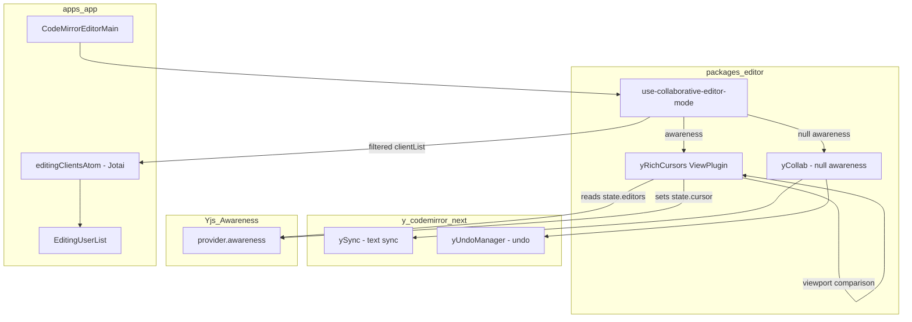
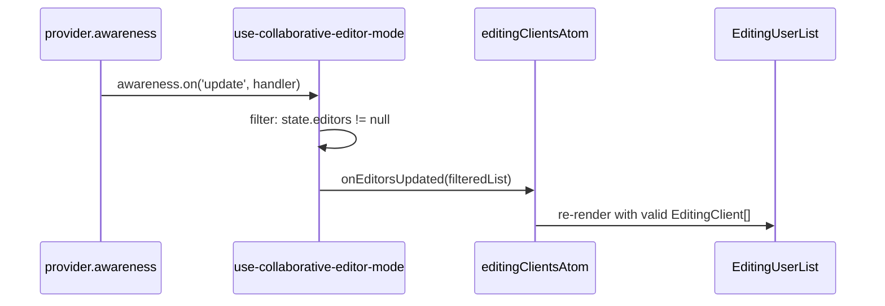
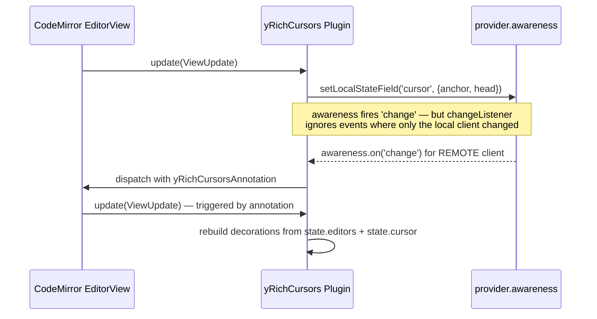

# Design Document: collaborative-editor-awareness

## Overview

**Purpose**: This feature fixes intermittent disappearance of the `EditingUserList` component and upgrades in-editor cursors to display a user's name and avatar alongside the cursor caret.

**Users**: All GROWI users who use real-time collaborative page editing. They will see stable editing-user indicators and rich, avatar-bearing cursor flags that identify co-editors by name and profile image.

**Impact**: Modifies `use-collaborative-editor-mode` in `@growi/editor`, replaces the default `yRemoteSelections` cursor plugin from `y-codemirror.next` with a purpose-built `yRichCursors` ViewPlugin, and adds one new source file.

### Goals

- Eliminate `EditingUserList` disappearance caused by `undefined` entries from uninitialized awareness states
- Remove incorrect direct mutation of Yjs-managed `awareness.getStates()` map
- Render remote cursors with display name and profile image avatar
- Read user data exclusively from `state.editors` (GROWI's canonical awareness field), eliminating the current `state.user` mismatch

### Non-Goals

- Server-side awareness bridging (covered in `collaborative-editor` spec)
- Changes to the `EditingUserList` React component
- Upgrading `y-codemirror.next` or `yjs`
- Cursor rendering for the local user's own cursor

## Architecture

### Existing Architecture Analysis

The current flow has two defects:

1. **`emitEditorList` in `use-collaborative-editor-mode`**: maps `awareness.getStates().values()` to `value.editors`, producing `undefined` for any client whose awareness state has not yet included an `editors` field. The `Array.isArray` guard is always true and does not filter. `EditingUserList` then receives a list containing `undefined`, leading to a React render error that wipes the component.

2. **Cursor field mismatch**: `yCollab(activeText, provider.awareness, { undoManager })` adds `yRemoteSelections`, which reads `state.user.name` and `state.user.color`. GROWI sets `state.editors` (not `state.user`). The result is that all cursors render as "Anonymous" with a default blue color. This is also fixed by the new design.

### Architecture Pattern & Boundary Map



**Key architectural properties**:
- `yCollab` is called with `null` awareness to suppress the built-in `yRemoteSelections` plugin; text-sync (`ySync`) and undo (`yUndoManager`) are not affected
- `yRichCursors` is added as a separate extension alongside `yCollab`'s output; it owns all awareness-cursor interaction, including in-viewport widget rendering and off-screen indicators
- `state.editors` remains the single source of truth for user identity data
- `state.cursor` (anchor/head relative positions) continues to be used for cursor position broadcasting, consistent with `y-codemirror.next` convention
- Off-screen indicators are managed within the same `yRichCursors` ViewPlugin — it compares each remote cursor's absolute position against `view.viewport` to decide between widget decoration (in-view) and DOM overlay (off-screen)

### Technology Stack

| Layer | Choice / Version | Role in Feature | Notes |
|-------|------------------|-----------------|-------|
| Editor extensions | `y-codemirror.next@0.3.5` | `yCollab` for text-sync and undo; `yRemoteSelectionsTheme` for base caret CSS | No version change; `yRemoteSelections` no longer used |
| Cursor rendering | CodeMirror `ViewPlugin` + `WidgetType` (`@codemirror/view`) | DOM-based cursor widget with avatar `` | No new dependency |
| Awareness | `y-websocket` `awareness` object | State read (`getStates`) and write (`setLocalStateField`) | `Awareness` type derived via `WebsocketProvider['awareness']` — `y-protocols` is not a direct dependency |

## System Flows

### Awareness Update → EditingUserList



The filter (`value.editors != null`) ensures `EditingUserList` never receives `undefined` entries. The `.delete()` call on `getStates()` is removed; Yjs clears stale entries before emitting `update`.

### Cursor Render Cycle



**Annotation-driven update strategy**: The awareness `change` listener does not call `view.dispatch()` unconditionally — doing so would crash with "Calls to EditorView.update are not allowed while an update is in progress" because `setLocalStateField` in the `update()` method itself triggers an awareness `change` event synchronously. Instead, the listener filters by `clientID`: it dispatches (with a `yRichCursorsAnnotation`) only when at least one **remote** client's state has changed. Local-only awareness changes (from the cursor broadcast in the same `update()` cycle) are silently ignored, and the decoration set is rebuilt in the next `update()` call naturally.

## Requirements Traceability

| Requirement | Summary | Components | Key Interfaces |
|-------------|---------|------------|----------------|
| 1.1 | Filter undefined awareness entries | `use-collaborative-editor-mode` | `emitEditorList` filter |
| 1.2 | Remove `getStates().delete()` mutation | `use-collaborative-editor-mode` | `updateAwarenessHandler` |
| 1.3 | EditingUserList remains stable | `use-collaborative-editor-mode` → `editingClientsAtom` | `onEditorsUpdated` callback |
| 1.4 | Skip entries without `editors` field | `use-collaborative-editor-mode` | `emitEditorList` filter |
| 2.1 | Broadcast user presence via awareness | `use-collaborative-editor-mode` | `awareness.setLocalStateField('editors', ...)` |
| 2.2–2.3 | Socket.IO awareness events (server) | Out of scope — `collaborative-editor` spec | — |
| 2.4 | Display active editors | `EditingUserList` (unchanged) | — |
| 3.1 | Avatar overlay below caret (no block space) | `yRichCursors` | `RichCaretWidget.toDOM()` — `position: absolute` overlay |
| 3.2 | Avatar size 24×24px (matches EditingUserList) | `yRichCursors` | `RichCaretWidget.toDOM()` — CSS sizing |
| 3.3 | Name label visible on hover only | `yRichCursors` | CSS `:hover` on `.cm-yRichCursorFlag` |
| 3.4 | Avatar image with initials fallback | `yRichCursors` | `RichCaretWidget.toDOM()` — `` onerror → initials |
| 3.5 | Cursor caret and fallback color from `state.editors.color` | `yRichCursors` | `RichCaretWidget` constructor |
| 3.6 | Custom cursor via replacement plugin | `yRichCursors` replaces `yRemoteSelections` | `yCollab(activeText, null, { undoManager })` |
| 3.7 | Cursor updates on awareness change | `yRichCursors` awareness change listener | `awareness.on('change', ...)` |
| 3.8 | Default semi-transparent avatar | `yRichCursors` | CSS `opacity` on `.cm-yRichCursorFlag` |
| 3.9 | Full opacity on hover | `yRichCursors` | CSS `:hover` rule |
| 3.10 | Full opacity during active editing (3s) | `yRichCursors` | `lastActivityMap` + `.cm-yRichCursorActive` class + `setTimeout` |
| 4.1 | Off-screen indicator pinned to top edge (↑) | `yRichCursors` | `offScreenContainer` top overlay |
| 4.2 | Off-screen indicator pinned to bottom edge (↓) | `yRichCursors` | `offScreenContainer` bottom overlay |
| 4.3 | No indicator when cursor is in viewport | `yRichCursors` | viewport comparison in `update()` |
| 4.4 | Same avatar/color as in-editor widget | `yRichCursors` | shared `state.editors` data |
| 4.5 | Multiple indicators side by side | `yRichCursors` | horizontal flex layout |
| 4.6 | Transition on scroll (indicator ↔ widget) | `yRichCursors` | `viewportChanged` check in `update()` |
| 4.7 | Overlay positioning (no layout impact) | `yRichCursors` | `position: absolute` on `view.dom` |

## Components and Interfaces

| Component | Domain/Layer | Intent | Req Coverage | Key Dependencies (P0) | Contracts |
|-----------|--------------|--------|--------------|----------------------|-----------|
| `use-collaborative-editor-mode` | packages/editor — Hook | Fix awareness filter bug; compose extensions with rich cursor | 1.1–1.4, 2.1, 2.4 | `yCollab` (P0), `yRichCursors` (P0) | State |
| `yRichCursors` | packages/editor — Extension | Custom ViewPlugin: broadcasts local cursor position, renders in-viewport cursors with overlay avatar+hover name+activity opacity, renders off-screen indicators at editor edges | 3.1–3.10, 4.1–4.7 | `@codemirror/view` (P0), `y-websocket awareness` (P0) | Service |

### packages/editor — Hook

#### `use-collaborative-editor-mode` (modified)

| Field | Detail |
|-------|--------|
| Intent | Orchestrates WebSocket provider, awareness, and CodeMirror extension lifecycle for collaborative editing |
| Requirements | 1.1, 1.2, 1.3, 1.4, 2.1, 2.4 |

**Responsibilities & Constraints**
- Filters `undefined` awareness entries before calling `onEditorsUpdated`
- Does not mutate `awareness.getStates()` directly
- Composes `yCollab(null)` + `yRichCursors(awareness)` to achieve text-sync, undo, and rich cursor rendering without the default `yRemoteSelections` plugin

**Dependencies**
- Outbound: `yCollab` from `y-codemirror.next` — text-sync and undo (P0)
- Outbound: `yRichCursors` — rich cursor rendering (P0)
- Outbound: `provider.awareness` — read states, set local state (P0)

**Contracts**: State [x]

##### State Management

- **Bug fix — `emitEditorList`**:
  ```
  Before: Array.from(getStates().values(), v => v.editors)   // contains undefined
  After:  Array.from(getStates().values())
            .map(v => v.editors)
            .filter((v): v is EditingClient => v != null)
  ```
- **Bug fix — `updateAwarenessHandler`**: Remove `awareness.getStates().delete(clientId)` for all `update.removed` entries; Yjs removes them before emitting the event.
- **Extension composition change**:
  ```
  Before: yCollab(activeText, provider.awareness, { undoManager })
  After:  [
            yCollab(activeText, null, { undoManager }),
            yRichCursors(provider.awareness),
          ]
  ```
  Note: `yCollab` already includes `yUndoManagerKeymap` in its return array, so it must NOT be added separately to avoid keymap duplication. Verify during implementation by inspecting the return value of `yCollab`.

**Implementation Notes**
- Integration: `yCollab` with `null` awareness suppresses `yRemoteSelections` and `yRemoteSelectionsTheme`. Text-sync (`ySync`) and undo (`yUndoManager`) are not affected by the null awareness value.
- Risks: If `y-codemirror.next` is upgraded, re-verify that passing `null` awareness still suppresses only the cursor plugins.

---

### packages/editor — Extension

#### `yRichCursors` (new)

| Field | Detail |
|-------|--------|
| Intent | CodeMirror ViewPlugin — broadcasts local cursor position, renders in-viewport cursors with overlay avatar and hover-revealed name, renders off-screen indicators pinned to editor edges for cursors outside the viewport |
| Requirements | 3.1–3.10, 4.1–4.7 |

**Responsibilities & Constraints**
- On each `ViewUpdate`: derives local cursor anchor/head → converts to Yjs relative positions → calls `awareness.setLocalStateField('cursor', { anchor, head })` (matches `state.cursor` convention from `y-codemirror.next`)
- On awareness `change` event: rebuilds decoration set reading `state.editors` (color, name, imageUrlCached) and `state.cursor` (anchor, head) for each remote client
- Does NOT render a cursor for the local client (`clientid === awareness.doc.clientID`)
- Selection highlight (background color from `state.editors.colorLight`) is rendered alongside the caret widget

**Dependencies**
- External: `@codemirror/view` `ViewPlugin`, `WidgetType`, `Decoration`, `EditorView` (P0)
- External: `@codemirror/state` `RangeSet`, `Annotation` (P0) — `Annotation.define<number[]>()` used for `yRichCursorsAnnotation`
- External: `yjs` `createRelativePositionFromTypeIndex`, `createAbsolutePositionFromRelativePosition` (P0)
- External: `y-codemirror.next` `ySyncFacet` (to access `ytext` for position conversion) (P0)
- External: `y-websocket` — `Awareness` type derived via `WebsocketProvider['awareness']` (not `y-protocols/awareness`, which is not a direct dependency) (P0)
- Inbound: `provider.awareness` passed as parameter (P0)

**Contracts**: Service [x]

##### Service Interface

```typescript
/**
 * Creates a CodeMirror Extension that renders remote user cursors with
 * name labels and avatar images, reading user data from state.editors.
 *
 * Also broadcasts the local user's cursor position via state.cursor.
 */
export function yRichCursors(awareness: Awareness): Extension;
```

Preconditions:
- `awareness` is an active `y-websocket` Awareness instance
- `ySyncFacet` is installed by a preceding `yCollab` call so that `ytext` can be resolved for position conversion

Postconditions:
- Remote cursors within the visible viewport are rendered as `cm-yRichCaret` widget decorations at each remote client's head position
- Remote cursors outside the visible viewport are rendered as off-screen indicator overlays pinned to the top or bottom edge of `view.dom`
- Local cursor position is broadcast to awareness as `state.cursor.{ anchor, head }` on each focus-selection change

Invariants:
- Local client's own cursor is never rendered
- Cursor decorations are rebuilt when awareness `change` fires for **remote** clients (dispatched via `yRichCursorsAnnotation`); local-only changes are ignored to prevent recursive `dispatch` during an in-progress update
- `state.cursor` field is written exclusively by `yRichCursors`; no other plugin or code path may call `awareness.setLocalStateField('cursor', ...)` to avoid data races

##### Widget DOM Structure

```
<span class="cm-yRichCaret" style="border-color: {color}; position: relative;">
  <!-- Overlay flag: positioned below the caret, does NOT consume block space -->
  <span class="cm-yRichCursorFlag">
    <!-- Avatar: 16×16px circular -->
    
    <!-- OR fallback when img absent or fails to load: -->
    <span class="cm-yRichCursorInitials" style="background-color: {color}">{initials}</span>
    <!-- Name label: hidden by default, shown on :hover -->
    <span class="cm-yRichCursorInfo" style="background-color: {color}">{name}</span>
  </span>
</span>
```

**CSS strategy** (applied via `EditorView.baseTheme` exported alongside the ViewPlugin):

`:hover` pseudo-class cannot be expressed via inline styles, so a `baseTheme` is mandatory. The theme is included in the Extension array returned by `yRichCursors()`.

```css
/* Caret line — the hover anchor */
.cm-yRichCaret {
  position: relative;
}

/* Overlay flag — pointer-events: none to avoid stealing clicks from the editor.
   Shown on caret hover so the user can then interact with the flag. */
.cm-yRichCursorFlag {
  position: absolute;
  top: 100%;           /* directly below the caret line */
  left: -8px;          /* center the 16px avatar on the 1px caret */
  z-index: 10;
  pointer-events: none;          /* default: pass clicks through to editor */
}
.cm-yRichCaret:hover .cm-yRichCursorFlag {
  pointer-events: auto;          /* enable interaction once caret is hovered */
}

.cm-yRichCursorAvatar {
  width: 16px;
  height: 16px;
  border-radius: 50%;
  display: block;
}
.cm-yRichCursorInitials {
  width: 16px;
  height: 16px;
  border-radius: 50%;
  display: flex;
  align-items: center;
  justify-content: center;
  color: white;
  font-size: 8px;
  font-weight: bold;
}

/* Name label — hidden by default, shown when the flag itself is hovered */
.cm-yRichCursorInfo {
  display: none;
  position: absolute;
  top: 0;
  left: 20px;          /* right of the 16px avatar + 4px gap */
  white-space: nowrap;
  padding: 2px 6px;
  border-radius: 3px;
  color: white;
  font-size: 12px;
  line-height: 16px;
}
.cm-yRichCursorFlag:hover .cm-yRichCursorInfo {
  display: block;      /* shown on hover */
}

/* --- Opacity: semi-transparent by default, full on hover or active editing --- */
.cm-yRichCursorFlag {
  opacity: 0.4;
  transition: opacity 0.3s ease;
}
.cm-yRichCaret:hover .cm-yRichCursorFlag,
.cm-yRichCursorFlag.cm-yRichCursorActive {
  opacity: 1;
}
```

**Activity tracking for opacity** (JavaScript, within `YRichCursorsPluginValue`):
- Maintain `lastActivityMap: Map<number, number>` — maps `clientId` → timestamp of last awareness cursor change
- Maintain `activeTimers: Map<number, ReturnType<typeof setTimeout>>` — maps `clientId` → timer handle
- On awareness `change` for remote clients:
  - Update `lastActivityMap.set(clientId, Date.now())`
  - Clear any existing timer for that client, set a new `setTimeout(3000)` that calls `view.dispatch()` with `yRichCursorsAnnotation` to trigger a decoration rebuild
- In `update()`, when building decorations:
  - Compute `isActive = (Date.now() - (lastActivityMap.get(clientId) ?? 0)) < 3000` for each remote client
  - Pass `isActive` to `new RichCaretWidget(color, name, imageUrlCached, isActive)` — `toDOM()` applies `.cm-yRichCursorActive` when `true`
  - Pass `isActive` when building off-screen indicator elements as well (add `.cm-yRichCursorActive` class to `.cm-offScreenIndicator`)
- `eq()` includes `isActive`, so a state transition (active→inactive or vice versa) triggers `toDOM()` re-creation — this occurs at most twice per user per 3-second cycle, which is acceptable
- On `destroy()`: clear all timers

**Off-screen indicators** also respect the same opacity pattern: `.cm-offScreenIndicator` defaults to `opacity: 0.4` and receives `.cm-yRichCursorActive` when the remote user is active.

**Pointer-events strategy**: The overlay flag uses `pointer-events: none` by default so it never intercepts clicks or text selection in the editor. When the user hovers the caret line (`.cm-yRichCaret:hover`), `pointer-events: auto` is enabled on the flag, allowing the user to then hover the avatar to reveal the name label. This two-step hover cascade ensures the editor remains fully interactive while still providing discoverability.

**Design decision — CSS-only, no React**: The overlay, sizing, and hover behavior are all achievable with `position: absolute` and the `:hover` pseudo-class. No JavaScript state management is needed, so `document.createElement` remains the implementation strategy. React's `createRoot` would introduce async rendering (flash of empty container), context isolation, and per-widget overhead without any benefit.

`RichCaretWidget` (extends `WidgetType`):
- Constructor parameters: `color: string`, `name: string`, `imageUrlCached: string | undefined`, `isActive: boolean`
- `toDOM()`: creates the DOM tree above using `document.createElement`; attaches `onerror` on `` to replace with initials fallback; applies CSS classes via `baseTheme`; adds `.cm-yRichCursorActive` to `.cm-yRichCursorFlag` when `isActive` is `true`
- `eq(other)`: returns `true` when `color`, `name`, `imageUrlCached`, and `isActive` all match (avoids unnecessary re-creation; activity state transitions cause at most 2 re-creations per user per 3-second cycle)
- `estimatedHeight`: `-1` (inline widget)
- `ignoreEvent()`: `true`

Selection highlight: rendered as `Decoration.mark` on the selected range with `background-color: {colorLight}` (same as `yRemoteSelections`).

##### Off-Screen Cursor Indicators

When a remote cursor's absolute position falls outside `view.viewport.from`..`view.viewport.to`, the ViewPlugin renders an off-screen indicator instead of a widget decoration.

**DOM management**: The ViewPlugin creates two persistent container elements (`topContainer`, `bottomContainer`) and appends them to `view.dom` in the `constructor`. They are removed in `destroy()`. The containers are always present in the DOM but empty (zero height) when no off-screen cursors exist in that direction.

```
view.dom (position: relative — already set by CodeMirror)
├── .cm-scroller (managed by CM)
│   └── .cm-content ...
├── .cm-offScreenTop    ← topContainer (absolute, top: 0)
│   ├── .cm-offScreenIndicator (Alice ↑)
│   └── .cm-offScreenIndicator (Bob ↑)
└── .cm-offScreenBottom ← bottomContainer (absolute, bottom: 0)
    └── .cm-offScreenIndicator (Charlie ↓)
```

**Indicator DOM structure**:
```html
<span class="cm-offScreenIndicator">
  <span class="cm-offScreenArrow">↑</span>  <!-- or ↓ -->
  
  <!-- OR fallback: -->
  <span class="cm-offScreenInitials" style="background-color: {color}">{initials}</span>
</span>
```

**CSS** (included in the same `EditorView.baseTheme`):
```css
.cm-offScreenTop,
.cm-offScreenBottom {
  position: absolute;
  left: 0;
  right: 0;
  display: flex;
  gap: 4px;
  padding: 2px 4px;
  pointer-events: none;
  z-index: 10;
}
.cm-offScreenTop {
  top: 0;
}
.cm-offScreenBottom {
  bottom: 0;
}
.cm-offScreenIndicator {
  display: flex;
  align-items: center;
  gap: 2px;
  opacity: 0.4;
  transition: opacity 0.3s ease;
}
.cm-offScreenIndicator.cm-yRichCursorActive {
  opacity: 1;
}
.cm-offScreenArrow {
  font-size: 10px;
  line-height: 1;
}
.cm-offScreenAvatar {
  width: 16px;
  height: 16px;
  border-radius: 50%;
}
.cm-offScreenInitials {
  width: 16px;
  height: 16px;
  border-radius: 50%;
  display: flex;
  align-items: center;
  justify-content: center;
  color: white;
  font-size: 8px;
  font-weight: bold;
}
```

**Update cycle**:
1. In the `update(viewUpdate)` method, after computing absolute positions for all remote cursors, classify each into: `inViewport`, `above`, or `below` based on comparison with `view.viewport.{from, to}`
2. For `inViewport` cursors: create `Decoration.widget` (same as current behavior)
3. For `above` / `below` cursors: rebuild `topContainer` / `bottomContainer` children via `replaceChildren()` — clear old indicator elements and append new ones
4. Containers are rebuilt on every update where `viewportChanged` is true OR awareness has changed (same trigger as decoration rebuild)
5. Cursors that lack `state.cursor` or `state.editors` are excluded from both in-view and off-screen rendering

**Implementation Notes**
- Integration: file location `packages/editor/src/client/services-internal/extensions/y-rich-cursors.ts`; exported from `packages/editor/src/client/services-internal/extensions/index.ts` and consumed directly in `use-collaborative-editor-mode.ts`
- Validation: `imageUrlCached` is optional; if undefined or empty, the `` element is skipped and only initials are shown
- Risks: `ySyncFacet` must be present in the editor state when the plugin initializes; guaranteed since `yCollab` (which installs `ySyncFacet`) is added before `yRichCursors` in the extension array

## Data Models

### Domain Model

No new persistent data. The awareness state already carries all required fields via the `EditingClient` interface in `state.editors`.

```typescript
// Existing — no changes
type EditingClient = Pick<IUser, 'name'> &
  Partial<Pick<IUser, 'username' | 'imageUrlCached'>> & {
    clientId: number;
    userId?: string;
    color: string;       // cursor caret and flag background color
    colorLight: string;  // selection range highlight color
  };
```

The `state.cursor` awareness field follows the existing `y-codemirror.next` convention:
```typescript
type CursorState = {
  anchor: RelativePosition; // Y.RelativePosition JSON
  head: RelativePosition;
};
```

## Error Handling

| Error Type | Scenario | Response |
|------------|----------|----------|
| Missing `editors` field | Client connects but has not set awareness yet | Filtered out in `emitEditorList`; not rendered in `EditingUserList` |
| Avatar image load failure | `imageUrlCached` URL returns 4xx/5xx | `` `onerror` replaces element with initials `<span>` (colored circle with user initials) |
| `state.cursor` absent | Remote client connected but editor not focused | Cursor widget not rendered for that client (no `cursor.anchor` → skip) |
| `ySyncFacet` not installed | `yRichCursors` initialized before `yCollab` | Position conversion returns `null`; cursor is skipped for that update cycle. Extension array order in `use-collaborative-editor-mode` guarantees correct sequencing. |
| Off-screen container detached | `view.dom` removed from DOM before `destroy()` | `destroy()` calls `remove()` on both containers; if already detached, `remove()` is a no-op |
| Viewport not yet initialized | First `update()` before CM calculates viewport | `view.viewport` always has valid `from`/`to` from initialization; safe to compare |

## Testing Strategy

### Unit Tests

- `emitEditorList` filter: given awareness states `[{ editors: validClient }, {}, { editors: undefined }]`, `onEditorsUpdated` is called with only the valid client
- `updateAwarenessHandler`: `removed` client IDs are processed without calling `awareness.getStates().delete()`
- `RichCaretWidget.eq()`: returns `true` for same color/name/imageUrlCached, `false` for any difference
- `RichCaretWidget.toDOM()`: when `imageUrlCached` is provided, renders `` element (24×24px, circular); when undefined, renders initials `<span>` with `background-color` from `color`
- Avatar fallback: `onerror` on `` replaces the element with the initials fallback (colored circle)
- Overlay positioning: the `.cm-yRichCursorFlag` element has `position: absolute` and `top: 100%` (does not consume block space)
- Hover behavior (structural only): `.cm-yRichCursorInfo` exists in the DOM with no inline `display` override (the `baseTheme` sets `display: none` by default). Actual `:hover` toggle is CSS-only and cannot be simulated in happy-dom/jsdom — **deferred to E2E tests (Playwright)**
- Activity tracking: `RichCaretWidget` constructed with `isActive: true` adds `.cm-yRichCursorActive` to the flag element; with `isActive: false` it does not. `eq()` returns `false` when `isActive` differs, triggering widget re-creation

### Integration Tests

- Two simulated awareness clients: both have `state.editors` set → `EditingUserList` receives two valid entries
- One client has no `state.editors` (just connected) → `EditingUserList` receives only the client that has editors set
- Cursor position broadcast: on selection change, `awareness.getLocalState().cursor` is updated with the correct relative position
- Remote cursor rendering: given awareness state with `state.cursor` and `state.editors`, the editor view contains a `cm-yRichCaret` widget at the correct position
- Off-screen classification: given a remote cursor position outside `view.viewport`, verify the cursor is not rendered as a widget decoration (widget count is zero for that client)

### E2E Tests (Playwright)

- `:hover` behavior on `.cm-yRichCursorFlag`: verify name label appears on hover, hidden otherwise (Req 3.3)
- Off-screen indicator visibility: scroll the editor so a remote cursor goes off-screen; verify `.cm-offScreenTop` or `.cm-offScreenBottom` contains the expected indicator element; scroll back and verify the indicator disappears and the in-editor widget reappears (Req 4.6)
- Pointer-events: verify that clicking on text underneath the overlay flag correctly places the editor cursor (Req 4.7)

### Performance

- `RichCaretWidget.eq()` prevents re-creation when awareness updates do not change user info — confirmed by CodeMirror's decoration update logic calling `eq` before `toDOM`
- Off-screen container updates use `replaceChildren()` for efficient batch DOM mutation; containers are not removed/re-created on each update cycle
