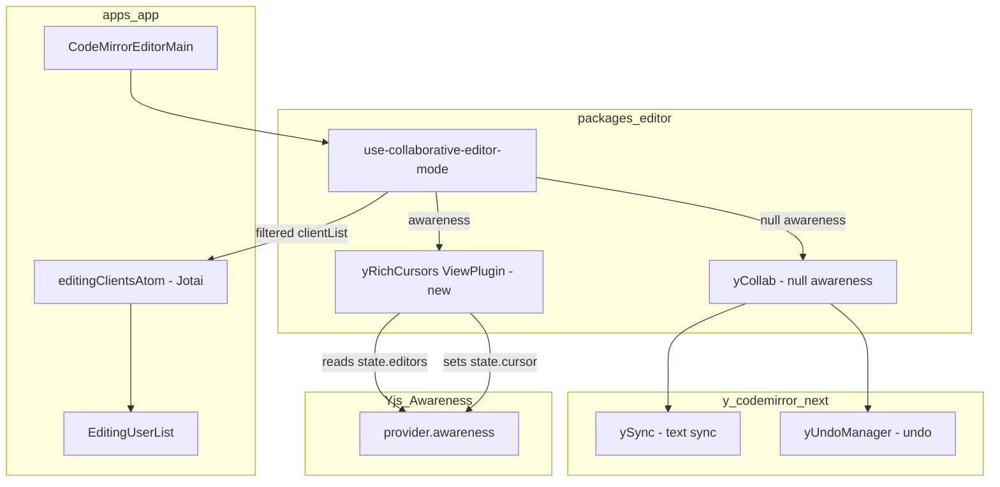
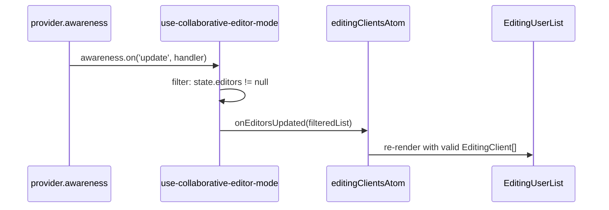
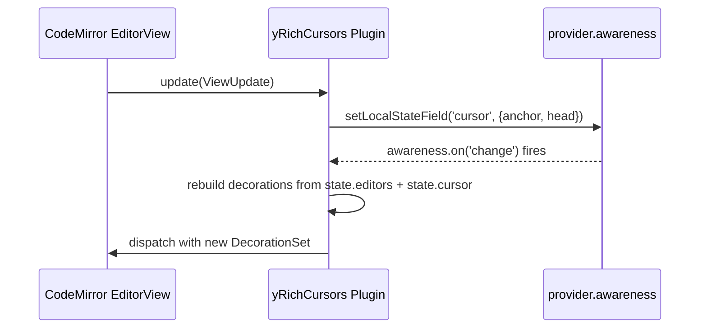

# Design Document: collaborative-editor-awareness

## Overview

**Purpose**: This feature fixes intermittent disappearance of the `EditingUserList` component and upgrades in-editor cursors to display a user's name and avatar alongside the cursor caret.

**Users**: All GROWI users who use real-time collaborative page editing. They will see stable editing-user indicators and rich, avatar-bearing cursor flags that identify co-editors by name and profile image.

**Impact**: Modifies `use-collaborative-editor-mode` in `@growi/editor`, replaces the default `yRemoteSelections` cursor plugin from `y-codemirror.next` with a purpose-built `yRichCursors` ViewPlugin, and adds one new source file.

### Goals

- Eliminate `EditingUserList` disappearance caused by `undefined` entries from uninitialized awareness states
- Remove incorrect direct mutation of Yjs-managed `awareness.getStates()` map
- Render remote cursors with display name and profile image avatar
- Read user data exclusively from `state.editors` (GROWI's canonical awareness field), eliminating the current `state.user` mismatch

### Non-Goals

- Server-side awareness bridging (covered in `collaborative-editor` spec)
- Changes to the `EditingUserList` React component
- Upgrading `y-codemirror.next` or `yjs`
- Cursor rendering for the local user's own cursor

## Architecture

### Existing Architecture Analysis

The current flow has two defects:

1. **`emitEditorList` in `use-collaborative-editor-mode`**: maps `awareness.getStates().values()` to `value.editors`, producing `undefined` for any client whose awareness state has not yet included an `editors` field. The `Array.isArray` guard is always true and does not filter. `EditingUserList` then receives a list containing `undefined`, leading to a React render error that wipes the component.

2. **Cursor field mismatch**: `yCollab(activeText, provider.awareness, { undoManager })` adds `yRemoteSelections`, which reads `state.user.name` and `state.user.color`. GROWI sets `state.editors` (not `state.user`). The result is that all cursors render as "Anonymous" with a default blue color. This is also fixed by the new design.

### Architecture Pattern & Boundary Map



**Key architectural properties**:
- `yCollab` is called with `null` awareness to suppress the built-in `yRemoteSelections` plugin; text-sync (`ySync`) and undo (`yUndoManager`) are not affected
- `yRichCursors` is added as a separate extension alongside `yCollab`'s output; it owns all awareness-cursor interaction
- `state.editors` remains the single source of truth for user identity data
- `state.cursor` (anchor/head relative positions) continues to be used for cursor position broadcasting, consistent with `y-codemirror.next` convention

### Technology Stack

| Layer | Choice / Version | Role in Feature | Notes |
|-------|------------------|-----------------|-------|
| Editor extensions | `y-codemirror.next@0.3.5` | `yCollab` for text-sync and undo; `yRemoteSelectionsTheme` for base caret CSS | No version change; `yRemoteSelections` no longer used |
| Cursor rendering | CodeMirror `ViewPlugin` + `WidgetType` (`@codemirror/view`) | DOM-based cursor widget with avatar `` | No new dependency |
| Awareness | `y-websocket` `awareness` object | State read (`getStates`) and write (`setLocalStateField`) | Unchanged |

## System Flows

### Awareness Update → EditingUserList



The filter (`value.editors != null`) ensures `EditingUserList` never receives `undefined` entries. The `.delete()` call on `getStates()` is removed; Yjs clears stale entries before emitting `update`.

### Cursor Render Cycle



## Requirements Traceability

| Requirement | Summary | Components | Key Interfaces |
|-------------|---------|------------|----------------|
| 1.1 | Filter undefined awareness entries | `use-collaborative-editor-mode` | `emitEditorList` filter |
| 1.2 | Remove `getStates().delete()` mutation | `use-collaborative-editor-mode` | `updateAwarenessHandler` |
| 1.3 | EditingUserList remains stable | `use-collaborative-editor-mode` → `editingClientsAtom` | `onEditorsUpdated` callback |
| 1.4 | Skip entries without `editors` field | `use-collaborative-editor-mode` | `emitEditorList` filter |
| 2.1 | Broadcast user presence via awareness | `use-collaborative-editor-mode` | `awareness.setLocalStateField('editors', ...)` |
| 2.2–2.3 | Socket.IO awareness events (server) | Out of scope — `collaborative-editor` spec | — |
| 2.4 | Display active editors | `EditingUserList` (unchanged) | — |
| 3.1 | Cursor name label | `yRichCursors` | `RichCaretWidget.toDOM()` |
| 3.2 | Cursor avatar image | `yRichCursors` | `RichCaretWidget.toDOM()` — `` from `state.editors.imageUrlCached` |
| 3.3 | Avatar fallback for missing image | `yRichCursors` | `RichCaretWidget.toDOM()` — initials fallback |
| 3.4 | Cursor flag color from `state.editors.color` | `yRichCursors` | `RichCaretWidget` constructor |
| 3.5 | Custom cursor via replacement plugin | `yRichCursors` replaces `yRemoteSelections` | `yCollab(activeText, null, { undoManager })` |
| 3.6 | Cursor updates on awareness change | `yRichCursors` awareness change listener | `awareness.on('change', ...)` |

## Components and Interfaces

| Component | Domain/Layer | Intent | Req Coverage | Key Dependencies (P0) | Contracts |
|-----------|--------------|--------|--------------|----------------------|-----------|
| `use-collaborative-editor-mode` | packages/editor — Hook | Fix awareness filter bug; compose extensions with rich cursor | 1.1–1.4, 2.1, 2.4 | `yCollab` (P0), `yRichCursors` (P0) | State |
| `yRichCursors` | packages/editor — Extension | Custom ViewPlugin: broadcasts local cursor position, renders remote cursors with avatar+name | 3.1–3.6 | `@codemirror/view` (P0), `y-websocket awareness` (P0) | Service |

### packages/editor — Hook

#### `use-collaborative-editor-mode` (modified)

| Field | Detail |
|-------|--------|
| Intent | Orchestrates WebSocket provider, awareness, and CodeMirror extension lifecycle for collaborative editing |
| Requirements | 1.1, 1.2, 1.3, 1.4, 2.1, 2.4 |

**Responsibilities & Constraints**
- Filters `undefined` awareness entries before calling `onEditorsUpdated`
- Does not mutate `awareness.getStates()` directly
- Composes `yCollab(null)` + `yRichCursors(awareness)` to achieve text-sync, undo, and rich cursor rendering without the default `yRemoteSelections` plugin

**Dependencies**
- Outbound: `yCollab` from `y-codemirror.next` — text-sync and undo (P0)
- Outbound: `yRichCursors` — rich cursor rendering (P0)
- Outbound: `provider.awareness` — read states, set local state (P0)

**Contracts**: State [x]

##### State Management

- **Bug fix — `emitEditorList`**:
  ```
  Before: Array.from(getStates().values(), v => v.editors)   // contains undefined
  After:  Array.from(getStates().values())
            .map(v => v.editors)
            .filter((v): v is EditingClient => v != null)
  ```
- **Bug fix — `updateAwarenessHandler`**: Remove `awareness.getStates().delete(clientId)` for all `update.removed` entries; Yjs removes them before emitting the event.
- **Extension composition change**:
  ```
  Before: yCollab(activeText, provider.awareness, { undoManager })
  After:  [
            yCollab(activeText, null, { undoManager }),
            yRichCursors(provider.awareness),
          ]
  ```
  Note: `yCollab` already includes `yUndoManagerKeymap` in its return array, so it must NOT be added separately to avoid keymap duplication. Verify during implementation by inspecting the return value of `yCollab`.

**Implementation Notes**
- Integration: `yCollab` with `null` awareness suppresses `yRemoteSelections` and `yRemoteSelectionsTheme`. Text-sync (`ySync`) and undo (`yUndoManager`) are not affected by the null awareness value.
- Risks: If `y-codemirror.next` is upgraded, re-verify that passing `null` awareness still suppresses only the cursor plugins.

---

### packages/editor — Extension

#### `yRichCursors` (new)

| Field | Detail |
|-------|--------|
| Intent | CodeMirror ViewPlugin — broadcasts local cursor position, renders remote cursors with name and avatar from `state.editors` |
| Requirements | 3.1, 3.2, 3.3, 3.4, 3.5, 3.6 |

**Responsibilities & Constraints**
- On each `ViewUpdate`: derives local cursor anchor/head → converts to Yjs relative positions → calls `awareness.setLocalStateField('cursor', { anchor, head })` (matches `state.cursor` convention from `y-codemirror.next`)
- On awareness `change` event: rebuilds decoration set reading `state.editors` (color, name, imageUrlCached) and `state.cursor` (anchor, head) for each remote client
- Does NOT render a cursor for the local client (`clientid === awareness.doc.clientID`)
- Selection highlight (background color from `state.editors.colorLight`) is rendered alongside the caret widget

**Dependencies**
- External: `@codemirror/view` `ViewPlugin`, `WidgetType`, `Decoration` (P0)
- External: `@codemirror/state` `RangeSet`, `Annotation` (P0)
- External: `yjs` `createRelativePositionFromTypeIndex`, `createAbsolutePositionFromRelativePosition` (P0)
- External: `y-codemirror.next` `ySyncFacet` (to access `ytext` for position conversion) (P0)
- Inbound: `provider.awareness` passed as parameter (P0)

**Contracts**: Service [x]

##### Service Interface

```typescript
/**
 * Creates a CodeMirror Extension that renders remote user cursors with
 * name labels and avatar images, reading user data from state.editors.
 *
 * Also broadcasts the local user's cursor position via state.cursor.
 */
export function yRichCursors(awareness: Awareness): Extension;
```

Preconditions:
- `awareness` is an active `y-websocket` Awareness instance
- `ySyncFacet` is installed by a preceding `yCollab` call so that `ytext` can be resolved for position conversion

Postconditions:
- Remote cursors are rendered as `cm-yRichCursor` widgets at each remote client's head position
- Local cursor position is broadcast to awareness as `state.cursor.{ anchor, head }` on each focus-selection change

Invariants:
- Local client's own cursor is never rendered
- Cursor decorations are invalidated and rebuilt on every awareness `change` event affecting cursor or editors fields
- `state.cursor` field is written exclusively by `yRichCursors`; no other plugin or code path may call `awareness.setLocalStateField('cursor', ...)` to avoid data races

##### Widget DOM Structure

```
<span class="cm-yRichCaret" style="border-color: {color}">
  
  <!-- fallback when img fails to load: -->
  <!-- <span class="cm-yRichCursorInitials">{initials}</span> -->
  <span class="cm-yRichCursorInfo" style="background-color: {color}">{name}</span>
</span>
```

`RichCaretWidget` (extends `WidgetType`):
- Constructor parameters: `color: string`, `name: string`, `imageUrlCached: string | undefined`
- `toDOM()`: creates the DOM tree above using `document.createElement`; attaches `onerror` on `` to replace with initials fallback
- `eq(other)`: returns `true` when `color`, `name`, and `imageUrlCached` all match (avoids unnecessary re-creation)
- `estimatedHeight`: `-1` (inline widget)
- `ignoreEvent()`: `true`

Selection highlight: rendered as `Decoration.mark` on the selected range with `background-color: {colorLight}` (same as `yRemoteSelections`).

**Implementation Notes**
- Integration: file location `packages/editor/src/client/services-internal/extensions/y-rich-cursors.ts`; exported from `packages/editor/src/client/services-internal/extensions/index.ts` and consumed directly in `use-collaborative-editor-mode.ts`
- Validation: `imageUrlCached` is optional; if undefined or empty, the `` element is skipped and only initials are shown
- Risks: `ySyncFacet` must be present in the editor state when the plugin initializes; guaranteed since `yCollab` (which installs `ySyncFacet`) is added before `yRichCursors` in the extension array

## Data Models

### Domain Model

No new persistent data. The awareness state already carries all required fields via the `EditingClient` interface in `state.editors`.

```typescript
// Existing — no changes
type EditingClient = Pick<IUser, 'name'> &
  Partial<Pick<IUser, 'username' | 'imageUrlCached'>> & {
    clientId: number;
    userId?: string;
    color: string;       // cursor caret and flag background color
    colorLight: string;  // selection range highlight color
  };
```

The `state.cursor` awareness field follows the existing `y-codemirror.next` convention:
```typescript
type CursorState = {
  anchor: RelativePosition; // Y.RelativePosition JSON
  head: RelativePosition;
};
```

## Error Handling

| Error Type | Scenario | Response |
|------------|----------|----------|
| Missing `editors` field | Client connects but has not set awareness yet | Filtered out in `emitEditorList`; not rendered in `EditingUserList` |
| Avatar image load failure | `imageUrlCached` URL returns 4xx/5xx | `` `onerror` replaces element with initials `<span>` |
| `state.cursor` absent | Remote client connected but editor not focused | Cursor widget not rendered for that client (no `cursor.anchor` → skip) |
| `ySyncFacet` not installed | `yRichCursors` initialized before `yCollab` | Position conversion returns `null`; cursor is skipped for that update cycle. Extension array order in `use-collaborative-editor-mode` guarantees correct sequencing. |

## Testing Strategy

### Unit Tests

- `emitEditorList` filter: given awareness states `[{ editors: validClient }, {}, { editors: undefined }]`, `onEditorsUpdated` is called with only the valid client
- `updateAwarenessHandler`: `removed` client IDs are processed without calling `awareness.getStates().delete()`
- `RichCaretWidget.eq()`: returns `true` for same color/name/imageUrlCached, `false` for any difference
- `RichCaretWidget.toDOM()`: when `imageUrlCached` is provided, renders `` element; when undefined, renders initials `<span>`
- Avatar fallback: `onerror` on `` replaces the element with the initials fallback

### Integration Tests

- Two simulated awareness clients: both have `state.editors` set → `EditingUserList` receives two valid entries
- One client has no `state.editors` (just connected) → `EditingUserList` receives only the client that has editors set
- Cursor position broadcast: on selection change, `awareness.getLocalState().cursor` is updated with the correct relative position
- Remote cursor rendering: given awareness state with `state.cursor` and `state.editors`, the editor view contains a `cm-yRichCaret` widget at the correct position

### Performance

- `RichCaretWidget.eq()` prevents re-creation when awareness updates do not change user info — confirmed by CodeMirror's decoration update logic calling `eq` before `toDOM`
