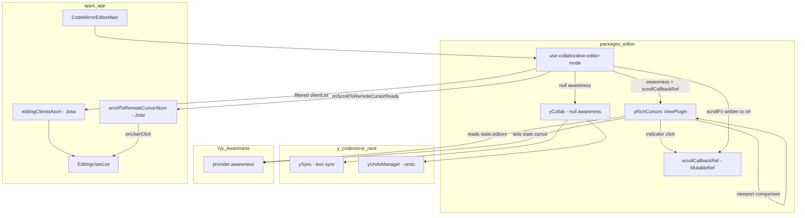
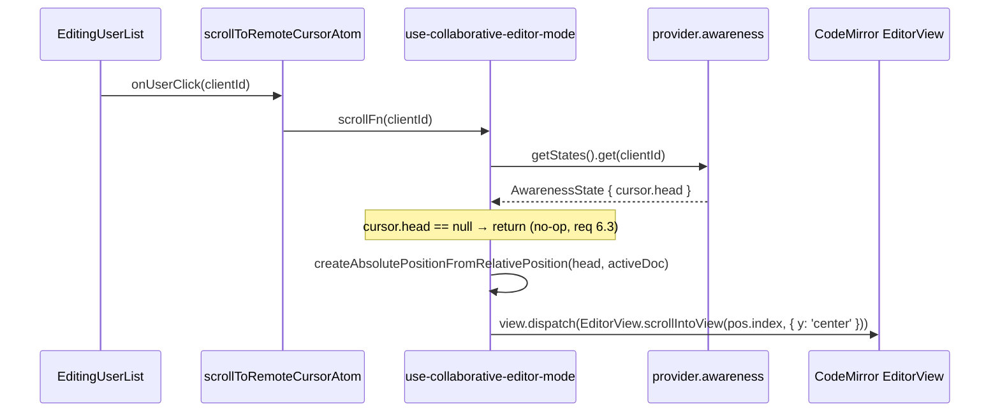
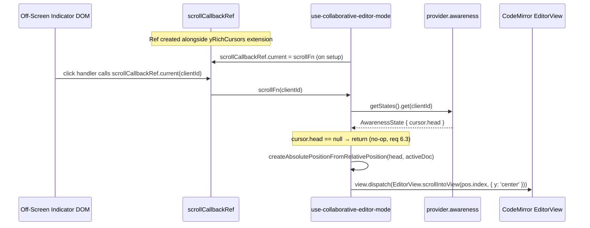
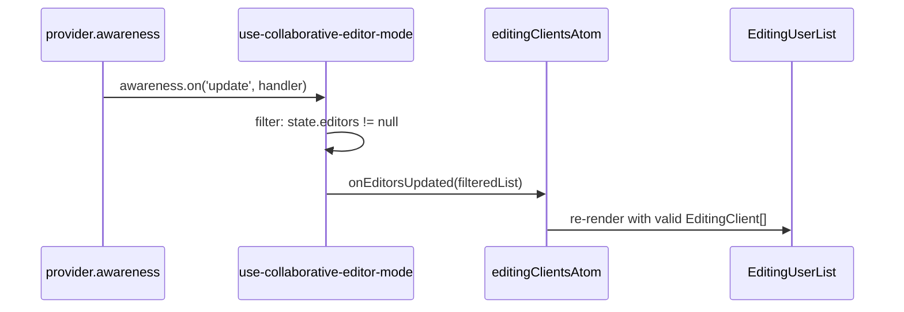
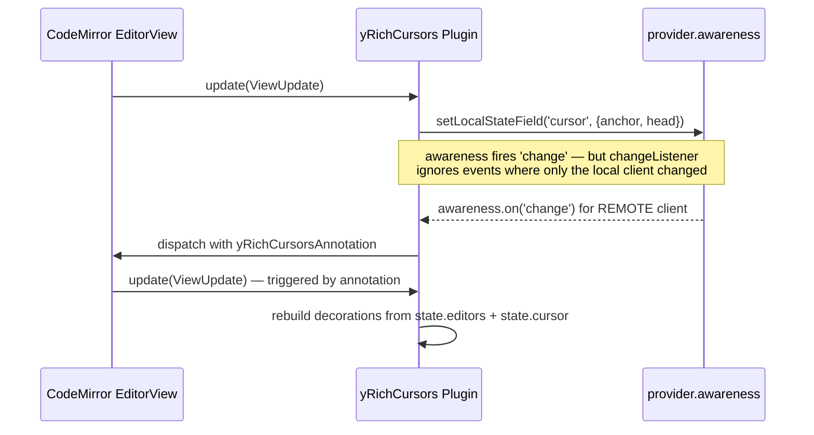

# Design Document: collaborative-editor-awareness

## Overview

**Purpose**: This feature fixes intermittent disappearance of the `EditingUserList` component, upgrades in-editor cursors to display a user's name and avatar, adds off-screen cursor indicators with click-to-scroll navigation, and surfaces username tooltips in `EditingUserList`.

**Users**: All GROWI users who use real-time collaborative page editing. They will see stable editing-user indicators, rich avatar-bearing cursor flags, off-screen indicators they can click to jump to a co-editor's position, and username tooltips on hover in the editing user list.

**Impact**: Modifies `use-collaborative-editor-mode` in `@growi/editor`, replaces the default `yRemoteSelections` cursor plugin with `yRichCursors`, adds off-screen click-to-scroll via a mutable ref pattern, and enhances `EditingUserList` with color-matched borders, click-to-scroll, and username tooltips.

### Goals

- Eliminate `EditingUserList` disappearance caused by `undefined` entries from uninitialized awareness states
- Remove incorrect direct mutation of Yjs-managed `awareness.getStates()` map
- Render remote cursors with display name and profile image avatar
- Read user data exclusively from `state.editors` (GROWI's canonical awareness field), eliminating the current `state.user` mismatch
- Enable click-to-scroll on both `EditingUserList` avatars and off-screen cursor indicators
- Display username tooltips on `EditingUserList` avatar hover without reintroducing the HOC Fragment layout issue

### Non-Goals

- Server-side awareness bridging (covered in `collaborative-editor` spec)
- Upgrading `y-codemirror.next` or `yjs`
- Cursor rendering for the local user's own cursor

## Architecture

### Existing Architecture Analysis

The current flow has two defects:

1. **`emitEditorList` in `use-collaborative-editor-mode`**: maps `awareness.getStates().values()` to `value.editors`, producing `undefined` for any client whose awareness state has not yet included an `editors` field. The `Array.isArray` guard is always true and does not filter. `EditingUserList` then receives a list containing `undefined`, leading to a React render error that wipes the component.

2. **Cursor field mismatch**: `yCollab(activeText, provider.awareness, { undoManager })` adds `yRemoteSelections`, which reads `state.user.name` and `state.user.color`. GROWI sets `state.editors` (not `state.user`). The result is that all cursors render as "Anonymous" with a default blue color. This is also fixed by the new design.

### Architecture Pattern & Boundary Map



**Key architectural properties**:
- `yCollab` is called with `null` awareness to suppress the built-in `yRemoteSelections` plugin; text-sync (`ySync`) and undo (`yUndoManager`) are not affected
- `yRichCursors` is added as a separate extension alongside `yCollab`'s output; it owns all awareness-cursor interaction, including in-viewport widget rendering and off-screen indicators
- `state.editors` remains the single source of truth for user identity data
- `state.cursor` (anchor/head relative positions) continues to be used for cursor position broadcasting, consistent with `y-codemirror.next` convention
- Off-screen indicators are managed within the same `yRichCursors` ViewPlugin — it compares each remote cursor's absolute position against `view.visibleRanges` (the actually visible content range, excluding CodeMirror's pre-render buffer) to decide between widget decoration (in-view) and DOM overlay (off-screen)
- **`scrollCallbackRef`** is a `{ current: ((clientId: number) => void) | null }` mutable object created once alongside the `yRichCursors` extension. Because the scroll function is created in a separate `useEffect` from the extension instantiation, passing it as a plain value would require recreating the extension on every update. The mutable ref allows `yRichCursors` to hold a stable reference to the container while the hook silently updates `.current` when the scroll function is registered or cleared.

**Dual-path scroll delivery — why both `scrollCallbackRef` and `onScrollToRemoteCursorReady` coexist**:

The scroll-to-remote-cursor function has two independent consumers that live in fundamentally different runtime contexts:

| Consumer | Context | Why this delivery mechanism |
|----------|---------|----------------------------|
| Off-screen indicator (DOM click) | CodeMirror `ViewPlugin` — vanilla JS, not a React component | Cannot call React hooks (`useAtomValue`) to read a Jotai atom. Needs a plain mutable ref whose `.current` is read at click time. |
| `EditingUserList` avatar click | React component in `apps/app` | Needs a React-compatible state update (Jotai atom) so that `EditorNavbar` re-renders when the scroll function becomes available. A mutable ref change does not trigger re-render. |

Consolidating into a single mechanism is not feasible:
- **Ref-only**: React components that read `useRef` do not re-render when `.current` changes; `EditorNavbar` would receive `null` on initial render and never update.
- **Atom-only**: `yRichCursors` is a CodeMirror `ViewPlugin` class (not a React component) and cannot call `useAtomValue`. Importing the atom directly from `apps/app` into `packages/editor` would violate the monorepo dependency direction (lower package must not depend on higher).
- **Event-emitter**: Considered as an alternative to the callback prop chain. A typed event emitter (e.g., `mitt`) would replace the two callback props (`onEditorsUpdated`, `onScrollToRemoteCursorReady`) with a single event bus prop. However, with only two events, the abstraction cost outweighs the benefit: event emitters introduce implicit coupling (string-keyed subscriptions are harder to trace and not caught by the compiler if one side is renamed), require manual subscribe/unsubscribe lifecycle management (risk of stale handler leaks), and add an external dependency — all for marginal reduction in prop drilling (2 → 1).

The `onScrollToRemoteCursorReady` callback follows the same pattern as the existing `onEditorsUpdated` callback, which also bridges `packages/editor` → `apps/app` across the package boundary via props.

### Technology Stack

| Layer | Choice / Version | Role in Feature | Notes |
|-------|------------------|-----------------|-------|
| Editor extensions | `y-codemirror.next@0.3.5` | `yCollab` for text-sync and undo; `yRemoteSelectionsTheme` for base caret CSS | No version change; `yRemoteSelections` no longer used |
| Cursor rendering | CodeMirror `ViewPlugin` + `WidgetType` (`@codemirror/view`) | DOM-based cursor widget with avatar `` | No new dependency |
| Awareness | `y-websocket` `awareness` object | State read (`getStates`) and write (`setLocalStateField`) | `Awareness` type derived via `WebsocketProvider['awareness']` — `y-protocols` is not a direct dependency |

## System Flows

### Click-to-Scroll Flow — EditingUserList Avatar (Requirements 6.1–6.5)



**Key design decisions**:
- `scrollFn` closes over `codeMirrorEditor` (accessed lazily via `codeMirrorEditor?.view` at call time) so late-mounted editors are handled correctly.
- `activeDoc` (Y.Doc) is captured in the same effect that creates `scrollFn`; the function is invalidated and recreated whenever `activeDoc` or `provider` changes.
- If `cursor.head` is absent (user connected but not focused), the click is silently ignored per requirement 6.3.

### Click-to-Scroll Flow — Off-Screen Indicator (Requirements 6.6–6.7)



**Key design decisions for off-screen click**:
- `scrollCallbackRef` is a plain object `{ current: Fn | null }` created with `useRef` in `use-collaborative-editor-mode` and passed to `yRichCursors(awareness, { onClickIndicator: scrollCallbackRef })`. This is the standard React mutable-ref pattern but without the React import constraint (the `packages/editor` package uses it as a plain typed object).
- The extension is created once; the ref's `.current` value is updated silently by the hook's scroll-function `useEffect`. This avoids recreating CodeMirror extensions on every provider change.
- `createOffScreenIndicator` receives `clientId` and `onClick` callback, attaching a `click` event listener that calls `onClick(clientId)`. The indicator element has `cursor: pointer` via the theme CSS or inline style.

### Awareness Update → EditingUserList



The filter (`value.editors != null`) ensures `EditingUserList` never receives `undefined` entries. The `.delete()` call on `getStates()` is removed; Yjs clears stale entries before emitting `update`.

### Cursor Render Cycle



**Annotation-driven update strategy**: The awareness `change` listener does not call `view.dispatch()` unconditionally — doing so would crash with "Calls to EditorView.update are not allowed while an update is in progress" because `setLocalStateField` in the `update()` method itself triggers an awareness `change` event synchronously. Instead, the listener filters by `clientID`: it dispatches (with a `yRichCursorsAnnotation`) only when at least one **remote** client's state has changed. Local-only awareness changes (from the cursor broadcast in the same `update()` cycle) are silently ignored, and the decoration set is rebuilt in the next `update()` call naturally.

## Requirements Traceability

| Requirement | Summary | Components | Key Interfaces |
|-------------|---------|------------|----------------|
| 1.1 | Filter undefined awareness entries | `use-collaborative-editor-mode` | `emitEditorList` filter |
| 1.2 | Remove `getStates().delete()` mutation | `use-collaborative-editor-mode` | `updateAwarenessHandler` |
| 1.3 | EditingUserList remains stable | `use-collaborative-editor-mode` → `editingClientsAtom` | `onEditorsUpdated` callback |
| 1.4 | Skip entries without `editors` field | `use-collaborative-editor-mode` | `emitEditorList` filter |
| 2.1 | Broadcast user presence via awareness | `use-collaborative-editor-mode` | `awareness.setLocalStateField('editors', ...)` |
| 2.2–2.3 | Socket.IO awareness events (server) | Out of scope — `collaborative-editor` spec | — |
| 2.4 | Display active editors | `EditingUserList` (unchanged) | — |
| 3.1 | Avatar overlay below caret (no block space) | `yRichCursors` | `RichCaretWidget.toDOM()` — `position: absolute` overlay |
| 3.2 | Avatar size (`AVATAR_SIZE` in `theme.ts`) | `yRichCursors` | `RichCaretWidget.toDOM()` — CSS sizing via shared token |
| 3.3 | Name label visible on hover only | `yRichCursors` | CSS `:hover` on `.cm-yRichCursorFlag` |
| 3.4 | Avatar image with initials fallback | `yRichCursors` | `RichCaretWidget.toDOM()` — `` onerror → initials |
| 3.5 | Cursor caret color, fallback background, and avatar border from `state.editors.color` | `yRichCursors` | `RichCaretWidget` constructor + `borderColor` inline style |
| 3.6 | Custom cursor via replacement plugin | `yRichCursors` replaces `yRemoteSelections` | `yCollab(activeText, null, { undoManager })` |
| 3.7 | Cursor updates on awareness change | `yRichCursors` awareness change listener | `awareness.on('change', ...)` |
| 3.8 | Default semi-transparent avatar | `yRichCursors` | CSS `opacity` on `.cm-yRichCursorFlag` |
| 3.9 | Full opacity on hover | `yRichCursors` | CSS `:hover` rule |
| 3.10 | Full opacity during active editing (3s) | `yRichCursors` | `lastActivityMap` + `.cm-yRichCursorActive` class + `setTimeout` |
| 4.1 | Off-screen indicator at top edge with `arrow_drop_up` above avatar | `yRichCursors` | `topContainer` + Material Symbol icon |
| 4.2 | Off-screen indicator at bottom edge with `arrow_drop_down` below avatar | `yRichCursors` | `bottomContainer` + Material Symbol icon |
| 4.3 | No indicator when cursor is in viewport | `yRichCursors` | multi-mode classification in `update()` (rangedMode / coords mode) |
| 4.4 | Same avatar/color as in-editor widget | `yRichCursors` | shared `state.editors` data |
| 4.5 | Indicators positioned at cursor's column | `yRichCursors` | `requestMeasure` → `coordsAtPos` → `left: Xpx; transform: translateX(-50%)` |
| 4.6 | Transition on scroll (indicator ↔ widget) | `yRichCursors` | classification re-run on every `update()` |
| 4.7 | Overlay positioning (no layout impact) | `yRichCursors` | `position: absolute` on `view.dom` |
| 4.8 | Indicator X position derived from cursor column | `yRichCursors` | `view.coordsAtPos` (measure phase) or char-width fallback |
| 4.9 | Arrow always fully opaque in cursor color; avatar fades when idle | `yRichCursors` | `opacity: 1` on `.cm-offScreenArrow`; `opacity: IDLE_OPACITY` on avatar/initials |
| 5.1 | Avatar border color = `editingClient.color` (replaces fixed `border-info`) | `EditingUserList` | Wrapper `<span>` with `style={{ border: '2px solid {color}', borderRadius: '50%' }}` |
| 5.2 | Border weight equivalent to existing border | `EditingUserList` | 2 px solid, same as Bootstrap `border` baseline |
| 5.3 | Color-matched border in overflow popover | `EditingUserList` | Replace `UserPictureList` with inline rendering sharing the same wrapper pattern |
| 6.1 | Click avatar → editor scrolls to that user's cursor | `EditingUserList` + `use-collaborative-editor-mode` | `onUserClick(clientId)` → `scrollFn` → `view.dispatch(scrollIntoView)` |
| 6.2 | Scroll centers cursor vertically | `use-collaborative-editor-mode` | `EditorView.scrollIntoView(pos, { y: 'center' })` |
| 6.3 | No-op when cursor absent from awareness | `use-collaborative-editor-mode` | Guard: `cursor?.head == null → return` |
| 6.4 | `cursor: pointer` on each avatar | `EditingUserList` | CSS `cursor: pointer` on the clickable wrapper element |
| 6.5 | Overflow popover avatars also support click-to-scroll | `EditingUserList` | Inline rendering in popover body shares same `onUserClick` prop |
| 6.6 | Click off-screen indicator → scroll to remote cursor | `yRichCursors` + `use-collaborative-editor-mode` | `scrollCallbackRef.current(clientId)` → same `scrollFn` path as 6.1–6.3 |
| 6.7 | `cursor: pointer` on each off-screen indicator | `yRichCursors` | `cursor: pointer` via theme or inline style in `createOffScreenIndicator` |
| 7.1 | Tooltip shows display name on avatar hover in EditingUserList | `UserPicture` (refactored) | Built-in tooltip renders `@username` + display name via portal child |
| 7.2 | Tooltip on both direct and overflow popover avatars | `EditingUserList` | `noTooltip` removed from `UserPicture`; tooltip renders automatically for all avatars |
| 7.3 | Tooltip coexists with color-matched border and click-to-scroll | `UserPicture` (refactored) | Tooltip is a portal child of the root `<span>`; no Fragment siblings to disturb flex layout |
| 7.4 | Tooltip mechanism does not use `UserPicture` HOC | `UserPicture` (refactored) | `withTooltip` HOC eliminated; tooltip inlined in `UserPicture` render function |
| 7.5 | Tooltip appears with hover-intent delay; disappears on pointer leave | `UserPicture` (refactored) | `UncontrolledTooltip` with `delay={0}` and `fade={false}` (existing behavior preserved) |

## Components and Interfaces

| Component | Domain/Layer | Intent | Req Coverage | Key Dependencies (P0) | Contracts |
|-----------|--------------|--------|--------------|----------------------|-----------|
| `use-collaborative-editor-mode` | packages/editor — Hook | Fix awareness filter bug; compose extensions with rich cursor; expose scroll-to-remote-cursor callback; own `scrollCallbackRef` lifecycle | 1.1–1.4, 2.1, 2.4, 6.1–6.3, 6.6 | `yCollab` (P0), `yRichCursors` (P0) | State |
| `yRichCursors` | packages/editor — Extension | Custom ViewPlugin: broadcasts local cursor position, renders in-viewport cursors with overlay avatar+hover name+activity opacity, renders clickable off-screen indicators at editor edges | 3.1–3.10, 4.1–4.9, 6.6, 6.7 | `@codemirror/view` (P0), `y-websocket awareness` (P0) | Service |
| `CodeMirrorEditorMain` | packages/editor — Component | Bridge: passes `onScrollToRemoteCursorReady` prop from apps/app into `useCollaborativeEditorMode` | 6.1 | `useCollaborativeEditorMode` (P0) | State |
| `scrollToRemoteCursorAtom` | apps/app — Jotai atom | Stores the scroll callback registered by `useCollaborativeEditorMode`; read by EditorNavbar | 6.1 | `jotai` (P0) | State |
| `UserPicture` | packages/ui — Component | Refactored: eliminates `withTooltip` HOC; renders tooltip as portal child of root `<span>` instead of Fragment sibling | 7.1, 7.3–7.5 | `UncontrolledTooltip` (P1) | View |
| `EditingUserList` | apps/app — Component | Renders active editor avatars with color-matched borders, click-to-scroll; tooltips via native `UserPicture` (no `noTooltip`) | 5.1–5.3, 6.1, 6.4–6.5, 7.2 | `EditingClient[]` (P0) | View |

### packages/editor — Hook

#### `use-collaborative-editor-mode` (modified)

| Field | Detail |
|-------|--------|
| Intent | Orchestrates WebSocket provider, awareness, and CodeMirror extension lifecycle for collaborative editing |
| Requirements | 1.1, 1.2, 1.3, 1.4, 2.1, 2.4, 6.1–6.3, 6.6 |

**Responsibilities & Constraints**
- Filters `undefined` awareness entries before calling `onEditorsUpdated`
- Does not mutate `awareness.getStates()` directly
- Composes `yCollab(null)` + `yRichCursors(awareness, { onClickIndicator: scrollCallbackRef })` to achieve text-sync, undo, rich cursor rendering, and off-screen indicator click handling
- Creates and registers a `scrollFn` callback (requirement 6) that resolves a remote user's cursor position and dispatches a CodeMirror scroll effect
- Owns the `scrollCallbackRef` lifecycle: writes `scrollFn` to `scrollCallbackRef.current` when the scroll function is ready; writes `null` on cleanup

**Dependencies**
- Outbound: `yCollab` from `y-codemirror.next` — text-sync and undo (P0)
- Outbound: `yRichCursors` — rich cursor rendering (P0)
- Outbound: `provider.awareness` — read states, set local state (P0)
- Outbound: `EditorView.scrollIntoView` — scroll dispatch (P0)

**Contracts**: State [x]

##### State Management

- **Bug fix — `emitEditorList`**:
  ```
  Before: Array.from(getStates().values(), v => v.editors)   // contains undefined
  After:  Array.from(getStates().values())
            .map(v => v.editors)
            .filter((v): v is EditingClient => v != null)
  ```
- **Bug fix — `updateAwarenessHandler`**: Remove `awareness.getStates().delete(clientId)` for all `update.removed` entries; Yjs removes them before emitting the event.
- **Extension composition change**:
  ```
  Before: yCollab(activeText, provider.awareness, { undoManager })
  After:  [
            yCollab(activeText, null, { undoManager }),
            yRichCursors(provider.awareness),
          ]
  ```
  Note: `yCollab` already includes `yUndoManagerKeymap` in its return array, so it must NOT be added separately to avoid keymap duplication. Verify during implementation by inspecting the return value of `yCollab`.

**Implementation Notes**
- Integration: `yCollab` with `null` awareness suppresses `yRemoteSelections` and `yRemoteSelectionsTheme`. Text-sync (`ySync`) and undo (`yUndoManager`) are not affected by the null awareness value.
- Risks: If `y-codemirror.next` is upgraded, re-verify that passing `null` awareness still suppresses only the cursor plugins.

##### Configuration Type Extension (Requirements 6, 6.6)

```typescript
type Configuration = {
  user?: IUserHasId;
  pageId?: string;
  reviewMode?: boolean;
  onEditorsUpdated?: (clientList: EditingClient[]) => void;
  // called with the scroll function when provider+ydoc are ready; null on cleanup
  onScrollToRemoteCursorReady?: (fn: ((clientId: number) => void) | null) => void;
};
```

**`scrollCallbackRef` pattern** (new for req 6.6):

```typescript
// Defined inside useCollaborativeEditorMode, created once per hook mount
const scrollCallbackRef: { current: ((clientId: number) => void) | null } = useRef(null);

// Extension creation effect (depends on provider, activeDoc, codeMirrorEditor)
// scrollCallbackRef is captured by reference — stable across provider changes
yRichCursors(provider.awareness, { onClickIndicator: scrollCallbackRef })

// Scroll function registration effect (same dependencies)
scrollCallbackRef.current = scrollFn;   // updated silently — no extension recreation
onScrollToRemoteCursorReady?.(scrollFn);

// Cleanup
scrollCallbackRef.current = null;
onScrollToRemoteCursorReady?.(null);
```

The `scrollFn` is shared by both paths (avatar click via atom, indicator click via ref). Its logic:

```
scrollFn(clientId: number):
  1. view = codeMirrorEditor?.view          → undefined → return (editor not mounted)
  2. rawState = awareness.getStates().get(clientId) as AwarenessState | undefined
  3. cursor?.head == null                   → return (req 6.3: no-op)
  4. absPos = Y.createAbsolutePositionFromRelativePosition(cursor.head, activeDoc)
  5. absPos == null                         → return
  6. view.dispatch({ effects: EditorView.scrollIntoView(absPos.index, { y: 'center' }) })
```

---

### packages/editor — Extension

#### `yRichCursors` (new)

| Field | Detail |
|-------|--------|
| Intent | CodeMirror ViewPlugin — broadcasts local cursor position, renders in-viewport cursors with overlay avatar and hover-revealed name, renders clickable off-screen indicators pinned to editor edges for cursors outside the viewport |
| Requirements | 3.1–3.10, 4.1–4.9, 6.6, 6.7 |

**Responsibilities & Constraints**
- On each `ViewUpdate`: derives local cursor anchor/head → converts to Yjs relative positions → calls `awareness.setLocalStateField('cursor', { anchor, head })` (matches `state.cursor` convention from `y-codemirror.next`)
- On awareness `change` event: rebuilds decoration set reading `state.editors` (color, name, imageUrlCached) and `state.cursor` (anchor, head) for each remote client
- Does NOT render a cursor for the local client (`clientid === awareness.doc.clientID`)
- Selection highlight (background color from `state.editors.colorLight`) is rendered alongside the caret widget

**Dependencies**
- External: `@codemirror/view` `ViewPlugin`, `WidgetType`, `Decoration`, `EditorView` (P0)
- External: `@codemirror/state` `RangeSet`, `Annotation` (P0) — `Annotation.define<number[]>()` used for `yRichCursorsAnnotation`
- External: `yjs` `createRelativePositionFromTypeIndex`, `createAbsolutePositionFromRelativePosition` (P0)
- External: `y-codemirror.next` `ySyncFacet` (to access `ytext` for position conversion) (P0)
- External: `y-websocket` — `Awareness` type derived via `WebsocketProvider['awareness']` (not `y-protocols/awareness`, which is not a direct dependency) (P0)
- Inbound: `provider.awareness` passed as parameter (P0)

**Contracts**: Service [x]

##### Service Interface

```typescript
/** Mutable ref container for the scroll-to-remote-cursor function. */
type ScrollCallbackRef = { current: ((clientId: number) => void) | null };

/** Options for the yRichCursors extension. */
type YRichCursorsOptions = {
  /**
   * Mutable ref holding the scroll-to-remote-cursor callback.
   * When set, off-screen indicator clicks invoke ref.current(clientId).
   * Null or unset means clicks are no-ops.
   */
  onClickIndicator?: ScrollCallbackRef;
};

/**
 * Creates a CodeMirror Extension that renders remote user cursors with
 * name labels and avatar images, reading user data from state.editors.
 * Also broadcasts the local user's cursor position via state.cursor.
 * Renders clickable off-screen indicators for cursors outside the viewport.
 */
export function yRichCursors(awareness: Awareness, options?: YRichCursorsOptions): Extension;
```

Preconditions:
- `awareness` is an active `y-websocket` Awareness instance
- `ySyncFacet` is installed by a preceding `yCollab` call so that `ytext` can be resolved for position conversion
- If `options.onClickIndicator` is provided, `onClickIndicator.current` must be set before any indicator click occurs (typically set synchronously by `use-collaborative-editor-mode` in the scroll-function registration effect)

Postconditions:
- Remote cursors within the visible viewport are rendered as `cm-yRichCaret` widget decorations at each remote client's head position
- Remote cursors outside the visible viewport are rendered as off-screen indicator overlays pinned to the top or bottom edge of `view.dom`; each indicator responds to click events by invoking `options.onClickIndicator?.current(clientId)` 
- Local cursor position is broadcast to awareness as `state.cursor.{ anchor, head }` on each focus-selection change

Invariants:
- Local client's own cursor is never rendered
- Cursor decorations are rebuilt when awareness `change` fires for **remote** clients (dispatched via `yRichCursorsAnnotation`); local-only changes are ignored to prevent recursive `dispatch` during an in-progress update
- `state.cursor` field is written exclusively by `yRichCursors`; no other plugin or code path may call `awareness.setLocalStateField('cursor', ...)` to avoid data races
- Off-screen indicator click is a no-op when `options.onClickIndicator` is undefined or `.current` is null

##### Widget DOM Structure

```
<span class="cm-yRichCaret" style="border-color: {color}">
  ⁠ <!-- Word Joiner (\u2060): inherits line font-size so caret height follows headers -->
  <span class="cm-yRichCursorFlag [cm-yRichCursorActive]">
    
      OR  <span class="cm-yRichCursorInitials" style="background-color: {color}; border-color: {color}" />
    <span class="cm-yRichCursorInfo" style="background-color: {color}">{name}</span>
  </span>
</span>
```

**CSS strategy**: Applied via `EditorView.baseTheme` in `theme.ts`, exported alongside the ViewPlugin.

Key design decisions:
- **Caret**: Both-side 1px borders with negative margins (zero layout width). Modeled after `yRemoteSelectionsTheme` in `y-codemirror.next`.
- **Overlay flag**: `position: absolute; top: 100%` below the caret. Always hoverable (no `pointer-events: none`), so the avatar is a direct hover target.
- **Name label**: Positioned at `left: 0; z-index: -1` (behind the avatar). Left border-radius matches the avatar circle, creating a tab shape that flows from the avatar. Left padding clears the avatar width. Shown on `.cm-yRichCursorFlag:hover`.
- **Opacity**: `cm-yRichCursorFlag` carries `opacity: IDLE_OPACITY` and transitions to `opacity: 1` on hover or `.cm-yRichCursorActive` (3-second activity window).
- **Avatar border**: `1.5px solid` border in the cursor's `color` with `box-sizing: border-box` so the 20×20 outer size is preserved. Applied via inline `style.borderColor` in `toDOM()` / `createInitialsElement()`.
- **Design tokens**: `AVATAR_SIZE = '20px'` and `IDLE_OPACITY = '0.6'` are defined at the top of `theme.ts` and shared across all cursor/off-screen styles.

**Design decision — CSS-only, no React**: The overlay, sizing, and hover behavior are achievable with `position: absolute` and `:hover`. `document.createElement` in `toDOM()` avoids React's async rendering overhead and context isolation.

**Activity tracking** (JavaScript, within `YRichCursorsPluginValue`):
- `lastActivityMap: Map<number, number>` — `clientId` → timestamp of last awareness change
- `activeTimers: Map<number, ReturnType<typeof setTimeout>>` — per-client 3-second inactivity timers
- On awareness `change` for remote clients: update timestamp, reset timer. Timer expiry dispatches with `yRichCursorsAnnotation` to trigger decoration rebuild.
- `isActive` is passed to both `RichCaretWidget` and off-screen indicators. `eq()` includes `isActive` so state transitions trigger widget re-creation (at most twice per user per 3-second cycle).

`RichCaretWidget` (extends `WidgetType`):
- Constructor: `RichCaretWidgetOptions` object (`color`, `name`, `imageUrlCached`, `isActive`)
- `toDOM()`: creates the DOM tree above; `onerror` on `` replaces with initials fallback
- `eq(other)`: true when all option fields match
- `estimatedHeight`: `-1` (inline widget), `ignoreEvent()`: `true`

Selection highlight: `Decoration.mark` on selected range with `background-color: {colorLight}`.

##### Off-Screen Cursor Indicators

When a remote cursor's absolute position falls outside the actually visible viewport, the ViewPlugin renders an off-screen indicator instead of a widget decoration.

**Viewport classification — multi-mode strategy**: Because `view.visibleRanges` and `view.viewport` are equal in GROWI's page-scroll editor setup (the editor expands to full content height; the browser page handles scrolling), a single character-position comparison is insufficient. The plugin uses three modes, chosen once per `update()` call:

| Mode | Condition | Method |
|------|-----------|--------|
| **rangedMode** | `visibleRanges` is a non-empty, non-trivial sub-range of `viewport` (internal-scroll editor, or jsdom tests with styled heights) | Compare `headIndex` against `visibleRanges[0].from` / `visibleRanges[last].to` |
| **coords mode** | `visibleRanges == viewport` AND `scrollDOM.getBoundingClientRect().height > 0` (GROWI's page-scroll production setup) | `lineBlockAt(headIndex)` + `scrollDOMRect.top` vs `window.innerHeight` |
| **degenerate** | `scrollRect.height == 0` (jsdom with 0-height container) | No off-screen classification; every cursor gets a widget decoration |

`view.lineBlockAt()` reads stored height-map data (safe to call in `update()`). `scrollDOM.getBoundingClientRect()` is a raw DOM call, not restricted by CodeMirror's "Reading the editor layout isn't allowed during an update" guard.

**DOM management**: The ViewPlugin creates two persistent container elements (`topContainer`, `bottomContainer`) and appends them to `view.dom` in the `constructor`. They are removed in `destroy()`. The containers are always present in the DOM but empty when no off-screen cursors exist in that direction.

```
view.dom (position: relative — already set by CodeMirror)
├── .cm-scroller (managed by CM)
│   └── .cm-content ...
├── .cm-offScreenTop    ← topContainer (absolute, top: 0, height: AVATAR_SIZE + 14px)
│   ├── .cm-offScreenIndicator  style="left: {colX}px; transform: translateX(-50%)"
│   │   ├── .cm-offScreenArrow (material-symbols-outlined) — "arrow_drop_up"
│   │   └── .cm-offScreenAvatar / .cm-offScreenInitials
│   └── .cm-offScreenIndicator  (another user, different column)
└── .cm-offScreenBottom ← bottomContainer (absolute, bottom: 0, height: AVATAR_SIZE + 14px)
    └── .cm-offScreenIndicator  style="left: {colX}px; transform: translateX(-50%)"
        ├── .cm-offScreenAvatar / .cm-offScreenInitials
        └── .cm-offScreenArrow (material-symbols-outlined) — "arrow_drop_down"
```

**`OffScreenIndicatorOptions` type extension** (req 6.6, 6.7):

```typescript
export type OffScreenIndicatorOptions = {
  direction: 'above' | 'below';
  clientId: number;                          // NEW: identifies user for click handler
  color: string;
  name: string;
  imageUrlCached: string | undefined;
  isActive: boolean;
  onClick?: (clientId: number) => void;      // NEW: invoked on indicator click
};
```

`createOffScreenIndicator` attaches a `click` event listener on the root `<span>` element that calls `onClick(clientId)`. The indicator root element also receives `style.cursor = 'pointer'` when `onClick` is provided, satisfying req 6.7.

**Indicator DOM structure** (built by `createOffScreenIndicator()` in `off-screen-indicator.ts`):
- **above**: `[arrow_drop_up icon][avatar or initials]` stacked vertically (flex-column)
- **below**: `[avatar or initials][arrow_drop_down icon]` stacked vertically (flex-column)
- Arrow element: `<span class="material-symbols-outlined cm-offScreenArrow" style="color: {color}">arrow_drop_up</span>` — font loaded via `var(--grw-font-family-material-symbols-outlined)` (Next.js-registered Material Symbols Outlined)
- Avatar: same `borderColor`, `AVATAR_SIZE`, and onerror→initials fallback as in-editor widget
- Opacity: arrow always `opacity: 1`; avatar/initials use `IDLE_OPACITY` → `1` via `.cm-yRichCursorActive` on the indicator

**Horizontal positioning** (deferred to measure phase):
After `replaceChildren()`, the plugin calls `view.requestMeasure()`:
- **read phase**: for each indicator, call `view.coordsAtPos(headIndex, 1)` to get screen X. If null (virtualized position), fall back to `contentDOM.getBoundingClientRect().left + col * view.defaultCharacterWidth`.
- **write phase**: set `indicator.style.left = Xpx` and `indicator.style.transform = 'translateX(-50%)'` to center the indicator on the cursor column.

**Update cycle**:
1. Classify all remote cursors (mode-dependent: rangedMode/coords/degenerate)
2. Build `aboveIndicators: {el, headIndex}[]` and `belowIndicators: {el, headIndex}[]`
3. `topContainer.replaceChildren(...aboveIndicators.map(i => i.el))`; same for bottom
4. If any indicators exist, call `view.requestMeasure()` to set horizontal positions
5. Cursors that lack `state.cursor` or `state.editors` are excluded from both in-view and off-screen rendering

**Implementation Notes**
- Integration: file location `packages/editor/src/client/services-internal/extensions/y-rich-cursors/` (directory — split into `index.ts`, `plugin.ts`, `widget.ts`, `off-screen-indicator.ts`, `theme.ts`); exported from `packages/editor/src/client/services-internal/extensions/index.ts` and consumed directly in `use-collaborative-editor-mode.ts`
- Validation: `imageUrlCached` is optional; if undefined or empty, the `` element is skipped and only initials are shown
- Risks: `ySyncFacet` must be present in the editor state when the plugin initializes; guaranteed since `yCollab` (which installs `ySyncFacet`) is added before `yRichCursors` in the extension array

---

### apps/app — Jotai Atom

#### `scrollToRemoteCursorAtom` (new)

| Field | Detail |
|-------|--------|
| Intent | Stores the scroll-to-remote-cursor callback registered by `useCollaborativeEditorMode`; consumed by `EditorNavbar` → `EditingUserList` |
| Requirements | 6.1 |

**File**: `apps/app/src/states/ui/editor/scroll-to-remote-cursor.ts`

```typescript
const scrollToRemoteCursorAtom = atom<((clientId: number) => void) | null>(null);

/** Read the scroll callback (null when collaboration is not active) */
export const useScrollToRemoteCursor = (): ((clientId: number) => void) | null =>
  useAtomValue(scrollToRemoteCursorAtom);

/** Register or clear the scroll callback.
 *  Wraps the raw setAtom call to prevent Jotai from treating a function
 *  value as an updater.  Jotai's `setAtom(fn)` signature interprets `fn`
 *  as `(prev) => next`; passing `setAtom(() => fn)` forces it to store
 *  the function value itself instead of invoking it. */
export const useSetScrollToRemoteCursor = (): ((
  fn: ((clientId: number) => void) | null,
) => void) => {
  const setAtom = useSetAtom(scrollToRemoteCursorAtom);
  return useCallback(
    (fn: ((clientId: number) => void) | null) => {
      setAtom(() => fn);
    },
    [setAtom],
  );
};
```

**Lifecycle**: set when `useCollaborativeEditorMode`'s extension effect runs, cleared on effect cleanup.

---

### packages/ui — Component

#### `UserPicture` (refactored)

| Field | Detail |
|-------|--------|
| Intent | Eliminate the `withTooltip` HOC that returns a React Fragment, replacing it with inline tooltip rendering as a portal child of the root `<span>` |
| Requirements | 7.1, 7.3–7.5 |

**Problem**: The current `withTooltip` HOC wraps `UserPictureRootWithoutLink`/`UserPictureRootWithLink` and returns a Fragment (`<> <span ref={ref}></span> <UncontrolledTooltip target={ref}/> </>`). When the HOC-wrapped `UserPicture` is placed inside a flex container (e.g., the `<button>` in `EditingUserList`), the Fragment's two React children can cause unpredictable flex layout behavior.

**Refactoring approach**: Eliminate the `withTooltip` HOC entirely. Render the tooltip inline within `UserPicture`'s render function as a child of the root `<span>`:

```typescript
export const UserPicture = memo((userProps: Props): JSX.Element => {
  const { user, size, noLink, noTooltip, className: additionalClassName } = userProps;
  // ... existing field extraction (username, displayName, src, className) ...

  const showTooltip = !noTooltip && hasName(user);
  const rootRef = useRef<HTMLSpanElement>(null);

  const tooltipClassName = `${moduleTooltipClass} user-picture-tooltip-${size ?? 'md'}`;

  const children = (
    <>
      {imgElement}
      {showTooltip && (
        <UncontrolledTooltip
          placement="bottom"
          target={rootRef}
          popperClassName={tooltipClassName}
          delay={0}
          fade={false}
        >
          {username ? <>{`@${username}`}<br /></> : null}
          {displayName}
        </UncontrolledTooltip>
      )}
    </>
  );

  if (username == null || noLink) {
    return (
      <UserPictureRootWithoutLink ref={rootRef} displayName={displayName} size={size}>
        {children}
      </UserPictureRootWithoutLink>
    );
  }

  return (
    <UserPictureRootWithLink ref={rootRef} displayName={displayName} size={size} username={username}>
      {children}
    </UserPictureRootWithLink>
  );
});
```

**Why this works**: `UncontrolledTooltip` (reactstrap) uses `ReactDOM.createPortal` to render tooltip markup into `document.body`. When placed as a child of the root `<span>`, it occupies no space in the parent's DOM — only the `` is a visible child. The root element is always a single `<span>`, regardless of whether the tooltip is shown. This eliminates the Fragment-induced flex layout issue.

**Key changes**:
- `withTooltip` HOC function: **deleted**
- `useRef` for tooltip targeting: moved from HOC into `UserPicture` render body (always called unconditionally — satisfies React hooks rules)
- `rootRef` is passed to `UserPictureRootWithoutLink`/`UserPictureRootWithLink` via `forwardRef` (they already support it)
- Tooltip content, `popperClassName`, `delay`, `fade` values: preserved from the existing HOC
- **`next/dynamic()` import: preserved** — the module-level `const UncontrolledTooltip = dynamic(() => import('reactstrap')..., { ssr: false })` is unchanged. This maintains the code-split boundary: reactstrap is loaded as a separate chunk only when the tooltip is actually rendered. Consumers passing `noTooltip` never trigger the chunk load.
- `UserPicture.module.scss`: **unchanged** (tooltip margin classes still referenced via `popperClassName`)
- `noTooltip` prop: **preserved** for consumers that intentionally suppress tooltips (e.g., sidebar dropdowns, inline notifications)

**Impact on existing consumers**: The public API (`Props`) is unchanged. The only observable difference is that the returned React element is always a single-root `<span>` (no Fragment), which is layout-safe in all container types (flex, grid, inline). Existing `noTooltip` usages continue to work.

---

### apps/app — Component

#### `EditingUserList` (modified)

| Field | Detail |
|-------|--------|
| Intent | Displays active editor avatars with color-matched borders, click-to-scroll, and username tooltips on hover |
| Requirements | 5.1–5.3, 6.1, 6.4–6.5, 7.1–7.5 |

**Props change**:

```typescript
type Props = {
  clientList: EditingClient[];
  onUserClick?: (clientId: number) => void;  // NEW: scroll-to-cursor callback
};
```

**Color-matched border (req 5.1–5.3)**:

`UserPicture` does not accept a `style` prop (the prop is applied to the `` tag, not the root element). A wrapper `<span>` with an inline border style is used instead:

```
<span
  style={{ border: `2px solid ${editingClient.color}`, borderRadius: '50%', display: 'inline-block' }}
>
  <UserPicture user={editingClient} noLink />
</span>
```

The `border border-info` className is removed from `UserPicture`.

**Click-to-scroll (req 6.1, 6.4)**:

Each avatar wrapper is made interactive:

```
<button
  type="button"
  style={{ cursor: 'pointer', background: 'none', border: 'none', padding: 0 }}
  onClick={() => onUserClick?.(editingClient.clientId)}
>
  <span style={{ border: `2px solid ${editingClient.color}`, borderRadius: '50%', display: 'inline-block' }}>
    <UserPicture user={editingClient} noLink />
  </span>
</button>
```

**Username tooltip (req 7.1–7.5)**:

Tooltips are provided by `UserPicture` natively, after the HOC refactoring (see `UserPicture` component section below). The `noTooltip` prop is **removed** from all `UserPicture` usages in `EditingUserList`. Because the refactored `UserPicture` renders the tooltip as a portal child of its root `<span>` (not a Fragment sibling), the tooltip coexists cleanly with the flex `<button>` wrapper.

```
// AvatarWrapper renders (simplified — no external tooltip needed):
<button
  type="button"
  data-testid={`avatar-wrapper-${client.clientId}`}
  className={`${avatarWrapperClass} d-inline-flex ...`}
  style={{ border: `2px solid ${client.color}` }}
  onClick={() => onUserClick?.(client.clientId)}
>
  <UserPicture user={client} noLink />
</button>
```

**Key decisions**:
- The same `AvatarWrapper` sub-component is reused for both the first-4 direct avatars and the overflow popover avatars, so the tooltip applies uniformly (req 7.2).
- No `id` attribute generation or external `UncontrolledTooltip` needed — the tooltip is fully encapsulated within `UserPicture`.

**Overflow popover (req 5.3, 6.5, 7.2)**:

`UserPictureList` (a generic legacy class component that does not accept `onUserClick` or color props) is replaced by inline rendering within `EditingUserList`, using the same `AvatarWrapper` sub-component for `remainingUsers`. This gives overflow avatars the same color border, click-to-scroll, and tooltip behavior.

**`EditorNavbar` wiring**:

```typescript
// EditorNavbar.tsx
const EditingUsers = (): JSX.Element => {
  const editingClients = useEditingClients();
  const scrollToRemoteCursor = useScrollToRemoteCursor();
  return (
    <EditingUserList
      clientList={editingClients}
      onUserClick={scrollToRemoteCursor ?? undefined}
    />
  );
};
```

**`PageEditor` wiring**:

```typescript
// PageEditor.tsx — existing hook setup
const setScrollToRemoteCursor = useSetScrollToRemoteCursor();
// ...
<CodeMirrorEditorMain
  onScrollToRemoteCursorReady={setScrollToRemoteCursor}
  // ...existing props
/>
```

## Data Models

### Domain Model

No new persistent data. The awareness state already carries all required fields via the `EditingClient` interface in `state.editors`.

```typescript
// Existing — no changes
type EditingClient = Pick<IUser, 'name'> &
  Partial<Pick<IUser, 'username' | 'imageUrlCached'>> & {
    clientId: number;
    userId?: string;
    color: string;       // cursor caret and flag background color
    colorLight: string;  // selection range highlight color
  };
```

The `state.cursor` awareness field follows the existing `y-codemirror.next` convention:
```typescript
type CursorState = {
  anchor: RelativePosition; // Y.RelativePosition JSON
  head: RelativePosition;
};
```

## Error Handling

| Error Type | Scenario | Response |
|------------|----------|----------|
| Missing `editors` field | Client connects but has not set awareness yet | Filtered out in `emitEditorList`; not rendered in `EditingUserList` |
| Avatar image load failure | `imageUrlCached` URL returns 4xx/5xx | `` `onerror` replaces element with initials `<span>` (colored circle with user initials) |
| `state.cursor` absent | Remote client connected but editor not focused | Cursor widget not rendered for that client (no `cursor.anchor` → skip) |
| `ySyncFacet` not installed | `yRichCursors` initialized before `yCollab` | Position conversion returns `null`; cursor is skipped for that update cycle. Extension array order in `use-collaborative-editor-mode` guarantees correct sequencing. |
| Off-screen container detached | `view.dom` removed from DOM before `destroy()` | `destroy()` calls `remove()` on both containers; if already detached, `remove()` is a no-op |
| Viewport not yet initialized | First `update()` before CM calculates viewport | `view.viewport` always has valid `from`/`to` from initialization; safe to compare |
| Click-to-scroll: view not mounted | `scrollFn` called before CodeMirror mounts | `codeMirrorEditor?.view == null` guard returns early; no crash |
| Click-to-scroll: cursor absent | Clicked user has no `cursor.head` in awareness | Guard `cursor?.head == null → return`; no-op per req 6.3 |
| Click-to-scroll: position unresolvable | `createAbsolutePositionFromRelativePosition` returns `null` (stale document state) | Guard `absPos == null → return`; no crash |

## Testing Strategy

Test files are co-located with source in `y-rich-cursors/`:
- **Unit**: `widget.spec.ts` (DOM structure, eq, fallback), `off-screen-indicator.spec.ts` (indicator DOM, direction, fallback)
- **Integration**: `plugin.integ.ts` (awareness filter, cursor broadcast, viewport classification, activity timers)
- **E2E** (Playwright, deferred): hover behavior, off-screen scroll transitions, pointer-events pass-through

### Additional Tests for Requirements 5, 6, 6.6–6.7, and 7

- **Unit — `UserPicture.spec.tsx`** (new or extended in `packages/ui`):
  - Without `noTooltip`: renders a single root `<span>` (no Fragment) containing `` and portal tooltip (req 7.4)
  - With `noTooltip`: renders a single root `<span>` containing only `` (existing behavior preserved)
  - Tooltip content includes `@username` and display name when both available (req 7.1)
  - Root element is flex-layout-safe (single child, not Fragment) (req 7.3)

- **Unit — `EditingUserList.spec.tsx`** (new or extended):
  - Renders a colored border wrapper matching `editingClient.color` (req 5.1)
  - Does not render `border-info` class (req 5.1)
  - Calls `onUserClick(clientId)` when avatar is clicked (req 6.1, 6.4)
  - Overflow popover avatars also call `onUserClick` (req 6.5)
  - `UserPicture` rendered without `noTooltip` (tooltip delegated to `UserPicture`) (req 7.2)

- **Integration — `use-collaborative-editor-mode` scroll test** (extended):
  - `onScrollToRemoteCursorReady` is called with a function when provider is set up
  - `scrollFn(clientId)` dispatches `scrollIntoView` to the view when cursor is available (req 6.1–6.2)
  - `scrollFn(clientId)` is a no-op when cursor is absent (req 6.3)
  - `scrollCallbackRef.current` is set when the scroll function is registered; cleared on cleanup (req 6.6)

- **Unit — `off-screen-indicator.spec.ts`** (extended):
  - Indicator root element has `cursor: pointer` when `onClick` is provided (req 6.7)
  - Clicking the indicator element invokes `onClick(clientId)` (req 6.6)
  - No click handler or `cursor: pointer` when `onClick` is not provided (boundary test)

- **Integration — `plugin.integ.ts`** (extended):
  - When `onClickIndicator` ref is set and an off-screen indicator is clicked, `ref.current` is invoked with the correct `clientId` (req 6.6)
  - When `onClickIndicator.current` is null, clicking an off-screen indicator does not throw (req 6.6, no-op guard)
