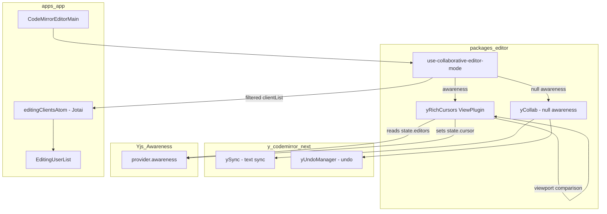
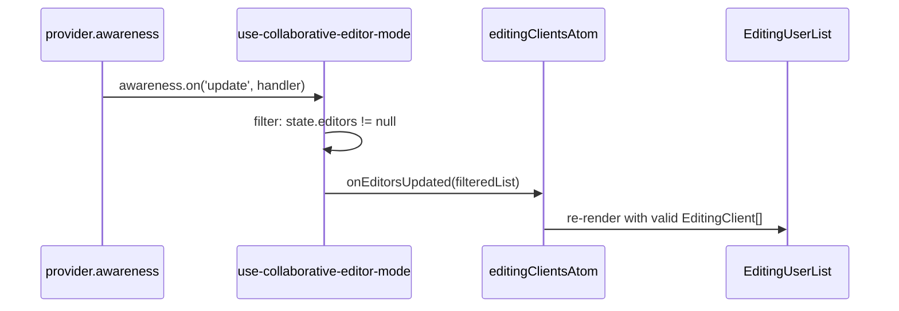
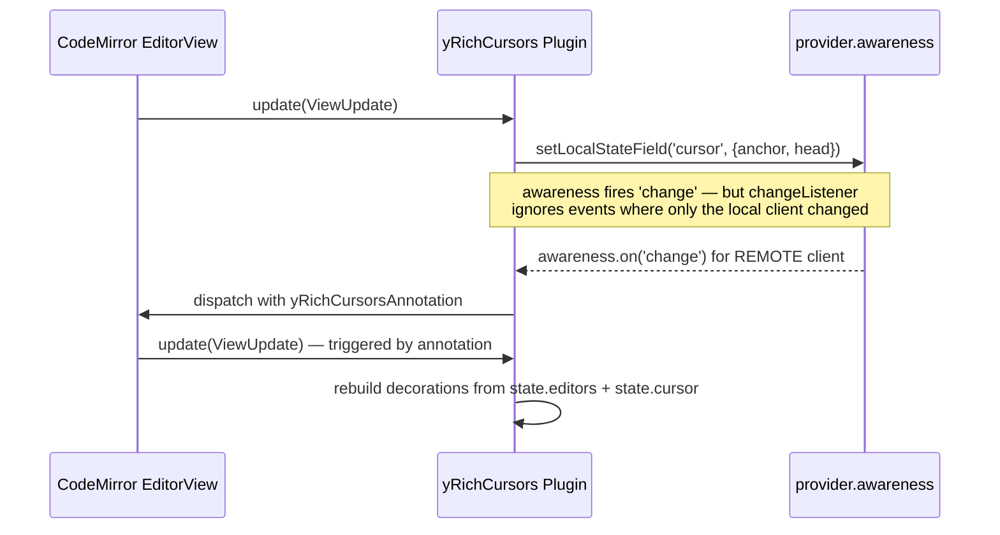

# Design Document: collaborative-editor-awareness

## Overview

**Purpose**: This feature fixes intermittent disappearance of the `EditingUserList` component and upgrades in-editor cursors to display a user's name and avatar alongside the cursor caret.

**Users**: All GROWI users who use real-time collaborative page editing. They will see stable editing-user indicators and rich, avatar-bearing cursor flags that identify co-editors by name and profile image.

**Impact**: Modifies `use-collaborative-editor-mode` in `@growi/editor`, replaces the default `yRemoteSelections` cursor plugin from `y-codemirror.next` with a purpose-built `yRichCursors` ViewPlugin, and adds one new source file.

### Goals

- Eliminate `EditingUserList` disappearance caused by `undefined` entries from uninitialized awareness states
- Remove incorrect direct mutation of Yjs-managed `awareness.getStates()` map
- Render remote cursors with display name and profile image avatar
- Read user data exclusively from `state.editors` (GROWI's canonical awareness field), eliminating the current `state.user` mismatch

### Non-Goals

- Server-side awareness bridging (covered in `collaborative-editor` spec)
- Changes to the `EditingUserList` React component
- Upgrading `y-codemirror.next` or `yjs`
- Cursor rendering for the local user's own cursor

## Architecture

### Existing Architecture Analysis

The current flow has two defects:

1. **`emitEditorList` in `use-collaborative-editor-mode`**: maps `awareness.getStates().values()` to `value.editors`, producing `undefined` for any client whose awareness state has not yet included an `editors` field. The `Array.isArray` guard is always true and does not filter. `EditingUserList` then receives a list containing `undefined`, leading to a React render error that wipes the component.

2. **Cursor field mismatch**: `yCollab(activeText, provider.awareness, { undoManager })` adds `yRemoteSelections`, which reads `state.user.name` and `state.user.color`. GROWI sets `state.editors` (not `state.user`). The result is that all cursors render as "Anonymous" with a default blue color. This is also fixed by the new design.

### Architecture Pattern & Boundary Map



**Key architectural properties**:
- `yCollab` is called with `null` awareness to suppress the built-in `yRemoteSelections` plugin; text-sync (`ySync`) and undo (`yUndoManager`) are not affected
- `yRichCursors` is added as a separate extension alongside `yCollab`'s output; it owns all awareness-cursor interaction, including in-viewport widget rendering and off-screen indicators
- `state.editors` remains the single source of truth for user identity data
- `state.cursor` (anchor/head relative positions) continues to be used for cursor position broadcasting, consistent with `y-codemirror.next` convention
- Off-screen indicators are managed within the same `yRichCursors` ViewPlugin — it compares each remote cursor's absolute position against `view.visibleRanges` (the actually visible content range, excluding CodeMirror's pre-render buffer) to decide between widget decoration (in-view) and DOM overlay (off-screen)

### Technology Stack

| Layer | Choice / Version | Role in Feature | Notes |
|-------|------------------|-----------------|-------|
| Editor extensions | `y-codemirror.next@0.3.5` | `yCollab` for text-sync and undo; `yRemoteSelectionsTheme` for base caret CSS | No version change; `yRemoteSelections` no longer used |
| Cursor rendering | CodeMirror `ViewPlugin` + `WidgetType` (`@codemirror/view`) | DOM-based cursor widget with avatar `` | No new dependency |
| Awareness | `y-websocket` `awareness` object | State read (`getStates`) and write (`setLocalStateField`) | `Awareness` type derived via `WebsocketProvider['awareness']` — `y-protocols` is not a direct dependency |

## System Flows

### Awareness Update → EditingUserList



The filter (`value.editors != null`) ensures `EditingUserList` never receives `undefined` entries. The `.delete()` call on `getStates()` is removed; Yjs clears stale entries before emitting `update`.

### Cursor Render Cycle



**Annotation-driven update strategy**: The awareness `change` listener does not call `view.dispatch()` unconditionally — doing so would crash with "Calls to EditorView.update are not allowed while an update is in progress" because `setLocalStateField` in the `update()` method itself triggers an awareness `change` event synchronously. Instead, the listener filters by `clientID`: it dispatches (with a `yRichCursorsAnnotation`) only when at least one **remote** client's state has changed. Local-only awareness changes (from the cursor broadcast in the same `update()` cycle) are silently ignored, and the decoration set is rebuilt in the next `update()` call naturally.

## Requirements Traceability

| Requirement | Summary | Components | Key Interfaces |
|-------------|---------|------------|----------------|
| 1.1 | Filter undefined awareness entries | `use-collaborative-editor-mode` | `emitEditorList` filter |
| 1.2 | Remove `getStates().delete()` mutation | `use-collaborative-editor-mode` | `updateAwarenessHandler` |
| 1.3 | EditingUserList remains stable | `use-collaborative-editor-mode` → `editingClientsAtom` | `onEditorsUpdated` callback |
| 1.4 | Skip entries without `editors` field | `use-collaborative-editor-mode` | `emitEditorList` filter |
| 2.1 | Broadcast user presence via awareness | `use-collaborative-editor-mode` | `awareness.setLocalStateField('editors', ...)` |
| 2.2–2.3 | Socket.IO awareness events (server) | Out of scope — `collaborative-editor` spec | — |
| 2.4 | Display active editors | `EditingUserList` (unchanged) | — |
| 3.1 | Avatar overlay below caret (no block space) | `yRichCursors` | `RichCaretWidget.toDOM()` — `position: absolute` overlay |
| 3.2 | Avatar size (`AVATAR_SIZE` in `theme.ts`) | `yRichCursors` | `RichCaretWidget.toDOM()` — CSS sizing via shared token |
| 3.3 | Name label visible on hover only | `yRichCursors` | CSS `:hover` on `.cm-yRichCursorFlag` |
| 3.4 | Avatar image with initials fallback | `yRichCursors` | `RichCaretWidget.toDOM()` — `` onerror → initials |
| 3.5 | Cursor caret color, fallback background, and avatar border from `state.editors.color` | `yRichCursors` | `RichCaretWidget` constructor + `borderColor` inline style |
| 3.6 | Custom cursor via replacement plugin | `yRichCursors` replaces `yRemoteSelections` | `yCollab(activeText, null, { undoManager })` |
| 3.7 | Cursor updates on awareness change | `yRichCursors` awareness change listener | `awareness.on('change', ...)` |
| 3.8 | Default semi-transparent avatar | `yRichCursors` | CSS `opacity` on `.cm-yRichCursorFlag` |
| 3.9 | Full opacity on hover | `yRichCursors` | CSS `:hover` rule |
| 3.10 | Full opacity during active editing (3s) | `yRichCursors` | `lastActivityMap` + `.cm-yRichCursorActive` class + `setTimeout` |
| 4.1 | Off-screen indicator at top edge with `arrow_drop_up` above avatar | `yRichCursors` | `topContainer` + Material Symbol icon |
| 4.2 | Off-screen indicator at bottom edge with `arrow_drop_down` below avatar | `yRichCursors` | `bottomContainer` + Material Symbol icon |
| 4.3 | No indicator when cursor is in viewport | `yRichCursors` | multi-mode classification in `update()` (rangedMode / coords mode) |
| 4.4 | Same avatar/color as in-editor widget | `yRichCursors` | shared `state.editors` data |
| 4.5 | Indicators positioned at cursor's column | `yRichCursors` | `requestMeasure` → `coordsAtPos` → `left: Xpx; transform: translateX(-50%)` |
| 4.6 | Transition on scroll (indicator ↔ widget) | `yRichCursors` | classification re-run on every `update()` |
| 4.7 | Overlay positioning (no layout impact) | `yRichCursors` | `position: absolute` on `view.dom` |
| 4.8 | Indicator X position derived from cursor column | `yRichCursors` | `view.coordsAtPos` (measure phase) or char-width fallback |
| 4.9 | Arrow always fully opaque in cursor color; avatar fades when idle | `yRichCursors` | `opacity: 1` on `.cm-offScreenArrow`; `opacity: IDLE_OPACITY` on avatar/initials |

## Components and Interfaces

| Component | Domain/Layer | Intent | Req Coverage | Key Dependencies (P0) | Contracts |
|-----------|--------------|--------|--------------|----------------------|-----------|
| `use-collaborative-editor-mode` | packages/editor — Hook | Fix awareness filter bug; compose extensions with rich cursor | 1.1–1.4, 2.1, 2.4 | `yCollab` (P0), `yRichCursors` (P0) | State |
| `yRichCursors` | packages/editor — Extension | Custom ViewPlugin: broadcasts local cursor position, renders in-viewport cursors with overlay avatar+hover name+activity opacity, renders off-screen indicators at editor edges | 3.1–3.10, 4.1–4.7 | `@codemirror/view` (P0), `y-websocket awareness` (P0) | Service |

### packages/editor — Hook

#### `use-collaborative-editor-mode` (modified)

| Field | Detail |
|-------|--------|
| Intent | Orchestrates WebSocket provider, awareness, and CodeMirror extension lifecycle for collaborative editing |
| Requirements | 1.1, 1.2, 1.3, 1.4, 2.1, 2.4 |

**Responsibilities & Constraints**
- Filters `undefined` awareness entries before calling `onEditorsUpdated`
- Does not mutate `awareness.getStates()` directly
- Composes `yCollab(null)` + `yRichCursors(awareness)` to achieve text-sync, undo, and rich cursor rendering without the default `yRemoteSelections` plugin

**Dependencies**
- Outbound: `yCollab` from `y-codemirror.next` — text-sync and undo (P0)
- Outbound: `yRichCursors` — rich cursor rendering (P0)
- Outbound: `provider.awareness` — read states, set local state (P0)

**Contracts**: State [x]

##### State Management

- **Bug fix — `emitEditorList`**:
  ```
  Before: Array.from(getStates().values(), v => v.editors)   // contains undefined
  After:  Array.from(getStates().values())
            .map(v => v.editors)
            .filter((v): v is EditingClient => v != null)
  ```
- **Bug fix — `updateAwarenessHandler`**: Remove `awareness.getStates().delete(clientId)` for all `update.removed` entries; Yjs removes them before emitting the event.
- **Extension composition change**:
  ```
  Before: yCollab(activeText, provider.awareness, { undoManager })
  After:  [
            yCollab(activeText, null, { undoManager }),
            yRichCursors(provider.awareness),
          ]
  ```
  Note: `yCollab` already includes `yUndoManagerKeymap` in its return array, so it must NOT be added separately to avoid keymap duplication. Verify during implementation by inspecting the return value of `yCollab`.

**Implementation Notes**
- Integration: `yCollab` with `null` awareness suppresses `yRemoteSelections` and `yRemoteSelectionsTheme`. Text-sync (`ySync`) and undo (`yUndoManager`) are not affected by the null awareness value.
- Risks: If `y-codemirror.next` is upgraded, re-verify that passing `null` awareness still suppresses only the cursor plugins.

---

### packages/editor — Extension

#### `yRichCursors` (new)

| Field | Detail |
|-------|--------|
| Intent | CodeMirror ViewPlugin — broadcasts local cursor position, renders in-viewport cursors with overlay avatar and hover-revealed name, renders off-screen indicators pinned to editor edges for cursors outside the viewport |
| Requirements | 3.1–3.10, 4.1–4.7 |

**Responsibilities & Constraints**
- On each `ViewUpdate`: derives local cursor anchor/head → converts to Yjs relative positions → calls `awareness.setLocalStateField('cursor', { anchor, head })` (matches `state.cursor` convention from `y-codemirror.next`)
- On awareness `change` event: rebuilds decoration set reading `state.editors` (color, name, imageUrlCached) and `state.cursor` (anchor, head) for each remote client
- Does NOT render a cursor for the local client (`clientid === awareness.doc.clientID`)
- Selection highlight (background color from `state.editors.colorLight`) is rendered alongside the caret widget

**Dependencies**
- External: `@codemirror/view` `ViewPlugin`, `WidgetType`, `Decoration`, `EditorView` (P0)
- External: `@codemirror/state` `RangeSet`, `Annotation` (P0) — `Annotation.define<number[]>()` used for `yRichCursorsAnnotation`
- External: `yjs` `createRelativePositionFromTypeIndex`, `createAbsolutePositionFromRelativePosition` (P0)
- External: `y-codemirror.next` `ySyncFacet` (to access `ytext` for position conversion) (P0)
- External: `y-websocket` — `Awareness` type derived via `WebsocketProvider['awareness']` (not `y-protocols/awareness`, which is not a direct dependency) (P0)
- Inbound: `provider.awareness` passed as parameter (P0)

**Contracts**: Service [x]

##### Service Interface

```typescript
/**
 * Creates a CodeMirror Extension that renders remote user cursors with
 * name labels and avatar images, reading user data from state.editors.
 *
 * Also broadcasts the local user's cursor position via state.cursor.
 */
export function yRichCursors(awareness: Awareness): Extension;
```

Preconditions:
- `awareness` is an active `y-websocket` Awareness instance
- `ySyncFacet` is installed by a preceding `yCollab` call so that `ytext` can be resolved for position conversion

Postconditions:
- Remote cursors within the visible viewport are rendered as `cm-yRichCaret` widget decorations at each remote client's head position
- Remote cursors outside the visible viewport are rendered as off-screen indicator overlays pinned to the top or bottom edge of `view.dom`
- Local cursor position is broadcast to awareness as `state.cursor.{ anchor, head }` on each focus-selection change

Invariants:
- Local client's own cursor is never rendered
- Cursor decorations are rebuilt when awareness `change` fires for **remote** clients (dispatched via `yRichCursorsAnnotation`); local-only changes are ignored to prevent recursive `dispatch` during an in-progress update
- `state.cursor` field is written exclusively by `yRichCursors`; no other plugin or code path may call `awareness.setLocalStateField('cursor', ...)` to avoid data races

##### Widget DOM Structure

```
<span class="cm-yRichCaret" style="border-color: {color}">
  ⁠ <!-- Word Joiner (\u2060): inherits line font-size so caret height follows headers -->
  <span class="cm-yRichCursorFlag [cm-yRichCursorActive]">
    
      OR  <span class="cm-yRichCursorInitials" style="background-color: {color}; border-color: {color}" />
    <span class="cm-yRichCursorInfo" style="background-color: {color}">{name}</span>
  </span>
</span>
```

**CSS strategy**: Applied via `EditorView.baseTheme` in `theme.ts`, exported alongside the ViewPlugin.

Key design decisions:
- **Caret**: Both-side 1px borders with negative margins (zero layout width). Modeled after `yRemoteSelectionsTheme` in `y-codemirror.next`.
- **Overlay flag**: `position: absolute; top: 100%` below the caret. Always hoverable (no `pointer-events: none`), so the avatar is a direct hover target.
- **Name label**: Positioned at `left: 0; z-index: -1` (behind the avatar). Left border-radius matches the avatar circle, creating a tab shape that flows from the avatar. Left padding clears the avatar width. Shown on `.cm-yRichCursorFlag:hover`.
- **Opacity**: `cm-yRichCursorFlag` carries `opacity: IDLE_OPACITY` and transitions to `opacity: 1` on hover or `.cm-yRichCursorActive` (3-second activity window).
- **Avatar border**: `1.5px solid` border in the cursor's `color` with `box-sizing: border-box` so the 20×20 outer size is preserved. Applied via inline `style.borderColor` in `toDOM()` / `createInitialsElement()`.
- **Design tokens**: `AVATAR_SIZE = '20px'` and `IDLE_OPACITY = '0.6'` are defined at the top of `theme.ts` and shared across all cursor/off-screen styles.

**Design decision — CSS-only, no React**: The overlay, sizing, and hover behavior are achievable with `position: absolute` and `:hover`. `document.createElement` in `toDOM()` avoids React's async rendering overhead and context isolation.

**Activity tracking** (JavaScript, within `YRichCursorsPluginValue`):
- `lastActivityMap: Map<number, number>` — `clientId` → timestamp of last awareness change
- `activeTimers: Map<number, ReturnType<typeof setTimeout>>` — per-client 3-second inactivity timers
- On awareness `change` for remote clients: update timestamp, reset timer. Timer expiry dispatches with `yRichCursorsAnnotation` to trigger decoration rebuild.
- `isActive` is passed to both `RichCaretWidget` and off-screen indicators. `eq()` includes `isActive` so state transitions trigger widget re-creation (at most twice per user per 3-second cycle).

`RichCaretWidget` (extends `WidgetType`):
- Constructor: `RichCaretWidgetOptions` object (`color`, `name`, `imageUrlCached`, `isActive`)
- `toDOM()`: creates the DOM tree above; `onerror` on `` replaces with initials fallback
- `eq(other)`: true when all option fields match
- `estimatedHeight`: `-1` (inline widget), `ignoreEvent()`: `true`

Selection highlight: `Decoration.mark` on selected range with `background-color: {colorLight}`.

##### Off-Screen Cursor Indicators

When a remote cursor's absolute position falls outside the actually visible viewport, the ViewPlugin renders an off-screen indicator instead of a widget decoration.

**Viewport classification — multi-mode strategy**: Because `view.visibleRanges` and `view.viewport` are equal in GROWI's page-scroll editor setup (the editor expands to full content height; the browser page handles scrolling), a single character-position comparison is insufficient. The plugin uses three modes, chosen once per `update()` call:

| Mode | Condition | Method |
|------|-----------|--------|
| **rangedMode** | `visibleRanges` is a non-empty, non-trivial sub-range of `viewport` (internal-scroll editor, or jsdom tests with styled heights) | Compare `headIndex` against `visibleRanges[0].from` / `visibleRanges[last].to` |
| **coords mode** | `visibleRanges == viewport` AND `scrollDOM.getBoundingClientRect().height > 0` (GROWI's page-scroll production setup) | `lineBlockAt(headIndex)` + `scrollDOMRect.top` vs `window.innerHeight` |
| **degenerate** | `scrollRect.height == 0` (jsdom with 0-height container) | No off-screen classification; every cursor gets a widget decoration |

`view.lineBlockAt()` reads stored height-map data (safe to call in `update()`). `scrollDOM.getBoundingClientRect()` is a raw DOM call, not restricted by CodeMirror's "Reading the editor layout isn't allowed during an update" guard.

**DOM management**: The ViewPlugin creates two persistent container elements (`topContainer`, `bottomContainer`) and appends them to `view.dom` in the `constructor`. They are removed in `destroy()`. The containers are always present in the DOM but empty when no off-screen cursors exist in that direction.

```
view.dom (position: relative — already set by CodeMirror)
├── .cm-scroller (managed by CM)
│   └── .cm-content ...
├── .cm-offScreenTop    ← topContainer (absolute, top: 0, height: AVATAR_SIZE + 14px)
│   ├── .cm-offScreenIndicator  style="left: {colX}px; transform: translateX(-50%)"
│   │   ├── .cm-offScreenArrow (material-symbols-outlined) — "arrow_drop_up"
│   │   └── .cm-offScreenAvatar / .cm-offScreenInitials
│   └── .cm-offScreenIndicator  (another user, different column)
└── .cm-offScreenBottom ← bottomContainer (absolute, bottom: 0, height: AVATAR_SIZE + 14px)
    └── .cm-offScreenIndicator  style="left: {colX}px; transform: translateX(-50%)"
        ├── .cm-offScreenAvatar / .cm-offScreenInitials
        └── .cm-offScreenArrow (material-symbols-outlined) — "arrow_drop_down"
```

**Indicator DOM structure** (built by `createOffScreenIndicator()` in `off-screen-indicator.ts`):
- **above**: `[arrow_drop_up icon][avatar or initials]` stacked vertically (flex-column)
- **below**: `[avatar or initials][arrow_drop_down icon]` stacked vertically (flex-column)
- Arrow element: `<span class="material-symbols-outlined cm-offScreenArrow" style="color: {color}">arrow_drop_up</span>` — font loaded via `var(--grw-font-family-material-symbols-outlined)` (Next.js-registered Material Symbols Outlined)
- Avatar: same `borderColor`, `AVATAR_SIZE`, and onerror→initials fallback as in-editor widget
- Opacity: arrow always `opacity: 1`; avatar/initials use `IDLE_OPACITY` → `1` via `.cm-yRichCursorActive` on the indicator

**Horizontal positioning** (deferred to measure phase):
After `replaceChildren()`, the plugin calls `view.requestMeasure()`:
- **read phase**: for each indicator, call `view.coordsAtPos(headIndex, 1)` to get screen X. If null (virtualized position), fall back to `contentDOM.getBoundingClientRect().left + col * view.defaultCharacterWidth`.
- **write phase**: set `indicator.style.left = Xpx` and `indicator.style.transform = 'translateX(-50%)'` to center the indicator on the cursor column.

**Update cycle**:
1. Classify all remote cursors (mode-dependent: rangedMode/coords/degenerate)
2. Build `aboveIndicators: {el, headIndex}[]` and `belowIndicators: {el, headIndex}[]`
3. `topContainer.replaceChildren(...aboveIndicators.map(i => i.el))`; same for bottom
4. If any indicators exist, call `view.requestMeasure()` to set horizontal positions
5. Cursors that lack `state.cursor` or `state.editors` are excluded from both in-view and off-screen rendering

**Implementation Notes**
- Integration: file location `packages/editor/src/client/services-internal/extensions/y-rich-cursors/` (directory — split into `index.ts`, `plugin.ts`, `widget.ts`, `off-screen-indicator.ts`, `theme.ts`); exported from `packages/editor/src/client/services-internal/extensions/index.ts` and consumed directly in `use-collaborative-editor-mode.ts`
- Validation: `imageUrlCached` is optional; if undefined or empty, the `` element is skipped and only initials are shown
- Risks: `ySyncFacet` must be present in the editor state when the plugin initializes; guaranteed since `yCollab` (which installs `ySyncFacet`) is added before `yRichCursors` in the extension array

## Data Models

### Domain Model

No new persistent data. The awareness state already carries all required fields via the `EditingClient` interface in `state.editors`.

```typescript
// Existing — no changes
type EditingClient = Pick<IUser, 'name'> &
  Partial<Pick<IUser, 'username' | 'imageUrlCached'>> & {
    clientId: number;
    userId?: string;
    color: string;       // cursor caret and flag background color
    colorLight: string;  // selection range highlight color
  };
```

The `state.cursor` awareness field follows the existing `y-codemirror.next` convention:
```typescript
type CursorState = {
  anchor: RelativePosition; // Y.RelativePosition JSON
  head: RelativePosition;
};
```

## Error Handling

| Error Type | Scenario | Response |
|------------|----------|----------|
| Missing `editors` field | Client connects but has not set awareness yet | Filtered out in `emitEditorList`; not rendered in `EditingUserList` |
| Avatar image load failure | `imageUrlCached` URL returns 4xx/5xx | `` `onerror` replaces element with initials `<span>` (colored circle with user initials) |
| `state.cursor` absent | Remote client connected but editor not focused | Cursor widget not rendered for that client (no `cursor.anchor` → skip) |
| `ySyncFacet` not installed | `yRichCursors` initialized before `yCollab` | Position conversion returns `null`; cursor is skipped for that update cycle. Extension array order in `use-collaborative-editor-mode` guarantees correct sequencing. |
| Off-screen container detached | `view.dom` removed from DOM before `destroy()` | `destroy()` calls `remove()` on both containers; if already detached, `remove()` is a no-op |
| Viewport not yet initialized | First `update()` before CM calculates viewport | `view.viewport` always has valid `from`/`to` from initialization; safe to compare |

## Testing Strategy

Test files are co-located with source in `y-rich-cursors/`:
- **Unit**: `widget.spec.ts` (DOM structure, eq, fallback), `off-screen-indicator.spec.ts` (indicator DOM, direction, fallback)
- **Integration**: `plugin.integ.ts` (awareness filter, cursor broadcast, viewport classification, activity timers)
- **E2E** (Playwright, deferred): hover behavior, off-screen scroll transitions, pointer-events pass-through
