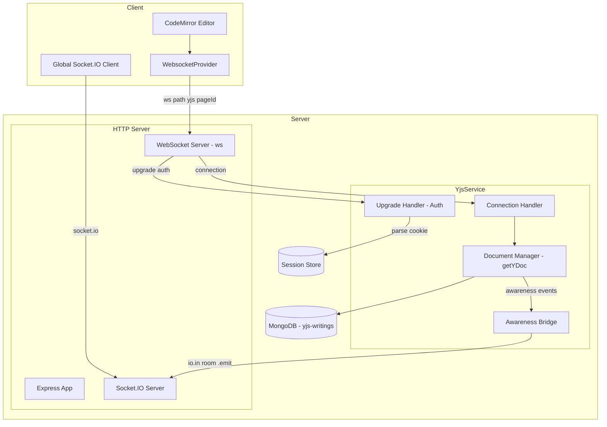
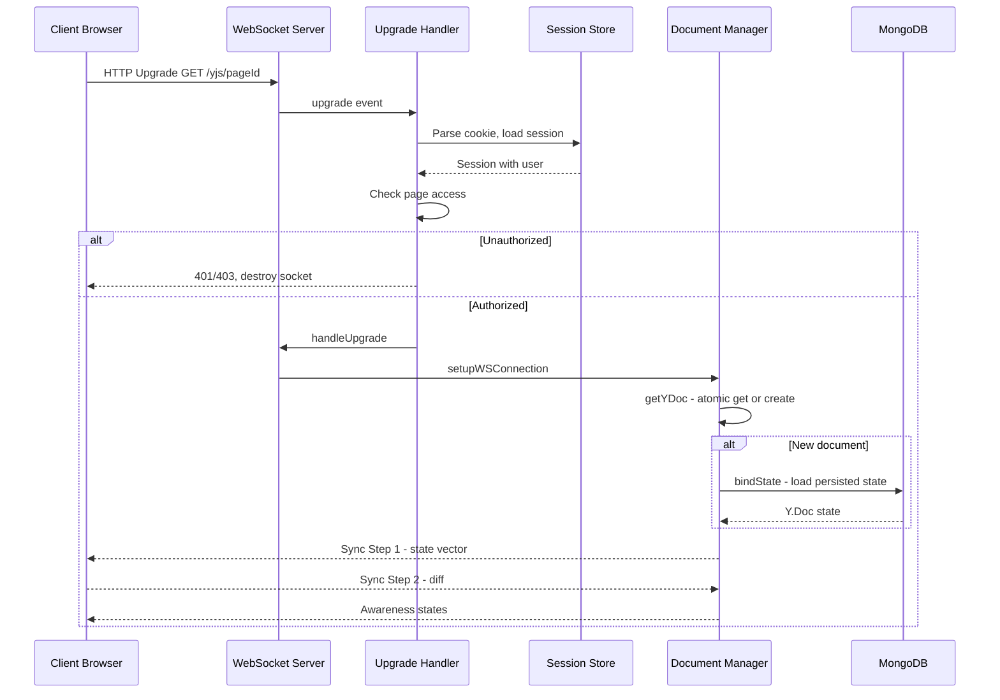
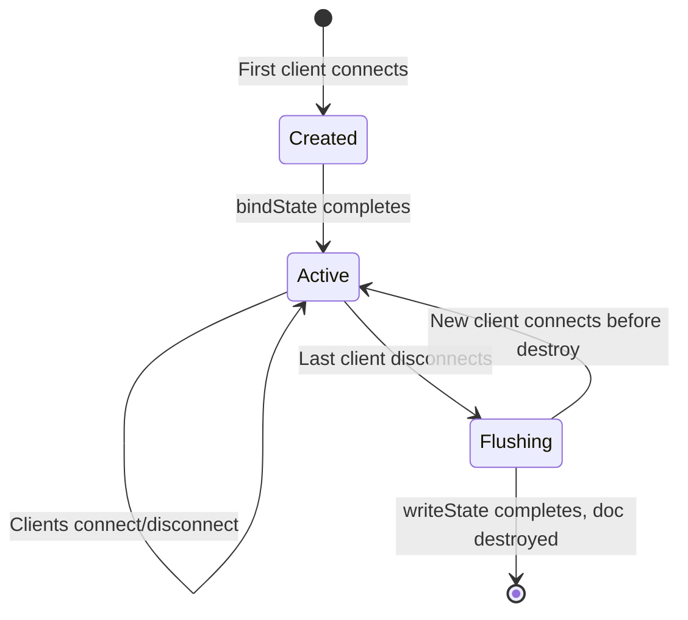

# Design Document: collaborative-editor

## Overview

**Purpose**: Real-time collaborative editing in GROWI, allowing multiple users to simultaneously edit the same wiki page with automatic conflict resolution via Yjs CRDT.

**Users**: All GROWI users who use real-time collaborative page editing. System operators manage the WebSocket and persistence infrastructure.

**Impact**: Yjs document synchronization over native WebSocket (`y-websocket`), with Socket.IO continuing to serve non-Yjs real-time events (page room broadcasts, notifications).

### Goals
- Guarantee a single server-side Y.Doc per page — no split-brain desynchronization
- Provide real-time bidirectional sync for all connected editors
- Authenticate and authorize WebSocket connections using existing session infrastructure
- Persist draft state to MongoDB for durability across reconnections and restarts
- Bridge awareness/presence events to non-editor UI via Socket.IO rooms

### Non-Goals
- Changing the Yjs document model, CodeMirror integration, or page save/revision logic
- Migrating Socket.IO-based UI events to WebSocket
- Changing the `yjs-writings` MongoDB collection schema or data format

## Architecture

### Architecture Diagram



**Key architectural properties**:
- **Dual transport**: WebSocket for Yjs sync (`/yjs/{pageId}`), Socket.IO for UI events (`/socket.io/`)
- **Singleton YjsService**: Encapsulates all Yjs document management
- **Atomic document creation**: `map.setIfUndefined` from lib0 — synchronous get-or-create, no race condition window
- **Session-based auth**: Cookie parsed from HTTP upgrade request, same session store as Express

### Technology Stack

| Layer | Choice / Version | Role |
|-------|------------------|------|
| Client Provider | `y-websocket@^2.x` (WebsocketProvider) | Yjs document sync over WebSocket |
| Server WebSocket | `ws@^8.x` (WebSocket.Server) | Native WebSocket server, `noServer: true` mode |
| Server Yjs Utils | `y-websocket@^2.x` (`bin/utils`) | `setupWSConnection`, `getYDoc`, `WSSharedDoc` |
| Persistence | `y-mongodb-provider` (extended) | Yjs document persistence to `yjs-writings` collection |
| Event Bridge | Socket.IO `io` instance | Awareness state broadcasting to page rooms |
| Auth | express-session + passport | WebSocket upgrade authentication via cookie |

## System Flows

### Client Connection Flow



Authentication happens before `handleUpgrade` — unauthorized connections never reach the Yjs layer. Document creation uses `getYDoc`'s atomic `map.setIfUndefined` pattern.

### Document Lifecycle



## Components and Interfaces

| Component | Layer | Intent | Key Dependencies |
|-----------|-------|--------|-----------------|
| YjsService | Server / Service | Orchestrates Yjs document lifecycle, exposes public API | ws, y-websocket/bin/utils, MongodbPersistence |
| UpgradeHandler | Server / Auth | Authenticates and authorizes WebSocket upgrade requests | express-session, passport, Page model |
| guardSocket | Server / Util | Prevents socket closure by other upgrade handlers during async auth | — |
| PersistenceAdapter | Server / Data | Bridges MongodbPersistence to y-websocket persistence interface | MongodbPersistence, syncYDoc, Socket.IO io |
| AwarenessBridge | Server / Events | Bridges y-websocket awareness events to Socket.IO rooms | Socket.IO io |
| use-collaborative-editor-mode | Client / Hook | Manages WebsocketProvider lifecycle and awareness | y-websocket, yjs |

### YjsService

**Intent**: Manages Yjs document lifecycle, WebSocket server setup, and public API for page save/status integration.

**Responsibilities**:
- Owns the `ws.WebSocketServer` instance and the y-websocket `docs` Map
- Initializes persistence via y-websocket's `setPersistence`
- Registers the HTTP `upgrade` handler (delegating auth to UpgradeHandler)
- Exposes the same public interface as `IYjsService` for downstream consumers

**Service Interface**:

```typescript
interface IYjsService {
  getYDocStatus(pageId: string): Promise<YDocStatus>;
  syncWithTheLatestRevisionForce(
    pageId: string,
    editingMarkdownLength?: number,
  ): Promise<SyncLatestRevisionBody>;
  getCurrentYdoc(pageId: string): Y.Doc | undefined;
}
```

- Constructor accepts `httpServer: http.Server` and `io: Server`
- Uses `WebSocket.Server({ noServer: true })` + y-websocket utils
- Uses `httpServer.on('upgrade', ...)` with path check for `/yjs/`
- **CRITICAL**: Socket.IO server must set `destroyUpgrade: false` to prevent engine.io from destroying non-Socket.IO upgrade requests

### UpgradeHandler

**Intent**: Authenticates WebSocket upgrade requests using session cookies and verifies page access.

**Interface**:

```typescript
type UpgradeResult =
  | { authorized: true; request: AuthenticatedRequest; pageId: string }
  | { authorized: false; statusCode: number };
```

- Runs express-session and passport middleware via `runMiddleware` helper against raw `IncomingMessage`
- `writeErrorResponse` writes HTTP status line only — socket cleanup deferred to caller (works with `guardSocket`)
- Guest access: if `user` is undefined but page allows guest access, authorization proceeds

### guardSocket

**Intent**: Prevents other synchronous upgrade handlers from closing the socket during async auth.

**Why this exists**: Node.js EventEmitter fires all `upgrade` listeners synchronously. When the Yjs async handler yields at its first `await`, Next.js's `NextCustomServer.upgradeHandler` runs and calls `socket.end()` for unrecognized paths. This destroys the socket before Yjs auth completes.

**How it works**: Temporarily replaces `socket.end()` and `socket.destroy()` with no-ops before the first `await`. After auth completes, `restore()` reinstates the original methods.

```typescript
const guard = guardSocket(socket);
const result = await handleUpgrade(request, socket, head);
guard.restore();
```

### PersistenceAdapter

**Intent**: Adapts MongodbPersistence to y-websocket's persistence interface (`bindState`, `writeState`).

**Interface**:

```typescript
interface YWebsocketPersistence {
  bindState: (docName: string, ydoc: Y.Doc) => void;
  writeState: (docName: string, ydoc: Y.Doc) => Promise<void>;
  provider: MongodbPersistence;
}
```

**Key behavior**:
- `bindState`: Loads persisted state → determines YDocStatus → calls `syncYDoc` → registers awareness event bridge
- `writeState`: Flushes document state to MongoDB on last-client disconnect
- Ordering within `bindState` is guaranteed (persistence load → sync → awareness registration)

### AwarenessBridge

**Intent**: Bridges y-websocket per-document awareness events to Socket.IO room broadcasts.

**Published events** (to Socket.IO rooms):
- `YjsAwarenessStateSizeUpdated` with `awarenessStateSize: number`
- `YjsHasYdocsNewerThanLatestRevisionUpdated` with `hasNewerYdocs: boolean`

**Subscribed events** (from y-websocket):
- `WSSharedDoc.awareness.on('update', ...)` — per-document awareness changes

### use-collaborative-editor-mode (Client Hook)

**Intent**: Manages WebsocketProvider lifecycle, awareness state, and CodeMirror extensions.

**Key details**:
- WebSocket URL: `${wsProtocol}//${window.location.host}/yjs`, room name: `pageId`
- Options: `connect: true`, `resyncInterval: 3000`
- Awareness API: `provider.awareness.setLocalStateField`, `.on('update', ...)`
- All side effects (provider creation, awareness setup) must be outside React state updaters to avoid render-phase violations

## Data Models

No custom data models. Uses the existing `yjs-writings` MongoDB collection via `MongodbPersistence` (extended `y-mongodb-provider`). Collection schema, indexes, and persistence interface (`bindState` / `writeState`) are unchanged.

## Error Handling

| Error Type | Scenario | Response |
|------------|----------|----------|
| Auth Failure | Invalid/expired session cookie | 401 on upgrade, socket destroyed |
| Access Denied | User lacks page access | 403 on upgrade, socket destroyed |
| Persistence Error | MongoDB read failure in bindState | Log error, serve empty doc (clients sync from each other) |
| WebSocket Close | Client network failure | Automatic reconnect with exponential backoff (WebsocketProvider built-in) |
| Document Not Found | getCurrentYdoc for non-active doc | Return undefined |

## Requirements Traceability

| Requirement | Summary | Components |
|-------------|---------|------------|
| 1.1, 1.2 | Single Y.Doc per page | DocumentManager (getYDoc atomic pattern) |
| 1.3, 1.4, 1.5 | Sync integrity on reconnect | DocumentManager, WebsocketProvider |
| 2.1, 2.2 | y-websocket transport | YjsService, use-collaborative-editor-mode |
| 2.3 | Coexist with Socket.IO | UpgradeHandler, guardSocket |
| 2.4 | resyncInterval | WebsocketProvider |
| 3.1-3.4 | Auth on upgrade | UpgradeHandler |
| 4.1-4.5 | MongoDB persistence | PersistenceAdapter |
| 5.1-5.4 | Awareness and presence | AwarenessBridge, use-collaborative-editor-mode |
| 6.1-6.4 | YDoc status and sync | YjsService |
