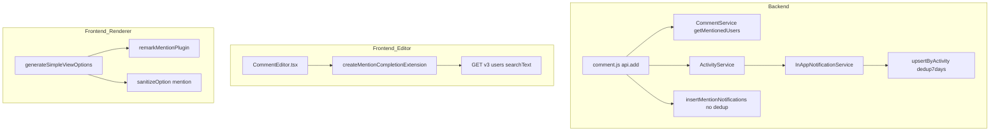
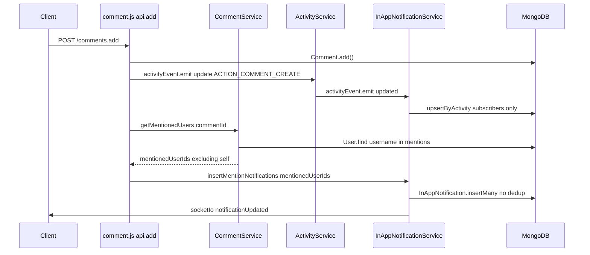
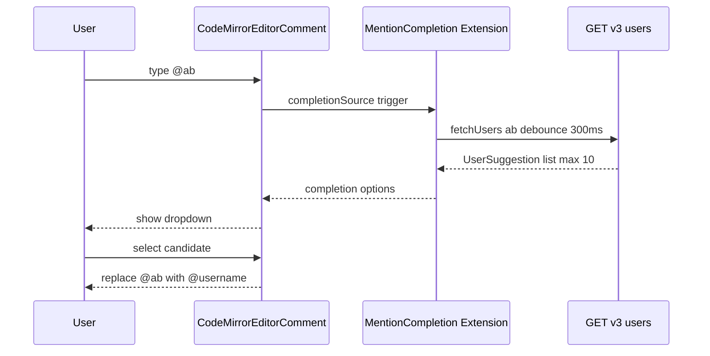

# Design Document: comment-mention-enhancement

## Overview

本設計はGROWIのページコメントにおけるメンション機能の3つの改善を対象とする。

**Purpose**: コメントメンション機能の信頼性・可視性・操作性を向上させ、チームコミュニケーションの円滑化を実現する。

**Users**: GROWIを利用するすべてのチームメンバーが恩恵を受ける。特にコメント経由のコミュニケーションを行うユーザー。

**Impact**: バックエンドの通知パイプライン（ActivityService / InAppNotificationService）、フロントエンドのレンダラー（remark プラグイン）、エディタ拡張（CodeMirror autocomplete）を改修する。

### Goals

- メンション通知をコメント・メンション履歴に関係なく毎回確実に届ける（Req 1）
- コメント本文内の `@username` を視覚的に強調表示する（Req 2）
- `@` 入力時にユーザー候補をサジェストし、入力補完を提供する（Req 3）

### Non-Goals

- 表示名（`@name`）によるメンション（Req 4 — 別フェーズ）
- コメント編集時のメンション通知
- Slack / グローバル通知へのメンション統合
- モバイルプッシュ通知

---

## Architecture

### Existing Architecture Analysis

- **通知フロー**: `routes/comment.js:api.add` → `activityEvent.emit('update')` → `ActivityService` → `activityEvent.emit('updated')` → `InAppNotificationService.createInAppNotification` → `upsertByActivity`
- **重複排除**: `upsertByActivity` は `{ user, target, action, createdAt: { $gt: lastWeek }, snapshot }` をキーとして7日間ウィンドウでマージ。メンション対象ユーザーも同一パスを通るため、繰り返しメンションが抑制される（根本原因）
- **レンダラー**: `useCommentForCurrentPageOptions` → `generateSimpleViewOptions` → `remarkPlugins[]` / `rehypePlugins[]` の構成。プラグイン追加が容易
- **エディタ拡張**: `CodeMirrorEditorComment` の `appendExtensions` API で動的追加可能。`emojiAutocompletionSettings.ts` が先例パターン

### Architecture Pattern & Boundary Map



**Architecture Integration**:
- メンション通知は既存の `ACTION_COMMENT_CREATE` フローとは**独立した** `insertMentionNotifications` パスで処理し、7日間重複排除を回避する
- レンダラーと autocomplete は既存パターンへの追加のみで、既存の境界を侵害しない
- `packages/editor` は `apps/app` に依存しないよう、ファクトリパターンで依存を注入

### Technology Stack

| Layer | Choice / Version | Role | Notes |
|-------|-----------------|------|-------|
| Backend | Node.js / Express (既存) | 通知フロー拡張 | `ActivityService`, `InAppNotificationService` 改修 |
| Data | MongoDB / Mongoose (既存) | `InAppNotification` 直接挿入 | スキーマ変更なし |
| Markdown | unified / remark (既存) | `@username` AST 変換 | 新規 remark プラグイン追加 |
| Editor | CodeMirror 6 / `@codemirror/autocomplete` (既存) | `@` トリガー補完 | emoji パターン踏襲 |
| API | `GET /_api/v3/users/` (既存) | ユーザー検索 | `searchText` クエリパラメータ利用 |

---

## System Flows

### Req 1: メンション通知フロー



### Req 3: メンションオートコンプリートフロー



---

## Requirements Traceability

| Requirement | Summary | Components | Interfaces | Flows |
|-------------|---------|------------|------------|-------|
| 1.1 | コメント投稿ごとにメンション通知送信 | `CommentService`, `InAppNotificationService` | `getMentionedUsers`, `insertMentionNotifications` | Req 1 flow |
| 1.2 | 同一ユーザーへの複数メンションは1通のみ | `getMentionedUsers` | Set で重複除去 | Req 1 flow |
| 1.3 | 自分自身へのメンション通知は送信しない | `insertMentionNotifications` | action user 除外ロジック | Req 1 flow |
| 2.1 | 有効メンションを強調表示 | `remarkMentionPlugin` | `mention` AST ノード → `span.mention-user` | — |
| 2.2 | 無効メンションは通常テキスト表示 | `remarkMentionPlugin` | ユーザー存在確認なし（クライアント側軽量化） | — |
| 2.3 | プレビューと投稿後の両方に適用 | `generateSimpleViewOptions` | `remarkPlugins.push` | — |
| 3.1 | `@` + 1文字以上でサジェスト表示 | `createMentionCompletionExtension` | `CompletionContext` trigger | Req 3 flow |
| 3.2 | 候補選択で `@username` に置換 | `createMentionCompletionExtension` | `apply` callback | Req 3 flow |
| 3.3 | 候補なしの場合はリスト非表示 | `createMentionCompletionExtension` | `null` 返却 | — |
| 3.4 | Escape で候補リストを閉じる | `@codemirror/autocomplete` | デフォルト動作 | — |
| 3.5 | 最大10件に制限 | `createMentionCompletionExtension` | `maxMatches: 10` | — |

---

## Components and Interfaces

### コンポーネント一覧

| Component | Layer | Intent | Req Coverage | Key Dependencies | Contracts |
|-----------|-------|--------|--------------|-----------------|-----------|
| `CommentService.getMentionedUsers` | Backend | コメントからメンション対象ユーザー ID を抽出 | 1.1, 1.2 | `User` model | Service |
| `InAppNotificationService.insertMentionNotifications` | Backend | 重複排除なしでメンション通知を挿入 | 1.1, 1.3 | `InAppNotification` model | Service |
| `remarkMentionPlugin` | Frontend / Renderer | `@username` を `mention` AST ノードに変換 | 2.1, 2.2, 2.3 | unified / remark | — |
| `mentionSanitizeOption` | Frontend / Renderer | `span.mention-user` を XSS フィルタ通過許可 | 2.1 | rehype-sanitize | — |
| `createMentionCompletionExtension` | packages/editor | `@` トリガーで CodeMirror 補完を提供するファクトリ | 3.1, 3.2, 3.3, 3.4, 3.5 | `@codemirror/autocomplete` | Service |
| `CommentEditor.tsx` (修正) | Frontend / UI | mention extension を初期化し appendExtensions で登録 | 3.1 | `createMentionCompletionExtension`, SWR | State |
| `generateSimpleViewOptions` (修正) | Frontend / Renderer | `remarkMentionPlugin` を remarkPlugins に追加 | 2.1, 2.3 | renderer.tsx | — |

---

### Backend Layer

#### `CommentService.getMentionedUsers`

| Field | Detail |
|-------|--------|
| Intent | コメント本文から `@username` を抽出し、存在するユーザーの ID リストを返す |
| Requirements | 1.1, 1.2 |

**Responsibilities & Constraints**
- 正規表現 `/\B@[\w@.-]+/g` でメンション文字列を抽出
- `User.find({ username: { $in: [...] } })` で DB 照合（存在しないユーザーは自然除外）
- `Set` により同一ユーザーの重複を除去してから DB 検索（1.2）
- action user（コメント投稿者）の除外は呼び出し側（`insertMentionNotifications`）で行う

**Dependencies**
- Inbound: `api.add` — コメント保存後に呼び出す（P0）
- Outbound: `User` Mongoose model — username 照合（P0）

**Contracts**: Service [x]

##### Service Interface
```typescript
interface CommentService {
  getMentionedUsers(commentId: Types.ObjectId): Promise<Types.ObjectId[]>;
}
```
- Preconditions: `commentId` は保存済みコメントの ID
- Postconditions: 返値は重複のないアクティブユーザー ID 配列（空配列含む）

---

#### `InAppNotificationService.insertMentionNotifications`

| Field | Detail |
|-------|--------|
| Intent | 重複排除なしでメンション対象ユーザーへ通知を直接挿入する |
| Requirements | 1.1, 1.3 |

**Responsibilities & Constraints**
- `upsertByActivity` を**使わず**、`InAppNotification.insertMany` で直接挿入
- `actionUser` を `mentionedUserIds` から除外する（1.3）
- `emitSocketIo` で対象ユーザーにリアルタイム通知を送信
- 1回のコメント投稿で同一ユーザーへの通知は1件のみ（呼び出し側で重複排除済み）

**Dependencies**
- Inbound: `api.add` — `getMentionedUsers` の結果を受け取る（P0）
- Outbound: `InAppNotification` Mongoose model — 直接挿入（P0）
- Outbound: `socketIoService` — リアルタイム通知（P1）

**Contracts**: Service [x]

##### Service Interface
```typescript
interface InAppNotificationService {
  insertMentionNotifications(
    mentionedUserIds: Types.ObjectId[],
    actionUserId: Types.ObjectId,
    activity: ActivityDocument,
    snapshot: string,
  ): Promise<void>;
}
```
- Preconditions: `mentionedUserIds` は `getMentionedUsers` が返した重複なし配列
- Postconditions: `mentionedUserIds` から `actionUserId` を除いた全ユーザーに通知が挿入され、socket イベントが発火する

**Implementation Notes**
- Integration: `api.add` にて `Comment.add()` 成功後、`activityEvent.emit` の**後に**呼び出す
- Validation: `mentionedUserIds` が空の場合は早期 return
- Risks: `insertMany` は7日ウィンドウがないため高頻度コメントで通知が増える可能性。ただしメンションは明示的操作のため許容範囲

---

### Frontend / Renderer Layer

#### `remarkMentionPlugin`

| Field | Detail |
|-------|--------|
| Intent | remark AST 内のテキストノードから `@username` を検出し `mention` カスタムノードに変換する |
| Requirements | 2.1, 2.2, 2.3 |

**Responsibilities & Constraints**
- **ファイル**: `apps/app/src/services/renderer/remark-plugins/mention.ts`
- テキストノードを走査し `/\B@[\w@.-]+/g` にマッチする部分を切り出す
- マッチ箇所を `{ type: 'mention', value: '@username' }` カスタムノードに変換
- 対応する rehype ハンドラで `<span class="mention-user" data-mention="username">@username</span>` として出力
- ユーザー存在チェックは**クライアント側では行わない**（サーバー往復コストを避けるため、2.2 はスタイル差異なしで表現）

**Contracts**: —（純粋な remark プラグイン関数）

**Implementation Notes**
- Integration: `generateSimpleViewOptions` の `remarkPlugins.push(mentionPlugin)` で追加
- Validation: sanitize option に `{ tagNames: ['span'], attributes: { span: ['className', 'data-mention'] } }` を追加
- Risks: `rehype-sanitize` の設定変更を忘れると `<span>` が除去される

---

#### `createMentionCompletionExtension`

| Field | Detail |
|-------|--------|
| Intent | `@` 入力トリガーでユーザー候補を非同期取得しサジェストを提供する CodeMirror Extension ファクトリ |
| Requirements | 3.1, 3.2, 3.3, 3.4, 3.5 |

**Responsibilities & Constraints**
- **ファイル**: `packages/editor/src/client/services-internal/extensions/mentionAutocompletionSettings.ts`
- `@` に続く1文字以上の入力で発火（`/(?<!\w)@\w+$/` でトリガー検出）
- `fetchUsers` コールバックを通じてユーザー一覧を取得（外部注入）
- 候補選択時に入力中の `@文字列` を `@username` で置換
- `maxMatches: 10` で最大件数を制限（3.5）
- Escape / フォーカス外れで候補リストを閉じる（`@codemirror/autocomplete` デフォルト動作で 3.4 を実現）

**Dependencies**
- External: `@codemirror/autocomplete` — `autocompletion`, `CompletionContext`, `Completion`（P0）
- Inbound: `fetchUsers` コールバック — `CommentEditor.tsx` から注入（P0）

**Contracts**: Service [x]

##### Service Interface
```typescript
interface UserSuggestion {
  username: string;
  name: string;
}

type FetchUsersFn = (query: string) => Promise<UserSuggestion[]>;

function createMentionCompletionExtension(fetchUsers: FetchUsersFn): Extension;
```
- Preconditions: `fetchUsers` は `query` 文字列で前方一致ユーザーを返す非同期関数
- Postconditions: 返値は CodeMirror に `appendExtensions` で登録可能な `Extension`

**Implementation Notes**
- Integration: `CommentEditor.tsx` の `useEffect` 内で `codeMirrorEditor?.appendExtensions?.(createMentionCompletionExtension(fetchUsers))` を呼び出す
- Validation: `fetchUsers` は 300ms デバウンス処理を `CommentEditor.tsx` 側で実装
- Risks: `packages/editor` は `apps/app` に依存しないこと。`fetchUsers` の型を `packages/editor` 内で定義し、実装を `apps/app` 側に持たせる

---

#### `CommentEditor.tsx`（修正）

**Implementation Notes**（summary-only: 新規境界なし）

- `fetchUsers` 関数を定義: `/_api/v3/users/?searchText=${query}&selectedStatusList[]=active` を呼ぶ
- `useEffect` 内で `createMentionCompletionExtension(fetchUsers)` を生成し `appendExtensions` で登録
- 既存の `codeMirrorEditor` インスタンス取得フロー（`useCodeMirrorEditorIsolated`）をそのまま利用

---

#### `generateSimpleViewOptions`（修正）

**Implementation Notes**（summary-only: 既存関数への追加）

- `remarkPlugins.push(mentionPlugin)` を追記
- `rehype-sanitize` の deepmerge に `mentionSanitizeOption` を追加
- コメントプレビュー（`CommentPreview`）と投稿後表示（`Comment`）が同一 options を使用するため、両方に自動適用される（3.3 を満たす）

---

## Data Models

### Domain Model

本機能ではデータモデルの変更を伴わない。

- **`IComment`**: 変更なし。既存の `comment` フィールド（本文文字列）をそのまま使用
- **`InAppNotification`**: 変更なし。`insertMentionNotifications` は既存スキーマに従って挿入
- **`User`**: 変更なし。`username` フィールドで検索（Req 1-3 の範囲）

---

## Error Handling

### Error Strategy

フェイルファスト原則を適用しつつ、メンション失敗がコメント投稿自体をブロックしないようにする。

### Error Categories and Responses

**メンション通知失敗（backend）**
- `getMentionedUsers` または `insertMentionNotifications` が例外を throw した場合、コメント投稿レスポンスはすでに送信済みのため、`logger.error` のみ記録してサイレントフェール
- パターン: `try { await insertMentionNotifications(...) } catch (err) { logger.error(...) }`

**ユーザー検索 API 失敗（frontend autocomplete）**
- `fetchUsers` が失敗した場合、CompletionContext は `null` を返し補完リストを非表示（3.3）
- ユーザーへのエラー表示は不要（補完はあくまで補助機能）

**remark プラグイン処理エラー**
- AST 変換中の例外は remark の標準エラーハンドリングに委ねる。コメントレンダリング全体が失敗しないよう、プラグイン内で try-catch を使用

### Monitoring

- `insertMentionNotifications` の実行ごとに `logger.info` で対象ユーザー数を記録
- `fetchUsers` のレスポンス時間が 500ms を超えた場合は `logger.warn` を記録（クライアント側）

---

## Testing Strategy

### Unit Tests

1. `CommentService.getMentionedUsers` — `@username` 抽出、重複除去、存在しないユーザーの除外
2. `InAppNotificationService.insertMentionNotifications` — action user の除外、空配列の早期 return、socket イベントの発火確認
3. `remarkMentionPlugin` — `@username` の AST 変換、スペースなし連続テキストでの非変換、空文字・日本語のエッジケース
4. `createMentionCompletionExtension` — トリガー検出（`@a` で発火・`a` で非発火）、最大件数制限、候補選択時の置換

### Integration Tests

1. `POST /comments.add` — メンション含むコメント投稿時に `InAppNotification` が挿入されること
2. `POST /comments.add` — 自分自身をメンションした場合に通知が作成されないこと
3. `POST /comments.add` — 同一ユーザーへの2回目メンション（7日以内）でも新規通知が作成されること（重複排除バイパスの検証）
4. `GET /_api/v3/users/?searchText=ab` — 前方一致ユーザーが返却されること

### Performance

1. `getMentionedUsers` — 1コメント内に10件のメンションがあっても 100ms 以内に返すこと
2. `fetchUsers` — `searchText` クエリで 10 件取得が 300ms 以内に返すこと（デバウンス時間内に完了）
