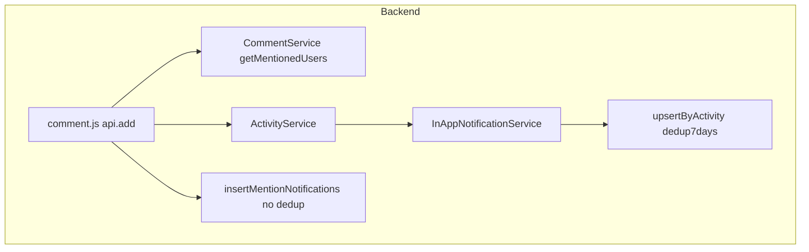
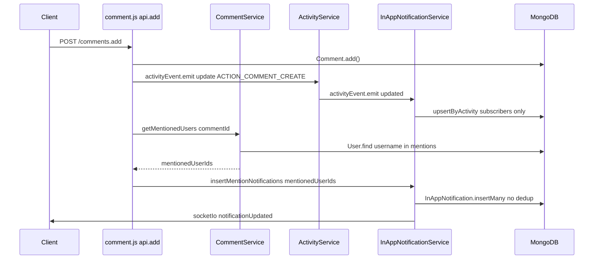

# Design Document: comment-mention-notification

## Overview

本設計はGROWIのページコメントにおけるメンション通知の信頼性改善を対象とする。

**Purpose**: メンション通知を既存の購読者通知フロー（`upsertByActivity` 経由）から切り離し、コメント投稿ごとに確実に通知が届く独立したパスを追加する。

**Users**: コメントで `@username` によりメンションされるすべてのGROWIユーザー。

**Impact**: バックエンドの通知パイプライン（`InAppNotificationService`）とコメントルート（`comment.js`）を改修する。

### Goals

- メンション通知をコメント・メンション履歴に関係なく毎回確実に届ける（Req 1）

### Non-Goals

- フロントエンドの変更（強調表示・補完は別スペック `comment-mention-ux` で対応）
- 表示名（`@name`）によるメンション
- コメント編集時のメンション通知
- Slack / グローバル通知へのメンション統合

---

## Architecture

### Existing Architecture Analysis

- **通知フロー**: `routes/comment.js:api.add` → `activityEvent.emit('update')` → `ActivityService` → `activityEvent.emit('updated')` → `InAppNotificationService.createInAppNotification` → `upsertByActivity`
- **重複排除**: `upsertByActivity` は `{ user, target, action, createdAt: { $gt: lastWeek }, snapshot }` をキーとして7日間ウィンドウでマージ。メンション対象ユーザーも同一パスを通るため、繰り返しメンションが抑制される（根本原因）
- **既存の getMentionedUsers**: `CommentService` に実装済み。`/\B@[\w@.-]+/g` でメンション抽出し、`User.find` で ID リストを返す

### Architecture Pattern & Boundary Map



**Architecture Integration**:
- メンション通知は既存の `ACTION_COMMENT_CREATE` フローとは**独立した** `insertMentionNotifications` パスで処理し、7日間重複排除を回避する
- 既存の `getAdditionalTargetUsers` フローは変更しない

### Technology Stack

| Layer | Choice / Version | Role | Notes |
|-------|-----------------|------|-------|
| Backend | Node.js / Express (既存) | 通知フロー拡張 | `InAppNotificationService` 改修 |
| Data | MongoDB / Mongoose (既存) | `InAppNotification` 直接挿入 | スキーマ変更なし |

---

## System Flows

### Req 1: メンション通知フロー



---

## Requirements Traceability

| Requirement | Summary | Components | Interfaces | Flows |
|-------------|---------|------------|------------|-------|
| 1.1 | コメント投稿ごとにメンション通知送信 | `CommentService`, `InAppNotificationService` | `getMentionedUsers`, `insertMentionNotifications` | Req 1 flow |
| 1.2 | 同一ユーザーへの複数メンションは1通のみ | `getMentionedUsers` | Set で重複除去（既存実装済み） | Req 1 flow |
| 1.3 | 自分自身へのメンション通知は送信しない | `insertMentionNotifications` | actionUserId 除外ロジック | Req 1 flow |

---

## Components and Interfaces

### `SupportedAction` / `EssentialActionGroup`（修正）

- `interfaces/activity.ts` に `ACTION_COMMENT_MENTION = 'COMMENT_MENTION'` を追加
- `EssentialActionGroup` に `ACTION_COMMENT_MENTION` を追加（`AllEssentialActions` は自動更新）

---

### `InAppNotificationService.insertMentionNotifications`

| Field | Detail |
|-------|--------|
| Intent | 重複排除なしでメンション対象ユーザーへ通知を直接挿入する |
| Requirements | 1.1, 1.3 |

**Responsibilities & Constraints**
- `upsertByActivity` を**使わず**、`InAppNotification.insertMany` で直接挿入
- `actionUserId` を `mentionedUserIds` から除外する（1.3）
- `emitSocketIo` で対象ユーザーにリアルタイム通知を送信
- `mentionedUserIds` が空の場合は早期 return

**Contracts**: Service [x]

##### Service Interface
```typescript
interface InAppNotificationService {
  insertMentionNotifications(
    mentionedUserIds: Types.ObjectId[],
    actionUserId: Types.ObjectId,
    activity: ActivityDocument,
    page: IPage,
  ): Promise<void>;
}
```
- Preconditions: `mentionedUserIds` は `getMentionedUsers` が返した重複なし配列
- Postconditions: `mentionedUserIds` から `actionUserId` を除いた全ユーザーに通知が挿入され、socket イベントが発火する

**Implementation Notes**
- Integration: `api.add` にて `res.json()` 送信後、`activityEvent.emit` の**後に**呼び出す
- Snapshot: `generateSnapshot` は `in-app-notification-utils.ts` で定義されており `comment.js` からはアクセスできないため、`insertMentionNotifications` 内で `generateSnapshot(activity.targetModel, page)` を呼び出して生成する
- Validation: `mentionedUserIds` が空の場合は早期 return
- Risks: `insertMany` は7日ウィンドウがないため高頻度コメントで通知が増える可能性。ただしメンションは明示的操作のため許容範囲

---

### `comment.js api.add`（修正）

**Implementation Notes**（summary-only）

- `res.json(success)` 送信後に try-catch ブロックを追加
- `getMentionedUsers(createdComment._id)` → `insertMentionNotifications(mentionedUserIds, req.user._id, res.locals.activity, page)` の順で呼び出す
- `page` は `res.json()` 送信前に取得済みのオブジェクトをそのまま渡す
- 失敗は `logger.error` のみ記録してサイレントフェール（コメント投稿レスポンスはすでに送信済み）

---

## Data Models

本機能ではデータモデルの変更を伴わない。

- **`InAppNotification`**: 変更なし。`insertMentionNotifications` は既存スキーマに従って挿入
- **`User`**: 変更なし。`username` フィールドで検索

---

## Error Handling

**メンション通知失敗（backend）**
- `getMentionedUsers` または `insertMentionNotifications` が例外を throw した場合、コメント投稿レスポンスはすでに送信済みのため、`logger.error` のみ記録してサイレントフェール
- パターン: `try { await insertMentionNotifications(...) } catch (err) { logger.error(...) }`

### Monitoring

- `insertMentionNotifications` の実行ごとに `logger.info` で対象ユーザー数を記録

---

## Testing Strategy

### Unit Tests

1. `InAppNotificationService.insertMentionNotifications` — actionUserId の除外、空配列の早期 return、socket イベントの発火確認

### Integration Tests

1. `POST /comments.add` — メンション含むコメント投稿時に `InAppNotification` が挿入されること
2. `POST /comments.add` — 自分自身をメンションした場合に通知が作成されないこと
3. `POST /comments.add` — 同一ユーザーへの2回目メンション（7日以内）でも新規通知が作成されること（重複排除バイパスの検証）

### Performance

1. `getMentionedUsers` — 1コメント内に10件のメンションがあっても 100ms 以内に返すこと
