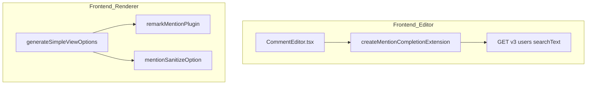
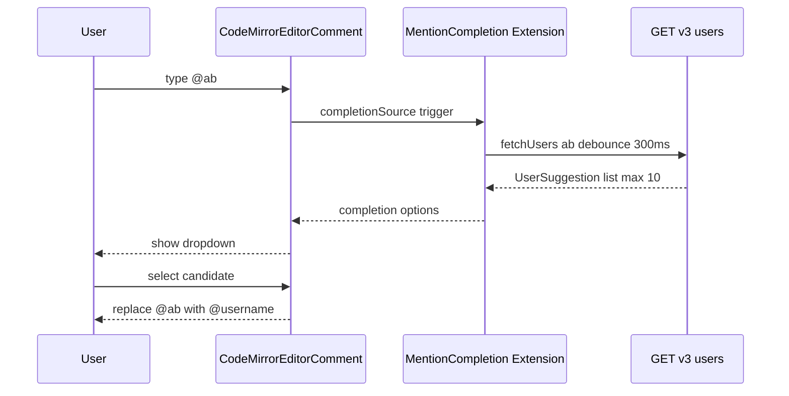

# Design Document: comment-mention-ux

## Overview

本設計はGROWIのページコメントにおけるメンションのユーザー体験改善を対象とする。

**Purpose**: コメント本文内の `@username` を視覚的に強調表示し、コメント入力時にユーザー候補をサジェストすることで、メンション機能の操作性を向上させる。

**Users**: GROWIを利用するすべてのチームメンバー。特にコメント経由のコミュニケーションを行うユーザー。

**Impact**: フロントエンドのレンダラー（remark プラグイン）とエディタ拡張（CodeMirror autocomplete）を改修する。

### Goals

- コメント本文内の `@username` を視覚的に強調表示する（Req 2）
- `@` 入力時にユーザー候補をサジェストし、入力補完を提供する（Req 3）

### Non-Goals

- バックエンドの変更（メンション通知修正は別スペック `comment-mention-notification` で対応）
- 表示名（`@name`）によるメンション
- モバイルプッシュ通知

---

## Architecture

### Existing Architecture Analysis

- **レンダラー**: `useCommentForCurrentPageOptions` → `generateSimpleViewOptions` → `remarkPlugins[]` / `rehypePlugins[]` の構成。プラグイン追加が容易
- **エディタ拡張**: `CodeMirrorEditorComment` の `appendExtensions` API で動的追加可能。`emojiAutocompletionSettings.ts` が先例パターン
- **ユーザー検索 API**: `GET /_api/v3/users/?searchText=...&selectedStatusList[]=active` が既存で利用可能

### Architecture Pattern & Boundary Map



**Architecture Integration**:
- レンダラーと autocomplete は既存パターンへの追加のみで、既存の境界を侵害しない
- `packages/editor` は `apps/app` に依存しないよう、ファクトリパターンで依存を注入

### Technology Stack

| Layer | Choice / Version | Role | Notes |
|-------|-----------------|------|-------|
| Markdown | unified / remark (既存) | `@username` AST 変換 | 新規 remark プラグイン追加 |
| Editor | CodeMirror 6 / `@codemirror/autocomplete` (既存) | `@` トリガー補完 | emoji パターン踏襲 |
| API | `GET /_api/v3/users/` (既存) | ユーザー検索 | `searchText` クエリパラメータ利用 |

---

## System Flows

### Req 3: メンションオートコンプリートフロー



---

## Requirements Traceability

| Requirement | Summary | Components | Interfaces | Flows |
|-------------|---------|------------|------------|-------|
| 2.1 | 有効メンションを強調表示 | `remarkMentionPlugin` | `mention` AST ノード → `span.mention-user` | — |
| 2.2 | 存在確認なし・全 `@username` パターンを同一スタイルでハイライト | `remarkMentionPlugin` | クライアント側でユーザー存在確認を行わない（サーバー往復コスト削減） | — |
| 2.3 | プレビューと投稿後の両方に適用 | `generateSimpleViewOptions` | `remarkPlugins.push` | — |
| 3.1 | `@` + 1文字以上でサジェスト表示 | `createMentionCompletionExtension` | `CompletionContext` trigger | Req 3 flow |
| 3.2 | 候補選択で `@username` に置換 | `createMentionCompletionExtension` | `apply` callback | Req 3 flow |
| 3.3 | 候補なしの場合はリスト非表示 | `createMentionCompletionExtension` | `null` 返却 | — |
| 3.4 | Escape で候補リストを閉じる | `@codemirror/autocomplete` | デフォルト動作 | — |
| 3.5 | 最大10件に制限 | `createMentionCompletionExtension` | `maxMatches: 10` | — |

---

## Components and Interfaces

### `remarkMentionPlugin`

| Field | Detail |
|-------|--------|
| Intent | remark AST 内のテキストノードから `@username` を検出し `mention` カスタムノードに変換する |
| Requirements | 2.1, 2.2, 2.3 |

**Responsibilities & Constraints**
- **ファイル**: `apps/app/src/services/renderer/remark-plugins/mention.ts`
- テキストノードを走査し `/\B@[\w@.-]+/g` にマッチする部分を切り出す
- マッチ箇所を `{ type: 'mention', value: '@username' }` カスタムノードに変換
- 対応する rehype ハンドラで `<span class="mention-user" data-mention="username">@username</span>` として出力
- ユーザー存在チェックは**クライアント側では行わない**（サーバー往復コストを避けるため。すべての `@username` パターンを同一スタイルで強調表示する）

**Contracts**: —（純粋な remark プラグイン関数）

**Implementation Notes**
- Integration: `generateSimpleViewOptions` の `remarkPlugins.push(mentionPlugin)` で追加
- Sanitize: `{ tagNames: ['span'], attributes: { span: ['className', 'data-mention'] } }` を追加する。許可属性を `className` と `data-mention` のみに限定することで、任意属性インジェクションによる XSS を防ぐ
- Risks: `rehype-sanitize` の設定変更を忘れると `<span>` が除去される

---

### `createMentionCompletionExtension`

| Field | Detail |
|-------|--------|
| Intent | `@` 入力トリガーでユーザー候補を非同期取得しサジェストを提供する CodeMirror Extension ファクトリ |
| Requirements | 3.1, 3.2, 3.3, 3.4, 3.5 |

**Responsibilities & Constraints**
- **ファイル**: `packages/editor/src/client/services-internal/extensions/mentionAutocompletionSettings.ts`
- `@` に続く1文字以上の入力で発火（`/(?<!\w)@[\w.-]+$/` でトリガー検出）
  - `remarkMentionPlugin` のパターン `/\B@[\w@.-]+/g` と文字クラスを統一（`.` `-` を含む）
- `fetchUsers` コールバックを通じてユーザー一覧を取得（外部注入）
- 候補選択時に入力中の `@文字列` を `@username` で置換
- `maxMatches: 10` で最大件数を制限（3.5）
- Escape / フォーカス外れで候補リストを閉じる（`@codemirror/autocomplete` デフォルト動作で 3.4 を実現）

**Contracts**: Service [x]

##### Service Interface
```typescript
interface UserSuggestion {
  username: string;
  name: string;
}

type FetchUsersFn = (query: string) => Promise<UserSuggestion[]>;

function createMentionCompletionExtension(fetchUsers: FetchUsersFn): Extension;
```
- Preconditions: `fetchUsers` は `query` 文字列で前方一致ユーザーを返す非同期関数
- Postconditions: 返値は CodeMirror に `appendExtensions` で登録可能な `Extension`

**Implementation Notes**
- Integration: `CommentEditor.tsx` の `useEffect` 内で `codeMirrorEditor?.appendExtensions?.(createMentionCompletionExtension(fetchUsers))` を呼び出す
- Validation: `fetchUsers` は 300ms デバウンス処理を `CommentEditor.tsx` 側で実装
- Risks: `packages/editor` は `apps/app` に依存しないこと。`fetchUsers` の型を `packages/editor` 内で定義し、実装を `apps/app` 側に持たせる

---

### `CommentEditor.tsx`（修正）

**Implementation Notes**（summary-only）

- `fetchUsers` 関数を定義: `/_api/v3/users/?searchText=${query}&selectedStatusList[]=active` を呼ぶ
- `useMemo(() => debounce(fetchFn, 300), [])` で 300ms デバウンス関数を生成し、リクエスト頻度を抑制する（`CommentEditor.tsx` は `useMemo` を一貫して使用しているため `useCallback + debounce` は使わない）
- `useEffect` 内で `createMentionCompletionExtension(fetchUsers)` を生成し `appendExtensions` で登録
- 既存の `codeMirrorEditor` インスタンス取得フロー（`useCodeMirrorEditorIsolated`）をそのまま利用

---

### `generateSimpleViewOptions`（修正）

**Implementation Notes**（summary-only）

- `remarkPlugins.push(mentionPlugin)` を追記
- `rehype-sanitize` の deepmerge に `mentionSanitizeOption` を追加
- コメントプレビュー（`CommentPreview`）と投稿後表示（`Comment`）が同一 options を使用するため、両方に自動適用される（2.3 を満たす）

---

## Data Models

本機能ではデータモデルの変更を伴わない。

---

## Error Handling

**ユーザー検索 API 失敗（frontend autocomplete）**
- `fetchUsers` が失敗した場合、CompletionContext は `null` を返し補完リストを非表示（3.3）
- ユーザーへのエラー表示は不要（補完はあくまで補助機能）

**remark プラグイン処理エラー**
- AST 変換中の例外は remark の標準エラーハンドリングに委ねる。コメントレンダリング全体が失敗しないよう、プラグイン内で try-catch を使用

### Monitoring

- `fetchUsers` のレスポンス時間が 500ms を超えた場合は `logger.warn` を記録（クライアント側）

---

## Testing Strategy

### Unit Tests

1. `remarkMentionPlugin` — `@username` の AST 変換、スペースなし連続テキストでの非変換、空文字・日本語のエッジケース
2. `createMentionCompletionExtension` — トリガー検出（`@a` で発火・`a` で非発火）、最大件数制限、候補選択時の置換

### Integration Tests

1. `GET /_api/v3/users/?searchText=ab` — 前方一致ユーザーが返却されること
2. 認証なしアクセスで 401 が返ること

### Performance

1. `fetchUsers` — `searchText` クエリで 10 件取得が 300ms 以内に返すこと（デバウンス時間内に完了）
