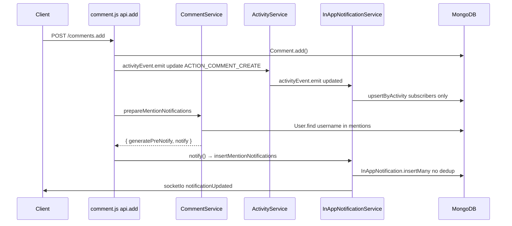
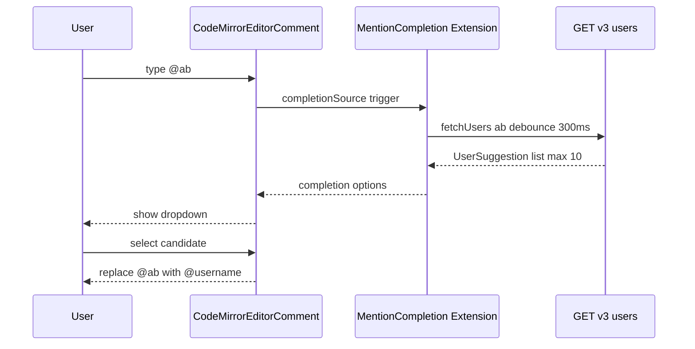

# Design Document: comment-mention

## Overview

This design covers the full comment mention feature in GROWI.

**Purpose**:
- Decouple mention notifications from the existing subscriber notification flow (`upsertByActivity`) and add an independent path that delivers notifications reliably on every comment post
- Improve mention usability by visually highlighting `@username` in comment body text and suggesting user candidates during comment input

**Users**: All GROWI team members, especially users who communicate via comments.

**Impact**: Modifies the backend notification pipeline (`InAppNotificationService`), comment route (`comment.js`), frontend renderer (remark plugin), and editor extension (CodeMirror autocomplete).

### Goals

- Deliver mention notifications reliably on every comment, regardless of comment or mention history (Req 1)
- Visually highlight `@username` in comment body text (Req 2)
- Provide input autocomplete by suggesting user candidates when `@` is typed (Req 3)

### Non-Goals

- Mentions by display name (`@name`)
- Mention notifications on comment edit
- Slack / global notification integration for mentions
- Mobile push notifications

---

## Architecture

### Existing Architecture Analysis

- **Notification flow**: `routes/comment.js:api.add` → `activityEvent.emit('update')` → `ActivityService` → `activityEvent.emit('updated')` → `InAppNotificationService.createInAppNotification` → `upsertByActivity`
- **Deduplication**: `upsertByActivity` merges within a 7-day window keyed on `{ user, target, action, createdAt: { $gt: lastWeek }, snapshot }`. Mentioned users go through the same path, which suppresses repeated mentions (root cause)
- **Existing getMentionedUsers**: Implemented in `CommentService`. Extracts mentions with `/\B@[\w@.-]+/g` and returns a list of IDs via `User.find`
- **Renderer**: `useCommentForCurrentPageOptions` → `generateSimpleViewOptions` → `remarkPlugins[]` / `rehypePlugins[]` structure. Easy to add plugins
- **Editor extension**: Dynamically addable via `CodeMirrorEditorComment`'s `appendExtensions` API. `emojiAutocompletionSettings.ts` is the established pattern
- **User search API**: `GET /_api/v3/users/?searchText=...&selectedStatusList[]=active` already exists

### Architecture Pattern & Boundary Map

```mermaid
graph TB
    subgraph Backend
        CommentRoute[comment.js api.add]
        CommentService[CommentService prepareMentionNotifications]
        ActivitySvc[ActivityService]
        InAppSvc[InAppNotificationService]
        upsert[upsertByActivity dedup7days]
        insertMention[insertMentionNotifications no dedup]
    end

    subgraph Frontend_Editor
        CommentEditor[CommentEditor.tsx]
        MentionFactory[createMentionCompletionExtension]
        UserAPI[GET v3 users searchText]
    end

    subgraph Frontend_Renderer
        CommentViewOptions[generateCommentViewOptions]
        RemarkMention[remarkMentionPlugin]
        SanitizeOpt[mentionSanitizeOption]
    end

    CommentRoute --> CommentService
    CommentRoute --> ActivitySvc
    ActivitySvc --> InAppSvc
    InAppSvc --> upsert
    CommentService --> insertMention
    CommentEditor --> MentionFactory
    MentionFactory --> UserAPI
    CommentViewOptions --> RemarkMention
    CommentViewOptions --> SanitizeOpt
```



**Architecture Integration**:
- Mention notifications are processed via the independent `insertMentionNotifications` path, separate from the existing `ACTION_COMMENT_CREATE` flow, bypassing the 7-day deduplication
- The existing `getAdditionalTargetUsers` code that feeds mentioned users into the `upsertByActivity` flow is removed. Without removal, users who are both page subscribers and mention targets would receive two notifications for the same comment
- The renderer and autocomplete are additive-only changes to existing patterns; they do not violate existing boundaries
- `packages/editor` uses a factory pattern for dependency injection to avoid depending on `apps/app`
- `generateCommentViewOptions` is introduced as a new function rather than modifying `generateSimpleViewOptions` directly, preventing mention plugin leakage into regular pages, search results, and timeline views

### Technology Stack

| Layer | Choice / Version | Role | Notes |
|-------|-----------------|------|-------|
| Backend | Node.js / Express (existing) | Notification flow extension | Modifies `InAppNotificationService` |
| Data | MongoDB / Mongoose (existing) | Direct `InAppNotification` insertion | No schema changes |
| Markdown | unified / remark (existing) | `@username` AST transformation | New remark plugin added |
| Editor | CodeMirror 6 / `@codemirror/autocomplete` (existing) | `@`-triggered completion | Follows emoji pattern |
| API | `GET /_api/v3/users/` (existing) | User search | Uses `searchText` query parameter |

---

## System Flows

### Req 1: Mention Notification Flow



### Req 3: Mention Autocomplete Flow



---

## Requirements Traceability

| Requirement | Summary | Components | Interfaces | Flows |
|-------------|---------|------------|------------|-------|
| 1.1 | Send mention notification on every comment post | `CommentService`, `InAppNotificationService` | `getMentionedUsers`, `insertMentionNotifications` | Req 1 flow |
| 1.2 | Only one notification per user for multiple mentions | `getMentionedUsers` | Deduplication via Set (existing) | Req 1 flow |
| 1.3 | Do not notify the comment author for self-mentions | `insertMentionNotifications` | Excludes `actionUserId` | Req 1 flow |
| 2.1 | Highlight valid mentions | `remarkMentionPlugin` | `mention` AST node → `span.mention-user` | — |
| 2.2 | Highlight all `@username` patterns without existence check | `remarkMentionPlugin` | No server round-trip for user existence (reduces cost) | — |
| 2.3 | Apply to both preview and post-submission display | `generateCommentViewOptions` | `remarkPlugins.push` | — |
| 3.1 | Show suggestions on `@` + 1 or more characters | `createMentionCompletionExtension` | `CompletionContext` trigger | Req 3 flow |
| 3.2 | Replace typed `@string` with `@username` on selection | `createMentionCompletionExtension` | `apply` callback | Req 3 flow |
| 3.3 | Do not show list when no candidates exist | `createMentionCompletionExtension` | Return `null` | — |
| 3.4 | Close candidate list on Escape | `@codemirror/autocomplete` | Default behavior | — |
| 3.5 | Limit candidate list to 10 items | `createMentionCompletionExtension` | `maxMatches: 10` | — |

---

## Components and Interfaces

### `SupportedAction` / `EssentialActionGroup` (modified)

- Add `ACTION_COMMENT_MENTION = 'COMMENT_MENTION'` to `interfaces/activity.ts`
  - Required for type safety as the value stored in the `InAppNotification.action` field
- Add `ACTION_COMMENT_MENTION` to `EssentialActionGroup` (`AllEssentialActions` is updated automatically)
  - `insertMentionNotifications` does not go through `initActivityEventListeners`, so this does not affect the notification generation flow itself
  - Added because `AllEssentialActions` is referenced in the notification list display and filtering logic

---

### `InAppNotificationService.insertMentionNotifications`

| Field | Detail |
|-------|--------|
| Intent | Insert notifications directly to mentioned users without deduplication |
| Requirements | 1.1, 1.3 |

**Responsibilities & Constraints**
- Uses `InAppNotification.insertMany({ ordered: false })` directly **without** `upsertByActivity` (so that a single validation error does not stop remaining insertions)
- Excludes `actionUserId` from `mentionedUserIds` (1.3)
- Sends real-time notification to target users via `emitSocketIo`
- Returns early if `mentionedUserIds` is empty

**Contracts**: Service [x]

##### Service Interface
```typescript
interface InAppNotificationService {
  insertMentionNotifications(
    mentionedUserIds: Types.ObjectId[],
    actionUserId: Types.ObjectId,
    activityId: Types.ObjectId,
    page: IPageHasId,
  ): Promise<void>;
}
```
- Preconditions: `mentionedUserIds` is a deduplicated array returned by `getMentionedUsers`
- Postconditions: Notifications are inserted for all users in `mentionedUserIds` excluding `actionUserId`, and socket events are emitted

**Implementation Notes**
- Snapshot: `generateSnapshot` is defined in `in-app-notification-utils.ts` and is not accessible from the route layer, so it is called inside `insertMentionNotifications`
- Risks: `insertMany` has no 7-day window, so high-frequency comments may increase notification volume. Acceptable because mentions are explicit user actions
- Performance: `getMentionedUsers` should return within 100ms even for 10 mentions in a single comment

---

### `remarkMentionPlugin`

| Field | Detail |
|-------|--------|
| Intent | Detect `@username` in remark AST text nodes and transform them into custom `mention` nodes |
| Requirements | 2.1, 2.2, 2.3 |

**Responsibilities & Constraints**
- **File**: `apps/app/src/services/renderer/remark-plugins/mention.ts`
- Traverses text nodes and splits out parts matching `/\B@[\w@.-]+/g`
- Transforms matches into `{ type: 'mention', value: '@username' }` custom nodes
- The corresponding rehype handler outputs `<span class="mention-user" data-mention="username">@username</span>`
- **No user existence check on the client side** (avoids server round-trip; all `@username` patterns are highlighted with the same style)

**Contracts**: — (pure remark plugin function)

**Implementation Notes**
- Sanitize: Add `{ tagNames: ['span'], attributes: { span: ['className', 'data-mention'] } }`. Limiting allowed attributes to `className` and `data-mention` only prevents XSS via arbitrary attribute injection
- Risks: If `rehype-sanitize` configuration is forgotten, `<span>` elements will be stripped

---

### `createMentionCompletionExtension`

| Field | Detail |
|-------|--------|
| Intent | CodeMirror Extension factory that asynchronously fetches user candidates and provides suggestions triggered by `@` input |
| Requirements | 3.1, 3.2, 3.3, 3.4, 3.5 |

**Responsibilities & Constraints**
- **File**: `packages/editor/src/client/services/mentionAutocompletionSettings.ts`
- Triggers on one or more characters after `@` (trigger detection via `/(?<!\w)@[\w.-]+$/`)
  - Character class aligned with `remarkMentionPlugin` pattern `/\B@[\w@.-]+/g` (includes `.` and `-`)
- Retrieves user list via the externally injected `fetchUsers` callback
- Replaces the typed `@string` with `@username` on candidate selection
- Limits maximum candidates to `maxMatches: 10` (3.5)
- Closes the candidate list on Escape / focus loss (`@codemirror/autocomplete` default behavior satisfies 3.4)

**Contracts**: Service [x]

##### Service Interface
```typescript
interface UserSuggestion {
  username: string;
  name: string;
}

type FetchUsersFn = (query: string) => Promise<UserSuggestion[]>;

function createMentionCompletionExtension(fetchUsers: FetchUsersFn): Extension;
```
- Preconditions: `fetchUsers` is an async function that returns prefix-matched users for a given `query` string
- Postconditions: Return value is an `Extension` registerable via `appendExtensions` in CodeMirror

**Implementation Notes**
- Risks: `packages/editor` must not depend on `apps/app`. Define the `fetchUsers` type inside `packages/editor` and keep the implementation in `apps/app`

---

### `generateCommentViewOptions` (new)

A comment-specific renderer options generator built on top of `generateSimpleViewOptions`, with `remarkMentionPlugin` and `mentionSanitizeOption` added. Since it is used for both comment preview and post-submission display, it satisfies Req 2.3 automatically. Implemented as an independent function rather than modifying `generateSimpleViewOptions` directly to prevent mention plugin leakage into regular pages, search results, and timeline views.

---

## Data Models

This feature involves no data model changes.

- **`InAppNotification`**: No changes. `insertMentionNotifications` inserts according to the existing schema
- **`User`**: No changes. Searched by `username` field

---

## Error Handling

**Mention notification failure (backend)**
- If `getMentionedUsers` or `insertMentionNotifications` throws, the comment post response has already been sent, so only `logger.error` is recorded and the failure is silent

**User search API failure (frontend autocomplete)**
- If `fetchUsers` fails, CompletionContext returns `null` and the completion list is hidden (3.3)
- No error display to the user (autocomplete is a convenience feature only)

**remark plugin processing error**
- Use try-catch inside the plugin so that a failed node passes through unchanged, preventing the entire comment rendering from failing

### Monitoring

- Log `logger.info` with the number of target users on each `insertMentionNotifications` call
- Log `logger.warn` on the client side if `fetchUsers` response time exceeds 500ms

---

## Requirement 4: Autocomplete Facility / Source Responsibility Separation

> **Added post-implementation.** Requirements 1–3 are implemented and merged. This section covers the architectural decoupling identified during reviewer validation.

### Boundary Commitments

#### This Spec Owns
- Moving the shared `autocompletion()` facility from `emojiAutocompletionSettings` to `defaultExtensions` as a standalone entry
- Exporting `emojiCompletionSource` from `emojiAutocompletionSettings.ts` to enable regression testing
- Regression test coverage for 4.2 (mention without emoji), 4.4 (coexistence), 4.6 (no emoji in code blocks)

#### Out of Boundary
- `mentionAutocompletionSettings.ts` — no functional changes; it is already correctly structured as a source-only extension
- `apps/app` code — the refactor is entirely within `packages/editor`
- The body of the `emojiAutocompletion` / `emojiCompletionSource` function — logic is unchanged

#### Allowed Dependencies
- `@codemirror/autocomplete ^6.18.4` — `autocompletion()` factory; config-merge behavior is the mechanism this design relies on
- `@codemirror/lang-markdown` — `markdownLanguage`, `markdown()` for test state setup (AC 6)
- `@codemirror/language` — `StreamLanguage`, `LanguageSupport`, `LanguageDescription` to build a **synchronous stub sublanguage** for the AC 6 test (do NOT use `@codemirror/language-data`'s `languages`; it loads sublanguages asynchronously and will not nest in a sync unit test)
- `@codemirror/state` — `EditorState` for test setup; `state.languageDataAt(name, pos)` is the verification API

#### Revalidation Triggers
- If `emojiAutocompletionSettings` is removed from `defaultExtensions`: emoji glyph renderer is lost; the shared `autocompletion()` facility persists independently (intended)
- If `@codemirror/autocomplete` introduces breaking changes to `combineConfig` semantics in a major version: re-verify that `{ icons: false }` from base + `{ addToOptions }` from emoji still merge as `{ icons: false, addToOptions: [...] }`

---

### Architecture

#### Before / After

```
BEFORE
defaultExtensions ──► emojiAutocompletionSettings
                           ├── autocompletion({ addToOptions, icons:false })  ← shared facility BUNDLED IN EMOJI
                           └── markdownLanguage.data.of({ autocomplete: emojiAutocompletion })
mentionAutocompletionSettings:
  └── markdownLanguage.data.of({ autocomplete: mentionSource })  ← implicit runtime dependency on emoji

AFTER
defaultExtensions ──► autocompletion({ icons:false })          ← shared facility, standalone
              ──────► emojiAutocompletionSettings
                           ├── autocompletion({ addToOptions })  ← emoji-specific UI only
                           └── markdownLanguage.data.of({ autocomplete: emojiCompletionSource })
mentionAutocompletionSettings:
  └── markdownLanguage.data.of({ autocomplete: mentionSource })  ← independent peer
```

#### Config-Merge Guarantee

`autocompletion()` uses `Facet.define` with `combineConfig`. Multiple calls produce multiple facet inputs that are merged. Net effect of `autocompletion({ icons: false })` + `autocompletion({ addToOptions: [...] })` is `{ icons: false, addToOptions: [...] }`. Verified against `@codemirror/autocomplete ^6.18.4`.

#### Technology Stack

| Layer | Choice / Version | Role |
|-------|-----------------|------|
| Editor extensions | `@codemirror/autocomplete ^6.18.4` | `autocompletion()` facility, `CompletionSource` type |
| Test state setup | `@codemirror/lang-markdown`, `@codemirror/language` (`StreamLanguage`/`LanguageSupport`/`LanguageDescription`) | AC 6 fenced-code scoping verification via a synchronous stub sublanguage (NOT `@codemirror/language-data`, which loads async) |
| Test verification API | `EditorState.languageDataAt(name, pos)` (`@codemirror/state`) | Confirm scoping mechanism at a given cursor position |

---

### File Structure Plan

```
packages/editor/src/client/
├── stores/
│   └── use-default-extensions.ts                       # MODIFIED: add autocompletion({ icons:false }) to defaultExtensions
└── services-internal/extensions/
    ├── emojiAutocompletionSettings.ts                   # MODIFIED: remove icons:false; export emojiCompletionSource
    └── emojiAutocompletionSettings.spec.ts              # NEW: AC 4.4 and 4.6 regression tests
packages/editor/src/client/services/
└── mentionAutocompletionSettings.spec.ts                # MODIFIED: add AC 4.2 explicit independence test
```

---

### Requirements Traceability (Requirement 4)

| Requirement | Summary | Component | Notes |
|-------------|---------|-----------|-------|
| 4.1 | `autocompletion()` as standalone shared entry | `defaultExtensions` | `icons:false` moves here |
| 4.2 | Mention works without emoji | `mentionAutocompletionSettings` (unchanged) | Test makes independence explicit |
| 4.3 | Emoji retains glyph renderer and source | `emojiAutocompletionSettings` | `addToOptions` and source preserved |
| 4.4 | Emoji and mention coexist | Both `markdownLanguage.data.of` sources active | Not suppressed by each other |
| 4.5 | Removing shared facility disables both | `defaultExtensions` is single shared dependency | Proven by design structure |
| 4.6 | No emoji in fenced code blocks | `markdownLanguage.data.of` scoping | Locked by `state.languageDataAt` test |
| 4.7 | Main page editor no regression | `defaultExtensions` consumed by all editors | `autocompletion()` merge is additive |

---

### Components and Interfaces

#### `defaultExtensions` — `use-default-extensions.ts` (modified)

| Field | Detail |
|-------|--------|
| Intent | Provide the shared CodeMirror `autocompletion()` facility as a standalone editor default |
| Requirements | 4.1, 4.5, 4.7 |

**Change**: Add `import { autocompletion } from '@codemirror/autocomplete'` and insert `autocompletion({ icons: false })` before `emojiAutocompletionSettings`:

```typescript
import { autocompletion } from '@codemirror/autocomplete';
// ...
const defaultExtensions: Extension[] = [
  // ... existing extensions unchanged ...
  autocompletion({ icons: false }),  // shared facility — not owned by any feature
  emojiAutocompletionSettings,       // emoji-specific: glyph renderer + emoji source
];
```

**Contracts**: No interface change. The `appendExtensions` API and all consumers are unaffected.

---

#### `emojiAutocompletionSettings` — `emojiAutocompletionSettings.ts` (modified)

| Field | Detail |
|-------|--------|
| Intent | Provide emoji-specific CodeMirror config: glyph renderer and emoji completion source |
| Requirements | 4.3, 4.6 |

**Changes**:
1. Replace `autocompletion({ addToOptions: [...], icons: false })` with `autocompletion({ addToOptions: [...] })`. `icons: false` is removed — it is now the shared base's responsibility.
2. Export the internal `emojiAutocompletion` function under the name `emojiCompletionSource` to enable AC 4.6 scoping verification in tests.

```typescript
export const emojiCompletionSource = (context: CompletionContext): CompletionResult | null => {
  /* body unchanged */
};

export const emojiAutocompletionSettings = [
  autocompletion({ addToOptions: [emojiGlyphRenderer] }),  // emoji-specific UI
  markdownLanguage.data.of({ autocomplete: emojiCompletionSource }),
];
```

**Implementation Notes**
- `icons: false` must not remain on the emoji `autocompletion()` call. Ownership is now the shared base; emoji must not implicitly re-claim it.
- The export name `emojiCompletionSource` (over `emojiAutocompletion`) clarifies the type role: it is a `CompletionSource` function, not a settings object.

---

#### `emojiAutocompletionSettings.spec.ts` (new)

Covers AC 4.4 (coexistence) and AC 4.6 (code-block scoping).

**AC 4.4 test**: Call `emojiCompletionSource` with a `CompletionContext` containing `:smi` (no markdown language needed for direct function call). Separately call `createMentionCompletionSource(mockFetch)` with `@ab`. Both must return non-null results, confirming neither suppresses the other.

**AC 4.6 test** (scoping verification using `state.languageDataAt`):

> **Critical constraint (empirically verified):** The fenced-code sublanguage MUST be loaded **synchronously** for the scoping to be observable in a unit test. `@codemirror/language-data`'s `languages` loads sublanguages **asynchronously** (`LanguageDescription.load()`), so `codeLanguages: languages` does NOT nest a sublanguage in a synchronous test — the ` ```js ``` ` region stays plain markdown code text, markdown's language data applies throughout, and `state.languageDataAt('autocomplete', posInBlock)` still returns the emoji source (verified: `inBlock contains emojiSource: true`). The `.not.toContain` assertion would then FAIL. Since no concrete sublanguage parser (e.g. `@codemirror/lang-javascript`) is a dependency of `packages/editor`, the test MUST build a **synchronous stub sublanguage** via `StreamLanguage.define` + `LanguageDescription.of` and pass it as `codeLanguages: [stubDesc]`.

```typescript
import { EditorState } from '@codemirror/state';
import { markdown, markdownLanguage } from '@codemirror/lang-markdown';
import {
  StreamLanguage,
  LanguageSupport,
  LanguageDescription,
} from '@codemirror/language';
import type { CompletionSource } from '@codemirror/autocomplete';

it('scopes emoji source to markdown language — not active inside fenced code blocks', () => {
  // A synchronously-loaded stub sublanguage so the ```js region actually nests in a unit test.
  // codeLanguages: languages (from @codemirror/language-data) loads ASYNC and would NOT nest here.
  const stubParser = StreamLanguage.define({ token: (s) => { s.next(); return null; } });
  const jsDesc = LanguageDescription.of({
    name: 'javascript',
    alias: ['js'],
    support: new LanguageSupport(stubParser),
  });

  const doc = '```js\n:smi\n```\n\n:smi';
  const state = EditorState.create({
    doc,
    extensions: [
      markdown({ base: markdownLanguage, codeLanguages: [jsDesc] }),
      emojiAutocompletionSettings,
    ],
  });

  const posInBlock = doc.indexOf(':smi') + 1;       // cursor inside ```js block
  const posOutside = doc.lastIndexOf(':smi') + 1;   // cursor in normal markdown

  // state.languageDataAt(name, pos) returns language-data values at the active language for pos
  const sourcesInBlock = state.languageDataAt<CompletionSource>('autocomplete', posInBlock);
  const sourcesOutside = state.languageDataAt<CompletionSource>('autocomplete', posOutside);

  expect(sourcesInBlock).not.toContain(emojiCompletionSource);
  expect(sourcesOutside).toContain(emojiCompletionSource);
});
```

`state.languageDataAt` is an instance method on `EditorState` (from `@codemirror/state`). With a synchronous sublanguage nested inside ` ```js ``` `, the active language there is the stub (not markdown), so markdown's language data — including `emojiCompletionSource` — is not returned at `posInBlock` but IS returned at `posOutside`. This proves the `markdownLanguage.data.of` scoping mechanism that prevents emoji completions inside code blocks. (Both the failure of the async approach and the success of the stub approach were verified empirically against the installed CodeMirror versions during design validation.)

---

#### `mentionAutocompletionSettings.spec.ts` (modified)

**AC 4.2 test** (new case): Create `createMentionCompletionSource(mockFetch)` in a state that has no `emojiAutocompletionSettings` extension. Call with `@ab`. Expect a non-null result. This documents and regression-locks the independence contract — the source already passes; the test makes the guarantee explicit.

---

### Testing Strategy

| Test | File | AC | Assertion |
|------|------|----|-----------|
| `emojiCompletionSource` returns completions for `:smi` | `emojiAutocompletionSettings.spec.ts` | 4.4 | Source function is callable without emoji setup |
| `createMentionCompletionSource` returns completions with no emoji in state | `mentionAutocompletionSettings.spec.ts` | 4.2 | Mention source independent of emoji extension |
| `state.languageDataAt` at code-block pos does NOT contain emoji source | `emojiAutocompletionSettings.spec.ts` | 4.6 | Scoping mechanism prevents emoji in ` ```js ``` ` |
| `state.languageDataAt` at normal pos DOES contain emoji source | `emojiAutocompletionSettings.spec.ts` | 4.6 | Positive control — source reachable in markdown context |

Run verification: `pnpm vitest run emojiAutocompletionSettings` and `pnpm vitest run mentionAutocompletionSettings` from `packages/editor`.
