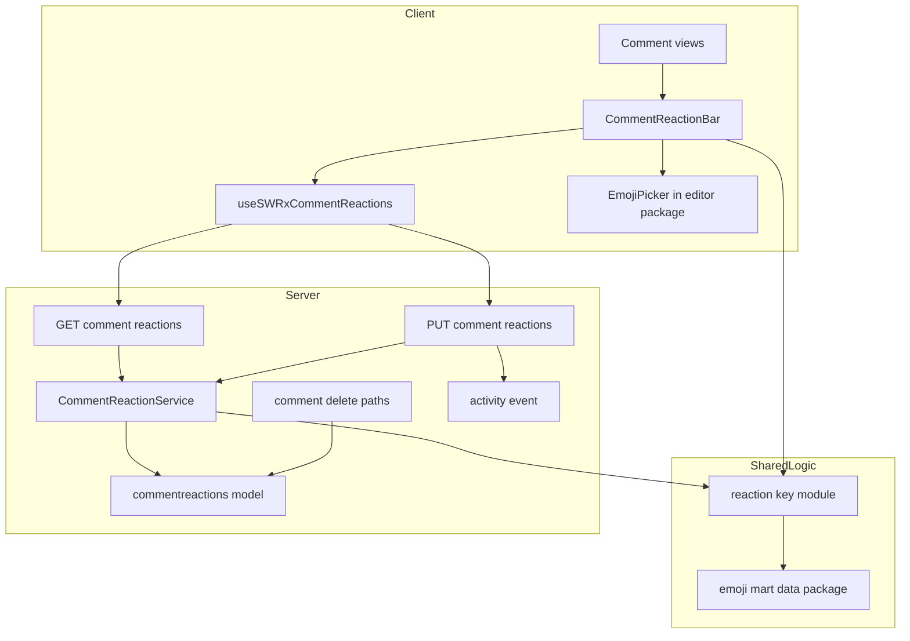
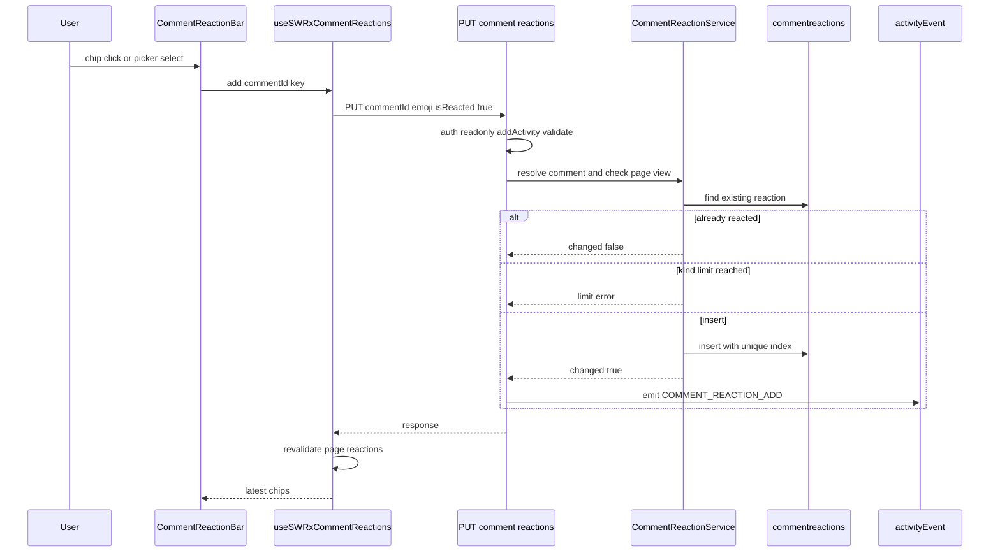
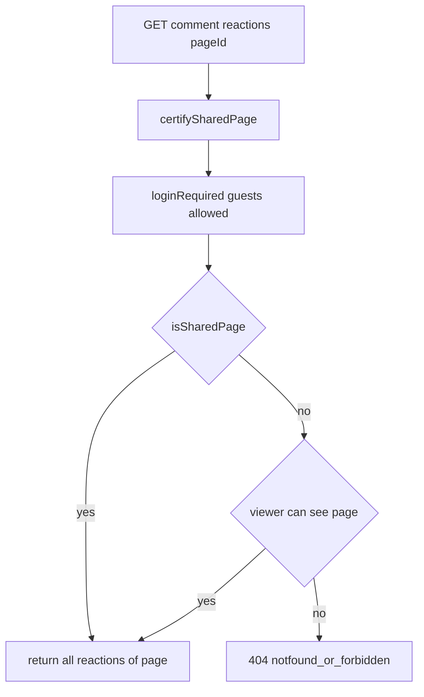

# Design Document: comment-reactions

## Overview

**Purpose**: ページのコメントに、Slack のメッセージリアクションのような絵文字リアクションを付けられるようにする。返信を書かずに、軽い意思表示ができるようにする。

**Users**: ログインユーザーは、通常コメントとインラインコメント（どちらも返信を含む）にリアクションを付けたり外したりする。ゲストと共有リンク閲覧者は、リアクションを読み取り専用で見る。管理者は、リアクションの追加・解除を監査ログで追う。

**Impact**: 新しいコレクション `commentreactions` と、その読み書きの apiv3 エンドポイントを足す。コメントの表示部品（`CommentCard` の `footer`）にリアクションバーを差し込む。コメント・ページの削除経路、監査ログの action 定義と snapshot、G2G 移行のコレクション一覧、絵文字データのパッケージを拡張する。既存のコメント取得 API（`GET /_api/v3/comments`）の契約は変えない。

### Goals
- 通常コメントとインラインコメント（返信を含む）に、標準絵文字のリアクションを追加・解除できる（要件 2、3）
- 同じ絵文字をチップにまとめ、人数・自分のリアクション・リアクションした利用者を示す（要件 1）
- 肌の色を Slack 準拠（`skin-tone-2`〜`6`、肌の色ごとに別のリアクション）で扱う（要件 4）
- 読み取りの範囲をコメント一覧 API と一致させる（要件 6）
- 監査ログへの記録、削除の連鎖、G2G 移行に対応する（要件 8、9、10）

### Non-Goals
- Slack ワークスペースのカスタム絵文字、GROWI 独自のカスタム絵文字（キーの名前空間で受け入れられる形にするだけ）
- ページそのものへのリアクション
- リアルタイム反映、通知、Slack との同期
- 複数人の絵文字での人ごとの肌の色、利用者ごとの既定の肌の色の設定（サーバーには持たない）
- エディタの絵文字入力（`EmojiButton`、自動補完）の挙動の変更

## Boundary Commitments

### This Spec Owns
- `commentreactions` コレクション（Prisma モデルと Mongoose スキーマ）と、その一意性の不変条件 `(commentId, userId, emoji)`
- リアクションキーの形式（`unicode:<shortcode>[::skin-tone-<2..6>]`）、その検証・正規化・グリフ解決（`reaction-key` モジュール）
- apiv3 の `GET` / `PUT /_api/v3/comment-reactions` の契約（入力、応答、認可、エラー）
- 1コメントあたりの絵文字の種類数の上限（`MAX_REACTION_KINDS_PER_COMMENT`）
- 監査ログの action `COMMENT_REACTION_ADD` / `COMMENT_REACTION_REMOVE` と、その snapshot の variant（`CommentReactionSnapshot`）
- 画面側のリアクションの取得フック（SWR キー `['/comment-reactions', pageId, shareLinkId]`）と、リアクションバーの部品群
- `packages/editor` の公開コンポーネント `EmojiPicker`（エディタに依存しない、遅延読み込みのピッカー）
- `@growi/emoji-mart-data` の出力の拡張（肌の色違いのグリフ、別名の対応表）

### Out of Boundary
- コメントの取得と件数（`comment` スペック）。`ICommentListItem` と `GET /_api/v3/comments` は変更しない。リアクションはコメント件数に数えない
- コメントの作成・編集・削除・解決の挙動（`comment.js` の apiv1、`inline-comment`）。本スペックは、削除の経路にリアクションの削除を1行足すことだけを持つ
- 共有リンクの有効性の判定と、共有リンク閲覧者を読み取り専用とする方針（`share-link-comments`）
- 共有リンクの画面と検索結果のプレビューでインラインコメントを出さない方針（`comment` 要件 6.5、`inline-comment` 要件 6）。本スペックはそれに従うだけ
- snapshot の判別可能ユニオンという仕組み自体（`activity-log-snapshot`）。本スペックは variant を1つ足すだけ
- 監査ログ画面の表示（`activity-log-snapshot-viewer`）
- エディタの `EmojiButton` と絵文字の自動補完

### Allowed Dependencies
- サーバー: Prisma（`comments`、`users`、`commentreactions`）、`findPageAndMetaDataByViewer`、`certifySharedPage`、`loginRequiredFactory`、`accessTokenParser`、`excludeReadOnlyUserIfCommentNotAllowed`、`generateAddActivityMiddleware`、`activityEvent`、`apiV3FormValidator`、`@growi/emoji-mart-data`
- `comment` スペックの型 `ICommentCreatorSummary` と、整形関数 `toCreatorSummary`（export を足す）。依存の向きは「`comment-reaction` → `comment`」のみ
- 削除の経路（`comment` の `removeWithReplies`、`inline-comment` の `deleteReply`、`deleteCompletelyOperation`）は、Prisma の `commentreactions` だけを直接使う。`comment-reaction` 機能のコードは import しない
- クライアント: `states/context.ts` のフック、`useIsCommentActionBlockedForReadOnlyUser`、`useShareLinkId`、`apiv3-client`、`toastr`、reactstrap、`@growi/editor/dist/client/components/EmojiPicker`
- コメントの表示部品（`client/components/PageComment/`、`features/inline-comment/client/`）は `comment-reaction` のクライアント部品を import してよい。逆向き（`comment-reaction` → それらの部品）は禁止
- 依存の向き（左にだけ import する）: `interfaces` → `utils`（reaction-key）→ `server/models` → `server/service` → `server/routes`。クライアントは `interfaces` → `utils` → `client/stores` → `client/components`

### Revalidation Triggers
- リアクションキーの形式の変更（名前空間の追加、肌の色の表記の変更）。G2G で運んだ既存データ、監査ログの snapshot、将来の Slack 連携に影響する
- `GET /_api/v3/comment-reactions` の応答の形、または認可の条件の変更（共有リンクのゲストにも届く）
- `comment` スペックの `GET /_api/v3/comments` の認可の条件の変更（要件 6.1 により、本スペックの GET も揃える必要がある）
- コメントの削除の経路の追加・変更（新しい経路でリアクションの削除が漏れる）
- `@growi/emoji-mart-data` の出力形の変更（本文のレンダラー、エディタの自動補完、本スペックの検証が共有している）
- `ICommentCreatorSummary` の項目の変更（リアクションした利用者の情報も同じ規則に従う。要件 6.4）
- emoji-mart のバージョン更新（ショートコードの変化で保存済みのキーが解決できなくなる）

## Architecture

### Existing Architecture Analysis
- コメントは `comments` コレクションに、通常コメントとインラインコメント（`isInline`）が同居している。取得は `GET /_api/v3/comments`（`features/comment/server/routes/list.ts`）、画面は `useSWRxCommentList` から派生した `useSWRxPageComment`（通常コメント）と `useSWRxInlineComments`（インラインコメント）で取得する。
- 書き込みは、通常コメントが apiv1（`server/routes/comment.js`）、インラインコメントが apiv3（`features/inline-comment/server/routes/`）。
- 表示は共通の外枠 `CommentCard`（slot: `headerEnd` / `beforeBody` / `children` / `footer`）。`Comment.tsx`、`InlineCommentItem`、`InlineCommentReplyItem`、`CollapsedInlineCommentItem`、`InlineCommentPopoverEntry` が使っている。
- 新しいコレクションは、移行期間中は Mongoose スキーマがインデックスを作り、Prisma 拡張が読み書きする（`.claude/rules/model.md`）。

### Architecture Pattern & Boundary Map



**Architecture Integration**:
- 選んだ形: 既存の feature-based 構成に、新しい機能ディレクトリ `features/comment-reaction/` を足す。サーバーは route → service → Prisma の3層、クライアントは SWR フック → 表示部品。
- 境界: リアクションのデータと規則は `comment-reaction` が単独で持つ。コメント側の変更は「表示部品への差し込み」と「削除経路への1行」だけで、どちらもコメント側からの一方向の依存になる。
- 守る既存のパターン: apiv3 の route handler factory、404 一様応答、`addActivity` の正規の順序、Mongoose によるインデックス作成と Prisma 拡張の併用、SWR のキーに `shareLinkId` を含める取得フック。
- 新しい部品の理由: 読み取りの API を分けるのは、`comment` スペックの契約を変えないため（research.md の Decision）。`reaction-key` を独立させるのは、サーバーの検証とクライアントの表示・変換で同じ規則を使うため。
- Steering との整合: Feature-Based Architecture、server/client の分離、Jotai/SWR の使い分け、named export、テストの co-location。

### Technology Stack

| Layer | Choice / Version | Role in Feature | Notes |
|-------|------------------|-----------------|-------|
| Frontend | React（Next.js Pages Router）、SWR、reactstrap | リアクションバー、チップ、利用者一覧のツールチップ | 既存のスタック |
| Frontend | emoji-mart 5.6.0、@emoji-mart/react 1.1.1、@emoji-mart/data 1.2.1（`packages/editor` 内） | 絵文字ピッカー（肌の色の選択） | 新しい依存は無い。`packages/editor` の既存の依存を使う |
| Shared | `@growi/emoji-mart-data`（workspace） | 絵文字の存在・肌の色対応・別名・グリフの解決 | 出力を拡張する |
| Backend | Express apiv3、express-validator | 読み書きのエンドポイント | 既存のスタック |
| Data | MongoDB、Prisma（mongodb プロバイダ）、Mongoose | `commentreactions` の永続化（Prisma で読み書き、Mongoose でインデックス作成とインポート時の型変換） | 新しいコレクション |

## File Structure Plan

### Directory Structure
```
apps/app/src/features/comment-reaction/
├── interfaces/
│   ├── index.ts                     # 公開する型と定数の barrel
│   ├── reaction-key.ts              # ReactionKey、ParsedReactionKey、SkinTone の型
│   ├── reaction-summary.ts          # CommentReactionSummary、ReactionChip、ReactionUser
│   ├── api.ts                       # 各エンドポイントの要求・応答の型
│   └── limits.ts                    # MAX_REACTION_KINDS_PER_COMMENT
├── utils/
│   ├── index.ts                     # barrel
│   ├── reaction-key.ts              # parse / normalize / toSlackName / fromPickerSelection / resolveGlyph（純粋関数、サーバーとクライアントで共有）
│   └── reaction-key.spec.ts
├── server/
│   ├── index.ts                     # models の re-export（setup-models から読み込む）
│   ├── models/
│   │   ├── index.ts
│   │   ├── comment-reaction.ts      # Mongoose スキーマ（一意インデックス、ObjectId 参照）＋ Prisma 拡張（_id / __v）
│   │   └── comment-reaction.integ.ts
│   ├── service/
│   │   ├── comment-reaction-service.ts       # add / remove / listByPage（上限、冪等、集計）
│   │   ├── comment-reaction-service.integ.ts
│   │   ├── summarize-reactions.ts            # 行の配列 → コメントごとのチップの配列（並び順・利用者の整形を含む純粋関数）
│   │   └── summarize-reactions.spec.ts
│   └── routes/
│       ├── list.ts                  # GET /_api/v3/comment-reactions
│       ├── list.integ.ts
│       ├── update.ts                # PUT /_api/v3/comment-reactions（isReacted で追加・解除を明示）
│       ├── update.integ.ts
│       ├── resolve-reactable-comment.ts   # コメント ID → 閲覧判定込みの対象コメント（404 一様応答の判定を1か所に閉じ込める）
│       └── read-parity.integ.ts     # コメント一覧 API と読み取りの範囲が一致することの検査
└── client/
    ├── stores/
    │   ├── comment-reactions.ts     # useSWRxCommentReactions（取得、add / remove）
    │   └── comment-reactions.spec.tsx
    ├── hooks/
    │   └── use-can-react-to-comments.ts   # 画面上でリアクションできるかの判定
    └── components/
        ├── index.ts                 # 公開: CommentReactionBar だけ
        └── CommentReactionBar/
            ├── CommentReactionBar.tsx       # 1コメント分のチップ列と「＋」
            ├── CommentReactionBar.spec.tsx
            ├── CommentReactionBar.module.scss
            ├── ReactionChip.tsx             # 絵文字・人数・自分の強調・押下、利用者一覧のツールチップ
            └── AddReactionButton.tsx        # 「＋」とピッカーの開閉、上限時の無効化

packages/editor/src/client/components/EmojiPicker/
├── EmojiPicker.tsx                  # 遅延読み込みの emoji-mart ピッカー（肌の色の選択あり）。エディタに依存しない
├── EmojiPicker.spec.tsx
└── index.ts
```

### Modified Files
- `apps/app/prisma/schema.prisma` — `model commentreactions` を追加。`users` と `comments` に逆向きのリレーション項目を追加。`type ActivitiesSnapshot` に `emoji String?` を追加。
- `apps/app/src/utils/prisma.ts` — `CommentReactionExtension` を `$extends` の連鎖に追加。
- `apps/app/src/server/crowi/setup-models.ts` — `setupIndependentModels` に `import('~/features/comment-reaction/server/models')` を追加（インデックス作成とインポート時の型変換のため）。
- `apps/app/src/server/routes/apiv3/index.js` — `/comment-reactions` の router を登録（GET / PUT）。
- `apps/app/src/features/comment/server/models/comment.ts` — `removeWithReplies` で、返信の ID を集めてから、同じトランザクションで `commentreactions.deleteMany({ commentId: { in: [本体, ...返信] } })` を実行する。
- `apps/app/src/features/inline-comment/server/service/inline-comment-service.ts` — `deleteReply` を、返信の削除と `commentreactions.deleteMany({ commentId })` のトランザクションにする（起点の削除は `removeWithReplies` でカバーされる）。
- `apps/app/src/server/service/page/delete-completely-operation.ts` — 既存のコメント削除のトランザクションに `commentreactions.deleteMany({ pageId: { in: pageIdStrings } })` を追加。
- `apps/app/src/features/comment/server/serializers/to-comment-list-item.ts` — `toCreatorSummary` を export する（挙動は変えない）。
- `apps/app/src/interfaces/activity.ts` — `ACTION_COMMENT_REACTION_ADD` / `ACTION_COMMENT_REACTION_REMOVE` を `SupportedAction` と `MediumActionGroup` に追加。`CommentReactionSnapshot` を定義して `ISnapshot` に追加。
- `apps/app/src/server/models/activity.ts` — Mongoose の `snapshotSchema` に `emoji` を追加。
- `apps/app/src/server/service/import/non-transferable-collections.ts` — `TRANSFERABLE_COLLECTIONS` に `'commentreactions'` を追加。
- `apps/app/src/client/components/PageComment/Comment.tsx` — `CommentCard` の `footer` に `CommentReactionBar` を追加（`isReadOnly` を渡す）。
- `apps/app/src/features/inline-comment/client/components/InlineCommentItem/InlineCommentItem.tsx`、`InlineCommentReplies.tsx`、`InlineCommentBodyInteraction/InlineCommentPopoverEntry.tsx` — `footer` に `CommentReactionBar` を追加。`CollapsedInlineCommentItem` には追加しない（折りたたみ表示では本文も出さないため）。
- `apps/app/public/static/locales/{en_US,fr_FR,ja_JP,ko_KR,zh_CN}/translation.json` — `comment_reaction.*` の文言を追加。
- `apps/app/public/static/locales/{en_US,fr_FR,ja_JP,ko_KR,zh_CN}/admin.json` — `COMMENT_REACTION_ADD` / `COMMENT_REACTION_REMOVE` の表示名を追加。
- `packages/emoji-mart-data/bin/extract.ts` — 肌の色に対応する絵文字は6件の `skins`（既定＋`skin-tone-2`〜`6`）を出力し、名前付き export `aliases` を追加する。型 `NativeLookup` の `skins` を非空タプル `readonly [{ native: string }, ...{ native: string }[]]` にする。

## System Flows

### リアクションの追加（チップの押下、またはピッカーでの選択）



- emit は `res.apiv3()` より前に行う（`activity-recording.md` Rule 1）。`changed: false` のときは emit しない（要件 9.4）。
- 一意インデックスの重複エラー（同時の二重追加）は `changed: false` として扱う（要件 2.7）。
- 解除（`isReacted: false`）も同じ流れで、`deleteMany` の件数が 0 なら `changed: false`（要件 2.8）。

### 読み取りの認可（要件 6.1）



- `GET /_api/v3/comments`（`list.ts`）と同じ部品・同じ順序で組む。ゲスト閲覧が許可されていないサイトのゲストは `loginRequired` が拒否する。

## Requirements Traceability

| Requirement | Summary | Components | Interfaces | Flows |
|-------------|---------|------------|------------|-------|
| 1.1, 1.2, 1.3 | 絵文字ごとのチップ、人数、肌の色ごとに別チップ | summarizeReactions, ReactionChip | `ReactionChip.emoji` / `count` | — |
| 1.4 | 自分のリアクションの区別 | summarizeReactions, ReactionChip | `ReactionChip.reactedByMe`、`aria-pressed` | — |
| 1.5, 1.10 | リアクションした利用者の表示、退会者は投稿者と同じ規則 | summarizeReactions, ReactionChip | `ReactionUser`（`ICommentCreatorSummary` または ID 文字列） | — |
| 1.6 | 最初に付いた順 | summarizeReactions | チップの並び（残っている行の最小 `createdAt` の昇順） | — |
| 1.7 | リアクションが無ければチップなし | CommentReactionBar | — | — |
| 1.8 | 末尾のコメント欄とインラインコメントの両方 | CommentReactionBar の差し込み先 | `CommentCard.footer` | — |
| 1.9 | 退会・削除された利用者も人数に数える | summarizeReactions | `count` は行数 | — |
| 2.1, 2.2, 2.3 | チップの押下で追加・解除、0 で非表示 | ReactionChip, useSWRxCommentReactions, update route | PUT（`isReacted`） | 追加 |
| 2.4, 2.5 | 同一絵文字は1つ、異なる絵文字は複数 | commentreactions model | 一意インデックス `(comment, user, emoji)` | — |
| 2.6 | 自分のコメントにも付けられる | CommentReactionService | 投稿者の判定をしない | — |
| 2.7, 2.8 | 古い画面からの重複要求は成功扱い | CommentReactionService | `{ changed: false }` | 追加 |
| 2.9 | 完了後に最新の状態を表示 | useSWRxCommentReactions | 成功後の `mutate()` | 追加 |
| 2.10 | 失敗の表示と操作前の状態 | useSWRxCommentReactions, CommentReactionBar | `toastError`、楽観的更新なし | — |
| 3.1, 3.2 | 「＋」でピッカーを開く | AddReactionButton, EmojiPicker | `EmojiPickerProps` | — |
| 3.3, 3.4 | 新規はチップ追加、既存は追加と同じ扱い | AddReactionButton, reaction-key | `fromPickerSelection` → PUT | 追加 |
| 3.5 | 肌の色の選択 | EmojiPicker | emoji-mart の `skin` / `skinTonePosition` | — |
| 3.6 | 閉じたら変更しない | AddReactionButton | `onClose` | — |
| 3.7 | インラインコメントと返信にも「＋」と追加・解除 | CommentReactionBar の差し込み先 | — | — |
| 4.1, 4.2 | 標準絵文字だけ、存在しない絵文字は拒否 | reaction-key, add route | 400 `invalid-reaction-emoji` | — |
| 4.3, 4.4 | 肌の色は 2〜6、非対応の絵文字への肌の色は拒否 | reaction-key | `ParsedReactionKey.skinTone` | — |
| 4.5 | 別名を1つの絵文字として扱う | reaction-key | `normalizeReactionKey` | — |
| 4.6 | Slack のリアクション名と1対1 | reaction-key | `toSlackReactionName` | — |
| 5.1, 5.2 | 閲覧権限のあるログインユーザーだけ | update route | `loginRequiredStrictly`、閲覧判定 | — |
| 5.3 | 権限なし・存在しないコメントは同じ応答 | resolveReactableComment | 404 `notfound_or_forbidden` | — |
| 5.4, 5.5 | 閲覧専用ユーザーはコメント設定に連動 | update route, useCanReactToComments | `excludeReadOnlyUserIfCommentNotAllowed`、`useIsCommentActionBlockedForReadOnlyUser` | — |
| 5.6, 5.7 | 共有リンク・ゲストは手段なし | useCanReactToComments, update route | `loginRequiredStrictly`、「＋」非表示、チップは非活性 | — |
| 6.1 | コメント一覧 API と同じ範囲で返す | list route | 認可の部品を `list.ts` と共有 | 読み取りの認可 |
| 6.2 | ゲスト・共有リンクにも読み取り専用で表示 | CommentReactionBar | `canReact = false` | — |
| 6.3 | 共有リンク画面・検索プレビューでインラインのリアクションを出さない | 差し込み先の選定 | インラインコメントの部品が描画されない画面には出ない | — |
| 6.4 | 利用者情報は4項目 | summarizeReactions | `toCreatorSummary` の再利用 | — |
| 6.5 | 取得失敗はコメント表示を妨げない | list route, CommentReactionBar | 500 `comment-reaction-list-failed`、エラー時はバーを描画しない | — |
| 7.1, 7.2, 7.3 | 種類数の上限 20、超えたら拒否、既存チップは可 | CommentReactionService, AddReactionButton | 409 `reaction-kind-limit-exceeded`、`MAX_REACTION_KINDS_PER_COMMENT` | 追加 |
| 8.1 | 通常コメントの削除でリアクションも削除 | removeWithReplies | `commentreactions.deleteMany` | — |
| 8.2 | インラインコメントとその返信の削除 | removeWithReplies, deleteReply | 同上 | — |
| 8.3 | ページの完全削除 | deleteCompletelyOperation | `deleteMany({ pageId: { in } })` | — |
| 8.4 | ごみ箱から戻したら元どおり | （変更なし） | ごみ箱の経路はリアクションに触れない | — |
| 9.1, 9.2 | 追加・解除を監査ログに記録 | update route | `COMMENT_REACTION_ADD` / `_REMOVE`、`CommentReactionSnapshot` | 追加 |
| 9.3 | 既存のコメント操作と同じ分類 | activity.ts | `/^COMMENT_/` のカテゴリ、`MediumActionGroup` | — |
| 9.4 | 状態不変・拒否は記録しない | update route | `changed` が true のときだけ emit | 追加 |
| 9.5 | 通知しない | activity.ts | `EssentialActionGroup` に入れない | — |
| 10.1, 10.2 | G2G で移す、同じ対応で表示 | commentreactions model, non-transferable-collections | `TRANSFERABLE_COLLECTIONS`、Mongoose スキーマによる ObjectId の型変換 | — |

## Components and Interfaces

| Component | Domain/Layer | Intent | Req Coverage | Key Dependencies (P0/P1) | Contracts |
|-----------|--------------|--------|--------------|--------------------------|-----------|
| reaction-key | Shared utils | キーの検証・正規化・変換・グリフ解決 | 3.3, 4.1–4.6 | `@growi/emoji-mart-data`（P0） | Service |
| commentreactions model | Server / Data | 永続化、一意性、インデックス、Prisma 拡張 | 2.4, 2.5, 10.1, 10.2 | Prisma（P0）、Mongoose（P0） | State |
| CommentReactionService | Server / Service | 追加・解除・一覧の業務規則 | 1.1–1.6, 1.9, 2.4–2.8, 6.4, 7.1–7.3 | model（P0）、reaction-key（P0） | Service |
| summarizeReactions | Server / Service | 行 → チップの集計（純粋関数） | 1.1–1.6, 1.9, 1.10, 6.4 | `toCreatorSummary`（P1） | Service |
| comment-reactions routes | Server / API | 読み書きのエンドポイントと認可、監査ログ | 2.1, 2.2, 4.2, 4.4, 5.1–5.7, 6.1, 6.5, 7.2, 9.1–9.4 | Service（P0）、認可ミドルウェア（P0）、activityEvent（P0） | API |
| 削除経路の拡張 | Server / existing | コメント・ページの削除に伴う削除 | 8.1–8.4 | Prisma（P0） | — |
| Activity 定義の拡張 | Shared interfaces | action と snapshot の variant | 9.1–9.5 | activity-log-snapshot の方針（P1） | — |
| useSWRxCommentReactions | Client / Store | 取得と追加・解除、再取得 | 2.1, 2.2, 2.9, 2.10, 6.5 | apiv3-client（P0） | State |
| useCanReactToComments | Client / Hook | 画面上のリアクション可否 | 5.4–5.7, 6.2 | context フック（P0） | State |
| CommentReactionBar | Client / UI | 1コメント分のチップ列と「＋」 | 1.1–1.8, 2.3, 3.1, 3.7, 6.2, 6.3 | Store（P0）、Hook（P0） | — |
| ReactionChip | Client / UI | チップの表示と押下、利用者一覧 | 1.2, 1.4, 1.5, 1.10, 2.1, 2.2 | reaction-key（P0） | — |
| AddReactionButton | Client / UI | 「＋」とピッカー、上限時の無効化 | 3.1–3.6, 7.2 | EmojiPicker（P0） | — |
| EmojiPicker | editor package / UI | 遅延読み込みのピッカー | 3.2, 3.5, 3.6 | emoji-mart（P0） | — |

### Shared

#### reaction-key

| Field | Detail |
|-------|--------|
| Intent | リアクションキーの唯一の規則（形式、検証、正規化、Slack 名・ピッカー出力との変換、グリフ解決） |
| Requirements | 3.3, 4.1, 4.2, 4.3, 4.4, 4.5, 4.6 |

**Responsibilities & Constraints**
- キーの形式は `unicode:<shortcode>` または `unicode:<shortcode>::skin-tone-<n>`（n は 2〜6）。v1 で受け付ける名前空間は `unicode` だけ。
- 存在の判定、肌の色対応の判定、別名の解決は `@growi/emoji-mart-data` だけを根拠にする（本文のレンダラーと同じデータ）。
- サーバー（検証）とクライアント（ピッカーの出力の変換、グリフの表示）の両方から使う。副作用を持たない。

**Dependencies**
- External: `@growi/emoji-mart-data`（`default` の lookup と `aliases`）— 存在・肌の色・別名・グリフ（P0）

**Contracts**: Service [x]

##### Service Interface
```typescript
type SkinTone = 2 | 3 | 4 | 5 | 6;

/** Canonical stored form, e.g. 'unicode:+1' or 'unicode:+1::skin-tone-3'. */
type ReactionKey = string & { readonly __brand: 'ReactionKey' };

type ParsedReactionKey = {
  readonly namespace: 'unicode';
  readonly shortcode: string;        // canonical emoji-mart id (aliases resolved)
  readonly skinTone: SkinTone | null;
};

type ReactionKeyError =
  | { readonly kind: 'malformed' }
  | { readonly kind: 'unsupported-namespace'; readonly namespace: string }
  | { readonly kind: 'unknown-emoji'; readonly shortcode: string }
  | { readonly kind: 'skin-tone-not-supported'; readonly shortcode: string };

type Result<T, E> = { readonly ok: true; readonly value: T } | { readonly ok: false; readonly error: E };

/** Validates and canonicalizes (alias -> id). The only way to obtain a ReactionKey. */
declare function normalizeReactionKey(input: string): Result<ReactionKey, ReactionKeyError>;
declare function parseReactionKey(key: ReactionKey): ParsedReactionKey;
/** Strips the namespace: 'unicode:+1::skin-tone-3' -> '+1::skin-tone-3'. */
declare function toSlackReactionName(key: ReactionKey): string;
/** Converts the emoji-mart onEmojiSelect payload ({ id, skin? }) to a key. skin 1 or absent = no tone. */
declare function fromPickerSelection(selection: { readonly id: string; readonly skin?: number }): Result<ReactionKey, ReactionKeyError>;
/** Native glyph for display; null when the emoji data no longer knows the key. */
declare function resolveReactionGlyph(key: ReactionKey): string | null;
```
- Preconditions: なし（どの文字列でも受け付け、不正なら `ok: false`）。
- Postconditions: `normalizeReactionKey` が返すキーは、別名が解決済みで、肌の色はその絵文字が対応している場合だけ付く。同じ絵文字・同じ肌の色は常に同じ文字列になる。
- Invariants: `normalizeReactionKey(normalizeReactionKey(x).value) === normalizeReactionKey(x)`（冪等）。

**Implementation Notes**
- Integration: グリフは、肌の色なしなら `skins[0]`、`skin-tone-n` なら `skins[n - 1]`（`skins[1..5]` が U+1F3FB〜U+1F3FF）。
- Validation: 全件の往復（`fromPickerSelection` → `toSlackReactionName`）と、別名・肌の色・不正な形式の表を単体テストで網羅する。
- Risks: emoji-mart の id と Slack の名前のずれ（research.md の Risks）。

### Server

#### commentreactions model

| Field | Detail |
|-------|--------|
| Intent | `commentreactions` の永続化と一意性、インデックス作成、インポート時の型変換の根拠 |
| Requirements | 2.4, 2.5, 10.1, 10.2 |

**Responsibilities & Constraints**
- Mongoose スキーマ: `comment`・`page`・`user` は `ObjectId`、`emoji` は `String`（必須）、`timestamps: { createdAt: true, updatedAt: false }`。インデックスは `{ comment: 1, user: 1, emoji: 1 }`（unique、名前 `comment_1_user_1_emoji_1`）と `{ page: 1 }`（`page_1`）。`getOrCreateModel('CommentReaction', schema)`。
- Prisma 拡張: `result.commentreactions._id` / `__v` を `id` / `v` から計算する（`.claude/rules/model.md`）。
- 起動時に `setupIndependentModels` から読み込まれる（インデックス作成と G2G のインポートでの ObjectId の型変換に必要）。

**Dependencies**
- External: Prisma、Mongoose（P0）

**Contracts**: State [x]

##### State Management
- State model: 1行 = 1人の利用者が1つのコメントに付けた1つの絵文字。更新はしない（追加と削除だけ）。
- Persistence & consistency: 一意性はデータベースの一意インデックスが保証する。
- Concurrency strategy: 同時の二重追加は、一意インデックスの重複エラーで片方が失敗し、サービスが `changed: false` に読み替える。

#### CommentReactionService

| Field | Detail |
|-------|--------|
| Intent | 追加・解除・一覧の業務規則（冪等、上限、集計） |
| Requirements | 1.1–1.6, 1.9, 2.4–2.8, 6.4, 7.1–7.3 |

**Responsibilities & Constraints**
- 呼び出し元（route）で、認証、閲覧判定、キーの正規化が済んでいることを前提にする。投稿者本人かどうかは判定しない（要件 2.6）。
- 上限の判定: そのコメントに現在ある異なる `emoji` の数が `MAX_REACTION_KINDS_PER_COMMENT` 以上で、かつ追加する `emoji` がまだ無い場合だけ拒否する（要件 7.2、7.3）。

**Dependencies**
- Inbound: comment-reactions routes（P0）
- Outbound: commentreactions model（P0）、summarizeReactions（P0）

**Contracts**: Service [x]

##### Service Interface
```typescript
type ReactionTarget = {
  readonly commentId: string;
  readonly pageId: string;
};

type AddReactionResult =
  | { readonly kind: 'added' }
  | { readonly kind: 'already-reacted' }
  | { readonly kind: 'kind-limit-exceeded'; readonly limit: number };

type RemoveReactionResult = { readonly kind: 'removed' } | { readonly kind: 'not-reacted' };

interface CommentReactionService {
  addReaction(target: ReactionTarget, userId: string, emoji: ReactionKey): Promise<AddReactionResult>;
  removeReaction(target: ReactionTarget, userId: string, emoji: ReactionKey): Promise<RemoveReactionResult>;
  /** All reactions of the page, summarized per comment. viewerId null for guests. */
  listByPage(pageId: string, viewerId: string | null): Promise<readonly CommentReactionSummary[]>;
}
```
- Preconditions: `target` は閲覧判定済みの実在するコメント。`emoji` は `normalizeReactionKey` を通ったキー。
- Postconditions: `added` の後は行が1つだけ存在する。`removed` / `not-reacted` の後は行が存在しない。
- Invariants: 同じ `(commentId, userId, emoji)` の行は高々1つ。

#### summarizeReactions

| Field | Detail |
|-------|--------|
| Intent | `commentreactions` の行（利用者を include したもの）を、コメントごとのチップの配列に集計する純粋関数 |
| Requirements | 1.1, 1.2, 1.3, 1.4, 1.5, 1.6, 1.9, 1.10, 6.4 |

**Responsibilities & Constraints**
- チップは `emoji` ごとに作る（肌の色が違えば別のチップ。要件 1.3）。
- チップの並びは、そのチップに残っている行のうち最小の `createdAt` の昇順（要件 1.6）。チップ内の利用者も `createdAt` の昇順。
- `count` は行数（利用者のレコードが無い行も数える。要件 1.9）。
- 利用者は `toCreatorSummary`（4項目）で整形し、レコードが無ければ `userId` の文字列にする（コメントの投稿者と同じ規則。要件 1.10、6.4）。退会者のレコードは残るので（`statusDelete` は `username` などを書き換えるだけ）、投稿者と同じく書き換え後の値で表示される。
- `reactedByMe` は `viewerId` と一致する行があるとき true。

**Contracts**: Service [x]

##### Service Interface
```typescript
type ReactionUser = ICommentCreatorSummary | string;

type ReactionChip = {
  readonly emoji: ReactionKey;
  readonly count: number;
  readonly reactedByMe: boolean;
  readonly users: readonly ReactionUser[];
};

type CommentReactionSummary = {
  readonly commentId: string;
  readonly chips: readonly ReactionChip[];   // ordered per 1.6; never empty
};

declare function summarizeReactions(
  rows: readonly CommentReactionRow[],     // Prisma row with `user` included
  viewerId: string | null,
): readonly CommentReactionSummary[];
```

#### comment-reactions routes

| Field | Detail |
|-------|--------|
| Intent | `/_api/v3/comment-reactions` の読み書きと認可、監査ログの記録 |
| Requirements | 2.1, 2.2, 4.2, 4.4, 5.1–5.7, 6.1, 6.5, 7.2, 9.1–9.4 |

**Responsibilities & Constraints**
- GET の認可は `list.ts` と同じ部品・順序（`accessTokenParser([SCOPE.READ.FEATURES.PAGE], { acceptLegacy: true })` → validators → `apiV3FormValidator` → `certifySharedPage` → `loginRequiredFactory(crowi, true)` → handler で `isSharedPage` または `findPageAndMetaDataByViewer` による閲覧判定）。共有リンク経由でも、インラインコメントのリアクションを含めて返す（コメント一覧 API と同じ範囲。要件 6.1）。
- PUT の順序は `accessTokenParser([SCOPE.WRITE.FEATURES.PAGE], { acceptLegacy: true })` → `loginRequiredFactory(crowi, false)` → `excludeReadOnlyUserIfCommentNotAllowed` → `addActivity` → validators → `apiV3FormValidator` → handler（`activity-recording.md` Rule 2）。`certifySharedPage` は通さない。
- `resolveReactableComment(commentId, user)`: `prisma.comments.findUnique({ select: { id, pageId } })` で存在を確認し、続けて `findPageAndMetaDataByViewer` で閲覧判定をする。どちらで失敗しても、同じ 404 `notfound_or_forbidden` を返す（要件 5.3、`page-write-action-403-404.md`）。
- 監査ログ: `changed` が true のときだけ、`res.apiv3()` の前に `activityEvent.emit('update', res.locals.activity._id, { action, target: pageId, targetModel: MODEL_PAGE, event: commentId, eventModel: MODEL_COMMENT, snapshot: { username, emoji } })` を呼ぶ。

**Dependencies**
- Inbound: useSWRxCommentReactions（P0）
- Outbound: CommentReactionService（P0）、reaction-key（P0）、activityEvent（P0）
- External: 認可ミドルウェア群、`findPageAndMetaDataByViewer`（P0）

**Contracts**: API [x]

##### API Contract
| Method | Endpoint | Request | Response | Errors |
|--------|----------|---------|----------|--------|
| GET | /_api/v3/comment-reactions | query: `pageId`（必須）、`shareLinkId`（任意） | `ListCommentReactionsResponse` | 400（形式不正）、401/403（未認証でゲスト不可）、404 `notfound_or_forbidden`、500 `comment-reaction-list-failed` |
| PUT | /_api/v3/comment-reactions | body（JSON）: `{ commentId, emoji, isReacted }` | `{ changed: boolean }` | 400 `validation_failed`（閲覧専用ユーザー）/ `invalid-reaction-emoji`、401/403、404 `notfound_or_forbidden`、409 `reaction-kind-limit-exceeded`（`isReacted: true` のときだけ）、500 `comment-reaction-update-failed` |

```typescript
type ListCommentReactionsResponse = {
  readonly reactions: readonly CommentReactionSummary[];   // only comments that have reactions
};
/** isReacted: true = add, false = remove (explicit, never a toggle; see requirement 2.7, 2.8). */
type UpdateCommentReactionRequest = {
  readonly commentId: string;
  readonly emoji: string;
  readonly isReacted: boolean;
};
type UpdateCommentReactionResponse = { readonly changed: boolean };
```
- Validation: `pageId` / `commentId` は `isString().bail().isMongoId()`（qs の配列・オブジェクトを弾く）。`emoji` は `isString()` と長さの上限（64 文字）のあと、handler で `normalizeReactionKey` を通す。`isReacted` は `isBoolean({ strict: true })`。
- 追加と解除を1つの PUT の body にまとめるのは、ページの「いいね」（`PUT /_api/v3/page/likes` の `{ pageId, bool }`）と揃えるためと、`emoji` をクエリに載せないため（`unicode:+1` の `+` が、クエリでは手で書いた要求で空白に化ける）。
- Idempotency: 同じ PUT を何度送っても結果の状態は同じで、2回目以降は `changed: false`（要件 2.7、2.8）。
- OpenAPI: `@swagger` の記述を各 route に付ける（apiv3 の慣例）。

**Implementation Notes**
- Integration: `apiv3/index.js` で `/comment-reactions` の router に GET・PUT を登録する。
- Validation: 認可の一致は `read-parity.integ.ts` で、`GET /_api/v3/comments` と同じ条件の組（閲覧権限あり／なし、共有リンク正／誤／別ページ、ゲスト閲覧可／不可、アクセストークン）を両方に当てて、200／404 の結果が一致することを確かめる。
- Risks: 認可の部品の変更が片方にだけ入る — Revalidation Trigger と parity テストで検出する。

#### 削除経路の拡張（既存部品の変更）

- `removeWithReplies(commentId)`: 返信の ID を `findMany({ where: { replyToId: commentId }, select: { id } })` で集め、既存の配列トランザクションに `commentreactions.deleteMany({ where: { commentId: { in: [commentId, ...replyIds] } } })` を加える。通常コメントの削除（要件 8.1）とインラインコメントの起点の削除（要件 8.2）をカバーする。
- `InlineCommentService.deleteReply(id)`: `prisma.$transaction([commentreactions.deleteMany({ where: { commentId: id } }), comments.delete({ where: { id } })])` にする（要件 8.2）。
- `deleteCompletelyOperation`: 既存のコメント削除のトランザクションに `commentreactions.deleteMany({ where: { pageId: { in: pageIdStrings } } })` を加える（要件 8.3）。
- ごみ箱への移動・復元の経路は変更しない（コメントにもリアクションにも触れないので、要件 8.4 を満たす）。

#### Activity 定義の拡張（既存部品の変更）

- `ACTION_COMMENT_REACTION_ADD = 'COMMENT_REACTION_ADD'`、`ACTION_COMMENT_REACTION_REMOVE = 'COMMENT_REACTION_REMOVE'` を `SupportedAction` と `MediumActionGroup` に追加する（Large は継承）。`/^COMMENT_/` によって、監査ログの「コメント」カテゴリに自動で入る（要件 9.3）。
- `EssentialActionGroup` には入れない。通知の生成対象にならない（要件 9.5）。`ActivityLogActions`（最近のアクティビティ）とコントリビューショングラフにも入れない。
- snapshot: `CommentReactionSnapshot = DefaultSnapshot & { emoji: string }` を定義して `ISnapshot` に加える。Prisma の `ActivitiesSnapshot` と Mongoose の `snapshotSchema` に `emoji` を追加する。`emoji` には `ReactionKey` の文字列を入れる。

### Client

#### useSWRxCommentReactions

| Field | Detail |
|-------|--------|
| Intent | ページのリアクションの取得と、追加・解除の後の再取得 |
| Requirements | 2.1, 2.2, 2.9, 2.10, 6.5 |

**Contracts**: State [x]

##### State Management
```typescript
type CommentReactionsUtils = {
  /** Summary for one comment; undefined when it has no reactions or data is not loaded. */
  readonly getSummary: (commentId: string) => CommentReactionSummary | undefined;
  readonly addReaction: (commentId: string, emoji: ReactionKey) => Promise<void>;
  readonly removeReaction: (commentId: string, emoji: ReactionKey) => Promise<void>;
};

declare function useSWRxCommentReactions(
  pageId: Nullable<string>,
): SWRResponse<readonly CommentReactionSummary[], Error> & CommentReactionsUtils;
```
- State model: SWR キーは `['/comment-reactions', pageId, shareLinkId]`（`shareLinkId` は `useSWRxCommentList` と同じ正規化をする）。末尾のコメント欄とインラインコメントは、同じキーを共有する。
- Persistence & consistency: `addReaction` / `removeReaction` は API が成功したら `mutate()` で再取得する（要件 2.9）。失敗したら例外を投げ、キャッシュは変更しない（要件 2.10）。楽観的更新はしない。
- Concurrency strategy: 同じチップへの要求中は、呼び出し元の部品が押下を無効にする。

#### useCanReactToComments

| Field | Detail |
|-------|--------|
| Intent | 画面上でリアクションの追加・解除を許すかの判定 |
| Requirements | 5.4, 5.5, 5.6, 5.7, 6.2 |

```typescript
/** isReadOnly: the hosting view is read-only (share-link view, search preview). */
declare function useCanReactToComments(isReadOnly: boolean): boolean;
```
- `false` になる条件: `isReadOnly`、`useIsGuestUser()`、`useIsSharedUser()`、`useIsCommentActionBlockedForReadOnlyUser()`、`useIsTrashPage()` のどれかが真。
- ごみ箱のページでは、コメントの入力欄を出さない既存の挙動（`Comments.tsx` の `isDeleted`）に合わせて、リアクションも読み取り専用にする（チップは表示する）。サーバーは、ごみ箱のページかどうかで拒否しない（コメントの投稿の既存の扱いと同じ）。
- サーバーの認可の代わりではなく、UI を出し分けるためだけに使う（サーバーは route で拒否する）。

#### CommentReactionBar

| Field | Detail |
|-------|--------|
| Intent | 1コメント分のチップ列と「＋」を描画する |
| Requirements | 1.1, 1.2, 1.3, 1.4, 1.7, 1.8, 2.3, 3.1, 3.7, 6.2, 6.3 |

```typescript
type CommentReactionBarProps = {
  readonly pageId: string;
  readonly commentId: string;
  readonly isReadOnly: boolean;
};
```
- `getSummary(commentId)` のチップを並べる。チップが無く、かつ `canReact` が false のときは何も描画しない（要件 1.7）。取得エラー時も何も描画しない（要件 6.5）。
- 差し込み先: `Comment.tsx`（`isReadOnly` を渡す。共有リンクの画面・検索結果のプレビューでは true）、`InlineCommentItem`、`InlineCommentReplyItem`、`InlineCommentPopoverEntry`（`isReadOnly = false`）。インラインコメントの部品は、共有リンクの画面と検索結果のプレビューでは描画されないので、その画面ではインラインコメントのリアクションも出ない（要件 6.3）。
- `CommentCard` の `footer` は `.page-comment-main` の中にあり、`pointer-events` が有効なのでクリックできる。

**Implementation Notes（ReactionChip / AddReactionButton / EmojiPicker）**
- ReactionChip: `button` 要素で、`aria-pressed={reactedByMe}`、`aria-label` に絵文字名と人数を入れる。`canReact` が false なら `disabled` 相当で、押しても何もしない。グリフは `resolveReactionGlyph`。解決できない（絵文字データの更新で消えた）ときは `:<shortcode>:` の文字列を出す。利用者一覧は reactstrap の `UncontrolledTooltip`（hover / focus）で、表示名（無ければ `username`、ID 文字列ならそのまま）を並べる。チップの DOM id は `useId()` で作る（コメントごとに繰り返されるため）。
- AddReactionButton: `canReact` のときだけ描画する（要件 3.1、5.4、5.6、5.7）。チップの数が `MAX_REACTION_KINDS_PER_COMMENT` 以上なら無効化し、ツールチップで上限に達したことを示す。サーバーの 409 を受けた場合も `toastError` で同じ文言を出す（要件 7.2）。ピッカーの `onSelect` は `fromPickerSelection` でキーにし、`addReaction` を呼ぶ（要件 3.3、3.4）。閉じたら何もしない（要件 3.6）。
- EmojiPicker（`packages/editor`）: props は `{ isOpen: boolean; onSelect: (selection: { id: string; skin?: number }) => void; onClose: () => void; theme?: 'light' | 'dark' | 'auto' }`。初めて開いたときに `@emoji-mart/react` と `@emoji-mart/data` を動的 import する（ページ表示時の読み込みを増やさない）。`@emoji-mart/data` の既定の export は `sets/15/native.json` で、`@growi/emoji-mart-data` の抽出元（サーバーの検証の根拠）と同じデータなので、ピッカーで選べる絵文字はすべてサーバーの検証を通る。reactstrap の `Modal`（中央寄せ）で表示し、スマートフォンでも使える。`skinTonePosition` を有効にする（要件 3.5）。
- 文言: `comment_reaction.add_reaction`、`comment_reaction.reacted_by`、`comment_reaction.kind_limit_reached`、`comment_reaction.update_failed` を5言語に追加する。

## Data Models

### Domain Model
- 集約: リアクションは、コメントに従属する値に近いエンティティ。単独で更新されず、追加と削除だけを持つ。
- 不変条件: `(commentId, userId, emoji)` は一意。`emoji` は `normalizeReactionKey` を通った正規の形。`pageId` は、そのコメントの `pageId` と一致する（コメントはページをまたいで移動しない）。

### Physical Data Model

**Collection `commentreactions`**

| Field（Prisma） | DB field | Type | Notes |
|---|---|---|---|
| id | `_id` | ObjectId | |
| v | `__v` | Int（default 0） | |
| commentId | `comment` | ObjectId | `comments` へのリレーション |
| pageId | `page` | ObjectId | ページ単位の取得・完全削除の一括削除用 |
| userId | `user` | ObjectId | `users` へのリレーション |
| emoji | `emoji` | String | `ReactionKey`（例: `unicode:+1::skin-tone-3`） |
| createdAt | `createdAt` | DateTime | 並び順（要件 1.6） |

- インデックス: `@@unique([commentId, userId, emoji], map: "comment_1_user_1_emoji_1")`、`@@index([pageId], map: "page_1")`。実体は Mongoose スキーマが作る。
- 参照の整合: データベースの外部キーは無い。削除経路での `deleteMany`（要件 8）で整合を保つ。

### Data Contracts & Integration
- API の型は `features/comment-reaction/interfaces/api.ts` に置き、サーバーとクライアントで共有する。
- G2G: ID は付け替えずに保持される。エクスポートで文字列になった `comment` / `page` / `user` は、インポート時に Mongoose スキーマで ObjectId に戻る（要件 10.2）。

## Error Handling

### Error Strategy
- 認可の失敗は、ミドルウェアの既存の応答（401/403、閲覧専用ユーザーは 400 `validation_failed`）。対象の不在と閲覧権限の欠如は、同じ 404 `notfound_or_forbidden`（要件 5.3）。
- 業務規則の違反: 不正な絵文字は 400 `invalid-reaction-emoji`（要件 4.2、4.4）。種類数の上限は 409 `reaction-kind-limit-exceeded`（要件 7.2）。
- 予期しない失敗: 500 で、内部の詳細を含まないコード（`comment-reaction-list-failed` / `comment-reaction-update-failed`）を返し、サーバーには logger で記録する（要件 6.5）。
- 状態を変えない要求（既に付いている、既に外れている）はエラーにしない（要件 2.7、2.8）。
- クライアント: 書き込みの失敗は `toastError`（409 は上限の文言、それ以外は `comment_reaction.update_failed`）。取得の失敗はバーを描画せず、コメント本体の表示は続ける。

### Monitoring
- `loggerFactory('growi:features:comment-reaction:...')` で、500 の原因を記録する。監査ログの `ACTION_UNSETTLED` に、認証済みの失敗した試みが残る。

## Testing Strategy

### Unit Tests
- `reaction-key`: 別名の正規化（`thumbsup` → `unicode:+1`）、肌の色 2〜6 の受け付けと 1・7 の拒否、肌の色に非対応の絵文字への肌の色の拒否、存在しない絵文字、`unicode` 以外の名前空間、`fromPickerSelection`（`skin` 1 または未指定は肌の色なし）、`toSlackReactionName`、`resolveReactionGlyph` が `skins[n-1]` を返すこと（要件 3.3、4.1〜4.6）。
- `summarizeReactions`: 肌の色違いが別のチップになること、チップの並びが残っている行の最小 `createdAt` の昇順であること（最初の人が外したら並びが変わる場合を含む）、`reactedByMe`、レコードの無い利用者が ID 文字列で人数に含まれること、利用者が4項目だけであること（要件 1.1〜1.6、1.9、1.10、6.4）。
- `useCanReactToComments`: ゲスト、共有リンク、閲覧専用（許可あり／なし）、`isReadOnly`、ごみ箱のページの組み合わせ（要件 5.4〜5.7、6.2）。
- `CommentReactionBar`: チップと人数の表示、自分のチップの `aria-pressed`、`canReact` が false のとき「＋」が無くチップを押しても API を呼ばないこと、上限で「＋」が無効になること、チップが無く読み取り専用なら何も描画しないこと、取得エラー時に何も描画しないこと（要件 1.1〜1.7、3.1、6.5、7.2）。
- `@growi/emoji-mart-data`: 既存の `skins[0]` の値が拡張前と一致すること、肌の色対応の絵文字が6件の `skins` を持つこと、`aliases` の存在。`@emoji-mart/data` の既定の export のすべての id（と肌の色）が `normalizeReactionKey` を通ること（ピッカーとサーバーの検証のずれの検出）。

### Integration Tests
- PUT: 追加（`isReacted: true`）・解除（`isReacted: false`）の成功、同じ要求の2回目が `changed: false` で行が増減しないこと、同時の二重追加で行が1つになること、上限で新しい絵文字が 409 になり既存の絵文字は追加できること、自分のコメントにも付けられること（要件 2.1〜2.8、7.1〜7.3）。
- 認可: 未ログインの拒否、閲覧権限の無いページのコメントと存在しないコメントが同じ 404 であること、閲覧専用ユーザーが設定で拒否／許可されること（要件 5.1〜5.5）。
- 監査ログ: 追加・解除で `COMMENT_REACTION_ADD` / `_REMOVE` の行が操作者・対象・`snapshot.emoji` 付きで1件残ること、`changed: false` と拒否では追加・解除の行が残らないこと、応答が即座に終わっても操作者が残ること（`activity-recording.md` の drift テスト）、通知が作られないこと（要件 9.1〜9.5）。
- 読み取りの範囲: `read-parity.integ.ts` で、コメント一覧 API と 200/404 の結果が一致すること。共有リンク経由でインラインコメントのリアクションも返ること（要件 6.1、6.2）。
- 削除の連鎖: 通常コメントの削除（返信を含む）、インラインコメントの起点の削除・返信の削除、ページの完全削除でリアクションが消えること、ごみ箱への移動と復元でリアクションが残ること（要件 8.1〜8.4）。
- G2G: `non-transferable-collections.integ.ts` が `commentreactions` を含めて通ること。エクスポート形式（JSON 文字列化）のデータをインポートしたとき、`comment` / `page` / `user` が ObjectId になり、Prisma の検索で取得できること（要件 10.1、10.2）。

### E2E/UI Tests
- 通常コメントに「＋」から 👍 を付け、チップの人数が 1 になり、もう一度押すと消えること（要件 2.1〜2.3、3.3）。
- ピッカーで肌の色を変えて同じ絵文字を付けると、別のチップになること（要件 1.3、3.5）。
- インラインコメントの返信にリアクションを付けられること（要件 3.7）。
- 共有リンクの画面で、通常コメントのチップは見えるが「＋」が無く、インラインコメントのリアクションは出ないこと（要件 5.6、6.2、6.3）。

## Security Considerations
- 書き込みは、ログイン、閲覧専用ユーザーの設定、対象コメントのページの閲覧権限の3段で守る。コメント ID だけを知っている利用者が、閲覧権限の無いページのコメントにリアクションすることを防ぐ。
- 404 の一様応答で、コメントやページの存在を知らせない（要件 5.3）。
- 読み取りは、コメント一覧 API と同じ範囲に限る。利用者の情報は4項目だけで、メールアドレスなどは返さない（要件 6.4）。
- `emoji` は許可リスト（`@growi/emoji-mart-data`）で検証してから保存する。任意の文字列が保存・表示されることはない（XSS とデータの汚染の防止）。グリフはテキストとして描画する。
- クエリの値は `isString().bail().isMongoId()` で検査し、qs が作る配列・オブジェクト（`pageId[$ne]=` など）を Prisma に渡さない。

## Performance & Scalability
- 取得は、ページ1つにつき `commentreactions.findMany({ where: { pageId }, include: { user: { select: 4 項目 } }, orderBy: { createdAt: 'asc' } })` を1回だけ行う（`page_1` のインデックスを使う）。行数は「コメント数 × 種類数（最大 20）× 利用者数」で上限がある。
- ピッカーと emoji-mart のデータは、初めて「＋」を押したときに読み込む。ページ表示時のバンドルに入るのは `@growi/emoji-mart-data` の増分（数十 KB の見込み）だけで、これは本文のレンダラーが既に読み込んでいるデータの拡張になる。
- 追加の API の流量制限は設けない。既定の流量制限（利用者ごとに 1 分 500 回）が適用される。

## Migration Strategy
- データの移行は無い（新しいコレクション）。コレクションとインデックスは、起動時に Mongoose が作る。
- `ActivitiesSnapshot` への `emoji` の追加は任意項目なので、既存の activity に影響しない。
- `@growi/emoji-mart-data` の出力形の変更は、型を非空タプルにして `skins[0]` を保つことで、既存の利用者（本文のレンダラー、エディタの自動補完）と互換にする。

## Open Questions / Risks
- **監査ログの詳細度との関係**: 新しい action は `MediumActionGroup` に入れるので、監査ログの詳細度が Small の環境では、既存のコメント操作と同じく記録されない。要件 9.1 は「監査ログの記録が有効な範囲で記録する」と解釈した。常に記録すべきなら、要件 9 の改訂が必要になる。
- **種類数の上限の厳密さ**: 同時に別々の新しい絵文字が追加されると、上限を超えうる（research.md の Decision）。
- **タッチ端末でのリアクションした利用者の確認（要件 1.5）**: 利用者一覧はチップのツールチップ（hover / focus）で出すが、タッチ端末ではチップのタップが追加・解除になる。そのため、リアクションできる利用者がタッチ端末で一覧だけを見る手段が無い（リアクションできない利用者は、タップでツールチップを出せる）。v1 の既知の制約とする。必要なら、長押しや別のボタンで一覧を開く手段を後から足す。
- **Slack 名との対応**: emoji-mart の id と Slack のショートコードが一部ずれる可能性がある。v1 では Slack と連携しないため実害はないが、Slack 連携のスペックで対応表を検証する。
