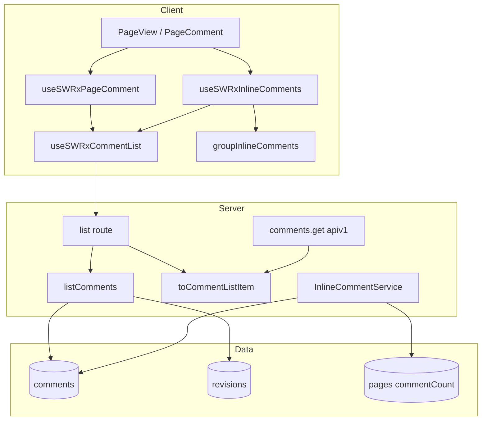
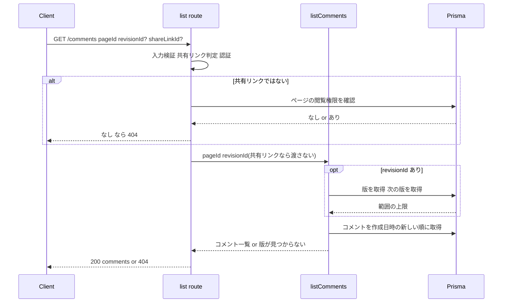

# Design Document

## Overview

**Purpose**: コメントを API で読む利用者(GROWI MCP、外部スクリプト、GROWI 自身の画面)に、通常コメントとインラインコメントを1回の呼び出しで取得できる経路を提供する。あわせて、ページのコメント件数にインラインコメントを含める。

**Users**: MCP と外部スクリプトは `GET /_api/v3/comments` を呼ぶ。GROWI の画面は、末尾のコメント欄と本文のインラインコメントの取得を、この API に切り替える。

**Impact**: 画面は新 API でコメントを取得し、見え方は旧 API の画面と同じである。旧 `GET /_api/comments.get` の応答の形は固定で、非推奨である。インライン専用の一覧取得 `GET /_api/v3/inline-comments` はなく、404 を返す。`Page.commentCount` は「通常コメントとインラインコメントの合計」である。

### Goals
- 通常コメントとインラインコメントを返す、apiv3 の一覧取得 API を1本にする(1.x、2.x、3.x、4.x)
- 旧 API を壊さずに非推奨にする(5.x)
- 画面の取得を新 API に切り替え、見え方を保つ(6.x)
- 件数にインラインコメントを合算する(7.x)
- インライン専用の一覧取得 API を廃止する(8.x)

### Non-Goals
- コメントの作成、編集、削除の API の変更(件数を更新する呼び出しを足す以外)
- MCP サーバー本体と SDK の切り替え(別リポジトリ)
- 共有リンク画面へのインラインコメント UI の表示
- 検索の索引を更新する経路の変更

## Boundary Commitments

### This Spec Owns
- `GET /_api/v3/comments` の契約(入力、応答、認可、版を指定したときの意味、エラー)
- コメント1件の応答の形(`ICommentListItem`)と、その整形(共通の項目の整形は旧 API と共有し、投稿者の整形だけを API ごとに分ける)
- ページのコメント件数(`Page.commentCount`)の数え方と、インラインコメントの書き込みに伴う更新、既存ページの再計算
- 画面側のコメント一覧の取得(共有の取得フックと、通常コメント用、インラインコメント用の2つの見え方)

### Out of Boundary
- 通常コメントの作成、編集、削除(旧 API の `comments.add` / `update` / `remove`)
- インラインコメントの作成、返信、編集、削除、解決の挙動(`inline-comment` が持つ。件数の更新呼び出しの追加だけ、本 spec の変更として入れる)
- コメントのイベント(`CommentEvent`)と、それを購読する検索の再索引
- MCP サーバーと SDK
- 共有リンク画面と検索結果プレビューでのインラインコメント UI

### Allowed Dependencies
- Prisma の `comments` と `revisions`、`certifySharedPage`、`accessTokenParser`、`loginRequired`、`apiV3FormValidator`、`findPageAndMetaDataByViewer`
- `inline-comment` の型(`InlineCommentWithReplies` など)。依存の向きは「`inline-comment` → `comment`」のみ。`comment` が `inline-comment` を import してはいけない
- `InlineCommentService` から件数を更新するときは、`Page` モデルを import せず、依存として渡された関数を呼ぶ

### Revalidation Triggers
- `ICommentListItem` の項目の追加、削除、名前の変更(MCP、SDK、画面、外部利用者に影響する)
- 新 API の `creator` に返す項目の追加(共有リンクのゲストにも届く。要件 1.9)
- 画面の取得フックのキー `['/comments', pageId, shareLinkId]` の変更(末尾のスレッドと本文のインラインコメントが一緒に更新される前提が壊れる)
- 件数の数え方の変更(サイドバー、ページ側面、Slack の展開に影響する)
- 版を指定したときの意味の変更(Requirement 2)
- 共有リンク経由で返す範囲の変更(`share-link-comments` の契約に影響する)
- `share-link-comments` の design.md も、このキーと `useSWRxPageComment` の戻り値の型を再検証の条件に挙げている。共有リンクの画面のコメント欄は、このキーで取得し、通常コメントだけを表示する。キーを変えるときは、共有リンクの画面が `shareLinkId` を付けて取得できることも確かめ直す

## Architecture

### Existing Architecture Analysis
- 旧 API は apiv1 の `comment.api.get`。取得は `findCommentsByPageId` / `findCommentsByRevisionId` で、`isInline: { not: true }` を固定で付ける。この固定の除外が、旧 API だけがインラインコメントを返さない理由である。新 API は共有リンク経由でも通常コメントとインラインコメントの両方を返す。
- インラインコメントの API(`features/inline-comment/server/routes/`)は書き込み(作成、返信、編集、削除、解決)だけを持つ。一覧の取得は新 API が担う。
- 画面は、末尾のスレッド(`stores/comment.tsx` の `useSWRxPageComment`)と本文(`features/inline-comment/client/stores/inline-comment.ts` の `useSWRxInlineComments`)の両方が、共有の取得フック `useSWRxCommentList` を通して新 API から取得する。
- 共有リンクの前例は `apiv3/revisions.js`。`certifySharedPage` が `req.isSharedPage` を立て、ページの閲覧権限の確認を省く。

### Architecture Pattern & Boundary Map



**Architecture Integration**:
- 採用する形: 既存の apiv3 の機能別構成(`features/comment/` に `interfaces`、`server`、`client`)。
- 整形の共通部分は1つの関数(`createCommentListItemMapper`)にまとめ、投稿者の整形のしかたを引数で受け取る。新 API は `toCommentListItem`、旧 API は `toLegacyCommentListItem` を使う。
- 依存の向き(サーバー): `interfaces` → `server/serializers` → `server/service` → `server/routes`。
- 依存の向き(画面): `interfaces` → `client/stores/comment-list` → 各 feature の store → 部品。
- 新しい部品が必要な理由は、すべて要件に対応する。投機的な抽象は入れない。

### Technology Stack

| Layer | Choice / Version | Role in Feature | Notes |
|-------|------------------|-----------------|-------|
| Backend | Express + express-validator(既存) | 新ルートの入力検証と応答 | `res.apiv3` / `res.apiv3Err` |
| Data | Prisma(MongoDB、既存) | コメントと版の取得 | スキーマ変更なし |
| Frontend | SWR(既存) | 一覧の取得とキャッシュの共有 | キーを共有する |
| API 仕様 | swagger-jsdoc(既存) | 公開仕様の生成 | 生成スクリプトにディレクトリを足す |

## File Structure Plan

### Directory Structure
```
apps/app/src/features/comment/
├── interfaces/
│   ├── comment-list.ts            # ICommentListItem、リクエストのクエリ、応答の型
│   └── index.ts                   # barrel
├── server/
│   ├── serializers/
│   │   └── to-comment-list-item.ts   # 行 → 応答の1件(新 API 用と旧 API 用。共通部分は1か所)と、入力の行の型 CommentListRow
│   ├── service/
│   │   └── comment-list.ts           # listComments: 版の範囲の決定と取得
│   └── routes/
│       └── list.ts                   # GET /_api/v3/comments(@swagger を含む)
└── client/
    └── stores/
        └── comment-list.ts           # useSWRxCommentList(共有の取得フック)

apps/app/src/features/inline-comment/client/services/
└── group-inline-comments.ts       # 平らな一覧 → InlineCommentWithReplies[]

apps/app/src/migrations/
└── 20261001120000-recount-comment-count-including-inline.js   # 既存ページの件数を再計算
```
各ファイルには、同じディレクトリに `*.spec.ts` または `*.integ.ts` を置く(co-location)。

### Modified Files
- `apps/app/src/features/comment/server/models/comment.ts` — `countCommentByPageId` は `isInline` で絞らず、インラインコメントも数える。`findCommentsByPageId` / `findCommentsByRevisionId` は `isInline` が `true` の行を除いて返す
- `apps/app/src/features/comment/server/models/comment.integ.ts` — インラインコメントを含む件数のテストを持つ
- `apps/app/src/server/routes/comment.js` — `comments.get` の応答を `toLegacyCommentListItem` で整形する。`@swagger` に `deprecated: true` と置き換え先の案内がある
- `apps/app/src/server/routes/apiv3/index.js` — `/comments` を登録している。インラインコメントの一覧を返すルートは無く、`GET /inline-comments` は JSON の 404(`not_found`)を返す
- `apps/app/bin/openapi/generate-spec-apiv3.sh` — `src/features/comment/server/routes/*.ts` を OpenAPI の生成対象に含める
- `apps/app/src/features/inline-comment/server/service/inline-comment-service.ts` — 依存に `updateCommentCount` を持ち、作成、返信の作成、削除、返信の削除のあとに呼ぶ。一覧を返す機能は持たない
- `apps/app/src/features/inline-comment/server/routes/{create,create-reply,update,update-reply,delete,delete-reply,resolve}.ts` — サービスを作るときに `updateCommentCount` を渡す(依存は必須なので、7つのルートすべてが渡す)
- `apps/app/src/features/inline-comment/server/routes/routing.integ.ts` — 一覧取得(`GET /inline-comments`)の 404 について、2つのことを確かめるテスト(8.3)を持つ。1つ目は、テスト用の Express アプリに本番と同じ形の JSON の 404 を登録し、その応答が JSON の 404(`not_found`)になること。2つ目は、本物の `apiv3/index.js` のソースを文字列として読み、`GET /inline-comments` の 404 の登録があり、一覧を返すハンドラーが無いこと。本物のルーターを組み立てて `GET /inline-comments` を送るテストは無い
- `apps/app/src/features/inline-comment/server/update-page-comment-count.ts` — `InlineCommentService` の `updateCommentCount` 依存として各ルートが渡す、Page モデルを取得して `Page.updateCommentCount` を呼ぶ薄い関数
- `apps/app/src/server/models/obsolete-page.js` — `Page.updateCommentCount` は `await this.updateOne(…)` で書き込みの完了を待ち、その結果を返す
- `apps/app/src/features/inline-comment/client/stores/inline-comment.ts` — `useSWRxCommentList` + `groupInlineComments` で取得する。作成、返信の作成、削除、返信の削除のあとに、一覧に加えてページ情報(`useSWRMUTxPageInfo`)も再取得する
- `apps/app/src/features/inline-comment/client/stores/inline-comment.spec.tsx` — `useSWRxCommentList` による取得を前提にしたテストを持つ
- `apps/app/src/stores/comment.tsx` — `useSWRxPageComment` は `useSWRxCommentList` で取得し、通常コメントだけを返す

## System Flows



**版の範囲の決定**:
- 指定した版を `pageId` つきで取得する。存在しない、または別ページの版なら 404(ページが見えない場合と同じ応答)。
- 次の版 = 同じページの、指定した版より作成日時が後で最も古い版。あれば、その作成日時より前に作成されたコメントだけを返す(通常コメント、インラインコメント、返信のすべてに適用)。なければ絞り込まない。
- 共有リンクのときは、ルートが `revisionId` を渡さない(別ページの版を指定して読まれるのを防ぐ、旧 API と同じ考え方)。

**件数の更新**:
- `InlineCommentService` の4つの書き込み(作成、返信の作成、削除、返信の削除)のコメントの書き込みが成功した直後、アクティビティの記録より前に、`updateCommentCount(pageId)` を呼ぶ。アクティビティの記録が失敗して例外になっても、書き込み済みのコメントの件数は更新済みである。件数の更新の失敗は記録して続行する(メンション通知と同じ扱い)。アクティビティの記録の失敗は、呼び出し元へ伝える。解決の切り替えと編集は件数を変えないので、呼ばない。

## Requirements Traceability

| Requirement | Summary | Components | Interfaces | Flows |
|-------------|---------|------------|------------|-------|
| 1.1, 1.2, 1.3, 1.4, 1.5, 1.6, 1.7 | 通常とインラインの一括取得、項目、並び順、安全な投稿者 | listComments、toCommentListItem、list route | API Contract、ICommentListItem | System Flows |
| 1.8 | ページ ID の形式検証 | list route(express-validator) | API Contract(400) | — |
| 1.9 | 投稿者は画面が使う4項目だけ | toCommentListItem(投稿者の整形 `toCreatorSummary`) | ICommentCreatorSummary、OpenAPI(CommentListItem.creator) | — |
| 2.1, 2.2, 2.3 | 次の版より前のコメント | listComments | listComments のサービスの仕様 | 版の範囲の決定 |
| 2.4 | 版が存在しない、または別ページ | listComments、list route | API Contract(404) | System Flows |
| 2.5 | 共有リンクでは版を無視 | list route | API Contract | 版の範囲の決定 |
| 3.1, 3.2, 3.5, 3.7 | 閲覧権限、アクセストークン、存在を知らせない404、ゲスト閲覧を許可したサイト | list route | API Contract(404) | System Flows |
| 3.3, 3.4, 3.8 | 共有リンクの取得、別ページの共有リンクは無効扱い、読み取り専用 | list route(certifySharedPage) | API Contract | System Flows |
| 3.6 | 未認証 | list route(loginRequired) | API Contract(403) | — |
| 3.9 | 予期しない失敗 | list route | API Contract(500) | — |
| 4.1, 4.2, 4.3 | 公開仕様、SDK、項目の意味 | list route の @swagger、生成スクリプト | OpenAPI(CommentListItem) | — |
| 5.1, 5.2, 5.4 | 旧 API の挙動を変えない(投稿者の項目も含む) | comment.js、toLegacyCommentListItem | 旧 API の契約 | — |
| 5.3 | 非推奨の明示 | comment.js の @swagger | OpenAPI(deprecated) | — |
| 6.1, 6.2 | 末尾のスレッド | useSWRxPageComment、useSWRxCommentList | 取得フック | — |
| 6.3 | 本文のインラインコメント | useSWRxInlineComments、groupInlineComments | 取得フック | — |
| 6.4 | 書き込み後の更新 | useSWRxCommentList(共有のキー)、useSWRxInlineComments(ページ情報の再取得) | 取得フック | — |
| 6.5 | 従来インラインを出さない画面 | useSWRxPageComment(除外) | 取得フック | — |
| 6.6 | 旧 API を使わない | useSWRxPageComment、useSWRxInlineComments | 取得フック | — |
| 7.1, 7.2, 7.3, 7.6 | 件数の合算と、画面ごとに同じ値 | countCommentByPageId、useSWRxInlineComments(ページ情報の再取得) | モデルの拡張、取得フック | — |
| 7.4 | 作成、削除での更新 | InlineCommentService、Page.updateCommentCount の修正 | サービスの依存 | 件数の更新 |
| 7.5 | 既存ページの再計算 | 再計算の移行 | 移行 | — |
| 8.1, 8.2, 8.3 | インライン一覧の廃止 | apiv3/index.js、routing.integ.ts | ルーティング | — |

## Components and Interfaces

| Component | Domain/Layer | Intent | Req Coverage | Key Dependencies (P0/P1) | Contracts |
|-----------|--------------|--------|--------------|--------------------------|-----------|
| list route | Server / Route | 入力検証、認証、閲覧権限、応答 | 1.8, 2.4, 2.5, 3.x, 4.x | certifySharedPage(P0)、loginRequired(P0)、listComments(P0) | API |
| listComments | Server / Service | 版の範囲を決め、コメントを取得する | 1.1-1.6, 2.1-2.4 | Prisma(P0) | Service |
| toCommentListItem / toLegacyCommentListItem | Server / Serializer | 行を応答の1件に整形する | 1.2, 1.3, 1.7, 1.9, 5.1, 5.2, 5.4 | なし | Service |
| countCommentByPageId | Server / Model | 件数に全コメントを数える | 7.1-7.3, 7.6 | Prisma(P0) | Service |
| InlineCommentService の拡張 | Server / Service | 書き込み後に件数を更新する | 7.4 | updateCommentCount(P1) | Service |
| 再計算の移行 | Server / Migration | 既存ページの件数を直す | 7.5 | Prisma(P0) | Batch |
| useSWRxCommentList | Client / Store | 一覧の取得を共有する | 6.1, 6.3, 6.4, 6.6 | apiv3Get(P0)、useShareLinkId(P0) | State |
| useSWRxPageComment | Client / Store | 通常コメントだけを返す | 6.1, 6.2, 6.5 | useSWRxCommentList(P0) | State |
| useSWRxInlineComments | Client / Store | インラインコメントを親子にして返す | 6.3, 6.4 | useSWRxCommentList(P0)、groupInlineComments(P0) | State |
| groupInlineComments | Client / Service | 平らな一覧を親子にまとめる | 6.3 | — | Service |

### Server

#### list route

| Field | Detail |
|-------|--------|
| Intent | `GET /_api/v3/comments` の入口 |
| Requirements | 1.8, 2.4, 2.5, 3.1-3.9, 4.1-4.3 |

**Responsibilities & Constraints**
- ミドルウェアは、次の順に並べる。`accessTokenParser([SCOPE.READ.FEATURES.PAGE], { acceptLegacy: true })` → 入力検証 → `apiV3FormValidator` → `certifySharedPage` → `loginRequired`(ゲストを許可する版)。入力の検証を `certifySharedPage` より前に置くのは、旧 API と同じ理由(不正な値を共有リンクの照会に流さない)。
- 共有リンクでないときは、`findPageAndMetaDataByViewer(..., { basicOnly: true })` でページを引き、見えないか存在しなければ、区別せず 404(`notfound_or_forbidden`)を返す(`page-write-action-403-404` 規約)。
- 共有リンクのときは、閲覧権限の確認を省き、`revisionId` を `listComments` に渡さない。共有リンクの ID とページ ID が一致しないときは、`certifySharedPage` が共有リンクとして認めないので、通常のアクセスとして判定される(未ログインで、ゲスト閲覧も許可されていなければ 403)。
- ゲスト閲覧を許可しているサイトでは、`loginRequired`(ゲストを許可する版)が未ログインの閲覧者を通し、ページの閲覧権限の確認がゲストに対して行われる(旧 API と同じ)。
- コメントの変更はしない(読み取り専用)。

**Contracts**: API [x]

##### API Contract
| Method | Endpoint | Request | Response | Errors |
|--------|----------|---------|----------|--------|
| GET | /_api/v3/comments | query: `pageId`(必須、MongoId)、`revisionId`(任意、MongoId)、`shareLinkId`(任意、MongoId。共有リンクの判定にだけ使う) | `{ comments: ICommentListItem[] }`(作成日時の新しい順) | 400(入力が不正)、403(未認証。`loginRequired` の既存の応答)、404(`notfound_or_forbidden`)、500(`comment-list-failed`) |

- ID は文字列のスカラーであることを `isString().bail().isMongoId()` で検証する(配列、オブジェクトを弾く)。
- 500 の応答は内部の詳細を含めない。

#### listComments

| Field | Detail |
|-------|--------|
| Intent | 版の範囲を決めて、コメントを取得する |
| Requirements | 1.1-1.6, 2.1-2.4 |

**Contracts**: Service [x]

##### Service Interface
```typescript
export interface ListCommentsInput {
  readonly pageId: string;
  /** Omitted for share-link access. */
  readonly revisionId?: string;
}

export type ListCommentsResult =
  | { readonly kind: 'ok'; readonly comments: readonly CommentListRow[] }
  | { readonly kind: 'revision-not-found' };

export const listComments = (
  deps: { readonly prisma: Pick<PrismaClient, 'comments' | 'revisions'> },
  input: ListCommentsInput,
): Promise<ListCommentsResult>;
```
- `CommentListRow`: `Prisma.Result<PrismaClient['comments'], { include: { creator: true } }, 'findMany'>[number]`(`creator` を含む1行)。`PrismaClient` は `~/utils/prisma` の拡張済みのクライアントの型なので、拡張が全モデルに足す `_id` と `__v` もこの型に入る(`Prisma.commentsGetPayload` では入らない)。型は `toCommentListItem` と同じファイルで定義して export し、サービスが import する(依存の向き「serializers → service」を守るため)
- Preconditions: `pageId` の閲覧可否は呼び出し側が確認済み
- Postconditions: `comments` は作成日時の新しい順。`revisionId` ありで次の版があれば、全件がその作成日時より前
- Invariants: `isInline` で絞らない。返信も通常の行として含める

**Implementation Notes**
- Integration: `prisma.comments.findMany({ where: { pageId, createdAt?: { lt } }, include: { creator: true }, orderBy: { createdAt: 'desc' } })`。ページ ID の索引(`page_1`)が使われる
- Validation: 版は `revisions.findUnique({ where: { id } })` で取り、`pageId` が一致しなければ `revision-not-found`
- Risks: ページあたりのコメント数に上限は無い(旧 API と同じ。ページネーションは範囲外)

#### toCommentListItem / toLegacyCommentListItem

| Field | Detail |
|-------|--------|
| Intent | 行を応答の1件に整形する純粋関数(新 API 用と旧 API 用) |
| Requirements | 1.2, 1.3, 1.7, 1.9, 5.1, 5.2, 5.4 |

**Contracts**: Service [x]

##### Service Interface
```typescript
type CommentListItemWith<TCreator> = Omit<ICommentListItem, 'creator'> & {
  creator: TCreator | string | null;
};

// Shared by both APIs; only the creator formatting differs.
const createCommentListItemMapper: <TCreator>(
  formatCreator: (user: CreatorRow) => TCreator,
) => (row: CommentListRow) => CommentListItemWith<TCreator>;

// GET /_api/v3/comments
export const toCommentListItem: (row: CommentListRow) => ICommentListItem;
// GET /_api/comments.get
export const toLegacyCommentListItem: (
  row: CommentListRow,
) => CommentListItemWith<LegacyCommentCreator>;
```
- 共通の出力: 行のすべての列(文書の版の番号 `v` を含む)と、クライアント拡張が足す `__v`(`v` と同じ値)に加えて、`_id`(= `id`)、`page`(= `pageId`)、`revision`(= `revisionId`)、`replyTo`(= `replyToId`)、`creator`。投稿者の行が無いときの `creator` は `creatorId`(投稿者の無いコメントでは `null`)
- `toCommentListItem` の投稿者の整形(`toCreatorSummary`)は、`_id`、`username`、`name`、`imageUrlCached` の4つだけを、項目を1つずつ指定して取り出す(行を展開してから項目を除く書き方はしない。ユーザーの列が増えても応答に漏れないようにするため)
- `toLegacyCommentListItem` の投稿者の整形(`toLegacyCreator`)は、ユーザーの行からパスワード、API トークン、メールアドレスを除き、本人がメールアドレスを公開しているときだけ `email` を戻す(`null` でも戻す)。旧 API(`comment.js`)はこちらを使う(要件 5.1、5.4)
- 4つの項目を残す理由は、画面がそれぞれを読むため。`username` は `Username`(ユーザーのページへのリンク)、`UserPicture`(リンクとツールチップ)、`Comment.tsx` の自分のコメントかどうかの判定が読む。`name` は `Username` と `UserPicture` が表示名として読む。`imageUrlCached` は `UserPicture` が画像の URL として読む。`_id` は画面が実行時には読まないが、`Username` が受ける型と `isPopulated` による型の絞り込みが `_id` を持つオブジェクトを前提にしており、API の利用者がユーザーを識別するのにも使う。自分のコメントかどうかの判定は、通常コメントとインラインコメントで読む項目が違う。通常コメント(`Comment.tsx`)は `creator.username` とログイン中の利用者の `username` を比べる。インラインコメント(`InlineCommentItem.tsx`、`InlineCommentReplies.tsx`、`InlineCommentPreviewPopover.tsx`)は `creatorId` とログイン中の利用者の `_id` を比べ、判定には `creator` を読まない(表示では読む)。画面は `creator` のほかの項目(アカウントの状態、Gravatar の設定など)を読まない

#### countCommentByPageId(モデルの拡張)
- `where: { pageId }` にする(件数の集計は `isInline` で絞らない)。返信も1行として数える。解決済みも数える
- `findCommentsByPageId` / `findCommentsByRevisionId` の除外は変えない(旧 API の固定の保証を守る)
- 呼び出し元は `Page.updateCommentCount` と、件数を数え直す移行(`apps/app/src/migrations/20261001120000-recount-comment-count-including-inline.js`)の2つ

#### InlineCommentService の拡張
```typescript
export interface InlineCommentServiceDeps {
  prisma: Pick<PrismaClient, 'comments' | 'activities'>;
  commentService: Pick<CommentService, 'prepareMentionNotifications'>;
  /** Recomputes `Page.commentCount`; failures must never undo the comment write. */
  updateCommentCount: (pageId: string) => Promise<void>;
}
```
- `create`、`createReply`、`deleteComment`、`deleteReply` の成功後に、`await` して呼ぶ。`try/catch` で `logger.error` に記録して続行する
- `Page.updateCommentCount`(`obsolete-page.js`)は、保存値の書き込み(`updateOne`)を `await` して結果を返す。呼び出し元が `await` すれば書き込みの完了まで待て、書き込みの失敗も呼び出し元の `try/catch` に届く。通常コメントのルート(`comment.js`)とコメントイベントの購読も同じ関数を使う
- `InlineCommentService` は `updateCommentCount` を依存として受け取る。各ルートは `features/inline-comment/server/update-page-comment-count.ts` の `updatePageCommentCount` を渡す。これは Mongoose の Page モデルを呼び出しのたびに取得して `Page.updateCommentCount` を呼ぶ薄い関数である(`crowi.models.Page` の型が `Model<any>` なので、型の付いたモデルを直接取得する)

#### 再計算の移行
- Trigger: アプリ起動時の migrate-mongo(ESM。`up` は再計算を行い、`down` は何もしない。移行前の件数は復元できず、保存値は次のコメント書き込みか `up` の再実行で正しくなる)
- Input: `isInline: true` の行を持つページ ID の一覧(`comments.groupBy({ by: ['pageId'], where: { isInline: true } })`)
- Output: 各ページの `pages.commentCount` を `countCommentByPageId` の結果に更新する
- Idempotency: 何度実行しても同じ結果。インラインコメントを持たないページには触れない

### Client

#### useSWRxCommentList
```typescript
export const useSWRxCommentList = (
  pageId: Nullable<string>,
): SWRResponse<ICommentListItem[], Error>;
```
- キー: `pageId` が `null` なら `null`。それ以外は `['/comments', pageId, shareLinkId]`(`shareLinkId` は前後の空白を除き、空なら `undefined`。`comment-list.ts` の中の非公開の関数 `normalizeShareLinkId` が行う)
- 取得: `apiv3Get<ListCommentsResponseBody>('/comments', { pageId, ...(shareLinkId != null && { shareLinkId }) })`。`page_id` は送らない(`certifySharedPage` の検証と取得の ID を分けないため)
- 同じキーなので、末尾のスレッドと本文のインラインコメントが同時に使っても、取得は1回になる。どちらの書き込みも、この一覧を再取得する
- 通常コメントの書き込みは、一覧に加えてページ情報(`useSWRMUTxPageInfo`)も再取得して、ページ側面の件数を更新している。インラインコメントの書き込みでも同じことを行う(`useSWRxInlineComments` の各書き込み関数の中。要件 7.6)
- `useSWRxPageComment` と `useSWRxInlineComments` が返す加工後の一覧は、共有の一覧を依存にした `useMemo` で作る(描画のたびに新しい配列を作らない)

#### useSWRxPageComment
- 戻り値の型は変えない(`SWRResponse<ICommentHasIdList, Error> & CommentOperation`)
- `data` は共有の一覧から `isInline !== true` の行だけを取り出して作る。共有リンクの画面と検索のプレビューも、この除外により、インラインコメントを表示しない
- 投稿、更新(旧 API)のあとの `mutate()` は、共有のキーを再取得する

#### useSWRxInlineComments
- 戻り値の型は変えない(`SWRResponseWithUtils<…, InlineCommentWithReplies[], Error>`)
- `data` は共有の一覧を `groupInlineComments` に通して作る。書き込みの各関数(`create`、`createReply`、`resolve`、`update`、`remove`、…)の後の再取得は、共有のキーに対して行う
- 共有リンクの画面では `null` を渡されるので取得しない

#### groupInlineComments

| Field | Detail |
|-------|--------|
| Intent | 平らな一覧を、起点コメントと返信の親子に組み直す純粋関数 |
| Requirements | 6.3 |

**Contracts**: Service [x]

##### Service Interface
```typescript
export const groupInlineComments = (
  items: readonly ICommentListItem[],
): InlineCommentWithReplies[];
```
- 起点: `isInline === true` かつ `replyToId == null`。`creatorId`、`quote`、`prefix`、`suffix`、`approxOffset`、`anchorOriginRevisionId` のどれかが `null` なら、壊れた行として除く
- 返信: `isInline === true` かつ `replyToId != null` かつ `creatorId != null`。親の起点が結果に無ければ除く
- 順序: 入力の順を保つ(起点も返信も。サーバーが新しい順で返すので、起点も返信も新しい順になる)
- `creator` は、オブジェクトならそのまま、`creatorId` の文字列なら `null`
- 日付は変換しない

## Data Models

### Data Contracts & Integration
```typescript
export type ICommentCreatorSummary = Pick<
  users,
  'username' | 'name' | 'imageUrlCached'
> & { _id: string };

export interface ICommentListItem {
  _id: string;
  id: string;
  v: number; // document version counter; not meaningful to clients
  __v: number; // same value as v
  page: string;
  pageId: string;
  creator: ICommentCreatorSummary | string | null;
  creatorId: string | null;
  revision: string | null;
  revisionId: string | null;
  replyTo: string | null;
  replyToId: string | null;
  comment: string;
  commentPosition: number;
  createdAt: Date;
  updatedAt: Date;
  isInline: boolean;
  quote: string | null;
  prefix: string | null;
  suffix: string | null;
  approxOffset: number | null;
  anchorOriginRevisionId: string | null;
  resolvedById: string | null;
  resolvedAt: Date | null;
}

export interface ListCommentsRequestQuery {
  pageId: string;
  revisionId?: string;
  shareLinkId?: string;
}

export interface ListCommentsResponseBody {
  comments: ICommentListItem[];
}
```
- `ICommentListItem` の旧 API 由来の項目(`page`、`revision`、`replyTo`、`commentPosition`、`_id`、`__v`、`createdAt`、`updatedAt`、`comment`)は、旧 API の出力と同じ値を持つ。`creator` だけは、旧 API より項目が少ない(下記)。型は単独で定義する(`ICommentHasId` を継承しない)。`ICommentHasId` は画面の通常コメント部品の型で、`page` や `revision` を `Ref` で持ち、インライン用の項目を持たないため
- 型の食い違いは `as` で隠さない。`ICommentHasId` は実データに合わせて、`revision` と `replyTo` に null を許し、`creator` を `Ref<IUser> | ICommentCreatorSummary | null` にしてある。これにより `ICommentListItem` を `as` なしで通常コメントの部品に渡せる
- 通常コメントでは、インライン用の項目は `null`(`isInline` は `false`)
- `v` と `__v` は文書の版の番号(Prisma の列 `v` と、拡張が足す同じ値の `__v`)。整形は行を展開して作るので応答に入る。画面は読まない。旧 API と共通の整形の出力を変えないため、取り除かずに型と OpenAPI に載せている
- `creator` の型は `ICommentCreatorSummary | string | null`。`ICommentCreatorSummary` は `{ _id: string; username: string; name: string | null; imageUrlCached: string | null }` で、`features/comment/interfaces` に置く。画面のコメント部品(`CommentCard`、`IInlineComment` と返信の `creator`、`ICommentHasId.creator`)はこの型を受ける。旧 API の投稿者の型(`LegacyCommentCreator`)は整形のファイルの中だけで使い、公開しない
- スキーマ(`comments`、`revisions`)に変更は無い。`pages.commentCount` の値の意味が変わる

## Error Handling

### Error Strategy
- 入力の不正は 400。ページが見えない、存在しない、版が存在しない、版が別ページのもの、は区別せず 404(`notfound_or_forbidden`)。予期しない失敗は 500(内部の詳細を含めず、サーバーのログに残す)
- 件数の更新の失敗は、コメントの書き込みを失敗にしない。ログに残して続行する。次の件数の更新か、再計算の移行で補正される

## Testing Strategy

テストは、`essential-test-design`(振る舞いの契約を確かめる)と `essential-test-patterns`(Vitest、型付きモック)に従って書く。

### Unit Tests
- `toCommentListItem`: 通常コメントとインラインコメントの行が、旧 API と同じ別名の項目を持つ。`creator` は4つの項目だけを持つ(投稿者の行に外部サービスの ID、最終ログイン日時、管理者かどうかの値があっても出ない。メールアドレスは本人が公開していても出ない)。`creator` が無いときは `creatorId` になる
- `toLegacyCommentListItem`: 共通の項目が `toCommentListItem` と同じになる。`creator` はパスワード、API トークン、非公開のメールアドレスだけを除いた形になり、公開しているメールアドレス(`null` を含む)は残る
- `groupInlineComments`: 起点と返信が親子になる。入力の順が保たれる。壊れた起点と親の無い返信が除かれる。通常コメントの行は無視される
- `useSWRxPageComment`: インラインコメントの行を混ぜない(`isInline` が `true` の行を除く)

### Integration Tests
- `GET /comments`: 通常コメント、インラインコメント、返信、解決済みが、新しい順で全部返る(1.1-1.6)
- `GET /comments`: 版の指定。次の版より前だけ返る。最新の版なら全件。別ページの版と存在しない版は 404。通常コメント、インラインコメント、返信のどれにも同じ規則が効く(2.1-2.4)
- `GET /comments`: 投稿者の項目。ログイン済みの利用者と共有リンクのゲストのどちらへの応答でも、`creator` の項目が4つだけで、投稿者に入れた外部サービスの ID、最終ログイン日時、メールアドレスが応答のどこにも出ない(1.9)
- `GET /comments`: 共有リンク。ゲストにも両方が返る。別ページの共有リンクは無効扱いになり、未ログインなら 403。`revisionId` は無視される(3.3, 3.4, 2.5)
- `GET /comments`: ログイン済み、アクセストークン、未認証(ゲスト閲覧の許可あり、なし)。見えないページと存在しないページが同じ応答になる。不正な ID は 400(3.1, 3.2, 3.5, 3.6, 3.7, 1.8)
- 旧 `comments.get`: インラインコメントを返さない。応答の形が変わらない(5.1, 5.2)。投稿者の外部サービスの ID、最終ログイン日時、管理者かどうか、アカウントの状態を返す(5.4)。既存の `comment.integ.ts` を残す
- 件数: `countCommentByPageId` が通常、インライン、返信、解決済みを全部数える。`InlineCommentService` の作成、返信、削除、返信の削除のあとに、`Page.commentCount` が合計に一致する(`updateCommentCount` が書き込みの完了を待つので、待ち合わせなしで確かめられる)。更新の失敗でもコメントの書き込みは成功する(7.1-7.4)
- 移行: インラインコメントを持つページの件数が直り、持たないページは変わらない。2回実行しても同じ(7.5)
- 廃止: `GET /_api/v3/inline-comments` が 404 を返す。作成、編集、削除、解決のルートは残る(8.1-8.3)

### E2E/UI Tests
- 末尾のコメント欄に、通常コメントとインラインコメントが投稿日時順に並ぶ。件数が合算される(6.1, 6.2, 7.1)
- インラインコメントを作成して解決すると、本文のハイライトと末尾のスレッドが一緒に更新される(6.3, 6.4)
- 共有リンクの画面にインラインコメントが出ない(6.5)

### API 仕様
- `pnpm run lint:openapi:apiv3` が通り、新 API の `operationId` が付く(`assert-operation-ids`)(4.1-4.3)。`pnpm run lint:openapi:apiv1` が通り、旧 API が `deprecated` になる(5.3)

## Security Considerations
- 共有リンクの判定は `certifySharedPage` に任せ、新しい認可を並行して作らない。閲覧権限の確認を省くのは、ID が一致する共有リンクが確認できたときだけ
- 新 API の応答の投稿者は、`toCreatorSummary` で4つの項目(ID、ユーザー名、表示名、プロフィール画像の URL)だけにする。新 API は共有リンクのゲストにも投稿者を返すので、メールアドレス、外部サービスのアカウントの ID(`googleId`、`slackMemberId`)、最終ログイン日時、管理者かどうか、アカウントの状態などを、ページの閲覧者に渡さない(要件 1.9。理由は `research.md`)
- 旧 API の応答の投稿者は、`toLegacyCreator` でパスワード、API トークン、非公開のメールアドレスだけを除く。旧 API の出力を変えないため(要件 5.1、5.4)で、それ以外のユーザーの項目は旧 API からは読める
- 共有リンクでインラインコメントを返すことの可否は、要件 3.3 で決めた。根拠は、共有リンクの閲覧者が `GET /_api/v3/revisions/*` から過去の版の本文をすでに読めること(`research.md`)。UI で過去の版が見えない作りと API の差は、本 spec の範囲外

## Migration Strategy
1. コードと再計算の移行を同じリリースで出す。移行はアプリの起動時に実行される
2. 移行が終わるまでの間、既存ページの件数は古い(通常コメントだけ)。新しいインラインコメントの作成、削除は、その時点で正しい合計に直す
3. 切り戻し: コードを戻すと、件数はインラインを含んだまま残る。次の通常コメントの追加か削除で、通常コメントだけの値に戻る。害は無い

## Open Questions / Risks
- 版の指定で、`getAppliedAtForRevisionFilter`(過去の移行で壊れた版を隠す処理)を使わない。実装時に結合テストで確かめる
- `pages.commentCount` を読む Slack のリンク展開は、インラインを含む値に変わる。要件 7.1 の結果として許容する。検索の索引は `comments` を `isInline` で絞らずに数えるので、索引の値は変わらない
- 新 API に、別名の項目(`page`、`revision`、`replyTo`)が残る。旧 API を廃止するときに、整理を検討する
- MCP の `getComments` は、MCP 側を新 API に切り替えるまで、インラインコメントを取得できない(範囲外)
