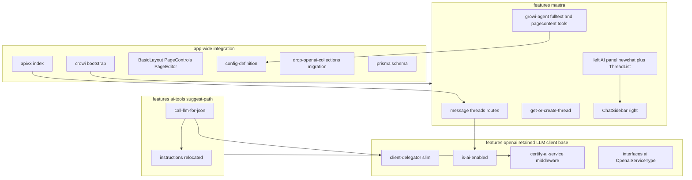
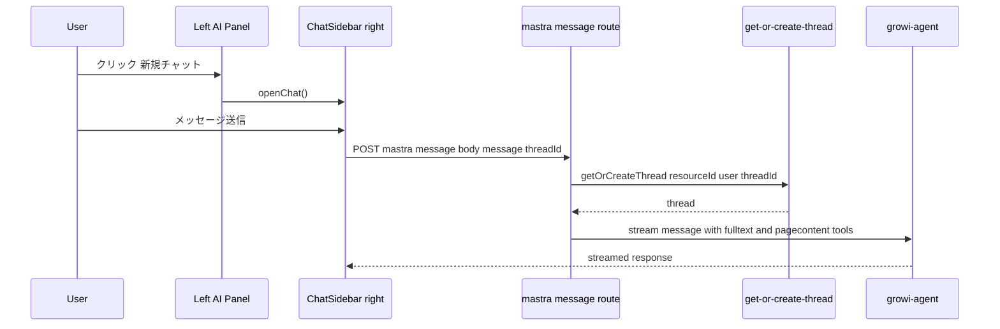
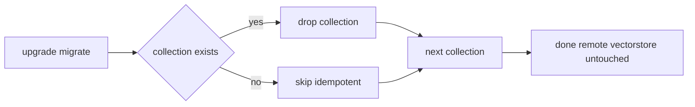
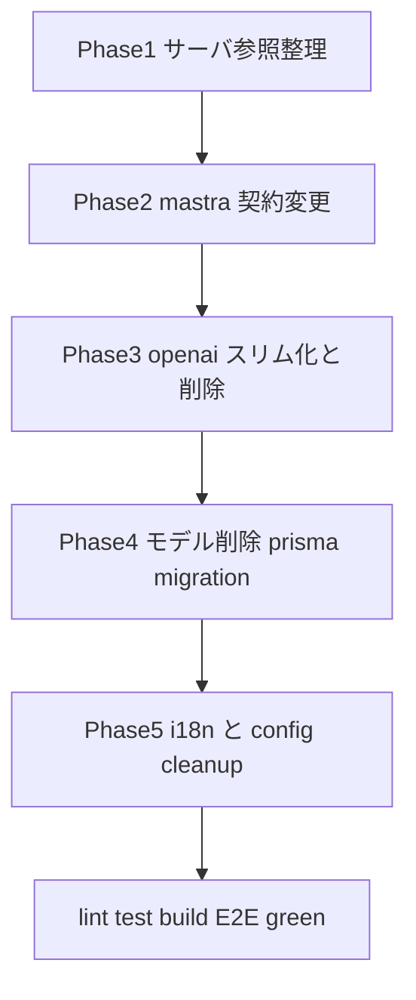

# Technical Design — deprecate-openai-features

## Overview

**Purpose**: GROWI の AI 機能から OpenAI アシスタント／ナレッジ・エディターアシスタント／vectorStore FileSearch を削除し、AI チャットを `features/mastra` に一本化する。同時に、ページパス提案 `features/ai-tools/suggest-path` と mastra チャットが依存する **OpenAI/Azure の低レベル LLM クライアント基盤は残置**する（`features/openai` を完全削除はせずスリム化する）。

**Users**: AI チャット利用ユーザーは、アシスタントを選ばずに左サイドバーからチャットを開始する。編集者はエディター内 AI 編集補助を失う（代替なし）。運用者はアップグレード時に廃止データが破棄され、設定画面が現行機能と一致する。開発者は二重化していた AI 実装が単純化される。

**Impact**: 「アシスタント／マイアシスタント／チームアシスタント」概念、4 つの Mongoose/Prisma モデル、関連 cron・ページ連携・正規化処理、mastra の vectorStore 依存と file-search ツール、openai 専用 i18n を取り除く。mastra のチャットを「ユーザーに紐づく会話」へ一般化し、thread 一覧 UI は存続させる。

### Goals
- `features/openai` から FileSearch／アシスタント関連を削除し、LLM クライアント基盤のみ残置する。
- mastra チャットを `aiAssistantId`・`vectorStore`・`file-search` 非依存にする。
- 左サイドバー AI パネルに「新規チャット」起点を新設し、右サイドバーチャットを開けるようにする。
- 廃止モデルのコレクション破棄マイグレーションと Prisma スキーマ整理を行い、既存マイグレーションを壊さない。
- suggest-path を従来どおり動作させ、横断参照を全て解消してビルドを成立させる。

### Non-Goals
- `features/openai` ディレクトリの完全削除（LLM クライアント基盤は残す）。
- 残置 LLM クライアント基盤の中立な場所への大規模な再配置・改名（将来別仕様）。
- suggest-path 自体の機能変更（openai 依存の付け替えのみ）。
- OpenAI 側リモート vector store の削除。
- mastra チャット／エージェント体験の機能拡張。

## Boundary Commitments

### This Spec Owns
- `features/openai` 配下のアシスタント／ナレッジ／エディターアシスタント／vectorStore／FileSearch／cron／embeddings／normalize コードおよび `openai.ts` 神サービスの削除。
- `features/openai` に残す **LLM クライアント基盤**（`client-delegator/` のスリム化、`is-ai-enabled.ts`、`client.ts`、`certify-ai-service` middleware、`interfaces/ai.ts`）の確定。
- mastra チャット／thread のアシスタント非依存化（`post-message` 契約、thread メタデータ、チャット起動 atom、左 AI パネル、ChatSidebar）。
- 廃止 4 モデルの削除、Mongo コレクション破棄マイグレーション、Prisma スキーマ整理、既存マイグレーションの自己完結化。
- openai 専用 i18n の全ロケール削除と共有キーの保持。
- 横断参照（route 登録、crowi 起動、レイアウト、PageControls、PageEditor、page ライフサイクル、users、config-definition、admin AI 設定）の整理。

### Out of Boundary
- suggest-path の LLM 呼び出しロジック・プロンプト内容の変更（`instructionsForInformationTypes` の移設は所有権移管のみで内容不変）。
- 残置 client-delegator の中立パッケージ化／改名。
- リモート OpenAI vector store・ファイルの削除。
- mastra の検索精度・エージェント挙動の改善。

### Allowed Dependencies
- `features/mastra` と `features/ai-tools/suggest-path` は、残置する `features/openai` の LLM クライアント基盤（`getClient`/`isStreamResponse`、`isAiEnabled`、`certifyAiService`、`OpenaiServiceType`）に依存してよい。
- 上記いずれも `configManager` の AI 設定キー（`app:aiEnabled`、`openai:serviceType`、`openai:apiKey`、`openai:assistantModel:mastraAgent`）に依存してよい。
- mastra は自前の `@ai-sdk/openai` provider に依存してよい。
- **禁止**: 削除対象（`AiAssistantModel`・`getOpenaiService`・vectorStore・thread-relation・assistant UI/型）への依存を残すこと。

### Revalidation Triggers
- 残置 `client-delegator` の公開契約（`getClient`/`chatCompletion` シグネチャ）変更 → suggest-path の再検証。
- `/_api/v3/mastra/message` リクエスト契約（`aiAssistantId` 除去）変更 → mastra クライアントの再検証。
- thread メタデータ形状（`aiAssistantId` 除去）変更 → thread 一覧・既存スレッド互換の再検証。
- AI 設定キーの削除 → admin 設定画面・configuration-props の再検証。

## Architecture

### Existing Architecture Analysis
- AI 機能は feature-based（`features/openai` 旧実装 + `features/mastra` 新チャット + `features/ai-tools/suggest-path`）。サーバーは Express ルート（`/_api/v3/openai`・`/_api/v3/mastra`）、クライアントは Jotai（UI 状態）+ SWR（データ取得）。
- `IOpenaiService`（`openai.ts`）は LLM 補完・アシスタント・vectorStore・thread を混在させた神サービス。一方 suggest-path は低レベル `client-delegator` を直接利用しており、神サービスには依存しない。→ **神サービスは削除可能**で、低レベル基盤のみ残せばよい。
- mastra thread は Mastra Memory（MongoDBStore）に保存され、`resourceId` はユーザー ID 単独。`metadata.aiAssistantId` は付随情報に過ぎない。
- 左サイドバーは `SidebarContentsType`（`interfaces/ui.ts`）+ `PrimaryItems`/`SidebarContents` で content を切替。AI パネルは `aiEnabledAtom` でゲート。チャット起動 atom は openai 旧 `aiAssistantSidebarAtom` と mastra `chatSidebarAtom` の 2 系統が併存 → mastra 側へ統合する。

### Architecture Pattern & Boundary Map



**Architecture Integration**
- **Selected pattern**: 既存 feature-based 構成を維持し、削除＋スリム化＋契約変更で対応（新規アーキは導入しない）。
- **Boundary**: 残置 openai は「低レベル LLM クライアント基盤」のみを公開。mastra/suggest-path はそこへ依存（下層→上層の一方向）。
- **Preserved patterns**: `SidebarContentsType` 拡張、migrate-mongo、Jotai+SWR、mastra Memory。
- **Steering compliance**: server/client 境界維持、named export、Biome、co-located tests。

### Technology Stack

| Layer | Choice / Version | Role in Feature | Notes |
|-------|------------------|-----------------|-------|
| Frontend | Next.js Pages Router + Jotai + SWR | 左 AI パネル再構成・ChatSidebar 契約変更 | 旧 `aiAssistantSidebarAtom` 廃止、`chatSidebarAtom` へ統合 |
| Backend | Express + Mongoose | `/openai` ルート撤去、`/mastra/message` 契約変更、cron/normalize 除去 | 残置 `client-delegator` をスリム化 |
| Data / Storage | MongoDB + Prisma schema | 4 コレクション破棄、Prisma 4 モデル削除 | mastra Memory は不変 |
| LLM | `@ai-sdk/openai`（mastra）/ 残置 client-delegator（suggest-path） | チャット・JSON 補完 | vectorStore/file-search API は不使用化 |
| Infra / Runtime | crowi 起動・config-manager | openai cron/サービス setup 除去、AI 設定キー削減 | `app:aiEnabled` 等は残置 |

## File Structure Plan

### 残置（features/openai — LLM クライアント基盤）
```
features/openai/
├── server/services/client-delegator/   # スリム化: chatCompletion 等のみ残し vectorStore/thread/file メソッド除去
│   ├── index.ts / get-client.ts / openai-client-delegator.ts / azure-openai-client-delegator.ts / is-stream-response.ts
│   └── interfaces.ts                    # IOpenaiClientDelegator から vectorStore/thread/file を削除
├── server/services/is-ai-enabled.ts     # AI 有効判定（mastra/suggest-path が利用）
├── server/routes/middlewares/certify-ai-service.ts  # suggest-path が利用
├── server/services/assistant/instructions/commons.ts # suggest-path 用 instructionsForInformationTypes のみ残置（他定数は除去、パス不変）
└── interfaces/ai.ts                     # OpenaiServiceType
```

> **方針**: suggest-path の import を変更しないため、`commons.ts` は現在のパスのまま残置し、使用中の `instructionsForInformationTypes` のみに整理する。`assistant/` ディレクトリ名が残る点は許容（cosmetic）。将来この定数を中立パスへ移す場合は suggest-path 側の import 2 行の変更が必要。

### 削除（features/openai）
```
features/openai/
├── client/**                            # 全 UI・services・states・stores・utils を削除（AiIntegration 含む。admin AI 連携ページ廃止）
├── server/services/openai.ts            # 神サービス（IOpenaiService）丸ごと
├── server/services/assistant/**         # assistant ロジック（ただし instructions/commons.ts は残置・トリムして除外）
├── server/services/editor-assistant/**  # エディターアシスタント
├── server/services/cron/**              # thread/vectorStoreFile 削除 cron
├── server/services/embeddings.ts / normalize-data/** / replace-annotation-with-page-link.ts
├── server/models/{ai-assistant,thread-relation,vector-store,vector-store-file-relation}.ts
├── server/routes/**                     # middlewares/certify-ai-service.ts 以外の全ルート（assistant CRUD・editor・thread）
└── interfaces/**                        # ai.ts 以外（ai-assistant, thread-relation, vector-store, *assistant schemas）
```

### CREATE / RETAIN
- `features/openai/server/services/assistant/instructions/commons.ts` — **残置**。suggest-path が使う `instructionsForInformationTypes` のみ残し、アシスタント専用の未使用定数（system/injection/file-search）を除去。suggest-path の import は不変。
- `apps/app/src/migrations/<timestamp>-drop-openai-collections.js` — 新規マイグレーション（4 コレクション drop、冪等）。
- mastra 左 AI パネルの「新規チャット」起点（`AiAssistantSubstance.tsx` を改修 or 新規 `NewChatButton`）。

### Modified Files（mastra）
- `features/mastra/server/routes/post-message.ts` — `aiAssistantId` を ReqBody/validation から除去、`AiAssistantModel`/`getOpenaiService`/`vectorStoreId` 導出を削除。
- `features/mastra/server/services/get-or-create-thread.ts` — `metadata.aiAssistantId` の書込み/検証を除去（`resourceId` のみで生成・取得）。
- `features/mastra/interfaces/thread.ts` — `ThreadWithMeta.metadata.aiAssistantId` 除去、`isThreadWithMeta` ガード緩和（既存スレッドの余剰フィールドを許容）。
- `features/mastra/server/services/mastra-modules/agents/growi-agent.ts` — tools から file-search を除去。
- `features/mastra/server/services/mastra-modules/tools/file-search-tool.ts` / `ai-sdk-modules/file-search.ts` — **削除**。
- `features/mastra/server/services/mastra-modules/types/request-context.ts` — `vectorStoreId` 除去。
- `features/mastra/client/status/chat-sidebar.tsx` — `openChat(threadId?)` へ変更、`aiAssistantData`/`isEditorAssistant`/`openEditor` 除去。
- `features/mastra/client/components/ChatSidebar/ChatSidebar.tsx` — POST body から `aiAssistantId` 除去、ヘッダをスレッドタイトル/汎用表示へ。
- `features/mastra/client/components/Sidebar/ThreadList.tsx` — `useSWRxAiAssistants`/`findAiAssistantById` 除去、`openChat(threadId)` へ。
- `features/mastra/client/components/Sidebar/AiAssistantSubstance.tsx` — assistant 一覧・Add assistant を撤去し「新規チャット」+ ThreadList 構成へ（openai imports 除去）。
- `features/mastra/client/components/Sidebar/AiAssistantList.tsx` / `DeleteAiAssistantModal/**` — **削除**。

### Modified Files（app-wide）
- `server/routes/apiv3/index.js` — `/openai` ルート mount 除去。
- `server/crowi/index.ts` — openai cron/サービス setup・プロパティ除去。
- `components/Layout/BasicLayout.tsx` — `AiAssistantManagementModalLazyLoaded` 除去。
- `client/components/PageControls/PageControls.tsx` — `OpenDefaultAiAssistantButton` 除去。
- `client/components/PageEditor/PageEditor.tsx` — `useIsEnableUnifiedMergeView` 除去。
- `client/components/PageEditor/EditorNavbarBottom/EditorAssistantToggleButton.tsx` — **削除**。
- `server/service/page/index.ts` / `server/routes/apiv3/page/create-page.ts` / `update-page.ts` — vectorStore 同期 (`isAiEnabled` 連携) 除去。
- `server/routes/apiv3/users.js` — `deleteUserAiAssistant` 連携除去。
- `server/service/normalize-data/index.ts` + `delete-vector-stores-orphaned-from-ai-assistant.ts` — 除去。
- `server/service/config-manager/config-definition.ts` — 廃止 7 キー除去（KEEP: `app:aiEnabled`,`openai:serviceType`,`openai:apiKey`,`openai:assistantModel:mastraAgent`）。
- `pages/general-page/configuration-props.ts` — 除去キーの表示参照を整理。
- `pages/admin/ai-integration.page.tsx` + `features/openai/client/components/AiIntegration/**` — **削除**（admin AI 連携ページ廃止。接続/資格情報は環境変数で設定するため管理画面フォームは不要）。
- `components/Admin/Common/AdminNavigation.tsx` — ai-integration メニューのコメントアウト済みブロック（case / MenuLink / MenuLabel）を除去。
- `public/static/locales/*/admin.json` — `ai_integration.*`（ラベル + `disable_mode_explanation`）を全ロケールから削除。
- `migrations/20241107172359-rename-pageId-to-page.js` — `VectorStoreFileRelationModel` import を除去し自己完結化（直接コレクション操作）。
- `prisma/schema.prisma` — 4 モデル定義削除 → `pnpm prisma:generate` 再生成。
- `public/static/locales/{en_US,ja_JP,ko_KR,fr_FR,zh_CN}/{translation,admin}.json` — openai 専用キー削除、共有 `ai_assistant_substance.*` は保持。

## System Flows

### 新規チャット起動（アシスタント非依存）

- 旧フローの `aiAssistantId` 解決・`vectorStoreId` 設定・file-search ツールは削除。`resourceId` はユーザー ID。既存スレッド選択時は `threadId` のみで再開する。

### マイグレーション


## Requirements Traceability

| Requirement | Summary | Components | Interfaces / Flows |
|-------------|---------|------------|--------------------|
| 1.1–1.5 | openai スリム化・/openai 撤去・ビルド成立 | 残置 client-delegator / apiv3 index / 削除群 | `/openai` 撤去, build green |
| 2.1–2.5 | ナレッジ/エディターアシスタント廃止 | EditorAssistantToggleButton 削除, editor-assistant 削除, PageEditor MODIFY | unified merge view 除去 |
| 3.1–3.6 | アシスタント概念廃止・非選択チャット | AiAssistant* 削除, BasicLayout/PageControls MODIFY, chat-sidebar atom | `openChat(threadId?)` |
| 4.1–4.7 | モデル削除・migration・cron/連携/normalize/過去migration | models 削除, drop migration, crowi/config/page/users MODIFY, 20241107 migration 自己完結化 | drop flow |
| 5.1–5.4 | mastra vectorStore/file-search 除去 | file-search-tool/file-search 削除, growi-agent/post-message/request-context MODIFY | message 契約 |
| 6.1–6.5 | suggest-path 継続・参照整理・UI 移設 | instructions 移設, client-delegator 残置, 横断 MODIFY | client-delegator 契約 |
| 7.1–7.4 | openai 専用 i18n 削除・共有保持 | locales MODIFY (5×2) | 翻訳キー整合 |
| 8.1–8.4 | 左サイドバー→右チャット導線・AI 無効時非表示 | 左 AI パネル MODIFY, PrimaryItems/SidebarContents (aiEnabled gate) | openChat flow |
| 9.1–9.4 | thread 一覧存続・既存スレッド互換 | ThreadList MODIFY, get-or-create-thread, interfaces/thread | thread metadata |
| 10.1–10.4 | AI 連携 env 維持・admin ページ廃止 | config-definition, ai-integration page/AiIntegration/AdminNavigation 削除, admin.json | config keys, env vars |

## Components and Interfaces

| Component | Domain/Layer | Intent | Req Coverage | Key Dependencies (P0/P1) | Contracts |
|-----------|--------------|--------|--------------|--------------------------|-----------|
| OpenAI LLM Client Base | openai server (retained) | LLM 補完クライアント提供 | 1.2, 6.1, 6.4 | configManager (P0) | Service |
| Mastra Message Route | mastra server | assistant 非依存のチャット送信 | 5.2, 5.3, 8.3, 9.2 | get-or-create-thread (P0), growi-agent (P0) | API |
| Thread Lifecycle | mastra server | user 単位の thread 生成/取得 | 9.2, 9.4 | mastra Memory (P0) | Service/State |
| Chat Sidebar State | mastra client | チャット起動 atom 統合 | 3.6, 8.2, 8.3 | — | State |
| Left AI Panel | mastra client | 新規チャット起点 + ThreadList | 8.1, 8.4, 9.1, 9.3 | chat-sidebar state (P0), thread store (P1) | — |
| Drop Collections Migration | data | 廃止コレクション破棄 | 4.2, 4.4 | MongoDB (P0) | Batch |
| Config Cleanup | infra | AI 設定キー整理 | 10.1–10.3 | configManager (P0) | — |
| Retained instructions | openai server (retained) | suggest-path 用プロンプト定数を残置・トリム（パス不変） | 6.1 | — | — |

### OpenAI server (retained)

#### OpenAI LLM Client Base
| Field | Detail |
|-------|--------|
| Intent | suggest-path/mastra 向けに低レベル LLM クライアントと AI 有効判定・認可を提供 |
| Requirements | 1.2, 6.1, 6.4 |

**Responsibilities & Constraints**
- `getClient()` は `configManager` の `openai:serviceType`/`openai:apiKey` から OpenAI/Azure クライアントを返す。
- **不変条件**: vectorStore・thread・file・assistant に関するメソッド／型を一切公開しない（スリム化後）。
- `certifyAiService` は AI 有効かつ有効な serviceType を検証する Express middleware として維持。

**Dependencies**
- Inbound: suggest-path `call-llm-for-json` / `routes` (P0)、mastra `routes` (`isAiEnabled`) (P1)
- Outbound: `configManager` (P0)、`@growi/...` logger
- External: OpenAI SDK（chat completion のみ）(P0)

**Contracts**: Service [x]

##### Service Interface
```typescript
// client-delegator/interfaces.ts（スリム化後）
interface IOpenaiClientDelegator {
  chatCompletion(
    body: ChatCompletionCreateParams,
  ): Promise<ChatCompletion | Stream<ChatCompletionChunk>>;
}

// is-ai-enabled.ts
function isAiEnabled(): boolean;

// client-delegator/get-client.ts
function getClient(): IOpenaiClientDelegator;
```
- Preconditions: `app:aiEnabled` が true、`openai:apiKey` が設定済み。
- Postconditions: vectorStore/thread/file 系メソッドは型・実装ともに存在しない。
- Invariants: suggest-path の `chatCompletion` 呼び出しは挙動不変。

**Implementation Notes**
- Integration: `IOpenaiClientDelegator` / `OpenaiClientDelegator` / `AzureOpenaiClientDelegator` から vectorStore/thread/file メソッドを削除。`client.ts` も対応メソッドのみ残す。
- Validation: suggest-path のパス提案 E2E が従来どおり通ること。
- Risks: `openai:assistantModel:chat` が file-search 削除後に未参照化する可能性 → 実装時に最終確認し、未参照なら追加削除。

### Mastra server

#### Mastra Message Route
| Field | Detail |
|-------|--------|
| Intent | `aiAssistantId` を要求せずチャットメッセージを stream 応答 |
| Requirements | 5.2, 5.3, 8.3, 9.2 |

**Responsibilities & Constraints**
- リクエストから `aiAssistantId` を排除。`AiAssistantModel` 参照・`getOpenaiService().isAiAssistantUsable()`・`vectorStoreId` 導出を削除。
- `getOrCreateThread({ resourceId, threadId? })` を呼び、`growiAgent.stream()` に渡す。
- エージェントの tools は full-text-search と get-page-content のみ。

**Contracts**: API [x]

##### API Contract
| Method | Endpoint | Request | Response | Errors |
|--------|----------|---------|----------|--------|
| POST | /_api/v3/mastra/message | `{ message: string; threadId?: string }` | SSE stream (ai-sdk UIMessage) | 400, 401, 403, 500 |

**Implementation Notes**
- Integration: `request-context.ts` から `vectorStoreId` 削除。`growi-agent.ts` の tools 配列から file-search 除去。
- Validation: 既存スレッド（`metadata.aiAssistantId` 保持）に対しても 400 を返さず再開できること。
- Risks: クライアント・サーバーの契約変更は同時反映が必要（部分デプロイ非対応）。

#### Thread Lifecycle
| Field | Detail |
|-------|--------|
| Intent | thread を user(`resourceId`) 単位で生成・取得（assistant 非依存） |
| Requirements | 9.2, 9.4 |

**Contracts**: Service [x] / State [x]

##### Service Interface
```typescript
interface ThreadMetadata { /* aiAssistantId を含まない */ }
function getOrCreateThread(args: {
  resourceId: string;
  threadId?: string;
}): Promise<StorageThreadType>;
function isThreadWithMeta(t: unknown): t is StorageThreadType; // aiAssistantId 必須を解除
```
- Preconditions: `resourceId` はリクエストユーザー ID。
- Postconditions: 新規 thread の metadata に `aiAssistantId` を書かない。
- Invariants: 既存 thread の余剰 `aiAssistantId` は読み飛ばし、閲覧・再開を阻害しない（後方互換）。

### Mastra client

#### Chat Sidebar State / Left AI Panel（Summary-only）
- `chatSidebarAtom` から `aiAssistantData`/`isEditorAssistant` を除去、`openChat(threadId?)` / `close()` のみ。`openEditor` 廃止。
- 左 AI パネルは「新規チャット」ボタン（`openChat()`）+ `ThreadList`。`ThreadList` は `useSWRxAiAssistants` を使わず `openChat(threadId)` で再開。`ChatSidebar` ヘッダはスレッドタイトル/汎用表示。
- **Implementation Note**: AI_ASSISTANT nav と `aiEnabledAtom` ゲートは維持（8.4）。`AiAssistantList`/`DeleteAiAssistantModal`/`OpenDefaultAiAssistantButton`/`EditorAssistantToggleButton` は削除。

### Data / Infra

#### Drop Collections Migration
**Contracts**: Batch [x]
- Trigger: `pnpm run migrate`（アップグレード時）。
- Input/validation: 対象 `aiassistants`/`threadrelations`/`vectorstores`/`vectorstorefilerelations`。
- Output: コレクション破棄。存在しない場合は skip（冪等）。リモート vector store は対象外。
- Idempotency & recovery: `up` は drop（無ければ no-op）、`down` は no-op（再作成不要）。

#### Config Cleanup（Summary-only）
- 削除: `openai:assistantModel:edit`、`openai:threadDeletion*`(3)、`openai:vectorStoreFileDeletion*`(3)、`openai:limitLearnablePageCountPerAssistant`、`app:openaiThreadDeletion...`、`app:openaiVectorStoreFileDeletion...`。
- 保持: `app:aiEnabled`、`openai:serviceType`、`openai:apiKey`、`openai:assistantModel:mastraAgent`（環境変数で設定。管理画面フォームは持たない）。
- `configuration-props.ts` から削除キーの参照を除去。admin AI 連携ページ自体は廃止（上記 Modified Files 参照）。

## Data Models

### Domain Model（変更点）
- **削除アグリゲート**: AiAssistant / ThreadRelation / VectorStore / VectorStoreFileRelation（Mongoose モデル + Prisma モデル）。
- **変更**: mastra Thread の `metadata` から `aiAssistantId` を除去（書込み側）。読取り側は余剰フィールドを許容。

### Physical Data Model
- **Prisma**: `prisma/schema.prisma` から 4 モデル定義削除 → 再生成。生成物はアプリ未参照のため import 修正不要。
- **MongoDB**: マイグレーションで 4 コレクション drop。mastra Memory コレクションは対象外（既存スレッド保持）。
- **既存マイグレーション**: `20241107172359-rename-pageId-to-page.js` の `VectorStoreFileRelationModel` import を除去し、コレクション名直接操作へ書換え（モデル削除後も実行可能に保つ）。

## Error Handling
- `message` ルート: 入力検証失敗は 400、未認証 401、AI 無効時は既存ガード（`certifyAiService`/`isAiEnabled`）で 403/利用不可。
- マイグレーション: コレクション不存在を正常系として扱い、その他の DB エラーは throw して `migrate` を失敗させる（部分適用を避ける）。
- ベースラインのログ/監視は steering 準拠（`@growi/logger`）。

## Testing Strategy

### Unit Tests
- `isThreadWithMeta` が `aiAssistantId` 無し thread を受理し、余剰フィールド有り既存 thread も受理する（9.2, 9.4）。
- `getOrCreateThread` が新規 thread metadata に `aiAssistantId` を書かない（9.2）。
- drop-collections マイグレーションが不存在コレクションで冪等に成功する（4.4）。
- スリム化 `IOpenaiClientDelegator` に vectorStore/thread/file メソッドが型として存在しない（コンパイル/型テスト）（1.2, 5.1）。

### Integration Tests
- `POST /_api/v3/mastra/message` が `aiAssistantId` 無しで 2xx ストリームを返し、既存 `threadId` で会話を再開する（5.2, 8.3, 9.2）。
- suggest-path のパス提案 API が残置 client-delegator 経由で従来どおり動作する（6.1）。
- ビルド/型チェックが未解決参照なく完走する（1.4, 6.2）。
- AI 無効設定時に AI チャット導線が露出しない（8.4, 10.4）。

### E2E/UI Tests
- 左サイドバー「新規チャット」→ 右 ChatSidebar が開きメッセージ送受信できる（8.1, 8.2）。
- thread 一覧からの再開・削除・ページングが動作する（9.1, 9.3）。
- エディターに AI 編集トグルが存在しない（2.2）。
- アシスタント管理モーダル／マイ・チームアシスタント一覧／ページヘッダ起動ボタンが UI に存在しない（3.1, 3.2, 3.3, 3.5）。
- 各対応言語で削除済み i18n キーの未翻訳表示が出ない（7.4）。

## Migration Strategy

- ロールバックトリガ: ビルド/型エラー、suggest-path 退行、既存スレッド再開不可。
- 検証チェックポイント: 各フェーズ後に `turbo run lint/test/build --filter @growi/app`。`message` 契約はクライアント・サーバー同時反映。

## Open Questions / Risks
- `openai:assistantModel:chat` の最終的な要否（file-search 削除後に未参照化する可能性）。実装時にグローバル検索で確定。
- ~~admin `AiIntegration` コンポーネント内部の分離粒度~~ → 解決済み。AiIntegration は実質空のため admin AI 連携ページごと廃止し、接続設定は環境変数のみとした。なお access-token scope（`admin:ai_integration` / `features.ai_assistant`）は別サブシステム（`@growi/core` のスコープ enum）であり、本仕様では除去対象外（必要なら別途 changeset を伴う対応）。
- `client.ts`（生クライアント）と `client-delegator` の依存関係の最終確認（スリム化で削除しすぎないこと）。
