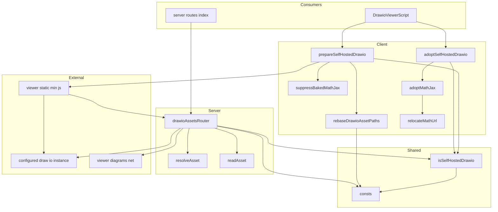
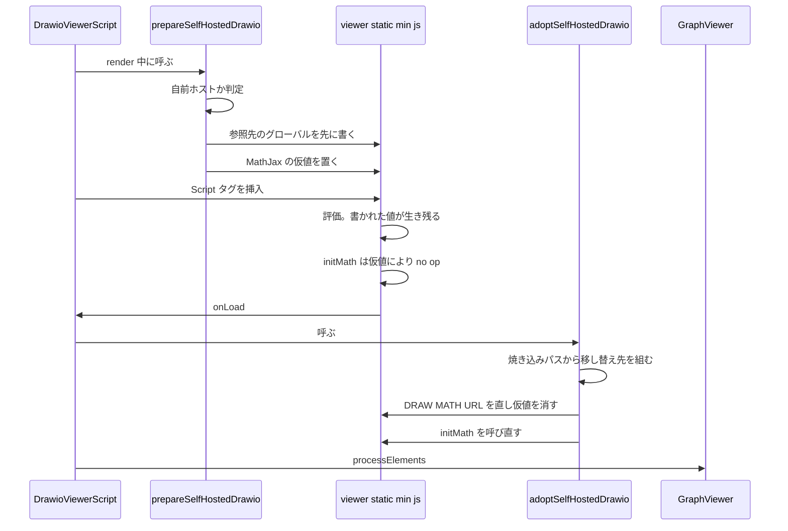
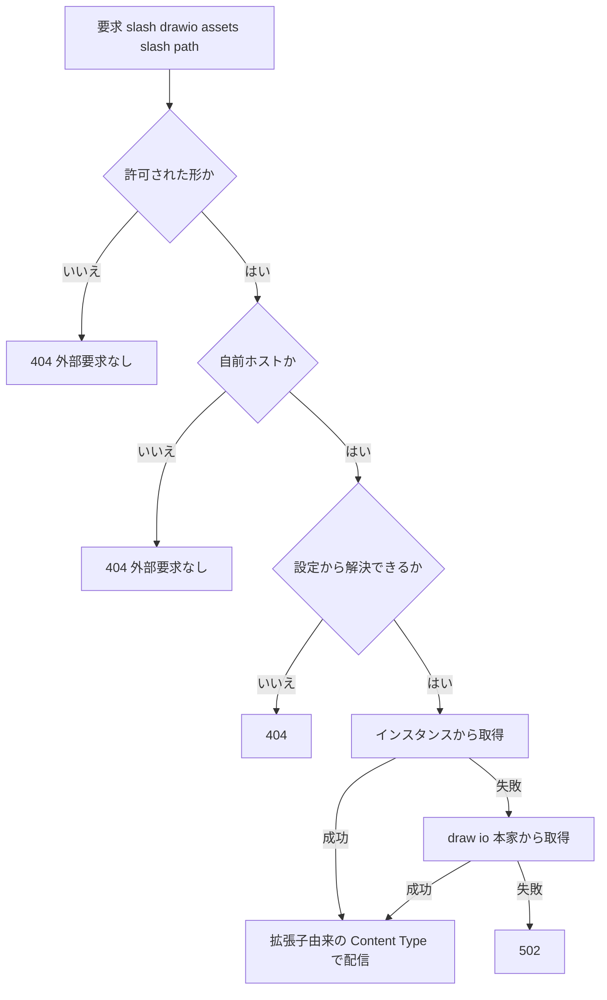

# Design Document: drawio

## Overview

**目的**: draw.io 連携について「今どうなっているか・なぜそうなっているか・どう検証するか」を 1 か所に残す。draw.io のバージョンが上がるたびに同じ調査をやり直す状態を終わらせる。

**読み手**: draw.io 連携を次に触る開発者。とくに自前ホスト対応は draw.io 内部の公開されていない動き（グローバル変数の初期化順、`Editor.initMath()` の判定、`mxStencilRegistry` のフォールバック経路）に頼っているため、根拠を失うと安全に変更できない。

**この文書が現況に対して変えること**: コードの挙動は変えない。変えるのは**根拠の置き場所**である。いま `features/drawio/client/self-hosted/README.md`（147 行）・PR #11633 の本文・コード中の `refs:` コメントに分かれている根拠を、この design.md に集約し、README を削除して `features/drawio/CLAUDE.md` から誘導する。

### Goals

- 回帰したら不具合になる約束を、コードから辿れる場所に根拠つきで残す（要件 1〜8）。
- 根拠の置き場所を 1 つにする。README を削除し、`CLAUDE.md` を唯一の入口にする（要件 9）。
- 単体テストで捕まらない失敗の確かめ方を残す（要件 10）。
- 関心マップを持ち、`features/drawio/` の外にある draw.io 関連コードも辿れるようにする。

### Non-Goals

- コードの挙動を変えること。将来課題として記録するのみ（[将来課題](#将来課題)）。
- PR #11633 の実装をやり直すこと。この文書は #11633 の成果を記述する側である。
- draw.io 本体（`jgraph/drawio`）への変更や upstream への報告。
- `packages/remark-drawio` と `apps/app` の責務再配置。
- 図の描画以外の markdown 描画系（他の remark プラグイン、presentation、bulk-export の plugin-set）。

## Boundary Commitments

### This Spec Owns

- **draw.io 連携の as-built 記述** — 現況の機構とその理由。「なぜその形を採ったか」だけでなく「採らなかった形が何を壊すか」を含む。
- **関心マップ** — draw.io に関する関心がどのコードにあるかの対応。`features/drawio/` の内も外も対象。
- **要件と既存テストの対応づけ** — 担保が無い箇所を「無い」と明記することを含む。
- **検証手順** — 単体テストで捕まらない失敗の確かめ方。
- **保守情報の入口** — `features/drawio/CLAUDE.md` の内容と、そこから spec への導線。

### Out of Boundary

- **挙動の変更**。設定不正時に利用者へ理由を伝えること、配信ルータの応答テストの追加、自前ホスト判定の drift テストの追加は、いずれも将来課題であってこの spec の作業ではない。
- **関心マップが指す先のコードの設計判断**。`packages/remark-drawio` の保存形式や `packages/editor` の挿入操作について、この spec は「どこにあるか」を指すが、その設計の所有権は持たない。
- **draw.io 側の仕様**。`offline=1` で保存／終了ボタンが消える件は draw.io の仕様であり、GROWI 側で直さない（issue で `stealth=1` を案内する方針）。記録するのみ。
- **v28 系以前のインスタンスで `stencils/` `shapes/` が同梱されない件**。draw.io のバージョン側の制約。記録するのみ。

### Allowed Dependencies

この spec が依存してよいもの。

- **PR #11633 / #11524 の実装**（記述対象）。これらの成果が現況であるという前提に依存する。
- **`features/drawio/client/self-hosted/README.md`**（移設元。design.md へ移し終えたため削除済み → [Modified Files](#modified-files)）。この依存はすでに解消している。
- **`apps/app/AGENTS.md`** — apps/app のセッションで常に読まれる文書。関心マップへの導線を 1 行足す先として使う。

**依存の制約**: この spec の成果物（design.md / `CLAUDE.md`）は**コードを参照するが、コードから参照されない**。コード中のコメントに「詳細は spec を見よ」と書き足すことはしない（コメントと spec の二重管理になり、いま README と PR 本文で起きている問題の作り直しになる）。既にコード中にある `refs:` の issue リンクはそのまま残す。

### Revalidation Triggers

次の変更が起きたとき、この spec は再検証が必要になる。

| 変更 | 影響 | 再検証すべきこと |
|---|---|---|
| draw.io のメジャーバージョンが上がる | 焼き込み先の配置・テーマ・同梱物が変わりうる | 要件 1〜4 の前提（`math4/es5` の配置、`atlas.css` の不在、`stencils/` の同梱）が成り立つか |
| `DRAWIO_URI` の設定の形が変わる（既定値・解釈） | 自前ホスト判定の基準が変わる | 要件 8 の AC 4（ビューア側と配信側で同一基準） |
| `features/drawio/` のファイル構成が変わる | 関心マップが古くなる | 要件 9 の AC 4（関心マップの網羅） |
| `packages/remark-drawio` の公開 API が変わる | 保存形式・描画経路の記述が古くなる | 要件 6・7 の記述 |
| `/_drawio-assets` の経路や許可リストが変わる | 配信の契約が変わる | 要件 3 の全 AC |
| 将来課題のどれかに着手する | 挙動が変わる | 対応する要件を挙動変更込みに書き換える |

## Architecture

### Existing Architecture Analysis

draw.io 連携は **GROWI が draw.io の外側に立って、draw.io に前提を渡す**構造になっている。GROWI は draw.io の中を書き換えられないので、渡し方は 3 つに限られる。

| 渡し方 | 使う場面 | 制約 |
|---|---|---|
| **読み込み前のグローバル変数** | ビューアの参照先すべて | `viewer-static.min.js` の評価前でなければ効かない |
| **URL パラメータ** | エディタの起動 | draw.io は query を順に代入するので、同じキーの重複は後勝ち |
| **postMessage（`configure`）** | エディタの配色・フォント | draw.io がテーマで塗る箇所は上書きしない限り draw.io 任せ |

このうち 1 つ目が自前ホスト対応の骨格である。`viewer-static.min.js` が焼き込む参照先は、すべて次の形で初期化される。

```js
window.STENCIL_PATH  = window.STENCIL_PATH  || "https://viewer.diagrams.net/stencils";
window.DRAW_MATH_URL = window.DRAW_MATH_URL || "https://viewer.diagrams.net/math4/es5";
```

つまり **読み込み前に書いた値が生き残る**。#11633 の骨格は「後から直す」のをやめて「先に決めておく」形に統一したことである。後から直せない理由は 2 つあり、どちらも実測で確定している（[なぜ後から直せないのか](#なぜ後から直せないのか)）。

#### 関心マップ

draw.io の関心は `features/drawio/` に閉じていない。次が全体である。

| 関心 | 置き場所 | 対応する要件 |
|---|---|---|
| 自前ホスト判定 | `features/drawio/is-self-hosted-drawio.ts` | 8.3, 8.4 |
| 参照先・配信経路の定数 | `features/drawio/consts.ts` | 2.1, 3.2 |
| 読み込み前の参照先差し替え | `features/drawio/client/self-hosted/rebase-asset-paths.ts` | 2.1, 2.6, 2.7 |
| MathJax の置き場所の付け替え | `features/drawio/client/self-hosted/adopt-mathjax.ts`, `relocate-math-url.ts` | 1.1〜1.6 |
| 触る draw.io グローバルの型 | `features/drawio/client/self-hosted/drawio-globals.ts` | — |
| 2 つの入口 | `features/drawio/client/self-hosted/index.ts` | 8.1, 8.3 |
| 図資産の配信 | `features/drawio/server/routes/drawio-assets.ts` | 3.1〜3.10 |
| 配信経路の mount | `server/routes/index.js` | 3.10 |
| ビューアのスクリプト挿入と起動順 | `components/Script/DrawioViewerScript/` | 1.2, 2.3 |
| ビューア本体・再描画の判定 | `packages/remark-drawio/src/components/DrawioViewer.tsx`, `should-rerender-on-resize.ts` | 7.1〜7.4 |
| markdown から図への変換 | `packages/remark-drawio/src/services/renderer/remark-drawio.ts`, `utils/embed.ts` | — |
| 保存形式（複数ページ） | `packages/remark-drawio/src/utils/mxfile.ts` | 6.1〜6.4 |
| エディタ URL の組み立て | `client/components/PageEditor/DrawioModal/build-drawio-editor-url.ts` | 5.1〜5.4 |
| エディタへ注入する設定・CSS | `client/components/PageEditor/DrawioModal/drawio-config.ts` | 4.1〜4.3 |
| エディタとの postMessage | `client/components/PageEditor/DrawioModal/DrawioCommunicationHelper.ts` | 6.5 |
| markdown への書き戻し | `client/components/Page/markdown-drawio-util-for-view.ts`, `PageEditor/markdown-drawio-util-for-editor.ts` | — |
| 挿入操作・折りたたみ | `packages/editor/src/client/components-internal/CodeMirrorEditor/Toolbar/DiagramButton.tsx`, `packages/editor/src/client/services/use-codemirror-editor/utils/fold-drawio.ts`, `packages/editor/src/states/modal/drawio-for-editor.ts` | — |
| 設定 | `server/service/config-manager/config-definition.ts` の `app:drawioUri`（env `DRAWIO_URI`、既定 `https://embed.diagrams.net/`） | 8.1 |

### Architecture Pattern & Boundary Map



**依存の向き**: `consts` → `isSelfHostedDrawio` → { `client/self-hosted/*`, `server/routes/drawio-assets` } → { `DrawioViewerScript`, `server/routes/index.js` }。左のものだけを import する。**client と server は互いを import しない**（共有するのは判定と定数だけ）。この向きが、判定を 1 つに保ちながら client と server を分けられている理由である。

**選んだ形と理由**:

- **判定を共有する（要件 8.4）** — 参照先を差し替えるのは自前ホストのときだけで、配信ルータもそのときだけ答える。両者が別の基準で判断すると「誰も要求しない経路が開いている」または「差し替えたのに配信が 404」という食い違いが起きる。だから `isSelfHostedDrawio` を 1 つ置き、client と server の両方がそれを呼ぶ。
- **入口を 2 つに分ける** — MathJax の置き場所だけは事前に決められないため（[2 つの入口](#2-つの入口)）。
- **呼び出し側が使うのは 2 つの入口だけ** — `DrawioViewerScript` はこの 2 つしか取らないので、draw.io のグローバル変数を知らずに済む。細工はすべて `features/drawio/` の内側に閉じる。なお barrel は共有の判定（`isSelfHostedDrawio`）も再公開しているが、これを import している箇所は 1 つも無い（将来課題）。

### なぜ後から直せないのか

自前ホスト対応の中心にある 2 つの実測結果。どちらも「読み込み後に直す」実装を一度試してから否定したものであり、**この節がこの spec の最も重要な内容**である。

#### 1. MathJax — 到達不能な script を取り除くだけでは直らない

対応する issue は **#9774**（自前ホストで数式が描画されない）。`adopt-mathjax.ts` と `relocate-math-url.ts` の `refs:` コメントが指す先であり、コードからこの節へ辿る手がかりになる。

当初の実装は「draw.io が追加した到達不能な `<script>` を取り除き、正しい場所から読み直す」形だった。これは **MathJax の二重起動を引き起こす**。

`Editor.initMath()` は `viewer-static.min.js` の末尾で実行され、焼き込み先の `startup.js` を指す `<script>` を追加する。**動的に挿入した classic script は、取得が完了すれば実行される。DOM から外しても実行は取り消されない。** そのため焼き込み先が実際に到達可能なとき（v29 以降が焼き込む `viewer.diagrams.net/math4/es5` は現在も生きている）、MathJax が 2 回起動し、2 回目が 1 回目の初期化を壊して次で死ぬ。

```
MathJax(?): Input Jax "tex" is not defined (has it been loaded?)
```

`MathJax.version` は返るのに `typeset` が関数にならず、`Editor.mathJaxQueue` に溜まったまま描画されない。**外に出られる環境でだけ壊れる**ため、閉域だけを見ていると気づけない。実測では v31.1.5 で 4〜6 回に 2〜5 回の頻度で数式が落ちた（タイミング次第で揺れる）。

v28 で問題が出なかったのは、焼き込み先の `math/es5` が upstream で 404 で実行に至らなかったからで、**その 404 に助けられていただけ**だった。

**採った形**: 何も取り除かない。読み込み前に `window.MathJax` を定義して `Editor.initMath()` の `typeof window.MathJax === 'undefined'` 判定を外し、**焼き込み先のスクリプトをそもそも作らせない**。そのうえで `onLoad` で `DRAW_MATH_URL` を直してから `Editor.initMath()` を呼び直す。起動は 1 回だけ（要件 1.2, 1.3）。

#### 2. stencil — `libraries` の書き換えは効かない

`patchStencilRegistryUrls()`（削除済み）は `mxStencilRegistry.libraries` を書き換えていたが、**取得先は変わっていなかった**。XHR の呼び出し元を記録して確認した実際の経路は次のとおり。

```
mxStencilRegistry.loadStencilSet → loadStencil → mxUtils.load → XHR
  URL: https://viewer.diagrams.net/stencils/aws4.xml   ← upstream のまま
```

理由は 2 つある。

- `libraries` の各項目は `SHAPES_PATH` / `STENCIL_PATH` から**バンドル評価時に組み立てられる**ので、後から書き換えるのは遅すぎる。
- `mxStencilRegistry.getStencil()` は `libraries` に該当が無いとき `STENCIL_PATH` を直接読むフォールバックを持つ。`libraries` だけ書き換えてもこの経路は素通しである。

**さらに、参照先を直すだけでも足りない（CORS）**。`STENCIL_PATH` を自前インスタンスへ向けると、今度は CORS で止まる。

```
Access to XMLHttpRequest at 'http://<instance>/stencils/aws4.xml' from origin '<growi>'
has been blocked by CORS policy: No 'Access-Control-Allow-Origin' header is present
```

`viewer.diagrams.net` は `access-control-allow-origin: *` を返すが、**`jgraph/drawio` の Tomcat は返さない**。stencil はスクリプトではなく XHR で取得されるため CORS の対象になる。これが「編集中は図形が出るのに、保存して閲覧に戻ると空の四角になる」（#10726 の症状）の正体である。エディタは iframe 内が同一オリジンなので影響を受けない。

**採った形**: XHR で取得される 3 つ（`STENCIL_PATH` / `SHAPES_PATH` / `STYLE_PATH`）は GROWI 自身のオリジン経由にする。`` で読まれる画像系（`GRAPH_IMAGE_PATH` / `mxImageBasePath` / `mxBasePath`）は CORS の対象外なので、インスタンスへ直接向ける（要件 2.1）。

### 2 つの入口

```
prepareSelfHostedDrawio(drawioUri)   // viewer-static.min.js を挿す前
adoptSelfHostedDrawio(drawioUri)     // onLoad 内、最初の描画より前
```

分かれている理由は 1 つだけ: **MathJax の置き場所は事前に決められない**。draw.io は v28 以前が `math/es5`、v29 以降が `math4/es5` を同梱し、インスタンスは片方しか持たない。焼き込まれたパスはそのインスタンスの同梱配置と必ず一致するので、**それを読み取って再利用すればバージョン判定も追加の通信も要らない**。ただし読み取れるのはバンドルの評価後である。

`adoptSelfHostedDrawio` を最初の描画より前に置く理由も別にある: `initMath()` は組版を要求するリスナーも設置するので、これより前に作られた図は永久に組版されない。

### `window.MathJax` を触ってよい理由

グローバル変数を触るのは影響範囲が広く見えるので、根拠を残す。

- GROWI 自身のページ内数式は remark-math + rehype-katex で、**KaTeX は `window.MathJax` を見ない**。アプリに MathJax への依存は無い。
- `viewer-static.min.js` は図の無いページでも読み込まれるので、**draw.io は既にすべてのページで `window.MathJax` を設定している**。このコードはグローバル変数を持ち込むのではなく、そこに何が入るかを決めているだけである。
- `adoptSelfHostedDrawio` が走った後の値は draw.io 自身の設定オブジェクトで、従来と同じである。

**唯一の注意点**: 2 つの入口の間、この変数は仮の `{}` を保持する。`typeof window.MathJax !== 'undefined'` を「MathJax がある」と解釈するものは、この間だけ誤解する（現実的には、自前の MathJax を読み込むカスタムスクリプトやプラグイン）。そのため `adoptMathJax` は**移し替えができない経路でも必ず仮の値を消す**。`onLoad` が走った時点でこの隙間は閉じる。

### 配信経路が要る条件と、要らない条件

配信ルータは `DRAWIO_URI` が自前ホストを指しているときだけ答える。既定構成では 404 を返し、外部への要求も出さない（要件 3.9）。`viewer.diagrams.net` は `Access-Control-Allow-Origin: *` を送るので、ブラウザが直接読めるためである。`DRAWIO_URI` が URL として解釈できない値のときも同じ扱いで、判定が「自前ホストでない」を返すため 404 になる。ビューア側が参照先を差し替えないのと足並みが揃う（要件 8.3）。

必要なのは **クロスオリジンの自前ホストがそのヘッダを送らない**からで、次の 2 つはどちらもこの必要をなくす。**使えるなら proxy より望ましい**。

- draw.io を GROWI と同じオリジンにリバースプロキシで載せる
- インスタンスに `Access-Control-Allow-Origin` を返させる

どちらも GROWI 単独では手配できない。だから配信ルータが存在する。

### Technology Stack

この spec はコードを追加しないため、下表は**記述対象の現況**である。

| Layer | Choice / Version | Role in Feature | Notes |
|-------|------------------|-----------------|-------|
| Frontend | Next.js `<Script strategy="afterInteractive">` | `viewer-static.min.js` の挿入と `onLoad` | 7.5.0 で `next/head` から移行済み。二重実行はこのとき解消 |
| Frontend | `url-join` | 参照先 URL の組み立て | サブパス配下の連結に使う（要件 1.5, 2.6） |
| Backend | Express `Router` | `/_drawio-assets` の配信 | 認証 middleware を挟まない（要件 3.10） |
| Backend | `fetch`（Node 標準） | 上流からの資産取得 | **`~/utils/axios` は使えない**（[Implementation Notes](#implementation-notes)） |
| Backend | `AbortSignal.timeout` | 10 秒の打ち切り（要件 3.7） | |
| Shared | `@growi/core/dist/utils/path-utils` | 末尾スラッシュの扱い | `addTrailingSlash` / `removeTrailingSlash` |
| External | `jgraph/drawio` 28.2.9 / 31.1.5 | 検証対象の 2 世代 | 焼き込み先が 404 の世代と生きている世代（要件 10.2） |
| Docs | `features/drawio/CLAUDE.md` | spec への入口 | この spec が作る唯一の新規ファイル |

## File Structure Plan

### Directory Structure

現況（この spec は下記のうち `README.md` の削除と `CLAUDE.md` の追加のみを行う）。

```
apps/app/src/features/drawio/
├── CLAUDE.md                          # 【新規】spec への入口。関心マップの所在を示す
├── consts.ts                          # 参照先・配信経路の定数（変更なし）
├── is-self-hosted-drawio.ts           # 自前ホスト判定。client/server の共有（変更なし）
├── client/self-hosted/
│   ├── README.md                      # 【削除】内容はこの design.md へ移設済み
│   ├── index.ts                       # 2 つの入口＋共有判定の再公開（変更なし）
│   ├── rebase-asset-paths.ts          # 読み込み前の参照先差し替え（変更なし）
│   ├── adopt-mathjax.ts               # 焼き込み先の抑止と再起動（変更なし）
│   ├── relocate-math-url.ts           # 焼き込みパスから移し替え先を組む純関数（変更なし）
│   └── drawio-globals.ts              # 触る draw.io グローバルの型（変更なし）
└── server/
    ├── index.ts                       # 配信ルータの公開（変更なし）
    └── routes/drawio-assets.ts        # 図資産の配信（変更なし）
```

> 上の図は**テストを省いている**。`*.spec.ts` は各ファイルの隣に置かれており（`is-self-hosted-drawio.spec.ts` と `client/self-hosted/` の 4 件、`server/routes/drawio-assets.spec.ts` の計 6 件）、どれが何を担保しているかは [Testing Strategy](#testing-strategy) の表が持つ。

### 関連する既存ファイル（この spec は変更しない）

[Components and Interfaces](#components-and-interfaces) に挙げたもののうち、`features/drawio/` の外にあるものの物理配置。**この spec は 1 行も変更しない**が、関心マップの指す先として design が把握している必要があるため列挙する。

| Component | ファイル |
|---|---|
| DrawioViewerScript | `apps/app/src/components/Script/DrawioViewerScript/DrawioViewerScript.tsx`, `use-viewer-min-js-url.ts` |
| RoutesIndexMount | `apps/app/src/server/routes/index.js`（`DRAWIO_ASSET_PROXY_PATH` への mount） |
| DrawioConfig | `apps/app/src/client/components/PageEditor/DrawioModal/drawio-config.ts` |
| BuildDrawioEditorUrl | `apps/app/src/client/components/PageEditor/DrawioModal/build-drawio-editor-url.ts` |
| DrawioCommunicationHelper | `apps/app/src/client/components/PageEditor/DrawioModal/DrawioCommunicationHelper.ts` |
| MxfileFormat | `packages/remark-drawio/src/utils/mxfile.ts` |
| ShouldRerenderOnResize | `packages/remark-drawio/src/components/should-rerender-on-resize.ts`, `DrawioViewer.tsx` |
| 設定 | `apps/app/src/server/service/config-manager/config-definition.ts`（`app:drawioUri`） |

### Modified Files

| ファイル | 変更内容 |
|---|---|
| `apps/app/src/features/drawio/client/self-hosted/README.md` | **削除**。147 行の内容はこの design.md の [Architecture](#architecture) 各節へ移設済み |
| `apps/app/src/features/drawio/CLAUDE.md` | **新規**。この spec への入口。20〜40 行 |
| `apps/app/AGENTS.md` | `## Key Features` の表に `drawio` の 1 行を追加。関心マップが指す先の半分は `features/drawio/` の外にあり、そこを触るときは `features/drawio/CLAUDE.md` が読まれないため（[CLAUDE.md の届く範囲](#claudemd-の届く範囲)） |

### CLAUDE.md の届く範囲

`features/drawio/CLAUDE.md` は `features/drawio/` 配下のファイルを触るときに読まれる（要件 9.2）。ただし関心マップが指す先の約半分は外側にある。

| 場所 | `features/drawio/CLAUDE.md` が届くか | 手当て |
|---|---|---|
| `features/drawio/` 配下 | 届く | — |
| `client/components/PageEditor/DrawioModal/` | 届かない | `apps/app/AGENTS.md` の 1 行（apps/app のセッションで常に読まれる） |
| `components/Script/DrawioViewerScript/` | 届かない | 同上 |
| `packages/remark-drawio/` | 届かない | **手当てしない**（下記の判断） |
| `packages/editor/` | 届かない | **手当てしない**（下記の判断） |

**`packages/*` に入口を置かない判断**: 置けば届くが、入口が 3 つに増える。この spec の目的は「根拠の置き場所を 1 つにする」ことなので、入口を増やすのは目的に反する方向の取引になる。また `packages/remark-drawio` の draw.io 固有の知識（保存形式・再描画の判定）は、当該ファイル内のコメントと同居するテストで既に説明されており、そこだけを見て変更しても壊れにくい。**関心マップから外側を辿れる（要件 9.4）ことは満たしたうえで、外側から内側への導線は張らない**。ここで drift が起きたら将来課題として入口の追加を検討する。

## System Flows

### ビューアの起動順（要件 1.2, 1.3, 2.1, 8.1）



**この順序が守るもの**: `prepareSelfHostedDrawio` は render 中に呼ぶ（effect ではない）。書き込む値はバンドルの評価中に読まれ、`<Script>` はこの render で挿入されるためである。同じ値を書き直すのは無害なので、再 render は問題にならない。`adoptSelfHostedDrawio` は `processElements()` より前でなければならない（`initMath()` が組版のリスナーを設置する）。

### 図資産の配信（要件 3.2, 3.3, 3.6〜3.9）



**判断の要点**: 許可リストの判定が最初に来るので、許可されない形の要求では設定を読む前に 404 になり、外部への要求は一切出ない（要件 3.2）。取得の失敗は 3 種（リダイレクト・時間切れ・サイズ超過を含む上流の不成功）をまとめて 1 つに扱い、次の取得先へ進む。**「配信しない」ではなく「その取得を失敗として扱う」**という区別が要件 3.6・3.7 と 3.8 の関係である。

## Requirements Traceability

| Requirement | Summary | Components | Contracts | Flows |
|---|---|---|---|---|
| 1.1, 1.4 | 自前ホストで数式が描画される（閉域含む） | AdoptMathJax, RelocateMathUrl | Service | ビューアの起動順 |
| 1.2, 1.3 | 読み込みは 1 回。焼き込み先が生きていても壊れない | SuppressBakedMathJax, AdoptMathJax | Service | ビューアの起動順 |
| 1.5 | サブパス配下でも数式が描画される | RelocateMathUrl | Service | — |
| 1.6 | 数式を有効にしていない図は組版しない | AdoptMathJax（draw.io 側の判断に委ねる） | — | — |
| 2.1, 2.2 | 図形が描画され、外部ホストへ要求が出ない | RebaseAssetPaths, DrawioAssetsRoute | Service, API | 図資産の配信 |
| 2.3 | 未ログインの共有ページでも描画される | DrawioAssetsRoute, DrawioViewerScript | API | — |
| 2.4, 2.5 | 同梱されていないときのフォールバックと、両方失敗時の見え方 | DrawioAssetsRoute | API | 図資産の配信 |
| 2.6 | サブパス配下でも図形が描画される | RebaseAssetPaths, ResolveAsset | Service | — |
| 2.7 | ライトボックスの編集導線が設定済みインスタンスを向く | RebaseAssetPaths | Service | — |
| 3.1, 3.3 | 取得先は設定とコード定数のみ。範囲外は拒否 | ResolveAsset, ReadAsset | Service | 図資産の配信 |
| 3.2 | 許可されない形は 404、外部要求なし | ProxiableAssetExtension | Service | 図資産の配信 |
| 3.4, 3.5 | Content-Type は拡張子から。nosniff を付ける | DrawioAssetsRoute | API | — |
| 3.6, 3.7 | リダイレクトを追わない。時間とサイズで打ち切る | ReadAsset | Service | 図資産の配信 |
| 3.8 | 失敗時のフォールバックと 502 | DrawioAssetsRoute | API | 図資産の配信 |
| 3.9 | 既定構成では 404、外部要求なし | DrawioAssetsRoute, IsSelfHostedDrawio | API | 図資産の配信 |
| 3.10 | 認証を求めない | RoutesIndexMount | API | — |
| 4.1, 4.2, 4.3 | メニューが読める。ボタンは上書きしない | DrawioConfig | State | — |
| 5.1, 5.2, 5.3, 5.4 | `DRAWIO_URI` のパラメータを尊重する | BuildDrawioEditorUrl | Service | — |
| 6.1〜6.4 | 保存で情報が失われない | MxfileFormat | Service | — |
| 6.5 | 発信元が一致しないメッセージを処理しない | DrawioCommunicationHelper | Event | — |
| 7.1, 7.2, 7.3, 7.4 | ページ送りが保たれる。幅の変化だけ再描画 | ShouldRerenderOnResize, DrawioViewer | Service | — |
| 8.1, 8.2, 8.3 | 既定構成の挙動が変わらない | SelfHostedEntryPoints, IsSelfHostedDrawio | Service | ビューアの起動順 |
| 8.4 | 判定はビューア側と配信側で同一 | IsSelfHostedDrawio | Service | — |
| 9.1, 9.4, 9.5, 9.6, 9.7 | 保守情報が spec にある | この design.md | — | — |
| 9.2 | `CLAUDE.md` から spec へ辿れる | DrawioClaudeMd | — | — |
| 9.3 | README を残さない | README の削除 | — | — |
| 10.1〜10.5 | 検証手順が再現できる | [Testing Strategy](#testing-strategy) | — | — |

## Components and Interfaces

| Component | Domain / Layer | Intent | Req Coverage | Key Dependencies | Contracts |
|---|---|---|---|---|---|
| IsSelfHostedDrawio | Shared | 自前ホストかを 1 か所で判定する | 8.3, 8.4 | Consts (P0) | Service |
| Consts | Shared | 参照先・配信経路・許可ディレクトリの定数 | 2.1, 3.2 | — | Service |
| SelfHostedEntryPoints | Client | 2 つの入口。自前ホストのときだけ細工する | 8.1, 8.3 | IsSelfHostedDrawio (P0) | Service |
| RebaseAssetPaths | Client | 読み込み前に参照先を差し替える | 2.1, 2.6, 2.7 | Consts (P0) | Service |
| SuppressBakedMathJax | Client | 焼き込み先の起動を作らせない | 1.2, 1.3 | — | Service |
| AdoptMathJax | Client | 正しい場所で `initMath()` をやり直す | 1.1〜1.6 | RelocateMathUrl (P0) | Service |
| RelocateMathUrl | Client | 焼き込みパスから移し替え先を組む純関数 | 1.5 | — | Service |
| DrawioViewerScript | Client | 起動順を守ってバンドルを挿す | 1.2, 2.3 | SelfHostedEntryPoints (P0) | — |
| ProxiableAssetExtension | Server | 許可された図資産の形を判定する | 3.2 | Consts (P0) | Service |
| ResolveAsset | Server | 取得先を設定から組み、範囲内であることを保証する | 3.1, 3.3, 2.6 | — | Service |
| ReadAsset | Server | バイト列をそのまま読む。上限と範囲を守る | 3.1, 3.6, 3.7 | — | Service |
| DrawioAssetsRoute | Server | 配信の応答を決める | 3.2〜3.9, 2.4, 2.5 | 上記 3 つ (P0), IsSelfHostedDrawio (P0) | API |
| RoutesIndexMount | Server | 認証を挟まずに mount する | 3.10 | DrawioAssetsRoute (P0) | API |
| DrawioConfig | Client | エディタへ注入する配色 | 4.1〜4.3 | — | State |
| BuildDrawioEditorUrl | Client | エディタ URL を組む。`set` で重複させない | 5.1〜5.4 | — | Service |
| DrawioCommunicationHelper | Client | postMessage の発信元照合と保存経路 | 6.5 | MxfileFormat (P0) | Event |
| MxfileFormat | Package | 保存形式の生成と検出を同居させる | 6.1〜6.4 | — | Service |
| ShouldRerenderOnResize | Package | 幅の変化だけを再描画とみなす | 7.1〜7.4 | — | Service |
| **DrawioClaudeMd** | Docs | spec への入口 | 9.2 | この design.md (P0) | — |

以下、**新しい境界を作るもの**と**この spec が作るもの**だけ詳細を書く。

### Shared

#### IsSelfHostedDrawio

| Field | Detail |
|---|---|
| Intent | `DRAWIO_URI` が draw.io 本家以外を指しているかを判定する |
| Requirements | 8.3, 8.4 |

**Responsibilities & Constraints**
- **client と server の両方から呼ばれる唯一の判定**。片方だけが自前ホストと見なす状態を作らないための単一の基準（要件 8.4）。
- 解釈できない値は「自前ホストでない」とする。差し替える先が無く、draw.io の既定に委ねるのがましな失敗であるため（要件 8.3）。

##### Service Interface

```typescript
export const isSelfHostedDrawio = (drawioUri: string): boolean;
```

- 事前条件: なし（任意の文字列を受ける）
- 事後条件: `new URL(drawioUri).origin !== DEFAULT_DRAWIO_ORIGIN` のとき `true`。解釈できないときは `false`
- 不変条件: **呼び出し箇所を増やす場合も、判定を再実装しない**

### Client（自前ホスト対応）

#### SelfHostedEntryPoints

| Field | Detail |
|---|---|
| Intent | 細工の入口を 2 つに絞り、呼び出し側から draw.io のグローバル変数を隠す |
| Requirements | 8.1, 8.3 |

**Responsibilities & Constraints**
- `prepareSelfHostedDrawio` はサーバー描画中でも安全（`window` が無ければ何もしない）。
- どちらも自前ホストでなければ何もしない（要件 8.1）。
- 何度呼んでも同じ結果になる（同じ値を書き直すだけ）。`DrawioViewerScript` が render ごとに呼ぶため。

##### Service Interface

```typescript
export const prepareSelfHostedDrawio = (drawioUri: string): void;
export const adoptSelfHostedDrawio  = (drawioUri: string): void;
```

- 事前条件: `prepareSelfHostedDrawio` は `viewer-static.min.js` の挿入より前。`adoptSelfHostedDrawio` は読み込み後かつ最初の描画より前
- 事後条件: 自前ホストのとき、参照先と MathJax の置き場所が設定済みインスタンスを向く
- 不変条件: **`adoptSelfHostedDrawio` は、移し替えができない経路でも `window.MathJax` の仮値を必ず消す**（仮値が残るとページに MathJax があるように見え、他のスクリプトを誤解させる）

#### AdoptMathJax / SuppressBakedMathJax

| Field | Detail |
|---|---|
| Intent | MathJax を、正しい場所から 1 回だけ起動させる |
| Requirements | 1.1〜1.6 |

**Dependencies**
- Outbound: RelocateMathUrl — 移し替え先の組み立て（P0）
- External: draw.io `Editor.initMath` — 起動のやり直し（P0）。**公開 API ではない**ので、draw.io のバージョンが上がったら成り立つか確かめる必要がある

##### Service Interface

```typescript
export const suppressBakedMathJax = (): void;
export const adoptMathJax = (drawioUri: string): void;
```

- 事前条件: `suppressBakedMathJax` はバンドル評価前。`adoptMathJax` は評価後
- 事後条件: `window.MathJax` は仮値を持たない。焼き込み先を指す `<script>` は 1 つも作られていない
- 不変条件: 起動は 1 回（要件 1.2）

**Implementation Notes**
- Integration: `DRAW_MATH_URL` を先に直すことが、フォントの参照先（`loader.paths.fonts`）まで自動で正される理由。draw.io が `DRAW_MATH_URL` から組み立てるため、フォントを別に手当てする必要はない。
- Validation: `adopt-mathjax.spec.ts` が「焼き込み先を要求しないこと」「起動が 1 回であること」「移し替えできないときに仮値が残らないこと」を検証している。
- Risks: `Editor.initMath` の判定（`typeof window.MathJax === 'undefined'`）に依存している。draw.io がこの判定を変えると抑止が効かなくなり、二重起動が戻る。**バージョンを上げたら要件 1.3 の確認（外に出られる状態で数式が出るか）を必ず行う**。

#### RebaseAssetPaths

| Field | Detail |
|---|---|
| Intent | 参照先を、CORS の対象かどうかで振り分けて差し替える |
| Requirements | 2.1, 2.6, 2.7 |

**Responsibilities & Constraints**
- XHR で読まれる 3 つ（`STENCIL_PATH` / `SHAPES_PATH` / `STYLE_PATH`）は GROWI のオリジン経由。
- `` で読まれる 3 つ（`GRAPH_IMAGE_PATH` / `mxBasePath` / `mxImageBasePath`）はインスタンス直。CORS の対象外なので、proxy に通せば負荷が増えるだけで得がない。
- `DRAWIO_LIGHTBOX_URL` はインスタンス直（要件 2.7）。
- `DRAWIO_URI` が持つ query は落とす。エディタを設定するもので、静的な資産には意味がない。

##### Service Interface

```typescript
export const rebaseDrawioAssetPaths = (drawioUri: string): void;
```

- 事前条件: バンドル評価前。`drawioUri` は解釈できる URL（呼び出し側が判定済み）
- 事後条件: 上記 7 つのグローバルが設定済みインスタンス（または GROWI のオリジン）を向く
- 不変条件: **何度呼んでも同じ**（render ごとに呼ばれる）

### Server（図資産の配信）

#### DrawioAssetsRoute

| Field | Detail |
|---|---|
| Intent | 図形定義を GROWI のオリジンから配信する。任意の宛先への入口にはしない |
| Requirements | 3.2〜3.9, 2.4, 2.5 |

**Dependencies**
- Inbound: `server/routes/index.js` — `/_drawio-assets` への mount（P0）
- Outbound: ProxiableAssetExtension / ResolveAsset / ReadAsset（すべて P0）、IsSelfHostedDrawio（P0）
- External: 設定済み draw.io インスタンス（P0）、`viewer.diagrams.net`（P1、フォールバックのみ）

**Contracts**: API

##### API Contract

| Method | Endpoint | Request | Response | Errors |
|---|---|---|---|---|
| GET | `/_drawio-assets/{dir}/{path}` | `dir` は `stencils` / `shapes` / `styles`。`path` の**ファイル名部分はドットを含めない**（途中のディレクトリ名は含んでよい）で、`.xml` / `.js` / `.css` / `.png` / `.ttf` のいずれかで終わる。つまり `stencils/aws4.xml` は通るが `stencils/a.b.xml` は通らない | 資産のバイト列。`Content-Type` は拡張子由来、`Cache-Control: public, max-age=86400`、`X-Content-Type-Options: nosniff` | 404（許可されない形 / 既定構成 / 範囲外 / `DRAWIO_URI` が `user:pass@` 形式）、502（インスタンスも本家も返せない） |

**Responsibilities & Constraints**
- **取得先はリクエストから決まらない**。設定 `app:drawioUri` から解決した先と、コードに定めた `viewer.diagrams.net` の 2 つだけ（要件 3.1）。
- 許可リストは 2 段。ディレクトリと拡張子の組み合わせを正規表現で判定し、`..` は別途拒否する（文字クラスがドットを許すため）。
- 範囲内であることを **2 か所**で確かめる。`resolveAsset` が組み立て時に、`readAsset` が要求の直前に。後者があるのは、前者に穴があっても要求が範囲外へ出ないようにするためである。
- `Content-Type` は上流の申告を使わない。GROWI のオリジンから返るため、上流の `text/html` を通すと同一オリジン文書になる。
- **認証を求めない**（要件 3.10）。共有ページの未ログイン閲覧者にも必要で、GROWI のデータは通らない。宛先は設定で固定され、許可リストは draw.io 自身のライブラリファイルしか通さない。

**Implementation Notes**
- Integration: 古い draw.io イメージは `stencils/` `shapes/` をそもそも同梱していない（28.2.9 に無く、31.1.5 にはある）。その場合のみ本家から読む。**ブラウザは常に GROWI のオリジンしか見ない**（外向きの要求はサーバーのもの）。外に route が無い環境ではこのフォールバックも失敗し、図形は空になる。これは以前と同じ結果で、draw.io のバージョン側の制約である（要件 2.5）。
- Validation: **`~/utils/axios` は使えない**。共有ラッパーは `transformResponse` に `convertStringsToDates` を挟んでおり、配列でないオブジェクトをキーごとに走査するため、Buffer が素のオブジェクトになってバイト列が失われる。`fetch` を使う理由がこれである（`routes/ogp.ts` が同じ理由でこのラッパーを避けている）。差し戻すと `readAsset` のテストが `expected undefined to be an instance of Buffer` で落ちることを mutation で確認済み。
- Risks: **ルータ本体を呼ぶテストが 1 件も無い**。判定と取得の部品はテスト済みだが、応答の状態コード・ヘッダ・外部要求の有無は自動で担保されていない（[Testing Strategy](#testing-strategy)）。

#### ResolveAsset / ReadAsset

##### Service Interface

```typescript
export const proxiableAssetExtension = (assetPath: string) => AllowedExtension | undefined;
// AllowedExtension は drawio-assets.ts 内に閉じた型で export されていない。
// 呼び出し側が型を書く必要がないため（返り値をそのまま Content-Type の索引に使う）。

export const resolveAsset = (
  baseUri: string,
  assetPath: string,
) => { url: string; subtree: string } | undefined;

export const readAsset = (
  url: string,
  opts: { subtree: string; onSuccess?: () => void },
) => Promise<Buffer | undefined>;
```

- **`resolveAsset` の要点**: パスを連結せず**代入して解決する**。`new URL(assetPath, subtree)` にしないのは、`//elsewhere/x` や `http://elsewhere/x` が authority として解釈されて別ホストへ移るからである。`target.pathname` への代入ならホストは読まれないので、**ホストは検査ではなく構造で固定される**。ただし代入でも `..` は解決されるため、範囲内かの確認は別途必要。
- **`readAsset` の要点**: 範囲の判定を呼び出し側から信用せず、要求の直前に再度確かめる。この関数が約束するのは「渡された範囲の外は読まない」ことなので、その約束は要求の時点で成り立たなければ意味がない。
- 事後条件: `readAsset` はバイト列をそのまま返す。上流の不成功（3xx を含む）・時間切れ・サイズ超過はすべて `undefined`

### Docs（この spec が作るもの）

#### DrawioClaudeMd

| Field | Detail |
|---|---|
| Intent | `features/drawio/` を触る開発者を、この spec へ導く |
| Requirements | 9.2 |

**Responsibilities & Constraints**
- **根拠を書かない。指すだけ。** 根拠を書けば design.md と二重管理になり、いま README と PR 本文で起きている問題の作り直しになる。
- 含める内容:
  1. この spec（`.kiro/specs/drawio/`）が draw.io 連携の as-built 記述を持つこと、design.md がその本体であること
  2. **変更前に読むべき節**の名指し（[なぜ後から直せないのか](#なぜ後から直せないのか)、[2 つの入口](#2-つの入口)）
  3. draw.io 関連コードは `features/drawio/` に閉じていないこと、全体は design.md の[関心マップ](#関心マップ)にあること
  4. 単体テストだけでは足りないこと（[Testing Strategy](#testing-strategy) の手動確認へ誘導）
- 含めない内容: 機構の説明、コード例、issue の経緯。

## Data Models

この spec が扱うデータは、ページに保存される図の表現ただ 1 つである。

### 保存形式（要件 6.1〜6.4）

markdown の ```drawio ブロックに入る文字列は 2 つの形を取る。

| 形 | 条件 | 中身 |
|---|---|---|
| **単一ページ**（従来） | 図のページが 1 つ | 最初の `<diagram>` の innerHTML |
| **複数ページ** | 図のページが 2 つ以上 | すべての `<diagram>` を包む自己完結した `<mxfile>` |

**不変条件**:
- 単一ページの表現は変えない。既存ページを開いて保存し直しても、まったく同じ markdown になる（要件 6.3）。
- 複数ページのときは `name` / `id` を保ったまま全ページを保存する（要件 6.1）。
- 復元は保存内容をそのまま渡すため、`<mxfile>` を検出したら手を加えない。これが「無変更で全ページが戻る」根拠である（要件 6.2）。
- ページが 1 つも取れないときは空文字を返し、呼び出し側がもとの内容を上書きしない（要件 6.4）。

**生成と検出を同じファイルに置く理由**: 生成（`extractDrawioData`）と検出（`isMxfileData`）が離れると、片方だけ変わって食い違う。往復が成り立つことをテストで固定するため、同居させている。公開しているのは生成側のみで、検出は `embed.ts` の内部にとどめている。

## Error Handling

### Error Strategy

この機能の失敗は**利用者の操作では直せないもの**（設定・ネットワーク・draw.io のバージョン）が大半である。そのため方針は「壊れても画面全体を落とさない」に寄せている。

| 失敗 | 現況の扱い | 見え方 |
|---|---|---|
| `DRAWIO_URI` が解釈できない | 自前ホスト向けの細工をしない。draw.io の既定に委ねる（要件 8.3） | 既定の draw.io として振る舞う |
| `DRAWIO_URI` が解釈できない（エディタ側） | `buildDrawioEditorUrl` が投げ、`DrawioModal` が `logger.debug` で受けて iframe を描かない | **モーダルがローディング表示のまま止まる。利用者に理由は伝わらない**（将来課題） |
| 焼き込み先の MathJax パスが読めない | 抑止を解いて draw.io の既定で `initMath()` を実行 | 数式は draw.io の既定の場所から読まれる（外に出られなければ出ない） |
| 図資産が取得できない | 本家へフォールバック。それも失敗なら 502 | その図形だけが空になる。ページの描画は続く（要件 2.5） |
| 許可されない資産パス | 404。外部要求なし | 図形が空になる |
| 発信元が一致しない postMessage | 処理しない（`logger.debug`） | 何も起きない |

**方針として選んでいること**: どの失敗も**例外を上へ投げない**。図が 1 つ壊れてもページは表示される。代わりに、失敗が利用者に伝わらないという弱さがある（上表の 2 行目が最も顕著）。

### Monitoring

- 配信ルータは `warn` で「許可しなかったパス」「範囲外の location」「サイズ超過」を記録する。**運用時に自前ホストの設定間違いを見つける手がかりはこれ**。
- 本家へのフォールバックが成功したときは `info` で記録する（「インスタンスがこのライブラリを同梱していない」ことが分かる）。
- 取得の失敗そのものは `debug`。既定のログ設定では見えない。

## Testing Strategy

### 自動テストで担保していること

下の 2 つの表は、2026-08-04 に draw.io 関連の spec ファイル 13 個（テスト 113 件）の `describe` / `it` と 1 件ずつ突き合わせて直した。受け入れ基準 1 件ごとの判定と根拠は [research.md](research.md) の「担保テストの突き合わせ（タスク 1.2）」にある。**このとき、担保を多く見せていた記述が 3 か所、担保が無いことを書いていなかった箇所が 4 か所、実在するのに挙げていなかったテストが 3 件見つかっている。ファイルを開かずにこの表を信じないこと。**

| 対象 | ファイル | 検証していること |
|---|---|---|
| MathJax | `adopt-mathjax.spec.ts` | 焼き込み先を要求しないこと、起動が 1 回であること、フォントの参照先が連動すること、焼き込みディレクトリを再利用すること、移し替えできないときに仮値を残さないこと、`Editor` が無くても投げないこと、**既にある MathJax の設定を壊さないこと**（`should leave a MathJax configuration that is already present untouched`。特定の受け入れ基準ではなく不変条件に対応する） |
| MathJax の移し替え先 | `relocate-math-url.spec.ts` | サブパスの保持、解釈できない値 |
| 参照先の差し替え | `rebase-asset-paths.spec.ts` | XHR で読む 3 つ（`STENCIL_PATH` / `SHAPES_PATH` / `STYLE_PATH`）を GROWI のオリジンへ向けること、`` で読む 3 つはインスタンス直であること、**ライトボックスの編集導線がインスタンスを向くこと（要件 2.7）**、query を落とすこと、サブパスの保持、繰り返し適用しても安全なこと |
| ビューアのバンドル URL | `use-viewer-min-js-url.spec.ts` | 設定済みインスタンスから読むこと、サブパスの保持、query の引き継ぎ |
| 読み込み前の入口 | `index.spec.ts` | `prepareSelfHostedDrawio` が、既定のとき・解釈できない値のときに何もしないこと、自前ホストで 2 つの手当て（参照先の差し替えと抑止）が両方走ること。**読み込み後の入口 `adoptSelfHostedDrawio` を呼ぶテストは無い** |
| 自前ホスト判定 | `is-self-hosted-drawio.spec.ts` | 判定の基準、解釈できない値 |
| 配信の部品 | `drawio-assets.spec.ts` | 許可された形の判定、取得先の解決、範囲外の拒否、要求直前の範囲の再確認、**リダイレクトを追わず失敗として扱うこと（要件 3.6）**、バイト列がそのまま通ること、到達不能で投げないこと、**何も読めなかったときに成功を通知しないこと**（`should not report success when nothing could be read`。不変条件に対応する） |
| 注入 CSS | `drawio-config.spec.ts` | 背景を塗った要素すべてに文字色があること、メニュー項目自体に色が当たること、ボタンには当てないこと（**mutation 確認済み**: 文字色を外す / 一括指定に変える の 2 パターンで RED） |
| エディタ URL | `build-drawio-editor-url.spec.ts` | パラメータの付与、GROWI が制御しないものの保持、サブパスの保持、重複させないこと、解釈できない値で投げること |
| 保存形式 | `mxfile.spec.ts` | 単一ページの後方互換、複数ページの全ページ保持、往復、ページが無いときの扱い |
| 描画データの生成 | `embed.spec.ts` | 単一ページの形ではページ送りを出さないこと、複数ページの `<mxfile>` は手を加えず通してページ送りを出すこと、dark mode |
| 保存経路 | `DrawioCommunicationHelper.spec.ts` | 保存されること、内容が取れないときに上書きしないこと（**`save` 分岐だけ。`configure` / `ready` / 発信元照合は呼ばれない**） |
| 再描画の判定 | `should-rerender-on-resize.spec.ts` | 初回の描画、幅の変化で再描画、高さのみでは再描画しない、1 ピクセル未満のゆらぎを無視 |

### 自動テストで担保していないこと（要件 10.1）

**この一覧が「テストが通ったから大丈夫」を防ぐための本体である。**

| 担保されていないこと | 対応する要件 | 確かめ方 |
|---|---|---|
| 実際に数式が描画される | 1.1, 1.3, 1.4, 1.5 | 下記の手動確認（1.5 のサブパスは未実施）。焼き込み先へ要求を出さないという機構の側は担保あり |
| 数式を有効にしていない図が組版されない | 1.6 | draw.io 側の判断で GROWI に分岐が無く、当てるテストも無い。#11633 の実測でのみ確認 |
| 実際に図形が描画される | 2.1, 2.3, 2.6 | 下記の手動確認 |
| ブラウザから本家へ要求が出ない | 2.2 | 下記の手動確認。参照先を GROWI のオリジンへ向けることの側は担保あり |
| 同梱していないとき本家へ切り替える | 2.4 | **ルータのフォールバックを呼ぶテストが無い**（将来課題）。`readAsset` の成功通知のテストはこれを担保しない |
| 両方失敗したとき図形だけが空になる | 2.5 | 未検証（将来課題） |
| **配信ルータの応答**（状態コード・ヘッダ・フォールバックと 502・既定構成での 404・認証を通らないこと） | 3.1〜3.5, 3.8〜3.10 の応答部分 | **ルータ本体を呼ぶテストが 1 件も無い**（将来課題）。現状は手動確認のみ。判定と取得の部品には担保があり、3.6（リダイレクトを追わない）は `readAsset` で担保済み |
| 取得の時間・サイズの上限 | 3.7 | 上限は `readAsset` にあるが、テストは上限に触れていない（将来課題） |
| メニューの文字が実際に判読できる | 4.2 | 実測でコントラスト比 1.05 → 修正を確認。自動テストは構造のみ |
| 保存した図がエディタで全ページ復元される | 6.2 | 復元経路（`onReceiveMessage` の `ready` 分岐）を呼ぶテストが無い（将来課題）。保存形式が自己完結して検出されることは担保あり |
| 発信元が一致しないメッセージを処理しない | 6.5 | テスト無し（将来課題） |
| ページ送りが実際に保たれる | 7.1 | 下記の手動確認。1 ページ目に戻される原因を防ぐ判定と、ページ送りが出ること自体は担保あり |
| 既定構成が従来どおり | 8.2 | 下記の手動確認 |
| 読み込み後の入口が既定構成・解釈できない値で何もしない | 8.1, 8.3 の `adoptSelfHostedDrawio` 側 | `adoptSelfHostedDrawio` を呼ぶテストが無い（将来課題）。読み込み前の入口は担保あり |
| 判定が 2 か所で同一のまま | 8.4 | drift テスト無し（将来課題） |

### 手動確認の手順（要件 10.2〜10.5）

**自前ホストのインスタンスを実際に立てる必要がある**。ここで扱う 2 つの失敗はどちらも既定の `embed.diagrams.net` では現れないため、既定構成のままでは再現できない。

**2 世代を並べる必要がある**（要件 10.2）。失敗の出方が逆になるため、片方だけでは検証にならない。

```bash
docker run -d --name drawio-31 -p 8080:8080 jgraph/drawio:latest      # math4/es5 を焼き込む
docker run -d --name drawio-28 -p 8081:8080 jgraph/drawio:28.2.9      # math/es5 を焼き込む
```

| 世代 | 何を捕まえるか |
|---|---|
| **v28 系** | 参照先の付け替え。焼き込み先の MathJax パスが upstream で 404 なので、付け替えが効いていなければ数式が出ない |
| **v31 系** | 二重起動。焼き込み先が生きているので、抑止が効いていなければ MathJax が 2 回起動して壊れる |

`DRAWIO_URI` をどちらかに向け、**数式（Mathematical Typesetting を有効化）と AWS 図形の両方を含む図**を置いたページを閲覧する。1 回の描画で両方の修正を通せる。

**見るべきもの**（要件 10.5）:

- `document.querySelectorAll('mjx-container').length` が 0 より大きい
- `stencils/` と `shapes/` への要求がすべて GROWI のオリジンへ行き、`viewer.diagrams.net` へは 1 件も行かない
- `startup.js` の取得が**ちょうど 1 回**、設定済みインスタンスから
- メニューバーの文字が読める（エディタを開く）

**外に出られる状態と出られない状態の両方で行う**（要件 10.3）。二重起動は外に出られる環境でだけ現れるため、閉域だけを検証環境にすると見落とす。閉域はブラウザとサーバーの両方を遮断して確かめる。

**既定構成での無変化確認**（要件 10.4）: `DRAWIO_URI` を既定（`https://embed.diagrams.net/`）に戻し、ビューアの数式とエディタのメニュー表示が変わっていないことを確認する。

**#11633 の実測結果**（この手順で得られたもの。再検証時の基準値）:

| ケース | 数式 | stencil | ブラウザからの外部通信 |
|---|---|---|---|
| v31.1.5（MathJax 4）× 4 回 | OK | OK | 0 |
| v28.2.9（MathJax 3） | OK | OK | 0 |
| v31.1.5 閉域（ブラウザ・サーバー両方遮断） | OK | OK | 0 |
| v28.2.9 閉域 | OK | 出ない（v28 は同梱していない） | 0 |
| v31.1.5 サブパス `/draw/` | OK | OK | 0 |
| v31.1.5 数式無効の図 | 正しく出ない | OK | 0 |

配信経路は実サーバーでも確認済み: `stencils/aws4.xml`（6.5 MB）がインスタンス直の取得と md5 一致、`WEB-INF/web.xml` と `index.html` は許可リストにより 404。

**未実施の手動確認**: PR #11633 の確認項目のうち、**サブパスを含む構成（`http://example.com/drawio` など）での実ブラウザ確認**が残っている（要件 1.5 / 2.6 に対応。単体テストはサブパスの保持を確認しているが、実際の描画は未確認）。

## Security Considerations

この機能に固有の判断のみ記す。

| 論点 | 判断 |
|---|---|
| **配信ルータが任意の宛先への入口にならないこと** | 取得先は設定とコード定数の 2 つだけ。ホストは検査ではなく構造で固定（`target.pathname` への代入）。許可リストは 2 段（ディレクトリ＋拡張子）で `..` は別途拒否。範囲内の確認は組み立て時と要求直前の 2 か所 |
| **同一オリジン文書を作らないこと** | `Content-Type` を拡張子から決め、上流の申告を使わない。`nosniff` を付ける |
| **リダイレクトで別オリジンへ移らないこと** | `redirect: 'manual'`。3xx は不成功として扱う |
| **資源の消費に上限があること** | 10 秒 / 64 MiB。上限は「暴走の歯止め」であって予算ではない（`stencils/aws4.xml` が 6.5 MB あるため、実在のライブラリが超えうる値にすると図形が黙って出なくなる） |
| **認証を求めないこと** | 意図的。共有ページの未ログイン閲覧者にも必要で、GROWI のデータは通らない。宛先は設定で固定され、通るのは draw.io 自身のライブラリファイルのみ |
| **`window.MathJax` を触ること** | GROWI に MathJax の依存は無く（KaTeX を使う）、draw.io が既に全ページで設定している。仮値の期間は `onLoad` までに限られ、必ず消される |

**未解決**: CodeQL が 2 件を指摘している（`drawio-assets.ts` の SSRF、`adopt-mathjax.spec.ts` の URL 部分文字列判定）。前者は上記の 2 段の防御で守っているが、静的解析からは「リクエスト由来の値が URL に入る」形に見える。**この spec では対応せず、将来課題とする**。

## 将来課題

この spec では直さないが記録する。着手するときは対応する要件を挙動変更込みに書き換える。

| 課題 | 種類 | 由来 |
|---|---|---|
| 配信ルータの応答を検証するテストの追加 | テストの穴 | 要件 3 の担保が判定と取得の部品のみ。要件 2.4 の本家への切り替えも同じ穴に入る |
| 取得の時間・サイズの上限のテストの追加 | テストの穴 | 要件 3.7。上限は `readAsset` にあるがテストが触れていない |
| 発信元照合のテストの追加 | テストの穴 | 要件 6.5 |
| 復元経路（`onReceiveMessage` の `ready` 分岐）のテストの追加 | テストの穴 | 要件 6.2 |
| 読み込み後の入口（`adoptSelfHostedDrawio`）を呼ぶテストの追加 | テストの穴 | 要件 8.1・8.3 の担保が読み込み前の入口だけ |
| 自前ホスト判定の drift テストの追加 | テストの穴 | 要件 8.4 |
| 両方失敗時に図形だけが空になることの検証 | テストの穴 | 要件 2.5 |
| `DRAWIO_URI` が不正なとき利用者に理由が伝わらない | 挙動 | `DrawioModal` が `logger.debug` で飲み込む |
| サブパス構成での実ブラウザ確認 | 未実施の検証 | PR #11633 の残項目 |
| CodeQL の指摘 2 件 | 静的解析 | PR #11633 |
| v28 系以前で `stencils/` `shapes/` が同梱されない | 外部制約 | draw.io のバージョン側。インスタンスを上げれば解消 |
| `PROXY_URL`（図の中から参照する外部画像の取得口）が未対応 | 外部制約 | 自前ホストのイメージに該当のサーブレットが無く（`/proxy` が 404）、向ける先が無い。ビューアの経路では使われない |
| `client/self-hosted/index.ts` が `isSelfHostedDrawio` を再公開しているが、import している箇所が 1 つも無い | 設計 | barrel は外部の利用者が必要とするものだけを再公開する規約（`.claude/rules/coding-style.md`）に照らすと 1 行削れる。挙動は変わらないがコード変更なのでこの spec では触らない |
| `DRAWIO_URI` に `user:pass@host` 形式を設定すると図資産が全て 404 になる | 挙動 | 範囲確認が `target.href`（userinfo を含む）を `target.origin` から組んだ範囲（含まない）と比べるため。閉じる方向の失敗なので安全側だが、設定した側には理由が見えない |
| `offline=1` で保存／終了ボタンが消える | draw.io の仕様 | `stealth=1` / `lockdown=1` を issue で案内する方針。GROWI 側では直さない |
| `packages/remark-drawio` と `apps/app` の責務再配置 | 設計 | 保存形式の生成と検出は #11524 で同居させたが、描画側と生成側の分担は未整理 |
| `packages/*` から spec への入口 | 文書 | [CLAUDE.md の届く範囲](#claudemd-の届く範囲) の判断。drift が起きたら再検討 |

## 否定済みの原因説（要件 9.7）

同じ誤りを繰り返さないために残す。**いずれも調査済みで否定されている。**

| 説 | なぜ違うか |
|---|---|
| `viewer-static.min.js` の二重実行で `initMath` がスキップされる | 二重実行は 7.5.0（`next/head` → `next/script`）で解消済み。demo の 8.0.0 では再現しない。ただし「`Editor.initMath` が `typeof window.MathJax === 'undefined'` でガードされている」という観察自体は正しく、それが**現在の抑止の仕組みに使われている** |
| `getLayout` 内でコンポーネントを定義していることが原因 | 無関係。誤った調査コメントを issue に投稿し、後に訂正済み |
| `next/script` のキャッシュが原因 | 無関係。同上 |
| #10726 の `patchStencilRegistryUrls()` で stencil の参照先は直っていた | **直っていなかった**。`libraries` の書き換えは遅すぎ、かつ `getStencil()` のフォールバックを素通しする。XHR の呼び出し元を記録して確認済み（[なぜ後から直せないのか](#なぜ後から直せないのか)） |
| 参照先を設定済みインスタンスへ直接向ければ stencil は読める（配信経路は要らない） | **読めない**。stencil / shape / style は XMLHttpRequest で読まれ、自前ホストの Tomcat は `Access-Control-Allow-Origin` を返さないので、参照先が正しくてもブラウザが応答を渡さない。だから XHR で読むものだけ GROWI のオリジン経由にしている（[配信経路が要る条件と、要らない条件](#配信経路が要る条件と要らない条件)） |
| 焼き込み先の `<script>` を取り除けば MathJax は直る | **直らない**。取り除いても実行は取り消されない。外に出られる環境でだけ二重起動して壊れる（同上） |
| `atlas.css` は draw.io にまだある | v26 で削除された。配色は `grapheditor.css` の `.geAtlas` 配下へ移り、body に `geAtlas` が付いたときだけ効く。自前ホストでは `ui=atlas` が `Editor.themes` に無いため黙って `kennedy` にフォールバックし、`geAtlas` が付かない |
