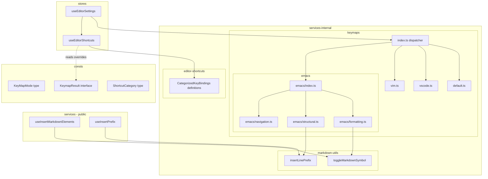
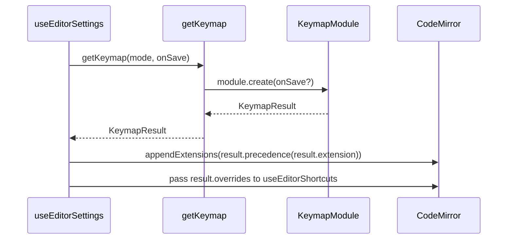

# Design Document: editor-keymaps

## Overview

**Purpose**: This feature refactors the GROWI editor's keymap system into a clean, uniform module architecture and extends Emacs keybindings to cover the full range of markdown-mode operations.

**Users**: Developers maintaining the editor codebase benefit from consistent module boundaries. End users using Emacs keymap mode gain a complete markdown-mode editing experience.

**Impact**: Changes the internal structure of `packages/editor/src/client/services-internal/` and `stores/use-editor-shortcuts.ts`. No external API changes; EditorSettings interface and UI selector remain unchanged.

### Goals
- Uniform factory interface for all 4 keymap modules with encapsulated precedence and override declarations
- Eliminate markdown toggle logic duplication between emacs.ts and editor-shortcuts
- Data-driven shortcut exclusion replacing hard-coded mode checks
- Relocate `editor-shortcuts/` from public services layer to services-internal where it belongs
- Complete Emacs markdown-mode keybindings (formatting, structural, navigation, save)

### Non-Goals
- Changing the keymap selection UI or persistence mechanism (Requirement 8 is verification-only)
- Adding new keymap modes beyond the existing 4
- Modifying Vim keybindings beyond structural consistency
- Full Emacs M-x command palette

## Architecture

### Existing Architecture Analysis

Current module layout and problems:

```
services/ (PUBLIC API)
  use-codemirror-editor/
    utils/
      insert-markdown-elements.ts   ← hook, exposed via public API ✓
      insert-prefix.ts              ← hook, exposed via public API ✓
      editor-shortcuts/             ← NOT exported, only used by stores/ ✗ MISPLACED
        make-text-bold.ts
        make-text-italic.ts
        ...

services-internal/ (INTERNAL)
  keymaps/
    index.ts        ← Dispatcher with inline default/vscode logic
    vim.ts          ← Top-level side effects (Vim.map at module scope)
    emacs.ts        ← Local toggleMarkdownSymbol duplicating hook logic

stores/
  use-editor-settings.ts   ← Contains getKeymapPrecedence() mode branching
  use-editor-shortcuts.ts  ← Hard-coded `if (mode === 'emacs')` exclusion
```

**Problems**:
1. `editor-shortcuts/` is in public `services/` tree but never exported — layer violation
2. No dedicated module for default/vscode modes
3. Precedence logic leaked to consumer (`getKeymapPrecedence`)
4. Override knowledge leaked to shortcut registration (`if emacs` check)
5. Markdown toggle duplicated in emacs.ts vs `useInsertMarkdownElements`
6. emacs.ts will accumulate 19+ commands in a single file — low cohesion

### Architecture Pattern & Boundary Map



**Architecture Integration**:
- Selected pattern: Factory with structured return object (see `research.md` — Pattern A)
- Domain boundaries: Each keymap module owns its bindings, precedence, and override declarations
- Emacs module split into submodules by responsibility (formatting / structural / navigation)
- Pure functions in `markdown-utils/` shared by both public hooks and internal keymaps
- `editor-shortcuts/` relocated to `services-internal/` to match its actual visibility
- Existing patterns preserved: Async lazy loading, `appendExtensions` lifecycle
- Steering compliance: Feature-based organization, named exports, immutability, high cohesion

### Technology Stack

| Layer | Choice / Version | Role in Feature | Notes |
|-------|------------------|-----------------|-------|
| Frontend | CodeMirror 6 (@codemirror/view, @codemirror/state) | Extension system, keymap API | Existing |
| Frontend | @replit/codemirror-emacs 6.1.0 | EmacsHandler.bindKey/addCommands | Existing |
| Frontend | @replit/codemirror-vim 6.2.1 | Vim.map/defineEx | Existing |
| Frontend | @replit/codemirror-vscode-keymap 6.0.2 | VSCode keybindings | Existing |

No new dependencies introduced.

## System Flows

### Keymap Loading Flow



Key decisions:
- Dispatcher is a thin router; all logic lives in modules
- `KeymapResult.precedence` is a function (`Prec.high` or `Prec.low`) applied by the consumer
- `overrides` array flows to shortcut registration for data-driven exclusion

## Requirements Traceability

| Requirement | Summary | Components | Interfaces | Flows |
|-------------|---------|------------|------------|-------|
| 1.1 | Dedicated module per mode | default.ts, vscode.ts, vim.ts, emacs/ | KeymapFactory | Keymap Loading |
| 1.2 | Uniform async factory interface | All keymap modules | KeymapFactory | Keymap Loading |
| 1.3 | No inline logic in dispatcher | keymaps/index.ts | — | Keymap Loading |
| 1.4 | Encapsulated precedence | KeymapResult interface | KeymapResult | Keymap Loading |
| 2.1 | Shared toggle utility | markdown-utils/toggleMarkdownSymbol | — | — |
| 2.2 | Emacs uses shared logic | emacs/formatting.ts | — | — |
| 2.3 | No duplicate toggle impl | Remove local emacs.ts toggle | — | — |
| 3.1 | Keymap declares overrides | KeymapResult.overrides | ShortcutCategory | — |
| 3.2 | Shortcut registration consults overrides | useEditorShortcuts | CategorizedKeyBindings | — |
| 3.3 | New modes need no shortcut changes | Data-driven exclusion | ShortcutCategory | — |
| 4.1-4.5 | Existing Emacs formatting bindings | emacs/formatting.ts | EmacsHandler | — |
| 5.1-5.7 | Emacs structural bindings | emacs/structural.ts | EmacsHandler | — |
| 6.1-6.2 | Emacs C-x C-s save | emacs/index.ts | KeymapFactory (onSave) | — |
| 7.1-7.2 | Vim module consistency | vim.ts | KeymapFactory | — |
| 8.1-8.3 | UI consistency | OptionsSelector | — | — |
| 9.1-9.9 | Extended markdown-mode bindings | emacs/navigation.ts | EmacsHandler | — |

## Components and Interfaces

| Component | Domain/Layer | Intent | Req Coverage | Key Dependencies | Contracts |
|-----------|-------------|--------|--------------|------------------|-----------|
| KeymapResult | consts | Structured return type for keymap factories | 1.2, 1.4, 3.1 | — | Type |
| ShortcutCategory | consts | Override category type | 3.1, 3.2, 3.3 | — | Type |
| CategorizedKeyBindings | consts | KeyBindings grouped by category | 3.2 | — | Type |
| toggleMarkdownSymbol | markdown-utils | Pure function for markdown wrap/unwrap | 2.1, 2.2, 2.3 | @codemirror/state | Service |
| insertLinePrefix | markdown-utils | Pure function for line prefix operations | 5.1, 5.3, 5.4, 5.5 | @codemirror/state | Service |
| keymaps/default.ts | keymaps | Default keymap module | 1.1 | @codemirror/commands | Service |
| keymaps/vscode.ts | keymaps | VSCode keymap module | 1.1 | @replit/codemirror-vscode-keymap | Service |
| keymaps/vim.ts | keymaps | Vim keymap module (refactored) | 1.1, 7.1, 7.2 | @replit/codemirror-vim | Service |
| keymaps/emacs/ | keymaps | Emacs keymap module (split by responsibility) | 1.1, 4-6, 9 | @replit/codemirror-emacs | Service |
| keymaps/index.ts | keymaps | Thin dispatcher | 1.2, 1.3 | All keymap modules | Service |
| editor-shortcuts/ | services-internal | Categorized shortcut definitions | 3.2 | markdown-utils | Service |
| useEditorShortcuts | stores | Data-driven shortcut registration | 3.1, 3.2, 3.3 | editor-shortcuts, KeymapResult | State |
| useEditorSettings | stores | Keymap lifecycle (simplified) | 1.4 | getKeymap | State |
| OptionsSelector | UI | Keymap selector (no changes) | 8.1-8.3 | — | — |

### Consts Layer

#### KeymapResult Interface

| Field | Detail |
|-------|--------|
| Intent | Structured return type encapsulating keymap extension, precedence, and override metadata |
| Requirements | 1.2, 1.4, 3.1 |

**Contracts**: Type [x]

```typescript
type ShortcutCategory = 'formatting' | 'structural' | 'navigation';

interface KeymapResult {
  readonly extension: Extension;
  readonly precedence: (ext: Extension) => Extension; // Prec.high or Prec.low
  readonly overrides: readonly ShortcutCategory[];
}

type KeymapFactory = (onSave?: () => void) => Promise<KeymapResult>;
```

#### CategorizedKeyBindings Type

| Field | Detail |
|-------|--------|
| Intent | Group KeyBindings by ShortcutCategory for data-driven exclusion |
| Requirements | 3.2 |

**Contracts**: Type [x]

```typescript
interface CategorizedKeyBindings {
  readonly category: ShortcutCategory | null; // null = always included (e.g., multiCursor)
  readonly bindings: readonly KeyBinding[];
}
```

Each shortcut definition module returns a `CategorizedKeyBindings` object instead of raw `KeyBinding[]`. `null` category means always active regardless of overrides.

### Shared Utils Layer (`services-internal/markdown-utils/`)

Pure functions usable by both public hooks and internal keymaps. No React dependencies.

#### toggleMarkdownSymbol

| Field | Detail |
|-------|--------|
| Intent | Pure function to wrap/unwrap selected text with markdown symbols |
| Requirements | 2.1, 2.2, 2.3 |

**Contracts**: Service [x]

```typescript
/**
 * Toggle markdown symbols around the current selection.
 * If the selection is already wrapped with prefix/suffix, remove them.
 * If no text is selected, insert prefix+suffix and position cursor between them.
 */
const toggleMarkdownSymbol: (
  view: EditorView,
  prefix: string,
  suffix: string,
) => void;
```

**Implementation Notes**
- Extracted from current `emacs.ts` local function
- `useInsertMarkdownElements` hook in `services/` becomes a thin wrapper: `useCallback((p, s) => toggleMarkdownSymbol(view, p, s), [view])`
- Location: `packages/editor/src/client/services-internal/markdown-utils/toggle-markdown-symbol.ts`

#### insertLinePrefix

| Field | Detail |
|-------|--------|
| Intent | Pure function to insert/toggle prefix at line beginnings |
| Requirements | 5.1, 5.3, 5.4, 5.5 |

**Contracts**: Service [x]

```typescript
/**
 * Insert or toggle a prefix at the beginning of the current line(s).
 * Handles multi-line selections. Removes prefix if all lines already have it.
 */
const insertLinePrefix: (
  view: EditorView,
  prefix: string,
  noSpaceIfPrefixExists?: boolean,
) => void;
```

**Implementation Notes**
- Extracted from current `useInsertPrefix` hook
- Hook becomes a thin wrapper
- Location: `packages/editor/src/client/services-internal/markdown-utils/insert-line-prefix.ts`

#### Dependency Direction

```
services/ (public hooks)
  useInsertMarkdownElements ──imports──> services-internal/markdown-utils/toggleMarkdownSymbol
  useInsertPrefix           ──imports──> services-internal/markdown-utils/insertLinePrefix

services-internal/ (internal)
  keymaps/emacs/formatting  ──imports──> services-internal/markdown-utils/toggleMarkdownSymbol
  keymaps/emacs/structural  ──imports──> services-internal/markdown-utils/insertLinePrefix
  editor-shortcuts/         ──imports──> services-internal/markdown-utils/ (via pure functions)
```

Both public hooks and internal modules depend on the same internal pure functions.

**Layer Rule Exception**: `markdown-utils/` is explicitly designated as a **shared pure-function sublayer** within `services-internal/`. Public hooks in `services/` are permitted to import from `services-internal/markdown-utils/` as thin wrappers. This exception is scoped to pure functions with no React dependencies — other `services-internal/` modules remain off-limits to `services/`. This pattern avoids duplication (Req 2.3) while keeping the public API surface minimal.

### Keymaps Layer

#### keymaps/default.ts

| Field | Detail |
|-------|--------|
| Intent | Default CodeMirror keymap module |
| Requirements | 1.1 |

**Contracts**: Service [x]

```typescript
const defaultKeymap: KeymapFactory;
// Returns:
// - extension: keymap.of(defaultKeymap from @codemirror/commands)
// - precedence: Prec.low
// - overrides: [] (no overrides)
```

#### keymaps/vscode.ts

| Field | Detail |
|-------|--------|
| Intent | VSCode keymap module |
| Requirements | 1.1 |

**Contracts**: Service [x]

```typescript
const vscodeKeymap: KeymapFactory;
// Returns:
// - extension: keymap.of(vscodeKeymap from @replit/codemirror-vscode-keymap)
// - precedence: Prec.low
// - overrides: [] (no overrides)
```

#### keymaps/vim.ts (Refactored)

| Field | Detail |
|-------|--------|
| Intent | Vim keymap module with side effects encapsulated in factory |
| Requirements | 1.1, 7.1, 7.2 |

**Responsibilities & Constraints**
- Moves `Vim.map('jj', '<Esc>', 'insert')` and `Vim.map('jk', '<Esc>', 'insert')` inside factory
- Registers `:w` ex-command inside factory when onSave provided
- Uses idempotency guard to prevent duplicate registration on re-import

**Contracts**: Service [x]

```typescript
const vimKeymap: KeymapFactory;
// Returns:
// - extension: vim()
// - precedence: Prec.high
// - overrides: [] (Vim uses its own modal system, no standard shortcut conflicts)
```

#### keymaps/emacs/ (Split Module)

| Field | Detail |
|-------|--------|
| Intent | Emacs keymap module split by responsibility for high cohesion |
| Requirements | 1.1, 4.1-4.5, 5.1-5.7, 6.1-6.2, 9.1-9.9 |

**Module Structure**:
```
keymaps/emacs/
├── index.ts          ← Factory: composes submodules, registers with EmacsHandler, returns KeymapResult
├── formatting.ts     ← C-c C-s formatting commands (bold, italic, code, strikethrough, code block)
├── structural.ts     ← C-c C-s/C-c C- structural commands (headings, lists, blockquote, link, HR)
└── navigation.ts     ← C-c C- navigation/editing commands (heading nav, promote/demote, kill, image, table)
```

**Submodule Responsibilities**:

Each submodule exports a registration function:
```typescript
type EmacsBindingRegistrar = (
  EmacsHandler: typeof import('@replit/codemirror-emacs').EmacsHandler,
  options?: { onSave?: () => void },
) => void;
```

**emacs/index.ts** — Factory & Composition:
```typescript
const emacsKeymap: KeymapFactory;
// 1. Dynamically imports @replit/codemirror-emacs
// 2. Calls registerFormattingBindings(EmacsHandler)
// 3. Calls registerStructuralBindings(EmacsHandler)
// 4. Calls registerNavigationBindings(EmacsHandler)
// 5. Registers save: C-x C-s → onSave callback
// 6. Returns { extension: emacs(), precedence: Prec.high, overrides: ['formatting', 'structural'] }
```

**emacs/formatting.ts** — Req 4.1-4.5:

| Command Name | Binding | Action |
|-------------|---------|--------|
| markdownBold | `C-c C-s b\|C-c C-s S-b` | toggleMarkdownSymbol(view, '**', '**') |
| markdownItalic | `C-c C-s i\|C-c C-s S-i` | toggleMarkdownSymbol(view, '*', '*') |
| markdownCode | `C-c C-s c` | toggleMarkdownSymbol(view, '`', '`') |
| markdownStrikethrough | `C-c C-s s` | toggleMarkdownSymbol(view, '~~', '~~') |
| markdownCodeBlock | `C-c C-s p` | toggleMarkdownSymbol(view, '```\n', '\n```') |

**emacs/structural.ts** — Req 5.1-5.7:

| Command Name | Binding | Action |
|-------------|---------|--------|
| markdownBlockquote | `C-c C-s q` | insertLinePrefix(view, '>') |
| markdownLink | `C-c C-l` | toggleMarkdownSymbol(view, '[', ']()') |
| markdownHorizontalRule | `C-c C-s -` | Insert '---' at current line |
| markdownHeadingDwim | `C-c C-s h` | Auto-determine heading level |
| markdownHeading1-6 | `C-c C-s 1`~`6` | insertLinePrefix(view, '# '...'###### ') |
| markdownNewListItem | `C-c C-j` | Insert new list item matching context |
| markdownFencedCodeBlock | `C-c C-s S-c` | Insert GFM fenced code block |

**emacs/navigation.ts** — Req 9.1-9.9:

**Multi-Key Prefix Compatibility Note**: All `C-c C-{key}` bindings use the same 2-stroke prefix mechanism validated in PR #10980 (`C-c C-s` prefix). `EmacsHandler.bindKey` supports multi-key sequences where `C-c` acts as a prefix map — subsequent keystrokes (`C-n`, `C-f`, `C-b`, `C-p`, etc.) are dispatched from the prefix map, not as standalone Emacs commands. This has been confirmed working with the `C-c C-s` prefix in production. If any binding conflicts with a base Emacs command (e.g., `C-c C-f` shadowing `forward-char` after `C-c`), the prefix map takes priority by design — the base command remains accessible without the `C-c` prefix.

| Command Name | Binding | Action |
|-------------|---------|--------|
| markdownPromote | `C-c C--` | Decrease heading level or outdent list |
| markdownDemote | `C-c C-=` | Increase heading level or indent list |
| markdownNextHeading | `C-c C-n` | Navigate to next heading |
| markdownPrevHeading | `C-c C-p` | Navigate to previous heading |
| markdownNextSiblingHeading | `C-c C-f` | Navigate to next heading at same level |
| markdownPrevSiblingHeading | `C-c C-b` | Navigate to previous heading at same level |
| markdownUpHeading | `C-c C-u` | Navigate to parent heading |
| markdownKill | `C-c C-k` | Kill element at point |
| markdownImage | `C-c C-i` | Insert image template |
| markdownTable | `C-c C-s t` | Insert table template |
| markdownFootnote | `C-c C-s f` | Insert footnote pair |

#### keymaps/index.ts (Simplified Dispatcher)

| Field | Detail |
|-------|--------|
| Intent | Thin routing dispatcher delegating to keymap modules |
| Requirements | 1.2, 1.3 |

**Contracts**: Service [x]

```typescript
const getKeymap: (
  keyMapName?: KeyMapMode,
  onSave?: () => void,
) => Promise<KeymapResult>;
```

Implementation is a simple switch delegating to each module's factory. No inline keymap construction.

### Editor Shortcuts Layer (`services-internal/editor-shortcuts/`)

Relocated from `services/use-codemirror-editor/utils/editor-shortcuts/`.

| Field | Detail |
|-------|--------|
| Intent | Categorized shortcut definitions for data-driven registration |
| Requirements | 3.2 |

**Key Change**: Each shortcut module returns `CategorizedKeyBindings` instead of raw `KeyBinding`:

```typescript
// Example: formatting shortcuts
const formattingKeyBindings: (view?: EditorView, keymapMode?: KeyMapMode) => CategorizedKeyBindings;
// Returns: { category: 'formatting', bindings: [bold, italic, strikethrough, code] }

// Example: structural shortcuts
const structuralKeyBindings: (view?: EditorView) => CategorizedKeyBindings;
// Returns: { category: 'structural', bindings: [numbered, bullet, blockquote, link] }

// Example: always-on shortcuts
const alwaysOnKeyBindings: () => CategorizedKeyBindings;
// Returns: { category: null, bindings: [...multiCursor] }
```

**Implementation Notes**:
- Individual shortcut files (make-text-bold.ts, etc.) remain as-is internally but are grouped by the categorized wrapper
- `generateAddMarkdownSymbolCommand` refactored to use pure `toggleMarkdownSymbol` directly instead of via hook
- Move path: `services/use-codemirror-editor/utils/editor-shortcuts/` → `services-internal/editor-shortcuts/`

### Stores Layer

#### useEditorShortcuts (Refactored)

| Field | Detail |
|-------|--------|
| Intent | Data-driven shortcut registration using keymap override metadata |
| Requirements | 3.1, 3.2, 3.3 |

**Contracts**: State [x]

```typescript
const useEditorShortcuts: (
  codeMirrorEditor?: UseCodeMirrorEditor,
  overrides?: readonly ShortcutCategory[],
) => void;
```

**Key Change**: Parameter changes from `keymapModeName?: KeyMapMode` to `overrides?: readonly ShortcutCategory[]`.

Exclusion logic:
```typescript
const allGroups: CategorizedKeyBindings[] = [
  formattingKeyBindings(view, keymapMode),
  structuralKeyBindings(view),
  alwaysOnKeyBindings(),
];

const activeBindings = allGroups
  .filter(group => group.category === null || !overrides?.includes(group.category))
  .flatMap(group => group.bindings);
```

#### useEditorSettings (Simplified)

| Field | Detail |
|-------|--------|
| Intent | Keymap lifecycle with simplified precedence handling |
| Requirements | 1.4 |

**Key Change**: Remove `getKeymapPrecedence()` function. Use `keymapResult.precedence` directly:

```typescript
// Before:
const wrapWithPrecedence = getKeymapPrecedence(keymapMode);
codeMirrorEditor?.appendExtensions(wrapWithPrecedence(keymapExtension));

// After:
codeMirrorEditor?.appendExtensions(keymapResult.precedence(keymapResult.extension));
```

Pass `keymapResult.overrides` to `useEditorShortcuts` instead of `keymapMode`.

## Target Directory Structure

```
packages/editor/src/client/
├── services/                              (PUBLIC API — unchanged contract)
│   └── use-codemirror-editor/
│       ├── use-codemirror-editor.ts       (hook: wraps pure functions for public API)
│       └── utils/
│           ├── insert-markdown-elements.ts (thin wrapper → markdown-utils/toggleMarkdownSymbol)
│           ├── insert-prefix.ts           (thin wrapper → markdown-utils/insertLinePrefix)
│           └── ...                        (other utils unchanged)
│           (editor-shortcuts/ REMOVED — moved to services-internal/)
│
├── services-internal/
│   ├── markdown-utils/                    (NEW: pure functions, no React deps)
│   │   ├── index.ts
│   │   ├── toggle-markdown-symbol.ts
│   │   └── insert-line-prefix.ts
│   ├── keymaps/
│   │   ├── index.ts                       (thin dispatcher)
│   │   ├── types.ts                       (KeymapResult, KeymapFactory, ShortcutCategory)
│   │   ├── default.ts                     (NEW)
│   │   ├── vscode.ts                      (NEW)
│   │   ├── vim.ts                         (refactored: side effects inside factory)
│   │   └── emacs/                         (SPLIT from single file)
│   │       ├── index.ts                   (factory + composition)
│   │       ├── formatting.ts              (C-c C-s formatting bindings)
│   │       ├── structural.ts              (C-c C-s/C-c C- structural bindings)
│   │       └── navigation.ts              (C-c C- navigation/editing bindings)
│   ├── editor-shortcuts/                  (MOVED from services/)
│   │   ├── index.ts                       (re-exports CategorizedKeyBindings groups)
│   │   ├── types.ts                       (CategorizedKeyBindings)
│   │   ├── formatting.ts                  (bold, italic, strikethrough, code)
│   │   ├── structural.ts                  (numbered, bullet, blockquote, link)
│   │   ├── always-on.ts                   (multiCursor)
│   │   ├── make-code-block-extension.ts   (4-key combo as Extension)
│   │   └── generate-add-markdown-symbol-command.ts
│   └── ...                                (other services-internal unchanged)
│
└── stores/
    ├── use-editor-settings.ts             (simplified: no getKeymapPrecedence)
    └── use-editor-shortcuts.ts            (refactored: category-based exclusion)
```

### Affected Files: `editor-shortcuts/` Relocation

Moving `editor-shortcuts/` from `services/use-codemirror-editor/utils/` to `services-internal/` affects the following import paths:

| File | Import Count | Change |
|------|-------------|--------|
| `stores/use-editor-shortcuts.ts` | 10 imports | Rewrite all `../services/use-codemirror-editor/utils/editor-shortcuts/` → `../services-internal/editor-shortcuts/` |
| `stores/use-editor-settings.ts` | 1 import (indirect via `use-editor-shortcuts`) | No change needed (imports `useEditorShortcuts` hook, not shortcuts directly) |

No other files in the codebase import from `editor-shortcuts/`. The relocation is self-contained within `stores/use-editor-shortcuts.ts` import rewrites plus the physical directory move.

## Data Models

No data model changes. EditorSettings interface and localStorage persistence remain unchanged.

## Error Handling

### Error Strategy
- EmacsHandler command registration failures: Log warning, continue with base emacs bindings
- Missing onSave callback: Silently ignore C-x C-s / :w (6.2)
- Duplicate command registration: Idempotency guard prevents double-registration

## Testing Strategy

### Unit Tests
- `toggleMarkdownSymbol`: wrap, unwrap, empty selection, nested symbols — 5+ cases
- `insertLinePrefix`: single line, multi-line, toggle off, with indent — 4+ cases
- Each keymap factory returns correct `KeymapResult` shape (precedence, overrides)
- `CategorizedKeyBindings` exclusion logic with various override combinations
- Emacs submodule registration: formatting, structural, navigation each register expected commands

### Integration Tests
- Emacs mode: C-c C-s b toggles bold in editor
- Emacs mode: C-x C-s triggers save callback
- Vim mode: :w triggers save callback
- Mode switching preserves document content
- Shortcut exclusion: formatting shortcuts absent in Emacs mode, present in default mode

### E2E Tests
- Extend existing `playwright/23-editor/vim-keymap.spec.ts` pattern for Emacs keybindings
- Keymap selector switches modes without reload
