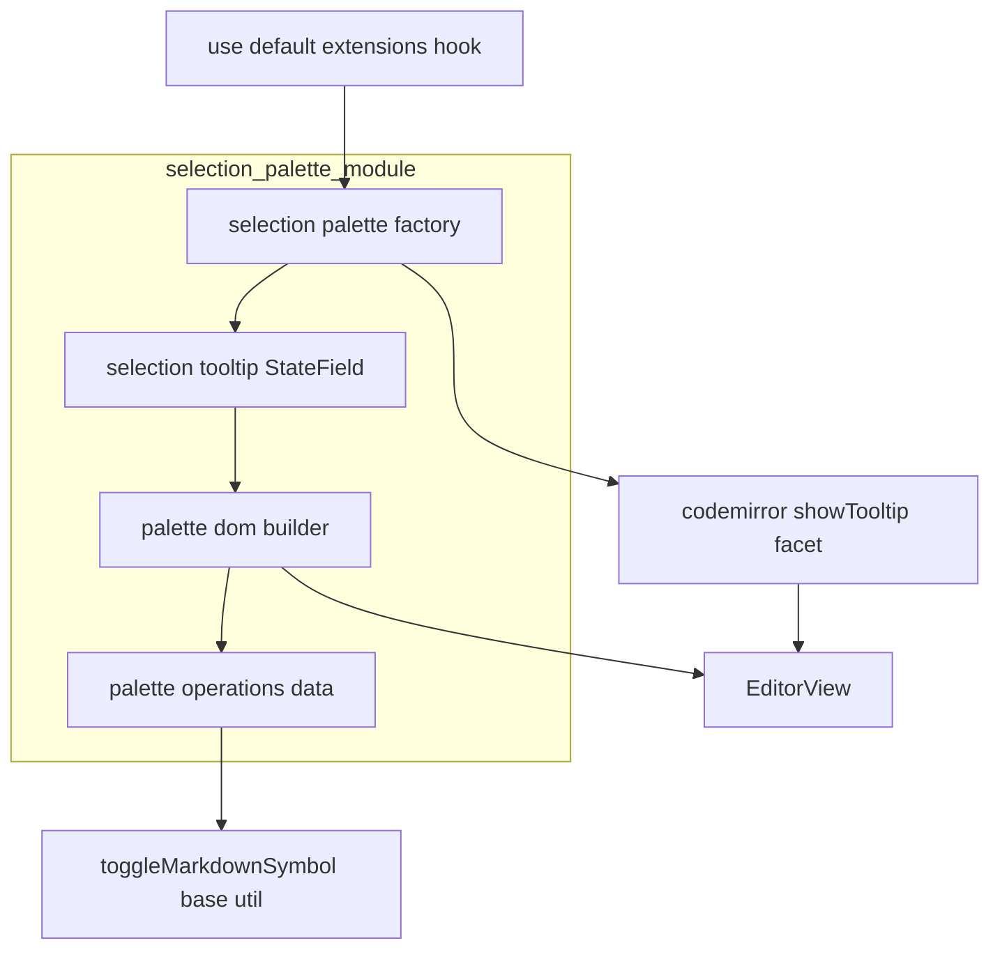
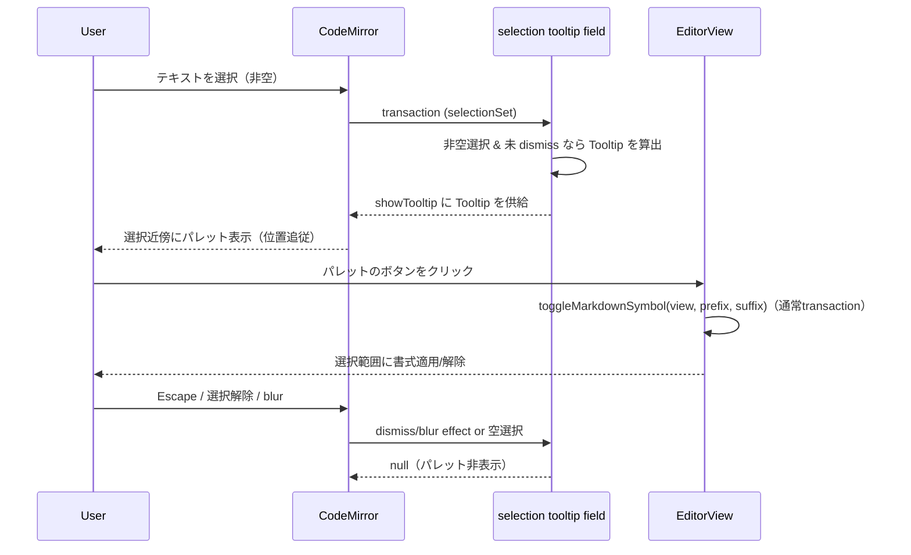

# Technical Design Document

## Overview

**Purpose**: エディタで非空のテキストを選択したときに、選択範囲の近傍へ浮動コマンドパレット（バブルメニュー）を表示し、基本インライン書式（太字・斜体・取り消し線・インラインコード）を選択範囲に適用/解除できるようにする。

**Users**: エディタで執筆する全ユーザーが、選択 → その場のパレットで書式を当てる、という導線で素早くテキストを装飾する。

**Impact**: CodeMirror の `showTooltip` 機構で選択駆動の浮動 UI を追加する。書式適用は既存の基底ユーティリティ `toggleMarkdownSymbol` を再利用する。既存のツールバー・キーバインド・スラッシュコマンド・絵文字補完の挙動は変更しない。

### Goals
- 非空選択時に選択位置へ追従する浮動パレットを表示し、4 つの基本書式をトグル適用する。
- 既存の基底ユーティリティ・toolbar i18n・CM tooltip を再利用し、新規依存ゼロで実装する。

### Non-Goals
- リンク化・見出し化（H1–H3）・引用化（将来拡張）。
- 選択範囲への AI 操作、ブロックレベル変換（将来拡張）。
- `/` トリガーのスラッシュコマンド（基盤 `editor-slash-command` の領域）。
- 基盤 `editor-slash-command` のコマンドレジストリへの依存（本 MVP では不要）。

## Boundary Commitments

### This Spec Owns
- 選択駆動の浮動パレット拡張（非空選択の検知 → tooltip 表示 → 開閉ライフサイクル）。
- パレットの操作集合（bold/italic/strikethrough/code）のデータ宣言と、選択範囲へのトグル適用アダプタ。
- パレット DOM の構築（アイコン/ラベル表示）。

### Out of Boundary
- 基盤 `editor-slash-command` の機構・レジストリ（本 MVP では依存しない）。
- 基底 `toggleMarkdownSymbol` / `insertLinePrefix` の仕様変更（再利用のみ）。
- リンク化・見出し化・引用化、AI 操作、ブロック変換。
- 絵文字補完・既存キーバインド・グローバルホットキー。

### Allowed Dependencies
- `@codemirror/view`（`showTooltip`, `Tooltip`, `keymap`, `EditorView.domEventHandlers`）。
- `@codemirror/state`（`StateField`, `StateEffect`）。
- 基底 `toggleMarkdownSymbol`（`markdown-utils`、既存）。
- `react-i18next` + 既存 locale キー（`toolbar.bold` / `toolbar.italic` / `toolbar.strikethrough` / `toolbar.code`）。ラベル解決は登録フックで `t` を注入。
- 依存方向: `selection-palette-operations（データ）→ markdown-utils` / `selection-palette-tooltip・dom → operations + CM` / `factory → field + keymap + blur handler` / `登録フック → factory`。

### Revalidation Triggers
- `toggleMarkdownSymbol` のシグネチャ変更。
- 再利用する `toolbar.*` locale キーの変更/削除。
- CodeMirror tooltip API（`showTooltip` / `Tooltip`）の変更。
- 操作集合（`PALETTE_OPERATIONS`）の構造変更。

> **roadmap 反映済み**: 本設計の結論として、editor-selection-palette は MVP で `editor-slash-command` に依存しない。roadmap の本スペックの依存は「Dependencies: none（umbrella 所属は維持）」に更新済み（`roadmap.md` の Specs 行・Shared seams に反映）。

## Architecture

### Existing Architecture Analysis
- 選択監視は `EditorView.updateListener` / `update.selectionSet`、状態保持は `StateField` の既存パターンがある。
- 書式適用は `toggleMarkdownSymbol(view, prefix, suffix)`（基底）が選択範囲のトグルを実装済み（`view.dispatch` で通常トランザクション）。
- 既存ツールバーが `toolbar.*` i18n キーと `material-symbols-outlined` アイコンを使用。

### Architecture Pattern & Boundary Map



**Architecture Integration**:
- **Selected pattern**: CM 標準の選択駆動 tooltip（`StateField` → `showTooltip`）。書式適用は基底 `toggleMarkdownSymbol` を adopt。
- **Domain boundaries**: 操作宣言（データ）/ tooltip 状態（field）/ DOM 構築 / 開閉ライフサイクル（factory）を分離。
- **Steering compliance**: データ駆動・pure function 抽出・barrel 最小公開に準拠。基盤 slash から独立。

### Technology Stack

| Layer | Choice / Version | Role in Feature | Notes |
|-------|------------------|-----------------|-------|
| Frontend (editor) | `@codemirror/view ^6.42.1` | `showTooltip`/`Tooltip`/`keymap`/blur | 浮動 UI・開閉 |
| Frontend (editor) | `@codemirror/state` | `StateField`/`StateEffect` | 選択駆動の表示状態 |
| Frontend (editor) | `toggleMarkdownSymbol`（既存） | 選択範囲への書式トグル | 再利用 |
| Frontend (i18n) | `react-i18next` + 既存 `toolbar.*` | ラベル/ツールチップ | 新規キー不要 |

新規依存ライブラリは**なし**。

## File Structure Plan

### Directory Structure
```
packages/editor/src/client/services-internal/selection-palette/
├── index.ts                          # barrel: selectionPalette(t) ファクトリのみ公開
├── selection-palette-operations.ts   # PALETTE_OPERATIONS: 操作データ（id・labelKey・icon・prefix・suffix）
├── selection-palette-dom.ts          # パレット DOM 構築（ボタン）、onClick → toggleMarkdownSymbol
├── selection-palette-tooltip.ts      # 選択駆動 StateField<Tooltip|null> + dismiss/blur StateEffect
├── selection-palette.ts              # ファクトリ: field + showTooltip + Escape keymap + blur handler を合成
├── selection-palette-operations.spec.ts
├── selection-palette-tooltip.spec.ts
└── selection-palette-dom.spec.ts
```

### Modified Files
- `packages/editor/src/client/stores/use-default-extensions.ts` — `useTranslation` で `t` を取得し、`selectionPalette(t)` 拡張を `defaultExtensions` に追加登録する。
- `packages/editor/src/client/services-internal/index.ts` — `selection-palette` barrel を公開。

## System Flows



- **開閉**: StateField は「非空選択 かつ 未 dismiss かつ フォーカスあり」のとき Tooltip を返し、それ以外は `null`。選択解除（3.1）は空選択で自然に閉じる。Escape（3.2）は dismiss 効果、blur（3.3）は blur 効果で閉じる。
- **Escape の非干渉**: Escape keymap はパレット表示時のみ `true`（消費）を返し、非表示時は `false`（通過）。既存 Escape 挙動を壊さない（5.2）。
- **適用**: ボタン onClick は `toggleMarkdownSymbol` を呼ぶのみ。トグル意味論で適用/解除（2.1/2.2）、通常トランザクションで undo・協調編集整合（2.3/2.4/5.3）。

## Requirements Traceability

| Requirement | Summary | Components | Interfaces | Flows |
|-------------|---------|------------|------------|-------|
| 1.1 | 非空選択で表示 | selection-palette-tooltip | StateField | 表示 |
| 1.2 | 空選択で非表示 | selection-palette-tooltip | StateField (null) | 表示 |
| 1.3 | 選択位置に追従 | showTooltip（標準） | — | 表示 |
| 1.4 | 操作のラベル/アイコン | selection-palette-dom, operations | `PALETTE_OPERATIONS` | 表示 |
| 2.1 | 書式適用 | selection-palette-dom | `toggleMarkdownSymbol` | 適用 |
| 2.2 | 再選択で解除 | selection-palette-dom | `toggleMarkdownSymbol`（トグル） | 適用 |
| 2.3 | 通常トランザクション | toggleMarkdownSymbol（再利用） | `view.dispatch` | 適用 |
| 2.4 | undo で復元 | toggleMarkdownSymbol（再利用） | — | 適用 |
| 3.1 | 選択解除で閉じる | selection-palette-tooltip | StateField (null) | 開閉 |
| 3.2 | Escape で閉じる | selection-palette（keymap） | dismiss StateEffect | 開閉 |
| 3.3 | blur で閉じる | selection-palette（domEventHandlers） | blur StateEffect | 開閉 |
| 4.1 | ラベル i18n | selection-palette-dom | `t('toolbar.*')` | 表示 |
| 4.2 | 既定言語フォールバック | react-i18next（標準） | `fallbackLng` | — |
| 5.1 | slash/emoji と共存 | selection-palette（独立拡張） | — | — |
| 5.2 | キーバインド不変 | selection-palette（keymap） | Escape は表示時のみ消費 | 開閉 |
| 5.3 | 協調編集整合 | toggleMarkdownSymbol（通常transaction） | — | 適用 |

## Components and Interfaces

| Component | Domain/Layer | Intent | Req Coverage | Key Dependencies (P0/P1) | Contracts |
|-----------|--------------|--------|--------------|--------------------------|-----------|
| selection-palette-operations | data | 操作集合の宣言 | 1.4, 2.1, 2.2 | toggleMarkdownSymbol (P0) | State |
| selection-palette-dom | logic/UI | パレット DOM 構築・onClick で適用 | 1.4, 2.1, 2.2, 4.1 | operations (P0), toggleMarkdownSymbol (P0) | Service |
| selection-palette-tooltip | logic | 選択駆動の表示状態（StateField） | 1.1, 1.2, 3.1, 3.2, 3.3 | dom (P0), @codemirror/state (P0) | State |
| selection-palette（factory） | integration | field + showTooltip + Escape keymap + blur を合成 | 1.3, 3.2, 3.3, 5.1, 5.2 | tooltip (P0), @codemirror/view (P0) | Service |
| use-default-extensions（変更） | integration | `selectionPalette(t)` を登録 | 4.1, 5.1 | factory (P0), react-i18next (P1) | Service |

### data / logic

#### selection-palette-operations
| Field | Detail |
|-------|--------|
| Intent | パレットの操作を宣言したデータ集合 |
| Requirements | 1.4, 2.1, 2.2 |

**Contracts**: State [x]

```typescript
export interface PaletteOperation {
  readonly id: string;        // 'bold' | 'italic' | 'strikethrough' | 'code'
  readonly labelKey: string;  // 既存 i18n キー 例: 'toolbar.bold'
  readonly icon: string;      // material-symbols 名 例: 'format_bold'
  readonly prefix: string;    // toggleMarkdownSymbol の prefix
  readonly suffix: string;    // toggleMarkdownSymbol の suffix
}

export const PALETTE_OPERATIONS: readonly PaletteOperation[] = [
  { id: 'bold',          labelKey: 'toolbar.bold',          icon: 'format_bold',          prefix: '**', suffix: '**' },
  { id: 'italic',        labelKey: 'toolbar.italic',        icon: 'format_italic',        prefix: '*',  suffix: '*'  },
  { id: 'strikethrough', labelKey: 'toolbar.strikethrough', icon: 'format_strikethrough', prefix: '~~', suffix: '~~' },
  { id: 'code',          labelKey: 'toolbar.code',          icon: 'code',                 prefix: '`',  suffix: '`'  },
];
```

#### selection-palette-dom
| Field | Detail |
|-------|--------|
| Intent | パレットの DOM を構築し、各ボタンを書式トグルに結線 |
| Requirements | 1.4, 2.1, 2.2, 4.1 |

**Contracts**: Service [x]

```typescript
import type { EditorView } from '@codemirror/view';
import type { TFunction } from 'i18next';

// パレット DOM を構築。ボタン onClick は toggleMarkdownSymbol(view, op.prefix, op.suffix) を呼ぶ
export const createPaletteDom: (view: EditorView, t: TFunction) => HTMLElement;
```
- **Responsibilities**: 各 `PALETTE_OPERATION` をアイコン + `t(labelKey)`（title/aria）でボタン化。クリックで `toggleMarkdownSymbol` を実行し、エディタにフォーカスを戻す。
- **Constraints**: 副作用は `toggleMarkdownSymbol` 経由の dispatch のみ。

#### selection-palette-tooltip
| Field | Detail |
|-------|--------|
| Intent | 選択範囲・dismiss/blur 状態から `Tooltip | null` を算出する StateField |
| Requirements | 1.1, 1.2, 3.1, 3.2, 3.3 |

**Contracts**: State [x]

```typescript
import { StateField, StateEffect } from '@codemirror/state';
import type { Tooltip } from '@codemirror/view';

export const dismissPaletteEffect: StateEffect<boolean>; // Escape/blur で true

// 非空選択 かつ 未 dismiss のとき、選択範囲にアンカーした Tooltip を返す。それ以外は null。
export const selectionPaletteField: StateField<Tooltip | null>;
```
- **State model**: 各トランザクションで `state.selection.main` が非空か、`dismissPaletteEffect` が来たかを評価。選択が変化したら dismiss はリセット。
- **Invariants**: 空選択時は常に `null`（Req 1.2/3.1）。

### integration

#### selection-palette（factory）
| Field | Detail |
|-------|--------|
| Intent | StateField + showTooltip + Escape keymap + blur handler を 1 つの Extension に合成 |
| Requirements | 1.3, 3.2, 3.3, 5.1, 5.2 |

```typescript
import type { Extension } from '@codemirror/state';
import type { TFunction } from 'i18next';

export const selectionPalette: (t: TFunction) => Extension;
```
- **Implementation Notes**:
  - `showTooltip.from(selectionPaletteField)` で field を facet に供給（位置追従は標準・Req 1.3）。
  - Escape keymap: パレット表示時のみ `dismissPaletteEffect(true)` を dispatch して `true` を返し、非表示時は `false`（通過）→ 既存 Escape 挙動を保つ（Req 5.2）。
  - blur: `EditorView.domEventHandlers({ blur })` で `dismissPaletteEffect(true)`。ただしパレット内クリックでは閉じないよう実装時に確認。
  - autocomplete（slash/emoji）とは別系統のため共存（Req 5.1）。

#### use-default-extensions（変更）
- `useTranslation('translation')` で `t` を取得し、`selectionPalette(t)` を `defaultExtensions` に追加。ラベルは初期マウント時の言語で解決（実行時切替は再マウントで反映、slash と同方針）。

## Error Handling
- 選択が空・dismiss 済みのときは tooltip を出さない（副作用なし）。
- 書式適用は `toggleMarkdownSymbol` に委譲し、失敗経路は持たない（常に有効なトランザクションを dispatch）。

## Testing Strategy

### Unit Tests
1. `PALETTE_OPERATIONS`: bold/italic/strikethrough/code の4操作が、正しい prefix/suffix・既存 toolbar i18n キー・アイコンを持つ（1.4, 2.1, 2.2）。
2. `selectionPaletteField`: 非空選択で `Tooltip` を返し、空選択で `null`、`dismissPaletteEffect(true)` で `null`、選択変化で dismiss がリセットされる（1.1, 1.2, 3.1, 3.2）。
3. `createPaletteDom` 経由のボタンクリックで `toggleMarkdownSymbol` が呼ばれ、選択範囲が `**…**` 等にラップされ、再クリックで解除、undo で復元（2.1, 2.2, 2.4）。

### Integration Tests
1. 非空選択でパレットが現れ、Escape / 選択解除 / blur で閉じる。Escape は非表示時には消費されない（3.1, 3.2, 3.3, 5.2）。
2. パレットが slash（`/`）・絵文字（`:`）補完と同時に有効でも干渉しない（5.1）。
3. 書式適用が通常トランザクションとして発行され、協調編集の編集経路と整合する（5.3）。

### E2E/UI Tests（任意）
1. テキストを選択 → パレットの太字をクリック → 選択が `**…**` になり、もう一度クリックで解除される（1.1, 2.1, 2.2）。
