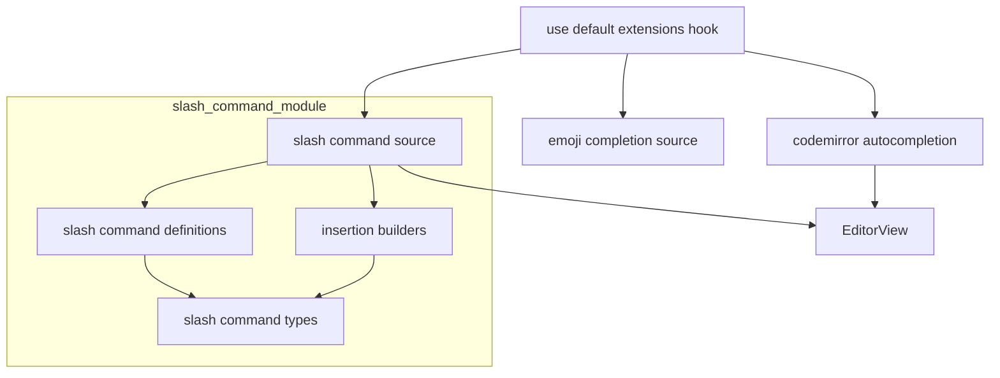
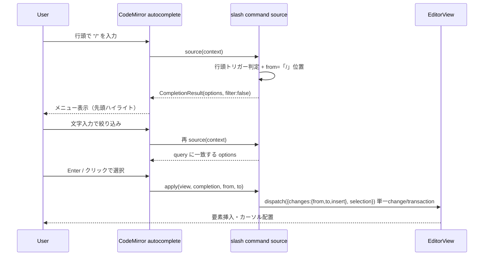

# Technical Design Document

## Overview

**Purpose**: GROWI の Markdown エディタ（CodeMirror 6、`packages/editor/`）に、`/` 入力で起動するスラッシュコマンドメニューを追加し、見出し・リスト・引用・コードブロック・テーブルなどのブロック要素をキーボードから手を離さず高速に挿入できるようにする。

**Users**: エディタで執筆する全ユーザーが、要素挿入のたびにツールバーを探す代わりに `/` で要素を選んで挿入する。

**Impact**: 既存の絵文字オートコンプリート（`:` トリガー）と同じ `@codemirror/autocomplete` 補完エンジンに、新たなスラッシュコマンド補完ソースを統合する。既存のツールバー・キーバインド・グローバルホットキー（`/` 検索）の挙動は変更しない。

### Goals
- `/` 入力で行頭にコマンドメニューを表示し、入力で絞り込み、選択で対応 Markdown 要素を単一トランザクションで挿入する。
- 既存の絵文字補完・キーバインド・グローバル検索と干渉しない。
- コマンド集合をデータ駆動で宣言し、将来のコマンド追加を定義ファイルへの追記のみで可能にする。

### Non-Goals
- GROWI 拡張要素（drawio / math / lsx / テンプレート）のコマンド化（将来拡張）。
- テーブル挿入時の表ビルダー（行列数指定モーダル）起動（将来拡張）。
- 行中（mid-line）の空白直後での発火、およびインライン要素の挿入（将来拡張）。
- コマンドの並び順・表示内容のユーザーカスタマイズ。

## Boundary Commitments

### This Spec Owns
- スラッシュコマンドの補完ソース（トリガー検出・候補生成・フィルタリング・`apply`）。
- コマンド集合の宣言（定義レジストリ）と、各コマンドの挿入ビルダー（行頭マーカー / コードブロック / 空テーブル）。
- コマンドラベル/説明の i18n キーと、その解決（`t` 関数によるラベル解決）。
- 絵文字補完と統合した単一 `autocompletion()` 設定の構築（登録点）。

### Out of Boundary
- 絵文字補完のロジック自体（`:` トリガーの挙動・絵文字データ）。本スペックは emoji ソースを**統合する登録点のみ**変更し、emoji の挙動は不変に保つ。
- 既存の挿入系 toggle 関数（`toggleMarkdownSymbol` / `insertLinePrefix` 等）の仕様変更。
- グローバルホットキー `/`（ページ検索）と `hotkeys` スペックの領域。
- キーバインド体系（`editor-keymaps`）。
- 協調編集（Yjs）の同期機構（`collaborative-editor`）。本スペックは通常の `view.dispatch` トランザクションを発行するのみ。

### Allowed Dependencies
- `@codemirror/autocomplete`（`autocompletion`, `CompletionSource`, `Completion`）、`@codemirror/state`、`@codemirror/view`。
- `react-i18next`（`useTranslation`）— ラベル解決のため登録フックでのみ使用。
- 既存の `emojiAutocompletionSettings.ts` から切り出す emoji 補完ソース/レンダラ（統合のため）。
- 依存方向: `types → definitions → insertion-builders → source →（登録フック）use-default-extensions`。左方向のみ参照可、逆方向参照は禁止。

### Revalidation Triggers
- `emojiAutocompletionSettings.ts` のエクスポート形変更（emoji 側に影響）。
- `use-default-extensions.ts` の補完登録構造の変更（補完全体に影響）。
- `SlashCommand` 定義インタフェースの変更（コマンド定義ファイルに影響）。
- i18n キー命名（`slash_command.*`）の変更（ロケール JSON に影響）。

## Architecture

### Existing Architecture Analysis
- 補完は `stores/use-default-extensions.ts` の `defaultExtensions[]` に Extension を並べ、`appendExtensions([...])`（`Compartment` + `StateEffect.appendConfig`）で登録される。
- 絵文字補完は `autocompletion({ override: [emojiAutocompletion], addToOptions: [render], icons: false })` を Extension として直接登録している。
- 挿入系 pure 関数は `EditorView` を受け取り内部で `view.dispatch` する（選択範囲ベース・トグル意味論）。

### Architecture Pattern & Boundary Map



**Architecture Integration**:
- **Selected pattern**: 既存実績のある `@codemirror/autocomplete` 補完ソースパターンを踏襲し、emoji と slash を**単一 `autocompletion()`** に統合する。
- **Domain boundaries**: コマンド宣言（データ）/ 挿入生成（純粋ビルダー）/ トリガー・適用（補完ソース）/ 登録・i18n 解決（フック）を分離。
- **Existing patterns preserved**: `Compartment` 登録、`services-internal` 配下のモジュール分割、barrel 公開面。
- **Steering compliance**: 「Executors take their work-set as input」「Data-Driven Control」「pure function 抽出」「barrel 最小公開」に準拠。

### Technology Stack

| Layer | Choice / Version | Role in Feature | Notes |
|-------|------------------|-----------------|-------|
| Frontend (editor) | `@codemirror/autocomplete` (既存) | 補完ソース/ポップアップ/キーボード操作/フィルタ | emoji と統合 |
| Frontend (editor) | `@codemirror/state`, `@codemirror/view` (既存) | `EditorView`・トランザクション（`ChangeSpec`/`EditorSelection`） | 単一トランザクション挿入 |
| Frontend (i18n) | `react-i18next` (既存) | コマンドラベル/説明の解決 | キーは locale JSON |
| Data / Storage | なし | — | 永続化なし |

新規依存ライブラリは**なし**（全て既存スタック）。

## File Structure Plan

### Directory Structure
```
packages/editor/src/client/services-internal/slash-command/
├── index.ts                          # barrel: source とテスト用に definitions/types を公開
├── slash-command-types.ts            # SlashCommand / ResolvedSlashCommand / SlashInsertion 型
├── slash-command-definitions.ts      # コマンド集合の単一ソース（id・i18nキー・keywords・builder参照）
├── insertion-builders.ts             # 純粋ビルダー: lineMarkerInsertion / codeBlockInsertion / tableInsertion
├── resolve-slash-commands.ts         # (t) => ResolvedSlashCommand[]（i18nキー→表示文字列、純粋）
├── slash-command-source.ts           # createSlashCommandSource(commands): CompletionSource（トリガー検出+apply）
├── slash-command-source.spec.ts      # トリガー/フィルタ/apply の単体テスト
├── insertion-builders.spec.ts        # 各ビルダーの挿入結果テスト
└── resolve-slash-commands.spec.ts    # ラベル解決テスト
```

### Modified Files
- `packages/editor/src/client/services-internal/extensions/emojiAutocompletionSettings.ts` — emoji の `CompletionSource` と `render` addToOption を named export として切り出す（既存の統合済み Extension export は登録点へ移動）。
- `packages/editor/src/client/stores/use-default-extensions.ts` — `useTranslation` でラベル解決し、`createSlashCommandSource(resolveSlashCommands(t))` と emoji ソースを 1 つの `autocompletion({ override: [slashSource, emojiSource], addToOptions: [emojiRender], icons: false })` に統合して登録する。
- `packages/editor/src/client/services-internal/extensions/index.ts` — emoji source/render の再エクスポート調整。
- `packages/editor/src/client/services-internal/index.ts` — `slash-command` barrel を公開。
- `apps/app/public/static/locales/en_US/translation.json` — `slash_command.*` キー追加。
- `apps/app/public/static/locales/ja_JP/translation.json` — `slash_command.*` キー追加。

## System Flows



- **トリガー判定**: `from`（`/` の位置）の直前が行頭（先頭空白のみ）の場合のみ `CompletionResult` を返す。単語途中・行中の `/` は `null`（Req 1.2）。
- **フィルタ**: `filter: false` とし、source 側で query（`/` 以降の文字列）を label と `keywords` に対して大文字小文字を無視して照合（Req 2.1/2.2）。一致なしは `options: []`→メニューは閉じ、入力テキストは不変（Req 2.4/4.3）。
- **apply**: コマンドの `buildInsertion` が返す `{ insert, cursorOffset }` から、`/query`（`[from, to]`）を置換する単一 change `{ from, to, insert }` を 1 トランザクションで発行（Req 3.2/3.5）。

## Requirements Traceability

| Requirement | Summary | Components | Interfaces | Flows |
|-------------|---------|------------|------------|-------|
| 1.1 | 行頭 `/` でメニュー表示 | slash command source | `createSlashCommandSource` | 起動フロー |
| 1.2 | 単語途中で非発火 | slash command source | トリガー判定 | 起動フロー |
| 1.3 | ラベル+説明表示 | resolve-slash-commands, source | `ResolvedSlashCommand` | 起動フロー |
| 1.4 | 初期ハイライト | autocompletion（標準） | — | 起動フロー |
| 2.1 | 入力で絞り込み | slash command source | query 照合 | 絞り込み |
| 2.2 | 大小文字無視 | slash command source | query 照合 | 絞り込み |
| 2.3 | 入力変化で更新 | slash command source | `validFor` / 再 source | 絞り込み |
| 2.4 | 一致なしで閉じ・テキスト保持 | slash command source | `options: []` | 絞り込み |
| 3.1 | 矢印で候補移動 | autocompletion（標準） | — | 選択 |
| 3.2 | 選択で削除+挿入 | slash command source | `apply` 単一transaction | 選択 |
| 3.3 | 空 Markdown テーブル挿入 | insertion-builders | `tableInsertion` | 選択 |
| 3.4 | カーソル配置 | insertion-builders | `SlashInsertion.selection` | 選択 |
| 3.5 | undo で復元 | slash command source | 単一transaction | 選択 |
| 4.1 | Escape で閉じ・テキスト保持 | autocompletion（標準） | `closeCompletion` | — |
| 4.2 | 外側クリック/blur で閉じ | autocompletion（標準） | — | — |
| 4.3 | 空白入力でテキスト不変 | slash command source | `validFor`（`\w*`） | — |
| 5.1 | コマンド集合 | slash-command-definitions | `SlashCommand[]` | — |
| 5.2 | 行頭プレフィックス系挿入 | insertion-builders | `lineMarkerInsertion` | 選択 |
| 5.3 | コードブロック挿入 | insertion-builders | `codeBlockInsertion` | 選択 |
| 5.4 | 拡張要素は非提供 | slash-command-definitions | 定義から除外 | — |
| 6.1 | 非フォーカス時は検索維持 | （本機能はエディタ拡張のみ） | `/` をグローバルにバインドしない | — |
| 6.2 | emoji と共存 | use-default-extensions | 単一 `autocompletion` | — |
| 6.3 | 協調編集の整合 | slash command source | 通常 `view.dispatch` | 選択 |
| 6.4 | キーバインド不変 | （keymap 追加なし） | — | — |
| 7.1 | ラベル i18n | resolve-slash-commands | `resolveSlashCommands(t)` | — |
| 7.2 | 既定言語フォールバック | react-i18next（標準） | `fallbackLng` | — |

## Components and Interfaces

| Component | Domain/Layer | Intent | Req Coverage | Key Dependencies (P0/P1) | Contracts |
|-----------|--------------|--------|--------------|--------------------------|-----------|
| slash-command-types | types | コマンド/挿入の型定義 | 5.1 | — | State |
| slash-command-definitions | data | コマンド集合の単一ソース | 5.1, 5.4 | types (P0) | State |
| insertion-builders | logic | 挿入内容（純粋）を生成 | 3.3, 3.4, 5.2, 5.3 | types (P0) | Service |
| resolve-slash-commands | logic | i18nキー→表示文字列に解決 | 1.3, 7.1, 7.2 | definitions (P0), react-i18next (P1) | Service |
| slash-command-source | logic | トリガー検出・フィルタ・apply | 1.1, 1.2, 2.1-2.4, 3.2, 3.5, 4.3, 6.3 | builders (P0), `@codemirror/autocomplete` (P0) | Service |
| use-default-extensions（変更） | integration | emoji と統合し登録 | 6.2, 7.1 | source (P0), emoji source (P0) | Service |

### types / data

#### slash-command-types
| Field | Detail |
|-------|--------|
| Intent | コマンドと挿入の型を定義 |
| Requirements | 5.1 |

**Contracts**: State [x]

```typescript
import type { EditorView } from '@codemirror/view';

/**
 * `/query`（[from, to]）を置換して挿入する内容。
 * 位置を持たないテキストと、挿入後カーソルの `from` 相対オフセットのみを表現し、
 * 削除と挿入の合成は呼び出し側（`apply`）が単一の { from, to, insert } として行う。
 * これにより builder 側が絶対位置の ChangeSpec を持たず、削除レンジとの重なり/競合が原理的に発生しない。
 */
export interface SlashInsertion {
  readonly insert: string;        // [from, to] を置換するテキスト全体
  readonly cursorOffset: number;  // 挿入後のカーソル位置（from からの相対オフセット）
}

/** コマンド定義（i18n キーを保持。表示文字列は解決時に付与） */
export interface SlashCommand {
  readonly id: string;                   // 安定 id 例: 'heading1'
  readonly labelKey: string;             // i18n キー 例: 'slash_command.heading1.label'
  readonly descriptionKey: string;
  readonly keywords: readonly string[];  // 追加の照合語 例: ['h1', 'title']
  /** 挿入内容（テキスト + カーソルオフセット）を生成（純粋・副作用なし） */
  readonly buildInsertion: (view: EditorView, from: number) => SlashInsertion;
}

/** 表示文字列を解決済みのコマンド */
export interface ResolvedSlashCommand extends SlashCommand {
  readonly label: string;
  readonly description: string;
}
```

#### slash-command-definitions
| Field | Detail |
|-------|--------|
| Intent | MVP のコマンド集合を単一ソースとして宣言 |
| Requirements | 5.1, 5.4 |

**Responsibilities & Constraints**
- 提供コマンド（Req 5.1）: `heading1`/`heading2`/`heading3`（`# `/`## `/`### `）, `bulletList`(`- `), `numberedList`(`1. `), `taskList`(`- [ ] `), `quote`(`> `), `codeBlock`, `table`。
- 拡張要素（drawio/math/lsx/template）は**含めない**（Req 5.4）。
- 各コマンドは `buildInsertion` に `insertion-builders` のいずれかを参照する（executor へ集合を渡す単一ソース）。

```typescript
export const SLASH_COMMANDS: readonly SlashCommand[] = [
  { id: 'heading1', labelKey: 'slash_command.heading1.label', descriptionKey: 'slash_command.heading1.description', keywords: ['h1', 'title'], buildInsertion: lineMarkerInsertion('# ') },
  // ... heading2/3, bulletList, numberedList, taskList, quote, codeBlock, table
];
```

### logic

#### insertion-builders
| Field | Detail |
|-------|--------|
| Intent | カーソル位置 `from` を起点に挿入内容（`SlashInsertion`）を返す純粋関数群 |
| Requirements | 3.3, 3.4, 5.2, 5.3 |

**Contracts**: Service [x]

##### Service Interface
```typescript
/** 行頭マーカー（見出し/リスト/引用/タスク）。挿入後カーソルはマーカー直後 */
export const lineMarkerInsertion: (marker: string) => SlashCommand['buildInsertion'];

/** 空のコードブロック。挿入後カーソルは中身の空行 */
export const codeBlockInsertion: SlashCommand['buildInsertion'];

/** 2 列・ヘッダ+区切り+1 ボディ行の空 Markdown テーブル。挿入後カーソルは先頭ヘッダセル */
export const tableInsertion: SlashCommand['buildInsertion'];
```
- **Preconditions**: `from` は `/` の位置（置換レンジ `[from, to]` の起点）。
- **Postconditions**: `insert`（置換テキスト全体）と `cursorOffset`（`from` 相対）のみを返す。絶対位置の変更や `view.dispatch` は行わない。`cursorOffset` で続行入力位置を指定（Req 3.4）。
- **Invariants**: 副作用なし。`view` は行コンテキスト参照のためにのみ使用（位置を直接変更しない）。

**Implementation Notes**
- Integration: `lineMarkerInsertion` のプレフィックス文字列はツールバーの行頭挿入と概念的に一致（将来共有ビルダーへ統合余地）。
- Validation: 既存 markdown-utils テストと同様に `EditorState`/`EditorView` を組んで挿入結果を検証。
- Risks: テーブル雛形の列数は固定 2 列（MVP）。

#### resolve-slash-commands
| Field | Detail |
|-------|--------|
| Intent | i18n キーを表示文字列へ解決した `ResolvedSlashCommand[]` を返す純粋関数 |
| Requirements | 1.3, 7.1, 7.2 |

**Contracts**: Service [x]

```typescript
import type { TFunction } from 'i18next';
export const resolveSlashCommands: (
  t: TFunction, commands?: readonly SlashCommand[],
) => ResolvedSlashCommand[];
```
- **Preconditions**: `t` は `translation` 名前空間。`commands` 省略時は `SLASH_COMMANDS`。
- **Postconditions**: 各コマンドに `label`/`description` を付与。未対応言語は i18next の `fallbackLng` で既定言語に解決（Req 7.2）。

#### slash-command-source
| Field | Detail |
|-------|--------|
| Intent | 解決済みコマンド配列から CodeMirror の `CompletionSource` を生成 |
| Requirements | 1.1, 1.2, 2.1, 2.2, 2.3, 2.4, 3.2, 3.5, 4.3, 6.3 |

**Responsibilities & Constraints**
- 入力（work-set）として `ResolvedSlashCommand[]` を受け取る（executor は集合を所有しない）。
- トリガー判定: 直前が行頭（先頭空白のみ許容）の `/` のみ。`from` を `/` 位置、`to` を `context.pos` とする。
- `filter: false`、`validFor: /\/\w*$/` 相当。query を `label`/`keywords` に対し大文字小文字無視で照合。
- `apply`: `buildInsertion(view, from)` の結果から、**単一の `view.dispatch({ changes: { from, to, insert }, selection: { anchor: from + cursorOffset } })`** を発行する。削除（`[from, to]`）と挿入が1つの change にまとまるため、change レンジの重なりが発生せず、undo も1回で復元される（Req 3.5）。

**Dependencies**
- Outbound: insertion-builders — 挿入内容生成（P0）
- External: `@codemirror/autocomplete` — `CompletionSource`/`Completion`/`apply`（P0）

**Contracts**: Service [x]

##### Service Interface
```typescript
import type { CompletionSource } from '@codemirror/autocomplete';
export const createSlashCommandSource: (
  commands: readonly ResolvedSlashCommand[],
) => CompletionSource;
```
- **Preconditions**: `commands` は解決済み。
- **Postconditions**: トリガー時に query 一致 `Completion[]` を返し、`apply` が単一トランザクションで削除+挿入を行う。非トリガー時は `null`。
- **Invariants**: `/query` 以外のドキュメントを変更しない（Req 2.4/4.3）。

**Implementation Notes**
- Integration: 各 `Completion` は `label`（表示）、`detail`/`info`（説明）、`apply`（上記）を持つ。`render` は任意（MVP は標準表示で可）。
- Validation: トリガー（行頭/単語途中）、query 照合（大小文字/keyword）、apply 後の文書・選択・undo を単体テスト。
- Risks: 行頭判定の境界（先頭空白・リスト内）に注意。

### integration

#### use-default-extensions（変更）
| Field | Detail |
|-------|--------|
| Intent | emoji と slash を単一 `autocompletion()` に統合して登録、ラベル解決 | 
| Requirements | 6.2, 7.1 |

**Responsibilities & Constraints**
- `useTranslation('translation')` で `t` を取得 → `resolveSlashCommands(t)` → `createSlashCommandSource(...)`。
- emoji 補完ソース/レンダラと合わせて `autocompletion({ override: [slashSource, emojiSource], addToOptions: [emojiRender], icons: false })` を構築し `defaultExtensions` に組み込む。
- emoji の従来挙動を不変に保つ（Out of Boundary）。

**登録機構（多重 append / 破壊の防止）**
- 統合 `autocompletion()` 拡張は `t` に依存するため module-level const にできない。`useMemo([t])` で拡張を**安定化**してから登録する。
- `appendExtensions`（`Compartment` + `StateEffect.appendConfig`）は呼び出しごとに新しい `Compartment` を生成するため、`t` が変わるたびに素朴に再呼び出しすると**多重登録**になる。これを避けるため、本フックでは以下を満たす:
  - `appendExtensions` の戻り値（cleanup 関数）を保持し、再登録の前に必ず前回分を cleanup する（`useEffect` の cleanup で `Compartment.reconfigure([])`）。
  - `useEffect` の依存配列を `[codeMirrorEditor.view, memoizedExtension]` とし、`view` 確定時とラベル（言語）変化時のみ再構成する。
- 代替案（MVP 簡素化）: ラベルは初期マウント時の言語で1回だけ解決し、実行時の言語切替はエディタ再マウントで反映する。この場合 `t` 依存の再登録は不要となり、`defaultExtensions` 相当を初期化時に1回 append すれば足りる。**どちらを採るかは実装タスクで確定**（既存 `useDefaultExtensions` の呼び出し文脈が i18n provider 配下かつ単一マウントであることを前提に、まず簡素化案を採用）。

**Implementation Notes**
- Integration: 既存の単独 emoji Extension 登録を、統合 `autocompletion()` に置換。emoji 側は `emojiCompletionSource` と render addToOption を named export に切り出す（ロジックは不変）。
- Validation: emoji 補完が回帰しないこと、slash と同時に機能すること、言語切替で補完が多重化/消失しないことをスモーク確認（Req 6.2）。
- Risks: `appendExtensions` は呼び出しごとに新 `Compartment` を作る仕様のため、cleanup 漏れが多重登録に直結する点に注意。

## Error Handling

### Error Strategy
- **トリガー外**: `source` は `null` を返し副作用なし。
- **一致なし**: `options: []` でメニューは閉じ、文書は不変（Req 2.4）。
- **キャンセル**: Escape / blur / 外側クリックは `@codemirror/autocomplete` 標準でメニューを閉じ、文書は不変（Req 4.1/4.2）。
- **不正な挿入位置**: 行頭トリガーに限定することで行頭プレフィックスの破綻を防止（Req 1.2 / Non-Goals）。

### Monitoring
- 本機能はクライアント内 UI で永続化・サーバ通信なし。専用ログは追加しない（既存エディタの挙動に委譲）。

## Testing Strategy

### Unit Tests
1. `slash-command-source`: 行頭 `/` で `CompletionResult` を返し、単語途中・行中 `/` では `null`（1.1, 1.2）。
2. `slash-command-source`: query に対し label/keywords を大文字小文字無視で照合し、一致なしで `options: []`（2.1, 2.2, 2.4）。
3. `slash-command-source`: `apply` 実行後に `/query` が消え対象要素が挿入され、1 回の undo で元の文書に戻る（3.2, 3.5）。
4. `insertion-builders`: `lineMarkerInsertion('# ')` / `codeBlockInsertion` / `tableInsertion` が期待する文字列とカーソル位置を返す（3.3, 3.4, 5.2, 5.3）。
5. `resolve-slash-commands`: 各コマンドに label/description が解決され、未対応キーで既定言語にフォールバック（1.3, 7.1, 7.2）。

（テストは markdown-utils の既存規約に倣い、`@codemirror/state` の `EditorState`/`EditorSelection` と `@codemirror/view` の `EditorView` を組んで `view.state.doc.toString()` と `view.state.selection` を検証。`// @vitest-environment jsdom`。）

### Integration Tests
1. `use-default-extensions` 経由で slash と emoji の両補完ソースが同一 `autocompletion()` に登録され、`/` と `:` がそれぞれ独立に発火する（6.2）。
2. コマンド選択による挿入が通常の `view.dispatch` トランザクションとして発行され、協調編集前提の編集経路と整合する（6.3、トランザクション発行の検証）。

### E2E/UI Tests（任意）
1. エディタで `/` 入力→`table` 絞り込み→Enter で空テーブルが挿入されカーソルが先頭セルに来る（1.1, 2.1, 3.2, 3.3, 3.4）。
2. `/` 入力後 Escape で `/` テキストが残りメニューが閉じる（4.1）。
