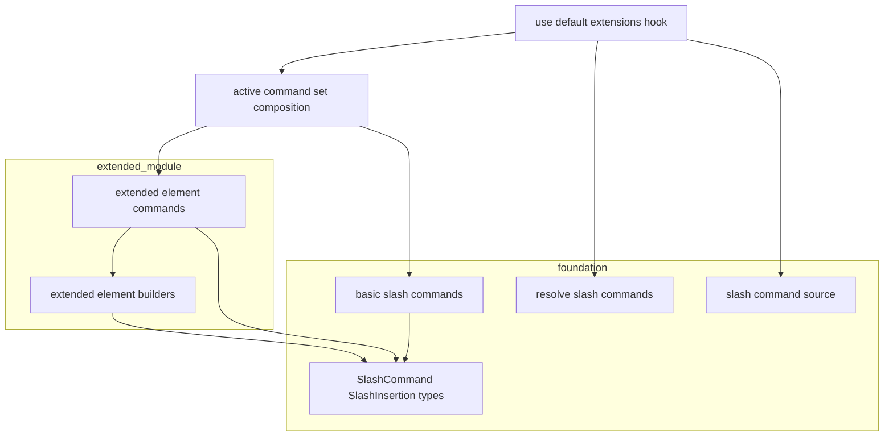

# Technical Design Document

## Overview

**Purpose**: 基盤 `editor-slash-command` のスラッシュコマンド機構の上に、GROWI 固有の拡張要素（drawio / plantuml / lsx）を `/` から挿入するコマンドを追加する。本スペックは「拡張要素コマンドの定義データ」と「各要素の雛形を生成する純粋ビルダー」を新設し、基盤のトリガー・補完ソース・`apply`・i18n 解決はそのまま利用する。

**Users**: エディタで執筆する全ユーザーが、`/drawio` `/plantuml` `/lsx` で記法を手入力せず雛形を挿入する。

**Impact**: 基盤のコマンド集合に拡張要素コマンドを**合流**させる。基盤の機構・基本コマンド・絵文字補完・描画機構（remark/rehype プラグイン）の挙動は変更しない。

### Goals
- drawio / plantuml / lsx の雛形を、基盤と一貫した挙動（`/query` 置換・単一トランザクション・カーソル配置・undo 1 回復元）で挿入する。
- 拡張コマンドを独立モジュールとして持ち、依存逆転なく基盤レジストリへ合流させる。

### Non-Goals
- 拡張要素の描画・プレビュー（既存 remark/rehype プラグインの領域）。
- drawio のモーダル作図エディタ起動（将来拡張）。
- math / mermaid / callout 等、今回未選択の要素（将来拡張）。
- 基盤のトリガー・補完ソース・レジストリ機構そのものの変更。

## Boundary Commitments

### This Spec Owns
- 拡張要素コマンドの定義データ（drawio / plantuml / lsx の id・i18n キー・キーワード・対応ビルダー）。
- 各要素の雛形を生成する純粋挿入ビルダー（drawio / plantuml / lsx）。
- 拡張要素コマンドのラベル/説明の locale キー（`slash_command.*`）。
- 拡張コマンド集合を基盤の合流点へ供給すること。

### Out of Boundary
- 基盤 `editor-slash-command` の `SlashCommand` / `SlashInsertion` 契約、補完ソース、トリガー検出、`apply`、i18n 解決機構（基盤が所有・変更しない）。
- 拡張要素の描画・パース（remark/rehype プラグイン）。
- drawio モーダル（`DiagramButton` / `useDrawioModalForEditorActions`）。
- 絵文字補完・キーバインド・グローバルホットキー。

### Allowed Dependencies
- 基盤の型/契約: `SlashCommand`、`SlashInsertion`（`{ insert: string, cursorOffset: number }`）。
- `@codemirror/view`（`EditorView`、`buildInsertion` 引数の型のため。雛形は静的なので view は未使用）。
- i18n: 基盤の `resolveSlashCommands(t, commands)` 経由でラベル解決（本スペックは locale キーを足すのみ）。
- 依存方向: `extended-element-builders → 基盤の型` / `extended-element-commands → builders + 基盤の型` / `合流点（登録レイヤ）→ 基盤コマンド + 拡張コマンド`。拡張モジュールは基盤の core 定義を import しない（基盤が拡張を知らない＝逆転なし）。

### Revalidation Triggers
- 基盤の `SlashCommand` / `SlashInsertion` 契約変更。
- コマンド集合の**合流点**の構造変更（登録レイヤの合成方法）。
- locale キー命名（`slash_command.*`）の変更。
- 雛形（記法）の変更（描画側プラグインの記法要件に追従が必要な場合）。

### 着手前提条件 (Prerequisites)
- **基盤インタフェースの凍結（必須ゲート）**: 本スペックの実装着手前に、基盤 `editor-slash-command` の次の3契約を確定・凍結すること。これらが固まる前に着手するとビルダー署名・合流方法に手戻りが生じる。
  1. `SlashCommand` 型（特に `buildInsertion` の署名）
  2. `SlashInsertion` 型（`{ insert: string, cursorOffset: number }`）
  3. コマンド集合の合流点の関数形（`[...SLASH_COMMANDS, ...EXTENDED_ELEMENT_COMMANDS]` をどこで合成するか）
  - 別ストーリーで並行着手する場合は、基盤側でこの3点のみ先行実装してインタフェースを固定する。

## Architecture

### Existing Architecture Analysis
- 基盤（設計済み・未実装）は、`slash-command/` 配下に `slash-command-definitions.ts`（基本コマンド `SLASH_COMMANDS`）、`insertion-builders.ts`、`slash-command-source.ts`、`resolve-slash-commands.ts` を持ち、`use-default-extensions.ts` で `createSlashCommandSource(resolveSlashCommands(t, commands))` を絵文字と統合した単一 `autocompletion()` として登録する。
- 拡張要素の記法は確定: drawio/plantuml = コードフェンス、lsx = `$lsx(...)`。描画は既存プラグインが担う。

### Architecture Pattern & Boundary Map



**Architecture Integration**:
- **Selected pattern**: Option B — 拡張コマンドを独立モジュール化し、**合流点（active command set composition）**で基盤コマンドと結合。基盤 core は拡張を知らない。
- **Composition point**: 有効コマンド集合を `[...SLASH_COMMANDS, ...EXTENDED_ELEMENT_COMMANDS]` として宣言する単一箇所を設け、登録フックはそれを読む。拡張スペックが増えても合流点への追記のみで済み、`use-default-extensions` のロジックは変更不要（"Executors take their work-set as input" / "declare items in the set"）。
- **Steering compliance**: データ駆動・pure function 抽出・barrel 最小公開に準拠。

### Technology Stack

| Layer | Choice / Version | Role in Feature | Notes |
|-------|------------------|-----------------|-------|
| Frontend (editor) | 基盤 `editor-slash-command`（同一パッケージ） | コマンド機構・補完・apply・i18n 解決 | 本スペックは定義/ビルダーを供給 |
| Frontend (editor) | `@codemirror/view`（既存） | `buildInsertion` の型 | 雛形は静的、view 未使用 |
| Frontend (i18n) | `react-i18next` + locale JSON（既存） | ラベル/説明 | `slash_command.*` キー追加 |
| Data / Storage | なし | — | 永続化なし |

新規依存ライブラリは**なし**。

## File Structure Plan

### Directory Structure
```
packages/editor/src/client/services-internal/slash-command/extended-elements/
├── index.ts                          # barrel: EXTENDED_ELEMENT_COMMANDS を公開
├── extended-element-builders.ts      # 純粋ビルダー: drawioInsertion / plantumlInsertion / lsxInsertion
├── extended-element-commands.ts      # EXTENDED_ELEMENT_COMMANDS: SlashCommand[]（定義データ）
├── extended-element-builders.spec.ts # 各雛形の挿入テキスト + カーソル位置の単体テスト
└── extended-element-commands.spec.ts # 定義の健全性（対象3種・未選択要素を含まない）テスト
```

### Modified Files
- 基盤の**コマンド集合合流点**（基盤設計で `use-default-extensions.ts` 内の `resolveSlashCommands(t, commands)` 呼び出しに渡す集合、または基盤が用意する集約モジュール）— `EXTENDED_ELEMENT_COMMANDS` を基本コマンドに合流させる。
  - 基盤未実装のため、合流点の正確な形（集約モジュール `all-slash-commands.ts` を新設するか、フック内合成か）は基盤実装時に確定。本スペックは「拡張集合を1箇所で合流させる」契約のみに依存。
- `apps/app/public/static/locales/en_US/translation.json` — `slash_command.drawio.*` / `plantuml.*` / `lsx.*` キー追加。
- `apps/app/public/static/locales/ja_JP/translation.json` — 同上。

## System Flows

挿入フロー・トリガー・絞り込みは基盤フローと同一（基盤 design.md「System Flows」参照）。本スペックは `apply` が呼ぶ `buildInsertion` の中身（雛形生成）と、コマンド集合への合流のみを足す。新規フローはなし。

## Requirements Traceability

| Requirement | Summary | Components | Interfaces | Flows |
|-------------|---------|------------|------------|-------|
| 1.1 | drawio/plantuml/lsx コマンド提供 | extended-element-commands | `EXTENDED_ELEMENT_COMMANDS` | 基盤フロー |
| 1.2 | drawio 空フェンス挿入 | extended-element-builders | `drawioInsertion` | 選択 |
| 1.3 | plantuml フェンス挿入 | extended-element-builders | `plantumlInsertion` | 選択 |
| 1.4 | lsx 記法雛形挿入 | extended-element-builders | `lsxInsertion` | 選択 |
| 1.5 | 未選択要素は非提供 | extended-element-commands | 定義から除外 | — |
| 2.1 | `/query` 置換して挿入 | 基盤 source.apply（再利用） | `SlashInsertion` | 選択 |
| 2.2 | カーソル配置 | extended-element-builders | `cursorOffset` | 選択 |
| 2.3 | undo 1 回で復元 | 基盤 source.apply（単一transaction） | — | 選択 |
| 3.1 | 同一メニューに表示 | 合流点 | active command set | 起動 |
| 3.2 | ラベル/キーワードで絞り込み | extended-element-commands（keywords） | 基盤 source の照合 | 絞り込み |
| 3.3 | 行頭条件に従う | 基盤 source（再利用） | — | 起動 |
| 4.1 | ラベル/説明 i18n | extended-element-commands（i18nキー）+ 基盤 resolve | locale JSON | — |
| 4.2 | 既定言語フォールバック | react-i18next（標準） | `fallbackLng` | — |
| 5.1 | 挿入のみ・描画は既存機構 | extended-element-builders | — | — |
| 5.2 | 絵文字/基本コマンドと共存 | 合流点（同一 autocompletion） | — | — |

## Components and Interfaces

| Component | Domain/Layer | Intent | Req Coverage | Key Dependencies (P0/P1) | Contracts |
|-----------|--------------|--------|--------------|--------------------------|-----------|
| extended-element-builders | logic | 各拡張要素の雛形（テキスト + カーソル）を生成する純粋関数 | 1.2, 1.3, 1.4, 2.2, 5.1 | 基盤 SlashInsertion 型 (P0) | Service |
| extended-element-commands | data | drawio/plantuml/lsx のコマンド定義集合 | 1.1, 1.5, 3.2, 4.1 | builders (P0), 基盤 SlashCommand 型 (P0) | State |
| コマンド集合合流点（基盤側・変更） | integration | 拡張集合を基本コマンドへ合流 | 3.1, 5.2 | extended-element-commands (P0), 基盤 (P0) | Service |

### logic / data

#### extended-element-builders
| Field | Detail |
|-------|--------|
| Intent | 拡張要素の雛形（`SlashInsertion`）を返す純粋関数群 |
| Requirements | 1.2, 1.3, 1.4, 2.2, 5.1 |

**Contracts**: Service [x]

##### Service Interface
```typescript
import type { EditorView } from '@codemirror/view';
import type { SlashInsertion } from '../slash-command-types'; // 基盤の型

// いずれも buildInsertion 契約 (view, from) => SlashInsertion に適合（雛形は静的、view 未使用）
export const drawioInsertion: (view: EditorView, from: number) => SlashInsertion;
export const plantumlInsertion: (view: EditorView, from: number) => SlashInsertion;
export const lsxInsertion: (view: EditorView, from: number) => SlashInsertion;
```
- **雛形（確定）**:
  - drawio: ` ```drawio ` + 改行 + 空行 + ` ``` `。カーソルは空行（フェンス内）。
  - plantuml: ` ```plantuml ` + 改行 + `@startuml` + 改行 + 空行 + `@enduml` + 改行 + ` ``` `。カーソルは `@startuml` と `@enduml` の間の空行。
  - lsx: `$lsx()`。カーソルは括弧内（オプション入力位置）。
- **Preconditions**: `from` は `/` の位置（置換レンジ `[from, to]` の起点）。
- **Postconditions**: `insert`（置換テキスト全体）と `cursorOffset`（`from` 相対）を返す。`view.dispatch` しない。
- **Invariants**: 副作用なし。
- **確認済み**: lsx の引数なし `$lsx()` は「現在ページ配下の一覧」として正常描画される（`remark-lsx` が `prefix` 未指定時に現在ページパスへフォールバック。`renderer/lsx.ts:134-136`）。既定雛形は `$lsx()` で確定（`$lsx(/)` への変更は不要）。

#### extended-element-commands
| Field | Detail |
|-------|--------|
| Intent | drawio/plantuml/lsx のコマンドを宣言したデータ集合 |
| Requirements | 1.1, 1.5, 3.2, 4.1 |

**Contracts**: State [x]

```typescript
import type { SlashCommand } from '../slash-command-types';
import { drawioInsertion, plantumlInsertion, lsxInsertion } from './extended-element-builders';

export const EXTENDED_ELEMENT_COMMANDS: readonly SlashCommand[] = [
  { id: 'drawio',   labelKey: 'slash_command.drawio.label',   descriptionKey: 'slash_command.drawio.description',   keywords: ['diagram', 'draw'],     buildInsertion: drawioInsertion },
  { id: 'plantuml', labelKey: 'slash_command.plantuml.label', descriptionKey: 'slash_command.plantuml.description', keywords: ['uml', 'sequence'],     buildInsertion: plantumlInsertion },
  { id: 'lsx',      labelKey: 'slash_command.lsx.label',      descriptionKey: 'slash_command.lsx.description',      keywords: ['list', 'pages', 'tree'], buildInsertion: lsxInsertion },
];
```
- **Constraints**: 対象は drawio/plantuml/lsx の3種のみ。未選択要素（math/mermaid/callout 等）は含めない（Req 1.5）。

### integration

#### コマンド集合合流点（基盤側・変更）
| Field | Detail |
|-------|--------|
| Intent | 拡張コマンドを基本コマンドへ合流し、単一 `autocompletion()` に乗せる |
| Requirements | 3.1, 5.2 |

**Implementation Notes**
- Integration: 有効コマンド集合 = `[...SLASH_COMMANDS, ...EXTENDED_ELEMENT_COMMANDS]`。基盤の `resolveSlashCommands(t, activeCommands)` → `createSlashCommandSource(...)` に渡す。
- Validation: `/drawio` `/plantuml` `/lsx` が基本コマンドと同一メニューに現れ、絵文字補完と共存することをスモーク確認。
- Risks: 合流点の正確な実装形は基盤実装に従属。拡張スペックが増える場合は合流を単一集約モジュールに集約し、`use-default-extensions` のロジック変更を不要に保つ（Revalidation Trigger 参照）。

## Error Handling
- 拡張コマンドは基盤の `source` / `apply` 上で動作するため、トリガー外・一致なし・キャンセルの挙動は基盤の Error Handling に従う（本スペック固有のエラー経路なし）。
- 雛形は静的文字列のため失敗経路はない（`buildInsertion` は常に有効な `SlashInsertion` を返す）。

## Testing Strategy

### Unit Tests
1. `drawioInsertion`: ` ```drawio ` 空フェンスを返し、カーソルがフェンス内の空行に来る（1.2, 2.2）。
2. `plantumlInsertion`: `@startuml/@enduml` を含むフェンスを返し、カーソルが中間の空行に来る（1.3, 2.2）。
3. `lsxInsertion`: `$lsx()` を返し、カーソルが括弧内に来る（1.4, 2.2）。実装時に `$lsx()` の既定描画が正常（現在ページ配下一覧）であることを確認し、不適なら既定雛形を見直す。
4. `EXTENDED_ELEMENT_COMMANDS`: drawio/plantuml/lsx の3種が定義され、未選択要素を含まない。各コマンドが i18n キーとキーワードを持つ（1.1, 1.5, 3.2, 4.1）。

### Integration Tests
1. 合流点経由で `/drawio` `/plantuml` `/lsx` が基本コマンドと同一の補完メニューに現れ、`/uml` で plantuml が絞り込まれる（3.1, 3.2）。
2. 拡張コマンド選択時、基盤の `apply` により `/query` が置換され単一トランザクションで挿入、undo 1 回で復元（2.1, 2.3）。
3. 拡張コマンドが絵文字補完（`:`）と同時に機能する（5.2）。

### E2E/UI Tests（任意）
1. `/lsx` 選択 → `$lsx()` が挿入されカーソルが括弧内に来て、続けて `/` などのオプションを入力できる（1.4, 2.2）。
