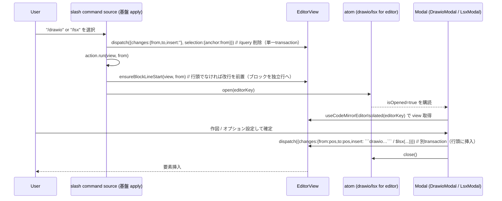

# Technical Design Document

## Overview

**Purpose**: 基盤 `editor-slash-command` のスラッシュコマンド機構の上に、GROWI 固有の拡張要素（drawio / plantuml / lsx / callout）を `/` から挿入・起動するコマンドを追加する。拡張要素には「静的テキスト挿入で足りるもの（plantuml / callout）」と「専用モーダルでの設定・編集が要るもの（drawio / lsx）」があるため、基盤のコマンドアクションを **`insert`（静的挿入）/ `run`（副作用起動）** の2種に一般化したうえで、本スペックが各コマンドの定義・ビルダー・モーダル起動導線・（lsx は）新規設定モーダルを足す。

**Users**: エディタで執筆する全ユーザーが、`/drawio`（作図モーダル）・`/plantuml`（フェンス挿入）・`/lsx`（設定モーダル）・`/callout`（種別選択挿入）で GROWI 拡張要素を素早く扱う。

**Impact**: 基盤のコマンド集合に拡張要素コマンドを**合流**させる。drawio / lsx は副作用（モーダル起動）を伴うため、基盤のアクションモデルを `insert | run` に一般化する（基盤の変更＝前提ゲート）。drawio モーダルは既存資産を再利用し、lsx 設定モーダルは新規に作る。基盤の機構・基本コマンド・絵文字補完・描画機構（remark/rehype プラグイン）・既存 drawio モーダル本体の挙動は変更しない。

### Goals
- drawio / plantuml / lsx / callout を、基盤と一貫した挙動（`/query` 置換・単一トランザクション・undo 整合）で挿入または起動する。
- 静的挿入（plantuml / callout）と副作用起動（drawio / lsx）の両方を、単一のアクション抽象で表現する。
- callout を変種宣言リストからデータ駆動で生成し、種別追加を宣言の編集のみで可能にする。
- packages/editor → apps/app の逆依存を作らずにモーダルを起動する。

### Non-Goals
- 拡張要素の描画・プレビュー（既存 remark/rehype プラグインの領域）。
- 既存 drawio モーダル本体の改修（再利用のみ）。
- lsx サーバ側 list-pages ロジックの変更（既存。本スペックはフォーム→記法文字列の生成と挿入のみ）。
- math / mermaid 等、今回未選択の要素（将来拡張）。
- 基盤のトリガー検出・補完ソース・レジストリ機構そのものの変更（アクションモデルの一般化を除く）。

## Boundary Commitments

### This Spec Owns
- 拡張要素コマンドの定義（drawio / plantuml / lsx / callout×7 の id・i18n キー・キーワード・アクション）。
- 静的挿入ビルダー（plantuml フェンス、callout ディレクティブ）。
- callout 種別リスト（`AllCallout` / `Callout` 型）の **`@growi/core` への移動**（真実源の一本化）と、apps/app 既存 consts の再エクスポート化。editor 側は `AllCallout` から `CALLOUT_VARIANTS`（絞り込み別名付き）を生成。
- drawio / lsx の `run` コマンドを、モーダルオープナーと `editorKey` を束縛して生成する React フック（合成点）。
- **lsx 設定モーダル一式（新規）**: editor 側トリガーフック（atom）、apps/app 側モーダル UI、`$lsx(...)` 文字列ビルダー、エディタ書き戻しユーティリティ。
- 拡張要素コマンドのラベル/説明 locale キー（`slash_command.*`）。

### Out of Boundary
- 基盤 `editor-slash-command` の補完ソース・トリガー検出・i18n 解決機構（基盤が所有）。**例外**: `SlashCommand` のアクションモデル（`insert | run`）一般化と `apply` の分岐は基盤側の変更だが、本スペックの前提ゲートとして要求する（下記「着手前提条件」）。
- 拡張要素の描画・パース（remark/rehype プラグイン）。
- 既存 drawio モーダル本体（`DrawioModal` / `DrawioCommunicationHelper` / `replaceFocusedDrawioWithEditor`）。本スペックは起動導線（`useDrawioModalForEditorActions().open`）の呼び出しのみ追加。
- lsx サーバ側 list-pages（`packages/remark-lsx/src/server`）。
- callout 描画コンポーネント（`features/callout/components/CalloutViewer`）と callout パース（`features/callout/services/callout.ts`）。本スペックは種別**名**（`AllCallout`）を参照するのみで、描画・パースは変更しない（`consts.ts` は @growi/core からの再エクスポートに置き換えるが、`AllCallout`/`Callout` の import 経路・値は不変）。
- 絵文字補完・キーバインド・グローバルホットキー。

### Allowed Dependencies
- 基盤の型/契約: `SlashCommand`、`SlashCommandAction`（`insert | run`）、`SlashInsertion`（`{ insert, cursorOffset }`）。
- `@growi/core`: callout 種別の真実源 `AllCallout` / `Callout`（本スペックで core へ移動）。packages/editor・apps/app とも既に @growi/core に依存済み。
- `@codemirror/view`（`EditorView`）。
- 既存 drawio トリガーフック: `useDrawioModalForEditorActions`（`packages/editor/src/states/modal/drawio-for-editor.ts`）。
- i18n: 基盤の `resolveSlashCommands(t, commands)` 経由でラベル解決（本スペックは locale キーを足すのみ）。
- 依存方向: `builders/variants → 基盤の型` / `static commands → builders + 基盤の型` / `run commands フック → 基盤の型 + モーダルオープナー` / `合成点（React 登録レイヤ）→ 基盤コマンド + 拡張コマンド`。拡張モジュールは基盤の core 定義を import しない（基盤が拡張を知らない＝逆転なし）。apps/app は editor 側モーダルフックを購読するのみ（packages/editor → apps/app の逆依存なし）。

### Revalidation Triggers
- 基盤の `SlashCommand` / `SlashCommandAction` / `SlashInsertion` 契約変更。
- コマンド集合の**合成点**の構造変更（React 登録レイヤの合成方法、`editorKey` の受け渡し）。
- 既存 drawio トリガーフック（`useDrawioModalForEditorActions`）のシグネチャ変更。
- `@growi/core` の `AllCallout` の変種追加・削除（editor 側 `KEYWORDS` の `Record<Callout, …>` が型エラーで検出。別名の追記が必要）。
- remark-lsx のオプション仕様変更（lsx モーダルのフォーム/ビルダーに影響）。
- locale キー命名（`slash_command.*`）の変更。

### 着手前提条件 (Prerequisites)
- **基盤インタフェースの凍結（必須ゲート）**: 本スペックの実装着手前に、基盤 `editor-slash-command` の次を確定・凍結すること。
  1. `SlashCommandAction` 型 = `SlashInsertAction { kind:'insert'; buildInsertion } | SlashRunAction { kind:'run'; run }`。
  2. `SlashCommand` が `action: SlashCommandAction` を持つ（旧 `buildInsertion` 直持ちからの変更）。
  3. 基盤 `apply` が `action.kind` で分岐する: `insert` は単一 `dispatch`（削除+挿入+カーソル）、`run` は `/query` 削除（単一 `dispatch`）後に `run(view, from)` を呼ぶ。
  4. コマンド集合の合成点が **React レイヤ**で `[...SLASH_COMMANDS, ...extendedCommands]` を組めること（drawio/lsx の run はモーダルオープナーと `editorKey` を要するため、静的配列ではなくフック合成になる）。合成点が `editorKey` を取得できること。
  - 別ストーリーで並行着手する場合は、基盤側でこのアクションモデルと合成点を先行実装してインタフェースを固定する。

## Architecture

### Existing Architecture Analysis
- 基盤（設計済み・未実装）は `slash-command/` 配下に型・定義・ビルダー・source・resolve を持ち、`use-default-extensions.ts` で emoji と統合した単一 `autocompletion()` を登録する。現状のアクションは `buildInsertion`（静的挿入）のみ。
- **drawio モーダルは既存**（実機確認済み）:
  - トリガーフック `useDrawioModalForEditorActions().open(editorKey)` が `@growi/editor`（`packages/editor/src/states/modal/drawio-for-editor.ts`）にあり、atom に `{ isOpened, editorKey }` を立てるだけ。
  - モーダル本体 `DrawioModal`（apps/app）が atom を購読し、`useCodeMirrorEditorIsolated(editorKey)` で `EditorView` を取得、保存時に `replaceFocusedDrawioWithEditor(editor, xml)` で ` ```drawio ` フェンスを `editor.dispatch`（`apps/app/src/client/components/PageEditor/markdown-drawio-util-for-editor.ts`）。
  - → **packages/editor から `open(editorKey)` を呼べばモーダルが起動し、挿入はモーダルが行う**。apps/app への逆依存は不要。
- **lsx 設定モーダルは存在しない**: 記法 `$lsx(/path, num=, depth=, sort=, reverse=, filter=, except=)` のみ（`packages/remark-lsx`）。drawio パターンに倣い新規作成する。
- **callout は対応済み**: `:::type[label] … :::`（`apps/app/src/features/callout`）。7 種（note/tip/important/info/warning/danger/caution、`features/callout/services/consts.ts`）。挿入は静的テキストで足りる。

### Architecture Pattern & Boundary Map

```mermaid
graph TB
    subgraph extended_module[packages/editor 拡張モジュール]
        Variants[callout variants 宣言リスト]
        StaticBuilders[insertion builders<br/>plantuml / callout]
        StaticCommands[static commands<br/>plantuml + callout×7]
        RunHook[useExtendedElementCommands フック<br/>drawio / lsx の run 合成]
        LsxTrigger[lsx モーダル トリガーフック atom]
    end
    subgraph foundation[基盤 editor-slash-command]
        Types[SlashCommand / SlashCommandAction / SlashInsertion]
        BasicCommands[basic slash commands]
        Apply[source.apply insert|run 分岐]
    end
    subgraph appside[apps/app]
        DrawioModal[既存 DrawioModal 再利用]
        LsxModal[新規 LsxModal UI + $lsx ビルダー + 書き戻し]
    end
    DrawioTrigger[既存 useDrawioModalForEditorActions]
    Compose[React 合成点 use-default-extensions]

    StaticBuilders --> Types
    StaticCommands --> StaticBuilders
    StaticCommands --> Types
    StaticCommands --> Variants
    RunHook --> Types
    RunHook --> DrawioTrigger
    RunHook --> LsxTrigger
    Compose --> BasicCommands
    Compose --> StaticCommands
    Compose --> RunHook
    Apply --> RunHook
    LsxModal --> LsxTrigger
    DrawioModal --> DrawioTrigger
```

**Architecture Integration**:
- **Selected pattern**: 拡張コマンドを独立モジュール化し、**React 合成点**で基盤コマンドと結合（基盤 core は拡張を知らない）。静的コマンドはデータ宣言、副作用コマンド（drawio/lsx）はモーダルオープナーと `editorKey` を束縛するフックで生成。
- **アクション一般化**: 基盤 `apply` が `insert | run` を分岐。`run` により「モーダル起動」を汎用的に表現（基盤は drawio/lsx を知らず、`run` 関数を呼ぶだけ）。
- **drawio = 既存資産再利用 / lsx = 新規モーダル（drawio パターン踏襲）**: editor 側トリガーフック（atom）＋ apps/app 側 UI＋書き戻しユーティリティ。
- **Steering compliance**: データ駆動（callout 変種・コマンド集合）、pure function 抽出（静的ビルダー・`$lsx` ビルダー）、barrel 最小公開、Executors take their work-set as input（合成点が集合を受け取る）。

### Technology Stack

| Layer | Choice / Version | Role in Feature | Notes |
|-------|------------------|-----------------|-------|
| Frontend (editor) | 基盤 `editor-slash-command`（同一パッケージ） | コマンド機構・補完・apply（insert/run）・i18n 解決 | アクションモデル一般化が前提 |
| Frontend (editor) | `@codemirror/view`（既存） | `EditorView`・`buildInsertion` の型 | 静的ビルダーは view 未使用 |
| Frontend (editor) | Jotai（既存） | drawio/lsx モーダルのトリガー atom | drawio は既存、lsx は新規 |
| Frontend (app) | React + reactstrap Modal（既存） | lsx 設定モーダル UI | drawio モーダルの構成に倣う |
| Frontend (i18n) | `react-i18next` + locale JSON（既存） | ラベル/説明 | `slash_command.*` キー追加 |
| Data / Storage | なし | — | 永続化なし |

新規依存ライブラリは**なし**。

## File Structure Plan

### Directory Structure

```
# packages/editor 側
packages/editor/src/client/services-internal/slash-command/extended-elements/
├── index.ts                          # barrel: 静的コマンド集合 + useExtendedElementCommands を公開
├── callout-variants.ts               # CALLOUT_VARIANTS: @growi/core の AllCallout から生成（+ 別名キーワード KEYWORDS）
├── insertion-builders.ts             # plantumlInsertion / calloutInsertion(type)（純粋）
├── ensure-block-line-start.ts        # run 用: from が行頭でなければ改行を前置しカーソルを新行へ（Req 5.4）
├── static-commands.ts                # plantuml + callout×7（insert アクション。callout は変種リストから生成）
├── use-extended-element-commands.ts  # React フック: drawio/lsx の run コマンド + 静的コマンドを合成して返す
├── insertion-builders.spec.ts
├── static-commands.spec.ts           # plantuml/callout 定義の健全性 + callout 変種網羅・未選択要素非含有
└── use-extended-element-commands.spec.ts  # run コマンドがオープナーを editorKey 付きで呼ぶ

packages/editor/src/states/modal/
└── lsx-for-editor.ts                 # 新規: lsx モーダル トリガーフック（drawio-for-editor.ts に倣う atom）

# apps/app 側（lsx 設定モーダル UI）
apps/app/src/client/components/PageEditor/LsxModal/
├── LsxModal.tsx                      # 新規: 設定フォーム + 確定で書き戻し
├── build-lsx-notation.ts            # 新規: フォーム値 → `$lsx(...)` 文字列（純粋）
├── build-lsx-notation.spec.ts
└── markdown-lsx-util-for-editor.ts   # 新規: editor へ `$lsx(...)` を dispatch（drawio util に倣う）
```

### New / Modified Files（callout 真実源の @growi/core 移動）
- `packages/core/src/consts/callout.ts`（新規）— `AllCallout` / `Callout` を apps/app から移設。core barrel（`consts` / index）から公開。**@growi/core は公開パッケージのため `npx changeset` が必要**（bump は patch 相当）。
- `apps/app/src/features/callout/services/consts.ts`（変更）— 自前宣言をやめ `export { AllCallout, type Callout } from '@growi/core/...'` の再エクスポートに置換（既存 import 元 `callout.ts` / `CalloutViewer.tsx` は無修正）。

### Modified Files
- 基盤の**コマンド集合合成点**（基盤設計で `use-default-extensions.ts`）— `[...SLASH_COMMANDS, ...useExtendedElementCommands(editorKey)]` を `resolveSlashCommands(t, ...)` に渡す。合成点が `editorKey` を取得できるよう配線する。
- 基盤の `slash-command-types.ts` / `slash-command-source.ts`（前提ゲート、基盤所有）— `SlashCommandAction`（`insert | run`）導入と `apply` の分岐。詳細は基盤 design.md に反映。
- apps/app の lsx モーダル登録点 — drawio モーダルが置かれているのと同じモーダルマウント箇所に `LsxModal` を追加。
- `apps/app/public/static/locales/en_US/translation.json` / `ja_JP/translation.json` — `slash_command.drawio.*` / `plantuml.*` / `lsx.*` / `callout.<type>.*` キー追加、および lsx モーダルのフォームラベル `lsx_modal.*`。

## System Flows

### 静的挿入フロー（plantuml / callout）
基盤の挿入フローと同一。`apply` が `action.buildInsertion(view, from)` の `{ insert, cursorOffset }` から `/query`（`[from,to]`）を置換する単一 `dispatch` を発行。

### 副作用起動フロー（drawio / lsx）



- `run` は基盤の `apply` から呼ばれ、`editorKey` は合成フックが束縛済み。
- **行頭正規化（Req 5.4）**: スラッシュコマンドは「行頭または空白直後」で発火するため、`図: /drawio` のように行の途中でも起動しうる。この場合 `/query` 削除後のカーソルは行の途中に残り、モーダルが挿入する ` ```drawio ` フェンス / `$lsx(...)` が先行テキストと同一行に連結して**ブロックとして描画されない**。これを防ぐため、drawio/lsx の `run` はモーダルを開く**前**に共有ヘルパ `ensureBlockLineStart(view, from)` を呼び、`from` が行頭でなければ改行を前置してカーソルを新しい空行へ移す。以降モーダルはその行頭位置に挿入する。
  - **配置理由**: 行頭正規化を**拡張側の `run` に置く**ことで、基盤 `apply` は「run は副作用」以上を仮定せず汎用のまま保て、かつ既存 drawio モーダル本体（out of boundary）を改修せずに drawio・lsx の両方を一括で正しくできる。
  - **トレードオフ**: `ensureBlockLineStart` は起動前に改行を挿入するため、モーダルを**キャンセル**すると空行が1行残りうる（許容。MVP）。lsx 書き戻しユーティリティ（新規・in-scope）は確定時にも行頭を保証してよい。
- `/query` 削除（基盤・単一トランザクション・undo 可）と行頭正規化・モーダルの挿入はそれぞれ別トランザクション。キャンセル時はモーダル挿入が発生しない（`/query` 削除＋場合により空行が残るのみ）。

## Requirements Traceability

| Requirement | Summary | Components | Interfaces | Flows |
|-------------|---------|------------|------------|-------|
| 1.1 | drawio/plantuml/lsx/callout 提供 | static-commands, use-extended-element-commands | コマンド集合 | 合成 |
| 1.2 | drawio モーダル起動 | use-extended-element-commands | `run` → drawio open | 副作用起動 |
| 1.3 | plantuml フェンス挿入 | insertion-builders | `plantumlInsertion` | 静的挿入 |
| 1.4 | lsx モーダル起動 | use-extended-element-commands | `run` → lsx open | 副作用起動 |
| 1.5 | callout 挿入 | static-commands, insertion-builders | `calloutInsertion` | 静的挿入 |
| 1.6 | 未選択要素は非提供 | static-commands / フック | 定義から除外 | — |
| 2.1–2.4 | drawio 起動・書き戻し・キャンセル・逆依存なし | use-extended-element-commands, 既存 DrawioModal | `useDrawioModalForEditorActions` | 副作用起動 |
| 3.1–3.6 | lsx モーダル・オプション・挿入・既定・キャンセル・配線 | LsxModal, build-lsx-notation, lsx-for-editor | フォーム→`$lsx(...)` | 副作用起動 |
| 4.1–4.4 | callout 種別別・記法・データ駆動・絞り込み | callout-variants, static-commands | `CALLOUT_VARIANTS` | 静的挿入 |
| 5.1 | `/query` 削除 | 基盤 apply（再利用） | — | 両 |
| 5.2 | 静的挿入のカーソル/単一transaction/undo | insertion-builders + 基盤 apply | `SlashInsertion` | 静的挿入 |
| 5.3 | run は削除単一transaction後に起動 | 基盤 apply（run 分岐） | `SlashRunAction` | 副作用起動 |
| 5.4 | run は挿入位置を行頭へ正規化 | ensure-block-line-start, use-extended-element-commands | `ensureBlockLineStart` | 副作用起動 |
| 6.1–6.3 | 同一メニュー・絞り込み・起動条件 | 合成点 + 基盤 source | active command set | 起動 |
| 7.1–7.2 | ラベル/説明 i18n・フォールバック | 各コマンド i18n キー + 基盤 resolve | locale JSON | — |
| 8.1 | 挿入/起動のみ・描画は既存機構 | insertion-builders / run | — | — |
| 8.2 | 絵文字/基本コマンドと共存 | 合成点（同一 autocompletion） | — | — |
| 8.3 | 既存 drawio モーダル不変 | use-extended-element-commands | 起動導線追加のみ | — |

## Components and Interfaces

| Component | Domain/Layer | Intent | Req Coverage | Key Dependencies (P0/P1) | Contracts |
|-----------|--------------|--------|--------------|--------------------------|-----------|
| callout-variants | data | callout 変種の宣言リスト | 4.1, 4.3 | — | State |
| insertion-builders | logic | plantuml/callout の雛形（純粋） | 1.3, 1.5, 4.2, 5.2, 8.1 | 基盤 SlashInsertion 型 (P0) | Service |
| static-commands | data | plantuml + callout×7（insert） | 1.1, 1.5, 1.6, 4.1, 4.4 | builders (P0), variants (P0), 基盤 SlashCommand 型 (P0) | State |
| use-extended-element-commands | integration/logic | drawio/lsx の run + 静的コマンド合成 | 1.1, 1.2, 1.4, 2.1, 2.4 | drawio トリガー (P0), lsx トリガー (P0), static-commands (P0), ensure-block-line-start (P0) | Service |
| ensure-block-line-start | logic | run の挿入位置を行頭へ正規化 | 5.4 | `@codemirror/view` (P0) | Service |
| lsx-for-editor（新規 atom） | state | lsx モーダル起動トリガー | 1.4, 3.1, 3.6 | Jotai (P0) | State |
| build-lsx-notation（apps/app） | logic | フォーム値→`$lsx(...)`（純粋） | 3.2, 3.3, 3.4 | — | Service |
| LsxModal（apps/app） | ui | 設定フォーム + 書き戻し | 3.1–3.6 | lsx-for-editor (P0), build-lsx-notation (P0), useCodeMirrorEditorIsolated (P0) | UI |
| コマンド集合合成点（基盤側・変更） | integration | 拡張集合を基本コマンドへ合流 | 6.1, 8.2 | use-extended-element-commands (P0), 基盤 (P0) | Service |

### data

#### callout-variants
| Field | Detail |
|-------|--------|
| Intent | callout 変種をデータ宣言（種別 + 絞り込み別名） |
| Requirements | 4.1, 4.3 |

**Contracts**: State [x]

種別の**真実源は `@growi/core` に一本化**する。callout の種別リスト（`AllCallout` / `Callout` 型）は元々 `apps/app/src/features/callout/services/consts.ts` にあったが、これを `@growi/core`（`packages/core/src/consts/callout.ts`）へ移動し、apps/app の描画側と packages/editor のスラッシュコマンド側が**同一の定義を import** する（二重管理・drift を解消）。別名キーワード（`warn` 等）はスラッシュコマンド固有の絞り込み UX なので editor 側に持つ。

```typescript
// @growi/core（真実源。apps/app 描画側と共有）
export const AllCallout = ['note','tip','important','info','warning','danger','caution'] as const;
export type Callout = (typeof AllCallout)[number];

// packages/editor 側: AllCallout から変種メタ（絞り込み別名）を付与して宣言
import { AllCallout, type Callout } from '@growi/core'; // 実際の import 経路は core barrel に従う

const KEYWORDS: Record<Callout, readonly string[]> = {
  note: ['note'], tip: ['tip', 'hint'], important: ['important'],
  info: ['info', 'information'], warning: ['warning', 'warn'],
  danger: ['danger'], caution: ['caution'],
};
export interface CalloutVariant { readonly type: Callout; readonly keywords: readonly string[]; }
export const CALLOUT_VARIANTS: readonly CalloutVariant[] =
  AllCallout.map((type) => ({ type, keywords: [type, ...KEYWORDS[type]] }));
```
- **Single source of truth**: 種別の追加/削除は `@growi/core` の `AllCallout` の1箇所編集で完結し、描画側・スラッシュコマンド側の両方へ自動的に波及する（editor 側 `KEYWORDS` は `Record<Callout, …>` のため、型で網羅漏れを検出できる）。drift テストは不要。

### logic

#### insertion-builders
| Field | Detail |
|-------|--------|
| Intent | plantuml/callout の雛形（`SlashInsertion`）を返す純粋関数 |
| Requirements | 1.3, 1.5, 4.2, 5.2, 8.1 |

**Contracts**: Service [x]

```typescript
import type { EditorView } from '@codemirror/view';
import type { SlashInsertion } from '../slash-command-types'; // 基盤の型

// いずれも基盤の buildInsertion 契約 (view, from) => SlashInsertion に適合する。

// plantuml フェンス（@startuml/@enduml）。カーソルは中間の空行
export const plantumlInsertion: (view: EditorView, from: number) => SlashInsertion;

// callout ディレクティブ。`:::<type>` + 改行 + 本文行(空) + 改行 + `:::`。カーソルは本文行
export const calloutInsertion: (type: CalloutVariant['type']) => (view: EditorView, from: number) => SlashInsertion;
```

- **雛形（確定）**:
  - plantuml: ` ```plantuml ` + 改行 + `@startuml` + 改行 + 空行 + `@enduml` + 改行 + ` ``` `。カーソルは中間の空行。
  - callout: `:::<type>` + 改行 + 空行（本文） + 改行 + `:::`。カーソルは本文の空行。
- **Preconditions**: `from` は `/` の位置。
- **Postconditions**: `{ insert, cursorOffset }`（`from` 相対）を返す。`view.dispatch` しない。
- **行頭/行中の出し分け**: 基盤 design の方針に従い、先行する非空白テキストがある場合は区切り（改行/空行）を前置する。callout / plantuml はブロック要素のため、先行行が非空のとき改行を前置する（テストで固定）。
- **Invariants**: 副作用なし。

#### use-extended-element-commands
| Field | Detail |
|-------|--------|
| Intent | drawio/lsx の `run` コマンドをモーダルオープナー + `editorKey` で生成し、静的コマンドと合成して返す React フック |
| Requirements | 1.1, 1.2, 1.4, 2.1, 2.4 |

**Contracts**: Service [x]

```typescript
import type { EditorView } from '@codemirror/view';
import { useDrawioModalForEditorActions } from '../../../states/modal/drawio-for-editor';
import { useLsxModalForEditorActions } from '../../../states/modal/lsx-for-editor';
import { ensureBlockLineStart } from './ensure-block-line-start';
import type { SlashCommand } from '../slash-command-types';

export const useExtendedElementCommands = (editorKey: string): readonly SlashCommand[] => {
  const { open: openDrawio } = useDrawioModalForEditorActions();
  const { open: openLsx } = useLsxModalForEditorActions();
  return useMemo(() => [
    { id: 'drawio', labelKey: 'slash_command.drawio.label', descriptionKey: 'slash_command.drawio.description',
      keywords: ['diagram', 'draw'],
      // 行頭正規化してからモーダルを開く（Req 5.4）
      action: { kind: 'run', run: (view: EditorView, from: number) => { ensureBlockLineStart(view, from); openDrawio(editorKey); } } },
    { id: 'lsx', labelKey: 'slash_command.lsx.label', descriptionKey: 'slash_command.lsx.description',
      keywords: ['list', 'pages', 'tree'],
      action: { kind: 'run', run: (view: EditorView, from: number) => { ensureBlockLineStart(view, from); openLsx(editorKey); } } },
    ...STATIC_EXTENDED_COMMANDS, // plantuml + callout×7
  ], [editorKey, openDrawio, openLsx]);
};
```
- **Preconditions**: `editorKey` は現在のエディタインスタンスのキー（合成点が取得）。
- **Postconditions**: `run` は `ensureBlockLineStart(view, from)` で挿入位置を行頭へ正規化したうえで、オープナーを `editorKey` 付きで呼ぶ（挿入自体はモーダルがカーソル位置に対して行う）。
- **Invariants**: `STATIC_EXTENDED_COMMANDS`（plantuml + callout）は副作用を持たないデータ。

#### ensure-block-line-start
| Field | Detail |
|-------|--------|
| Intent | run コマンドがモーダルを開く前に、ブロック要素の挿入位置を行頭へ正規化する（Req 5.4） |
| Requirements | 5.4 |

**Contracts**: Service [x]

```typescript
import type { EditorView } from '@codemirror/view';

/**
 * `pos` が行頭（同一行に先行する非空白テキストがない）でなければ、`pos` に改行を挿入して
 * カーソルを新しい空行の先頭へ移す。行頭ならなにもしない。以降のブロック挿入が独立行に置かれることを保証する。
 */
export const ensureBlockLineStart: (view: EditorView, pos: number) => void;
```
- **Preconditions**: `pos` は `/query` 削除後のカーソル位置（＝ 基盤 `apply` の `from`）。
- **Postconditions**: 行頭でなければ `\n` を1つ挿入しカーソルを新行先頭へ。行頭ならドキュメント不変。
- **Invariants**: `view.dispatch` を最大1回。既存 drawio モーダル本体には手を入れない（正規化はこのヘルパに閉じる）。
- **Trade-off**: 起動前に挿入するため、モーダルキャンセル時に空行が残りうる（許容・MVP）。

#### static-commands
| Field | Detail |
|-------|--------|
| Intent | plantuml + callout×7 の insert コマンドを宣言 |
| Requirements | 1.1, 1.5, 1.6, 4.1, 4.4 |

```typescript
export const STATIC_EXTENDED_COMMANDS: readonly SlashCommand[] = [
  { id: 'plantuml', labelKey: 'slash_command.plantuml.label', descriptionKey: 'slash_command.plantuml.description',
    keywords: ['uml', 'sequence'], action: { kind: 'insert', buildInsertion: plantumlInsertion } },
  ...CALLOUT_VARIANTS.map((v) => ({
    id: `callout-${v.type}`,
    labelKey: `slash_command.callout.${v.type}.label`,
    descriptionKey: `slash_command.callout.${v.type}.description`,
    keywords: ['callout', ...v.keywords],
    action: { kind: 'insert', buildInsertion: calloutInsertion(v.type) } as const,
  })),
];
```
- **Constraints**: callout は `CALLOUT_VARIANTS` からデータ駆動で生成（4.3）。`callout` を共通キーワードに含め `/callout` で全種別が絞り込まれる（4.4）。未選択要素（math/mermaid）は含めない（1.6）。

### state (packages/editor)

#### lsx-for-editor（新規トリガーフック）
| Field | Detail |
|-------|--------|
| Intent | lsx 設定モーダルの起動トリガー（drawio-for-editor.ts に倣う） |
| Requirements | 1.4, 3.1, 3.6 |

```typescript
type LsxModalForEditorState = { isOpened: boolean; editorKey?: string };
export const useLsxModalForEditorStatus = () => useAtomValue(lsxModalForEditorAtom);
export const useLsxModalForEditorActions = () => {
  const set = useSetAtom(lsxModalForEditorAtom);
  return {
    open: (editorKey: string) => set({ isOpened: true, editorKey }),
    close: () => set({ isOpened: false, editorKey: undefined }),
  };
};
```

### logic / ui (apps/app)

#### build-lsx-notation
| Field | Detail |
|-------|--------|
| Intent | フォーム値から `$lsx(...)` 文字列を組み立てる純粋関数 |
| Requirements | 3.2, 3.3, 3.4 |

```typescript
export interface LsxOptions {
  prefix?: string; num?: string; depth?: string;
  sort?: 'path' | 'createdAt' | 'updatedAt'; reverse?: boolean;
  filter?: string; except?: string;
}
export const buildLsxNotation: (opts: LsxOptions) => string;
```
- **規則**: prefix は先頭に位置指定（空なら省略）。残りは `key=value` をカンマ区切り。空・既定値は出力しない。全て空なら `$lsx()`（3.4）。`reverse` は `true` のときのみ `reverse=true` を付与。
- 例: `{ prefix:'/docs', num:'10', depth:'1-2', sort:'createdAt', reverse:true }` → `$lsx(/docs, num=10, depth=1-2, sort=createdAt, reverse=true)`。

#### LsxModal
| Field | Detail |
|-------|--------|
| Intent | lsx 設定フォーム。確定で `buildLsxNotation` → エディタへ挿入。drawio モーダルの構成に倣う |
| Requirements | 3.1–3.6 |

**Implementation Notes**
- `useLsxModalForEditorStatus()` で `{ isOpened, editorKey }` を購読、`useCodeMirrorEditorIsolated(editorKey)` で `view` を取得。
- 確定時に `view.dispatch({ changes: { from: pos, to: pos, insert: buildLsxNotation(opts) } })`（`markdown-lsx-util-for-editor.ts`）。
- フォーム: prefix（テキスト）、num（テキスト, 例 `10` / `2-5`）、depth（テキスト, 例 `1` / `1-2`）、sort（select）、reverse（checkbox）、filter / except（テキスト）。
- ラベルは i18n（`lsx_modal.*`）。バリデーションは MVP では最小（数値/範囲の形式チェックは将来拡張、無入力は省略）。

### integration

#### コマンド集合合成点（基盤側・変更）
| Field | Detail |
|-------|--------|
| Intent | 拡張コマンドを基本コマンドへ合流し、単一 `autocompletion()` に乗せる |
| Requirements | 6.1, 8.2 |

**Implementation Notes**
- Integration: React レイヤで `const extended = useExtendedElementCommands(editorKey);` → `resolveSlashCommands(t, [...SLASH_COMMANDS, ...extended])` → `createSlashCommandSource(...)`。
- `editorKey` の取得: 合成点（`use-default-extensions` 相当）がエディタの key を受け取れるよう配線する（drawio の `DiagramButton` が `editorKey` を prop で受けるのと同経路）。**未確定なら実装タスクで配線を確定**。
- Validation: `/drawio`・`/lsx`・`/plantuml`・`/callout` が基本コマンドと同一メニューに現れ、絵文字補完と共存することをスモーク確認。drawio/lsx 選択でモーダルが開くこと。

## Error Handling
- 静的挿入（plantuml/callout）は静的文字列のため失敗経路なし（`buildInsertion` は常に有効な `SlashInsertion` を返す）。
- run コマンド: `/query` 削除は基盤の単一トランザクション。行の途中で起動された場合は `ensureBlockLineStart` が改行を1つ前置してブロックを独立行へ置く（Req 5.4）。モーダル起動失敗・キャンセルはモーダル側の責務で、エディタには `/query` 削除（＋場合により空行1つ）のみが残る（要素は挿入されない）。
- lsx モーダル: フォーム未入力時は `$lsx()`（既定描画 = 現在ページ配下一覧）。不正なオプション文字列はサーバ側 list-pages のバリデーションに委ねる（本スペックは文字列生成のみ）。
- トリガー外・一致なし・キャンセルは基盤の Error Handling に従う。

## Testing Strategy

### Unit Tests
1. `plantumlInsertion`: `@startuml/@enduml` を含むフェンスを返し、カーソルが中間の空行（1.3, 5.2）。
2. `calloutInsertion('warning')` 等: `:::warning` … `:::` を返し、カーソルが本文行（1.5, 4.2, 5.2）。各種別で記法が正しいこと。
3. `CALLOUT_VARIANTS` / `STATIC_EXTENDED_COMMANDS`: 7 種の callout コマンドが生成され、各 id・i18n キー・`callout` 共通キーワードを持つこと。plantuml が含まれ未選択要素（math/mermaid）を含まないこと（1.1, 1.6, 4.1, 4.3, 4.4）。
4. `useExtendedElementCommands`: drawio/lsx コマンドが `kind:'run'` を持ち、`run()` 呼出で対応オープナーが `editorKey` 付きで呼ばれること（モックフックで検証）（1.2, 1.4, 2.1）。
5. `buildLsxNotation`: 各オプション組合せで期待文字列、全空で `$lsx()`、`reverse=false` は出力しないこと（3.2, 3.3, 3.4）。
6. `ensureBlockLineStart`: `pos` が行頭のときはドキュメント不変、行の途中（先行非空白あり）のときは改行を1つ前置しカーソルが新行先頭へ来ること（5.4）（jsdom + EditorState/EditorView）。

### Integration Tests
1. 合成点経由で `/drawio` `/plantuml` `/lsx` `/callout` が基本コマンドと同一の補完メニューに現れ、`/uml` で plantuml、`/warn` で warning callout が絞り込まれる（6.1, 6.2, 4.4）。
2. plantuml/callout 選択時、基盤 `apply` により `/query` が置換され単一トランザクションで挿入、undo 1 回で復元（5.1, 5.2）。
3. drawio/lsx 選択時、`/query` が削除され（単一トランザクション）、行の途中で起動した場合は行頭正規化が入ったうえで対応モーダルの起動 atom が立つこと（5.3, 5.4, 1.2, 1.4）。
4. 拡張コマンドが絵文字補完（`:`）と同時に機能する（8.2）。
5. 既存 drawio モーダルのツールバー起動・書き戻しが回帰しないこと（8.3）。

### E2E/UI Tests（任意）
1. `/drawio` 選択 → drawio モーダルが開き、保存で ` ```drawio ` フェンスが挿入される（1.2, 2.2）。
2. `/lsx` 選択 → lsx モーダルでオプション設定 → 確定で `$lsx(...)` が挿入される（1.4, 3.3）。
3. `/callout` で全種別が候補表示され、`tip` 選択で `:::tip` が挿入されカーソルが本文行に来る（4.1, 4.2, 4.4）。
