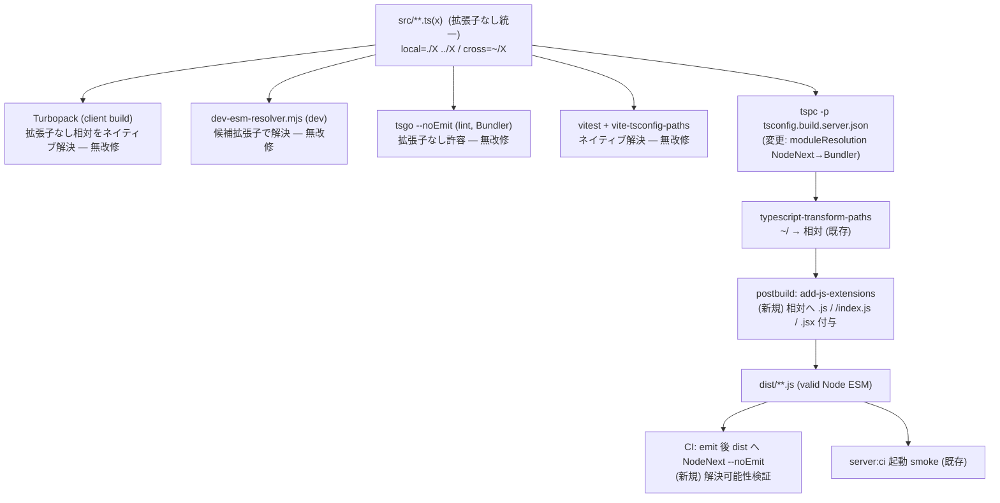

# Design Document — esm-import-convention

## Overview

**Purpose**: apps/app/src の import 記法を**単一の「拡張子なし」規約**へ統一し、新規コード作成時に「どの記法を使うか」を判断する煩わしさを解消する。

**Users**: apps/app に新規・既存コードを書く開発者。

**Impact**: Node ネイティブ ESM が要求する `.js` 拡張子を**ソースから排除**し、server 本番ビルドの **emit 時にのみ**機械的に付与する。これにより「import 元が NodeNext プログラムに所属するか」という不可視条件への依存（=`~/...js` alias と相対 `./X` の使い分け）が消え、移行前と同じ通常の規約（local=相対 / cross-module=`~/` alias、いずれも拡張子なし）へ回帰する。ランタイム挙動・bundling 戦略は不変。

### Goals
- ソース規約を 1 つに統一（拡張子なし）。`.js` の有無・プログラム所属の推測を記法選択から排除。
- server 本番成果物は従来どおり valid Node ネイティブ ESM（runtime loader hook 不要）。
- client / dev / lint / test の解決ロジックは無改修（既に拡張子なしを解決可能）。
- 規約を自動強制（lint + CI）し、暗記不要にする。
- ランタイム挙動・認可・perf を無回帰に保つ。

### Non-Goals
- server ランタイムの bundling（モジュール結合）・実行モデル変更。
- Turbopack / dev runner / vitest / tsgo の解決ロジック変更。
- dual-pipeline（NodeNext server + Turbopack client）アーキテクチャの再設計。
- `packages/*` の変更（apps/app 限定）。
- NodeNext server build がなぜ client `.tsx` を 1142 ファイルも型チェックするか、というプログラム境界の最適化（別途）。

## Boundary Commitments

### This Spec Owns
- apps/app/src（+ server build 対象 config）の import specifier 記法と、その単一規約の定義。
- server 本番ビルドの emit 時 `.js` 付与ステップ。
- 既存記法→新規約の一括移行 codemod。
- 規約強制の lint ルール。
- emit 後成果物の Node 解決可能性検証（失う保証の回収）。

### Out of Boundary
- ランタイムの import 解決（dev resolver / Turbopack）。本 spec は記法とビルド出力のみ。
- 機能・認可・perf のランタイム挙動。
- `packages/*` および dual-pipeline 構成自体。

### Allowed Dependencies
- esm-migration が確立した `tsconfig.build.server.json` / `typescript-transform-paths` / `postbuild-server.ts` / `dev-esm-resolver.mjs` / CI（`reusable-app-prod.yml`）。
- 既存 codemod 基盤（`jscodeshift`、`tools/codemod/*`）と lint 基盤（`tools/lint/*`）。

### Revalidation Triggers
- `tsconfig.build.server.json` の `module`/`moduleResolution` 変更 → esm-migration Phase 6 ゲート再実行。
- postbuild 出力形（dist の import 形）変更 → `server:ci` 起動 smoke 再実行。
- 規約自体の変更 → lint ルール + codemod の同期更新。

## Architecture

### Existing Architecture Analysis

痛みの根本原因は「`.js` をソースに書いていること」。現状、`.js` はソースに存在し、`typescript-transform-paths` は `~/`→相対変換時に `.js` を保持するだけ（付与しない）。NodeNext server build は相対 import に `.js` を要求し、Turbopack は相対 `.js`→`.ts` を読替えられないため、両ビルドに属するファイル（実測 1142、alias 740）は `~/...js` alias で橋渡しせざるを得なかった。

`.js` を**ソースから外し emit 時に付与**できれば：ソースは拡張子なしで統一 → Turbopack は拡張子なし相対を解決 → alias は cross-module だけで足りる。`bin/postbuild-server.ts` に emit 後処理の差し込み口が既にある。

### パイプライン全体図



### Dependency Direction
規約定義 → codemod（一括適用）→ lint（強制）。ビルド: tspc(Bundler) → transform-paths → add-js-extensions → dist → 検証。ランタイムは dist のみに依存し、ソース規約には非依存。

## 単一 import 規約（正準仕様）

唯一 lint で強制する hard rule は「相対（`./` `../`）/ `~/` alias の specifier に `.js`/`.jsx` 拡張子を**書かない**」こと。記法（alias か相対か）は **base branch（dev/8.0.x）の自然な convention に整合**させる：近い参照（同じ `src/` 区分内）は相対、遠い/区分跨ぎは `~/` alias。拡張子なしなら両形式とも全パイプライン（server build / Turbopack / tsgo / vitest / dev resolver）で等価に解決されるため、alias↔相対の差は可読性のみの問題で、lint は関知しない。

| specifier 種別 | 記法 | 例 |
|---|---|---|
| 近い参照（同じ `src/` 区分内） | 拡張子なし相対。barrel は `.` / `./sub`（`./sub/index.js` ではない） | `./AuthorInfo`, `../FormattedDistanceDate` |
| 遠い / 区分跨ぎ | 拡張子なし `~/` alias | `~/states/context`, `~/stores/bookmark` |
| app ルート相対の特殊参照 | `^/` alias（現状維持） | `^/package.json`（import 属性付き） |
| 外部パッケージ / `.json` / `.cjs` / `.scss` 等 | 現状維持（変更しない） | `mongoose`, `^/config/i18next.config.cjs` |

- value / type-only を問わず同一規約（type-only も拡張子なし）。
- `.js`/`.jsx` 拡張子はソースに**書かない**（lint で強制）。
- 記法は base の自然形へ整合。esm-migration が NodeNext 対応で `~/...js` alias に書き換えた近い参照を相対へ戻す（差分最小化）。alias↔相対そのものは lint で強制しない。

## Components & Interfaces

### C1. add-js-extensions（emit 後 `.js` 付与）
- **責務**: dist 出力中の拡張子なし相対 specifier に、dist 実ファイル照合で Node 解決可能な拡張子を付与。
- **配置**: `apps/app/bin/add-js-extensions.mjs`（`postbuild:server` から呼出、`postbuild-server.ts` の rename 後）。
- **解決規則**（importer ディレクトリ基準、既に拡張子/`.json` のものは不変＝冪等）:
  - `./X` → `./X.js`（`X.js` 存在時）
  - `./X` → `./X.jsx`（`X.jsx` 存在時 = dead client emit）
  - `./dir` → `./dir/index.js`（`dir/index.js` 存在時、`.jsx` も同様）
  - 解決不能 → 不変のまま残し警告（後段の検証で顕在化）
- **契約**（型）:
  ```typescript
  type AddJsExtensions = (distRoot: string) => { rewritten: number; unresolved: string[] };
  ```
- value/type を区別せず emit 後 JS の全 `from '...'` / `import('...')` を対象（emit 後は型は消えている）。

### C2. 一括移行
- **配置/恒常ツール**: `apps/app/tools/codemod/normalize-import-convention.cjs` — 相対/`~/` の value+type specifier から `.js`/`.jsx` を除去し `/index` barrel を正規化（`./sub/index.js` → `./sub`、`./index.js` → `.`）。**純粋に字句的**（解決なし）で alias↔相対は変えない。外部/`^/`/`.json`/`.cjs`/`.scss` は不変。今後の通常運用用。
- **移行時の記法整合（one-time）**: 上記に加え、esm-migration が NodeNext 対応で `~/...js` alias へ書き換えた近い参照を、base branch（dev/8.0.x）の自然な相対形へ**解決先一致で戻す**一回限りの整合を実施した。これにより PR 差分は「esm-migration の実コード変更＋拡張子除去」に縮小し、esm-migration の alias 化 churn が相殺される。
- **不変条件**: 解決先ファイルを変えない（振る舞い保存）。整合後のソースは base の自然な convention（近い=相対 / 遠い=`~/`）に一致する。

### C3. import-extension-guard（規約強制 lint）
- **責務**: 相対/`~/` specifier の `.js`/`.jsx` 終端を違反検出。
- **配置**: `apps/app/tools/lint/import-extension-guard.cjs`（`tools/lint/route-top-level-guard.cjs` と同方式）。`package.json` に `lint:import-convention` を追加し `lint` 集約に含める。
- **契約**: 非ゼロ終了 + 違反箇所（file:line:spec）を報告。`--fix` で C2 のロジックを単一ファイルに適用可能（任意）。

### C4. server build 設定変更
- `tsconfig.build.server.json`: `module`/`moduleResolution` を `NodeNext` → `Preserve`/`Bundler` 相当へ（拡張子なしソースを型チェック許容）。`typescript-transform-paths` plugin は維持。NodeNext 専用の型解決シム（`types/server-build-shims/*`、`next/*` paths）は Bundler 化に伴い要否を再評価。

### C5. emit 後の全 dist 静的網羅解決検証（CI）— design review で強化
- **責務**: 失う「ビルド時の解決保証」を、成果物に対する**網羅的かつ決定論的な静的検証**で回収する（design review Critical Issue 1）。
- **方式**: dist 内の全 `.js` ファイルの全 `from '...'` / `import('...')` 相対 specifier について、**指す先の実ファイルが存在するか**だけを検査する（`add-js-extensions` の逆操作）。`.js` / `/index.js` / `.jsx` / `.json` / `.cjs` を解決対象に含める。
- **NodeNext `--noEmit` を dist に当てる方式は不採用**: dead な `.tsx`→`.jsx` emit を型エラーとして誤検出するため。対して本方式は「ファイルが在るか」だけを見るので **dead emit でも誤検出せず**、かつ boot 到達に依存しないので **lazy/conditional import（必要時にだけ読む import）も漏れなく**拾える。
- **配置**: `apps/app/bin/verify-dist-resolution.mjs`。`reusable-app-prod.yml` の `build-prod` で `add-js-extensions` の後に実行。1 件でも解決不能があれば CI を失敗させる。
- **契約**（型）:
  ```typescript
  type VerifyDistResolution = (distRoot: string) => { checked: number; unresolved: string[] };
  ```
- 既存 `server:ci` 起動 smoke は引き続き合格条件に含める（二重の安全網）。

## File Structure Plan

| ファイル | 区分 | 責務 |
|---|---|---|
| `apps/app/bin/add-js-extensions.mjs` | 新規 | emit 後 `.js`/`/index.js`/`.jsx` 付与（C1） |
| `apps/app/bin/postbuild-server.ts` | 変更 | rename 後に C1 を呼出 |
| `apps/app/tsconfig.build.server.json` | 変更 | moduleResolution を Bundler/Preserve 化（C4） |
| `apps/app/tools/codemod/normalize-import-convention.cjs` | 新規 | 一括移行（C2） |
| `apps/app/tools/lint/import-extension-guard.cjs` | 新規 | 規約強制 lint（C3） |
| `apps/app/package.json` | 変更 | `lint:import-convention` script 追加・`lint` 集約へ |
| `apps/app/src/**/*.ts(x)` | 変更（codemod 一括） | `.js` 除去 + local alias→相対（~740 ファイル） |
| `.github/workflows/reusable-app-prod.yml` | 変更 | emit 後解決可能性チェック追加（C5） |
| `apps/app/.claude/rules/import-convention.md` | 新規 | apps/app 限定の規約を app-scoped で明文化（正典）。root `coding-style.md` はポインタのみ、steering `tech.md` は build/runtime 決定の記録＋ポインタ。`apps/app/AGENTS.md` のルール表へ追加 |

## Trade-off Analysis（レビューの中核）

### 採用案 A: 拡張子なしソース統一 + emit 時 `.js` 付与

| 観点 | 評価 |
|---|---|
| 開発者体験 | ◎ 単一規約（local=相対 / cross=`~/`、拡張子なし）。プログラム所属の推測不要。移行前と同じ |
| 実装コスト | ○ 新規ツール 3 点（~40〜150 行/件）+ 設定変更 + 一括 codemod（機械的）。PoC 実証済み |
| ランタイム影響 | ◎ なし（dist は従来同様の relative `.js`、loader hook 不要） |
| 失うもの | △ **NodeNext のコンパイル時解決保証**（後述） |

### 失う保証とその回収

esm-migration は native ESM 化の副作用として `module: NodeNext` を採用し、「**ビルド時に全 import が（拡張子まで含め）解決可能であること**」を enforce するようになった。案 A は server build の型チェックを `Bundler` 解決へ移すため、この**ビルド時の拡張子レベル保証を失う**。

**歴史的整理（重み付けの前提）**: この「ビルド時に拡張子まで保証」は **esm-migration が新しく持ち込んだもの**で、移行前の ts-node 時代には存在しなかった。移行前は:
- dev = `ts-node --transpileOnly`（**型チェック自体を行わない**。解決は CommonJS で runtime 任せ）
- build/lint = `module: CommonJS` / `moduleResolution: Node`（**拡張子なしが普通**＝拡張子の正しさは検査対象外）
- ソースは**拡張子なし**（案 A が戻そうとしている姿そのもの）

「壊れた import を捕まえる（＝指す先が在るか）」安全は当時も `tsc --noEmit` で持っており、案 A の Bundler 型チェックも同じ強さで保持する。失うのは「拡張子の正しさのビルド時保証」だけで、これは native ESM 特有の新要件。

回収策（多層）:
- **(a) 決定論的 emit**: `add-js-extensions`（C1）は dist 実ファイル照合で付与し、解決不能箇所を機械検出（`unresolved[]`）。
- **(b) 全 dist 静的網羅検証（C5）**: emit 後の dist 全 import が実ファイルを指すか網羅検査。dead emit を誤検出せず lazy import も漏らさない（NodeNext-on-dist より強い）。**ts-node 時代には無かった検査**。
- **(c) 起動 smoke**: 既存 `server:ci`（全モジュールロード）を合格条件に維持。

→ 結論: 失うのは新要件の一部のみで、回収後の総合的な安全性は **ts-node 時代と同等以上**（当時に無い (b) を足すため）。保証は「失う」のではなく**検証地点をソース型チェック→成果物検証へ移送し、むしろ強化**する。

### 却下案

| 案 | 内容 | 却下理由 |
|---|---|---|
| B: 常に `.js`（ソース） | 全 import に `.js`、両ビルド対応 | Turbopack の extensionAlias（`.js`→`.ts`）が必要だが Next 16.2 未対応（実機 `Module not found` 確認）。webpack 回帰は退行 |
| C: 現状維持 + lint 自動修正 | dual 記法を保持し autofix で正す | 「所属」判定に TS program が必要で遅い・複雑。痛みの根本（`.js` in source）が残る |
| D: server を bundle | esbuild/rolldown で server をバンドル | native-ESM ランタイムに反する。Prisma engine・動的 import・プラグインでリスク大。ユーザー意向（非 bundling）にも反する |

## Testing Strategy

- **C1 単体**（fixture）: `./X`→`.js`、`./dir`→`/index.js`、`.jsx` ターゲット、既拡張子の冪等、`.json`/`.cjs` 不変、解決不能の警告。Req 2.2 / 4.4 / 4.5。
- **C2 単体**（fixture + master 較正）: same-dir/descendant/ancestor/sibling-dir→相対、cross-module→`~/` 維持、`.js` 除去、解決先不変。変換結果が移行前 master の形と一致すること。Req 4.1–4.4。
- **C3 単体**: `.js`/`.jsx` 終端の相対/alias を違反検出、正規形を通過。Req 5.1。
- **統合（server build）**: 拡張子なしソースで `build:server` 型チェック 0 + dist の相対 import が `.js`/`/index.js` 付き + `node` 起動成功（PoC の本番版）。Req 2.1/2.2/2.4。
- **統合（他パイプライン）**: `build:client`（Turbopack）成功 / `tsgo --noEmit` 0 / `vitest` 緑 / dev 起動。Req 3.1–3.4。
- **CI 検証**: emit 後 dist の NodeNext `--noEmit` 解決チェック。Req 6.1/6.2。
- **無回帰（E2E/ゲート）**: esm-migration Phase 6 と同等の機能 smoke（healthcheck 200 / 認可ゲート / SSR / WS）+ 認可マトリクス・perf baseline 差分なし。Req 7.1–7.3。

## Requirements Traceability

| Requirement | 充足コンポーネント |
|---|---|
| 1（単一規約） | 「単一 import 規約」表 + C2（一括適用）+ C3（強制） |
| 2（server build 実行可能成果物） | C4（Bundler 化）+ C1（emit 時付与）+ 既存 transform-paths |
| 3（他パイプライン継続性） | 無改修確認（Turbopack/dev/tsgo/vitest）— Testing 統合で検証 |
| 4（移行の正確性） | C2 codemod |
| 5（自動強制） | C3 lint + CI |
| 6（保証の回収） | C5 emit 後検証 + `server:ci` |
| 7（無回帰） | Testing 無回帰ゲート |

## Risks & Mitigations

| リスク | 影響 | 緩和 |
|---|---|---|
| ビルド時の拡張子保証の喪失（design review Issue 1） | import が runtime で初めて解決失敗 | C5（全 dist 静的網羅検証）+ C1 決定論 emit + `server:ci`。移行前 ts-node 時代に無かった C5 を足すため総合的には同等以上（Trade-off Analysis 参照） |
| dead `.tsx`→`.jsx` emit の内部 import が拡張子なしのまま | 検証の誤検出 | C5 は「指す先が在るか」だけを見るため dead emit でも**誤検出しない**。C1 は `.jsx` ターゲットも付与 |
| Bundler 化で NodeNext 型解決シム（`server-build-shims`）が不要/不整合化（design review Issue 2） | 本来の目的と無関係な型エラーの噴出・工数不確実化 | **実装順序を固定**: 最初に C4 単独（設定変更 + シム棚卸し）を行い `build:server` 型チェック 0 をゲートにしてから C2 へ進む（tasks で `_Boundary:_` として明示） |
| C1 の特殊 specifier（`.json` 属性付き / `.cjs` / 既拡張子の冪等 / `.jsx`）誤処理（design review Issue 3） | 本番起動破壊（移行と同種） | C1 を fixture TDD（`.json`/`.cjs`/`.jsx`/既拡張子/`/index`）。C5 が二重の安全網 |
| codemod の取りこぼし・誤変換 | ビルド破壊 | fixture テスト + master 較正 + 適用後に build:server/client・tsgo・vitest 全ゲート。解決不能は不変+警告 |
| `^/` / 動的 import / 再 export / import 属性の特殊形 | 変換漏れ | C2 は `ssr-relative-to-alias.cjs` の実績 AST helper を再利用し同種ノードを網羅。`.json`(属性付き)/`.cjs` は対象外固定 |
