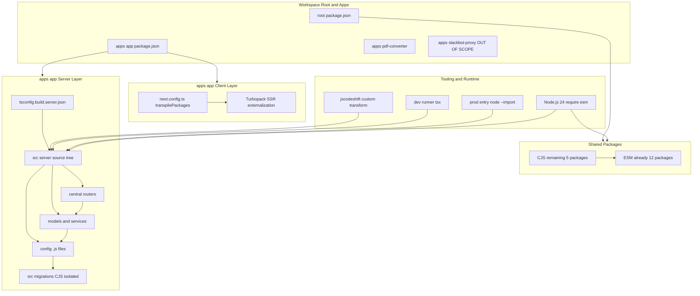
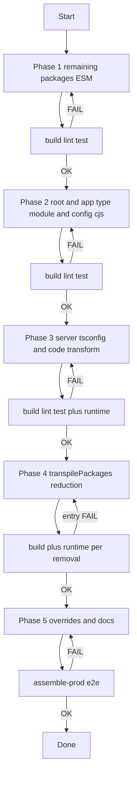
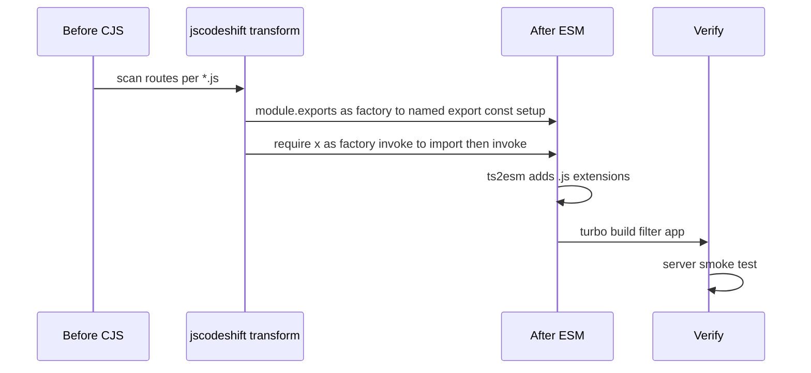
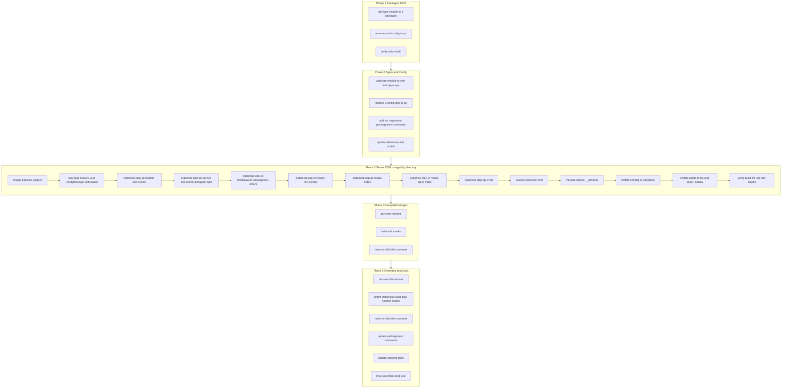

# 設計書: ESM 移行

## Overview

**Purpose**: GROWI モノレポを CJS/ESM ハイブリッド状態からネイティブ ESM へ移行する。`apps/app` の Express サーバビルドを ESM 出力に切替え、`transpilePackages` および `pnpm.overrides` の CJS 起因の回避策を解消する。

**Users**: GROWI メンテナと貢献者。ESM-only 依存のネイティブ採用、単純化されたビルド構成、モダンな依存更新経路を得る。

**Impact**: `apps/app` のサーバビルド出力を CommonJS から ESM に変え、ワークスペースルート・`apps/app`・残 5 共有パッケージに `"type": "module"` を宣言する。`transpilePackages` (42 hardcoded + 6 prefix) を大幅削減し、3 件の CJS ピン overrides を見直す。CLI ツールが要求する箇所のみ `.cjs` またはディレクトリ隔離で CJS を残す。

### Goals

- `apps/app` サーバソースから `module.exports` / `require()` / `__dirname` / `__filename` を排除する
- `apps/app` サーバビルドを `"module": "NodeNext"` で ESM 出力する
- `transpilePackages` に CJS/ESM 非互換性を理由とするエントリが残らない状態にする
- `pnpm.overrides` から CJS ピンを削除可能な範囲で削除する
- 開発・本番起動・ビルド・テスト・本番アセンブリのすべてで移行前と同等のふるまいを保つ

### Non-Goals

- `apps/slackbot-proxy` の移行 (廃止予定)
- ESM 化で可能になる依存アップグレード (例: `@keycloak/keycloak-admin-client` v19+) の同時実施
- Crowi DI アーキテクチャの再設計 (ESM 正当性のための lazy 化以外)
- `apps/app/src/migrations/*.js` の ESM 変換 (migrate-mongo 非対応)
- `axios` などセキュリティ起因 override の変更

## Boundary Commitments

### This Spec Owns

- ワークスペースルート・`apps/app`・残 5 共有パッケージ (`pdf-converter-client`, `preset-templates`, `preset-themes`, `core-styles`, `custom-icons`) への `"type": "module"` 宣言付与
- `apps/app/tsconfig.build.server.json` の `module` / `moduleResolution` 切替
- `apps/app/src/server/` 配下の CJS 構文 (`module.exports`, `require()`, `__dirname`) の一掃
- 中央ルーター (`routes/index.js`, `routes/apiv3/index.js`) の factory DI パターンを静的 `import` + 明示呼び出しへ変換
- モデル→サービス singleton のモジュールトップ import による循環依存の lazy 化
- 開発起動 (`pnpm dev`) のランナー置換 (`ts-node` + `tsconfig-paths` → `tsx`)
- 本番起動の `-r` → `--import` 切替
- `next.config.ts` の `transpilePackages` エントリ単位の削除評価
- `pnpm.overrides` の CJS ピン 3 件の削除評価
- `apps/app/config/*.js` の `.cjs` リネーム、`src/migrations/` のディレクトリ単位 CJS 隔離
- 上記完了後の `// comments for dependencies` 整理とステアリング文書更新

### Out of Boundary

- `apps/slackbot-proxy` パッケージ全体 (範囲外)
- `apps/app/src/migrations/*.js` の ESM 変換 (migrate-mongo 制約、CJS 維持)
- `models/user` 周辺のビジネスロジック変更 (lazy 化の型適合と動作維持以外)
- 新規依存の採用・既存依存のメジャーアップグレード (`@keycloak/keycloak-admin-client` 等、別 spec に委譲)
- `axios` など CJS/ESM と無関係な override (Req 4 AC5)
- 本番 Docker イメージの構造変更 (`assemble-prod.sh` の挙動は維持、ESM 解決が正しいかの検証のみ)

### Allowed Dependencies

- Node.js ^24 の `require(esm)` (CJS→ESM 推移解決)
- Turbopack のランタイム外部化 (`.next/node_modules/` symlink)
- `tsx` (開発時 TS ランナー)
- `jscodeshift` + カスタム transform (コード変換)
- `ts2esm` (拡張子補完のセカンドパス)
- `migrate-mongo` は引き続き CJS モードで動作することを前提

### Revalidation Triggers

以下の変更があれば下流・隣接 spec の再検証が必要:

- サーバ公開 API (HTTP エンドポイント、WebSocket メッセージ) の shape 変更 — 通常発生しない想定だが、factory DI 変換時の意図しない副作用を下流が感知できるよう明示
- `@growi/*` パッケージの公開 export 変更 (共有パッケージの `"type": "module"` 追加自体は ESM ランタイムでの副作用なしを前提)
- 本番起動コマンドの変更 (`-r dotenv-flow/config` → `--import dotenv-flow/config`) は Docker 起動スクリプトと CI に影響
- `apps/app/src/migrations/` のディレクトリ構造変更 (migrate-mongo の CLI 引数に影響)
- `assemble-prod.sh` / `check-next-symlinks.sh` のロジック変更 (本番デプロイ手順に影響)

## Architecture

### Existing Architecture Analysis

GROWI モノレポのモジュールシステムは層状になっている:

1. **共有パッケージ** (`packages/*`): 17 個中 12 個は ESM 化済み。残 5 個は JS ソースがない (設定だけ変更) ものが中心。
2. **Next.js フロントエンド** (`apps/app` クライアント): Turbopack 経由で ESM 互換。ソース変更不要。
3. **Express サーバ** (`apps/app` サーバ): 完全 CJS。最も重い改修対象。特に `routes/apiv3/index.js` 単体で 44 件の factory DI 呼び出しが集中。
4. **設定ファイル**: migrate-mongo / i18next / nodemon が消費する 3 ファイルは CJS のまま残す必要がある。
5. **本番アセンブリ**: `assemble-prod.sh` がフラット `node_modules/` を生成。ESM 互換だが未検証。

**キーとなる制約** (詳細は `research.md` §2.3):

- Factory DI (`require('./route')(crowi, app)`) は Crowi インスタンスをランタイム引数として渡す形で 2 中央ファイルに集中 (`routes/index.js` 12 箇所 / `routes/apiv3/index.js` 44 箇所)。
- `models/user/index.js` がモジュールトップレベルで `configManager` と `aclService` を import し、`configManager` が `models/config` を動的 require する循環チェーンを形成。ESM の strict loading ではここが最初に破綻する候補。

**循環依存ベースライン** (`madge --circular apps/app/src/server` 実行結果 — 2026-04-20 時点):

- 合計 **25 件** の循環依存が CJS 状態で既に存在。全体のトポロジーは **`crowi/index.ts` がハブ** として機能し、25 件中 23 件が `crowi/index.ts` を経由する。
- 主要グループ:
  - `crowi/index.ts` ↔ `setup-models.ts` (`models/bookmark.ts`, `models/page.ts` 経由を含む) — 3 件
  - `crowi/index.ts` ↔ `events/*` (activity, admin, bookmark, page, tag, user) — 6 件
  - `crowi/index.ts` ↔ `service/*` (activity, app, attachment, comment, customize, g2g-transfer, in-app-notification, installer, page-operation, search, slack-integration, socket-io, user-group) — 13 件
  - `crowi/index.ts` ↔ `middlewares/login-required.ts` — 1 件
  - `service/socket-io/socket-io.ts` ↔ `middlewares/admin-required.ts` — 1 件
  - `service/search-delegator/elasticsearch-client-delegator/{es7-client-delegator,interfaces}.ts` — 1 件 (`crowi/index.ts` 非経由)
- CJS では `require()` の遅延評価により静かに成立していた循環が、ESM の静的 hoisting 下では `ReferenceError: Cannot access 'X' before initialization` として顕在化しうる。
- 対処方針: **Crowi クラスを直接 import しない** 依存方向を徹底し、各 service/event/model ファイルは Crowi インスタンスを引数経由でのみ受け取る (factory DI 維持)。`service/search-delegator/elasticsearch-client-delegator/*` の 1 件は `interfaces.ts` を分離する構造修正で解消する。

### Architecture Pattern & Boundary Map



**Architecture Integration**:

- **選定パターン**: Phased Migration (レイヤ単位 5 フェーズ)。`research.md` §3 で Big-Bang / Incremental と比較し、独立検証可能性を優先して選定。
- **依存方向**: `Node.js runtime` ← `tsconfig server build` ← `server source` ← `codemod transforms`。左側 (基盤) から右側 (変換) へは依存しないことを各 phase で維持する。
- **既存パターンの保持**: Crowi インスタンスのランタイム DI (factory に `crowi` を渡す) は維持。`import` で変わるのは定義取得経路のみで、注入モデル自体は不変。
- **新規コンポーネント**: jscodeshift カスタム transform と `tsx` 起動スクリプト。どちらも移行期の道具で、完了後もリポジトリに残る (dev ランナー) または役目を終える (transform)。
- **Steering 整合**: `tech.md` の Turbopack 外部化ルール (`.next/node_modules/`) と Production Assembly Pattern を ESM 前提で再検証する。

### Technology Stack

| Layer | Choice / Version | Role in Feature | Notes |
|-------|------------------|-----------------|-------|
| Runtime | Node.js ^24 | ESM ネイティブ実行、`require(esm)` で推移 CJS→ESM 解決 | 既存の baseline |
| TS compile (server) | TypeScript with `module: NodeNext` / `moduleResolution: NodeNext` | コンパイル時 ESM 正当性 enforce、`.js` 拡張子強制 | `tsconfig.build.server.json` 変更 |
| Dev TS runner | `tsx` (latest) | `tsconfig.paths` 解決込みで ESM TS を直接実行 | `ts-node` + `tsconfig-paths` を置換 |
| Code transform | `jscodeshift` + custom transform (~100 lines) | factory DI を含む 4 パターン一括変換 | リポジトリに migration script として一時保管 |
| Extension fixer | `ts2esm` (latest) | ESM import への `.js` 拡張子補完 | セカンドパスのみ |
| Bundler (client SSR) | Turbopack (Next.js 16 既定) | ESM パッケージの自然解決と `.next/node_modules/` 外部化 | `USE_WEBPACK=1` は debug only |
| Dotenv loader | `dotenv-flow` v4+ | 本番起動で `--import dotenv-flow/config` | 既存依存、ESM ローダ対応版 |
| Migration CLI | `migrate-mongo` (現行) | `src/migrations/` を CJS としてロード | ESM 未対応、CJS 隔離で維持 |

## File Structure Plan

### Directory Structure (改修対象)

```
growi-esm/
├── package.json                                   # "type": "module" 追加 + axios 以外の overrides 見直し
├── packages/
│   ├── pdf-converter-client/
│   │   ├── package.json                           # "type": "module" 追加
│   │   └── orval.config.js → orval.config.cjs     # CJS config リネーム
│   ├── preset-templates/package.json              # "type": "module" 追加 (ソース変更なし)
│   ├── preset-themes/package.json                 # "type": "module" 追加 (Vite dual 維持)
│   ├── core-styles/package.json                   # "type": "module" 追加 (JS 出力なし)
│   └── custom-icons/package.json                  # "type": "module" 追加 (JS 出力なし)
└── apps/app/
    ├── package.json                               # "type": "module" 追加、dev/start/ts-node スクリプト更新
    ├── tsconfig.build.server.json                 # module/moduleResolution を NodeNext へ
    ├── next.config.ts                             # transpilePackages 削減 + 残存理由コメント
    ├── config/
    │   ├── migrate-mongo-config.js → .cjs         # CJS 維持
    │   ├── next-i18next.config.js → .cjs          # CJS 維持
    │   └── i18next.config.js → .cjs               # CJS 維持
    └── src/
        ├── migrations/
        │   ├── package.json (新規)                # { "type": "commonjs" } でディレクトリ隔離
        │   └── *.js (60+)                         # 変更なし、CJS のまま
        └── server/
            ├── routes/index.js                    # factory DI 12 箇所を static import + invoke へ
            ├── routes/apiv3/index.js              # factory DI 44 箇所を static import + invoke へ
            ├── routes/*.js                        # 他 ~40 ファイルの module.exports を named export へ
            ├── models/user/index.js               # configManager/aclService を lazy 化
            ├── service/s2s-messaging/index.ts     # 動的 require を await import へ
            ├── service/file-uploader/index.ts     # 動的 require を await import へ
            ├── crowi/index.ts                     # __dirname を import.meta.dirname へ
            ├── crowi/dev.js                       # __dirname を import.meta.dirname へ
            └── service/i18next.ts                 # __dirname を import.meta.dirname へ
```

### Modified Files (主要)

- `apps/app/package.json` — `dev` / `start` / `ts-node` スクリプトを `tsx` / `--import dotenv-flow/config` ベースに書き換え。`"type": "module"` 追加。旧スクリプトから `ts-node` と `tsconfig-paths/register` を除去。
- `apps/app/tsconfig.build.server.json` — `"module": "NodeNext"`, `"moduleResolution": "NodeNext"` に変更。
- `apps/app/next.config.ts` — `getTranspilePackages()` の要素を ESM 化後に再評価して削減。残存要素ごとにインラインコメント付与。
- `package.json` (root) — `pnpm.overrides` の `@lykmapipo/common>*` 3 件を個別削除判定。`axios` は変更しない。
- `.kiro/steering/tech.md` — Production Assembly / transpilePackages 記述の更新。
- `.claude/skills/tech-stack/SKILL.md` と `.claude/skills/monorepo-overview/SKILL.md` — 現状記述の更新。

### New Files

- `apps/app/src/migrations/package.json` — `{ "type": "commonjs" }` のみ。migrate-mongo が配下の `.js` を CJS として解釈するための宣言。
- `tools/codemod/cjs-to-esm.ts` (仮) — jscodeshift カスタム transform。移行完了後はアーカイブまたは削除。

## System Flows

### Phased Migration Flow



**フロー上の意思決定**:

- **Verify1-3**: 各フェーズ完了後に `turbo run build lint test` を実行。失敗すれば当該フェーズに差し戻し、次フェーズには進まない (Req 6.6)。
- **Verify3** は Phase 3 完了後のみ本番起動 smoke test (サーバ起動 + HTTP 200) も含める。
- **Verify4**: `transpilePackages` エントリ 1 つずつ削除 → ビルド + ランタイム検証 → 失敗時はそのエントリを戻して理由を comment。全件並列ではなく逐次。
- **Verify5**: 最終段で `assemble-prod.sh` + `check-next-symlinks.sh` を起動する end-to-end 検証。本番 Docker のビルド成果物で起動試験。

### Route Factory Conversion Sequence



## Requirements Traceability

| Requirement | Summary | Components | Interfaces | Flows |
|-------------|---------|------------|------------|-------|
| 1.1 | 残 5 共有パッケージに `"type": "module"` | Package Config Updater | `package.json` edit | Phase 1 |
| 1.2 | 共有パッケージの ESM 出力 | Package Config Updater | Vite / tsconfig 設定 | Phase 1 |
| 1.3 | Dual ESM+CJS 出力の維持 | Package Config Updater | Vite config (`preset-themes`) | Phase 1 |
| 1.4 | `turbo run build` 成功 | Verification Harness | CI gate | Phase 1 Verify |
| 2.1 | サーバビルドが ESM 出力 | Server Build Config | `tsconfig.build.server.json` | Phase 3 |
| 2.2 | `module.exports` 撤廃 | Codemod Transform | jscodeshift | Phase 3 |
| 2.3 | `require()` 撤廃 | Codemod Transform | jscodeshift | Phase 3 |
| 2.4 | `__dirname`/`__filename` 撤廃 | Codemod Transform + 手動置換 | `import.meta.dirname` | Phase 3 |
| 2.5 | 動的 require → 動的 import | Codemod Transform | jscodeshift | Phase 3 |
| 2.6 | 中央ルーターの factory DI 変換 | Codemod Transform + レビュー | static import + factory invoke | Phase 3 |
| 2.7 | 開発サーバ起動 | Dev Runner Adapter | `tsx` | Phase 3 Verify |
| 2.8 | `turbo run build --filter @growi/app` 成功 | Verification Harness | CI | Phase 3 Verify |
| 2.9 | `turbo run test --filter @growi/app` 成功 | Verification Harness | CI | Phase 3 Verify |
| 3.1 | `transpilePackages` 評価 | transpilePackages Reducer | `next.config.ts` | Phase 4 |
| 3.2 | 削除エントリの解決検証 | Verification Harness | Turbopack build + runtime | Phase 4 |
| 3.3 | 失敗時の維持と理由記録 | transpilePackages Reducer | インラインコメント | Phase 4 |
| 3.4 | 残存エントリの正当化 | Documentation | インラインコメント | Phase 4 |
| 3.5 | ビルド成功 + 本番起動 | Verification Harness | CI + smoke | Phase 4 Verify |
| 4.1 | `@lykmapipo/common>*` 評価 | Overrides Reducer | `pnpm.overrides` | Phase 5 |
| 4.2 | `pnpm install` + build 成功 | Verification Harness | CI | Phase 5 Verify |
| 4.3 | 推移依存のランタイム成功 | Verification Harness | runtime smoke | Phase 5 Verify |
| 4.4 | 失敗時の維持と理由記録 | Overrides Reducer | インラインコメント | Phase 5 |
| 4.5 | `axios` 等を対象外 | Overrides Reducer | (対象外宣言) | — |
| 5.1–5.3 | root/app/packages の `"type": "module"` | Package Config Updater | `package.json` | Phase 1–2 |
| 5.4 | CJS ファイルの `.cjs` / ディレクトリ隔離 | CJS Isolation Strategy | `.cjs` rename / nested `package.json` | Phase 2 |
| 5.5 | `src/migrations/` の CJS 維持 | CJS Isolation Strategy | nested `package.json` | Phase 2 |
| 5.6 | `pnpm install` + build 成功 | Verification Harness | CI | Phase 2 Verify |
| 6.1–6.3 | 全体 build / lint / test | Verification Harness | `turbo run` | 各 Verify |
| 6.4 | `assemble-prod.sh` 成功 | Verification Harness | end-to-end build | Verify5 |
| 6.5 | 本番アーティファクトの機能維持 | Verification Harness | smoke (API/SSR/WebSocket) | Verify5 |
| 6.6 | 失敗時の停止と是正 | Phase Gate | フロー分岐 | 各 Verify |
| 7.1 | dependencies コメント整理 | Documentation | `package.json` コメント | Phase 5 |
| 7.2 | 残存 `transpilePackages` の正当化 | Documentation | インラインコメント | Phase 4 |
| 7.3 | 残存 `overrides` の正当化 | Documentation | インラインコメント | Phase 5 |
| 7.4 | ステアリング文書の更新 | Documentation | `.kiro/steering/tech.md` 等 | Phase 5 |

## Components and Interfaces

### Summary

| Component | Domain/Layer | Intent | Req Coverage | Key Dependencies (P0/P1) | Contracts |
|-----------|--------------|--------|--------------|--------------------------|-----------|
| Package Config Updater | Build config | `package.json` / `tsconfig.json` への `"type": "module"` 付与とモジュール設定更新 | 1.1, 1.2, 1.3, 5.1, 5.2, 5.3 | Node.js 24 (P0) | State |
| Server Build Config | Build config | `tsconfig.build.server.json` の `NodeNext` 化 | 2.1 | TypeScript (P0) | State |
| Codemod Transform | Migration tooling | jscodeshift カスタム transform で 4 パターンを一括変換 | 2.2, 2.3, 2.4, 2.5, 2.6 | jscodeshift (P0), ts2esm (P1) | Batch |
| Dev Runner Adapter | Runtime tooling | `ts-node`+`tsconfig-paths` → `tsx` への置換 | 2.7 | tsx (P0) | State |
| CJS Isolation Strategy | Build config | 設定ファイル `.cjs` リネームと `src/migrations/` ディレクトリ隔離 | 5.4, 5.5 | migrate-mongo (P0) | State |
| transpilePackages Reducer | Build config | `next.config.ts` のエントリ単位削除と残存理由記録 | 3.1–3.5, 7.2 | Turbopack (P0) | State |
| Overrides Reducer | Build config | `pnpm.overrides` の CJS ピン削除 | 4.1–4.4, 7.3 | Node.js 24 require(esm) (P0) | State |
| Verification Harness | Verification | 各 phase の build/lint/test/runtime 検証と `assemble-prod` e2e | 1.4, 2.8, 2.9, 3.5, 4.2, 4.3, 5.6, 6.1–6.6 | turbo (P0), CI (P0) | Batch |
| Documentation | Docs | `package.json` コメント・ステアリング・インライン注釈の更新 | 7.1–7.4 | — | State |

プレゼンテーション UI はなく、すべてが新しい責任境界 or 検証責務を持つため full block を以下に配置する。

### Build config レイヤ

#### Package Config Updater

| Field | Detail |
|-------|--------|
| Intent | `package.json` への `"type": "module"` 付与、共有パッケージの `tsconfig` の `module`/`moduleResolution` 更新 |
| Requirements | 1.1, 1.2, 1.3, 5.1, 5.2, 5.3 |

**Responsibilities & Constraints**
- 対象: ルート・`apps/app`・残 5 共有パッケージの `package.json`、ならびに必要なら各 `tsconfig.json` の `module`/`moduleResolution`
- `preset-themes` の Vite dual 出力は Req 1.3 により維持
- `apps/pdf-converter/package.json` はすでに ESM — 変更対象外
- `apps/slackbot-proxy/package.json` は Boundary により変更対象外

**Dependencies**
- External: Node.js 24 — `"type": "module"` のネイティブ解釈 (P0)

**Contracts**: State

**Implementation Notes**
- Integration: `turbo run build` をパッケージ単位で流して検証。
- Validation: 各 `package.json` の差分は小さく、review コストは低い。
- Risks: `preset-themes` の Vite 設定で UMD 出力が ESM 宣言と干渉する可能性。Vite の `build.lib.formats` 設定を確認。

#### Server Build Config

| Field | Detail |
|-------|--------|
| Intent | `apps/app/tsconfig.build.server.json` を `NodeNext` に切替え |
| Requirements | 2.1 |

**Responsibilities & Constraints**
- 変更: `"module": "CommonJS"` → `"module": "NodeNext"`, `"moduleResolution": "Node"` → `"moduleResolution": "NodeNext"`
- 派生作用: TypeScript が `.js` 拡張子を enforce し、未対応の import 文がコンパイルエラーになる
- Codemod Transform 完了前に適用するとビルド全体が通らないため **Phase 3 の最後で切替える**

**Dependencies**
- Inbound: Codemod Transform 完了後の server source tree (P0)

**Contracts**: State

**Implementation Notes**
- Integration: `outDir: transpiled` は維持。本番起動は `dist/server/app.js` を参照する既存経路を ESM でも踏襲。
- Validation: `tsc --noEmit` と `turbo run build` の両方で通過確認。
- Risks: `exclude` リストに `src/migrations/**` を明示する必要がある。`src/migrations/package.json` に `"type": "commonjs"` があっても、TypeScript の `"module": "NodeNext"` が `.js` 拡張子を要求してビルド対象に含まれると CJS 構文でエラーになる。

### Migration tooling レイヤ

#### Codemod Transform

| Field | Detail |
|-------|--------|
| Intent | jscodeshift カスタム transform で 4 つの CJS パターンを一括変換 |
| Requirements | 2.2, 2.3, 2.4, 2.5, 2.6 |

**Responsibilities & Constraints**
- 対象パターン:
  1. `module.exports = ...` / `exports.x = ...` → `export ...` (named export)
  2. 静的 `require('./x')` → `import x from './x.js'`
  3. `require('./x')(crowi, app)` → `import { setup as setupX } from './x.js'` + `const x = setupX(crowi, app)`
  4. 条件付き三項 require → 条件付き `await import()`
- 対象外: `__dirname`/`__filename` は機械変換困難なため手動置換 (3 ファイルのみ)
- セカンドパスで `ts2esm` が `.js` 拡張子を補完

**Dependencies**
- External: jscodeshift (P0), ts2esm (P1)
- Inbound: Server 既存ソースツリー (P0)
- Outbound: ESM 化後のソースツリー (P0)

**Contracts**: Batch

##### Batch Contract

- Trigger: 開発者が Phase 3 実行時に `pnpm codemod:cjs-to-esm -- <path>` で **ディレクトリ単位** に起動
- Input / validation: 引数で与えられたサブツリーを glob で取得、`src/migrations/**` を除外。`--run-mode={lazy-only,full}` で段階的な変換を許容
- Output: 入力ファイルを in-place 変換。変換統計 (変換数/ファイル数) を標準出力
- Idempotency & recovery: 再実行しても既 ESM ファイルには no-op。失敗時は当該ディレクトリの git revert でロールバック

**段階適用プロトコル (Phase 3)**

1 回のコミットで全 160+ ファイルを変換するのではなく、依存の内側 (leaf) から外側 (root) へディレクトリ単位で適用する。各ステップ間で `tsc --noEmit` と `pnpm dev` smoke を実行し、循環依存起因の `ReferenceError` を早期検出する。

| Step | 対象ディレクトリ | 変換パターン | 検証 |
|------|------------------|-------------|------|
| 3.a | `models/`, `events/` (leaf side) | `module.exports` → named export、静的 `require` → `import` | `tsc --noEmit` |
| 3.b | `service/` (`search-delegator/*` の interface 分離を含む) | 同上 + 動的 `require` → `await import` | `tsc --noEmit` + unit test |
| 3.c | `middlewares/`, `util/`, `pageserv/`, その他非ルート | 同上 | `tsc --noEmit` + integ test |
| 3.d | `routes/` (中央以外の ~40 ファイル) | factory DI (`module.exports = (crowi, app) => ...`) → named export | `tsc --noEmit` |
| 3.e | `routes/index.js` (12 箇所) | factory invoke → `import` + 明示呼び出し | `pnpm dev` smoke (healthcheck 200) |
| 3.f | `routes/apiv3/index.js` (44 箇所) | 同上 | `pnpm dev` smoke + apiv3 代表 endpoint |
| 3.g | `crowi/` | factory DI + `__dirname` 置換 | full build + smoke |

各 step は単一コミット。失敗時は **当該 step のみ revert** することで Phase 3 全体の巻き戻しを回避できる。Step 3.a で顕在化する可能性が高い `models/user/*` の lazy 化 (本 spec Phase 3.1 タスク) は、この step の前段で先行実施する。

**Implementation Notes**
- Integration: 完了後に `pnpm lint` + `tsc --noEmit` で enforcement、残存 CJS を ESLint `import/no-commonjs` で検出。
- Validation: transform を `routes/page.js` 等の代表ファイルで単体テストしてから一括適用。
- Risks: (1) TypeScript の factory シグネチャ保持、(2) CommonJS wrapping された default export が named export と衝突、(3) 循環依存の顕在化。(1)(2) は transform 内で型注釈を保持して対処、(3) は上記ベースライン 25 件に対し **Crowi を引数経由のみで受け取る依存方向を維持する変換規約** で対処。`search-delegator` 1 件は `interfaces.ts` 分離で構造解消する。

#### Dev Runner Adapter

| Field | Detail |
|-------|--------|
| Intent | `pnpm dev` / `pnpm launch-dev` / 本番起動を ESM ランナーに移行 |
| Requirements | 2.7 |

**Responsibilities & Constraints**
- `apps/app/package.json` の `scripts.ts-node` を廃止し、`scripts.dev` と `scripts.launch-dev:ci` を `tsx` ベースに変更
- 本番スクリプト (`start:prod` 等) を `node --import dotenv-flow/config dist/server/app.js` に変更
- nodemon watch 設定を tsx の `--watch` へ移行するかは別途評価

**Dependencies**
- External: tsx (P0), dotenv-flow v4+ (P0), nodemon (P1)

**Contracts**: State

**Implementation Notes**
- Integration: Docker `CMD` と CI の `launch-prod` ジョブを同期更新。
- Validation: `pnpm dev` でサーバ起動 → `curl http://localhost:3000/_api/v3/healthcheck` 200。
- Risks: `tsconfig.paths` の解決差異。tsx は tsconfig を読むが実行時 resolve なので、`baseUrl: "."` と `paths: { "~/*": ["./src/*"] }` は tsx によって一貫して解釈される。

### Build config レイヤ (続き)

#### CJS Isolation Strategy

| Field | Detail |
|-------|--------|
| Intent | CJS を残す必要がある箇所を `.cjs` or ディレクトリ隔離で明示化 |
| Requirements | 5.4, 5.5 |

**Responsibilities & Constraints**
- `apps/app/config/{migrate-mongo-config,next-i18next.config,i18next.config}.js` → `.cjs` リネーム
- `apps/app/src/migrations/package.json` を新規追加: `{ "type": "commonjs" }`
- `packages/pdf-converter-client/orval.config.js` → `.cjs`
- リネームに合わせて `apps/app/package.json` のスクリプト (migrate-mongo CLI 引数など) と i18next init コード (import パス) を更新

**Dependencies**
- External: migrate-mongo (P0) — `src/migrations/` から CJS ファイルをロードし続ける

**Contracts**: State

**Implementation Notes**
- Integration: 名前変更後に `pnpm run dev:migrate` で実 DB に対して実行確認。
- Validation: `turbo run lint` で TypeScript が Path を誤解しないか確認。
- Risks: `src/migrations/package.json` が TypeScript の `include` や tsconfig の `exclude` と干渉しないこと。Server Build Config の `exclude` に `src/migrations/**` を追加で確実にする。

#### transpilePackages Reducer

| Field | Detail |
|-------|--------|
| Intent | `next.config.ts` の `getTranspilePackages()` を 1 エントリずつ削除して残存理由を記録 |
| Requirements | 3.1–3.5, 7.2 |

**Responsibilities & Constraints**
- 評価対象: 42 hardcoded + 6 prefix グループ (`remark-` / `rehype-` / `hast-` / `mdast-` / `micromark-` / `unist-`)
- `experimentalOptimizePackageImports` の `@growi/*` 11 件は対象外 (最適化目的)
- 評価プロトコル: 1 エントリ削除 → `turbo run build --filter @growi/app` → `.next/node_modules/` 確認 → `pnpm start` でサーバ起動 smoke → 失敗時は戻してインラインコメントで理由記録
- 先に prefix グループを 1 つずつ試す (一括効果が大きい)、次に hardcoded を評価

**Dependencies**
- External: Turbopack (P0)
- Inbound: ESM 化済みサーバ (P0) — CJS 時点では評価不可

**Contracts**: State

**Implementation Notes**
- Integration: CI の `reusable-app-prod.yml` で Level 2 検証 (`check-next-symlinks.sh` + `launch-prod`) を追加。
- Validation: 各エントリ削除の PR 粒度ではなくまとめて行う場合、commit 単位で削除・ビルド・ロールバックできるようにする。
- Risks: Turbopack の ESM 外部化挙動は全エントリに対して一様ではない可能性。フロントエンド/SSR から静的 import される経路を先に `grep` で洗う。

#### Overrides Reducer

| Field | Detail |
|-------|--------|
| Intent | `pnpm.overrides` の `@lykmapipo/common>{flat,mime,parse-json}` の 3 ピンを削除評価 |
| Requirements | 4.1–4.4, 7.3 |

**Responsibilities & Constraints**
- 対象: `flat` (5.0.2 → 最新), `mime` (3.0.0 → 最新), `parse-json` (5.2.0 → 最新)
- `axios` ピンは CJS/ESM と無関係なので変更対象外 (Req 4.5)
- 評価プロトコル: 1 ピン削除 → `pnpm install` → `turbo run build` → サーバ起動 + 該当コードパス (mongoose-gridfs 経由の file upload 等) 手動 smoke → 失敗時は戻して理由をコメントで記録

**Dependencies**
- External: Node.js 24 `require(esm)` (P0), `@lykmapipo/common` 内部構造 (P1)

**Contracts**: State

**Implementation Notes**
- Integration: mongoose-gridfs を使うファイルアップロード機能の e2e 試験が必要。
- Validation: `pnpm why flat` などで解決バージョンを確認。
- Risks: `require(esm)` が top-level await を含む ESM には対応しないが、対象 3 パッケージは TLA 未使用なので想定内。

### Runtime tooling レイヤ (続き) — 既出の Dev Runner Adapter 参照

### Verification レイヤ

#### Verification Harness

| Field | Detail |
|-------|--------|
| Intent | 各 phase 完了時の build/lint/test/runtime 検証と、最終 phase の `assemble-prod.sh` end-to-end |
| Requirements | 1.4, 2.8, 2.9, 3.5, 4.2, 4.3, 5.6, 6.1–6.6 |

**Responsibilities & Constraints**
- Phase 単位ゲート:
  - Phase 1: `turbo run build`
  - Phase 2: `pnpm install` + `turbo run build`
  - Phase 3: `turbo run build lint test --filter @growi/app` + `pnpm dev` smoke
  - Phase 4: per-entry: `turbo run build --filter @growi/app` + `.next/node_modules/` 確認 + サーバ起動 smoke
  - Phase 5: per-override: `pnpm install` + build + runtime smoke、最終で `assemble-prod.sh` + `check-next-symlinks.sh` + `server:ci` (CI 再利用)
- 失敗時は当該 phase に差し戻し (Req 6.6)
- Req 6.5 の WebSocket / SSR / API は CI `reusable-app-prod.yml` の `launch-prod` ジョブでカバー

**Dependencies**
- External: turbo (P0), pnpm (P0), GitHub Actions (`reusable-app-prod.yml`) (P0)

**Contracts**: Batch

##### Batch Contract

- Trigger: 各 phase 完了時の手動実行 or PR ドラフト送信時の CI
- Input: リポジトリ現状
- Output: 成否、失敗時はログ
- Idempotency: 全コマンドが繰り返し実行可能

**Implementation Notes**
- Integration: `reusable-app-prod.yml` は既存。ESM 対応で変更不要であることを Phase 3 で確認。変更が必要なら spec の Revalidation Trigger に該当。
- Validation: `check-next-symlinks.sh` が `fslightbox-react` を intentional broken として扱う挙動は ESM でも維持されること。
- Risks: CI ランナーのキャッシュが CJS 時点で warm されている場合、cache key の bump が必要になる可能性。

### Documentation レイヤ

#### Documentation

| Field | Detail |
|-------|--------|
| Intent | `package.json` コメント、ステアリング、インラインコメントを新状態に同期 |
| Requirements | 7.1–7.4 |

**Responsibilities & Constraints**
- `package.json` 内の `// comments for dependencies` から CJS/ESM ピン由来の記述を削除
- `.kiro/steering/tech.md`: transpilePackages 実態と Production Assembly の ESM 前提を反映
- `.claude/skills/tech-stack/SKILL.md` と `.claude/skills/monorepo-overview/SKILL.md`: 該当節更新 (auto-loaded のため影響大)
- `next.config.ts` と `package.json` に残存理由の inline コメント

**Dependencies**
- Inbound: 他コンポーネントの完了状態 (P1)

**Contracts**: State

**Implementation Notes**
- Integration: Phase 5 の最後で一括更新し、移行全体の PR 最終 commit として残す。
- Validation: 文書内のコードブロック (例: `transpilePackages` サンプル) が現実のリポジトリ状態と一致すること。
- Risks: auto-loaded skill の記述が古いと AI エージェントの推論が劣化する。Phase 5 で必ず更新。

## Error Handling

### Error Strategy

移行は安全第一。すべての phase gate は失敗時に前進を止め、原因修正後に再実行する。

### Error Categories and Responses

- **ビルドエラー** (TypeScript / turbo): 当該 phase 内で修正。`tsconfig.build.server.json` の `NodeNext` 化直後は `.js` 拡張子不足が大量出現する想定 — `ts2esm` のセカンドパスで解消する。
- **ランタイムエラー** (`ERR_MODULE_NOT_FOUND` / `ERR_REQUIRE_ESM`): Phase 4 で transpilePackages 削除時に最も発生しうる。該当エントリを戻してインラインコメントに原因を記録。
- **初期化デッドロック / 循環依存** (`ReferenceError: Cannot access 'X' before initialization`): Phase 3 で発生した場合は即座に停止し、`models/user/*` 等の lazy 化で解決。`research.md` §2.3 パターン A 参照。
- **CI 失敗** (`reusable-app-prod.yml` / `launch-prod`): 本番相当環境でのみ顕在化する問題 (e.g., `pnpm deploy --prod` の deps 除外)。ローカルで再現できない場合は CI ログと `.next/node_modules/` のスナップショット取得で追う。

### Monitoring

- `check-next-symlinks.sh` が broken symlink を fail させる動作は Phase 4 の安全網。
- 本番起動後の OpenTelemetry (feature: `apps/app/features/opentelemetry/`) で起動失敗が可観測になる (既存)。

## Testing Strategy

### Unit Tests

- `tools/codemod/cjs-to-esm.ts` のカスタム transform: 4 パターンそれぞれについて input → expected output のスナップショットテスト (jscodeshift の testUtils 使用)。
- `apps/app/src/server/models/user/index.ts` の lazy 化後、`configManager` 未初期化時の getter 取得がエラーにならないこと。

### Integration Tests

- `apps/app` の既存 `*.integ.ts` を ESM 下で全実行し、新規失敗がないことを確認 (Req 2.9, 6.3)。
- 中央ルーター (`routes/apiv3/index.js`) 変換後、全 apiv3 エンドポイントがルーティング登録されていることを supertest で確認。

### E2E / UI Tests

- `pnpm dev` → Playwright 既存スペック: ログイン (`auth.setup.ts`) / ページ作成 (`20-basic-features/create-page-button.spec.ts`) / Markdown 保存 (`23-editor/saving.spec.ts`)。
- **WebSocket / Yjs カバレッジギャップ** (2026-04-20 時点): `apps/app/playwright/` 配下に Yjs / socket.io / y-websocket を実走するスペックは **現存しない**。Req 6.5 を充足するため、Phase 6 で以下を追加もしくは代替手段で検証する。
  - **追加するスペック (または手動プロトコル)**: 2 クライアントで同一ページを開き、クライアント A での編集がクライアント B に 2 秒以内に反映されること (Yjs awareness + document sync)。併せて Chromium devtools の Network タブで `ws://.../socketio/` と `ws://.../y-websocket` のハンドシェイクが `101 Switching Protocols` で確立することを確認。
  - **サーバ側 smoke**: `apps/app/src/server/service/yjs/upgrade-handler.ts` と `service/socket-io/socket-io.ts` が ESM 解決下で起動時にロードされ、HTTP Upgrade リクエストを処理すること。CI の `launch-prod` ジョブで `curl --include --http1.1 --header "Connection: Upgrade" --header "Upgrade: websocket" http://$HOST/socket.io/` が 101 または期待される 400 を返す (無認証拒否でも接続自体は成立)。
- `assemble-prod.sh` 成果物起動 + 上記 Yjs smoke を Phase 6 で実行し、Req 6.5 の Express API / Next.js SSR / WebSocket すべてを同じ本番相当バイナリで確認する。

### Performance / Runtime Smoke

- 起動時間計測: ESM 化後に dev / prod 起動時間が現状 ±20% 以内であること。大幅悪化は import 順序の問題を示唆するので要調査。

## Migration Strategy



**Rollback 方針**: すべての phase は git commit 単位で revert 可能。Phase 3 の大規模 commit は codemod 再実行前の状態を tag で保存する。

## Supporting References

- 要件→実装ギャップのマッピング、技術調査ログ、設計判断の背景、代替案の評価、リスクと軽減策の一覧は `research.md` を参照。
- `.kiro/steering/tech.md` — 現行 Turbopack 外部化 / production assembly pattern の記述。Phase 5 で同期更新。
- `.claude/rules/package-dependencies.md` — Turbopack の deps / devDeps 分類ルール。ESM 化後も同じ原則を適用。
