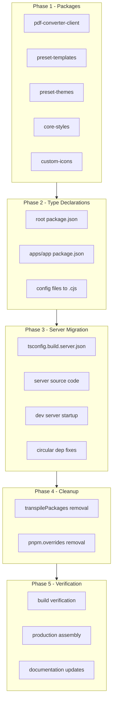
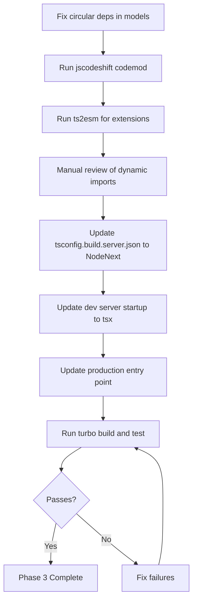
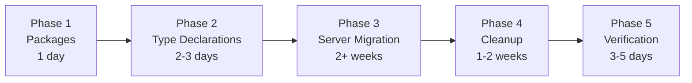

# Design Document: ESM Migration

## Overview

**Purpose**: This migration converts the GROWI monorepo from a hybrid CJS/ESM state to full native ESM, enabling ESM-only dependency imports, eliminating the 145-entry `transpilePackages` workaround, and aligning with Node.js 24's ESM-first ecosystem.

**Users**: GROWI maintainers and contributors benefit from a simplified module system, reduced build configuration, and access to modern ESM-only packages.

**Impact**: Changes the server build output from CommonJS to ESM, updates all `package.json` files to declare `"type": "module"`, and removes CJS compatibility workarounds across the monorepo.

### Goals

- Eliminate all CJS output from the build system (except explicitly marked `.cjs` config files)
- Enable native import of ESM-only dependencies (e.g., `@keycloak/keycloak-admin-client` v19+)
- Remove or significantly reduce `transpilePackages` entries in `next.config.ts`
- Remove `pnpm.overrides` that pin ESM-only packages to old CJS versions
- Maintain full build, test, lint, and production runtime functionality

### Non-Goals

- `apps/slackbot-proxy` migration (scheduled for deprecation)
- Refactoring the Crowi DI architecture beyond what is needed for ESM compatibility
- Upgrading dependencies with breaking API changes (e.g., `@keycloak/keycloak-admin-client` — ESM migration enables but does not include the upgrade)
- Converting migration files (`src/migrations/*.js`) to ESM — they remain CJS (enforced by placing `src/migrations/package.json` with `"type": "commonjs"`)

## Architecture

### Existing Architecture Analysis

The GROWI monorepo has a layered module system:

1. **Shared packages** (`packages/*`): 11/16 already ESM. 5 remaining are config-only changes (no CJS source code).
2. **Next.js frontend** (`apps/app` client): ESM-compatible via Turbopack. No changes needed to source code.
3. **Express server** (`apps/app` server): The critical CJS bottleneck. `tsconfig.build.server.json` outputs CommonJS. 82 files with `module.exports`, 179 `require()` across 57 files, 3 `__dirname` files. The heaviest concentration is `routes/apiv3/index.js` with 36 factory require+invoke patterns.
4. **Config files**: 6 CJS config files consumed by CLI tools (migrate-mongo, i18next, logger). Must remain CJS via `.cjs` extension.
5. **Production assembly**: `assemble-prod.sh` produces a flat `node_modules/` structure. ESM-compatible but needs verification.

Key constraints:
- The factory DI pattern (`require('./route')(crowi, app)`) is used in 45 calls across 2 central files: `routes/index.js` (9) and `routes/apiv3/index.js` (36)
- `models/user/index.js` imports service singletons (`configManager`, `aclService`) at module top level — a circular dependency risk under ESM
- `migrate-mongo` CLI does not support ESM migration files
- `tsx` replaces `ts-node` + `tsconfig-paths` for ESM dev server

### Architecture Pattern & Boundary Map



**Architecture Integration**:
- Selected pattern: Phased migration — each phase is independently testable and deployable
- Existing patterns preserved: Factory DI pattern (converted to ESM named exports + static imports), production assembly flow, Turbopack build pipeline
- New components: jscodeshift custom transform (temporary tooling, not shipped)
- Steering compliance: Maintains Turbopack externalisation rules, production assembly pattern, server-client boundary

### Technology Stack

| Layer | Choice / Version | Role in Feature | Notes |
|-------|------------------|-----------------|-------|
| Runtime | Node.js ^24 | ESM execution, `require(esm)` for CJS compat | `import.meta.dirname` available (21.2+) |
| Server Build | TypeScript `NodeNext` module | ESM output with `.js` extension enforcement | Overrides base `ESNext`/`Bundler` |
| Dev Server | tsx | ESM TypeScript execution with path alias support | Replaces ts-node + tsconfig-paths |
| Codemod | jscodeshift | Automated CJS→ESM source code conversion | Custom transform for factory DI pattern |
| Extension Fix | ts2esm | Add `.js` extensions to relative imports | Second-pass tool after codemod |
| Prod Entry | `--import` flag | ESM-compatible module preloading | Replaces `-r` flag |

## System Flows

### Phase 3: Server Code Migration Flow



> **Note**: The codemod must run BEFORE changing tsconfig to `NodeNext`, because `NodeNext` will reject `require()` calls in ESM context. Source code must already use ESM syntax when the output format changes.

## Requirements Traceability

| Requirement | Summary | Components | Interfaces | Flows |
|-------------|---------|------------|------------|-------|
| 1.1-1.4 | Shared packages ESM conversion | PackageConverter | package.json, tsconfig.json | Phase 1 |
| 2.1 | Server tsconfig ESM output | ServerBuildConfig | tsconfig.build.server.json | Phase 3 |
| 2.2-2.3 | Replace module.exports/require | CodemodTransform | jscodeshift custom transform | Phase 3 |
| 2.4 | Replace __dirname/__filename | CodemodTransform | import.meta.dirname | Phase 3 |
| 2.5 | Dynamic require → import() | DynamicImportMigration | await import() | Phase 3 |
| 2.6-2.7 | Server build and test pass | BuildVerification | turbo run build/test | Phase 3, 5 |
| 3.1-3.5 | transpilePackages cleanup | TranspilePackagesCleanup | next.config.ts | Phase 4 |
| 4.1-4.4 | pnpm overrides removal | OverridesCleanup | root package.json | Phase 4 |
| 5.1-5.4 | package.json type declarations | TypeDeclaration | package.json, .cjs renames | Phase 2 |
| 6.1-6.6 | Build and runtime verification | FullVerification | turbo, assemble-prod.sh | Phase 5 |
| 7.1-7.3 | Documentation updates | Documentation | package.json comments, steering | Phase 5 |

## Components and Interfaces

| Component | Domain/Layer | Intent | Req Coverage | Key Dependencies | Contracts |
|-----------|-------------|--------|--------------|-----------------|-----------|
| PackageConverter | Build Config | Add `"type": "module"` to remaining packages | 1.1-1.4 | package.json, tsconfig.json (P0) | Config |
| ServerBuildConfig | Build Config | Change server tsconfig to ESM output | 2.1, 5.1-5.4 | tsconfig.build.server.json (P0) | Config |
| CodemodTransform | Migration Tooling | Automated CJS→ESM source conversion | 2.2-2.5 | jscodeshift (P0), ts2esm (P1) | Service |
| CircularDepFix | Server Code | Fix model→service circular imports | 2.2 (prerequisite) | models/user, configManager (P0) | Service |
| DevServerConfig | Dev Tooling | Replace ts-node with tsx | 2.6 | tsx (P0) | Config |
| ProdEntryConfig | Runtime Config | Update production startup to ESM | 2.6, 6.4-6.5 | dotenv-flow (P0) | Config |
| ConfigFileRename | Build Config | Rename CJS config files to .cjs | 5.3 | migrate-mongo, i18next, logger (P1) | Config |
| TranspilePackagesCleanup | Build Config | Remove unnecessary transpilePackages entries | 3.1-3.5 | next.config.ts, Turbopack (P0) | Config |
| OverridesCleanup | Build Config | Remove CJS-pinning pnpm.overrides | 4.1-4.4 | pnpm, Node.js require(esm) (P1) | Config |
| FullVerification | QA | End-to-end build, test, runtime verification | 6.1-6.6 | turbo, assemble-prod.sh (P0) | - |

### Build Config

#### PackageConverter

| Field | Detail |
|-------|--------|
| Intent | Convert remaining 4-5 CJS packages to ESM declarations |
| Requirements | 1.1, 1.2, 1.3, 1.4 |

**Responsibilities & Constraints**
- Add `"type": "module"` to `package.json` for: `pdf-converter-client`, `preset-templates`, `preset-themes`, `core-styles`, `custom-icons`
- Update `tsconfig.json` to `"module": "ESNext"`, `"moduleResolution": "Bundler"` where applicable
- For `preset-themes` (Vite dual output): retain CJS output via Vite config until consumers are verified ESM-only
- Rename `orval.config.js` in `pdf-converter-client` to `orval.config.cjs`

**Dependencies**
- Inbound: None (independent operation)
- Outbound: All consumer packages must accept ESM imports (P1)

**Implementation Notes**
- These packages have zero CJS source code — conversion is config-only
- `core-styles` and `custom-icons` have no JS output (SCSS/SVG only); `"type": "module"` is for consistency
- Verify with `turbo run build --filter @growi/pdf-converter-client --filter @growi/preset-templates --filter @growi/preset-themes`

#### ServerBuildConfig

| Field | Detail |
|-------|--------|
| Intent | Change server TypeScript compilation from CJS to ESM output |
| Requirements | 2.1, 5.1, 5.2 |

**Responsibilities & Constraints**
- Update `tsconfig.build.server.json`:
  - `"module": "CommonJS"` → `"module": "NodeNext"`
  - `"moduleResolution": "Node"` → `"moduleResolution": "NodeNext"`
- Add `"type": "module"` to `apps/app/package.json` and root `package.json`
- The `ts-node` section in `tsconfig.json` must be updated or removed (replaced by tsx)

**Dependencies**
- Inbound: CodemodTransform must complete first — source code must use ESM syntax before changing output format (P0)
- Outbound: DevServerConfig, ProdEntryConfig depend on this (P0)

##### Config Contract

```typescript
// tsconfig.build.server.json changes
interface ServerTsConfig {
  compilerOptions: {
    module: "NodeNext";           // was: "CommonJS"
    moduleResolution: "NodeNext"; // was: "Node"
    // target, outDir, etc. remain unchanged
  };
}
```

#### ConfigFileRename

| Field | Detail |
|-------|--------|
| Intent | Rename CJS config files to `.cjs` to preserve CJS semantics under `"type": "module"` |
| Requirements | 5.3 |

**Responsibilities & Constraints**
- Rename files:
  - `config/migrate-mongo-config.js` → `.cjs`
  - `config/next-i18next.config.js` → `.cjs`
  - `config/i18next.config.js` → `.cjs`
  - `config/logger/config.dev.js` → `.cjs`
  - `config/logger/config.prod.js` → `.cjs`
  - `packages/pdf-converter-client/orval.config.js` → `.cjs`
- Update all references to renamed files (import paths, CLI args, nodemon config)
- Add `src/migrations/package.json` with `{ "type": "commonjs" }` to preserve CJS semantics for 60+ migration files without renaming each to `.cjs`

**Dependencies**
- Outbound: migrate-mongo CLI, i18next, logger init code reference these files (P1)

**Implementation Notes**
- `next.config.prod.cjs` already has `.cjs` extension — no change needed
- `next.config.ts` (build-time config) is TypeScript and handled by Turbopack — no change needed
- `migrate-mongo-config.js` uses conditional `require()` for dev/prod — keep as CJS; the conditional logic works identically with `.cjs` extension
- Update `package.json` `migrate` script if it references config by name
- Migration files: placing a `package.json` with `"type": "commonjs"` in `src/migrations/` is preferred over renaming 60+ files to `.cjs` — migrate-mongo CLI loads them via `require()` and this ensures compatibility when `apps/app/package.json` declares `"type": "module"`

### Migration Tooling

#### CodemodTransform

| Field | Detail |
|-------|--------|
| Intent | Automated conversion of all CJS patterns in server source code to ESM |
| Requirements | 2.2, 2.3, 2.4, 2.5 |

**Responsibilities & Constraints**
- Convert 4 distinct patterns:
  1. `module.exports = (crowi, app) => { ... }` → `export default function createXxxRoutes(crowi, app) { ... }` (82 files)
  2. `const x = require('module')` → `import x from 'module'` (179 occurrences across 57 files)
  3. `require('./page')(crowi, app)` → `import createPageRoutes from './page.js'; createPageRoutes(crowi, app)` (45 calls: 9 in `routes/index.js`, 36 in `routes/apiv3/index.js`)
  4. `__dirname` → `import.meta.dirname` (3 files)
- Must not break existing functionality — transform is mechanical, not behavioral
- Must add `.js` extensions to all relative imports

**Dependencies**
- External: jscodeshift (P0) — AST transformation framework
- External: ts2esm (P1) — extension fixing pass

**Contracts**: Service [ x ]

##### Service Interface

```typescript
// jscodeshift custom transform (conceptual interface)
interface CjsToEsmTransform {
  // Transforms a single source file from CJS to ESM patterns
  transform(
    fileInfo: { path: string; source: string },
    api: { jscodeshift: JSCodeshift },
    options: TransformOptions,
  ): string;
}

interface TransformOptions {
  // Which patterns to transform
  patterns: Array<"static-require" | "module-exports" | "require-invoke" | "dirname">;
  // Whether to add .js extensions
  addExtensions: boolean;
}
```

**Implementation Notes**
- The custom jscodeshift transform (~50-100 lines) handles all 4 patterns in a single pass
- For Pattern 3 (`require('./page')(crowi, app)`), the transform converts to static import + factory call (not dynamic `import()`) because the circular dependency analysis shows this is safe — `crowi` is passed as a runtime parameter, not imported at module level
- **`routes/apiv3/index.js` is the largest single target** (36 factory require+invoke patterns). Static imports are safe here because each route module is a leaf — they receive `crowi` as a parameter and do not import back to crowi/index.ts. No file splitting is needed; the 36 imports at file top are acceptable for a route registry file.
- `routes/index.js` has 9 factory patterns and follows the same static import strategy
- For truly dynamic requires with runtime-computed paths (Pattern D from circular dep analysis), convert to `await import(modulePath)` — these are in `s2s-messaging` and `file-uploader` only
- Run ts2esm as a second pass to fix any remaining extensionless imports
- Validate with `turbo run lint --filter @growi/app` after transform

### Server Code

#### CircularDepFix

| Field | Detail |
|-------|--------|
| Intent | Break circular dependency chains between models and services before ESM migration |
| Requirements | 2.2 (prerequisite for safe ESM loading) |

**Responsibilities & Constraints**
- Fix `models/user/index.js` lines 13-14: replace top-level `import { configManager }` and `import { aclService }` with lazy access patterns
- Ensure `configManager` dynamic import of `models/config` remains safe (already uses `await import()`)
- Do NOT restructure the entire DI architecture — minimal changes to unblock ESM

**Dependencies**
- Inbound: Must complete before CodemodTransform runs (P0)
- Outbound: models/user, service/config-manager, service/acl (P0)

**Contracts**: Service [ x ]

##### Service Interface

```typescript
// Lazy service access pattern for models
// BEFORE (circular risk):
// import { configManager } from '../../service/config-manager';
// const config = configManager.getConfig();

// AFTER (lazy access):
// Access via crowi instance passed to model factory, or lazy getter
interface LazyServiceAccess {
  // Option A: Access via crowi parameter (preferred — already used in model factories)
  getConfigManager(crowi: Crowi): ConfigManager;

  // Option B: Lazy import (fallback for non-factory contexts)
  getConfigManagerLazy(): Promise<ConfigManager>;
}
```

**Implementation Notes**
- The preferred fix is to use the `crowi` parameter that is already passed to most model factories — extract `configManager` from `crowi` at runtime instead of importing at module level
- For `models/user/index.js` specifically: the module is a Mongoose schema definition that receives `crowi` in its factory function. Move the `configManager`/`aclService` usage into the factory body.
- Risk: If any model-level code accesses services outside the factory function (e.g., in schema middleware), it must use lazy `await import()` instead

### Dev Tooling

#### DevServerConfig

| Field | Detail |
|-------|--------|
| Intent | Replace CJS-only dev server startup with ESM-compatible tsx |
| Requirements | 2.6 |

**Responsibilities & Constraints**
- Replace in `package.json` scripts:
  - `"ts-node": "node -r ts-node/register/transpile-only -r tsconfig-paths/register -r dotenv-flow/config"`
  - → `"ts-node": "node --import tsx --import dotenv-flow/config"`
- Remove `ts-node` section from `apps/app/tsconfig.json` (the CJS override section)
- Verify nodemon config works with tsx

**Dependencies**
- External: tsx (P0) — must be added to devDependencies
- External: dotenv-flow (P0) — must support `--import` flag (v4+)

**Implementation Notes**
- tsx handles tsconfig `paths` aliases natively — no `tsconfig-paths` needed
- `ts-node` and `tsconfig-paths` can be removed from devDependencies after migration
- Nodemon uses the `ts-node` script indirectly — verify the dev flow end-to-end

### Runtime Config

#### ProdEntryConfig

| Field | Detail |
|-------|--------|
| Intent | Update production server startup for ESM module loading |
| Requirements | 2.6, 6.4, 6.5 |

**Responsibilities & Constraints**
- Update production server command:
  - `node -r dotenv-flow/config dist/server/app.js`
  - → `node --import dotenv-flow/config dist/server/app.js`
- Update `assemble-prod.sh` if it references the startup command
- Verify the compiled ESM output at `dist/server/app.js` starts correctly

**Dependencies**
- Inbound: ServerBuildConfig must be complete (P0)
- External: dotenv-flow v4+ (P0)

**Implementation Notes**
- The `--import` flag is Node.js's ESM equivalent of `-r` for preloading
- `assemble-prod.sh` does NOT contain the startup command (that's in `Dockerfile`/`docker-compose.yml`) — verify those files
- `next.config.prod.cjs` is installed by `assemble-prod.sh` and stays as-is (already `.cjs`)

### Build Config (Cleanup)

#### TranspilePackagesCleanup

| Field | Detail |
|-------|--------|
| Intent | Remove transpilePackages entries that exist solely for CJS/ESM compatibility |
| Requirements | 3.1, 3.2, 3.3, 3.4, 3.5 |

**Responsibilities & Constraints**
- Evaluate 145 entries in `getTranspilePackages()`:
  - 39 hardcoded entries (unified/remark/rehype ecosystem)
  - ~99 dynamic entries via `listPrefixedPackages()` for remark-/rehype-/hast-/mdast-/micromark-/unist-
  - @growi/* packages
- Remove entries one at a time (or in logical groups) with build + runtime verification
- Retain `experimentalOptimizePackageImports` (11 entries) — these are optimizations, not CJS workarounds

**Dependencies**
- Inbound: Phase 3 (server ESM migration) must be complete (P0)
- Outbound: next.config.ts, Turbopack SSR resolution (P0)

**Implementation Notes**
- Start with @growi/* packages — these are first-party and easiest to verify
- For unified ecosystem packages: test removing the entire `listPrefixedPackages()` block at once — if Turbopack handles ESM externals correctly, all should be removable
- If removing an entry causes `ERR_MODULE_NOT_FOUND` or `ERR_REQUIRE_ESM`, retain it and document
- Turbopack's ESM externalization behavior may vary — empirical testing is required

#### OverridesCleanup

| Field | Detail |
|-------|--------|
| Intent | Remove pnpm.overrides that pin ESM-only packages to CJS versions |
| Requirements | 4.1, 4.2, 4.3, 4.4 |

**Responsibilities & Constraints**
- Evaluate overrides for `@lykmapipo/common` transitive dependencies:
  - `flat` pinned to 5.0.2 (CJS) — latest is 6.x (ESM-only)
  - `mime` pinned to 3.0.0 (CJS) — latest is 4.x (ESM-only)
  - `parse-json` pinned to 5.2.0 (CJS) — latest is 7.x (ESM-only)
- Node.js 24's `require(esm)` should allow `@lykmapipo/common` (CJS) to `require()` ESM versions of these packages

**Dependencies**
- External: Node.js 24 `require(esm)` behavior (P1)
- External: `@lykmapipo/common` internals (P2)

**Implementation Notes**
- Remove one override at a time: `pnpm install` → `turbo run build` → runtime test
- If `require(esm)` does not work for a specific package (e.g., uses top-level await), retain the override and document
- `flat` v6, `mime` v4, `parse-json` v7 do NOT use top-level await — removal should succeed

## Error Handling

### Error Strategy

Migration errors fall into two categories:
1. **Build-time errors**: TypeScript compilation failures, missing module extensions, unresolved imports — caught by `turbo run build` and `turbo run lint`
2. **Runtime errors**: `ERR_MODULE_NOT_FOUND`, `ERR_REQUIRE_ESM`, circular dependency deadlocks — caught by server startup and integration tests

### Error Categories and Responses

**Build Errors** (Phase 3):
- Missing `.js` extensions → ts2esm auto-fix, then `tsc` catches remaining
- `require()` in ESM context → jscodeshift codemod, then eslint `import/no-commonjs` enforcement
- Circular dependency `ReferenceError` → CircularDepFix component addresses

**Runtime Errors** (Phase 4-5):
- `ERR_MODULE_NOT_FOUND` after transpilePackages removal → retain the entry, document reason
- `ERR_REQUIRE_ESM` in CJS third-party code → rely on Node.js 24 `require(esm)` or retain override
- Production assembly failure → `assemble-prod.sh` end-to-end test with symlink verification

### Monitoring

- Each phase gates on `turbo run build && turbo run lint && turbo run test` passing
- Production assembly verified with `assemble-prod.sh` + manual server startup check
- CI pipeline runs full verification after each phase PR merges

## Testing Strategy

### Build Verification Tests (per phase)
- `turbo run build` for affected packages succeeds
- `turbo run lint` passes without new warnings
- `turbo run test` passes without new failures
- No `require()` or `module.exports` patterns remain in converted files (eslint check)

### Runtime Verification Tests (Phase 5)
- Express server starts and responds to HTTP requests
- Next.js SSR renders pages correctly
- WebSocket connections (y-websocket) function correctly
- `assemble-prod.sh` produces a working artifact
- Production startup command (`node --import dotenv-flow/config dist/server/app.js`) succeeds

### Codemod Validation Tests
- Run jscodeshift transform on sample files and verify output matches expected ESM
- Verify all 4 patterns (static require, module.exports, require+invoke, __dirname) are converted correctly
- Verify `.js` extensions are added to all relative imports

## Migration Strategy



### Phase 1: Remaining Packages (Effort: S, Risk: Low)
- Add `"type": "module"` to 4-5 remaining packages
- Rename `orval.config.js` → `.cjs`
- Verify builds pass
- **Rollback**: Revert `package.json` changes

### Phase 2: Type Declarations + Config Renames (Effort: M, Risk: Medium)
- Add `"type": "module"` to root and `apps/app` `package.json`
- Rename 6 CJS config files to `.cjs`
- Update all references to renamed files
- **Rollback**: Revert renames and `package.json` changes

### Phase 3: Server Code Migration (Effort: XL, Risk: High)
1. Fix circular dependencies in `models/user/index.js` (move top-level service imports into factory body)
2. Run jscodeshift codemod on all server source files (82 files with `module.exports`, 179 `require()`, 45 factory require+invoke)
3. Run ts2esm for `.js` extension fixing
4. Manual review of dynamic import patterns (`s2s-messaging`, `file-uploader`)
5. Update `tsconfig.build.server.json` to `NodeNext` (AFTER codemod — `NodeNext` rejects `require()` in ESM)
6. Replace `ts-node` with `tsx` in dev scripts
7. Update production entry point to `--import`
8. Full build + test + runtime verification
- **Rollback**: Revert all source changes (git); restore tsconfig

### Phase 4: Cleanup (Effort: L, Risk: Medium)
- Remove transpilePackages entries (incremental, with verification per batch)
- Remove pnpm.overrides (one at a time, with verification)
- **Rollback**: Re-add removed entries

### Phase 5: Verification + Documentation (Effort: M, Risk: Low)
- Full `turbo run build && turbo run lint && turbo run test`
- Production assembly end-to-end test
- Update steering docs, package.json comments, migration notes
- **Rollback**: N/A (documentation only)
