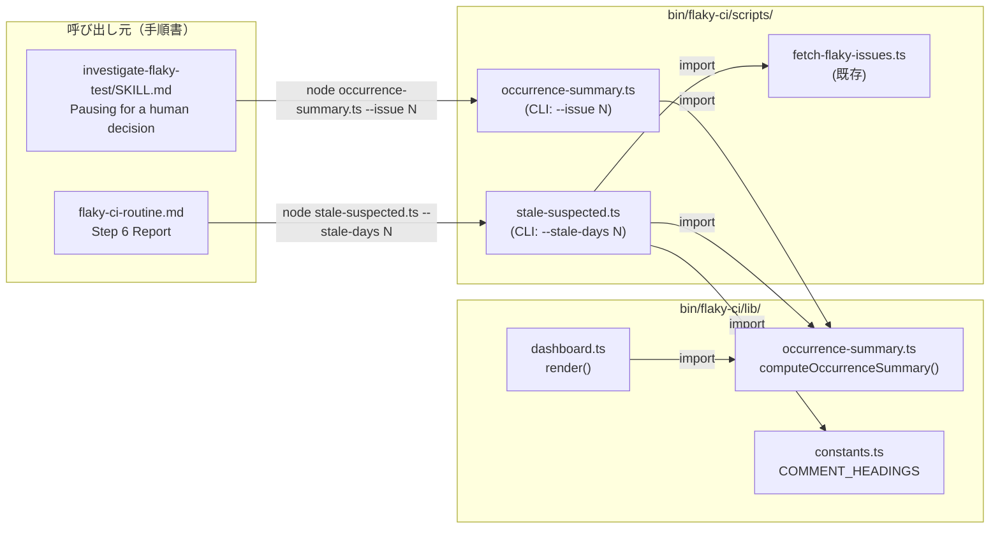
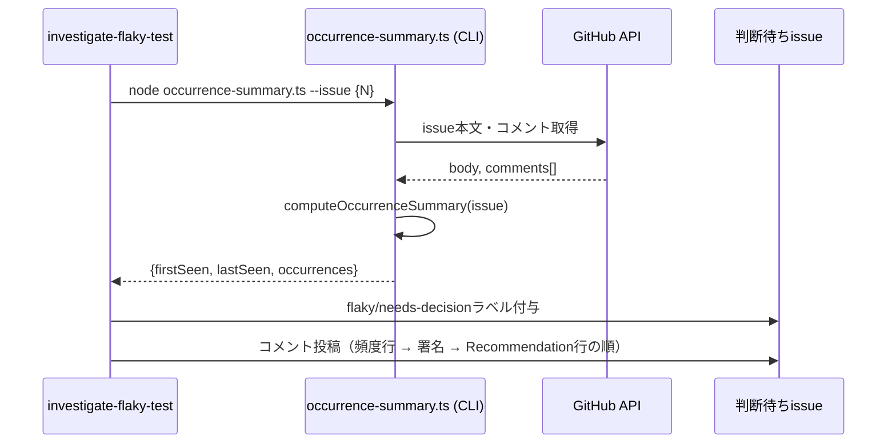
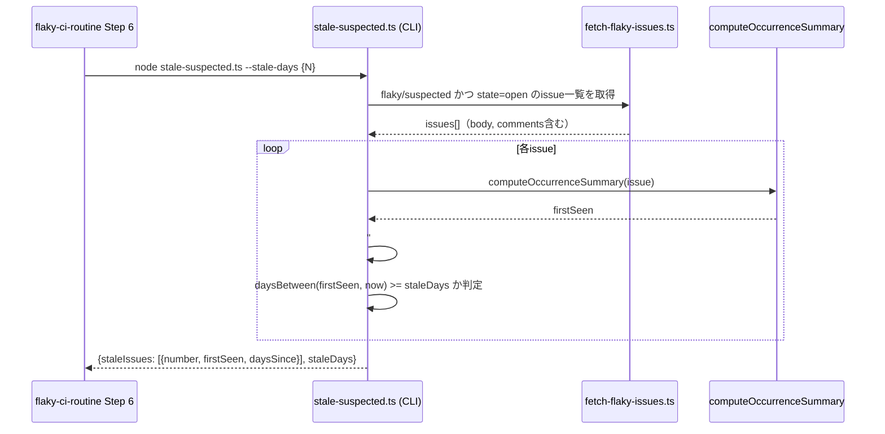

# Design Document

## Overview

**Purpose**: `flaky-ci-routine` が人の判断を求めて止まる箇所（`flaky/needs-decision`）と、実行のたびに出す報告に、既に計算済みの発生頻度データを追加で表示する。GROWI のメンテナーが判断する瞬間に、別issue（ダッシュボード #11720）を開かずに頻度を把握できるようにする。

**Users**: `flaky/needs-decision` issue の判断を行う GROWI メンテナー、および `/flaky-ci-routine` の実行結果を確認する運用担当者。

**Impact**: `investigate-flaky-test` の一時停止コメントに1行追加し、`flaky-ci-routine.md` Step 6 の報告項目を1つ追加する。既存の確信度tier（observing/suspected/confirmed）の意味・自動クローズ対象範囲は変更しない。

### Goals
- 判断待ちコメントに、そのissueの発生回数・初回観測日・直近観測日を表示する
- 未測定のまま滞留している `flaky/suspected` issue を、毎回の実行報告で可視化する
- 頻度計算ロジックを1箇所に保ち、ダッシュボードと判断待ちコメントの両方がそれを参照する

### Non-Goals
- 新しいラベルの追加、または tier ラベルの意味変更
- `flaky/suspected` / `flaky/confirmed` の自動クローズ化
- issue タイトルの書式変更
- ラベル運用の不具合修正（#11864, #11858 は本specの着手前に直接対応済み）

## Boundary Commitments

### This Spec Owns
- `bin/flaky-ci/lib/dashboard.ts` から発生頻度の計算ロジックを切り出し、独立した公開関数として提供すること
- 1件のissue番号を受け取り、その発生頻度を計算するCLIスクリプト
- `flaky/suspected` のまま `--stale-days` を超えて未測定のissueを列挙するCLIスクリプト
- `investigate-flaky-test/SKILL.md` の「Pausing for a human decision」テンプレートへの頻度行追加
- `flaky-ci-routine.md` Step 6 レポート項目への「Stale suspected」追加

### Out of Boundary
- ダッシュボード（`#11720`）自体のレンダリング仕様変更（列の追加・削除等） — 既存の出力形式は変えない
- `flaky/suspected` を自動でクローズ・ラベル変更する処理 — 可視化のみ
- `--stale-days` 以外の新しい設定値の追加

### Allowed Dependencies
- `bin/flaky-ci/lib/gh.ts`（`GhApi`, `createGhApi`）
- `bin/flaky-ci/lib/output.ts`（`emit`, `ScriptResult`, `UNAVAILABLE`）
- `bin/flaky-ci/lib/time.ts`（`daysBetween`）
- `bin/flaky-ci/lib/constants.ts`（`COMMENT_HEADINGS.reproResult`, `LABELS.suspected`）
- `bin/flaky-ci/scripts/fetch-flaky-issues.ts` が返すデータ形状（issue一覧の取得方法）

### Revalidation Triggers
- `- Recommendation:` 行が「コメントの最後の非空行」であるという既存契約（`flaky-ci-routine.md` Shared constants）が変わった場合、頻度行の挿入位置を再確認する
- `COMMENT_HEADINGS.reproResult`（`### Repro result`）の文字列やコメント発行元が変わった場合、未測定判定が壊れるため再確認する
- `--stale-days` の既定値や意味が変わった場合、Stale suspected の閾値もその意味に追従するか個別のspecで見直す
- `DashboardIssue` 型（`number`/`title`/`labels`/`body`/`comments`）の形状が変わった場合、`computeOccurrenceSummary` の入力契約を再確認する

## Architecture

### Existing Architecture Analysis
`bin/flaky-ci/` は「`lib/` に純粋関数、`scripts/` にそれをGitHub APIへ繋ぐCLI」という一貫した構成を既に持つ（例: `read-repro-result.ts`, `awaiting-decision-rows.ts` はいずれも `lib/gh.ts` の `GhApi` を受け取り、`lib/output.ts` の `emit`/`ScriptResult` でJSON出力する）。本specはこのパターンをそのまま踏襲し、新しい構成方針を持ち込まない。

### Architecture Pattern & Boundary Map



**Architecture Integration**:
- 選定パターン: 既存の lib/scripts 分離パターンをそのまま継続
- ドメイン境界: 「頻度計算」（`occurrence-summary.ts`）と「未測定滞留の判定」（`stale-suspected.ts`）を別ファイルに分離。前者は後者の内部でも使われる（滞留issueのfirstSeen計算に流用）
- 既存パターンの維持: `GhApi`注入・`emit`/`ScriptResult`出力・`--issue`繰り返し引数（`awaiting-decision-rows.ts`と同型）
- 新規コンポーネントの理由: `dashboard.ts`は「ダッシュボード描画」という単一責任を持つファイルであり、頻度計算という別の関心事を公開APIとして持たせると責任が混ざる（coding-style.md「単一責任」原則）

### Technology Stack

| Layer | Choice / Version | Role in Feature | Notes |
|-------|------------------|-----------------|-------|
| Runtime | Node.js（既存、`node --import ...` 実行） | CLIスクリプトの実行 | `bin/flaky-ci/`の既存スクリプトと同一 |
| 言語 | TypeScript（Biome + Vitest） | 全ファイル | 新規packageへの依存追加なし |
| テスト | Vitest | 単体テスト | 既存の`*.spec.ts`パターンを継続 |

## File Structure Plan

### Directory Structure
```
bin/flaky-ci/
├── lib/
│   ├── occurrence-summary.ts       # 新規: computeOccurrenceSummary()（dashboard.tsから抽出）
│   ├── occurrence-summary.spec.ts  # 新規: 抽出したロジックの単体テスト（dashboard.spec.tsから移設）
│   └── dashboard.ts                # 変更: 独自の日付計算を削除し occurrence-summary.ts をimport
└── scripts/
    ├── occurrence-summary.ts       # 新規: CLI（--issue N repeatable）、pauseコメント用
    ├── occurrence-summary.spec.ts  # 新規
    ├── stale-suspected.ts          # 新規: CLI（--stale-days N）、Step 6用
    └── stale-suspected.spec.ts     # 新規
```

### Modified Files
- `bin/flaky-ci/lib/dashboard.ts` — `observationDates`/`countOccurrences`/日付parsing関連の非公開関数を削除し、`occurrence-summary.ts`の`computeOccurrenceSummary`をimportして`toTableRow`から呼ぶ形に書き換え。出力形式（ダッシュボードのMarkdown）は変更しない。
- `bin/flaky-ci/lib/dashboard.spec.ts` — 抽出した計算ロジックの単体テストケースを`occurrence-summary.spec.ts`へ移設し、こちらは既存の描画テストのみ残す。
- `.claude/skills/investigate-flaky-test/SKILL.md` — 「Pausing for a human decision」節の手順2（コメント投稿）に、`occurrence-summary.ts --issue {N}`を実行し、その結果を`- Recommendation:`行より前の1行として含める指示を追加。
- `.claude/commands/flaky-ci-routine.md` — Step 6 レポートの「これら五つを毎回報告する」リストに、6つ目として「Stale suspected」を追加。`stale-suspected.ts --stale-days ${STALE_DAYS}`（Step 4で既に読んだ値と同じ）を実行し、対象issue番号を列挙、0件なら明示的に「none」と報告する指示を追加。
- `.claude/skills/detect-flaky-ci/SKILL.md`（該当があれば） — 変更なし。この spec は検知ロジックに触れない。

## System Flows

### 判断待ちコメント投稿時の頻度行挿入



頻度行は署名（`_Generated by [Claude Code]...`）より前に置く。`- Recommendation:`行を「コメントの最後の非空行」とする既存契約（Revalidation Trigger参照）を壊さないため。

### Step 6 の Stale suspected 報告



自動クローズは行わない（Requirement 2.2）。Routineはこの結果をStep 6のレポート本文にそのまま列挙するのみ。

## Requirements Traceability

| Requirement | Summary | Components | Interfaces | Flows |
|-------------|---------|------------|------------|-------|
| 1.1 | 判断待ちコメントに頻度を1行含める | `occurrence-summary.ts`（script）, investigate-flaky-test SKILL.md | Service Interface（`computeOccurrenceSummary`）, CLI出力 | 判断待ちコメント投稿時の頻度行挿入 |
| 1.2 | 既存の計算結果を再利用し新規実装しない | `occurrence-summary.ts`（lib）, `dashboard.ts` | Service Interface | — |
| 1.3 | 観測日が読めない場合は値不明を明示 | `occurrence-summary.ts`（lib/script） | Service Interface | — |
| 2.1 | 未測定suspectedを一覧して報告 | `stale-suspected.ts`（script） | CLI出力 | Step 6 の Stale suspected 報告 |
| 2.2 | 自動クローズしない | `stale-suspected.ts`（script） | — | Step 6 の Stale suspected 報告 |
| 2.3 | 0件でも明示的に報告する | `flaky-ci-routine.md` Step 6の手順 | — | Step 6 の Stale suspected 報告 |
| 2.4 | 自動クローズ対象外という既存設計を変更しない | `stale-suspected.ts`（script） | — | — |

## Components and Interfaces

| Component | Domain/Layer | Intent | Req Coverage | Key Dependencies (P0/P1) | Contracts |
|-----------|--------------|--------|---------------|---------------------------|-----------|
| `computeOccurrenceSummary` | lib | issueの発生頻度を計算する純粋関数 | 1.1, 1.2, 1.3 | なし（純粋関数） | Service |
| `occurrence-summary.ts`（CLI） | scripts | 1件のissueの頻度をJSON出力する | 1.1, 1.2, 1.3 | `GhApi`(P0), `computeOccurrenceSummary`(P0) | Batch |
| `stale-suspected.ts`（CLI） | scripts | 未測定のまま滞留したsuspected issueを列挙する | 2.1, 2.2, 2.3, 2.4 | `fetch-flaky-issues.ts`(P0), `computeOccurrenceSummary`(P0), `COMMENT_HEADINGS`(P0) | Batch |

### lib

#### computeOccurrenceSummary

| Field | Detail |
|-------|--------|
| Intent | issueのbody・コメントから発生頻度（回数・初回観測日・直近観測日）を計算する純粋関数 |
| Requirements | 1.1, 1.2, 1.3 |

**Responsibilities & Constraints**
- `dashboard.ts`が現在内部に持つ計算（`observationDates`/`countOccurrences`）の唯一の実装として、`dashboard.ts`とscripts側の両方から呼ばれる
- 入力の`DashboardIssue`型（`number`/`title`/`labels`/`body`/`comments`）を変更しない
- ネットワークI/Oを行わない（純粋関数のまま）

**Dependencies**
- Inbound: `bin/flaky-ci/lib/dashboard.ts`（P0）, `bin/flaky-ci/scripts/occurrence-summary.ts`（P0）, `bin/flaky-ci/scripts/stale-suspected.ts`（P0）
- Outbound: なし

**Contracts**: Service [x]

##### Service Interface
```typescript
export type OccurrenceSummary = {
  readonly firstSeen: string | null;
  readonly lastSeen: string | null;
  readonly occurrences: number;
};

export const computeOccurrenceSummary = (
  issue: DashboardIssue,
): OccurrenceSummary => { /* ... */ };
```
- Preconditions: `issue.body`, `issue.comments`は`fetch-flaky-issues.ts`または同等の取得元から得た未加工の文字列
- Postconditions: 観測日が1件も読めない場合は`{firstSeen: null, lastSeen: null, occurrences: 0}`を返す（呼び出し側が「不明」として表示する責任を持つ）
- Invariants: `dashboard.ts`のレンダリング結果（既存の出力形式）は、抽出前後で一字一句変わらない

**Implementation Notes**
- Integration: `dashboard.ts`の`toTableRow`はこの関数を呼ぶだけに書き換える
- Validation: 抽出前後で`dashboard.spec.ts`の既存ゴールデン出力テストが変わらないことを確認する
- Risks: 日付parsing周りの正規表現（`DATE_LINE`等）を移動する際の取りこぼし

### scripts

#### occurrence-summary.ts（CLI）

| Field | Detail |
|-------|--------|
| Intent | 1件のissue番号を受け取り、その発生頻度をJSONで出力する |
| Requirements | 1.1, 1.2, 1.3 |

**Responsibilities & Constraints**
- `--issue <number>`を1件受け取る（`awaiting-decision-rows.ts`と異なり、pauseコメント投稿の直前に1件だけ呼ばれる用途のため複数指定は不要）
- issueの取得は`GhApi`経由。body・コメント本文を取得しそのまま`computeOccurrenceSummary`へ渡す

**Dependencies**
- Inbound: `investigate-flaky-test/SKILL.md`の手順（gh呼び出し元）
- Outbound: `bin/flaky-ci/lib/gh.ts`（P0）, `bin/flaky-ci/lib/occurrence-summary.ts`（P0）

**Contracts**: Batch [x]

##### Batch / Job Contract
- Trigger: `investigate-flaky-test`が判断待ちコメントを投稿する直前に手動起動（`node occurrence-summary.ts --issue {N}`）
- Input / validation: `--issue`が無ければ exit 2（既存スクリプト群と同じ規約）
- Output / destination: 標準出力へJSON。`{firstSeen, lastSeen, occurrences}`
- Idempotency & recovery: 読み取り専用、副作用なし。失敗時はexit非0で`emit`の規約に従いreasonを報告する

**Implementation Notes**
- Integration: 呼び出し元（`investigate-flaky-test/SKILL.md`）は出力を1行のプレーンテキストに整形してコメント本文に埋め込む（整形フォーマットは手順書側の責務）
- Risks: issueが見つからない・アクセスできない場合の失敗表現は既存スクリプト（`GhError`）の規約に従う

#### stale-suspected.ts（CLI）

| Field | Detail |
|-------|--------|
| Intent | `flaky/suspected`のまま`--stale-days`を超えて未測定のissueを列挙する |
| Requirements | 2.1, 2.2, 2.3, 2.4 |

**Responsibilities & Constraints**
- 対象は state=open かつ `flaky/suspected` ラベルを持つissueのみ（`flaky/confirmed`や`flaky/observing`は対象外）
- 「未測定」の判定は、いずれのコメントにも`COMMENT_HEADINGS.reproResult`（`### Repro result`）が含まれないこと
- 自動クローズ・ラベル変更は一切行わない（読み取り専用）

**Dependencies**
- Inbound: `flaky-ci-routine.md` Step 6
- Outbound: `bin/flaky-ci/scripts/fetch-flaky-issues.ts`のロジック（P0, issue一覧取得）, `bin/flaky-ci/lib/occurrence-summary.ts`（P0）, `bin/flaky-ci/lib/constants.ts`（P0, `COMMENT_HEADINGS`, `LABELS.suspected`）, `bin/flaky-ci/lib/time.ts`（P1, `daysBetween`）

**Contracts**: Batch [x]

##### Batch / Job Contract
- Trigger: `flaky-ci-routine.md` Step 6 のレポート作成時に手動起動（`node stale-suspected.ts --stale-days {N}`、Step 4で既に確定した`STALE_DAYS`をそのまま渡す）
- Input / validation: `--stale-days`省略時は`14`（既存のStep 4既定値と同一）
- Output / destination: 標準出力へJSON。`{staleDays, staleIssues: [{number, firstSeen, daysSince}]}`（`staleIssues`が空配列でも正常終了）
- Idempotency & recovery: 読み取り専用、副作用なし

**Implementation Notes**
- Integration: `flaky-ci-routine.md`のStep 6手順は、この出力をそのまま「Stale suspected」の行として整形する。0件時は明示的に「none」と書く（既存の五項目と同じ規約）
- Risks: `flaky/suspected`かつ`flaky/confirmed`が同時に付いた不整合issue（#11864で発見・修正済みの種類のバグ）が将来再発した場合、この判定にどう影響するかは実装時に確認する（`LABELS.suspected`を含むかどうかで判定するため、tier重複があっても誤って除外されることはない）

## Data Models

新しい永続データストアは導入しない。全てGitHub Issue（本文・コメント・ラベル）から都度計算する既存パターンを踏襲する。

### Logical Data Model
- `OccurrenceSummary`（新規、`lib/occurrence-summary.ts`）: `{firstSeen: string | null, lastSeen: string | null, occurrences: number}` — 既存の`DashboardIssue`から導出される値オブジェクト、永続化しない
- `stale-suspected.ts`の出力: `{staleDays: number, staleIssues: readonly {number: number, firstSeen: string, daysSince: number}[]}`

## Error Handling

### Error Strategy
既存の`bin/flaky-ci/`全体の規約（`lib/output.ts`の`ScriptResult`、`GhError`）をそのまま踏襲する。新しいエラー分類は導入しない。

### Error Categories and Responses
- **GitHub APIアクセス失敗**（`occurrence-summary.ts`, `stale-suspected.ts`）: `GhError`を捕捉し、exit非0＋`reason`を`emit`経由で報告。判断待ちコメントの投稿自体は失敗せず、頻度行を省略して続行する（Requirement 1.3の「値不明」表示に倒す）
- **観測日が1件も読めない**（`computeOccurrenceSummary`）: 例外を投げず`{firstSeen: null, lastSeen: null, occurrences: 0}`を返す。呼び出し側が「不明」と表示する

### Monitoring
`flaky-ci-routine.md` Step 6 の既存の「Script failures」項目がこの2スクリプトの非ゼロ終了も自動的に拾う（既存の規約通り、スクリプト名と失敗理由を1行で報告）。新しい監視の仕組みは追加しない。

## Testing Strategy

- **Unit Tests**:
  - `occurrence-summary.spec.ts`（lib）: 観測日0件/1件/複数件、`### Additional observation`と`### Backfilled observation`混在時の集計、`dashboard.spec.ts`から移設した既存ケース一式
  - `occurrence-summary.spec.ts`（script）: `--issue`省略時のexit 2、正常系のJSON出力形状
  - `stale-suspected.spec.ts`（script）: 閾値未満/以上の境界、`### Repro result`ありなし、`flaky/suspected`以外のラベルが対象から除外されること、0件時の空配列出力
- **Integration Tests**:
  - `dashboard.spec.ts`: 抽出後も既存のゴールデン出力（Markdown文字列）が一字一句変わらないことを確認する回帰テスト
- **Manual/E2E**（実CIでの確認）:
  - `investigate-flaky-test`が実際に一時停止する経路で、頻度行が`- Recommendation:`行より前に出力されることを1件確認する
  - `flaky-ci-routine.md`のStep 6実行で「Stale suspected」の行が0件・1件以上の両方のケースで正しく出力されることを確認する
